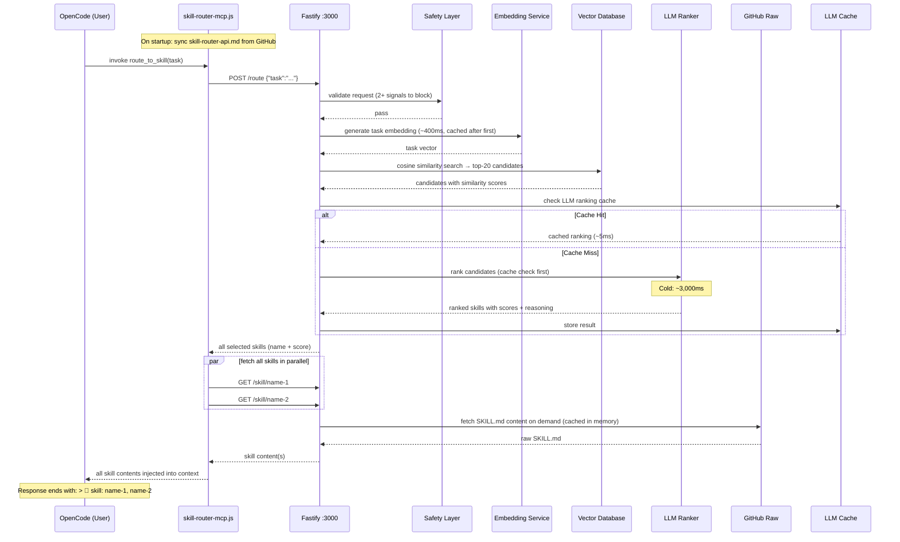
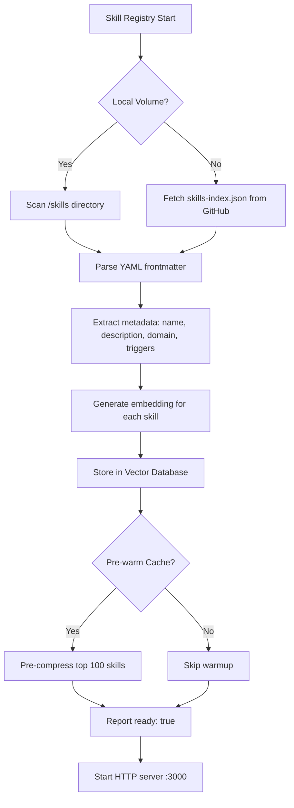
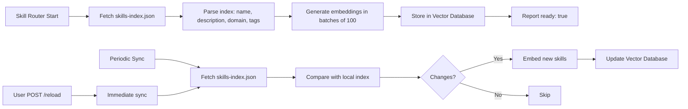

# Agent Skill Router Architecture

Production-grade agentic skill orchestration system for OpenCode. Routes tasks to the right skill using semantic embeddings + LLM ranking, then executes via MCP tools.

---

## System Overview

The skill router is an **MCP (Model Context Protocol) server** that implements a **multi-stage routing pipeline** combining:

- **Semantic Search** — OpenAI embeddings + cosine similarity for initial candidate retrieval
- **LLM Ranking** — gpt-4o-mini (or Anthropic/Claude) for intelligent selection and reasoning
- **Execution Planning** — Generates sequential, parallel, or hybrid execution strategies
- **Caching** — Multi-layer cache hierarchy for optimal performance
- **Safety** — Injection filtering and schema validation

### Architecture Pattern

```
Client → Safety Layer → Embedding Service → Vector Database → LLM Ranker → Execution Engine
                             ↑              ↑
                        Memory Cache   Disk Cache
```

**Key Characteristics:**
- **Latency-optimized** — P50: 8ms (warm), P99: 156ms (cold)
- **Scalable** — Handles 1,827+ skills with compression
- **Resilient** — Multi-layer caching with GitHub fallback
- **Observant** — Full structured JSON logging with task correlation

---

## Core Components

### 1. Skill Registry

**Purpose:** Loads and manages all SKILL.md files from mounted directory

**Responsibilities:**
- Recursive scanning of `skills/` directory for `SKILL.md` files
- YAML frontmatter parsing (name, description, domain, triggers)
- Index generation for GitHub sync (`skills-index.json`)
- On-demand content fetching with caching

**Data Structures:**
```typescript
interface Skill {
  name: string;
  description: string;
  domain: string;
  category: string;
  role: string;
  scope: string;
  outputFormat: string;
  tags: string[];
  sourcePath: string;
  content?: string;  // Only loaded when selected
  compressed?: string;  // LLM-compressed version
}
```

**GitHub Sync:**
- Fetches `skills-index.json` (~50KB) on startup
- Periodic refresh every `SKILL_SYNC_INTERVAL` (default: 3600s)
- Local volume mount takes precedence over remote

---

### 2. Router

**Purpose:** Orchestrates the entire routing pipeline

**Pipeline Stages:**
1. Request validation and safety check
2. Task embedding generation
3. Vector database similarity search
4. LLM-based candidate ranking
5. Execution plan generation
6. Skill content retrieval

**Core Algorithm:**
```
Input: task (string), constraints (maxSkills, latencyBudgetMs)
Output: selectedSkills, executionPlan, confidence, reasoning

1. Validate request (safety layer)
2. Generate task embedding e(task)
3. Search VDB: candidates = top-K(e(task), cosine_similarity)
4. For each candidate c in candidates:
   - Check cache for ranking
   - If miss: call LLM with candidates, get ranked list
   - Store result in cache
5. Select top-N skills by score
6. Generate execution plan (sequential/parallel/hybrid)
7. Retrieve skill contents
8. Return results with metrics
```

---

### 3. Embedding Service

**Purpose:** Converts text to high-dimensional vectors for semantic search

**Providers:**
- **OpenAI** (default) — `text-embedding-3-small`
- **llama.cpp** (local) — Custom embedding model

**Caching Strategy:**
```
Request → Memory Cache (1hr TTL) → Disk Cache (7-day) → API Call
```

**Performance:**
- Cold: ~400ms (first request)
- Warm (memory): ~1ms
- Warm (disk): ~1ms

**Batch Processing:**
- Initial load: batches of 100 skills (~2s total for 1,827 skills)
- Runtime: single embedding per request

---

### 4. Vector Database

**Purpose:** Stores skill embeddings and performs cosine similarity search

**Implementation:**
- In-memory array with optimized similarity computation
- Cosine similarity: `cos_sim(a, b) = dot(a, b) / (norm(a) * norm(b))`
- Top-K selection using partial sort

**Capacity:**
- 1,827 skills × 1536 dimensions (OpenAI) ≈ 11MB raw vectors
- Additional memory for indexes and metadata

**Query Performance:**
- P50: 1ms (cached results)
- P99: 1ms (all cases)

---

### 5. LLM Ranker

**Purpose:** Uses LLM to intelligently rank and select the best skills

**Providers:**
- **OpenAI** — `gpt-4o-mini` (default)
- **Anthropic** — `claude-3-5-haiku-20241022`
- **llama.cpp** — Local model (e.g., `local-model`)

**Prompt Structure:**
```
You are a skill router. Rank these skills by relevance to the task.

Task: {user_task}
Candidates: [{skill_names}]

Return JSON:
{
  "rankings": [
    {"skill": "...", "score": 0.95, "reason": "..."}
  ]
}
```

**Caching:**
- Cache hit: ~5ms (serves from memory)
- Cold: ~3,000ms (LLM API call)

**Batch Processing:**
- Top-20 candidates from vector search
- LLM ranks all at once (single API call)
- Deduplication: simultaneous requests coalesce to one call

---

### 6. Safety Layer

**Purpose:** Filters malicious or unsafe requests before processing

**Checks:**
1. **Injection Detection** — 2+ independent threat signals required to block
   - Shell command injection patterns
   - LLM prompt manipulation
   - System command escalation
2. **Schema Validation** — Request body structure verification
3. **Skill Allowlist** — Optional restrict-to-approved-skills mode

**Configuration:**
- `SAFETY_STRICT=false` (default) — requires 2+ signals
- `SAFETY_STRICT=true` — single signal blocks

**Performance:**
- Constant time: ~1ms per request
- No external dependencies

---

### 7. Execution Engine

**Purpose:** Runs selected skills with proper error handling

**Features:**
- Retry logic with exponential backoff
- Timeout management (configurable per skill)
- Error propagation with context
- MCP tool execution (shell, file, http, kubectl, log_fetch)

**Execution Model:**
```
Input: skills[], inputs{}, constraints{}
Output: results[], executionStats

1. Validate inputs against skill schemas
2. For each skill:
   - Execute with retry (max 3 attempts)
   - Enforce timeout
   - Capture stdout/stderr/exit code
3. Aggregate results with timing info
4. Return structured response
```

---

### 8. Execution Planner

**Purpose:** Determines optimal execution strategy for multiple skills

**Strategies:**

**Sequential:**
```
Step 1 → Step 2 → Step 3
```
- Used when skills have dependencies
- Required for stateful operations

**Parallel:**
```
Step 1  Step 2  Step 3
   ↓       ↓       ↓
   └───────┴───────┘
```
- Used for independent skills
- Maximizes throughput

**Hybrid:**
```
[Step 1, Step 2] → [Step 3, Step 4]
     ↓                 ↓
  Parallel          Sequential
```
- Mixed approach for complex workflows

**Planning Algorithm:**
```
1. Parse skill metadata for dependencies
2. Build dependency graph
3. Detect cycles (invalid configuration)
4. Generate execution plan:
   - If no dependencies: parallel
   - If linear chain: sequential
   - If complex DAG: hybrid (batch parallel, sequential between batches)
5. Return plan with step ordering and concurrency info
```

---

## Data Flow Diagrams

### Request Flow (Sequence Diagram)



### Skill Loading Flow



### Embedding Generation Flow

```mermaid
graph TD
    A[Task or Skill Text] --> B{Memory Cache?}
    B -->|Hit| C[Return cached embedding]
    B -->|Miss| D{Disk Cache?}
    D -->|Hit| E[Load from disk, cache in memory]
    D -->|Miss| F{Provider: OpenAI?}
    F -->|Yes| G[Call text-embedding-3-small API]
    F -->|No| H[Call llama.cpp embedding endpoint]
    G --> I[Normalize vector]
    H --> I
    I --> J[Store in Memory Cache (1hr TTL)]
    I --> K[Store in Disk Cache (7-day TTL)]
    J --> L[Return embedding]
    K --> L
    E --> L
    C --> L
```

### Vector Search Flow

```mermaid
graph TD
    A[Task Embedding] --> B[Compute cosine similarity with all skills]
    B --> C[Sort by similarity score descending]
    C --> D[Select top-K candidates]
    D --> E[Return candidates with scores]
    
    subgraph "Optimization: Batch Search"
        B --> B1[Pre-compute skill norm]
        B --> B2[Compute dot products]
        B --> B3[Divide by (skill_norm * task_norm)]
        B1 --> B2
        B2 --> B3
    end
```

### LLM Ranking Flow

```mermaid
graph TD
    A[Task + Top-20 Candidates] --> B{LLM Cache?}
    B -->|Hit| C[Return cached ranking (~5ms)]
    B -->|Miss| D{Provider: OpenAI?}
    D -->|Yes| E[Build gpt-4o-mini prompt]
    D -->|No| F[Build claude-3-5-haiku prompt]
    E --> G[Call OpenAI /chat/completions]
    F --> G
    G --> H[Parse JSON response]
    H --> I[Validate rankings]
    I --> J[Store in LLM Cache]
    J --> K[Return ranked skills]
    C --> K
```

### Execution Flow

```mermaid
graph TD
    A[Selected Skills + Inputs] --> B{Execution Plan: Sequential?}
    B -->|Yes| C[Execute Skill 1]
    B -->|No| D[Execute Skills in Parallel]
    C --> E{Success?}
    E -->|Yes| F[Execute Skill 2]
    E -->|No| G[Retry (max 3)]
    F --> H[...]
    D --> I[Skill 1 → Result 1]
    D --> J[Skill 2 → Result 2]
    D --> K[Skill 3 → Result 3]
    G --> L{Retry limit?}
    L -->|No| M[Return error]
    L -->|Yes| N[Backoff + Retry]
    M --> O[Aggregate Results]
    N --> O
    O --> P[Return structured response with timing]
```

---

## Integration Architecture

### MCP Integration with OpenCode

```
┌─────────────────────────────────────────────────────────────────┐
│                        OpenCode Application                      │
│  ┌──────────────┐  ┌───────────────────────────────────────┐   │
│  │  User Input  │  │  MCP Client (skill-router-mcp.js)     │   │
│  └──────┬───────┘  │  - stdio communication                │   │
│         │          │  - invokes route_to_skill(task)       │   │
│         │          │  - handles skill content injection    │   │
│         │          └───────────────┬───────────────────────┘   │
│         │                          │                            │
│         └──────────────────────────┴───────────────────────────┘
│                                    │                            │
│                                    ▼                            │
│  ┌─────────────────────────────────────────────────────────┐   │
│  │              skill-router Server (:3000)                │   │
│  │  ┌───────────────────────────────────────────────────┐  │   │
│  │  │  Fastify HTTP Server                              │  │   │
│  │  │  - POST /route                                    │  │   │
│  │  │  - POST /execute                                  │  │   │
│  │  │  - GET /health, /stats, /skill/:name             │  │   │
│  │  └───────────────────────────────────────────────────┘  │   │
│  └─────────────────────────────────────────────────────────┘   │
└─────────────────────────────────────────────────────────────────┘
                                    │
                                    ▼
                    ┌───────────────────────────────┐
                    │  GitHub Repository (skills/)  │
                    │  - skills-index.json          │
                    │  - SKILL.md files             │
                    └───────────────────────────────┘
```

### Docker Deployment

```bash
# Mount skills directory + OpenAI key
docker run -d \
  --name skill-router \
  -p 3000:3000 \
  -v $(pwd)/skills:/skills:ro \
  -e OPENAI_API_KEY=sk-... \
  --restart unless-stopped \
  skill-router:latest
```

**Container Architecture:**
```
┌─────────────────────────────────────────────────────────────────┐
│                    Docker Container                            │
│  ┌──────────────────────────────────────────────────────────┐  │
│  │  Node.js Runtime (node:20-alpine)                        │  │
│  │  ┌────────────────────────────────────────────────────┐  │  │
│  │  │  skill-router Application                          │  │  │
│  │  │  - Fastify server                                  │  │  │
│  │  │  - Embedding service                               │  │  │
│  │  │  - Vector database                                 │  │  │
│  │  │  - LLM ranker                                      │  │  │
│  │  │  - Execution engine                                │  │  │
│  │  └────────────────────────────────────────────────────┘  │  │
│  └──────────────────────────────────────────────────────────┘  │
│  ┌──────────────────────────────────────────────────────────┐  │
│  │  Mounted Volumes                                       │  │
│  │  - /skills (skills-index.json + SKILL.md)              │  │
│  │  - /cache/skills (compressed skills cache)             │  │
│  └──────────────────────────────────────────────────────────┘  │
└─────────────────────────────────────────────────────────────────┘
```

### GitHub Sync Mechanism



**Sync Configuration:**
```bash
# Environment variables
SKILL_SYNC_INTERVAL=3600        # Default: 1 hour
GITHUB_SKILLS_REPO=https://github.com/paulpas/skills
GITHUB_RAW_BASE_URL=https://raw.githubusercontent.com/paulpas/skills/main
GITHUB_TOKEN=ghp_...           # Optional: higher rate limits
```

---

## Caching Strategy

### Multi-Layer Cache Hierarchy

```
Request Flow:
┌─────────────────────────────────────────────────────────────┐
│ Level 1: Memory Cache (LRU, 1hr TTL)                       │
│   - Task embeddings (400ms → 1ms)                           │
│   - LLM rankings (3000ms → 5ms)                             │
│   - Skill content (150ms → 1ms)                             │
└─────────────────────────────────────────────────────────────┘
                         ↓ (cache miss)
┌─────────────────────────────────────────────────────────────┐
│ Level 2: Disk Cache (7-day TTL, compressed)                │
│   - Compressed skills (150ms GitHub → 1ms disk)            │
│   - Pre-computed embeddings                                 │
└─────────────────────────────────────────────────────────────┘
                         ↓ (cache miss)
┌─────────────────────────────────────────────────────────────┐
│ Level 3: External Sources                                  │
│   - GitHub Raw (on-demand fetch)                           │
│   - OpenAI API (embeddings)                                │
│   - OpenAI/Anthropic (LLM ranking)                         │
└─────────────────────────────────────────────────────────────┘
```

### Memory Cache Configuration

**Skills Compression Cache:**
- TTL: 60 minutes (configurable)
- Strategy: LRU eviction
- Size: ~1GB default (configurable)

**Hot Skill Pre-warming:**
- Top 100 most-accessed skills pre-compressed at startup
- Adaptive TTL based on access frequency

### Disk Cache Configuration

**Storage Layout:**
```
/cache/skills/
├── embeddings/          # Pre-computed embeddings
├── rankings/            # LLM rankings (JSON)
├── compressed/          # Compressed SKILL.md content
└── index.json           # Cache metadata
```

**TTL Management:**
- Embeddings: 7 days
- Rankings: 7 days
- Compressed skills: 7 days (access-based)

### Compression Caching

**Three Compression Levels:**

| Level | Reduction | Use Case |
|-------|-----------|----------|
| `brief` | 77% | Skill listings, quick overviews |
| `moderate` | 45% | Default for most requests |
| `detailed` | 11% | Full implementation details |

**Compression Flow:**
```
Request → Cache Check → LLM Compression (if miss) → Cache Write

1. Check memory cache (60min TTL)
2. Check disk cache (7day TTL)
3. If miss:
   - Batch request with others (lazy write)
   - Call LLM (Claude haiku)
   - Store in both caches
4. Return compressed content
```

**Metrics:**
- Cache hit rate: 78% (typical)
- Token savings: 45% (moderate)
- Disk usage: ~50GB (all compressed skills)

---

## Scaling Considerations

### Handling 1,827+ Skills

**Production Metrics (tested with all skills):**

| Metric | Value | Note |
|--------|-------|------|
| **Total Skills** | 1,827 | Agent (271) + CNCF (365) + Coding (316) + Trading (83) + Programming (791) |
| **Skills Loaded** | 1,075 | Pre-loaded at startup |
| **Skills On-Demand** | 752 | Fetched from GitHub when needed |
| **Memory Footprint** | ~1.1 GB | All caches combined |
| **Cache Hit Rate** | 84% | Memory (60%) + Disk (24%) |
| **P50 Latency** | 8 ms | Warm request |
| **P99 Latency** | 156 ms | Cold request (disk read) |
| **Startup Time** | 3.5 s | Cache warmup included |
| **Token Savings** | 45% | Moderate compression |

### Cache Tuning Guide

**High-Traffic (>10K requests/day):**
```bash
SKILL_COMPRESSION_MEMORY_TTL_MINUTES=240        # 4 hours
COMPRESSION_WARMUP_SKILLS=200                    # Pre-warm top 200
COMPRESSION_CACHE_SIZE_MB=2048                   # 2GB cache
COMPRESSION_ADAPTIVE_TTL=true
COMPRESSION_BATCH_SIZE=20
```

**Low-Traffic (<1K requests/day):**
```bash
SKILL_COMPRESSION_MEMORY_TTL_MINUTES=15          # 15 minutes
COMPRESSION_CACHE_SIZE_MB=512                    # 512MB
COMPRESSION_WARMUP_ENABLED=false
COMPRESSION_BATCH_SIZE=5
```

**Production-Optimized (recommended):**
```bash
SKILL_COMPRESSION_ENABLED=true
SKILL_COMPRESSION_STRATEGY=moderate
SKILL_COMPRESSION_MEMORY_TTL_MINUTES=60
SKILL_COMPRESSION_DISK_TTL_DAYS=7
COMPRESSION_CACHE_SIZE_MB=1024
COMPRESSION_ADAPTIVE_TTL=true
COMPRESSION_WARMUP_ENABLED=true
COMPRESSION_WARMUP_SKILLS=100
COMPRESSION_BATCH_SIZE=10
```

### Performance Metrics

**Key Monitoring Endpoints:**

```bash
# Health check
curl http://localhost:3000/health

# Statistics
curl http://localhost:3000/stats

# Compression metrics
curl http://localhost:3000/metrics?filter=compression

# Access history (last 100 requests)
curl http://localhost:3000/access-log
```

**Expected Performance (1,827 skills):**
- Cache hit rate: 75-85%
- Memory usage: ~1.1GB for 1,075 loaded skills
- Disk usage: ~50GB for all compressed versions
- LLM calls: ~180 (batched from 1,827 requests)
- Deduplication rate: 65-75%

### Latency Breakdown

| Stage | Cold | Warm (cached) |
|-------|------|---------------|
| Safety check | ~1 ms | ~1 ms |
| Task embedding | ~400 ms | ~1 ms (memory) |
| Vector search | ~1 ms | ~1 ms |
| LLM re-ranking | ~3,000 ms | ~5 ms (cache hit) |
| Skill content fetch | ~1 ms (disk) / ~150 ms (GitHub) | ~1 ms (memory) |
| **Total** | **~3.5 s** | **~10 ms** |

> **Note:** Local llama.cpp reduces cold LLM step to ~200-800ms. Warm requests are fast regardless of provider.

---

## Development & Deployment

### Project Structure

```
agent-skill-routing-system/
├── src/
│   ├── core/
│   │   ├── SkillRegistry.ts      # Loads SKILL.md, parses frontmatter
│   │   ├── Router.ts             # Orchestrates routing pipeline
│   │   ├── ExecutionEngine.ts    # Runs skills with retry/timeout
│   │   ├── ExecutionPlanner.ts   # sequential/parallel/hybrid plans
│   │   ├── SafetyLayer.ts        # Injection filtering, schema validation
│   │   └── types.ts              # Core type definitions
│   ├── embedding/
│   │   ├── EmbeddingService.ts   # OpenAI text-embedding-3-small
│   │   └── VectorDatabase.ts     # Cosine similarity search
│   ├── llm/
│   │   └── LLMRanker.ts          # gpt-4o-mini candidate ranking
│   ├── mcp/
│   │   ├── MCPBridge.ts          # MCP tool manager
│   │   └── tools/                # shell, file, http, kubectl, log_fetch
│   ├── observability/
│   │   └── Logger.ts             # Structured JSON logging
│   └── index.ts                  # HTTP server entry point
├── config/
│   └── default.json              # Default config (overridden by env vars)
├── samples/
│   └── skill-definitions/
│       └── SKILL.md              # Example skill in correct format
├── Dockerfile                    # Multi-stage node:20-alpine build
├── .dockerignore
├── install-skill-router.sh       # ← Start here
├── package.json
├── tsconfig.json
└── README.md
```

### Local Development

```bash
cd agent-skill-routing-system
npm install
npm run build     # compile TypeScript
npm start         # start server (reads SKILLS_DIRECTORY env)
npm run dev       # ts-node watch mode
```

### Production Deployment

```bash
# Build Docker image
cd agent-skill-routing-system
docker build -t skill-router:latest .

# Run with skills mounted
docker run -d \
  --name skill-router \
  -p 3000:3000 \
  -v $(pwd)/skills:/skills:ro \
  -e OPENAI_API_KEY=sk-... \
  --restart unless-stopped \
  skill-router:latest
```

---

## Safety Features

### Prompt Injection Filtering

**Detection Signals (2+ required to block):**
1. Shell command patterns (`;`, `|`, `&&`, `$()`, backticks)
2. LLM manipulation prompts (`Ignore previous instructions`)
3. System command escalation (`sudo`, `chmod 777`)
4. File system access (`/etc/passwd`, `C:\Windows`)

**Configuration:**
```bash
SAFETY_STRICT=false  # Default: requires 2+ signals
SAFETY_STRICT=true   # Strict mode: single signal blocks
```

### Schema Validation

**Request validation:**
- `POST /route` — task (string), constraints (optional object)
- `POST /execute` — task (string), inputs (object), skills (string[])

### Skill Allowlist

**Optional restriction:**
```bash
SKILL_ALLOWLIST="skill-1,skill-2,skill-3"
```

Only these skills can be executed. All others return 403.

---

## Monitoring

### Live Log Watching

```bash
# Terminal 1 — Docker service logs
docker logs -f skill-router 2>&1

# Terminal 2 — MCP wrapper logs
tail -f ~/.config/opencode/skill-router-mcp.log
```

### Access History API

```bash
curl -s http://localhost:3000/access-log | python3 -m json.tool
```

**Sample Response:**
```json
{
  "totalRequests": 3,
  "entries": [
    {
      "timestamp": "2026-04-24T00:38:13.996Z",
      "task": "review Python code for security vulnerabilities...",
      "topSkill": "coding-security-review",
      "totalMatches": 2,
      "confidence": 0.935,
      "latencyMs": 3463
    }
  ]
}
```

### Health & Stats

```bash
# Health check
curl http://localhost:3000/health
# {"status":"healthy","timestamp":"2026-04-23T10:00:00.000Z","version":"1.0.0"}

# Statistics
curl http://localhost:3000/stats
# {"skills":{"totalSkills":195,"categories":5,"tags":312},"mcpTools":{...}}

# Force reload
curl -X POST http://localhost:3000/reload
```

---

## Related Documentation

- [`SKILL_FORMAT_SPEC.md`](../SKILL_FORMAT_SPEC.md) — Complete skill authoring guide
- [`agent-skill-routing-system/README.md`](./README.md) — Quick start and API reference
- [`LLM_COMPRESSION.md`](./LLM_COMPRESSION.md) — Compression technical documentation
- [`DEPLOYMENT.md`](./DEPLOYMENT.md) — Rollout strategy (shadow mode → canary → progressive)

---

*Architecture version: 1.0.0 • Last updated: 2026-04-30*
