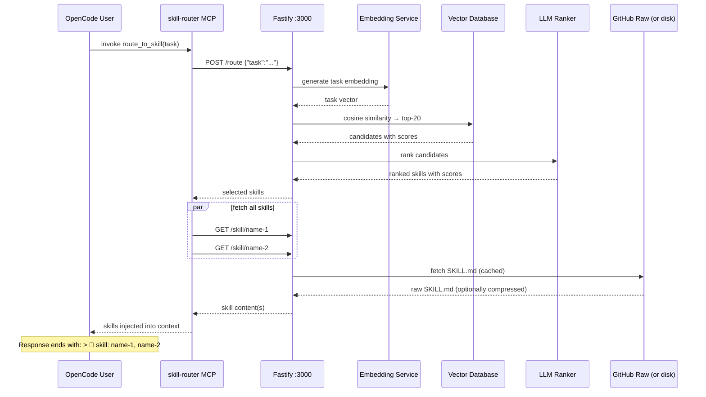

# Agent Skill Router — 1,827 Expert Skills with Built-In Compression

**An AI skill routing system that automatically selects and injects the right expertise into your AI's context.** With 1,827 skills across 5 domains and built-in SkillCompressor for reducing token overhead, the router makes expert knowledge instantly available without manual commands.

```
You → "review this Python code for security issues"
      ↓
skill-router auto-fires → embeds task → vector search → LLM ranks → loads skills
      ↓
Full expert skills injected into context (compressed if needed) — AI answers as expert reviewer
```

**Key Features:**
- 🎯 **1,827 Skills** organized across Agent, CNCF, Coding, Programming, and Trading domains
- 🔄 **Auto-Routing** — tasks automatically match the most relevant skills
- 🗜️ **SkillCompressor** — reduce token overhead by 28-65% with configurable compression levels (0-10+)
- ⚡ **Fast** — cached warm requests respond in ~10ms; cold requests in ~3.5s
- 📦 **Self-Contained** — run locally or via Docker; no external API required for routing
- 🔌 **MCP Integration** — works with OpenCode's `route_to_skill` tool

---

## Quick Start

### Installation (OpenAI)

```bash
git clone https://github.com/paulpas/agent-skill-router
cd agent-skill-router
OPENAI_API_KEY=sk-... ./install-skill-router.sh --integrate-opencode
```

Restart OpenCode. Every task automatically routes to the most relevant skill.

### Local Model (no API key required)

```bash
./install-skill-router.sh \
  --provider llamacpp \
  --embedding-provider llamacpp \
  --llamacpp-url http://localhost:8080
```

> **Note:** llama.cpp must serve both `/v1/chat/completions` and `/v1/embeddings`.

---

## Directory Structure

All skills live in `skills/` organized by domain:

```
skills/
├── agent/                       (271 skills)
│   ├── confidence-based-selector/
│   │   └── SKILL.md
│   ├── task-decomposition-engine/
│   │   └── SKILL.md
│   └── ... 269 more
│
├── cncf/                        (365 skills)
│   ├── kubernetes/
│   │   └── SKILL.md
│   ├── prometheus/
│   │   └── SKILL.md
│   └── ... 363 more
│
├── coding/                      (317 skills)
│   ├── code-review/
│   │   └── SKILL.md
│   ├── test-driven-development/
│   │   └── SKILL.md
│   └── ... 315 more
│
├── programming/                 (791 skills)
│   ├── react-best-practices/
│   │   └── SKILL.md
│   ├── advanced-evaluation/
│   │   └── SKILL.md
│   └── ... 789 more
│
└── trading/                     (83 skills)
    ├── ai-anomaly-detection/
    │   └── SKILL.md
    ├── backtest-walk-forward/
    │   └── SKILL.md
    └── ... 81 more

agent-skill-routing-system/      ← HTTP routing service
scripts/                         ← maintenance automation
README.md, FAQ.md, AGENTS.md     ← documentation
```

Each skill is a single `SKILL.md` file with YAML frontmatter defining its purpose, triggers, and content.

---

## Compression Configuration

### What Is Compression?

SkillCompressor reduces the token overhead of skill content by removing unnecessary whitespace, comments, and formatting. This saves 28-65% of tokens while preserving all executable code and critical information.

| Level | Description | Token Savings | Use Case |
|-------|-------------|---------------|----------|
| **0** | No compression | 0% | Development, testing, debugging |
| **1** | Remove blank lines + trailing whitespace | ~12% | Default for streaming |
| **2** | Level 1 + collapse multiple spaces | ~18% | Balanced (recommended for most) |
| **3** | Level 2 + remove comments | ~24% | Production with code focus |
| **4** | Level 3 + minify JSON/YAML | ~28% | **Default in Docker** — sweet spot |
| **5** | Level 4 + strip metadata | ~35% | Aggressive compression |
| **6-8** | Progressive minification | 40-50% | Content-heavy skills only |
| **9-10+** | Maximum compression | 50-65% | Only for huge reference skills |

### Building with Compression

Build Docker images with a specific compression level:

```bash
# Build with level 4 (28% savings, recommended)
docker build --build-arg COMPRESSION_LEVEL=4 -t skill-router:latest .

# Build with level 2 (18% savings, more readable)
docker build --build-arg COMPRESSION_LEVEL=2 -t skill-router:latest .

# Build with maximum compression (65% savings)
docker build --build-arg COMPRESSION_LEVEL=10 -t skill-router:latest .
```

### Running with Compression

Set compression at runtime:

```bash
# Default (no compression)
node dist/index.js

# Level 2 (18% savings, recommended)
SKILL_COMPRESSION_LEVEL=2 node dist/index.js

# Level 4 (28% savings, Docker default)
SKILL_COMPRESSION_LEVEL=4 node dist/index.js

# Level 5 (35% savings, aggressive)
SKILL_COMPRESSION_LEVEL=5 node dist/index.js
```

### API Queries with Compression

Request compressed skill content via HTTP:

```bash
# Get uncompressed skill
curl http://localhost:3000/skill/coding-code-review

# Get skill with level 2 compression (18% savings)
curl "http://localhost:3000/skill/coding-code-review?compression=2"

# Get skill with level 4 compression (28% savings)
curl "http://localhost:3000/skill/coding-code-review?compression=4"

# Get skill with maximum compression (65% savings)
curl "http://localhost:3000/skill/coding-code-review?compression=10"
```

### Docker Compose Example

```yaml
version: '3.8'

services:
  skill-router:
    build:
      context: .
      args:
        COMPRESSION_LEVEL: 4    # 28% token savings
    environment:
      OPENAI_API_KEY: ${OPENAI_API_KEY}
      SKILL_COMPRESSION_LEVEL: 4
    ports:
      - "3000:3000"
    volumes:
      - ./skills:/app/skills     # local skills mount
```

Run with:
```bash
docker-compose up -d
```

### Compression Metrics

Monitor compression savings:

```bash
curl http://localhost:3000/metrics
```

Example response:
```json
{
  "compression": {
    "level": 4,
    "avgTokenSavings": "28%",
    "skillsCompressed": 1777,
    "totalBytesOriginal": 52000000,
    "totalBytesCompressed": 37440000,
    "averageCompressionRatio": 0.72
  }
}
```

---

## How It Works

Every task triggers the `route_to_skill` MCP tool, which:



### Latency

| Stage | Cold | Warm (cached) |
|-------|------|---------------|
| Task embedding | ~400 ms | ~1 ms |
| Vector search | ~1 ms | ~1 ms |
| LLM ranking | ~3,000 ms | ~5 ms |
| Skill fetch + compression | ~150 ms | ~1 ms |
| **Total** | **~3.5 s** | **~10 ms** |

---

## API Endpoints

### Health & Status

```bash
# Health check
curl http://localhost:3000/health
# Response: {"status":"healthy","version":"1.0.0"}

# Service statistics
curl http://localhost:3000/stats
# Response: {"skills":{"totalSkills":1777,"domains":[...]}}

# Compression metrics
curl http://localhost:3000/metrics
```

### Skills Management

```bash
# List all skills
curl http://localhost:3000/skills
# Response: [{name:"skill-1",domain:"agent",...}, ...]

# Get specific skill (uncompressed)
curl http://localhost:3000/skill/coding-code-review

# Get skill with compression
curl "http://localhost:3000/skill/coding-code-review?compression=4"

# Get skill with custom compression and JSON response
curl "http://localhost:3000/skill/coding-code-review?compression=2&format=json"
```

### Routing & Execution

```bash
# Route a task to skills
curl -X POST http://localhost:3000/route \
  -H "Content-Type: application/json" \
  -d '{
    "task": "review this Python code for security issues",
    "maxSkills": 3
  }'
# Response: {selected: [{name:"coding-code-review",score:0.95},...]}

# Execute a task (auto-route + fetch skills)
curl -X POST http://localhost:3000/execute \
  -H "Content-Type: application/json" \
  -d '{
    "task": "help me deploy to Kubernetes",
    "compression": 2
  }'
```

### Access History

```bash
# Last 100 routing decisions
curl http://localhost:3000/access-log

# Response:
{
  "totalRequests": 150,
  "entries": [
    {
      "timestamp": "2026-04-25T14:30:00Z",
      "task": "review code",
      "topSkill": "coding-code-review",
      "confidence": 0.95,
      "latencyMs": 145
    }
  ]
}
```

### Force Sync (for new skills)

```bash
# Reload all skills from disk/GitHub
curl -X POST http://localhost:3000/reload
# Useful after pushing new skills
```

---

## Available Skills Directory

### Domain Breakdown

| Domain | Count | Focus |
|--------|-------|-------|
| **Agent** | 271 | AI orchestration, routing, task decomposition |
| **CNCF** | 365 | Kubernetes, cloud-native tooling, DevOps |
| **Coding** | 317 | Software patterns, security, testing |
| **Programming** | 791 | Algorithms, frameworks, languages |
| **Trading** | 83 | Execution, risk management, ML models |

### Agent Skills (271)

Orchestration, routing, and AI agent patterns for task automation.

| Skill | Description |
|-------|-------------|
| [confidence-based-selector](./skills/agent/confidence-based-selector/SKILL.md) | Select appropriate skill based on confidence scores and relevance |
| [task-decomposition-engine](./skills/agent/task-decomposition-engine/SKILL.md) | Break complex tasks into manageable subtasks |
| [parallel-skill-runner](./skills/agent/parallel-skill-runner/SKILL.md) | Execute multiple skills concurrently |
| [multi-skill-executor](./skills/agent/multi-skill-executor/SKILL.md) | Orchestrate skill execution with dependencies |
| [add-new-skill](./skills/agent/add-new-skill/SKILL.md) | Create and register new skills in the routing system |

*[View all 271 Agent skills →](./skills/agent/)*

### CNCF Skills (365)

Kubernetes, cloud-native projects, DevOps, and infrastructure patterns.

| Skill | Description |
|-------|-------------|
| [kubernetes](./skills/cncf/kubernetes/SKILL.md) | Container orchestration and cluster management |
| [prometheus](./skills/cncf/prometheus/SKILL.md) | Monitoring system and time series database |
| [helm](./skills/cncf/helm/SKILL.md) | Kubernetes package manager and templating |
| [istio](./skills/cncf/istio/SKILL.md) | Service mesh for traffic management |
| [etcd](./skills/cncf/etcd/SKILL.md) | Distributed key-value store for Kubernetes |

*[View all 365 CNCF skills →](./skills/cncf/)*

### Software Engineering (SWE) Skills (317)

Software engineering patterns, security, testing, and best practices.

| Skill | Description |
|-------|-------------|
| [code-review](./skills/coding/code-review/SKILL.md) | Security, bugs, code quality assessment |
| [test-driven-development](./skills/coding/test-driven-development/SKILL.md) | TDD workflows and test pyramid |
| [security-review](./skills/coding/security-review/SKILL.md) | Vulnerability scanning and secure coding |
| [fastapi-patterns](./skills/coding/fastapi-patterns/SKILL.md) | FastAPI structure and best practices |
| [pydantic-models](./skills/coding/pydantic-models/SKILL.md) | Data validation with Pydantic |

*[View all 317 Coding skills →](./skills/coding/)*

### Programming Skills (791)

Algorithms, data structures, frameworks, and language reference.

| Skill | Description |
|-------|-------------|
| [react-best-practices](./skills/programming/react-best-practices/SKILL.md) | Modern React patterns and hooks |
| [advanced-evaluation](./skills/programming/advanced-evaluation/SKILL.md) | Advanced evaluation techniques |
| [fp-react](./skills/programming/fp-react/SKILL.md) | Functional programming in React |
| [react-component-performance](./skills/programming/react-component-performance/SKILL.md) | React component optimization strategies |
| [react-flow-architect](./skills/programming/react-flow-architect/SKILL.md) | React Flow architecture and patterns |

*[View all 791 Programming skills →](./skills/programming/)*

### Trading Skills (83)

Algorithmic execution, risk management, backtesting, and ML models.

| Skill | Description |
|-------|-------------|
| [ai-anomaly-detection](./skills/trading/ai-anomaly-detection/SKILL.md) | AI-powered anomaly detection in market data |
| [backtest-walk-forward](./skills/trading/backtest-walk-forward/SKILL.md) | Robust strategy validation |
| [ai-explainable-ai](./skills/trading/ai-explainable-ai/SKILL.md) | Model interpretability in trading systems |
| [ai-feature-engineering](./skills/trading/ai-feature-engineering/SKILL.md) | Feature engineering for trading ML models |
| [ai-hyperparameter-tuning](./skills/trading/ai-hyperparameter-tuning/SKILL.md) | ML model hyperparameter optimization |

*[View all 83 Trading skills →](./skills/trading/)*

---

## Workflow: Adding New Skills

Create skills following this workflow:

### 1. Create Directory and SKILL.md

```bash
mkdir -p skills/<domain>/<skill-name>/
touch skills/<domain>/<skill-name>/SKILL.md
```

### 2. Write SKILL.md with Proper Format

```yaml
---
name: my-skill-name
description: What this skill does in one sentence
license: MIT
compatibility: opencode
metadata:
  version: "1.0.0"
  domain: coding
  role: implementation
  scope: implementation
  output-format: code
  triggers: keyword1, keyword2, keyword3, how do i implement
---

# My Skill Title

Brief description of the skill's purpose and when to use it.

## When to Use

- Concrete use case 1
- Concrete use case 2

## When NOT to Use

- Anti-pattern or irrelevant context

## Core Workflow

1. **Step 1** — Description
2. **Step 2** — Description
3. **Step 3** — Description

## Implementation Patterns

```python
# Example code
```

## Related Skills

| Skill | Purpose |
|-------|---------|
| [related-skill](../../skills/domain/related-skill/SKILL.md) | Why you'd use this alongside |
```

### 3. Validate and Regenerate Index

```bash
# Validate YAML syntax
python3 scripts/reformat_skills.py

# Update router index
python3 generate_index.py

# Regenerate README catalog
python3 scripts/generate_readme.py
```

### 4. Commit and Push

```bash
git add -A
git commit -m "feat: add my-skill-name skill

- New skill directory: skills/<domain>/<skill-name>/
- Description: Brief description
- Triggers: keyword1, keyword2, keyword3"
git push origin main
```

The router auto-discovers new skills within `SKILL_SYNC_INTERVAL` seconds (default: 1 hour). For immediate pickup:

```bash
curl -X POST http://localhost:3000/reload
```

---

## Maintenance & Automation

This repository includes scripts to maintain skills and keep metadata consistent.

### generate_readme.py

Auto-generates the skills catalog in documentation:

```bash
python3 scripts/generate_readme.py
```

Updates README with all 1,777 skills organized by domain and role.

### enhance_triggers.py

Adds conversational triggers for better skill discovery:

```bash
python3 scripts/enhance_triggers.py
```

Suggests trigger improvements like:
- "how do I..." questions
- Common colloquialisms
- Related technology names
- Operational task language

### reformat_skills.py

Validates and normalizes YAML frontmatter:

```bash
python3 scripts/reformat_skills.py
```

Ensures all skills follow the format specification.

### generate_index.py

Regenerates `skills-index.json` for routing:

```bash
python3 generate_index.py
```

Must run after adding or modifying skills.

---

## Monitoring & Debugging

### Skill Access Logs

View routing decisions and skill usage:

```bash
# Last 100 routing accesses
curl http://localhost:3000/access-log

# Filter by skill name
curl "http://localhost:3000/access-log?skill=coding-code-review"
```

### Docker Logs

View service logs:

```bash
# Follow logs in real-time
docker logs -f skill-router

# Search for specific task routes
docker logs skill-router | grep "Route result"
```

### Performance Metrics

Check system performance:

```bash
curl http://localhost:3000/metrics
```

Returns:
- Compression statistics
- Embedding cache hits
- Vector search latency
- LLM ranking latency
- Skill access frequency

---

## FAQ

**Have questions?** Check the comprehensive [FAQ.md](./FAQ.md) with 27+ Q&A covering:
- How auto-routing works
- Skill management and creation
- Compression configuration
- Troubleshooting and optimization
- Offline mode and local models

---

## Related Documentation

- **[AGENTS.md](./AGENTS.md)** — Complete guide for creating new skills
- **[SKILL_FORMAT_SPEC.md](./SKILL_FORMAT_SPEC.md)** — Formal skill file specification
- **[COMPRESSION.md](./SKILL_COMPRESSION_IMPLEMENTATION.md)** — Detailed compression guide
- **[FAQ.md](./FAQ.md)** — Common questions and troubleshooting

---

## Docker Deployment

### Build Image

```bash
# Default (no compression)
docker build -t skill-router:latest .

# With compression level 4 (28% savings, recommended)
docker build --build-arg COMPRESSION_LEVEL=4 -t skill-router:latest .
```

### Run Container

```bash
# Basic
docker run -p 3000:3000 \
  -e OPENAI_API_KEY=$OPENAI_API_KEY \
  skill-router:latest

# With compression
docker run -p 3000:3000 \
  -e OPENAI_API_KEY=$OPENAI_API_KEY \
  -e SKILL_COMPRESSION_LEVEL=4 \
  skill-router:latest

# With local volume mount
docker run -p 3000:3000 \
  -v $(pwd)/skills:/app/skills \
  -e OPENAI_API_KEY=$OPENAI_API_KEY \
  -e SKILL_COMPRESSION_LEVEL=2 \
  skill-router:latest
```

### Docker Compose (Production)

```yaml
version: '3.8'

services:
  skill-router:
    build:
      context: .
      args:
        COMPRESSION_LEVEL: 4
    environment:
      OPENAI_API_KEY: ${OPENAI_API_KEY}
      SKILL_COMPRESSION_LEVEL: 4
      SKILL_SYNC_INTERVAL: 3600
      NODE_ENV: production
    ports:
      - "3000:3000"
    volumes:
      - ./skills:/app/skills
      - skill-router-cache:/app/.cache
    restart: unless-stopped
    healthcheck:
      test: ["CMD", "curl", "-f", "http://localhost:3000/health"]
      interval: 30s
      timeout: 10s
      retries: 3

volumes:
  skill-router-cache:
```

Deploy:
```bash
docker-compose up -d
```

---

## Contributing

Skills are the core value of this system. To contribute:

1. Create a new skill following [AGENTS.md](./AGENTS.md)
2. Use specific, task-oriented triggers (not generic terms)
3. Include "When NOT to Use" section for complex skills
4. Run automation scripts before committing
5. Submit PR with descriptive commit message

---

## License

MIT — All skills are freely available and redistributable.

---

## Support

| Channel | Purpose |
|---------|---------|
| **GitHub Issues** | Bug reports, feature requests |
| **FAQ.md** | Common questions and troubleshooting |
| **AGENTS.md** | Skill creation guide and specifications |
| **OpenCode Integration** | Use `route_to_skill` in any task |

---

**Last updated:** 2026-04-25  
**Total skills:** 1,777  
**Domains:** Agent (222) · CNCF (365) · Coding (317) · Programming (790) · Trading (83)

<!-- AUTO-GENERATED SKILLS INDEX START -->

> **Last updated:** 2026-04-26 09:03:05 UTC  
> **Total skills:** 1460

## Skills by Domain


### Agent (222 skills)

| Skill Name | Description | Triggers |
|---|---|---|
| [actorization](../../skills/agent/actorization/SKILL.md) | Provides Actorization converts existing software into... | apify actorization, automation... |
| [advisor](../../skills/agent/advisor/SKILL.md) | "Advisors on optimal auto-scaling configurations for... | autoscaling advisor, autoscaling-advisor... |
| [advisor](../../skills/agent/advisor/SKILL.md) | "Provides Conselho de especialistas — consulta multiplos... | multi advisor, ai... |
| [agent](../../skills/agent/agent/SKILL.md) | "Provides Build a low-latency, Iron Man-inspired tactical... | pipecat friday agent, voice... |
| [agents](../../skills/agent/agents/SKILL.md) | Provides use when facing 2+ independent tasks that can be... | dispatching parallel agents, ai... |
| [agents](../../skills/agent/agents/SKILL.md) | Provides Build background agents in sandboxed environments.... | hosted agents, ai... |
| [agents](../../skills/agent/agents/SKILL.md) | Provides Multi-agent orchestration patterns. Use when... | parallel agents, ai... |
| [ai](../../skills/agent/ai/SKILL.md) | "Provides Build production-ready AI agents with PydanticAI... | pydantic ai, ai... |
| [analysis](../../skills/agent/analysis/SKILL.md) | Provides Understand audience demographics, preferences,... | apify audience analysis, automation... |
| [analysis](../../skills/agent/analysis/SKILL.md) | Provides Discover and track emerging trends across Google... | apify trend analysis, automation... |
| [analytics](../../skills/agent/analytics/SKILL.md) | Provides Track engagement metrics, measure campaign ROI,... | apify content analytics, automation... |
| [architect](../../skills/agent/architect/SKILL.md) | Provides Expert in designing and building autonomous AI... | ai agents architect, ai... |
| [audio](../../skills/agent/audio/SKILL.md) | "Implements text-to-speech and speech-to-text using fal.ai... | fal audio, voice... |
| [audit](../../skills/agent/audit/SKILL.md) | Provides Comprehensive security auditing workflow covering... | security audit, workflow... |
| [automation](../../skills/agent/automation/SKILL.md) | 'Provides Automate Airtable tasks via Rube MCP (Composio):... | airtable automation, automation... |
| [automation](../../skills/agent/automation/SKILL.md) | "Provides Automate Bitbucket repositories, pull requests,... | bitbucket automation, workflow... |
| [automation](../../skills/agent/automation/SKILL.md) | "Provides Automate changelog generation from commits, PRs,... | changelog automation, workflow... |
| [automation](../../skills/agent/automation/SKILL.md) | 'Provides Automate CircleCI tasks via Rube MCP (Composio):... | circleci automation, automation... |
| [automation](../../skills/agent/automation/SKILL.md) | Provides Automate ClickUp project management including... | clickup automation, automation... |
| [automation](../../skills/agent/automation/SKILL.md) | Provides Automate Freshdesk helpdesk operations including... | freshdesk automation, automation... |
| [automation](../../skills/agent/automation/SKILL.md) | "Provides Master Git hooks setup with Husky, lint-staged,... | git hooks automation, workflow... |
| [automation](../../skills/agent/automation/SKILL.md) | "Provides Automate GitHub repositories, issues, pull... | github automation, workflow... |
| [automation](../../skills/agent/automation/SKILL.md) | "Provides Patterns for automating GitHub workflows with AI... | github workflow automation, workflow... |
| [automation](../../skills/agent/automation/SKILL.md) | "Provides Automate GitLab project management, issues, merge... | gitlab automation, workflow... |
| [automation](../../skills/agent/automation/SKILL.md) | 'Provides Automate Google Analytics tasks via Rube MCP... | google analytics automation, automation... |
| [automation](../../skills/agent/automation/SKILL.md) | Provides Lightweight Google Docs integration with... | google docs automation, automation... |
| [automation](../../skills/agent/automation/SKILL.md) | Provides Lightweight Google Drive integration with... | google drive automation, automation... |
| [automation](../../skills/agent/automation/SKILL.md) | 'Provides Automate HelpDesk tasks via Rube MCP (Composio):... | helpdesk automation, automation... |
| [automation](../../skills/agent/automation/SKILL.md) | Provides Automate HubSpot CRM operations (contacts,... | hubspot automation, automation... |
| [automation](../../skills/agent/automation/SKILL.md) | 'Provides Automate Intercom tasks via Rube MCP (Composio):... | intercom automation, automation... |
| [automation](../../skills/agent/automation/SKILL.md) | 'Provides Automate Make (Integromat) tasks via Rube MCP... | make automation, automation... |
| [automation](../../skills/agent/automation/SKILL.md) | 'Provides Automate Notion tasks via Rube MCP (Composio):... | notion automation, automation... |
| [automation](../../skills/agent/automation/SKILL.md) | 'Provides Automate Outlook tasks via Rube MCP (Composio):... | outlook automation, automation... |
| [automation](../../skills/agent/automation/SKILL.md) | 'Provides Automate Outlook Calendar tasks via Rube MCP... | outlook calendar automation, automation... |
| [automation](../../skills/agent/automation/SKILL.md) | 'Provides Automate Render tasks via Rube MCP (Composio):... | render automation, automation... |
| [automation](../../skills/agent/automation/SKILL.md) | Provides Automate SendGrid email delivery workflows... | sendgrid automation, automation... |
| [automation](../../skills/agent/automation/SKILL.md) | 'Provides Automate Shopify tasks via Rube MCP (Composio):... | shopify automation, automation... |
| [automation](../../skills/agent/automation/SKILL.md) | Provides Automate Slack workspace operations including... | slack automation, automation... |
| [automation](../../skills/agent/automation/SKILL.md) | 'Provides Automate Stripe tasks via Rube MCP (Composio):... | stripe automation, automation... |
| [automation](../../skills/agent/automation/SKILL.md) | Provides Workflow automation is the infrastructure that... | workflow automation, workflow... |
| [automation](../../skills/agent/automation/SKILL.md) | 'Provides Automate Zendesk tasks via Rube MCP (Composio):... | zendesk automation, automation... |
| [automation](../../skills/agent/automation/SKILL.md) | Provides Automate Zoom meeting creation, management,... | zoom automation, automation... |
| [backend-patterns](../../skills/agent/backend-patterns/SKILL.md) | Provides Backend architecture patterns, API design,... | cc skill backend patterns, meta... |
| [based-selector](../../skills/agent/based-selector/SKILL.md) | "Selects and executes the most appropriate skill based on... | appropriate, confidence based selector... |
| [blueprint](../../skills/agent/blueprint/SKILL.md) | "Provides Turn a one-line objective into a step-by-step... | blueprint, planning... |
| [branch](../../skills/agent/branch/SKILL.md) | "Provides Create a git branch following Sentry naming... | create branch, workflow... |
| [build](../../skills/agent/build/SKILL.md) | "Implements build for orchestration and agent coordination... | build, workflow... |
| [builder](../../skills/agent/builder/SKILL.md) | Provides Create MCP (Model Context Protocol) servers that... | mcp builder, ai... |
| [building](../../skills/agent/building/SKILL.md) | "Enables ultra-granular, line-by-line code analysis to... | audit context building, meta... |
| [cd-pipeline-analyzer](../../skills/agent/cd-pipeline-analyzer/SKILL.md) | "Analyzes CI/CD pipelines for optimization opportunities,... | build bottlenecks, ci-cd analysis... |
| [clickhouse-io](../../skills/agent/clickhouse-io/SKILL.md) | Provides ClickHouse database patterns, query optimization,... | cc skill clickhouse io, meta... |
| [coding-standards](../../skills/agent/coding-standards/SKILL.md) | "Provides Universal coding standards, best practices, and... | cc skill coding standards, meta... |
| [comments](../../skills/agent/comments/SKILL.md) | "Provides use when you need to address review or issue... | address github comments, workflow... |
| [commit](../../skills/agent/commit/SKILL.md) | "Provides ALWAYS use this skill when committing code... | commit, workflow... |
| [completion](../../skills/agent/completion/SKILL.md) | "Provides Claiming work is complete without verification is... | verification before completion, workflow... |
| [configuration](../../skills/agent/configuration/SKILL.md) | Provides Operation-aware node configuration guidance. Use... | n8n node configuration, automation... |
| [consultant](../../skills/agent/consultant/SKILL.md) | "Provides Arquitecto de Soluciones Principal y Consultor... | 00 andruia consultant, andruia... |
| [context](../../skills/agent/context/SKILL.md) | "Provides use for file-based context management, dynamic... | filesystem context, meta... |
| [continuous-learning](../../skills/agent/continuous-learning/SKILL.md) | "Implements development skill from everything-claude-code... | cc skill continuous learning, meta... |
| [core](../../skills/agent/core/SKILL.md) | 'Provides Auri: assistente de voz inteligente (Alexa +... | auri core, voice... |
| [correctness-verifier](../../skills/agent/correctness-verifier/SKILL.md) | "Verifies code correctness by analyzing syntax, semantics,... | code correctness verifier, code-correctness-verifier... |
| [creator](../../skills/agent/creator/SKILL.md) | "Provides To create new CLI skills following Anthropic's... | skill creator, meta... |
| [critique-engine](../../skills/agent/critique-engine/SKILL.md) | "Enables autonomous agents to self-critique their work by... | correctness, evaluates... |
| [database](../../skills/agent/database/SKILL.md) | Provides Database development and operations workflow... | database, workflow... |
| [debugger](../../skills/agent/debugger/SKILL.md) | "Diagnoses Kubernetes cluster issues, debug pods,... | container orchestration, diagnoses... |
| [decomposition-engine](../../skills/agent/decomposition-engine/SKILL.md) | "Decomposes complex tasks into smaller, manageable subtasks... | complex, decomposes... |
| [delivery](../../skills/agent/delivery/SKILL.md) | "Provides use when a coding task must be completed against... | closed loop delivery, workflow... |
| [deployment](../../skills/agent/deployment/SKILL.md) | Provides Kubernetes deployment workflow for container... | kubernetes deployment, granular... |
| [detector](../../skills/agent/detector/SKILL.md) | "Detects performance and behavioral regressions by... | behavioral, detects... |
| [dev](../../skills/agent/dev/SKILL.md) | "Provides Trigger.dev expert for background jobs, AI... | trigger dev, workflow... |
| [developer](../../skills/agent/developer/SKILL.md) | "Provides Comprehensive guide for creating and managing... | skill developer, meta... |
| [development](../../skills/agent/development/SKILL.md) | "Provides AI agent development workflow for building... | ai agent development, granular... |
| [development](../../skills/agent/development/SKILL.md) | 'Provides Important: Before you begin, fill in the... | apify actor development, automation... |
| [development](../../skills/agent/development/SKILL.md) | "Provides Comprehensive web, mobile, and backend... | development, workflow... |
| [development](../../skills/agent/development/SKILL.md) | "Provides Python FastAPI backend development with async... | python fastapi development, granular... |
| [development](../../skills/agent/development/SKILL.md) | "Provides React and Next.js 14+ application development... | react nextjs development, granular... |
| [development](../../skills/agent/development/SKILL.md) | "Provides use when executing implementation plans with... | subagent driven development, workflow... |
| [development](../../skills/agent/development/SKILL.md) | "Provides Expert in building voice AI applications - from... | voice ai development, voice... |
| [development](../../skills/agent/development/SKILL.md) | "Provides WordPress plugin development workflow covering... | wordpress plugin development, granular... |
| [development](../../skills/agent/development/SKILL.md) | "Provides WordPress theme development workflow covering... | wordpress theme development, granular... |
| [development](../../skills/agent/development/SKILL.md) | 'Provides WooCommerce store development workflow covering... | wordpress woocommerce development, granular... |
| [development-branch](../../skills/agent/development-branch/SKILL.md) | "Provides use when implementation is complete, all tests... | finishing a development branch, workflow... |
| [devops](../../skills/agent/devops/SKILL.md) | "Provides Cloud infrastructure and DevOps workflow covering... | cloud devops, workflow... |
| [diagnostics](../../skills/agent/diagnostics/SKILL.md) | "Diagnoses network connectivity issues, identifies... | bottlenecks, connectivity issues... |
| [diary](../../skills/agent/diary/SKILL.md) | 'Provides Unified Diary System: A context-preserving... | diary, meta... |
| [discovery](../../skills/agent/discovery/SKILL.md) | Provides Find and evaluate influencers for brand... | apify influencer discovery, automation... |
| [documentation](../../skills/agent/documentation/SKILL.md) | "Provides API documentation workflow for generating OpenAPI... | api documentation, granular... |
| [documentation](../../skills/agent/documentation/SKILL.md) | "Provides Documentation generation workflow covering API... | documentation, workflow... |
| [dotnet](../../skills/agent/dotnet/SKILL.md) | Provides Microsoft 365 Agents SDK for .NET. Build... | m365 agents dotnet, ai... |
| [drift-detector](../../skills/agent/drift-detector/SKILL.md) | "Detects and reports infrastructure drift between desired... | cloud infrastructure, drift detection... |
| [ecommerce](../../skills/agent/ecommerce/SKILL.md) | Provides Extract product data, prices, reviews, and seller... | apify ecommerce, automation... |
| [engineer](../../skills/agent/engineer/SKILL.md) | Transforms user prompts into optimized prompts using... | prompt engineer, automation... |
| [evaluation](../../skills/agent/evaluation/SKILL.md) | "Provides Testing and benchmarking LLM agents including... | agent evaluation, ai... |
| [expert](../../skills/agent/expert/SKILL.md) | Provides Expert guide for interpreting and fixing n8n... | n8n validation expert, automation... |
| [files](../../skills/agent/files/SKILL.md) | 'Implements work like manus: use persistent markdown files... | planning with files, planning... |
| [frontend-patterns](../../skills/agent/frontend-patterns/SKILL.md) | "Provides Frontend development patterns for React, Next.js,... | cc skill frontend patterns, meta... |
| [gate](../../skills/agent/gate/SKILL.md) | "Provides use when starting a new implementation task and... | create issue gate, workflow... |
| [generation](../../skills/agent/generation/SKILL.md) | Implements scrape leads from multiple platforms using apify... | apify lead generation, automation... |
| [graph-builder](../../skills/agent/graph-builder/SKILL.md) | "Builds and maintains dependency graphs for task execution,... | builds, dependency graph builder... |
| [if-underspecified](../../skills/agent/if-underspecified/SKILL.md) | "Provides Clarify requirements before implementing. Use... | ask questions if underspecified, workflow... |
| [implement](../../skills/agent/implement/SKILL.md) | "Provides Execute tasks from a track's implementation plan... | conductor implement, workflow... |
| [implementation](../../skills/agent/implementation/SKILL.md) | Provides RAG (Retrieval-Augmented Generation)... | rag implementation, granular... |
| [improver](../../skills/agent/improver/SKILL.md) | "Provides Iteratively improve a Claude Code skill using the... | skill improver, meta... |
| [inference-engine](../../skills/agent/inference-engine/SKILL.md) | "Inferences data schemas from actual data samples,... | data schema, schema discovery... |
| [infrastructure](../../skills/agent/infrastructure/SKILL.md) | Provides Terraform infrastructure as code workflow for... | terraform infrastructure, granular... |
| [inngest](../../skills/agent/inngest/SKILL.md) | "Provides Inngest expert for serverless-first background... | inngest, workflow... |
| [inspector](../../skills/agent/inspector/SKILL.md) | "Inspects container configurations, runtime state, logs,... | container, container inspector... |
| [installer](../../skills/agent/installer/SKILL.md) | "Provides Instala, valida, registra e verifica novas skills... | skill installer, meta... |
| [integration](../../skills/agent/integration/SKILL.md) | Provides use when integrating google gemini api into... | gemini api integration, automation... |
| [intelligence](../../skills/agent/intelligence/SKILL.md) | Provides Analyze competitor strategies, content, pricing,... | apify competitor intelligence, automation... |
| [intelligence](../../skills/agent/intelligence/SKILL.md) | "Provides Protocolo de Inteligência Pré-Tarefa — ativa... | task intelligence, workflow... |
| [issues](../../skills/agent/issues/SKILL.md) | "Implements interact with github issues - create, list, and... | issues, workflow... |
| [javascript](../../skills/agent/javascript/SKILL.md) | Provides Write JavaScript code in n8n Code nodes. Use when... | n8n code javascript, automation... |
| [jobs-mcp](../../skills/agent/jobs-mcp/SKILL.md) | "Provides Search 8,400+ AI and ML jobs across 489... | ai dev jobs mcp, mcp... |
| [lang](../../skills/agent/lang/SKILL.md) | Provides Native agent-to-agent language for compact... | lambda lang, ai... |
| [langgraph](../../skills/agent/langgraph/SKILL.md) | Provides Expert in LangGraph - the production-grade... | langgraph, ai... |
| [log-analyzer](../../skills/agent/log-analyzer/SKILL.md) | "Analyzes runtime logs from agent execution to identify... | analyzes, logs... |
| [manage](../../skills/agent/manage/SKILL.md) | 'Provides Manage track lifecycle: archive, restore, delete,... | conductor manage, workflow... |
| [management](../../skills/agent/management/SKILL.md) | "Provides Strategies for managing LLM context windows... | context window management, memory... |
| [management](../../skills/agent/management/SKILL.md) | "Provides use this skill when creating, managing, or... | track management, planning... |
| [memory](../../skills/agent/memory/SKILL.md) | "Provides Persistent memory systems for LLM conversations... | conversation memory, memory... |
| [memory](../../skills/agent/memory/SKILL.md) | "Provides Scoped CLAUDE.md memory system that reduces... | hierarchical agent memory, memory... |
| [ml](../../skills/agent/ml/SKILL.md) | "Provides AI and machine learning workflow covering LLM... | ai ml, workflow... |
| [mode-analysis](../../skills/agent/mode-analysis/SKILL.md) | "Performs failure mode analysis by identifying potential... | analyzes, failure mode analysis... |
| [modes](../../skills/agent/modes/SKILL.md) | "Provides AI operational modes (brainstorm, implement,... | behavioral modes, meta... |
| [ms](../../skills/agent/ms/SKILL.md) | Provides use this skill when building mcp servers to... | mcp builder ms, ai... |
| [ms](../../skills/agent/ms/SKILL.md) | "Provides Guide for creating effective skills for AI coding... | skill creator ms, meta... |
| [new-skill](../../skills/agent/new-skill/SKILL.md) | "'Step-by-step guide for adding a new skill to the... | add skill, contribute skill... |
| [niche-intelligence](../../skills/agent/niche-intelligence/SKILL.md) | "Provides Estratega de Inteligencia de Dominio de Andru.ia.... | 20 andruia niche intelligence, andruia... |
| [optimization](../../skills/agent/optimization/SKILL.md) | Provides PostgreSQL database optimization workflow for... | postgresql optimization, granular... |
| [optimizer](../../skills/agent/optimizer/SKILL.md) | "Analyzes and optimizes database queries for performance,... | database optimization, query optimization... |
| [optimizer](../../skills/agent/optimizer/SKILL.md) | "Optimizes resource allocation across distributed systems... | cost optimization, resource allocation... |
| [optimizer](../../skills/agent/optimizer/SKILL.md) | Provides Diagnose and optimize Agent Skills (SKILL.md) with... | skill optimizer, meta... |
| [optimizer](../../skills/agent/optimizer/SKILL.md) | 'Provides Adaptive token optimizer: intelligent filtering,... | zipai optimizer, agent... |
| [oracle-generator](../../skills/agent/oracle-generator/SKILL.md) | "Generates test oracles and expected outputs for testing... | expected output, test oracle... |
| [orchestration-full-stack-feature](../../skills/agent/orchestration-full-stack-feature/SKILL.md) | "Provides use when working with full stack orchestration... | full stack orchestration full stack feature, workflow... |
| [orchestrator](../../skills/agent/orchestrator/SKILL.md) | "Provides use when a coding task should be driven... | acceptance orchestrator, workflow... |
| [orchestrator](../../skills/agent/orchestrator/SKILL.md) | "Provides a meta-skill that understands task requirements,... | antigravity skill orchestrator, meta... |
| [path-detector](../../skills/agent/path-detector/SKILL.md) | "Identifies critical execution paths (hot paths) in code... | critical, execution... |
| [patterns](../../skills/agent/patterns/SKILL.md) | Provides Build production Apache Airflow DAGs with best... | airflow dag patterns, workflow... |
| [patterns](../../skills/agent/patterns/SKILL.md) | "Provides Comprehensive GitLab CI/CD pipeline patterns for... | gitlab ci patterns, workflow... |
| [patterns](../../skills/agent/patterns/SKILL.md) | Implements this skill should be used when the user asks to... | multi agent patterns, ai... |
| [patterns](../../skills/agent/patterns/SKILL.md) | Implements proven architectural patterns for building n8n... | n8n workflow patterns, automation... |
| [patterns](../../skills/agent/patterns/SKILL.md) | "Provides Master workflow orchestration architecture with... | workflow orchestration patterns, workflow... |
| [patterns](../../skills/agent/patterns/SKILL.md) | "Provides use this skill when implementing tasks according... | workflow patterns, workflow... |
| [patterns](../../skills/agent/patterns/SKILL.md) | Provides No-code automation democratizes workflow building.... | zapier make patterns, automation... |
| [planning](../../skills/agent/planning/SKILL.md) | "Provides use when a user asks for a plan for a coding... | concise planning, planning... |
| [plans](../../skills/agent/plans/SKILL.md) | "Provides use when you have a written implementation plan... | executing plans, workflow... |
| [plans](../../skills/agent/plans/SKILL.md) | "Provides use when you have a spec or requirements for a... | writing plans, planning... |
| [pr](../../skills/agent/pr/SKILL.md) | "Provides Alias for sentry-skills:pr-writer. Use when users... | create pr, workflow... |
| [pr](../../skills/agent/pr/SKILL.md) | "Provides Iterate on a PR until CI passes. Use when you... | iterate pr, workflow... |
| [pro](../../skills/agent/pro/SKILL.md) | "Provides use when building durable distributed systems... | temporal golang pro, workflow... |
| [pro](../../skills/agent/pro/SKILL.md) | "Provides Master Temporal workflow orchestration with... | temporal python pro, workflow... |
| [profiler](../../skills/agent/profiler/SKILL.md) | "Profiles code execution to identify performance... | bottlenecks, optimization... |
| [project](../../skills/agent/project/SKILL.md) | "Provides Forensic root cause analyzer for Antigravity... | analyze project, meta... |
| [project-guidelines-example](../../skills/agent/project-guidelines-example/SKILL.md) | "Implements project guidelines skill (example) for... | cc skill project guidelines example, meta... |
| [pushing](../../skills/agent/pushing/SKILL.md) | "Provides Stage all changes, create a conventional commit,... | git pushing, workflow... |
| [python](../../skills/agent/python/SKILL.md) | Provides Write Python code in n8n Code nodes. Use when... | n8n code python, automation... |
| [qa](../../skills/agent/qa/SKILL.md) | Provides Comprehensive testing and QA workflow covering... | testing qa, workflow... |
| [qstash](../../skills/agent/qstash/SKILL.md) | "Provides Upstash QStash expert for serverless message... | upstash qstash, workflow... |
| [quality-analyzer](../../skills/agent/quality-analyzer/SKILL.md) | "Analyzes code quality changes in diffs by evaluating... | analyzes, code quality... |
| [recallmax](../../skills/agent/recallmax/SKILL.md) | "Provides FREE — God-tier long-context memory for AI... | recallmax, memory... |
| [replanner](../../skills/agent/replanner/SKILL.md) | "Dynamically adjusts execution plans based on real-time... | adjusts, dynamic replanner... |
| [reputation-monitoring](../../skills/agent/reputation-monitoring/SKILL.md) | Provides Scrape reviews, ratings, and brand mentions from... | apify brand reputation monitoring, automation... |
| [requests](../../skills/agent/requests/SKILL.md) | "Provides Fetch unread GitHub notifications for open PRs... | gh review requests, workflow... |
| [research](../../skills/agent/research/SKILL.md) | Provides Analyze market conditions, geographic... | apify market research, automation... |
| [research](../../skills/agent/research/SKILL.md) | "Provides Automatically fetch latest library/framework... | context7 auto research, meta... |
| [revert](../../skills/agent/revert/SKILL.md) | "Implements git-aware undo by logical work unit (track,... | conductor revert, workflow... |
| [review](../../skills/agent/review/SKILL.md) | "Provides Code review requires technical evaluation, not... | receiving code review, workflow... |
| [review](../../skills/agent/review/SKILL.md) | "Provides use when completing tasks, implementing major... | requesting code review, workflow... |
| [root-cause](../../skills/agent/root-cause/SKILL.md) | "Performs stacktrace root cause analysis by examining stack... | analyzes, failures... |
| [router](../../skills/agent/router/SKILL.md) | "Provides use when the user is unsure which skill to use or... | skill router, meta... |
| [scanner](../../skills/agent/scanner/SKILL.md) | "Provides Scan agent skills for security issues before... | skill scanner, meta... |
| [scraper](../../skills/agent/scraper/SKILL.md) | Provides AI-driven data extraction from 55+ Actors across... | apify ultimate scraper, automation... |
| [scripting](../../skills/agent/scripting/SKILL.md) | "Provides Bash scripting workflow for creating... | bash scripting, granular... |
| [scripting](../../skills/agent/scripting/SKILL.md) | "Provides Operating system and shell scripting... | os scripting, workflow... |
| [search-mcp](../../skills/agent/search-mcp/SKILL.md) | "Provides Search AI-ready websites, inspect indexed site... | not human search mcp, mcp... |
| [security-review](../../skills/agent/security-review/SKILL.md) | Provides this skill ensures all code follows security best... | cc skill security review, meta... |
| [seekers](../../skills/agent/seekers/SKILL.md) | "Provides -Automatically convert documentation websites,... | skill seekers, meta... |
| [sentinel](../../skills/agent/sentinel/SKILL.md) | "Provides Auditoria e evolucao do ecossistema de skills.... | skill sentinel, meta... |
| [setup](../../skills/agent/setup/SKILL.md) | "Provides Configure a Rails project to work with Conductor... | conductor setup, workflow... |
| [skill](../../skills/agent/skill/SKILL.md) | Provides Manage multiple local CLI agents via tmux sessions... | agent manager skill, ai... |
| [skill-executor](../../skills/agent/skill-executor/SKILL.md) | "Orchestrates execution of multiple skill specifications in... | execution, multi skill executor... |
| [skill-runner](../../skills/agent/skill-runner/SKILL.md) | "Executes multiple skill specifications concurrently,... | executes, multiple... |
| [skill-smith](../../skills/agent/skill-smith/SKILL.md) | "Provides Ingeniero de Sistemas de Andru.ia. Diseña,... | 10 andruia skill smith, andruia... |
| [skills](../../skills/agent/skills/SKILL.md) | "Implements use when creating, updating, or improving agent... | writing skills, meta... |
| [status](../../skills/agent/status/SKILL.md) | "Implements display project status, active tracks, and next... | conductor status, workflow... |
| [strategic-compact](../../skills/agent/strategic-compact/SKILL.md) | "Implements development skill from everything-claude-code... | cc skill strategic compact, meta... |
| [superpowers](../../skills/agent/superpowers/SKILL.md) | "Provides use when starting any conversation - establishes... | using superpowers, meta... |
| [syntax](../../skills/agent/syntax/SKILL.md) | Provides Validate n8n expression syntax and fix common... | n8n expression syntax, automation... |
| [systems](../../skills/agent/systems/SKILL.md) | 'Provides Memory is the cornerstone of intelligent agents.... | agent memory systems, memory... |
| [systems](../../skills/agent/systems/SKILL.md) | "Provides Design short-term, long-term, and graph-based... | memory systems, memory... |
| [task-orchestrator](../../skills/agent/task-orchestrator/SKILL.md) | "Provides Route tasks to specialized AI agents with... | multi agent task orchestrator, agent... |
| [templates](../../skills/agent/templates/SKILL.md) | "Provides Production-ready GitHub Actions workflow patterns... | github actions templates, workflow... |
| [testing](../../skills/agent/testing/SKILL.md) | Provides API security testing workflow for REST and GraphQL... | api security testing, granular... |
| [testing](../../skills/agent/testing/SKILL.md) | Provides End-to-end testing workflow with Playwright for... | e2e testing, granular... |
| [testing](../../skills/agent/testing/SKILL.md) | Provides Web application security testing workflow for... | web security testing, granular... |
| [to-milestones](../../skills/agent/to-milestones/SKILL.md) | "Translates high-level goals into actionable milestones and... | goal to milestones, goal-to-milestones... |
| [tools-expert](../../skills/agent/tools-expert/SKILL.md) | Provides Expert guide for using n8n-mcp MCP tools... | n8n mcp tools expert, automation... |
| [trace-explainer](../../skills/agent/trace-explainer/SKILL.md) | "Explains error traces and exceptions by analyzing stack... | error trace explainer, error-trace-explainer... |
| [track](../../skills/agent/track/SKILL.md) | "Provides Create a new track with specification and phased... | conductor new track, workflow... |
| [transcriber](../../skills/agent/transcriber/SKILL.md) | "Provides Transform audio recordings into professional... | audio transcriber, voice... |
| [troubleshooting](../../skills/agent/troubleshooting/SKILL.md) | "Provides Linux system troubleshooting workflow for... | linux troubleshooting, granular... |
| [ts](../../skills/agent/ts/SKILL.md) | Implements microsoft 365 agents sdk for typescript/node.js... | m365 agents ts, ai... |
| [upgrade](../../skills/agent/upgrade/SKILL.md) | "Implements analyze rails apps and provide upgrade... | skill rails upgrade, meta... |
| [usage-analyzer](../../skills/agent/usage-analyzer/SKILL.md) | "Analyzes memory allocation patterns, identifies memory... | analyzes, leaks... |
| [v2-py](../../skills/agent/v2-py/SKILL.md) | Provides Build hosted agents using Azure AI Projects SDK... | hosted agents v2 py, ai... |
| [validate](../../skills/agent/validate/SKILL.md) | 'Provides MANDATORY: Run appropriate validation tools after... | lint and validate, workflow... |
| [validator](../../skills/agent/validator/SKILL.md) | "Validates Conductor project artifacts for completeness"... | conductor validator, workflow... |
| [viboscope](../../skills/agent/viboscope/SKILL.md) | "Provides Psychological compatibility matching — find... | viboscope, collaboration... |
| [wordpress](../../skills/agent/wordpress/SKILL.md) | "Provides Complete WordPress development workflow covering... | wordpress, workflow... |
| [workflow](../../skills/agent/workflow/SKILL.md) | "Provides Complete end-to-end MLOps pipeline orchestration... | ml pipeline workflow, workflow... |
| [workflow-automate](../../skills/agent/workflow-automate/SKILL.md) | Provides You are a workflow automation expert specializing... | cicd automation workflow automate, automation... |
| [workflows](../../skills/agent/workflows/SKILL.md) | "Provides Orchestrate multiple Antigravity skills through... | antigravity workflows, workflow... |
| [workflows](../../skills/agent/workflows/SKILL.md) | "Provides Master advanced Git techniques to maintain clean... | git advanced workflows, workflow... |
| [workflows-git-workflow](../../skills/agent/workflows-git-workflow/SKILL.md) | "Provides Orchestrate a comprehensive git workflow from... | git pr workflows git workflow, workflow... |
| [workflows-onboard](../../skills/agent/workflows-onboard/SKILL.md) | "Provides You are an **expert onboarding specialist and... | git pr workflows onboard, workflow... |
| [workflows-pr-enhance](../../skills/agent/workflows-pr-enhance/SKILL.md) | "Provides You are a PR optimization expert specializing in... | git pr workflows pr enhance, workflow... |
| [writer](../../skills/agent/writer/SKILL.md) | "Provides Create pull requests following Sentry's... | pr writer, workflow... |
| [writer](../../skills/agent/writer/SKILL.md) | "Provides Create and improve agent skills following the... | skill writer, meta... |
| [writing](../../skills/agent/writing/SKILL.md) | "Provides Structured task planning with clear breakdowns,... | plan writing, planning... |
| [xray](../../skills/agent/xray/SKILL.md) | "Provides X-ray any AI model's behavioral patterns —... | bdistill behavioral xray, ai... |


### Cncf (365 skills)

| Skill Name | Description | Triggers |
|---|---|---|
| [admin](../../skills/cncf/admin/SKILL.md) | "Provides Expert database administrator specializing in... | database admin, database... |
| [agents-persistent-dotnet](../../skills/cncf/agents-persistent-dotnet/SKILL.md) | "Provides Azure AI Agents Persistent SDK for .NET.... | azure ai agents persistent dotnet, cloud... |
| [agents-persistent-java](../../skills/cncf/agents-persistent-java/SKILL.md) | "Provides Azure AI Agents Persistent SDK for Java.... | azure ai agents persistent java, cloud... |
| [ai](../../skills/cncf/ai/SKILL.md) | "Provides Autonomous DevSecOps & FinOps Guardrails.... | aegisops ai, devops... |
| [aks](../../skills/cncf/aks/SKILL.md) | "Provides Managed Kubernetes cluster with automatic scaling... | aks, kubernetes... |
| [alexa](../../skills/cncf/alexa/SKILL.md) | "Provides Integracao completa com Amazon Alexa para criar... | amazon alexa, cloud... |
| [anomalydetector-java](../../skills/cncf/anomalydetector-java/SKILL.md) | "Provides Build anomaly detection applications with Azure... | azure ai anomalydetector java, cloud... |
| [api-development](../../skills/cncf/api-development/SKILL.md) | "Provides this skill guides you through creating custom... | moodle external api development, api... |
| [apicenter-dotnet](../../skills/cncf/apicenter-dotnet/SKILL.md) | "Provides Azure API Center SDK for .NET. Centralized API... | azure mgmt apicenter dotnet, cloud... |
| [apicenter-py](../../skills/cncf/apicenter-py/SKILL.md) | Provides Azure API Center Management SDK for Python. Use... | azure mgmt apicenter py, cloud... |
| [apimanagement-dotnet](../../skills/cncf/apimanagement-dotnet/SKILL.md) | "Configures azure resource manager sdk for api management... | azure mgmt apimanagement dotnet, cloud... |
| [apimanagement-py](../../skills/cncf/apimanagement-py/SKILL.md) | "Provides Azure API Management SDK for Python. Use for... | azure mgmt apimanagement py, cloud... |
| [applicationinsights-dotnet](../../skills/cncf/applicationinsights-dotnet/SKILL.md) | "Provides Azure Application Insights SDK for .NET.... | azure mgmt applicationinsights dotnet, cloud... |
| [apps](../../skills/cncf/apps/SKILL.md) | "Provides Expert patterns for Shopify app development... | shopify apps, api... |
| [architect](../../skills/cncf/architect/SKILL.md) | "Provides Expert cloud architect specializing in... | cloud architect, cloud... |
| [architect](../../skills/cncf/architect/SKILL.md) | Provides Expert database architect specializing in data... | database architect, database... |
| [architect](../../skills/cncf/architect/SKILL.md) | "Provides Expert hybrid cloud architect specializing in... | hybrid cloud architect, cloud... |
| [architect](../../skills/cncf/architect/SKILL.md) | Provides Expert Kubernetes architect specializing in... | kubernetes architect, devops... |
| [architecture](../../skills/cncf/architecture/SKILL.md) | "Provides Decision framework and patterns for architecting... | multi cloud architecture, cloud... |
| [architecture](../../skills/cncf/architecture/SKILL.md) | "Creates or updates ARCHITECTURE.md documenting the... | creates, documenting... |
| [argo](../../skills/cncf/argo/SKILL.md) | "Argo in Cloud-Native Engineering - Kubernetes-Native... | argo, cloud-native... |
| [arizeaiobservabilityeval-dotnet](../../skills/cncf/arizeaiobservabilityeval-dotnet/SKILL.md) | "Provides Azure Resource Manager SDK for Arize AI... | azure mgmt arizeaiobservabilityeval dotnet, cloud... |
| [auto-scaling](../../skills/cncf/auto-scaling/SKILL.md) | "Configures automatic scaling of compute resources (EC2,... | asg, auto-scaling... |
| [automation](../../skills/cncf/automation/SKILL.md) | Provides Automation and orchestration of Azure resources... | automation, runbooks... |
| [automation](../../skills/cncf/automation/SKILL.md) | 'Provides Automate Datadog tasks via Rube MCP (Composio):... | datadog automation, reliability... |
| [automation](../../skills/cncf/automation/SKILL.md) | 'Provides Automate Discord tasks via Rube MCP (Composio):... | discord automation, api... |
| [automation](../../skills/cncf/automation/SKILL.md) | 'Provides Automate Microsoft Teams tasks via Rube MCP... | microsoft teams automation, api... |
| [automation](../../skills/cncf/automation/SKILL.md) | 'Provides Automate PagerDuty tasks via Rube MCP (Composio):... | pagerduty automation, reliability... |
| [automation](../../skills/cncf/automation/SKILL.md) | 'Provides Automate Postmark email delivery tasks via Rube... | postmark automation, api... |
| [automation](../../skills/cncf/automation/SKILL.md) | 'Provides Automate Salesforce tasks via Rube MCP... | salesforce automation, api... |
| [automation](../../skills/cncf/automation/SKILL.md) | 'Provides Automate Sentry tasks via Rube MCP (Composio):... | sentry automation, reliability... |
| [automation](../../skills/cncf/automation/SKILL.md) | 'Provides Automate Square tasks via Rube MCP (Composio):... | square automation, api... |
| [automation](../../skills/cncf/automation/SKILL.md) | 'Provides Automate Telegram tasks via Rube MCP (Composio):... | telegram automation, api... |
| [automation](../../skills/cncf/automation/SKILL.md) | 'Provides Automate WhatsApp Business tasks via Rube MCP... | whatsapp automation, api... |
| [autoscaling](../../skills/cncf/autoscaling/SKILL.md) | "Provides Automatically scales compute resources based on... | autoscaling, auto-scaling... |
| [backstage](../../skills/cncf/backstage/SKILL.md) | "Provides Backstage in Cloud-Native Engineering - Developer... | backstage, cloud-native... |
| [base](../../skills/cncf/base/SKILL.md) | Provides Database management, forms, reports, and data... | base, database... |
| [batch-java](../../skills/cncf/batch-java/SKILL.md) | "Provides Azure Batch SDK for Java. Run large-scale... | azure compute batch java, cloud... |
| [best-practices](../../skills/cncf/best-practices/SKILL.md) | "Cloud Native Computing Foundation (CNCF) architecture best... | architecture best practices, architecture-best-practices... |
| [blob-java](../../skills/cncf/blob-java/SKILL.md) | "Provides Build blob storage applications using the Azure... | azure storage blob java, cloud... |
| [blob-py](../../skills/cncf/blob-py/SKILL.md) | "Provides Azure Blob Storage SDK for Python. Use for... | azure storage blob py, cloud... |
| [blob-rust](../../skills/cncf/blob-rust/SKILL.md) | "Provides Azure Blob Storage SDK for Rust. Use for... | azure storage blob rust, cloud... |
| [blob-storage](../../skills/cncf/blob-storage/SKILL.md) | Provides Object storage with versioning, lifecycle... | blob storage, object storage... |
| [blob-ts](../../skills/cncf/blob-ts/SKILL.md) | "Provides Azure Blob Storage JavaScript/TypeScript SDK... | azure storage blob ts, cloud... |
| [botservice-dotnet](../../skills/cncf/botservice-dotnet/SKILL.md) | "Provides Azure Resource Manager SDK for Bot Service in... | azure mgmt botservice dotnet, cloud... |
| [botservice-py](../../skills/cncf/botservice-py/SKILL.md) | "Provides Azure Bot Service Management SDK for Python. Use... | azure mgmt botservice py, cloud... |
| [builder](../../skills/cncf/builder/SKILL.md) | "Provides Build Slack apps using the Bolt framework across... | slack bot builder, api... |
| [builder](../../skills/cncf/builder/SKILL.md) | "Provides Expert in building Telegram bots that solve real... | telegram bot builder, api... |
| [buildpacks](../../skills/cncf/buildpacks/SKILL.md) | "Provides Buildpacks in Cloud-Native Engineering - Turn... | buildpacks, cloud-native... |
| [calico](../../skills/cncf/calico/SKILL.md) | "Calico in Cloud Native Security - cloud native... | calico, cdn... |
| [callautomation-java](../../skills/cncf/callautomation-java/SKILL.md) | "Provides Build server-side call automation workflows... | azure communication callautomation java, cloud... |
| [callingserver-java](../../skills/cncf/callingserver-java/SKILL.md) | "Provides ⚠️ DEPRECATED: This SDK has been renamed to Call ... | azure communication callingserver java, cloud... |
| [cdn](../../skills/cncf/cdn/SKILL.md) | Provides Content delivery network for caching and global... | cdn, content delivery... |
| [certificates-rust](../../skills/cncf/certificates-rust/SKILL.md) | "Provides Azure Key Vault Certificates SDK for Rust. Use... | azure keyvault certificates rust, cloud... |
| [chaosmesh](../../skills/cncf/chaosmesh/SKILL.md) | ''Provides Chaos Mesh in Cloud-Native Engineering... | chaosmesh, chaos... |
| [chat-java](../../skills/cncf/chat-java/SKILL.md) | "Provides Build real-time chat applications with thread... | azure communication chat java, cloud... |
| [cilium](../../skills/cncf/cilium/SKILL.md) | "Cilium in Cloud Native Network - cloud native... | cdn, cilium... |
| [cleanup](../../skills/cncf/cleanup/SKILL.md) | "Configures automated cleanup of unused aws resources to... | aws cost cleanup, cloud... |
| [cloud-cdn](../../skills/cncf/cloud-cdn/SKILL.md) | Provides Content delivery network for caching and globally... | cloud cdn, cdn... |
| [cloud-dns](../../skills/cncf/cloud-dns/SKILL.md) | Manages DNS with health checks, traffic routing, and... | cloud dns, dns... |
| [cloud-functions](../../skills/cncf/cloud-functions/SKILL.md) | Deploys serverless functions triggered by events with... | cloud functions, serverless... |
| [cloud-kms](../../skills/cncf/cloud-kms/SKILL.md) | "Manages encryption keys for data protection with automated... | kms, key management... |
| [cloud-load-balancing](../../skills/cncf/cloud-load-balancing/SKILL.md) | "Provides Distributes traffic across instances with... | load balancing, traffic distribution... |
| [cloud-monitoring](../../skills/cncf/cloud-monitoring/SKILL.md) | "Monitors GCP resources with metrics, logging, and alerting... | cloud monitoring, monitoring... |
| [cloud-operations](../../skills/cncf/cloud-operations/SKILL.md) | "Provides Systems management including monitoring, logging,... | cloud operations, monitoring... |
| [cloud-pubsub](../../skills/cncf/cloud-pubsub/SKILL.md) | "Asynchronous messaging service for event streaming and... | pubsub, messaging... |
| [cloud-sql](../../skills/cncf/cloud-sql/SKILL.md) | "Provides managed relational databases (MySQL, PostgreSQL)... | cloud sql, relational database... |
| [cloud-storage](../../skills/cncf/cloud-storage/SKILL.md) | "Provides Stores objects with versioning, lifecycle... | cloud storage, gcs... |
| [cloud-tasks](../../skills/cncf/cloud-tasks/SKILL.md) | "Manages task queues for asynchronous job execution with... | cloud tasks, task queue... |
| [cloudevents](../../skills/cncf/cloudevents/SKILL.md) | "CloudEvents in Streaming & Messaging - cloud native... | cdn, cloudevents... |
| [cloudformation](../../skills/cncf/cloudformation/SKILL.md) | "Creates Infrastructure as Code templates with... | cloudformation, infrastructure as code... |
| [cloudfront](../../skills/cncf/cloudfront/SKILL.md) | "Configures CloudFront CDN for global content distribution... | cloudfront, cdn... |
| [cloudwatch](../../skills/cncf/cloudwatch/SKILL.md) | "Configures CloudWatch monitoring with metrics, logs,... | cloudwatch, monitoring... |
| [cni](../../skills/cncf/cni/SKILL.md) | "Cni in Cloud-Native Engineering - Container Network... | cloud-native, cni... |
| [common-java](../../skills/cncf/common-java/SKILL.md) | "Provides Azure Communication Services common utilities for... | azure communication common java, cloud... |
| [communications](../../skills/cncf/communications/SKILL.md) | 'Provides Build communication features with Twilio: SMS... | twilio communications, api... |
| [compute-engine](../../skills/cncf/compute-engine/SKILL.md) | "Deploys and manages virtual machine instances with... | compute engine, gce... |
| [config-validate](../../skills/cncf/config-validate/SKILL.md) | Provides You are a configuration management expert... | deployment validation config validate, devops... |
| [configurator](../../skills/cncf/configurator/SKILL.md) | "Provides Generate production-ready mise.toml setups for... | mise configurator, devops... |
| [container-linux](../../skills/cncf/container-linux/SKILL.md) | "Provides Flatcar Container Linux in Cloud-Native... | cloud-native, engineering... |
| [container-registry](../../skills/cncf/container-registry/SKILL.md) | "Provides Stores and manages container images with... | container registry, acr... |
| [container-registry](../../skills/cncf/container-registry/SKILL.md) | "Provides Stores and manages container images with... | container registry, gcr... |
| [containerd](../../skills/cncf/containerd/SKILL.md) | "Containerd in Cloud-Native Engineering - An open and... | cloud-native, containerd... |
| [contentsafety-java](../../skills/cncf/contentsafety-java/SKILL.md) | "Provides Build content moderation applications using the... | azure ai contentsafety java, cloud... |
| [contentsafety-py](../../skills/cncf/contentsafety-py/SKILL.md) | "Provides Azure AI Content Safety SDK for Python. Use for... | azure ai contentsafety py, cloud... |
| [contentsafety-ts](../../skills/cncf/contentsafety-ts/SKILL.md) | "Provides Analyze text and images for harmful content with... | azure ai contentsafety ts, cloud... |
| [contentunderstanding-py](../../skills/cncf/contentunderstanding-py/SKILL.md) | "Provides Azure AI Content Understanding SDK for Python.... | azure ai contentunderstanding py, cloud... |
| [contour](../../skills/cncf/contour/SKILL.md) | "Contour in Service Proxy - cloud native architecture,... | cdn, contour... |
| [coredns](../../skills/cncf/coredns/SKILL.md) | "Coredns in Cloud-Native Engineering - CoreDNS is a DNS... | cloud-native, coredns... |
| [cortex](../../skills/cncf/cortex/SKILL.md) | "Cortex in Monitoring & Observability - distributed,... | cortex, distributed... |
| [cosmos-db](../../skills/cncf/cosmos-db/SKILL.md) | Provides Global NoSQL database with multi-region... | cosmos db, nosql... |
| [crossplane](../../skills/cncf/crossplane/SKILL.md) | "Crossplane in Platform Engineering - Kubernetes-native... | container orchestration, crossplane... |
| [cubefs](../../skills/cncf/cubefs/SKILL.md) | "Provides CubeFS in Storage - distributed, high-performance... | cubefs, distributed... |
| [custodian](../../skills/cncf/custodian/SKILL.md) | "Provides Cloud Custodian in Cloud-Native Engineering... | cloud custodian, cloud-custodian... |
| [dapr](../../skills/cncf/dapr/SKILL.md) | "Provides Dapr in Cloud-Native Engineering - distributed... | cloud-native, dapr... |
| [dashboards](../../skills/cncf/dashboards/SKILL.md) | Provides Create and manage production-ready Grafana... | grafana dashboards, devops... |
| [db-py](../../skills/cncf/db-py/SKILL.md) | "Provides Build production-grade Azure Cosmos DB NoSQL... | azure cosmos db py, cloud... |
| [debug-trace](../../skills/cncf/debug-trace/SKILL.md) | Provides You are a debugging expert specializing in setting... | distributed debugging debug trace, reliability... |
| [deploy](../../skills/cncf/deploy/SKILL.md) | "Provides DevOps e deploy de aplicacoes — Docker, CI/CD com... | devops deploy, devops... |
| [deployment](../../skills/cncf/deployment/SKILL.md) | Provides Deploy containerized frontend + backend... | azd deployment, cloud... |
| [deployment-manager](../../skills/cncf/deployment-manager/SKILL.md) | "Infrastructure as code using YAML templates for repeatable... | deployment manager, infrastructure as code... |
| [design](../../skills/cncf/design/SKILL.md) | Provides Database design principles and decision-making.... | database design, database... |
| [design](../../skills/cncf/design/SKILL.md) | Provides Architecture patterns for multi-stage CI/CD... | deployment pipeline design, devops... |
| [development](../../skills/cncf/development/SKILL.md) | "Provides Expert patterns for Salesforce platform... | salesforce development, api... |
| [development](../../skills/cncf/development/SKILL.md) | "Provides Build Shopify apps, extensions, themes using... | shopify development, api... |
| [document-intelligence-dotnet](../../skills/cncf/document-intelligence-dotnet/SKILL.md) | Provides Azure AI Document Intelligence SDK for .NET.... | azure ai document intelligence dotnet, cloud... |
| [document-intelligence-ts](../../skills/cncf/document-intelligence-ts/SKILL.md) | Provides Extract text, tables, and structured data from... | azure ai document intelligence ts, cloud... |
| [documents-dotnet](../../skills/cncf/documents-dotnet/SKILL.md) | "Provides Azure AI Search SDK for .NET... | azure search documents dotnet, cloud... |
| [documents-py](../../skills/cncf/documents-py/SKILL.md) | "Provides Azure AI Search SDK for Python. Use for vector... | azure search documents py, cloud... |
| [documents-ts](../../skills/cncf/documents-ts/SKILL.md) | "Provides Build search applications with vector, hybrid,... | azure search documents ts, cloud... |
| [dotnet](../../skills/cncf/dotnet/SKILL.md) | "Provides Azure Event Grid SDK for .NET. Client library for... | azure eventgrid dotnet, cloud... |
| [dotnet](../../skills/cncf/dotnet/SKILL.md) | "Configures azure event hubs sdk for .net for cloud-native... | azure eventhub dotnet, cloud... |
| [dotnet](../../skills/cncf/dotnet/SKILL.md) | "Provides Azure Identity SDK for .NET. Authentication... | azure identity dotnet, cloud... |
| [dotnet](../../skills/cncf/dotnet/SKILL.md) | "Provides Azure Service Bus SDK for .NET. Enterprise... | azure servicebus dotnet, cloud... |
| [dragonfly](../../skills/cncf/dragonfly/SKILL.md) | "Provides Dragonfly in Cloud-Native Engineering - P2P file... | cloud-native, distribution... |
| [dynamodb](../../skills/cncf/dynamodb/SKILL.md) | "Deploys managed NoSQL databases with DynamoDB for... | dynamodb, nosql... |
| [ec2](../../skills/cncf/ec2/SKILL.md) | "Deploys, configures, and auto-scales EC2 instances with... | ec2, compute instances... |
| [ecr](../../skills/cncf/ecr/SKILL.md) | "Manages container image repositories with ECR for secure... | container registry, container security... |
| [eks](../../skills/cncf/eks/SKILL.md) | "Deploys managed Kubernetes clusters with EKS for container... | eks, container orchestration... |
| [elb](../../skills/cncf/elb/SKILL.md) | "Configures Elastic Load Balancing (ALB, NLB, Classic) for... | elb, load balancer... |
| [engineer](../../skills/cncf/engineer/SKILL.md) | Provides Expert deployment engineer specializing in modern... | deployment engineer, devops... |
| [engineer](../../skills/cncf/engineer/SKILL.md) | Provides Build production-ready monitoring, logging, and... | observability engineer, reliability... |
| [envoy](../../skills/cncf/envoy/SKILL.md) | "Envoy in Cloud-Native Engineering - Cloud-native... | cloud-native, engineering... |
| [etcd](../../skills/cncf/etcd/SKILL.md) | "Provides etcd in Cloud-Native Engineering - distributed... | cloud-native, distributed... |
| [event-hubs](../../skills/cncf/event-hubs/SKILL.md) | "Provides Event streaming platform for high-throughput data... | event hubs, event streaming... |
| [expert](../../skills/cncf/expert/SKILL.md) | Provides You are an advanced Docker containerization expert... | docker expert, devops... |
| [expert](../../skills/cncf/expert/SKILL.md) | "Provides Expert in Drizzle ORM for TypeScript — schema... | drizzle orm expert, database... |
| [expert](../../skills/cncf/expert/SKILL.md) | Provides Expert guidance for distributed NoSQL databases... | nosql expert, database... |
| [expert](../../skills/cncf/expert/SKILL.md) | Provides You are an expert in Prisma ORM with deep... | prisma expert, database... |
| [expert](../../skills/cncf/expert/SKILL.md) | Provides Expert service mesh architect specializing in... | service mesh expert, reliability... |
| [fabric-dotnet](../../skills/cncf/fabric-dotnet/SKILL.md) | "Configures azure resource manager sdk for fabric in .net... | azure mgmt fabric dotnet, cloud... |
| [fabric-py](../../skills/cncf/fabric-py/SKILL.md) | "Provides Azure Fabric Management SDK for Python. Use for... | azure mgmt fabric py, cloud... |
| [falco](../../skills/cncf/falco/SKILL.md) | "Provides Falco in Cloud-Native Engineering - Cloud Native... | cdn, cloud-native... |
| [file-datalake-py](../../skills/cncf/file-datalake-py/SKILL.md) | Provides Azure Data Lake Storage Gen2 SDK for Python. Use... | azure storage file datalake py, cloud... |
| [file-share-py](../../skills/cncf/file-share-py/SKILL.md) | "Provides Azure Storage File Share SDK for Python. Use for... | azure storage file share py, cloud... |
| [file-share-ts](../../skills/cncf/file-share-ts/SKILL.md) | "Provides Azure File Share JavaScript/TypeScript SDK... | azure storage file share ts, cloud... |
| [fintech](../../skills/cncf/fintech/SKILL.md) | "Provides Expert patterns for Plaid API integration... | plaid fintech, api... |
| [firebase](../../skills/cncf/firebase/SKILL.md) | "Provides Firebase gives you a complete backend in minutes... | firebase, cloud... |
| [firestore](../../skills/cncf/firestore/SKILL.md) | Provides NoSQL document database with real-time sync,... | firestore, nosql... |
| [fluentd](../../skills/cncf/fluentd/SKILL.md) | "Fluentd unified logging layer for collecting,... | fluentd, log collection... |
| [fluid](../../skills/cncf/fluid/SKILL.md) | "Fluid in A Kubernetes-native data acceleration layer for... | acceleration, container orchestration... |
| [flux](../../skills/cncf/flux/SKILL.md) | "Configures flux in cloud-native engineering - gitops for... | cloud-native, declarative... |
| [formrecognizer-java](../../skills/cncf/formrecognizer-java/SKILL.md) | "Provides Build document analysis applications using the... | azure ai formrecognizer java, cloud... |
| [framework](../../skills/cncf/framework/SKILL.md) | "Operator Framework in Tools to build and manage Kubernetes... | build, manage... |
| [functions](../../skills/cncf/functions/SKILL.md) | Provides Serverless computing with event-driven functions... | azure functions, serverless... |
| [generation](../../skills/cncf/generation/SKILL.md) | "Provides Generate and maintain OpenAPI 3.1 specifications... | openapi spec generation, api... |
| [generator](../../skills/cncf/generator/SKILL.md) | Provides Step-by-step guidance for creating... | k8s manifest generator, devops... |
| [gke](../../skills/cncf/gke/SKILL.md) | "Provides Managed Kubernetes cluster with automatic... | gke, kubernetes... |
| [grpc](../../skills/cncf/grpc/SKILL.md) | "gRPC in Remote Procedure Call - cloud native architecture,... | cdn, grpc... |
| [guardian](../../skills/cncf/guardian/SKILL.md) | "Provides FREE — Intelligent tool-call reliability wrapper.... | tool use guardian, reliability... |
| [handoff-patterns](../../skills/cncf/handoff-patterns/SKILL.md) | Provides Effective patterns for on-call shift transitions,... | on call handoff patterns, reliability... |
| [harbor](../../skills/cncf/harbor/SKILL.md) | "Configures harbor in cloud-native engineering - container... | cloud-native, container... |
| [helm](../../skills/cncf/helm/SKILL.md) | "Provides Helm in Cloud-Native Engineering - The Kubernetes... | cloud-native, container orchestration... |
| [hub](../../skills/cncf/hub/SKILL.md) | "Provides Artifact Hub in Cloud-Native Engineering -... | artifact hub, artifact-hub... |
| [hydra](../../skills/cncf/hydra/SKILL.md) | "ORY Hydra in Security & Compliance - cloud native... | ory hydra, ory-hydra... |
| [iam](../../skills/cncf/iam/SKILL.md) | "Configures identity and access management with IAM users,... | iam, identity management... |
| [iam](../../skills/cncf/iam/SKILL.md) | "Manages identity and access control with service accounts,... | iam, identity access management... |
| [implementation](../../skills/cncf/implementation/SKILL.md) | Provides Framework for defining and implementing Service... | slo implementation, reliability... |
| [incident-response](../../skills/cncf/incident-response/SKILL.md) | "Configures use when working with incident response... | incident response incident response, devops... |
| [incident-response](../../skills/cncf/incident-response/SKILL.md) | "Creates or updates an incident response plan covering... | covering, creates... |
| [ingestion-java](../../skills/cncf/ingestion-java/SKILL.md) | Provides Azure Monitor Ingestion SDK for Java. Send custom... | azure monitor ingestion java, cloud... |
| [ingestion-py](../../skills/cncf/ingestion-py/SKILL.md) | "Provides Azure Monitor Ingestion SDK for Python. Use for... | azure monitor ingestion py, cloud... |
| [ingress](../../skills/cncf/ingress/SKILL.md) | "Provides Emissary-Ingress in Cloud-Native Engineering -... | cloud-native, emissary ingress... |
| [ingress-controller](../../skills/cncf/ingress-controller/SKILL.md) | "Kong Ingress Controller in Kubernetes - cloud native... | kong ingress controller, kong-ingress-controller... |
| [integration](../../skills/cncf/integration/SKILL.md) | "Provides Expert patterns for HubSpot CRM integration... | hubspot integration, api... |
| [integration](../../skills/cncf/integration/SKILL.md) | "Provides Integrate Stripe, PayPal, and payment processors.... | payment integration, api... |
| [integration](../../skills/cncf/integration/SKILL.md) | "Provides Master PayPal payment integration including... | paypal integration, api... |
| [integration](../../skills/cncf/integration/SKILL.md) | "Provides Master Stripe payment processing integration for... | stripe integration, api... |
| [integration](../../skills/cncf/integration/SKILL.md) | "Provides Integration skill for searching and fetching... | unsplash integration, api... |
| [io](../../skills/cncf/io/SKILL.md) | "metal3.io in Bare Metal Provisioning - cloud native... | cdn, infrastructure as code... |
| [istio](../../skills/cncf/istio/SKILL.md) | "Istio in Cloud-Native Engineering - Connect, secure,... | cloud-native, connect... |
| [jaeger](../../skills/cncf/jaeger/SKILL.md) | "Configures jaeger in cloud-native engineering -... | cloud-native, distributed... |
| [java](../../skills/cncf/java/SKILL.md) | "Provides Azure App Configuration SDK for Java. Centralized... | azure appconfiguration java, cloud... |
| [java](../../skills/cncf/java/SKILL.md) | Provides Azure Cosmos DB SDK for Java. NoSQL database... | azure cosmos java, cloud... |
| [java](../../skills/cncf/java/SKILL.md) | "Provides Build event-driven applications with Azure Event... | azure eventgrid java, cloud... |
| [java](../../skills/cncf/java/SKILL.md) | Provides Build real-time streaming applications with Azure... | azure eventhub java, cloud... |
| [java](../../skills/cncf/java/SKILL.md) | "Provides Authenticate Java applications with Azure... | azure identity java, cloud... |
| [karmada](../../skills/cncf/karmada/SKILL.md) | "Provides Karmada in Cloud-Native Engineering -... | cloud-native, engineering... |
| [keda](../../skills/cncf/keda/SKILL.md) | "Configures keda in cloud-native engineering - event-driven... | cloud-native, engineering... |
| [key-vault](../../skills/cncf/key-vault/SKILL.md) | "Manages encryption keys, secrets, and certificates with... | key vault, key management... |
| [keycloak](../../skills/cncf/keycloak/SKILL.md) | "Provides Keycloak in Cloud-Native Engineering - identity... | cloud-native, engineering... |
| [keys-rust](../../skills/cncf/keys-rust/SKILL.md) | "Provides Azure Key Vault Keys SDK for Rust. Use for... | azure keyvault keys rust, cloud... |
| [keys-ts](../../skills/cncf/keys-ts/SKILL.md) | "Provides Manage cryptographic keys using Azure Key Vault... | azure keyvault keys ts, cloud... |
| [keyvault-keys-dotnet](../../skills/cncf/keyvault-keys-dotnet/SKILL.md) | Provides Azure Key Vault Keys SDK for .NET. Client library... | azure security keyvault keys dotnet, cloud... |
| [keyvault-keys-java](../../skills/cncf/keyvault-keys-java/SKILL.md) | Provides Azure Key Vault Keys Java SDK for cryptographic... | azure security keyvault keys java, cloud... |
| [keyvault-secrets](../../skills/cncf/keyvault-secrets/SKILL.md) | "Provides Secret management and rotation for sensitive... | secrets, secret management... |
| [keyvault-secrets-java](../../skills/cncf/keyvault-secrets-java/SKILL.md) | Provides Azure Key Vault Secrets Java SDK for secret... | azure security keyvault secrets java, cloud... |
| [kms](../../skills/cncf/kms/SKILL.md) | "Manages encryption keys with AWS KMS for data protection... | cmk, customer-managed key... |
| [knative](../../skills/cncf/knative/SKILL.md) | "Provides Knative in Cloud-Native Engineering - serverless... | cloud-native, engineering... |
| [kong](../../skills/cncf/kong/SKILL.md) | "Kong in API Gateway - cloud native architecture, patterns,... | cdn, gateway... |
| [kratos](../../skills/cncf/kratos/SKILL.md) | "ORY Kratos in Identity & Access - cloud native... | access, cdn... |
| [krustlet](../../skills/cncf/krustlet/SKILL.md) | "Krustlet in Kubernetes Runtime - cloud native... | cdn, container orchestration... |
| [kserve](../../skills/cncf/kserve/SKILL.md) | "Configures kserve in cloud-native engineering - model... | cloud-native, engineering... |
| [kubeedge](../../skills/cncf/kubeedge/SKILL.md) | "Configures kubeedge in cloud-native engineering - edge... | cloud-native, computing... |
| [kubeflow](../../skills/cncf/kubeflow/SKILL.md) | "Configures kubeflow in cloud-native engineering - ml on... | cloud-native, container orchestration... |
| [kubernetes](../../skills/cncf/kubernetes/SKILL.md) | "Kubernetes in Cloud-Native Engineering - Production-Grade... | cloud-native, container orchestration... |
| [kubescape](../../skills/cncf/kubescape/SKILL.md) | "Configures kubescape in cloud-native engineering -... | cloud-native, container orchestration... |
| [kubevela](../../skills/cncf/kubevela/SKILL.md) | "Configures kubevela in cloud-native engineering -... | application, cloud-native... |
| [kubevirt](../../skills/cncf/kubevirt/SKILL.md) | "Provides KubeVirt in Cloud-Native Engineering -... | cloud-native, engineering... |
| [kuma](../../skills/cncf/kuma/SKILL.md) | "Kuma in Service Mesh - cloud native architecture,... | cdn, infrastructure as code... |
| [kyverno](../../skills/cncf/kyverno/SKILL.md) | "Configures kyverno in cloud-native engineering - policy... | cloud-native, engineering... |
| [lambda](../../skills/cncf/lambda/SKILL.md) | "Deploys serverless event-driven applications with Lambda... | lambda, serverless... |
| [library](../../skills/cncf/library/SKILL.md) | Provides Production-ready Terraform module patterns for... | terraform module library, devops... |
| [lima](../../skills/cncf/lima/SKILL.md) | "Lima in Container Runtime - cloud native architecture,... | cdn, container... |
| [linkerd](../../skills/cncf/linkerd/SKILL.md) | "Linkerd in Service Mesh - cloud native architecture,... | cdn, infrastructure as code... |
| [litmus](../../skills/cncf/litmus/SKILL.md) | "Litmus in Chaos Engineering - cloud native architecture,... | cdn, chaos... |
| [load-balancer](../../skills/cncf/load-balancer/SKILL.md) | Provides Distributes traffic across VMs with health probes... | load balancer, load balancing... |
| [longhorn](../../skills/cncf/longhorn/SKILL.md) | "Longhorn in Cloud Native Storage - cloud native... | cdn, infrastructure as code... |
| [management](../../skills/cncf/management/SKILL.md) | Provides Comprehensive guide to Istio traffic management... | istio traffic management, cloud... |
| [management](../../skills/cncf/management/SKILL.md) | Provides Server management principles and decision-making.... | server management, reliability... |
| [manager](../../skills/cncf/manager/SKILL.md) | "cert-manager in Cloud-Native Engineering - Certificate... | cert manager, cert-manager... |
| [manager-cosmosdb-dotnet](../../skills/cncf/manager-cosmosdb-dotnet/SKILL.md) | "Configures azure resource manager sdk for cosmos db in... | azure resource manager cosmosdb dotnet, cloud... |
| [manager-durabletask-dotnet](../../skills/cncf/manager-durabletask-dotnet/SKILL.md) | "Provides Azure Resource Manager SDK for Durable Task... | azure resource manager durabletask dotnet, cloud... |
| [manager-mysql-dotnet](../../skills/cncf/manager-mysql-dotnet/SKILL.md) | Provides Azure MySQL Flexible Server SDK for .NET. Database... | azure resource manager mysql dotnet, cloud... |
| [manager-playwright-dotnet](../../skills/cncf/manager-playwright-dotnet/SKILL.md) | "Provides Azure Resource Manager SDK for Microsoft... | azure resource manager playwright dotnet, cloud... |
| [manager-postgresql-dotnet](../../skills/cncf/manager-postgresql-dotnet/SKILL.md) | Provides Azure PostgreSQL Flexible Server SDK for .NET.... | azure resource manager postgresql dotnet, cloud... |
| [manager-redis-dotnet](../../skills/cncf/manager-redis-dotnet/SKILL.md) | Configures azure resource manager sdk for redis in .net for... | azure resource manager redis dotnet, cloud... |
| [manager-sql-dotnet](../../skills/cncf/manager-sql-dotnet/SKILL.md) | "Configures azure resource manager sdk for azure sql in... | azure resource manager sql dotnet, cloud... |
| [migration](../../skills/cncf/migration/SKILL.md) | "Provides Master database schema and data migrations across... | database migration, database... |
| [migration-observability](../../skills/cncf/migration-observability/SKILL.md) | Configures migration monitoring, cdc, and observability... | database migrations migration observability, database... |
| [ml-py](../../skills/cncf/ml-py/SKILL.md) | Provides Azure Machine Learning SDK v2 for Python. Use for... | azure ai ml py, cloud... |
| [modules](../../skills/cncf/modules/SKILL.md) | "Provides Terraform module creation for AWS — reusable... | terraform aws modules, devops... |
| [mongodbatlas-dotnet](../../skills/cncf/mongodbatlas-dotnet/SKILL.md) | "Provides Manage MongoDB Atlas Organizations as Azure ARM... | azure mgmt mongodbatlas dotnet, cloud... |
| [monitor](../../skills/cncf/monitor/SKILL.md) | "Provides Monitoring and logging for Azure resources with... | azure monitor, monitoring... |
| [monitor-setup](../../skills/cncf/monitor-setup/SKILL.md) | "Provides You are a monitoring and observability expert... | observability monitoring monitor setup, devops... |
| [nats](../../skills/cncf/nats/SKILL.md) | "NATS in Cloud Native Messaging - cloud native... | cdn, infrastructure as code... |
| [neon](../../skills/cncf/neon/SKILL.md) | Provides Neon is a serverless Postgres platform that... | using neon, database... |
| [network-interface-cni](../../skills/cncf/network-interface-cni/SKILL.md) | "Container Network Interface in Cloud Native Network -... | architecture, cdn... |
| [networking](../../skills/cncf/networking/SKILL.md) | "Provides Configure secure, high-performance connectivity... | hybrid cloud networking, cloud... |
| [o](../../skills/cncf/o/SKILL.md) | "Provides CRI-O in Container Runtime - OCI-compliant... | container, cri o... |
| [oathkeeper](../../skills/cncf/oathkeeper/SKILL.md) | "Oathkeeper in Identity & Access - cloud native... | access, cdn... |
| [observability](../../skills/cncf/observability/SKILL.md) | Provides Complete guide to observability patterns for... | service mesh observability, devops... |
| [openai-dotnet](../../skills/cncf/openai-dotnet/SKILL.md) | "Provides Azure OpenAI SDK for .NET. Client library for... | azure ai openai dotnet, cloud... |
| [opencost](../../skills/cncf/opencost/SKILL.md) | "OpenCost in Kubernetes Cost Monitoring - cloud native... | cdn, container orchestration... |
| [openfeature](../../skills/cncf/openfeature/SKILL.md) | "OpenFeature in Feature Flagging - cloud native... | cdn, feature... |
| [openfga](../../skills/cncf/openfga/SKILL.md) | "OpenFGA in Security &amp; Compliance - cloud native... | cdn, compliance... |
| [openkruise](../../skills/cncf/openkruise/SKILL.md) | "OpenKruise in Extended Kubernetes workload management with... | container orchestration, extended... |
| [opentelemetry](../../skills/cncf/opentelemetry/SKILL.md) | "OpenTelemetry in Observability framework for tracing,... | framework, observability... |
| [opentelemetry-exporter-java](../../skills/cncf/opentelemetry-exporter-java/SKILL.md) | "Provides Azure Monitor OpenTelemetry Exporter for Java.... | azure monitor opentelemetry exporter java, cloud... |
| [opentelemetry-exporter-py](../../skills/cncf/opentelemetry-exporter-py/SKILL.md) | "Provides Azure Monitor OpenTelemetry Exporter for Python.... | azure monitor opentelemetry exporter py, cloud... |
| [opentelemetry-py](../../skills/cncf/opentelemetry-py/SKILL.md) | "Provides Azure Monitor OpenTelemetry Distro for Python.... | azure monitor opentelemetry py, cloud... |
| [opentelemetry-ts](../../skills/cncf/opentelemetry-ts/SKILL.md) | "Provides Auto-instrument Node.js applications with... | azure monitor opentelemetry ts, cloud... |
| [openyurt](../../skills/cncf/openyurt/SKILL.md) | ''Provides OpenYurt in Extending Kubernetes to edge... | openyurt, extending... |
| [optimization](../../skills/cncf/optimization/SKILL.md) | "Provides Strategies and patterns for optimizing cloud... | cost optimization, cloud... |
| [optimization-cost-optimize](../../skills/cncf/optimization-cost-optimize/SKILL.md) | Provides You are a cloud cost optimization expert... | database cloud optimization cost optimize, database... |
| [optimizer](../../skills/cncf/optimizer/SKILL.md) | "Provides Comprehensive AWS cost analysis and optimization... | aws cost optimizer, cloud... |
| [optimizer](../../skills/cncf/optimizer/SKILL.md) | Provides Expert database optimizer specializing in modern... | database optimizer, database... |
| [osi](../../skills/cncf/osi/SKILL.md) | "OSI Model Networking for Cloud-Native - All 7 layers with... | cloud-native, layers... |
| [patterns](../../skills/cncf/patterns/SKILL.md) | "Provides Common AWS CDK patterns and constructs for... | cdk patterns, cloud... |
| [patterns](../../skills/cncf/patterns/SKILL.md) | Provides Transform slow database queries into... | sql optimization patterns, database... |
| [pentesting](../../skills/cncf/pentesting/SKILL.md) | "Provides Provide systematic methodologies for automated... | sqlmap database pentesting, database... |
| [performance-optimization](../../skills/cncf/performance-optimization/SKILL.md) | Provides Optimize end-to-end application performance with... | application performance performance optimization, reliability... |
| [playwright-testing-ts](../../skills/cncf/playwright-testing-ts/SKILL.md) | Provides Run Playwright tests at scale with cloud-hosted... | azure microsoft playwright testing ts, cloud... |
| [policies](../../skills/cncf/policies/SKILL.md) | Provides Comprehensive guide for implementing... | k8s security policies, devops... |
| [policy-agent-opa](../../skills/cncf/policy-agent-opa/SKILL.md) | "Open Policy Agent in Security &amp; Compliance - cloud... | open policy agent opa, open-policy-agent-opa... |
| [postgres](../../skills/cncf/postgres/SKILL.md) | Provides Provision instant temporary Postgres databases via... | claimable postgres, database... |
| [postgres](../../skills/cncf/postgres/SKILL.md) | Provides Expert patterns for Neon serverless Postgres,... | neon postgres, database... |
| [postgresql](../../skills/cncf/postgresql/SKILL.md) | Provides Design a PostgreSQL-specific schema. Covers... | postgresql, database... |
| [practices](../../skills/cncf/practices/SKILL.md) | Provides CloudFormation template optimization, nested... | cloudformation best practices, cloud... |
| [practices](../../skills/cncf/practices/SKILL.md) | Provides Postgres performance optimization and best... | postgres best practices, database... |
| [procedures](../../skills/cncf/procedures/SKILL.md) | Provides Production deployment principles and... | deployment procedures, devops... |
| [project](../../skills/cncf/project/SKILL.md) | "Notary Project in Content Trust &amp; Security - cloud... | content, how do i find security issues... |
| [projects-dotnet](../../skills/cncf/projects-dotnet/SKILL.md) | "Provides Azure AI Projects SDK for .NET. High-level client... | azure ai projects dotnet, cloud... |
| [projects-java](../../skills/cncf/projects-java/SKILL.md) | Provides Azure AI Projects SDK for Java. High-level SDK for... | azure ai projects java, cloud... |
| [projects-py](../../skills/cncf/projects-py/SKILL.md) | "Provides Build AI applications on Microsoft Foundry using... | azure ai projects py, cloud... |
| [projects-ts](../../skills/cncf/projects-ts/SKILL.md) | "Provides High-level SDK for Azure AI Foundry projects with... | azure ai projects ts, cloud... |
| [prometheus](../../skills/cncf/prometheus/SKILL.md) | "Prometheus in Cloud-Native Engineering - The Prometheus... | cloud-native, engineering... |
| [pubsub-ts](../../skills/cncf/pubsub-ts/SKILL.md) | "Provides Real-time messaging with WebSocket connections... | azure web pubsub ts, cloud... |
| [py](../../skills/cncf/py/SKILL.md) | "Provides Azure App Configuration SDK for Python. Use for... | azure appconfiguration py, cloud... |
| [py](../../skills/cncf/py/SKILL.md) | "Provides Azure Container Registry SDK for Python. Use for... | azure containerregistry py, cloud... |
| [py](../../skills/cncf/py/SKILL.md) | Provides Azure Cosmos DB SDK for Python (NoSQL API). Use... | azure cosmos py, cloud... |
| [py](../../skills/cncf/py/SKILL.md) | "Provides Azure Event Grid SDK for Python. Use for... | azure eventgrid py, cloud... |
| [py](../../skills/cncf/py/SKILL.md) | "Provides Azure Event Hubs SDK for Python streaming. Use... | azure eventhub py, cloud... |
| [py](../../skills/cncf/py/SKILL.md) | "Provides Azure Identity SDK for Python authentication. Use... | azure identity py, cloud... |
| [py](../../skills/cncf/py/SKILL.md) | "Provides Azure Key Vault SDK for Python. Use for secrets,... | azure keyvault py, cloud... |
| [py](../../skills/cncf/py/SKILL.md) | "Provides Azure Service Bus SDK for Python messaging. Use... | azure servicebus py, cloud... |
| [query-java](../../skills/cncf/query-java/SKILL.md) | "Provides Azure Monitor Query SDK for Java. Execute Kusto... | azure monitor query java, cloud... |
| [query-py](../../skills/cncf/query-py/SKILL.md) | "Provides Azure Monitor Query SDK for Python. Use for... | azure monitor query py, cloud... |
| [queue-py](../../skills/cncf/queue-py/SKILL.md) | "Provides Azure Queue Storage SDK for Python. Use for... | azure storage queue py, cloud... |
| [queue-ts](../../skills/cncf/queue-ts/SKILL.md) | "Provides Azure Queue Storage JavaScript/TypeScript SDK... | azure storage queue ts, cloud... |
| [rbac](../../skills/cncf/rbac/SKILL.md) | "Manages identity and access with roles, service... | rbac, role-based access... |
| [rds](../../skills/cncf/rds/SKILL.md) | "Deploys managed relational databases (MySQL, PostgreSQL,... | rds, relational database... |
| [releases](../../skills/cncf/releases/SKILL.md) | "Creates or updates RELEASES.md documenting the release... | creates, documenting... |
| [resource-manager](../../skills/cncf/resource-manager/SKILL.md) | "Provides Infrastructure as code using ARM templates for... | resource manager, arm templates... |
| [responder](../../skills/cncf/responder/SKILL.md) | Provides Expert SRE incident responder specializing in... | incident responder, reliability... |
| [rook](../../skills/cncf/rook/SKILL.md) | "Configures rook in cloud-native storage orchestration for... | cloud-native, orchestration... |
| [route53](../../skills/cncf/route53/SKILL.md) | "Configures DNS routing with Route 53 for domain... | cname, dns... |
| [run](../../skills/cncf/run/SKILL.md) | "Provides Specialized skill for building production-ready... | gcp cloud run, cloud... |
| [rust](../../skills/cncf/rust/SKILL.md) | Provides Azure Cosmos DB SDK for Rust (NoSQL API). Use for... | azure cosmos rust, cloud... |
| [rust](../../skills/cncf/rust/SKILL.md) | Provides Azure Event Hubs SDK for Rust. Use for sending and... | azure eventhub rust, cloud... |
| [rust](../../skills/cncf/rust/SKILL.md) | "Provides Azure Identity SDK for Rust authentication. Use... | azure identity rust, cloud... |
| [s3](../../skills/cncf/s3/SKILL.md) | "Configures S3 object storage with versioning, lifecycle... | s3, object storage... |
| [scaffolding](../../skills/cncf/scaffolding/SKILL.md) | Provides Comprehensive guidance for creating, organizing,... | helm chart scaffolding, devops... |
| [scale-sets](../../skills/cncf/scale-sets/SKILL.md) | "Manages auto-scaling VM groups with load balancing and... | scale sets, vmss... |
| [search](../../skills/cncf/search/SKILL.md) | "Provides Expert patterns for Algolia search... | algolia search, api... |
| [search-dotnet](../../skills/cncf/search-dotnet/SKILL.md) | "Provides Azure Maps SDK for .NET. Location-based services... | azure maps search dotnet, cloud... |
| [secret-manager](../../skills/cncf/secret-manager/SKILL.md) | "Provides Stores and rotates secrets with encryption and... | secret manager, secrets... |
| [secrets-manager](../../skills/cncf/secrets-manager/SKILL.md) | "Manages sensitive data with automatic encryption,... | credential rotation, password rotation... |
| [secrets-rust](../../skills/cncf/secrets-rust/SKILL.md) | "Provides Azure Key Vault Secrets SDK for Rust. Use for... | azure keyvault secrets rust, cloud... |
| [secrets-ts](../../skills/cncf/secrets-ts/SKILL.md) | "Provides Manage secrets using Azure Key Vault Secrets SDK... | azure keyvault secrets ts, cloud... |
| [security-policy](../../skills/cncf/security-policy/SKILL.md) | "Creates or updates SECURITY.md defining the vulnerability... | creates, defining... |
| [serverless](../../skills/cncf/serverless/SKILL.md) | "Provides Specialized skill for building production-ready... | aws serverless, cloud... |
| [service-bus](../../skills/cncf/service-bus/SKILL.md) | "Provides Messaging service with queues and topics for... | service bus, messaging... |
| [skill](../../skills/cncf/skill/SKILL.md) | Configures terraform infrastructure as code best practices... | terraform skill, devops... |
| [skills](../../skills/cncf/skills/SKILL.md) | "Provides AWS development with infrastructure automation... | aws skills, cloud... |
| [slo-implement](../../skills/cncf/slo-implement/SKILL.md) | "Provides You are an SLO (Service Level Objective) expert... | observability monitoring slo implement, devops... |
| [smart-fix](../../skills/cncf/smart-fix/SKILL.md) | 'Provides [Extended thinking: This workflow implements a... | incident response smart fix, devops... |
| [sms-java](../../skills/cncf/sms-java/SKILL.md) | "Provides Send SMS messages with Azure Communication... | azure communication sms java, cloud... |
| [sns](../../skills/cncf/sns/SKILL.md) | "Deploys managed pub/sub messaging with SNS for... | messaging, notifications... |
| [specialist](../../skills/cncf/specialist/SKILL.md) | Provides Expert Terraform/OpenTofu specialist mastering... | terraform specialist, devops... |
| [spiffe](../../skills/cncf/spiffe/SKILL.md) | "Provides SPIFFE in Secure Product Identity Framework for... | identity, product... |
| [spire](../../skills/cncf/spire/SKILL.md) | "Configures spire in spiffe implementation for real-world... | implementation, real-world... |
| [sql-database](../../skills/cncf/sql-database/SKILL.md) | Provides Managed relational database with elastic pools,... | sql database, relational database... |
| [sql-migrations](../../skills/cncf/sql-migrations/SKILL.md) | Provides SQL database migrations with zero-downtime... | database migrations sql migrations, database... |
| [sqs](../../skills/cncf/sqs/SKILL.md) | "Deploys managed message queues with SQS for asynchronous... | dead-letter queue, fifo queue... |
| [ssm](../../skills/cncf/ssm/SKILL.md) | "Manages EC2 instances and on-premises servers with AWS... | configuration management, parameter store... |
| [stack](../../skills/cncf/stack/SKILL.md) | "Provides Design and implement production-grade Pakistani... | pakistan payments stack, api... |
| [strimzi](../../skills/cncf/strimzi/SKILL.md) | "Provides Strimzi in Kafka on Kubernetes - Apache Kafka for... | apache, container orchestration... |
| [tables-java](../../skills/cncf/tables-java/SKILL.md) | "Provides Build table storage applications using the Azure... | azure data tables java, cloud... |
| [tables-py](../../skills/cncf/tables-py/SKILL.md) | "Provides Azure Tables SDK for Python (Storage and Cosmos... | azure data tables py, cloud... |
| [tekton](../../skills/cncf/tekton/SKILL.md) | "Provides Tekton in Cloud-Native Engineering - A... | cloud-native, engineering... |
| [telemetry](../../skills/cncf/telemetry/SKILL.md) | "OpenTelemetry in Observability - cloud native... | cdn, infrastructure as code... |
| [templates](../../skills/cncf/templates/SKILL.md) | "Provides Production-ready templates for incident response... | incident runbook templates, devops... |
| [tenant](../../skills/cncf/tenant/SKILL.md) | "Provides Design and implement multi-tenant SaaS... | saas multi tenant, database... |
| [testing](../../skills/cncf/testing/SKILL.md) | Provides Provide comprehensive techniques for penetration... | aws penetration testing, cloud... |
| [testing](../../skills/cncf/testing/SKILL.md) | Provides Conduct comprehensive security assessments of... | cloud penetration testing, cloud... |
| [textanalytics-py](../../skills/cncf/textanalytics-py/SKILL.md) | "Provides Azure AI Text Analytics SDK for sentiment... | azure ai textanalytics py, cloud... |
| [thanos](../../skills/cncf/thanos/SKILL.md) | "Provides Thanos in High availability Prometheus solution... | availability, metrics... |
| [tikv](../../skills/cncf/tikv/SKILL.md) | "TiKV in Distributed transactional key-value database... | distributed, key-value... |
| [to-text-rest-py](../../skills/cncf/to-text-rest-py/SKILL.md) | "Provides Azure Speech to Text REST API for short audio... | azure speech to text rest py, cloud... |
| [toto](../../skills/cncf/toto/SKILL.md) | "in-toto in Supply Chain Security - cloud native... | chain, in toto... |
| [tracing](../../skills/cncf/tracing/SKILL.md) | Provides Implement distributed tracing with Jaeger and... | distributed tracing, reliability... |
| [traffic-manager](../../skills/cncf/traffic-manager/SKILL.md) | Provides DNS-based traffic routing with health checks and... | traffic manager, dns... |
| [transcription-py](../../skills/cncf/transcription-py/SKILL.md) | "Provides Azure AI Transcription SDK for Python. Use for... | azure ai transcription py, cloud... |
| [translation-document-py](../../skills/cncf/translation-document-py/SKILL.md) | "Provides Azure AI Document Translation SDK for batch... | azure ai translation document py, cloud... |
| [translation-text-py](../../skills/cncf/translation-text-py/SKILL.md) | "Provides Azure AI Text Translation SDK for real-time text... | azure ai translation text py, cloud... |
| [translation-ts](../../skills/cncf/translation-ts/SKILL.md) | "Configures text and document translation with rest-style... | azure ai translation ts, cloud... |
| [troubleshooter](../../skills/cncf/troubleshooter/SKILL.md) | "Provides Expert DevOps troubleshooter specializing in... | devops troubleshooter, devops... |
| [ts](../../skills/cncf/ts/SKILL.md) | "Provides Centralized configuration management with feature... | azure appconfiguration ts, cloud... |
| [ts](../../skills/cncf/ts/SKILL.md) | Provides Azure Cosmos DB JavaScript/TypeScript SDK... | azure cosmos ts, cloud... |
| [ts](../../skills/cncf/ts/SKILL.md) | Provides High-throughput event streaming and real-time data... | azure eventhub ts, cloud... |
| [ts](../../skills/cncf/ts/SKILL.md) | "Provides Authenticate to Azure services with various... | azure identity ts, cloud... |
| [ts](../../skills/cncf/ts/SKILL.md) | Provides Connect to Azure Database for PostgreSQL Flexible... | azure postgres ts, cloud... |
| [ts](../../skills/cncf/ts/SKILL.md) | "Configures enterprise messaging with queues, topics, and... | azure servicebus ts, cloud... |
| [update-framework-tuf](../../skills/cncf/update-framework-tuf/SKILL.md) | "The Update Framework (TUF) in Secure software update... | protecting, secure... |
| [virtual-machines](../../skills/cncf/virtual-machines/SKILL.md) | "Deploys and manages VMs with auto-scaling, availability... | virtual machines, vm... |
| [virtual-networks](../../skills/cncf/virtual-networks/SKILL.md) | "Provides Networking with subnets, network security groups,... | virtual networks, networking... |
| [vision-imageanalysis-java](../../skills/cncf/vision-imageanalysis-java/SKILL.md) | "Provides Build image analysis applications with Azure AI... | azure ai vision imageanalysis java, cloud... |
| [vision-imageanalysis-py](../../skills/cncf/vision-imageanalysis-py/SKILL.md) | "Provides Azure AI Vision Image Analysis SDK for captions,... | azure ai vision imageanalysis py, cloud... |
| [vitess](../../skills/cncf/vitess/SKILL.md) | "Provides Vitess in Database clustering system for... | clustering, system... |
| [voicelive-dotnet](../../skills/cncf/voicelive-dotnet/SKILL.md) | "Provides Azure AI Voice Live SDK for .NET. Build real-time... | azure ai voicelive dotnet, cloud... |
| [voicelive-java](../../skills/cncf/voicelive-java/SKILL.md) | "Provides Azure AI VoiceLive SDK for Java. Real-time... | azure ai voicelive java, cloud... |
| [voicelive-py](../../skills/cncf/voicelive-py/SKILL.md) | "Provides Build real-time voice AI applications with... | azure ai voicelive py, cloud... |
| [voicelive-ts](../../skills/cncf/voicelive-ts/SKILL.md) | "Provides Azure AI Voice Live SDK for... | azure ai voicelive ts, cloud... |
| [volcano](../../skills/cncf/volcano/SKILL.md) | "Configures volcano in batch scheduling infrastructure for... | batch, cloud infrastructure... |
| [vpc](../../skills/cncf/vpc/SKILL.md) | "Configures Virtual Private Clouds with subnets, route... | vpc, virtual private cloud... |
| [vpc](../../skills/cncf/vpc/SKILL.md) | "Provides networking with subnets, firewall rules, and VPC... | vpc, virtual private cloud... |
| [wasmcloud](../../skills/cncf/wasmcloud/SKILL.md) | "Provides wasmCloud in WebAssembly-based distributed... | applications, distributed... |
| [webjobs-extensions-authentication-events-dotnet](../../skills/cncf/webjobs-extensions-authentication-events-dotnet/SKILL.md) | "Provides Microsoft Entra Authentication Events SDK for... | microsoft azure webjobs extensions authentication events dotnet, cloud... |
| [webpubsub-java](../../skills/cncf/webpubsub-java/SKILL.md) | "Provides Build real-time web applications with Azure Web... | azure messaging webpubsub java, cloud... |
| [webpubsubservice-py](../../skills/cncf/webpubsubservice-py/SKILL.md) | "Provides Azure Web PubSub Service SDK for Python. Use for... | azure messaging webpubsubservice py, cloud... |
| [weightsandbiases-dotnet](../../skills/cncf/weightsandbiases-dotnet/SKILL.md) | "Provides Azure Weights & Biases SDK for .NET. ML... | azure mgmt weightsandbiases dotnet, cloud... |
| [workflow](../../skills/cncf/workflow/SKILL.md) | "Provides Complete guide to implementing GitOps workflows... | gitops workflow, devops... |
| [writing](../../skills/cncf/writing/SKILL.md) | Provides Comprehensive guide to writing effective,... | postmortem writing, reliability... |
| [zot](../../skills/cncf/zot/SKILL.md) | "Zot in Container Registry - cloud native architecture,... | cdn, container... |


### Coding (1 skills)

| Skill Name | Description | Triggers |
|---|---|---|
| [demo](../../skills/coding/demo/SKILL.md) | "Demonstrates the skill automation system with pre-commit... | test automation, automation testing... |


### Programming (789 skills)

| Skill Name | Description | Triggers |
|---|---|---|
| [4-migration](../../skills/programming/4-migration/SKILL.md) | "Provides Specialized guide for migrating Godot 3.x... | godot 4 migration, game... |
| [a11y](../../skills/programming/a11y/SKILL.md) | "Provides Audit a StyleSeed-based component or page for... | ui a11y, design... |
| [accessibility-audit](../../skills/programming/accessibility-audit/SKILL.md) | "Provides You are an accessibility expert specializing in... | accessibility compliance accessibility audit, design... |
| [action](../../skills/programming/action/SKILL.md) | "CRITICAL: Use for Makepad event and action handling.... | makepad event action, development... |
| [action](../../skills/programming/action/SKILL.md) | "CRITICAL: Use for Robius event and action patterns.... | robius event action, development... |
| [adhx](../../skills/programming/adhx/SKILL.md) | Provides Fetch any X/Twitter post as clean LLM-friendly... | adhx, uncategorized... |
| [ads](../../skills/programming/ads/SKILL.md) | "Provides You are an expert performance marketer with... | paid ads, marketing... |
| [advisor](../../skills/programming/advisor/SKILL.md) | Provides Draft privacy policies, terms of service,... | legal advisor, legal... |
| [advisor](../../skills/programming/advisor/SKILL.md) | 'Provides Expert guide for Odoo Manufacturing: Bills of... | odoo manufacturing advisor, business... |
| [advisor](../../skills/programming/advisor/SKILL.md) | 'Provides Step-by-step Odoo version upgrade advisor:... | odoo upgrade advisor, business... |
| [agent](../../skills/programming/agent/SKILL.md) | Provides Agente de contexto para continuidade entre... | context agent, ai... |
| [agent](../../skills/programming/agent/SKILL.md) | "Provides Production-tested patterns for building AI agents... | crypto bd agent, blockchain... |
| [agent](../../skills/programming/agent/SKILL.md) | "Provides Debug the current iOS project on a booted... | ios debugger agent, mobile... |
| [agent-discovery](../../skills/programming/agent-discovery/SKILL.md) | "Provides Discover and search 18K+ MCP servers and AI... | global chat agent discovery, development... |
| [agentflow](../../skills/programming/agentflow/SKILL.md) | "Provides Orchestrate autonomous AI development pipelines... | agentflow, uncategorized... |
| [agentfolio](../../skills/programming/agentfolio/SKILL.md) | Provides Skill for discovering and researching autonomous... | agentfolio, ai... |
| [agentmail](../../skills/programming/agentmail/SKILL.md) | Provides Email infrastructure for AI agents. Create... | agentmail, ai... |
| [agentphone](../../skills/programming/agentphone/SKILL.md) | Provides Build AI phone agents with AgentPhone API. Use... | agentphone, ai... |
| [agents](../../skills/programming/agents/SKILL.md) | Provides Autonomous agents are AI systems that can... | autonomous agents, ai... |
| [agents](../../skills/programming/agents/SKILL.md) | Provides Build AI agents that interact with computers like... | computer use agents, ai... |
| [agents](../../skills/programming/agents/SKILL.md) | Provides Voice agents represent the frontier of AI... | voice agents, ai... |
| [ai](../../skills/programming/ai/SKILL.md) | "Provides Geracao de imagens via Stability AI (SD3.5,... | stability ai, media... |
| [ai-ai-review](../../skills/programming/ai-ai-review/SKILL.md) | "Provides You are an expert AI-powered code review... | code review ai ai review, development... |
| [algorithms](../../skills/programming/algorithms/SKILL.md) | ''Provides Comprehensive algorithm selection guide u2014... | algorithms, comprehensive... |
| [alternatives](../../skills/programming/alternatives/SKILL.md) | "Provides You are an expert in creating competitor... | competitor alternatives, business... |
| [altman](../../skills/programming/altman/SKILL.md) | "Provides Agente que simula Sam Altman — CEO da OpenAI,... | sam altman, ai... |
| [analysis](../../skills/programming/analysis/SKILL.md) | "Provides Comprehensive market sizing methodologies for... | market sizing analysis, business... |
| [analysis](../../skills/programming/analysis/SKILL.md) | "Provides Design optimal team structures, hiring plans,... | team composition analysis, business... |
| [analysis](../../skills/programming/analysis/SKILL.md) | "Provides Find similar vulnerabilities and bugs across... | variant analysis, uncategorized... |
| [analyst](../../skills/programming/analyst/SKILL.md) | Provides Master modern business analysis with AI-powered... | business analyst, business... |
| [analyst](../../skills/programming/analyst/SKILL.md) | "Provides Build financial models, backtest trading... | quant analyst, business... |
| [analyst](../../skills/programming/analyst/SKILL.md) | "Provides Expert startup business analyst specializing in... | startup analyst, business... |
| [analyst-business-case](../../skills/programming/analyst-business-case/SKILL.md) | "Generate comprehensive investor-ready business case... | startup business analyst business case, business... |
| [analyst-financial-projections](../../skills/programming/analyst-financial-projections/SKILL.md) | "Create detailed 3-5 year financial model with revenue,... | startup business analyst financial projections, business... |
| [analyst-market-opportunity](../../skills/programming/analyst-market-opportunity/SKILL.md) | "Generate comprehensive market opportunity analysis with... | startup business analyst market opportunity, business... |
| [analyze-video](../../skills/programming/analyze-video/SKILL.md) | Provides Seek and analyze video content using Memories.ai... | seek and analyze video, data... |
| [analyzer](../../skills/programming/analyzer/SKILL.md) | "Provides AI驱动的综合健康分析系 统，整合多维度健康数据、识别 异常模式、预测健康风险、提供... | ai analyzer, ai... |
| [analyzer](../../skills/programming/analyzer/SKILL.md) | "Provides 分析家族病史、评估遗 传风险、识别家庭健康模式、提 供个性化预防建议 functionality... | family health analyzer, health... |
| [analyzer](../../skills/programming/analyzer/SKILL.md) | "Provides 分析运动数据、识别运 动模式、评估健身进展，并提供 个性化训练建议。支持与慢性病 数据的关联分析。... | fitness analyzer, health... |
| [analyzer](../../skills/programming/analyzer/SKILL.md) | "Provides 分析健康目标数据、识 别目标模式、评估目标进度,并提 供个性化目标管理建议。支持与... | goal analyzer, health... |
| [analyzer](../../skills/programming/analyzer/SKILL.md) | "Provides 分析一段时间内健康数 据的趋势和模式。关联药物、症 状、生命体征、化验结果和其他... | health trend analyzer, health... |
| [analyzer](../../skills/programming/analyzer/SKILL.md) | "Provides Professional PESTEL/SWOT analysis agent based on... | kotler macro analyzer, business... |
| [analyzer](../../skills/programming/analyzer/SKILL.md) | "Provides 分析心理健康数据、识 别心理模式、评估心理健康状况 、提供个性化心理健康建议。支... | mental health analyzer, health... |
| [analyzer](../../skills/programming/analyzer/SKILL.md) | "Provides 分析营养数据、识别营 养模式、评估营养状况，并提供 个性化营养建议。支持与运动、... | nutrition analyzer, health... |
| [analyzer](../../skills/programming/analyzer/SKILL.md) | "Provides 分析职业健康数据、识 别工作相关健康风险、评估职业 健康状况、提供个性化职业健康... | occupational health analyzer, health... |
| [analyzer](../../skills/programming/analyzer/SKILL.md) | "Provides 分析口腔健康数据、识 别口腔问题模式、评估口腔健康 状况、提供个性化口腔健康建议... | oral health analyzer, health... |
| [analyzer](../../skills/programming/analyzer/SKILL.md) | "Provides 分析康复训练数据、识 别康复模式、评估康复进展，并 提供个性化康复建议 functionality... | rehabilitation analyzer, health... |
| [analyzer](../../skills/programming/analyzer/SKILL.md) | "Provides sexual health analyzer functionality and... | sexual health analyzer, health... |
| [analyzer](../../skills/programming/analyzer/SKILL.md) | Provides Analyze skin health data, identify skin problem... | skin health analyzer, health... |
| [analyzer](../../skills/programming/analyzer/SKILL.md) | "Provides 分析睡眠数据、识别睡 眠模式、评估睡眠质量，并提供 个性化睡眠改善建议。支持与其... | sleep analyzer, health... |
| [analyzer](../../skills/programming/analyzer/SKILL.md) | "Provides 分析中医体质数据、识 别体质类型、评估体质特征,并提 供个性化养生建议。支持与营养... | tcm constitution analyzer, health... |
| [analyzer](../../skills/programming/analyzer/SKILL.md) | "Provides 分析旅行健康数据、评 估目的地健康风险、提供疫苗接 种建议、生成多语言紧急医疗信... | travel health analyzer, health... |
| [analyzer](../../skills/programming/analyzer/SKILL.md) | "Provides 分析减肥数据、计算代 谢率、追踪能量缺口、管理减肥 阶段 functionality and... | weightloss analyzer, health... |
| [angular](../../skills/programming/angular/SKILL.md) | "Provides Modern Angular (v20+) expert with deep knowledge... | angular, web... |
| [animation](../../skills/programming/animation/SKILL.md) | "Provides Advanced JavaScript animation library skill for... | animejs animation, web... |
| [animation](../../skills/programming/animation/SKILL.md) | Implements Makepad animation system patterns with... | makepad animation, makepad animator... |
| [animation](../../skills/programming/animation/SKILL.md) | "Provides Three.js animation - keyframe animation, skeletal... | threejs animation, web... |
| [animator](../../skills/programming/animator/SKILL.md) | "Provides AI-powered animation tool for creating motion in... | magic animator, uncategorized... |
| [anthropic](../../skills/programming/anthropic/SKILL.md) | "Provides To access Anthropic's official brand identity and... | brand guidelines anthropic, marketing... |
| [anthropic](../../skills/programming/anthropic/SKILL.md) | 'Provides to write internal communications, use this skill... | internal comms anthropic, content... |
| [api](../../skills/programming/api/SKILL.md) | 'Provides Build apps with the Claude API or Anthropic SDK.... | claude api, ai... |
| [api](../../skills/programming/api/SKILL.md) | "Provides Expert on Odoo's external JSON-RPC and XML-RPC... | odoo rpc api, business... |
| [app](../../skills/programming/app/SKILL.md) | "Provides Expert in building Telegram Mini Apps (TWA) - web... | telegram mini app, uncategorized... |
| [app-packaging](../../skills/programming/app-packaging/SKILL.md) | "Provides Scaffold, build, sign, and package SwiftPM macOS... | macos spm app packaging, uncategorized... |
| [apps-multi-platform](../../skills/programming/apps-multi-platform/SKILL.md) | "Provides Build and deploy the same feature consistently... | multi platform apps multi platform, development... |
| [ar](../../skills/programming/ar/SKILL.md) | "Provides VR/AR development principles. Comfort,... | vr ar, game... |
| [architect](../../skills/programming/architect/SKILL.md) | "Provides Specialized skill for building production-ready... | discord bot architect, web... |
| [architect](../../skills/programming/architect/SKILL.md) | "Provides Expert .NET backend architect specializing in C#,... | dotnet architect, development... |
| [architect](../../skills/programming/architect/SKILL.md) | "Provides Expert in monorepo architecture, build systems,... | monorepo architect, development... |
| [architect](../../skills/programming/architect/SKILL.md) | "Provides Iterative consultant agent for building and... | osterwalder canvas architect, business... |
| [architect](../../skills/programming/architect/SKILL.md) | "Provides Build production-ready ReactFlow applications... | react flow architect, web... |
| [architect](../../skills/programming/architect/SKILL.md) | "Provides Complete toolkit for senior architect with modern... | senior architect, development... |
| [architect](../../skills/programming/architect/SKILL.md) | "Analyzes and optimizes content structure including header... | seo structure architect, content... |
| [architect](../../skills/programming/architect/SKILL.md) | "Provides one sentence - what this skill does and when to... | social proof architect, uncategorized... |
| [architect](../../skills/programming/architect/SKILL.md) | "Provides You are a documentation architect that produces... | wiki architect, content... |
| [architecture](../../skills/programming/architecture/SKILL.md) | Provides Master the LangChain framework for building... | langchain architecture, ai... |
| [architecture](../../skills/programming/architecture/SKILL.md) | "Provides Production-ready patterns for React Native... | react native architecture, web... |
| [architecture](../../skills/programming/architecture/SKILL.md) | ''CRITICAL: Use for Robius app architecture patterns.... | robius app architecture, robius-app-architecture... |
| [art](../../skills/programming/art/SKILL.md) | "Provides Algorithmic philosophies are computational... | algorithmic art, graphics... |
| [art](../../skills/programming/art/SKILL.md) | "Provides Game art principles. Visual style selection,... | game art, game... |
| [astropy](../../skills/programming/astropy/SKILL.md) | Provides Astropy is the core Python package for astronomy,... | astropy, science... |
| [async](../../skills/programming/async/SKILL.md) | "Provides Practical async patterns using TaskEither - clean... | fp async, development... |
| [audio](../../skills/programming/audio/SKILL.md) | "Provides Game audio principles. Sound design, music... | game audio, game... |
| [audit](../../skills/programming/audit/SKILL.md) | Provides Analyze a repository to generate recommended... | claude settings audit, ai... |
| [audit](../../skills/programming/audit/SKILL.md) | "Provides Audit a project and recommend the highest-value... | project skill audit, uncategorized... |
| [audit](../../skills/programming/audit/SKILL.md) | "Provides Diagnose and audit SEO issues affecting... | seo audit, content... |
| [audit](../../skills/programming/audit/SKILL.md) | Provides Audit SwiftUI performance issues from code review... | swiftui performance audit, mobile... |
| [audit](../../skills/programming/audit/SKILL.md) | "Provides Audit screens against Nielsen's heuristics and... | ux audit, design... |
| [auditor](../../skills/programming/auditor/SKILL.md) | Audits GitHub Actions workflows for security... | agentic actions auditor, ai... |
| [auditor](../../skills/programming/auditor/SKILL.md) | "Provides High-level technical SEO and site architecture... | indexing issue auditor, growth... |
| [auditor](../../skills/programming/auditor/SKILL.md) | "Analyzes provided content for quality, E-E-A-T signals,... | seo content auditor, content... |
| [auth](../../skills/programming/auth/SKILL.md) | "Provides Expert patterns for Clerk auth implementation,... | clerk auth, uncategorized... |
| [auth](../../skills/programming/auth/SKILL.md) | "Provides expert integration of supabase auth with next.js... | nextjs supabase auth, uncategorized... |
| [automation](../../skills/programming/automation/SKILL.md) | 'Provides Automate ActiveCampaign tasks via Rube MCP... | activecampaign automation, marketing... |
| [automation](../../skills/programming/automation/SKILL.md) | 'Provides Automate Amplitude tasks via Rube MCP (Composio):... | amplitude automation, data... |
| [automation](../../skills/programming/automation/SKILL.md) | 'Provides Automate Asana tasks via Rube MCP (Composio):... | asana automation, project... |
| [automation](../../skills/programming/automation/SKILL.md) | 'Provides Automate BambooHR tasks via Rube MCP (Composio):... | bamboohr automation, business... |
| [automation](../../skills/programming/automation/SKILL.md) | "Provides Automate Basecamp project management, to-dos,... | basecamp automation, project... |
| [automation](../../skills/programming/automation/SKILL.md) | "Provides Master automated billing systems including... | billing automation, uncategorized... |
| [automation](../../skills/programming/automation/SKILL.md) | "Provides Automate Box operations including file... | box automation, productivity... |
| [automation](../../skills/programming/automation/SKILL.md) | "Provides Automate Brevo (formerly Sendinblue) email... | brevo automation, marketing... |
| [automation](../../skills/programming/automation/SKILL.md) | 'Provides Automate Cal.com tasks via Rube MCP (Composio):... | cal com automation, productivity... |
| [automation](../../skills/programming/automation/SKILL.md) | "Provides Automate Calendly scheduling, event management,... | calendly automation, productivity... |
| [automation](../../skills/programming/automation/SKILL.md) | 'Provides Automate Canva tasks via Rube MCP (Composio):... | canva automation, design... |
| [automation](../../skills/programming/automation/SKILL.md) | 'Provides Automate Close CRM tasks via Rube MCP (Composio):... | close automation, uncategorized... |
| [automation](../../skills/programming/automation/SKILL.md) | 'Provides Automate Coda tasks via Rube MCP (Composio):... | coda automation, uncategorized... |
| [automation](../../skills/programming/automation/SKILL.md) | "Provides Automate Confluence page creation, content... | confluence automation, project... |
| [automation](../../skills/programming/automation/SKILL.md) | 'Provides Automate ConvertKit (Kit) tasks via Rube MCP... | convertkit automation, marketing... |
| [automation](../../skills/programming/automation/SKILL.md) | 'Provides Automate DocuSign tasks via Rube MCP (Composio):... | docusign automation, productivity... |
| [automation](../../skills/programming/automation/SKILL.md) | "Provides Automate Dropbox file management, sharing,... | dropbox automation, productivity... |
| [automation](../../skills/programming/automation/SKILL.md) | 'Provides Automate Figma tasks via Rube MCP (Composio):... | figma automation, design... |
| [automation](../../skills/programming/automation/SKILL.md) | 'Provides Automate Freshservice ITSM tasks via Rube MCP... | freshservice automation, project... |
| [automation](../../skills/programming/automation/SKILL.md) | "Provides Lightweight Gmail integration with standalone... | gmail automation, productivity... |
| [automation](../../skills/programming/automation/SKILL.md) | "Provides Lightweight Google Calendar integration with... | google calendar automation, productivity... |
| [automation](../../skills/programming/automation/SKILL.md) | "Provides Lightweight Google Sheets integration with... | google sheets automation, spreadsheet... |
| [automation](../../skills/programming/automation/SKILL.md) | "Provides Lightweight Google Slides integration with... | google slides automation, presentation... |
| [automation](../../skills/programming/automation/SKILL.md) | "Provides Automate Google Sheets operations (read, write,... | googlesheets automation, spreadsheet... |
| [automation](../../skills/programming/automation/SKILL.md) | 'Provides Automate Instagram tasks via Rube MCP (Composio):... | instagram automation, marketing... |
| [automation](../../skills/programming/automation/SKILL.md) | 'Provides Automate Jira tasks via Rube MCP (Composio):... | jira automation, project... |
| [automation](../../skills/programming/automation/SKILL.md) | 'Provides Automate Klaviyo tasks via Rube MCP (Composio):... | klaviyo automation, marketing... |
| [automation](../../skills/programming/automation/SKILL.md) | 'Provides Automate Linear tasks via Rube MCP (Composio):... | linear automation, project... |
| [automation](../../skills/programming/automation/SKILL.md) | 'Provides Automate LinkedIn tasks via Rube MCP (Composio):... | linkedin automation, marketing... |
| [automation](../../skills/programming/automation/SKILL.md) | "Provides Automate Mailchimp email marketing including... | mailchimp automation, marketing... |
| [automation](../../skills/programming/automation/SKILL.md) | 'Provides Automate Miro tasks via Rube MCP (Composio):... | miro automation, project... |
| [automation](../../skills/programming/automation/SKILL.md) | 'Provides Automate Mixpanel tasks via Rube MCP (Composio):... | mixpanel automation, data... |
| [automation](../../skills/programming/automation/SKILL.md) | "Provides Automate Monday.com work management including... | monday automation, project... |
| [automation](../../skills/programming/automation/SKILL.md) | "Provides Automate OneDrive file management, search,... | one drive automation, productivity... |
| [automation](../../skills/programming/automation/SKILL.md) | "Provides Automate Pipedrive CRM operations including... | pipedrive automation, business... |
| [automation](../../skills/programming/automation/SKILL.md) | 'Provides Automate PostHog tasks via Rube MCP (Composio):... | posthog automation, data... |
| [automation](../../skills/programming/automation/SKILL.md) | 'Provides Automate Reddit tasks via Rube MCP (Composio):... | reddit automation, marketing... |
| [automation](../../skills/programming/automation/SKILL.md) | 'Provides Automate Segment tasks via Rube MCP (Composio):... | segment automation, data... |
| [automation](../../skills/programming/automation/SKILL.md) | "Provides Automate Supabase database queries, table... | supabase automation, uncategorized... |
| [automation](../../skills/programming/automation/SKILL.md) | 'Provides Automate TikTok tasks via Rube MCP (Composio):... | tiktok automation, marketing... |
| [automation](../../skills/programming/automation/SKILL.md) | "Provides Automate Todoist task management, projects,... | todoist automation, project... |
| [automation](../../skills/programming/automation/SKILL.md) | "Provides Automate Trello boards, cards, and workflows via... | trello automation, project... |
| [automation](../../skills/programming/automation/SKILL.md) | 'Provides Automate Twitter/X tasks via Rube MCP (Composio):... | twitter automation, marketing... |
| [automation](../../skills/programming/automation/SKILL.md) | 'Provides Automate Vercel tasks via Rube MCP (Composio):... | vercel automation, uncategorized... |
| [automation](../../skills/programming/automation/SKILL.md) | "Provides Automate Webflow CMS collections, site... | webflow automation, design... |
| [automation](../../skills/programming/automation/SKILL.md) | 'Provides Automate Wrike project management via Rube MCP... | wrike automation, project... |
| [automation](../../skills/programming/automation/SKILL.md) | 'Provides Automate YouTube tasks via Rube MCP (Composio):... | youtube automation, marketing... |
| [automation](../../skills/programming/automation/SKILL.md) | 'Provides Automate Zoho CRM tasks via Rube MCP (Composio):... | zoho crm automation, business... |
| [automator](../../skills/programming/automator/SKILL.md) | "Provides Draft cold emails, follow-ups, and proposal... | sales automator, business... |
| [avaliacao](../../skills/programming/avaliacao/SKILL.md) | "Provides Avaliacao pericial de imoveis em leilao. Valor de... | leiloeiro avaliacao, leiloeiro... |
| [axiom](../../skills/programming/axiom/SKILL.md) | "Provides First-principles assumption auditor. Classifies... | axiom, uncategorized... |
| [azure-ai-py](../../skills/programming/azure-ai-py/SKILL.md) | Provides Build persistent agents on Azure AI Foundry using... | agent framework azure ai py, ai... |
| [backend](../../skills/programming/backend/SKILL.md) | "Provides Functional programming patterns for Node.js/Deno... | fp backend, development... |
| [bases](../../skills/programming/bases/SKILL.md) | Provides Create and edit Obsidian Bases (.base files) with... | obsidian bases, uncategorized... |
| [basics](../../skills/programming/basics/SKILL.md) | "CRITICAL: Use for Makepad getting started and app... | makepad basics, development... |
| [be-done-analyst](../../skills/programming/be-done-analyst/SKILL.md) | "Provides one sentence - what this skill does and when to... | jobs to be done analyst, uncategorized... |
| [biopython](../../skills/programming/biopython/SKILL.md) | "Provides Biopython is a comprehensive set of freely... | biopython, science... |
| [blockrun](../../skills/programming/blockrun/SKILL.md) | "Provides blockrun works with claude code and google... | blockrun, uncategorized... |
| [blog-writer](../../skills/programming/blog-writer/SKILL.md) | "Provides Writes long-form blog posts with TL;DR block,... | seo aeo blog writer, content... |
| [brainstorming](../../skills/programming/brainstorming/SKILL.md) | "Provides use before creative or constructive work... | brainstorming, uncategorized... |
| [brainstorming](../../skills/programming/brainstorming/SKILL.md) | Provides Simulate a structured peer-review process using... | multi agent brainstorming, ai... |
| [bridge](../../skills/programming/bridge/SKILL.md) | 'Provides Sync Odoo with WooCommerce: products, inventory,... | odoo woocommerce bridge, business... |
| [buffett](../../skills/programming/buffett/SKILL.md) | "Provides Agente que simula Warren Buffett — o maior... | warren buffett, uncategorized... |
| [build](../../skills/programming/build/SKILL.md) | "Provides Build, maintain, and extend the EarLLM One... | earllm build, uncategorized... |
| [builder](../../skills/programming/builder/SKILL.md) | Provides Tools are how AI agents interact with the world. A... | agent tool builder, ai... |
| [builder](../../skills/programming/builder/SKILL.md) | "Builds production-ready REST API endpoints with... | api endpoint builder, development... |
| [builder](../../skills/programming/builder/SKILL.md) | Provides Main application building orchestrator. Creates... | app builder, ai... |
| [builder](../../skills/programming/builder/SKILL.md) | "Provides Expert in building browser extensions that solve... | browser extension builder, web... |
| [builder](../../skills/programming/builder/SKILL.md) | "Provides Expert in building custom tools that solve your... | personal tool builder, uncategorized... |
| [builder](../../skills/programming/builder/SKILL.md) | "Creates exhaustive technical references and API... | reference builder, content... |
| [builder](../../skills/programming/builder/SKILL.md) | "Analyzes content for E-E-A-T signals and suggests... | seo authority builder, content... |
| [builder](../../skills/programming/builder/SKILL.md) | "Provides Expert in building shareable generator tools that... | viral generator builder, marketing... |
| [builder](../../skills/programming/builder/SKILL.md) | 'Provides To build powerful frontend claude.ai artifacts,... | web artifacts builder, web... |
| [bulletmind](../../skills/programming/bulletmind/SKILL.md) | "Provides Convert input into clean, structured,... | bulletmind, writing... |
| [business](../../skills/programming/business/SKILL.md) | "Provides Expert in building and selling Notion templates... | notion template business, business... |
| [buttercup](../../skills/programming/buttercup/SKILL.md) | "Provides All pods run in namespace crs. Use when pods in... | debug buttercup, uncategorized... |
| [caching](../../skills/programming/caching/SKILL.md) | Provides Caching strategies for LLM prompts including... | prompt caching, ai... |
| [caching](../../skills/programming/caching/SKILL.md) | "Provides Configure Turborepo for efficient monorepo builds... | turborepo caching, development... |
| [calc](../../skills/programming/calc/SKILL.md) | "Provides Spreadsheet creation, format conversion... | calc, spreadsheet... |
| [calculation](../../skills/programming/calculation/SKILL.md) | "Provides Calculate portfolio risk metrics including VaR,... | risk metrics calculation, business... |
| [calibrator](../../skills/programming/calibrator/SKILL.md) | "Provides one sentence - what this skill does and when to... | trust calibrator, uncategorized... |
| [canvas](../../skills/programming/canvas/SKILL.md) | "Provides Create and edit JSON Canvas files (.canvas) with... | json canvas, uncategorized... |
| [card](../../skills/programming/card/SKILL.md) | "Provides 生成紧急情况下快速访 问的医疗信息摘要卡片。当用户 需要旅行、就诊准备、紧急情况 或询问... | emergency card, health... |
| [cdp](../../skills/programming/cdp/SKILL.md) | Provides Expert patterns for Segment Customer Data Platform... | segment cdp, data... |
| [changelog](../../skills/programming/changelog/SKILL.md) | "Provides Generate user-facing App Store release notes from... | app store changelog, uncategorized... |
| [changelog](../../skills/programming/changelog/SKILL.md) | "Provides Generate structured changelogs from git history.... | wiki changelog, content... |
| [check](../../skills/programming/check/SKILL.md) | "Provides Validate Claude Code skills against the... | skill check, development... |
| [chinese](../../skills/programming/chinese/SKILL.md) | "Provides Detect and rewrite AI-like Chinese text with a... | humanize chinese, content... |
| [chrome-troubleshooting](../../skills/programming/chrome-troubleshooting/SKILL.md) | Provides Diagnose and fix Claude in Chrome MCP extension... | claude in chrome troubleshooting, ai... |
| [cirq](../../skills/programming/cirq/SKILL.md) | "Provides Cirq is Google Quantum AI's open-source framework... | cirq, science... |
| [cli](../../skills/programming/cli/SKILL.md) | Provides Design spec with 98 rules for building CLI tools... | ai native cli, ai... |
| [cli](../../skills/programming/cli/SKILL.md) | "Provides GDB debugging assistant for AI agents - analyze... | gdb cli, development... |
| [cli](../../skills/programming/cli/SKILL.md) | Provides use the hugging face hub cli (`hf`) to download,... | hugging face cli, ai... |
| [cli](../../skills/programming/cli/SKILL.md) | 'Provides use when automating linkedin via cli: fetch... | linkedin cli, marketing... |
| [cli](../../skills/programming/cli/SKILL.md) | "Provides use mmx to generate text, images, video, speech,... | mmx cli, uncategorized... |
| [cli](../../skills/programming/cli/SKILL.md) | "Provides use the obsidian cli to read, create, search, and... | obsidian cli, uncategorized... |
| [cli](../../skills/programming/cli/SKILL.md) | "Provides Semantic file discovery via `vexor`. Use whenever... | vexor cli, development... |
| [client](../../skills/programming/client/SKILL.md) | "Provides Build and distribute Expo development clients... | expo dev client, mobile... |
| [coach](../../skills/programming/coach/SKILL.md) | "Provides Full job search coaching system — JD decoding,... | interview coach, productivity... |
| [coauthoring](../../skills/programming/coauthoring/SKILL.md) | "Provides this skill provides a structured workflow for... | doc coauthoring, document... |
| [code](../../skills/programming/code/SKILL.md) | "Provides Generate React code with Rayden UI components... | rayden code, development... |
| [code](../../skills/programming/code/SKILL.md) | "Provides Review a diff for clarity and safe... | simplify code, uncategorized... |
| [code-explain](../../skills/programming/code-explain/SKILL.md) | "Provides You are a code education expert specializing in... | code documentation code explain, development... |
| [code-migrate](../../skills/programming/code-migrate/SKILL.md) | "Provides You are a code migration expert specializing in... | framework migration code migrate, development... |
| [coder](../../skills/programming/coder/SKILL.md) | Provides Expert in secure mobile coding practices... | mobile security coder, mobile... |
| [comms](../../skills/programming/comms/SKILL.md) | "Provides Write internal communications such as status... | internal comms, uncategorized... |
| [community](../../skills/programming/community/SKILL.md) | "Provides To access Anthropic's official brand identity and... | brand guidelines community, marketing... |
| [community](../../skills/programming/community/SKILL.md) | 'Provides to write internal communications, use this skill... | internal comms community, content... |
| [community-evals](../../skills/programming/community-evals/SKILL.md) | Provides Run local evaluations for Hugging Face Hub models... | hugging face community evals, ai... |
| [compliance](../../skills/programming/compliance/SKILL.md) | "Provides Codified expertise for customs documentation,... | customs trade compliance, legal... |
| [compliance](../../skills/programming/compliance/SKILL.md) | 'Provides Country-specific Odoo localization: tax... | odoo l10n compliance, business... |
| [compliance-auditor](../../skills/programming/compliance-auditor/SKILL.md) | "Provides Expert AI auditor for Medical Device (SaMD)... | fda medtech compliance auditor, legal... |
| [component](../../skills/programming/component/SKILL.md) | "Provides Generate a new UI component that follows... | ui component, design... |
| [components](../../skills/programming/components/SKILL.md) | "Provides Core component library and design system... | core components, web... |
| [compose-expert](../../skills/programming/compose-expert/SKILL.md) | "Provides Expert guidance for building modern Android UIs... | android jetpack compose expert, mobile... |
| [compression](../../skills/programming/compression/SKILL.md) | Implements when agent sessions generate millions of tokens... | context compression, ai... |
| [configuration](../../skills/programming/configuration/SKILL.md) | Provides Complete guide to Prometheus setup, metric... | prometheus configuration, uncategorized... |
| [configurator](../../skills/programming/configurator/SKILL.md) | 'Provides Expert guide for Odoo eCommerce and Website:... | odoo ecommerce configurator, business... |
| [connector](../../skills/programming/connector/SKILL.md) | 'Provides Guide for implementing EDI (Electronic Data... | odoo edi connector, business... |
| [content](../../skills/programming/content/SKILL.md) | "Provides Apple Human Interface Guidelines for content... | hig components content, development... |
| [content](../../skills/programming/content/SKILL.md) | "Provides Content quality and E-E-A-T analysis with AI... | seo content, content... |
| [content](../../skills/programming/content/SKILL.md) | "Provides You are an expert social media strategist with... | social content, marketing... |
| [content-cluster](../../skills/programming/content-cluster/SKILL.md) | "Builds a topical authority map with a pillar page,... | seo aeo content cluster, content... |
| [content-quality-auditor](../../skills/programming/content-quality-auditor/SKILL.md) | "Audits content for SEO and AEO performance with scored... | seo aeo content quality auditor, content... |
| [context](../../skills/programming/context/SKILL.md) | "Provides Create or update a shared Apple design context... | hig project context, development... |
| [context](../../skills/programming/context/SKILL.md) | "Provides Create or update a reusable product marketing... | product marketing context, business... |
| [context-restore](../../skills/programming/context-restore/SKILL.md) | Provides use when working with code refactoring context... | code refactoring context restore, development... |
| [context-restore](../../skills/programming/context-restore/SKILL.md) | Provides use when working with context management context... | context management context restore, ai... |
| [context-save](../../skills/programming/context-save/SKILL.md) | Provides use when working with context management context... | context management context save, ai... |
| [controls](../../skills/programming/controls/SKILL.md) | "Provides Check for .claude/apple-design-context.md before... | hig components controls, development... |
| [conversion](../../skills/programming/conversion/SKILL.md) | "Provides this skill should be used when the user asks to... | latex paper conversion, uncategorized... |
| [copy](../../skills/programming/copy/SKILL.md) | "Provides Generate UX microcopy in StyleSeed's... | ux copy, design... |
| [copywriting](../../skills/programming/copywriting/SKILL.md) | "Provides Write rigorous, conversion-focused marketing copy... | copywriting, marketing... |
| [creative](../../skills/programming/creative/SKILL.md) | "Provides Create, iterate, and scale paid ad creative for... | ad creative, uncategorized... |
| [creator](../../skills/programming/creator/SKILL.md) | "Provides Professional-grade brand voice analysis, SEO... | content creator, marketing... |
| [creator](../../skills/programming/creator/SKILL.md) | "Provides Turn error logs, screenshots, voice notes, and... | github issue creator, project... |
| [creator](../../skills/programming/creator/SKILL.md) | "Provides a toolkit providing utilities and knowledge for... | slack gif creator, uncategorized... |
| [crewai](../../skills/programming/crewai/SKILL.md) | "Provides Expert in CrewAI - the leading role-based... | crewai, uncategorized... |
| [criminal](../../skills/programming/criminal/SKILL.md) | "Provides Advogado criminalista especializado em Maria da... | advogado criminal, legal... |
| [crm-expert](../../skills/programming/crm-expert/SKILL.md) | 'Provides Expert guide for Odoo Sales and CRM: pipeline... | odoo sales crm expert, business... |
| [cro](../../skills/programming/cro/SKILL.md) | "Provides Optimize any form that is NOT signup or account... | form cro, marketing... |
| [cro](../../skills/programming/cro/SKILL.md) | "Provides You are an expert in user onboarding and... | onboarding cro, marketing... |
| [cro](../../skills/programming/cro/SKILL.md) | "Provides Analyze and optimize individual pages for... | page cro, marketing... |
| [cro](../../skills/programming/cro/SKILL.md) | "Provides You are an expert in in-app paywalls and upgrade... | paywall upgrade cro, marketing... |
| [cro](../../skills/programming/cro/SKILL.md) | "Provides Create and optimize popups, modals, overlays,... | popup cro, marketing... |
| [cro](../../skills/programming/cro/SKILL.md) | "Provides You are an expert in optimizing signup and... | signup flow cro, marketing... |
| [daily](../../skills/programming/daily/SKILL.md) | "Provides documentation and capabilities reference for... | daily, uncategorized... |
| [dark-ts](../../skills/programming/dark-ts/SKILL.md) | Provides a modern dark-themed react ui system using... | frontend ui dark ts, web... |
| [darwin](../../skills/programming/darwin/SKILL.md) | "Provides Darwinian idea evolution engine — toss rough... | idea darwin, uncategorized... |
| [data-driven-feature](../../skills/programming/data-driven-feature/SKILL.md) | "Provides Build features guided by data insights, A/B... | data engineering data driven feature, data... |
| [data-pipeline](../../skills/programming/data-pipeline/SKILL.md) | Provides You are a data pipeline architecture expert... | data engineering data pipeline, data... |
| [dataforseo](../../skills/programming/dataforseo/SKILL.md) | Provides use dataforseo for live serps, keyword metrics,... | seo dataforseo, uncategorized... |
| [dataset-viewer](../../skills/programming/dataset-viewer/SKILL.md) | Provides Query Hugging Face datasets through the Dataset... | hugging face dataset viewer, ai... |
| [datasets](../../skills/programming/datasets/SKILL.md) | Provides Create and manage datasets on Hugging Face Hub.... | hugging face datasets, ai... |
| [debate](../../skills/programming/debate/SKILL.md) | "Provides Sub-skill de debates e posições de Yann LeCun.... | yann lecun debate, ai... |
| [debugging](../../skills/programming/debugging/SKILL.md) | "Provides use when debugging any bug. enforces a 5-phase... | phase gated debugging, uncategorized... |
| [defuddle](../../skills/programming/defuddle/SKILL.md) | "Provides Extract clean markdown content from web pages... | defuddle, content... |
| [degradation](../../skills/programming/degradation/SKILL.md) | Provides Language models exhibit predictable degradation... | context degradation, ai... |
| [deployment](../../skills/programming/deployment/SKILL.md) | Provides deploy expo apps to production functionality and... | expo deployment, mobile... |
| [deployment](../../skills/programming/deployment/SKILL.md) | "CRITICAL: Use for Makepad packaging and deployment.... | makepad deployment, development... |
| [deployment](../../skills/programming/deployment/SKILL.md) | Provides Production-ready Docker and docker-compose setup... | odoo docker deployment, business... |
| [deployment](../../skills/programming/deployment/SKILL.md) | Provides expert knowledge for deploying to vercel with... | vercel deployment, uncategorized... |
| [deps-audit](../../skills/programming/deps-audit/SKILL.md) | "Provides You are a dependency security expert specializing... | codebase cleanup deps audit, development... |
| [deps-upgrade](../../skills/programming/deps-upgrade/SKILL.md) | "Provides You are a dependency management expert... | framework migration deps upgrade, development... |
| [design](../../skills/programming/design/SKILL.md) | "Provides These are instructions for creating design... | canvas design, graphics... |
| [design](../../skills/programming/design/SKILL.md) | "Provides Game design principles. GDD structure, balancing,... | game design, game... |
| [design](../../skills/programming/design/SKILL.md) | "Provides Comprehensive patterns for designing effective... | kpi dashboard design, business... |
| [design](../../skills/programming/design/SKILL.md) | "Provides (mobile-first · touch-first ·... | mobile design, mobile... |
| [design](../../skills/programming/design/SKILL.md) | "Provides Design de produto nivel Apple — sistemas visuais,... | product design, business... |
| [design](../../skills/programming/design/SKILL.md) | "Provides Expert guidance for crafting effective prompts in... | stitch ui design, design... |
| [design](../../skills/programming/design/SKILL.md) | Provides Build tools that agents can use effectively,... | tool design, ai... |
| [design-system](../../skills/programming/design-system/SKILL.md) | "Provides Build accessible design systems with Radix UI... | radix ui design system, web... |
| [designer](../../skills/programming/designer/SKILL.md) | "Provides one sentence - what this skill does and when to... | emotional arc designer, uncategorized... |
| [designer](../../skills/programming/designer/SKILL.md) | "Provides one sentence - what this skill does and when to... | loss aversion designer, uncategorized... |
| [designer](../../skills/programming/designer/SKILL.md) | "Provides Create interface designs, wireframes, and design... | ui ux designer, web... |
| [detective](../../skills/programming/detective/SKILL.md) | "Provides Search logs and codebases for error patterns,... | error detective, development... |
| [detector](../../skills/programming/detector/SKILL.md) | "Analyzes multiple provided pages to identify keyword... | seo cannibalization detector, content... |
| [dev](../../skills/programming/dev/SKILL.md) | 'Provides the gemini api provides access to google''s most... | gemini api dev, ai... |
| [dev-ai-assistant](../../skills/programming/dev-ai-assistant/SKILL.md) | Provides You are an AI assistant development expert... | llm application dev ai assistant, ai... |
| [dev-langchain-agent](../../skills/programming/dev-langchain-agent/SKILL.md) | Provides You are an expert LangChain agent developer... | llm application dev langchain agent, ai... |
| [dev-prompt-optimize](../../skills/programming/dev-prompt-optimize/SKILL.md) | Provides You are an expert prompt engineer specializing in... | llm application dev prompt optimize, ai... |
| [developer](../../skills/programming/developer/SKILL.md) | "Provides Build production-ready Web3 applications, smart... | blockchain developer, blockchain... |
| [developer](../../skills/programming/developer/SKILL.md) | Provides Develop native iOS applications with... | ios developer, mobile... |
| [developer](../../skills/programming/developer/SKILL.md) | "Provides Develop React Native, Flutter, or native mobile... | mobile developer, mobile... |
| [developer](../../skills/programming/developer/SKILL.md) | "Provides Expert guide for creating custom Odoo modules.... | odoo module developer, business... |
| [developer](../../skills/programming/developer/SKILL.md) | "Provides Build Unity games with optimized C# scripts,... | unity developer, game... |
| [development](../../skills/programming/development/SKILL.md) | "Provides Mandatory skills, conventions, and behavioral... | avalonia zafiro development, development... |
| [development](../../skills/programming/development/SKILL.md) | "Provides Fast, modern JavaScript/TypeScript development... | bun development, web... |
| [development](../../skills/programming/development/SKILL.md) | Provides Guide for implementing and maintaining context as... | context driven development, ai... |
| [development](../../skills/programming/development/SKILL.md) | "Provides Master Electron desktop app development with... | electron development, development... |
| [development](../../skills/programming/development/SKILL.md) | "Provides Game development orchestrator. Routes to... | game development, game... |
| [development](../../skills/programming/development/SKILL.md) | Provides this skill covers the principles for identifying... | project development, ai... |
| [development](../../skills/programming/development/SKILL.md) | Provides Comprehensive Snowflake development assistant... | snowflake development, data... |
| [dialogs](../../skills/programming/dialogs/SKILL.md) | "Provides Apple HIG guidance for presentation components... | hig components dialogs, development... |
| [doc-generate](../../skills/programming/doc-generate/SKILL.md) | "Provides You are a documentation expert specializing in... | code documentation doc generate, development... |
| [doc-generate](../../skills/programming/doc-generate/SKILL.md) | "Provides You are a documentation expert specializing in... | documentation generation doc generate, content... |
| [draw](../../skills/programming/draw/SKILL.md) | "Provides Vector graphics and diagram creation, format... | draw, graphics... |
| [dsl](../../skills/programming/dsl/SKILL.md) | "CRITICAL: Use for Makepad DSL syntax and inheritance.... | makepad dsl, development... |
| [edges](../../skills/programming/edges/SKILL.md) | "Provides sharp-edges functionality and capabilities." | sharp edges, uncategorized... |
| [edit](../../skills/programming/edit/SKILL.md) | Provides AI-powered image editing with style transfer and... | fal image edit, ai... |
| [edital](../../skills/programming/edital/SKILL.md) | "Provides Analise e auditoria de editais de leilao judicial... | leiloeiro edital, leiloeiro... |
| [editing](../../skills/programming/editing/SKILL.md) | "Provides You are an expert copy editor specializing in... | copy editing, marketing... |
| [elite](../../skills/programming/elite/SKILL.md) | "Provides Senior Elite Software Engineer (15+) and Senior... | nerdzao elite, uncategorized... |
| [email](../../skills/programming/email/SKILL.md) | "Provides Write B2B cold emails and follow-up sequences... | cold email, uncategorized... |
| [enablement](../../skills/programming/enablement/SKILL.md) | "Provides Create sales collateral such as decks,... | sales enablement, uncategorized... |
| [engine](../../skills/programming/engine/SKILL.md) | "Provides Motor de crescimento para produtos digitais --... | growth engine, marketing... |
| [engine-development](../../skills/programming/engine-development/SKILL.md) | Provides Build real-time conversational AI voice engines... | voice ai engine development, ai... |
| [engineer](../../skills/programming/engineer/SKILL.md) | Provides Build production-ready LLM applications, advanced... | ai engineer, ai... |
| [engineer](../../skills/programming/engineer/SKILL.md) | Provides Build scalable data pipelines, modern data... | data engineer, data... |
| [engineer](../../skills/programming/engineer/SKILL.md) | Provides Build production ML systems with PyTorch 2.x,... | ml engineer, ai... |
| [engineer](../../skills/programming/engineer/SKILL.md) | Provides Build comprehensive ML pipelines, experiment... | mlops engineer, ai... |
| [engineer](../../skills/programming/engineer/SKILL.md) | "Provides Expert network engineer specializing in modern... | network engineer, uncategorized... |
| [engineer](../../skills/programming/engineer/SKILL.md) | Provides Expert performance engineer specializing in modern... | performance engineer, development... |
| [engineer](../../skills/programming/engineer/SKILL.md) | Provides Expert in building Retrieval-Augmented Generation... | rag engineer, data... |
| [engineer](../../skills/programming/engineer/SKILL.md) | "Creates step-by-step tutorials and educational content... | tutorial engineer, content... |
| [engineer](../../skills/programming/engineer/SKILL.md) | "Provides one sentence - what this skill does and when to... | ux persuasion engineer, uncategorized... |
| [engineer](../../skills/programming/engineer/SKILL.md) | Provides Expert in vector databases, embedding strategies,... | vector database engineer, data... |
| [engineer](../../skills/programming/engineer/SKILL.md) | "Provides one sentence - what this skill does and when to... | visual emotion engineer, uncategorized... |
| [engineering](../../skills/programming/engineering/SKILL.md) | Provides Expert guide on prompt engineering patterns, best... | prompt engineering, ai... |
| [error-analysis](../../skills/programming/error-analysis/SKILL.md) | "Provides You are an expert error analysis specialist with... | error debugging error analysis, development... |
| [error-analysis](../../skills/programming/error-analysis/SKILL.md) | "Provides You are an expert error analysis specialist with... | error diagnostics error analysis, development... |
| [error-trace](../../skills/programming/error-trace/SKILL.md) | "Provides You are an error tracking and observability... | error debugging error trace, development... |
| [error-trace](../../skills/programming/error-trace/SKILL.md) | "Provides You are an error tracking and observability... | error diagnostics error trace, development... |
| [errors](../../skills/programming/errors/SKILL.md) | "Provides Stop throwing everywhere - handle errors as... | fp errors, development... |
| [errors](../../skills/programming/errors/SKILL.md) | "Provides Handle errors as values using fp-ts Either and... | fp ts errors, development... |
| [especialista](../../skills/programming/especialista/SKILL.md) | 'Provides Advogado especialista em todas as areas do... | advogado especialista, legal... |
| [estimation](../../skills/programming/estimation/SKILL.md) | "Provides Estimate AI-assisted and hybrid human+agent... | progressive estimation, project... |
| [evaluation](../../skills/programming/evaluation/SKILL.md) | Provides this skill should be used when the user asks to... | advanced evaluation, ai... |
| [evaluation](../../skills/programming/evaluation/SKILL.md) | Provides Build evaluation frameworks for agent systems. Use... | evaluation, ai... |
| [evaluation](../../skills/programming/evaluation/SKILL.md) | Provides Add and manage evaluation results in Hugging Face... | hugging face evaluation, ai... |
| [evaluation](../../skills/programming/evaluation/SKILL.md) | Provides Master comprehensive evaluation strategies for LLM... | llm evaluation, ai... |
| [evolution](../../skills/programming/evolution/SKILL.md) | "Provides this skill enables makepad-skills to self-improve... | evolution, uncategorized... |
| [excellence](../../skills/programming/excellence/SKILL.md) | "Provides Transform code reviews from gatekeeping to... | code review excellence, development... |
| [experience](../../skills/programming/experience/SKILL.md) | "Provides Expert in building 3D experiences for the web -... | 3d web experience, design... |
| [expert](../../skills/programming/expert/SKILL.md) | "Provides Core UI/UX engineering skill for building highly... | antigravity design expert, design... |
| [expert](../../skills/programming/expert/SKILL.md) | "Provides Senior embedded software engineer specializing in... | arm cortex expert, development... |
| [expert](../../skills/programming/expert/SKILL.md) | Provides Master Bevy's Entity Component System (ECS) in... | bevy ecs expert, uncategorized... |
| [expert](../../skills/programming/expert/SKILL.md) | Provides Especialista profundo em Claude Code - CLI da... | claude code expert, ai... |
| [expert](../../skills/programming/expert/SKILL.md) | Provides SOTA Computer Vision Expert (2026). Specialized in... | computer vision expert, ai... |
| [expert](../../skills/programming/expert/SKILL.md) | "Provides expertise for analyzing DWARF debug files and... | dwarf expert, development... |
| [expert](../../skills/programming/expert/SKILL.md) | "Provides Master Flutter development with Dart 3, advanced... | flutter expert, mobile... |
| [expert](../../skills/programming/expert/SKILL.md) | "Provides Expert advisor for ITIL 4 and ITIL 5 (2026... | itil expert, uncategorized... |
| [expert](../../skills/programming/expert/SKILL.md) | "Provides Expert patterns for Kotlin Coroutines and Flow,... | kotlin coroutines expert, development... |
| [expert](../../skills/programming/expert/SKILL.md) | Provides Master local LLM inference, model selection, VRAM... | local llm expert, data... |
| [expert](../../skills/programming/expert/SKILL.md) | "Provides Create Mermaid diagrams for flowcharts,... | mermaid expert, content... |
| [expert](../../skills/programming/expert/SKILL.md) | 'Provides Master Odoo ORM patterns: search, browse, create,... | odoo orm expert, business... |
| [expert](../../skills/programming/expert/SKILL.md) | "Provides Review and fix Swift concurrency issues such as... | swift concurrency expert, uncategorized... |
| [explainer](../../skills/programming/explainer/SKILL.md) | "Provides Explain Bitcoin Lightning channel factories and... | lightning factory explainer, blockchain... |
| [expo](../../skills/programming/expo/SKILL.md) | "Provides upgrade expo sdk versions functionality and... | upgrading expo, mobile... |
| [extraction](../../skills/programming/extraction/SKILL.md) | Provides Extract structured domain knowledge from AI models... | bdistill knowledge extraction, ai... |
| [extractor](../../skills/programming/extractor/SKILL.md) | "Extracts up to 50 highly relevant SEO keywords from text.... | keyword extractor, marketing... |
| [factories](../../skills/programming/factories/SKILL.md) | "Provides Technical reference on Lightning Network channel... | lightning channel factories, blockchain... |
| [factory](../../skills/programming/factory/SKILL.md) | "Provides this skill provides a curated collection of... | theme factory, design... |
| [favicon](../../skills/programming/favicon/SKILL.md) | "Provides generate favicons from a source image... | favicon, uncategorized... |
| [feedback](../../skills/programming/feedback/SKILL.md) | "Provides Add loading, empty, error, and success feedback... | ux feedback, design... |
| [fetching](../../skills/programming/fetching/SKILL.md) | Provides use when implementing or debugging any network... | native data fetching, development... |
| [filosofia](../../skills/programming/filosofia/SKILL.md) | "Provides sub-skill filosófica e pedagógica de yann lecun... | yann lecun filosofia, ai... |
| [flow](../../skills/programming/flow/SKILL.md) | "Provides Design user flows and screen structure using... | ux flow, design... |
| [font](../../skills/programming/font/SKILL.md) | "CRITICAL: Use for Makepad font and text rendering.... | makepad font, development... |
| [foundations](../../skills/programming/foundations/SKILL.md) | "Provides apple human interface guidelines design... | hig foundations, development... |
| [framework](../../skills/programming/framework/SKILL.md) | "Provides Comprehensive guide to tracking, calculating, and... | startup metrics framework, business... |
| [frameworks](../../skills/programming/frameworks/SKILL.md) | "Provides Build robust, production-grade backtesting... | backtesting frameworks, business... |
| [frameworks](../../skills/programming/frameworks/SKILL.md) | "Provides Implement data quality validation with Great... | data quality frameworks, data... |
| [frontend](../../skills/programming/frontend/SKILL.md) | "Provides Frontend development skill for React, Next.js,... | senior frontend, web... |
| [fullstack](../../skills/programming/fullstack/SKILL.md) | "Provides Complete toolkit for senior fullstack with modern... | senior fullstack, development... |
| [fundamentals](../../skills/programming/fundamentals/SKILL.md) | Provides Context is the complete state available to a... | context fundamentals, ai... |
| [fundamentals](../../skills/programming/fundamentals/SKILL.md) | "Provides Generative Engine Optimization for AI search... | geo fundamentals, marketing... |
| [fundamentals](../../skills/programming/fundamentals/SKILL.md) | "Provides Core principles of SEO including E-E-A-T, Core... | seo fundamentals, content... |
| [fundamentals](../../skills/programming/fundamentals/SKILL.md) | "Provides Three.js scene setup, cameras, renderer, Object3D... | threejs fundamentals, web... |
| [games](../../skills/programming/games/SKILL.md) | "Provides 2D game development principles. Sprites,... | 2d games, game... |
| [games](../../skills/programming/games/SKILL.md) | "Provides 3D game development principles. Rendering,... | 3d games, game... |
| [games](../../skills/programming/games/SKILL.md) | "Provides Mobile game development principles. Touch input,... | mobile games, game... |
| [games](../../skills/programming/games/SKILL.md) | "Provides PC and console game development principles.... | pc games, game... |
| [games](../../skills/programming/games/SKILL.md) | "Provides Web browser game development principles.... | web games, game... |
| [gate](../../skills/programming/gate/SKILL.md) | Provides Pre-ingestion verification for epistemic quality... | clarity gate, data... |
| [gates](../../skills/programming/gates/SKILL.md) | "Provides Agente que simula Bill Gates — cofundador da... | bill gates, uncategorized... |
| [gemini-high](../../skills/programming/gemini-high/SKILL.md) | "Provides Modo Elite Coder + UX Pixel-Perfect otimizado... | nerdzao elite gemini high, uncategorized... |
| [gen](../../skills/programming/gen/SKILL.md) | "Provides Generate SEO-focused images such as OG cards,... | seo image gen, content... |
| [generate](../../skills/programming/generate/SKILL.md) | Provides generate images and videos using fal.ai ai models... | fal generate, ai... |
| [generation](../../skills/programming/generation/SKILL.md) | "Provides Generate real audio narratives from text content... | podcast generation, uncategorized... |
| [generator](../../skills/programming/generator/SKILL.md) | "Provides Utilizes Magic by 21st.dev to generate, compare,... | magic ui generator, web... |
| [generator](../../skills/programming/generator/SKILL.md) | "Provides Generate complete Python scripts that build... | python pptx generator, development... |
| [geo](../../skills/programming/geo/SKILL.md) | "Provides Optimize content for AI Overviews, ChatGPT,... | seo geo, uncategorized... |
| [geometry](../../skills/programming/geometry/SKILL.md) | "Provides Three.js geometry creation - built-in shapes,... | threejs geometry, web... |
| [gift](../../skills/programming/gift/SKILL.md) | "Provides Relationship-aware daily gift engine with... | daily gift, productivity... |
| [github](../../skills/programming/github/SKILL.md) | "Provides use the `gh` cli for issues, pull requests,... | github, uncategorized... |
| [glass](../../skills/programming/glass/SKILL.md) | "Provides Implement or review SwiftUI Liquid Glass APIs... | swiftui liquid glass, mobile... |
| [glsl](../../skills/programming/glsl/SKILL.md) | "Provides Expert guide for writing efficient GLSL shaders... | shader programming glsl, uncategorized... |
| [golang](../../skills/programming/golang/SKILL.md) | "Provides Guide for building reliable, fault-tolerant Go... | dbos golang, development... |
| [golang](../../skills/programming/golang/SKILL.md) | "Provides Build production-ready gRPC services in Go with... | grpc golang, development... |
| [governance](../../skills/programming/governance/SKILL.md) | "Provides Agent governance skill for MCP tool calls — Cedar... | protect mcp governance, uncategorized... |
| [gradio](../../skills/programming/gradio/SKILL.md) | Provides Build or edit Gradio apps, layouts, components,... | hugging face gradio, ai... |
| [gratitude](../../skills/programming/gratitude/SKILL.md) | Provides Multi-agent research skill for parallel research... | infinite gratitude, ai... |
| [guardian](../../skills/programming/guardian/SKILL.md) | Provides Guardiao de contexto que preserva dados criticos... | context guardian, ai... |
| [guide](../../skills/programming/guide/SKILL.md) | "Provides this skill enforces sentry's blog writing... | blog writing guide, content... |
| [guide](../../skills/programming/guide/SKILL.md) | Provides To provide a comprehensive reference for... | claude code guide, ai... |
| [guide](../../skills/programming/guide/SKILL.md) | "Provides Guide developers through setting up development... | environment setup guide, development... |
| [guide-en](../../skills/programming/guide-en/SKILL.md) | "Provides Guide for VS Code extension development from... | vscode extension guide en, core... |
| [guidelines](../../skills/programming/guidelines/SKILL.md) | "Provides Write copy following Sentry brand guidelines. Use... | brand guidelines, marketing... |
| [guidelines](../../skills/programming/guidelines/SKILL.md) | "Provides review files for compliance with web interface... | web design guidelines, design... |
| [health](../../skills/programming/health/SKILL.md) | Provides a health assistant skill for medical information... | claude ally health, ai... |
| [helper](../../skills/programming/helper/SKILL.md) | "Provides Step-by-step guide for migrating Odoo custom... | odoo migration helper, business... |
| [high-seo-optimized-blogwriting-skill](../../skills/programming/high-seo-optimized-blogwriting-skill/SKILL.md) | "Provides use this skill when the user asks to write a blog... | wordpress centric high seo optimized blogwriting skill, content... |
| [hinton](../../skills/programming/hinton/SKILL.md) | "Provides Agente que simula Geoffrey Hinton — Godfather of... | geoffrey hinton, uncategorized... |
| [hospital](../../skills/programming/hospital/SKILL.md) | "Provides World-class Hospital IT Management Advisor... | it manager hospital, uncategorized... |
| [hreflang](../../skills/programming/hreflang/SKILL.md) | "Provides Hreflang and international SEO audit, validation,... | seo hreflang, uncategorized... |
| [hunter](../../skills/programming/hunter/SKILL.md) | "Provides Automatically hunt for high-impact OSS... | oss hunter, uncategorized... |
| [hunter](../../skills/programming/hunter/SKILL.md) | "Provides Formats content to be eligible for featured... | seo snippet hunter, content... |
| [ia](../../skills/programming/ia/SKILL.md) | "Provides Especialista em leiloes judiciais e... | leiloeiro ia, leiloeiro... |
| [ideas](../../skills/programming/ideas/SKILL.md) | "Provides Provide proven marketing strategies and growth... | marketing ideas, marketing... |
| [image](../../skills/programming/image/SKILL.md) | Provides Geracao de imagens humanizadas via Google AI... | ai studio image, ai... |
| [imagen](../../skills/programming/imagen/SKILL.md) | "Provides AI image generation skill powered by Google... | imagen, graphics... |
| [images](../../skills/programming/images/SKILL.md) | "Provides Image optimization analysis for SEO and... | seo images, uncategorized... |
| [implementation](../../skills/programming/implementation/SKILL.md) | Provides Combine vector and keyword search for improved... | hybrid search implementation, ai... |
| [impress](../../skills/programming/impress/SKILL.md) | "Provides Presentation creation, format conversion... | impress, presentation... |
| [improve-agent](../../skills/programming/improve-agent/SKILL.md) | Provides Systematic improvement of existing agents through... | agent orchestration improve agent, ai... |
| [incident-response](../../skills/programming/incident-response/SKILL.md) | "Provides Investigate sudden drops in organic traffic or... | seo forensic incident response, content... |
| [inputs](../../skills/programming/inputs/SKILL.md) | "Provides Check for .claude/apple-design-context.md before... | hig inputs, development... |
| [instagram](../../skills/programming/instagram/SKILL.md) | "Provides Integracao completa com Instagram via Graph API.... | instagram, marketing... |
| [integration](../../skills/programming/integration/SKILL.md) | 'Provides Connect Odoo with Shopify: sync products,... | odoo shopify integration, business... |
| [integration](../../skills/programming/integration/SKILL.md) | "CRITICAL: Use for Matrix SDK integration with Makepad.... | robius matrix integration, development... |
| [integration](../../skills/programming/integration/SKILL.md) | "Provides use when adding interactive 3d scenes from... | spline 3d integration, web... |
| [interaction](../../skills/programming/interaction/SKILL.md) | "Provides Three.js interaction - raycasting, controls,... | threejs interaction, web... |
| [internal-linking](../../skills/programming/internal-linking/SKILL.md) | "Provides Maps internal link opportunities between pages... | seo aeo internal linking, uncategorized... |
| [inventor](../../skills/programming/inventor/SKILL.md) | "Provides Product Inventor e Design Alchemist de nivel... | product inventor, business... |
| [issue](../../skills/programming/issue/SKILL.md) | "Provides You are a GitHub issue resolution expert... | team collaboration issue, project... |
| [jetpack-compose](../../skills/programming/jetpack-compose/SKILL.md) | "Provides expo-ui-jetpack-compose functionality and... | expo ui jetpack compose, mobile... |
| [jobgpt](../../skills/programming/jobgpt/SKILL.md) | "Provides Job search automation, auto apply, resume... | jobgpt, uncategorized... |
| [jobs](../../skills/programming/jobs/SKILL.md) | Provides Run workloads on Hugging Face Jobs with managed... | hugging face jobs, ai... |
| [jobs](../../skills/programming/jobs/SKILL.md) | "Provides Agente que simula Steve Jobs — cofundador da... | steve jobs, uncategorized... |
| [jq](../../skills/programming/jq/SKILL.md) | "Provides Expert jq usage for JSON querying, filtering,... | jq, development... |
| [js](../../skills/programming/js/SKILL.md) | "Provides Run Hugging Face models in JavaScript or... | transformers js, web... |
| [juridico](../../skills/programming/juridico/SKILL.md) | 'Provides Analise juridica de leiloes: nulidades, bem de... | leiloeiro juridico, leiloeiro... |
| [karpathy](../../skills/programming/karpathy/SKILL.md) | "Provides Agente que simula Andrej Karpathy — ex-Director... | andrej karpathy, ai... |
| [keyword-research](../../skills/programming/keyword-research/SKILL.md) | "Provides Researches and prioritises SEO keywords with AEO... | seo aeo keyword research, content... |
| [lab](../../skills/programming/lab/SKILL.md) | "Provides lab environment for claude superpowers... | superpowers lab, uncategorized... |
| [landing-page-writer](../../skills/programming/landing-page-writer/SKILL.md) | "Provides Writes complete, structured landing pages... | seo aeo landing page writer, uncategorized... |
| [landscape](../../skills/programming/landscape/SKILL.md) | "Provides Comprehensive frameworks for analyzing... | competitive landscape, business... |
| [langfuse](../../skills/programming/langfuse/SKILL.md) | Provides Expert in Langfuse - the open-source LLM... | langfuse, uncategorized... |
| [last30days](../../skills/programming/last30days/SKILL.md) | "Provides Research a topic from the last 30 days on Reddit... | last30days, uncategorized... |
| [launcher](../../skills/programming/launcher/SKILL.md) | "Provides Expert in launching small, focused SaaS products... | micro saas launcher, business... |
| [launcher](../../skills/programming/launcher/SKILL.md) | "Provides use when planning or building a saas mvp from... | saas mvp launcher, business... |
| [layout](../../skills/programming/layout/SKILL.md) | "Provides Apple Human Interface Guidelines for layout and... | hig components layout, development... |
| [layout](../../skills/programming/layout/SKILL.md) | "CRITICAL: Use for Makepad layout system. Triggers on"... | makepad layout, development... |
| [learn](../../skills/programming/learn/SKILL.md) | Provides Machine learning in Python with scikit-learn. Use... | scikit learn, ai... |
| [lecun](../../skills/programming/lecun/SKILL.md) | "Provides Agente que simula Yann LeCun — inventor das... | yann lecun, ai... |
| [legacy-modernize](../../skills/programming/legacy-modernize/SKILL.md) | "Provides Orchestrate a comprehensive legacy system... | framework migration legacy modernize, development... |
| [lex](../../skills/programming/lex/SKILL.md) | "Provides Centralized 'Truth Engine' for... | lex, legal... |
| [library](../../skills/programming/library/SKILL.md) | "Provides Extensive icon library and AI-driven icon... | iconsax library, web... |
| [library](../../skills/programming/library/SKILL.md) | "Provides a comprehensive collection of battle-tested... | prompt library, content... |
| [lighting](../../skills/programming/lighting/SKILL.md) | "Provides Three.js lighting - light types, shadows,... | threejs lighting, web... |
| [linux](../../skills/programming/linux/SKILL.md) | "Provides Bash/Linux terminal patterns. Critical commands,... | bash linux, development... |
| [loaders](../../skills/programming/loaders/SKILL.md) | "Provides Three.js asset loading - GLTF, textures, images,... | threejs loaders, web... |
| [localization](../../skills/programming/localization/SKILL.md) | "Provides Internationalization and localization patterns.... | i18n localization, development... |
| [logistics](../../skills/programming/logistics/SKILL.md) | "Provides Codified expertise for returns authorisation,... | returns reverse logistics, business... |
| [loop](../../skills/programming/loop/SKILL.md) | "Teaches agents to iteratively build websites using Stitch... | stitch loop, uncategorized... |
| [magnets](../../skills/programming/magnets/SKILL.md) | "Provides Plan and optimize lead magnets for email capture... | lead magnets, uncategorized... |
| [management](../../skills/programming/management/SKILL.md) | "Provides Master modern Angular state management with... | angular state management, web... |
| [management](../../skills/programming/management/SKILL.md) | "Provides Codified expertise for managing carrier... | carrier relationship management, business... |
| [management](../../skills/programming/management/SKILL.md) | "Provides Manage citations systematically throughout the... | citation management, content... |
| [management](../../skills/programming/management/SKILL.md) | "Provides Codified expertise for handling freight... | logistics exception management, uncategorized... |
| [management](../../skills/programming/management/SKILL.md) | "Provides Build efficient, scalable monorepos that enable... | monorepo management, development... |
| [management](../../skills/programming/management/SKILL.md) | "Provides Master modern React state management with Redux... | react state management, web... |
| [management](../../skills/programming/management/SKILL.md) | ''CRITICAL: Use for Robius state management patterns.... | robius state management, robius-state-management... |
| [manager](../../skills/programming/manager/SKILL.md) | Provides Elite AI context engineering specialist mastering... | context manager, ai... |
| [manager](../../skills/programming/manager/SKILL.md) | "Provides Senior PM agent with 6 knowledge domains, 30+... | product manager, business... |
| [manager](../../skills/programming/manager/SKILL.md) | "Provides Monitor portfolio risk, R-multiples, and position... | risk manager, business... |
| [manager](../../skills/programming/manager/SKILL.md) | "Provides Comprehensive guide to using uv, an extremely... | uv package manager, development... |
| [manifest](../../skills/programming/manifest/SKILL.md) | "Provides Install and configure the Manifest observability... | manifest, uncategorized... |
| [mapper](../../skills/programming/mapper/SKILL.md) | "Provides one sentence - what this skill does and when to... | awareness stage mapper, uncategorized... |
| [markdown](../../skills/programming/markdown/SKILL.md) | "Provides Create and edit Obsidian Flavored Markdown with... | obsidian markdown, uncategorized... |
| [marketer](../../skills/programming/marketer/SKILL.md) | Provides Elite content marketing strategist specializing in... | content marketer, content... |
| [markup](../../skills/programming/markup/SKILL.md) | Provides Design, validate, and optimize schema.org... | schema markup, marketing... |
| [master](../../skills/programming/master/SKILL.md) | "Provides Comprehensive guide for browser automation and... | go rod master, development... |
| [mastery](../../skills/programming/mastery/SKILL.md) | "Provides 33+ essential JavaScript concepts every developer... | javascript mastery, development... |
| [materials](../../skills/programming/materials/SKILL.md) | "Provides Three.js materials - PBR, basic, phong, shader... | threejs materials, web... |
| [matplotlib](../../skills/programming/matplotlib/SKILL.md) | "Provides Matplotlib is Python's foundational visualization... | matplotlib, science... |
| [maxia](../../skills/programming/maxia/SKILL.md) | "Provides Connect to MAXIA AI-to-AI marketplace on Solana.... | maxia, uncategorized... |
| [mcp](../../skills/programming/mcp/SKILL.md) | Provides a hybrid memory system that provides persistent,... | agent memory mcp, ai... |
| [mcp](../../skills/programming/mcp/SKILL.md) | Provides Connect to Helium's MCP server for news research,... | helium mcp, uncategorized... |
| [md](../../skills/programming/md/SKILL.md) | Provides this skill should be used when the user asks to... | agents md, ai... |
| [md](../../skills/programming/md/SKILL.md) | Provides Convert human-written CLAUDE.md into AI-native... | ai md, ai... |
| [md](../../skills/programming/md/SKILL.md) | "Provides Analyze Stitch projects and synthesize a semantic... | design md, design... |
| [md](../../skills/programming/md/SKILL.md) | 'Provides 6-layer AI governance: safety gates,... | yes md, uncategorized... |
| [menus](../../skills/programming/menus/SKILL.md) | "Provides Check for .claude/apple-design-context.md before... | hig components menus, development... |
| [mercado](../../skills/programming/mercado/SKILL.md) | "Provides Analise de mercado imobiliario para leiloes.... | leiloeiro mercado, leiloeiro... |
| [meta-description-generator](../../skills/programming/meta-description-generator/SKILL.md) | "Provides Writes 3 title tag variants and 3 meta... | seo aeo meta description generator, uncategorized... |
| [metadata](../../skills/programming/metadata/SKILL.md) | "Provides the ai native file format. exif for ai — stamps... | akf trust metadata, uncategorized... |
| [migration](../../skills/programming/migration/SKILL.md) | "Provides Master AngularJS to Angular migration, including... | angular migration, web... |
| [mirror](../../skills/programming/mirror/SKILL.md) | "Provides one sentence - what this skill does and when to... | identity mirror, uncategorized... |
| [mode](../../skills/programming/mode/SKILL.md) | 'Provides Version 2.35.0 | PRD to Production | Zero Human... | loki mode, ai... |
| [model-trainer](../../skills/programming/model-trainer/SKILL.md) | Provides Train or fine-tune TRL language models on Hugging... | hugging face model trainer, ai... |
| [modeling](../../skills/programming/modeling/SKILL.md) | "Provides Build comprehensive 3-5 year financial models... | startup financial modeling, business... |
| [modernization](../../skills/programming/modernization/SKILL.md) | "Provides Master React version upgrades, class to hooks... | react modernization, web... |
| [modernizer](../../skills/programming/modernizer/SKILL.md) | "Provides Refactor legacy codebases, migrate outdated... | legacy modernizer, development... |
| [molykit](../../skills/programming/molykit/SKILL.md) | "CRITICAL: Use for MolyKit AI chat toolkit. Triggers on"... | molykit, ai... |
| [monetization](../../skills/programming/monetization/SKILL.md) | "Provides Estrategia e implementacao de monetizacao para... | monetization, business... |
| [monitor](../../skills/programming/monitor/SKILL.md) | Provides Monitor de performance do Claude Code e sistema... | claude monitor, ai... |
| [monitor-creation](../../skills/programming/monitor-creation/SKILL.md) | "Guides creation of Monte Carlo monitors via MCP tools,... | monte carlo monitor creation, data... |
| [moyu](../../skills/programming/moyu/SKILL.md) | "Anti-over-engineering guardrail that activates when an AI... | moyu, ai... |
| [multi-agent-optimize](../../skills/programming/multi-agent-optimize/SKILL.md) | Provides Optimize multi-agent systems with coordinated... | agent orchestration multi agent optimize, ai... |
| [multi-agent-review](../../skills/programming/multi-agent-review/SKILL.md) | "Provides use when working with error debugging multi agent... | error debugging multi agent review, development... |
| [multiplayer](../../skills/programming/multiplayer/SKILL.md) | "Provides Multiplayer game development principles.... | multiplayer, game... |
| [musk](../../skills/programming/musk/SKILL.md) | "Provides Agente que simula Elon Musk com profundidade... | elon musk, uncategorized... |
| [networkx](../../skills/programming/networkx/SKILL.md) | "Provides NetworkX is a Python package for creating,... | networkx, science... |
| [node-ts](../../skills/programming/node-ts/SKILL.md) | "Provides Create React Flow node components following... | react flow node ts, web... |
| [nonconformance](../../skills/programming/nonconformance/SKILL.md) | "Provides Codified expertise for quality control,... | quality nonconformance, business... |
| [notebooklm](../../skills/programming/notebooklm/SKILL.md) | Provides Interact with Google NotebookLM to query... | notebooklm, data... |
| [official](../../skills/programming/official/SKILL.md) | "Provides a user may ask you to create, edit, or analyze... | docx official, document... |
| [official](../../skills/programming/official/SKILL.md) | "Provides this guide covers essential pdf processing... | pdf official, document... |
| [official](../../skills/programming/official/SKILL.md) | "Provides a user may ask you to create, edit, or analyze... | pptx official, presentation... |
| [official](../../skills/programming/official/SKILL.md) | "Provides unless otherwise stated by the user or existing... | xlsx official, spreadsheet... |
| [onboarding](../../skills/programming/onboarding/SKILL.md) | "Provides Generate two complementary onboarding documents... | wiki onboarding, content... |
| [ops](../../skills/programming/ops/SKILL.md) | Provides LLM Operations -- RAG, embeddings, vector... | llm ops, ai... |
| [ops-ml-pipeline](../../skills/programming/ops-ml-pipeline/SKILL.md) | 'Provides design and implement a complete ml pipeline for:... | machine learning ops ml pipeline, uncategorized... |
| [optimization](../../skills/programming/optimization/SKILL.md) | "Provides Complete App Store Optimization (ASO) toolkit for... | app store optimization, marketing... |
| [optimization](../../skills/programming/optimization/SKILL.md) | "Provides Optimize Bazel builds for large-scale monorepos.... | bazel build optimization, development... |
| [optimization](../../skills/programming/optimization/SKILL.md) | Provides Context optimization extends the effective... | context optimization, ai... |
| [optimization](../../skills/programming/optimization/SKILL.md) | Provides Profile and optimize Python code using cProfile,... | python performance optimization, development... |
| [optimization](../../skills/programming/optimization/SKILL.md) | Provides Optimize Apache Spark jobs with partitioning,... | spark optimization, data... |
| [optimizer](../../skills/programming/optimizer/SKILL.md) | "Provides Developer Experience specialist. Improves... | dx optimizer, development... |
| [optimizer](../../skills/programming/optimizer/SKILL.md) | "Provides High-intent expert for LinkedIn profile checks,... | linkedin profile optimizer, growth... |
| [optimizer](../../skills/programming/optimizer/SKILL.md) | Provides use when improving prompts for any llm. applies... | llm prompt optimizer, ai... |
| [optimizer](../../skills/programming/optimizer/SKILL.md) | 'Provides Expert guide for Odoo Inventory: stock valuation... | odoo inventory optimizer, business... |
| [optimizer](../../skills/programming/optimizer/SKILL.md) | Provides Identifies and fixes performance bottlenecks in... | performance optimizer, development... |
| [optimizer](../../skills/programming/optimizer/SKILL.md) | "Creates optimized meta titles, descriptions, and URL... | seo meta optimizer, content... |
| [orchestration](../../skills/programming/orchestration/SKILL.md) | "Orchestrates design workflows by routing work through... | design orchestration, design... |
| [orchestrator](../../skills/programming/orchestrator/SKILL.md) | Provides Meta-skill que orquestra todos os agentes do... | agent orchestrator, ai... |
| [orchestrator](../../skills/programming/orchestrator/SKILL.md) | "Provides Orquestrador unificado de canais sociais —... | social orchestrator, marketing... |
| [organizer](../../skills/programming/organizer/SKILL.md) | 'Provides 6. Reduces Clutter: Identifies old files you... | file organizer, productivity... |
| [organizer](../../skills/programming/organizer/SKILL.md) | "Provides Take a list of projects and their related... | sred project organizer, project... |
| [os](../../skills/programming/os/SKILL.md) | "Provides Five-phase pipeline (triage → clarify → research ... | idea os, product... |
| [output](../../skills/programming/output/SKILL.md) | "Get reliable JSON, enums, and typed objects from LLMs... | llm structured output, ai... |
| [packaging](../../skills/programming/packaging/SKILL.md) | "Provides Comprehensive guide to creating, structuring, and... | python packaging, development... |
| [page](../../skills/programming/page/SKILL.md) | "Provides Deep single-page SEO analysis covering on-page... | seo page, uncategorized... |
| [page](../../skills/programming/page/SKILL.md) | "Provides Scaffold a new mobile-first page using StyleSeed... | ui page, design... |
| [pages](../../skills/programming/pages/SKILL.md) | "Provides Generate SEO-optimized competitor comparison and... | seo competitor pages, uncategorized... |
| [paper-publisher](../../skills/programming/paper-publisher/SKILL.md) | Provides Publish and manage research papers on Hugging Face... | hugging face paper publisher, ai... |
| [papers](../../skills/programming/papers/SKILL.md) | Provides Read and analyze Hugging Face paper pages or arXiv... | hugging face papers, ai... |
| [pattern](../../skills/programming/pattern/SKILL.md) | "Provides Generate reusable UI patterns such as card... | ui pattern, design... |
| [patterns](../../skills/programming/patterns/SKILL.md) | Provides Modern Angular UI patterns for loading states,... | angular ui patterns, web... |
| [patterns](../../skills/programming/patterns/SKILL.md) | "Provides Comprehensive guidance for implementing... | async python patterns, development... |
| [patterns](../../skills/programming/patterns/SKILL.md) | Provides Design patterns for building autonomous coding... | autonomous agent patterns, ai... |
| [patterns](../../skills/programming/patterns/SKILL.md) | "Provides Master defensive Bash programming techniques for... | bash defensive patterns, development... |
| [patterns](../../skills/programming/patterns/SKILL.md) | "Provides Production-ready patterns for dbt (data build... | dbt transformation patterns, data... |
| [patterns](../../skills/programming/patterns/SKILL.md) | "Provides Build resilient applications with robust error... | error handling patterns, development... |
| [patterns](../../skills/programming/patterns/SKILL.md) | "Provides Master Go concurrency with goroutines, channels,... | go concurrency patterns, development... |
| [patterns](../../skills/programming/patterns/SKILL.md) | "Provides Master Godot 4 GDScript patterns including... | godot gdscript patterns, game... |
| [patterns](../../skills/programming/patterns/SKILL.md) | "Provides Apple Human Interface Guidelines interaction and... | hig patterns, development... |
| [patterns](../../skills/programming/patterns/SKILL.md) | Provides Comprehensive guide for implementing robust... | javascript testing patterns, development... |
| [patterns](../../skills/programming/patterns/SKILL.md) | Provides Production patterns for Linkerd service mesh - the... | linkerd patterns, uncategorized... |
| [patterns](../../skills/programming/patterns/SKILL.md) | Provides Production-ready patterns for building LLM... | llm app patterns, data... |
| [patterns](../../skills/programming/patterns/SKILL.md) | "Provides Cross-language patterns for memory-safe... | memory safety patterns, development... |
| [patterns](../../skills/programming/patterns/SKILL.md) | "Provides Comprehensive guide for mastering modern... | modern javascript patterns, development... |
| [patterns](../../skills/programming/patterns/SKILL.md) | "Provides Configure and optimize Nx monorepo workspaces.... | nx workspace patterns, development... |
| [patterns](../../skills/programming/patterns/SKILL.md) | Provides Master advanced prompt engineering techniques to... | prompt engineering patterns, ai... |
| [patterns](../../skills/programming/patterns/SKILL.md) | "Provides Python development principles and... | python patterns, development... |
| [patterns](../../skills/programming/patterns/SKILL.md) | Provides Implement comprehensive testing strategies with... | python testing patterns, development... |
| [patterns](../../skills/programming/patterns/SKILL.md) | Provides Modern React UI patterns for loading states, error... | react ui patterns, web... |
| [patterns](../../skills/programming/patterns/SKILL.md) | "CRITICAL: Use for Robius widget patterns. Triggers on"... | robius widget patterns, development... |
| [patterns](../../skills/programming/patterns/SKILL.md) | "Provides Master Rust async programming with Tokio, async... | rust async patterns, development... |
| [patterns](../../skills/programming/patterns/SKILL.md) | Provides Implement efficient similarity search with vector... | similarity search patterns, data... |
| [patterns](../../skills/programming/patterns/SKILL.md) | "Provides Apply proven SwiftUI UI patterns for navigation,... | swiftui ui patterns, mobile... |
| [patterns](../../skills/programming/patterns/SKILL.md) | Provides Production patterns for Unity's Data-Oriented... | unity ecs patterns, game... |
| [patterns](../../skills/programming/patterns/SKILL.md) | "Provides Comprehensive guide to auditing web content... | wcag audit patterns, design... |
| [payroll-setup](../../skills/programming/payroll-setup/SKILL.md) | 'Provides Expert guide for Odoo HR and Payroll: salary... | odoo hr payroll setup, business... |
| [performance](../../skills/programming/performance/SKILL.md) | Provides Diagnose slow React components and suggest... | react component performance, web... |
| [plan](../../skills/programming/plan/SKILL.md) | "Provides Strategic SEO planning for new or existing... | seo plan, content... |
| [planner](../../skills/programming/planner/SKILL.md) | "Provides Plan puzzle-based activities for classrooms,... | puzzle activity planner, education... |
| [planner](../../skills/programming/planner/SKILL.md) | "Creates comprehensive content outlines and topic clusters... | seo content planner, content... |
| [planning](../../skills/programming/planning/SKILL.md) | "Provides Codified expertise for demand forecasting, safety... | inventory demand planning, business... |
| [platform](../../skills/programming/platform/SKILL.md) | Provides Platform APIs for model management, pricing, and... | fal platform, ai... |
| [platform](../../skills/programming/platform/SKILL.md) | "CRITICAL: Use for Makepad cross-platform support. Triggers... | makepad platform, development... |
| [platforms](../../skills/programming/platforms/SKILL.md) | "Provides Apple Human Interface Guidelines for... | hig platforms, development... |
| [plotly](../../skills/programming/plotly/SKILL.md) | Provides Interactive visualization library. Use when you... | plotly, data... |
| [polars](../../skills/programming/polars/SKILL.md) | Provides Fast in-memory DataFrame library for datasets that... | polars, data... |
| [postprocessing](../../skills/programming/postprocessing/SKILL.md) | "Provides Three.js post-processing - EffectComposer, bloom,... | threejs postprocessing, web... |
| [practices](../../skills/programming/practices/SKILL.md) | "Provides Angular performance optimization and best... | angular best practices, web... |
| [practices](../../skills/programming/practices/SKILL.md) | "Provides Comprehensive performance optimization guide for... | react best practices, web... |
| [practices](../../skills/programming/practices/SKILL.md) | "Provides best practices for remotion - video creation in... | remotion best practices, media... |
| [pragmatic](../../skills/programming/pragmatic/SKILL.md) | "Provides a practical, jargon-free guide to functional... | fp pragmatic, development... |
| [pragmatic](../../skills/programming/pragmatic/SKILL.md) | "Provides a practical, jargon-free guide to fp-ts... | fp ts pragmatic, development... |
| [pre-push](../../skills/programming/pre-push/SKILL.md) | 'Provides Deep audit before GitHub push: removes junk... | codebase audit pre push, development... |
| [preemptor](../../skills/programming/preemptor/SKILL.md) | "Provides one sentence - what this skill does and when to... | objection preemptor, uncategorized... |
| [prevent](../../skills/programming/prevent/SKILL.md) | Provides Surfaces Monte Carlo data observability context... | monte carlo prevent, data... |
| [prevention](../../skills/programming/prevention/SKILL.md) | "Provides Reduce voluntary and involuntary churn with... | churn prevention, uncategorized... |
| [principles](../../skills/programming/principles/SKILL.md) | "Provides Evaluate interfaces against 168 research-backed... | uxui principles, design... |
| [pro](../../skills/programming/pro/SKILL.md) | "Master of defensive Bash scripting for production... | bash pro, development... |
| [pro](../../skills/programming/pro/SKILL.md) | "Provides Professional, ethical HR partner for hiring,... | hr pro, business... |
| [pro](../../skills/programming/pro/SKILL.md) | Provides Elite IT Management Advisor specializing in... | it manager pro, uncategorized... |
| [pro](../../skills/programming/pro/SKILL.md) | "Provides Master Minecraft server plugin development with... | minecraft bukkit pro, game... |
| [pro](../../skills/programming/pro/SKILL.md) | "Provides Expert in strict POSIX sh scripting for maximum... | posix shell pro, uncategorized... |
| [pro](../../skills/programming/pro/SKILL.md) | Provides Master modern SQL with cloud-native databases,... | sql pro, data... |
| [procurement](../../skills/programming/procurement/SKILL.md) | "Provides Codified expertise for electricity and gas... | energy procurement, business... |
| [product](../../skills/programming/product/SKILL.md) | Provides Every product will be AI-powered. The question is... | ai product, ai... |
| [product](../../skills/programming/product/SKILL.md) | Provides Expert in building products that wrap AI APIs... | ai wrapper product, ai... |
| [product](../../skills/programming/product/SKILL.md) | "Provides Analytics de produto — PostHog, Mixpanel,... | analytics product, data... |
| [productivity](../../skills/programming/productivity/SKILL.md) | "Provides Office productivity workflow covering document... | office productivity, productivity... |
| [profiler](../../skills/programming/profiler/SKILL.md) | "Provides one sentence - what this skill does and when to... | customer psychographic profiler, uncategorized... |
| [profiling](../../skills/programming/profiling/SKILL.md) | Provides Performance profiling principles. Measurement,... | performance profiling, development... |
| [program](../../skills/programming/program/SKILL.md) | Provides You are an expert in viral growth and referral... | referral program, marketing... |
| [programmatic](../../skills/programming/programmatic/SKILL.md) | Provides Plan and audit programmatic SEO pages generated at... | seo programmatic, uncategorized... |
| [project](../../skills/programming/project/SKILL.md) | "Provides create a new rails project functionality and... | new rails project, uncategorized... |
| [prompt](../../skills/programming/prompt/SKILL.md) | "Transforms vague UI ideas into polished, Stitch-optimized... | enhance prompt, web... |
| [proofreader](../../skills/programming/proofreader/SKILL.md) | "Provides use when a user asks to functionality and... | professional proofreader, content... |
| [prose](../../skills/programming/prose/SKILL.md) | "Provides a hard-edged writing style contract for timeless,... | beautiful prose, content... |
| [protocol](../../skills/programming/protocol/SKILL.md) | "Provides Give agents persistent structural memory of a... | data structure protocol, data... |
| [psychologist](../../skills/programming/psychologist/SKILL.md) | "Provides one sentence - what this skill does and when to... | brand perception psychologist, uncategorized... |
| [psychologist](../../skills/programming/psychologist/SKILL.md) | "Provides one sentence - what this skill does and when to... | copywriting psychologist, content... |
| [psychologist](../../skills/programming/psychologist/SKILL.md) | "Provides one sentence - what this skill does and when to... | headline psychologist, uncategorized... |
| [psychologist](../../skills/programming/psychologist/SKILL.md) | "Provides one sentence - what this skill does and when to... | onboarding psychologist, uncategorized... |
| [psychologist](../../skills/programming/psychologist/SKILL.md) | "Provides one sentence - what this skill does and when to... | pitch psychologist, uncategorized... |
| [psychologist](../../skills/programming/psychologist/SKILL.md) | "Provides one sentence - what this skill does and when to... | scarcity urgency psychologist, uncategorized... |
| [psychologist](../../skills/programming/psychologist/SKILL.md) | "Provides one sentence - what this skill does and when to... | sequence psychologist, uncategorized... |
| [psychologist](../../skills/programming/psychologist/SKILL.md) | "Provides one sentence - what this skill does and when to... | subject line psychologist, uncategorized... |
| [psychology](../../skills/programming/psychology/SKILL.md) | "Provides Apply behavioral science and mental models to... | marketing psychology, marketing... |
| [publisher-skill](../../skills/programming/publisher-skill/SKILL.md) | "Provides publish articles to x/twitter functionality and... | x article publisher skill, marketing... |
| [push-ingestion](../../skills/programming/push-ingestion/SKILL.md) | Provides Expert guide for pushing metadata, lineage, and... | monte carlo push ingestion, data... |
| [py](../../skills/programming/py/SKILL.md) | Provides Build container-based Foundry Agents with Azure AI... | agents v2 py, ai... |
| [py](../../skills/programming/py/SKILL.md) | Provides Microsoft 365 Agents SDK for Python. Build... | m365 agents py, ai... |
| [py](../../skills/programming/py/SKILL.md) | "Provides Create Pydantic models following the multi-model... | pydantic models py, development... |
| [python](../../skills/programming/python/SKILL.md) | "Provides Guide for building reliable, fault-tolerant... | dbos python, development... |
| [python-scaffold](../../skills/programming/python-scaffold/SKILL.md) | "Provides You are a Python project architecture expert... | python development python scaffold, development... |
| [qa](../../skills/programming/qa/SKILL.md) | "Provides Answer repository questions grounded entirely in... | wiki qa, content... |
| [qiskit](../../skills/programming/qiskit/SKILL.md) | "Provides Qiskit is the world's most popular open-source... | qiskit, science... |
| [query](../../skills/programming/query/SKILL.md) | Provides food database query functionality and capabilities. | food database query, health... |
| [react](../../skills/programming/react/SKILL.md) | Provides Practical patterns for using fp-ts with React -... | fp react, development... |
| [react](../../skills/programming/react/SKILL.md) | Provides Practical patterns for using fp-ts with React -... | fp ts react, development... |
| [reader](../../skills/programming/reader/SKILL.md) | Provides -Speed read Claude's responses at 600+ WPM using... | claude speed reader, ai... |
| [readme](../../skills/programming/readme/SKILL.md) | "Provides You are an expert technical writer creating... | readme, content... |
| [ref](../../skills/programming/ref/SKILL.md) | "Provides Quick reference for Either type. Use when user... | fp either ref, development... |
| [ref](../../skills/programming/ref/SKILL.md) | Provides Quick reference for Option type. Use when user... | fp option ref, development... |
| [ref](../../skills/programming/ref/SKILL.md) | Provides Quick reference for pipe and flow. Use when user... | fp pipe ref, development... |
| [ref](../../skills/programming/ref/SKILL.md) | "Provides Quick reference for TaskEither. Use when user... | fp taskeither ref, development... |
| [ref](../../skills/programming/ref/SKILL.md) | "Provides Quick reference for fp-ts types. Use when user... | fp types ref, development... |
| [refactor](../../skills/programming/refactor/SKILL.md) | "Provides Comprehensive guide for refactoring imperative... | fp refactor, development... |
| [refactor](../../skills/programming/refactor/SKILL.md) | "Provides Plan and execute large refactors with... | orchestrate batch refactor, uncategorized... |
| [refactor](../../skills/programming/refactor/SKILL.md) | Provides Refactor SwiftUI views into smaller components... | swiftui view refactor, mobile... |
| [refactor-clean](../../skills/programming/refactor-clean/SKILL.md) | "Provides You are a code refactoring expert specializing in... | codebase cleanup refactor clean, development... |
| [reference](../../skills/programming/reference/SKILL.md) | "Provides this category provides reference materials for... | makepad reference, development... |
| [refresher](../../skills/programming/refresher/SKILL.md) | "Provides Identifies outdated elements in provided content... | seo content refresher, content... |
| [reliability](../../skills/programming/reliability/SKILL.md) | 'Provides Reliable command execution on Windows: paths,... | windows shell reliability, uncategorized... |
| [remotion](../../skills/programming/remotion/SKILL.md) | "Provides Generate walkthrough videos from Stitch projects... | remotion, media... |
| [report](../../skills/programming/report/SKILL.md) | "Provides Scrapes content based on a preset URL list,... | daily news report, content... |
| [research](../../skills/programming/research/SKILL.md) | Provides Run autonomous research tasks that plan, search,... | deep research, ai... |
| [research](../../skills/programming/research/SKILL.md) | Provides Thesis-driven equity analysis from public SEC... | xvary stock research, uncategorized... |
| [researcher](../../skills/programming/researcher/SKILL.md) | "Provides You are an expert software engineer and systems... | wiki researcher, content... |
| [review](../../skills/programming/review/SKILL.md) | "Provides Review Bitcoin Lightning Network protocol... | lightning architecture review, blockchain... |
| [review](../../skills/programming/review/SKILL.md) | "Provides Review UI code for StyleSeed design-system... | ui review, design... |
| [review-ai-review](../../skills/programming/review-ai-review/SKILL.md) | Provides You are an expert AI-powered code review... | performance testing review ai review, development... |
| [review-multi-agent-review](../../skills/programming/review-multi-agent-review/SKILL.md) | Provides use when working with performance testing review... | performance testing review multi agent review, development... |
| [reviewer](../../skills/programming/reviewer/SKILL.md) | "Provides Elite code review expert specializing in modern... | code reviewer, development... |
| [revops](../../skills/programming/revops/SKILL.md) | "Provides Design and improve revenue operations, lead... | revops, business... |
| [risco](../../skills/programming/risco/SKILL.md) | "Provides Analise de risco em leiloes de imoveis. Score 36... | leiloeiro risco, leiloeiro... |
| [risk-auditor](../../skills/programming/risk-auditor/SKILL.md) | "Provides Identifies dependencies at heightened risk of... | supply chain risk auditor, uncategorized... |
| [routes](../../skills/programming/routes/SKILL.md) | "Provides Guidelines for creating API routes in Expo Router... | expo api routes, mobile... |
| [rules](../../skills/programming/rules/SKILL.md) | 'Provides Expert in Odoo access control:... | odoo security rules, business... |
| [rust-project](../../skills/programming/rust-project/SKILL.md) | "Provides You are a Rust project architecture expert... | systems programming rust project, development... |
| [safety-auditor](../../skills/programming/safety-auditor/SKILL.md) | "Provides Expert AI auditor for FDA Food Safety (FSMA),... | fda food safety auditor, legal... |
| [satori](../../skills/programming/satori/SKILL.md) | "Provides Clinically informed wisdom companion blending... | satori, personal... |
| [scanpy](../../skills/programming/scanpy/SKILL.md) | Provides Scanpy is a scalable Python toolkit for analyzing... | scanpy, science... |
| [scheduling](../../skills/programming/scheduling/SKILL.md) | "Provides Codified expertise for production scheduling, job... | production scheduling, business... |
| [schema](../../skills/programming/schema/SKILL.md) | "Detect, validate, and generate Schema.org structured data.... | seo schema, uncategorized... |
| [schema-generator](../../skills/programming/schema-generator/SKILL.md) | Generates valid JSON-LD structured data for 10 schema types... | seo aeo schema generator, uncategorized... |
| [scientist](../../skills/programming/scientist/SKILL.md) | Provides Expert data scientist for advanced analytics,... | data scientist, data... |
| [scraper](../../skills/programming/scraper/SKILL.md) | Provides Deep web scraping, screenshots, PDF parsing, and... | firecrawl scraper, data... |
| [scraper](../../skills/programming/scraper/SKILL.md) | Provides Web scraping inteligente multi-estrategia. Extrai... | web scraper, data... |
| [scraper](../../skills/programming/scraper/SKILL.md) | "Provides X (Twitter) data platform skill — tweet search,... | x twitter scraper, data... |
| [screenshots](../../skills/programming/screenshots/SKILL.md) | "Provides Generate marketing screenshots of your app using... | screenshots, marketing... |
| [scripting](../../skills/programming/scripting/SKILL.md) | "Provides Provide production-ready shell script templates... | linux shell scripting, development... |
| [sdk-expert](../../skills/programming/sdk-expert/SKILL.md) | "Provides Expert in the Vercel AI SDK. Covers Core API... | vercel ai sdk expert, web... |
| [seaborn](../../skills/programming/seaborn/SKILL.md) | Provides Seaborn is a Python visualization library for... | seaborn, science... |
| [search](../../skills/programming/search/SKILL.md) | Provides Semantic search, similar content discovery, and... | exa search, data... |
| [search](../../skills/programming/search/SKILL.md) | "Provides Apple HIG guidance for navigation-related... | hig components search, development... |
| [security-xss-scan](../../skills/programming/security-xss-scan/SKILL.md) | Provides You are a frontend security specialist focusing on... | frontend mobile security xss scan, web... |
| [seo](../../skills/programming/seo/SKILL.md) | Provides Optimize content for AI search and LLM citations... | ai seo, ai... |
| [seo](../../skills/programming/seo/SKILL.md) | Provides Design and evaluate programmatic SEO strategies... | programmatic seo, marketing... |
| [seo](../../skills/programming/seo/SKILL.md) | "Provides Run a broad SEO audit across technical SEO,... | seo, content... |
| [seo-audit](../../skills/programming/seo-audit/SKILL.md) | "Provides Audit and improve local SEO for law firms,... | local legal seo audit, marketing... |
| [sequence](../../skills/programming/sequence/SKILL.md) | "Provides You are an expert in email marketing and... | email sequence, marketing... |
| [setup](../../skills/programming/setup/SKILL.md) | "Provides Structured guide for setting up A/B tests with... | ab test setup, marketing... |
| [setup](../../skills/programming/setup/SKILL.md) | "Creates devcontainers with Claude Code, language-specific... | devcontainer setup, development... |
| [setup](../../skills/programming/setup/SKILL.md) | "Provides Set up Tailwind CSS v4 in Expo with... | expo tailwind setup, mobile... |
| [setup](../../skills/programming/setup/SKILL.md) | 'Provides Expert guide for configuring Odoo Accounting:... | odoo accounting setup, business... |
| [setup](../../skills/programming/setup/SKILL.md) | "Provides Interactive StyleSeed setup wizard for choosing... | ui setup, design... |
| [shaders](../../skills/programming/shaders/SKILL.md) | "CRITICAL: Use for Makepad shader system. Triggers on"... | makepad shaders, development... |
| [shaders](../../skills/programming/shaders/SKILL.md) | "Provides Three.js shaders - GLSL, ShaderMaterial,... | threejs shaders, web... |
| [simplifier](../../skills/programming/simplifier/SKILL.md) | "Provides Simplifies and refines code for clarity,... | code simplifier, development... |
| [sitemap](../../skills/programming/sitemap/SKILL.md) | "Provides Analyze existing XML sitemaps or generate new... | seo sitemap, uncategorized... |
| [skill](../../skills/programming/skill/SKILL.md) | Provides this skill provides guidance for creating... | claude d3js skill, ai... |
| [skill](../../skills/programming/skill/SKILL.md) | "Provides manage linear issues, projects, and teams... | linear claude skill, project... |
| [skill](../../skills/programming/skill/SKILL.md) | "Provides Write, review, or improve SwiftUI code following... | swiftui expert skill, mobile... |
| [skills](../../skills/programming/skills/SKILL.md) | Provides scientific research and analysis skills... | claude scientific skills, ai... |
| [skills](../../skills/programming/skills/SKILL.md) | 'Provides Makepad UI development skills for Rust apps:... | makepad skills, development... |
| [skills](../../skills/programming/skills/SKILL.md) | Provides Discover, list, create, edit, toggle, copy, move,... | manage skills, ai... |
| [skills](../../skills/programming/skills/SKILL.md) | "Provides AI-powered PPT generation with document analysis... | nanobanana ppt skills, presentation... |
| [skills](../../skills/programming/skills/SKILL.md) | "Provides Create 3D scenes, interactive experiences, and... | threejs skills, web... |
| [skills](../../skills/programming/skills/SKILL.md) | Provides Opinionated, evolving constraints to guide agents... | ui skills, ai... |
| [skills](../../skills/programming/skills/SKILL.md) | "Provides Upload, stream, search, edit, transcribe, and... | videodb skills, media... |
| [slides](../../skills/programming/slides/SKILL.md) | "Provides Create stunning, animation-rich HTML... | frontend slides, presentation... |
| [smart-debug](../../skills/programming/smart-debug/SKILL.md) | "Provides use when working with debugging toolkit smart... | debugging toolkit smart debug, development... |
| [smart-debug](../../skills/programming/smart-debug/SKILL.md) | "Provides use when working with error diagnostics smart... | error diagnostics smart debug, development... |
| [socrates](../../skills/programming/socrates/SKILL.md) | "Explains concepts using Socratic-style dialogue. Use when... | explain like socrates, content... |
| [specialist](../../skills/programming/specialist/SKILL.md) | "Provides expert web researcher using advanced search... | search specialist, content... |
| [speckit-update-skill](../../skills/programming/speckit-update-skill/SKILL.md) | Provides windows 11 system management functionality and... | claude win11 speckit update skill, ai... |
| [speed](../../skills/programming/speed/SKILL.md) | Provides launch rsvp speed reader for text functionality... | speed, uncategorized... |
| [spells](../../skills/programming/spells/SKILL.md) | "Provides curated micro-interactions and design details... | design spells, design... |
| [splash](../../skills/programming/splash/SKILL.md) | "CRITICAL: Use for Makepad Splash scripting language.... | makepad splash, development... |
| [standards](../../skills/programming/standards/SKILL.md) | Provides Master ERC-721 and ERC-1155 NFT standards,... | nft standards, uncategorized... |
| [standup-notes](../../skills/programming/standup-notes/SKILL.md) | "Provides You are an expert team communication specialist... | team collaboration standup notes, project... |
| [states](../../skills/programming/states/SKILL.md) | Provides this skill should be used when the user asks to... | bdi mental states, ai... |
| [statsmodels](../../skills/programming/statsmodels/SKILL.md) | "Provides Statsmodels is Python's premier library for... | statsmodels, science... |
| [status](../../skills/programming/status/SKILL.md) | "Provides Apple HIG guidance for status and progress UI... | hig components status, development... |
| [storytelling](../../skills/programming/storytelling/SKILL.md) | Provides Transform raw data into compelling narratives that... | data storytelling, data... |
| [strategies](../../skills/programming/strategies/SKILL.md) | Provides Guide to selecting and optimizing embedding models... | embedding strategies, data... |
| [strategist](../../skills/programming/strategist/SKILL.md) | "Provides one sentence - what this skill does and when to... | price psychology strategist, uncategorized... |
| [strategist](../../skills/programming/strategist/SKILL.md) | "Analyzes keyword usage in provided content, calculates... | seo keyword strategist, content... |
| [strategy](../../skills/programming/strategy/SKILL.md) | "Provides Plan a content strategy, topic clusters,... | content strategy, uncategorized... |
| [strategy](../../skills/programming/strategy/SKILL.md) | "Provides You are an expert in engineering-as-marketing... | free tool strategy, marketing... |
| [strategy](../../skills/programming/strategy/SKILL.md) | "Provides You are an expert in SaaS product launches and... | launch strategy, marketing... |
| [strategy](../../skills/programming/strategy/SKILL.md) | 'Provides Complete Odoo backup and restore strategy:... | odoo backup strategy, business... |
| [strategy](../../skills/programming/strategy/SKILL.md) | "Provides Design pricing, packaging, and monetization... | pricing strategy, business... |
| [studio](../../skills/programming/studio/SKILL.md) | "Provides Studio de geracao de imagens inteligente —... | image studio, graphics... |
| [summarizer](../../skills/programming/summarizer/SKILL.md) | "Provides Extract transcripts from YouTube videos and... | youtube summarizer, content... |
| [summary](../../skills/programming/summary/SKILL.md) | "Provides Go back through the previous year of work and... | sred work summary, project... |
| [support](../../skills/programming/support/SKILL.md) | "Provides Elite AI-powered customer support specialist... | customer support, business... |
| [sutskever](../../skills/programming/sutskever/SKILL.md) | "Provides Agente que simula Ilya Sutskever — co-fundador da... | ilya sutskever, ai... |
| [swift-ui](../../skills/programming/swift-ui/SKILL.md) | "Provides expo-ui-swift-ui functionality and capabilities." | expo ui swift ui, mobile... |
| [sympy](../../skills/programming/sympy/SKILL.md) | "Provides SymPy is a Python library for symbolic... | sympy, science... |
| [system](../../skills/programming/system/SKILL.md) | 'Provides Apple HIG guidance for system experience... | hig components system, development... |
| [system](../../skills/programming/system/SKILL.md) | "Provides Build production-ready design systems with... | tailwind design system, web... |
| [systems](../../skills/programming/systems/SKILL.md) | "Provides Email has the highest ROI of any marketing... | email systems, uncategorized... |
| [tao](../../skills/programming/tao/SKILL.md) | "Provides Matemático ultra-avançado inspirado em Terence... | matematico tao, uncategorized... |
| [tech](../../skills/programming/tech/SKILL.md) | Provides Integrate multiple digital health data sources,... | wellally tech, uncategorized... |
| [tech-debt](../../skills/programming/tech-debt/SKILL.md) | Provides You are a technical debt expert specializing in... | code refactoring tech debt, development... |
| [technical](../../skills/programming/technical/SKILL.md) | "Provides Audit technical SEO across crawlability,... | seo technical, web... |
| [technologies](../../skills/programming/technologies/SKILL.md) | "Provides Check for .claude/apple-design-context.md before... | hig technologies, development... |
| [tecnico](../../skills/programming/tecnico/SKILL.md) | "Provides Sub-skill técnica de Yann LeCun. Cobre CNNs,... | yann lecun tecnico, ai... |
| [template-creator](../../skills/programming/template-creator/SKILL.md) | "Provides Guide for creating templates for the Obsidian Web... | obsidian clipper template creator, uncategorized... |
| [templates](../../skills/programming/templates/SKILL.md) | "Provides Implement DeFi protocols with production-ready... | defi protocol templates, blockchain... |
| [templates](../../skills/programming/templates/SKILL.md) | "Provides Documentation templates and structure guidelines.... | documentation templates, content... |
| [templates](../../skills/programming/templates/SKILL.md) | "Provides Templates and patterns for creating legally sound... | employment contract templates, legal... |
| [templates](../../skills/programming/templates/SKILL.md) | "Provides Expert in Odoo QWeb templating for PDF reports,... | odoo qweb templates, business... |
| [testing](../../skills/programming/testing/SKILL.md) | Provides Master comprehensive testing strategies for smart... | web3 testing, blockchain... |
| [tests](../../skills/programming/tests/SKILL.md) | "Provides Write and run Odoo automated tests using... | odoo automated tests, business... |
| [textures](../../skills/programming/textures/SKILL.md) | "Provides Three.js textures - texture types, UV mapping,... | threejs textures, web... |
| [timesheet](../../skills/programming/timesheet/SKILL.md) | 'Provides Expert guide for Odoo Project and Timesheets:... | odoo project timesheet, business... |
| [tmux](../../skills/programming/tmux/SKILL.md) | "Provides Expert tmux session, window, and pane management... | tmux, development... |
| [tokens](../../skills/programming/tokens/SKILL.md) | "Provides List, add, and update StyleSeed design tokens... | ui tokens, design... |
| [tool-builder](../../skills/programming/tool-builder/SKILL.md) | Provides Your purpose is now is to create reusable command... | hugging face tool builder, ai... |
| [toolkit](../../skills/programming/toolkit/SKILL.md) | 'Provides 6 production-ready AI engineering workflows:... | ai engineering toolkit, data... |
| [toolkit](../../skills/programming/toolkit/SKILL.md) | "Provides Essential tools and frameworks for modern product... | product manager toolkit, business... |
| [tracker](../../skills/programming/tracker/SKILL.md) | "Provides Track code changes with structured JSON records,... | technical change tracker, development... |
| [tracking](../../skills/programming/tracking/SKILL.md) | Provides Design, audit, and improve analytics tracking... | analytics tracking, data... |
| [trackio](../../skills/programming/trackio/SKILL.md) | Provides Track ML experiments with Trackio using Python... | hugging face trackio, ai... |
| [transforms](../../skills/programming/transforms/SKILL.md) | Provides Everyday data transformations using functional... | fp data transforms, development... |
| [tuist-app](../../skills/programming/tuist-app/SKILL.md) | "Provides Build, refactor, or review SwiftUI macOS menubar... | macos menubar tuist app, uncategorized... |
| [tuner](../../skills/programming/tuner/SKILL.md) | 'Provides Expert guide for diagnosing and fixing Odoo... | odoo performance tuner, business... |
| [tuning](../../skills/programming/tuning/SKILL.md) | Provides Optimize vector index performance for latency,... | vector index tuning, data... |
| [typescript](../../skills/programming/typescript/SKILL.md) | "Provides Guide for building reliable, fault-tolerant... | dbos typescript, development... |
| [ui](../../skills/programming/ui/SKILL.md) | "Validates animation durations, enforces typography scale,... | baseline ui, web... |
| [ui](../../skills/programming/ui/SKILL.md) | "Provides Complete guide for building beautiful apps with... | building native ui, mobile... |
| [updater](../../skills/programming/updater/SKILL.md) | "Provides speckit safe update functionality and... | speckit updater, uncategorized... |
| [upgrade](../../skills/programming/upgrade/SKILL.md) | "Provides Master major dependency version upgrades,... | dependency upgrade, development... |
| [upscale](../../skills/programming/upscale/SKILL.md) | Provides upscale and enhance image and video resolution... | fal upscale, ai... |
| [use](../../skills/programming/use/SKILL.md) | "Provides Build and maintain Rayden UI components and... | rayden use, design... |
| [v10-learning](../../skills/programming/v10-learning/SKILL.md) | "Reference guide for Progress OpenEdge ABL 10.1A (2005) —... | abl, abl programming... |
| [v12-learning](../../skills/programming/v12-learning/SKILL.md) | "Reference guide for Progress OpenEdge ABL 12.7 (2023) —... | abl v12, openedge 12... |
| [validation-notebook](../../skills/programming/validation-notebook/SKILL.md) | Generates SQL validation notebooks for dbt PR changes with... | monte carlo validation notebook, data... |
| [validator](../../skills/programming/validator/SKILL.md) | "Provides Rigorous visual validation expert specializing in... | ui visual validator, design... |
| [vantage](../../skills/programming/vantage/SKILL.md) | 'Provides Access 20+ years of global financial data:... | alpha vantage, data... |
| [vexor](../../skills/programming/vexor/SKILL.md) | "Provides Vector-powered CLI for semantic file search with... | vexor, development... |
| [videodb](../../skills/programming/videodb/SKILL.md) | "Provides Video and audio perception, indexing, and... | videodb, media... |
| [views-builder](../../skills/programming/views-builder/SKILL.md) | 'Provides Expert at building Odoo XML views: Form, List,... | odoo xml views builder, business... |
| [vision-trainer](../../skills/programming/vision-trainer/SKILL.md) | Provides Train or fine-tune vision models on Hugging Face... | hugging face vision trainer, ai... |
| [vitepress](../../skills/programming/vitepress/SKILL.md) | "Provides Transform generated wiki Markdown files into a... | wiki vitepress, content... |
| [vizcom](../../skills/programming/vizcom/SKILL.md) | "Provides AI-powered product design tool for transforming... | vizcom, design... |
| [wallet](../../skills/programming/wallet/SKILL.md) | "Provides Crypto wallet management across 7 blockchains via... | emblemai crypto wallet, uncategorized... |
| [web](../../skills/programming/web/SKILL.md) | Provides Web search, content extraction, crawling, and... | tavily web, data... |
| [widgets](../../skills/programming/widgets/SKILL.md) | 'Provides Version: makepad-widgets (dev branch) | Last... | makepad widgets, development... |
| [windows](../../skills/programming/windows/SKILL.md) | "Provides How to use a Win32 build of BusyBox to run many... | busybox on windows, development... |
| [windows](../../skills/programming/windows/SKILL.md) | "Provides PowerShell Windows patterns. Critical pitfalls,... | powershell windows, uncategorized... |
| [wizard](../../skills/programming/wizard/SKILL.md) | "Provides Done-for-you .faf generator. One-click AI context... | faf wizard, productivity... |
| [wordpress-converter](../../skills/programming/wordpress-converter/SKILL.md) | "Provides Expert skill for converting any codebase... | codebase to wordpress converter, development... |
| [workflow](../../skills/programming/workflow/SKILL.md) | Provides generate workflow json files for chaining ai... | fal workflow, ai... |
| [workflow](../../skills/programming/workflow/SKILL.md) | "Provides Expert guide for Odoo Purchase: RFQ → PO →... | odoo purchase workflow, business... |
| [workflows](../../skills/programming/workflows/SKILL.md) | "Provides Helps understand and write EAS workflow YAML... | expo cicd workflows, mobile... |
| [worktrees](../../skills/programming/worktrees/SKILL.md) | "Provides Git worktrees create isolated workspaces sharing... | using git worktrees, development... |
| [writer](../../skills/programming/writer/SKILL.md) | "Provides Writes SEO-optimized content based on provided... | seo content writer, content... |
| [writer](../../skills/programming/writer/SKILL.md) | "Provides You are a senior documentation engineer that... | wiki page writer, content... |
| [writer](../../skills/programming/writer/SKILL.md) | "Provides Document creation, format conversion... | writer, document... |
| [writer-seo](../../skills/programming/writer-seo/SKILL.md) | "Provides Social Media Strategist and Content Writer.... | social post writer seo, growth... |
| [writing](../../skills/programming/writing/SKILL.md) | "Provides Audit and rewrite content to remove 21 categories... | avoid ai writing, content... |
| [writing](../../skills/programming/writing/SKILL.md) | "Provides this is the core skill for the deep research and... | scientific writing, content... |
| [zafiro](../../skills/programming/zafiro/SKILL.md) | "Provides Guidelines for modern Avalonia UI layout using... | avalonia layout zafiro, development... |
| [zafiro](../../skills/programming/zafiro/SKILL.md) | "Provides Optimal ViewModel and Wizard creation patterns... | avalonia viewmodels zafiro, development... |


### Trading (83 skills)

| Skill Name | Description | Triggers |
|---|---|---|
| [alternative-data](../../skills/trading/alternative-data/SKILL.md) | "Alternative data ingestion pipelines for trading signals... | data alternative data, data-alternative-data... |
| [anomaly-detection](../../skills/trading/anomaly-detection/SKILL.md) | "Provides Detect anomalous market behavior, outliers, and... | ai anomaly detection, ai-anomaly-detection... |
| [backfill-strategy](../../skills/trading/backfill-strategy/SKILL.md) | "Provides Strategic data backfill for populating historical... | data backfill strategy, data-backfill-strategy... |
| [candle-data](../../skills/trading/candle-data/SKILL.md) | "OHLCV candle data processing, timeframe management, and... | data candle data, data-candle-data... |
| [ccxt-patterns](../../skills/trading/ccxt-patterns/SKILL.md) | "Effective patterns for using CCXT library for exchange... | connectivity, effective... |
| [commission-model](../../skills/trading/commission-model/SKILL.md) | "Implements commission model and fee structure simulation... | cloud infrastructure, paper commission model... |
| [correlation-risk](../../skills/trading/correlation-risk/SKILL.md) | "Implements correlation breakdown and portfolio... | breakdown, diversification... |
| [cycle-analysis](../../skills/trading/cycle-analysis/SKILL.md) | "Implements market cycles and periodic patterns in price... | cycles, market... |
| [drawdown-analysis](../../skills/trading/drawdown-analysis/SKILL.md) | "Implements maximum drawdown, recovery time, and... | backtest drawdown analysis, backtest-drawdown-analysis... |
| [drawdown-control](../../skills/trading/drawdown-control/SKILL.md) | "Implements maximum drawdown control and equity... | equity, maximum... |
| [enrichment](../../skills/trading/enrichment/SKILL.md) | "Provides Data enrichment techniques for adding context to... | adding, context... |
| [explainable-ai](../../skills/trading/explainable-ai/SKILL.md) | "Provides Explainable AI for understanding and trusting... | ai explainable ai, ai-explainable-ai... |
| [failover-handling](../../skills/trading/failover-handling/SKILL.md) | "Provides Automated failover and redundancy management for... | automated, exchange failover handling... |
| [false-signal-filtering](../../skills/trading/false-signal-filtering/SKILL.md) | "Provides False Signal Filtering Techniques for Robust... | analysis, robust... |
| [feature-engineering](../../skills/trading/feature-engineering/SKILL.md) | "Implements create actionable trading features from raw... | actionable, ai feature engineering... |
| [feature-store](../../skills/trading/feature-store/SKILL.md) | "Provides Feature storage and management for machine... | data feature store, data-feature-store... |
| [fill-simulation](../../skills/trading/fill-simulation/SKILL.md) | "Implements fill simulation models for order execution... | execution, models... |
| [health](../../skills/trading/health/SKILL.md) | "Provides Exchange system health monitoring and... | connectivity, exchange health... |
| [hyperparameter-tuning](../../skills/trading/hyperparameter-tuning/SKILL.md) | "Implements optimize model configurations for trading... | ai hyperparameter tuning, ai-hyperparameter-tuning... |
| [indicator-confluence](../../skills/trading/indicator-confluence/SKILL.md) | "Provides Indicator Confluence Validation Systems for... | confirming, systems... |
| [intermarket-analysis](../../skills/trading/intermarket-analysis/SKILL.md) | "Implements cross-market relationships and asset class... | asset, cross-market... |
| [kill-switches](../../skills/trading/kill-switches/SKILL.md) | "Implementing multi-layered kill switches at account,... | account, implementing... |
| [lake](../../skills/trading/lake/SKILL.md) | "Provides Data lake architecture and management for trading... | architecture, data lake... |
| [liquidity-risk](../../skills/trading/liquidity-risk/SKILL.md) | "Implements liquidity assessment and trade execution risk... | assessment, execution... |
| [live-model-monitoring](../../skills/trading/live-model-monitoring/SKILL.md) | "Provides Monitor production ML models for drift, decay,... | ai live model monitoring, ai-live-model-monitoring... |
| [llm-orchestration](../../skills/trading/llm-orchestration/SKILL.md) | "Large Language Model orchestration for trading analysis... | ai llm orchestration, ai-llm-orchestration... |
| [lookahead-bias](../../skills/trading/lookahead-bias/SKILL.md) | "Preventing lookahead bias in backtesting through strict... | backtest lookahead bias, backtest-lookahead-bias... |
| [market-data-cache](../../skills/trading/market-data-cache/SKILL.md) | "High-performance caching layer for market data with low... | caching, exchange market data cache... |
| [market-impact](../../skills/trading/market-impact/SKILL.md) | "Implements market impact modeling and order book... | modeling, order... |
| [market-microstructure](../../skills/trading/market-microstructure/SKILL.md) | "Implements order book dynamics and order flow analysis for... | analysis, dynamics... |
| [market-regimes](../../skills/trading/market-regimes/SKILL.md) | "Market regime detection and adaptation for trading systems... | adaptation, detection... |
| [market-structure](../../skills/trading/market-structure/SKILL.md) | "Implements market structure and trading participants... | analysis, fundamentals market structure... |
| [model-ensemble](../../skills/trading/model-ensemble/SKILL.md) | "Provides Combine multiple models for improved prediction... | ai model ensemble, ai-model-ensemble... |
| [momentum-indicators](../../skills/trading/momentum-indicators/SKILL.md) | "Implements rsi, macd, stochastic oscillators and momentum... | analysis, oscillators... |
| [multi-asset-model](../../skills/trading/multi-asset-model/SKILL.md) | "Provides Model inter-asset relationships for portfolio and... | ai multi asset model, ai-multi-asset-model... |
| [news-embedding](../../skills/trading/news-embedding/SKILL.md) | "Implements process news text using nlp embeddings for... | ai news embedding, ai-news-embedding... |
| [order-book](../../skills/trading/order-book/SKILL.md) | "Order book data handling, spread calculation, liquidity... | calculation, data order book... |
| [order-book-impact](../../skills/trading/order-book-impact/SKILL.md) | "Provides Order Book Impact Measurement and Market... | execution order book impact, execution-order-book-impact... |
| [order-book-sync](../../skills/trading/order-book-sync/SKILL.md) | "Provides Order book synchronization and state management... | exchange order book sync, exchange-order-book-sync... |
| [order-execution-api](../../skills/trading/order-execution-api/SKILL.md) | "Implements order execution and management api for trading... | exchange order execution api, exchange-order-execution-api... |
| [order-flow-analysis](../../skills/trading/order-flow-analysis/SKILL.md) | "Provides Analyze order flow to detect market pressure and... | ai order flow analysis, ai-order-flow-analysis... |
| [performance-attribution](../../skills/trading/performance-attribution/SKILL.md) | "Provides Performance Attribution Systems for Trading... | optimization, paper performance attribution... |
| [position-exits](../../skills/trading/position-exits/SKILL.md) | "Exit strategies, trailing stops, and take-profit... | backtest position exits, backtest-position-exits... |
| [position-sizing](../../skills/trading/position-sizing/SKILL.md) | "'Position Sizing Algorithms: Fixed Fractional, Kelly... | algorithms, backtest position sizing... |
| [position-sizing](../../skills/trading/position-sizing/SKILL.md) | "Calculating optimal position sizes using Kelly criterion,... | calculating, optimal... |
| [price-action-patterns](../../skills/trading/price-action-patterns/SKILL.md) | "Provides Analysis of candlestick and chart patterns for... | analysis, candlestick... |
| [rate-limiting](../../skills/trading/rate-limiting/SKILL.md) | "Rate Limiting Strategies and Circuit Breaker Patterns for... | breaker, circuit... |
| [rate-limiting](../../skills/trading/rate-limiting/SKILL.md) | "Provides Rate Limiting and Exchange API Management for... | exchange, execution rate limiting... |
| [realistic-simulation](../../skills/trading/realistic-simulation/SKILL.md) | "Provides Realistic Paper Trading Simulation with Market... | impact, market... |
| [regime-classification](../../skills/trading/regime-classification/SKILL.md) | "Provides Detect current market regime for adaptive trading... | ai regime classification, ai-regime-classification... |
| [regime-detection](../../skills/trading/regime-detection/SKILL.md) | "Provides Market Regime Detection Systems for Adaptive... | adaptive, market... |
| [reinforcement-learning](../../skills/trading/reinforcement-learning/SKILL.md) | "Provides Reinforcement Learning for automated trading... | agents, ai reinforcement learning... |
| [risk-management-basics](../../skills/trading/risk-management-basics/SKILL.md) | "Position sizing, stop-loss implementation, and... | fundamentals risk management basics, fundamentals-risk-management-basics... |
| [sentiment-analysis](../../skills/trading/sentiment-analysis/SKILL.md) | "AI-powered sentiment analysis for news, social media, and... | ai sentiment analysis, ai-powered... |
| [sentiment-features](../../skills/trading/sentiment-features/SKILL.md) | "Provides Extract market sentiment from news, social media,... | ai sentiment features, ai-sentiment-features... |
| [sharpe-ratio](../../skills/trading/sharpe-ratio/SKILL.md) | "Provides Sharpe Ratio Calculation and Risk-Adjusted... | backtest sharpe ratio, backtest-sharpe-ratio... |
| [slippage-model](../../skills/trading/slippage-model/SKILL.md) | "Implements slippage modeling and execution simulation for... | execution, modeling... |
| [slippage-modeling](../../skills/trading/slippage-modeling/SKILL.md) | "Slippage Estimation, Simulation, and Fee Modeling for... | estimation, execution slippage modeling... |
| [statistical-arbitrage](../../skills/trading/statistical-arbitrage/SKILL.md) | "Implements pair trading and cointegration-based arbitrage... | cointegration-based, strategies... |
| [stop-loss](../../skills/trading/stop-loss/SKILL.md) | "Implements stop loss strategies for risk management for... | management, risk stop loss... |
| [stream-processing](../../skills/trading/stream-processing/SKILL.md) | "Provides Streaming data processing for real-time trading... | data stream processing, data-stream-processing... |
| [stress-testing](../../skills/trading/stress-testing/SKILL.md) | "Implements stress test scenarios and portfolio resilience... | portfolio, resilience... |
| [support-resistance](../../skills/trading/support-resistance/SKILL.md) | "Implements technical levels where price tends to pause or... | levels, price... |
| [synthetic-data](../../skills/trading/synthetic-data/SKILL.md) | "Provides Generate synthetic financial data for training... | ai synthetic data, ai-synthetic-data... |
| [tail-risk](../../skills/trading/tail-risk/SKILL.md) | "Implements tail risk management and extreme event... | event, extreme... |
| [time-series-database](../../skills/trading/time-series-database/SKILL.md) | "Provides Time-series database queries and optimization for... | data time series database, data-time-series-database... |
| [time-series-forecasting](../../skills/trading/time-series-forecasting/SKILL.md) | "Provides Time series forecasting for price prediction and... | ai time series forecasting, ai-time-series-forecasting... |
| [trade-reporting](../../skills/trading/trade-reporting/SKILL.md) | "Real-time trade reporting and execution analytics for... | analytics, exchange trade reporting... |
| [trading-edge](../../skills/trading/trading-edge/SKILL.md) | "Provides Finding and maintaining competitive advantage in... | competitive, finding... |
| [trading-plan](../../skills/trading/trading-plan/SKILL.md) | "Implements trading plan structure and risk management... | cloud infrastructure, framework... |
| [trading-psychology](../../skills/trading/trading-psychology/SKILL.md) | "Emotional discipline, cognitive bias awareness, and... | cognitive, discipline... |
| [trend-analysis](../../skills/trading/trend-analysis/SKILL.md) | "Provides Trend identification, classification, and... | classification, continuation... |
| [twap](../../skills/trading/twap/SKILL.md) | "Time-Weighted Average Price algorithm for executing large... | average, execution twap... |
| [twap-vwap](../../skills/trading/twap-vwap/SKILL.md) | 'Provides ''TWAP and VWAP Execution Algorithms:... | algorithms, execution twap vwap... |
| [validation](../../skills/trading/validation/SKILL.md) | "Provides Data validation and quality assurance for trading... | assurance, data validation... |
| [value-at-risk](../../skills/trading/value-at-risk/SKILL.md) | "Implements value at risk calculations for portfolio risk... | calculations, management... |
| [volatility-analysis](../../skills/trading/volatility-analysis/SKILL.md) | "Implements volatility measurement, forecasting, and risk... | assessment, forecasting... |
| [volatility-prediction](../../skills/trading/volatility-prediction/SKILL.md) | "Implements forecast volatility for risk management and... | ai volatility prediction, ai-volatility-prediction... |
| [volume-profile](../../skills/trading/volume-profile/SKILL.md) | "Provides Volume analysis techniques for understanding... | analysis, technical volume profile... |
| [vwap](../../skills/trading/vwap/SKILL.md) | "Volume-Weighted Average Price algorithm for executing... | average, execution vwap... |
| [walk-forward](../../skills/trading/walk-forward/SKILL.md) | "Implements walk-forward optimization for robust strategy... | backtest walk forward, backtest-walk-forward... |
| [websocket-handling](../../skills/trading/websocket-handling/SKILL.md) | "Real-time market data handling with WebSockets including... | exchange websocket handling, exchange-websocket-handling... |
| [websocket-streaming](../../skills/trading/websocket-streaming/SKILL.md) | "Implements real-time market data streaming and processing... | exchange websocket streaming, exchange-websocket-streaming... |

## Skills by Role


### Implementation (Build Features) (1217 skills)

| Skill Name | Domain | Description |
|---|---|---|
| [4-migration](../../skills/4-migration/SKILL.md) | Programming | "Provides Specialized guide for migrating Godot 3.x... |
| [a11y](../../skills/a11y/SKILL.md) | Programming | "Provides Audit a StyleSeed-based component or page for... |
| [accessibility-audit](../../skills/accessibility-audit/SKILL.md) | Programming | "Provides You are an accessibility expert specializing in... |
| [action](../../skills/action/SKILL.md) | Programming | "CRITICAL: Use for Makepad event and action handling.... |
| [action](../../skills/action/SKILL.md) | Programming | "CRITICAL: Use for Robius event and action patterns.... |
| [actorization](../../skills/actorization/SKILL.md) | Agent | Provides Actorization converts existing software into... |
| [adhx](../../skills/adhx/SKILL.md) | Programming | Provides Fetch any X/Twitter post as clean LLM-friendly... |
| [admin](../../skills/admin/SKILL.md) | Cncf | "Provides Expert database administrator specializing in... |
| [ads](../../skills/ads/SKILL.md) | Programming | "Provides You are an expert performance marketer with... |
| [advisor](../../skills/advisor/SKILL.md) | Agent | "Provides Conselho de especialistas — consulta multiplos... |
| [advisor](../../skills/advisor/SKILL.md) | Programming | Provides Draft privacy policies, terms of service,... |
| [advisor](../../skills/advisor/SKILL.md) | Programming | 'Provides Expert guide for Odoo Manufacturing: Bills of... |
| [advisor](../../skills/advisor/SKILL.md) | Programming | 'Provides Step-by-step Odoo version upgrade advisor:... |
| [agent](../../skills/agent/SKILL.md) | Agent | "Provides Build a low-latency, Iron Man-inspired tactical... |
| [agent](../../skills/agent/SKILL.md) | Programming | Provides Agente de contexto para continuidade entre... |
| [agent](../../skills/agent/SKILL.md) | Programming | "Provides Production-tested patterns for building AI agents... |
| [agent](../../skills/agent/SKILL.md) | Programming | "Provides Debug the current iOS project on a booted... |
| [agent-discovery](../../skills/agent-discovery/SKILL.md) | Programming | "Provides Discover and search 18K+ MCP servers and AI... |
| [agentflow](../../skills/agentflow/SKILL.md) | Programming | "Provides Orchestrate autonomous AI development pipelines... |
| [agentfolio](../../skills/agentfolio/SKILL.md) | Programming | Provides Skill for discovering and researching autonomous... |
| [agentmail](../../skills/agentmail/SKILL.md) | Programming | Provides Email infrastructure for AI agents. Create... |
| [agentphone](../../skills/agentphone/SKILL.md) | Programming | Provides Build AI phone agents with AgentPhone API. Use... |
| [agents](../../skills/agents/SKILL.md) | Agent | Provides use when facing 2+ independent tasks that can be... |
| [agents](../../skills/agents/SKILL.md) | Agent | Provides Build background agents in sandboxed environments.... |
| [agents](../../skills/agents/SKILL.md) | Agent | Provides Multi-agent orchestration patterns. Use when... |
| [agents](../../skills/agents/SKILL.md) | Programming | Provides Autonomous agents are AI systems that can... |
| [agents](../../skills/agents/SKILL.md) | Programming | Provides Build AI agents that interact with computers like... |
| [agents](../../skills/agents/SKILL.md) | Programming | Provides Voice agents represent the frontier of AI... |
| [agents-persistent-dotnet](../../skills/agents-persistent-dotnet/SKILL.md) | Cncf | "Provides Azure AI Agents Persistent SDK for .NET.... |
| [agents-persistent-java](../../skills/agents-persistent-java/SKILL.md) | Cncf | "Provides Azure AI Agents Persistent SDK for Java.... |
| [ai](../../skills/ai/SKILL.md) | Agent | "Provides Build production-ready AI agents with PydanticAI... |
| [ai](../../skills/ai/SKILL.md) | Cncf | "Provides Autonomous DevSecOps & FinOps Guardrails.... |
| [ai](../../skills/ai/SKILL.md) | Programming | "Provides Geracao de imagens via Stability AI (SD3.5,... |
| [ai-ai-review](../../skills/ai-ai-review/SKILL.md) | Programming | "Provides You are an expert AI-powered code review... |
| [alexa](../../skills/alexa/SKILL.md) | Cncf | "Provides Integracao completa com Amazon Alexa para criar... |
| [alternative-data](../../skills/alternative-data/SKILL.md) | Trading | "Alternative data ingestion pipelines for trading signals... |
| [alternatives](../../skills/alternatives/SKILL.md) | Programming | "Provides You are an expert in creating competitor... |
| [altman](../../skills/altman/SKILL.md) | Programming | "Provides Agente que simula Sam Altman — CEO da OpenAI,... |
| [analysis](../../skills/analysis/SKILL.md) | Agent | Provides Understand audience demographics, preferences,... |
| [analysis](../../skills/analysis/SKILL.md) | Agent | Provides Discover and track emerging trends across Google... |
| [analysis](../../skills/analysis/SKILL.md) | Programming | "Provides Comprehensive market sizing methodologies for... |
| [analysis](../../skills/analysis/SKILL.md) | Programming | "Provides Design optimal team structures, hiring plans,... |
| [analysis](../../skills/analysis/SKILL.md) | Programming | "Provides Find similar vulnerabilities and bugs across... |
| [analyst](../../skills/analyst/SKILL.md) | Programming | Provides Master modern business analysis with AI-powered... |
| [analyst](../../skills/analyst/SKILL.md) | Programming | "Provides Build financial models, backtest trading... |
| [analyst](../../skills/analyst/SKILL.md) | Programming | "Provides Expert startup business analyst specializing in... |
| [analyst-business-case](../../skills/analyst-business-case/SKILL.md) | Programming | "Generate comprehensive investor-ready business case... |
| [analyst-financial-projections](../../skills/analyst-financial-projections/SKILL.md) | Programming | "Create detailed 3-5 year financial model with revenue,... |
| [analyst-market-opportunity](../../skills/analyst-market-opportunity/SKILL.md) | Programming | "Generate comprehensive market opportunity analysis with... |
| [analytics](../../skills/analytics/SKILL.md) | Agent | Provides Track engagement metrics, measure campaign ROI,... |
| [analyze-video](../../skills/analyze-video/SKILL.md) | Programming | Provides Seek and analyze video content using Memories.ai... |
| [analyzer](../../skills/analyzer/SKILL.md) | Programming | "Provides AI驱动的综合健康分析系 统，整合多维度健康数据、识别 异常模式、预测健康风险、提供... |
| [analyzer](../../skills/analyzer/SKILL.md) | Programming | "Provides 分析家族病史、评估遗 传风险、识别家庭健康模式、提 供个性化预防建议 functionality... |
| [analyzer](../../skills/analyzer/SKILL.md) | Programming | "Provides 分析运动数据、识别运 动模式、评估健身进展，并提供 个性化训练建议。支持与慢性病 数据的关联分析。... |
| [analyzer](../../skills/analyzer/SKILL.md) | Programming | "Provides 分析健康目标数据、识 别目标模式、评估目标进度,并提 供个性化目标管理建议。支持与... |
| [analyzer](../../skills/analyzer/SKILL.md) | Programming | "Provides 分析一段时间内健康数 据的趋势和模式。关联药物、症 状、生命体征、化验结果和其他... |
| [analyzer](../../skills/analyzer/SKILL.md) | Programming | "Provides Professional PESTEL/SWOT analysis agent based on... |
| [analyzer](../../skills/analyzer/SKILL.md) | Programming | "Provides 分析心理健康数据、识 别心理模式、评估心理健康状况 、提供个性化心理健康建议。支... |
| [analyzer](../../skills/analyzer/SKILL.md) | Programming | "Provides 分析营养数据、识别营 养模式、评估营养状况，并提供 个性化营养建议。支持与运动、... |
| [analyzer](../../skills/analyzer/SKILL.md) | Programming | "Provides 分析职业健康数据、识 别工作相关健康风险、评估职业 健康状况、提供个性化职业健康... |
| [analyzer](../../skills/analyzer/SKILL.md) | Programming | "Provides 分析口腔健康数据、识 别口腔问题模式、评估口腔健康 状况、提供个性化口腔健康建议... |
| [analyzer](../../skills/analyzer/SKILL.md) | Programming | "Provides 分析康复训练数据、识 别康复模式、评估康复进展，并 提供个性化康复建议 functionality... |
| [analyzer](../../skills/analyzer/SKILL.md) | Programming | "Provides sexual health analyzer functionality and... |
| [analyzer](../../skills/analyzer/SKILL.md) | Programming | Provides Analyze skin health data, identify skin problem... |
| [analyzer](../../skills/analyzer/SKILL.md) | Programming | "Provides 分析睡眠数据、识别睡 眠模式、评估睡眠质量，并提供 个性化睡眠改善建议。支持与其... |
| [analyzer](../../skills/analyzer/SKILL.md) | Programming | "Provides 分析中医体质数据、识 别体质类型、评估体质特征,并提 供个性化养生建议。支持与营养... |
| [analyzer](../../skills/analyzer/SKILL.md) | Programming | "Provides 分析旅行健康数据、评 估目的地健康风险、提供疫苗接 种建议、生成多语言紧急医疗信... |
| [analyzer](../../skills/analyzer/SKILL.md) | Programming | "Provides 分析减肥数据、计算代 谢率、追踪能量缺口、管理减肥 阶段 functionality and... |
| [angular](../../skills/angular/SKILL.md) | Programming | "Provides Modern Angular (v20+) expert with deep knowledge... |
| [animation](../../skills/animation/SKILL.md) | Programming | "Provides Advanced JavaScript animation library skill for... |
| [animation](../../skills/animation/SKILL.md) | Programming | Implements Makepad animation system patterns with... |
| [animation](../../skills/animation/SKILL.md) | Programming | "Provides Three.js animation - keyframe animation, skeletal... |
| [animator](../../skills/animator/SKILL.md) | Programming | "Provides AI-powered animation tool for creating motion in... |
| [anomaly-detection](../../skills/anomaly-detection/SKILL.md) | Trading | "Provides Detect anomalous market behavior, outliers, and... |
| [anomalydetector-java](../../skills/anomalydetector-java/SKILL.md) | Cncf | "Provides Build anomaly detection applications with Azure... |
| [anthropic](../../skills/anthropic/SKILL.md) | Programming | "Provides To access Anthropic's official brand identity and... |
| [anthropic](../../skills/anthropic/SKILL.md) | Programming | 'Provides to write internal communications, use this skill... |
| [api](../../skills/api/SKILL.md) | Programming | 'Provides Build apps with the Claude API or Anthropic SDK.... |
| [api](../../skills/api/SKILL.md) | Programming | "Provides Expert on Odoo's external JSON-RPC and XML-RPC... |
| [api-development](../../skills/api-development/SKILL.md) | Cncf | "Provides this skill guides you through creating custom... |
| [apicenter-dotnet](../../skills/apicenter-dotnet/SKILL.md) | Cncf | "Provides Azure API Center SDK for .NET. Centralized API... |
| [apicenter-py](../../skills/apicenter-py/SKILL.md) | Cncf | Provides Azure API Center Management SDK for Python. Use... |
| [apimanagement-dotnet](../../skills/apimanagement-dotnet/SKILL.md) | Cncf | "Configures azure resource manager sdk for api management... |
| [apimanagement-py](../../skills/apimanagement-py/SKILL.md) | Cncf | "Provides Azure API Management SDK for Python. Use for... |
| [app](../../skills/app/SKILL.md) | Programming | "Provides Expert in building Telegram Mini Apps (TWA) - web... |
| [app-packaging](../../skills/app-packaging/SKILL.md) | Programming | "Provides Scaffold, build, sign, and package SwiftPM macOS... |
| [applicationinsights-dotnet](../../skills/applicationinsights-dotnet/SKILL.md) | Cncf | "Provides Azure Application Insights SDK for .NET.... |
| [apps](../../skills/apps/SKILL.md) | Cncf | "Provides Expert patterns for Shopify app development... |
| [apps-multi-platform](../../skills/apps-multi-platform/SKILL.md) | Programming | "Provides Build and deploy the same feature consistently... |
| [ar](../../skills/ar/SKILL.md) | Programming | "Provides VR/AR development principles. Comfort,... |
| [architect](../../skills/architect/SKILL.md) | Agent | Provides Expert in designing and building autonomous AI... |
| [architect](../../skills/architect/SKILL.md) | Cncf | "Provides Expert cloud architect specializing in... |
| [architect](../../skills/architect/SKILL.md) | Cncf | Provides Expert database architect specializing in data... |
| [architect](../../skills/architect/SKILL.md) | Cncf | "Provides Expert hybrid cloud architect specializing in... |
| [architect](../../skills/architect/SKILL.md) | Cncf | Provides Expert Kubernetes architect specializing in... |
| [architect](../../skills/architect/SKILL.md) | Programming | "Provides Specialized skill for building production-ready... |
| [architect](../../skills/architect/SKILL.md) | Programming | "Provides Expert .NET backend architect specializing in C#,... |
| [architect](../../skills/architect/SKILL.md) | Programming | "Provides Expert in monorepo architecture, build systems,... |
| [architect](../../skills/architect/SKILL.md) | Programming | "Provides Iterative consultant agent for building and... |
| [architect](../../skills/architect/SKILL.md) | Programming | "Provides Build production-ready ReactFlow applications... |
| [architect](../../skills/architect/SKILL.md) | Programming | "Provides Complete toolkit for senior architect with modern... |
| [architect](../../skills/architect/SKILL.md) | Programming | "Analyzes and optimizes content structure including header... |
| [architect](../../skills/architect/SKILL.md) | Programming | "Provides one sentence - what this skill does and when to... |
| [architect](../../skills/architect/SKILL.md) | Programming | "Provides You are a documentation architect that produces... |
| [architecture](../../skills/architecture/SKILL.md) | Cncf | "Provides Decision framework and patterns for architecting... |
| [architecture](../../skills/architecture/SKILL.md) | Programming | Provides Master the LangChain framework for building... |
| [architecture](../../skills/architecture/SKILL.md) | Programming | "Provides Production-ready patterns for React Native... |
| [arizeaiobservabilityeval-dotnet](../../skills/arizeaiobservabilityeval-dotnet/SKILL.md) | Cncf | "Provides Azure Resource Manager SDK for Arize AI... |
| [art](../../skills/art/SKILL.md) | Programming | "Provides Algorithmic philosophies are computational... |
| [art](../../skills/art/SKILL.md) | Programming | "Provides Game art principles. Visual style selection,... |
| [astropy](../../skills/astropy/SKILL.md) | Programming | Provides Astropy is the core Python package for astronomy,... |
| [async](../../skills/async/SKILL.md) | Programming | "Provides Practical async patterns using TaskEither - clean... |
| [audio](../../skills/audio/SKILL.md) | Agent | "Implements text-to-speech and speech-to-text using fal.ai... |
| [audio](../../skills/audio/SKILL.md) | Programming | "Provides Game audio principles. Sound design, music... |
| [audit](../../skills/audit/SKILL.md) | Agent | Provides Comprehensive security auditing workflow covering... |
| [audit](../../skills/audit/SKILL.md) | Programming | Provides Analyze a repository to generate recommended... |
| [audit](../../skills/audit/SKILL.md) | Programming | "Provides Audit a project and recommend the highest-value... |
| [audit](../../skills/audit/SKILL.md) | Programming | "Provides Diagnose and audit SEO issues affecting... |
| [audit](../../skills/audit/SKILL.md) | Programming | Provides Audit SwiftUI performance issues from code review... |
| [audit](../../skills/audit/SKILL.md) | Programming | "Provides Audit screens against Nielsen's heuristics and... |
| [auditor](../../skills/auditor/SKILL.md) | Programming | Audits GitHub Actions workflows for security... |
| [auditor](../../skills/auditor/SKILL.md) | Programming | "Provides High-level technical SEO and site architecture... |
| [auditor](../../skills/auditor/SKILL.md) | Programming | "Analyzes provided content for quality, E-E-A-T signals,... |
| [auth](../../skills/auth/SKILL.md) | Programming | "Provides Expert patterns for Clerk auth implementation,... |
| [auth](../../skills/auth/SKILL.md) | Programming | "Provides expert integration of supabase auth with next.js... |
| [automation](../../skills/automation/SKILL.md) | Agent | 'Provides Automate Airtable tasks via Rube MCP (Composio):... |
| [automation](../../skills/automation/SKILL.md) | Agent | 'Provides Automate CircleCI tasks via Rube MCP (Composio):... |
| [automation](../../skills/automation/SKILL.md) | Agent | Provides Automate ClickUp project management including... |
| [automation](../../skills/automation/SKILL.md) | Agent | Provides Automate Freshdesk helpdesk operations including... |
| [automation](../../skills/automation/SKILL.md) | Agent | 'Provides Automate Google Analytics tasks via Rube MCP... |
| [automation](../../skills/automation/SKILL.md) | Agent | Provides Lightweight Google Docs integration with... |
| [automation](../../skills/automation/SKILL.md) | Agent | Provides Lightweight Google Drive integration with... |
| [automation](../../skills/automation/SKILL.md) | Agent | 'Provides Automate HelpDesk tasks via Rube MCP (Composio):... |
| [automation](../../skills/automation/SKILL.md) | Agent | Provides Automate HubSpot CRM operations (contacts,... |
| [automation](../../skills/automation/SKILL.md) | Agent | 'Provides Automate Intercom tasks via Rube MCP (Composio):... |
| [automation](../../skills/automation/SKILL.md) | Agent | 'Provides Automate Make (Integromat) tasks via Rube MCP... |
| [automation](../../skills/automation/SKILL.md) | Agent | 'Provides Automate Notion tasks via Rube MCP (Composio):... |
| [automation](../../skills/automation/SKILL.md) | Agent | 'Provides Automate Outlook tasks via Rube MCP (Composio):... |
| [automation](../../skills/automation/SKILL.md) | Agent | 'Provides Automate Outlook Calendar tasks via Rube MCP... |
| [automation](../../skills/automation/SKILL.md) | Agent | 'Provides Automate Render tasks via Rube MCP (Composio):... |
| [automation](../../skills/automation/SKILL.md) | Agent | Provides Automate SendGrid email delivery workflows... |
| [automation](../../skills/automation/SKILL.md) | Agent | 'Provides Automate Shopify tasks via Rube MCP (Composio):... |
| [automation](../../skills/automation/SKILL.md) | Agent | Provides Automate Slack workspace operations including... |
| [automation](../../skills/automation/SKILL.md) | Agent | 'Provides Automate Stripe tasks via Rube MCP (Composio):... |
| [automation](../../skills/automation/SKILL.md) | Agent | 'Provides Automate Zendesk tasks via Rube MCP (Composio):... |
| [automation](../../skills/automation/SKILL.md) | Agent | Provides Automate Zoom meeting creation, management,... |
| [automation](../../skills/automation/SKILL.md) | Cncf | 'Provides Automate Datadog tasks via Rube MCP (Composio):... |
| [automation](../../skills/automation/SKILL.md) | Cncf | 'Provides Automate Discord tasks via Rube MCP (Composio):... |
| [automation](../../skills/automation/SKILL.md) | Cncf | 'Provides Automate Microsoft Teams tasks via Rube MCP... |
| [automation](../../skills/automation/SKILL.md) | Cncf | 'Provides Automate PagerDuty tasks via Rube MCP (Composio):... |
| [automation](../../skills/automation/SKILL.md) | Cncf | 'Provides Automate Postmark email delivery tasks via Rube... |
| [automation](../../skills/automation/SKILL.md) | Cncf | 'Provides Automate Salesforce tasks via Rube MCP... |
| [automation](../../skills/automation/SKILL.md) | Cncf | 'Provides Automate Sentry tasks via Rube MCP (Composio):... |
| [automation](../../skills/automation/SKILL.md) | Cncf | 'Provides Automate Square tasks via Rube MCP (Composio):... |
| [automation](../../skills/automation/SKILL.md) | Cncf | 'Provides Automate Telegram tasks via Rube MCP (Composio):... |
| [automation](../../skills/automation/SKILL.md) | Cncf | 'Provides Automate WhatsApp Business tasks via Rube MCP... |
| [automation](../../skills/automation/SKILL.md) | Programming | 'Provides Automate ActiveCampaign tasks via Rube MCP... |
| [automation](../../skills/automation/SKILL.md) | Programming | 'Provides Automate Amplitude tasks via Rube MCP (Composio):... |
| [automation](../../skills/automation/SKILL.md) | Programming | 'Provides Automate Asana tasks via Rube MCP (Composio):... |
| [automation](../../skills/automation/SKILL.md) | Programming | 'Provides Automate BambooHR tasks via Rube MCP (Composio):... |
| [automation](../../skills/automation/SKILL.md) | Programming | "Provides Automate Basecamp project management, to-dos,... |
| [automation](../../skills/automation/SKILL.md) | Programming | "Provides Master automated billing systems including... |
| [automation](../../skills/automation/SKILL.md) | Programming | "Provides Automate Box operations including file... |
| [automation](../../skills/automation/SKILL.md) | Programming | "Provides Automate Brevo (formerly Sendinblue) email... |
| [automation](../../skills/automation/SKILL.md) | Programming | 'Provides Automate Cal.com tasks via Rube MCP (Composio):... |
| [automation](../../skills/automation/SKILL.md) | Programming | "Provides Automate Calendly scheduling, event management,... |
| [automation](../../skills/automation/SKILL.md) | Programming | 'Provides Automate Canva tasks via Rube MCP (Composio):... |
| [automation](../../skills/automation/SKILL.md) | Programming | 'Provides Automate Close CRM tasks via Rube MCP (Composio):... |
| [automation](../../skills/automation/SKILL.md) | Programming | 'Provides Automate Coda tasks via Rube MCP (Composio):... |
| [automation](../../skills/automation/SKILL.md) | Programming | "Provides Automate Confluence page creation, content... |
| [automation](../../skills/automation/SKILL.md) | Programming | 'Provides Automate ConvertKit (Kit) tasks via Rube MCP... |
| [automation](../../skills/automation/SKILL.md) | Programming | 'Provides Automate DocuSign tasks via Rube MCP (Composio):... |
| [automation](../../skills/automation/SKILL.md) | Programming | "Provides Automate Dropbox file management, sharing,... |
| [automation](../../skills/automation/SKILL.md) | Programming | 'Provides Automate Figma tasks via Rube MCP (Composio):... |
| [automation](../../skills/automation/SKILL.md) | Programming | 'Provides Automate Freshservice ITSM tasks via Rube MCP... |
| [automation](../../skills/automation/SKILL.md) | Programming | "Provides Lightweight Gmail integration with standalone... |
| [automation](../../skills/automation/SKILL.md) | Programming | "Provides Lightweight Google Calendar integration with... |
| [automation](../../skills/automation/SKILL.md) | Programming | "Provides Lightweight Google Sheets integration with... |
| [automation](../../skills/automation/SKILL.md) | Programming | "Provides Lightweight Google Slides integration with... |
| [automation](../../skills/automation/SKILL.md) | Programming | "Provides Automate Google Sheets operations (read, write,... |
| [automation](../../skills/automation/SKILL.md) | Programming | 'Provides Automate Instagram tasks via Rube MCP (Composio):... |
| [automation](../../skills/automation/SKILL.md) | Programming | 'Provides Automate Jira tasks via Rube MCP (Composio):... |
| [automation](../../skills/automation/SKILL.md) | Programming | 'Provides Automate Klaviyo tasks via Rube MCP (Composio):... |
| [automation](../../skills/automation/SKILL.md) | Programming | 'Provides Automate Linear tasks via Rube MCP (Composio):... |
| [automation](../../skills/automation/SKILL.md) | Programming | 'Provides Automate LinkedIn tasks via Rube MCP (Composio):... |
| [automation](../../skills/automation/SKILL.md) | Programming | "Provides Automate Mailchimp email marketing including... |
| [automation](../../skills/automation/SKILL.md) | Programming | 'Provides Automate Miro tasks via Rube MCP (Composio):... |
| [automation](../../skills/automation/SKILL.md) | Programming | 'Provides Automate Mixpanel tasks via Rube MCP (Composio):... |
| [automation](../../skills/automation/SKILL.md) | Programming | "Provides Automate Monday.com work management including... |
| [automation](../../skills/automation/SKILL.md) | Programming | "Provides Automate OneDrive file management, search,... |
| [automation](../../skills/automation/SKILL.md) | Programming | "Provides Automate Pipedrive CRM operations including... |
| [automation](../../skills/automation/SKILL.md) | Programming | 'Provides Automate PostHog tasks via Rube MCP (Composio):... |
| [automation](../../skills/automation/SKILL.md) | Programming | 'Provides Automate Reddit tasks via Rube MCP (Composio):... |
| [automation](../../skills/automation/SKILL.md) | Programming | 'Provides Automate Segment tasks via Rube MCP (Composio):... |
| [automation](../../skills/automation/SKILL.md) | Programming | "Provides Automate Supabase database queries, table... |
| [automation](../../skills/automation/SKILL.md) | Programming | 'Provides Automate TikTok tasks via Rube MCP (Composio):... |
| [automation](../../skills/automation/SKILL.md) | Programming | "Provides Automate Todoist task management, projects,... |
| [automation](../../skills/automation/SKILL.md) | Programming | "Provides Automate Trello boards, cards, and workflows via... |
| [automation](../../skills/automation/SKILL.md) | Programming | 'Provides Automate Twitter/X tasks via Rube MCP (Composio):... |
| [automation](../../skills/automation/SKILL.md) | Programming | 'Provides Automate Vercel tasks via Rube MCP (Composio):... |
| [automation](../../skills/automation/SKILL.md) | Programming | "Provides Automate Webflow CMS collections, site... |
| [automation](../../skills/automation/SKILL.md) | Programming | 'Provides Automate Wrike project management via Rube MCP... |
| [automation](../../skills/automation/SKILL.md) | Programming | 'Provides Automate YouTube tasks via Rube MCP (Composio):... |
| [automation](../../skills/automation/SKILL.md) | Programming | 'Provides Automate Zoho CRM tasks via Rube MCP (Composio):... |
| [automator](../../skills/automator/SKILL.md) | Programming | "Provides Draft cold emails, follow-ups, and proposal... |
| [avaliacao](../../skills/avaliacao/SKILL.md) | Programming | "Provides Avaliacao pericial de imoveis em leilao. Valor de... |
| [axiom](../../skills/axiom/SKILL.md) | Programming | "Provides First-principles assumption auditor. Classifies... |
| [azure-ai-py](../../skills/azure-ai-py/SKILL.md) | Programming | Provides Build persistent agents on Azure AI Foundry using... |
| [backend](../../skills/backend/SKILL.md) | Programming | "Provides Functional programming patterns for Node.js/Deno... |
| [backend-patterns](../../skills/backend-patterns/SKILL.md) | Agent | Provides Backend architecture patterns, API design,... |
| [backfill-strategy](../../skills/backfill-strategy/SKILL.md) | Trading | "Provides Strategic data backfill for populating historical... |
| [base](../../skills/base/SKILL.md) | Cncf | Provides Database management, forms, reports, and data... |
| [bases](../../skills/bases/SKILL.md) | Programming | Provides Create and edit Obsidian Bases (.base files) with... |
| [basics](../../skills/basics/SKILL.md) | Programming | "CRITICAL: Use for Makepad getting started and app... |
| [batch-java](../../skills/batch-java/SKILL.md) | Cncf | "Provides Azure Batch SDK for Java. Run large-scale... |
| [be-done-analyst](../../skills/be-done-analyst/SKILL.md) | Programming | "Provides one sentence - what this skill does and when to... |
| [biopython](../../skills/biopython/SKILL.md) | Programming | "Provides Biopython is a comprehensive set of freely... |
| [blob-java](../../skills/blob-java/SKILL.md) | Cncf | "Provides Build blob storage applications using the Azure... |
| [blob-py](../../skills/blob-py/SKILL.md) | Cncf | "Provides Azure Blob Storage SDK for Python. Use for... |
| [blob-rust](../../skills/blob-rust/SKILL.md) | Cncf | "Provides Azure Blob Storage SDK for Rust. Use for... |
| [blob-ts](../../skills/blob-ts/SKILL.md) | Cncf | "Provides Azure Blob Storage JavaScript/TypeScript SDK... |
| [blockrun](../../skills/blockrun/SKILL.md) | Programming | "Provides blockrun works with claude code and google... |
| [blog-writer](../../skills/blog-writer/SKILL.md) | Programming | "Provides Writes long-form blog posts with TL;DR block,... |
| [botservice-dotnet](../../skills/botservice-dotnet/SKILL.md) | Cncf | "Provides Azure Resource Manager SDK for Bot Service in... |
| [botservice-py](../../skills/botservice-py/SKILL.md) | Cncf | "Provides Azure Bot Service Management SDK for Python. Use... |
| [brainstorming](../../skills/brainstorming/SKILL.md) | Programming | "Provides use before creative or constructive work... |
| [brainstorming](../../skills/brainstorming/SKILL.md) | Programming | Provides Simulate a structured peer-review process using... |
| [bridge](../../skills/bridge/SKILL.md) | Programming | 'Provides Sync Odoo with WooCommerce: products, inventory,... |
| [buffett](../../skills/buffett/SKILL.md) | Programming | "Provides Agente que simula Warren Buffett — o maior... |
| [build](../../skills/build/SKILL.md) | Programming | "Provides Build, maintain, and extend the EarLLM One... |
| [builder](../../skills/builder/SKILL.md) | Agent | Provides Create MCP (Model Context Protocol) servers that... |
| [builder](../../skills/builder/SKILL.md) | Cncf | "Provides Build Slack apps using the Bolt framework across... |
| [builder](../../skills/builder/SKILL.md) | Cncf | "Provides Expert in building Telegram bots that solve real... |
| [builder](../../skills/builder/SKILL.md) | Programming | Provides Tools are how AI agents interact with the world. A... |
| [builder](../../skills/builder/SKILL.md) | Programming | "Builds production-ready REST API endpoints with... |
| [builder](../../skills/builder/SKILL.md) | Programming | Provides Main application building orchestrator. Creates... |
| [builder](../../skills/builder/SKILL.md) | Programming | "Provides Expert in building browser extensions that solve... |
| [builder](../../skills/builder/SKILL.md) | Programming | "Provides Expert in building custom tools that solve your... |
| [builder](../../skills/builder/SKILL.md) | Programming | "Creates exhaustive technical references and API... |
| [builder](../../skills/builder/SKILL.md) | Programming | "Analyzes content for E-E-A-T signals and suggests... |
| [builder](../../skills/builder/SKILL.md) | Programming | "Provides Expert in building shareable generator tools that... |
| [builder](../../skills/builder/SKILL.md) | Programming | 'Provides To build powerful frontend claude.ai artifacts,... |
| [building](../../skills/building/SKILL.md) | Agent | "Enables ultra-granular, line-by-line code analysis to... |
| [bulletmind](../../skills/bulletmind/SKILL.md) | Programming | "Provides Convert input into clean, structured,... |
| [business](../../skills/business/SKILL.md) | Programming | "Provides Expert in building and selling Notion templates... |
| [buttercup](../../skills/buttercup/SKILL.md) | Programming | "Provides All pods run in namespace crs. Use when pods in... |
| [caching](../../skills/caching/SKILL.md) | Programming | Provides Caching strategies for LLM prompts including... |
| [caching](../../skills/caching/SKILL.md) | Programming | "Provides Configure Turborepo for efficient monorepo builds... |
| [calc](../../skills/calc/SKILL.md) | Programming | "Provides Spreadsheet creation, format conversion... |
| [calculation](../../skills/calculation/SKILL.md) | Programming | "Provides Calculate portfolio risk metrics including VaR,... |
| [calibrator](../../skills/calibrator/SKILL.md) | Programming | "Provides one sentence - what this skill does and when to... |
| [callautomation-java](../../skills/callautomation-java/SKILL.md) | Cncf | "Provides Build server-side call automation workflows... |
| [callingserver-java](../../skills/callingserver-java/SKILL.md) | Cncf | "Provides ⚠️ DEPRECATED: This SDK has been renamed to Call ... |
| [candle-data](../../skills/candle-data/SKILL.md) | Trading | "OHLCV candle data processing, timeframe management, and... |
| [canvas](../../skills/canvas/SKILL.md) | Programming | "Provides Create and edit JSON Canvas files (.canvas) with... |
| [card](../../skills/card/SKILL.md) | Programming | "Provides 生成紧急情况下快速访 问的医疗信息摘要卡片。当用户 需要旅行、就诊准备、紧急情况 或询问... |
| [ccxt-patterns](../../skills/ccxt-patterns/SKILL.md) | Trading | "Effective patterns for using CCXT library for exchange... |
| [cdp](../../skills/cdp/SKILL.md) | Programming | Provides Expert patterns for Segment Customer Data Platform... |
| [certificates-rust](../../skills/certificates-rust/SKILL.md) | Cncf | "Provides Azure Key Vault Certificates SDK for Rust. Use... |
| [changelog](../../skills/changelog/SKILL.md) | Programming | "Provides Generate user-facing App Store release notes from... |
| [changelog](../../skills/changelog/SKILL.md) | Programming | "Provides Generate structured changelogs from git history.... |
| [chat-java](../../skills/chat-java/SKILL.md) | Cncf | "Provides Build real-time chat applications with thread... |
| [check](../../skills/check/SKILL.md) | Programming | "Provides Validate Claude Code skills against the... |
| [chinese](../../skills/chinese/SKILL.md) | Programming | "Provides Detect and rewrite AI-like Chinese text with a... |
| [chrome-troubleshooting](../../skills/chrome-troubleshooting/SKILL.md) | Programming | Provides Diagnose and fix Claude in Chrome MCP extension... |
| [cirq](../../skills/cirq/SKILL.md) | Programming | "Provides Cirq is Google Quantum AI's open-source framework... |
| [cleanup](../../skills/cleanup/SKILL.md) | Cncf | "Configures automated cleanup of unused aws resources to... |
| [cli](../../skills/cli/SKILL.md) | Programming | Provides Design spec with 98 rules for building CLI tools... |
| [cli](../../skills/cli/SKILL.md) | Programming | "Provides GDB debugging assistant for AI agents - analyze... |
| [cli](../../skills/cli/SKILL.md) | Programming | Provides use the hugging face hub cli (`hf`) to download,... |
| [cli](../../skills/cli/SKILL.md) | Programming | 'Provides use when automating linkedin via cli: fetch... |
| [cli](../../skills/cli/SKILL.md) | Programming | "Provides use mmx to generate text, images, video, speech,... |
| [cli](../../skills/cli/SKILL.md) | Programming | "Provides use the obsidian cli to read, create, search, and... |
| [cli](../../skills/cli/SKILL.md) | Programming | "Provides Semantic file discovery via `vexor`. Use whenever... |
| [clickhouse-io](../../skills/clickhouse-io/SKILL.md) | Agent | Provides ClickHouse database patterns, query optimization,... |
| [client](../../skills/client/SKILL.md) | Programming | "Provides Build and distribute Expo development clients... |
| [coach](../../skills/coach/SKILL.md) | Programming | "Provides Full job search coaching system — JD decoding,... |
| [coauthoring](../../skills/coauthoring/SKILL.md) | Programming | "Provides this skill provides a structured workflow for... |
| [code](../../skills/code/SKILL.md) | Programming | "Provides Generate React code with Rayden UI components... |
| [code](../../skills/code/SKILL.md) | Programming | "Provides Review a diff for clarity and safe... |
| [code-explain](../../skills/code-explain/SKILL.md) | Programming | "Provides You are a code education expert specializing in... |
| [code-migrate](../../skills/code-migrate/SKILL.md) | Programming | "Provides You are a code migration expert specializing in... |
| [coder](../../skills/coder/SKILL.md) | Programming | Provides Expert in secure mobile coding practices... |
| [coding-standards](../../skills/coding-standards/SKILL.md) | Agent | "Provides Universal coding standards, best practices, and... |
| [commission-model](../../skills/commission-model/SKILL.md) | Trading | "Implements commission model and fee structure simulation... |
| [common-java](../../skills/common-java/SKILL.md) | Cncf | "Provides Azure Communication Services common utilities for... |
| [comms](../../skills/comms/SKILL.md) | Programming | "Provides Write internal communications such as status... |
| [communications](../../skills/communications/SKILL.md) | Cncf | 'Provides Build communication features with Twilio: SMS... |
| [community](../../skills/community/SKILL.md) | Programming | "Provides To access Anthropic's official brand identity and... |
| [community](../../skills/community/SKILL.md) | Programming | 'Provides to write internal communications, use this skill... |
| [community-evals](../../skills/community-evals/SKILL.md) | Programming | Provides Run local evaluations for Hugging Face Hub models... |
| [compliance](../../skills/compliance/SKILL.md) | Programming | "Provides Codified expertise for customs documentation,... |
| [compliance](../../skills/compliance/SKILL.md) | Programming | 'Provides Country-specific Odoo localization: tax... |
| [compliance-auditor](../../skills/compliance-auditor/SKILL.md) | Programming | "Provides Expert AI auditor for Medical Device (SaMD)... |
| [component](../../skills/component/SKILL.md) | Programming | "Provides Generate a new UI component that follows... |
| [components](../../skills/components/SKILL.md) | Programming | "Provides Core component library and design system... |
| [compose-expert](../../skills/compose-expert/SKILL.md) | Programming | "Provides Expert guidance for building modern Android UIs... |
| [compression](../../skills/compression/SKILL.md) | Programming | Implements when agent sessions generate millions of tokens... |
| [config-validate](../../skills/config-validate/SKILL.md) | Cncf | Provides You are a configuration management expert... |
| [configuration](../../skills/configuration/SKILL.md) | Agent | Provides Operation-aware node configuration guidance. Use... |
| [configuration](../../skills/configuration/SKILL.md) | Programming | Provides Complete guide to Prometheus setup, metric... |
| [configurator](../../skills/configurator/SKILL.md) | Cncf | "Provides Generate production-ready mise.toml setups for... |
| [configurator](../../skills/configurator/SKILL.md) | Programming | 'Provides Expert guide for Odoo eCommerce and Website:... |
| [connector](../../skills/connector/SKILL.md) | Programming | 'Provides Guide for implementing EDI (Electronic Data... |
| [consultant](../../skills/consultant/SKILL.md) | Agent | "Provides Arquitecto de Soluciones Principal y Consultor... |
| [content](../../skills/content/SKILL.md) | Programming | "Provides Apple Human Interface Guidelines for content... |
| [content](../../skills/content/SKILL.md) | Programming | "Provides Content quality and E-E-A-T analysis with AI... |
| [content](../../skills/content/SKILL.md) | Programming | "Provides You are an expert social media strategist with... |
| [content-cluster](../../skills/content-cluster/SKILL.md) | Programming | "Builds a topical authority map with a pillar page,... |
| [content-quality-auditor](../../skills/content-quality-auditor/SKILL.md) | Programming | "Audits content for SEO and AEO performance with scored... |
| [contentsafety-java](../../skills/contentsafety-java/SKILL.md) | Cncf | "Provides Build content moderation applications using the... |
| [contentsafety-py](../../skills/contentsafety-py/SKILL.md) | Cncf | "Provides Azure AI Content Safety SDK for Python. Use for... |
| [contentsafety-ts](../../skills/contentsafety-ts/SKILL.md) | Cncf | "Provides Analyze text and images for harmful content with... |
| [contentunderstanding-py](../../skills/contentunderstanding-py/SKILL.md) | Cncf | "Provides Azure AI Content Understanding SDK for Python.... |
| [context](../../skills/context/SKILL.md) | Agent | "Provides use for file-based context management, dynamic... |
| [context](../../skills/context/SKILL.md) | Programming | "Provides Create or update a shared Apple design context... |
| [context](../../skills/context/SKILL.md) | Programming | "Provides Create or update a reusable product marketing... |
| [context-restore](../../skills/context-restore/SKILL.md) | Programming | Provides use when working with code refactoring context... |
| [context-restore](../../skills/context-restore/SKILL.md) | Programming | Provides use when working with context management context... |
| [context-save](../../skills/context-save/SKILL.md) | Programming | Provides use when working with context management context... |
| [continuous-learning](../../skills/continuous-learning/SKILL.md) | Agent | "Implements development skill from everything-claude-code... |
| [controls](../../skills/controls/SKILL.md) | Programming | "Provides Check for .claude/apple-design-context.md before... |
| [conversion](../../skills/conversion/SKILL.md) | Programming | "Provides this skill should be used when the user asks to... |
| [copy](../../skills/copy/SKILL.md) | Programming | "Provides Generate UX microcopy in StyleSeed's... |
| [copywriting](../../skills/copywriting/SKILL.md) | Programming | "Provides Write rigorous, conversion-focused marketing copy... |
| [core](../../skills/core/SKILL.md) | Agent | 'Provides Auri: assistente de voz inteligente (Alexa +... |
| [correlation-risk](../../skills/correlation-risk/SKILL.md) | Trading | "Implements correlation breakdown and portfolio... |
| [creative](../../skills/creative/SKILL.md) | Programming | "Provides Create, iterate, and scale paid ad creative for... |
| [creator](../../skills/creator/SKILL.md) | Agent | "Provides To create new CLI skills following Anthropic's... |
| [creator](../../skills/creator/SKILL.md) | Programming | "Provides Professional-grade brand voice analysis, SEO... |
| [creator](../../skills/creator/SKILL.md) | Programming | "Provides Turn error logs, screenshots, voice notes, and... |
| [creator](../../skills/creator/SKILL.md) | Programming | "Provides a toolkit providing utilities and knowledge for... |
| [crewai](../../skills/crewai/SKILL.md) | Programming | "Provides Expert in CrewAI - the leading role-based... |
| [criminal](../../skills/criminal/SKILL.md) | Programming | "Provides Advogado criminalista especializado em Maria da... |
| [crm-expert](../../skills/crm-expert/SKILL.md) | Programming | 'Provides Expert guide for Odoo Sales and CRM: pipeline... |
| [cro](../../skills/cro/SKILL.md) | Programming | "Provides Optimize any form that is NOT signup or account... |
| [cro](../../skills/cro/SKILL.md) | Programming | "Provides You are an expert in user onboarding and... |
| [cro](../../skills/cro/SKILL.md) | Programming | "Provides Analyze and optimize individual pages for... |
| [cro](../../skills/cro/SKILL.md) | Programming | "Provides You are an expert in in-app paywalls and upgrade... |
| [cro](../../skills/cro/SKILL.md) | Programming | "Provides Create and optimize popups, modals, overlays,... |
| [cro](../../skills/cro/SKILL.md) | Programming | "Provides You are an expert in optimizing signup and... |
| [cycle-analysis](../../skills/cycle-analysis/SKILL.md) | Trading | "Implements market cycles and periodic patterns in price... |
| [daily](../../skills/daily/SKILL.md) | Programming | "Provides documentation and capabilities reference for... |
| [dark-ts](../../skills/dark-ts/SKILL.md) | Programming | Provides a modern dark-themed react ui system using... |
| [darwin](../../skills/darwin/SKILL.md) | Programming | "Provides Darwinian idea evolution engine — toss rough... |
| [dashboards](../../skills/dashboards/SKILL.md) | Cncf | Provides Create and manage production-ready Grafana... |
| [data-driven-feature](../../skills/data-driven-feature/SKILL.md) | Programming | "Provides Build features guided by data insights, A/B... |
| [data-pipeline](../../skills/data-pipeline/SKILL.md) | Programming | Provides You are a data pipeline architecture expert... |
| [database](../../skills/database/SKILL.md) | Agent | Provides Database development and operations workflow... |
| [dataforseo](../../skills/dataforseo/SKILL.md) | Programming | Provides use dataforseo for live serps, keyword metrics,... |
| [dataset-viewer](../../skills/dataset-viewer/SKILL.md) | Programming | Provides Query Hugging Face datasets through the Dataset... |
| [datasets](../../skills/datasets/SKILL.md) | Programming | Provides Create and manage datasets on Hugging Face Hub.... |
| [db-py](../../skills/db-py/SKILL.md) | Cncf | "Provides Build production-grade Azure Cosmos DB NoSQL... |
| [debate](../../skills/debate/SKILL.md) | Programming | "Provides Sub-skill de debates e posições de Yann LeCun.... |
| [debug-trace](../../skills/debug-trace/SKILL.md) | Cncf | Provides You are a debugging expert specializing in setting... |
| [debugging](../../skills/debugging/SKILL.md) | Programming | "Provides use when debugging any bug. enforces a 5-phase... |
| [defuddle](../../skills/defuddle/SKILL.md) | Programming | "Provides Extract clean markdown content from web pages... |
| [degradation](../../skills/degradation/SKILL.md) | Programming | Provides Language models exhibit predictable degradation... |
| [demo](../../skills/demo/SKILL.md) | Coding | "Demonstrates the skill automation system with pre-commit... |
| [deploy](../../skills/deploy/SKILL.md) | Cncf | "Provides DevOps e deploy de aplicacoes — Docker, CI/CD com... |
| [deployment](../../skills/deployment/SKILL.md) | Agent | Provides Kubernetes deployment workflow for container... |
| [deployment](../../skills/deployment/SKILL.md) | Cncf | Provides Deploy containerized frontend + backend... |
| [deployment](../../skills/deployment/SKILL.md) | Programming | Provides deploy expo apps to production functionality and... |
| [deployment](../../skills/deployment/SKILL.md) | Programming | "CRITICAL: Use for Makepad packaging and deployment.... |
| [deployment](../../skills/deployment/SKILL.md) | Programming | Provides Production-ready Docker and docker-compose setup... |
| [deployment](../../skills/deployment/SKILL.md) | Programming | Provides expert knowledge for deploying to vercel with... |
| [deps-audit](../../skills/deps-audit/SKILL.md) | Programming | "Provides You are a dependency security expert specializing... |
| [deps-upgrade](../../skills/deps-upgrade/SKILL.md) | Programming | "Provides You are a dependency management expert... |
| [design](../../skills/design/SKILL.md) | Cncf | Provides Database design principles and decision-making.... |
| [design](../../skills/design/SKILL.md) | Cncf | Provides Architecture patterns for multi-stage CI/CD... |
| [design](../../skills/design/SKILL.md) | Programming | "Provides These are instructions for creating design... |
| [design](../../skills/design/SKILL.md) | Programming | "Provides Game design principles. GDD structure, balancing,... |
| [design](../../skills/design/SKILL.md) | Programming | "Provides Comprehensive patterns for designing effective... |
| [design](../../skills/design/SKILL.md) | Programming | "Provides (mobile-first · touch-first ·... |
| [design](../../skills/design/SKILL.md) | Programming | "Provides Design de produto nivel Apple — sistemas visuais,... |
| [design](../../skills/design/SKILL.md) | Programming | "Provides Expert guidance for crafting effective prompts in... |
| [design](../../skills/design/SKILL.md) | Programming | Provides Build tools that agents can use effectively,... |
| [design-system](../../skills/design-system/SKILL.md) | Programming | "Provides Build accessible design systems with Radix UI... |
| [designer](../../skills/designer/SKILL.md) | Programming | "Provides one sentence - what this skill does and when to... |
| [designer](../../skills/designer/SKILL.md) | Programming | "Provides one sentence - what this skill does and when to... |
| [designer](../../skills/designer/SKILL.md) | Programming | "Provides Create interface designs, wireframes, and design... |
| [detective](../../skills/detective/SKILL.md) | Programming | "Provides Search logs and codebases for error patterns,... |
| [detector](../../skills/detector/SKILL.md) | Programming | "Analyzes multiple provided pages to identify keyword... |
| [dev](../../skills/dev/SKILL.md) | Programming | 'Provides the gemini api provides access to google''s most... |
| [dev-ai-assistant](../../skills/dev-ai-assistant/SKILL.md) | Programming | Provides You are an AI assistant development expert... |
| [dev-langchain-agent](../../skills/dev-langchain-agent/SKILL.md) | Programming | Provides You are an expert LangChain agent developer... |
| [dev-prompt-optimize](../../skills/dev-prompt-optimize/SKILL.md) | Programming | Provides You are an expert prompt engineer specializing in... |
| [developer](../../skills/developer/SKILL.md) | Agent | "Provides Comprehensive guide for creating and managing... |
| [developer](../../skills/developer/SKILL.md) | Programming | "Provides Build production-ready Web3 applications, smart... |
| [developer](../../skills/developer/SKILL.md) | Programming | Provides Develop native iOS applications with... |
| [developer](../../skills/developer/SKILL.md) | Programming | "Provides Develop React Native, Flutter, or native mobile... |
| [developer](../../skills/developer/SKILL.md) | Programming | "Provides Expert guide for creating custom Odoo modules.... |
| [developer](../../skills/developer/SKILL.md) | Programming | "Provides Build Unity games with optimized C# scripts,... |
| [development](../../skills/development/SKILL.md) | Agent | "Provides AI agent development workflow for building... |
| [development](../../skills/development/SKILL.md) | Agent | 'Provides Important: Before you begin, fill in the... |
| [development](../../skills/development/SKILL.md) | Agent | "Provides Comprehensive web, mobile, and backend... |
| [development](../../skills/development/SKILL.md) | Agent | "Provides Python FastAPI backend development with async... |
| [development](../../skills/development/SKILL.md) | Agent | "Provides React and Next.js 14+ application development... |
| [development](../../skills/development/SKILL.md) | Agent | "Provides Expert in building voice AI applications - from... |
| [development](../../skills/development/SKILL.md) | Agent | "Provides WordPress plugin development workflow covering... |
| [development](../../skills/development/SKILL.md) | Agent | "Provides WordPress theme development workflow covering... |
| [development](../../skills/development/SKILL.md) | Agent | 'Provides WooCommerce store development workflow covering... |
| [development](../../skills/development/SKILL.md) | Cncf | "Provides Expert patterns for Salesforce platform... |
| [development](../../skills/development/SKILL.md) | Cncf | "Provides Build Shopify apps, extensions, themes using... |
| [development](../../skills/development/SKILL.md) | Programming | "Provides Mandatory skills, conventions, and behavioral... |
| [development](../../skills/development/SKILL.md) | Programming | "Provides Fast, modern JavaScript/TypeScript development... |
| [development](../../skills/development/SKILL.md) | Programming | Provides Guide for implementing and maintaining context as... |
| [development](../../skills/development/SKILL.md) | Programming | "Provides Master Electron desktop app development with... |
| [development](../../skills/development/SKILL.md) | Programming | "Provides Game development orchestrator. Routes to... |
| [development](../../skills/development/SKILL.md) | Programming | Provides this skill covers the principles for identifying... |
| [development](../../skills/development/SKILL.md) | Programming | Provides Comprehensive Snowflake development assistant... |
| [devops](../../skills/devops/SKILL.md) | Agent | "Provides Cloud infrastructure and DevOps workflow covering... |
| [dialogs](../../skills/dialogs/SKILL.md) | Programming | "Provides Apple HIG guidance for presentation components... |
| [diary](../../skills/diary/SKILL.md) | Agent | 'Provides Unified Diary System: A context-preserving... |
| [discovery](../../skills/discovery/SKILL.md) | Agent | Provides Find and evaluate influencers for brand... |
| [doc-generate](../../skills/doc-generate/SKILL.md) | Programming | "Provides You are a documentation expert specializing in... |
| [doc-generate](../../skills/doc-generate/SKILL.md) | Programming | "Provides You are a documentation expert specializing in... |
| [document-intelligence-dotnet](../../skills/document-intelligence-dotnet/SKILL.md) | Cncf | Provides Azure AI Document Intelligence SDK for .NET.... |
| [document-intelligence-ts](../../skills/document-intelligence-ts/SKILL.md) | Cncf | Provides Extract text, tables, and structured data from... |
| [documentation](../../skills/documentation/SKILL.md) | Agent | "Provides API documentation workflow for generating OpenAPI... |
| [documentation](../../skills/documentation/SKILL.md) | Agent | "Provides Documentation generation workflow covering API... |
| [documents-dotnet](../../skills/documents-dotnet/SKILL.md) | Cncf | "Provides Azure AI Search SDK for .NET... |
| [documents-py](../../skills/documents-py/SKILL.md) | Cncf | "Provides Azure AI Search SDK for Python. Use for vector... |
| [documents-ts](../../skills/documents-ts/SKILL.md) | Cncf | "Provides Build search applications with vector, hybrid,... |
| [dotnet](../../skills/dotnet/SKILL.md) | Agent | Provides Microsoft 365 Agents SDK for .NET. Build... |
| [dotnet](../../skills/dotnet/SKILL.md) | Cncf | "Provides Azure Event Grid SDK for .NET. Client library for... |
| [dotnet](../../skills/dotnet/SKILL.md) | Cncf | "Configures azure event hubs sdk for .net for cloud-native... |
| [dotnet](../../skills/dotnet/SKILL.md) | Cncf | "Provides Azure Identity SDK for .NET. Authentication... |
| [dotnet](../../skills/dotnet/SKILL.md) | Cncf | "Provides Azure Service Bus SDK for .NET. Enterprise... |
| [draw](../../skills/draw/SKILL.md) | Programming | "Provides Vector graphics and diagram creation, format... |
| [drawdown-analysis](../../skills/drawdown-analysis/SKILL.md) | Trading | "Implements maximum drawdown, recovery time, and... |
| [drawdown-control](../../skills/drawdown-control/SKILL.md) | Trading | "Implements maximum drawdown control and equity... |
| [dsl](../../skills/dsl/SKILL.md) | Programming | "CRITICAL: Use for Makepad DSL syntax and inheritance.... |
| [ecommerce](../../skills/ecommerce/SKILL.md) | Agent | Provides Extract product data, prices, reviews, and seller... |
| [edges](../../skills/edges/SKILL.md) | Programming | "Provides sharp-edges functionality and capabilities." |
| [edit](../../skills/edit/SKILL.md) | Programming | Provides AI-powered image editing with style transfer and... |
| [edital](../../skills/edital/SKILL.md) | Programming | "Provides Analise e auditoria de editais de leilao judicial... |
| [editing](../../skills/editing/SKILL.md) | Programming | "Provides You are an expert copy editor specializing in... |
| [elite](../../skills/elite/SKILL.md) | Programming | "Provides Senior Elite Software Engineer (15+) and Senior... |
| [email](../../skills/email/SKILL.md) | Programming | "Provides Write B2B cold emails and follow-up sequences... |
| [enablement](../../skills/enablement/SKILL.md) | Programming | "Provides Create sales collateral such as decks,... |
| [engine](../../skills/engine/SKILL.md) | Programming | "Provides Motor de crescimento para produtos digitais --... |
| [engine-development](../../skills/engine-development/SKILL.md) | Programming | Provides Build real-time conversational AI voice engines... |
| [engineer](../../skills/engineer/SKILL.md) | Agent | Transforms user prompts into optimized prompts using... |
| [engineer](../../skills/engineer/SKILL.md) | Cncf | Provides Expert deployment engineer specializing in modern... |
| [engineer](../../skills/engineer/SKILL.md) | Cncf | Provides Build production-ready monitoring, logging, and... |
| [engineer](../../skills/engineer/SKILL.md) | Programming | Provides Build production-ready LLM applications, advanced... |
| [engineer](../../skills/engineer/SKILL.md) | Programming | Provides Build scalable data pipelines, modern data... |
| [engineer](../../skills/engineer/SKILL.md) | Programming | Provides Build production ML systems with PyTorch 2.x,... |
| [engineer](../../skills/engineer/SKILL.md) | Programming | Provides Build comprehensive ML pipelines, experiment... |
| [engineer](../../skills/engineer/SKILL.md) | Programming | "Provides Expert network engineer specializing in modern... |
| [engineer](../../skills/engineer/SKILL.md) | Programming | Provides Expert performance engineer specializing in modern... |
| [engineer](../../skills/engineer/SKILL.md) | Programming | Provides Expert in building Retrieval-Augmented Generation... |
| [engineer](../../skills/engineer/SKILL.md) | Programming | "Creates step-by-step tutorials and educational content... |
| [engineer](../../skills/engineer/SKILL.md) | Programming | "Provides one sentence - what this skill does and when to... |
| [engineer](../../skills/engineer/SKILL.md) | Programming | Provides Expert in vector databases, embedding strategies,... |
| [engineer](../../skills/engineer/SKILL.md) | Programming | "Provides one sentence - what this skill does and when to... |
| [engineering](../../skills/engineering/SKILL.md) | Programming | Provides Expert guide on prompt engineering patterns, best... |
| [enrichment](../../skills/enrichment/SKILL.md) | Trading | "Provides Data enrichment techniques for adding context to... |
| [error-analysis](../../skills/error-analysis/SKILL.md) | Programming | "Provides You are an expert error analysis specialist with... |
| [error-analysis](../../skills/error-analysis/SKILL.md) | Programming | "Provides You are an expert error analysis specialist with... |
| [error-trace](../../skills/error-trace/SKILL.md) | Programming | "Provides You are an error tracking and observability... |
| [error-trace](../../skills/error-trace/SKILL.md) | Programming | "Provides You are an error tracking and observability... |
| [errors](../../skills/errors/SKILL.md) | Programming | "Provides Stop throwing everywhere - handle errors as... |
| [errors](../../skills/errors/SKILL.md) | Programming | "Provides Handle errors as values using fp-ts Either and... |
| [especialista](../../skills/especialista/SKILL.md) | Programming | 'Provides Advogado especialista em todas as areas do... |
| [estimation](../../skills/estimation/SKILL.md) | Programming | "Provides Estimate AI-assisted and hybrid human+agent... |
| [evaluation](../../skills/evaluation/SKILL.md) | Agent | "Provides Testing and benchmarking LLM agents including... |
| [evaluation](../../skills/evaluation/SKILL.md) | Programming | Provides this skill should be used when the user asks to... |
| [evaluation](../../skills/evaluation/SKILL.md) | Programming | Provides Build evaluation frameworks for agent systems. Use... |
| [evaluation](../../skills/evaluation/SKILL.md) | Programming | Provides Add and manage evaluation results in Hugging Face... |
| [evaluation](../../skills/evaluation/SKILL.md) | Programming | Provides Master comprehensive evaluation strategies for LLM... |
| [evolution](../../skills/evolution/SKILL.md) | Programming | "Provides this skill enables makepad-skills to self-improve... |
| [excellence](../../skills/excellence/SKILL.md) | Programming | "Provides Transform code reviews from gatekeeping to... |
| [experience](../../skills/experience/SKILL.md) | Programming | "Provides Expert in building 3D experiences for the web -... |
| [expert](../../skills/expert/SKILL.md) | Agent | Provides Expert guide for interpreting and fixing n8n... |
| [expert](../../skills/expert/SKILL.md) | Cncf | Provides You are an advanced Docker containerization expert... |
| [expert](../../skills/expert/SKILL.md) | Cncf | "Provides Expert in Drizzle ORM for TypeScript — schema... |
| [expert](../../skills/expert/SKILL.md) | Cncf | Provides Expert guidance for distributed NoSQL databases... |
| [expert](../../skills/expert/SKILL.md) | Cncf | Provides You are an expert in Prisma ORM with deep... |
| [expert](../../skills/expert/SKILL.md) | Cncf | Provides Expert service mesh architect specializing in... |
| [expert](../../skills/expert/SKILL.md) | Programming | "Provides Core UI/UX engineering skill for building highly... |
| [expert](../../skills/expert/SKILL.md) | Programming | "Provides Senior embedded software engineer specializing in... |
| [expert](../../skills/expert/SKILL.md) | Programming | Provides Master Bevy's Entity Component System (ECS) in... |
| [expert](../../skills/expert/SKILL.md) | Programming | Provides Especialista profundo em Claude Code - CLI da... |
| [expert](../../skills/expert/SKILL.md) | Programming | Provides SOTA Computer Vision Expert (2026). Specialized in... |
| [expert](../../skills/expert/SKILL.md) | Programming | "Provides expertise for analyzing DWARF debug files and... |
| [expert](../../skills/expert/SKILL.md) | Programming | "Provides Master Flutter development with Dart 3, advanced... |
| [expert](../../skills/expert/SKILL.md) | Programming | "Provides Expert advisor for ITIL 4 and ITIL 5 (2026... |
| [expert](../../skills/expert/SKILL.md) | Programming | "Provides Expert patterns for Kotlin Coroutines and Flow,... |
| [expert](../../skills/expert/SKILL.md) | Programming | Provides Master local LLM inference, model selection, VRAM... |
| [expert](../../skills/expert/SKILL.md) | Programming | "Provides Create Mermaid diagrams for flowcharts,... |
| [expert](../../skills/expert/SKILL.md) | Programming | 'Provides Master Odoo ORM patterns: search, browse, create,... |
| [expert](../../skills/expert/SKILL.md) | Programming | "Provides Review and fix Swift concurrency issues such as... |
| [explainable-ai](../../skills/explainable-ai/SKILL.md) | Trading | "Provides Explainable AI for understanding and trusting... |
| [explainer](../../skills/explainer/SKILL.md) | Programming | "Provides Explain Bitcoin Lightning channel factories and... |
| [expo](../../skills/expo/SKILL.md) | Programming | "Provides upgrade expo sdk versions functionality and... |
| [extraction](../../skills/extraction/SKILL.md) | Programming | Provides Extract structured domain knowledge from AI models... |
| [extractor](../../skills/extractor/SKILL.md) | Programming | "Extracts up to 50 highly relevant SEO keywords from text.... |
| [fabric-dotnet](../../skills/fabric-dotnet/SKILL.md) | Cncf | "Configures azure resource manager sdk for fabric in .net... |
| [fabric-py](../../skills/fabric-py/SKILL.md) | Cncf | "Provides Azure Fabric Management SDK for Python. Use for... |
| [factories](../../skills/factories/SKILL.md) | Programming | "Provides Technical reference on Lightning Network channel... |
| [factory](../../skills/factory/SKILL.md) | Programming | "Provides this skill provides a curated collection of... |
| [failover-handling](../../skills/failover-handling/SKILL.md) | Trading | "Provides Automated failover and redundancy management for... |
| [false-signal-filtering](../../skills/false-signal-filtering/SKILL.md) | Trading | "Provides False Signal Filtering Techniques for Robust... |
| [favicon](../../skills/favicon/SKILL.md) | Programming | "Provides generate favicons from a source image... |
| [feature-engineering](../../skills/feature-engineering/SKILL.md) | Trading | "Implements create actionable trading features from raw... |
| [feature-store](../../skills/feature-store/SKILL.md) | Trading | "Provides Feature storage and management for machine... |
| [feedback](../../skills/feedback/SKILL.md) | Programming | "Provides Add loading, empty, error, and success feedback... |
| [fetching](../../skills/fetching/SKILL.md) | Programming | Provides use when implementing or debugging any network... |
| [file-datalake-py](../../skills/file-datalake-py/SKILL.md) | Cncf | Provides Azure Data Lake Storage Gen2 SDK for Python. Use... |
| [file-share-py](../../skills/file-share-py/SKILL.md) | Cncf | "Provides Azure Storage File Share SDK for Python. Use for... |
| [file-share-ts](../../skills/file-share-ts/SKILL.md) | Cncf | "Provides Azure File Share JavaScript/TypeScript SDK... |
| [fill-simulation](../../skills/fill-simulation/SKILL.md) | Trading | "Implements fill simulation models for order execution... |
| [filosofia](../../skills/filosofia/SKILL.md) | Programming | "Provides sub-skill filosófica e pedagógica de yann lecun... |
| [fintech](../../skills/fintech/SKILL.md) | Cncf | "Provides Expert patterns for Plaid API integration... |
| [firebase](../../skills/firebase/SKILL.md) | Cncf | "Provides Firebase gives you a complete backend in minutes... |
| [flow](../../skills/flow/SKILL.md) | Programming | "Provides Design user flows and screen structure using... |
| [font](../../skills/font/SKILL.md) | Programming | "CRITICAL: Use for Makepad font and text rendering.... |
| [formrecognizer-java](../../skills/formrecognizer-java/SKILL.md) | Cncf | "Provides Build document analysis applications using the... |
| [foundations](../../skills/foundations/SKILL.md) | Programming | "Provides apple human interface guidelines design... |
| [framework](../../skills/framework/SKILL.md) | Programming | "Provides Comprehensive guide to tracking, calculating, and... |
| [frameworks](../../skills/frameworks/SKILL.md) | Programming | "Provides Build robust, production-grade backtesting... |
| [frameworks](../../skills/frameworks/SKILL.md) | Programming | "Provides Implement data quality validation with Great... |
| [frontend](../../skills/frontend/SKILL.md) | Programming | "Provides Frontend development skill for React, Next.js,... |
| [frontend-patterns](../../skills/frontend-patterns/SKILL.md) | Agent | "Provides Frontend development patterns for React, Next.js,... |
| [fullstack](../../skills/fullstack/SKILL.md) | Programming | "Provides Complete toolkit for senior fullstack with modern... |
| [fundamentals](../../skills/fundamentals/SKILL.md) | Programming | Provides Context is the complete state available to a... |
| [fundamentals](../../skills/fundamentals/SKILL.md) | Programming | "Provides Generative Engine Optimization for AI search... |
| [fundamentals](../../skills/fundamentals/SKILL.md) | Programming | "Provides Core principles of SEO including E-E-A-T, Core... |
| [fundamentals](../../skills/fundamentals/SKILL.md) | Programming | "Provides Three.js scene setup, cameras, renderer, Object3D... |
| [games](../../skills/games/SKILL.md) | Programming | "Provides 2D game development principles. Sprites,... |
| [games](../../skills/games/SKILL.md) | Programming | "Provides 3D game development principles. Rendering,... |
| [games](../../skills/games/SKILL.md) | Programming | "Provides Mobile game development principles. Touch input,... |
| [games](../../skills/games/SKILL.md) | Programming | "Provides PC and console game development principles.... |
| [games](../../skills/games/SKILL.md) | Programming | "Provides Web browser game development principles.... |
| [gate](../../skills/gate/SKILL.md) | Programming | Provides Pre-ingestion verification for epistemic quality... |
| [gates](../../skills/gates/SKILL.md) | Programming | "Provides Agente que simula Bill Gates — cofundador da... |
| [gemini-high](../../skills/gemini-high/SKILL.md) | Programming | "Provides Modo Elite Coder + UX Pixel-Perfect otimizado... |
| [gen](../../skills/gen/SKILL.md) | Programming | "Provides Generate SEO-focused images such as OG cards,... |
| [generate](../../skills/generate/SKILL.md) | Programming | Provides generate images and videos using fal.ai ai models... |
| [generation](../../skills/generation/SKILL.md) | Agent | Implements scrape leads from multiple platforms using apify... |
| [generation](../../skills/generation/SKILL.md) | Cncf | "Provides Generate and maintain OpenAPI 3.1 specifications... |
| [generation](../../skills/generation/SKILL.md) | Programming | "Provides Generate real audio narratives from text content... |
| [generator](../../skills/generator/SKILL.md) | Cncf | Provides Step-by-step guidance for creating... |
| [generator](../../skills/generator/SKILL.md) | Programming | "Provides Utilizes Magic by 21st.dev to generate, compare,... |
| [generator](../../skills/generator/SKILL.md) | Programming | "Provides Generate complete Python scripts that build... |
| [geo](../../skills/geo/SKILL.md) | Programming | "Provides Optimize content for AI Overviews, ChatGPT,... |
| [geometry](../../skills/geometry/SKILL.md) | Programming | "Provides Three.js geometry creation - built-in shapes,... |
| [gift](../../skills/gift/SKILL.md) | Programming | "Provides Relationship-aware daily gift engine with... |
| [github](../../skills/github/SKILL.md) | Programming | "Provides use the `gh` cli for issues, pull requests,... |
| [glass](../../skills/glass/SKILL.md) | Programming | "Provides Implement or review SwiftUI Liquid Glass APIs... |
| [glsl](../../skills/glsl/SKILL.md) | Programming | "Provides Expert guide for writing efficient GLSL shaders... |
| [golang](../../skills/golang/SKILL.md) | Programming | "Provides Guide for building reliable, fault-tolerant Go... |
| [golang](../../skills/golang/SKILL.md) | Programming | "Provides Build production-ready gRPC services in Go with... |
| [governance](../../skills/governance/SKILL.md) | Programming | "Provides Agent governance skill for MCP tool calls — Cedar... |
| [gradio](../../skills/gradio/SKILL.md) | Programming | Provides Build or edit Gradio apps, layouts, components,... |
| [gratitude](../../skills/gratitude/SKILL.md) | Programming | Provides Multi-agent research skill for parallel research... |
| [guardian](../../skills/guardian/SKILL.md) | Cncf | "Provides FREE — Intelligent tool-call reliability wrapper.... |
| [guardian](../../skills/guardian/SKILL.md) | Programming | Provides Guardiao de contexto que preserva dados criticos... |
| [guide](../../skills/guide/SKILL.md) | Programming | "Provides this skill enforces sentry's blog writing... |
| [guide](../../skills/guide/SKILL.md) | Programming | Provides To provide a comprehensive reference for... |
| [guide](../../skills/guide/SKILL.md) | Programming | "Provides Guide developers through setting up development... |
| [guide-en](../../skills/guide-en/SKILL.md) | Programming | "Provides Guide for VS Code extension development from... |
| [guidelines](../../skills/guidelines/SKILL.md) | Programming | "Provides Write copy following Sentry brand guidelines. Use... |
| [guidelines](../../skills/guidelines/SKILL.md) | Programming | "Provides review files for compliance with web interface... |
| [handoff-patterns](../../skills/handoff-patterns/SKILL.md) | Cncf | Provides Effective patterns for on-call shift transitions,... |
| [health](../../skills/health/SKILL.md) | Programming | Provides a health assistant skill for medical information... |
| [health](../../skills/health/SKILL.md) | Trading | "Provides Exchange system health monitoring and... |
| [helper](../../skills/helper/SKILL.md) | Programming | "Provides Step-by-step guide for migrating Odoo custom... |
| [high-seo-optimized-blogwriting-skill](../../skills/high-seo-optimized-blogwriting-skill/SKILL.md) | Programming | "Provides use this skill when the user asks to write a blog... |
| [hinton](../../skills/hinton/SKILL.md) | Programming | "Provides Agente que simula Geoffrey Hinton — Godfather of... |
| [hospital](../../skills/hospital/SKILL.md) | Programming | "Provides World-class Hospital IT Management Advisor... |
| [hreflang](../../skills/hreflang/SKILL.md) | Programming | "Provides Hreflang and international SEO audit, validation,... |
| [hunter](../../skills/hunter/SKILL.md) | Programming | "Provides Automatically hunt for high-impact OSS... |
| [hunter](../../skills/hunter/SKILL.md) | Programming | "Provides Formats content to be eligible for featured... |
| [hyperparameter-tuning](../../skills/hyperparameter-tuning/SKILL.md) | Trading | "Implements optimize model configurations for trading... |
| [ia](../../skills/ia/SKILL.md) | Programming | "Provides Especialista em leiloes judiciais e... |
| [ideas](../../skills/ideas/SKILL.md) | Programming | "Provides Provide proven marketing strategies and growth... |
| [image](../../skills/image/SKILL.md) | Programming | Provides Geracao de imagens humanizadas via Google AI... |
| [imagen](../../skills/imagen/SKILL.md) | Programming | "Provides AI image generation skill powered by Google... |
| [images](../../skills/images/SKILL.md) | Programming | "Provides Image optimization analysis for SEO and... |
| [implementation](../../skills/implementation/SKILL.md) | Agent | Provides RAG (Retrieval-Augmented Generation)... |
| [implementation](../../skills/implementation/SKILL.md) | Cncf | Provides Framework for defining and implementing Service... |
| [implementation](../../skills/implementation/SKILL.md) | Programming | Provides Combine vector and keyword search for improved... |
| [impress](../../skills/impress/SKILL.md) | Programming | "Provides Presentation creation, format conversion... |
| [improve-agent](../../skills/improve-agent/SKILL.md) | Programming | Provides Systematic improvement of existing agents through... |
| [improver](../../skills/improver/SKILL.md) | Agent | "Provides Iteratively improve a Claude Code skill using the... |
| [incident-response](../../skills/incident-response/SKILL.md) | Cncf | "Configures use when working with incident response... |
| [incident-response](../../skills/incident-response/SKILL.md) | Programming | "Provides Investigate sudden drops in organic traffic or... |
| [indicator-confluence](../../skills/indicator-confluence/SKILL.md) | Trading | "Provides Indicator Confluence Validation Systems for... |
| [infrastructure](../../skills/infrastructure/SKILL.md) | Agent | Provides Terraform infrastructure as code workflow for... |
| [ingestion-java](../../skills/ingestion-java/SKILL.md) | Cncf | Provides Azure Monitor Ingestion SDK for Java. Send custom... |
| [ingestion-py](../../skills/ingestion-py/SKILL.md) | Cncf | "Provides Azure Monitor Ingestion SDK for Python. Use for... |
| [inputs](../../skills/inputs/SKILL.md) | Programming | "Provides Check for .claude/apple-design-context.md before... |
| [instagram](../../skills/instagram/SKILL.md) | Programming | "Provides Integracao completa com Instagram via Graph API.... |
| [installer](../../skills/installer/SKILL.md) | Agent | "Provides Instala, valida, registra e verifica novas skills... |
| [integration](../../skills/integration/SKILL.md) | Agent | Provides use when integrating google gemini api into... |
| [integration](../../skills/integration/SKILL.md) | Cncf | "Provides Expert patterns for HubSpot CRM integration... |
| [integration](../../skills/integration/SKILL.md) | Cncf | "Provides Integrate Stripe, PayPal, and payment processors.... |
| [integration](../../skills/integration/SKILL.md) | Cncf | "Provides Master PayPal payment integration including... |
| [integration](../../skills/integration/SKILL.md) | Cncf | "Provides Master Stripe payment processing integration for... |
| [integration](../../skills/integration/SKILL.md) | Cncf | "Provides Integration skill for searching and fetching... |
| [integration](../../skills/integration/SKILL.md) | Programming | 'Provides Connect Odoo with Shopify: sync products,... |
| [integration](../../skills/integration/SKILL.md) | Programming | "CRITICAL: Use for Matrix SDK integration with Makepad.... |
| [integration](../../skills/integration/SKILL.md) | Programming | "Provides use when adding interactive 3d scenes from... |
| [intelligence](../../skills/intelligence/SKILL.md) | Agent | Provides Analyze competitor strategies, content, pricing,... |
| [interaction](../../skills/interaction/SKILL.md) | Programming | "Provides Three.js interaction - raycasting, controls,... |
| [intermarket-analysis](../../skills/intermarket-analysis/SKILL.md) | Trading | "Implements cross-market relationships and asset class... |
| [internal-linking](../../skills/internal-linking/SKILL.md) | Programming | "Provides Maps internal link opportunities between pages... |
| [inventor](../../skills/inventor/SKILL.md) | Programming | "Provides Product Inventor e Design Alchemist de nivel... |
| [issue](../../skills/issue/SKILL.md) | Programming | "Provides You are a GitHub issue resolution expert... |
| [java](../../skills/java/SKILL.md) | Cncf | "Provides Azure App Configuration SDK for Java. Centralized... |
| [java](../../skills/java/SKILL.md) | Cncf | Provides Azure Cosmos DB SDK for Java. NoSQL database... |
| [java](../../skills/java/SKILL.md) | Cncf | "Provides Build event-driven applications with Azure Event... |
| [java](../../skills/java/SKILL.md) | Cncf | Provides Build real-time streaming applications with Azure... |
| [java](../../skills/java/SKILL.md) | Cncf | "Provides Authenticate Java applications with Azure... |
| [javascript](../../skills/javascript/SKILL.md) | Agent | Provides Write JavaScript code in n8n Code nodes. Use when... |
| [jetpack-compose](../../skills/jetpack-compose/SKILL.md) | Programming | "Provides expo-ui-jetpack-compose functionality and... |
| [jobgpt](../../skills/jobgpt/SKILL.md) | Programming | "Provides Job search automation, auto apply, resume... |
| [jobs](../../skills/jobs/SKILL.md) | Programming | Provides Run workloads on Hugging Face Jobs with managed... |
| [jobs](../../skills/jobs/SKILL.md) | Programming | "Provides Agente que simula Steve Jobs — cofundador da... |
| [jobs-mcp](../../skills/jobs-mcp/SKILL.md) | Agent | "Provides Search 8,400+ AI and ML jobs across 489... |
| [jq](../../skills/jq/SKILL.md) | Programming | "Provides Expert jq usage for JSON querying, filtering,... |
| [js](../../skills/js/SKILL.md) | Programming | "Provides Run Hugging Face models in JavaScript or... |
| [juridico](../../skills/juridico/SKILL.md) | Programming | 'Provides Analise juridica de leiloes: nulidades, bem de... |
| [karpathy](../../skills/karpathy/SKILL.md) | Programming | "Provides Agente que simula Andrej Karpathy — ex-Director... |
| [keys-rust](../../skills/keys-rust/SKILL.md) | Cncf | "Provides Azure Key Vault Keys SDK for Rust. Use for... |
| [keys-ts](../../skills/keys-ts/SKILL.md) | Cncf | "Provides Manage cryptographic keys using Azure Key Vault... |
| [keyvault-keys-dotnet](../../skills/keyvault-keys-dotnet/SKILL.md) | Cncf | Provides Azure Key Vault Keys SDK for .NET. Client library... |
| [keyvault-keys-java](../../skills/keyvault-keys-java/SKILL.md) | Cncf | Provides Azure Key Vault Keys Java SDK for cryptographic... |
| [keyvault-secrets-java](../../skills/keyvault-secrets-java/SKILL.md) | Cncf | Provides Azure Key Vault Secrets Java SDK for secret... |
| [keyword-research](../../skills/keyword-research/SKILL.md) | Programming | "Provides Researches and prioritises SEO keywords with AEO... |
| [kill-switches](../../skills/kill-switches/SKILL.md) | Trading | "Implementing multi-layered kill switches at account,... |
| [lab](../../skills/lab/SKILL.md) | Programming | "Provides lab environment for claude superpowers... |
| [lake](../../skills/lake/SKILL.md) | Trading | "Provides Data lake architecture and management for trading... |
| [landing-page-writer](../../skills/landing-page-writer/SKILL.md) | Programming | "Provides Writes complete, structured landing pages... |
| [landscape](../../skills/landscape/SKILL.md) | Programming | "Provides Comprehensive frameworks for analyzing... |
| [lang](../../skills/lang/SKILL.md) | Agent | Provides Native agent-to-agent language for compact... |
| [langfuse](../../skills/langfuse/SKILL.md) | Programming | Provides Expert in Langfuse - the open-source LLM... |
| [langgraph](../../skills/langgraph/SKILL.md) | Agent | Provides Expert in LangGraph - the production-grade... |
| [last30days](../../skills/last30days/SKILL.md) | Programming | "Provides Research a topic from the last 30 days on Reddit... |
| [launcher](../../skills/launcher/SKILL.md) | Programming | "Provides Expert in launching small, focused SaaS products... |
| [launcher](../../skills/launcher/SKILL.md) | Programming | "Provides use when planning or building a saas mvp from... |
| [layout](../../skills/layout/SKILL.md) | Programming | "Provides Apple Human Interface Guidelines for layout and... |
| [layout](../../skills/layout/SKILL.md) | Programming | "CRITICAL: Use for Makepad layout system. Triggers on"... |
| [learn](../../skills/learn/SKILL.md) | Programming | Provides Machine learning in Python with scikit-learn. Use... |
| [lecun](../../skills/lecun/SKILL.md) | Programming | "Provides Agente que simula Yann LeCun — inventor das... |
| [legacy-modernize](../../skills/legacy-modernize/SKILL.md) | Programming | "Provides Orchestrate a comprehensive legacy system... |
| [lex](../../skills/lex/SKILL.md) | Programming | "Provides Centralized 'Truth Engine' for... |
| [library](../../skills/library/SKILL.md) | Cncf | Provides Production-ready Terraform module patterns for... |
| [library](../../skills/library/SKILL.md) | Programming | "Provides Extensive icon library and AI-driven icon... |
| [library](../../skills/library/SKILL.md) | Programming | "Provides a comprehensive collection of battle-tested... |
| [lighting](../../skills/lighting/SKILL.md) | Programming | "Provides Three.js lighting - light types, shadows,... |
| [linux](../../skills/linux/SKILL.md) | Programming | "Provides Bash/Linux terminal patterns. Critical commands,... |
| [liquidity-risk](../../skills/liquidity-risk/SKILL.md) | Trading | "Implements liquidity assessment and trade execution risk... |
| [live-model-monitoring](../../skills/live-model-monitoring/SKILL.md) | Trading | "Provides Monitor production ML models for drift, decay,... |
| [llm-orchestration](../../skills/llm-orchestration/SKILL.md) | Trading | "Large Language Model orchestration for trading analysis... |
| [loaders](../../skills/loaders/SKILL.md) | Programming | "Provides Three.js asset loading - GLTF, textures, images,... |
| [localization](../../skills/localization/SKILL.md) | Programming | "Provides Internationalization and localization patterns.... |
| [logistics](../../skills/logistics/SKILL.md) | Programming | "Provides Codified expertise for returns authorisation,... |
| [lookahead-bias](../../skills/lookahead-bias/SKILL.md) | Trading | "Preventing lookahead bias in backtesting through strict... |
| [loop](../../skills/loop/SKILL.md) | Programming | "Teaches agents to iteratively build websites using Stitch... |
| [magnets](../../skills/magnets/SKILL.md) | Programming | "Provides Plan and optimize lead magnets for email capture... |
| [management](../../skills/management/SKILL.md) | Agent | "Provides Strategies for managing LLM context windows... |
| [management](../../skills/management/SKILL.md) | Cncf | Provides Comprehensive guide to Istio traffic management... |
| [management](../../skills/management/SKILL.md) | Cncf | Provides Server management principles and decision-making.... |
| [management](../../skills/management/SKILL.md) | Programming | "Provides Master modern Angular state management with... |
| [management](../../skills/management/SKILL.md) | Programming | "Provides Codified expertise for managing carrier... |
| [management](../../skills/management/SKILL.md) | Programming | "Provides Manage citations systematically throughout the... |
| [management](../../skills/management/SKILL.md) | Programming | "Provides Codified expertise for handling freight... |
| [management](../../skills/management/SKILL.md) | Programming | "Provides Build efficient, scalable monorepos that enable... |
| [management](../../skills/management/SKILL.md) | Programming | "Provides Master modern React state management with Redux... |
| [manager](../../skills/manager/SKILL.md) | Programming | Provides Elite AI context engineering specialist mastering... |
| [manager](../../skills/manager/SKILL.md) | Programming | "Provides Senior PM agent with 6 knowledge domains, 30+... |
| [manager](../../skills/manager/SKILL.md) | Programming | "Provides Monitor portfolio risk, R-multiples, and position... |
| [manager](../../skills/manager/SKILL.md) | Programming | "Provides Comprehensive guide to using uv, an extremely... |
| [manager-cosmosdb-dotnet](../../skills/manager-cosmosdb-dotnet/SKILL.md) | Cncf | "Configures azure resource manager sdk for cosmos db in... |
| [manager-durabletask-dotnet](../../skills/manager-durabletask-dotnet/SKILL.md) | Cncf | "Provides Azure Resource Manager SDK for Durable Task... |
| [manager-mysql-dotnet](../../skills/manager-mysql-dotnet/SKILL.md) | Cncf | Provides Azure MySQL Flexible Server SDK for .NET. Database... |
| [manager-playwright-dotnet](../../skills/manager-playwright-dotnet/SKILL.md) | Cncf | "Provides Azure Resource Manager SDK for Microsoft... |
| [manager-postgresql-dotnet](../../skills/manager-postgresql-dotnet/SKILL.md) | Cncf | Provides Azure PostgreSQL Flexible Server SDK for .NET.... |
| [manager-redis-dotnet](../../skills/manager-redis-dotnet/SKILL.md) | Cncf | Configures azure resource manager sdk for redis in .net for... |
| [manager-sql-dotnet](../../skills/manager-sql-dotnet/SKILL.md) | Cncf | "Configures azure resource manager sdk for azure sql in... |
| [manifest](../../skills/manifest/SKILL.md) | Programming | "Provides Install and configure the Manifest observability... |
| [mapper](../../skills/mapper/SKILL.md) | Programming | "Provides one sentence - what this skill does and when to... |
| [markdown](../../skills/markdown/SKILL.md) | Programming | "Provides Create and edit Obsidian Flavored Markdown with... |
| [market-data-cache](../../skills/market-data-cache/SKILL.md) | Trading | "High-performance caching layer for market data with low... |
| [market-impact](../../skills/market-impact/SKILL.md) | Trading | "Implements market impact modeling and order book... |
| [market-microstructure](../../skills/market-microstructure/SKILL.md) | Trading | "Implements order book dynamics and order flow analysis for... |
| [market-regimes](../../skills/market-regimes/SKILL.md) | Trading | "Market regime detection and adaptation for trading systems... |
| [market-structure](../../skills/market-structure/SKILL.md) | Trading | "Implements market structure and trading participants... |
| [marketer](../../skills/marketer/SKILL.md) | Programming | Provides Elite content marketing strategist specializing in... |
| [markup](../../skills/markup/SKILL.md) | Programming | Provides Design, validate, and optimize schema.org... |
| [master](../../skills/master/SKILL.md) | Programming | "Provides Comprehensive guide for browser automation and... |
| [mastery](../../skills/mastery/SKILL.md) | Programming | "Provides 33+ essential JavaScript concepts every developer... |
| [materials](../../skills/materials/SKILL.md) | Programming | "Provides Three.js materials - PBR, basic, phong, shader... |
| [matplotlib](../../skills/matplotlib/SKILL.md) | Programming | "Provides Matplotlib is Python's foundational visualization... |
| [maxia](../../skills/maxia/SKILL.md) | Programming | "Provides Connect to MAXIA AI-to-AI marketplace on Solana.... |
| [mcp](../../skills/mcp/SKILL.md) | Programming | Provides a hybrid memory system that provides persistent,... |
| [mcp](../../skills/mcp/SKILL.md) | Programming | Provides Connect to Helium's MCP server for news research,... |
| [md](../../skills/md/SKILL.md) | Programming | Provides this skill should be used when the user asks to... |
| [md](../../skills/md/SKILL.md) | Programming | Provides Convert human-written CLAUDE.md into AI-native... |
| [md](../../skills/md/SKILL.md) | Programming | "Provides Analyze Stitch projects and synthesize a semantic... |
| [md](../../skills/md/SKILL.md) | Programming | 'Provides 6-layer AI governance: safety gates,... |
| [memory](../../skills/memory/SKILL.md) | Agent | "Provides Persistent memory systems for LLM conversations... |
| [memory](../../skills/memory/SKILL.md) | Agent | "Provides Scoped CLAUDE.md memory system that reduces... |
| [menus](../../skills/menus/SKILL.md) | Programming | "Provides Check for .claude/apple-design-context.md before... |
| [mercado](../../skills/mercado/SKILL.md) | Programming | "Provides Analise de mercado imobiliario para leiloes.... |
| [meta-description-generator](../../skills/meta-description-generator/SKILL.md) | Programming | "Provides Writes 3 title tag variants and 3 meta... |
| [metadata](../../skills/metadata/SKILL.md) | Programming | "Provides the ai native file format. exif for ai — stamps... |
| [migration](../../skills/migration/SKILL.md) | Cncf | "Provides Master database schema and data migrations across... |
| [migration](../../skills/migration/SKILL.md) | Programming | "Provides Master AngularJS to Angular migration, including... |
| [migration-observability](../../skills/migration-observability/SKILL.md) | Cncf | Configures migration monitoring, cdc, and observability... |
| [mirror](../../skills/mirror/SKILL.md) | Programming | "Provides one sentence - what this skill does and when to... |
| [ml](../../skills/ml/SKILL.md) | Agent | "Provides AI and machine learning workflow covering LLM... |
| [ml-py](../../skills/ml-py/SKILL.md) | Cncf | Provides Azure Machine Learning SDK v2 for Python. Use for... |
| [mode](../../skills/mode/SKILL.md) | Programming | 'Provides Version 2.35.0 | PRD to Production | Zero Human... |
| [model-ensemble](../../skills/model-ensemble/SKILL.md) | Trading | "Provides Combine multiple models for improved prediction... |
| [model-trainer](../../skills/model-trainer/SKILL.md) | Programming | Provides Train or fine-tune TRL language models on Hugging... |
| [modeling](../../skills/modeling/SKILL.md) | Programming | "Provides Build comprehensive 3-5 year financial models... |
| [modernization](../../skills/modernization/SKILL.md) | Programming | "Provides Master React version upgrades, class to hooks... |
| [modernizer](../../skills/modernizer/SKILL.md) | Programming | "Provides Refactor legacy codebases, migrate outdated... |
| [modes](../../skills/modes/SKILL.md) | Agent | "Provides AI operational modes (brainstorm, implement,... |
| [modules](../../skills/modules/SKILL.md) | Cncf | "Provides Terraform module creation for AWS — reusable... |
| [molykit](../../skills/molykit/SKILL.md) | Programming | "CRITICAL: Use for MolyKit AI chat toolkit. Triggers on"... |
| [momentum-indicators](../../skills/momentum-indicators/SKILL.md) | Trading | "Implements rsi, macd, stochastic oscillators and momentum... |
| [monetization](../../skills/monetization/SKILL.md) | Programming | "Provides Estrategia e implementacao de monetizacao para... |
| [mongodbatlas-dotnet](../../skills/mongodbatlas-dotnet/SKILL.md) | Cncf | "Provides Manage MongoDB Atlas Organizations as Azure ARM... |
| [monitor](../../skills/monitor/SKILL.md) | Programming | Provides Monitor de performance do Claude Code e sistema... |
| [monitor-creation](../../skills/monitor-creation/SKILL.md) | Programming | "Guides creation of Monte Carlo monitors via MCP tools,... |
| [monitor-setup](../../skills/monitor-setup/SKILL.md) | Cncf | "Provides You are a monitoring and observability expert... |
| [moyu](../../skills/moyu/SKILL.md) | Programming | "Anti-over-engineering guardrail that activates when an AI... |
| [ms](../../skills/ms/SKILL.md) | Agent | Provides use this skill when building mcp servers to... |
| [ms](../../skills/ms/SKILL.md) | Agent | "Provides Guide for creating effective skills for AI coding... |
| [multi-agent-optimize](../../skills/multi-agent-optimize/SKILL.md) | Programming | Provides Optimize multi-agent systems with coordinated... |
| [multi-agent-review](../../skills/multi-agent-review/SKILL.md) | Programming | "Provides use when working with error debugging multi agent... |
| [multi-asset-model](../../skills/multi-asset-model/SKILL.md) | Trading | "Provides Model inter-asset relationships for portfolio and... |
| [multiplayer](../../skills/multiplayer/SKILL.md) | Programming | "Provides Multiplayer game development principles.... |
| [musk](../../skills/musk/SKILL.md) | Programming | "Provides Agente que simula Elon Musk com profundidade... |
| [neon](../../skills/neon/SKILL.md) | Cncf | Provides Neon is a serverless Postgres platform that... |
| [networking](../../skills/networking/SKILL.md) | Cncf | "Provides Configure secure, high-performance connectivity... |
| [networkx](../../skills/networkx/SKILL.md) | Programming | "Provides NetworkX is a Python package for creating,... |
| [news-embedding](../../skills/news-embedding/SKILL.md) | Trading | "Implements process news text using nlp embeddings for... |
| [niche-intelligence](../../skills/niche-intelligence/SKILL.md) | Agent | "Provides Estratega de Inteligencia de Dominio de Andru.ia.... |
| [node-ts](../../skills/node-ts/SKILL.md) | Programming | "Provides Create React Flow node components following... |
| [nonconformance](../../skills/nonconformance/SKILL.md) | Programming | "Provides Codified expertise for quality control,... |
| [notebooklm](../../skills/notebooklm/SKILL.md) | Programming | Provides Interact with Google NotebookLM to query... |
| [observability](../../skills/observability/SKILL.md) | Cncf | Provides Complete guide to observability patterns for... |
| [official](../../skills/official/SKILL.md) | Programming | "Provides a user may ask you to create, edit, or analyze... |
| [official](../../skills/official/SKILL.md) | Programming | "Provides this guide covers essential pdf processing... |
| [official](../../skills/official/SKILL.md) | Programming | "Provides a user may ask you to create, edit, or analyze... |
| [official](../../skills/official/SKILL.md) | Programming | "Provides unless otherwise stated by the user or existing... |
| [onboarding](../../skills/onboarding/SKILL.md) | Programming | "Provides Generate two complementary onboarding documents... |
| [openai-dotnet](../../skills/openai-dotnet/SKILL.md) | Cncf | "Provides Azure OpenAI SDK for .NET. Client library for... |
| [opentelemetry-exporter-java](../../skills/opentelemetry-exporter-java/SKILL.md) | Cncf | "Provides Azure Monitor OpenTelemetry Exporter for Java.... |
| [opentelemetry-exporter-py](../../skills/opentelemetry-exporter-py/SKILL.md) | Cncf | "Provides Azure Monitor OpenTelemetry Exporter for Python.... |
| [opentelemetry-py](../../skills/opentelemetry-py/SKILL.md) | Cncf | "Provides Azure Monitor OpenTelemetry Distro for Python.... |
| [opentelemetry-ts](../../skills/opentelemetry-ts/SKILL.md) | Cncf | "Provides Auto-instrument Node.js applications with... |
| [ops](../../skills/ops/SKILL.md) | Programming | Provides LLM Operations -- RAG, embeddings, vector... |
| [ops-ml-pipeline](../../skills/ops-ml-pipeline/SKILL.md) | Programming | 'Provides design and implement a complete ml pipeline for:... |
| [optimization](../../skills/optimization/SKILL.md) | Agent | Provides PostgreSQL database optimization workflow for... |
| [optimization](../../skills/optimization/SKILL.md) | Cncf | "Provides Strategies and patterns for optimizing cloud... |
| [optimization](../../skills/optimization/SKILL.md) | Programming | "Provides Complete App Store Optimization (ASO) toolkit for... |
| [optimization](../../skills/optimization/SKILL.md) | Programming | "Provides Optimize Bazel builds for large-scale monorepos.... |
| [optimization](../../skills/optimization/SKILL.md) | Programming | Provides Context optimization extends the effective... |
| [optimization](../../skills/optimization/SKILL.md) | Programming | Provides Profile and optimize Python code using cProfile,... |
| [optimization](../../skills/optimization/SKILL.md) | Programming | Provides Optimize Apache Spark jobs with partitioning,... |
| [optimization-cost-optimize](../../skills/optimization-cost-optimize/SKILL.md) | Cncf | Provides You are a cloud cost optimization expert... |
| [optimizer](../../skills/optimizer/SKILL.md) | Agent | Provides Diagnose and optimize Agent Skills (SKILL.md) with... |
| [optimizer](../../skills/optimizer/SKILL.md) | Agent | 'Provides Adaptive token optimizer: intelligent filtering,... |
| [optimizer](../../skills/optimizer/SKILL.md) | Cncf | "Provides Comprehensive AWS cost analysis and optimization... |
| [optimizer](../../skills/optimizer/SKILL.md) | Cncf | Provides Expert database optimizer specializing in modern... |
| [optimizer](../../skills/optimizer/SKILL.md) | Programming | "Provides Developer Experience specialist. Improves... |
| [optimizer](../../skills/optimizer/SKILL.md) | Programming | "Provides High-intent expert for LinkedIn profile checks,... |
| [optimizer](../../skills/optimizer/SKILL.md) | Programming | Provides use when improving prompts for any llm. applies... |
| [optimizer](../../skills/optimizer/SKILL.md) | Programming | 'Provides Expert guide for Odoo Inventory: stock valuation... |
| [optimizer](../../skills/optimizer/SKILL.md) | Programming | Provides Identifies and fixes performance bottlenecks in... |
| [optimizer](../../skills/optimizer/SKILL.md) | Programming | "Creates optimized meta titles, descriptions, and URL... |
| [orchestration](../../skills/orchestration/SKILL.md) | Programming | "Orchestrates design workflows by routing work through... |
| [orchestrator](../../skills/orchestrator/SKILL.md) | Agent | "Provides a meta-skill that understands task requirements,... |
| [orchestrator](../../skills/orchestrator/SKILL.md) | Programming | Provides Meta-skill que orquestra todos os agentes do... |
| [orchestrator](../../skills/orchestrator/SKILL.md) | Programming | "Provides Orquestrador unificado de canais sociais —... |
| [order-book](../../skills/order-book/SKILL.md) | Trading | "Order book data handling, spread calculation, liquidity... |
| [order-book-impact](../../skills/order-book-impact/SKILL.md) | Trading | "Provides Order Book Impact Measurement and Market... |
| [order-book-sync](../../skills/order-book-sync/SKILL.md) | Trading | "Provides Order book synchronization and state management... |
| [order-execution-api](../../skills/order-execution-api/SKILL.md) | Trading | "Implements order execution and management api for trading... |
| [order-flow-analysis](../../skills/order-flow-analysis/SKILL.md) | Trading | "Provides Analyze order flow to detect market pressure and... |
| [organizer](../../skills/organizer/SKILL.md) | Programming | 'Provides 6. Reduces Clutter: Identifies old files you... |
| [organizer](../../skills/organizer/SKILL.md) | Programming | "Provides Take a list of projects and their related... |
| [os](../../skills/os/SKILL.md) | Programming | "Provides Five-phase pipeline (triage → clarify → research ... |
| [output](../../skills/output/SKILL.md) | Programming | "Get reliable JSON, enums, and typed objects from LLMs... |
| [packaging](../../skills/packaging/SKILL.md) | Programming | "Provides Comprehensive guide to creating, structuring, and... |
| [page](../../skills/page/SKILL.md) | Programming | "Provides Deep single-page SEO analysis covering on-page... |
| [page](../../skills/page/SKILL.md) | Programming | "Provides Scaffold a new mobile-first page using StyleSeed... |
| [pages](../../skills/pages/SKILL.md) | Programming | "Provides Generate SEO-optimized competitor comparison and... |
| [paper-publisher](../../skills/paper-publisher/SKILL.md) | Programming | Provides Publish and manage research papers on Hugging Face... |
| [papers](../../skills/papers/SKILL.md) | Programming | Provides Read and analyze Hugging Face paper pages or arXiv... |
| [pattern](../../skills/pattern/SKILL.md) | Programming | "Provides Generate reusable UI patterns such as card... |
| [patterns](../../skills/patterns/SKILL.md) | Agent | Implements this skill should be used when the user asks to... |
| [patterns](../../skills/patterns/SKILL.md) | Agent | Implements proven architectural patterns for building n8n... |
| [patterns](../../skills/patterns/SKILL.md) | Agent | Provides No-code automation democratizes workflow building.... |
| [patterns](../../skills/patterns/SKILL.md) | Cncf | "Provides Common AWS CDK patterns and constructs for... |
| [patterns](../../skills/patterns/SKILL.md) | Cncf | Provides Transform slow database queries into... |
| [patterns](../../skills/patterns/SKILL.md) | Programming | Provides Modern Angular UI patterns for loading states,... |
| [patterns](../../skills/patterns/SKILL.md) | Programming | "Provides Comprehensive guidance for implementing... |
| [patterns](../../skills/patterns/SKILL.md) | Programming | Provides Design patterns for building autonomous coding... |
| [patterns](../../skills/patterns/SKILL.md) | Programming | "Provides Master defensive Bash programming techniques for... |
| [patterns](../../skills/patterns/SKILL.md) | Programming | "Provides Production-ready patterns for dbt (data build... |
| [patterns](../../skills/patterns/SKILL.md) | Programming | "Provides Build resilient applications with robust error... |
| [patterns](../../skills/patterns/SKILL.md) | Programming | "Provides Master Go concurrency with goroutines, channels,... |
| [patterns](../../skills/patterns/SKILL.md) | Programming | "Provides Master Godot 4 GDScript patterns including... |
| [patterns](../../skills/patterns/SKILL.md) | Programming | "Provides Apple Human Interface Guidelines interaction and... |
| [patterns](../../skills/patterns/SKILL.md) | Programming | Provides Comprehensive guide for implementing robust... |
| [patterns](../../skills/patterns/SKILL.md) | Programming | Provides Production patterns for Linkerd service mesh - the... |
| [patterns](../../skills/patterns/SKILL.md) | Programming | Provides Production-ready patterns for building LLM... |
| [patterns](../../skills/patterns/SKILL.md) | Programming | "Provides Cross-language patterns for memory-safe... |
| [patterns](../../skills/patterns/SKILL.md) | Programming | "Provides Comprehensive guide for mastering modern... |
| [patterns](../../skills/patterns/SKILL.md) | Programming | "Provides Configure and optimize Nx monorepo workspaces.... |
| [patterns](../../skills/patterns/SKILL.md) | Programming | Provides Master advanced prompt engineering techniques to... |
| [patterns](../../skills/patterns/SKILL.md) | Programming | "Provides Python development principles and... |
| [patterns](../../skills/patterns/SKILL.md) | Programming | Provides Implement comprehensive testing strategies with... |
| [patterns](../../skills/patterns/SKILL.md) | Programming | Provides Modern React UI patterns for loading states, error... |
| [patterns](../../skills/patterns/SKILL.md) | Programming | "CRITICAL: Use for Robius widget patterns. Triggers on"... |
| [patterns](../../skills/patterns/SKILL.md) | Programming | "Provides Master Rust async programming with Tokio, async... |
| [patterns](../../skills/patterns/SKILL.md) | Programming | Provides Implement efficient similarity search with vector... |
| [patterns](../../skills/patterns/SKILL.md) | Programming | "Provides Apply proven SwiftUI UI patterns for navigation,... |
| [patterns](../../skills/patterns/SKILL.md) | Programming | Provides Production patterns for Unity's Data-Oriented... |
| [patterns](../../skills/patterns/SKILL.md) | Programming | "Provides Comprehensive guide to auditing web content... |
| [payroll-setup](../../skills/payroll-setup/SKILL.md) | Programming | 'Provides Expert guide for Odoo HR and Payroll: salary... |
| [pentesting](../../skills/pentesting/SKILL.md) | Cncf | "Provides Provide systematic methodologies for automated... |
| [performance](../../skills/performance/SKILL.md) | Programming | Provides Diagnose slow React components and suggest... |
| [performance-attribution](../../skills/performance-attribution/SKILL.md) | Trading | "Provides Performance Attribution Systems for Trading... |
| [performance-optimization](../../skills/performance-optimization/SKILL.md) | Cncf | Provides Optimize end-to-end application performance with... |
| [plan](../../skills/plan/SKILL.md) | Programming | "Provides Strategic SEO planning for new or existing... |
| [planner](../../skills/planner/SKILL.md) | Programming | "Provides Plan puzzle-based activities for classrooms,... |
| [planner](../../skills/planner/SKILL.md) | Programming | "Creates comprehensive content outlines and topic clusters... |
| [planning](../../skills/planning/SKILL.md) | Programming | "Provides Codified expertise for demand forecasting, safety... |
| [platform](../../skills/platform/SKILL.md) | Programming | Provides Platform APIs for model management, pricing, and... |
| [platform](../../skills/platform/SKILL.md) | Programming | "CRITICAL: Use for Makepad cross-platform support. Triggers... |
| [platforms](../../skills/platforms/SKILL.md) | Programming | "Provides Apple Human Interface Guidelines for... |
| [playwright-testing-ts](../../skills/playwright-testing-ts/SKILL.md) | Cncf | Provides Run Playwright tests at scale with cloud-hosted... |
| [plotly](../../skills/plotly/SKILL.md) | Programming | Provides Interactive visualization library. Use when you... |
| [polars](../../skills/polars/SKILL.md) | Programming | Provides Fast in-memory DataFrame library for datasets that... |
| [policies](../../skills/policies/SKILL.md) | Cncf | Provides Comprehensive guide for implementing... |
| [position-exits](../../skills/position-exits/SKILL.md) | Trading | "Exit strategies, trailing stops, and take-profit... |
| [position-sizing](../../skills/position-sizing/SKILL.md) | Trading | "'Position Sizing Algorithms: Fixed Fractional, Kelly... |
| [position-sizing](../../skills/position-sizing/SKILL.md) | Trading | "Calculating optimal position sizes using Kelly criterion,... |
| [postgres](../../skills/postgres/SKILL.md) | Cncf | Provides Provision instant temporary Postgres databases via... |
| [postgres](../../skills/postgres/SKILL.md) | Cncf | Provides Expert patterns for Neon serverless Postgres,... |
| [postgresql](../../skills/postgresql/SKILL.md) | Cncf | Provides Design a PostgreSQL-specific schema. Covers... |
| [postprocessing](../../skills/postprocessing/SKILL.md) | Programming | "Provides Three.js post-processing - EffectComposer, bloom,... |
| [practices](../../skills/practices/SKILL.md) | Cncf | Provides CloudFormation template optimization, nested... |
| [practices](../../skills/practices/SKILL.md) | Cncf | Provides Postgres performance optimization and best... |
| [practices](../../skills/practices/SKILL.md) | Programming | "Provides Angular performance optimization and best... |
| [practices](../../skills/practices/SKILL.md) | Programming | "Provides Comprehensive performance optimization guide for... |
| [practices](../../skills/practices/SKILL.md) | Programming | "Provides best practices for remotion - video creation in... |
| [pragmatic](../../skills/pragmatic/SKILL.md) | Programming | "Provides a practical, jargon-free guide to functional... |
| [pragmatic](../../skills/pragmatic/SKILL.md) | Programming | "Provides a practical, jargon-free guide to fp-ts... |
| [pre-push](../../skills/pre-push/SKILL.md) | Programming | 'Provides Deep audit before GitHub push: removes junk... |
| [preemptor](../../skills/preemptor/SKILL.md) | Programming | "Provides one sentence - what this skill does and when to... |
| [prevent](../../skills/prevent/SKILL.md) | Programming | Provides Surfaces Monte Carlo data observability context... |
| [prevention](../../skills/prevention/SKILL.md) | Programming | "Provides Reduce voluntary and involuntary churn with... |
| [price-action-patterns](../../skills/price-action-patterns/SKILL.md) | Trading | "Provides Analysis of candlestick and chart patterns for... |
| [principles](../../skills/principles/SKILL.md) | Programming | "Provides Evaluate interfaces against 168 research-backed... |
| [pro](../../skills/pro/SKILL.md) | Programming | "Master of defensive Bash scripting for production... |
| [pro](../../skills/pro/SKILL.md) | Programming | "Provides Professional, ethical HR partner for hiring,... |
| [pro](../../skills/pro/SKILL.md) | Programming | Provides Elite IT Management Advisor specializing in... |
| [pro](../../skills/pro/SKILL.md) | Programming | "Provides Master Minecraft server plugin development with... |
| [pro](../../skills/pro/SKILL.md) | Programming | "Provides Expert in strict POSIX sh scripting for maximum... |
| [pro](../../skills/pro/SKILL.md) | Programming | Provides Master modern SQL with cloud-native databases,... |
| [procedures](../../skills/procedures/SKILL.md) | Cncf | Provides Production deployment principles and... |
| [procurement](../../skills/procurement/SKILL.md) | Programming | "Provides Codified expertise for electricity and gas... |
| [product](../../skills/product/SKILL.md) | Programming | Provides Every product will be AI-powered. The question is... |
| [product](../../skills/product/SKILL.md) | Programming | Provides Expert in building products that wrap AI APIs... |
| [product](../../skills/product/SKILL.md) | Programming | "Provides Analytics de produto — PostHog, Mixpanel,... |
| [productivity](../../skills/productivity/SKILL.md) | Programming | "Provides Office productivity workflow covering document... |
| [profiler](../../skills/profiler/SKILL.md) | Programming | "Provides one sentence - what this skill does and when to... |
| [profiling](../../skills/profiling/SKILL.md) | Programming | Provides Performance profiling principles. Measurement,... |
| [program](../../skills/program/SKILL.md) | Programming | Provides You are an expert in viral growth and referral... |
| [programmatic](../../skills/programmatic/SKILL.md) | Programming | Provides Plan and audit programmatic SEO pages generated at... |
| [project](../../skills/project/SKILL.md) | Agent | "Provides Forensic root cause analyzer for Antigravity... |
| [project](../../skills/project/SKILL.md) | Programming | "Provides create a new rails project functionality and... |
| [project-guidelines-example](../../skills/project-guidelines-example/SKILL.md) | Agent | "Implements project guidelines skill (example) for... |
| [projects-dotnet](../../skills/projects-dotnet/SKILL.md) | Cncf | "Provides Azure AI Projects SDK for .NET. High-level client... |
| [projects-java](../../skills/projects-java/SKILL.md) | Cncf | Provides Azure AI Projects SDK for Java. High-level SDK for... |
| [projects-py](../../skills/projects-py/SKILL.md) | Cncf | "Provides Build AI applications on Microsoft Foundry using... |
| [projects-ts](../../skills/projects-ts/SKILL.md) | Cncf | "Provides High-level SDK for Azure AI Foundry projects with... |
| [prompt](../../skills/prompt/SKILL.md) | Programming | "Transforms vague UI ideas into polished, Stitch-optimized... |
| [proofreader](../../skills/proofreader/SKILL.md) | Programming | "Provides use when a user asks to functionality and... |
| [prose](../../skills/prose/SKILL.md) | Programming | "Provides a hard-edged writing style contract for timeless,... |
| [protocol](../../skills/protocol/SKILL.md) | Programming | "Provides Give agents persistent structural memory of a... |
| [psychologist](../../skills/psychologist/SKILL.md) | Programming | "Provides one sentence - what this skill does and when to... |
| [psychologist](../../skills/psychologist/SKILL.md) | Programming | "Provides one sentence - what this skill does and when to... |
| [psychologist](../../skills/psychologist/SKILL.md) | Programming | "Provides one sentence - what this skill does and when to... |
| [psychologist](../../skills/psychologist/SKILL.md) | Programming | "Provides one sentence - what this skill does and when to... |
| [psychologist](../../skills/psychologist/SKILL.md) | Programming | "Provides one sentence - what this skill does and when to... |
| [psychologist](../../skills/psychologist/SKILL.md) | Programming | "Provides one sentence - what this skill does and when to... |
| [psychologist](../../skills/psychologist/SKILL.md) | Programming | "Provides one sentence - what this skill does and when to... |
| [psychologist](../../skills/psychologist/SKILL.md) | Programming | "Provides one sentence - what this skill does and when to... |
| [psychology](../../skills/psychology/SKILL.md) | Programming | "Provides Apply behavioral science and mental models to... |
| [publisher-skill](../../skills/publisher-skill/SKILL.md) | Programming | "Provides publish articles to x/twitter functionality and... |
| [pubsub-ts](../../skills/pubsub-ts/SKILL.md) | Cncf | "Provides Real-time messaging with WebSocket connections... |
| [push-ingestion](../../skills/push-ingestion/SKILL.md) | Programming | Provides Expert guide for pushing metadata, lineage, and... |
| [py](../../skills/py/SKILL.md) | Cncf | "Provides Azure App Configuration SDK for Python. Use for... |
| [py](../../skills/py/SKILL.md) | Cncf | "Provides Azure Container Registry SDK for Python. Use for... |
| [py](../../skills/py/SKILL.md) | Cncf | Provides Azure Cosmos DB SDK for Python (NoSQL API). Use... |
| [py](../../skills/py/SKILL.md) | Cncf | "Provides Azure Event Grid SDK for Python. Use for... |
| [py](../../skills/py/SKILL.md) | Cncf | "Provides Azure Event Hubs SDK for Python streaming. Use... |
| [py](../../skills/py/SKILL.md) | Cncf | "Provides Azure Identity SDK for Python authentication. Use... |
| [py](../../skills/py/SKILL.md) | Cncf | "Provides Azure Key Vault SDK for Python. Use for secrets,... |
| [py](../../skills/py/SKILL.md) | Cncf | "Provides Azure Service Bus SDK for Python messaging. Use... |
| [py](../../skills/py/SKILL.md) | Programming | Provides Build container-based Foundry Agents with Azure AI... |
| [py](../../skills/py/SKILL.md) | Programming | Provides Microsoft 365 Agents SDK for Python. Build... |
| [py](../../skills/py/SKILL.md) | Programming | "Provides Create Pydantic models following the multi-model... |
| [python](../../skills/python/SKILL.md) | Agent | Provides Write Python code in n8n Code nodes. Use when... |
| [python](../../skills/python/SKILL.md) | Programming | "Provides Guide for building reliable, fault-tolerant... |
| [python-scaffold](../../skills/python-scaffold/SKILL.md) | Programming | "Provides You are a Python project architecture expert... |
| [qa](../../skills/qa/SKILL.md) | Agent | Provides Comprehensive testing and QA workflow covering... |
| [qa](../../skills/qa/SKILL.md) | Programming | "Provides Answer repository questions grounded entirely in... |
| [qiskit](../../skills/qiskit/SKILL.md) | Programming | "Provides Qiskit is the world's most popular open-source... |
| [query](../../skills/query/SKILL.md) | Programming | Provides food database query functionality and capabilities. |
| [query-java](../../skills/query-java/SKILL.md) | Cncf | "Provides Azure Monitor Query SDK for Java. Execute Kusto... |
| [query-py](../../skills/query-py/SKILL.md) | Cncf | "Provides Azure Monitor Query SDK for Python. Use for... |
| [queue-py](../../skills/queue-py/SKILL.md) | Cncf | "Provides Azure Queue Storage SDK for Python. Use for... |
| [queue-ts](../../skills/queue-ts/SKILL.md) | Cncf | "Provides Azure Queue Storage JavaScript/TypeScript SDK... |
| [rate-limiting](../../skills/rate-limiting/SKILL.md) | Trading | "Rate Limiting Strategies and Circuit Breaker Patterns for... |
| [rate-limiting](../../skills/rate-limiting/SKILL.md) | Trading | "Provides Rate Limiting and Exchange API Management for... |
| [react](../../skills/react/SKILL.md) | Programming | Provides Practical patterns for using fp-ts with React -... |
| [react](../../skills/react/SKILL.md) | Programming | Provides Practical patterns for using fp-ts with React -... |
| [reader](../../skills/reader/SKILL.md) | Programming | Provides -Speed read Claude's responses at 600+ WPM using... |
| [readme](../../skills/readme/SKILL.md) | Programming | "Provides You are an expert technical writer creating... |
| [realistic-simulation](../../skills/realistic-simulation/SKILL.md) | Trading | "Provides Realistic Paper Trading Simulation with Market... |
| [recallmax](../../skills/recallmax/SKILL.md) | Agent | "Provides FREE — God-tier long-context memory for AI... |
| [ref](../../skills/ref/SKILL.md) | Programming | "Provides Quick reference for Either type. Use when user... |
| [ref](../../skills/ref/SKILL.md) | Programming | Provides Quick reference for Option type. Use when user... |
| [ref](../../skills/ref/SKILL.md) | Programming | Provides Quick reference for pipe and flow. Use when user... |
| [ref](../../skills/ref/SKILL.md) | Programming | "Provides Quick reference for TaskEither. Use when user... |
| [ref](../../skills/ref/SKILL.md) | Programming | "Provides Quick reference for fp-ts types. Use when user... |
| [refactor](../../skills/refactor/SKILL.md) | Programming | "Provides Comprehensive guide for refactoring imperative... |
| [refactor](../../skills/refactor/SKILL.md) | Programming | "Provides Plan and execute large refactors with... |
| [refactor](../../skills/refactor/SKILL.md) | Programming | Provides Refactor SwiftUI views into smaller components... |
| [refactor-clean](../../skills/refactor-clean/SKILL.md) | Programming | "Provides You are a code refactoring expert specializing in... |
| [reference](../../skills/reference/SKILL.md) | Programming | "Provides this category provides reference materials for... |
| [refresher](../../skills/refresher/SKILL.md) | Programming | "Provides Identifies outdated elements in provided content... |
| [regime-classification](../../skills/regime-classification/SKILL.md) | Trading | "Provides Detect current market regime for adaptive trading... |
| [regime-detection](../../skills/regime-detection/SKILL.md) | Trading | "Provides Market Regime Detection Systems for Adaptive... |
| [reinforcement-learning](../../skills/reinforcement-learning/SKILL.md) | Trading | "Provides Reinforcement Learning for automated trading... |
| [reliability](../../skills/reliability/SKILL.md) | Programming | 'Provides Reliable command execution on Windows: paths,... |
| [remotion](../../skills/remotion/SKILL.md) | Programming | "Provides Generate walkthrough videos from Stitch projects... |
| [report](../../skills/report/SKILL.md) | Programming | "Provides Scrapes content based on a preset URL list,... |
| [reputation-monitoring](../../skills/reputation-monitoring/SKILL.md) | Agent | Provides Scrape reviews, ratings, and brand mentions from... |
| [research](../../skills/research/SKILL.md) | Agent | Provides Analyze market conditions, geographic... |
| [research](../../skills/research/SKILL.md) | Agent | "Provides Automatically fetch latest library/framework... |
| [research](../../skills/research/SKILL.md) | Programming | Provides Run autonomous research tasks that plan, search,... |
| [research](../../skills/research/SKILL.md) | Programming | Provides Thesis-driven equity analysis from public SEC... |
| [researcher](../../skills/researcher/SKILL.md) | Programming | "Provides You are an expert software engineer and systems... |
| [responder](../../skills/responder/SKILL.md) | Cncf | Provides Expert SRE incident responder specializing in... |
| [review](../../skills/review/SKILL.md) | Programming | "Provides Review Bitcoin Lightning Network protocol... |
| [review](../../skills/review/SKILL.md) | Programming | "Provides Review UI code for StyleSeed design-system... |
| [review-ai-review](../../skills/review-ai-review/SKILL.md) | Programming | Provides You are an expert AI-powered code review... |
| [review-multi-agent-review](../../skills/review-multi-agent-review/SKILL.md) | Programming | Provides use when working with performance testing review... |
| [reviewer](../../skills/reviewer/SKILL.md) | Programming | "Provides Elite code review expert specializing in modern... |
| [revops](../../skills/revops/SKILL.md) | Programming | "Provides Design and improve revenue operations, lead... |
| [risco](../../skills/risco/SKILL.md) | Programming | "Provides Analise de risco em leiloes de imoveis. Score 36... |
| [risk-auditor](../../skills/risk-auditor/SKILL.md) | Programming | "Provides Identifies dependencies at heightened risk of... |
| [risk-management-basics](../../skills/risk-management-basics/SKILL.md) | Trading | "Position sizing, stop-loss implementation, and... |
| [router](../../skills/router/SKILL.md) | Agent | "Provides use when the user is unsure which skill to use or... |
| [routes](../../skills/routes/SKILL.md) | Programming | "Provides Guidelines for creating API routes in Expo Router... |
| [rules](../../skills/rules/SKILL.md) | Programming | 'Provides Expert in Odoo access control:... |
| [run](../../skills/run/SKILL.md) | Cncf | "Provides Specialized skill for building production-ready... |
| [rust](../../skills/rust/SKILL.md) | Cncf | Provides Azure Cosmos DB SDK for Rust (NoSQL API). Use for... |
| [rust](../../skills/rust/SKILL.md) | Cncf | Provides Azure Event Hubs SDK for Rust. Use for sending and... |
| [rust](../../skills/rust/SKILL.md) | Cncf | "Provides Azure Identity SDK for Rust authentication. Use... |
| [rust-project](../../skills/rust-project/SKILL.md) | Programming | "Provides You are a Rust project architecture expert... |
| [safety-auditor](../../skills/safety-auditor/SKILL.md) | Programming | "Provides Expert AI auditor for FDA Food Safety (FSMA),... |
| [satori](../../skills/satori/SKILL.md) | Programming | "Provides Clinically informed wisdom companion blending... |
| [scaffolding](../../skills/scaffolding/SKILL.md) | Cncf | Provides Comprehensive guidance for creating, organizing,... |
| [scanner](../../skills/scanner/SKILL.md) | Agent | "Provides Scan agent skills for security issues before... |
| [scanpy](../../skills/scanpy/SKILL.md) | Programming | Provides Scanpy is a scalable Python toolkit for analyzing... |
| [scheduling](../../skills/scheduling/SKILL.md) | Programming | "Provides Codified expertise for production scheduling, job... |
| [schema](../../skills/schema/SKILL.md) | Programming | "Detect, validate, and generate Schema.org structured data.... |
| [schema-generator](../../skills/schema-generator/SKILL.md) | Programming | Generates valid JSON-LD structured data for 10 schema types... |
| [scientist](../../skills/scientist/SKILL.md) | Programming | Provides Expert data scientist for advanced analytics,... |
| [scraper](../../skills/scraper/SKILL.md) | Agent | Provides AI-driven data extraction from 55+ Actors across... |
| [scraper](../../skills/scraper/SKILL.md) | Programming | Provides Deep web scraping, screenshots, PDF parsing, and... |
| [scraper](../../skills/scraper/SKILL.md) | Programming | Provides Web scraping inteligente multi-estrategia. Extrai... |
| [scraper](../../skills/scraper/SKILL.md) | Programming | "Provides X (Twitter) data platform skill — tweet search,... |
| [screenshots](../../skills/screenshots/SKILL.md) | Programming | "Provides Generate marketing screenshots of your app using... |
| [scripting](../../skills/scripting/SKILL.md) | Agent | "Provides Bash scripting workflow for creating... |
| [scripting](../../skills/scripting/SKILL.md) | Agent | "Provides Operating system and shell scripting... |
| [scripting](../../skills/scripting/SKILL.md) | Programming | "Provides Provide production-ready shell script templates... |
| [sdk-expert](../../skills/sdk-expert/SKILL.md) | Programming | "Provides Expert in the Vercel AI SDK. Covers Core API... |
| [seaborn](../../skills/seaborn/SKILL.md) | Programming | Provides Seaborn is a Python visualization library for... |
| [search](../../skills/search/SKILL.md) | Cncf | "Provides Expert patterns for Algolia search... |
| [search](../../skills/search/SKILL.md) | Programming | Provides Semantic search, similar content discovery, and... |
| [search](../../skills/search/SKILL.md) | Programming | "Provides Apple HIG guidance for navigation-related... |
| [search-dotnet](../../skills/search-dotnet/SKILL.md) | Cncf | "Provides Azure Maps SDK for .NET. Location-based services... |
| [search-mcp](../../skills/search-mcp/SKILL.md) | Agent | "Provides Search AI-ready websites, inspect indexed site... |
| [secrets-rust](../../skills/secrets-rust/SKILL.md) | Cncf | "Provides Azure Key Vault Secrets SDK for Rust. Use for... |
| [secrets-ts](../../skills/secrets-ts/SKILL.md) | Cncf | "Provides Manage secrets using Azure Key Vault Secrets SDK... |
| [security-review](../../skills/security-review/SKILL.md) | Agent | Provides this skill ensures all code follows security best... |
| [security-xss-scan](../../skills/security-xss-scan/SKILL.md) | Programming | Provides You are a frontend security specialist focusing on... |
| [seekers](../../skills/seekers/SKILL.md) | Agent | "Provides -Automatically convert documentation websites,... |
| [sentiment-analysis](../../skills/sentiment-analysis/SKILL.md) | Trading | "AI-powered sentiment analysis for news, social media, and... |
| [sentiment-features](../../skills/sentiment-features/SKILL.md) | Trading | "Provides Extract market sentiment from news, social media,... |
| [sentinel](../../skills/sentinel/SKILL.md) | Agent | "Provides Auditoria e evolucao do ecossistema de skills.... |
| [seo](../../skills/seo/SKILL.md) | Programming | Provides Optimize content for AI search and LLM citations... |
| [seo](../../skills/seo/SKILL.md) | Programming | Provides Design and evaluate programmatic SEO strategies... |
| [seo](../../skills/seo/SKILL.md) | Programming | "Provides Run a broad SEO audit across technical SEO,... |
| [seo-audit](../../skills/seo-audit/SKILL.md) | Programming | "Provides Audit and improve local SEO for law firms,... |
| [sequence](../../skills/sequence/SKILL.md) | Programming | "Provides You are an expert in email marketing and... |
| [serverless](../../skills/serverless/SKILL.md) | Cncf | "Provides Specialized skill for building production-ready... |
| [setup](../../skills/setup/SKILL.md) | Programming | "Provides Structured guide for setting up A/B tests with... |
| [setup](../../skills/setup/SKILL.md) | Programming | "Creates devcontainers with Claude Code, language-specific... |
| [setup](../../skills/setup/SKILL.md) | Programming | "Provides Set up Tailwind CSS v4 in Expo with... |
| [setup](../../skills/setup/SKILL.md) | Programming | 'Provides Expert guide for configuring Odoo Accounting:... |
| [setup](../../skills/setup/SKILL.md) | Programming | "Provides Interactive StyleSeed setup wizard for choosing... |
| [shaders](../../skills/shaders/SKILL.md) | Programming | "CRITICAL: Use for Makepad shader system. Triggers on"... |
| [shaders](../../skills/shaders/SKILL.md) | Programming | "Provides Three.js shaders - GLSL, ShaderMaterial,... |
| [sharpe-ratio](../../skills/sharpe-ratio/SKILL.md) | Trading | "Provides Sharpe Ratio Calculation and Risk-Adjusted... |
| [simplifier](../../skills/simplifier/SKILL.md) | Programming | "Provides Simplifies and refines code for clarity,... |
| [sitemap](../../skills/sitemap/SKILL.md) | Programming | "Provides Analyze existing XML sitemaps or generate new... |
| [skill](../../skills/skill/SKILL.md) | Agent | Provides Manage multiple local CLI agents via tmux sessions... |
| [skill](../../skills/skill/SKILL.md) | Cncf | Configures terraform infrastructure as code best practices... |
| [skill](../../skills/skill/SKILL.md) | Programming | Provides this skill provides guidance for creating... |
| [skill](../../skills/skill/SKILL.md) | Programming | "Provides manage linear issues, projects, and teams... |
| [skill](../../skills/skill/SKILL.md) | Programming | "Provides Write, review, or improve SwiftUI code following... |
| [skill-smith](../../skills/skill-smith/SKILL.md) | Agent | "Provides Ingeniero de Sistemas de Andru.ia. Diseña,... |
| [skills](../../skills/skills/SKILL.md) | Agent | "Implements use when creating, updating, or improving agent... |
| [skills](../../skills/skills/SKILL.md) | Cncf | "Provides AWS development with infrastructure automation... |
| [skills](../../skills/skills/SKILL.md) | Programming | Provides scientific research and analysis skills... |
| [skills](../../skills/skills/SKILL.md) | Programming | 'Provides Makepad UI development skills for Rust apps:... |
| [skills](../../skills/skills/SKILL.md) | Programming | Provides Discover, list, create, edit, toggle, copy, move,... |
| [skills](../../skills/skills/SKILL.md) | Programming | "Provides AI-powered PPT generation with document analysis... |
| [skills](../../skills/skills/SKILL.md) | Programming | "Provides Create 3D scenes, interactive experiences, and... |
| [skills](../../skills/skills/SKILL.md) | Programming | Provides Opinionated, evolving constraints to guide agents... |
| [skills](../../skills/skills/SKILL.md) | Programming | "Provides Upload, stream, search, edit, transcribe, and... |
| [slides](../../skills/slides/SKILL.md) | Programming | "Provides Create stunning, animation-rich HTML... |
| [slippage-model](../../skills/slippage-model/SKILL.md) | Trading | "Implements slippage modeling and execution simulation for... |
| [slippage-modeling](../../skills/slippage-modeling/SKILL.md) | Trading | "Slippage Estimation, Simulation, and Fee Modeling for... |
| [slo-implement](../../skills/slo-implement/SKILL.md) | Cncf | "Provides You are an SLO (Service Level Objective) expert... |
| [smart-debug](../../skills/smart-debug/SKILL.md) | Programming | "Provides use when working with debugging toolkit smart... |
| [smart-debug](../../skills/smart-debug/SKILL.md) | Programming | "Provides use when working with error diagnostics smart... |
| [smart-fix](../../skills/smart-fix/SKILL.md) | Cncf | 'Provides [Extended thinking: This workflow implements a... |
| [sms-java](../../skills/sms-java/SKILL.md) | Cncf | "Provides Send SMS messages with Azure Communication... |
| [socrates](../../skills/socrates/SKILL.md) | Programming | "Explains concepts using Socratic-style dialogue. Use when... |
| [specialist](../../skills/specialist/SKILL.md) | Cncf | Provides Expert Terraform/OpenTofu specialist mastering... |
| [specialist](../../skills/specialist/SKILL.md) | Programming | "Provides expert web researcher using advanced search... |
| [speckit-update-skill](../../skills/speckit-update-skill/SKILL.md) | Programming | Provides windows 11 system management functionality and... |
| [speed](../../skills/speed/SKILL.md) | Programming | Provides launch rsvp speed reader for text functionality... |
| [spells](../../skills/spells/SKILL.md) | Programming | "Provides curated micro-interactions and design details... |
| [splash](../../skills/splash/SKILL.md) | Programming | "CRITICAL: Use for Makepad Splash scripting language.... |
| [sql-migrations](../../skills/sql-migrations/SKILL.md) | Cncf | Provides SQL database migrations with zero-downtime... |
| [stack](../../skills/stack/SKILL.md) | Cncf | "Provides Design and implement production-grade Pakistani... |
| [standards](../../skills/standards/SKILL.md) | Programming | Provides Master ERC-721 and ERC-1155 NFT standards,... |
| [standup-notes](../../skills/standup-notes/SKILL.md) | Programming | "Provides You are an expert team communication specialist... |
| [states](../../skills/states/SKILL.md) | Programming | Provides this skill should be used when the user asks to... |
| [statistical-arbitrage](../../skills/statistical-arbitrage/SKILL.md) | Trading | "Implements pair trading and cointegration-based arbitrage... |
| [statsmodels](../../skills/statsmodels/SKILL.md) | Programming | "Provides Statsmodels is Python's premier library for... |
| [status](../../skills/status/SKILL.md) | Programming | "Provides Apple HIG guidance for status and progress UI... |
| [stop-loss](../../skills/stop-loss/SKILL.md) | Trading | "Implements stop loss strategies for risk management for... |
| [storytelling](../../skills/storytelling/SKILL.md) | Programming | Provides Transform raw data into compelling narratives that... |
| [strategic-compact](../../skills/strategic-compact/SKILL.md) | Agent | "Implements development skill from everything-claude-code... |
| [strategies](../../skills/strategies/SKILL.md) | Programming | Provides Guide to selecting and optimizing embedding models... |
| [strategist](../../skills/strategist/SKILL.md) | Programming | "Provides one sentence - what this skill does and when to... |
| [strategist](../../skills/strategist/SKILL.md) | Programming | "Analyzes keyword usage in provided content, calculates... |
| [strategy](../../skills/strategy/SKILL.md) | Programming | "Provides Plan a content strategy, topic clusters,... |
| [strategy](../../skills/strategy/SKILL.md) | Programming | "Provides You are an expert in engineering-as-marketing... |
| [strategy](../../skills/strategy/SKILL.md) | Programming | "Provides You are an expert in SaaS product launches and... |
| [strategy](../../skills/strategy/SKILL.md) | Programming | 'Provides Complete Odoo backup and restore strategy:... |
| [strategy](../../skills/strategy/SKILL.md) | Programming | "Provides Design pricing, packaging, and monetization... |
| [stream-processing](../../skills/stream-processing/SKILL.md) | Trading | "Provides Streaming data processing for real-time trading... |
| [stress-testing](../../skills/stress-testing/SKILL.md) | Trading | "Implements stress test scenarios and portfolio resilience... |
| [studio](../../skills/studio/SKILL.md) | Programming | "Provides Studio de geracao de imagens inteligente —... |
| [summarizer](../../skills/summarizer/SKILL.md) | Programming | "Provides Extract transcripts from YouTube videos and... |
| [summary](../../skills/summary/SKILL.md) | Programming | "Provides Go back through the previous year of work and... |
| [superpowers](../../skills/superpowers/SKILL.md) | Agent | "Provides use when starting any conversation - establishes... |
| [support](../../skills/support/SKILL.md) | Programming | "Provides Elite AI-powered customer support specialist... |
| [support-resistance](../../skills/support-resistance/SKILL.md) | Trading | "Implements technical levels where price tends to pause or... |
| [sutskever](../../skills/sutskever/SKILL.md) | Programming | "Provides Agente que simula Ilya Sutskever — co-fundador da... |
| [swift-ui](../../skills/swift-ui/SKILL.md) | Programming | "Provides expo-ui-swift-ui functionality and capabilities." |
| [sympy](../../skills/sympy/SKILL.md) | Programming | "Provides SymPy is a Python library for symbolic... |
| [syntax](../../skills/syntax/SKILL.md) | Agent | Provides Validate n8n expression syntax and fix common... |
| [synthetic-data](../../skills/synthetic-data/SKILL.md) | Trading | "Provides Generate synthetic financial data for training... |
| [system](../../skills/system/SKILL.md) | Programming | 'Provides Apple HIG guidance for system experience... |
| [system](../../skills/system/SKILL.md) | Programming | "Provides Build production-ready design systems with... |
| [systems](../../skills/systems/SKILL.md) | Agent | 'Provides Memory is the cornerstone of intelligent agents.... |
| [systems](../../skills/systems/SKILL.md) | Agent | "Provides Design short-term, long-term, and graph-based... |
| [systems](../../skills/systems/SKILL.md) | Programming | "Provides Email has the highest ROI of any marketing... |
| [tables-java](../../skills/tables-java/SKILL.md) | Cncf | "Provides Build table storage applications using the Azure... |
| [tables-py](../../skills/tables-py/SKILL.md) | Cncf | "Provides Azure Tables SDK for Python (Storage and Cosmos... |
| [tail-risk](../../skills/tail-risk/SKILL.md) | Trading | "Implements tail risk management and extreme event... |
| [tao](../../skills/tao/SKILL.md) | Programming | "Provides Matemático ultra-avançado inspirado em Terence... |
| [tech](../../skills/tech/SKILL.md) | Programming | Provides Integrate multiple digital health data sources,... |
| [tech-debt](../../skills/tech-debt/SKILL.md) | Programming | Provides You are a technical debt expert specializing in... |
| [technical](../../skills/technical/SKILL.md) | Programming | "Provides Audit technical SEO across crawlability,... |
| [technologies](../../skills/technologies/SKILL.md) | Programming | "Provides Check for .claude/apple-design-context.md before... |
| [tecnico](../../skills/tecnico/SKILL.md) | Programming | "Provides Sub-skill técnica de Yann LeCun. Cobre CNNs,... |
| [template-creator](../../skills/template-creator/SKILL.md) | Programming | "Provides Guide for creating templates for the Obsidian Web... |
| [templates](../../skills/templates/SKILL.md) | Cncf | "Provides Production-ready templates for incident response... |
| [templates](../../skills/templates/SKILL.md) | Programming | "Provides Implement DeFi protocols with production-ready... |
| [templates](../../skills/templates/SKILL.md) | Programming | "Provides Documentation templates and structure guidelines.... |
| [templates](../../skills/templates/SKILL.md) | Programming | "Provides Templates and patterns for creating legally sound... |
| [templates](../../skills/templates/SKILL.md) | Programming | "Provides Expert in Odoo QWeb templating for PDF reports,... |
| [tenant](../../skills/tenant/SKILL.md) | Cncf | "Provides Design and implement multi-tenant SaaS... |
| [testing](../../skills/testing/SKILL.md) | Agent | Provides API security testing workflow for REST and GraphQL... |
| [testing](../../skills/testing/SKILL.md) | Agent | Provides End-to-end testing workflow with Playwright for... |
| [testing](../../skills/testing/SKILL.md) | Agent | Provides Web application security testing workflow for... |
| [testing](../../skills/testing/SKILL.md) | Cncf | Provides Provide comprehensive techniques for penetration... |
| [testing](../../skills/testing/SKILL.md) | Cncf | Provides Conduct comprehensive security assessments of... |
| [testing](../../skills/testing/SKILL.md) | Programming | Provides Master comprehensive testing strategies for smart... |
| [tests](../../skills/tests/SKILL.md) | Programming | "Provides Write and run Odoo automated tests using... |
| [textanalytics-py](../../skills/textanalytics-py/SKILL.md) | Cncf | "Provides Azure AI Text Analytics SDK for sentiment... |
| [textures](../../skills/textures/SKILL.md) | Programming | "Provides Three.js textures - texture types, UV mapping,... |
| [time-series-database](../../skills/time-series-database/SKILL.md) | Trading | "Provides Time-series database queries and optimization for... |
| [time-series-forecasting](../../skills/time-series-forecasting/SKILL.md) | Trading | "Provides Time series forecasting for price prediction and... |
| [timesheet](../../skills/timesheet/SKILL.md) | Programming | 'Provides Expert guide for Odoo Project and Timesheets:... |
| [tmux](../../skills/tmux/SKILL.md) | Programming | "Provides Expert tmux session, window, and pane management... |
| [to-text-rest-py](../../skills/to-text-rest-py/SKILL.md) | Cncf | "Provides Azure Speech to Text REST API for short audio... |
| [tokens](../../skills/tokens/SKILL.md) | Programming | "Provides List, add, and update StyleSeed design tokens... |
| [tool-builder](../../skills/tool-builder/SKILL.md) | Programming | Provides Your purpose is now is to create reusable command... |
| [toolkit](../../skills/toolkit/SKILL.md) | Programming | 'Provides 6 production-ready AI engineering workflows:... |
| [toolkit](../../skills/toolkit/SKILL.md) | Programming | "Provides Essential tools and frameworks for modern product... |
| [tools-expert](../../skills/tools-expert/SKILL.md) | Agent | Provides Expert guide for using n8n-mcp MCP tools... |
| [tracing](../../skills/tracing/SKILL.md) | Cncf | Provides Implement distributed tracing with Jaeger and... |
| [tracker](../../skills/tracker/SKILL.md) | Programming | "Provides Track code changes with structured JSON records,... |
| [tracking](../../skills/tracking/SKILL.md) | Programming | Provides Design, audit, and improve analytics tracking... |
| [trackio](../../skills/trackio/SKILL.md) | Programming | Provides Track ML experiments with Trackio using Python... |
| [trade-reporting](../../skills/trade-reporting/SKILL.md) | Trading | "Real-time trade reporting and execution analytics for... |
| [trading-edge](../../skills/trading-edge/SKILL.md) | Trading | "Provides Finding and maintaining competitive advantage in... |
| [trading-plan](../../skills/trading-plan/SKILL.md) | Trading | "Implements trading plan structure and risk management... |
| [trading-psychology](../../skills/trading-psychology/SKILL.md) | Trading | "Emotional discipline, cognitive bias awareness, and... |
| [transcriber](../../skills/transcriber/SKILL.md) | Agent | "Provides Transform audio recordings into professional... |
| [transcription-py](../../skills/transcription-py/SKILL.md) | Cncf | "Provides Azure AI Transcription SDK for Python. Use for... |
| [transforms](../../skills/transforms/SKILL.md) | Programming | Provides Everyday data transformations using functional... |
| [translation-document-py](../../skills/translation-document-py/SKILL.md) | Cncf | "Provides Azure AI Document Translation SDK for batch... |
| [translation-text-py](../../skills/translation-text-py/SKILL.md) | Cncf | "Provides Azure AI Text Translation SDK for real-time text... |
| [translation-ts](../../skills/translation-ts/SKILL.md) | Cncf | "Configures text and document translation with rest-style... |
| [trend-analysis](../../skills/trend-analysis/SKILL.md) | Trading | "Provides Trend identification, classification, and... |
| [troubleshooter](../../skills/troubleshooter/SKILL.md) | Cncf | "Provides Expert DevOps troubleshooter specializing in... |
| [troubleshooting](../../skills/troubleshooting/SKILL.md) | Agent | "Provides Linux system troubleshooting workflow for... |
| [ts](../../skills/ts/SKILL.md) | Agent | Implements microsoft 365 agents sdk for typescript/node.js... |
| [ts](../../skills/ts/SKILL.md) | Cncf | "Provides Centralized configuration management with feature... |
| [ts](../../skills/ts/SKILL.md) | Cncf | Provides Azure Cosmos DB JavaScript/TypeScript SDK... |
| [ts](../../skills/ts/SKILL.md) | Cncf | Provides High-throughput event streaming and real-time data... |
| [ts](../../skills/ts/SKILL.md) | Cncf | "Provides Authenticate to Azure services with various... |
| [ts](../../skills/ts/SKILL.md) | Cncf | Provides Connect to Azure Database for PostgreSQL Flexible... |
| [ts](../../skills/ts/SKILL.md) | Cncf | "Configures enterprise messaging with queues, topics, and... |
| [tuist-app](../../skills/tuist-app/SKILL.md) | Programming | "Provides Build, refactor, or review SwiftUI macOS menubar... |
| [tuner](../../skills/tuner/SKILL.md) | Programming | 'Provides Expert guide for diagnosing and fixing Odoo... |
| [tuning](../../skills/tuning/SKILL.md) | Programming | Provides Optimize vector index performance for latency,... |
| [twap](../../skills/twap/SKILL.md) | Trading | "Time-Weighted Average Price algorithm for executing large... |
| [twap-vwap](../../skills/twap-vwap/SKILL.md) | Trading | 'Provides ''TWAP and VWAP Execution Algorithms:... |
| [typescript](../../skills/typescript/SKILL.md) | Programming | "Provides Guide for building reliable, fault-tolerant... |
| [ui](../../skills/ui/SKILL.md) | Programming | "Validates animation durations, enforces typography scale,... |
| [ui](../../skills/ui/SKILL.md) | Programming | "Provides Complete guide for building beautiful apps with... |
| [updater](../../skills/updater/SKILL.md) | Programming | "Provides speckit safe update functionality and... |
| [upgrade](../../skills/upgrade/SKILL.md) | Agent | "Implements analyze rails apps and provide upgrade... |
| [upgrade](../../skills/upgrade/SKILL.md) | Programming | "Provides Master major dependency version upgrades,... |
| [upscale](../../skills/upscale/SKILL.md) | Programming | Provides upscale and enhance image and video resolution... |
| [use](../../skills/use/SKILL.md) | Programming | "Provides Build and maintain Rayden UI components and... |
| [v2-py](../../skills/v2-py/SKILL.md) | Agent | Provides Build hosted agents using Azure AI Projects SDK... |
| [validation](../../skills/validation/SKILL.md) | Trading | "Provides Data validation and quality assurance for trading... |
| [validation-notebook](../../skills/validation-notebook/SKILL.md) | Programming | Generates SQL validation notebooks for dbt PR changes with... |
| [validator](../../skills/validator/SKILL.md) | Programming | "Provides Rigorous visual validation expert specializing in... |
| [value-at-risk](../../skills/value-at-risk/SKILL.md) | Trading | "Implements value at risk calculations for portfolio risk... |
| [vantage](../../skills/vantage/SKILL.md) | Programming | 'Provides Access 20+ years of global financial data:... |
| [vexor](../../skills/vexor/SKILL.md) | Programming | "Provides Vector-powered CLI for semantic file search with... |
| [viboscope](../../skills/viboscope/SKILL.md) | Agent | "Provides Psychological compatibility matching — find... |
| [videodb](../../skills/videodb/SKILL.md) | Programming | "Provides Video and audio perception, indexing, and... |
| [views-builder](../../skills/views-builder/SKILL.md) | Programming | 'Provides Expert at building Odoo XML views: Form, List,... |
| [vision-imageanalysis-java](../../skills/vision-imageanalysis-java/SKILL.md) | Cncf | "Provides Build image analysis applications with Azure AI... |
| [vision-imageanalysis-py](../../skills/vision-imageanalysis-py/SKILL.md) | Cncf | "Provides Azure AI Vision Image Analysis SDK for captions,... |
| [vision-trainer](../../skills/vision-trainer/SKILL.md) | Programming | Provides Train or fine-tune vision models on Hugging Face... |
| [vitepress](../../skills/vitepress/SKILL.md) | Programming | "Provides Transform generated wiki Markdown files into a... |
| [vizcom](../../skills/vizcom/SKILL.md) | Programming | "Provides AI-powered product design tool for transforming... |
| [voicelive-dotnet](../../skills/voicelive-dotnet/SKILL.md) | Cncf | "Provides Azure AI Voice Live SDK for .NET. Build real-time... |
| [voicelive-java](../../skills/voicelive-java/SKILL.md) | Cncf | "Provides Azure AI VoiceLive SDK for Java. Real-time... |
| [voicelive-py](../../skills/voicelive-py/SKILL.md) | Cncf | "Provides Build real-time voice AI applications with... |
| [voicelive-ts](../../skills/voicelive-ts/SKILL.md) | Cncf | "Provides Azure AI Voice Live SDK for... |
| [volatility-analysis](../../skills/volatility-analysis/SKILL.md) | Trading | "Implements volatility measurement, forecasting, and risk... |
| [volatility-prediction](../../skills/volatility-prediction/SKILL.md) | Trading | "Implements forecast volatility for risk management and... |
| [volume-profile](../../skills/volume-profile/SKILL.md) | Trading | "Provides Volume analysis techniques for understanding... |
| [vwap](../../skills/vwap/SKILL.md) | Trading | "Volume-Weighted Average Price algorithm for executing... |
| [walk-forward](../../skills/walk-forward/SKILL.md) | Trading | "Implements walk-forward optimization for robust strategy... |
| [wallet](../../skills/wallet/SKILL.md) | Programming | "Provides Crypto wallet management across 7 blockchains via... |
| [web](../../skills/web/SKILL.md) | Programming | Provides Web search, content extraction, crawling, and... |
| [webjobs-extensions-authentication-events-dotnet](../../skills/webjobs-extensions-authentication-events-dotnet/SKILL.md) | Cncf | "Provides Microsoft Entra Authentication Events SDK for... |
| [webpubsub-java](../../skills/webpubsub-java/SKILL.md) | Cncf | "Provides Build real-time web applications with Azure Web... |
| [webpubsubservice-py](../../skills/webpubsubservice-py/SKILL.md) | Cncf | "Provides Azure Web PubSub Service SDK for Python. Use for... |
| [websocket-handling](../../skills/websocket-handling/SKILL.md) | Trading | "Real-time market data handling with WebSockets including... |
| [websocket-streaming](../../skills/websocket-streaming/SKILL.md) | Trading | "Implements real-time market data streaming and processing... |
| [weightsandbiases-dotnet](../../skills/weightsandbiases-dotnet/SKILL.md) | Cncf | "Provides Azure Weights & Biases SDK for .NET. ML... |
| [widgets](../../skills/widgets/SKILL.md) | Programming | 'Provides Version: makepad-widgets (dev branch) | Last... |
| [windows](../../skills/windows/SKILL.md) | Programming | "Provides How to use a Win32 build of BusyBox to run many... |
| [windows](../../skills/windows/SKILL.md) | Programming | "Provides PowerShell Windows patterns. Critical pitfalls,... |
| [wizard](../../skills/wizard/SKILL.md) | Programming | "Provides Done-for-you .faf generator. One-click AI context... |
| [wordpress](../../skills/wordpress/SKILL.md) | Agent | "Provides Complete WordPress development workflow covering... |
| [wordpress-converter](../../skills/wordpress-converter/SKILL.md) | Programming | "Provides Expert skill for converting any codebase... |
| [workflow](../../skills/workflow/SKILL.md) | Cncf | "Provides Complete guide to implementing GitOps workflows... |
| [workflow](../../skills/workflow/SKILL.md) | Programming | Provides generate workflow json files for chaining ai... |
| [workflow](../../skills/workflow/SKILL.md) | Programming | "Provides Expert guide for Odoo Purchase: RFQ → PO →... |
| [workflow-automate](../../skills/workflow-automate/SKILL.md) | Agent | Provides You are a workflow automation expert specializing... |
| [workflows](../../skills/workflows/SKILL.md) | Programming | "Provides Helps understand and write EAS workflow YAML... |
| [worktrees](../../skills/worktrees/SKILL.md) | Programming | "Provides Git worktrees create isolated workspaces sharing... |
| [writer](../../skills/writer/SKILL.md) | Agent | "Provides Create and improve agent skills following the... |
| [writer](../../skills/writer/SKILL.md) | Programming | "Provides Writes SEO-optimized content based on provided... |
| [writer](../../skills/writer/SKILL.md) | Programming | "Provides You are a senior documentation engineer that... |
| [writer](../../skills/writer/SKILL.md) | Programming | "Provides Document creation, format conversion... |
| [writer-seo](../../skills/writer-seo/SKILL.md) | Programming | "Provides Social Media Strategist and Content Writer.... |
| [writing](../../skills/writing/SKILL.md) | Cncf | Provides Comprehensive guide to writing effective,... |
| [writing](../../skills/writing/SKILL.md) | Programming | "Provides Audit and rewrite content to remove 21 categories... |
| [writing](../../skills/writing/SKILL.md) | Programming | "Provides this is the core skill for the deep research and... |
| [xray](../../skills/xray/SKILL.md) | Agent | "Provides X-ray any AI model's behavioral patterns —... |
| [zafiro](../../skills/zafiro/SKILL.md) | Programming | "Provides Guidelines for modern Avalonia UI layout using... |
| [zafiro](../../skills/zafiro/SKILL.md) | Programming | "Provides Optimal ViewModel and Wizard creation patterns... |


### Reference (Learn & Understand) (154 skills)

| Skill Name | Domain | Description |
|---|---|---|
| [aks](../../skills/aks/SKILL.md) | Cncf | "Provides Managed Kubernetes cluster with automatic scaling... |
| [algorithms](../../skills/algorithms/SKILL.md) | Programming | ''Provides Comprehensive algorithm selection guide u2014... |
| [architecture](../../skills/architecture/SKILL.md) | Cncf | "Creates or updates ARCHITECTURE.md documenting the... |
| [architecture](../../skills/architecture/SKILL.md) | Programming | ''CRITICAL: Use for Robius app architecture patterns.... |
| [argo](../../skills/argo/SKILL.md) | Cncf | "Argo in Cloud-Native Engineering - Kubernetes-Native... |
| [auto-scaling](../../skills/auto-scaling/SKILL.md) | Cncf | "Configures automatic scaling of compute resources (EC2,... |
| [automation](../../skills/automation/SKILL.md) | Cncf | Provides Automation and orchestration of Azure resources... |
| [autoscaling](../../skills/autoscaling/SKILL.md) | Cncf | "Provides Automatically scales compute resources based on... |
| [backstage](../../skills/backstage/SKILL.md) | Cncf | "Provides Backstage in Cloud-Native Engineering - Developer... |
| [best-practices](../../skills/best-practices/SKILL.md) | Cncf | "Cloud Native Computing Foundation (CNCF) architecture best... |
| [blob-storage](../../skills/blob-storage/SKILL.md) | Cncf | Provides Object storage with versioning, lifecycle... |
| [buildpacks](../../skills/buildpacks/SKILL.md) | Cncf | "Provides Buildpacks in Cloud-Native Engineering - Turn... |
| [calico](../../skills/calico/SKILL.md) | Cncf | "Calico in Cloud Native Security - cloud native... |
| [cdn](../../skills/cdn/SKILL.md) | Cncf | Provides Content delivery network for caching and global... |
| [chaosmesh](../../skills/chaosmesh/SKILL.md) | Cncf | ''Provides Chaos Mesh in Cloud-Native Engineering... |
| [cilium](../../skills/cilium/SKILL.md) | Cncf | "Cilium in Cloud Native Network - cloud native... |
| [cloud-cdn](../../skills/cloud-cdn/SKILL.md) | Cncf | Provides Content delivery network for caching and globally... |
| [cloud-dns](../../skills/cloud-dns/SKILL.md) | Cncf | Manages DNS with health checks, traffic routing, and... |
| [cloud-functions](../../skills/cloud-functions/SKILL.md) | Cncf | Deploys serverless functions triggered by events with... |
| [cloud-kms](../../skills/cloud-kms/SKILL.md) | Cncf | "Manages encryption keys for data protection with automated... |
| [cloud-load-balancing](../../skills/cloud-load-balancing/SKILL.md) | Cncf | "Provides Distributes traffic across instances with... |
| [cloud-monitoring](../../skills/cloud-monitoring/SKILL.md) | Cncf | "Monitors GCP resources with metrics, logging, and alerting... |
| [cloud-operations](../../skills/cloud-operations/SKILL.md) | Cncf | "Provides Systems management including monitoring, logging,... |
| [cloud-pubsub](../../skills/cloud-pubsub/SKILL.md) | Cncf | "Asynchronous messaging service for event streaming and... |
| [cloud-sql](../../skills/cloud-sql/SKILL.md) | Cncf | "Provides managed relational databases (MySQL, PostgreSQL)... |
| [cloud-storage](../../skills/cloud-storage/SKILL.md) | Cncf | "Provides Stores objects with versioning, lifecycle... |
| [cloud-tasks](../../skills/cloud-tasks/SKILL.md) | Cncf | "Manages task queues for asynchronous job execution with... |
| [cloudevents](../../skills/cloudevents/SKILL.md) | Cncf | "CloudEvents in Streaming & Messaging - cloud native... |
| [cloudformation](../../skills/cloudformation/SKILL.md) | Cncf | "Creates Infrastructure as Code templates with... |
| [cloudfront](../../skills/cloudfront/SKILL.md) | Cncf | "Configures CloudFront CDN for global content distribution... |
| [cloudwatch](../../skills/cloudwatch/SKILL.md) | Cncf | "Configures CloudWatch monitoring with metrics, logs,... |
| [cni](../../skills/cni/SKILL.md) | Cncf | "Cni in Cloud-Native Engineering - Container Network... |
| [compute-engine](../../skills/compute-engine/SKILL.md) | Cncf | "Deploys and manages virtual machine instances with... |
| [container-linux](../../skills/container-linux/SKILL.md) | Cncf | "Provides Flatcar Container Linux in Cloud-Native... |
| [container-registry](../../skills/container-registry/SKILL.md) | Cncf | "Provides Stores and manages container images with... |
| [container-registry](../../skills/container-registry/SKILL.md) | Cncf | "Provides Stores and manages container images with... |
| [containerd](../../skills/containerd/SKILL.md) | Cncf | "Containerd in Cloud-Native Engineering - An open and... |
| [contour](../../skills/contour/SKILL.md) | Cncf | "Contour in Service Proxy - cloud native architecture,... |
| [coredns](../../skills/coredns/SKILL.md) | Cncf | "Coredns in Cloud-Native Engineering - CoreDNS is a DNS... |
| [cortex](../../skills/cortex/SKILL.md) | Cncf | "Cortex in Monitoring & Observability - distributed,... |
| [cosmos-db](../../skills/cosmos-db/SKILL.md) | Cncf | Provides Global NoSQL database with multi-region... |
| [crossplane](../../skills/crossplane/SKILL.md) | Cncf | "Crossplane in Platform Engineering - Kubernetes-native... |
| [cubefs](../../skills/cubefs/SKILL.md) | Cncf | "Provides CubeFS in Storage - distributed, high-performance... |
| [custodian](../../skills/custodian/SKILL.md) | Cncf | "Provides Cloud Custodian in Cloud-Native Engineering... |
| [dapr](../../skills/dapr/SKILL.md) | Cncf | "Provides Dapr in Cloud-Native Engineering - distributed... |
| [deployment-manager](../../skills/deployment-manager/SKILL.md) | Cncf | "Infrastructure as code using YAML templates for repeatable... |
| [dragonfly](../../skills/dragonfly/SKILL.md) | Cncf | "Provides Dragonfly in Cloud-Native Engineering - P2P file... |
| [dynamodb](../../skills/dynamodb/SKILL.md) | Cncf | "Deploys managed NoSQL databases with DynamoDB for... |
| [ec2](../../skills/ec2/SKILL.md) | Cncf | "Deploys, configures, and auto-scales EC2 instances with... |
| [ecr](../../skills/ecr/SKILL.md) | Cncf | "Manages container image repositories with ECR for secure... |
| [eks](../../skills/eks/SKILL.md) | Cncf | "Deploys managed Kubernetes clusters with EKS for container... |
| [elb](../../skills/elb/SKILL.md) | Cncf | "Configures Elastic Load Balancing (ALB, NLB, Classic) for... |
| [envoy](../../skills/envoy/SKILL.md) | Cncf | "Envoy in Cloud-Native Engineering - Cloud-native... |
| [etcd](../../skills/etcd/SKILL.md) | Cncf | "Provides etcd in Cloud-Native Engineering - distributed... |
| [event-hubs](../../skills/event-hubs/SKILL.md) | Cncf | "Provides Event streaming platform for high-throughput data... |
| [falco](../../skills/falco/SKILL.md) | Cncf | "Provides Falco in Cloud-Native Engineering - Cloud Native... |
| [firestore](../../skills/firestore/SKILL.md) | Cncf | Provides NoSQL document database with real-time sync,... |
| [fluentd](../../skills/fluentd/SKILL.md) | Cncf | "Fluentd unified logging layer for collecting,... |
| [fluid](../../skills/fluid/SKILL.md) | Cncf | "Fluid in A Kubernetes-native data acceleration layer for... |
| [flux](../../skills/flux/SKILL.md) | Cncf | "Configures flux in cloud-native engineering - gitops for... |
| [framework](../../skills/framework/SKILL.md) | Cncf | "Operator Framework in Tools to build and manage Kubernetes... |
| [functions](../../skills/functions/SKILL.md) | Cncf | Provides Serverless computing with event-driven functions... |
| [gke](../../skills/gke/SKILL.md) | Cncf | "Provides Managed Kubernetes cluster with automatic... |
| [grpc](../../skills/grpc/SKILL.md) | Cncf | "gRPC in Remote Procedure Call - cloud native architecture,... |
| [harbor](../../skills/harbor/SKILL.md) | Cncf | "Configures harbor in cloud-native engineering - container... |
| [helm](../../skills/helm/SKILL.md) | Cncf | "Provides Helm in Cloud-Native Engineering - The Kubernetes... |
| [hub](../../skills/hub/SKILL.md) | Cncf | "Provides Artifact Hub in Cloud-Native Engineering -... |
| [hydra](../../skills/hydra/SKILL.md) | Cncf | "ORY Hydra in Security & Compliance - cloud native... |
| [iam](../../skills/iam/SKILL.md) | Cncf | "Configures identity and access management with IAM users,... |
| [iam](../../skills/iam/SKILL.md) | Cncf | "Manages identity and access control with service accounts,... |
| [incident-response](../../skills/incident-response/SKILL.md) | Cncf | "Creates or updates an incident response plan covering... |
| [ingress](../../skills/ingress/SKILL.md) | Cncf | "Provides Emissary-Ingress in Cloud-Native Engineering -... |
| [ingress-controller](../../skills/ingress-controller/SKILL.md) | Cncf | "Kong Ingress Controller in Kubernetes - cloud native... |
| [io](../../skills/io/SKILL.md) | Cncf | "metal3.io in Bare Metal Provisioning - cloud native... |
| [istio](../../skills/istio/SKILL.md) | Cncf | "Istio in Cloud-Native Engineering - Connect, secure,... |
| [jaeger](../../skills/jaeger/SKILL.md) | Cncf | "Configures jaeger in cloud-native engineering -... |
| [karmada](../../skills/karmada/SKILL.md) | Cncf | "Provides Karmada in Cloud-Native Engineering -... |
| [keda](../../skills/keda/SKILL.md) | Cncf | "Configures keda in cloud-native engineering - event-driven... |
| [key-vault](../../skills/key-vault/SKILL.md) | Cncf | "Manages encryption keys, secrets, and certificates with... |
| [keycloak](../../skills/keycloak/SKILL.md) | Cncf | "Provides Keycloak in Cloud-Native Engineering - identity... |
| [keyvault-secrets](../../skills/keyvault-secrets/SKILL.md) | Cncf | "Provides Secret management and rotation for sensitive... |
| [kms](../../skills/kms/SKILL.md) | Cncf | "Manages encryption keys with AWS KMS for data protection... |
| [knative](../../skills/knative/SKILL.md) | Cncf | "Provides Knative in Cloud-Native Engineering - serverless... |
| [kong](../../skills/kong/SKILL.md) | Cncf | "Kong in API Gateway - cloud native architecture, patterns,... |
| [kratos](../../skills/kratos/SKILL.md) | Cncf | "ORY Kratos in Identity & Access - cloud native... |
| [krustlet](../../skills/krustlet/SKILL.md) | Cncf | "Krustlet in Kubernetes Runtime - cloud native... |
| [kserve](../../skills/kserve/SKILL.md) | Cncf | "Configures kserve in cloud-native engineering - model... |
| [kubeedge](../../skills/kubeedge/SKILL.md) | Cncf | "Configures kubeedge in cloud-native engineering - edge... |
| [kubeflow](../../skills/kubeflow/SKILL.md) | Cncf | "Configures kubeflow in cloud-native engineering - ml on... |
| [kubernetes](../../skills/kubernetes/SKILL.md) | Cncf | "Kubernetes in Cloud-Native Engineering - Production-Grade... |
| [kubescape](../../skills/kubescape/SKILL.md) | Cncf | "Configures kubescape in cloud-native engineering -... |
| [kubevela](../../skills/kubevela/SKILL.md) | Cncf | "Configures kubevela in cloud-native engineering -... |
| [kubevirt](../../skills/kubevirt/SKILL.md) | Cncf | "Provides KubeVirt in Cloud-Native Engineering -... |
| [kuma](../../skills/kuma/SKILL.md) | Cncf | "Kuma in Service Mesh - cloud native architecture,... |
| [kyverno](../../skills/kyverno/SKILL.md) | Cncf | "Configures kyverno in cloud-native engineering - policy... |
| [lambda](../../skills/lambda/SKILL.md) | Cncf | "Deploys serverless event-driven applications with Lambda... |
| [lima](../../skills/lima/SKILL.md) | Cncf | "Lima in Container Runtime - cloud native architecture,... |
| [linkerd](../../skills/linkerd/SKILL.md) | Cncf | "Linkerd in Service Mesh - cloud native architecture,... |
| [litmus](../../skills/litmus/SKILL.md) | Cncf | "Litmus in Chaos Engineering - cloud native architecture,... |
| [load-balancer](../../skills/load-balancer/SKILL.md) | Cncf | Provides Distributes traffic across VMs with health probes... |
| [longhorn](../../skills/longhorn/SKILL.md) | Cncf | "Longhorn in Cloud Native Storage - cloud native... |
| [management](../../skills/management/SKILL.md) | Programming | ''CRITICAL: Use for Robius state management patterns.... |
| [manager](../../skills/manager/SKILL.md) | Cncf | "cert-manager in Cloud-Native Engineering - Certificate... |
| [monitor](../../skills/monitor/SKILL.md) | Cncf | "Provides Monitoring and logging for Azure resources with... |
| [nats](../../skills/nats/SKILL.md) | Cncf | "NATS in Cloud Native Messaging - cloud native... |
| [network-interface-cni](../../skills/network-interface-cni/SKILL.md) | Cncf | "Container Network Interface in Cloud Native Network -... |
| [o](../../skills/o/SKILL.md) | Cncf | "Provides CRI-O in Container Runtime - OCI-compliant... |
| [oathkeeper](../../skills/oathkeeper/SKILL.md) | Cncf | "Oathkeeper in Identity & Access - cloud native... |
| [opencost](../../skills/opencost/SKILL.md) | Cncf | "OpenCost in Kubernetes Cost Monitoring - cloud native... |
| [openfeature](../../skills/openfeature/SKILL.md) | Cncf | "OpenFeature in Feature Flagging - cloud native... |
| [openfga](../../skills/openfga/SKILL.md) | Cncf | "OpenFGA in Security &amp; Compliance - cloud native... |
| [openkruise](../../skills/openkruise/SKILL.md) | Cncf | "OpenKruise in Extended Kubernetes workload management with... |
| [opentelemetry](../../skills/opentelemetry/SKILL.md) | Cncf | "OpenTelemetry in Observability framework for tracing,... |
| [openyurt](../../skills/openyurt/SKILL.md) | Cncf | ''Provides OpenYurt in Extending Kubernetes to edge... |
| [osi](../../skills/osi/SKILL.md) | Cncf | "OSI Model Networking for Cloud-Native - All 7 layers with... |
| [policy-agent-opa](../../skills/policy-agent-opa/SKILL.md) | Cncf | "Open Policy Agent in Security &amp; Compliance - cloud... |
| [project](../../skills/project/SKILL.md) | Cncf | "Notary Project in Content Trust &amp; Security - cloud... |
| [prometheus](../../skills/prometheus/SKILL.md) | Cncf | "Prometheus in Cloud-Native Engineering - The Prometheus... |
| [rbac](../../skills/rbac/SKILL.md) | Cncf | "Manages identity and access with roles, service... |
| [rds](../../skills/rds/SKILL.md) | Cncf | "Deploys managed relational databases (MySQL, PostgreSQL,... |
| [releases](../../skills/releases/SKILL.md) | Cncf | "Creates or updates RELEASES.md documenting the release... |
| [resource-manager](../../skills/resource-manager/SKILL.md) | Cncf | "Provides Infrastructure as code using ARM templates for... |
| [rook](../../skills/rook/SKILL.md) | Cncf | "Configures rook in cloud-native storage orchestration for... |
| [route53](../../skills/route53/SKILL.md) | Cncf | "Configures DNS routing with Route 53 for domain... |
| [s3](../../skills/s3/SKILL.md) | Cncf | "Configures S3 object storage with versioning, lifecycle... |
| [scale-sets](../../skills/scale-sets/SKILL.md) | Cncf | "Manages auto-scaling VM groups with load balancing and... |
| [secret-manager](../../skills/secret-manager/SKILL.md) | Cncf | "Provides Stores and rotates secrets with encryption and... |
| [secrets-manager](../../skills/secrets-manager/SKILL.md) | Cncf | "Manages sensitive data with automatic encryption,... |
| [security-policy](../../skills/security-policy/SKILL.md) | Cncf | "Creates or updates SECURITY.md defining the vulnerability... |
| [service-bus](../../skills/service-bus/SKILL.md) | Cncf | "Provides Messaging service with queues and topics for... |
| [sns](../../skills/sns/SKILL.md) | Cncf | "Deploys managed pub/sub messaging with SNS for... |
| [spiffe](../../skills/spiffe/SKILL.md) | Cncf | "Provides SPIFFE in Secure Product Identity Framework for... |
| [spire](../../skills/spire/SKILL.md) | Cncf | "Configures spire in spiffe implementation for real-world... |
| [sql-database](../../skills/sql-database/SKILL.md) | Cncf | Provides Managed relational database with elastic pools,... |
| [sqs](../../skills/sqs/SKILL.md) | Cncf | "Deploys managed message queues with SQS for asynchronous... |
| [ssm](../../skills/ssm/SKILL.md) | Cncf | "Manages EC2 instances and on-premises servers with AWS... |
| [strimzi](../../skills/strimzi/SKILL.md) | Cncf | "Provides Strimzi in Kafka on Kubernetes - Apache Kafka for... |
| [tekton](../../skills/tekton/SKILL.md) | Cncf | "Provides Tekton in Cloud-Native Engineering - A... |
| [telemetry](../../skills/telemetry/SKILL.md) | Cncf | "OpenTelemetry in Observability - cloud native... |
| [thanos](../../skills/thanos/SKILL.md) | Cncf | "Provides Thanos in High availability Prometheus solution... |
| [tikv](../../skills/tikv/SKILL.md) | Cncf | "TiKV in Distributed transactional key-value database... |
| [toto](../../skills/toto/SKILL.md) | Cncf | "in-toto in Supply Chain Security - cloud native... |
| [traffic-manager](../../skills/traffic-manager/SKILL.md) | Cncf | Provides DNS-based traffic routing with health checks and... |
| [update-framework-tuf](../../skills/update-framework-tuf/SKILL.md) | Cncf | "The Update Framework (TUF) in Secure software update... |
| [v10-learning](../../skills/v10-learning/SKILL.md) | Programming | "Reference guide for Progress OpenEdge ABL 10.1A (2005) —... |
| [v12-learning](../../skills/v12-learning/SKILL.md) | Programming | "Reference guide for Progress OpenEdge ABL 12.7 (2023) —... |
| [virtual-machines](../../skills/virtual-machines/SKILL.md) | Cncf | "Deploys and manages VMs with auto-scaling, availability... |
| [virtual-networks](../../skills/virtual-networks/SKILL.md) | Cncf | "Provides Networking with subnets, network security groups,... |
| [vitess](../../skills/vitess/SKILL.md) | Cncf | "Provides Vitess in Database clustering system for... |
| [volcano](../../skills/volcano/SKILL.md) | Cncf | "Configures volcano in batch scheduling infrastructure for... |
| [vpc](../../skills/vpc/SKILL.md) | Cncf | "Configures Virtual Private Clouds with subnets, route... |
| [vpc](../../skills/vpc/SKILL.md) | Cncf | "Provides networking with subnets, firewall rules, and VPC... |
| [wasmcloud](../../skills/wasmcloud/SKILL.md) | Cncf | "Provides wasmCloud in WebAssembly-based distributed... |
| [zot](../../skills/zot/SKILL.md) | Cncf | "Zot in Container Registry - cloud native architecture,... |


### Orchestration (Manage AI Agents) (68 skills)

| Skill Name | Domain | Description |
|---|---|---|
| [automation](../../skills/automation/SKILL.md) | Agent | "Provides Automate Bitbucket repositories, pull requests,... |
| [automation](../../skills/automation/SKILL.md) | Agent | "Provides Automate changelog generation from commits, PRs,... |
| [automation](../../skills/automation/SKILL.md) | Agent | "Provides Master Git hooks setup with Husky, lint-staged,... |
| [automation](../../skills/automation/SKILL.md) | Agent | "Provides Automate GitHub repositories, issues, pull... |
| [automation](../../skills/automation/SKILL.md) | Agent | "Provides Patterns for automating GitHub workflows with AI... |
| [automation](../../skills/automation/SKILL.md) | Agent | "Provides Automate GitLab project management, issues, merge... |
| [automation](../../skills/automation/SKILL.md) | Agent | Provides Workflow automation is the infrastructure that... |
| [based-selector](../../skills/based-selector/SKILL.md) | Agent | "Selects and executes the most appropriate skill based on... |
| [blueprint](../../skills/blueprint/SKILL.md) | Agent | "Provides Turn a one-line objective into a step-by-step... |
| [branch](../../skills/branch/SKILL.md) | Agent | "Provides Create a git branch following Sentry naming... |
| [build](../../skills/build/SKILL.md) | Agent | "Implements build for orchestration and agent coordination... |
| [comments](../../skills/comments/SKILL.md) | Agent | "Provides use when you need to address review or issue... |
| [commit](../../skills/commit/SKILL.md) | Agent | "Provides ALWAYS use this skill when committing code... |
| [completion](../../skills/completion/SKILL.md) | Agent | "Provides Claiming work is complete without verification is... |
| [decomposition-engine](../../skills/decomposition-engine/SKILL.md) | Agent | "Decomposes complex tasks into smaller, manageable subtasks... |
| [delivery](../../skills/delivery/SKILL.md) | Agent | "Provides use when a coding task must be completed against... |
| [dev](../../skills/dev/SKILL.md) | Agent | "Provides Trigger.dev expert for background jobs, AI... |
| [development](../../skills/development/SKILL.md) | Agent | "Provides use when executing implementation plans with... |
| [development-branch](../../skills/development-branch/SKILL.md) | Agent | "Provides use when implementation is complete, all tests... |
| [files](../../skills/files/SKILL.md) | Agent | 'Implements work like manus: use persistent markdown files... |
| [gate](../../skills/gate/SKILL.md) | Agent | "Provides use when starting a new implementation task and... |
| [graph-builder](../../skills/graph-builder/SKILL.md) | Agent | "Builds and maintains dependency graphs for task execution,... |
| [if-underspecified](../../skills/if-underspecified/SKILL.md) | Agent | "Provides Clarify requirements before implementing. Use... |
| [implement](../../skills/implement/SKILL.md) | Agent | "Provides Execute tasks from a track's implementation plan... |
| [inngest](../../skills/inngest/SKILL.md) | Agent | "Provides Inngest expert for serverless-first background... |
| [intelligence](../../skills/intelligence/SKILL.md) | Agent | "Provides Protocolo de Inteligência Pré-Tarefa — ativa... |
| [issues](../../skills/issues/SKILL.md) | Agent | "Implements interact with github issues - create, list, and... |
| [manage](../../skills/manage/SKILL.md) | Agent | 'Provides Manage track lifecycle: archive, restore, delete,... |
| [management](../../skills/management/SKILL.md) | Agent | "Provides use this skill when creating, managing, or... |
| [new-skill](../../skills/new-skill/SKILL.md) | Agent | "'Step-by-step guide for adding a new skill to the... |
| [orchestration-full-stack-feature](../../skills/orchestration-full-stack-feature/SKILL.md) | Agent | "Provides use when working with full stack orchestration... |
| [orchestrator](../../skills/orchestrator/SKILL.md) | Agent | "Provides use when a coding task should be driven... |
| [patterns](../../skills/patterns/SKILL.md) | Agent | Provides Build production Apache Airflow DAGs with best... |
| [patterns](../../skills/patterns/SKILL.md) | Agent | "Provides Comprehensive GitLab CI/CD pipeline patterns for... |
| [patterns](../../skills/patterns/SKILL.md) | Agent | "Provides Master workflow orchestration architecture with... |
| [patterns](../../skills/patterns/SKILL.md) | Agent | "Provides use this skill when implementing tasks according... |
| [planning](../../skills/planning/SKILL.md) | Agent | "Provides use when a user asks for a plan for a coding... |
| [plans](../../skills/plans/SKILL.md) | Agent | "Provides use when you have a written implementation plan... |
| [plans](../../skills/plans/SKILL.md) | Agent | "Provides use when you have a spec or requirements for a... |
| [pr](../../skills/pr/SKILL.md) | Agent | "Provides Alias for sentry-skills:pr-writer. Use when users... |
| [pr](../../skills/pr/SKILL.md) | Agent | "Provides Iterate on a PR until CI passes. Use when you... |
| [pro](../../skills/pro/SKILL.md) | Agent | "Provides use when building durable distributed systems... |
| [pro](../../skills/pro/SKILL.md) | Agent | "Provides Master Temporal workflow orchestration with... |
| [pushing](../../skills/pushing/SKILL.md) | Agent | "Provides Stage all changes, create a conventional commit,... |
| [qstash](../../skills/qstash/SKILL.md) | Agent | "Provides Upstash QStash expert for serverless message... |
| [replanner](../../skills/replanner/SKILL.md) | Agent | "Dynamically adjusts execution plans based on real-time... |
| [requests](../../skills/requests/SKILL.md) | Agent | "Provides Fetch unread GitHub notifications for open PRs... |
| [revert](../../skills/revert/SKILL.md) | Agent | "Implements git-aware undo by logical work unit (track,... |
| [review](../../skills/review/SKILL.md) | Agent | "Provides Code review requires technical evaluation, not... |
| [review](../../skills/review/SKILL.md) | Agent | "Provides use when completing tasks, implementing major... |
| [setup](../../skills/setup/SKILL.md) | Agent | "Provides Configure a Rails project to work with Conductor... |
| [skill-executor](../../skills/skill-executor/SKILL.md) | Agent | "Orchestrates execution of multiple skill specifications in... |
| [skill-runner](../../skills/skill-runner/SKILL.md) | Agent | "Executes multiple skill specifications concurrently,... |
| [status](../../skills/status/SKILL.md) | Agent | "Implements display project status, active tracks, and next... |
| [task-orchestrator](../../skills/task-orchestrator/SKILL.md) | Agent | "Provides Route tasks to specialized AI agents with... |
| [templates](../../skills/templates/SKILL.md) | Agent | "Provides Production-ready GitHub Actions workflow patterns... |
| [to-milestones](../../skills/to-milestones/SKILL.md) | Agent | "Translates high-level goals into actionable milestones and... |
| [track](../../skills/track/SKILL.md) | Agent | "Provides Create a new track with specification and phased... |
| [validate](../../skills/validate/SKILL.md) | Agent | 'Provides MANDATORY: Run appropriate validation tools after... |
| [validator](../../skills/validator/SKILL.md) | Agent | "Validates Conductor project artifacts for completeness"... |
| [workflow](../../skills/workflow/SKILL.md) | Agent | "Provides Complete end-to-end MLOps pipeline orchestration... |
| [workflows](../../skills/workflows/SKILL.md) | Agent | "Provides Orchestrate multiple Antigravity skills through... |
| [workflows](../../skills/workflows/SKILL.md) | Agent | "Provides Master advanced Git techniques to maintain clean... |
| [workflows-git-workflow](../../skills/workflows-git-workflow/SKILL.md) | Agent | "Provides Orchestrate a comprehensive git workflow from... |
| [workflows-onboard](../../skills/workflows-onboard/SKILL.md) | Agent | "Provides You are an **expert onboarding specialist and... |
| [workflows-pr-enhance](../../skills/workflows-pr-enhance/SKILL.md) | Agent | "Provides You are a PR optimization expert specializing in... |
| [writer](../../skills/writer/SKILL.md) | Agent | "Provides Create pull requests following Sentry's... |
| [writing](../../skills/writing/SKILL.md) | Agent | "Provides Structured task planning with clear breakdowns,... |

## Complete Skills Index

| Skill Name | Domain | Description | Role |
|---|---|---|---|
| [4-migration](../../skills/programming/4-migration/SKILL.md) | Programming | "Provides Specialized guide for migrating Godot 3.x... | Implementation |
| [a11y](../../skills/programming/a11y/SKILL.md) | Programming | "Provides Audit a StyleSeed-based component or page for... | Implementation |
| [accessibility-audit](../../skills/programming/accessibility-audit/SKILL.md) | Programming | "Provides You are an accessibility expert specializing in... | Implementation |
| [action](../../skills/programming/action/SKILL.md) | Programming | "CRITICAL: Use for Makepad event and action handling.... | Implementation |
| [action](../../skills/programming/action/SKILL.md) | Programming | "CRITICAL: Use for Robius event and action patterns.... | Implementation |
| [actorization](../../skills/agent/actorization/SKILL.md) | Agent | Provides Actorization converts existing software into... | Implementation |
| [adhx](../../skills/programming/adhx/SKILL.md) | Programming | Provides Fetch any X/Twitter post as clean LLM-friendly... | Implementation |
| [admin](../../skills/cncf/admin/SKILL.md) | Cncf | "Provides Expert database administrator specializing in... | Implementation |
| [ads](../../skills/programming/ads/SKILL.md) | Programming | "Provides You are an expert performance marketer with... | Implementation |
| [advisor](../../skills/agent/advisor/SKILL.md) | Agent | "Advisors on optimal auto-scaling configurations for... | Optimization |
| [advisor](../../skills/agent/advisor/SKILL.md) | Agent | "Provides Conselho de especialistas — consulta multiplos... | Implementation |
| [advisor](../../skills/programming/advisor/SKILL.md) | Programming | Provides Draft privacy policies, terms of service,... | Implementation |
| [advisor](../../skills/programming/advisor/SKILL.md) | Programming | 'Provides Expert guide for Odoo Manufacturing: Bills of... | Implementation |
| [advisor](../../skills/programming/advisor/SKILL.md) | Programming | 'Provides Step-by-step Odoo version upgrade advisor:... | Implementation |
| [agent](../../skills/agent/agent/SKILL.md) | Agent | "Provides Build a low-latency, Iron Man-inspired tactical... | Implementation |
| [agent](../../skills/programming/agent/SKILL.md) | Programming | Provides Agente de contexto para continuidade entre... | Implementation |
| [agent](../../skills/programming/agent/SKILL.md) | Programming | "Provides Production-tested patterns for building AI agents... | Implementation |
| [agent](../../skills/programming/agent/SKILL.md) | Programming | "Provides Debug the current iOS project on a booted... | Implementation |
| [agent-discovery](../../skills/programming/agent-discovery/SKILL.md) | Programming | "Provides Discover and search 18K+ MCP servers and AI... | Implementation |
| [agentflow](../../skills/programming/agentflow/SKILL.md) | Programming | "Provides Orchestrate autonomous AI development pipelines... | Implementation |
| [agentfolio](../../skills/programming/agentfolio/SKILL.md) | Programming | Provides Skill for discovering and researching autonomous... | Implementation |
| [agentmail](../../skills/programming/agentmail/SKILL.md) | Programming | Provides Email infrastructure for AI agents. Create... | Implementation |
| [agentphone](../../skills/programming/agentphone/SKILL.md) | Programming | Provides Build AI phone agents with AgentPhone API. Use... | Implementation |
| [agents](../../skills/agent/agents/SKILL.md) | Agent | Provides use when facing 2+ independent tasks that can be... | Implementation |
| [agents](../../skills/agent/agents/SKILL.md) | Agent | Provides Build background agents in sandboxed environments.... | Implementation |
| [agents](../../skills/agent/agents/SKILL.md) | Agent | Provides Multi-agent orchestration patterns. Use when... | Implementation |
| [agents](../../skills/programming/agents/SKILL.md) | Programming | Provides Autonomous agents are AI systems that can... | Implementation |
| [agents](../../skills/programming/agents/SKILL.md) | Programming | Provides Build AI agents that interact with computers like... | Implementation |
| [agents](../../skills/programming/agents/SKILL.md) | Programming | Provides Voice agents represent the frontier of AI... | Implementation |
| [agents-persistent-dotnet](../../skills/cncf/agents-persistent-dotnet/SKILL.md) | Cncf | "Provides Azure AI Agents Persistent SDK for .NET.... | Implementation |
| [agents-persistent-java](../../skills/cncf/agents-persistent-java/SKILL.md) | Cncf | "Provides Azure AI Agents Persistent SDK for Java.... | Implementation |
| [ai](../../skills/agent/ai/SKILL.md) | Agent | "Provides Build production-ready AI agents with PydanticAI... | Implementation |
| [ai](../../skills/cncf/ai/SKILL.md) | Cncf | "Provides Autonomous DevSecOps & FinOps Guardrails.... | Implementation |
| [ai](../../skills/programming/ai/SKILL.md) | Programming | "Provides Geracao de imagens via Stability AI (SD3.5,... | Implementation |
| [ai-ai-review](../../skills/programming/ai-ai-review/SKILL.md) | Programming | "Provides You are an expert AI-powered code review... | Implementation |
| [aks](../../skills/cncf/aks/SKILL.md) | Cncf | "Provides Managed Kubernetes cluster with automatic scaling... | Reference |
| [alexa](../../skills/cncf/alexa/SKILL.md) | Cncf | "Provides Integracao completa com Amazon Alexa para criar... | Implementation |
| [algorithms](../../skills/programming/algorithms/SKILL.md) | Programming | ''Provides Comprehensive algorithm selection guide u2014... | Reference |
| [alternative-data](../../skills/trading/alternative-data/SKILL.md) | Trading | "Alternative data ingestion pipelines for trading signals... | Implementation |
| [alternatives](../../skills/programming/alternatives/SKILL.md) | Programming | "Provides You are an expert in creating competitor... | Implementation |
| [altman](../../skills/programming/altman/SKILL.md) | Programming | "Provides Agente que simula Sam Altman — CEO da OpenAI,... | Implementation |
| [analysis](../../skills/agent/analysis/SKILL.md) | Agent | Provides Understand audience demographics, preferences,... | Implementation |
| [analysis](../../skills/agent/analysis/SKILL.md) | Agent | Provides Discover and track emerging trends across Google... | Implementation |
| [analysis](../../skills/programming/analysis/SKILL.md) | Programming | "Provides Comprehensive market sizing methodologies for... | Implementation |
| [analysis](../../skills/programming/analysis/SKILL.md) | Programming | "Provides Design optimal team structures, hiring plans,... | Implementation |
| [analysis](../../skills/programming/analysis/SKILL.md) | Programming | "Provides Find similar vulnerabilities and bugs across... | Implementation |
| [analyst](../../skills/programming/analyst/SKILL.md) | Programming | Provides Master modern business analysis with AI-powered... | Implementation |
| [analyst](../../skills/programming/analyst/SKILL.md) | Programming | "Provides Build financial models, backtest trading... | Implementation |
| [analyst](../../skills/programming/analyst/SKILL.md) | Programming | "Provides Expert startup business analyst specializing in... | Implementation |
| [analyst-business-case](../../skills/programming/analyst-business-case/SKILL.md) | Programming | "Generate comprehensive investor-ready business case... | Implementation |
| [analyst-financial-projections](../../skills/programming/analyst-financial-projections/SKILL.md) | Programming | "Create detailed 3-5 year financial model with revenue,... | Implementation |
| [analyst-market-opportunity](../../skills/programming/analyst-market-opportunity/SKILL.md) | Programming | "Generate comprehensive market opportunity analysis with... | Implementation |
| [analytics](../../skills/agent/analytics/SKILL.md) | Agent | Provides Track engagement metrics, measure campaign ROI,... | Implementation |
| [analyze-video](../../skills/programming/analyze-video/SKILL.md) | Programming | Provides Seek and analyze video content using Memories.ai... | Implementation |
| [analyzer](../../skills/programming/analyzer/SKILL.md) | Programming | "Provides AI驱动的综合健康分析系 统，整合多维度健康数据、识别 异常模式、预测健康风险、提供... | Implementation |
| [analyzer](../../skills/programming/analyzer/SKILL.md) | Programming | "Provides 分析家族病史、评估遗 传风险、识别家庭健康模式、提 供个性化预防建议 functionality... | Implementation |
| [analyzer](../../skills/programming/analyzer/SKILL.md) | Programming | "Provides 分析运动数据、识别运 动模式、评估健身进展，并提供 个性化训练建议。支持与慢性病 数据的关联分析。... | Implementation |
| [analyzer](../../skills/programming/analyzer/SKILL.md) | Programming | "Provides 分析健康目标数据、识 别目标模式、评估目标进度,并提 供个性化目标管理建议。支持与... | Implementation |
| [analyzer](../../skills/programming/analyzer/SKILL.md) | Programming | "Provides 分析一段时间内健康数 据的趋势和模式。关联药物、症 状、生命体征、化验结果和其他... | Implementation |
| [analyzer](../../skills/programming/analyzer/SKILL.md) | Programming | "Provides Professional PESTEL/SWOT analysis agent based on... | Implementation |
| [analyzer](../../skills/programming/analyzer/SKILL.md) | Programming | "Provides 分析心理健康数据、识 别心理模式、评估心理健康状况 、提供个性化心理健康建议。支... | Implementation |
| [analyzer](../../skills/programming/analyzer/SKILL.md) | Programming | "Provides 分析营养数据、识别营 养模式、评估营养状况，并提供 个性化营养建议。支持与运动、... | Implementation |
| [analyzer](../../skills/programming/analyzer/SKILL.md) | Programming | "Provides 分析职业健康数据、识 别工作相关健康风险、评估职业 健康状况、提供个性化职业健康... | Implementation |
| [analyzer](../../skills/programming/analyzer/SKILL.md) | Programming | "Provides 分析口腔健康数据、识 别口腔问题模式、评估口腔健康 状况、提供个性化口腔健康建议... | Implementation |
| [analyzer](../../skills/programming/analyzer/SKILL.md) | Programming | "Provides 分析康复训练数据、识 别康复模式、评估康复进展，并 提供个性化康复建议 functionality... | Implementation |
| [analyzer](../../skills/programming/analyzer/SKILL.md) | Programming | "Provides sexual health analyzer functionality and... | Implementation |
| [analyzer](../../skills/programming/analyzer/SKILL.md) | Programming | Provides Analyze skin health data, identify skin problem... | Implementation |
| [analyzer](../../skills/programming/analyzer/SKILL.md) | Programming | "Provides 分析睡眠数据、识别睡 眠模式、评估睡眠质量，并提供 个性化睡眠改善建议。支持与其... | Implementation |
| [analyzer](../../skills/programming/analyzer/SKILL.md) | Programming | "Provides 分析中医体质数据、识 别体质类型、评估体质特征,并提 供个性化养生建议。支持与营养... | Implementation |
| [analyzer](../../skills/programming/analyzer/SKILL.md) | Programming | "Provides 分析旅行健康数据、评 估目的地健康风险、提供疫苗接 种建议、生成多语言紧急医疗信... | Implementation |
| [analyzer](../../skills/programming/analyzer/SKILL.md) | Programming | "Provides 分析减肥数据、计算代 谢率、追踪能量缺口、管理减肥 阶段 functionality and... | Implementation |
| [angular](../../skills/programming/angular/SKILL.md) | Programming | "Provides Modern Angular (v20+) expert with deep knowledge... | Implementation |
| [animation](../../skills/programming/animation/SKILL.md) | Programming | "Provides Advanced JavaScript animation library skill for... | Implementation |
| [animation](../../skills/programming/animation/SKILL.md) | Programming | Implements Makepad animation system patterns with... | Implementation |
| [animation](../../skills/programming/animation/SKILL.md) | Programming | "Provides Three.js animation - keyframe animation, skeletal... | Implementation |
| [animator](../../skills/programming/animator/SKILL.md) | Programming | "Provides AI-powered animation tool for creating motion in... | Implementation |
| [anomaly-detection](../../skills/trading/anomaly-detection/SKILL.md) | Trading | "Provides Detect anomalous market behavior, outliers, and... | Implementation |
| [anomalydetector-java](../../skills/cncf/anomalydetector-java/SKILL.md) | Cncf | "Provides Build anomaly detection applications with Azure... | Implementation |
| [anthropic](../../skills/programming/anthropic/SKILL.md) | Programming | "Provides To access Anthropic's official brand identity and... | Implementation |
| [anthropic](../../skills/programming/anthropic/SKILL.md) | Programming | 'Provides to write internal communications, use this skill... | Implementation |
| [api](../../skills/programming/api/SKILL.md) | Programming | 'Provides Build apps with the Claude API or Anthropic SDK.... | Implementation |
| [api](../../skills/programming/api/SKILL.md) | Programming | "Provides Expert on Odoo's external JSON-RPC and XML-RPC... | Implementation |
| [api-development](../../skills/cncf/api-development/SKILL.md) | Cncf | "Provides this skill guides you through creating custom... | Implementation |
| [apicenter-dotnet](../../skills/cncf/apicenter-dotnet/SKILL.md) | Cncf | "Provides Azure API Center SDK for .NET. Centralized API... | Implementation |
| [apicenter-py](../../skills/cncf/apicenter-py/SKILL.md) | Cncf | Provides Azure API Center Management SDK for Python. Use... | Implementation |
| [apimanagement-dotnet](../../skills/cncf/apimanagement-dotnet/SKILL.md) | Cncf | "Configures azure resource manager sdk for api management... | Implementation |
| [apimanagement-py](../../skills/cncf/apimanagement-py/SKILL.md) | Cncf | "Provides Azure API Management SDK for Python. Use for... | Implementation |
| [app](../../skills/programming/app/SKILL.md) | Programming | "Provides Expert in building Telegram Mini Apps (TWA) - web... | Implementation |
| [app-packaging](../../skills/programming/app-packaging/SKILL.md) | Programming | "Provides Scaffold, build, sign, and package SwiftPM macOS... | Implementation |
| [applicationinsights-dotnet](../../skills/cncf/applicationinsights-dotnet/SKILL.md) | Cncf | "Provides Azure Application Insights SDK for .NET.... | Implementation |
| [apps](../../skills/cncf/apps/SKILL.md) | Cncf | "Provides Expert patterns for Shopify app development... | Implementation |
| [apps-multi-platform](../../skills/programming/apps-multi-platform/SKILL.md) | Programming | "Provides Build and deploy the same feature consistently... | Implementation |
| [ar](../../skills/programming/ar/SKILL.md) | Programming | "Provides VR/AR development principles. Comfort,... | Implementation |
| [architect](../../skills/agent/architect/SKILL.md) | Agent | Provides Expert in designing and building autonomous AI... | Implementation |
| [architect](../../skills/cncf/architect/SKILL.md) | Cncf | "Provides Expert cloud architect specializing in... | Implementation |
| [architect](../../skills/cncf/architect/SKILL.md) | Cncf | Provides Expert database architect specializing in data... | Implementation |
| [architect](../../skills/cncf/architect/SKILL.md) | Cncf | "Provides Expert hybrid cloud architect specializing in... | Implementation |
| [architect](../../skills/cncf/architect/SKILL.md) | Cncf | Provides Expert Kubernetes architect specializing in... | Implementation |
| [architect](../../skills/programming/architect/SKILL.md) | Programming | "Provides Specialized skill for building production-ready... | Implementation |
| [architect](../../skills/programming/architect/SKILL.md) | Programming | "Provides Expert .NET backend architect specializing in C#,... | Implementation |
| [architect](../../skills/programming/architect/SKILL.md) | Programming | "Provides Expert in monorepo architecture, build systems,... | Implementation |
| [architect](../../skills/programming/architect/SKILL.md) | Programming | "Provides Iterative consultant agent for building and... | Implementation |
| [architect](../../skills/programming/architect/SKILL.md) | Programming | "Provides Build production-ready ReactFlow applications... | Implementation |
| [architect](../../skills/programming/architect/SKILL.md) | Programming | "Provides Complete toolkit for senior architect with modern... | Implementation |
| [architect](../../skills/programming/architect/SKILL.md) | Programming | "Analyzes and optimizes content structure including header... | Implementation |
| [architect](../../skills/programming/architect/SKILL.md) | Programming | "Provides one sentence - what this skill does and when to... | Implementation |
| [architect](../../skills/programming/architect/SKILL.md) | Programming | "Provides You are a documentation architect that produces... | Implementation |
| [architecture](../../skills/cncf/architecture/SKILL.md) | Cncf | "Provides Decision framework and patterns for architecting... | Implementation |
| [architecture](../../skills/cncf/architecture/SKILL.md) | Cncf | "Creates or updates ARCHITECTURE.md documenting the... | Reference |
| [architecture](../../skills/programming/architecture/SKILL.md) | Programming | Provides Master the LangChain framework for building... | Implementation |
| [architecture](../../skills/programming/architecture/SKILL.md) | Programming | "Provides Production-ready patterns for React Native... | Implementation |
| [architecture](../../skills/programming/architecture/SKILL.md) | Programming | ''CRITICAL: Use for Robius app architecture patterns.... | Reference |
| [argo](../../skills/cncf/argo/SKILL.md) | Cncf | "Argo in Cloud-Native Engineering - Kubernetes-Native... | Reference |
| [arizeaiobservabilityeval-dotnet](../../skills/cncf/arizeaiobservabilityeval-dotnet/SKILL.md) | Cncf | "Provides Azure Resource Manager SDK for Arize AI... | Implementation |
| [art](../../skills/programming/art/SKILL.md) | Programming | "Provides Algorithmic philosophies are computational... | Implementation |
| [art](../../skills/programming/art/SKILL.md) | Programming | "Provides Game art principles. Visual style selection,... | Implementation |
| [astropy](../../skills/programming/astropy/SKILL.md) | Programming | Provides Astropy is the core Python package for astronomy,... | Implementation |
| [async](../../skills/programming/async/SKILL.md) | Programming | "Provides Practical async patterns using TaskEither - clean... | Implementation |
| [audio](../../skills/agent/audio/SKILL.md) | Agent | "Implements text-to-speech and speech-to-text using fal.ai... | Implementation |
| [audio](../../skills/programming/audio/SKILL.md) | Programming | "Provides Game audio principles. Sound design, music... | Implementation |
| [audit](../../skills/agent/audit/SKILL.md) | Agent | Provides Comprehensive security auditing workflow covering... | Implementation |
| [audit](../../skills/programming/audit/SKILL.md) | Programming | Provides Analyze a repository to generate recommended... | Implementation |
| [audit](../../skills/programming/audit/SKILL.md) | Programming | "Provides Audit a project and recommend the highest-value... | Implementation |
| [audit](../../skills/programming/audit/SKILL.md) | Programming | "Provides Diagnose and audit SEO issues affecting... | Implementation |
| [audit](../../skills/programming/audit/SKILL.md) | Programming | Provides Audit SwiftUI performance issues from code review... | Implementation |
| [audit](../../skills/programming/audit/SKILL.md) | Programming | "Provides Audit screens against Nielsen's heuristics and... | Implementation |
| [auditor](../../skills/programming/auditor/SKILL.md) | Programming | Audits GitHub Actions workflows for security... | Implementation |
| [auditor](../../skills/programming/auditor/SKILL.md) | Programming | "Provides High-level technical SEO and site architecture... | Implementation |
| [auditor](../../skills/programming/auditor/SKILL.md) | Programming | "Analyzes provided content for quality, E-E-A-T signals,... | Implementation |
| [auth](../../skills/programming/auth/SKILL.md) | Programming | "Provides Expert patterns for Clerk auth implementation,... | Implementation |
| [auth](../../skills/programming/auth/SKILL.md) | Programming | "Provides expert integration of supabase auth with next.js... | Implementation |
| [auto-scaling](../../skills/cncf/auto-scaling/SKILL.md) | Cncf | "Configures automatic scaling of compute resources (EC2,... | Reference |
| [automation](../../skills/agent/automation/SKILL.md) | Agent | 'Provides Automate Airtable tasks via Rube MCP (Composio):... | Implementation |
| [automation](../../skills/agent/automation/SKILL.md) | Agent | "Provides Automate Bitbucket repositories, pull requests,... | Orchestration |
| [automation](../../skills/agent/automation/SKILL.md) | Agent | "Provides Automate changelog generation from commits, PRs,... | Orchestration |
| [automation](../../skills/agent/automation/SKILL.md) | Agent | 'Provides Automate CircleCI tasks via Rube MCP (Composio):... | Implementation |
| [automation](../../skills/agent/automation/SKILL.md) | Agent | Provides Automate ClickUp project management including... | Implementation |
| [automation](../../skills/agent/automation/SKILL.md) | Agent | Provides Automate Freshdesk helpdesk operations including... | Implementation |
| [automation](../../skills/agent/automation/SKILL.md) | Agent | "Provides Master Git hooks setup with Husky, lint-staged,... | Orchestration |
| [automation](../../skills/agent/automation/SKILL.md) | Agent | "Provides Automate GitHub repositories, issues, pull... | Orchestration |
| [automation](../../skills/agent/automation/SKILL.md) | Agent | "Provides Patterns for automating GitHub workflows with AI... | Orchestration |
| [automation](../../skills/agent/automation/SKILL.md) | Agent | "Provides Automate GitLab project management, issues, merge... | Orchestration |
| [automation](../../skills/agent/automation/SKILL.md) | Agent | 'Provides Automate Google Analytics tasks via Rube MCP... | Implementation |
| [automation](../../skills/agent/automation/SKILL.md) | Agent | Provides Lightweight Google Docs integration with... | Implementation |
| [automation](../../skills/agent/automation/SKILL.md) | Agent | Provides Lightweight Google Drive integration with... | Implementation |
| [automation](../../skills/agent/automation/SKILL.md) | Agent | 'Provides Automate HelpDesk tasks via Rube MCP (Composio):... | Implementation |
| [automation](../../skills/agent/automation/SKILL.md) | Agent | Provides Automate HubSpot CRM operations (contacts,... | Implementation |
| [automation](../../skills/agent/automation/SKILL.md) | Agent | 'Provides Automate Intercom tasks via Rube MCP (Composio):... | Implementation |
| [automation](../../skills/agent/automation/SKILL.md) | Agent | 'Provides Automate Make (Integromat) tasks via Rube MCP... | Implementation |
| [automation](../../skills/agent/automation/SKILL.md) | Agent | 'Provides Automate Notion tasks via Rube MCP (Composio):... | Implementation |
| [automation](../../skills/agent/automation/SKILL.md) | Agent | 'Provides Automate Outlook tasks via Rube MCP (Composio):... | Implementation |
| [automation](../../skills/agent/automation/SKILL.md) | Agent | 'Provides Automate Outlook Calendar tasks via Rube MCP... | Implementation |
| [automation](../../skills/agent/automation/SKILL.md) | Agent | 'Provides Automate Render tasks via Rube MCP (Composio):... | Implementation |
| [automation](../../skills/agent/automation/SKILL.md) | Agent | Provides Automate SendGrid email delivery workflows... | Implementation |
| [automation](../../skills/agent/automation/SKILL.md) | Agent | 'Provides Automate Shopify tasks via Rube MCP (Composio):... | Implementation |
| [automation](../../skills/agent/automation/SKILL.md) | Agent | Provides Automate Slack workspace operations including... | Implementation |
| [automation](../../skills/agent/automation/SKILL.md) | Agent | 'Provides Automate Stripe tasks via Rube MCP (Composio):... | Implementation |
| [automation](../../skills/agent/automation/SKILL.md) | Agent | Provides Workflow automation is the infrastructure that... | Orchestration |
| [automation](../../skills/agent/automation/SKILL.md) | Agent | 'Provides Automate Zendesk tasks via Rube MCP (Composio):... | Implementation |
| [automation](../../skills/agent/automation/SKILL.md) | Agent | Provides Automate Zoom meeting creation, management,... | Implementation |
| [automation](../../skills/cncf/automation/SKILL.md) | Cncf | Provides Automation and orchestration of Azure resources... | Reference |
| [automation](../../skills/cncf/automation/SKILL.md) | Cncf | 'Provides Automate Datadog tasks via Rube MCP (Composio):... | Implementation |
| [automation](../../skills/cncf/automation/SKILL.md) | Cncf | 'Provides Automate Discord tasks via Rube MCP (Composio):... | Implementation |
| [automation](../../skills/cncf/automation/SKILL.md) | Cncf | 'Provides Automate Microsoft Teams tasks via Rube MCP... | Implementation |
| [automation](../../skills/cncf/automation/SKILL.md) | Cncf | 'Provides Automate PagerDuty tasks via Rube MCP (Composio):... | Implementation |
| [automation](../../skills/cncf/automation/SKILL.md) | Cncf | 'Provides Automate Postmark email delivery tasks via Rube... | Implementation |
| [automation](../../skills/cncf/automation/SKILL.md) | Cncf | 'Provides Automate Salesforce tasks via Rube MCP... | Implementation |
| [automation](../../skills/cncf/automation/SKILL.md) | Cncf | 'Provides Automate Sentry tasks via Rube MCP (Composio):... | Implementation |
| [automation](../../skills/cncf/automation/SKILL.md) | Cncf | 'Provides Automate Square tasks via Rube MCP (Composio):... | Implementation |
| [automation](../../skills/cncf/automation/SKILL.md) | Cncf | 'Provides Automate Telegram tasks via Rube MCP (Composio):... | Implementation |
| [automation](../../skills/cncf/automation/SKILL.md) | Cncf | 'Provides Automate WhatsApp Business tasks via Rube MCP... | Implementation |
| [automation](../../skills/programming/automation/SKILL.md) | Programming | 'Provides Automate ActiveCampaign tasks via Rube MCP... | Implementation |
| [automation](../../skills/programming/automation/SKILL.md) | Programming | 'Provides Automate Amplitude tasks via Rube MCP (Composio):... | Implementation |
| [automation](../../skills/programming/automation/SKILL.md) | Programming | 'Provides Automate Asana tasks via Rube MCP (Composio):... | Implementation |
| [automation](../../skills/programming/automation/SKILL.md) | Programming | 'Provides Automate BambooHR tasks via Rube MCP (Composio):... | Implementation |
| [automation](../../skills/programming/automation/SKILL.md) | Programming | "Provides Automate Basecamp project management, to-dos,... | Implementation |
| [automation](../../skills/programming/automation/SKILL.md) | Programming | "Provides Master automated billing systems including... | Implementation |
| [automation](../../skills/programming/automation/SKILL.md) | Programming | "Provides Automate Box operations including file... | Implementation |
| [automation](../../skills/programming/automation/SKILL.md) | Programming | "Provides Automate Brevo (formerly Sendinblue) email... | Implementation |
| [automation](../../skills/programming/automation/SKILL.md) | Programming | 'Provides Automate Cal.com tasks via Rube MCP (Composio):... | Implementation |
| [automation](../../skills/programming/automation/SKILL.md) | Programming | "Provides Automate Calendly scheduling, event management,... | Implementation |
| [automation](../../skills/programming/automation/SKILL.md) | Programming | 'Provides Automate Canva tasks via Rube MCP (Composio):... | Implementation |
| [automation](../../skills/programming/automation/SKILL.md) | Programming | 'Provides Automate Close CRM tasks via Rube MCP (Composio):... | Implementation |
| [automation](../../skills/programming/automation/SKILL.md) | Programming | 'Provides Automate Coda tasks via Rube MCP (Composio):... | Implementation |
| [automation](../../skills/programming/automation/SKILL.md) | Programming | "Provides Automate Confluence page creation, content... | Implementation |
| [automation](../../skills/programming/automation/SKILL.md) | Programming | 'Provides Automate ConvertKit (Kit) tasks via Rube MCP... | Implementation |
| [automation](../../skills/programming/automation/SKILL.md) | Programming | 'Provides Automate DocuSign tasks via Rube MCP (Composio):... | Implementation |
| [automation](../../skills/programming/automation/SKILL.md) | Programming | "Provides Automate Dropbox file management, sharing,... | Implementation |
| [automation](../../skills/programming/automation/SKILL.md) | Programming | 'Provides Automate Figma tasks via Rube MCP (Composio):... | Implementation |
| [automation](../../skills/programming/automation/SKILL.md) | Programming | 'Provides Automate Freshservice ITSM tasks via Rube MCP... | Implementation |
| [automation](../../skills/programming/automation/SKILL.md) | Programming | "Provides Lightweight Gmail integration with standalone... | Implementation |
| [automation](../../skills/programming/automation/SKILL.md) | Programming | "Provides Lightweight Google Calendar integration with... | Implementation |
| [automation](../../skills/programming/automation/SKILL.md) | Programming | "Provides Lightweight Google Sheets integration with... | Implementation |
| [automation](../../skills/programming/automation/SKILL.md) | Programming | "Provides Lightweight Google Slides integration with... | Implementation |
| [automation](../../skills/programming/automation/SKILL.md) | Programming | "Provides Automate Google Sheets operations (read, write,... | Implementation |
| [automation](../../skills/programming/automation/SKILL.md) | Programming | 'Provides Automate Instagram tasks via Rube MCP (Composio):... | Implementation |
| [automation](../../skills/programming/automation/SKILL.md) | Programming | 'Provides Automate Jira tasks via Rube MCP (Composio):... | Implementation |
| [automation](../../skills/programming/automation/SKILL.md) | Programming | 'Provides Automate Klaviyo tasks via Rube MCP (Composio):... | Implementation |
| [automation](../../skills/programming/automation/SKILL.md) | Programming | 'Provides Automate Linear tasks via Rube MCP (Composio):... | Implementation |
| [automation](../../skills/programming/automation/SKILL.md) | Programming | 'Provides Automate LinkedIn tasks via Rube MCP (Composio):... | Implementation |
| [automation](../../skills/programming/automation/SKILL.md) | Programming | "Provides Automate Mailchimp email marketing including... | Implementation |
| [automation](../../skills/programming/automation/SKILL.md) | Programming | 'Provides Automate Miro tasks via Rube MCP (Composio):... | Implementation |
| [automation](../../skills/programming/automation/SKILL.md) | Programming | 'Provides Automate Mixpanel tasks via Rube MCP (Composio):... | Implementation |
| [automation](../../skills/programming/automation/SKILL.md) | Programming | "Provides Automate Monday.com work management including... | Implementation |
| [automation](../../skills/programming/automation/SKILL.md) | Programming | "Provides Automate OneDrive file management, search,... | Implementation |
| [automation](../../skills/programming/automation/SKILL.md) | Programming | "Provides Automate Pipedrive CRM operations including... | Implementation |
| [automation](../../skills/programming/automation/SKILL.md) | Programming | 'Provides Automate PostHog tasks via Rube MCP (Composio):... | Implementation |
| [automation](../../skills/programming/automation/SKILL.md) | Programming | 'Provides Automate Reddit tasks via Rube MCP (Composio):... | Implementation |
| [automation](../../skills/programming/automation/SKILL.md) | Programming | 'Provides Automate Segment tasks via Rube MCP (Composio):... | Implementation |
| [automation](../../skills/programming/automation/SKILL.md) | Programming | "Provides Automate Supabase database queries, table... | Implementation |
| [automation](../../skills/programming/automation/SKILL.md) | Programming | 'Provides Automate TikTok tasks via Rube MCP (Composio):... | Implementation |
| [automation](../../skills/programming/automation/SKILL.md) | Programming | "Provides Automate Todoist task management, projects,... | Implementation |
| [automation](../../skills/programming/automation/SKILL.md) | Programming | "Provides Automate Trello boards, cards, and workflows via... | Implementation |
| [automation](../../skills/programming/automation/SKILL.md) | Programming | 'Provides Automate Twitter/X tasks via Rube MCP (Composio):... | Implementation |
| [automation](../../skills/programming/automation/SKILL.md) | Programming | 'Provides Automate Vercel tasks via Rube MCP (Composio):... | Implementation |
| [automation](../../skills/programming/automation/SKILL.md) | Programming | "Provides Automate Webflow CMS collections, site... | Implementation |
| [automation](../../skills/programming/automation/SKILL.md) | Programming | 'Provides Automate Wrike project management via Rube MCP... | Implementation |
| [automation](../../skills/programming/automation/SKILL.md) | Programming | 'Provides Automate YouTube tasks via Rube MCP (Composio):... | Implementation |
| [automation](../../skills/programming/automation/SKILL.md) | Programming | 'Provides Automate Zoho CRM tasks via Rube MCP (Composio):... | Implementation |
| [automator](../../skills/programming/automator/SKILL.md) | Programming | "Provides Draft cold emails, follow-ups, and proposal... | Implementation |
| [autoscaling](../../skills/cncf/autoscaling/SKILL.md) | Cncf | "Provides Automatically scales compute resources based on... | Reference |
| [avaliacao](../../skills/programming/avaliacao/SKILL.md) | Programming | "Provides Avaliacao pericial de imoveis em leilao. Valor de... | Implementation |
| [axiom](../../skills/programming/axiom/SKILL.md) | Programming | "Provides First-principles assumption auditor. Classifies... | Implementation |
| [azure-ai-py](../../skills/programming/azure-ai-py/SKILL.md) | Programming | Provides Build persistent agents on Azure AI Foundry using... | Implementation |
| [backend](../../skills/programming/backend/SKILL.md) | Programming | "Provides Functional programming patterns for Node.js/Deno... | Implementation |
| [backend-patterns](../../skills/agent/backend-patterns/SKILL.md) | Agent | Provides Backend architecture patterns, API design,... | Implementation |
| [backfill-strategy](../../skills/trading/backfill-strategy/SKILL.md) | Trading | "Provides Strategic data backfill for populating historical... | Implementation |
| [backstage](../../skills/cncf/backstage/SKILL.md) | Cncf | "Provides Backstage in Cloud-Native Engineering - Developer... | Reference |
| [base](../../skills/cncf/base/SKILL.md) | Cncf | Provides Database management, forms, reports, and data... | Implementation |
| [based-selector](../../skills/agent/based-selector/SKILL.md) | Agent | "Selects and executes the most appropriate skill based on... | Orchestration |
| [bases](../../skills/programming/bases/SKILL.md) | Programming | Provides Create and edit Obsidian Bases (.base files) with... | Implementation |
| [basics](../../skills/programming/basics/SKILL.md) | Programming | "CRITICAL: Use for Makepad getting started and app... | Implementation |
| [batch-java](../../skills/cncf/batch-java/SKILL.md) | Cncf | "Provides Azure Batch SDK for Java. Run large-scale... | Implementation |
| [be-done-analyst](../../skills/programming/be-done-analyst/SKILL.md) | Programming | "Provides one sentence - what this skill does and when to... | Implementation |
| [best-practices](../../skills/cncf/best-practices/SKILL.md) | Cncf | "Cloud Native Computing Foundation (CNCF) architecture best... | Reference |
| [biopython](../../skills/programming/biopython/SKILL.md) | Programming | "Provides Biopython is a comprehensive set of freely... | Implementation |
| [blob-java](../../skills/cncf/blob-java/SKILL.md) | Cncf | "Provides Build blob storage applications using the Azure... | Implementation |
| [blob-py](../../skills/cncf/blob-py/SKILL.md) | Cncf | "Provides Azure Blob Storage SDK for Python. Use for... | Implementation |
| [blob-rust](../../skills/cncf/blob-rust/SKILL.md) | Cncf | "Provides Azure Blob Storage SDK for Rust. Use for... | Implementation |
| [blob-storage](../../skills/cncf/blob-storage/SKILL.md) | Cncf | Provides Object storage with versioning, lifecycle... | Reference |
| [blob-ts](../../skills/cncf/blob-ts/SKILL.md) | Cncf | "Provides Azure Blob Storage JavaScript/TypeScript SDK... | Implementation |
| [blockrun](../../skills/programming/blockrun/SKILL.md) | Programming | "Provides blockrun works with claude code and google... | Implementation |
| [blog-writer](../../skills/programming/blog-writer/SKILL.md) | Programming | "Provides Writes long-form blog posts with TL;DR block,... | Implementation |
| [blueprint](../../skills/agent/blueprint/SKILL.md) | Agent | "Provides Turn a one-line objective into a step-by-step... | Orchestration |
| [botservice-dotnet](../../skills/cncf/botservice-dotnet/SKILL.md) | Cncf | "Provides Azure Resource Manager SDK for Bot Service in... | Implementation |
| [botservice-py](../../skills/cncf/botservice-py/SKILL.md) | Cncf | "Provides Azure Bot Service Management SDK for Python. Use... | Implementation |
| [brainstorming](../../skills/programming/brainstorming/SKILL.md) | Programming | "Provides use before creative or constructive work... | Implementation |
| [brainstorming](../../skills/programming/brainstorming/SKILL.md) | Programming | Provides Simulate a structured peer-review process using... | Implementation |
| [branch](../../skills/agent/branch/SKILL.md) | Agent | "Provides Create a git branch following Sentry naming... | Orchestration |
| [bridge](../../skills/programming/bridge/SKILL.md) | Programming | 'Provides Sync Odoo with WooCommerce: products, inventory,... | Implementation |
| [buffett](../../skills/programming/buffett/SKILL.md) | Programming | "Provides Agente que simula Warren Buffett — o maior... | Implementation |
| [build](../../skills/agent/build/SKILL.md) | Agent | "Implements build for orchestration and agent coordination... | Orchestration |
| [build](../../skills/programming/build/SKILL.md) | Programming | "Provides Build, maintain, and extend the EarLLM One... | Implementation |
| [builder](../../skills/agent/builder/SKILL.md) | Agent | Provides Create MCP (Model Context Protocol) servers that... | Implementation |
| [builder](../../skills/cncf/builder/SKILL.md) | Cncf | "Provides Build Slack apps using the Bolt framework across... | Implementation |
| [builder](../../skills/cncf/builder/SKILL.md) | Cncf | "Provides Expert in building Telegram bots that solve real... | Implementation |
| [builder](../../skills/programming/builder/SKILL.md) | Programming | Provides Tools are how AI agents interact with the world. A... | Implementation |
| [builder](../../skills/programming/builder/SKILL.md) | Programming | "Builds production-ready REST API endpoints with... | Implementation |
| [builder](../../skills/programming/builder/SKILL.md) | Programming | Provides Main application building orchestrator. Creates... | Implementation |
| [builder](../../skills/programming/builder/SKILL.md) | Programming | "Provides Expert in building browser extensions that solve... | Implementation |
| [builder](../../skills/programming/builder/SKILL.md) | Programming | "Provides Expert in building custom tools that solve your... | Implementation |
| [builder](../../skills/programming/builder/SKILL.md) | Programming | "Creates exhaustive technical references and API... | Implementation |
| [builder](../../skills/programming/builder/SKILL.md) | Programming | "Analyzes content for E-E-A-T signals and suggests... | Implementation |
| [builder](../../skills/programming/builder/SKILL.md) | Programming | "Provides Expert in building shareable generator tools that... | Implementation |
| [builder](../../skills/programming/builder/SKILL.md) | Programming | 'Provides To build powerful frontend claude.ai artifacts,... | Implementation |
| [building](../../skills/agent/building/SKILL.md) | Agent | "Enables ultra-granular, line-by-line code analysis to... | Implementation |
| [buildpacks](../../skills/cncf/buildpacks/SKILL.md) | Cncf | "Provides Buildpacks in Cloud-Native Engineering - Turn... | Reference |
| [bulletmind](../../skills/programming/bulletmind/SKILL.md) | Programming | "Provides Convert input into clean, structured,... | Implementation |
| [business](../../skills/programming/business/SKILL.md) | Programming | "Provides Expert in building and selling Notion templates... | Implementation |
| [buttercup](../../skills/programming/buttercup/SKILL.md) | Programming | "Provides All pods run in namespace crs. Use when pods in... | Implementation |
| [caching](../../skills/programming/caching/SKILL.md) | Programming | Provides Caching strategies for LLM prompts including... | Implementation |
| [caching](../../skills/programming/caching/SKILL.md) | Programming | "Provides Configure Turborepo for efficient monorepo builds... | Implementation |
| [calc](../../skills/programming/calc/SKILL.md) | Programming | "Provides Spreadsheet creation, format conversion... | Implementation |
| [calculation](../../skills/programming/calculation/SKILL.md) | Programming | "Provides Calculate portfolio risk metrics including VaR,... | Implementation |
| [calibrator](../../skills/programming/calibrator/SKILL.md) | Programming | "Provides one sentence - what this skill does and when to... | Implementation |
| [calico](../../skills/cncf/calico/SKILL.md) | Cncf | "Calico in Cloud Native Security - cloud native... | Reference |
| [callautomation-java](../../skills/cncf/callautomation-java/SKILL.md) | Cncf | "Provides Build server-side call automation workflows... | Implementation |
| [callingserver-java](../../skills/cncf/callingserver-java/SKILL.md) | Cncf | "Provides ⚠️ DEPRECATED: This SDK has been renamed to Call ... | Implementation |
| [candle-data](../../skills/trading/candle-data/SKILL.md) | Trading | "OHLCV candle data processing, timeframe management, and... | Implementation |
| [canvas](../../skills/programming/canvas/SKILL.md) | Programming | "Provides Create and edit JSON Canvas files (.canvas) with... | Implementation |
| [card](../../skills/programming/card/SKILL.md) | Programming | "Provides 生成紧急情况下快速访 问的医疗信息摘要卡片。当用户 需要旅行、就诊准备、紧急情况 或询问... | Implementation |
| [ccxt-patterns](../../skills/trading/ccxt-patterns/SKILL.md) | Trading | "Effective patterns for using CCXT library for exchange... | Implementation |
| [cd-pipeline-analyzer](../../skills/agent/cd-pipeline-analyzer/SKILL.md) | Agent | "Analyzes CI/CD pipelines for optimization opportunities,... | Optimization |
| [cdn](../../skills/cncf/cdn/SKILL.md) | Cncf | Provides Content delivery network for caching and global... | Reference |
| [cdp](../../skills/programming/cdp/SKILL.md) | Programming | Provides Expert patterns for Segment Customer Data Platform... | Implementation |
| [certificates-rust](../../skills/cncf/certificates-rust/SKILL.md) | Cncf | "Provides Azure Key Vault Certificates SDK for Rust. Use... | Implementation |
| [changelog](../../skills/programming/changelog/SKILL.md) | Programming | "Provides Generate user-facing App Store release notes from... | Implementation |
| [changelog](../../skills/programming/changelog/SKILL.md) | Programming | "Provides Generate structured changelogs from git history.... | Implementation |
| [chaosmesh](../../skills/cncf/chaosmesh/SKILL.md) | Cncf | ''Provides Chaos Mesh in Cloud-Native Engineering... | Reference |
| [chat-java](../../skills/cncf/chat-java/SKILL.md) | Cncf | "Provides Build real-time chat applications with thread... | Implementation |
| [check](../../skills/programming/check/SKILL.md) | Programming | "Provides Validate Claude Code skills against the... | Implementation |
| [chinese](../../skills/programming/chinese/SKILL.md) | Programming | "Provides Detect and rewrite AI-like Chinese text with a... | Implementation |
| [chrome-troubleshooting](../../skills/programming/chrome-troubleshooting/SKILL.md) | Programming | Provides Diagnose and fix Claude in Chrome MCP extension... | Implementation |
| [cilium](../../skills/cncf/cilium/SKILL.md) | Cncf | "Cilium in Cloud Native Network - cloud native... | Reference |
| [cirq](../../skills/programming/cirq/SKILL.md) | Programming | "Provides Cirq is Google Quantum AI's open-source framework... | Implementation |
| [cleanup](../../skills/cncf/cleanup/SKILL.md) | Cncf | "Configures automated cleanup of unused aws resources to... | Implementation |
| [cli](../../skills/programming/cli/SKILL.md) | Programming | Provides Design spec with 98 rules for building CLI tools... | Implementation |
| [cli](../../skills/programming/cli/SKILL.md) | Programming | "Provides GDB debugging assistant for AI agents - analyze... | Implementation |
| [cli](../../skills/programming/cli/SKILL.md) | Programming | Provides use the hugging face hub cli (`hf`) to download,... | Implementation |
| [cli](../../skills/programming/cli/SKILL.md) | Programming | 'Provides use when automating linkedin via cli: fetch... | Implementation |
| [cli](../../skills/programming/cli/SKILL.md) | Programming | "Provides use mmx to generate text, images, video, speech,... | Implementation |
| [cli](../../skills/programming/cli/SKILL.md) | Programming | "Provides use the obsidian cli to read, create, search, and... | Implementation |
| [cli](../../skills/programming/cli/SKILL.md) | Programming | "Provides Semantic file discovery via `vexor`. Use whenever... | Implementation |
| [clickhouse-io](../../skills/agent/clickhouse-io/SKILL.md) | Agent | Provides ClickHouse database patterns, query optimization,... | Implementation |
| [client](../../skills/programming/client/SKILL.md) | Programming | "Provides Build and distribute Expo development clients... | Implementation |
| [cloud-cdn](../../skills/cncf/cloud-cdn/SKILL.md) | Cncf | Provides Content delivery network for caching and globally... | Reference |
| [cloud-dns](../../skills/cncf/cloud-dns/SKILL.md) | Cncf | Manages DNS with health checks, traffic routing, and... | Reference |
| [cloud-functions](../../skills/cncf/cloud-functions/SKILL.md) | Cncf | Deploys serverless functions triggered by events with... | Reference |
| [cloud-kms](../../skills/cncf/cloud-kms/SKILL.md) | Cncf | "Manages encryption keys for data protection with automated... | Reference |
| [cloud-load-balancing](../../skills/cncf/cloud-load-balancing/SKILL.md) | Cncf | "Provides Distributes traffic across instances with... | Reference |
| [cloud-monitoring](../../skills/cncf/cloud-monitoring/SKILL.md) | Cncf | "Monitors GCP resources with metrics, logging, and alerting... | Reference |
| [cloud-operations](../../skills/cncf/cloud-operations/SKILL.md) | Cncf | "Provides Systems management including monitoring, logging,... | Reference |
| [cloud-pubsub](../../skills/cncf/cloud-pubsub/SKILL.md) | Cncf | "Asynchronous messaging service for event streaming and... | Reference |
| [cloud-sql](../../skills/cncf/cloud-sql/SKILL.md) | Cncf | "Provides managed relational databases (MySQL, PostgreSQL)... | Reference |
| [cloud-storage](../../skills/cncf/cloud-storage/SKILL.md) | Cncf | "Provides Stores objects with versioning, lifecycle... | Reference |
| [cloud-tasks](../../skills/cncf/cloud-tasks/SKILL.md) | Cncf | "Manages task queues for asynchronous job execution with... | Reference |
| [cloudevents](../../skills/cncf/cloudevents/SKILL.md) | Cncf | "CloudEvents in Streaming & Messaging - cloud native... | Reference |
| [cloudformation](../../skills/cncf/cloudformation/SKILL.md) | Cncf | "Creates Infrastructure as Code templates with... | Reference |
| [cloudfront](../../skills/cncf/cloudfront/SKILL.md) | Cncf | "Configures CloudFront CDN for global content distribution... | Reference |
| [cloudwatch](../../skills/cncf/cloudwatch/SKILL.md) | Cncf | "Configures CloudWatch monitoring with metrics, logs,... | Reference |
| [cni](../../skills/cncf/cni/SKILL.md) | Cncf | "Cni in Cloud-Native Engineering - Container Network... | Reference |
| [coach](../../skills/programming/coach/SKILL.md) | Programming | "Provides Full job search coaching system — JD decoding,... | Implementation |
| [coauthoring](../../skills/programming/coauthoring/SKILL.md) | Programming | "Provides this skill provides a structured workflow for... | Implementation |
| [code](../../skills/programming/code/SKILL.md) | Programming | "Provides Generate React code with Rayden UI components... | Implementation |
| [code](../../skills/programming/code/SKILL.md) | Programming | "Provides Review a diff for clarity and safe... | Implementation |
| [code-explain](../../skills/programming/code-explain/SKILL.md) | Programming | "Provides You are a code education expert specializing in... | Implementation |
| [code-migrate](../../skills/programming/code-migrate/SKILL.md) | Programming | "Provides You are a code migration expert specializing in... | Implementation |
| [coder](../../skills/programming/coder/SKILL.md) | Programming | Provides Expert in secure mobile coding practices... | Implementation |
| [coding-standards](../../skills/agent/coding-standards/SKILL.md) | Agent | "Provides Universal coding standards, best practices, and... | Implementation |
| [comments](../../skills/agent/comments/SKILL.md) | Agent | "Provides use when you need to address review or issue... | Orchestration |
| [commission-model](../../skills/trading/commission-model/SKILL.md) | Trading | "Implements commission model and fee structure simulation... | Implementation |
| [commit](../../skills/agent/commit/SKILL.md) | Agent | "Provides ALWAYS use this skill when committing code... | Orchestration |
| [common-java](../../skills/cncf/common-java/SKILL.md) | Cncf | "Provides Azure Communication Services common utilities for... | Implementation |
| [comms](../../skills/programming/comms/SKILL.md) | Programming | "Provides Write internal communications such as status... | Implementation |
| [communications](../../skills/cncf/communications/SKILL.md) | Cncf | 'Provides Build communication features with Twilio: SMS... | Implementation |
| [community](../../skills/programming/community/SKILL.md) | Programming | "Provides To access Anthropic's official brand identity and... | Implementation |
| [community](../../skills/programming/community/SKILL.md) | Programming | 'Provides to write internal communications, use this skill... | Implementation |
| [community-evals](../../skills/programming/community-evals/SKILL.md) | Programming | Provides Run local evaluations for Hugging Face Hub models... | Implementation |
| [completion](../../skills/agent/completion/SKILL.md) | Agent | "Provides Claiming work is complete without verification is... | Orchestration |
| [compliance](../../skills/programming/compliance/SKILL.md) | Programming | "Provides Codified expertise for customs documentation,... | Implementation |
| [compliance](../../skills/programming/compliance/SKILL.md) | Programming | 'Provides Country-specific Odoo localization: tax... | Implementation |
| [compliance-auditor](../../skills/programming/compliance-auditor/SKILL.md) | Programming | "Provides Expert AI auditor for Medical Device (SaMD)... | Implementation |
| [component](../../skills/programming/component/SKILL.md) | Programming | "Provides Generate a new UI component that follows... | Implementation |
| [components](../../skills/programming/components/SKILL.md) | Programming | "Provides Core component library and design system... | Implementation |
| [compose-expert](../../skills/programming/compose-expert/SKILL.md) | Programming | "Provides Expert guidance for building modern Android UIs... | Implementation |
| [compression](../../skills/programming/compression/SKILL.md) | Programming | Implements when agent sessions generate millions of tokens... | Implementation |
| [compute-engine](../../skills/cncf/compute-engine/SKILL.md) | Cncf | "Deploys and manages virtual machine instances with... | Reference |
| [config-validate](../../skills/cncf/config-validate/SKILL.md) | Cncf | Provides You are a configuration management expert... | Implementation |
| [configuration](../../skills/agent/configuration/SKILL.md) | Agent | Provides Operation-aware node configuration guidance. Use... | Implementation |
| [configuration](../../skills/programming/configuration/SKILL.md) | Programming | Provides Complete guide to Prometheus setup, metric... | Implementation |
| [configurator](../../skills/cncf/configurator/SKILL.md) | Cncf | "Provides Generate production-ready mise.toml setups for... | Implementation |
| [configurator](../../skills/programming/configurator/SKILL.md) | Programming | 'Provides Expert guide for Odoo eCommerce and Website:... | Implementation |
| [connector](../../skills/programming/connector/SKILL.md) | Programming | 'Provides Guide for implementing EDI (Electronic Data... | Implementation |
| [consultant](../../skills/agent/consultant/SKILL.md) | Agent | "Provides Arquitecto de Soluciones Principal y Consultor... | Implementation |
| [container-linux](../../skills/cncf/container-linux/SKILL.md) | Cncf | "Provides Flatcar Container Linux in Cloud-Native... | Reference |
| [container-registry](../../skills/cncf/container-registry/SKILL.md) | Cncf | "Provides Stores and manages container images with... | Reference |
| [container-registry](../../skills/cncf/container-registry/SKILL.md) | Cncf | "Provides Stores and manages container images with... | Reference |
| [containerd](../../skills/cncf/containerd/SKILL.md) | Cncf | "Containerd in Cloud-Native Engineering - An open and... | Reference |
| [content](../../skills/programming/content/SKILL.md) | Programming | "Provides Apple Human Interface Guidelines for content... | Implementation |
| [content](../../skills/programming/content/SKILL.md) | Programming | "Provides Content quality and E-E-A-T analysis with AI... | Implementation |
| [content](../../skills/programming/content/SKILL.md) | Programming | "Provides You are an expert social media strategist with... | Implementation |
| [content-cluster](../../skills/programming/content-cluster/SKILL.md) | Programming | "Builds a topical authority map with a pillar page,... | Implementation |
| [content-quality-auditor](../../skills/programming/content-quality-auditor/SKILL.md) | Programming | "Audits content for SEO and AEO performance with scored... | Implementation |
| [contentsafety-java](../../skills/cncf/contentsafety-java/SKILL.md) | Cncf | "Provides Build content moderation applications using the... | Implementation |
| [contentsafety-py](../../skills/cncf/contentsafety-py/SKILL.md) | Cncf | "Provides Azure AI Content Safety SDK for Python. Use for... | Implementation |
| [contentsafety-ts](../../skills/cncf/contentsafety-ts/SKILL.md) | Cncf | "Provides Analyze text and images for harmful content with... | Implementation |
| [contentunderstanding-py](../../skills/cncf/contentunderstanding-py/SKILL.md) | Cncf | "Provides Azure AI Content Understanding SDK for Python.... | Implementation |
| [context](../../skills/agent/context/SKILL.md) | Agent | "Provides use for file-based context management, dynamic... | Implementation |
| [context](../../skills/programming/context/SKILL.md) | Programming | "Provides Create or update a shared Apple design context... | Implementation |
| [context](../../skills/programming/context/SKILL.md) | Programming | "Provides Create or update a reusable product marketing... | Implementation |
| [context-restore](../../skills/programming/context-restore/SKILL.md) | Programming | Provides use when working with code refactoring context... | Implementation |
| [context-restore](../../skills/programming/context-restore/SKILL.md) | Programming | Provides use when working with context management context... | Implementation |
| [context-save](../../skills/programming/context-save/SKILL.md) | Programming | Provides use when working with context management context... | Implementation |
| [continuous-learning](../../skills/agent/continuous-learning/SKILL.md) | Agent | "Implements development skill from everything-claude-code... | Implementation |
| [contour](../../skills/cncf/contour/SKILL.md) | Cncf | "Contour in Service Proxy - cloud native architecture,... | Reference |
| [controls](../../skills/programming/controls/SKILL.md) | Programming | "Provides Check for .claude/apple-design-context.md before... | Implementation |
| [conversion](../../skills/programming/conversion/SKILL.md) | Programming | "Provides this skill should be used when the user asks to... | Implementation |
| [copy](../../skills/programming/copy/SKILL.md) | Programming | "Provides Generate UX microcopy in StyleSeed's... | Implementation |
| [copywriting](../../skills/programming/copywriting/SKILL.md) | Programming | "Provides Write rigorous, conversion-focused marketing copy... | Implementation |
| [core](../../skills/agent/core/SKILL.md) | Agent | 'Provides Auri: assistente de voz inteligente (Alexa +... | Implementation |
| [coredns](../../skills/cncf/coredns/SKILL.md) | Cncf | "Coredns in Cloud-Native Engineering - CoreDNS is a DNS... | Reference |
| [correctness-verifier](../../skills/agent/correctness-verifier/SKILL.md) | Agent | "Verifies code correctness by analyzing syntax, semantics,... | Verification |
| [correlation-risk](../../skills/trading/correlation-risk/SKILL.md) | Trading | "Implements correlation breakdown and portfolio... | Implementation |
| [cortex](../../skills/cncf/cortex/SKILL.md) | Cncf | "Cortex in Monitoring & Observability - distributed,... | Reference |
| [cosmos-db](../../skills/cncf/cosmos-db/SKILL.md) | Cncf | Provides Global NoSQL database with multi-region... | Reference |
| [creative](../../skills/programming/creative/SKILL.md) | Programming | "Provides Create, iterate, and scale paid ad creative for... | Implementation |
| [creator](../../skills/agent/creator/SKILL.md) | Agent | "Provides To create new CLI skills following Anthropic's... | Implementation |
| [creator](../../skills/programming/creator/SKILL.md) | Programming | "Provides Professional-grade brand voice analysis, SEO... | Implementation |
| [creator](../../skills/programming/creator/SKILL.md) | Programming | "Provides Turn error logs, screenshots, voice notes, and... | Implementation |
| [creator](../../skills/programming/creator/SKILL.md) | Programming | "Provides a toolkit providing utilities and knowledge for... | Implementation |
| [crewai](../../skills/programming/crewai/SKILL.md) | Programming | "Provides Expert in CrewAI - the leading role-based... | Implementation |
| [criminal](../../skills/programming/criminal/SKILL.md) | Programming | "Provides Advogado criminalista especializado em Maria da... | Implementation |
| [critique-engine](../../skills/agent/critique-engine/SKILL.md) | Agent | "Enables autonomous agents to self-critique their work by... | Quality assurance |
| [crm-expert](../../skills/programming/crm-expert/SKILL.md) | Programming | 'Provides Expert guide for Odoo Sales and CRM: pipeline... | Implementation |
| [cro](../../skills/programming/cro/SKILL.md) | Programming | "Provides Optimize any form that is NOT signup or account... | Implementation |
| [cro](../../skills/programming/cro/SKILL.md) | Programming | "Provides You are an expert in user onboarding and... | Implementation |
| [cro](../../skills/programming/cro/SKILL.md) | Programming | "Provides Analyze and optimize individual pages for... | Implementation |
| [cro](../../skills/programming/cro/SKILL.md) | Programming | "Provides You are an expert in in-app paywalls and upgrade... | Implementation |
| [cro](../../skills/programming/cro/SKILL.md) | Programming | "Provides Create and optimize popups, modals, overlays,... | Implementation |
| [cro](../../skills/programming/cro/SKILL.md) | Programming | "Provides You are an expert in optimizing signup and... | Implementation |
| [crossplane](../../skills/cncf/crossplane/SKILL.md) | Cncf | "Crossplane in Platform Engineering - Kubernetes-native... | Reference |
| [cubefs](../../skills/cncf/cubefs/SKILL.md) | Cncf | "Provides CubeFS in Storage - distributed, high-performance... | Reference |
| [custodian](../../skills/cncf/custodian/SKILL.md) | Cncf | "Provides Cloud Custodian in Cloud-Native Engineering... | Reference |
| [cycle-analysis](../../skills/trading/cycle-analysis/SKILL.md) | Trading | "Implements market cycles and periodic patterns in price... | Implementation |
| [daily](../../skills/programming/daily/SKILL.md) | Programming | "Provides documentation and capabilities reference for... | Implementation |
| [dapr](../../skills/cncf/dapr/SKILL.md) | Cncf | "Provides Dapr in Cloud-Native Engineering - distributed... | Reference |
| [dark-ts](../../skills/programming/dark-ts/SKILL.md) | Programming | Provides a modern dark-themed react ui system using... | Implementation |
| [darwin](../../skills/programming/darwin/SKILL.md) | Programming | "Provides Darwinian idea evolution engine — toss rough... | Implementation |
| [dashboards](../../skills/cncf/dashboards/SKILL.md) | Cncf | Provides Create and manage production-ready Grafana... | Implementation |
| [data-driven-feature](../../skills/programming/data-driven-feature/SKILL.md) | Programming | "Provides Build features guided by data insights, A/B... | Implementation |
| [data-pipeline](../../skills/programming/data-pipeline/SKILL.md) | Programming | Provides You are a data pipeline architecture expert... | Implementation |
| [database](../../skills/agent/database/SKILL.md) | Agent | Provides Database development and operations workflow... | Implementation |
| [dataforseo](../../skills/programming/dataforseo/SKILL.md) | Programming | Provides use dataforseo for live serps, keyword metrics,... | Implementation |
| [dataset-viewer](../../skills/programming/dataset-viewer/SKILL.md) | Programming | Provides Query Hugging Face datasets through the Dataset... | Implementation |
| [datasets](../../skills/programming/datasets/SKILL.md) | Programming | Provides Create and manage datasets on Hugging Face Hub.... | Implementation |
| [db-py](../../skills/cncf/db-py/SKILL.md) | Cncf | "Provides Build production-grade Azure Cosmos DB NoSQL... | Implementation |
| [debate](../../skills/programming/debate/SKILL.md) | Programming | "Provides Sub-skill de debates e posições de Yann LeCun.... | Implementation |
| [debug-trace](../../skills/cncf/debug-trace/SKILL.md) | Cncf | Provides You are a debugging expert specializing in setting... | Implementation |
| [debugger](../../skills/agent/debugger/SKILL.md) | Agent | "Diagnoses Kubernetes cluster issues, debug pods,... | Debugging |
| [debugging](../../skills/programming/debugging/SKILL.md) | Programming | "Provides use when debugging any bug. enforces a 5-phase... | Implementation |
| [decomposition-engine](../../skills/agent/decomposition-engine/SKILL.md) | Agent | "Decomposes complex tasks into smaller, manageable subtasks... | Orchestration |
| [defuddle](../../skills/programming/defuddle/SKILL.md) | Programming | "Provides Extract clean markdown content from web pages... | Implementation |
| [degradation](../../skills/programming/degradation/SKILL.md) | Programming | Provides Language models exhibit predictable degradation... | Implementation |
| [delivery](../../skills/agent/delivery/SKILL.md) | Agent | "Provides use when a coding task must be completed against... | Orchestration |
| [demo](../../skills/coding/demo/SKILL.md) | Coding | "Demonstrates the skill automation system with pre-commit... | Implementation |
| [deploy](../../skills/cncf/deploy/SKILL.md) | Cncf | "Provides DevOps e deploy de aplicacoes — Docker, CI/CD com... | Implementation |
| [deployment](../../skills/agent/deployment/SKILL.md) | Agent | Provides Kubernetes deployment workflow for container... | Implementation |
| [deployment](../../skills/cncf/deployment/SKILL.md) | Cncf | Provides Deploy containerized frontend + backend... | Implementation |
| [deployment](../../skills/programming/deployment/SKILL.md) | Programming | Provides deploy expo apps to production functionality and... | Implementation |
| [deployment](../../skills/programming/deployment/SKILL.md) | Programming | "CRITICAL: Use for Makepad packaging and deployment.... | Implementation |
| [deployment](../../skills/programming/deployment/SKILL.md) | Programming | Provides Production-ready Docker and docker-compose setup... | Implementation |
| [deployment](../../skills/programming/deployment/SKILL.md) | Programming | Provides expert knowledge for deploying to vercel with... | Implementation |
| [deployment-manager](../../skills/cncf/deployment-manager/SKILL.md) | Cncf | "Infrastructure as code using YAML templates for repeatable... | Reference |
| [deps-audit](../../skills/programming/deps-audit/SKILL.md) | Programming | "Provides You are a dependency security expert specializing... | Implementation |
| [deps-upgrade](../../skills/programming/deps-upgrade/SKILL.md) | Programming | "Provides You are a dependency management expert... | Implementation |
| [design](../../skills/cncf/design/SKILL.md) | Cncf | Provides Database design principles and decision-making.... | Implementation |
| [design](../../skills/cncf/design/SKILL.md) | Cncf | Provides Architecture patterns for multi-stage CI/CD... | Implementation |
| [design](../../skills/programming/design/SKILL.md) | Programming | "Provides These are instructions for creating design... | Implementation |
| [design](../../skills/programming/design/SKILL.md) | Programming | "Provides Game design principles. GDD structure, balancing,... | Implementation |
| [design](../../skills/programming/design/SKILL.md) | Programming | "Provides Comprehensive patterns for designing effective... | Implementation |
| [design](../../skills/programming/design/SKILL.md) | Programming | "Provides (mobile-first · touch-first ·... | Implementation |
| [design](../../skills/programming/design/SKILL.md) | Programming | "Provides Design de produto nivel Apple — sistemas visuais,... | Implementation |
| [design](../../skills/programming/design/SKILL.md) | Programming | "Provides Expert guidance for crafting effective prompts in... | Implementation |
| [design](../../skills/programming/design/SKILL.md) | Programming | Provides Build tools that agents can use effectively,... | Implementation |
| [design-system](../../skills/programming/design-system/SKILL.md) | Programming | "Provides Build accessible design systems with Radix UI... | Implementation |
| [designer](../../skills/programming/designer/SKILL.md) | Programming | "Provides one sentence - what this skill does and when to... | Implementation |
| [designer](../../skills/programming/designer/SKILL.md) | Programming | "Provides one sentence - what this skill does and when to... | Implementation |
| [designer](../../skills/programming/designer/SKILL.md) | Programming | "Provides Create interface designs, wireframes, and design... | Implementation |
| [detective](../../skills/programming/detective/SKILL.md) | Programming | "Provides Search logs and codebases for error patterns,... | Implementation |
| [detector](../../skills/agent/detector/SKILL.md) | Agent | "Detects performance and behavioral regressions by... | Quality assurance |
| [detector](../../skills/programming/detector/SKILL.md) | Programming | "Analyzes multiple provided pages to identify keyword... | Implementation |
| [dev](../../skills/agent/dev/SKILL.md) | Agent | "Provides Trigger.dev expert for background jobs, AI... | Orchestration |
| [dev](../../skills/programming/dev/SKILL.md) | Programming | 'Provides the gemini api provides access to google''s most... | Implementation |
| [dev-ai-assistant](../../skills/programming/dev-ai-assistant/SKILL.md) | Programming | Provides You are an AI assistant development expert... | Implementation |
| [dev-langchain-agent](../../skills/programming/dev-langchain-agent/SKILL.md) | Programming | Provides You are an expert LangChain agent developer... | Implementation |
| [dev-prompt-optimize](../../skills/programming/dev-prompt-optimize/SKILL.md) | Programming | Provides You are an expert prompt engineer specializing in... | Implementation |
| [developer](../../skills/agent/developer/SKILL.md) | Agent | "Provides Comprehensive guide for creating and managing... | Implementation |
| [developer](../../skills/programming/developer/SKILL.md) | Programming | "Provides Build production-ready Web3 applications, smart... | Implementation |
| [developer](../../skills/programming/developer/SKILL.md) | Programming | Provides Develop native iOS applications with... | Implementation |
| [developer](../../skills/programming/developer/SKILL.md) | Programming | "Provides Develop React Native, Flutter, or native mobile... | Implementation |
| [developer](../../skills/programming/developer/SKILL.md) | Programming | "Provides Expert guide for creating custom Odoo modules.... | Implementation |
| [developer](../../skills/programming/developer/SKILL.md) | Programming | "Provides Build Unity games with optimized C# scripts,... | Implementation |
| [development](../../skills/agent/development/SKILL.md) | Agent | "Provides AI agent development workflow for building... | Implementation |
| [development](../../skills/agent/development/SKILL.md) | Agent | 'Provides Important: Before you begin, fill in the... | Implementation |
| [development](../../skills/agent/development/SKILL.md) | Agent | "Provides Comprehensive web, mobile, and backend... | Implementation |
| [development](../../skills/agent/development/SKILL.md) | Agent | "Provides Python FastAPI backend development with async... | Implementation |
| [development](../../skills/agent/development/SKILL.md) | Agent | "Provides React and Next.js 14+ application development... | Implementation |
| [development](../../skills/agent/development/SKILL.md) | Agent | "Provides use when executing implementation plans with... | Orchestration |
| [development](../../skills/agent/development/SKILL.md) | Agent | "Provides Expert in building voice AI applications - from... | Implementation |
| [development](../../skills/agent/development/SKILL.md) | Agent | "Provides WordPress plugin development workflow covering... | Implementation |
| [development](../../skills/agent/development/SKILL.md) | Agent | "Provides WordPress theme development workflow covering... | Implementation |
| [development](../../skills/agent/development/SKILL.md) | Agent | 'Provides WooCommerce store development workflow covering... | Implementation |
| [development](../../skills/cncf/development/SKILL.md) | Cncf | "Provides Expert patterns for Salesforce platform... | Implementation |
| [development](../../skills/cncf/development/SKILL.md) | Cncf | "Provides Build Shopify apps, extensions, themes using... | Implementation |
| [development](../../skills/programming/development/SKILL.md) | Programming | "Provides Mandatory skills, conventions, and behavioral... | Implementation |
| [development](../../skills/programming/development/SKILL.md) | Programming | "Provides Fast, modern JavaScript/TypeScript development... | Implementation |
| [development](../../skills/programming/development/SKILL.md) | Programming | Provides Guide for implementing and maintaining context as... | Implementation |
| [development](../../skills/programming/development/SKILL.md) | Programming | "Provides Master Electron desktop app development with... | Implementation |
| [development](../../skills/programming/development/SKILL.md) | Programming | "Provides Game development orchestrator. Routes to... | Implementation |
| [development](../../skills/programming/development/SKILL.md) | Programming | Provides this skill covers the principles for identifying... | Implementation |
| [development](../../skills/programming/development/SKILL.md) | Programming | Provides Comprehensive Snowflake development assistant... | Implementation |
| [development-branch](../../skills/agent/development-branch/SKILL.md) | Agent | "Provides use when implementation is complete, all tests... | Orchestration |
| [devops](../../skills/agent/devops/SKILL.md) | Agent | "Provides Cloud infrastructure and DevOps workflow covering... | Implementation |
| [diagnostics](../../skills/agent/diagnostics/SKILL.md) | Agent | "Diagnoses network connectivity issues, identifies... | Debugging |
| [dialogs](../../skills/programming/dialogs/SKILL.md) | Programming | "Provides Apple HIG guidance for presentation components... | Implementation |
| [diary](../../skills/agent/diary/SKILL.md) | Agent | 'Provides Unified Diary System: A context-preserving... | Implementation |
| [discovery](../../skills/agent/discovery/SKILL.md) | Agent | Provides Find and evaluate influencers for brand... | Implementation |
| [doc-generate](../../skills/programming/doc-generate/SKILL.md) | Programming | "Provides You are a documentation expert specializing in... | Implementation |
| [doc-generate](../../skills/programming/doc-generate/SKILL.md) | Programming | "Provides You are a documentation expert specializing in... | Implementation |
| [document-intelligence-dotnet](../../skills/cncf/document-intelligence-dotnet/SKILL.md) | Cncf | Provides Azure AI Document Intelligence SDK for .NET.... | Implementation |
| [document-intelligence-ts](../../skills/cncf/document-intelligence-ts/SKILL.md) | Cncf | Provides Extract text, tables, and structured data from... | Implementation |
| [documentation](../../skills/agent/documentation/SKILL.md) | Agent | "Provides API documentation workflow for generating OpenAPI... | Implementation |
| [documentation](../../skills/agent/documentation/SKILL.md) | Agent | "Provides Documentation generation workflow covering API... | Implementation |
| [documents-dotnet](../../skills/cncf/documents-dotnet/SKILL.md) | Cncf | "Provides Azure AI Search SDK for .NET... | Implementation |
| [documents-py](../../skills/cncf/documents-py/SKILL.md) | Cncf | "Provides Azure AI Search SDK for Python. Use for vector... | Implementation |
| [documents-ts](../../skills/cncf/documents-ts/SKILL.md) | Cncf | "Provides Build search applications with vector, hybrid,... | Implementation |
| [dotnet](../../skills/agent/dotnet/SKILL.md) | Agent | Provides Microsoft 365 Agents SDK for .NET. Build... | Implementation |
| [dotnet](../../skills/cncf/dotnet/SKILL.md) | Cncf | "Provides Azure Event Grid SDK for .NET. Client library for... | Implementation |
| [dotnet](../../skills/cncf/dotnet/SKILL.md) | Cncf | "Configures azure event hubs sdk for .net for cloud-native... | Implementation |
| [dotnet](../../skills/cncf/dotnet/SKILL.md) | Cncf | "Provides Azure Identity SDK for .NET. Authentication... | Implementation |
| [dotnet](../../skills/cncf/dotnet/SKILL.md) | Cncf | "Provides Azure Service Bus SDK for .NET. Enterprise... | Implementation |
| [dragonfly](../../skills/cncf/dragonfly/SKILL.md) | Cncf | "Provides Dragonfly in Cloud-Native Engineering - P2P file... | Reference |
| [draw](../../skills/programming/draw/SKILL.md) | Programming | "Provides Vector graphics and diagram creation, format... | Implementation |
| [drawdown-analysis](../../skills/trading/drawdown-analysis/SKILL.md) | Trading | "Implements maximum drawdown, recovery time, and... | Implementation |
| [drawdown-control](../../skills/trading/drawdown-control/SKILL.md) | Trading | "Implements maximum drawdown control and equity... | Implementation |
| [drift-detector](../../skills/agent/drift-detector/SKILL.md) | Agent | "Detects and reports infrastructure drift between desired... | Debugging |
| [dsl](../../skills/programming/dsl/SKILL.md) | Programming | "CRITICAL: Use for Makepad DSL syntax and inheritance.... | Implementation |
| [dynamodb](../../skills/cncf/dynamodb/SKILL.md) | Cncf | "Deploys managed NoSQL databases with DynamoDB for... | Reference |
| [ec2](../../skills/cncf/ec2/SKILL.md) | Cncf | "Deploys, configures, and auto-scales EC2 instances with... | Reference |
| [ecommerce](../../skills/agent/ecommerce/SKILL.md) | Agent | Provides Extract product data, prices, reviews, and seller... | Implementation |
| [ecr](../../skills/cncf/ecr/SKILL.md) | Cncf | "Manages container image repositories with ECR for secure... | Reference |
| [edges](../../skills/programming/edges/SKILL.md) | Programming | "Provides sharp-edges functionality and capabilities." | Implementation |
| [edit](../../skills/programming/edit/SKILL.md) | Programming | Provides AI-powered image editing with style transfer and... | Implementation |
| [edital](../../skills/programming/edital/SKILL.md) | Programming | "Provides Analise e auditoria de editais de leilao judicial... | Implementation |
| [editing](../../skills/programming/editing/SKILL.md) | Programming | "Provides You are an expert copy editor specializing in... | Implementation |
| [eks](../../skills/cncf/eks/SKILL.md) | Cncf | "Deploys managed Kubernetes clusters with EKS for container... | Reference |
| [elb](../../skills/cncf/elb/SKILL.md) | Cncf | "Configures Elastic Load Balancing (ALB, NLB, Classic) for... | Reference |
| [elite](../../skills/programming/elite/SKILL.md) | Programming | "Provides Senior Elite Software Engineer (15+) and Senior... | Implementation |
| [email](../../skills/programming/email/SKILL.md) | Programming | "Provides Write B2B cold emails and follow-up sequences... | Implementation |
| [enablement](../../skills/programming/enablement/SKILL.md) | Programming | "Provides Create sales collateral such as decks,... | Implementation |
| [engine](../../skills/programming/engine/SKILL.md) | Programming | "Provides Motor de crescimento para produtos digitais --... | Implementation |
| [engine-development](../../skills/programming/engine-development/SKILL.md) | Programming | Provides Build real-time conversational AI voice engines... | Implementation |
| [engineer](../../skills/agent/engineer/SKILL.md) | Agent | Transforms user prompts into optimized prompts using... | Implementation |
| [engineer](../../skills/cncf/engineer/SKILL.md) | Cncf | Provides Expert deployment engineer specializing in modern... | Implementation |
| [engineer](../../skills/cncf/engineer/SKILL.md) | Cncf | Provides Build production-ready monitoring, logging, and... | Implementation |
| [engineer](../../skills/programming/engineer/SKILL.md) | Programming | Provides Build production-ready LLM applications, advanced... | Implementation |
| [engineer](../../skills/programming/engineer/SKILL.md) | Programming | Provides Build scalable data pipelines, modern data... | Implementation |
| [engineer](../../skills/programming/engineer/SKILL.md) | Programming | Provides Build production ML systems with PyTorch 2.x,... | Implementation |
| [engineer](../../skills/programming/engineer/SKILL.md) | Programming | Provides Build comprehensive ML pipelines, experiment... | Implementation |
| [engineer](../../skills/programming/engineer/SKILL.md) | Programming | "Provides Expert network engineer specializing in modern... | Implementation |
| [engineer](../../skills/programming/engineer/SKILL.md) | Programming | Provides Expert performance engineer specializing in modern... | Implementation |
| [engineer](../../skills/programming/engineer/SKILL.md) | Programming | Provides Expert in building Retrieval-Augmented Generation... | Implementation |
| [engineer](../../skills/programming/engineer/SKILL.md) | Programming | "Creates step-by-step tutorials and educational content... | Implementation |
| [engineer](../../skills/programming/engineer/SKILL.md) | Programming | "Provides one sentence - what this skill does and when to... | Implementation |
| [engineer](../../skills/programming/engineer/SKILL.md) | Programming | Provides Expert in vector databases, embedding strategies,... | Implementation |
| [engineer](../../skills/programming/engineer/SKILL.md) | Programming | "Provides one sentence - what this skill does and when to... | Implementation |
| [engineering](../../skills/programming/engineering/SKILL.md) | Programming | Provides Expert guide on prompt engineering patterns, best... | Implementation |
| [enrichment](../../skills/trading/enrichment/SKILL.md) | Trading | "Provides Data enrichment techniques for adding context to... | Implementation |
| [envoy](../../skills/cncf/envoy/SKILL.md) | Cncf | "Envoy in Cloud-Native Engineering - Cloud-native... | Reference |
| [error-analysis](../../skills/programming/error-analysis/SKILL.md) | Programming | "Provides You are an expert error analysis specialist with... | Implementation |
| [error-analysis](../../skills/programming/error-analysis/SKILL.md) | Programming | "Provides You are an expert error analysis specialist with... | Implementation |
| [error-trace](../../skills/programming/error-trace/SKILL.md) | Programming | "Provides You are an error tracking and observability... | Implementation |
| [error-trace](../../skills/programming/error-trace/SKILL.md) | Programming | "Provides You are an error tracking and observability... | Implementation |
| [errors](../../skills/programming/errors/SKILL.md) | Programming | "Provides Stop throwing everywhere - handle errors as... | Implementation |
| [errors](../../skills/programming/errors/SKILL.md) | Programming | "Provides Handle errors as values using fp-ts Either and... | Implementation |
| [especialista](../../skills/programming/especialista/SKILL.md) | Programming | 'Provides Advogado especialista em todas as areas do... | Implementation |
| [estimation](../../skills/programming/estimation/SKILL.md) | Programming | "Provides Estimate AI-assisted and hybrid human+agent... | Implementation |
| [etcd](../../skills/cncf/etcd/SKILL.md) | Cncf | "Provides etcd in Cloud-Native Engineering - distributed... | Reference |
| [evaluation](../../skills/agent/evaluation/SKILL.md) | Agent | "Provides Testing and benchmarking LLM agents including... | Implementation |
| [evaluation](../../skills/programming/evaluation/SKILL.md) | Programming | Provides this skill should be used when the user asks to... | Implementation |
| [evaluation](../../skills/programming/evaluation/SKILL.md) | Programming | Provides Build evaluation frameworks for agent systems. Use... | Implementation |
| [evaluation](../../skills/programming/evaluation/SKILL.md) | Programming | Provides Add and manage evaluation results in Hugging Face... | Implementation |
| [evaluation](../../skills/programming/evaluation/SKILL.md) | Programming | Provides Master comprehensive evaluation strategies for LLM... | Implementation |
| [event-hubs](../../skills/cncf/event-hubs/SKILL.md) | Cncf | "Provides Event streaming platform for high-throughput data... | Reference |
| [evolution](../../skills/programming/evolution/SKILL.md) | Programming | "Provides this skill enables makepad-skills to self-improve... | Implementation |
| [excellence](../../skills/programming/excellence/SKILL.md) | Programming | "Provides Transform code reviews from gatekeeping to... | Implementation |
| [experience](../../skills/programming/experience/SKILL.md) | Programming | "Provides Expert in building 3D experiences for the web -... | Implementation |
| [expert](../../skills/agent/expert/SKILL.md) | Agent | Provides Expert guide for interpreting and fixing n8n... | Implementation |
| [expert](../../skills/cncf/expert/SKILL.md) | Cncf | Provides You are an advanced Docker containerization expert... | Implementation |
| [expert](../../skills/cncf/expert/SKILL.md) | Cncf | "Provides Expert in Drizzle ORM for TypeScript — schema... | Implementation |
| [expert](../../skills/cncf/expert/SKILL.md) | Cncf | Provides Expert guidance for distributed NoSQL databases... | Implementation |
| [expert](../../skills/cncf/expert/SKILL.md) | Cncf | Provides You are an expert in Prisma ORM with deep... | Implementation |
| [expert](../../skills/cncf/expert/SKILL.md) | Cncf | Provides Expert service mesh architect specializing in... | Implementation |
| [expert](../../skills/programming/expert/SKILL.md) | Programming | "Provides Core UI/UX engineering skill for building highly... | Implementation |
| [expert](../../skills/programming/expert/SKILL.md) | Programming | "Provides Senior embedded software engineer specializing in... | Implementation |
| [expert](../../skills/programming/expert/SKILL.md) | Programming | Provides Master Bevy's Entity Component System (ECS) in... | Implementation |
| [expert](../../skills/programming/expert/SKILL.md) | Programming | Provides Especialista profundo em Claude Code - CLI da... | Implementation |
| [expert](../../skills/programming/expert/SKILL.md) | Programming | Provides SOTA Computer Vision Expert (2026). Specialized in... | Implementation |
| [expert](../../skills/programming/expert/SKILL.md) | Programming | "Provides expertise for analyzing DWARF debug files and... | Implementation |
| [expert](../../skills/programming/expert/SKILL.md) | Programming | "Provides Master Flutter development with Dart 3, advanced... | Implementation |
| [expert](../../skills/programming/expert/SKILL.md) | Programming | "Provides Expert advisor for ITIL 4 and ITIL 5 (2026... | Implementation |
| [expert](../../skills/programming/expert/SKILL.md) | Programming | "Provides Expert patterns for Kotlin Coroutines and Flow,... | Implementation |
| [expert](../../skills/programming/expert/SKILL.md) | Programming | Provides Master local LLM inference, model selection, VRAM... | Implementation |
| [expert](../../skills/programming/expert/SKILL.md) | Programming | "Provides Create Mermaid diagrams for flowcharts,... | Implementation |
| [expert](../../skills/programming/expert/SKILL.md) | Programming | 'Provides Master Odoo ORM patterns: search, browse, create,... | Implementation |
| [expert](../../skills/programming/expert/SKILL.md) | Programming | "Provides Review and fix Swift concurrency issues such as... | Implementation |
| [explainable-ai](../../skills/trading/explainable-ai/SKILL.md) | Trading | "Provides Explainable AI for understanding and trusting... | Implementation |
| [explainer](../../skills/programming/explainer/SKILL.md) | Programming | "Provides Explain Bitcoin Lightning channel factories and... | Implementation |
| [expo](../../skills/programming/expo/SKILL.md) | Programming | "Provides upgrade expo sdk versions functionality and... | Implementation |
| [extraction](../../skills/programming/extraction/SKILL.md) | Programming | Provides Extract structured domain knowledge from AI models... | Implementation |
| [extractor](../../skills/programming/extractor/SKILL.md) | Programming | "Extracts up to 50 highly relevant SEO keywords from text.... | Implementation |
| [fabric-dotnet](../../skills/cncf/fabric-dotnet/SKILL.md) | Cncf | "Configures azure resource manager sdk for fabric in .net... | Implementation |
| [fabric-py](../../skills/cncf/fabric-py/SKILL.md) | Cncf | "Provides Azure Fabric Management SDK for Python. Use for... | Implementation |
| [factories](../../skills/programming/factories/SKILL.md) | Programming | "Provides Technical reference on Lightning Network channel... | Implementation |
| [factory](../../skills/programming/factory/SKILL.md) | Programming | "Provides this skill provides a curated collection of... | Implementation |
| [failover-handling](../../skills/trading/failover-handling/SKILL.md) | Trading | "Provides Automated failover and redundancy management for... | Implementation |
| [falco](../../skills/cncf/falco/SKILL.md) | Cncf | "Provides Falco in Cloud-Native Engineering - Cloud Native... | Reference |
| [false-signal-filtering](../../skills/trading/false-signal-filtering/SKILL.md) | Trading | "Provides False Signal Filtering Techniques for Robust... | Implementation |
| [favicon](../../skills/programming/favicon/SKILL.md) | Programming | "Provides generate favicons from a source image... | Implementation |
| [feature-engineering](../../skills/trading/feature-engineering/SKILL.md) | Trading | "Implements create actionable trading features from raw... | Implementation |
| [feature-store](../../skills/trading/feature-store/SKILL.md) | Trading | "Provides Feature storage and management for machine... | Implementation |
| [feedback](../../skills/programming/feedback/SKILL.md) | Programming | "Provides Add loading, empty, error, and success feedback... | Implementation |
| [fetching](../../skills/programming/fetching/SKILL.md) | Programming | Provides use when implementing or debugging any network... | Implementation |
| [file-datalake-py](../../skills/cncf/file-datalake-py/SKILL.md) | Cncf | Provides Azure Data Lake Storage Gen2 SDK for Python. Use... | Implementation |
| [file-share-py](../../skills/cncf/file-share-py/SKILL.md) | Cncf | "Provides Azure Storage File Share SDK for Python. Use for... | Implementation |
| [file-share-ts](../../skills/cncf/file-share-ts/SKILL.md) | Cncf | "Provides Azure File Share JavaScript/TypeScript SDK... | Implementation |
| [files](../../skills/agent/files/SKILL.md) | Agent | 'Implements work like manus: use persistent markdown files... | Orchestration |
| [fill-simulation](../../skills/trading/fill-simulation/SKILL.md) | Trading | "Implements fill simulation models for order execution... | Implementation |
| [filosofia](../../skills/programming/filosofia/SKILL.md) | Programming | "Provides sub-skill filosófica e pedagógica de yann lecun... | Implementation |
| [fintech](../../skills/cncf/fintech/SKILL.md) | Cncf | "Provides Expert patterns for Plaid API integration... | Implementation |
| [firebase](../../skills/cncf/firebase/SKILL.md) | Cncf | "Provides Firebase gives you a complete backend in minutes... | Implementation |
| [firestore](../../skills/cncf/firestore/SKILL.md) | Cncf | Provides NoSQL document database with real-time sync,... | Reference |
| [flow](../../skills/programming/flow/SKILL.md) | Programming | "Provides Design user flows and screen structure using... | Implementation |
| [fluentd](../../skills/cncf/fluentd/SKILL.md) | Cncf | "Fluentd unified logging layer for collecting,... | Reference |
| [fluid](../../skills/cncf/fluid/SKILL.md) | Cncf | "Fluid in A Kubernetes-native data acceleration layer for... | Reference |
| [flux](../../skills/cncf/flux/SKILL.md) | Cncf | "Configures flux in cloud-native engineering - gitops for... | Reference |
| [font](../../skills/programming/font/SKILL.md) | Programming | "CRITICAL: Use for Makepad font and text rendering.... | Implementation |
| [formrecognizer-java](../../skills/cncf/formrecognizer-java/SKILL.md) | Cncf | "Provides Build document analysis applications using the... | Implementation |
| [foundations](../../skills/programming/foundations/SKILL.md) | Programming | "Provides apple human interface guidelines design... | Implementation |
| [framework](../../skills/cncf/framework/SKILL.md) | Cncf | "Operator Framework in Tools to build and manage Kubernetes... | Reference |
| [framework](../../skills/programming/framework/SKILL.md) | Programming | "Provides Comprehensive guide to tracking, calculating, and... | Implementation |
| [frameworks](../../skills/programming/frameworks/SKILL.md) | Programming | "Provides Build robust, production-grade backtesting... | Implementation |
| [frameworks](../../skills/programming/frameworks/SKILL.md) | Programming | "Provides Implement data quality validation with Great... | Implementation |
| [frontend](../../skills/programming/frontend/SKILL.md) | Programming | "Provides Frontend development skill for React, Next.js,... | Implementation |
| [frontend-patterns](../../skills/agent/frontend-patterns/SKILL.md) | Agent | "Provides Frontend development patterns for React, Next.js,... | Implementation |
| [fullstack](../../skills/programming/fullstack/SKILL.md) | Programming | "Provides Complete toolkit for senior fullstack with modern... | Implementation |
| [functions](../../skills/cncf/functions/SKILL.md) | Cncf | Provides Serverless computing with event-driven functions... | Reference |
| [fundamentals](../../skills/programming/fundamentals/SKILL.md) | Programming | Provides Context is the complete state available to a... | Implementation |
| [fundamentals](../../skills/programming/fundamentals/SKILL.md) | Programming | "Provides Generative Engine Optimization for AI search... | Implementation |
| [fundamentals](../../skills/programming/fundamentals/SKILL.md) | Programming | "Provides Core principles of SEO including E-E-A-T, Core... | Implementation |
| [fundamentals](../../skills/programming/fundamentals/SKILL.md) | Programming | "Provides Three.js scene setup, cameras, renderer, Object3D... | Implementation |
| [games](../../skills/programming/games/SKILL.md) | Programming | "Provides 2D game development principles. Sprites,... | Implementation |
| [games](../../skills/programming/games/SKILL.md) | Programming | "Provides 3D game development principles. Rendering,... | Implementation |
| [games](../../skills/programming/games/SKILL.md) | Programming | "Provides Mobile game development principles. Touch input,... | Implementation |
| [games](../../skills/programming/games/SKILL.md) | Programming | "Provides PC and console game development principles.... | Implementation |
| [games](../../skills/programming/games/SKILL.md) | Programming | "Provides Web browser game development principles.... | Implementation |
| [gate](../../skills/agent/gate/SKILL.md) | Agent | "Provides use when starting a new implementation task and... | Orchestration |
| [gate](../../skills/programming/gate/SKILL.md) | Programming | Provides Pre-ingestion verification for epistemic quality... | Implementation |
| [gates](../../skills/programming/gates/SKILL.md) | Programming | "Provides Agente que simula Bill Gates — cofundador da... | Implementation |
| [gemini-high](../../skills/programming/gemini-high/SKILL.md) | Programming | "Provides Modo Elite Coder + UX Pixel-Perfect otimizado... | Implementation |
| [gen](../../skills/programming/gen/SKILL.md) | Programming | "Provides Generate SEO-focused images such as OG cards,... | Implementation |
| [generate](../../skills/programming/generate/SKILL.md) | Programming | Provides generate images and videos using fal.ai ai models... | Implementation |
| [generation](../../skills/agent/generation/SKILL.md) | Agent | Implements scrape leads from multiple platforms using apify... | Implementation |
| [generation](../../skills/cncf/generation/SKILL.md) | Cncf | "Provides Generate and maintain OpenAPI 3.1 specifications... | Implementation |
| [generation](../../skills/programming/generation/SKILL.md) | Programming | "Provides Generate real audio narratives from text content... | Implementation |
| [generator](../../skills/cncf/generator/SKILL.md) | Cncf | Provides Step-by-step guidance for creating... | Implementation |
| [generator](../../skills/programming/generator/SKILL.md) | Programming | "Provides Utilizes Magic by 21st.dev to generate, compare,... | Implementation |
| [generator](../../skills/programming/generator/SKILL.md) | Programming | "Provides Generate complete Python scripts that build... | Implementation |
| [geo](../../skills/programming/geo/SKILL.md) | Programming | "Provides Optimize content for AI Overviews, ChatGPT,... | Implementation |
| [geometry](../../skills/programming/geometry/SKILL.md) | Programming | "Provides Three.js geometry creation - built-in shapes,... | Implementation |
| [gift](../../skills/programming/gift/SKILL.md) | Programming | "Provides Relationship-aware daily gift engine with... | Implementation |
| [github](../../skills/programming/github/SKILL.md) | Programming | "Provides use the `gh` cli for issues, pull requests,... | Implementation |
| [gke](../../skills/cncf/gke/SKILL.md) | Cncf | "Provides Managed Kubernetes cluster with automatic... | Reference |
| [glass](../../skills/programming/glass/SKILL.md) | Programming | "Provides Implement or review SwiftUI Liquid Glass APIs... | Implementation |
| [glsl](../../skills/programming/glsl/SKILL.md) | Programming | "Provides Expert guide for writing efficient GLSL shaders... | Implementation |
| [golang](../../skills/programming/golang/SKILL.md) | Programming | "Provides Guide for building reliable, fault-tolerant Go... | Implementation |
| [golang](../../skills/programming/golang/SKILL.md) | Programming | "Provides Build production-ready gRPC services in Go with... | Implementation |
| [governance](../../skills/programming/governance/SKILL.md) | Programming | "Provides Agent governance skill for MCP tool calls — Cedar... | Implementation |
| [gradio](../../skills/programming/gradio/SKILL.md) | Programming | Provides Build or edit Gradio apps, layouts, components,... | Implementation |
| [graph-builder](../../skills/agent/graph-builder/SKILL.md) | Agent | "Builds and maintains dependency graphs for task execution,... | Orchestration |
| [gratitude](../../skills/programming/gratitude/SKILL.md) | Programming | Provides Multi-agent research skill for parallel research... | Implementation |
| [grpc](../../skills/cncf/grpc/SKILL.md) | Cncf | "gRPC in Remote Procedure Call - cloud native architecture,... | Reference |
| [guardian](../../skills/cncf/guardian/SKILL.md) | Cncf | "Provides FREE — Intelligent tool-call reliability wrapper.... | Implementation |
| [guardian](../../skills/programming/guardian/SKILL.md) | Programming | Provides Guardiao de contexto que preserva dados criticos... | Implementation |
| [guide](../../skills/programming/guide/SKILL.md) | Programming | "Provides this skill enforces sentry's blog writing... | Implementation |
| [guide](../../skills/programming/guide/SKILL.md) | Programming | Provides To provide a comprehensive reference for... | Implementation |
| [guide](../../skills/programming/guide/SKILL.md) | Programming | "Provides Guide developers through setting up development... | Implementation |
| [guide-en](../../skills/programming/guide-en/SKILL.md) | Programming | "Provides Guide for VS Code extension development from... | Implementation |
| [guidelines](../../skills/programming/guidelines/SKILL.md) | Programming | "Provides Write copy following Sentry brand guidelines. Use... | Implementation |
| [guidelines](../../skills/programming/guidelines/SKILL.md) | Programming | "Provides review files for compliance with web interface... | Implementation |
| [handoff-patterns](../../skills/cncf/handoff-patterns/SKILL.md) | Cncf | Provides Effective patterns for on-call shift transitions,... | Implementation |
| [harbor](../../skills/cncf/harbor/SKILL.md) | Cncf | "Configures harbor in cloud-native engineering - container... | Reference |
| [health](../../skills/programming/health/SKILL.md) | Programming | Provides a health assistant skill for medical information... | Implementation |
| [health](../../skills/trading/health/SKILL.md) | Trading | "Provides Exchange system health monitoring and... | Implementation |
| [helm](../../skills/cncf/helm/SKILL.md) | Cncf | "Provides Helm in Cloud-Native Engineering - The Kubernetes... | Reference |
| [helper](../../skills/programming/helper/SKILL.md) | Programming | "Provides Step-by-step guide for migrating Odoo custom... | Implementation |
| [high-seo-optimized-blogwriting-skill](../../skills/programming/high-seo-optimized-blogwriting-skill/SKILL.md) | Programming | "Provides use this skill when the user asks to write a blog... | Implementation |
| [hinton](../../skills/programming/hinton/SKILL.md) | Programming | "Provides Agente que simula Geoffrey Hinton — Godfather of... | Implementation |
| [hospital](../../skills/programming/hospital/SKILL.md) | Programming | "Provides World-class Hospital IT Management Advisor... | Implementation |
| [hreflang](../../skills/programming/hreflang/SKILL.md) | Programming | "Provides Hreflang and international SEO audit, validation,... | Implementation |
| [hub](../../skills/cncf/hub/SKILL.md) | Cncf | "Provides Artifact Hub in Cloud-Native Engineering -... | Reference |
| [hunter](../../skills/programming/hunter/SKILL.md) | Programming | "Provides Automatically hunt for high-impact OSS... | Implementation |
| [hunter](../../skills/programming/hunter/SKILL.md) | Programming | "Provides Formats content to be eligible for featured... | Implementation |
| [hydra](../../skills/cncf/hydra/SKILL.md) | Cncf | "ORY Hydra in Security & Compliance - cloud native... | Reference |
| [hyperparameter-tuning](../../skills/trading/hyperparameter-tuning/SKILL.md) | Trading | "Implements optimize model configurations for trading... | Implementation |
| [ia](../../skills/programming/ia/SKILL.md) | Programming | "Provides Especialista em leiloes judiciais e... | Implementation |
| [iam](../../skills/cncf/iam/SKILL.md) | Cncf | "Configures identity and access management with IAM users,... | Reference |
| [iam](../../skills/cncf/iam/SKILL.md) | Cncf | "Manages identity and access control with service accounts,... | Reference |
| [ideas](../../skills/programming/ideas/SKILL.md) | Programming | "Provides Provide proven marketing strategies and growth... | Implementation |
| [if-underspecified](../../skills/agent/if-underspecified/SKILL.md) | Agent | "Provides Clarify requirements before implementing. Use... | Orchestration |
| [image](../../skills/programming/image/SKILL.md) | Programming | Provides Geracao de imagens humanizadas via Google AI... | Implementation |
| [imagen](../../skills/programming/imagen/SKILL.md) | Programming | "Provides AI image generation skill powered by Google... | Implementation |
| [images](../../skills/programming/images/SKILL.md) | Programming | "Provides Image optimization analysis for SEO and... | Implementation |
| [implement](../../skills/agent/implement/SKILL.md) | Agent | "Provides Execute tasks from a track's implementation plan... | Orchestration |
| [implementation](../../skills/agent/implementation/SKILL.md) | Agent | Provides RAG (Retrieval-Augmented Generation)... | Implementation |
| [implementation](../../skills/cncf/implementation/SKILL.md) | Cncf | Provides Framework for defining and implementing Service... | Implementation |
| [implementation](../../skills/programming/implementation/SKILL.md) | Programming | Provides Combine vector and keyword search for improved... | Implementation |
| [impress](../../skills/programming/impress/SKILL.md) | Programming | "Provides Presentation creation, format conversion... | Implementation |
| [improve-agent](../../skills/programming/improve-agent/SKILL.md) | Programming | Provides Systematic improvement of existing agents through... | Implementation |
| [improver](../../skills/agent/improver/SKILL.md) | Agent | "Provides Iteratively improve a Claude Code skill using the... | Implementation |
| [incident-response](../../skills/cncf/incident-response/SKILL.md) | Cncf | "Configures use when working with incident response... | Implementation |
| [incident-response](../../skills/cncf/incident-response/SKILL.md) | Cncf | "Creates or updates an incident response plan covering... | Reference |
| [incident-response](../../skills/programming/incident-response/SKILL.md) | Programming | "Provides Investigate sudden drops in organic traffic or... | Implementation |
| [indicator-confluence](../../skills/trading/indicator-confluence/SKILL.md) | Trading | "Provides Indicator Confluence Validation Systems for... | Implementation |
| [inference-engine](../../skills/agent/inference-engine/SKILL.md) | Agent | "Inferences data schemas from actual data samples,... | Data |
| [infrastructure](../../skills/agent/infrastructure/SKILL.md) | Agent | Provides Terraform infrastructure as code workflow for... | Implementation |
| [ingestion-java](../../skills/cncf/ingestion-java/SKILL.md) | Cncf | Provides Azure Monitor Ingestion SDK for Java. Send custom... | Implementation |
| [ingestion-py](../../skills/cncf/ingestion-py/SKILL.md) | Cncf | "Provides Azure Monitor Ingestion SDK for Python. Use for... | Implementation |
| [ingress](../../skills/cncf/ingress/SKILL.md) | Cncf | "Provides Emissary-Ingress in Cloud-Native Engineering -... | Reference |
| [ingress-controller](../../skills/cncf/ingress-controller/SKILL.md) | Cncf | "Kong Ingress Controller in Kubernetes - cloud native... | Reference |
| [inngest](../../skills/agent/inngest/SKILL.md) | Agent | "Provides Inngest expert for serverless-first background... | Orchestration |
| [inputs](../../skills/programming/inputs/SKILL.md) | Programming | "Provides Check for .claude/apple-design-context.md before... | Implementation |
| [inspector](../../skills/agent/inspector/SKILL.md) | Agent | "Inspects container configurations, runtime state, logs,... | Debugging |
| [instagram](../../skills/programming/instagram/SKILL.md) | Programming | "Provides Integracao completa com Instagram via Graph API.... | Implementation |
| [installer](../../skills/agent/installer/SKILL.md) | Agent | "Provides Instala, valida, registra e verifica novas skills... | Implementation |
| [integration](../../skills/agent/integration/SKILL.md) | Agent | Provides use when integrating google gemini api into... | Implementation |
| [integration](../../skills/cncf/integration/SKILL.md) | Cncf | "Provides Expert patterns for HubSpot CRM integration... | Implementation |
| [integration](../../skills/cncf/integration/SKILL.md) | Cncf | "Provides Integrate Stripe, PayPal, and payment processors.... | Implementation |
| [integration](../../skills/cncf/integration/SKILL.md) | Cncf | "Provides Master PayPal payment integration including... | Implementation |
| [integration](../../skills/cncf/integration/SKILL.md) | Cncf | "Provides Master Stripe payment processing integration for... | Implementation |
| [integration](../../skills/cncf/integration/SKILL.md) | Cncf | "Provides Integration skill for searching and fetching... | Implementation |
| [integration](../../skills/programming/integration/SKILL.md) | Programming | 'Provides Connect Odoo with Shopify: sync products,... | Implementation |
| [integration](../../skills/programming/integration/SKILL.md) | Programming | "CRITICAL: Use for Matrix SDK integration with Makepad.... | Implementation |
| [integration](../../skills/programming/integration/SKILL.md) | Programming | "Provides use when adding interactive 3d scenes from... | Implementation |
| [intelligence](../../skills/agent/intelligence/SKILL.md) | Agent | Provides Analyze competitor strategies, content, pricing,... | Implementation |
| [intelligence](../../skills/agent/intelligence/SKILL.md) | Agent | "Provides Protocolo de Inteligência Pré-Tarefa — ativa... | Orchestration |
| [interaction](../../skills/programming/interaction/SKILL.md) | Programming | "Provides Three.js interaction - raycasting, controls,... | Implementation |
| [intermarket-analysis](../../skills/trading/intermarket-analysis/SKILL.md) | Trading | "Implements cross-market relationships and asset class... | Implementation |
| [internal-linking](../../skills/programming/internal-linking/SKILL.md) | Programming | "Provides Maps internal link opportunities between pages... | Implementation |
| [inventor](../../skills/programming/inventor/SKILL.md) | Programming | "Provides Product Inventor e Design Alchemist de nivel... | Implementation |
| [io](../../skills/cncf/io/SKILL.md) | Cncf | "metal3.io in Bare Metal Provisioning - cloud native... | Reference |
| [issue](../../skills/programming/issue/SKILL.md) | Programming | "Provides You are a GitHub issue resolution expert... | Implementation |
| [issues](../../skills/agent/issues/SKILL.md) | Agent | "Implements interact with github issues - create, list, and... | Orchestration |
| [istio](../../skills/cncf/istio/SKILL.md) | Cncf | "Istio in Cloud-Native Engineering - Connect, secure,... | Reference |
| [jaeger](../../skills/cncf/jaeger/SKILL.md) | Cncf | "Configures jaeger in cloud-native engineering -... | Reference |
| [java](../../skills/cncf/java/SKILL.md) | Cncf | "Provides Azure App Configuration SDK for Java. Centralized... | Implementation |
| [java](../../skills/cncf/java/SKILL.md) | Cncf | Provides Azure Cosmos DB SDK for Java. NoSQL database... | Implementation |
| [java](../../skills/cncf/java/SKILL.md) | Cncf | "Provides Build event-driven applications with Azure Event... | Implementation |
| [java](../../skills/cncf/java/SKILL.md) | Cncf | Provides Build real-time streaming applications with Azure... | Implementation |
| [java](../../skills/cncf/java/SKILL.md) | Cncf | "Provides Authenticate Java applications with Azure... | Implementation |
| [javascript](../../skills/agent/javascript/SKILL.md) | Agent | Provides Write JavaScript code in n8n Code nodes. Use when... | Implementation |
| [jetpack-compose](../../skills/programming/jetpack-compose/SKILL.md) | Programming | "Provides expo-ui-jetpack-compose functionality and... | Implementation |
| [jobgpt](../../skills/programming/jobgpt/SKILL.md) | Programming | "Provides Job search automation, auto apply, resume... | Implementation |
| [jobs](../../skills/programming/jobs/SKILL.md) | Programming | Provides Run workloads on Hugging Face Jobs with managed... | Implementation |
| [jobs](../../skills/programming/jobs/SKILL.md) | Programming | "Provides Agente que simula Steve Jobs — cofundador da... | Implementation |
| [jobs-mcp](../../skills/agent/jobs-mcp/SKILL.md) | Agent | "Provides Search 8,400+ AI and ML jobs across 489... | Implementation |
| [jq](../../skills/programming/jq/SKILL.md) | Programming | "Provides Expert jq usage for JSON querying, filtering,... | Implementation |
| [js](../../skills/programming/js/SKILL.md) | Programming | "Provides Run Hugging Face models in JavaScript or... | Implementation |
| [juridico](../../skills/programming/juridico/SKILL.md) | Programming | 'Provides Analise juridica de leiloes: nulidades, bem de... | Implementation |
| [karmada](../../skills/cncf/karmada/SKILL.md) | Cncf | "Provides Karmada in Cloud-Native Engineering -... | Reference |
| [karpathy](../../skills/programming/karpathy/SKILL.md) | Programming | "Provides Agente que simula Andrej Karpathy — ex-Director... | Implementation |
| [keda](../../skills/cncf/keda/SKILL.md) | Cncf | "Configures keda in cloud-native engineering - event-driven... | Reference |
| [key-vault](../../skills/cncf/key-vault/SKILL.md) | Cncf | "Manages encryption keys, secrets, and certificates with... | Reference |
| [keycloak](../../skills/cncf/keycloak/SKILL.md) | Cncf | "Provides Keycloak in Cloud-Native Engineering - identity... | Reference |
| [keys-rust](../../skills/cncf/keys-rust/SKILL.md) | Cncf | "Provides Azure Key Vault Keys SDK for Rust. Use for... | Implementation |
| [keys-ts](../../skills/cncf/keys-ts/SKILL.md) | Cncf | "Provides Manage cryptographic keys using Azure Key Vault... | Implementation |
| [keyvault-keys-dotnet](../../skills/cncf/keyvault-keys-dotnet/SKILL.md) | Cncf | Provides Azure Key Vault Keys SDK for .NET. Client library... | Implementation |
| [keyvault-keys-java](../../skills/cncf/keyvault-keys-java/SKILL.md) | Cncf | Provides Azure Key Vault Keys Java SDK for cryptographic... | Implementation |
| [keyvault-secrets](../../skills/cncf/keyvault-secrets/SKILL.md) | Cncf | "Provides Secret management and rotation for sensitive... | Reference |
| [keyvault-secrets-java](../../skills/cncf/keyvault-secrets-java/SKILL.md) | Cncf | Provides Azure Key Vault Secrets Java SDK for secret... | Implementation |
| [keyword-research](../../skills/programming/keyword-research/SKILL.md) | Programming | "Provides Researches and prioritises SEO keywords with AEO... | Implementation |
| [kill-switches](../../skills/trading/kill-switches/SKILL.md) | Trading | "Implementing multi-layered kill switches at account,... | Implementation |
| [kms](../../skills/cncf/kms/SKILL.md) | Cncf | "Manages encryption keys with AWS KMS for data protection... | Reference |
| [knative](../../skills/cncf/knative/SKILL.md) | Cncf | "Provides Knative in Cloud-Native Engineering - serverless... | Reference |
| [kong](../../skills/cncf/kong/SKILL.md) | Cncf | "Kong in API Gateway - cloud native architecture, patterns,... | Reference |
| [kratos](../../skills/cncf/kratos/SKILL.md) | Cncf | "ORY Kratos in Identity & Access - cloud native... | Reference |
| [krustlet](../../skills/cncf/krustlet/SKILL.md) | Cncf | "Krustlet in Kubernetes Runtime - cloud native... | Reference |
| [kserve](../../skills/cncf/kserve/SKILL.md) | Cncf | "Configures kserve in cloud-native engineering - model... | Reference |
| [kubeedge](../../skills/cncf/kubeedge/SKILL.md) | Cncf | "Configures kubeedge in cloud-native engineering - edge... | Reference |
| [kubeflow](../../skills/cncf/kubeflow/SKILL.md) | Cncf | "Configures kubeflow in cloud-native engineering - ml on... | Reference |
| [kubernetes](../../skills/cncf/kubernetes/SKILL.md) | Cncf | "Kubernetes in Cloud-Native Engineering - Production-Grade... | Reference |
| [kubescape](../../skills/cncf/kubescape/SKILL.md) | Cncf | "Configures kubescape in cloud-native engineering -... | Reference |
| [kubevela](../../skills/cncf/kubevela/SKILL.md) | Cncf | "Configures kubevela in cloud-native engineering -... | Reference |
| [kubevirt](../../skills/cncf/kubevirt/SKILL.md) | Cncf | "Provides KubeVirt in Cloud-Native Engineering -... | Reference |
| [kuma](../../skills/cncf/kuma/SKILL.md) | Cncf | "Kuma in Service Mesh - cloud native architecture,... | Reference |
| [kyverno](../../skills/cncf/kyverno/SKILL.md) | Cncf | "Configures kyverno in cloud-native engineering - policy... | Reference |
| [lab](../../skills/programming/lab/SKILL.md) | Programming | "Provides lab environment for claude superpowers... | Implementation |
| [lake](../../skills/trading/lake/SKILL.md) | Trading | "Provides Data lake architecture and management for trading... | Implementation |
| [lambda](../../skills/cncf/lambda/SKILL.md) | Cncf | "Deploys serverless event-driven applications with Lambda... | Reference |
| [landing-page-writer](../../skills/programming/landing-page-writer/SKILL.md) | Programming | "Provides Writes complete, structured landing pages... | Implementation |
| [landscape](../../skills/programming/landscape/SKILL.md) | Programming | "Provides Comprehensive frameworks for analyzing... | Implementation |
| [lang](../../skills/agent/lang/SKILL.md) | Agent | Provides Native agent-to-agent language for compact... | Implementation |
| [langfuse](../../skills/programming/langfuse/SKILL.md) | Programming | Provides Expert in Langfuse - the open-source LLM... | Implementation |
| [langgraph](../../skills/agent/langgraph/SKILL.md) | Agent | Provides Expert in LangGraph - the production-grade... | Implementation |
| [last30days](../../skills/programming/last30days/SKILL.md) | Programming | "Provides Research a topic from the last 30 days on Reddit... | Implementation |
| [launcher](../../skills/programming/launcher/SKILL.md) | Programming | "Provides Expert in launching small, focused SaaS products... | Implementation |
| [launcher](../../skills/programming/launcher/SKILL.md) | Programming | "Provides use when planning or building a saas mvp from... | Implementation |
| [layout](../../skills/programming/layout/SKILL.md) | Programming | "Provides Apple Human Interface Guidelines for layout and... | Implementation |
| [layout](../../skills/programming/layout/SKILL.md) | Programming | "CRITICAL: Use for Makepad layout system. Triggers on"... | Implementation |
| [learn](../../skills/programming/learn/SKILL.md) | Programming | Provides Machine learning in Python with scikit-learn. Use... | Implementation |
| [lecun](../../skills/programming/lecun/SKILL.md) | Programming | "Provides Agente que simula Yann LeCun — inventor das... | Implementation |
| [legacy-modernize](../../skills/programming/legacy-modernize/SKILL.md) | Programming | "Provides Orchestrate a comprehensive legacy system... | Implementation |
| [lex](../../skills/programming/lex/SKILL.md) | Programming | "Provides Centralized 'Truth Engine' for... | Implementation |
| [library](../../skills/cncf/library/SKILL.md) | Cncf | Provides Production-ready Terraform module patterns for... | Implementation |
| [library](../../skills/programming/library/SKILL.md) | Programming | "Provides Extensive icon library and AI-driven icon... | Implementation |
| [library](../../skills/programming/library/SKILL.md) | Programming | "Provides a comprehensive collection of battle-tested... | Implementation |
| [lighting](../../skills/programming/lighting/SKILL.md) | Programming | "Provides Three.js lighting - light types, shadows,... | Implementation |
| [lima](../../skills/cncf/lima/SKILL.md) | Cncf | "Lima in Container Runtime - cloud native architecture,... | Reference |
| [linkerd](../../skills/cncf/linkerd/SKILL.md) | Cncf | "Linkerd in Service Mesh - cloud native architecture,... | Reference |
| [linux](../../skills/programming/linux/SKILL.md) | Programming | "Provides Bash/Linux terminal patterns. Critical commands,... | Implementation |
| [liquidity-risk](../../skills/trading/liquidity-risk/SKILL.md) | Trading | "Implements liquidity assessment and trade execution risk... | Implementation |
| [litmus](../../skills/cncf/litmus/SKILL.md) | Cncf | "Litmus in Chaos Engineering - cloud native architecture,... | Reference |
| [live-model-monitoring](../../skills/trading/live-model-monitoring/SKILL.md) | Trading | "Provides Monitor production ML models for drift, decay,... | Implementation |
| [llm-orchestration](../../skills/trading/llm-orchestration/SKILL.md) | Trading | "Large Language Model orchestration for trading analysis... | Implementation |
| [load-balancer](../../skills/cncf/load-balancer/SKILL.md) | Cncf | Provides Distributes traffic across VMs with health probes... | Reference |
| [loaders](../../skills/programming/loaders/SKILL.md) | Programming | "Provides Three.js asset loading - GLTF, textures, images,... | Implementation |
| [localization](../../skills/programming/localization/SKILL.md) | Programming | "Provides Internationalization and localization patterns.... | Implementation |
| [log-analyzer](../../skills/agent/log-analyzer/SKILL.md) | Agent | "Analyzes runtime logs from agent execution to identify... | Monitoring |
| [logistics](../../skills/programming/logistics/SKILL.md) | Programming | "Provides Codified expertise for returns authorisation,... | Implementation |
| [longhorn](../../skills/cncf/longhorn/SKILL.md) | Cncf | "Longhorn in Cloud Native Storage - cloud native... | Reference |
| [lookahead-bias](../../skills/trading/lookahead-bias/SKILL.md) | Trading | "Preventing lookahead bias in backtesting through strict... | Implementation |
| [loop](../../skills/programming/loop/SKILL.md) | Programming | "Teaches agents to iteratively build websites using Stitch... | Implementation |
| [magnets](../../skills/programming/magnets/SKILL.md) | Programming | "Provides Plan and optimize lead magnets for email capture... | Implementation |
| [manage](../../skills/agent/manage/SKILL.md) | Agent | 'Provides Manage track lifecycle: archive, restore, delete,... | Orchestration |
| [management](../../skills/agent/management/SKILL.md) | Agent | "Provides Strategies for managing LLM context windows... | Implementation |
| [management](../../skills/agent/management/SKILL.md) | Agent | "Provides use this skill when creating, managing, or... | Orchestration |
| [management](../../skills/cncf/management/SKILL.md) | Cncf | Provides Comprehensive guide to Istio traffic management... | Implementation |
| [management](../../skills/cncf/management/SKILL.md) | Cncf | Provides Server management principles and decision-making.... | Implementation |
| [management](../../skills/programming/management/SKILL.md) | Programming | "Provides Master modern Angular state management with... | Implementation |
| [management](../../skills/programming/management/SKILL.md) | Programming | "Provides Codified expertise for managing carrier... | Implementation |
| [management](../../skills/programming/management/SKILL.md) | Programming | "Provides Manage citations systematically throughout the... | Implementation |
| [management](../../skills/programming/management/SKILL.md) | Programming | "Provides Codified expertise for handling freight... | Implementation |
| [management](../../skills/programming/management/SKILL.md) | Programming | "Provides Build efficient, scalable monorepos that enable... | Implementation |
| [management](../../skills/programming/management/SKILL.md) | Programming | "Provides Master modern React state management with Redux... | Implementation |
| [management](../../skills/programming/management/SKILL.md) | Programming | ''CRITICAL: Use for Robius state management patterns.... | Reference |
| [manager](../../skills/cncf/manager/SKILL.md) | Cncf | "cert-manager in Cloud-Native Engineering - Certificate... | Reference |
| [manager](../../skills/programming/manager/SKILL.md) | Programming | Provides Elite AI context engineering specialist mastering... | Implementation |
| [manager](../../skills/programming/manager/SKILL.md) | Programming | "Provides Senior PM agent with 6 knowledge domains, 30+... | Implementation |
| [manager](../../skills/programming/manager/SKILL.md) | Programming | "Provides Monitor portfolio risk, R-multiples, and position... | Implementation |
| [manager](../../skills/programming/manager/SKILL.md) | Programming | "Provides Comprehensive guide to using uv, an extremely... | Implementation |
| [manager-cosmosdb-dotnet](../../skills/cncf/manager-cosmosdb-dotnet/SKILL.md) | Cncf | "Configures azure resource manager sdk for cosmos db in... | Implementation |
| [manager-durabletask-dotnet](../../skills/cncf/manager-durabletask-dotnet/SKILL.md) | Cncf | "Provides Azure Resource Manager SDK for Durable Task... | Implementation |
| [manager-mysql-dotnet](../../skills/cncf/manager-mysql-dotnet/SKILL.md) | Cncf | Provides Azure MySQL Flexible Server SDK for .NET. Database... | Implementation |
| [manager-playwright-dotnet](../../skills/cncf/manager-playwright-dotnet/SKILL.md) | Cncf | "Provides Azure Resource Manager SDK for Microsoft... | Implementation |
| [manager-postgresql-dotnet](../../skills/cncf/manager-postgresql-dotnet/SKILL.md) | Cncf | Provides Azure PostgreSQL Flexible Server SDK for .NET.... | Implementation |
| [manager-redis-dotnet](../../skills/cncf/manager-redis-dotnet/SKILL.md) | Cncf | Configures azure resource manager sdk for redis in .net for... | Implementation |
| [manager-sql-dotnet](../../skills/cncf/manager-sql-dotnet/SKILL.md) | Cncf | "Configures azure resource manager sdk for azure sql in... | Implementation |
| [manifest](../../skills/programming/manifest/SKILL.md) | Programming | "Provides Install and configure the Manifest observability... | Implementation |
| [mapper](../../skills/programming/mapper/SKILL.md) | Programming | "Provides one sentence - what this skill does and when to... | Implementation |
| [markdown](../../skills/programming/markdown/SKILL.md) | Programming | "Provides Create and edit Obsidian Flavored Markdown with... | Implementation |
| [market-data-cache](../../skills/trading/market-data-cache/SKILL.md) | Trading | "High-performance caching layer for market data with low... | Implementation |
| [market-impact](../../skills/trading/market-impact/SKILL.md) | Trading | "Implements market impact modeling and order book... | Implementation |
| [market-microstructure](../../skills/trading/market-microstructure/SKILL.md) | Trading | "Implements order book dynamics and order flow analysis for... | Implementation |
| [market-regimes](../../skills/trading/market-regimes/SKILL.md) | Trading | "Market regime detection and adaptation for trading systems... | Implementation |
| [market-structure](../../skills/trading/market-structure/SKILL.md) | Trading | "Implements market structure and trading participants... | Implementation |
| [marketer](../../skills/programming/marketer/SKILL.md) | Programming | Provides Elite content marketing strategist specializing in... | Implementation |
| [markup](../../skills/programming/markup/SKILL.md) | Programming | Provides Design, validate, and optimize schema.org... | Implementation |
| [master](../../skills/programming/master/SKILL.md) | Programming | "Provides Comprehensive guide for browser automation and... | Implementation |
| [mastery](../../skills/programming/mastery/SKILL.md) | Programming | "Provides 33+ essential JavaScript concepts every developer... | Implementation |
| [materials](../../skills/programming/materials/SKILL.md) | Programming | "Provides Three.js materials - PBR, basic, phong, shader... | Implementation |
| [matplotlib](../../skills/programming/matplotlib/SKILL.md) | Programming | "Provides Matplotlib is Python's foundational visualization... | Implementation |
| [maxia](../../skills/programming/maxia/SKILL.md) | Programming | "Provides Connect to MAXIA AI-to-AI marketplace on Solana.... | Implementation |
| [mcp](../../skills/programming/mcp/SKILL.md) | Programming | Provides a hybrid memory system that provides persistent,... | Implementation |
| [mcp](../../skills/programming/mcp/SKILL.md) | Programming | Provides Connect to Helium's MCP server for news research,... | Implementation |
| [md](../../skills/programming/md/SKILL.md) | Programming | Provides this skill should be used when the user asks to... | Implementation |
| [md](../../skills/programming/md/SKILL.md) | Programming | Provides Convert human-written CLAUDE.md into AI-native... | Implementation |
| [md](../../skills/programming/md/SKILL.md) | Programming | "Provides Analyze Stitch projects and synthesize a semantic... | Implementation |
| [md](../../skills/programming/md/SKILL.md) | Programming | 'Provides 6-layer AI governance: safety gates,... | Implementation |
| [memory](../../skills/agent/memory/SKILL.md) | Agent | "Provides Persistent memory systems for LLM conversations... | Implementation |
| [memory](../../skills/agent/memory/SKILL.md) | Agent | "Provides Scoped CLAUDE.md memory system that reduces... | Implementation |
| [menus](../../skills/programming/menus/SKILL.md) | Programming | "Provides Check for .claude/apple-design-context.md before... | Implementation |
| [mercado](../../skills/programming/mercado/SKILL.md) | Programming | "Provides Analise de mercado imobiliario para leiloes.... | Implementation |
| [meta-description-generator](../../skills/programming/meta-description-generator/SKILL.md) | Programming | "Provides Writes 3 title tag variants and 3 meta... | Implementation |
| [metadata](../../skills/programming/metadata/SKILL.md) | Programming | "Provides the ai native file format. exif for ai — stamps... | Implementation |
| [migration](../../skills/cncf/migration/SKILL.md) | Cncf | "Provides Master database schema and data migrations across... | Implementation |
| [migration](../../skills/programming/migration/SKILL.md) | Programming | "Provides Master AngularJS to Angular migration, including... | Implementation |
| [migration-observability](../../skills/cncf/migration-observability/SKILL.md) | Cncf | Configures migration monitoring, cdc, and observability... | Implementation |
| [mirror](../../skills/programming/mirror/SKILL.md) | Programming | "Provides one sentence - what this skill does and when to... | Implementation |
| [ml](../../skills/agent/ml/SKILL.md) | Agent | "Provides AI and machine learning workflow covering LLM... | Implementation |
| [ml-py](../../skills/cncf/ml-py/SKILL.md) | Cncf | Provides Azure Machine Learning SDK v2 for Python. Use for... | Implementation |
| [mode](../../skills/programming/mode/SKILL.md) | Programming | 'Provides Version 2.35.0 | PRD to Production | Zero Human... | Implementation |
| [mode-analysis](../../skills/agent/mode-analysis/SKILL.md) | Agent | "Performs failure mode analysis by identifying potential... | Reliability |
| [model-ensemble](../../skills/trading/model-ensemble/SKILL.md) | Trading | "Provides Combine multiple models for improved prediction... | Implementation |
| [model-trainer](../../skills/programming/model-trainer/SKILL.md) | Programming | Provides Train or fine-tune TRL language models on Hugging... | Implementation |
| [modeling](../../skills/programming/modeling/SKILL.md) | Programming | "Provides Build comprehensive 3-5 year financial models... | Implementation |
| [modernization](../../skills/programming/modernization/SKILL.md) | Programming | "Provides Master React version upgrades, class to hooks... | Implementation |
| [modernizer](../../skills/programming/modernizer/SKILL.md) | Programming | "Provides Refactor legacy codebases, migrate outdated... | Implementation |
| [modes](../../skills/agent/modes/SKILL.md) | Agent | "Provides AI operational modes (brainstorm, implement,... | Implementation |
| [modules](../../skills/cncf/modules/SKILL.md) | Cncf | "Provides Terraform module creation for AWS — reusable... | Implementation |
| [molykit](../../skills/programming/molykit/SKILL.md) | Programming | "CRITICAL: Use for MolyKit AI chat toolkit. Triggers on"... | Implementation |
| [momentum-indicators](../../skills/trading/momentum-indicators/SKILL.md) | Trading | "Implements rsi, macd, stochastic oscillators and momentum... | Implementation |
| [monetization](../../skills/programming/monetization/SKILL.md) | Programming | "Provides Estrategia e implementacao de monetizacao para... | Implementation |
| [mongodbatlas-dotnet](../../skills/cncf/mongodbatlas-dotnet/SKILL.md) | Cncf | "Provides Manage MongoDB Atlas Organizations as Azure ARM... | Implementation |
| [monitor](../../skills/cncf/monitor/SKILL.md) | Cncf | "Provides Monitoring and logging for Azure resources with... | Reference |
| [monitor](../../skills/programming/monitor/SKILL.md) | Programming | Provides Monitor de performance do Claude Code e sistema... | Implementation |
| [monitor-creation](../../skills/programming/monitor-creation/SKILL.md) | Programming | "Guides creation of Monte Carlo monitors via MCP tools,... | Implementation |
| [monitor-setup](../../skills/cncf/monitor-setup/SKILL.md) | Cncf | "Provides You are a monitoring and observability expert... | Implementation |
| [moyu](../../skills/programming/moyu/SKILL.md) | Programming | "Anti-over-engineering guardrail that activates when an AI... | Implementation |
| [ms](../../skills/agent/ms/SKILL.md) | Agent | Provides use this skill when building mcp servers to... | Implementation |
| [ms](../../skills/agent/ms/SKILL.md) | Agent | "Provides Guide for creating effective skills for AI coding... | Implementation |
| [multi-agent-optimize](../../skills/programming/multi-agent-optimize/SKILL.md) | Programming | Provides Optimize multi-agent systems with coordinated... | Implementation |
| [multi-agent-review](../../skills/programming/multi-agent-review/SKILL.md) | Programming | "Provides use when working with error debugging multi agent... | Implementation |
| [multi-asset-model](../../skills/trading/multi-asset-model/SKILL.md) | Trading | "Provides Model inter-asset relationships for portfolio and... | Implementation |
| [multiplayer](../../skills/programming/multiplayer/SKILL.md) | Programming | "Provides Multiplayer game development principles.... | Implementation |
| [musk](../../skills/programming/musk/SKILL.md) | Programming | "Provides Agente que simula Elon Musk com profundidade... | Implementation |
| [nats](../../skills/cncf/nats/SKILL.md) | Cncf | "NATS in Cloud Native Messaging - cloud native... | Reference |
| [neon](../../skills/cncf/neon/SKILL.md) | Cncf | Provides Neon is a serverless Postgres platform that... | Implementation |
| [network-interface-cni](../../skills/cncf/network-interface-cni/SKILL.md) | Cncf | "Container Network Interface in Cloud Native Network -... | Reference |
| [networking](../../skills/cncf/networking/SKILL.md) | Cncf | "Provides Configure secure, high-performance connectivity... | Implementation |
| [networkx](../../skills/programming/networkx/SKILL.md) | Programming | "Provides NetworkX is a Python package for creating,... | Implementation |
| [new-skill](../../skills/agent/new-skill/SKILL.md) | Agent | "'Step-by-step guide for adding a new skill to the... | Orchestration |
| [news-embedding](../../skills/trading/news-embedding/SKILL.md) | Trading | "Implements process news text using nlp embeddings for... | Implementation |
| [niche-intelligence](../../skills/agent/niche-intelligence/SKILL.md) | Agent | "Provides Estratega de Inteligencia de Dominio de Andru.ia.... | Implementation |
| [node-ts](../../skills/programming/node-ts/SKILL.md) | Programming | "Provides Create React Flow node components following... | Implementation |
| [nonconformance](../../skills/programming/nonconformance/SKILL.md) | Programming | "Provides Codified expertise for quality control,... | Implementation |
| [notebooklm](../../skills/programming/notebooklm/SKILL.md) | Programming | Provides Interact with Google NotebookLM to query... | Implementation |
| [o](../../skills/cncf/o/SKILL.md) | Cncf | "Provides CRI-O in Container Runtime - OCI-compliant... | Reference |
| [oathkeeper](../../skills/cncf/oathkeeper/SKILL.md) | Cncf | "Oathkeeper in Identity & Access - cloud native... | Reference |
| [observability](../../skills/cncf/observability/SKILL.md) | Cncf | Provides Complete guide to observability patterns for... | Implementation |
| [official](../../skills/programming/official/SKILL.md) | Programming | "Provides a user may ask you to create, edit, or analyze... | Implementation |
| [official](../../skills/programming/official/SKILL.md) | Programming | "Provides this guide covers essential pdf processing... | Implementation |
| [official](../../skills/programming/official/SKILL.md) | Programming | "Provides a user may ask you to create, edit, or analyze... | Implementation |
| [official](../../skills/programming/official/SKILL.md) | Programming | "Provides unless otherwise stated by the user or existing... | Implementation |
| [onboarding](../../skills/programming/onboarding/SKILL.md) | Programming | "Provides Generate two complementary onboarding documents... | Implementation |
| [openai-dotnet](../../skills/cncf/openai-dotnet/SKILL.md) | Cncf | "Provides Azure OpenAI SDK for .NET. Client library for... | Implementation |
| [opencost](../../skills/cncf/opencost/SKILL.md) | Cncf | "OpenCost in Kubernetes Cost Monitoring - cloud native... | Reference |
| [openfeature](../../skills/cncf/openfeature/SKILL.md) | Cncf | "OpenFeature in Feature Flagging - cloud native... | Reference |
| [openfga](../../skills/cncf/openfga/SKILL.md) | Cncf | "OpenFGA in Security &amp; Compliance - cloud native... | Reference |
| [openkruise](../../skills/cncf/openkruise/SKILL.md) | Cncf | "OpenKruise in Extended Kubernetes workload management with... | Reference |
| [opentelemetry](../../skills/cncf/opentelemetry/SKILL.md) | Cncf | "OpenTelemetry in Observability framework for tracing,... | Reference |
| [opentelemetry-exporter-java](../../skills/cncf/opentelemetry-exporter-java/SKILL.md) | Cncf | "Provides Azure Monitor OpenTelemetry Exporter for Java.... | Implementation |
| [opentelemetry-exporter-py](../../skills/cncf/opentelemetry-exporter-py/SKILL.md) | Cncf | "Provides Azure Monitor OpenTelemetry Exporter for Python.... | Implementation |
| [opentelemetry-py](../../skills/cncf/opentelemetry-py/SKILL.md) | Cncf | "Provides Azure Monitor OpenTelemetry Distro for Python.... | Implementation |
| [opentelemetry-ts](../../skills/cncf/opentelemetry-ts/SKILL.md) | Cncf | "Provides Auto-instrument Node.js applications with... | Implementation |
| [openyurt](../../skills/cncf/openyurt/SKILL.md) | Cncf | ''Provides OpenYurt in Extending Kubernetes to edge... | Reference |
| [ops](../../skills/programming/ops/SKILL.md) | Programming | Provides LLM Operations -- RAG, embeddings, vector... | Implementation |
| [ops-ml-pipeline](../../skills/programming/ops-ml-pipeline/SKILL.md) | Programming | 'Provides design and implement a complete ml pipeline for:... | Implementation |
| [optimization](../../skills/agent/optimization/SKILL.md) | Agent | Provides PostgreSQL database optimization workflow for... | Implementation |
| [optimization](../../skills/cncf/optimization/SKILL.md) | Cncf | "Provides Strategies and patterns for optimizing cloud... | Implementation |
| [optimization](../../skills/programming/optimization/SKILL.md) | Programming | "Provides Complete App Store Optimization (ASO) toolkit for... | Implementation |
| [optimization](../../skills/programming/optimization/SKILL.md) | Programming | "Provides Optimize Bazel builds for large-scale monorepos.... | Implementation |
| [optimization](../../skills/programming/optimization/SKILL.md) | Programming | Provides Context optimization extends the effective... | Implementation |
| [optimization](../../skills/programming/optimization/SKILL.md) | Programming | Provides Profile and optimize Python code using cProfile,... | Implementation |
| [optimization](../../skills/programming/optimization/SKILL.md) | Programming | Provides Optimize Apache Spark jobs with partitioning,... | Implementation |
| [optimization-cost-optimize](../../skills/cncf/optimization-cost-optimize/SKILL.md) | Cncf | Provides You are a cloud cost optimization expert... | Implementation |
| [optimizer](../../skills/agent/optimizer/SKILL.md) | Agent | "Analyzes and optimizes database queries for performance,... | Optimization |
| [optimizer](../../skills/agent/optimizer/SKILL.md) | Agent | "Optimizes resource allocation across distributed systems... | Optimization |
| [optimizer](../../skills/agent/optimizer/SKILL.md) | Agent | Provides Diagnose and optimize Agent Skills (SKILL.md) with... | Implementation |
| [optimizer](../../skills/agent/optimizer/SKILL.md) | Agent | 'Provides Adaptive token optimizer: intelligent filtering,... | Implementation |
| [optimizer](../../skills/cncf/optimizer/SKILL.md) | Cncf | "Provides Comprehensive AWS cost analysis and optimization... | Implementation |
| [optimizer](../../skills/cncf/optimizer/SKILL.md) | Cncf | Provides Expert database optimizer specializing in modern... | Implementation |
| [optimizer](../../skills/programming/optimizer/SKILL.md) | Programming | "Provides Developer Experience specialist. Improves... | Implementation |
| [optimizer](../../skills/programming/optimizer/SKILL.md) | Programming | "Provides High-intent expert for LinkedIn profile checks,... | Implementation |
| [optimizer](../../skills/programming/optimizer/SKILL.md) | Programming | Provides use when improving prompts for any llm. applies... | Implementation |
| [optimizer](../../skills/programming/optimizer/SKILL.md) | Programming | 'Provides Expert guide for Odoo Inventory: stock valuation... | Implementation |
| [optimizer](../../skills/programming/optimizer/SKILL.md) | Programming | Provides Identifies and fixes performance bottlenecks in... | Implementation |
| [optimizer](../../skills/programming/optimizer/SKILL.md) | Programming | "Creates optimized meta titles, descriptions, and URL... | Implementation |
| [oracle-generator](../../skills/agent/oracle-generator/SKILL.md) | Agent | "Generates test oracles and expected outputs for testing... | Testing |
| [orchestration](../../skills/programming/orchestration/SKILL.md) | Programming | "Orchestrates design workflows by routing work through... | Implementation |
| [orchestration-full-stack-feature](../../skills/agent/orchestration-full-stack-feature/SKILL.md) | Agent | "Provides use when working with full stack orchestration... | Orchestration |
| [orchestrator](../../skills/agent/orchestrator/SKILL.md) | Agent | "Provides use when a coding task should be driven... | Orchestration |
| [orchestrator](../../skills/agent/orchestrator/SKILL.md) | Agent | "Provides a meta-skill that understands task requirements,... | Implementation |
| [orchestrator](../../skills/programming/orchestrator/SKILL.md) | Programming | Provides Meta-skill que orquestra todos os agentes do... | Implementation |
| [orchestrator](../../skills/programming/orchestrator/SKILL.md) | Programming | "Provides Orquestrador unificado de canais sociais —... | Implementation |
| [order-book](../../skills/trading/order-book/SKILL.md) | Trading | "Order book data handling, spread calculation, liquidity... | Implementation |
| [order-book-impact](../../skills/trading/order-book-impact/SKILL.md) | Trading | "Provides Order Book Impact Measurement and Market... | Implementation |
| [order-book-sync](../../skills/trading/order-book-sync/SKILL.md) | Trading | "Provides Order book synchronization and state management... | Implementation |
| [order-execution-api](../../skills/trading/order-execution-api/SKILL.md) | Trading | "Implements order execution and management api for trading... | Implementation |
| [order-flow-analysis](../../skills/trading/order-flow-analysis/SKILL.md) | Trading | "Provides Analyze order flow to detect market pressure and... | Implementation |
| [organizer](../../skills/programming/organizer/SKILL.md) | Programming | 'Provides 6. Reduces Clutter: Identifies old files you... | Implementation |
| [organizer](../../skills/programming/organizer/SKILL.md) | Programming | "Provides Take a list of projects and their related... | Implementation |
| [os](../../skills/programming/os/SKILL.md) | Programming | "Provides Five-phase pipeline (triage → clarify → research ... | Implementation |
| [osi](../../skills/cncf/osi/SKILL.md) | Cncf | "OSI Model Networking for Cloud-Native - All 7 layers with... | Reference |
| [output](../../skills/programming/output/SKILL.md) | Programming | "Get reliable JSON, enums, and typed objects from LLMs... | Implementation |
| [packaging](../../skills/programming/packaging/SKILL.md) | Programming | "Provides Comprehensive guide to creating, structuring, and... | Implementation |
| [page](../../skills/programming/page/SKILL.md) | Programming | "Provides Deep single-page SEO analysis covering on-page... | Implementation |
| [page](../../skills/programming/page/SKILL.md) | Programming | "Provides Scaffold a new mobile-first page using StyleSeed... | Implementation |
| [pages](../../skills/programming/pages/SKILL.md) | Programming | "Provides Generate SEO-optimized competitor comparison and... | Implementation |
| [paper-publisher](../../skills/programming/paper-publisher/SKILL.md) | Programming | Provides Publish and manage research papers on Hugging Face... | Implementation |
| [papers](../../skills/programming/papers/SKILL.md) | Programming | Provides Read and analyze Hugging Face paper pages or arXiv... | Implementation |
| [path-detector](../../skills/agent/path-detector/SKILL.md) | Agent | "Identifies critical execution paths (hot paths) in code... | Debugging |
| [pattern](../../skills/programming/pattern/SKILL.md) | Programming | "Provides Generate reusable UI patterns such as card... | Implementation |
| [patterns](../../skills/agent/patterns/SKILL.md) | Agent | Provides Build production Apache Airflow DAGs with best... | Orchestration |
| [patterns](../../skills/agent/patterns/SKILL.md) | Agent | "Provides Comprehensive GitLab CI/CD pipeline patterns for... | Orchestration |
| [patterns](../../skills/agent/patterns/SKILL.md) | Agent | Implements this skill should be used when the user asks to... | Implementation |
| [patterns](../../skills/agent/patterns/SKILL.md) | Agent | Implements proven architectural patterns for building n8n... | Implementation |
| [patterns](../../skills/agent/patterns/SKILL.md) | Agent | "Provides Master workflow orchestration architecture with... | Orchestration |
| [patterns](../../skills/agent/patterns/SKILL.md) | Agent | "Provides use this skill when implementing tasks according... | Orchestration |
| [patterns](../../skills/agent/patterns/SKILL.md) | Agent | Provides No-code automation democratizes workflow building.... | Implementation |
| [patterns](../../skills/cncf/patterns/SKILL.md) | Cncf | "Provides Common AWS CDK patterns and constructs for... | Implementation |
| [patterns](../../skills/cncf/patterns/SKILL.md) | Cncf | Provides Transform slow database queries into... | Implementation |
| [patterns](../../skills/programming/patterns/SKILL.md) | Programming | Provides Modern Angular UI patterns for loading states,... | Implementation |
| [patterns](../../skills/programming/patterns/SKILL.md) | Programming | "Provides Comprehensive guidance for implementing... | Implementation |
| [patterns](../../skills/programming/patterns/SKILL.md) | Programming | Provides Design patterns for building autonomous coding... | Implementation |
| [patterns](../../skills/programming/patterns/SKILL.md) | Programming | "Provides Master defensive Bash programming techniques for... | Implementation |
| [patterns](../../skills/programming/patterns/SKILL.md) | Programming | "Provides Production-ready patterns for dbt (data build... | Implementation |
| [patterns](../../skills/programming/patterns/SKILL.md) | Programming | "Provides Build resilient applications with robust error... | Implementation |
| [patterns](../../skills/programming/patterns/SKILL.md) | Programming | "Provides Master Go concurrency with goroutines, channels,... | Implementation |
| [patterns](../../skills/programming/patterns/SKILL.md) | Programming | "Provides Master Godot 4 GDScript patterns including... | Implementation |
| [patterns](../../skills/programming/patterns/SKILL.md) | Programming | "Provides Apple Human Interface Guidelines interaction and... | Implementation |
| [patterns](../../skills/programming/patterns/SKILL.md) | Programming | Provides Comprehensive guide for implementing robust... | Implementation |
| [patterns](../../skills/programming/patterns/SKILL.md) | Programming | Provides Production patterns for Linkerd service mesh - the... | Implementation |
| [patterns](../../skills/programming/patterns/SKILL.md) | Programming | Provides Production-ready patterns for building LLM... | Implementation |
| [patterns](../../skills/programming/patterns/SKILL.md) | Programming | "Provides Cross-language patterns for memory-safe... | Implementation |
| [patterns](../../skills/programming/patterns/SKILL.md) | Programming | "Provides Comprehensive guide for mastering modern... | Implementation |
| [patterns](../../skills/programming/patterns/SKILL.md) | Programming | "Provides Configure and optimize Nx monorepo workspaces.... | Implementation |
| [patterns](../../skills/programming/patterns/SKILL.md) | Programming | Provides Master advanced prompt engineering techniques to... | Implementation |
| [patterns](../../skills/programming/patterns/SKILL.md) | Programming | "Provides Python development principles and... | Implementation |
| [patterns](../../skills/programming/patterns/SKILL.md) | Programming | Provides Implement comprehensive testing strategies with... | Implementation |
| [patterns](../../skills/programming/patterns/SKILL.md) | Programming | Provides Modern React UI patterns for loading states, error... | Implementation |
| [patterns](../../skills/programming/patterns/SKILL.md) | Programming | "CRITICAL: Use for Robius widget patterns. Triggers on"... | Implementation |
| [patterns](../../skills/programming/patterns/SKILL.md) | Programming | "Provides Master Rust async programming with Tokio, async... | Implementation |
| [patterns](../../skills/programming/patterns/SKILL.md) | Programming | Provides Implement efficient similarity search with vector... | Implementation |
| [patterns](../../skills/programming/patterns/SKILL.md) | Programming | "Provides Apply proven SwiftUI UI patterns for navigation,... | Implementation |
| [patterns](../../skills/programming/patterns/SKILL.md) | Programming | Provides Production patterns for Unity's Data-Oriented... | Implementation |
| [patterns](../../skills/programming/patterns/SKILL.md) | Programming | "Provides Comprehensive guide to auditing web content... | Implementation |
| [payroll-setup](../../skills/programming/payroll-setup/SKILL.md) | Programming | 'Provides Expert guide for Odoo HR and Payroll: salary... | Implementation |
| [pentesting](../../skills/cncf/pentesting/SKILL.md) | Cncf | "Provides Provide systematic methodologies for automated... | Implementation |
| [performance](../../skills/programming/performance/SKILL.md) | Programming | Provides Diagnose slow React components and suggest... | Implementation |
| [performance-attribution](../../skills/trading/performance-attribution/SKILL.md) | Trading | "Provides Performance Attribution Systems for Trading... | Implementation |
| [performance-optimization](../../skills/cncf/performance-optimization/SKILL.md) | Cncf | Provides Optimize end-to-end application performance with... | Implementation |
| [plan](../../skills/programming/plan/SKILL.md) | Programming | "Provides Strategic SEO planning for new or existing... | Implementation |
| [planner](../../skills/programming/planner/SKILL.md) | Programming | "Provides Plan puzzle-based activities for classrooms,... | Implementation |
| [planner](../../skills/programming/planner/SKILL.md) | Programming | "Creates comprehensive content outlines and topic clusters... | Implementation |
| [planning](../../skills/agent/planning/SKILL.md) | Agent | "Provides use when a user asks for a plan for a coding... | Orchestration |
| [planning](../../skills/programming/planning/SKILL.md) | Programming | "Provides Codified expertise for demand forecasting, safety... | Implementation |
| [plans](../../skills/agent/plans/SKILL.md) | Agent | "Provides use when you have a written implementation plan... | Orchestration |
| [plans](../../skills/agent/plans/SKILL.md) | Agent | "Provides use when you have a spec or requirements for a... | Orchestration |
| [platform](../../skills/programming/platform/SKILL.md) | Programming | Provides Platform APIs for model management, pricing, and... | Implementation |
| [platform](../../skills/programming/platform/SKILL.md) | Programming | "CRITICAL: Use for Makepad cross-platform support. Triggers... | Implementation |
| [platforms](../../skills/programming/platforms/SKILL.md) | Programming | "Provides Apple Human Interface Guidelines for... | Implementation |
| [playwright-testing-ts](../../skills/cncf/playwright-testing-ts/SKILL.md) | Cncf | Provides Run Playwright tests at scale with cloud-hosted... | Implementation |
| [plotly](../../skills/programming/plotly/SKILL.md) | Programming | Provides Interactive visualization library. Use when you... | Implementation |
| [polars](../../skills/programming/polars/SKILL.md) | Programming | Provides Fast in-memory DataFrame library for datasets that... | Implementation |
| [policies](../../skills/cncf/policies/SKILL.md) | Cncf | Provides Comprehensive guide for implementing... | Implementation |
| [policy-agent-opa](../../skills/cncf/policy-agent-opa/SKILL.md) | Cncf | "Open Policy Agent in Security &amp; Compliance - cloud... | Reference |
| [position-exits](../../skills/trading/position-exits/SKILL.md) | Trading | "Exit strategies, trailing stops, and take-profit... | Implementation |
| [position-sizing](../../skills/trading/position-sizing/SKILL.md) | Trading | "'Position Sizing Algorithms: Fixed Fractional, Kelly... | Implementation |
| [position-sizing](../../skills/trading/position-sizing/SKILL.md) | Trading | "Calculating optimal position sizes using Kelly criterion,... | Implementation |
| [postgres](../../skills/cncf/postgres/SKILL.md) | Cncf | Provides Provision instant temporary Postgres databases via... | Implementation |
| [postgres](../../skills/cncf/postgres/SKILL.md) | Cncf | Provides Expert patterns for Neon serverless Postgres,... | Implementation |
| [postgresql](../../skills/cncf/postgresql/SKILL.md) | Cncf | Provides Design a PostgreSQL-specific schema. Covers... | Implementation |
| [postprocessing](../../skills/programming/postprocessing/SKILL.md) | Programming | "Provides Three.js post-processing - EffectComposer, bloom,... | Implementation |
| [pr](../../skills/agent/pr/SKILL.md) | Agent | "Provides Alias for sentry-skills:pr-writer. Use when users... | Orchestration |
| [pr](../../skills/agent/pr/SKILL.md) | Agent | "Provides Iterate on a PR until CI passes. Use when you... | Orchestration |
| [practices](../../skills/cncf/practices/SKILL.md) | Cncf | Provides CloudFormation template optimization, nested... | Implementation |
| [practices](../../skills/cncf/practices/SKILL.md) | Cncf | Provides Postgres performance optimization and best... | Implementation |
| [practices](../../skills/programming/practices/SKILL.md) | Programming | "Provides Angular performance optimization and best... | Implementation |
| [practices](../../skills/programming/practices/SKILL.md) | Programming | "Provides Comprehensive performance optimization guide for... | Implementation |
| [practices](../../skills/programming/practices/SKILL.md) | Programming | "Provides best practices for remotion - video creation in... | Implementation |
| [pragmatic](../../skills/programming/pragmatic/SKILL.md) | Programming | "Provides a practical, jargon-free guide to functional... | Implementation |
| [pragmatic](../../skills/programming/pragmatic/SKILL.md) | Programming | "Provides a practical, jargon-free guide to fp-ts... | Implementation |
| [pre-push](../../skills/programming/pre-push/SKILL.md) | Programming | 'Provides Deep audit before GitHub push: removes junk... | Implementation |
| [preemptor](../../skills/programming/preemptor/SKILL.md) | Programming | "Provides one sentence - what this skill does and when to... | Implementation |
| [prevent](../../skills/programming/prevent/SKILL.md) | Programming | Provides Surfaces Monte Carlo data observability context... | Implementation |
| [prevention](../../skills/programming/prevention/SKILL.md) | Programming | "Provides Reduce voluntary and involuntary churn with... | Implementation |
| [price-action-patterns](../../skills/trading/price-action-patterns/SKILL.md) | Trading | "Provides Analysis of candlestick and chart patterns for... | Implementation |
| [principles](../../skills/programming/principles/SKILL.md) | Programming | "Provides Evaluate interfaces against 168 research-backed... | Implementation |
| [pro](../../skills/agent/pro/SKILL.md) | Agent | "Provides use when building durable distributed systems... | Orchestration |
| [pro](../../skills/agent/pro/SKILL.md) | Agent | "Provides Master Temporal workflow orchestration with... | Orchestration |
| [pro](../../skills/programming/pro/SKILL.md) | Programming | "Master of defensive Bash scripting for production... | Implementation |
| [pro](../../skills/programming/pro/SKILL.md) | Programming | "Provides Professional, ethical HR partner for hiring,... | Implementation |
| [pro](../../skills/programming/pro/SKILL.md) | Programming | Provides Elite IT Management Advisor specializing in... | Implementation |
| [pro](../../skills/programming/pro/SKILL.md) | Programming | "Provides Master Minecraft server plugin development with... | Implementation |
| [pro](../../skills/programming/pro/SKILL.md) | Programming | "Provides Expert in strict POSIX sh scripting for maximum... | Implementation |
| [pro](../../skills/programming/pro/SKILL.md) | Programming | Provides Master modern SQL with cloud-native databases,... | Implementation |
| [procedures](../../skills/cncf/procedures/SKILL.md) | Cncf | Provides Production deployment principles and... | Implementation |
| [procurement](../../skills/programming/procurement/SKILL.md) | Programming | "Provides Codified expertise for electricity and gas... | Implementation |
| [product](../../skills/programming/product/SKILL.md) | Programming | Provides Every product will be AI-powered. The question is... | Implementation |
| [product](../../skills/programming/product/SKILL.md) | Programming | Provides Expert in building products that wrap AI APIs... | Implementation |
| [product](../../skills/programming/product/SKILL.md) | Programming | "Provides Analytics de produto — PostHog, Mixpanel,... | Implementation |
| [productivity](../../skills/programming/productivity/SKILL.md) | Programming | "Provides Office productivity workflow covering document... | Implementation |
| [profiler](../../skills/agent/profiler/SKILL.md) | Agent | "Profiles code execution to identify performance... | Debugging |
| [profiler](../../skills/programming/profiler/SKILL.md) | Programming | "Provides one sentence - what this skill does and when to... | Implementation |
| [profiling](../../skills/programming/profiling/SKILL.md) | Programming | Provides Performance profiling principles. Measurement,... | Implementation |
| [program](../../skills/programming/program/SKILL.md) | Programming | Provides You are an expert in viral growth and referral... | Implementation |
| [programmatic](../../skills/programming/programmatic/SKILL.md) | Programming | Provides Plan and audit programmatic SEO pages generated at... | Implementation |
| [project](../../skills/agent/project/SKILL.md) | Agent | "Provides Forensic root cause analyzer for Antigravity... | Implementation |
| [project](../../skills/cncf/project/SKILL.md) | Cncf | "Notary Project in Content Trust &amp; Security - cloud... | Reference |
| [project](../../skills/programming/project/SKILL.md) | Programming | "Provides create a new rails project functionality and... | Implementation |
| [project-guidelines-example](../../skills/agent/project-guidelines-example/SKILL.md) | Agent | "Implements project guidelines skill (example) for... | Implementation |
| [projects-dotnet](../../skills/cncf/projects-dotnet/SKILL.md) | Cncf | "Provides Azure AI Projects SDK for .NET. High-level client... | Implementation |
| [projects-java](../../skills/cncf/projects-java/SKILL.md) | Cncf | Provides Azure AI Projects SDK for Java. High-level SDK for... | Implementation |
| [projects-py](../../skills/cncf/projects-py/SKILL.md) | Cncf | "Provides Build AI applications on Microsoft Foundry using... | Implementation |
| [projects-ts](../../skills/cncf/projects-ts/SKILL.md) | Cncf | "Provides High-level SDK for Azure AI Foundry projects with... | Implementation |
| [prometheus](../../skills/cncf/prometheus/SKILL.md) | Cncf | "Prometheus in Cloud-Native Engineering - The Prometheus... | Reference |
| [prompt](../../skills/programming/prompt/SKILL.md) | Programming | "Transforms vague UI ideas into polished, Stitch-optimized... | Implementation |
| [proofreader](../../skills/programming/proofreader/SKILL.md) | Programming | "Provides use when a user asks to functionality and... | Implementation |
| [prose](../../skills/programming/prose/SKILL.md) | Programming | "Provides a hard-edged writing style contract for timeless,... | Implementation |
| [protocol](../../skills/programming/protocol/SKILL.md) | Programming | "Provides Give agents persistent structural memory of a... | Implementation |
| [psychologist](../../skills/programming/psychologist/SKILL.md) | Programming | "Provides one sentence - what this skill does and when to... | Implementation |
| [psychologist](../../skills/programming/psychologist/SKILL.md) | Programming | "Provides one sentence - what this skill does and when to... | Implementation |
| [psychologist](../../skills/programming/psychologist/SKILL.md) | Programming | "Provides one sentence - what this skill does and when to... | Implementation |
| [psychologist](../../skills/programming/psychologist/SKILL.md) | Programming | "Provides one sentence - what this skill does and when to... | Implementation |
| [psychologist](../../skills/programming/psychologist/SKILL.md) | Programming | "Provides one sentence - what this skill does and when to... | Implementation |
| [psychologist](../../skills/programming/psychologist/SKILL.md) | Programming | "Provides one sentence - what this skill does and when to... | Implementation |
| [psychologist](../../skills/programming/psychologist/SKILL.md) | Programming | "Provides one sentence - what this skill does and when to... | Implementation |
| [psychologist](../../skills/programming/psychologist/SKILL.md) | Programming | "Provides one sentence - what this skill does and when to... | Implementation |
| [psychology](../../skills/programming/psychology/SKILL.md) | Programming | "Provides Apply behavioral science and mental models to... | Implementation |
| [publisher-skill](../../skills/programming/publisher-skill/SKILL.md) | Programming | "Provides publish articles to x/twitter functionality and... | Implementation |
| [pubsub-ts](../../skills/cncf/pubsub-ts/SKILL.md) | Cncf | "Provides Real-time messaging with WebSocket connections... | Implementation |
| [push-ingestion](../../skills/programming/push-ingestion/SKILL.md) | Programming | Provides Expert guide for pushing metadata, lineage, and... | Implementation |
| [pushing](../../skills/agent/pushing/SKILL.md) | Agent | "Provides Stage all changes, create a conventional commit,... | Orchestration |
| [py](../../skills/cncf/py/SKILL.md) | Cncf | "Provides Azure App Configuration SDK for Python. Use for... | Implementation |
| [py](../../skills/cncf/py/SKILL.md) | Cncf | "Provides Azure Container Registry SDK for Python. Use for... | Implementation |
| [py](../../skills/cncf/py/SKILL.md) | Cncf | Provides Azure Cosmos DB SDK for Python (NoSQL API). Use... | Implementation |
| [py](../../skills/cncf/py/SKILL.md) | Cncf | "Provides Azure Event Grid SDK for Python. Use for... | Implementation |
| [py](../../skills/cncf/py/SKILL.md) | Cncf | "Provides Azure Event Hubs SDK for Python streaming. Use... | Implementation |
| [py](../../skills/cncf/py/SKILL.md) | Cncf | "Provides Azure Identity SDK for Python authentication. Use... | Implementation |
| [py](../../skills/cncf/py/SKILL.md) | Cncf | "Provides Azure Key Vault SDK for Python. Use for secrets,... | Implementation |
| [py](../../skills/cncf/py/SKILL.md) | Cncf | "Provides Azure Service Bus SDK for Python messaging. Use... | Implementation |
| [py](../../skills/programming/py/SKILL.md) | Programming | Provides Build container-based Foundry Agents with Azure AI... | Implementation |
| [py](../../skills/programming/py/SKILL.md) | Programming | Provides Microsoft 365 Agents SDK for Python. Build... | Implementation |
| [py](../../skills/programming/py/SKILL.md) | Programming | "Provides Create Pydantic models following the multi-model... | Implementation |
| [python](../../skills/agent/python/SKILL.md) | Agent | Provides Write Python code in n8n Code nodes. Use when... | Implementation |
| [python](../../skills/programming/python/SKILL.md) | Programming | "Provides Guide for building reliable, fault-tolerant... | Implementation |
| [python-scaffold](../../skills/programming/python-scaffold/SKILL.md) | Programming | "Provides You are a Python project architecture expert... | Implementation |
| [qa](../../skills/agent/qa/SKILL.md) | Agent | Provides Comprehensive testing and QA workflow covering... | Implementation |
| [qa](../../skills/programming/qa/SKILL.md) | Programming | "Provides Answer repository questions grounded entirely in... | Implementation |
| [qiskit](../../skills/programming/qiskit/SKILL.md) | Programming | "Provides Qiskit is the world's most popular open-source... | Implementation |
| [qstash](../../skills/agent/qstash/SKILL.md) | Agent | "Provides Upstash QStash expert for serverless message... | Orchestration |
| [quality-analyzer](../../skills/agent/quality-analyzer/SKILL.md) | Agent | "Analyzes code quality changes in diffs by evaluating... | Analysis |
| [query](../../skills/programming/query/SKILL.md) | Programming | Provides food database query functionality and capabilities. | Implementation |
| [query-java](../../skills/cncf/query-java/SKILL.md) | Cncf | "Provides Azure Monitor Query SDK for Java. Execute Kusto... | Implementation |
| [query-py](../../skills/cncf/query-py/SKILL.md) | Cncf | "Provides Azure Monitor Query SDK for Python. Use for... | Implementation |
| [queue-py](../../skills/cncf/queue-py/SKILL.md) | Cncf | "Provides Azure Queue Storage SDK for Python. Use for... | Implementation |
| [queue-ts](../../skills/cncf/queue-ts/SKILL.md) | Cncf | "Provides Azure Queue Storage JavaScript/TypeScript SDK... | Implementation |
| [rate-limiting](../../skills/trading/rate-limiting/SKILL.md) | Trading | "Rate Limiting Strategies and Circuit Breaker Patterns for... | Implementation |
| [rate-limiting](../../skills/trading/rate-limiting/SKILL.md) | Trading | "Provides Rate Limiting and Exchange API Management for... | Implementation |
| [rbac](../../skills/cncf/rbac/SKILL.md) | Cncf | "Manages identity and access with roles, service... | Reference |
| [rds](../../skills/cncf/rds/SKILL.md) | Cncf | "Deploys managed relational databases (MySQL, PostgreSQL,... | Reference |
| [react](../../skills/programming/react/SKILL.md) | Programming | Provides Practical patterns for using fp-ts with React -... | Implementation |
| [react](../../skills/programming/react/SKILL.md) | Programming | Provides Practical patterns for using fp-ts with React -... | Implementation |
| [reader](../../skills/programming/reader/SKILL.md) | Programming | Provides -Speed read Claude's responses at 600+ WPM using... | Implementation |
| [readme](../../skills/programming/readme/SKILL.md) | Programming | "Provides You are an expert technical writer creating... | Implementation |
| [realistic-simulation](../../skills/trading/realistic-simulation/SKILL.md) | Trading | "Provides Realistic Paper Trading Simulation with Market... | Implementation |
| [recallmax](../../skills/agent/recallmax/SKILL.md) | Agent | "Provides FREE — God-tier long-context memory for AI... | Implementation |
| [ref](../../skills/programming/ref/SKILL.md) | Programming | "Provides Quick reference for Either type. Use when user... | Implementation |
| [ref](../../skills/programming/ref/SKILL.md) | Programming | Provides Quick reference for Option type. Use when user... | Implementation |
| [ref](../../skills/programming/ref/SKILL.md) | Programming | Provides Quick reference for pipe and flow. Use when user... | Implementation |
| [ref](../../skills/programming/ref/SKILL.md) | Programming | "Provides Quick reference for TaskEither. Use when user... | Implementation |
| [ref](../../skills/programming/ref/SKILL.md) | Programming | "Provides Quick reference for fp-ts types. Use when user... | Implementation |
| [refactor](../../skills/programming/refactor/SKILL.md) | Programming | "Provides Comprehensive guide for refactoring imperative... | Implementation |
| [refactor](../../skills/programming/refactor/SKILL.md) | Programming | "Provides Plan and execute large refactors with... | Implementation |
| [refactor](../../skills/programming/refactor/SKILL.md) | Programming | Provides Refactor SwiftUI views into smaller components... | Implementation |
| [refactor-clean](../../skills/programming/refactor-clean/SKILL.md) | Programming | "Provides You are a code refactoring expert specializing in... | Implementation |
| [reference](../../skills/programming/reference/SKILL.md) | Programming | "Provides this category provides reference materials for... | Implementation |
| [refresher](../../skills/programming/refresher/SKILL.md) | Programming | "Provides Identifies outdated elements in provided content... | Implementation |
| [regime-classification](../../skills/trading/regime-classification/SKILL.md) | Trading | "Provides Detect current market regime for adaptive trading... | Implementation |
| [regime-detection](../../skills/trading/regime-detection/SKILL.md) | Trading | "Provides Market Regime Detection Systems for Adaptive... | Implementation |
| [reinforcement-learning](../../skills/trading/reinforcement-learning/SKILL.md) | Trading | "Provides Reinforcement Learning for automated trading... | Implementation |
| [releases](../../skills/cncf/releases/SKILL.md) | Cncf | "Creates or updates RELEASES.md documenting the release... | Reference |
| [reliability](../../skills/programming/reliability/SKILL.md) | Programming | 'Provides Reliable command execution on Windows: paths,... | Implementation |
| [remotion](../../skills/programming/remotion/SKILL.md) | Programming | "Provides Generate walkthrough videos from Stitch projects... | Implementation |
| [replanner](../../skills/agent/replanner/SKILL.md) | Agent | "Dynamically adjusts execution plans based on real-time... | Orchestration |
| [report](../../skills/programming/report/SKILL.md) | Programming | "Provides Scrapes content based on a preset URL list,... | Implementation |
| [reputation-monitoring](../../skills/agent/reputation-monitoring/SKILL.md) | Agent | Provides Scrape reviews, ratings, and brand mentions from... | Implementation |
| [requests](../../skills/agent/requests/SKILL.md) | Agent | "Provides Fetch unread GitHub notifications for open PRs... | Orchestration |
| [research](../../skills/agent/research/SKILL.md) | Agent | Provides Analyze market conditions, geographic... | Implementation |
| [research](../../skills/agent/research/SKILL.md) | Agent | "Provides Automatically fetch latest library/framework... | Implementation |
| [research](../../skills/programming/research/SKILL.md) | Programming | Provides Run autonomous research tasks that plan, search,... | Implementation |
| [research](../../skills/programming/research/SKILL.md) | Programming | Provides Thesis-driven equity analysis from public SEC... | Implementation |
| [researcher](../../skills/programming/researcher/SKILL.md) | Programming | "Provides You are an expert software engineer and systems... | Implementation |
| [resource-manager](../../skills/cncf/resource-manager/SKILL.md) | Cncf | "Provides Infrastructure as code using ARM templates for... | Reference |
| [responder](../../skills/cncf/responder/SKILL.md) | Cncf | Provides Expert SRE incident responder specializing in... | Implementation |
| [revert](../../skills/agent/revert/SKILL.md) | Agent | "Implements git-aware undo by logical work unit (track,... | Orchestration |
| [review](../../skills/agent/review/SKILL.md) | Agent | "Provides Code review requires technical evaluation, not... | Orchestration |
| [review](../../skills/agent/review/SKILL.md) | Agent | "Provides use when completing tasks, implementing major... | Orchestration |
| [review](../../skills/programming/review/SKILL.md) | Programming | "Provides Review Bitcoin Lightning Network protocol... | Implementation |
| [review](../../skills/programming/review/SKILL.md) | Programming | "Provides Review UI code for StyleSeed design-system... | Implementation |
| [review-ai-review](../../skills/programming/review-ai-review/SKILL.md) | Programming | Provides You are an expert AI-powered code review... | Implementation |
| [review-multi-agent-review](../../skills/programming/review-multi-agent-review/SKILL.md) | Programming | Provides use when working with performance testing review... | Implementation |
| [reviewer](../../skills/programming/reviewer/SKILL.md) | Programming | "Provides Elite code review expert specializing in modern... | Implementation |
| [revops](../../skills/programming/revops/SKILL.md) | Programming | "Provides Design and improve revenue operations, lead... | Implementation |
| [risco](../../skills/programming/risco/SKILL.md) | Programming | "Provides Analise de risco em leiloes de imoveis. Score 36... | Implementation |
| [risk-auditor](../../skills/programming/risk-auditor/SKILL.md) | Programming | "Provides Identifies dependencies at heightened risk of... | Implementation |
| [risk-management-basics](../../skills/trading/risk-management-basics/SKILL.md) | Trading | "Position sizing, stop-loss implementation, and... | Implementation |
| [rook](../../skills/cncf/rook/SKILL.md) | Cncf | "Configures rook in cloud-native storage orchestration for... | Reference |
| [root-cause](../../skills/agent/root-cause/SKILL.md) | Agent | "Performs stacktrace root cause analysis by examining stack... | Diagnosis |
| [route53](../../skills/cncf/route53/SKILL.md) | Cncf | "Configures DNS routing with Route 53 for domain... | Reference |
| [router](../../skills/agent/router/SKILL.md) | Agent | "Provides use when the user is unsure which skill to use or... | Implementation |
| [routes](../../skills/programming/routes/SKILL.md) | Programming | "Provides Guidelines for creating API routes in Expo Router... | Implementation |
| [rules](../../skills/programming/rules/SKILL.md) | Programming | 'Provides Expert in Odoo access control:... | Implementation |
| [run](../../skills/cncf/run/SKILL.md) | Cncf | "Provides Specialized skill for building production-ready... | Implementation |
| [rust](../../skills/cncf/rust/SKILL.md) | Cncf | Provides Azure Cosmos DB SDK for Rust (NoSQL API). Use for... | Implementation |
| [rust](../../skills/cncf/rust/SKILL.md) | Cncf | Provides Azure Event Hubs SDK for Rust. Use for sending and... | Implementation |
| [rust](../../skills/cncf/rust/SKILL.md) | Cncf | "Provides Azure Identity SDK for Rust authentication. Use... | Implementation |
| [rust-project](../../skills/programming/rust-project/SKILL.md) | Programming | "Provides You are a Rust project architecture expert... | Implementation |
| [s3](../../skills/cncf/s3/SKILL.md) | Cncf | "Configures S3 object storage with versioning, lifecycle... | Reference |
| [safety-auditor](../../skills/programming/safety-auditor/SKILL.md) | Programming | "Provides Expert AI auditor for FDA Food Safety (FSMA),... | Implementation |
| [satori](../../skills/programming/satori/SKILL.md) | Programming | "Provides Clinically informed wisdom companion blending... | Implementation |
| [scaffolding](../../skills/cncf/scaffolding/SKILL.md) | Cncf | Provides Comprehensive guidance for creating, organizing,... | Implementation |
| [scale-sets](../../skills/cncf/scale-sets/SKILL.md) | Cncf | "Manages auto-scaling VM groups with load balancing and... | Reference |
| [scanner](../../skills/agent/scanner/SKILL.md) | Agent | "Provides Scan agent skills for security issues before... | Implementation |
| [scanpy](../../skills/programming/scanpy/SKILL.md) | Programming | Provides Scanpy is a scalable Python toolkit for analyzing... | Implementation |
| [scheduling](../../skills/programming/scheduling/SKILL.md) | Programming | "Provides Codified expertise for production scheduling, job... | Implementation |
| [schema](../../skills/programming/schema/SKILL.md) | Programming | "Detect, validate, and generate Schema.org structured data.... | Implementation |
| [schema-generator](../../skills/programming/schema-generator/SKILL.md) | Programming | Generates valid JSON-LD structured data for 10 schema types... | Implementation |
| [scientist](../../skills/programming/scientist/SKILL.md) | Programming | Provides Expert data scientist for advanced analytics,... | Implementation |
| [scraper](../../skills/agent/scraper/SKILL.md) | Agent | Provides AI-driven data extraction from 55+ Actors across... | Implementation |
| [scraper](../../skills/programming/scraper/SKILL.md) | Programming | Provides Deep web scraping, screenshots, PDF parsing, and... | Implementation |
| [scraper](../../skills/programming/scraper/SKILL.md) | Programming | Provides Web scraping inteligente multi-estrategia. Extrai... | Implementation |
| [scraper](../../skills/programming/scraper/SKILL.md) | Programming | "Provides X (Twitter) data platform skill — tweet search,... | Implementation |
| [screenshots](../../skills/programming/screenshots/SKILL.md) | Programming | "Provides Generate marketing screenshots of your app using... | Implementation |
| [scripting](../../skills/agent/scripting/SKILL.md) | Agent | "Provides Bash scripting workflow for creating... | Implementation |
| [scripting](../../skills/agent/scripting/SKILL.md) | Agent | "Provides Operating system and shell scripting... | Implementation |
| [scripting](../../skills/programming/scripting/SKILL.md) | Programming | "Provides Provide production-ready shell script templates... | Implementation |
| [sdk-expert](../../skills/programming/sdk-expert/SKILL.md) | Programming | "Provides Expert in the Vercel AI SDK. Covers Core API... | Implementation |
| [seaborn](../../skills/programming/seaborn/SKILL.md) | Programming | Provides Seaborn is a Python visualization library for... | Implementation |
| [search](../../skills/cncf/search/SKILL.md) | Cncf | "Provides Expert patterns for Algolia search... | Implementation |
| [search](../../skills/programming/search/SKILL.md) | Programming | Provides Semantic search, similar content discovery, and... | Implementation |
| [search](../../skills/programming/search/SKILL.md) | Programming | "Provides Apple HIG guidance for navigation-related... | Implementation |
| [search-dotnet](../../skills/cncf/search-dotnet/SKILL.md) | Cncf | "Provides Azure Maps SDK for .NET. Location-based services... | Implementation |
| [search-mcp](../../skills/agent/search-mcp/SKILL.md) | Agent | "Provides Search AI-ready websites, inspect indexed site... | Implementation |
| [secret-manager](../../skills/cncf/secret-manager/SKILL.md) | Cncf | "Provides Stores and rotates secrets with encryption and... | Reference |
| [secrets-manager](../../skills/cncf/secrets-manager/SKILL.md) | Cncf | "Manages sensitive data with automatic encryption,... | Reference |
| [secrets-rust](../../skills/cncf/secrets-rust/SKILL.md) | Cncf | "Provides Azure Key Vault Secrets SDK for Rust. Use for... | Implementation |
| [secrets-ts](../../skills/cncf/secrets-ts/SKILL.md) | Cncf | "Provides Manage secrets using Azure Key Vault Secrets SDK... | Implementation |
| [security-policy](../../skills/cncf/security-policy/SKILL.md) | Cncf | "Creates or updates SECURITY.md defining the vulnerability... | Reference |
| [security-review](../../skills/agent/security-review/SKILL.md) | Agent | Provides this skill ensures all code follows security best... | Implementation |
| [security-xss-scan](../../skills/programming/security-xss-scan/SKILL.md) | Programming | Provides You are a frontend security specialist focusing on... | Implementation |
| [seekers](../../skills/agent/seekers/SKILL.md) | Agent | "Provides -Automatically convert documentation websites,... | Implementation |
| [sentiment-analysis](../../skills/trading/sentiment-analysis/SKILL.md) | Trading | "AI-powered sentiment analysis for news, social media, and... | Implementation |
| [sentiment-features](../../skills/trading/sentiment-features/SKILL.md) | Trading | "Provides Extract market sentiment from news, social media,... | Implementation |
| [sentinel](../../skills/agent/sentinel/SKILL.md) | Agent | "Provides Auditoria e evolucao do ecossistema de skills.... | Implementation |
| [seo](../../skills/programming/seo/SKILL.md) | Programming | Provides Optimize content for AI search and LLM citations... | Implementation |
| [seo](../../skills/programming/seo/SKILL.md) | Programming | Provides Design and evaluate programmatic SEO strategies... | Implementation |
| [seo](../../skills/programming/seo/SKILL.md) | Programming | "Provides Run a broad SEO audit across technical SEO,... | Implementation |
| [seo-audit](../../skills/programming/seo-audit/SKILL.md) | Programming | "Provides Audit and improve local SEO for law firms,... | Implementation |
| [sequence](../../skills/programming/sequence/SKILL.md) | Programming | "Provides You are an expert in email marketing and... | Implementation |
| [serverless](../../skills/cncf/serverless/SKILL.md) | Cncf | "Provides Specialized skill for building production-ready... | Implementation |
| [service-bus](../../skills/cncf/service-bus/SKILL.md) | Cncf | "Provides Messaging service with queues and topics for... | Reference |
| [setup](../../skills/agent/setup/SKILL.md) | Agent | "Provides Configure a Rails project to work with Conductor... | Orchestration |
| [setup](../../skills/programming/setup/SKILL.md) | Programming | "Provides Structured guide for setting up A/B tests with... | Implementation |
| [setup](../../skills/programming/setup/SKILL.md) | Programming | "Creates devcontainers with Claude Code, language-specific... | Implementation |
| [setup](../../skills/programming/setup/SKILL.md) | Programming | "Provides Set up Tailwind CSS v4 in Expo with... | Implementation |
| [setup](../../skills/programming/setup/SKILL.md) | Programming | 'Provides Expert guide for configuring Odoo Accounting:... | Implementation |
| [setup](../../skills/programming/setup/SKILL.md) | Programming | "Provides Interactive StyleSeed setup wizard for choosing... | Implementation |
| [shaders](../../skills/programming/shaders/SKILL.md) | Programming | "CRITICAL: Use for Makepad shader system. Triggers on"... | Implementation |
| [shaders](../../skills/programming/shaders/SKILL.md) | Programming | "Provides Three.js shaders - GLSL, ShaderMaterial,... | Implementation |
| [sharpe-ratio](../../skills/trading/sharpe-ratio/SKILL.md) | Trading | "Provides Sharpe Ratio Calculation and Risk-Adjusted... | Implementation |
| [simplifier](../../skills/programming/simplifier/SKILL.md) | Programming | "Provides Simplifies and refines code for clarity,... | Implementation |
| [sitemap](../../skills/programming/sitemap/SKILL.md) | Programming | "Provides Analyze existing XML sitemaps or generate new... | Implementation |
| [skill](../../skills/agent/skill/SKILL.md) | Agent | Provides Manage multiple local CLI agents via tmux sessions... | Implementation |
| [skill](../../skills/cncf/skill/SKILL.md) | Cncf | Configures terraform infrastructure as code best practices... | Implementation |
| [skill](../../skills/programming/skill/SKILL.md) | Programming | Provides this skill provides guidance for creating... | Implementation |
| [skill](../../skills/programming/skill/SKILL.md) | Programming | "Provides manage linear issues, projects, and teams... | Implementation |
| [skill](../../skills/programming/skill/SKILL.md) | Programming | "Provides Write, review, or improve SwiftUI code following... | Implementation |
| [skill-executor](../../skills/agent/skill-executor/SKILL.md) | Agent | "Orchestrates execution of multiple skill specifications in... | Orchestration |
| [skill-runner](../../skills/agent/skill-runner/SKILL.md) | Agent | "Executes multiple skill specifications concurrently,... | Orchestration |
| [skill-smith](../../skills/agent/skill-smith/SKILL.md) | Agent | "Provides Ingeniero de Sistemas de Andru.ia. Diseña,... | Implementation |
| [skills](../../skills/agent/skills/SKILL.md) | Agent | "Implements use when creating, updating, or improving agent... | Implementation |
| [skills](../../skills/cncf/skills/SKILL.md) | Cncf | "Provides AWS development with infrastructure automation... | Implementation |
| [skills](../../skills/programming/skills/SKILL.md) | Programming | Provides scientific research and analysis skills... | Implementation |
| [skills](../../skills/programming/skills/SKILL.md) | Programming | 'Provides Makepad UI development skills for Rust apps:... | Implementation |
| [skills](../../skills/programming/skills/SKILL.md) | Programming | Provides Discover, list, create, edit, toggle, copy, move,... | Implementation |
| [skills](../../skills/programming/skills/SKILL.md) | Programming | "Provides AI-powered PPT generation with document analysis... | Implementation |
| [skills](../../skills/programming/skills/SKILL.md) | Programming | "Provides Create 3D scenes, interactive experiences, and... | Implementation |
| [skills](../../skills/programming/skills/SKILL.md) | Programming | Provides Opinionated, evolving constraints to guide agents... | Implementation |
| [skills](../../skills/programming/skills/SKILL.md) | Programming | "Provides Upload, stream, search, edit, transcribe, and... | Implementation |
| [slides](../../skills/programming/slides/SKILL.md) | Programming | "Provides Create stunning, animation-rich HTML... | Implementation |
| [slippage-model](../../skills/trading/slippage-model/SKILL.md) | Trading | "Implements slippage modeling and execution simulation for... | Implementation |
| [slippage-modeling](../../skills/trading/slippage-modeling/SKILL.md) | Trading | "Slippage Estimation, Simulation, and Fee Modeling for... | Implementation |
| [slo-implement](../../skills/cncf/slo-implement/SKILL.md) | Cncf | "Provides You are an SLO (Service Level Objective) expert... | Implementation |
| [smart-debug](../../skills/programming/smart-debug/SKILL.md) | Programming | "Provides use when working with debugging toolkit smart... | Implementation |
| [smart-debug](../../skills/programming/smart-debug/SKILL.md) | Programming | "Provides use when working with error diagnostics smart... | Implementation |
| [smart-fix](../../skills/cncf/smart-fix/SKILL.md) | Cncf | 'Provides [Extended thinking: This workflow implements a... | Implementation |
| [sms-java](../../skills/cncf/sms-java/SKILL.md) | Cncf | "Provides Send SMS messages with Azure Communication... | Implementation |
| [sns](../../skills/cncf/sns/SKILL.md) | Cncf | "Deploys managed pub/sub messaging with SNS for... | Reference |
| [socrates](../../skills/programming/socrates/SKILL.md) | Programming | "Explains concepts using Socratic-style dialogue. Use when... | Implementation |
| [specialist](../../skills/cncf/specialist/SKILL.md) | Cncf | Provides Expert Terraform/OpenTofu specialist mastering... | Implementation |
| [specialist](../../skills/programming/specialist/SKILL.md) | Programming | "Provides expert web researcher using advanced search... | Implementation |
| [speckit-update-skill](../../skills/programming/speckit-update-skill/SKILL.md) | Programming | Provides windows 11 system management functionality and... | Implementation |
| [speed](../../skills/programming/speed/SKILL.md) | Programming | Provides launch rsvp speed reader for text functionality... | Implementation |
| [spells](../../skills/programming/spells/SKILL.md) | Programming | "Provides curated micro-interactions and design details... | Implementation |
| [spiffe](../../skills/cncf/spiffe/SKILL.md) | Cncf | "Provides SPIFFE in Secure Product Identity Framework for... | Reference |
| [spire](../../skills/cncf/spire/SKILL.md) | Cncf | "Configures spire in spiffe implementation for real-world... | Reference |
| [splash](../../skills/programming/splash/SKILL.md) | Programming | "CRITICAL: Use for Makepad Splash scripting language.... | Implementation |
| [sql-database](../../skills/cncf/sql-database/SKILL.md) | Cncf | Provides Managed relational database with elastic pools,... | Reference |
| [sql-migrations](../../skills/cncf/sql-migrations/SKILL.md) | Cncf | Provides SQL database migrations with zero-downtime... | Implementation |
| [sqs](../../skills/cncf/sqs/SKILL.md) | Cncf | "Deploys managed message queues with SQS for asynchronous... | Reference |
| [ssm](../../skills/cncf/ssm/SKILL.md) | Cncf | "Manages EC2 instances and on-premises servers with AWS... | Reference |
| [stack](../../skills/cncf/stack/SKILL.md) | Cncf | "Provides Design and implement production-grade Pakistani... | Implementation |
| [standards](../../skills/programming/standards/SKILL.md) | Programming | Provides Master ERC-721 and ERC-1155 NFT standards,... | Implementation |
| [standup-notes](../../skills/programming/standup-notes/SKILL.md) | Programming | "Provides You are an expert team communication specialist... | Implementation |
| [states](../../skills/programming/states/SKILL.md) | Programming | Provides this skill should be used when the user asks to... | Implementation |
| [statistical-arbitrage](../../skills/trading/statistical-arbitrage/SKILL.md) | Trading | "Implements pair trading and cointegration-based arbitrage... | Implementation |
| [statsmodels](../../skills/programming/statsmodels/SKILL.md) | Programming | "Provides Statsmodels is Python's premier library for... | Implementation |
| [status](../../skills/agent/status/SKILL.md) | Agent | "Implements display project status, active tracks, and next... | Orchestration |
| [status](../../skills/programming/status/SKILL.md) | Programming | "Provides Apple HIG guidance for status and progress UI... | Implementation |
| [stop-loss](../../skills/trading/stop-loss/SKILL.md) | Trading | "Implements stop loss strategies for risk management for... | Implementation |
| [storytelling](../../skills/programming/storytelling/SKILL.md) | Programming | Provides Transform raw data into compelling narratives that... | Implementation |
| [strategic-compact](../../skills/agent/strategic-compact/SKILL.md) | Agent | "Implements development skill from everything-claude-code... | Implementation |
| [strategies](../../skills/programming/strategies/SKILL.md) | Programming | Provides Guide to selecting and optimizing embedding models... | Implementation |
| [strategist](../../skills/programming/strategist/SKILL.md) | Programming | "Provides one sentence - what this skill does and when to... | Implementation |
| [strategist](../../skills/programming/strategist/SKILL.md) | Programming | "Analyzes keyword usage in provided content, calculates... | Implementation |
| [strategy](../../skills/programming/strategy/SKILL.md) | Programming | "Provides Plan a content strategy, topic clusters,... | Implementation |
| [strategy](../../skills/programming/strategy/SKILL.md) | Programming | "Provides You are an expert in engineering-as-marketing... | Implementation |
| [strategy](../../skills/programming/strategy/SKILL.md) | Programming | "Provides You are an expert in SaaS product launches and... | Implementation |
| [strategy](../../skills/programming/strategy/SKILL.md) | Programming | 'Provides Complete Odoo backup and restore strategy:... | Implementation |
| [strategy](../../skills/programming/strategy/SKILL.md) | Programming | "Provides Design pricing, packaging, and monetization... | Implementation |
| [stream-processing](../../skills/trading/stream-processing/SKILL.md) | Trading | "Provides Streaming data processing for real-time trading... | Implementation |
| [stress-testing](../../skills/trading/stress-testing/SKILL.md) | Trading | "Implements stress test scenarios and portfolio resilience... | Implementation |
| [strimzi](../../skills/cncf/strimzi/SKILL.md) | Cncf | "Provides Strimzi in Kafka on Kubernetes - Apache Kafka for... | Reference |
| [studio](../../skills/programming/studio/SKILL.md) | Programming | "Provides Studio de geracao de imagens inteligente —... | Implementation |
| [summarizer](../../skills/programming/summarizer/SKILL.md) | Programming | "Provides Extract transcripts from YouTube videos and... | Implementation |
| [summary](../../skills/programming/summary/SKILL.md) | Programming | "Provides Go back through the previous year of work and... | Implementation |
| [superpowers](../../skills/agent/superpowers/SKILL.md) | Agent | "Provides use when starting any conversation - establishes... | Implementation |
| [support](../../skills/programming/support/SKILL.md) | Programming | "Provides Elite AI-powered customer support specialist... | Implementation |
| [support-resistance](../../skills/trading/support-resistance/SKILL.md) | Trading | "Implements technical levels where price tends to pause or... | Implementation |
| [sutskever](../../skills/programming/sutskever/SKILL.md) | Programming | "Provides Agente que simula Ilya Sutskever — co-fundador da... | Implementation |
| [swift-ui](../../skills/programming/swift-ui/SKILL.md) | Programming | "Provides expo-ui-swift-ui functionality and capabilities." | Implementation |
| [sympy](../../skills/programming/sympy/SKILL.md) | Programming | "Provides SymPy is a Python library for symbolic... | Implementation |
| [syntax](../../skills/agent/syntax/SKILL.md) | Agent | Provides Validate n8n expression syntax and fix common... | Implementation |
| [synthetic-data](../../skills/trading/synthetic-data/SKILL.md) | Trading | "Provides Generate synthetic financial data for training... | Implementation |
| [system](../../skills/programming/system/SKILL.md) | Programming | 'Provides Apple HIG guidance for system experience... | Implementation |
| [system](../../skills/programming/system/SKILL.md) | Programming | "Provides Build production-ready design systems with... | Implementation |
| [systems](../../skills/agent/systems/SKILL.md) | Agent | 'Provides Memory is the cornerstone of intelligent agents.... | Implementation |
| [systems](../../skills/agent/systems/SKILL.md) | Agent | "Provides Design short-term, long-term, and graph-based... | Implementation |
| [systems](../../skills/programming/systems/SKILL.md) | Programming | "Provides Email has the highest ROI of any marketing... | Implementation |
| [tables-java](../../skills/cncf/tables-java/SKILL.md) | Cncf | "Provides Build table storage applications using the Azure... | Implementation |
| [tables-py](../../skills/cncf/tables-py/SKILL.md) | Cncf | "Provides Azure Tables SDK for Python (Storage and Cosmos... | Implementation |
| [tail-risk](../../skills/trading/tail-risk/SKILL.md) | Trading | "Implements tail risk management and extreme event... | Implementation |
| [tao](../../skills/programming/tao/SKILL.md) | Programming | "Provides Matemático ultra-avançado inspirado em Terence... | Implementation |
| [task-orchestrator](../../skills/agent/task-orchestrator/SKILL.md) | Agent | "Provides Route tasks to specialized AI agents with... | Orchestration |
| [tech](../../skills/programming/tech/SKILL.md) | Programming | Provides Integrate multiple digital health data sources,... | Implementation |
| [tech-debt](../../skills/programming/tech-debt/SKILL.md) | Programming | Provides You are a technical debt expert specializing in... | Implementation |
| [technical](../../skills/programming/technical/SKILL.md) | Programming | "Provides Audit technical SEO across crawlability,... | Implementation |
| [technologies](../../skills/programming/technologies/SKILL.md) | Programming | "Provides Check for .claude/apple-design-context.md before... | Implementation |
| [tecnico](../../skills/programming/tecnico/SKILL.md) | Programming | "Provides Sub-skill técnica de Yann LeCun. Cobre CNNs,... | Implementation |
| [tekton](../../skills/cncf/tekton/SKILL.md) | Cncf | "Provides Tekton in Cloud-Native Engineering - A... | Reference |
| [telemetry](../../skills/cncf/telemetry/SKILL.md) | Cncf | "OpenTelemetry in Observability - cloud native... | Reference |
| [template-creator](../../skills/programming/template-creator/SKILL.md) | Programming | "Provides Guide for creating templates for the Obsidian Web... | Implementation |
| [templates](../../skills/agent/templates/SKILL.md) | Agent | "Provides Production-ready GitHub Actions workflow patterns... | Orchestration |
| [templates](../../skills/cncf/templates/SKILL.md) | Cncf | "Provides Production-ready templates for incident response... | Implementation |
| [templates](../../skills/programming/templates/SKILL.md) | Programming | "Provides Implement DeFi protocols with production-ready... | Implementation |
| [templates](../../skills/programming/templates/SKILL.md) | Programming | "Provides Documentation templates and structure guidelines.... | Implementation |
| [templates](../../skills/programming/templates/SKILL.md) | Programming | "Provides Templates and patterns for creating legally sound... | Implementation |
| [templates](../../skills/programming/templates/SKILL.md) | Programming | "Provides Expert in Odoo QWeb templating for PDF reports,... | Implementation |
| [tenant](../../skills/cncf/tenant/SKILL.md) | Cncf | "Provides Design and implement multi-tenant SaaS... | Implementation |
| [testing](../../skills/agent/testing/SKILL.md) | Agent | Provides API security testing workflow for REST and GraphQL... | Implementation |
| [testing](../../skills/agent/testing/SKILL.md) | Agent | Provides End-to-end testing workflow with Playwright for... | Implementation |
| [testing](../../skills/agent/testing/SKILL.md) | Agent | Provides Web application security testing workflow for... | Implementation |
| [testing](../../skills/cncf/testing/SKILL.md) | Cncf | Provides Provide comprehensive techniques for penetration... | Implementation |
| [testing](../../skills/cncf/testing/SKILL.md) | Cncf | Provides Conduct comprehensive security assessments of... | Implementation |
| [testing](../../skills/programming/testing/SKILL.md) | Programming | Provides Master comprehensive testing strategies for smart... | Implementation |
| [tests](../../skills/programming/tests/SKILL.md) | Programming | "Provides Write and run Odoo automated tests using... | Implementation |
| [textanalytics-py](../../skills/cncf/textanalytics-py/SKILL.md) | Cncf | "Provides Azure AI Text Analytics SDK for sentiment... | Implementation |
| [textures](../../skills/programming/textures/SKILL.md) | Programming | "Provides Three.js textures - texture types, UV mapping,... | Implementation |
| [thanos](../../skills/cncf/thanos/SKILL.md) | Cncf | "Provides Thanos in High availability Prometheus solution... | Reference |
| [tikv](../../skills/cncf/tikv/SKILL.md) | Cncf | "TiKV in Distributed transactional key-value database... | Reference |
| [time-series-database](../../skills/trading/time-series-database/SKILL.md) | Trading | "Provides Time-series database queries and optimization for... | Implementation |
| [time-series-forecasting](../../skills/trading/time-series-forecasting/SKILL.md) | Trading | "Provides Time series forecasting for price prediction and... | Implementation |
| [timesheet](../../skills/programming/timesheet/SKILL.md) | Programming | 'Provides Expert guide for Odoo Project and Timesheets:... | Implementation |
| [tmux](../../skills/programming/tmux/SKILL.md) | Programming | "Provides Expert tmux session, window, and pane management... | Implementation |
| [to-milestones](../../skills/agent/to-milestones/SKILL.md) | Agent | "Translates high-level goals into actionable milestones and... | Orchestration |
| [to-text-rest-py](../../skills/cncf/to-text-rest-py/SKILL.md) | Cncf | "Provides Azure Speech to Text REST API for short audio... | Implementation |
| [tokens](../../skills/programming/tokens/SKILL.md) | Programming | "Provides List, add, and update StyleSeed design tokens... | Implementation |
| [tool-builder](../../skills/programming/tool-builder/SKILL.md) | Programming | Provides Your purpose is now is to create reusable command... | Implementation |
| [toolkit](../../skills/programming/toolkit/SKILL.md) | Programming | 'Provides 6 production-ready AI engineering workflows:... | Implementation |
| [toolkit](../../skills/programming/toolkit/SKILL.md) | Programming | "Provides Essential tools and frameworks for modern product... | Implementation |
| [tools-expert](../../skills/agent/tools-expert/SKILL.md) | Agent | Provides Expert guide for using n8n-mcp MCP tools... | Implementation |
| [toto](../../skills/cncf/toto/SKILL.md) | Cncf | "in-toto in Supply Chain Security - cloud native... | Reference |
| [trace-explainer](../../skills/agent/trace-explainer/SKILL.md) | Agent | "Explains error traces and exceptions by analyzing stack... | Diagnosis |
| [tracing](../../skills/cncf/tracing/SKILL.md) | Cncf | Provides Implement distributed tracing with Jaeger and... | Implementation |
| [track](../../skills/agent/track/SKILL.md) | Agent | "Provides Create a new track with specification and phased... | Orchestration |
| [tracker](../../skills/programming/tracker/SKILL.md) | Programming | "Provides Track code changes with structured JSON records,... | Implementation |
| [tracking](../../skills/programming/tracking/SKILL.md) | Programming | Provides Design, audit, and improve analytics tracking... | Implementation |
| [trackio](../../skills/programming/trackio/SKILL.md) | Programming | Provides Track ML experiments with Trackio using Python... | Implementation |
| [trade-reporting](../../skills/trading/trade-reporting/SKILL.md) | Trading | "Real-time trade reporting and execution analytics for... | Implementation |
| [trading-edge](../../skills/trading/trading-edge/SKILL.md) | Trading | "Provides Finding and maintaining competitive advantage in... | Implementation |
| [trading-plan](../../skills/trading/trading-plan/SKILL.md) | Trading | "Implements trading plan structure and risk management... | Implementation |
| [trading-psychology](../../skills/trading/trading-psychology/SKILL.md) | Trading | "Emotional discipline, cognitive bias awareness, and... | Implementation |
| [traffic-manager](../../skills/cncf/traffic-manager/SKILL.md) | Cncf | Provides DNS-based traffic routing with health checks and... | Reference |
| [transcriber](../../skills/agent/transcriber/SKILL.md) | Agent | "Provides Transform audio recordings into professional... | Implementation |
| [transcription-py](../../skills/cncf/transcription-py/SKILL.md) | Cncf | "Provides Azure AI Transcription SDK for Python. Use for... | Implementation |
| [transforms](../../skills/programming/transforms/SKILL.md) | Programming | Provides Everyday data transformations using functional... | Implementation |
| [translation-document-py](../../skills/cncf/translation-document-py/SKILL.md) | Cncf | "Provides Azure AI Document Translation SDK for batch... | Implementation |
| [translation-text-py](../../skills/cncf/translation-text-py/SKILL.md) | Cncf | "Provides Azure AI Text Translation SDK for real-time text... | Implementation |
| [translation-ts](../../skills/cncf/translation-ts/SKILL.md) | Cncf | "Configures text and document translation with rest-style... | Implementation |
| [trend-analysis](../../skills/trading/trend-analysis/SKILL.md) | Trading | "Provides Trend identification, classification, and... | Implementation |
| [troubleshooter](../../skills/cncf/troubleshooter/SKILL.md) | Cncf | "Provides Expert DevOps troubleshooter specializing in... | Implementation |
| [troubleshooting](../../skills/agent/troubleshooting/SKILL.md) | Agent | "Provides Linux system troubleshooting workflow for... | Implementation |
| [ts](../../skills/agent/ts/SKILL.md) | Agent | Implements microsoft 365 agents sdk for typescript/node.js... | Implementation |
| [ts](../../skills/cncf/ts/SKILL.md) | Cncf | "Provides Centralized configuration management with feature... | Implementation |
| [ts](../../skills/cncf/ts/SKILL.md) | Cncf | Provides Azure Cosmos DB JavaScript/TypeScript SDK... | Implementation |
| [ts](../../skills/cncf/ts/SKILL.md) | Cncf | Provides High-throughput event streaming and real-time data... | Implementation |
| [ts](../../skills/cncf/ts/SKILL.md) | Cncf | "Provides Authenticate to Azure services with various... | Implementation |
| [ts](../../skills/cncf/ts/SKILL.md) | Cncf | Provides Connect to Azure Database for PostgreSQL Flexible... | Implementation |
| [ts](../../skills/cncf/ts/SKILL.md) | Cncf | "Configures enterprise messaging with queues, topics, and... | Implementation |
| [tuist-app](../../skills/programming/tuist-app/SKILL.md) | Programming | "Provides Build, refactor, or review SwiftUI macOS menubar... | Implementation |
| [tuner](../../skills/programming/tuner/SKILL.md) | Programming | 'Provides Expert guide for diagnosing and fixing Odoo... | Implementation |
| [tuning](../../skills/programming/tuning/SKILL.md) | Programming | Provides Optimize vector index performance for latency,... | Implementation |
| [twap](../../skills/trading/twap/SKILL.md) | Trading | "Time-Weighted Average Price algorithm for executing large... | Implementation |
| [twap-vwap](../../skills/trading/twap-vwap/SKILL.md) | Trading | 'Provides ''TWAP and VWAP Execution Algorithms:... | Implementation |
| [typescript](../../skills/programming/typescript/SKILL.md) | Programming | "Provides Guide for building reliable, fault-tolerant... | Implementation |
| [ui](../../skills/programming/ui/SKILL.md) | Programming | "Validates animation durations, enforces typography scale,... | Implementation |
| [ui](../../skills/programming/ui/SKILL.md) | Programming | "Provides Complete guide for building beautiful apps with... | Implementation |
| [update-framework-tuf](../../skills/cncf/update-framework-tuf/SKILL.md) | Cncf | "The Update Framework (TUF) in Secure software update... | Reference |
| [updater](../../skills/programming/updater/SKILL.md) | Programming | "Provides speckit safe update functionality and... | Implementation |
| [upgrade](../../skills/agent/upgrade/SKILL.md) | Agent | "Implements analyze rails apps and provide upgrade... | Implementation |
| [upgrade](../../skills/programming/upgrade/SKILL.md) | Programming | "Provides Master major dependency version upgrades,... | Implementation |
| [upscale](../../skills/programming/upscale/SKILL.md) | Programming | Provides upscale and enhance image and video resolution... | Implementation |
| [usage-analyzer](../../skills/agent/usage-analyzer/SKILL.md) | Agent | "Analyzes memory allocation patterns, identifies memory... | Debugging |
| [use](../../skills/programming/use/SKILL.md) | Programming | "Provides Build and maintain Rayden UI components and... | Implementation |
| [v10-learning](../../skills/programming/v10-learning/SKILL.md) | Programming | "Reference guide for Progress OpenEdge ABL 10.1A (2005) —... | Reference |
| [v12-learning](../../skills/programming/v12-learning/SKILL.md) | Programming | "Reference guide for Progress OpenEdge ABL 12.7 (2023) —... | Reference |
| [v2-py](../../skills/agent/v2-py/SKILL.md) | Agent | Provides Build hosted agents using Azure AI Projects SDK... | Implementation |
| [validate](../../skills/agent/validate/SKILL.md) | Agent | 'Provides MANDATORY: Run appropriate validation tools after... | Orchestration |
| [validation](../../skills/trading/validation/SKILL.md) | Trading | "Provides Data validation and quality assurance for trading... | Implementation |
| [validation-notebook](../../skills/programming/validation-notebook/SKILL.md) | Programming | Generates SQL validation notebooks for dbt PR changes with... | Implementation |
| [validator](../../skills/agent/validator/SKILL.md) | Agent | "Validates Conductor project artifacts for completeness"... | Orchestration |
| [validator](../../skills/programming/validator/SKILL.md) | Programming | "Provides Rigorous visual validation expert specializing in... | Implementation |
| [value-at-risk](../../skills/trading/value-at-risk/SKILL.md) | Trading | "Implements value at risk calculations for portfolio risk... | Implementation |
| [vantage](../../skills/programming/vantage/SKILL.md) | Programming | 'Provides Access 20+ years of global financial data:... | Implementation |
| [vexor](../../skills/programming/vexor/SKILL.md) | Programming | "Provides Vector-powered CLI for semantic file search with... | Implementation |
| [viboscope](../../skills/agent/viboscope/SKILL.md) | Agent | "Provides Psychological compatibility matching — find... | Implementation |
| [videodb](../../skills/programming/videodb/SKILL.md) | Programming | "Provides Video and audio perception, indexing, and... | Implementation |
| [views-builder](../../skills/programming/views-builder/SKILL.md) | Programming | 'Provides Expert at building Odoo XML views: Form, List,... | Implementation |
| [virtual-machines](../../skills/cncf/virtual-machines/SKILL.md) | Cncf | "Deploys and manages VMs with auto-scaling, availability... | Reference |
| [virtual-networks](../../skills/cncf/virtual-networks/SKILL.md) | Cncf | "Provides Networking with subnets, network security groups,... | Reference |
| [vision-imageanalysis-java](../../skills/cncf/vision-imageanalysis-java/SKILL.md) | Cncf | "Provides Build image analysis applications with Azure AI... | Implementation |
| [vision-imageanalysis-py](../../skills/cncf/vision-imageanalysis-py/SKILL.md) | Cncf | "Provides Azure AI Vision Image Analysis SDK for captions,... | Implementation |
| [vision-trainer](../../skills/programming/vision-trainer/SKILL.md) | Programming | Provides Train or fine-tune vision models on Hugging Face... | Implementation |
| [vitepress](../../skills/programming/vitepress/SKILL.md) | Programming | "Provides Transform generated wiki Markdown files into a... | Implementation |
| [vitess](../../skills/cncf/vitess/SKILL.md) | Cncf | "Provides Vitess in Database clustering system for... | Reference |
| [vizcom](../../skills/programming/vizcom/SKILL.md) | Programming | "Provides AI-powered product design tool for transforming... | Implementation |
| [voicelive-dotnet](../../skills/cncf/voicelive-dotnet/SKILL.md) | Cncf | "Provides Azure AI Voice Live SDK for .NET. Build real-time... | Implementation |
| [voicelive-java](../../skills/cncf/voicelive-java/SKILL.md) | Cncf | "Provides Azure AI VoiceLive SDK for Java. Real-time... | Implementation |
| [voicelive-py](../../skills/cncf/voicelive-py/SKILL.md) | Cncf | "Provides Build real-time voice AI applications with... | Implementation |
| [voicelive-ts](../../skills/cncf/voicelive-ts/SKILL.md) | Cncf | "Provides Azure AI Voice Live SDK for... | Implementation |
| [volatility-analysis](../../skills/trading/volatility-analysis/SKILL.md) | Trading | "Implements volatility measurement, forecasting, and risk... | Implementation |
| [volatility-prediction](../../skills/trading/volatility-prediction/SKILL.md) | Trading | "Implements forecast volatility for risk management and... | Implementation |
| [volcano](../../skills/cncf/volcano/SKILL.md) | Cncf | "Configures volcano in batch scheduling infrastructure for... | Reference |
| [volume-profile](../../skills/trading/volume-profile/SKILL.md) | Trading | "Provides Volume analysis techniques for understanding... | Implementation |
| [vpc](../../skills/cncf/vpc/SKILL.md) | Cncf | "Configures Virtual Private Clouds with subnets, route... | Reference |
| [vpc](../../skills/cncf/vpc/SKILL.md) | Cncf | "Provides networking with subnets, firewall rules, and VPC... | Reference |
| [vwap](../../skills/trading/vwap/SKILL.md) | Trading | "Volume-Weighted Average Price algorithm for executing... | Implementation |
| [walk-forward](../../skills/trading/walk-forward/SKILL.md) | Trading | "Implements walk-forward optimization for robust strategy... | Implementation |
| [wallet](../../skills/programming/wallet/SKILL.md) | Programming | "Provides Crypto wallet management across 7 blockchains via... | Implementation |
| [wasmcloud](../../skills/cncf/wasmcloud/SKILL.md) | Cncf | "Provides wasmCloud in WebAssembly-based distributed... | Reference |
| [web](../../skills/programming/web/SKILL.md) | Programming | Provides Web search, content extraction, crawling, and... | Implementation |
| [webjobs-extensions-authentication-events-dotnet](../../skills/cncf/webjobs-extensions-authentication-events-dotnet/SKILL.md) | Cncf | "Provides Microsoft Entra Authentication Events SDK for... | Implementation |
| [webpubsub-java](../../skills/cncf/webpubsub-java/SKILL.md) | Cncf | "Provides Build real-time web applications with Azure Web... | Implementation |
| [webpubsubservice-py](../../skills/cncf/webpubsubservice-py/SKILL.md) | Cncf | "Provides Azure Web PubSub Service SDK for Python. Use for... | Implementation |
| [websocket-handling](../../skills/trading/websocket-handling/SKILL.md) | Trading | "Real-time market data handling with WebSockets including... | Implementation |
| [websocket-streaming](../../skills/trading/websocket-streaming/SKILL.md) | Trading | "Implements real-time market data streaming and processing... | Implementation |
| [weightsandbiases-dotnet](../../skills/cncf/weightsandbiases-dotnet/SKILL.md) | Cncf | "Provides Azure Weights & Biases SDK for .NET. ML... | Implementation |
| [widgets](../../skills/programming/widgets/SKILL.md) | Programming | 'Provides Version: makepad-widgets (dev branch) | Last... | Implementation |
| [windows](../../skills/programming/windows/SKILL.md) | Programming | "Provides How to use a Win32 build of BusyBox to run many... | Implementation |
| [windows](../../skills/programming/windows/SKILL.md) | Programming | "Provides PowerShell Windows patterns. Critical pitfalls,... | Implementation |
| [wizard](../../skills/programming/wizard/SKILL.md) | Programming | "Provides Done-for-you .faf generator. One-click AI context... | Implementation |
| [wordpress](../../skills/agent/wordpress/SKILL.md) | Agent | "Provides Complete WordPress development workflow covering... | Implementation |
| [wordpress-converter](../../skills/programming/wordpress-converter/SKILL.md) | Programming | "Provides Expert skill for converting any codebase... | Implementation |
| [workflow](../../skills/agent/workflow/SKILL.md) | Agent | "Provides Complete end-to-end MLOps pipeline orchestration... | Orchestration |
| [workflow](../../skills/cncf/workflow/SKILL.md) | Cncf | "Provides Complete guide to implementing GitOps workflows... | Implementation |
| [workflow](../../skills/programming/workflow/SKILL.md) | Programming | Provides generate workflow json files for chaining ai... | Implementation |
| [workflow](../../skills/programming/workflow/SKILL.md) | Programming | "Provides Expert guide for Odoo Purchase: RFQ → PO →... | Implementation |
| [workflow-automate](../../skills/agent/workflow-automate/SKILL.md) | Agent | Provides You are a workflow automation expert specializing... | Implementation |
| [workflows](../../skills/agent/workflows/SKILL.md) | Agent | "Provides Orchestrate multiple Antigravity skills through... | Orchestration |
| [workflows](../../skills/agent/workflows/SKILL.md) | Agent | "Provides Master advanced Git techniques to maintain clean... | Orchestration |
| [workflows](../../skills/programming/workflows/SKILL.md) | Programming | "Provides Helps understand and write EAS workflow YAML... | Implementation |
| [workflows-git-workflow](../../skills/agent/workflows-git-workflow/SKILL.md) | Agent | "Provides Orchestrate a comprehensive git workflow from... | Orchestration |
| [workflows-onboard](../../skills/agent/workflows-onboard/SKILL.md) | Agent | "Provides You are an **expert onboarding specialist and... | Orchestration |
| [workflows-pr-enhance](../../skills/agent/workflows-pr-enhance/SKILL.md) | Agent | "Provides You are a PR optimization expert specializing in... | Orchestration |
| [worktrees](../../skills/programming/worktrees/SKILL.md) | Programming | "Provides Git worktrees create isolated workspaces sharing... | Implementation |
| [writer](../../skills/agent/writer/SKILL.md) | Agent | "Provides Create pull requests following Sentry's... | Orchestration |
| [writer](../../skills/agent/writer/SKILL.md) | Agent | "Provides Create and improve agent skills following the... | Implementation |
| [writer](../../skills/programming/writer/SKILL.md) | Programming | "Provides Writes SEO-optimized content based on provided... | Implementation |
| [writer](../../skills/programming/writer/SKILL.md) | Programming | "Provides You are a senior documentation engineer that... | Implementation |
| [writer](../../skills/programming/writer/SKILL.md) | Programming | "Provides Document creation, format conversion... | Implementation |
| [writer-seo](../../skills/programming/writer-seo/SKILL.md) | Programming | "Provides Social Media Strategist and Content Writer.... | Implementation |
| [writing](../../skills/agent/writing/SKILL.md) | Agent | "Provides Structured task planning with clear breakdowns,... | Orchestration |
| [writing](../../skills/cncf/writing/SKILL.md) | Cncf | Provides Comprehensive guide to writing effective,... | Implementation |
| [writing](../../skills/programming/writing/SKILL.md) | Programming | "Provides Audit and rewrite content to remove 21 categories... | Implementation |
| [writing](../../skills/programming/writing/SKILL.md) | Programming | "Provides this is the core skill for the deep research and... | Implementation |
| [xray](../../skills/agent/xray/SKILL.md) | Agent | "Provides X-ray any AI model's behavioral patterns —... | Implementation |
| [zafiro](../../skills/programming/zafiro/SKILL.md) | Programming | "Provides Guidelines for modern Avalonia UI layout using... | Implementation |
| [zafiro](../../skills/programming/zafiro/SKILL.md) | Programming | "Provides Optimal ViewModel and Wizard creation patterns... | Implementation |
| [zot](../../skills/cncf/zot/SKILL.md) | Cncf | "Zot in Container Registry - cloud native architecture,... | Reference |


<!-- AUTO-GENERATED SKILLS INDEX END -->