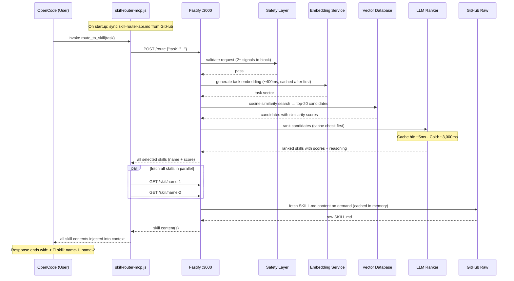

# Skills — An AI Skill Routing System

265 expert skills for AI coding agents, with a built-in routing engine that automatically selects and injects the right skill into your AI's context before it answers. No manual `/skill` commands — just ask, and the right expertise loads itself.

```
You → "review this Python code for security issues"
         ↓
   route_to_skill()  [auto-fires on every task]
         ↓
   embed → vector search → LLM re-rank → coding-security-review/SKILL.md
         ↓
   Full expert skill injected into context — AI answers as a security reviewer
```

---

## Quick Start

**With OpenAI (recommended):**

```bash
git clone https://github.com/paulpas/skills
cd skills
OPENAI_API_KEY=sk-... ./install-skill-router.sh --integrate-opencode
```

Restart OpenCode. Every task you type now automatically routes to the most relevant skill.

**No API key? Use a local model:**

```bash
./install-skill-router.sh \
  --provider llamacpp \
  --embedding-provider llamacpp \
  --llamacpp-url http://localhost:8080
```

> llama.cpp must serve both `/v1/chat/completions` and `/v1/embeddings`. No `OPENAI_API_KEY` required.

---

## FAQ

**Have questions?** Check the **[Comprehensive FAQ](./FAQ.md)** for 27 questions covering:
- Why MCP is better than direct skill loading
- How auto-routing works
- Skill management and creation
- Troubleshooting and best practices
- Offline mode, OpenCode integration, and more

---

## How It Works

Every time OpenCode receives a task, the `route_to_skill` MCP tool fires automatically:



### Latency

| Stage | Cold | Warm (cached) |
|---|---|---|
| Safety check | ~1 ms | ~1 ms |
| Task embedding | ~400 ms | ~1 ms (memory) |
| Vector search | ~1 ms | ~1 ms |
| LLM re-ranking | ~3,000 ms | ~5 ms (cache hit) |
| Skill content fetch | ~1 ms (disk) / ~150 ms (GitHub) | ~1 ms (memory) |
| **Total** | **~3.5 s** | **~10 ms** |

> Local llama.cpp drops cold LLM step to ~200–800 ms. Warm requests are fast regardless of provider.

### Key Behaviours

- **Multi-skill loading** — all high-confidence matches are fetched in parallel; the AI receives full context for each
- **Skill citation** — every response ends with `> 📖 skill: name-1, name-2` listing loaded skills
- **Auto index refresh** — `skills-index.json` is re-fetched from GitHub every `SKILL_SYNC_INTERVAL` seconds (default: 1 hour); new skills become routable without restart
- **API doc sync** — `skill-router-api.md` is fetched from GitHub on every MCP startup; edits to the repo file propagate automatically
- **LLM ranking cache** — identical task+candidates combos are served from memory (~5 ms) on repeat queries
- **Batch embeddings** — all skill embeddings are generated in parallel batches of 100 on startup (~2 s total)

---

## Monitoring

| What | Command |
|---|---|
| Skill accesses (MCP side) | `tail -f ~/.config/opencode/skill-router-mcp.log \| grep 'SKILL ACCESS'` |
| Full routing pipeline (Docker) | `docker logs -f skill-router 2>&1 \| grep -E 'Route result\|Vector search'` |
| Routing history (JSON) | `curl -s http://localhost:3000/access-log \| python3 -m json.tool` |
| Service health | `curl -s http://localhost:3000/health` |

---

## Utility Scripts

This repository includes automation scripts to maintain the skill catalog and improve trigger quality:

### 1. generate_readme.py

**Purpose:** Auto-generates the skills catalog in the README with zero manual effort.

**Location:** `scripts/generate_readme.py`

**What it does:**
- Reads all skill directories and extracts metadata (name, description, domain, role, triggers)
- Organizes skills into three auto-generated sections:
  - **Skills by Domain** — Grouped by domain category (agent, cncf, coding, trading, programming)
  - **Skills by Role** — Grouped by skill role (implementation, reference, orchestration, review)
  - **Complete Skills Index** — Alphabetical table of all 239+ skills with descriptions and triggers
- Inserts content between `<!-- AUTO-GENERATED SKILLS INDEX START/END -->` markers
- Preserves all existing README content outside the markers
- Includes generation timestamp
- Creates clickable hyperlinks to all skill SKILL.md files

**Usage:**
```bash
# Update README.md in-place
python3 scripts/generate_readme.py

# Generate custom output file
python3 scripts/generate_readme.py --output custom_skills.md
```

**When to use:**
- After adding new skills to the repository
- After modifying skill metadata (description, triggers, domain, role)
- Before committing changes to ensure README is up-to-date
- As part of CI/CD pipeline for automatic catalog maintenance

**Example output:**
All 239+ skills appear in the README with:
- Clickable links to `skills/<skill-name>/SKILL.md`
- Description from skill frontmatter
- Trigger keywords for skill discovery
- Organization by domain and role

---

### 2. enhance_triggers.py

**Purpose:** Adds user-friendly, conversational triggers to skills for improved discoverability.

**Location:** `scripts/enhance_triggers.py`

**What it does:**
- Scans all 239+ skills in the repository
- Identifies skills that could benefit from additional conversational triggers
- Adds user-friendly variants like:
  - "how do I..." questions
  - "what is..." clarifications
  - Common colloquialisms and business language
  - Related technology names
  - Operational task language
- Maintains the 5-8 term trigger limit per skill
- Generates detailed report in `TRIGGER_ENHANCEMENTS.md`
- Preserves YAML formatting and existing content

**Usage:**
```bash
# Enhance all skills and generate report
python3 scripts/enhance_triggers.py
```

**When to use:**
- After reviewing existing skill triggers for quality
- When skills need better user discovery
- After adding new skill categories
- To ensure triggers match both technical AND conversational language

**Example enhancements:**
```yaml
# Before
triggers: kubernetes, k8s, container orchestration, pod management

# After (with user-friendly variants added)
triggers: kubernetes, k8s, container orchestration, managing containers, how do i deploy apps
```

**Output:**
- Updates all SKILL.md files with improved triggers
- Generates `TRIGGER_ENHANCEMENTS.md` report showing:
  - All enhanced skills
  - Before/after trigger comparison
  - Enhancement statistics by domain
  - Quality assurance metrics

---

### 3. reformat_skills.py

**Purpose:** Validates and normalizes YAML frontmatter across all skills.

**Location:** `scripts/reformat_skills.py`

**What it does:**
- Validates YAML syntax in all skill frontmatter
- Normalizes formatting (indentation, field order)
- Fills in missing optional metadata fields from templates
- Reports errors and validation failures

**Usage:**
```bash
python3 scripts/reformat_skills.py
```

---

### 4. generate_index.py

**Purpose:** Regenerates the skill-router index for skill discovery.

**Location:** `generate_index.py` (top-level, maintained by repository)

**What it does:**
- Reads all skill metadata
- Generates `skills-index.json` for skill-router consumption
- Enables auto-loading of skills based on triggers
- Updates skill statistics and categorization

**Usage:**
```bash
python3 generate_index.py
```

---

## Recommended Workflow

When adding or modifying skills:

1. **Create or edit skill SKILL.md file**
   - Place in `skills/<skill-name>/` directory
   - Follow skill schema from [AGENTS.md](./AGENTS.md)

2. **Run reformat_skills.py**
   ```bash
   python3 scripts/reformat_skills.py
   ```

3. **Run enhance_triggers.py** (optional, for trigger improvement)
   ```bash
   python3 scripts/enhance_triggers.py
   ```

4. **Run generate_index.py**
   ```bash
   python3 generate_index.py
   ```

5. **Run generate_readme.py** (to update catalog)
   ```bash
   python3 scripts/generate_readme.py
   ```

6. **Commit and push**
   ```bash
   git add -A
   git commit -m "feat: add [skill-name] skill"
   git push origin main
   ```

**Or use one-line automation:**
```bash
python3 scripts/reformat_skills.py && \
python3 generate_index.py && \
python3 scripts/generate_readme.py
```

---

## The Skills Library

265 skills across 5 domains, organized in `skills/`. Each skill is a `SKILL.md` file with YAML frontmatter — the routing engine reads these directly.

```
skills-repo/
├── skills/                         ← all skill definitions live here
│   ├── agent-confidence-based-selector/
│   │   └── SKILL.md
│   ├── cncf-prometheus/
│   │   ├── SKILL.md
│   │   └── references/             ← optional sub-documents
│   ├── coding-code-review/
│   │   └── SKILL.md
│   ├── trading-risk-stop-loss/
│   │   └── SKILL.md
│   └── programming-algorithms/
│       └── SKILL.md
├── agent-skill-routing-system/     ← the HTTP routing service
├── README.md
├── SKILL_FORMAT_SPEC.md
├── reformat_skills.py
└── install-skill-router.sh
```

### Domain Prefixes

| Prefix | Description |
|---|---|
| `agent-*` | AI agent orchestration patterns (task decomposition, routing, planning) |
| `cncf-*` | CNCF cloud-native project reference (Kubernetes, Prometheus, Helm, etc.) |
| `coding-*` | Software engineering patterns (code review, TDD, FastAPI, Pydantic, etc.) |
| `trading-*` | Algorithmic trading implementation (risk management, execution, ML, backtesting) |
| `programming-*` | Algorithm and language reference material |

---

### Agent Orchestration

- [agent-confidence-based-selector](./skills/agent-confidence-based-selector/SKILL.md) — Selects the most appropriate skill based on confidence scores and relevance metrics
- [agent-dependency-graph-builder](./skills/agent-dependency-graph-builder/SKILL.md) — Builds and maintains dependency graphs for task execution
- [agent-dynamic-replanner](./skills/agent-dynamic-replanner/SKILL.md) — Dynamically adjusts execution plans based on real-time feedback and changing conditions
- [agent-goal-to-milestones](./skills/agent-goal-to-milestones/SKILL.md) — Translates high-level goals into actionable milestones
- [agent-multi-skill-executor](./skills/agent-multi-skill-executor/SKILL.md) — Orchestrates execution of multiple skills in sequence with dependency management
- [agent-parallel-skill-runner](./skills/agent-parallel-skill-runner/SKILL.md) — Executes multiple skills concurrently with synchronization and result collection
- [agent-task-decomposition-engine](./skills/agent-task-decomposition-engine/SKILL.md) — Decomposes complex tasks into manageable subtasks for specialized skills

---

### CNCF Cloud Native

#### Architecture & Best Practices

- [cncf-architecture-best-practices](./skills/cncf-architecture-best-practices/SKILL.md) — Production-grade Kubernetes: service mesh, CNI, GitOps, CI/CD, observability, security, networking, and scaling
- [cncf-networking-osi](./skills/cncf-networking-osi/SKILL.md) — OSI Model networking for cloud-native — all 7 layers with CNCF project mappings

#### Application Definition & Build

- [cncf-argo](./skills/cncf-argo/SKILL.md) — Kubernetes-native workflow, CI/CD, and governance
- [cncf-artifact-hub](./skills/cncf-artifact-hub/SKILL.md) — Repository for Kubernetes Helm, Falco, OPA, and more
- [cncf-backstage](./skills/cncf-backstage/SKILL.md) — Developer portal for microservices
- [cncf-buildpacks](./skills/cncf-buildpacks/SKILL.md) — Source code to container images without Dockerfiles
- [cncf-dapr](./skills/cncf-dapr/SKILL.md) — Distributed application runtime
- [cncf-helm](./skills/cncf-helm/SKILL.md) — The Kubernetes package manager
- [cncf-kubevela](./skills/cncf-kubevela/SKILL.md) — Kubernetes application platform
- [cncf-kubevirt](./skills/cncf-kubevirt/SKILL.md) — Virtualization on Kubernetes
- [cncf-operator-framework](./skills/cncf-operator-framework/SKILL.md) — Build and manage Kubernetes operators with standardized patterns

#### Container Runtime

- [cncf-containerd](./skills/cncf-containerd/SKILL.md) — Open and reliable container runtime
- [cncf-cri-o](./skills/cncf-cri-o/SKILL.md) — OCI-compliant container runtime for Kubernetes
- [cncf-krustlet](./skills/cncf-krustlet/SKILL.md) — Kubernetes runtime patterns and best practices
- [cncf-lima](./skills/cncf-lima/SKILL.md) — Container runtime patterns and best practices

#### Container Registry

- [cncf-dragonfly](./skills/cncf-dragonfly/SKILL.md) — P2P file distribution
- [cncf-harbor](./skills/cncf-harbor/SKILL.md) — Container registry
- [cncf-zot](./skills/cncf-zot/SKILL.md) — Cloud-native container registry patterns

#### Networking & Service Mesh

- [cncf-calico](./skills/cncf-calico/SKILL.md) — Cloud-native network security
- [cncf-cilium](./skills/cncf-cilium/SKILL.md) — eBPF-based cloud-native networking
- [cncf-cni](./skills/cncf-cni/SKILL.md) — Container Network Interface for Linux containers
- [cncf-container-network-interface-cni](./skills/cncf-container-network-interface-cni/SKILL.md) — CNI architecture patterns
- [cncf-contour](./skills/cncf-contour/SKILL.md) — Service proxy patterns
- [cncf-emissary-ingress](./skills/cncf-emissary-ingress/SKILL.md) — Kubernetes ingress controller
- [cncf-envoy](./skills/cncf-envoy/SKILL.md) — High-performance edge/middle/service proxy
- [cncf-grpc](./skills/cncf-grpc/SKILL.md) — Remote procedure call patterns
- [cncf-istio](./skills/cncf-istio/SKILL.md) — Connect, secure, control, and observe services
- [cncf-kong](./skills/cncf-kong/SKILL.md) — API gateway patterns
- [cncf-kong-ingress-controller](./skills/cncf-kong-ingress-controller/SKILL.md) — Kong Ingress Controller for Kubernetes
- [cncf-kuma](./skills/cncf-kuma/SKILL.md) — Service mesh patterns
- [cncf-linkerd](./skills/cncf-linkerd/SKILL.md) — Lightweight service mesh

#### Observability

- [cncf-cortex](./skills/cncf-cortex/SKILL.md) — Distributed, horizontally scalable Prometheus
- [cncf-fluentd](./skills/cncf-fluentd/SKILL.md) — Unified logging layer for cloud-native environments
- [cncf-jaeger](./skills/cncf-jaeger/SKILL.md) — Distributed tracing
- [cncf-open-telemetry](./skills/cncf-open-telemetry/SKILL.md) — OpenTelemetry architecture patterns
- [cncf-opentelemetry](./skills/cncf-opentelemetry/SKILL.md) — Vendor-neutral tracing, metrics, and logs framework
- [cncf-prometheus](./skills/cncf-prometheus/SKILL.md) — Monitoring system and time series database
- [cncf-thanos](./skills/cncf-thanos/SKILL.md) — High-availability Prometheus with long-term storage

#### Scheduling & Orchestration

- [cncf-crossplane](./skills/cncf-crossplane/SKILL.md) — Kubernetes-native multi-cloud infrastructure control plane
- [cncf-fluid](./skills/cncf-fluid/SKILL.md) — Kubernetes-native data acceleration for data-intensive apps
- [cncf-karmada](./skills/cncf-karmada/SKILL.md) — Multi-cluster orchestration
- [cncf-keda](./skills/cncf-keda/SKILL.md) — Event-driven autoscaling
- [cncf-knative](./skills/cncf-knative/SKILL.md) — Serverless on Kubernetes
- [cncf-kubeflow](./skills/cncf-kubeflow/SKILL.md) — ML on Kubernetes
- [cncf-kubernetes](./skills/cncf-kubernetes/SKILL.md) — Production-grade container scheduling and management
- [cncf-volcano](./skills/cncf-volcano/SKILL.md) — Batch scheduling infrastructure for Kubernetes
- [cncf-wasmcloud](./skills/cncf-wasmcloud/SKILL.md) — WebAssembly-based distributed applications platform

#### Security & Compliance

- [cncf-cert-manager](./skills/cncf-cert-manager/SKILL.md) — Certificate management for Kubernetes
- [cncf-falco](./skills/cncf-falco/SKILL.md) — Cloud-native runtime security
- [cncf-in-toto](./skills/cncf-in-toto/SKILL.md) — Supply chain security patterns
- [cncf-keycloak](./skills/cncf-keycloak/SKILL.md) — Identity and access management
- [cncf-kubescape](./skills/cncf-kubescape/SKILL.md) — Kubernetes security scanning
- [cncf-kyverno](./skills/cncf-kyverno/SKILL.md) — Kubernetes policy engine
- [cncf-notary-project](./skills/cncf-notary-project/SKILL.md) — Content trust and supply chain security
- [cncf-oathkeeper](./skills/cncf-oathkeeper/SKILL.md) — Identity and access proxy
- [cncf-open-policy-agent-opa](./skills/cncf-open-policy-agent-opa/SKILL.md) — Policy as code
- [cncf-openfga](./skills/cncf-openfga/SKILL.md) — Fine-grained authorization
- [cncf-openfeature](./skills/cncf-openfeature/SKILL.md) — Vendor-neutral feature flagging
- [cncf-ory-hydra](./skills/cncf-ory-hydra/SKILL.md) — OAuth 2.0 / OpenID Connect server
- [cncf-ory-kratos](./skills/cncf-ory-kratos/SKILL.md) — Cloud-native identity management
- [cncf-spiffe](./skills/cncf-spiffe/SKILL.md) — Secure production identity framework
- [cncf-spire](./skills/cncf-spire/SKILL.md) — SPIFFE implementation for real-world deployments
- [cncf-the-update-framework-tuf](./skills/cncf-the-update-framework-tuf/SKILL.md) — Secure software update framework

#### Storage

- [cncf-cubefs](./skills/cncf-cubefs/SKILL.md) — Distributed high-performance file system
- [cncf-longhorn](./skills/cncf-longhorn/SKILL.md) — Cloud-native storage patterns
- [cncf-rook](./skills/cncf-rook/SKILL.md) — Cloud-native storage orchestration for Kubernetes

#### Streaming & Messaging

- [cncf-cloudevents](./skills/cncf-cloudevents/SKILL.md) — Cloud-native event streaming patterns
- [cncf-nats](./skills/cncf-nats/SKILL.md) — Cloud-native messaging
- [cncf-strimzi](./skills/cncf-strimzi/SKILL.md) — Apache Kafka for cloud-native environments

#### Database & Key-Value

- [cncf-coredns](./skills/cncf-coredns/SKILL.md) — DNS server that chains plugins
- [cncf-etcd](./skills/cncf-etcd/SKILL.md) — Distributed key-value store
- [cncf-tikv](./skills/cncf-tikv/SKILL.md) — Distributed transactional key-value database
- [cncf-vitess](./skills/cncf-vitess/SKILL.md) — Horizontal scaling for MySQL

#### CI/CD & GitOps

- [cncf-flux](./skills/cncf-flux/SKILL.md) — GitOps for Kubernetes
- [cncf-openkruise](./skills/cncf-openkruise/SKILL.md) — Advanced Kubernetes workload management
- [cncf-tekton](./skills/cncf-tekton/SKILL.md) — Cloud-native pipeline resource

#### Automation & Edge

- [cncf-chaosmesh](./skills/cncf-chaosmesh/SKILL.md) — Chaos engineering platform for Kubernetes
- [cncf-cloud-custodian](./skills/cncf-cloud-custodian/SKILL.md) — Rules engine for cloud infrastructure management
- [cncf-flatcar-container-linux](./skills/cncf-flatcar-container-linux/SKILL.md) — Container-optimized Linux
- [cncf-kubeedge](./skills/cncf-kubeedge/SKILL.md) — Edge computing with Kubernetes
- [cncf-kserve](./skills/cncf-kserve/SKILL.md) — Model serving on Kubernetes
- [cncf-litmus](./skills/cncf-litmus/SKILL.md) — Cloud-native chaos engineering
- [cncf-metal3-io](./skills/cncf-metal3-io/SKILL.md) — Bare metal provisioning patterns
- [cncf-opencost](./skills/cncf-opencost/SKILL.md) — Kubernetes cost monitoring
- [cncf-openyurt](./skills/cncf-openyurt/SKILL.md) — Extending Kubernetes to edge scenarios

#### Process & Documentation

- [cncf-process-architecture](./skills/cncf-process-architecture/SKILL.md) — Create or update `ARCHITECTURE.md` for CNCF projects
- [cncf-process-incident-response](./skills/cncf-process-incident-response/SKILL.md) — Incident response plan: detection, triage, communication, post-incident review
- [cncf-process-releases](./skills/cncf-process-releases/SKILL.md) — Release process, versioning policy, and cadence documentation
- [cncf-process-security-policy](./skills/cncf-process-security-policy/SKILL.md) — Vulnerability reporting, disclosure timeline, and supported versions

---

### Coding Patterns

- [coding-code-review](./skills/coding-code-review/SKILL.md) — Bugs, security vulnerabilities, code smells, and architectural concerns with prioritized feedback
- [coding-conviction-scoring](./skills/coding-conviction-scoring/SKILL.md) — Trade confidence and risk assessment scoring
- [coding-data-normalization](./skills/coding-data-normalization/SKILL.md) — Typed dataclasses for ticker/trade/orderbook with exchange-specific parsing
- [coding-event-bus](./skills/coding-event-bus/SKILL.md) — Async pub/sub event bus with typed events and singleton initialization
- [coding-event-driven-architecture](./skills/coding-event-driven-architecture/SKILL.md) — Event-driven architecture for real-time systems: pub/sub, signal flow, strategy base
- [coding-fastapi-patterns](./skills/coding-fastapi-patterns/SKILL.md) — FastAPI structure: typed error hierarchy, exception handlers, CORS, request timing
- [coding-git-branching-strategies](./skills/coding-git-branching-strategies/SKILL.md) — Git Flow, GitHub Flow, Trunk-Based Development, and feature flag strategies
- [coding-juice-shop](./skills/coding-juice-shop/SKILL.md) — OWASP Juice Shop: web application security testing guide
- [coding-markdown-best-practices](./skills/coding-markdown-best-practices/SKILL.md) — Markdown syntax rules, common pitfalls, and documentation consistency
- [coding-pydantic-config](./skills/coding-pydantic-config/SKILL.md) — Pydantic config with frozen models, nested hierarchy, TOML/env parsing
- [coding-pydantic-models](./skills/coding-pydantic-models/SKILL.md) — Pydantic frozen data models: enums, annotated constraints, validators, computed properties
- [coding-security-review](./skills/coding-security-review/SKILL.md) — Security vulnerabilities: injection, XSS, insecure deserialization, misconfigurations
- [coding-strategy-base](./skills/coding-strategy-base/SKILL.md) — Abstract base strategy pattern with initialization guards and typed abstract methods
- [coding-test-driven-development](./skills/coding-test-driven-development/SKILL.md) — TDD and BDD with pytest, unit tests, mocking, and test pyramid principles
- [coding-websocket-manager](./skills/coding-websocket-manager/SKILL.md) — WebSocket state machine with exponential backoff and message routing

---

### Trading AI & ML

- [trading-ai-anomaly-detection](./skills/trading-ai-anomaly-detection/SKILL.md) — Detect anomalous market behavior, outliers, and potential manipulation
- [trading-ai-explainable-ai](./skills/trading-ai-explainable-ai/SKILL.md) — Explainable AI for understanding and trusting trading model decisions
- [trading-ai-feature-engineering](./skills/trading-ai-feature-engineering/SKILL.md) — Create actionable trading features from raw market data
- [trading-ai-hyperparameter-tuning](./skills/trading-ai-hyperparameter-tuning/SKILL.md) — Optimize model configurations for trading applications
- [trading-ai-live-model-monitoring](./skills/trading-ai-live-model-monitoring/SKILL.md) — Monitor production ML models for drift, decay, and performance degradation
- [trading-ai-llm-orchestration](./skills/trading-ai-llm-orchestration/SKILL.md) — LLM orchestration for trading analysis with structured output via instructor/pydantic
- [trading-ai-model-ensemble](./skills/trading-ai-model-ensemble/SKILL.md) — Combine multiple models for improved prediction accuracy
- [trading-ai-multi-asset-model](./skills/trading-ai-multi-asset-model/SKILL.md) — Model inter-asset relationships for portfolio and cross-asset strategies
- [trading-ai-news-embedding](./skills/trading-ai-news-embedding/SKILL.md) — Process news text using NLP embeddings for trading signals
- [trading-ai-order-flow-analysis](./skills/trading-ai-order-flow-analysis/SKILL.md) — Analyze order flow to detect market pressure and anticipate price moves
- [trading-ai-regime-classification](./skills/trading-ai-regime-classification/SKILL.md) — Detect current market regime for adaptive trading strategies
- [trading-ai-reinforcement-learning](./skills/trading-ai-reinforcement-learning/SKILL.md) — Reinforcement learning for automated trading agents and policy optimization
- [trading-ai-sentiment-analysis](./skills/trading-ai-sentiment-analysis/SKILL.md) — AI-powered sentiment from news, social media, and political figures
- [trading-ai-sentiment-features](./skills/trading-ai-sentiment-features/SKILL.md) — Extract market sentiment from news, social media, and analyst reports
- [trading-ai-synthetic-data](./skills/trading-ai-synthetic-data/SKILL.md) — Generate synthetic financial data for training and testing models
- [trading-ai-time-series-forecasting](./skills/trading-ai-time-series-forecasting/SKILL.md) — Time series forecasting for price prediction and market analysis
- [trading-ai-volatility-prediction](./skills/trading-ai-volatility-prediction/SKILL.md) — Forecast volatility for risk management and option pricing

---

### Trading Backtesting

- [trading-backtest-drawdown-analysis](./skills/trading-backtest-drawdown-analysis/SKILL.md) — Maximum drawdown, recovery time, and Value-at-Risk analysis
- [trading-backtest-lookahead-bias](./skills/trading-backtest-lookahead-bias/SKILL.md) — Prevent lookahead bias through strict causality enforcement and time-based validation
- [trading-backtest-position-exits](./skills/trading-backtest-position-exits/SKILL.md) — Exit strategies, trailing stops, and take-profit mechanisms
- [trading-backtest-position-sizing](./skills/trading-backtest-position-sizing/SKILL.md) — Fixed fractional, Kelly criterion, and volatility-adjusted sizing
- [trading-backtest-sharpe-ratio](./skills/trading-backtest-sharpe-ratio/SKILL.md) — Sharpe ratio and risk-adjusted performance metrics
- [trading-backtest-walk-forward](./skills/trading-backtest-walk-forward/SKILL.md) — Walk-forward optimization for robust strategy validation

---

### Trading Data Pipelines

- [trading-data-alternative-data](./skills/trading-data-alternative-data/SKILL.md) — Alternative data ingestion: news, social media, on-chain data sources
- [trading-data-backfill-strategy](./skills/trading-data-backfill-strategy/SKILL.md) — Strategic backfill for populating historical data
- [trading-data-candle-data](./skills/trading-data-candle-data/SKILL.md) — OHLCV processing, timeframe management, and validation
- [trading-data-enrichment](./skills/trading-data-enrichment/SKILL.md) — Add context to raw trading data
- [trading-data-feature-store](./skills/trading-data-feature-store/SKILL.md) — Feature storage and management for ML trading models
- [trading-data-lake](./skills/trading-data-lake/SKILL.md) — Data lake architecture for trading data storage
- [trading-data-order-book](./skills/trading-data-order-book/SKILL.md) — Order book handling, spread calculation, liquidity measurement
- [trading-data-stream-processing](./skills/trading-data-stream-processing/SKILL.md) — Streaming data processing for real-time signals and analytics
- [trading-data-time-series-database](./skills/trading-data-time-series-database/SKILL.md) — Time-series database queries and optimization for financial data
- [trading-data-validation](./skills/trading-data-validation/SKILL.md) — Data validation and quality assurance for trading pipelines

---

### Trading Exchange Integration

- [trading-exchange-ccxt-patterns](./skills/trading-exchange-ccxt-patterns/SKILL.md) — CCXT patterns: error handling, rate limiting, and state management
- [trading-exchange-failover-handling](./skills/trading-exchange-failover-handling/SKILL.md) — Automated failover and redundancy for exchange connectivity
- [trading-exchange-health](./skills/trading-exchange-health/SKILL.md) — Exchange health monitoring and connectivity status
- [trading-exchange-market-data-cache](./skills/trading-exchange-market-data-cache/SKILL.md) — High-performance caching for market data with low latency
- [trading-exchange-order-book-sync](./skills/trading-exchange-order-book-sync/SKILL.md) — Order book synchronization and state management
- [trading-exchange-order-execution-api](./skills/trading-exchange-order-execution-api/SKILL.md) — Order execution and management API
- [trading-exchange-rate-limiting](./skills/trading-exchange-rate-limiting/SKILL.md) — Rate limiting and circuit breaker patterns for exchange APIs
- [trading-exchange-trade-reporting](./skills/trading-exchange-trade-reporting/SKILL.md) — Real-time trade reporting and execution analytics
- [trading-exchange-websocket-handling](./skills/trading-exchange-websocket-handling/SKILL.md) — Real-time market data: connection management, data aggregation, error recovery
- [trading-exchange-websocket-streaming](./skills/trading-exchange-websocket-streaming/SKILL.md) — Real-time market data streaming and processing

---

### Trading Execution Algorithms

- [trading-execution-order-book-impact](./skills/trading-execution-order-book-impact/SKILL.md) — Order book impact measurement and market microstructure analysis
- [trading-execution-rate-limiting](./skills/trading-execution-rate-limiting/SKILL.md) — Rate limiting and exchange API management for robust execution
- [trading-execution-slippage-modeling](./skills/trading-execution-slippage-modeling/SKILL.md) — Slippage estimation, simulation, and fee modeling
- [trading-execution-twap](./skills/trading-execution-twap/SKILL.md) — Time-weighted average price for executing large orders with minimal impact
- [trading-execution-twap-vwap](./skills/trading-execution-twap-vwap/SKILL.md) — TWAP and VWAP: institutional-grade order execution
- [trading-execution-vwap](./skills/trading-execution-vwap/SKILL.md) — Volume-weighted average price execution

---

### Trading Paper Trading

- [trading-paper-commission-model](./skills/trading-paper-commission-model/SKILL.md) — Commission model and fee structure simulation
- [trading-paper-fill-simulation](./skills/trading-paper-fill-simulation/SKILL.md) — Fill simulation models for order execution probability
- [trading-paper-market-impact](./skills/trading-paper-market-impact/SKILL.md) — Market impact modeling and order book simulation
- [trading-paper-performance-attribution](./skills/trading-paper-performance-attribution/SKILL.md) — Performance attribution for trading strategy decomposition
- [trading-paper-realistic-simulation](./skills/trading-paper-realistic-simulation/SKILL.md) — Realistic paper trading with market impact and execution fees
- [trading-paper-slippage-model](./skills/trading-paper-slippage-model/SKILL.md) — Slippage modeling and execution simulation

---

### Trading Risk Management

- [trading-risk-correlation-risk](./skills/trading-risk-correlation-risk/SKILL.md) — Correlation breakdown and portfolio diversification risk
- [trading-risk-drawdown-control](./skills/trading-risk-drawdown-control/SKILL.md) — Maximum drawdown control and equity preservation
- [trading-risk-kill-switches](./skills/trading-risk-kill-switches/SKILL.md) — Multi-layered kill switches at account, strategy, market, and infrastructure levels
- [trading-risk-liquidity-risk](./skills/trading-risk-liquidity-risk/SKILL.md) — Liquidity assessment and trade execution risk
- [trading-risk-position-sizing](./skills/trading-risk-position-sizing/SKILL.md) — Kelly criterion, volatility adjustments, and edge-based sizing
- [trading-risk-stop-loss](./skills/trading-risk-stop-loss/SKILL.md) — Stop loss strategies for risk management
- [trading-risk-stress-testing](./skills/trading-risk-stress-testing/SKILL.md) — Stress test scenarios and portfolio resilience analysis
- [trading-risk-tail-risk](./skills/trading-risk-tail-risk/SKILL.md) — Tail risk management and extreme event protection
- [trading-risk-value-at-risk](./skills/trading-risk-value-at-risk/SKILL.md) — Value at Risk calculations for portfolio risk management

---

### Trading Technical Analysis

- [trading-technical-cycle-analysis](./skills/trading-technical-cycle-analysis/SKILL.md) — Market cycles and periodic patterns in price movement
- [trading-technical-false-signal-filtering](./skills/trading-technical-false-signal-filtering/SKILL.md) — False signal filtering for robust technical analysis
- [trading-technical-indicator-confluence](./skills/trading-technical-indicator-confluence/SKILL.md) — Indicator confluence validation for confirming trading signals
- [trading-technical-intermarket-analysis](./skills/trading-technical-intermarket-analysis/SKILL.md) — Cross-market relationships and asset class correlations
- [trading-technical-market-microstructure](./skills/trading-technical-market-microstructure/SKILL.md) — Order book dynamics and order flow analysis
- [trading-technical-momentum-indicators](./skills/trading-technical-momentum-indicators/SKILL.md) — RSI, MACD, stochastic oscillators, and momentum analysis
- [trading-technical-price-action-patterns](./skills/trading-technical-price-action-patterns/SKILL.md) — Candlestick and chart patterns for price movement prediction
- [trading-technical-regime-detection](./skills/trading-technical-regime-detection/SKILL.md) — Market regime detection for adaptive trading strategies
- [trading-technical-statistical-arbitrage](./skills/trading-technical-statistical-arbitrage/SKILL.md) — Pair trading and cointegration-based arbitrage
- [trading-technical-support-resistance](./skills/trading-technical-support-resistance/SKILL.md) — Technical levels where price tends to pause or reverse
- [trading-technical-trend-analysis](./skills/trading-technical-trend-analysis/SKILL.md) — Trend identification, classification, and continuation
- [trading-technical-volatility-analysis](./skills/trading-technical-volatility-analysis/SKILL.md) — Volatility measurement, forecasting, and risk assessment
- [trading-technical-volume-profile](./skills/trading-technical-volume-profile/SKILL.md) — Volume analysis for understanding market structure

---

### Trading Fundamentals

- [trading-fundamentals-market-regimes](./skills/trading-fundamentals-market-regimes/SKILL.md) — Market regime detection and adaptation across changing conditions
- [trading-fundamentals-market-structure](./skills/trading-fundamentals-market-structure/SKILL.md) — Market structure and trading participants analysis
- [trading-fundamentals-risk-management-basics](./skills/trading-fundamentals-risk-management-basics/SKILL.md) — Position sizing, stop-loss, and system-level risk controls
- [trading-fundamentals-trading-edge](./skills/trading-fundamentals-trading-edge/SKILL.md) — Finding and maintaining competitive advantage in trading systems
- [trading-fundamentals-trading-plan](./skills/trading-fundamentals-trading-plan/SKILL.md) — Trading plan structure and risk management framework
- [trading-fundamentals-trading-psychology](./skills/trading-fundamentals-trading-psychology/SKILL.md) — Emotional discipline, cognitive bias awareness, and operational integrity

---

### Programming

- [programming-algorithms](./skills/programming-algorithms/SKILL.md) — Algorithm selection guide: time/space trade-offs, input characteristics, and problem constraints

---

## Adding Skills

Create `skills/<domain>-<topic>/SKILL.md` following the format in [SKILL_FORMAT_SPEC.md](./SKILL_FORMAT_SPEC.md). Run `python reformat_skills.py` to apply standard frontmatter. Run `python3 generate_index.py` after adding a skill to update `skills-index.json`, then push. The router auto-discovers new skills within `SKILL_SYNC_INTERVAL` seconds (default: 1 hour). For immediate pickup: `curl -X POST http://localhost:3000/reload`

```yaml
---
name: my-skill-name
description: One-line description of what this skill does
license: MIT
compatibility: opencode
metadata:
  version: "1.0.0"
  domain: coding
  role: implementation
  scope: implementation
  output-format: code
  triggers: keyword1, keyword2, keyword3
---
```

Good triggers are specific and task-oriented (`kubernetes, k8s, pod, deployment, kubectl`) rather than generic (`cloud, infrastructure, ops`).

---

<!-- AUTO-GENERATED SKILLS INDEX START -->

> **Last updated:** 2026-04-25 08:06:36 UTC  
> **Total skills:** 1601

## Skills by Domain


### Agent (192 skills)

| Skill Name | Description | Triggers |
|---|---|---|
| [00-andruia-consultant](../../skills/00-andruia-consultant/SKILL.md) | Arquitecto de Soluciones Principal y Consultor Tecnológico... | 00 andruia consultant, andruia... |
| [10-andruia-skill-smith](../../skills/10-andruia-skill-smith/SKILL.md) | Ingeniero de Sistemas de Andru.ia. Diseña, redacta y... | 10 andruia skill smith, andruia... |
| [20-andruia-niche-intelligence](../../skills/20-andruia-niche-intelligence/SKILL.md) | Estratega de Inteligencia de Dominio de Andru.ia. Analiza... | 20 andruia niche intelligence, andruia... |
| [acceptance-orchestrator](../../skills/acceptance-orchestrator/SKILL.md) | Use when a coding task should be driven end-to-end from... | acceptance orchestrator, workflow... |
| [address-github-comments](../../skills/address-github-comments/SKILL.md) | Use when you need to address review or issue comments on an... | address github comments, workflow... |
| [agent-evaluation](../../skills/agent-evaluation/SKILL.md) | Testing and benchmarking LLM agents including behavioral... | agent evaluation, ai... |
| [agent-manager-skill](../../skills/agent-manager-skill/SKILL.md) | Manage multiple local CLI agents via tmux sessions... | agent manager skill, ai... |
| [agent-memory-systems](../../skills/agent-memory-systems/SKILL.md) | Memory is the cornerstone of intelligent agents. Without... | agent memory systems, memory... |
| [ai-agent-development](../../skills/ai-agent-development/SKILL.md) | AI agent development workflow for building autonomous... | ai agent development, granular... |
| [ai-agents-architect](../../skills/ai-agents-architect/SKILL.md) | Expert in designing and building autonomous AI agents.... | ai agents architect, ai... |
| [ai-dev-jobs-mcp](../../skills/ai-dev-jobs-mcp/SKILL.md) | Search 8,400+ AI and ML jobs across 489 companies, inspect... | ai dev jobs mcp, mcp... |
| [ai-ml](../../skills/ai-ml/SKILL.md) | AI and machine learning workflow covering LLM application... | ai ml, workflow... |
| [airflow-dag-patterns](../../skills/airflow-dag-patterns/SKILL.md) | Build production Apache Airflow DAGs with best practices... | airflow dag patterns, workflow... |
| [airtable-automation](../../skills/airtable-automation/SKILL.md) | Automate Airtable tasks via Rube MCP (Composio): records,... | airtable automation, automation... |
| [analyze-project](../../skills/analyze-project/SKILL.md) | Forensic root cause analyzer for Antigravity sessions.... | analyze project, meta... |
| [antigravity-skill-orchestrator](../../skills/antigravity-skill-orchestrator/SKILL.md) | A meta-skill that understands task requirements,... | antigravity skill orchestrator, meta... |
| [antigravity-workflows](../../skills/antigravity-workflows/SKILL.md) | Orchestrate multiple Antigravity skills through guided... | antigravity workflows, workflow... |
| [api-documentation](../../skills/api-documentation/SKILL.md) | API documentation workflow for generating OpenAPI specs,... | api documentation, granular... |
| [api-security-testing](../../skills/api-security-testing/SKILL.md) | API security testing workflow for REST and GraphQL APIs... | api security testing, granular... |
| [apify-actor-development](../../skills/apify-actor-development/SKILL.md) | Important: Before you begin, fill in the generatedBy... | apify actor development, automation... |
| [apify-actorization](../../skills/apify-actorization/SKILL.md) | Actorization converts existing software into reusable... | apify actorization, automation... |
| [apify-audience-analysis](../../skills/apify-audience-analysis/SKILL.md) | Understand audience demographics, preferences, behavior... | apify audience analysis, automation... |
| [apify-brand-reputation-monitoring](../../skills/apify-brand-reputation-monitoring/SKILL.md) | Scrape reviews, ratings, and brand mentions from multiple... | apify brand reputation monitoring, automation... |
| [apify-competitor-intelligence](../../skills/apify-competitor-intelligence/SKILL.md) | Analyze competitor strategies, content, pricing, ads, and... | apify competitor intelligence, automation... |
| [apify-content-analytics](../../skills/apify-content-analytics/SKILL.md) | Track engagement metrics, measure campaign ROI, and analyze... | apify content analytics, automation... |
| [apify-ecommerce](../../skills/apify-ecommerce/SKILL.md) | Extract product data, prices, reviews, and seller... | apify ecommerce, automation... |
| [apify-influencer-discovery](../../skills/apify-influencer-discovery/SKILL.md) | Find and evaluate influencers for brand partnerships,... | apify influencer discovery, automation... |
| [apify-lead-generation](../../skills/apify-lead-generation/SKILL.md) | Scrape leads from multiple platforms using Apify Actors | apify lead generation, automation... |
| [apify-market-research](../../skills/apify-market-research/SKILL.md) | Analyze market conditions, geographic opportunities,... | apify market research, automation... |
| [apify-trend-analysis](../../skills/apify-trend-analysis/SKILL.md) | Discover and track emerging trends across Google Trends,... | apify trend analysis, automation... |
| [apify-ultimate-scraper](../../skills/apify-ultimate-scraper/SKILL.md) | AI-driven data extraction from 55+ Actors across all major... | apify ultimate scraper, automation... |
| [ask-questions-if-underspecified](../../skills/ask-questions-if-underspecified/SKILL.md) | Clarify requirements before implementing. Use when serious... | ask questions if underspecified, workflow... |
| [audio-transcriber](../../skills/audio-transcriber/SKILL.md) | Transform audio recordings into professional Markdown... | audio transcriber, voice... |
| [audit-context-building](../../skills/audit-context-building/SKILL.md) | Enables ultra-granular, line-by-line code analysis to build... | audit context building, meta... |
| [auri-core](../../skills/auri-core/SKILL.md) | Auri: assistente de voz inteligente (Alexa + Claude... | auri core, voice... |
| [bash-scripting](../../skills/bash-scripting/SKILL.md) | Bash scripting workflow for creating production-ready shell... | bash scripting, granular... |
| [bdistill-behavioral-xray](../../skills/bdistill-behavioral-xray/SKILL.md) | X-ray any AI model's behavioral patterns — refusal... | bdistill behavioral xray, ai... |
| [behavioral-modes](../../skills/behavioral-modes/SKILL.md) | AI operational modes (brainstorm, implement, debug, review,... | behavioral modes, meta... |
| [bitbucket-automation](../../skills/bitbucket-automation/SKILL.md) | Automate Bitbucket repositories, pull requests, branches,... | bitbucket automation, workflow... |
| [blueprint](../../skills/blueprint/SKILL.md) | Turn a one-line objective into a step-by-step construction... | blueprint, planning... |
| [build](../../skills/build/SKILL.md) | build | build, workflow... |
| [cc-skill-backend-patterns](../../skills/cc-skill-backend-patterns/SKILL.md) | Backend architecture patterns, API design, database... | cc skill backend patterns, meta... |
| [cc-skill-clickhouse-io](../../skills/cc-skill-clickhouse-io/SKILL.md) | ClickHouse database patterns, query optimization,... | cc skill clickhouse io, meta... |
| [cc-skill-coding-standards](../../skills/cc-skill-coding-standards/SKILL.md) | Universal coding standards, best practices, and patterns... | cc skill coding standards, meta... |
| [cc-skill-continuous-learning](../../skills/cc-skill-continuous-learning/SKILL.md) | Development skill from everything-claude-code | cc skill continuous learning, meta... |
| [cc-skill-frontend-patterns](../../skills/cc-skill-frontend-patterns/SKILL.md) | Frontend development patterns for React, Next.js, state... | cc skill frontend patterns, meta... |
| [cc-skill-project-guidelines-example](../../skills/cc-skill-project-guidelines-example/SKILL.md) | Project Guidelines Skill (Example) | cc skill project guidelines example, meta... |
| [cc-skill-security-review](../../skills/cc-skill-security-review/SKILL.md) | This skill ensures all code follows security best practices... | cc skill security review, meta... |
| [cc-skill-strategic-compact](../../skills/cc-skill-strategic-compact/SKILL.md) | Development skill from everything-claude-code | cc skill strategic compact, meta... |
| [changelog-automation](../../skills/changelog-automation/SKILL.md) | Automate changelog generation from commits, PRs, and... | changelog automation, workflow... |
| [cicd-automation-workflow-automate](../../skills/cicd-automation-workflow-automate/SKILL.md) | You are a workflow automation expert specializing in... | cicd automation workflow automate, automation... |
| [circleci-automation](../../skills/circleci-automation/SKILL.md) | Automate CircleCI tasks via Rube MCP (Composio): trigger... | circleci automation, automation... |
| [clickup-automation](../../skills/clickup-automation/SKILL.md) | Automate ClickUp project management including tasks,... | clickup automation, automation... |
| [closed-loop-delivery](../../skills/closed-loop-delivery/SKILL.md) | Use when a coding task must be completed against explicit... | closed loop delivery, workflow... |
| [cloud-devops](../../skills/cloud-devops/SKILL.md) | Cloud infrastructure and DevOps workflow covering AWS,... | cloud devops, workflow... |
| [commit](../../skills/commit/SKILL.md) | ALWAYS use this skill when committing code changes — never... | commit, workflow... |
| [concise-planning](../../skills/concise-planning/SKILL.md) | Use when a user asks for a plan for a coding task, to... | concise planning, planning... |
| [conductor-implement](../../skills/conductor-implement/SKILL.md) | Execute tasks from a track's implementation plan following... | conductor implement, workflow... |
| [conductor-manage](../../skills/conductor-manage/SKILL.md) | Manage track lifecycle: archive, restore, delete, rename,... | conductor manage, workflow... |
| [conductor-new-track](../../skills/conductor-new-track/SKILL.md) | Create a new track with specification and phased... | conductor new track, workflow... |
| [conductor-revert](../../skills/conductor-revert/SKILL.md) | Git-aware undo by logical work unit (track, phase, or task) | conductor revert, workflow... |
| [conductor-setup](../../skills/conductor-setup/SKILL.md) | Configure a Rails project to work with Conductor (parallel... | conductor setup, workflow... |
| [conductor-status](../../skills/conductor-status/SKILL.md) | Display project status, active tracks, and next actions | conductor status, workflow... |
| [context-window-management](../../skills/context-window-management/SKILL.md) | Strategies for managing LLM context windows including... | context window management, memory... |
| [context7-auto-research](../../skills/context7-auto-research/SKILL.md) | Automatically fetch latest library/framework documentation... | context7 auto research, meta... |
| [conversation-memory](../../skills/conversation-memory/SKILL.md) | Persistent memory systems for LLM conversations including... | conversation memory, memory... |
| [create-branch](../../skills/create-branch/SKILL.md) | Create a git branch following Sentry naming conventions.... | create branch, workflow... |
| [create-issue-gate](../../skills/create-issue-gate/SKILL.md) | Use when starting a new implementation task and an issue... | create issue gate, workflow... |
| [create-pr](../../skills/create-pr/SKILL.md) | Alias for sentry-skills:pr-writer. Use when users... | create pr, workflow... |
| [database](../../skills/database/SKILL.md) | Database development and operations workflow covering SQL,... | database, workflow... |
| [development](../../skills/development/SKILL.md) | Comprehensive web, mobile, and backend development workflow... | development, workflow... |
| [diary](../../skills/diary/SKILL.md) | Unified Diary System: A context-preserving automated logger... | diary, meta... |
| [dispatching-parallel-agents](../../skills/dispatching-parallel-agents/SKILL.md) | Use when facing 2+ independent tasks that can be worked on... | dispatching parallel agents, ai... |
| [documentation](../../skills/documentation/SKILL.md) | Documentation generation workflow covering API docs,... | documentation, workflow... |
| [e2e-testing](../../skills/e2e-testing/SKILL.md) | End-to-end testing workflow with Playwright for browser... | e2e testing, granular... |
| [executing-plans](../../skills/executing-plans/SKILL.md) | Use when you have a written implementation plan to execute... | executing plans, workflow... |
| [fal-audio](../../skills/fal-audio/SKILL.md) | Text-to-speech and speech-to-text using fal.ai audio models | fal audio, voice... |
| [filesystem-context](../../skills/filesystem-context/SKILL.md) | Use for file-based context management, dynamic context... | filesystem context, meta... |
| [finishing-a-development-branch](../../skills/finishing-a-development-branch/SKILL.md) | Use when implementation is complete, all tests pass, and... | finishing a development branch, workflow... |
| [freshdesk-automation](../../skills/freshdesk-automation/SKILL.md) | Automate Freshdesk helpdesk operations including tickets,... | freshdesk automation, automation... |
| [full-stack-orchestration-full-stack-feature](../../skills/full-stack-orchestration-full-stack-feature/SKILL.md) | Use when working with full stack orchestration full stack... | full stack orchestration full stack feature, workflow... |
| [gemini-api-integration](../../skills/gemini-api-integration/SKILL.md) | Use when integrating Google Gemini API into projects.... | gemini api integration, automation... |
| [gh-review-requests](../../skills/gh-review-requests/SKILL.md) | Fetch unread GitHub notifications for open PRs where review... | gh review requests, workflow... |
| [git-advanced-workflows](../../skills/git-advanced-workflows/SKILL.md) | Master advanced Git techniques to maintain clean history,... | git advanced workflows, workflow... |
| [git-hooks-automation](../../skills/git-hooks-automation/SKILL.md) | Master Git hooks setup with Husky, lint-staged, pre-commit... | git hooks automation, workflow... |
| [git-pr-workflows-git-workflow](../../skills/git-pr-workflows-git-workflow/SKILL.md) | Orchestrate a comprehensive git workflow from code review... | git pr workflows git workflow, workflow... |
| [git-pr-workflows-onboard](../../skills/git-pr-workflows-onboard/SKILL.md) | You are an **expert onboarding specialist and knowledge... | git pr workflows onboard, workflow... |
| [git-pr-workflows-pr-enhance](../../skills/git-pr-workflows-pr-enhance/SKILL.md) | You are a PR optimization expert specializing in creating... | git pr workflows pr enhance, workflow... |
| [git-pushing](../../skills/git-pushing/SKILL.md) | Stage all changes, create a conventional commit, and push... | git pushing, workflow... |
| [github-actions-templates](../../skills/github-actions-templates/SKILL.md) | Production-ready GitHub Actions workflow patterns for... | github actions templates, workflow... |
| [github-automation](../../skills/github-automation/SKILL.md) | Automate GitHub repositories, issues, pull requests,... | github automation, workflow... |
| [github-workflow-automation](../../skills/github-workflow-automation/SKILL.md) | Patterns for automating GitHub workflows with AI... | github workflow automation, workflow... |
| [gitlab-automation](../../skills/gitlab-automation/SKILL.md) | Automate GitLab project management, issues, merge requests,... | gitlab automation, workflow... |
| [gitlab-ci-patterns](../../skills/gitlab-ci-patterns/SKILL.md) | Comprehensive GitLab CI/CD pipeline patterns for automated... | gitlab ci patterns, workflow... |
| [google-analytics-automation](../../skills/google-analytics-automation/SKILL.md) | Automate Google Analytics tasks via Rube MCP (Composio):... | google analytics automation, automation... |
| [google-docs-automation](../../skills/google-docs-automation/SKILL.md) | Lightweight Google Docs integration with standalone OAuth... | google docs automation, automation... |
| [google-drive-automation](../../skills/google-drive-automation/SKILL.md) | Lightweight Google Drive integration with standalone OAuth... | google drive automation, automation... |
| [helpdesk-automation](../../skills/helpdesk-automation/SKILL.md) | Automate HelpDesk tasks via Rube MCP (Composio): list... | helpdesk automation, automation... |
| [hierarchical-agent-memory](../../skills/hierarchical-agent-memory/SKILL.md) | Scoped CLAUDE.md memory system that reduces context token... | hierarchical agent memory, memory... |
| [hosted-agents](../../skills/hosted-agents/SKILL.md) | Build background agents in sandboxed environments. Use for... | hosted agents, ai... |
| [hosted-agents-v2-py](../../skills/hosted-agents-v2-py/SKILL.md) | Build hosted agents using Azure AI Projects SDK with... | hosted agents v2 py, ai... |
| [hubspot-automation](../../skills/hubspot-automation/SKILL.md) | Automate HubSpot CRM operations (contacts, companies,... | hubspot automation, automation... |
| [inngest](../../skills/inngest/SKILL.md) | Inngest expert for serverless-first background jobs,... | inngest, workflow... |
| [intercom-automation](../../skills/intercom-automation/SKILL.md) | Automate Intercom tasks via Rube MCP (Composio):... | intercom automation, automation... |
| [issues](../../skills/issues/SKILL.md) | Interact with GitHub issues - create, list, and view issues | issues, workflow... |
| [iterate-pr](../../skills/iterate-pr/SKILL.md) | Iterate on a PR until CI passes. Use when you need to fix... | iterate pr, workflow... |
| [kubernetes-deployment](../../skills/kubernetes-deployment/SKILL.md) | Kubernetes deployment workflow for container orchestration,... | kubernetes deployment, granular... |
| [lambda-lang](../../skills/lambda-lang/SKILL.md) | Native agent-to-agent language for compact multi-agent... | lambda lang, ai... |
| [langgraph](../../skills/langgraph/SKILL.md) | Expert in LangGraph - the production-grade framework for... | langgraph, ai... |
| [lint-and-validate](../../skills/lint-and-validate/SKILL.md) | MANDATORY: Run appropriate validation tools after EVERY... | lint and validate, workflow... |
| [linux-troubleshooting](../../skills/linux-troubleshooting/SKILL.md) | Linux system troubleshooting workflow for diagnosing and... | linux troubleshooting, granular... |
| [m365-agents-dotnet](../../skills/m365-agents-dotnet/SKILL.md) | Microsoft 365 Agents SDK for .NET. Build multichannel... | m365 agents dotnet, ai... |
| [m365-agents-ts](../../skills/m365-agents-ts/SKILL.md) | Microsoft 365 Agents SDK for TypeScript/Node.js | m365 agents ts, ai... |
| [make-automation](../../skills/make-automation/SKILL.md) | Automate Make (Integromat) tasks via Rube MCP (Composio):... | make automation, automation... |
| [mcp-builder](../../skills/mcp-builder/SKILL.md) | Create MCP (Model Context Protocol) servers that enable... | mcp builder, ai... |
| [mcp-builder-ms](../../skills/mcp-builder-ms/SKILL.md) | Use this skill when building MCP servers to integrate... | mcp builder ms, ai... |
| [memory-systems](../../skills/memory-systems/SKILL.md) | Design short-term, long-term, and graph-based memory... | memory systems, memory... |
| [ml-pipeline-workflow](../../skills/ml-pipeline-workflow/SKILL.md) | Complete end-to-end MLOps pipeline orchestration from data... | ml pipeline workflow, workflow... |
| [multi-advisor](../../skills/multi-advisor/SKILL.md) | Conselho de especialistas — consulta multiplos agentes do... | multi advisor, ai... |
| [multi-agent-patterns](../../skills/multi-agent-patterns/SKILL.md) | This skill should be used when the user asks to | multi agent patterns, ai... |
| [multi-agent-task-orchestrator](../../skills/multi-agent-task-orchestrator/SKILL.md) | Route tasks to specialized AI agents with anti-duplication,... | multi agent task orchestrator, agent... |
| [n8n-code-javascript](../../skills/n8n-code-javascript/SKILL.md) | Write JavaScript code in n8n Code nodes. Use when writing... | n8n code javascript, automation... |
| [n8n-code-python](../../skills/n8n-code-python/SKILL.md) | Write Python code in n8n Code nodes. Use when writing... | n8n code python, automation... |
| [n8n-expression-syntax](../../skills/n8n-expression-syntax/SKILL.md) | Validate n8n expression syntax and fix common errors. Use... | n8n expression syntax, automation... |
| [n8n-mcp-tools-expert](../../skills/n8n-mcp-tools-expert/SKILL.md) | Expert guide for using n8n-mcp MCP tools effectively. Use... | n8n mcp tools expert, automation... |
| [n8n-node-configuration](../../skills/n8n-node-configuration/SKILL.md) | Operation-aware node configuration guidance. Use when... | n8n node configuration, automation... |
| [n8n-validation-expert](../../skills/n8n-validation-expert/SKILL.md) | Expert guide for interpreting and fixing n8n validation... | n8n validation expert, automation... |
| [n8n-workflow-patterns](../../skills/n8n-workflow-patterns/SKILL.md) | Proven architectural patterns for building n8n workflows | n8n workflow patterns, automation... |
| [not-human-search-mcp](../../skills/not-human-search-mcp/SKILL.md) | Search AI-ready websites, inspect indexed site details,... | not human search mcp, mcp... |
| [notion-automation](../../skills/notion-automation/SKILL.md) | Automate Notion tasks via Rube MCP (Composio): pages,... | notion automation, automation... |
| [os-scripting](../../skills/os-scripting/SKILL.md) | Operating system and shell scripting troubleshooting... | os scripting, workflow... |
| [outlook-automation](../../skills/outlook-automation/SKILL.md) | Automate Outlook tasks via Rube MCP (Composio): emails,... | outlook automation, automation... |
| [outlook-calendar-automation](../../skills/outlook-calendar-automation/SKILL.md) | Automate Outlook Calendar tasks via Rube MCP (Composio):... | outlook calendar automation, automation... |
| [parallel-agents](../../skills/parallel-agents/SKILL.md) | Multi-agent orchestration patterns. Use when multiple... | parallel agents, ai... |
| [pipecat-friday-agent](../../skills/pipecat-friday-agent/SKILL.md) | Build a low-latency, Iron Man-inspired tactical voice... | pipecat friday agent, voice... |
| [plan-writing](../../skills/plan-writing/SKILL.md) | Structured task planning with clear breakdowns,... | plan writing, planning... |
| [planning-with-files](../../skills/planning-with-files/SKILL.md) | Work like Manus: Use persistent markdown files as your | planning with files, planning... |
| [postgresql-optimization](../../skills/postgresql-optimization/SKILL.md) | PostgreSQL database optimization workflow for query tuning,... | postgresql optimization, granular... |
| [pr-writer](../../skills/pr-writer/SKILL.md) | Create pull requests following Sentry's engineering... | pr writer, workflow... |
| [prompt-engineer](../../skills/prompt-engineer/SKILL.md) | Transforms user prompts into optimized prompts using... | prompt engineer, automation... |
| [pydantic-ai](../../skills/pydantic-ai/SKILL.md) | Build production-ready AI agents with PydanticAI —... | pydantic ai, ai... |
| [python-fastapi-development](../../skills/python-fastapi-development/SKILL.md) | Python FastAPI backend development with async patterns,... | python fastapi development, granular... |
| [rag-implementation](../../skills/rag-implementation/SKILL.md) | RAG (Retrieval-Augmented Generation) implementation... | rag implementation, granular... |
| [react-nextjs-development](../../skills/react-nextjs-development/SKILL.md) | React and Next.js 14+ application development with App... | react nextjs development, granular... |
| [recallmax](../../skills/recallmax/SKILL.md) | FREE — God-tier long-context memory for AI agents. Injects... | recallmax, memory... |
| [receiving-code-review](../../skills/receiving-code-review/SKILL.md) | Code review requires technical evaluation, not emotional... | receiving code review, workflow... |
| [render-automation](../../skills/render-automation/SKILL.md) | Automate Render tasks via Rube MCP (Composio): services,... | render automation, automation... |
| [requesting-code-review](../../skills/requesting-code-review/SKILL.md) | Use when completing tasks, implementing major features, or... | requesting code review, workflow... |
| [security-audit](../../skills/security-audit/SKILL.md) | Comprehensive security auditing workflow covering web... | security audit, workflow... |
| [sendgrid-automation](../../skills/sendgrid-automation/SKILL.md) | Automate SendGrid email delivery workflows including... | sendgrid automation, automation... |
| [shopify-automation](../../skills/shopify-automation/SKILL.md) | Automate Shopify tasks via Rube MCP (Composio): products,... | shopify automation, automation... |
| [skill-creator](../../skills/skill-creator/SKILL.md) | To create new CLI skills following Anthropic's official... | skill creator, meta... |
| [skill-creator-ms](../../skills/skill-creator-ms/SKILL.md) | Guide for creating effective skills for AI coding agents... | skill creator ms, meta... |
| [skill-developer](../../skills/skill-developer/SKILL.md) | Comprehensive guide for creating and managing skills in... | skill developer, meta... |
| [skill-improver](../../skills/skill-improver/SKILL.md) | Iteratively improve a Claude Code skill using the... | skill improver, meta... |
| [skill-installer](../../skills/skill-installer/SKILL.md) | Instala, valida, registra e verifica novas skills no... | skill installer, meta... |
| [skill-optimizer](../../skills/skill-optimizer/SKILL.md) | Diagnose and optimize Agent Skills (SKILL.md) with real... | skill optimizer, meta... |
| [skill-rails-upgrade](../../skills/skill-rails-upgrade/SKILL.md) | Analyze Rails apps and provide upgrade assessments | skill rails upgrade, meta... |
| [skill-router](../../skills/skill-router/SKILL.md) | Use when the user is unsure which skill to use or where to... | skill router, meta... |
| [skill-scanner](../../skills/skill-scanner/SKILL.md) | Scan agent skills for security issues before adoption.... | skill scanner, meta... |
| [skill-seekers](../../skills/skill-seekers/SKILL.md) | -Automatically convert documentation websites, GitHub... | skill seekers, meta... |
| [skill-sentinel](../../skills/skill-sentinel/SKILL.md) | Auditoria e evolucao do ecossistema de skills. Qualidade de... | skill sentinel, meta... |
| [skill-writer](../../skills/skill-writer/SKILL.md) | Create and improve agent skills following the Agent Skills... | skill writer, meta... |
| [slack-automation](../../skills/slack-automation/SKILL.md) | Automate Slack workspace operations including messaging,... | slack automation, automation... |
| [stripe-automation](../../skills/stripe-automation/SKILL.md) | Automate Stripe tasks via Rube MCP (Composio): customers,... | stripe automation, automation... |
| [subagent-driven-development](../../skills/subagent-driven-development/SKILL.md) | Use when executing implementation plans with independent... | subagent driven development, workflow... |
| [task-intelligence](../../skills/task-intelligence/SKILL.md) | Protocolo de Inteligência Pré-Tarefa — ativa TODOS os... | task intelligence, workflow... |
| [temporal-golang-pro](../../skills/temporal-golang-pro/SKILL.md) | Use when building durable distributed systems with Temporal... | temporal golang pro, workflow... |
| [temporal-python-pro](../../skills/temporal-python-pro/SKILL.md) | Master Temporal workflow orchestration with Python SDK.... | temporal python pro, workflow... |
| [terraform-infrastructure](../../skills/terraform-infrastructure/SKILL.md) | Terraform infrastructure as code workflow for provisioning... | terraform infrastructure, granular... |
| [testing-qa](../../skills/testing-qa/SKILL.md) | Comprehensive testing and QA workflow covering unit... | testing qa, workflow... |
| [track-management](../../skills/track-management/SKILL.md) | Use this skill when creating, managing, or working with... | track management, planning... |
| [trigger-dev](../../skills/trigger-dev/SKILL.md) | Trigger.dev expert for background jobs, AI workflows, and... | trigger dev, workflow... |
| [upstash-qstash](../../skills/upstash-qstash/SKILL.md) | Upstash QStash expert for serverless message queues,... | upstash qstash, workflow... |
| [using-superpowers](../../skills/using-superpowers/SKILL.md) | Use when starting any conversation - establishes how to... | using superpowers, meta... |
| [verification-before-completion](../../skills/verification-before-completion/SKILL.md) | Claiming work is complete without verification is... | verification before completion, workflow... |
| [viboscope](../../skills/viboscope/SKILL.md) | Psychological compatibility matching — find cofounders,... | viboscope, collaboration... |
| [voice-ai-development](../../skills/voice-ai-development/SKILL.md) | Expert in building voice AI applications - from real-time... | voice ai development, voice... |
| [web-security-testing](../../skills/web-security-testing/SKILL.md) | Web application security testing workflow for OWASP Top 10... | web security testing, granular... |
| [wordpress](../../skills/wordpress/SKILL.md) | Complete WordPress development workflow covering theme... | wordpress, workflow... |
| [wordpress-plugin-development](../../skills/wordpress-plugin-development/SKILL.md) | WordPress plugin development workflow covering plugin... | wordpress plugin development, granular... |
| [wordpress-theme-development](../../skills/wordpress-theme-development/SKILL.md) | WordPress theme development workflow covering theme... | wordpress theme development, granular... |
| [wordpress-woocommerce-development](../../skills/wordpress-woocommerce-development/SKILL.md) | WooCommerce store development workflow covering store... | wordpress woocommerce development, granular... |
| [workflow-automation](../../skills/workflow-automation/SKILL.md) | Workflow automation is the infrastructure that makes AI... | workflow automation, workflow... |
| [workflow-orchestration-patterns](../../skills/workflow-orchestration-patterns/SKILL.md) | Master workflow orchestration architecture with Temporal,... | workflow orchestration patterns, workflow... |
| [workflow-patterns](../../skills/workflow-patterns/SKILL.md) | Use this skill when implementing tasks according to... | workflow patterns, workflow... |
| [writing-plans](../../skills/writing-plans/SKILL.md) | Use when you have a spec or requirements for a multi-step... | writing plans, planning... |
| [writing-skills](../../skills/writing-skills/SKILL.md) | Use when creating, updating, or improving agent skills | writing skills, meta... |
| [zapier-make-patterns](../../skills/zapier-make-patterns/SKILL.md) | No-code automation democratizes workflow building. Zapier... | zapier make patterns, automation... |
| [zendesk-automation](../../skills/zendesk-automation/SKILL.md) | Automate Zendesk tasks via Rube MCP (Composio): tickets,... | zendesk automation, automation... |
| [zipai-optimizer](../../skills/zipai-optimizer/SKILL.md) | Adaptive token optimizer: intelligent filtering, surgical... | zipai optimizer, agent... |
| [zoom-automation](../../skills/zoom-automation/SKILL.md) | Automate Zoom meeting creation, management, recordings,... | zoom automation, automation... |


### Cncf (287 skills)

| Skill Name | Description | Triggers |
|---|---|---|
| [aegisops-ai](../../skills/aegisops-ai/SKILL.md) | Autonomous DevSecOps & FinOps Guardrails. Orchestrates... | aegisops ai, devops... |
| [algolia-search](../../skills/algolia-search/SKILL.md) | Expert patterns for Algolia search implementation, indexing... | algolia search, api... |
| [amazon-alexa](../../skills/amazon-alexa/SKILL.md) | Integracao completa com Amazon Alexa para criar skills de... | amazon alexa, cloud... |
| [application-performance-performance-optimization](../../skills/application-performance-performance-optimization/SKILL.md) | Optimize end-to-end application performance with profiling,... | application performance performance optimization, reliability... |
| [aws-cost-cleanup](../../skills/aws-cost-cleanup/SKILL.md) | Automated cleanup of unused AWS resources to reduce costs | aws cost cleanup, cloud... |
| [aws-cost-optimizer](../../skills/aws-cost-optimizer/SKILL.md) | Comprehensive AWS cost analysis and optimization... | aws cost optimizer, cloud... |
| [aws-penetration-testing](../../skills/aws-penetration-testing/SKILL.md) | Provide comprehensive techniques for penetration testing... | aws penetration testing, cloud... |
| [aws-serverless](../../skills/aws-serverless/SKILL.md) | Specialized skill for building production-ready serverless... | aws serverless, cloud... |
| [aws-skills](../../skills/aws-skills/SKILL.md) | AWS development with infrastructure automation and cloud... | aws skills, cloud... |
| [azd-deployment](../../skills/azd-deployment/SKILL.md) | Deploy containerized frontend + backend applications to... | azd deployment, cloud... |
| [azure-ai-agents-persistent-dotnet](../../skills/azure-ai-agents-persistent-dotnet/SKILL.md) | Azure AI Agents Persistent SDK for .NET. Low-level SDK for... | azure ai agents persistent dotnet, cloud... |
| [azure-ai-agents-persistent-java](../../skills/azure-ai-agents-persistent-java/SKILL.md) | Azure AI Agents Persistent SDK for Java. Low-level SDK for... | azure ai agents persistent java, cloud... |
| [azure-ai-anomalydetector-java](../../skills/azure-ai-anomalydetector-java/SKILL.md) | Build anomaly detection applications with Azure AI Anomaly... | azure ai anomalydetector java, cloud... |
| [azure-ai-contentsafety-java](../../skills/azure-ai-contentsafety-java/SKILL.md) | Build content moderation applications using the Azure AI... | azure ai contentsafety java, cloud... |
| [azure-ai-contentsafety-py](../../skills/azure-ai-contentsafety-py/SKILL.md) | Azure AI Content Safety SDK for Python. Use for detecting... | azure ai contentsafety py, cloud... |
| [azure-ai-contentsafety-ts](../../skills/azure-ai-contentsafety-ts/SKILL.md) | Analyze text and images for harmful content with... | azure ai contentsafety ts, cloud... |
| [azure-ai-contentunderstanding-py](../../skills/azure-ai-contentunderstanding-py/SKILL.md) | Azure AI Content Understanding SDK for Python. Use for... | azure ai contentunderstanding py, cloud... |
| [azure-ai-document-intelligence-dotnet](../../skills/azure-ai-document-intelligence-dotnet/SKILL.md) | Azure AI Document Intelligence SDK for .NET. Extract text,... | azure ai document intelligence dotnet, cloud... |
| [azure-ai-document-intelligence-ts](../../skills/azure-ai-document-intelligence-ts/SKILL.md) | Extract text, tables, and structured data from documents... | azure ai document intelligence ts, cloud... |
| [azure-ai-formrecognizer-java](../../skills/azure-ai-formrecognizer-java/SKILL.md) | Build document analysis applications using the Azure AI... | azure ai formrecognizer java, cloud... |
| [azure-ai-ml-py](../../skills/azure-ai-ml-py/SKILL.md) | Azure Machine Learning SDK v2 for Python. Use for ML... | azure ai ml py, cloud... |
| [azure-ai-openai-dotnet](../../skills/azure-ai-openai-dotnet/SKILL.md) | Azure OpenAI SDK for .NET. Client library for Azure OpenAI... | azure ai openai dotnet, cloud... |
| [azure-ai-projects-dotnet](../../skills/azure-ai-projects-dotnet/SKILL.md) | Azure AI Projects SDK for .NET. High-level client for Azure... | azure ai projects dotnet, cloud... |
| [azure-ai-projects-java](../../skills/azure-ai-projects-java/SKILL.md) | Azure AI Projects SDK for Java. High-level SDK for Azure AI... | azure ai projects java, cloud... |
| [azure-ai-projects-py](../../skills/azure-ai-projects-py/SKILL.md) | Build AI applications on Microsoft Foundry using the... | azure ai projects py, cloud... |
| [azure-ai-projects-ts](../../skills/azure-ai-projects-ts/SKILL.md) | High-level SDK for Azure AI Foundry projects with agents,... | azure ai projects ts, cloud... |
| [azure-ai-textanalytics-py](../../skills/azure-ai-textanalytics-py/SKILL.md) | Azure AI Text Analytics SDK for sentiment analysis, entity... | azure ai textanalytics py, cloud... |
| [azure-ai-transcription-py](../../skills/azure-ai-transcription-py/SKILL.md) | Azure AI Transcription SDK for Python. Use for real-time... | azure ai transcription py, cloud... |
| [azure-ai-translation-document-py](../../skills/azure-ai-translation-document-py/SKILL.md) | Azure AI Document Translation SDK for batch translation of... | azure ai translation document py, cloud... |
| [azure-ai-translation-text-py](../../skills/azure-ai-translation-text-py/SKILL.md) | Azure AI Text Translation SDK for real-time text... | azure ai translation text py, cloud... |
| [azure-ai-translation-ts](../../skills/azure-ai-translation-ts/SKILL.md) | Text and document translation with REST-style clients | azure ai translation ts, cloud... |
| [azure-ai-vision-imageanalysis-java](../../skills/azure-ai-vision-imageanalysis-java/SKILL.md) | Build image analysis applications with Azure AI Vision SDK... | azure ai vision imageanalysis java, cloud... |
| [azure-ai-vision-imageanalysis-py](../../skills/azure-ai-vision-imageanalysis-py/SKILL.md) | Azure AI Vision Image Analysis SDK for captions, tags,... | azure ai vision imageanalysis py, cloud... |
| [azure-ai-voicelive-dotnet](../../skills/azure-ai-voicelive-dotnet/SKILL.md) | Azure AI Voice Live SDK for .NET. Build real-time voice AI... | azure ai voicelive dotnet, cloud... |
| [azure-ai-voicelive-java](../../skills/azure-ai-voicelive-java/SKILL.md) | Azure AI VoiceLive SDK for Java. Real-time bidirectional... | azure ai voicelive java, cloud... |
| [azure-ai-voicelive-py](../../skills/azure-ai-voicelive-py/SKILL.md) | Build real-time voice AI applications with bidirectional... | azure ai voicelive py, cloud... |
| [azure-ai-voicelive-ts](../../skills/azure-ai-voicelive-ts/SKILL.md) | Azure AI Voice Live SDK for JavaScript/TypeScript. Build... | azure ai voicelive ts, cloud... |
| [azure-appconfiguration-java](../../skills/azure-appconfiguration-java/SKILL.md) | Azure App Configuration SDK for Java. Centralized... | azure appconfiguration java, cloud... |
| [azure-appconfiguration-py](../../skills/azure-appconfiguration-py/SKILL.md) | Azure App Configuration SDK for Python. Use for centralized... | azure appconfiguration py, cloud... |
| [azure-appconfiguration-ts](../../skills/azure-appconfiguration-ts/SKILL.md) | Centralized configuration management with feature flags and... | azure appconfiguration ts, cloud... |
| [azure-communication-callautomation-java](../../skills/azure-communication-callautomation-java/SKILL.md) | Build server-side call automation workflows including IVR... | azure communication callautomation java, cloud... |
| [azure-communication-callingserver-java](../../skills/azure-communication-callingserver-java/SKILL.md) | ⚠️ DEPRECATED: This SDK has been renamed to Call... | azure communication callingserver java, cloud... |
| [azure-communication-chat-java](../../skills/azure-communication-chat-java/SKILL.md) | Build real-time chat applications with thread management,... | azure communication chat java, cloud... |
| [azure-communication-common-java](../../skills/azure-communication-common-java/SKILL.md) | Azure Communication Services common utilities for Java. Use... | azure communication common java, cloud... |
| [azure-communication-sms-java](../../skills/azure-communication-sms-java/SKILL.md) | Send SMS messages with Azure Communication Services SMS... | azure communication sms java, cloud... |
| [azure-compute-batch-java](../../skills/azure-compute-batch-java/SKILL.md) | Azure Batch SDK for Java. Run large-scale parallel and HPC... | azure compute batch java, cloud... |
| [azure-containerregistry-py](../../skills/azure-containerregistry-py/SKILL.md) | Azure Container Registry SDK for Python. Use for managing... | azure containerregistry py, cloud... |
| [azure-cosmos-db-py](../../skills/azure-cosmos-db-py/SKILL.md) | Build production-grade Azure Cosmos DB NoSQL services... | azure cosmos db py, cloud... |
| [azure-cosmos-java](../../skills/azure-cosmos-java/SKILL.md) | Azure Cosmos DB SDK for Java. NoSQL database operations... | azure cosmos java, cloud... |
| [azure-cosmos-py](../../skills/azure-cosmos-py/SKILL.md) | Azure Cosmos DB SDK for Python (NoSQL API). Use for... | azure cosmos py, cloud... |
| [azure-cosmos-rust](../../skills/azure-cosmos-rust/SKILL.md) | Azure Cosmos DB SDK for Rust (NoSQL API). Use for document... | azure cosmos rust, cloud... |
| [azure-cosmos-ts](../../skills/azure-cosmos-ts/SKILL.md) | Azure Cosmos DB JavaScript/TypeScript SDK (@azure/cosmos)... | azure cosmos ts, cloud... |
| [azure-data-tables-java](../../skills/azure-data-tables-java/SKILL.md) | Build table storage applications using the Azure Tables SDK... | azure data tables java, cloud... |
| [azure-data-tables-py](../../skills/azure-data-tables-py/SKILL.md) | Azure Tables SDK for Python (Storage and Cosmos DB). Use... | azure data tables py, cloud... |
| [azure-eventgrid-dotnet](../../skills/azure-eventgrid-dotnet/SKILL.md) | Azure Event Grid SDK for .NET. Client library for... | azure eventgrid dotnet, cloud... |
| [azure-eventgrid-java](../../skills/azure-eventgrid-java/SKILL.md) | Build event-driven applications with Azure Event Grid SDK... | azure eventgrid java, cloud... |
| [azure-eventgrid-py](../../skills/azure-eventgrid-py/SKILL.md) | Azure Event Grid SDK for Python. Use for publishing events,... | azure eventgrid py, cloud... |
| [azure-eventhub-dotnet](../../skills/azure-eventhub-dotnet/SKILL.md) | Azure Event Hubs SDK for .NET | azure eventhub dotnet, cloud... |
| [azure-eventhub-java](../../skills/azure-eventhub-java/SKILL.md) | Build real-time streaming applications with Azure Event... | azure eventhub java, cloud... |
| [azure-eventhub-py](../../skills/azure-eventhub-py/SKILL.md) | Azure Event Hubs SDK for Python streaming. Use for... | azure eventhub py, cloud... |
| [azure-eventhub-rust](../../skills/azure-eventhub-rust/SKILL.md) | Azure Event Hubs SDK for Rust. Use for sending and... | azure eventhub rust, cloud... |
| [azure-eventhub-ts](../../skills/azure-eventhub-ts/SKILL.md) | High-throughput event streaming and real-time data ingestion | azure eventhub ts, cloud... |
| [azure-identity-dotnet](../../skills/azure-identity-dotnet/SKILL.md) | Azure Identity SDK for .NET. Authentication library for... | azure identity dotnet, cloud... |
| [azure-identity-java](../../skills/azure-identity-java/SKILL.md) | Authenticate Java applications with Azure services using... | azure identity java, cloud... |
| [azure-identity-py](../../skills/azure-identity-py/SKILL.md) | Azure Identity SDK for Python authentication. Use for... | azure identity py, cloud... |
| [azure-identity-rust](../../skills/azure-identity-rust/SKILL.md) | Azure Identity SDK for Rust authentication. Use for... | azure identity rust, cloud... |
| [azure-identity-ts](../../skills/azure-identity-ts/SKILL.md) | Authenticate to Azure services with various credential types | azure identity ts, cloud... |
| [azure-keyvault-certificates-rust](../../skills/azure-keyvault-certificates-rust/SKILL.md) | Azure Key Vault Certificates SDK for Rust. Use for... | azure keyvault certificates rust, cloud... |
| [azure-keyvault-keys-rust](../../skills/azure-keyvault-keys-rust/SKILL.md) | Azure Key Vault Keys SDK for Rust. Use for creating,... | azure keyvault keys rust, cloud... |
| [azure-keyvault-keys-ts](../../skills/azure-keyvault-keys-ts/SKILL.md) | Manage cryptographic keys using Azure Key Vault Keys SDK... | azure keyvault keys ts, cloud... |
| [azure-keyvault-py](../../skills/azure-keyvault-py/SKILL.md) | Azure Key Vault SDK for Python. Use for secrets, keys, and... | azure keyvault py, cloud... |
| [azure-keyvault-secrets-rust](../../skills/azure-keyvault-secrets-rust/SKILL.md) | Azure Key Vault Secrets SDK for Rust. Use for storing and... | azure keyvault secrets rust, cloud... |
| [azure-keyvault-secrets-ts](../../skills/azure-keyvault-secrets-ts/SKILL.md) | Manage secrets using Azure Key Vault Secrets SDK for... | azure keyvault secrets ts, cloud... |
| [azure-maps-search-dotnet](../../skills/azure-maps-search-dotnet/SKILL.md) | Azure Maps SDK for .NET. Location-based services including... | azure maps search dotnet, cloud... |
| [azure-messaging-webpubsub-java](../../skills/azure-messaging-webpubsub-java/SKILL.md) | Build real-time web applications with Azure Web PubSub SDK... | azure messaging webpubsub java, cloud... |
| [azure-messaging-webpubsubservice-py](../../skills/azure-messaging-webpubsubservice-py/SKILL.md) | Azure Web PubSub Service SDK for Python. Use for real-time... | azure messaging webpubsubservice py, cloud... |
| [azure-mgmt-apicenter-dotnet](../../skills/azure-mgmt-apicenter-dotnet/SKILL.md) | Azure API Center SDK for .NET. Centralized API inventory... | azure mgmt apicenter dotnet, cloud... |
| [azure-mgmt-apicenter-py](../../skills/azure-mgmt-apicenter-py/SKILL.md) | Azure API Center Management SDK for Python. Use for... | azure mgmt apicenter py, cloud... |
| [azure-mgmt-apimanagement-dotnet](../../skills/azure-mgmt-apimanagement-dotnet/SKILL.md) | Azure Resource Manager SDK for API Management in .NET | azure mgmt apimanagement dotnet, cloud... |
| [azure-mgmt-apimanagement-py](../../skills/azure-mgmt-apimanagement-py/SKILL.md) | Azure API Management SDK for Python. Use for managing APIM... | azure mgmt apimanagement py, cloud... |
| [azure-mgmt-applicationinsights-dotnet](../../skills/azure-mgmt-applicationinsights-dotnet/SKILL.md) | Azure Application Insights SDK for .NET. Application... | azure mgmt applicationinsights dotnet, cloud... |
| [azure-mgmt-arizeaiobservabilityeval-dotnet](../../skills/azure-mgmt-arizeaiobservabilityeval-dotnet/SKILL.md) | Azure Resource Manager SDK for Arize AI Observability and... | azure mgmt arizeaiobservabilityeval dotnet, cloud... |
| [azure-mgmt-botservice-dotnet](../../skills/azure-mgmt-botservice-dotnet/SKILL.md) | Azure Resource Manager SDK for Bot Service in .NET.... | azure mgmt botservice dotnet, cloud... |
| [azure-mgmt-botservice-py](../../skills/azure-mgmt-botservice-py/SKILL.md) | Azure Bot Service Management SDK for Python. Use for... | azure mgmt botservice py, cloud... |
| [azure-mgmt-fabric-dotnet](../../skills/azure-mgmt-fabric-dotnet/SKILL.md) | Azure Resource Manager SDK for Fabric in .NET | azure mgmt fabric dotnet, cloud... |
| [azure-mgmt-fabric-py](../../skills/azure-mgmt-fabric-py/SKILL.md) | Azure Fabric Management SDK for Python. Use for managing... | azure mgmt fabric py, cloud... |
| [azure-mgmt-mongodbatlas-dotnet](../../skills/azure-mgmt-mongodbatlas-dotnet/SKILL.md) | Manage MongoDB Atlas Organizations as Azure ARM resources... | azure mgmt mongodbatlas dotnet, cloud... |
| [azure-mgmt-weightsandbiases-dotnet](../../skills/azure-mgmt-weightsandbiases-dotnet/SKILL.md) | Azure Weights & Biases SDK for .NET. ML experiment tracking... | azure mgmt weightsandbiases dotnet, cloud... |
| [azure-microsoft-playwright-testing-ts](../../skills/azure-microsoft-playwright-testing-ts/SKILL.md) | Run Playwright tests at scale with cloud-hosted browsers... | azure microsoft playwright testing ts, cloud... |
| [azure-monitor-ingestion-java](../../skills/azure-monitor-ingestion-java/SKILL.md) | Azure Monitor Ingestion SDK for Java. Send custom logs to... | azure monitor ingestion java, cloud... |
| [azure-monitor-ingestion-py](../../skills/azure-monitor-ingestion-py/SKILL.md) | Azure Monitor Ingestion SDK for Python. Use for sending... | azure monitor ingestion py, cloud... |
| [azure-monitor-opentelemetry-exporter-java](../../skills/azure-monitor-opentelemetry-exporter-java/SKILL.md) | Azure Monitor OpenTelemetry Exporter for Java. Export... | azure monitor opentelemetry exporter java, cloud... |
| [azure-monitor-opentelemetry-exporter-py](../../skills/azure-monitor-opentelemetry-exporter-py/SKILL.md) | Azure Monitor OpenTelemetry Exporter for Python. Use for... | azure monitor opentelemetry exporter py, cloud... |
| [azure-monitor-opentelemetry-py](../../skills/azure-monitor-opentelemetry-py/SKILL.md) | Azure Monitor OpenTelemetry Distro for Python. Use for... | azure monitor opentelemetry py, cloud... |
| [azure-monitor-opentelemetry-ts](../../skills/azure-monitor-opentelemetry-ts/SKILL.md) | Auto-instrument Node.js applications with distributed... | azure monitor opentelemetry ts, cloud... |
| [azure-monitor-query-java](../../skills/azure-monitor-query-java/SKILL.md) | Azure Monitor Query SDK for Java. Execute Kusto queries... | azure monitor query java, cloud... |
| [azure-monitor-query-py](../../skills/azure-monitor-query-py/SKILL.md) | Azure Monitor Query SDK for Python. Use for querying Log... | azure monitor query py, cloud... |
| [azure-postgres-ts](../../skills/azure-postgres-ts/SKILL.md) | Connect to Azure Database for PostgreSQL Flexible Server... | azure postgres ts, cloud... |
| [azure-resource-manager-cosmosdb-dotnet](../../skills/azure-resource-manager-cosmosdb-dotnet/SKILL.md) | Azure Resource Manager SDK for Cosmos DB in .NET | azure resource manager cosmosdb dotnet, cloud... |
| [azure-resource-manager-durabletask-dotnet](../../skills/azure-resource-manager-durabletask-dotnet/SKILL.md) | Azure Resource Manager SDK for Durable Task Scheduler in... | azure resource manager durabletask dotnet, cloud... |
| [azure-resource-manager-mysql-dotnet](../../skills/azure-resource-manager-mysql-dotnet/SKILL.md) | Azure MySQL Flexible Server SDK for .NET. Database... | azure resource manager mysql dotnet, cloud... |
| [azure-resource-manager-playwright-dotnet](../../skills/azure-resource-manager-playwright-dotnet/SKILL.md) | Azure Resource Manager SDK for Microsoft Playwright Testing... | azure resource manager playwright dotnet, cloud... |
| [azure-resource-manager-postgresql-dotnet](../../skills/azure-resource-manager-postgresql-dotnet/SKILL.md) | Azure PostgreSQL Flexible Server SDK for .NET. Database... | azure resource manager postgresql dotnet, cloud... |
| [azure-resource-manager-redis-dotnet](../../skills/azure-resource-manager-redis-dotnet/SKILL.md) | Azure Resource Manager SDK for Redis in .NET | azure resource manager redis dotnet, cloud... |
| [azure-resource-manager-sql-dotnet](../../skills/azure-resource-manager-sql-dotnet/SKILL.md) | Azure Resource Manager SDK for Azure SQL in .NET | azure resource manager sql dotnet, cloud... |
| [azure-search-documents-dotnet](../../skills/azure-search-documents-dotnet/SKILL.md) | Azure AI Search SDK for .NET (Azure.Search.Documents). Use... | azure search documents dotnet, cloud... |
| [azure-search-documents-py](../../skills/azure-search-documents-py/SKILL.md) | Azure AI Search SDK for Python. Use for vector search,... | azure search documents py, cloud... |
| [azure-search-documents-ts](../../skills/azure-search-documents-ts/SKILL.md) | Build search applications with vector, hybrid, and semantic... | azure search documents ts, cloud... |
| [azure-security-keyvault-keys-dotnet](../../skills/azure-security-keyvault-keys-dotnet/SKILL.md) | Azure Key Vault Keys SDK for .NET. Client library for... | azure security keyvault keys dotnet, cloud... |
| [azure-security-keyvault-keys-java](../../skills/azure-security-keyvault-keys-java/SKILL.md) | Azure Key Vault Keys Java SDK for cryptographic key... | azure security keyvault keys java, cloud... |
| [azure-security-keyvault-secrets-java](../../skills/azure-security-keyvault-secrets-java/SKILL.md) | Azure Key Vault Secrets Java SDK for secret management. Use... | azure security keyvault secrets java, cloud... |
| [azure-servicebus-dotnet](../../skills/azure-servicebus-dotnet/SKILL.md) | Azure Service Bus SDK for .NET. Enterprise messaging with... | azure servicebus dotnet, cloud... |
| [azure-servicebus-py](../../skills/azure-servicebus-py/SKILL.md) | Azure Service Bus SDK for Python messaging. Use for queues,... | azure servicebus py, cloud... |
| [azure-servicebus-ts](../../skills/azure-servicebus-ts/SKILL.md) | Enterprise messaging with queues, topics, and subscriptions | azure servicebus ts, cloud... |
| [azure-speech-to-text-rest-py](../../skills/azure-speech-to-text-rest-py/SKILL.md) | Azure Speech to Text REST API for short audio (Python). Use... | azure speech to text rest py, cloud... |
| [azure-storage-blob-java](../../skills/azure-storage-blob-java/SKILL.md) | Build blob storage applications using the Azure Storage... | azure storage blob java, cloud... |
| [azure-storage-blob-py](../../skills/azure-storage-blob-py/SKILL.md) | Azure Blob Storage SDK for Python. Use for uploading,... | azure storage blob py, cloud... |
| [azure-storage-blob-rust](../../skills/azure-storage-blob-rust/SKILL.md) | Azure Blob Storage SDK for Rust. Use for uploading,... | azure storage blob rust, cloud... |
| [azure-storage-blob-ts](../../skills/azure-storage-blob-ts/SKILL.md) | Azure Blob Storage JavaScript/TypeScript SDK... | azure storage blob ts, cloud... |
| [azure-storage-file-datalake-py](../../skills/azure-storage-file-datalake-py/SKILL.md) | Azure Data Lake Storage Gen2 SDK for Python. Use for... | azure storage file datalake py, cloud... |
| [azure-storage-file-share-py](../../skills/azure-storage-file-share-py/SKILL.md) | Azure Storage File Share SDK for Python. Use for SMB file... | azure storage file share py, cloud... |
| [azure-storage-file-share-ts](../../skills/azure-storage-file-share-ts/SKILL.md) | Azure File Share JavaScript/TypeScript SDK... | azure storage file share ts, cloud... |
| [azure-storage-queue-py](../../skills/azure-storage-queue-py/SKILL.md) | Azure Queue Storage SDK for Python. Use for reliable... | azure storage queue py, cloud... |
| [azure-storage-queue-ts](../../skills/azure-storage-queue-ts/SKILL.md) | Azure Queue Storage JavaScript/TypeScript SDK... | azure storage queue ts, cloud... |
| [azure-web-pubsub-ts](../../skills/azure-web-pubsub-ts/SKILL.md) | Real-time messaging with WebSocket connections and pub/sub... | azure web pubsub ts, cloud... |
| [base](../../skills/base/SKILL.md) | Database management, forms, reports, and data operations... | base, database... |
| [cdk-patterns](../../skills/cdk-patterns/SKILL.md) | Common AWS CDK patterns and constructs for building cloud... | cdk patterns, cloud... |
| [claimable-postgres](../../skills/claimable-postgres/SKILL.md) | Provision instant temporary Postgres databases via... | claimable postgres, database... |
| [cloud-architect](../../skills/cloud-architect/SKILL.md) | Expert cloud architect specializing in AWS/Azure/GCP... | cloud architect, cloud... |
| [cloud-penetration-testing](../../skills/cloud-penetration-testing/SKILL.md) | Conduct comprehensive security assessments of cloud... | cloud penetration testing, cloud... |
| [cloudformation-best-practices](../../skills/cloudformation-best-practices/SKILL.md) | CloudFormation template optimization, nested stacks, drift... | cloudformation best practices, cloud... |
| [cncf-artifact-hub](../../skills/cncf-artifact-hub/SKILL.md) | Artifact Hub in Cloud-Native Engineering - Repository for... | artifact hub, artifact-hub... |
| [cncf-azure-aks](../../skills/cncf-azure-aks/SKILL.md) | Managed Kubernetes cluster with automatic scaling and Azure... | aks, kubernetes... |
| [cncf-azure-automation](../../skills/cncf-azure-automation/SKILL.md) | Automation and orchestration of Azure resources with... | automation, runbooks... |
| [cncf-azure-blob-storage](../../skills/cncf-azure-blob-storage/SKILL.md) | Object storage with versioning, lifecycle policies, and... | blob storage, object storage... |
| [cncf-azure-cdn](../../skills/cncf-azure-cdn/SKILL.md) | Content delivery network for caching and global content... | cdn, content delivery... |
| [cncf-azure-container-registry](../../skills/cncf-azure-container-registry/SKILL.md) | Stores and manages container images with integration to AKS... | container registry, acr... |
| [cncf-azure-cosmos-db](../../skills/cncf-azure-cosmos-db/SKILL.md) | Global NoSQL database with multi-region distribution and... | cosmos db, nosql... |
| [cncf-azure-event-hubs](../../skills/cncf-azure-event-hubs/SKILL.md) | Event streaming platform for high-throughput data ingestion... | event hubs, event streaming... |
| [cncf-azure-functions](../../skills/cncf-azure-functions/SKILL.md) | Serverless computing with event-driven functions and... | azure functions, serverless... |
| [cncf-azure-keyvault-secrets](../../skills/cncf-azure-keyvault-secrets/SKILL.md) | Secret management and rotation for sensitive credentials... | secrets, secret management... |
| [cncf-azure-load-balancer](../../skills/cncf-azure-load-balancer/SKILL.md) | Distributes traffic across VMs with health probes and... | load balancer, load balancing... |
| [cncf-azure-monitor](../../skills/cncf-azure-monitor/SKILL.md) | Monitoring and logging for Azure resources with alerting... | azure monitor, monitoring... |
| [cncf-azure-resource-manager](../../skills/cncf-azure-resource-manager/SKILL.md) | Infrastructure as code using ARM templates for repeatable... | resource manager, arm templates... |
| [cncf-azure-scale-sets](../../skills/cncf-azure-scale-sets/SKILL.md) | Manages auto-scaling VM groups with load balancing and... | scale sets, vmss... |
| [cncf-azure-service-bus](../../skills/cncf-azure-service-bus/SKILL.md) | Messaging service with queues and topics for reliable... | service bus, messaging... |
| [cncf-azure-sql-database](../../skills/cncf-azure-sql-database/SKILL.md) | Managed relational database with elastic pools,... | sql database, relational database... |
| [cncf-azure-traffic-manager](../../skills/cncf-azure-traffic-manager/SKILL.md) | DNS-based traffic routing with health checks and geographic... | traffic manager, dns... |
| [cncf-azure-virtual-networks](../../skills/cncf-azure-virtual-networks/SKILL.md) | Networking with subnets, network security groups, and VPN... | virtual networks, networking... |
| [cncf-backstage](../../skills/cncf-backstage/SKILL.md) | Backstage in Cloud-Native Engineering - Developer Portal... | backstage, cloud-native... |
| [cncf-buildpacks](../../skills/cncf-buildpacks/SKILL.md) | Buildpacks in Cloud-Native Engineering - Turn source code... | buildpacks, cloud-native... |
| [cncf-chaosmesh](../../skills/cncf-chaosmesh/SKILL.md) | Chaos Mesh in Cloud-Native Engineering -混沌工程平" 台 for... | chaos, chaosmesh... |
| [cncf-cloud-custodian](../../skills/cncf-cloud-custodian/SKILL.md) | Cloud Custodian in Cloud-Native Engineering -/rules engine... | cloud custodian, cloud-custodian... |
| [cncf-cri-o](../../skills/cncf-cri-o/SKILL.md) | CRI-O in Container Runtime - OCI-compliant container... | container, cri o... |
| [cncf-cubefs](../../skills/cncf-cubefs/SKILL.md) | CubeFS in Storage - distributed, high-performance file... | cubefs, distributed... |
| [cncf-dapr](../../skills/cncf-dapr/SKILL.md) | Dapr in Cloud-Native Engineering - distributed application... | cloud-native, dapr... |
| [cncf-dragonfly](../../skills/cncf-dragonfly/SKILL.md) | Dragonfly in Cloud-Native Engineering - P2P file... | cloud-native, distribution... |
| [cncf-emissary-ingress](../../skills/cncf-emissary-ingress/SKILL.md) | Emissary-Ingress in Cloud-Native Engineering - Kubernetes... | cloud-native, emissary ingress... |
| [cncf-etcd](../../skills/cncf-etcd/SKILL.md) | etcd in Cloud-Native Engineering - distributed key-value... | cloud-native, distributed... |
| [cncf-falco](../../skills/cncf-falco/SKILL.md) | Falco in Cloud-Native Engineering - Cloud Native Runtime... | cdn, cloud-native... |
| [cncf-flatcar-container-linux](../../skills/cncf-flatcar-container-linux/SKILL.md) | Flatcar Container Linux in Cloud-Native Engineering -... | cloud-native, engineering... |
| [cncf-flux](../../skills/cncf-flux/SKILL.md) | Flux in Cloud-Native Engineering - GitOps for Kubernetes | cloud-native, declarative... |
| [cncf-gcp-autoscaling](../../skills/cncf-gcp-autoscaling/SKILL.md) | Automatically scales compute resources based on metrics... | autoscaling, auto-scaling... |
| [cncf-gcp-cloud-cdn](../../skills/cncf-gcp-cloud-cdn/SKILL.md) | Content delivery network for caching and globally... | cloud cdn, cdn... |
| [cncf-gcp-cloud-dns](../../skills/cncf-gcp-cloud-dns/SKILL.md) | Manages DNS with health checks, traffic routing, and... | cloud dns, dns... |
| [cncf-gcp-cloud-functions](../../skills/cncf-gcp-cloud-functions/SKILL.md) | Deploys serverless functions triggered by events with... | cloud functions, serverless... |
| [cncf-gcp-cloud-kms](../../skills/cncf-gcp-cloud-kms/SKILL.md) | Manages encryption keys for data protection with automated... | kms, key management... |
| [cncf-gcp-cloud-load-balancing](../../skills/cncf-gcp-cloud-load-balancing/SKILL.md) | Distributes traffic across instances with automatic... | load balancing, traffic distribution... |
| [cncf-gcp-cloud-monitoring](../../skills/cncf-gcp-cloud-monitoring/SKILL.md) | Monitors GCP resources with metrics, logging, and alerting... | cloud monitoring, monitoring... |
| [cncf-gcp-cloud-operations](../../skills/cncf-gcp-cloud-operations/SKILL.md) | Systems management including monitoring, logging, error... | cloud operations, monitoring... |
| [cncf-gcp-cloud-sql](../../skills/cncf-gcp-cloud-sql/SKILL.md) | Provides managed relational databases (MySQL, PostgreSQL)... | cloud sql, relational database... |
| [cncf-gcp-cloud-storage](../../skills/cncf-gcp-cloud-storage/SKILL.md) | Stores objects with versioning, lifecycle policies, access... | cloud storage, gcs... |
| [cncf-gcp-compute-engine](../../skills/cncf-gcp-compute-engine/SKILL.md) | Deploys and manages virtual machine instances with... | compute engine, gce... |
| [cncf-gcp-container-registry](../../skills/cncf-gcp-container-registry/SKILL.md) | Stores and manages container images with integration to GKE... | container registry, gcr... |
| [cncf-gcp-firestore](../../skills/cncf-gcp-firestore/SKILL.md) | NoSQL document database with real-time sync, offline... | firestore, nosql... |
| [cncf-gcp-gke](../../skills/cncf-gcp-gke/SKILL.md) | Managed Kubernetes cluster with automatic scaling,... | gke, kubernetes... |
| [cncf-gcp-secret-manager](../../skills/cncf-gcp-secret-manager/SKILL.md) | Stores and rotates secrets with encryption and audit... | secret manager, secrets... |
| [cncf-gcp-vpc](../../skills/cncf-gcp-vpc/SKILL.md) | Provides networking with subnets, firewall rules, and VPC... | vpc, virtual private cloud... |
| [cncf-harbor](../../skills/cncf-harbor/SKILL.md) | Harbor in Cloud-Native Engineering - container registry | cloud-native, container... |
| [cncf-helm](../../skills/cncf-helm/SKILL.md) | Helm in Cloud-Native Engineering - The Kubernetes Package... | cloud-native, container orchestration... |
| [cncf-jaeger](../../skills/cncf-jaeger/SKILL.md) | Jaeger in Cloud-Native Engineering - distributed tracing | cloud-native, distributed... |
| [cncf-karmada](../../skills/cncf-karmada/SKILL.md) | Karmada in Cloud-Native Engineering - multi-cluster... | cloud-native, engineering... |
| [cncf-keda](../../skills/cncf-keda/SKILL.md) | KEDA in Cloud-Native Engineering - event-driven autoscaling | cloud-native, engineering... |
| [cncf-keycloak](../../skills/cncf-keycloak/SKILL.md) | Keycloak in Cloud-Native Engineering - identity and access... | cloud-native, engineering... |
| [cncf-knative](../../skills/cncf-knative/SKILL.md) | Knative in Cloud-Native Engineering - serverless on... | cloud-native, engineering... |
| [cncf-kserve](../../skills/cncf-kserve/SKILL.md) | KServe in Cloud-Native Engineering - model serving | cloud-native, engineering... |
| [cncf-kubeedge](../../skills/cncf-kubeedge/SKILL.md) | KubeEdge in Cloud-Native Engineering - edge computing | cloud-native, computing... |
| [cncf-kubeflow](../../skills/cncf-kubeflow/SKILL.md) | Kubeflow in Cloud-Native Engineering - ML on Kubernetes | cloud-native, container orchestration... |
| [cncf-kubescape](../../skills/cncf-kubescape/SKILL.md) | Kubescape in Cloud-Native Engineering - Kubernetes security | cloud-native, container orchestration... |
| [cncf-kubevela](../../skills/cncf-kubevela/SKILL.md) | KubeVela in Cloud-Native Engineering - application platform | application, cloud-native... |
| [cncf-kubevirt](../../skills/cncf-kubevirt/SKILL.md) | KubeVirt in Cloud-Native Engineering - virtualization on... | cloud-native, engineering... |
| [cncf-kyverno](../../skills/cncf-kyverno/SKILL.md) | Kyverno in Cloud-Native Engineering - policy engine | cloud-native, engineering... |
| [cncf-openyurt](../../skills/cncf-openyurt/SKILL.md) | OpenYurt in Extending Kubernetes to edge computing... | computing, container orchestration... |
| [cncf-rook](../../skills/cncf-rook/SKILL.md) | Rook in Cloud-Native Storage Orchestration for Kubernetes | cloud-native, orchestration... |
| [cncf-spiffe](../../skills/cncf-spiffe/SKILL.md) | SPIFFE in Secure Product Identity Framework for Applications | identity, product... |
| [cncf-spire](../../skills/cncf-spire/SKILL.md) | SPIRE in SPIFFE Implementation for Real-World Deployments | implementation, real-world... |
| [cncf-strimzi](../../skills/cncf-strimzi/SKILL.md) | Strimzi in Kafka on Kubernetes - Apache Kafka for... | apache, container orchestration... |
| [cncf-tekton](../../skills/cncf-tekton/SKILL.md) | Tekton in Cloud-Native Engineering - A cloud-native... | cloud-native, engineering... |
| [cncf-thanos](../../skills/cncf-thanos/SKILL.md) | Thanos in High availability Prometheus solution with... | availability, metrics... |
| [cncf-vitess](../../skills/cncf-vitess/SKILL.md) | Vitess in Database clustering system for horizontal scaling... | clustering, system... |
| [cncf-volcano](../../skills/cncf-volcano/SKILL.md) | Volcano in Batch scheduling infrastructure for Kubernetes | batch, cloud infrastructure... |
| [cncf-wasmcloud](../../skills/cncf-wasmcloud/SKILL.md) | wasmCloud in WebAssembly-based distributed applications... | applications, distributed... |
| [cost-optimization](../../skills/cost-optimization/SKILL.md) | Strategies and patterns for optimizing cloud costs across... | cost optimization, cloud... |
| [database-admin](../../skills/database-admin/SKILL.md) | Expert database administrator specializing in modern cloud... | database admin, database... |
| [database-architect](../../skills/database-architect/SKILL.md) | Expert database architect specializing in data layer design... | database architect, database... |
| [database-cloud-optimization-cost-optimize](../../skills/database-cloud-optimization-cost-optimize/SKILL.md) | You are a cloud cost optimization expert specializing in... | database cloud optimization cost optimize, database... |
| [database-design](../../skills/database-design/SKILL.md) | Database design principles and decision-making. Schema... | database design, database... |
| [database-migration](../../skills/database-migration/SKILL.md) | Master database schema and data migrations across ORMs... | database migration, database... |
| [database-migrations-migration-observability](../../skills/database-migrations-migration-observability/SKILL.md) | Migration monitoring, CDC, and observability infrastructure | database migrations migration observability, database... |
| [database-migrations-sql-migrations](../../skills/database-migrations-sql-migrations/SKILL.md) | SQL database migrations with zero-downtime strategies for... | database migrations sql migrations, database... |
| [database-optimizer](../../skills/database-optimizer/SKILL.md) | Expert database optimizer specializing in modern... | database optimizer, database... |
| [datadog-automation](../../skills/datadog-automation/SKILL.md) | Automate Datadog tasks via Rube MCP (Composio): query... | datadog automation, reliability... |
| [deployment-engineer](../../skills/deployment-engineer/SKILL.md) | Expert deployment engineer specializing in modern CI/CD... | deployment engineer, devops... |
| [deployment-pipeline-design](../../skills/deployment-pipeline-design/SKILL.md) | Architecture patterns for multi-stage CI/CD pipelines with... | deployment pipeline design, devops... |
| [deployment-procedures](../../skills/deployment-procedures/SKILL.md) | Production deployment principles and decision-making. Safe... | deployment procedures, devops... |
| [deployment-validation-config-validate](../../skills/deployment-validation-config-validate/SKILL.md) | You are a configuration management expert specializing in... | deployment validation config validate, devops... |
| [devops-deploy](../../skills/devops-deploy/SKILL.md) | DevOps e deploy de aplicacoes — Docker, CI/CD com GitHub... | devops deploy, devops... |
| [devops-troubleshooter](../../skills/devops-troubleshooter/SKILL.md) | Expert DevOps troubleshooter specializing in rapid incident... | devops troubleshooter, devops... |
| [discord-automation](../../skills/discord-automation/SKILL.md) | Automate Discord tasks via Rube MCP (Composio): messages,... | discord automation, api... |
| [distributed-debugging-debug-trace](../../skills/distributed-debugging-debug-trace/SKILL.md) | You are a debugging expert specializing in setting up... | distributed debugging debug trace, reliability... |
| [distributed-tracing](../../skills/distributed-tracing/SKILL.md) | Implement distributed tracing with Jaeger and Tempo for... | distributed tracing, reliability... |
| [docker-expert](../../skills/docker-expert/SKILL.md) | You are an advanced Docker containerization expert with... | docker expert, devops... |
| [drizzle-orm-expert](../../skills/drizzle-orm-expert/SKILL.md) | Expert in Drizzle ORM for TypeScript — schema design,... | drizzle orm expert, database... |
| [firebase](../../skills/firebase/SKILL.md) | Firebase gives you a complete backend in minutes - auth,... | firebase, cloud... |
| [gcp-cloud-run](../../skills/gcp-cloud-run/SKILL.md) | Specialized skill for building production-ready serverless... | gcp cloud run, cloud... |
| [gitops-workflow](../../skills/gitops-workflow/SKILL.md) | Complete guide to implementing GitOps workflows with ArgoCD... | gitops workflow, devops... |
| [grafana-dashboards](../../skills/grafana-dashboards/SKILL.md) | Create and manage production-ready Grafana dashboards for... | grafana dashboards, devops... |
| [helm-chart-scaffolding](../../skills/helm-chart-scaffolding/SKILL.md) | Comprehensive guidance for creating, organizing, and... | helm chart scaffolding, devops... |
| [hubspot-integration](../../skills/hubspot-integration/SKILL.md) | Expert patterns for HubSpot CRM integration including OAuth... | hubspot integration, api... |
| [hybrid-cloud-architect](../../skills/hybrid-cloud-architect/SKILL.md) | Expert hybrid cloud architect specializing in complex... | hybrid cloud architect, cloud... |
| [hybrid-cloud-networking](../../skills/hybrid-cloud-networking/SKILL.md) | Configure secure, high-performance connectivity between... | hybrid cloud networking, cloud... |
| [incident-responder](../../skills/incident-responder/SKILL.md) | Expert SRE incident responder specializing in rapid problem... | incident responder, reliability... |
| [incident-response-incident-response](../../skills/incident-response-incident-response/SKILL.md) | Use when working with incident response incident response | incident response incident response, devops... |
| [incident-response-smart-fix](../../skills/incident-response-smart-fix/SKILL.md) | [Extended thinking: This workflow implements a... | incident response smart fix, devops... |
| [incident-runbook-templates](../../skills/incident-runbook-templates/SKILL.md) | Production-ready templates for incident response runbooks... | incident runbook templates, devops... |
| [istio-traffic-management](../../skills/istio-traffic-management/SKILL.md) | Comprehensive guide to Istio traffic management for... | istio traffic management, cloud... |
| [k8s-manifest-generator](../../skills/k8s-manifest-generator/SKILL.md) | Step-by-step guidance for creating production-ready... | k8s manifest generator, devops... |
| [k8s-security-policies](../../skills/k8s-security-policies/SKILL.md) | Comprehensive guide for implementing NetworkPolicy,... | k8s security policies, devops... |
| [kubernetes-architect](../../skills/kubernetes-architect/SKILL.md) | Expert Kubernetes architect specializing in cloud-native... | kubernetes architect, devops... |
| [microsoft-azure-webjobs-extensions-authentication-events-dotnet](../../skills/microsoft-azure-webjobs-extensions-authentication-events-dotnet/SKILL.md) | Microsoft Entra Authentication Events SDK for .NET. Azure... | microsoft azure webjobs extensions authentication events dotnet, cloud... |
| [microsoft-teams-automation](../../skills/microsoft-teams-automation/SKILL.md) | Automate Microsoft Teams tasks via Rube MCP (Composio):... | microsoft teams automation, api... |
| [mise-configurator](../../skills/mise-configurator/SKILL.md) | Generate production-ready mise.toml setups for local... | mise configurator, devops... |
| [moodle-external-api-development](../../skills/moodle-external-api-development/SKILL.md) | This skill guides you through creating custom external web... | moodle external api development, api... |
| [multi-cloud-architecture](../../skills/multi-cloud-architecture/SKILL.md) | Decision framework and patterns for architecting... | multi cloud architecture, cloud... |
| [neon-postgres](../../skills/neon-postgres/SKILL.md) | Expert patterns for Neon serverless Postgres, branching,... | neon postgres, database... |
| [nosql-expert](../../skills/nosql-expert/SKILL.md) | Expert guidance for distributed NoSQL databases (Cassandra,... | nosql expert, database... |
| [observability-engineer](../../skills/observability-engineer/SKILL.md) | Build production-ready monitoring, logging, and tracing... | observability engineer, reliability... |
| [observability-monitoring-monitor-setup](../../skills/observability-monitoring-monitor-setup/SKILL.md) | You are a monitoring and observability expert specializing... | observability monitoring monitor setup, devops... |
| [observability-monitoring-slo-implement](../../skills/observability-monitoring-slo-implement/SKILL.md) | You are an SLO (Service Level Objective) expert... | observability monitoring slo implement, devops... |
| [on-call-handoff-patterns](../../skills/on-call-handoff-patterns/SKILL.md) | Effective patterns for on-call shift transitions, ensuring... | on call handoff patterns, reliability... |
| [openapi-spec-generation](../../skills/openapi-spec-generation/SKILL.md) | Generate and maintain OpenAPI 3.1 specifications from code,... | openapi spec generation, api... |
| [pagerduty-automation](../../skills/pagerduty-automation/SKILL.md) | Automate PagerDuty tasks via Rube MCP (Composio): manage... | pagerduty automation, reliability... |
| [pakistan-payments-stack](../../skills/pakistan-payments-stack/SKILL.md) | Design and implement production-grade Pakistani payment... | pakistan payments stack, api... |
| [payment-integration](../../skills/payment-integration/SKILL.md) | Integrate Stripe, PayPal, and payment processors. Handles... | payment integration, api... |
| [paypal-integration](../../skills/paypal-integration/SKILL.md) | Master PayPal payment integration including Express... | paypal integration, api... |
| [plaid-fintech](../../skills/plaid-fintech/SKILL.md) | Expert patterns for Plaid API integration including Link... | plaid fintech, api... |
| [postgres-best-practices](../../skills/postgres-best-practices/SKILL.md) | Postgres performance optimization and best practices from... | postgres best practices, database... |
| [postgresql](../../skills/postgresql/SKILL.md) | Design a PostgreSQL-specific schema. Covers best-practices,... | postgresql, database... |
| [postmark-automation](../../skills/postmark-automation/SKILL.md) | Automate Postmark email delivery tasks via Rube MCP... | postmark automation, api... |
| [postmortem-writing](../../skills/postmortem-writing/SKILL.md) | Comprehensive guide to writing effective, blameless... | postmortem writing, reliability... |
| [prisma-expert](../../skills/prisma-expert/SKILL.md) | You are an expert in Prisma ORM with deep knowledge of... | prisma expert, database... |
| [saas-multi-tenant](../../skills/saas-multi-tenant/SKILL.md) | Design and implement multi-tenant SaaS architectures with... | saas multi tenant, database... |
| [salesforce-automation](../../skills/salesforce-automation/SKILL.md) | Automate Salesforce tasks via Rube MCP (Composio): leads,... | salesforce automation, api... |
| [salesforce-development](../../skills/salesforce-development/SKILL.md) | Expert patterns for Salesforce platform development... | salesforce development, api... |
| [sentry-automation](../../skills/sentry-automation/SKILL.md) | Automate Sentry tasks via Rube MCP (Composio): manage... | sentry automation, reliability... |
| [server-management](../../skills/server-management/SKILL.md) | Server management principles and decision-making. Process... | server management, reliability... |
| [service-mesh-expert](../../skills/service-mesh-expert/SKILL.md) | Expert service mesh architect specializing in Istio,... | service mesh expert, reliability... |
| [service-mesh-observability](../../skills/service-mesh-observability/SKILL.md) | Complete guide to observability patterns for Istio,... | service mesh observability, devops... |
| [shopify-apps](../../skills/shopify-apps/SKILL.md) | Expert patterns for Shopify app development including... | shopify apps, api... |
| [shopify-development](../../skills/shopify-development/SKILL.md) | Build Shopify apps, extensions, themes using GraphQL Admin... | shopify development, api... |
| [slack-bot-builder](../../skills/slack-bot-builder/SKILL.md) | Build Slack apps using the Bolt framework across Python,... | slack bot builder, api... |
| [slo-implementation](../../skills/slo-implementation/SKILL.md) | Framework for defining and implementing Service Level... | slo implementation, reliability... |
| [sql-optimization-patterns](../../skills/sql-optimization-patterns/SKILL.md) | Transform slow database queries into lightning-fast... | sql optimization patterns, database... |
| [sqlmap-database-pentesting](../../skills/sqlmap-database-pentesting/SKILL.md) | Provide systematic methodologies for automated SQL... | sqlmap database pentesting, database... |
| [square-automation](../../skills/square-automation/SKILL.md) | Automate Square tasks via Rube MCP (Composio): payments,... | square automation, api... |
| [stripe-integration](../../skills/stripe-integration/SKILL.md) | Master Stripe payment processing integration for robust,... | stripe integration, api... |
| [telegram-automation](../../skills/telegram-automation/SKILL.md) | Automate Telegram tasks via Rube MCP (Composio): send... | telegram automation, api... |
| [telegram-bot-builder](../../skills/telegram-bot-builder/SKILL.md) | Expert in building Telegram bots that solve real problems -... | telegram bot builder, api... |
| [terraform-aws-modules](../../skills/terraform-aws-modules/SKILL.md) | Terraform module creation for AWS — reusable modules, state... | terraform aws modules, devops... |
| [terraform-module-library](../../skills/terraform-module-library/SKILL.md) | Production-ready Terraform module patterns for AWS, Azure,... | terraform module library, devops... |
| [terraform-skill](../../skills/terraform-skill/SKILL.md) | Terraform infrastructure as code best practices | terraform skill, devops... |
| [terraform-specialist](../../skills/terraform-specialist/SKILL.md) | Expert Terraform/OpenTofu specialist mastering advanced IaC... | terraform specialist, devops... |
| [tool-use-guardian](../../skills/tool-use-guardian/SKILL.md) | FREE — Intelligent tool-call reliability wrapper. Monitors,... | tool use guardian, reliability... |
| [twilio-communications](../../skills/twilio-communications/SKILL.md) | Build communication features with Twilio: SMS messaging,... | twilio communications, api... |
| [unsplash-integration](../../skills/unsplash-integration/SKILL.md) | Integration skill for searching and fetching high-quality,... | unsplash integration, api... |
| [using-neon](../../skills/using-neon/SKILL.md) | Neon is a serverless Postgres platform that separates... | using neon, database... |
| [whatsapp-automation](../../skills/whatsapp-automation/SKILL.md) | Automate WhatsApp Business tasks via Rube MCP (Composio):... | whatsapp automation, api... |


### Coding (300 skills)

| Skill Name | Description | Triggers |
|---|---|---|
| [007](../../skills/007/SKILL.md) | Security audit, hardening, threat modeling (STRIDE/PASTA),... | 007, security... |
| [active-directory-attacks](../../skills/active-directory-attacks/SKILL.md) | Provide comprehensive techniques for attacking Microsoft... | active directory attacks, security... |
| [android-ui-verification](../../skills/android-ui-verification/SKILL.md) | Automated end-to-end UI testing and verification on an... | android ui verification, test... |
| [anti-reversing-techniques](../../skills/anti-reversing-techniques/SKILL.md) | AUTHORIZED USE ONLY: This skill contains dual-use security... | anti reversing techniques, security... |
| [api-design-principles](../../skills/api-design-principles/SKILL.md) | Master REST and GraphQL API design principles to build... | api design principles, backend... |
| [api-documentation-generator](../../skills/api-documentation-generator/SKILL.md) | Generate comprehensive, developer-friendly API... | api documentation generator, backend... |
| [api-documenter](../../skills/api-documenter/SKILL.md) | Master API documentation with OpenAPI 3.1, AI-powered... | api documenter, backend... |
| [api-fuzzing-bug-bounty](../../skills/api-fuzzing-bug-bounty/SKILL.md) | Provide comprehensive techniques for testing REST, SOAP,... | api fuzzing bug bounty, backend... |
| [api-patterns](../../skills/api-patterns/SKILL.md) | API design principles and decision-making. REST vs GraphQL... | api patterns, backend... |
| [api-security-best-practices](../../skills/api-security-best-practices/SKILL.md) | Implement secure API design patterns including... | api security best practices, backend... |
| [api-testing-observability-api-mock](../../skills/api-testing-observability-api-mock/SKILL.md) | You are an API mocking expert specializing in realistic... | api testing observability api mock, backend... |
| [appdeploy](../../skills/appdeploy/SKILL.md) | Deploy web apps with backend APIs, database, and file... | appdeploy, backend... |
| [architect-review](../../skills/architect-review/SKILL.md) | Master software architect specializing in modern... | architect review, architecture... |
| [architecture](../../skills/architecture/SKILL.md) | Architectural decision-making framework. Requirements... | architecture, implementation guide... |
| [architecture-decision-records](../../skills/architecture-decision-records/SKILL.md) | Comprehensive patterns for creating, maintaining, and... | architecture decision records, architecture... |
| [architecture-patterns](../../skills/architecture-patterns/SKILL.md) | Master proven backend architecture patterns including Clean... | architecture patterns, architecture... |
| [astro](../../skills/astro/SKILL.md) | Build content-focused websites with Astro — zero JS by... | astro, frontend... |
| [attack-tree-construction](../../skills/attack-tree-construction/SKILL.md) | Build comprehensive attack trees to visualize threat paths.... | attack tree construction, security... |
| [audit-skills](../../skills/audit-skills/SKILL.md) | Expert security auditor for AI Skills and Bundles. Performs... | audit skills, security... |
| [auth-implementation-patterns](../../skills/auth-implementation-patterns/SKILL.md) | Build secure, scalable authentication and authorization... | auth implementation patterns, security... |
| [aws-compliance-checker](../../skills/aws-compliance-checker/SKILL.md) | Automated compliance checking against CIS, PCI-DSS, HIPAA,... | aws compliance checker, security... |
| [aws-iam-best-practices](../../skills/aws-iam-best-practices/SKILL.md) | IAM policy review, hardening, and least privilege... | aws iam best practices, security... |
| [aws-secrets-rotation](../../skills/aws-secrets-rotation/SKILL.md) | Automate AWS secrets rotation for RDS, API keys, and... | aws secrets rotation, security... |
| [aws-security-audit](../../skills/aws-security-audit/SKILL.md) | Comprehensive AWS security posture assessment using AWS CLI... | aws security audit, security... |
| [awt-e2e-testing](../../skills/awt-e2e-testing/SKILL.md) | AI-powered E2E web testing — eyes and hands for AI coding... | awt e2e testing, test... |
| [backend-architect](../../skills/backend-architect/SKILL.md) | Expert backend architect specializing in scalable API... | backend architect, backend... |
| [backend-dev-guidelines](../../skills/backend-dev-guidelines/SKILL.md) | You are a senior backend engineer operating... | backend dev guidelines, backend... |
| [backend-development-feature-development](../../skills/backend-development-feature-development/SKILL.md) | Orchestrate end-to-end backend feature development from... | backend development feature development, backend... |
| [backend-security-coder](../../skills/backend-security-coder/SKILL.md) | Expert in secure backend coding practices specializing in... | backend security coder, backend... |
| [bats-testing-patterns](../../skills/bats-testing-patterns/SKILL.md) | Master Bash Automated Testing System (Bats) for... | bats testing patterns, testing... |
| [binary-analysis-patterns](../../skills/binary-analysis-patterns/SKILL.md) | Comprehensive patterns and techniques for analyzing... | binary analysis patterns, security... |
| [broken-authentication](../../skills/broken-authentication/SKILL.md) | Identify and exploit authentication and session management... | broken authentication, security... |
| [browser-automation](../../skills/browser-automation/SKILL.md) | Browser automation powers web testing, scraping, and AI... | browser automation, test... |
| [bug-hunter](../../skills/bug-hunter/SKILL.md) | Systematically finds and fixes bugs using proven debugging... | bug hunter, development... |
| [bullmq-specialist](../../skills/bullmq-specialist/SKILL.md) | BullMQ expert for Redis-backed job queues, background... | bullmq specialist, framework... |
| [burp-suite-testing](../../skills/burp-suite-testing/SKILL.md) | Execute comprehensive web application security testing... | burp suite testing, security... |
| [burpsuite-project-parser](../../skills/burpsuite-project-parser/SKILL.md) | Searches and explores Burp Suite project files (.burp) from... | burpsuite project parser, security... |
| [c-pro](../../skills/c-pro/SKILL.md) | Write efficient C code with proper memory management,... | c pro, code... |
| [c4-architecture-c4-architecture](../../skills/c4-architecture-c4-architecture/SKILL.md) | Generate comprehensive C4 architecture documentation for an... | c4 architecture c4 architecture, architecture... |
| [c4-code](../../skills/c4-code/SKILL.md) | Expert C4 Code-level documentation specialist. Analyzes... | c4 code, architecture... |
| [c4-component](../../skills/c4-component/SKILL.md) | Expert C4 Component-level documentation specialist.... | c4 component, architecture... |
| [c4-container](../../skills/c4-container/SKILL.md) | Expert C4 Container-level documentation specialist | c4 container, architecture... |
| [c4-context](../../skills/c4-context/SKILL.md) | Expert C4 Context-level documentation specialist. Creates... | c4 context, architecture... |
| [chat-widget](../../skills/chat-widget/SKILL.md) | Build a real-time support chat system with a floating... | chat widget, front... |
| [chrome-extension-developer](../../skills/chrome-extension-developer/SKILL.md) | Expert in building Chrome Extensions using Manifest V3.... | chrome extension developer, front... |
| [clarvia-aeo-check](../../skills/clarvia-aeo-check/SKILL.md) | Score any MCP server, API, or CLI for agent-readiness using... | clarvia aeo check, tool... |
| [clean-code](../../skills/clean-code/SKILL.md) | This skill embodies the principles of | clean code, code... |
| [cloudflare-workers-expert](../../skills/cloudflare-workers-expert/SKILL.md) | Expert in Cloudflare Workers and the Edge Computing... | cloudflare workers expert, framework... |
| [code-refactoring-refactor-clean](../../skills/code-refactoring-refactor-clean/SKILL.md) | You are a code refactoring expert specializing in clean... | code refactoring refactor clean, code... |
| [code-review-checklist](../../skills/code-review-checklist/SKILL.md) | Comprehensive checklist for conducting thorough code... | code review checklist, code... |
| [codebase-cleanup-tech-debt](../../skills/codebase-cleanup-tech-debt/SKILL.md) | You are a technical debt expert specializing in... | codebase cleanup tech debt, code... |
| [codex-review](../../skills/codex-review/SKILL.md) | Professional code review with auto CHANGELOG generation,... | codex review, code... |
| [coding-architectural-patterns](../../skills/coding-architectural-patterns/SKILL.md) | Software architecture patterns including MVC, MVVM,... | architectural patterns, system design... |
| [coding-code-quality-policies](../../skills/coding-code-quality-policies/SKILL.md) | Establishing policies for maintaining a clean codebase... | code quality, clean code... |
| [coding-cve-dependency-management](../../skills/coding-cve-dependency-management/SKILL.md) | Cybersecurity operations skill for automating software... | CVE, dependency management... |
| [coding-data-normalization](../../skills/coding-data-normalization/SKILL.md) | Exchange data normalization layer: typed dataclasses for... | data normalization, data-normalization... |
| [coding-ds-ab-testing](../../skills/coding-ds-ab-testing/SKILL.md) | Designs and analyzes A/B tests including hypothesis... | A/B testing, A/B test... |
| [coding-ds-anomaly-detection](../../skills/coding-ds-anomaly-detection/SKILL.md) | Detects anomalies and outliers using isolation forests,... | anomaly detection, outlier detection... |
| [coding-ds-association-rules](../../skills/coding-ds-association-rules/SKILL.md) | Discovers association rules and frequent itemsets using... | association rules, market basket... |
| [coding-ds-bayesian-inference](../../skills/coding-ds-bayesian-inference/SKILL.md) | Applies Bayesian methods for prior selection, posterior... | bayesian inference, bayes... |
| [coding-ds-bias-variance-tradeoff](../../skills/coding-ds-bias-variance-tradeoff/SKILL.md) | Analyzes bias-variance tradeoff, overfitting, underfitting,... | bias-variance, overfitting... |
| [coding-ds-categorical-encoding](../../skills/coding-ds-categorical-encoding/SKILL.md) | Encodes categorical variables using one-hot encoding,... | categorical encoding, one-hot encoding... |
| [coding-ds-causal-inference](../../skills/coding-ds-causal-inference/SKILL.md) | Implements causal models, directed acyclic graphs (DAGs),... | causal inference, causality... |
| [coding-ds-classification-metrics](../../skills/coding-ds-classification-metrics/SKILL.md) | Evaluates classification models using precision, recall,... | classification metrics, precision... |
| [coding-ds-clustering](../../skills/coding-ds-clustering/SKILL.md) | Implements clustering algorithms including K-means,... | clustering, k-means... |
| [coding-ds-community-detection](../../skills/coding-ds-community-detection/SKILL.md) | Detects communities and clusters in graphs using modularity... | community detection, graph clustering... |
| [coding-ds-confidence-intervals](../../skills/coding-ds-confidence-intervals/SKILL.md) | Constructs confidence intervals using bootstrap, analytical... | confidence intervals, bootstrap... |
| [coding-ds-correlation-analysis](../../skills/coding-ds-correlation-analysis/SKILL.md) | Analyzes correlation, covariance, and multivariate... | correlation analysis, covariance... |
| [coding-ds-cross-validation](../../skills/coding-ds-cross-validation/SKILL.md) | Implements k-fold cross-validation, stratified... | cross-validation, k-fold... |
| [coding-ds-data-collection](../../skills/coding-ds-data-collection/SKILL.md) | Implements data gathering strategies including APIs, web... | data collection, web scraping... |
| [coding-ds-data-ingestion](../../skills/coding-ds-data-ingestion/SKILL.md) | Designs and implements ETL pipelines, streaming data... | ETL pipeline, data ingestion... |
| [coding-ds-data-privacy](../../skills/coding-ds-data-privacy/SKILL.md) | Applies privacy-preserving techniques including... | data privacy, anonymization... |
| [coding-ds-data-profiling](../../skills/coding-ds-data-profiling/SKILL.md) | Extracts data profiles, schemas, metadata, and statistical... | data profiling, metadata extraction... |
| [coding-ds-data-quality](../../skills/coding-ds-data-quality/SKILL.md) | Implements data validation, cleaning, outlier detection,... | data validation, data cleaning... |
| [coding-ds-data-versioning](../../skills/coding-ds-data-versioning/SKILL.md) | Implements data versioning, lineage tracking, provenance... | data versioning, data lineage... |
| [coding-ds-data-visualization](../../skills/coding-ds-data-visualization/SKILL.md) | Creates effective visualizations including plots, charts,... | data visualization, plotting... |
| [coding-ds-dimensionality-reduction](../../skills/coding-ds-dimensionality-reduction/SKILL.md) | Reduces data dimensionality using PCA, t-SNE, UMAP,... | dimensionality reduction, PCA... |
| [coding-ds-distribution-fitting](../../skills/coding-ds-distribution-fitting/SKILL.md) | Fits statistical distributions to data using... | distribution fitting, goodness-of-fit... |
| [coding-ds-eda](../../skills/coding-ds-eda/SKILL.md) | Performs exploratory data analysis using summary... | exploratory data analysis, EDA... |
| [coding-ds-ensemble-methods](../../skills/coding-ds-ensemble-methods/SKILL.md) | Combines multiple models using bagging, boosting, stacking,... | ensemble methods, bagging... |
| [coding-ds-experimental-design](../../skills/coding-ds-experimental-design/SKILL.md) | Designs experiments using design of experiments (DOE),... | experimental design, DOE... |
| [coding-ds-explainability](../../skills/coding-ds-explainability/SKILL.md) | Implements explainability and interpretability techniques... | explainability, interpretability... |
| [coding-ds-feature-engineering](../../skills/coding-ds-feature-engineering/SKILL.md) | Creates and transforms features including polynomial... | feature engineering, feature creation... |
| [coding-ds-feature-interaction](../../skills/coding-ds-feature-interaction/SKILL.md) | Discovers and engineers feature interactions including... | feature interaction, interaction terms... |
| [coding-ds-feature-scaling-normalization](../../skills/coding-ds-feature-scaling-normalization/SKILL.md) | Scales and normalizes features using standardization,... | feature scaling, normalization... |
| [coding-ds-feature-selection](../../skills/coding-ds-feature-selection/SKILL.md) | Selects relevant features using univariate selection,... | feature selection, feature importance... |
| [coding-ds-hyperparameter-tuning](../../skills/coding-ds-hyperparameter-tuning/SKILL.md) | Optimizes hyperparameters using grid search, random search,... | hyperparameter tuning, grid search... |
| [coding-ds-hypothesis-testing](../../skills/coding-ds-hypothesis-testing/SKILL.md) | Implements hypothesis testing including t-tests, chi-square... | hypothesis testing, t-test... |
| [coding-ds-instrumental-variables](../../skills/coding-ds-instrumental-variables/SKILL.md) | Uses instrumental variables (IV), two-stage least squares... | instrumental variables, IV... |
| [coding-ds-intervention-analysis](../../skills/coding-ds-intervention-analysis/SKILL.md) | Estimates treatment effects, conditional average treatment... | treatment effects, intervention analysis... |
| [coding-ds-kernel-density](../../skills/coding-ds-kernel-density/SKILL.md) | Implements kernel density estimation, non-parametric... | kernel density estimation, KDE... |
| [coding-ds-linear-regression](../../skills/coding-ds-linear-regression/SKILL.md) | Implements linear regression including OLS, ridge... | linear regression, OLS... |
| [coding-ds-logistic-regression](../../skills/coding-ds-logistic-regression/SKILL.md) | Implements logistic regression for binary and multinomial... | logistic regression, classification... |
| [coding-ds-maximum-likelihood](../../skills/coding-ds-maximum-likelihood/SKILL.md) | Implements maximum likelihood estimation, likelihood... | maximum likelihood, MLE... |
| [coding-ds-metrics-and-kpis](../../skills/coding-ds-metrics-and-kpis/SKILL.md) | Defines, selects, and monitors key performance indicators... | metrics, KPI... |
| [coding-ds-missing-data](../../skills/coding-ds-missing-data/SKILL.md) | Handles missing data using imputation strategies, deletion... | missing data, imputation... |
| [coding-ds-model-fairness](../../skills/coding-ds-model-fairness/SKILL.md) | Evaluates and mitigates fairness issues including bias... | model fairness, fairness metrics... |
| [coding-ds-model-interpretation](../../skills/coding-ds-model-interpretation/SKILL.md) | Interprets models using SHAP values, LIME, feature... | model interpretation, SHAP... |
| [coding-ds-model-robustness](../../skills/coding-ds-model-robustness/SKILL.md) | Improves model robustness including adversarial robustness,... | model robustness, adversarial robustness... |
| [coding-ds-model-selection](../../skills/coding-ds-model-selection/SKILL.md) | Compares and selects models using AIC, BIC, validation... | model selection, AIC... |
| [coding-ds-monte-carlo](../../skills/coding-ds-monte-carlo/SKILL.md) | Implements Monte Carlo sampling, simulation methods, and... | monte carlo, sampling... |
| [coding-ds-neural-networks](../../skills/coding-ds-neural-networks/SKILL.md) | Implements deep neural networks, backpropagation,... | neural networks, deep learning... |
| [coding-ds-observational-studies](../../skills/coding-ds-observational-studies/SKILL.md) | Analyzes observational data using matching methods,... | observational studies, propensity score... |
| [coding-ds-online-experiments](../../skills/coding-ds-online-experiments/SKILL.md) | Implements multi-armed bandits, contextual bandits,... | multi-armed bandits, bandits... |
| [coding-ds-privacy-ml](../../skills/coding-ds-privacy-ml/SKILL.md) | Implements privacy-preserving machine learning including... | privacy machine learning, differential privacy... |
| [coding-ds-randomized-experiments](../../skills/coding-ds-randomized-experiments/SKILL.md) | Designs and analyzes randomized controlled trials (RCTs),... | randomized experiments, RCT... |
| [coding-ds-regression-evaluation](../../skills/coding-ds-regression-evaluation/SKILL.md) | Evaluates regression models using MSE, RMSE, MAE, MAPE,... | regression evaluation, MSE... |
| [coding-ds-reproducible-research](../../skills/coding-ds-reproducible-research/SKILL.md) | Implements reproducible research practices including code... | reproducible research, reproducibility... |
| [coding-ds-statistical-power](../../skills/coding-ds-statistical-power/SKILL.md) | Analyzes statistical power, sample size determination,... | statistical power, power analysis... |
| [coding-ds-support-vector-machines](../../skills/coding-ds-support-vector-machines/SKILL.md) | Implements support vector machines (SVM) with kernel... | support vector machines, SVM... |
| [coding-ds-synthetic-control](../../skills/coding-ds-synthetic-control/SKILL.md) | Implements synthetic control methods,... | synthetic control, difference-in-differences... |
| [coding-ds-time-series-forecasting](../../skills/coding-ds-time-series-forecasting/SKILL.md) | Implements ARIMA, exponential smoothing, state-space... | time series forecasting, ARIMA... |
| [coding-ds-topic-modeling](../../skills/coding-ds-topic-modeling/SKILL.md) | Implements topic modeling using Latent Dirichlet Allocation... | topic modeling, LDA... |
| [coding-git-advanced](../../skills/coding-git-advanced/SKILL.md) | Advanced Git operations including rebasing, cherry-picking,... | git rebase, git cherry-pick... |
| [coding-markdown-best-practices](../../skills/coding-markdown-best-practices/SKILL.md) | Markdown best practices for OpenCode skills - syntax rules,... | markdown best practices, markdown-best-practices... |
| [coding-semver-automation](../../skills/coding-semver-automation/SKILL.md) | Automating semantic versioning in Git repositories for... | semantic versioning, semver... |
| [comfyui-gateway](../../skills/comfyui-gateway/SKILL.md) | REST API gateway for ComfyUI servers. Workflow management,... | comfyui gateway, backend... |
| [comprehensive-review-full-review](../../skills/comprehensive-review-full-review/SKILL.md) | Use when working with comprehensive review full review | comprehensive review full review, code... |
| [comprehensive-review-pr-enhance](../../skills/comprehensive-review-pr-enhance/SKILL.md) | Generate structured PR descriptions from diffs, add review... | comprehensive review pr enhance, code... |
| [constant-time-analysis](../../skills/constant-time-analysis/SKILL.md) | Analyze cryptographic code to detect operations that leak... | constant time analysis, security... |
| [convex](../../skills/convex/SKILL.md) | Convex reactive backend expert: schema design, TypeScript... | convex, framework... |
| [copilot-sdk](../../skills/copilot-sdk/SKILL.md) | Build applications that programmatically interact with... | copilot sdk, backend... |
| [cpp-pro](../../skills/cpp-pro/SKILL.md) | Write idiomatic C++ code with modern features, RAII, smart... | cpp pro, code... |
| [cqrs-implementation](../../skills/cqrs-implementation/SKILL.md) | Implement Command Query Responsibility Segregation for... | cqrs implementation, architecture... |
| [cred-omega](../../skills/cred-omega/SKILL.md) | CISO operacional enterprise para gestao total de... | cred omega, security... |
| [csharp-pro](../../skills/csharp-pro/SKILL.md) | Write modern C# code with advanced features like records,... | csharp pro, code... |
| [ddd-context-mapping](../../skills/ddd-context-mapping/SKILL.md) | Map relationships between bounded contexts and define... | ddd context mapping, architecture... |
| [ddd-strategic-design](../../skills/ddd-strategic-design/SKILL.md) | Design DDD strategic artifacts including subdomains,... | ddd strategic design, architecture... |
| [ddd-tactical-patterns](../../skills/ddd-tactical-patterns/SKILL.md) | Apply DDD tactical patterns in code using entities, value... | ddd tactical patterns, architecture... |
| [debugging-strategies](../../skills/debugging-strategies/SKILL.md) | Transform debugging from frustrating guesswork into... | debugging strategies, development... |
| [dependency-management-deps-audit](../../skills/dependency-management-deps-audit/SKILL.md) | You are a dependency security expert specializing in... | dependency management deps audit, security... |
| [design-taste-frontend](../../skills/design-taste-frontend/SKILL.md) | Use when building high-agency frontend interfaces with... | design taste frontend, frontend... |
| [differential-review](../../skills/differential-review/SKILL.md) | Security-focused code review for PRs, commits, and diffs | differential review, security... |
| [django-access-review](../../skills/django-access-review/SKILL.md) | django-access-review | django access review, backend... |
| [django-perf-review](../../skills/django-perf-review/SKILL.md) | Django performance code review. Use when asked to | django perf review, backend... |
| [django-pro](../../skills/django-pro/SKILL.md) | Master Django 5.x with async views, DRF, Celery, and Django... | django pro, framework... |
| [docs-architect](../../skills/docs-architect/SKILL.md) | Creates comprehensive technical documentation from existing... | docs architect, architecture... |
| [domain-driven-design](../../skills/domain-driven-design/SKILL.md) | Plan and route Domain-Driven Design work from strategic... | domain driven design, architecture... |
| [dotnet-backend](../../skills/dotnet-backend/SKILL.md) | Build ASP.NET Core 8+ backend services with EF Core, auth,... | dotnet backend, backend... |
| [dotnet-backend-patterns](../../skills/dotnet-backend-patterns/SKILL.md) | Master C#/.NET patterns for building production-grade APIs,... | dotnet backend patterns, backend... |
| [e2e-testing-patterns](../../skills/e2e-testing-patterns/SKILL.md) | Build reliable, fast, and maintainable end-to-end test... | e2e testing patterns, test... |
| [elixir-pro](../../skills/elixir-pro/SKILL.md) | Write idiomatic Elixir code with OTP patterns, supervision... | elixir pro, code... |
| [ethical-hacking-methodology](../../skills/ethical-hacking-methodology/SKILL.md) | Master the complete penetration testing lifecycle from... | ethical hacking methodology, security... |
| [event-sourcing-architect](../../skills/event-sourcing-architect/SKILL.md) | Expert in event sourcing, CQRS, and event-driven... | event sourcing architect, architecture... |
| [event-store-design](../../skills/event-store-design/SKILL.md) | Design and implement event stores for event-sourced... | event store design, architecture... |
| [faf-expert](../../skills/faf-expert/SKILL.md) | Advanced .faf (Foundational AI-context Format) specialist.... | faf expert, coding... |
| [fastapi-pro](../../skills/fastapi-pro/SKILL.md) | Build high-performance async APIs with FastAPI, SQLAlchemy... | fastapi pro, framework... |
| [fastapi-router-py](../../skills/fastapi-router-py/SKILL.md) | Create FastAPI routers following established patterns with... | fastapi router py, backend... |
| [fastapi-templates](../../skills/fastapi-templates/SKILL.md) | Create production-ready FastAPI projects with async... | fastapi templates, app... |
| [ffuf-claude-skill](../../skills/ffuf-claude-skill/SKILL.md) | Web fuzzing with ffuf | ffuf claude skill, security... |
| [ffuf-web-fuzzing](../../skills/ffuf-web-fuzzing/SKILL.md) | Expert guidance for ffuf web fuzzing during penetration... | ffuf web fuzzing, security... |
| [file-path-traversal](../../skills/file-path-traversal/SKILL.md) | Identify and exploit file path traversal (directory... | file path traversal, security... |
| [file-uploads](../../skills/file-uploads/SKILL.md) | Expert at handling file uploads and cloud storage. Covers... | file uploads, security... |
| [find-bugs](../../skills/find-bugs/SKILL.md) | Find bugs, security vulnerabilities, and code quality... | find bugs, code... |
| [firmware-analyst](../../skills/firmware-analyst/SKILL.md) | Expert firmware analyst specializing in embedded systems,... | firmware analyst, security... |
| [fix-review](../../skills/fix-review/SKILL.md) | Verify fix commits address audit findings without new bugs | fix review, code... |
| [fixing-accessibility](../../skills/fixing-accessibility/SKILL.md) | Audit and fix HTML accessibility issues including ARIA... | fixing accessibility, front... |
| [fixing-metadata](../../skills/fixing-metadata/SKILL.md) | Audit and fix HTML metadata including page titles, meta... | fixing metadata, front... |
| [fixing-motion-performance](../../skills/fixing-motion-performance/SKILL.md) | Audit and fix animation performance issues including layout... | fixing motion performance, front... |
| [frontend-api-integration-patterns](../../skills/frontend-api-integration-patterns/SKILL.md) | Production-ready patterns for integrating frontend... | frontend api integration patterns, frontend... |
| [frontend-design](../../skills/frontend-design/SKILL.md) | You are a frontend designer-engineer, not a layout generator | frontend design, front... |
| [frontend-dev-guidelines](../../skills/frontend-dev-guidelines/SKILL.md) | You are a senior frontend engineer operating under strict... | frontend dev guidelines, front... |
| [frontend-developer](../../skills/frontend-developer/SKILL.md) | Build React components, implement responsive layouts, and... | frontend developer, front... |
| [frontend-mobile-development-component-scaffold](../../skills/frontend-mobile-development-component-scaffold/SKILL.md) | You are a React component architecture expert specializing... | frontend mobile development component scaffold, app... |
| [frontend-security-coder](../../skills/frontend-security-coder/SKILL.md) | Expert in secure frontend coding practices specializing in... | frontend security coder, security... |
| [full-output-enforcement](../../skills/full-output-enforcement/SKILL.md) | Use when a task requires exhaustive unabridged output,... | full output enforcement, frontend... |
| [gdpr-data-handling](../../skills/gdpr-data-handling/SKILL.md) | Practical implementation guide for GDPR-compliant data... | gdpr data handling, security... |
| [gha-security-review](../../skills/gha-security-review/SKILL.md) | Find exploitable vulnerabilities in GitHub Actions... | gha security review, security... |
| [go-playwright](../../skills/go-playwright/SKILL.md) | Expert capability for robust, stealthy, and efficient... | go playwright, test... |
| [golang-pro](../../skills/golang-pro/SKILL.md) | Master Go 1.21+ with modern patterns, advanced concurrency,... | golang pro, code... |
| [gpt-taste](../../skills/gpt-taste/SKILL.md) | Use when generating elite GSAP-heavy frontend pages with... | gpt taste, frontend... |
| [graphql](../../skills/graphql/SKILL.md) | GraphQL gives clients exactly the data they need - no more,... | graphql, backend... |
| [graphql-architect](../../skills/graphql-architect/SKILL.md) | Master modern GraphQL with federation, performance... | graphql architect, architecture... |
| [haskell-pro](../../skills/haskell-pro/SKILL.md) | Expert Haskell engineer specializing in advanced type... | haskell pro, code... |
| [high-end-visual-design](../../skills/high-end-visual-design/SKILL.md) | Use when designing expensive agency-grade interfaces with... | high end visual design, frontend... |
| [hono](../../skills/hono/SKILL.md) | Build ultra-fast web APIs and full-stack apps with Hono —... | hono, backend... |
| [html-injection-testing](../../skills/html-injection-testing/SKILL.md) | Identify and exploit HTML injection vulnerabilities that... | html injection testing, security... |
| [idor-testing](../../skills/idor-testing/SKILL.md) | Provide systematic methodologies for identifying and... | idor testing, security... |
| [industrial-brutalist-ui](../../skills/industrial-brutalist-ui/SKILL.md) | Use when creating raw industrial or tactical telemetry UIs... | industrial brutalist ui, frontend... |
| [interactive-portfolio](../../skills/interactive-portfolio/SKILL.md) | Expert in building portfolios that actually land jobs and... | interactive portfolio, front... |
| [java-pro](../../skills/java-pro/SKILL.md) | Master Java 21+ with modern features like virtual threads,... | java pro, code... |
| [javascript-pro](../../skills/javascript-pro/SKILL.md) | Master modern JavaScript with ES6+, async patterns, and... | javascript pro, code... |
| [javascript-typescript-typescript-scaffold](../../skills/javascript-typescript-typescript-scaffold/SKILL.md) | You are a TypeScript project architecture expert... | javascript typescript typescript scaffold, app... |
| [julia-pro](../../skills/julia-pro/SKILL.md) | Master Julia 1.10+ with modern features, performance... | julia pro, code... |
| [junta-leiloeiros](../../skills/junta-leiloeiros/SKILL.md) | Coleta e consulta dados de leiloeiros oficiais de todas as... | junta leiloeiros, backend... |
| [k6-load-testing](../../skills/k6-load-testing/SKILL.md) | Comprehensive k6 load testing skill for API, browser, and... | k6 load testing, testing... |
| [kaizen](../../skills/kaizen/SKILL.md) | Guide for continuous improvement, error proofing, and... | kaizen, code... |
| [lambdatest-agent-skills](../../skills/lambdatest-agent-skills/SKILL.md) | Production-grade test automation skills for 46 frameworks... | lambdatest agent skills, testing... |
| [landing-page-generator](../../skills/landing-page-generator/SKILL.md) | Generates high-converting Next.js/React landing pages with... | landing page generator, front... |
| [laravel-expert](../../skills/laravel-expert/SKILL.md) | Senior Laravel Engineer role for production-grade,... | laravel expert, framework... |
| [laravel-security-audit](../../skills/laravel-security-audit/SKILL.md) | Security auditor for Laravel applications. Analyzes code... | laravel security audit, security... |
| [linux-privilege-escalation](../../skills/linux-privilege-escalation/SKILL.md) | Execute systematic privilege escalation assessments on... | linux privilege escalation, security... |
| [malware-analyst](../../skills/malware-analyst/SKILL.md) | Expert malware analyst specializing in defensive malware... | malware analyst, security... |
| [memory-forensics](../../skills/memory-forensics/SKILL.md) | Comprehensive techniques for acquiring, analyzing, and... | memory forensics, security... |
| [metasploit-framework](../../skills/metasploit-framework/SKILL.md) | ⚠️ AUTHORIZED USE ONLY > This skill is for educational... | metasploit framework, security... |
| [microservices-patterns](../../skills/microservices-patterns/SKILL.md) | Master microservices architecture patterns including... | microservices patterns, architecture... |
| [minimalist-ui](../../skills/minimalist-ui/SKILL.md) | Use when creating clean editorial interfaces with warm... | minimalist ui, frontend... |
| [mtls-configuration](../../skills/mtls-configuration/SKILL.md) | Configure mutual TLS (mTLS) for zero-trust... | mtls configuration, security... |
| [nestjs-expert](../../skills/nestjs-expert/SKILL.md) | You are an expert in Nest.js with deep knowledge of... | nestjs expert, framework... |
| [network-101](../../skills/network-101/SKILL.md) | Configure and test common network services (HTTP, HTTPS,... | network 101, testing... |
| [nextjs-app-router-patterns](../../skills/nextjs-app-router-patterns/SKILL.md) | Comprehensive patterns for Next.js 14+ App Router... | nextjs app router patterns, framework... |
| [nextjs-best-practices](../../skills/nextjs-best-practices/SKILL.md) | Next.js App Router principles. Server Components, data... | nextjs best practices, frontend... |
| [nodejs-backend-patterns](../../skills/nodejs-backend-patterns/SKILL.md) | Comprehensive guidance for building scalable, maintainable,... | nodejs backend patterns, backend... |
| [nodejs-best-practices](../../skills/nodejs-best-practices/SKILL.md) | Node.js development principles and decision-making.... | nodejs best practices, architecture... |
| [openclaw-github-repo-commander](../../skills/openclaw-github-repo-commander/SKILL.md) | 7-stage super workflow for GitHub repo audit, cleanup, PR... | openclaw github repo commander, development... |
| [pci-compliance](../../skills/pci-compliance/SKILL.md) | Master PCI DSS (Payment Card Industry Data Security... | pci compliance, security... |
| [pentest-checklist](../../skills/pentest-checklist/SKILL.md) | Provide a comprehensive checklist for planning, executing,... | pentest checklist, security... |
| [pentest-commands](../../skills/pentest-commands/SKILL.md) | Provide a comprehensive command reference for penetration... | pentest commands, security... |
| [playwright-java](../../skills/playwright-java/SKILL.md) | Scaffold, write, debug, and enhance enterprise-grade... | playwright java, test... |
| [playwright-skill](../../skills/playwright-skill/SKILL.md) | IMPORTANT - Path Resolution: This skill can be installed in... | playwright skill, test... |
| [privacy-by-design](../../skills/privacy-by-design/SKILL.md) | Use when building apps that collect user data. Ensures... | privacy by design, security... |
| [privilege-escalation-methods](../../skills/privilege-escalation-methods/SKILL.md) | Provide comprehensive techniques for escalating privileges... | privilege escalation methods, security... |
| [production-code-audit](../../skills/production-code-audit/SKILL.md) | Autonomously deep-scan entire codebase line-by-line,... | production code audit, architecture... |
| [progressive-web-app](../../skills/progressive-web-app/SKILL.md) | Build Progressive Web Apps (PWAs) with offline support,... | progressive web app, front... |
| [projection-patterns](../../skills/projection-patterns/SKILL.md) | Build read models and projections from event streams. Use... | projection patterns, architecture... |
| [protocol-reverse-engineering](../../skills/protocol-reverse-engineering/SKILL.md) | Comprehensive techniques for capturing, analyzing, and... | protocol reverse engineering, security... |
| [pubmed-database](../../skills/pubmed-database/SKILL.md) | Direct REST API access to PubMed. Advanced Boolean/MeSH... | pubmed database, backend... |
| [pypict-skill](../../skills/pypict-skill/SKILL.md) | Pairwise test generation | pypict skill, testing... |
| [python-pro](../../skills/python-pro/SKILL.md) | Master Python 3.12+ with modern features, async... | python pro, code... |
| [react-patterns](../../skills/react-patterns/SKILL.md) | Modern React patterns and principles. Hooks, composition,... | react patterns, frontend... |
| [red-team-tactics](../../skills/red-team-tactics/SKILL.md) | Red team tactics principles based on MITRE ATT&CK. Attack... | red team tactics, security... |
| [red-team-tools](../../skills/red-team-tools/SKILL.md) | Implement proven methodologies and tool workflows from top... | red team tools, security... |
| [redesign-existing-projects](../../skills/redesign-existing-projects/SKILL.md) | Use when upgrading existing websites or apps by auditing... | redesign existing projects, frontend... |
| [reverse-engineer](../../skills/reverse-engineer/SKILL.md) | Expert reverse engineer specializing in binary analysis,... | reverse engineer, security... |
| [ruby-pro](../../skills/ruby-pro/SKILL.md) | Write idiomatic Ruby code with metaprogramming, Rails... | ruby pro, code... |
| [rust-pro](../../skills/rust-pro/SKILL.md) | Master Rust 1.75+ with modern async patterns, advanced type... | rust pro, code... |
| [saga-orchestration](../../skills/saga-orchestration/SKILL.md) | Patterns for managing distributed transactions and... | saga orchestration, architecture... |
| [sankhya-dashboard-html-jsp-custom-best-pratices](../../skills/sankhya-dashboard-html-jsp-custom-best-pratices/SKILL.md) | This skill should be used when the user asks for patterns,... | sankhya dashboard html jsp custom best pratices, code... |
| [sast-configuration](../../skills/sast-configuration/SKILL.md) | Static Application Security Testing (SAST) tool setup,... | sast configuration, security... |
| [scala-pro](../../skills/scala-pro/SKILL.md) | Master enterprise-grade Scala development with functional... | scala pro, code... |
| [scanning-tools](../../skills/scanning-tools/SKILL.md) | Master essential security scanning tools for network... | scanning tools, security... |
| [screen-reader-testing](../../skills/screen-reader-testing/SKILL.md) | Practical guide to testing web applications with screen... | screen reader testing, testing... |
| [scroll-experience](../../skills/scroll-experience/SKILL.md) | Expert in building immersive scroll-driven experiences -... | scroll experience, front... |
| [secrets-management](../../skills/secrets-management/SKILL.md) | Secure secrets management practices for CI/CD pipelines... | secrets management, security... |
| [security-auditor](../../skills/security-auditor/SKILL.md) | Expert security auditor specializing in DevSecOps,... | security auditor, security... |
| [security-bluebook-builder](../../skills/security-bluebook-builder/SKILL.md) | Build a minimal but real security policy for sensitive... | security bluebook builder, security... |
| [security-compliance-compliance-check](../../skills/security-compliance-compliance-check/SKILL.md) | You are a compliance expert specializing in regulatory... | security compliance compliance check, security... |
| [security-requirement-extraction](../../skills/security-requirement-extraction/SKILL.md) | Derive security requirements from threat models and... | security requirement extraction, security... |
| [security-scanning-security-dependencies](../../skills/security-scanning-security-dependencies/SKILL.md) | You are a security expert specializing in dependency... | security scanning security dependencies, security... |
| [security-scanning-security-hardening](../../skills/security-scanning-security-hardening/SKILL.md) | Coordinate multi-layer security scanning and hardening... | security scanning security hardening, security... |
| [semgrep-rule-creator](../../skills/semgrep-rule-creator/SKILL.md) | Creates custom Semgrep rules for detecting security... | semgrep rule creator, security... |
| [semgrep-rule-variant-creator](../../skills/semgrep-rule-variant-creator/SKILL.md) | Creates language variants of existing Semgrep rules. Use... | semgrep rule variant creator, security... |
| [shadcn](../../skills/shadcn/SKILL.md) | Manages shadcn/ui components and projects, providing... | shadcn, framework... |
| [shellcheck-configuration](../../skills/shellcheck-configuration/SKILL.md) | Master ShellCheck static analysis configuration and usage... | shellcheck configuration, code... |
| [shodan-reconnaissance](../../skills/shodan-reconnaissance/SKILL.md) | Provide systematic methodologies for leveraging Shodan as a... | shodan reconnaissance, security... |
| [site-architecture](../../skills/site-architecture/SKILL.md) | Plan or restructure website hierarchy, navigation, URL... | site architecture, architecture... |
| [skyvern-browser-automation](../../skills/skyvern-browser-automation/SKILL.md) | AI-powered browser automation — navigate sites, fill forms,... | skyvern browser automation, browser... |
| [smtp-penetration-testing](../../skills/smtp-penetration-testing/SKILL.md) | Conduct comprehensive security assessments of SMTP (Simple... | smtp penetration testing, security... |
| [software-architecture](../../skills/software-architecture/SKILL.md) | Guide for quality focused software architecture. This skill... | software architecture, architecture... |
| [solidity-security](../../skills/solidity-security/SKILL.md) | Master smart contract security best practices,... | solidity security, security... |
| [spec-to-code-compliance](../../skills/spec-to-code-compliance/SKILL.md) | Verifies code implements exactly what documentation... | spec to code compliance, code... |
| [sql-injection-testing](../../skills/sql-injection-testing/SKILL.md) | Execute comprehensive SQL injection vulnerability... | sql injection testing, security... |
| [ssh-penetration-testing](../../skills/ssh-penetration-testing/SKILL.md) | Conduct comprehensive SSH security assessments including... | ssh penetration testing, security... |
| [stitch-design-taste](../../skills/stitch-design-taste/SKILL.md) | Use when generating Google Stitch DESIGN.md systems for... | stitch design taste, frontend... |
| [stride-analysis-patterns](../../skills/stride-analysis-patterns/SKILL.md) | Apply STRIDE methodology to systematically identify... | stride analysis patterns, security... |
| [sveltekit](../../skills/sveltekit/SKILL.md) | Build full-stack web applications with SvelteKit —... | sveltekit, frontend... |
| [systematic-debugging](../../skills/systematic-debugging/SKILL.md) | Use when encountering any bug, test failure, or unexpected... | systematic debugging, development... |
| [tailwind-patterns](../../skills/tailwind-patterns/SKILL.md) | Tailwind CSS v4 principles. CSS-first configuration,... | tailwind patterns, frontend... |
| [tanstack-query-expert](../../skills/tanstack-query-expert/SKILL.md) | Expert in TanStack Query (React Query) — asynchronous state... | tanstack query expert, framework... |
| [tdd-orchestrator](../../skills/tdd-orchestrator/SKILL.md) | Master TDD orchestrator specializing in red-green-refactor... | tdd orchestrator, testing... |
| [tdd-workflow](../../skills/tdd-workflow/SKILL.md) | Test-Driven Development workflow principles.... | tdd workflow, testing... |
| [tdd-workflows-tdd-cycle](../../skills/tdd-workflows-tdd-cycle/SKILL.md) | Use when working with tdd workflows tdd cycle | tdd workflows tdd cycle, testing... |
| [tdd-workflows-tdd-green](../../skills/tdd-workflows-tdd-green/SKILL.md) | Implement the minimal code needed to make failing tests... | tdd workflows tdd green, testing... |
| [tdd-workflows-tdd-red](../../skills/tdd-workflows-tdd-red/SKILL.md) | Generate failing tests for the TDD red phase to define... | tdd workflows tdd red, testing... |
| [tdd-workflows-tdd-refactor](../../skills/tdd-workflows-tdd-refactor/SKILL.md) | Use when working with tdd workflows tdd refactor | tdd workflows tdd refactor, testing... |
| [telegram](../../skills/telegram/SKILL.md) | Integracao completa com Telegram Bot API. Setup com... | telegram, backend... |
| [templates](../../skills/templates/SKILL.md) | Project scaffolding templates for new applications. Use... | templates, app... |
| [temporal-python-testing](../../skills/temporal-python-testing/SKILL.md) | Comprehensive testing approaches for Temporal workflows... | temporal python testing, testing... |
| [test-automation-demo](../../skills/test-automation-demo/SKILL.md) | Demonstrates the skill automation system with pre-commit... | test automation, automation testing... |
| [test-automator](../../skills/test-automator/SKILL.md) | Master AI-powered test automation with modern frameworks,... | test automator, test... |
| [test-fixing](../../skills/test-fixing/SKILL.md) | Systematically identify and fix all failing tests using... | test fixing, development... |
| [testing-patterns](../../skills/testing-patterns/SKILL.md) | Jest testing patterns, factory functions, mocking... | testing patterns, testing... |
| [threat-mitigation-mapping](../../skills/threat-mitigation-mapping/SKILL.md) | Map identified threats to appropriate security controls and... | threat mitigation mapping, security... |
| [threat-modeling-expert](../../skills/threat-modeling-expert/SKILL.md) | Expert in threat modeling methodologies, security... | threat modeling expert, security... |
| [top-web-vulnerabilities](../../skills/top-web-vulnerabilities/SKILL.md) | Provide a comprehensive, structured reference for the 100... | top web vulnerabilities, security... |
| [trpc-fullstack](../../skills/trpc-fullstack/SKILL.md) | Build end-to-end type-safe APIs with tRPC — routers,... | trpc fullstack, framework... |
| [typescript-advanced-types](../../skills/typescript-advanced-types/SKILL.md) | Comprehensive guidance for mastering TypeScript's advanced... | typescript advanced types, code... |
| [typescript-expert](../../skills/typescript-expert/SKILL.md) | TypeScript and JavaScript expert with deep knowledge of... | typescript expert, framework... |
| [typescript-pro](../../skills/typescript-pro/SKILL.md) | Master TypeScript with advanced types, generics, and strict... | typescript pro, code... |
| [ui-ux-pro-max](../../skills/ui-ux-pro-max/SKILL.md) | Comprehensive design guide for web and mobile applications.... | ui ux pro max, front... |
| [uncle-bob-craft](../../skills/uncle-bob-craft/SKILL.md) | Use when performing code review, writing or refactoring... | uncle bob craft, code... |
| [uniprot-database](../../skills/uniprot-database/SKILL.md) | Direct REST API access to UniProt. Protein searches, FASTA... | uniprot database, backend... |
| [unit-testing-test-generate](../../skills/unit-testing-test-generate/SKILL.md) | Generate comprehensive, maintainable unit tests across... | unit testing test generate, testing... |
| [unreal-engine-cpp-pro](../../skills/unreal-engine-cpp-pro/SKILL.md) | Expert guide for Unreal Engine 5.x C++ development,... | unreal engine cpp pro, code... |
| [varlock](../../skills/varlock/SKILL.md) | Secure-by-default environment variable management for... | varlock, security... |
| [varlock-claude-skill](../../skills/varlock-claude-skill/SKILL.md) | Secure environment variable management ensuring secrets are... | varlock claude skill, security... |
| [vibe-code-auditor](../../skills/vibe-code-auditor/SKILL.md) | Audit rapidly generated or AI-produced code for structural... | vibe code auditor, code... |
| [vibers-code-review](../../skills/vibers-code-review/SKILL.md) | Human review workflow for AI-generated GitHub projects with... | vibers code review, code... |
| [vulnerability-scanner](../../skills/vulnerability-scanner/SKILL.md) | Advanced vulnerability analysis principles. OWASP 2025,... | vulnerability scanner, security... |
| [web-performance-optimization](../../skills/web-performance-optimization/SKILL.md) | Optimize website and web application performance including... | web performance optimization, front... |
| [webapp-testing](../../skills/webapp-testing/SKILL.md) | To test local web applications, write native Python... | webapp testing, test... |
| [whatsapp-cloud-api](../../skills/whatsapp-cloud-api/SKILL.md) | Integracao com WhatsApp Business Cloud API (Meta).... | whatsapp cloud api, backend... |
| [windows-privilege-escalation](../../skills/windows-privilege-escalation/SKILL.md) | Provide systematic methodologies for discovering and... | windows privilege escalation, security... |
| [wireshark-analysis](../../skills/wireshark-analysis/SKILL.md) | Execute comprehensive network traffic analysis using... | wireshark analysis, security... |
| [wordpress-penetration-testing](../../skills/wordpress-penetration-testing/SKILL.md) | Assess WordPress installations for common vulnerabilities... | wordpress penetration testing, security... |
| [x402-express-wrapper](../../skills/x402-express-wrapper/SKILL.md) | Wrapper oficial de M2MCent (Node.js) para inyectar muros de... | x402 express wrapper, backend... |
| [xss-html-injection](../../skills/xss-html-injection/SKILL.md) | Execute comprehensive client-side injection vulnerability... | xss html injection, security... |
| [zeroize-audit](../../skills/zeroize-audit/SKILL.md) | Detects missing zeroization of sensitive data in source... | zeroize audit, security... |
| [zod-validation-expert](../../skills/zod-validation-expert/SKILL.md) | Expert in Zod — TypeScript-first schema validation. Covers... | zod validation expert, framework... |
| [zustand-store-ts](../../skills/zustand-store-ts/SKILL.md) | Create Zustand stores following established patterns with... | zustand store ts, frontend... |


### Programming (760 skills)

| Skill Name | Description | Triggers |
|---|---|---|
| [2d-games](../../skills/2d-games/SKILL.md) | 2D game development principles. Sprites, tilemaps, physics,... | 2d games, game... |
| [3d-games](../../skills/3d-games/SKILL.md) | 3D game development principles. Rendering, shaders,... | 3d games, game... |
| [3d-web-experience](../../skills/3d-web-experience/SKILL.md) | Expert in building 3D experiences for the web - Three.js,... | 3d web experience, design... |
| [ab-test-setup](../../skills/ab-test-setup/SKILL.md) | Structured guide for setting up A/B tests with mandatory... | ab test setup, marketing... |
| [accessibility-compliance-accessibility-audit](../../skills/accessibility-compliance-accessibility-audit/SKILL.md) | You are an accessibility expert specializing in WCAG... | accessibility compliance accessibility audit, design... |
| [activecampaign-automation](../../skills/activecampaign-automation/SKILL.md) | Automate ActiveCampaign tasks via Rube MCP (Composio):... | activecampaign automation, marketing... |
| [ad-creative](../../skills/ad-creative/SKILL.md) | Create, iterate, and scale paid ad creative for Google Ads,... | ad creative, uncategorized... |
| [adhx](../../skills/adhx/SKILL.md) | Fetch any X/Twitter post as clean LLM-friendly JSON.... | adhx, uncategorized... |
| [advanced-evaluation](../../skills/advanced-evaluation/SKILL.md) | This skill should be used when the user asks to | advanced evaluation, ai... |
| [advogado-criminal](../../skills/advogado-criminal/SKILL.md) | Advogado criminalista especializado em Maria da Penha,... | advogado criminal, legal... |
| [advogado-especialista](../../skills/advogado-especialista/SKILL.md) | Advogado especialista em todas as areas do Direito... | advogado especialista, legal... |
| [agent-framework-azure-ai-py](../../skills/agent-framework-azure-ai-py/SKILL.md) | Build persistent agents on Azure AI Foundry using the... | agent framework azure ai py, ai... |
| [agent-memory-mcp](../../skills/agent-memory-mcp/SKILL.md) | A hybrid memory system that provides persistent, searchable... | agent memory mcp, ai... |
| [agent-orchestration-improve-agent](../../skills/agent-orchestration-improve-agent/SKILL.md) | Systematic improvement of existing agents through... | agent orchestration improve agent, ai... |
| [agent-orchestration-multi-agent-optimize](../../skills/agent-orchestration-multi-agent-optimize/SKILL.md) | Optimize multi-agent systems with coordinated profiling,... | agent orchestration multi agent optimize, ai... |
| [agent-orchestrator](../../skills/agent-orchestrator/SKILL.md) | Meta-skill que orquestra todos os agentes do ecossistema.... | agent orchestrator, ai... |
| [agent-tool-builder](../../skills/agent-tool-builder/SKILL.md) | Tools are how AI agents interact with the world. A... | agent tool builder, ai... |
| [agentflow](../../skills/agentflow/SKILL.md) | Orchestrate autonomous AI development pipelines through... | agentflow, uncategorized... |
| [agentfolio](../../skills/agentfolio/SKILL.md) | Skill for discovering and researching autonomous AI agents,... | agentfolio, ai... |
| [agentic-actions-auditor](../../skills/agentic-actions-auditor/SKILL.md) | Audits GitHub Actions workflows for security... | agentic actions auditor, ai... |
| [agentmail](../../skills/agentmail/SKILL.md) | Email infrastructure for AI agents. Create accounts,... | agentmail, ai... |
| [agentphone](../../skills/agentphone/SKILL.md) | Build AI phone agents with AgentPhone API. Use when the... | agentphone, ai... |
| [agents-md](../../skills/agents-md/SKILL.md) | This skill should be used when the user asks to | agents md, ai... |
| [agents-v2-py](../../skills/agents-v2-py/SKILL.md) | Build container-based Foundry Agents with Azure AI Projects... | agents v2 py, ai... |
| [ai-analyzer](../../skills/ai-analyzer/SKILL.md) | AI驱动的综合健康分析系统，整合多维度健康数据、识别异常模式、预测健康风险、提供个性化建议。支持智能问答和AI健康... | ai analyzer, ai... |
| [ai-engineer](../../skills/ai-engineer/SKILL.md) | Build production-ready LLM applications, advanced RAG... | ai engineer, ai... |
| [ai-engineering-toolkit](../../skills/ai-engineering-toolkit/SKILL.md) | 6 production-ready AI engineering workflows: prompt... | ai engineering toolkit, data... |
| [ai-md](../../skills/ai-md/SKILL.md) | Convert human-written CLAUDE.md into AI-native... | ai md, ai... |
| [ai-native-cli](../../skills/ai-native-cli/SKILL.md) | Design spec with 98 rules for building CLI tools that AI... | ai native cli, ai... |
| [ai-product](../../skills/ai-product/SKILL.md) | Every product will be AI-powered. The question is whether... | ai product, ai... |
| [ai-seo](../../skills/ai-seo/SKILL.md) | Optimize content for AI search and LLM citations across AI... | ai seo, ai... |
| [ai-studio-image](../../skills/ai-studio-image/SKILL.md) | Geracao de imagens humanizadas via Google AI Studio... | ai studio image, ai... |
| [ai-wrapper-product](../../skills/ai-wrapper-product/SKILL.md) | Expert in building products that wrap AI APIs (OpenAI,... | ai wrapper product, ai... |
| [akf-trust-metadata](../../skills/akf-trust-metadata/SKILL.md) | The AI native file format. EXIF for AI — stamps every file... | akf trust metadata, uncategorized... |
| [algorithmic-art](../../skills/algorithmic-art/SKILL.md) | Algorithmic philosophies are computational aesthetic... | algorithmic art, graphics... |
| [alpha-vantage](../../skills/alpha-vantage/SKILL.md) | Access 20+ years of global financial data: equities,... | alpha vantage, data... |
| [amplitude-automation](../../skills/amplitude-automation/SKILL.md) | Automate Amplitude tasks via Rube MCP (Composio): events,... | amplitude automation, data... |
| [analytics-product](../../skills/analytics-product/SKILL.md) | Analytics de produto — PostHog, Mixpanel, eventos, funnels,... | analytics product, data... |
| [analytics-tracking](../../skills/analytics-tracking/SKILL.md) | Design, audit, and improve analytics tracking systems that... | analytics tracking, data... |
| [andrej-karpathy](../../skills/andrej-karpathy/SKILL.md) | Agente que simula Andrej Karpathy — ex-Director of AI da... | andrej karpathy, ai... |
| [android-jetpack-compose-expert](../../skills/android-jetpack-compose-expert/SKILL.md) | Expert guidance for building modern Android UIs with... | android jetpack compose expert, mobile... |
| [angular](../../skills/angular/SKILL.md) | Modern Angular (v20+) expert with deep knowledge of... | angular, web... |
| [angular-best-practices](../../skills/angular-best-practices/SKILL.md) | Angular performance optimization and best practices guide.... | angular best practices, web... |
| [angular-migration](../../skills/angular-migration/SKILL.md) | Master AngularJS to Angular migration, including hybrid... | angular migration, web... |
| [angular-state-management](../../skills/angular-state-management/SKILL.md) | Master modern Angular state management with Signals, NgRx,... | angular state management, web... |
| [angular-ui-patterns](../../skills/angular-ui-patterns/SKILL.md) | Modern Angular UI patterns for loading states, error... | angular ui patterns, web... |
| [animejs-animation](../../skills/animejs-animation/SKILL.md) | Advanced JavaScript animation library skill for creating... | animejs animation, web... |
| [antigravity-design-expert](../../skills/antigravity-design-expert/SKILL.md) | Core UI/UX engineering skill for building highly... | antigravity design expert, design... |
| [api-endpoint-builder](../../skills/api-endpoint-builder/SKILL.md) | Builds production-ready REST API endpoints with validation,... | api endpoint builder, development... |
| [app-builder](../../skills/app-builder/SKILL.md) | Main application building orchestrator. Creates full-stack... | app builder, ai... |
| [app-store-changelog](../../skills/app-store-changelog/SKILL.md) | Generate user-facing App Store release notes from git... | app store changelog, uncategorized... |
| [app-store-optimization](../../skills/app-store-optimization/SKILL.md) | Complete App Store Optimization (ASO) toolkit for... | app store optimization, marketing... |
| [arm-cortex-expert](../../skills/arm-cortex-expert/SKILL.md) | Senior embedded software engineer specializing in firmware... | arm cortex expert, development... |
| [asana-automation](../../skills/asana-automation/SKILL.md) | Automate Asana tasks via Rube MCP (Composio): tasks,... | asana automation, project... |
| [astropy](../../skills/astropy/SKILL.md) | Astropy is the core Python package for astronomy, providing... | astropy, science... |
| [async-python-patterns](../../skills/async-python-patterns/SKILL.md) | Comprehensive guidance for implementing asynchronous Python... | async python patterns, development... |
| [autonomous-agent-patterns](../../skills/autonomous-agent-patterns/SKILL.md) | Design patterns for building autonomous coding agents,... | autonomous agent patterns, ai... |
| [autonomous-agents](../../skills/autonomous-agents/SKILL.md) | Autonomous agents are AI systems that can independently... | autonomous agents, ai... |
| [avalonia-layout-zafiro](../../skills/avalonia-layout-zafiro/SKILL.md) | Guidelines for modern Avalonia UI layout using... | avalonia layout zafiro, development... |
| [avalonia-viewmodels-zafiro](../../skills/avalonia-viewmodels-zafiro/SKILL.md) | Optimal ViewModel and Wizard creation patterns for Avalonia... | avalonia viewmodels zafiro, development... |
| [avalonia-zafiro-development](../../skills/avalonia-zafiro-development/SKILL.md) | Mandatory skills, conventions, and behavioral rules for... | avalonia zafiro development, development... |
| [avoid-ai-writing](../../skills/avoid-ai-writing/SKILL.md) | Audit and rewrite content to remove 21 categories of AI... | avoid ai writing, content... |
| [awareness-stage-mapper](../../skills/awareness-stage-mapper/SKILL.md) | One sentence - what this skill does and when to invoke it | awareness stage mapper, uncategorized... |
| [axiom](../../skills/axiom/SKILL.md) | First-principles assumption auditor. Classifies each hidden... | axiom, uncategorized... |
| [backtesting-frameworks](../../skills/backtesting-frameworks/SKILL.md) | Build robust, production-grade backtesting systems that... | backtesting frameworks, business... |
| [bamboohr-automation](../../skills/bamboohr-automation/SKILL.md) | Automate BambooHR tasks via Rube MCP (Composio): employees,... | bamboohr automation, business... |
| [basecamp-automation](../../skills/basecamp-automation/SKILL.md) | Automate Basecamp project management, to-dos, messages,... | basecamp automation, project... |
| [baseline-ui](../../skills/baseline-ui/SKILL.md) | Validates animation durations, enforces typography scale,... | baseline ui, web... |
| [bash-defensive-patterns](../../skills/bash-defensive-patterns/SKILL.md) | Master defensive Bash programming techniques for... | bash defensive patterns, development... |
| [bash-linux](../../skills/bash-linux/SKILL.md) | Bash/Linux terminal patterns. Critical commands, piping,... | bash linux, development... |
| [bazel-build-optimization](../../skills/bazel-build-optimization/SKILL.md) | Optimize Bazel builds for large-scale monorepos. Use when... | bazel build optimization, development... |
| [bdi-mental-states](../../skills/bdi-mental-states/SKILL.md) | This skill should be used when the user asks to | bdi mental states, ai... |
| [bdistill-knowledge-extraction](../../skills/bdistill-knowledge-extraction/SKILL.md) | Extract structured domain knowledge from AI models... | bdistill knowledge extraction, ai... |
| [beautiful-prose](../../skills/beautiful-prose/SKILL.md) | A hard-edged writing style contract for timeless, forceful... | beautiful prose, content... |
| [bevy-ecs-expert](../../skills/bevy-ecs-expert/SKILL.md) | Master Bevy's Entity Component System (ECS) in Rust,... | bevy ecs expert, uncategorized... |
| [bill-gates](../../skills/bill-gates/SKILL.md) | Agente que simula Bill Gates — cofundador da Microsoft,... | bill gates, uncategorized... |
| [billing-automation](../../skills/billing-automation/SKILL.md) | Master automated billing systems including recurring... | billing automation, uncategorized... |
| [biopython](../../skills/biopython/SKILL.md) | Biopython is a comprehensive set of freely available Python... | biopython, science... |
| [blockchain-developer](../../skills/blockchain-developer/SKILL.md) | Build production-ready Web3 applications, smart contracts,... | blockchain developer, blockchain... |
| [blockrun](../../skills/blockrun/SKILL.md) | BlockRun works with Claude Code and Google Antigravity | blockrun, uncategorized... |
| [blog-writing-guide](../../skills/blog-writing-guide/SKILL.md) | This skill enforces Sentry's blog writing standards across... | blog writing guide, content... |
| [box-automation](../../skills/box-automation/SKILL.md) | Automate Box operations including file upload/download,... | box automation, productivity... |
| [brainstorming](../../skills/brainstorming/SKILL.md) | Use before creative or constructive work (features,... | brainstorming, uncategorized... |
| [brand-guidelines](../../skills/brand-guidelines/SKILL.md) | Write copy following Sentry brand guidelines. Use when... | brand guidelines, marketing... |
| [brand-guidelines-anthropic](../../skills/brand-guidelines-anthropic/SKILL.md) | To access Anthropic's official brand identity and style... | brand guidelines anthropic, marketing... |
| [brand-guidelines-community](../../skills/brand-guidelines-community/SKILL.md) | To access Anthropic's official brand identity and style... | brand guidelines community, marketing... |
| [brand-perception-psychologist](../../skills/brand-perception-psychologist/SKILL.md) | One sentence - what this skill does and when to invoke it | brand perception psychologist, uncategorized... |
| [brevo-automation](../../skills/brevo-automation/SKILL.md) | Automate Brevo (formerly Sendinblue) email marketing... | brevo automation, marketing... |
| [browser-extension-builder](../../skills/browser-extension-builder/SKILL.md) | Expert in building browser extensions that solve real... | browser extension builder, web... |
| [building-native-ui](../../skills/building-native-ui/SKILL.md) | Complete guide for building beautiful apps with Expo... | building native ui, mobile... |
| [bulletmind](../../skills/bulletmind/SKILL.md) | Convert input into clean, structured, hierarchical bullet... | bulletmind, writing... |
| [bun-development](../../skills/bun-development/SKILL.md) | Fast, modern JavaScript/TypeScript development with the Bun... | bun development, web... |
| [business-analyst](../../skills/business-analyst/SKILL.md) | Master modern business analysis with AI-powered analytics,... | business analyst, business... |
| [busybox-on-windows](../../skills/busybox-on-windows/SKILL.md) | How to use a Win32 build of BusyBox to run many of the... | busybox on windows, development... |
| [cal-com-automation](../../skills/cal-com-automation/SKILL.md) | Automate Cal.com tasks via Rube MCP (Composio): manage... | cal com automation, productivity... |
| [calc](../../skills/calc/SKILL.md) | Spreadsheet creation, format conversion (ODS/XLSX/CSV),... | calc, spreadsheet... |
| [calendly-automation](../../skills/calendly-automation/SKILL.md) | Automate Calendly scheduling, event management, invitee... | calendly automation, productivity... |
| [canva-automation](../../skills/canva-automation/SKILL.md) | Automate Canva tasks via Rube MCP (Composio): designs,... | canva automation, design... |
| [canvas-design](../../skills/canvas-design/SKILL.md) | These are instructions for creating design philosophies -... | canvas design, graphics... |
| [carrier-relationship-management](../../skills/carrier-relationship-management/SKILL.md) | Codified expertise for managing carrier portfolios,... | carrier relationship management, business... |
| [churn-prevention](../../skills/churn-prevention/SKILL.md) | Reduce voluntary and involuntary churn with cancel flows,... | churn prevention, uncategorized... |
| [cirq](../../skills/cirq/SKILL.md) | Cirq is Google Quantum AI's open-source framework for... | cirq, science... |
| [citation-management](../../skills/citation-management/SKILL.md) | Manage citations systematically throughout the research and... | citation management, content... |
| [clarity-gate](../../skills/clarity-gate/SKILL.md) | Pre-ingestion verification for epistemic quality in RAG... | clarity gate, data... |
| [claude-ally-health](../../skills/claude-ally-health/SKILL.md) | A health assistant skill for medical information analysis,... | claude ally health, ai... |
| [claude-api](../../skills/claude-api/SKILL.md) | Build apps with the Claude API or Anthropic SDK. TRIGGER... | claude api, ai... |
| [claude-code-expert](../../skills/claude-code-expert/SKILL.md) | Especialista profundo em Claude Code - CLI da Anthropic.... | claude code expert, ai... |
| [claude-code-guide](../../skills/claude-code-guide/SKILL.md) | To provide a comprehensive reference for configuring and... | claude code guide, ai... |
| [claude-d3js-skill](../../skills/claude-d3js-skill/SKILL.md) | This skill provides guidance for creating sophisticated,... | claude d3js skill, ai... |
| [claude-in-chrome-troubleshooting](../../skills/claude-in-chrome-troubleshooting/SKILL.md) | Diagnose and fix Claude in Chrome MCP extension... | claude in chrome troubleshooting, ai... |
| [claude-monitor](../../skills/claude-monitor/SKILL.md) | Monitor de performance do Claude Code e sistema local.... | claude monitor, ai... |
| [claude-scientific-skills](../../skills/claude-scientific-skills/SKILL.md) | Scientific research and analysis skills | claude scientific skills, ai... |
| [claude-settings-audit](../../skills/claude-settings-audit/SKILL.md) | Analyze a repository to generate recommended Claude Code... | claude settings audit, ai... |
| [claude-speed-reader](../../skills/claude-speed-reader/SKILL.md) | -Speed read Claude's responses at 600+ WPM using RSVP with... | claude speed reader, ai... |
| [claude-win11-speckit-update-skill](../../skills/claude-win11-speckit-update-skill/SKILL.md) | Windows 11 system management | claude win11 speckit update skill, ai... |
| [clerk-auth](../../skills/clerk-auth/SKILL.md) | Expert patterns for Clerk auth implementation, middleware,... | clerk auth, uncategorized... |
| [close-automation](../../skills/close-automation/SKILL.md) | Automate Close CRM tasks via Rube MCP (Composio): create... | close automation, uncategorized... |
| [coda-automation](../../skills/coda-automation/SKILL.md) | Automate Coda tasks via Rube MCP (Composio): manage docs,... | coda automation, uncategorized... |
| [code-documentation-code-explain](../../skills/code-documentation-code-explain/SKILL.md) | You are a code education expert specializing in explaining... | code documentation code explain, development... |
| [code-documentation-doc-generate](../../skills/code-documentation-doc-generate/SKILL.md) | You are a documentation expert specializing in creating... | code documentation doc generate, development... |
| [code-refactoring-context-restore](../../skills/code-refactoring-context-restore/SKILL.md) | Use when working with code refactoring context restore | code refactoring context restore, development... |
| [code-refactoring-tech-debt](../../skills/code-refactoring-tech-debt/SKILL.md) | You are a technical debt expert specializing in... | code refactoring tech debt, development... |
| [code-review-ai-ai-review](../../skills/code-review-ai-ai-review/SKILL.md) | You are an expert AI-powered code review specialist... | code review ai ai review, development... |
| [code-review-excellence](../../skills/code-review-excellence/SKILL.md) | Transform code reviews from gatekeeping to knowledge... | code review excellence, development... |
| [code-reviewer](../../skills/code-reviewer/SKILL.md) | Elite code review expert specializing in modern AI-powered... | code reviewer, development... |
| [code-simplifier](../../skills/code-simplifier/SKILL.md) | Simplifies and refines code for clarity, consistency, and... | code simplifier, development... |
| [codebase-audit-pre-push](../../skills/codebase-audit-pre-push/SKILL.md) | Deep audit before GitHub push: removes junk files, dead... | codebase audit pre push, development... |
| [codebase-cleanup-deps-audit](../../skills/codebase-cleanup-deps-audit/SKILL.md) | You are a dependency security expert specializing in... | codebase cleanup deps audit, development... |
| [codebase-cleanup-refactor-clean](../../skills/codebase-cleanup-refactor-clean/SKILL.md) | You are a code refactoring expert specializing in clean... | codebase cleanup refactor clean, development... |
| [codebase-to-wordpress-converter](../../skills/codebase-to-wordpress-converter/SKILL.md) | Expert skill for converting any codebase... | codebase to wordpress converter, development... |
| [cold-email](../../skills/cold-email/SKILL.md) | Write B2B cold emails and follow-up sequences that earn... | cold email, uncategorized... |
| [competitive-landscape](../../skills/competitive-landscape/SKILL.md) | Comprehensive frameworks for analyzing competition,... | competitive landscape, business... |
| [competitor-alternatives](../../skills/competitor-alternatives/SKILL.md) | You are an expert in creating competitor comparison and... | competitor alternatives, business... |
| [computer-use-agents](../../skills/computer-use-agents/SKILL.md) | Build AI agents that interact with computers like humans do... | computer use agents, ai... |
| [computer-vision-expert](../../skills/computer-vision-expert/SKILL.md) | SOTA Computer Vision Expert (2026). Specialized in YOLO26,... | computer vision expert, ai... |
| [confluence-automation](../../skills/confluence-automation/SKILL.md) | Automate Confluence page creation, content search, space... | confluence automation, project... |
| [content-creator](../../skills/content-creator/SKILL.md) | Professional-grade brand voice analysis, SEO optimization,... | content creator, marketing... |
| [content-marketer](../../skills/content-marketer/SKILL.md) | Elite content marketing strategist specializing in... | content marketer, content... |
| [content-strategy](../../skills/content-strategy/SKILL.md) | Plan a content strategy, topic clusters, editorial roadmap,... | content strategy, uncategorized... |
| [context-agent](../../skills/context-agent/SKILL.md) | Agente de contexto para continuidade entre sessoes. Salva... | context agent, ai... |
| [context-compression](../../skills/context-compression/SKILL.md) | When agent sessions generate millions of tokens of... | context compression, ai... |
| [context-degradation](../../skills/context-degradation/SKILL.md) | Language models exhibit predictable degradation patterns as... | context degradation, ai... |
| [context-driven-development](../../skills/context-driven-development/SKILL.md) | Guide for implementing and maintaining context as a managed... | context driven development, ai... |
| [context-fundamentals](../../skills/context-fundamentals/SKILL.md) | Context is the complete state available to a language model... | context fundamentals, ai... |
| [context-guardian](../../skills/context-guardian/SKILL.md) | Guardiao de contexto que preserva dados criticos antes da... | context guardian, ai... |
| [context-management-context-restore](../../skills/context-management-context-restore/SKILL.md) | Use when working with context management context restore | context management context restore, ai... |
| [context-management-context-save](../../skills/context-management-context-save/SKILL.md) | Use when working with context management context save | context management context save, ai... |
| [context-manager](../../skills/context-manager/SKILL.md) | Elite AI context engineering specialist mastering dynamic... | context manager, ai... |
| [context-optimization](../../skills/context-optimization/SKILL.md) | Context optimization extends the effective capacity of... | context optimization, ai... |
| [convertkit-automation](../../skills/convertkit-automation/SKILL.md) | Automate ConvertKit (Kit) tasks via Rube MCP (Composio):... | convertkit automation, marketing... |
| [copy-editing](../../skills/copy-editing/SKILL.md) | You are an expert copy editor specializing in marketing and... | copy editing, marketing... |
| [copywriting](../../skills/copywriting/SKILL.md) | Write rigorous, conversion-focused marketing copy for... | copywriting, marketing... |
| [copywriting-psychologist](../../skills/copywriting-psychologist/SKILL.md) | One sentence - what this skill does and when to invoke it | copywriting psychologist, content... |
| [core-components](../../skills/core-components/SKILL.md) | Core component library and design system patterns. Use when... | core components, web... |
| [crewai](../../skills/crewai/SKILL.md) | Expert in CrewAI - the leading role-based multi-agent... | crewai, uncategorized... |
| [crypto-bd-agent](../../skills/crypto-bd-agent/SKILL.md) | Production-tested patterns for building AI agents that... | crypto bd agent, blockchain... |
| [customer-psychographic-profiler](../../skills/customer-psychographic-profiler/SKILL.md) | One sentence - what this skill does and when to invoke it | customer psychographic profiler, uncategorized... |
| [customer-support](../../skills/customer-support/SKILL.md) | Elite AI-powered customer support specialist mastering... | customer support, business... |
| [customs-trade-compliance](../../skills/customs-trade-compliance/SKILL.md) | Codified expertise for customs documentation, tariff... | customs trade compliance, legal... |
| [daily](../../skills/daily/SKILL.md) | Documentation and capabilities reference for Daily | daily, uncategorized... |
| [daily-gift](../../skills/daily-gift/SKILL.md) | Relationship-aware daily gift engine with five-stage... | daily gift, productivity... |
| [daily-news-report](../../skills/daily-news-report/SKILL.md) | Scrapes content based on a preset URL list, filters... | daily news report, content... |
| [data-engineer](../../skills/data-engineer/SKILL.md) | Build scalable data pipelines, modern data warehouses, and... | data engineer, data... |
| [data-engineering-data-driven-feature](../../skills/data-engineering-data-driven-feature/SKILL.md) | Build features guided by data insights, A/B testing, and... | data engineering data driven feature, data... |
| [data-engineering-data-pipeline](../../skills/data-engineering-data-pipeline/SKILL.md) | You are a data pipeline architecture expert specializing in... | data engineering data pipeline, data... |
| [data-quality-frameworks](../../skills/data-quality-frameworks/SKILL.md) | Implement data quality validation with Great Expectations,... | data quality frameworks, data... |
| [data-scientist](../../skills/data-scientist/SKILL.md) | Expert data scientist for advanced analytics, machine... | data scientist, data... |
| [data-storytelling](../../skills/data-storytelling/SKILL.md) | Transform raw data into compelling narratives that drive... | data storytelling, data... |
| [data-structure-protocol](../../skills/data-structure-protocol/SKILL.md) | Give agents persistent structural memory of a codebase —... | data structure protocol, data... |
| [dbos-golang](../../skills/dbos-golang/SKILL.md) | Guide for building reliable, fault-tolerant Go applications... | dbos golang, development... |
| [dbos-python](../../skills/dbos-python/SKILL.md) | Guide for building reliable, fault-tolerant Python... | dbos python, development... |
| [dbos-typescript](../../skills/dbos-typescript/SKILL.md) | Guide for building reliable, fault-tolerant TypeScript... | dbos typescript, development... |
| [dbt-transformation-patterns](../../skills/dbt-transformation-patterns/SKILL.md) | Production-ready patterns for dbt (data build tool)... | dbt transformation patterns, data... |
| [debug-buttercup](../../skills/debug-buttercup/SKILL.md) | All pods run in namespace crs. Use when pods in the crs... | debug buttercup, uncategorized... |
| [debugging-toolkit-smart-debug](../../skills/debugging-toolkit-smart-debug/SKILL.md) | Use when working with debugging toolkit smart debug | debugging toolkit smart debug, development... |
| [deep-research](../../skills/deep-research/SKILL.md) | Run autonomous research tasks that plan, search, read, and... | deep research, ai... |
| [defi-protocol-templates](../../skills/defi-protocol-templates/SKILL.md) | Implement DeFi protocols with production-ready templates... | defi protocol templates, blockchain... |
| [defuddle](../../skills/defuddle/SKILL.md) | Extract clean markdown content from web pages using... | defuddle, content... |
| [dependency-upgrade](../../skills/dependency-upgrade/SKILL.md) | Master major dependency version upgrades, compatibility... | dependency upgrade, development... |
| [design-md](../../skills/design-md/SKILL.md) | Analyze Stitch projects and synthesize a semantic design... | design md, design... |
| [design-orchestration](../../skills/design-orchestration/SKILL.md) | Orchestrates design workflows by routing work through... | design orchestration, design... |
| [design-spells](../../skills/design-spells/SKILL.md) | Curated micro-interactions and design details that add | design spells, design... |
| [devcontainer-setup](../../skills/devcontainer-setup/SKILL.md) | Creates devcontainers with Claude Code, language-specific... | devcontainer setup, development... |
| [discord-bot-architect](../../skills/discord-bot-architect/SKILL.md) | Specialized skill for building production-ready Discord... | discord bot architect, web... |
| [doc-coauthoring](../../skills/doc-coauthoring/SKILL.md) | This skill provides a structured workflow for guiding users... | doc coauthoring, document... |
| [documentation-generation-doc-generate](../../skills/documentation-generation-doc-generate/SKILL.md) | You are a documentation expert specializing in creating... | documentation generation doc generate, content... |
| [documentation-templates](../../skills/documentation-templates/SKILL.md) | Documentation templates and structure guidelines. README,... | documentation templates, content... |
| [docusign-automation](../../skills/docusign-automation/SKILL.md) | Automate DocuSign tasks via Rube MCP (Composio): templates,... | docusign automation, productivity... |
| [docx-official](../../skills/docx-official/SKILL.md) | A user may ask you to create, edit, or analyze the contents... | docx official, document... |
| [dotnet-architect](../../skills/dotnet-architect/SKILL.md) | Expert .NET backend architect specializing in C#, ASP.NET... | dotnet architect, development... |
| [draw](../../skills/draw/SKILL.md) | Vector graphics and diagram creation, format conversion... | draw, graphics... |
| [dropbox-automation](../../skills/dropbox-automation/SKILL.md) | Automate Dropbox file management, sharing, search, uploads,... | dropbox automation, productivity... |
| [dwarf-expert](../../skills/dwarf-expert/SKILL.md) | Provides expertise for analyzing DWARF debug files and... | dwarf expert, development... |
| [dx-optimizer](../../skills/dx-optimizer/SKILL.md) | Developer Experience specialist. Improves tooling, setup,... | dx optimizer, development... |
| [earllm-build](../../skills/earllm-build/SKILL.md) | Build, maintain, and extend the EarLLM One Android project... | earllm build, uncategorized... |
| [electron-development](../../skills/electron-development/SKILL.md) | Master Electron desktop app development with secure IPC,... | electron development, development... |
| [elon-musk](../../skills/elon-musk/SKILL.md) | Agente que simula Elon Musk com profundidade psicologica e... | elon musk, uncategorized... |
| [email-sequence](../../skills/email-sequence/SKILL.md) | You are an expert in email marketing and automation. Your... | email sequence, marketing... |
| [email-systems](../../skills/email-systems/SKILL.md) | Email has the highest ROI of any marketing channel. $36 for... | email systems, uncategorized... |
| [embedding-strategies](../../skills/embedding-strategies/SKILL.md) | Guide to selecting and optimizing embedding models for... | embedding strategies, data... |
| [emblemai-crypto-wallet](../../skills/emblemai-crypto-wallet/SKILL.md) | Crypto wallet management across 7 blockchains via EmblemAI... | emblemai crypto wallet, uncategorized... |
| [emergency-card](../../skills/emergency-card/SKILL.md) | 生成紧急情况下快速访问的医疗信息摘要卡片。当用户需要旅行、就诊准备、紧急情况或询问 | emergency card, health... |
| [emotional-arc-designer](../../skills/emotional-arc-designer/SKILL.md) | One sentence - what this skill does and when to invoke it | emotional arc designer, uncategorized... |
| [employment-contract-templates](../../skills/employment-contract-templates/SKILL.md) | Templates and patterns for creating legally sound... | employment contract templates, legal... |
| [energy-procurement](../../skills/energy-procurement/SKILL.md) | Codified expertise for electricity and gas procurement,... | energy procurement, business... |
| [enhance-prompt](../../skills/enhance-prompt/SKILL.md) | Transforms vague UI ideas into polished, Stitch-optimized... | enhance prompt, web... |
| [environment-setup-guide](../../skills/environment-setup-guide/SKILL.md) | Guide developers through setting up development... | environment setup guide, development... |
| [error-debugging-error-analysis](../../skills/error-debugging-error-analysis/SKILL.md) | You are an expert error analysis specialist with deep... | error debugging error analysis, development... |
| [error-debugging-error-trace](../../skills/error-debugging-error-trace/SKILL.md) | You are an error tracking and observability expert... | error debugging error trace, development... |
| [error-debugging-multi-agent-review](../../skills/error-debugging-multi-agent-review/SKILL.md) | Use when working with error debugging multi agent review | error debugging multi agent review, development... |
| [error-detective](../../skills/error-detective/SKILL.md) | Search logs and codebases for error patterns, stack traces,... | error detective, development... |
| [error-diagnostics-error-analysis](../../skills/error-diagnostics-error-analysis/SKILL.md) | You are an expert error analysis specialist with deep... | error diagnostics error analysis, development... |
| [error-diagnostics-error-trace](../../skills/error-diagnostics-error-trace/SKILL.md) | You are an error tracking and observability expert... | error diagnostics error trace, development... |
| [error-diagnostics-smart-debug](../../skills/error-diagnostics-smart-debug/SKILL.md) | Use when working with error diagnostics smart debug | error diagnostics smart debug, development... |
| [error-handling-patterns](../../skills/error-handling-patterns/SKILL.md) | Build resilient applications with robust error handling... | error handling patterns, development... |
| [evaluation](../../skills/evaluation/SKILL.md) | Build evaluation frameworks for agent systems. Use when... | evaluation, ai... |
| [evolution](../../skills/evolution/SKILL.md) | This skill enables makepad-skills to self-improve... | evolution, uncategorized... |
| [exa-search](../../skills/exa-search/SKILL.md) | Semantic search, similar content discovery, and structured... | exa search, data... |
| [expo-api-routes](../../skills/expo-api-routes/SKILL.md) | Guidelines for creating API routes in Expo Router with EAS... | expo api routes, mobile... |
| [expo-cicd-workflows](../../skills/expo-cicd-workflows/SKILL.md) | Helps understand and write EAS workflow YAML files for Expo... | expo cicd workflows, mobile... |
| [expo-deployment](../../skills/expo-deployment/SKILL.md) | Deploy Expo apps to production | expo deployment, mobile... |
| [expo-dev-client](../../skills/expo-dev-client/SKILL.md) | Build and distribute Expo development clients locally or... | expo dev client, mobile... |
| [expo-tailwind-setup](../../skills/expo-tailwind-setup/SKILL.md) | Set up Tailwind CSS v4 in Expo with react-native-css and... | expo tailwind setup, mobile... |
| [expo-ui-jetpack-compose](../../skills/expo-ui-jetpack-compose/SKILL.md) | expo-ui-jetpack-compose | expo ui jetpack compose, mobile... |
| [expo-ui-swift-ui](../../skills/expo-ui-swift-ui/SKILL.md) | expo-ui-swift-ui | expo ui swift ui, mobile... |
| [faf-wizard](../../skills/faf-wizard/SKILL.md) | Done-for-you .faf generator. One-click AI context for any... | faf wizard, productivity... |
| [fal-generate](../../skills/fal-generate/SKILL.md) | Generate images and videos using fal.ai AI models | fal generate, ai... |
| [fal-image-edit](../../skills/fal-image-edit/SKILL.md) | AI-powered image editing with style transfer and object... | fal image edit, ai... |
| [fal-platform](../../skills/fal-platform/SKILL.md) | Platform APIs for model management, pricing, and usage... | fal platform, ai... |
| [fal-upscale](../../skills/fal-upscale/SKILL.md) | Upscale and enhance image and video resolution using AI | fal upscale, ai... |
| [fal-workflow](../../skills/fal-workflow/SKILL.md) | Generate workflow JSON files for chaining AI models | fal workflow, ai... |
| [family-health-analyzer](../../skills/family-health-analyzer/SKILL.md) | 分析家族病史、评估遗传风险、识别家庭健康模式、提供个性化预防建议 | family health analyzer, health... |
| [favicon](../../skills/favicon/SKILL.md) | Generate favicons from a source image | favicon, uncategorized... |
| [fda-food-safety-auditor](../../skills/fda-food-safety-auditor/SKILL.md) | Expert AI auditor for FDA Food Safety (FSMA), HACCP, and... | fda food safety auditor, legal... |
| [fda-medtech-compliance-auditor](../../skills/fda-medtech-compliance-auditor/SKILL.md) | Expert AI auditor for Medical Device (SaMD) compliance, IEC... | fda medtech compliance auditor, legal... |
| [figma-automation](../../skills/figma-automation/SKILL.md) | Automate Figma tasks via Rube MCP (Composio): files,... | figma automation, design... |
| [file-organizer](../../skills/file-organizer/SKILL.md) | 6. Reduces Clutter: Identifies old files you probably don't... | file organizer, productivity... |
| [firecrawl-scraper](../../skills/firecrawl-scraper/SKILL.md) | Deep web scraping, screenshots, PDF parsing, and website... | firecrawl scraper, data... |
| [fitness-analyzer](../../skills/fitness-analyzer/SKILL.md) | 分析运动数据、识别运动模式、评估健身进展，并提供个性化训练建议。支持与慢性病数据的关联分析。 | fitness analyzer, health... |
| [flutter-expert](../../skills/flutter-expert/SKILL.md) | Master Flutter development with Dart 3, advanced widgets,... | flutter expert, mobile... |
| [food-database-query](../../skills/food-database-query/SKILL.md) | Food Database Query | food database query, health... |
| [form-cro](../../skills/form-cro/SKILL.md) | Optimize any form that is NOT signup or account... | form cro, marketing... |
| [fp-async](../../skills/fp-async/SKILL.md) | Practical async patterns using TaskEither - clean pipelines... | fp async, development... |
| [fp-backend](../../skills/fp-backend/SKILL.md) | Functional programming patterns for Node.js/Deno backend... | fp backend, development... |
| [fp-data-transforms](../../skills/fp-data-transforms/SKILL.md) | Everyday data transformations using functional patterns -... | fp data transforms, development... |
| [fp-either-ref](../../skills/fp-either-ref/SKILL.md) | Quick reference for Either type. Use when user needs error... | fp either ref, development... |
| [fp-errors](../../skills/fp-errors/SKILL.md) | Stop throwing everywhere - handle errors as values using... | fp errors, development... |
| [fp-option-ref](../../skills/fp-option-ref/SKILL.md) | Quick reference for Option type. Use when user needs to... | fp option ref, development... |
| [fp-pipe-ref](../../skills/fp-pipe-ref/SKILL.md) | Quick reference for pipe and flow. Use when user needs to... | fp pipe ref, development... |
| [fp-pragmatic](../../skills/fp-pragmatic/SKILL.md) | A practical, jargon-free guide to functional programming -... | fp pragmatic, development... |
| [fp-react](../../skills/fp-react/SKILL.md) | Practical patterns for using fp-ts with React - hooks,... | fp react, development... |
| [fp-refactor](../../skills/fp-refactor/SKILL.md) | Comprehensive guide for refactoring imperative TypeScript... | fp refactor, development... |
| [fp-taskeither-ref](../../skills/fp-taskeither-ref/SKILL.md) | Quick reference for TaskEither. Use when user needs async... | fp taskeither ref, development... |
| [fp-ts-errors](../../skills/fp-ts-errors/SKILL.md) | Handle errors as values using fp-ts Either and TaskEither... | fp ts errors, development... |
| [fp-ts-pragmatic](../../skills/fp-ts-pragmatic/SKILL.md) | A practical, jargon-free guide to fp-ts functional... | fp ts pragmatic, development... |
| [fp-ts-react](../../skills/fp-ts-react/SKILL.md) | Practical patterns for using fp-ts with React - hooks,... | fp ts react, development... |
| [fp-types-ref](../../skills/fp-types-ref/SKILL.md) | Quick reference for fp-ts types. Use when user asks which... | fp types ref, development... |
| [framework-migration-code-migrate](../../skills/framework-migration-code-migrate/SKILL.md) | You are a code migration expert specializing in... | framework migration code migrate, development... |
| [framework-migration-deps-upgrade](../../skills/framework-migration-deps-upgrade/SKILL.md) | You are a dependency management expert specializing in... | framework migration deps upgrade, development... |
| [framework-migration-legacy-modernize](../../skills/framework-migration-legacy-modernize/SKILL.md) | Orchestrate a comprehensive legacy system modernization... | framework migration legacy modernize, development... |
| [free-tool-strategy](../../skills/free-tool-strategy/SKILL.md) | You are an expert in engineering-as-marketing strategy.... | free tool strategy, marketing... |
| [freshservice-automation](../../skills/freshservice-automation/SKILL.md) | Automate Freshservice ITSM tasks via Rube MCP (Composio):... | freshservice automation, project... |
| [frontend-mobile-security-xss-scan](../../skills/frontend-mobile-security-xss-scan/SKILL.md) | You are a frontend security specialist focusing on... | frontend mobile security xss scan, web... |
| [frontend-slides](../../skills/frontend-slides/SKILL.md) | Create stunning, animation-rich HTML presentations from... | frontend slides, presentation... |
| [frontend-ui-dark-ts](../../skills/frontend-ui-dark-ts/SKILL.md) | A modern dark-themed React UI system using Tailwind CSS and... | frontend ui dark ts, web... |
| [game-art](../../skills/game-art/SKILL.md) | Game art principles. Visual style selection, asset... | game art, game... |
| [game-audio](../../skills/game-audio/SKILL.md) | Game audio principles. Sound design, music integration,... | game audio, game... |
| [game-design](../../skills/game-design/SKILL.md) | Game design principles. GDD structure, balancing, player... | game design, game... |
| [game-development](../../skills/game-development/SKILL.md) | Game development orchestrator. Routes to platform-specific... | game development, game... |
| [gdb-cli](../../skills/gdb-cli/SKILL.md) | GDB debugging assistant for AI agents - analyze core dumps,... | gdb cli, development... |
| [gemini-api-dev](../../skills/gemini-api-dev/SKILL.md) | The Gemini API provides access to Google's most advanced AI... | gemini api dev, ai... |
| [geo-fundamentals](../../skills/geo-fundamentals/SKILL.md) | Generative Engine Optimization for AI search engines... | geo fundamentals, marketing... |
| [geoffrey-hinton](../../skills/geoffrey-hinton/SKILL.md) | Agente que simula Geoffrey Hinton — Godfather of Deep... | geoffrey hinton, uncategorized... |
| [github](../../skills/github/SKILL.md) | Use the `gh` CLI for issues, pull requests, Actions runs,... | github, uncategorized... |
| [github-issue-creator](../../skills/github-issue-creator/SKILL.md) | Turn error logs, screenshots, voice notes, and rough bug... | github issue creator, project... |
| [global-chat-agent-discovery](../../skills/global-chat-agent-discovery/SKILL.md) | Discover and search 18K+ MCP servers and AI agents across... | global chat agent discovery, development... |
| [gmail-automation](../../skills/gmail-automation/SKILL.md) | Lightweight Gmail integration with standalone OAuth... | gmail automation, productivity... |
| [go-concurrency-patterns](../../skills/go-concurrency-patterns/SKILL.md) | Master Go concurrency with goroutines, channels, sync... | go concurrency patterns, development... |
| [go-rod-master](../../skills/go-rod-master/SKILL.md) | Comprehensive guide for browser automation and web scraping... | go rod master, development... |
| [goal-analyzer](../../skills/goal-analyzer/SKILL.md) | 分析健康目标数据、识别目标模式、评估目标进度,并提供个性化目标管理建议。支持与营养、运动、睡眠等健康数据的关联分析。 | goal analyzer, health... |
| [godot-4-migration](../../skills/godot-4-migration/SKILL.md) | Specialized guide for migrating Godot 3.x projects to Godot... | godot 4 migration, game... |
| [godot-gdscript-patterns](../../skills/godot-gdscript-patterns/SKILL.md) | Master Godot 4 GDScript patterns including signals, scenes,... | godot gdscript patterns, game... |
| [google-calendar-automation](../../skills/google-calendar-automation/SKILL.md) | Lightweight Google Calendar integration with standalone... | google calendar automation, productivity... |
| [google-sheets-automation](../../skills/google-sheets-automation/SKILL.md) | Lightweight Google Sheets integration with standalone OAuth... | google sheets automation, spreadsheet... |
| [google-slides-automation](../../skills/google-slides-automation/SKILL.md) | Lightweight Google Slides integration with standalone OAuth... | google slides automation, presentation... |
| [googlesheets-automation](../../skills/googlesheets-automation/SKILL.md) | Automate Google Sheets operations (read, write, format,... | googlesheets automation, spreadsheet... |
| [growth-engine](../../skills/growth-engine/SKILL.md) | Motor de crescimento para produtos digitais -- growth... | growth engine, marketing... |
| [grpc-golang](../../skills/grpc-golang/SKILL.md) | Build production-ready gRPC services in Go with mTLS,... | grpc golang, development... |
| [headline-psychologist](../../skills/headline-psychologist/SKILL.md) | One sentence - what this skill does and when to invoke it | headline psychologist, uncategorized... |
| [health-trend-analyzer](../../skills/health-trend-analyzer/SKILL.md) | 分析一段时间内健康数据的趋势和模式。关联药物、症状、生命体征、化验结果和其他健康指标的变化。识别令人担忧的趋势、改... | health trend analyzer, health... |
| [helium-mcp](../../skills/helium-mcp/SKILL.md) | Connect to Helium's MCP server for news research, media... | helium mcp, uncategorized... |
| [hig-components-content](../../skills/hig-components-content/SKILL.md) | Apple Human Interface Guidelines for content display... | hig components content, development... |
| [hig-components-controls](../../skills/hig-components-controls/SKILL.md) | Check for .claude/apple-design-context.md before asking... | hig components controls, development... |
| [hig-components-dialogs](../../skills/hig-components-dialogs/SKILL.md) | Apple HIG guidance for presentation components including... | hig components dialogs, development... |
| [hig-components-layout](../../skills/hig-components-layout/SKILL.md) | Apple Human Interface Guidelines for layout and navigation... | hig components layout, development... |
| [hig-components-menus](../../skills/hig-components-menus/SKILL.md) | Check for .claude/apple-design-context.md before asking... | hig components menus, development... |
| [hig-components-search](../../skills/hig-components-search/SKILL.md) | Apple HIG guidance for navigation-related components... | hig components search, development... |
| [hig-components-status](../../skills/hig-components-status/SKILL.md) | Apple HIG guidance for status and progress UI components... | hig components status, development... |
| [hig-components-system](../../skills/hig-components-system/SKILL.md) | Apple HIG guidance for system experience components:... | hig components system, development... |
| [hig-foundations](../../skills/hig-foundations/SKILL.md) | Apple Human Interface Guidelines design foundations | hig foundations, development... |
| [hig-inputs](../../skills/hig-inputs/SKILL.md) | Check for .claude/apple-design-context.md before asking... | hig inputs, development... |
| [hig-patterns](../../skills/hig-patterns/SKILL.md) | Apple Human Interface Guidelines interaction and UX patterns | hig patterns, development... |
| [hig-platforms](../../skills/hig-platforms/SKILL.md) | Apple Human Interface Guidelines for platform-specific... | hig platforms, development... |
| [hig-project-context](../../skills/hig-project-context/SKILL.md) | Create or update a shared Apple design context document... | hig project context, development... |
| [hig-technologies](../../skills/hig-technologies/SKILL.md) | Check for .claude/apple-design-context.md before asking... | hig technologies, development... |
| [hr-pro](../../skills/hr-pro/SKILL.md) | Professional, ethical HR partner for hiring,... | hr pro, business... |
| [hugging-face-cli](../../skills/hugging-face-cli/SKILL.md) | Use the Hugging Face Hub CLI (`hf`) to download, upload,... | hugging face cli, ai... |
| [hugging-face-community-evals](../../skills/hugging-face-community-evals/SKILL.md) | Run local evaluations for Hugging Face Hub models with... | hugging face community evals, ai... |
| [hugging-face-dataset-viewer](../../skills/hugging-face-dataset-viewer/SKILL.md) | Query Hugging Face datasets through the Dataset Viewer API... | hugging face dataset viewer, ai... |
| [hugging-face-datasets](../../skills/hugging-face-datasets/SKILL.md) | Create and manage datasets on Hugging Face Hub. Supports... | hugging face datasets, ai... |
| [hugging-face-evaluation](../../skills/hugging-face-evaluation/SKILL.md) | Add and manage evaluation results in Hugging Face model... | hugging face evaluation, ai... |
| [hugging-face-gradio](../../skills/hugging-face-gradio/SKILL.md) | Build or edit Gradio apps, layouts, components, and chat... | hugging face gradio, ai... |
| [hugging-face-jobs](../../skills/hugging-face-jobs/SKILL.md) | Run workloads on Hugging Face Jobs with managed CPUs, GPUs,... | hugging face jobs, ai... |
| [hugging-face-model-trainer](../../skills/hugging-face-model-trainer/SKILL.md) | Train or fine-tune TRL language models on Hugging Face... | hugging face model trainer, ai... |
| [hugging-face-paper-publisher](../../skills/hugging-face-paper-publisher/SKILL.md) | Publish and manage research papers on Hugging Face Hub.... | hugging face paper publisher, ai... |
| [hugging-face-papers](../../skills/hugging-face-papers/SKILL.md) | Read and analyze Hugging Face paper pages or arXiv papers... | hugging face papers, ai... |
| [hugging-face-tool-builder](../../skills/hugging-face-tool-builder/SKILL.md) | Your purpose is now is to create reusable command line... | hugging face tool builder, ai... |
| [hugging-face-trackio](../../skills/hugging-face-trackio/SKILL.md) | Track ML experiments with Trackio using Python logging,... | hugging face trackio, ai... |
| [hugging-face-vision-trainer](../../skills/hugging-face-vision-trainer/SKILL.md) | Train or fine-tune vision models on Hugging Face Jobs for... | hugging face vision trainer, ai... |
| [humanize-chinese](../../skills/humanize-chinese/SKILL.md) | Detect and rewrite AI-like Chinese text with a practical... | humanize chinese, content... |
| [hybrid-search-implementation](../../skills/hybrid-search-implementation/SKILL.md) | Combine vector and keyword search for improved retrieval.... | hybrid search implementation, ai... |
| [i18n-localization](../../skills/i18n-localization/SKILL.md) | Internationalization and localization patterns. Detecting... | i18n localization, development... |
| [iconsax-library](../../skills/iconsax-library/SKILL.md) | Extensive icon library and AI-driven icon generation skill... | iconsax library, web... |
| [idea-darwin](../../skills/idea-darwin/SKILL.md) | Darwinian idea evolution engine — toss rough ideas onto an... | idea darwin, uncategorized... |
| [idea-os](../../skills/idea-os/SKILL.md) | Five-phase pipeline (triage → clarify → research → PRD →... | idea os, product... |
| [identity-mirror](../../skills/identity-mirror/SKILL.md) | One sentence - what this skill does and when to invoke it | identity mirror, uncategorized... |
| [ilya-sutskever](../../skills/ilya-sutskever/SKILL.md) | Agente que simula Ilya Sutskever — co-fundador da OpenAI,... | ilya sutskever, ai... |
| [image-studio](../../skills/image-studio/SKILL.md) | Studio de geracao de imagens inteligente — roteamento... | image studio, graphics... |
| [imagen](../../skills/imagen/SKILL.md) | AI image generation skill powered by Google Gemini,... | imagen, graphics... |
| [impress](../../skills/impress/SKILL.md) | Presentation creation, format conversion (ODP/PPTX/PDF),... | impress, presentation... |
| [indexing-issue-auditor](../../skills/indexing-issue-auditor/SKILL.md) | High-level technical SEO and site architecture auditor.... | indexing issue auditor, growth... |
| [infinite-gratitude](../../skills/infinite-gratitude/SKILL.md) | Multi-agent research skill for parallel research execution... | infinite gratitude, ai... |
| [instagram](../../skills/instagram/SKILL.md) | Integracao completa com Instagram via Graph API.... | instagram, marketing... |
| [instagram-automation](../../skills/instagram-automation/SKILL.md) | Automate Instagram tasks via Rube MCP (Composio): create... | instagram automation, marketing... |
| [internal-comms](../../skills/internal-comms/SKILL.md) | Write internal communications such as status reports,... | internal comms, uncategorized... |
| [internal-comms-anthropic](../../skills/internal-comms-anthropic/SKILL.md) | To write internal communications, use this skill for: | internal comms anthropic, content... |
| [internal-comms-community](../../skills/internal-comms-community/SKILL.md) | To write internal communications, use this skill for: | internal comms community, content... |
| [interview-coach](../../skills/interview-coach/SKILL.md) | Full job search coaching system — JD decoding, resume,... | interview coach, productivity... |
| [inventory-demand-planning](../../skills/inventory-demand-planning/SKILL.md) | Codified expertise for demand forecasting, safety stock... | inventory demand planning, business... |
| [ios-debugger-agent](../../skills/ios-debugger-agent/SKILL.md) | Debug the current iOS project on a booted simulator with... | ios debugger agent, mobile... |
| [ios-developer](../../skills/ios-developer/SKILL.md) | Develop native iOS applications with Swift/SwiftUI. Masters... | ios developer, mobile... |
| [it-manager-hospital](../../skills/it-manager-hospital/SKILL.md) | World-class Hospital IT Management Advisor specializing in... | it manager hospital, uncategorized... |
| [it-manager-pro](../../skills/it-manager-pro/SKILL.md) | Elite IT Management Advisor specializing in data-driven... | it manager pro, uncategorized... |
| [itil-expert](../../skills/itil-expert/SKILL.md) | Expert advisor for ITIL 4 and ITIL 5 (2026 digital product... | itil expert, uncategorized... |
| [javascript-mastery](../../skills/javascript-mastery/SKILL.md) | 33+ essential JavaScript concepts every developer should... | javascript mastery, development... |
| [javascript-testing-patterns](../../skills/javascript-testing-patterns/SKILL.md) | Comprehensive guide for implementing robust testing... | javascript testing patterns, development... |
| [jira-automation](../../skills/jira-automation/SKILL.md) | Automate Jira tasks via Rube MCP (Composio): issues,... | jira automation, project... |
| [jobgpt](../../skills/jobgpt/SKILL.md) | Job search automation, auto apply, resume generation,... | jobgpt, uncategorized... |
| [jobs-to-be-done-analyst](../../skills/jobs-to-be-done-analyst/SKILL.md) | One sentence - what this skill does and when to invoke it | jobs to be done analyst, uncategorized... |
| [jq](../../skills/jq/SKILL.md) | Expert jq usage for JSON querying, filtering,... | jq, development... |
| [json-canvas](../../skills/json-canvas/SKILL.md) | Create and edit JSON Canvas files (.canvas) with nodes,... | json canvas, uncategorized... |
| [klaviyo-automation](../../skills/klaviyo-automation/SKILL.md) | Automate Klaviyo tasks via Rube MCP (Composio): manage... | klaviyo automation, marketing... |
| [kotler-macro-analyzer](../../skills/kotler-macro-analyzer/SKILL.md) | Professional PESTEL/SWOT analysis agent based on Kotler's... | kotler macro analyzer, business... |
| [kotlin-coroutines-expert](../../skills/kotlin-coroutines-expert/SKILL.md) | Expert patterns for Kotlin Coroutines and Flow, covering... | kotlin coroutines expert, development... |
| [kpi-dashboard-design](../../skills/kpi-dashboard-design/SKILL.md) | Comprehensive patterns for designing effective Key... | kpi dashboard design, business... |
| [langchain-architecture](../../skills/langchain-architecture/SKILL.md) | Master the LangChain framework for building sophisticated... | langchain architecture, ai... |
| [langfuse](../../skills/langfuse/SKILL.md) | Expert in Langfuse - the open-source LLM observability... | langfuse, uncategorized... |
| [last30days](../../skills/last30days/SKILL.md) | Research a topic from the last 30 days on Reddit + X + Web,... | last30days, uncategorized... |
| [latex-paper-conversion](../../skills/latex-paper-conversion/SKILL.md) | This skill should be used when the user asks to convert an... | latex paper conversion, uncategorized... |
| [launch-strategy](../../skills/launch-strategy/SKILL.md) | You are an expert in SaaS product launches and feature... | launch strategy, marketing... |
| [lead-magnets](../../skills/lead-magnets/SKILL.md) | Plan and optimize lead magnets for email capture and lead... | lead magnets, uncategorized... |
| [legacy-modernizer](../../skills/legacy-modernizer/SKILL.md) | Refactor legacy codebases, migrate outdated frameworks, and... | legacy modernizer, development... |
| [legal-advisor](../../skills/legal-advisor/SKILL.md) | Draft privacy policies, terms of service, disclaimers, and... | legal advisor, legal... |
| [leiloeiro-avaliacao](../../skills/leiloeiro-avaliacao/SKILL.md) | Avaliacao pericial de imoveis em leilao. Valor de mercado,... | leiloeiro avaliacao, leiloeiro... |
| [leiloeiro-edital](../../skills/leiloeiro-edital/SKILL.md) | Analise e auditoria de editais de leilao judicial e... | leiloeiro edital, leiloeiro... |
| [leiloeiro-ia](../../skills/leiloeiro-ia/SKILL.md) | Especialista em leiloes judiciais e extrajudiciais de... | leiloeiro ia, leiloeiro... |
| [leiloeiro-juridico](../../skills/leiloeiro-juridico/SKILL.md) | Analise juridica de leiloes: nulidades, bem de familia,... | leiloeiro juridico, leiloeiro... |
| [leiloeiro-mercado](../../skills/leiloeiro-mercado/SKILL.md) | Analise de mercado imobiliario para leiloes. Liquidez,... | leiloeiro mercado, leiloeiro... |
| [leiloeiro-risco](../../skills/leiloeiro-risco/SKILL.md) | Analise de risco em leiloes de imoveis. Score 36 pontos,... | leiloeiro risco, leiloeiro... |
| [lex](../../skills/lex/SKILL.md) | Centralized 'Truth Engine' for cross-jurisdictional legal... | lex, legal... |
| [lightning-architecture-review](../../skills/lightning-architecture-review/SKILL.md) | Review Bitcoin Lightning Network protocol designs, compare... | lightning architecture review, blockchain... |
| [lightning-channel-factories](../../skills/lightning-channel-factories/SKILL.md) | Technical reference on Lightning Network channel factories,... | lightning channel factories, blockchain... |
| [lightning-factory-explainer](../../skills/lightning-factory-explainer/SKILL.md) | Explain Bitcoin Lightning channel factories and the... | lightning factory explainer, blockchain... |
| [linear-automation](../../skills/linear-automation/SKILL.md) | Automate Linear tasks via Rube MCP (Composio): issues,... | linear automation, project... |
| [linear-claude-skill](../../skills/linear-claude-skill/SKILL.md) | Manage Linear issues, projects, and teams | linear claude skill, project... |
| [linkedin-automation](../../skills/linkedin-automation/SKILL.md) | Automate LinkedIn tasks via Rube MCP (Composio): create... | linkedin automation, marketing... |
| [linkedin-cli](../../skills/linkedin-cli/SKILL.md) | Use when automating LinkedIn via CLI: fetch profiles,... | linkedin cli, marketing... |
| [linkedin-profile-optimizer](../../skills/linkedin-profile-optimizer/SKILL.md) | High-intent expert for LinkedIn profile checks, authority... | linkedin profile optimizer, growth... |
| [linkerd-patterns](../../skills/linkerd-patterns/SKILL.md) | Production patterns for Linkerd service mesh - the... | linkerd patterns, uncategorized... |
| [linux-shell-scripting](../../skills/linux-shell-scripting/SKILL.md) | Provide production-ready shell script templates for common... | linux shell scripting, development... |
| [llm-app-patterns](../../skills/llm-app-patterns/SKILL.md) | Production-ready patterns for building LLM applications,... | llm app patterns, data... |
| [llm-application-dev-ai-assistant](../../skills/llm-application-dev-ai-assistant/SKILL.md) | You are an AI assistant development expert specializing in... | llm application dev ai assistant, ai... |
| [llm-application-dev-langchain-agent](../../skills/llm-application-dev-langchain-agent/SKILL.md) | You are an expert LangChain agent developer specializing in... | llm application dev langchain agent, ai... |
| [llm-application-dev-prompt-optimize](../../skills/llm-application-dev-prompt-optimize/SKILL.md) | You are an expert prompt engineer specializing in crafting... | llm application dev prompt optimize, ai... |
| [llm-evaluation](../../skills/llm-evaluation/SKILL.md) | Master comprehensive evaluation strategies for LLM... | llm evaluation, ai... |
| [llm-ops](../../skills/llm-ops/SKILL.md) | LLM Operations -- RAG, embeddings, vector databases,... | llm ops, ai... |
| [llm-prompt-optimizer](../../skills/llm-prompt-optimizer/SKILL.md) | Use when improving prompts for any LLM. Applies proven... | llm prompt optimizer, ai... |
| [local-legal-seo-audit](../../skills/local-legal-seo-audit/SKILL.md) | Audit and improve local SEO for law firms, attorneys,... | local legal seo audit, marketing... |
| [local-llm-expert](../../skills/local-llm-expert/SKILL.md) | Master local LLM inference, model selection, VRAM... | local llm expert, data... |
| [logistics-exception-management](../../skills/logistics-exception-management/SKILL.md) | Codified expertise for handling freight exceptions,... | logistics exception management, uncategorized... |
| [loki-mode](../../skills/loki-mode/SKILL.md) | Version 2.35.0 | PRD to Production | Zero Human... | loki mode, ai... |
| [loss-aversion-designer](../../skills/loss-aversion-designer/SKILL.md) | One sentence - what this skill does and when to invoke it | loss aversion designer, uncategorized... |
| [m365-agents-py](../../skills/m365-agents-py/SKILL.md) | Microsoft 365 Agents SDK for Python. Build multichannel... | m365 agents py, ai... |
| [machine-learning-ops-ml-pipeline](../../skills/machine-learning-ops-ml-pipeline/SKILL.md) | Design and implement a complete ML pipeline for: $ARGUMENTS | machine learning ops ml pipeline, uncategorized... |
| [macos-menubar-tuist-app](../../skills/macos-menubar-tuist-app/SKILL.md) | Build, refactor, or review SwiftUI macOS menubar apps that... | macos menubar tuist app, uncategorized... |
| [macos-spm-app-packaging](../../skills/macos-spm-app-packaging/SKILL.md) | Scaffold, build, sign, and package SwiftPM macOS apps... | macos spm app packaging, uncategorized... |
| [magic-animator](../../skills/magic-animator/SKILL.md) | AI-powered animation tool for creating motion in logos, UI,... | magic animator, uncategorized... |
| [magic-ui-generator](../../skills/magic-ui-generator/SKILL.md) | Utilizes Magic by 21st.dev to generate, compare, and... | magic ui generator, web... |
| [mailchimp-automation](../../skills/mailchimp-automation/SKILL.md) | Automate Mailchimp email marketing including campaigns,... | mailchimp automation, marketing... |
| [makepad-reference](../../skills/makepad-reference/SKILL.md) | This category provides reference materials for debugging,... | makepad reference, development... |
| [makepad-skills](../../skills/makepad-skills/SKILL.md) | Makepad UI development skills for Rust apps: setup,... | makepad skills, development... |
| [makepad-widgets](../../skills/makepad-widgets/SKILL.md) | Version: makepad-widgets (dev branch) | Last Updated:... | makepad widgets, development... |
| [manage-skills](../../skills/manage-skills/SKILL.md) | Discover, list, create, edit, toggle, copy, move, and... | manage skills, ai... |
| [manifest](../../skills/manifest/SKILL.md) | Install and configure the Manifest observability plugin for... | manifest, uncategorized... |
| [market-sizing-analysis](../../skills/market-sizing-analysis/SKILL.md) | Comprehensive market sizing methodologies for calculating... | market sizing analysis, business... |
| [marketing-ideas](../../skills/marketing-ideas/SKILL.md) | Provide proven marketing strategies and growth ideas for... | marketing ideas, marketing... |
| [marketing-psychology](../../skills/marketing-psychology/SKILL.md) | Apply behavioral science and mental models to marketing... | marketing psychology, marketing... |
| [matematico-tao](../../skills/matematico-tao/SKILL.md) | Matemático ultra-avançado inspirado em Terence Tao. Análise... | matematico tao, uncategorized... |
| [matplotlib](../../skills/matplotlib/SKILL.md) | Matplotlib is Python's foundational visualization library... | matplotlib, science... |
| [maxia](../../skills/maxia/SKILL.md) | Connect to MAXIA AI-to-AI marketplace on Solana. Discover,... | maxia, uncategorized... |
| [memory-safety-patterns](../../skills/memory-safety-patterns/SKILL.md) | Cross-language patterns for memory-safe programming... | memory safety patterns, development... |
| [mental-health-analyzer](../../skills/mental-health-analyzer/SKILL.md) | 分析心理健康数据、识别心理模式、评估心理健康状况、提供个性化心理健康建议。支持与睡眠、运动、营养等其他健康数据的关... | mental health analyzer, health... |
| [mermaid-expert](../../skills/mermaid-expert/SKILL.md) | Create Mermaid diagrams for flowcharts, sequences, ERDs,... | mermaid expert, content... |
| [micro-saas-launcher](../../skills/micro-saas-launcher/SKILL.md) | Expert in launching small, focused SaaS products fast - the... | micro saas launcher, business... |
| [minecraft-bukkit-pro](../../skills/minecraft-bukkit-pro/SKILL.md) | Master Minecraft server plugin development with Bukkit,... | minecraft bukkit pro, game... |
| [miro-automation](../../skills/miro-automation/SKILL.md) | Automate Miro tasks via Rube MCP (Composio): boards, items,... | miro automation, project... |
| [mixpanel-automation](../../skills/mixpanel-automation/SKILL.md) | Automate Mixpanel tasks via Rube MCP (Composio): events,... | mixpanel automation, data... |
| [ml-engineer](../../skills/ml-engineer/SKILL.md) | Build production ML systems with PyTorch 2.x, TensorFlow,... | ml engineer, ai... |
| [mlops-engineer](../../skills/mlops-engineer/SKILL.md) | Build comprehensive ML pipelines, experiment tracking, and... | mlops engineer, ai... |
| [mmx-cli](../../skills/mmx-cli/SKILL.md) | Use mmx to generate text, images, video, speech, and music... | mmx cli, uncategorized... |
| [mobile-design](../../skills/mobile-design/SKILL.md) | (Mobile-First · Touch-First · Platform-Respectful) | mobile design, mobile... |
| [mobile-developer](../../skills/mobile-developer/SKILL.md) | Develop React Native, Flutter, or native mobile apps with... | mobile developer, mobile... |
| [mobile-games](../../skills/mobile-games/SKILL.md) | Mobile game development principles. Touch input, battery,... | mobile games, game... |
| [mobile-security-coder](../../skills/mobile-security-coder/SKILL.md) | Expert in secure mobile coding practices specializing in... | mobile security coder, mobile... |
| [modern-javascript-patterns](../../skills/modern-javascript-patterns/SKILL.md) | Comprehensive guide for mastering modern JavaScript (ES6+)... | modern javascript patterns, development... |
| [monday-automation](../../skills/monday-automation/SKILL.md) | Automate Monday.com work management including boards,... | monday automation, project... |
| [monetization](../../skills/monetization/SKILL.md) | Estrategia e implementacao de monetizacao para produtos... | monetization, business... |
| [monorepo-architect](../../skills/monorepo-architect/SKILL.md) | Expert in monorepo architecture, build systems, and... | monorepo architect, development... |
| [monorepo-management](../../skills/monorepo-management/SKILL.md) | Build efficient, scalable monorepos that enable code... | monorepo management, development... |
| [monte-carlo-monitor-creation](../../skills/monte-carlo-monitor-creation/SKILL.md) | Guides creation of Monte Carlo monitors via MCP tools,... | monte carlo monitor creation, data... |
| [monte-carlo-prevent](../../skills/monte-carlo-prevent/SKILL.md) | Surfaces Monte Carlo data observability context (table... | monte carlo prevent, data... |
| [monte-carlo-push-ingestion](../../skills/monte-carlo-push-ingestion/SKILL.md) | Expert guide for pushing metadata, lineage, and query logs... | monte carlo push ingestion, data... |
| [monte-carlo-validation-notebook](../../skills/monte-carlo-validation-notebook/SKILL.md) | Generates SQL validation notebooks for dbt PR changes with... | monte carlo validation notebook, data... |
| [multi-agent-brainstorming](../../skills/multi-agent-brainstorming/SKILL.md) | Simulate a structured peer-review process using multiple... | multi agent brainstorming, ai... |
| [multi-platform-apps-multi-platform](../../skills/multi-platform-apps-multi-platform/SKILL.md) | Build and deploy the same feature consistently across web,... | multi platform apps multi platform, development... |
| [multiplayer](../../skills/multiplayer/SKILL.md) | Multiplayer game development principles. Architecture,... | multiplayer, game... |
| [nanobanana-ppt-skills](../../skills/nanobanana-ppt-skills/SKILL.md) | AI-powered PPT generation with document analysis and styled... | nanobanana ppt skills, presentation... |
| [native-data-fetching](../../skills/native-data-fetching/SKILL.md) | Use when implementing or debugging ANY network request, API... | native data fetching, development... |
| [nerdzao-elite](../../skills/nerdzao-elite/SKILL.md) | Senior Elite Software Engineer (15+) and Senior Product... | nerdzao elite, uncategorized... |
| [nerdzao-elite-gemini-high](../../skills/nerdzao-elite-gemini-high/SKILL.md) | Modo Elite Coder + UX Pixel-Perfect otimizado... | nerdzao elite gemini high, uncategorized... |
| [network-engineer](../../skills/network-engineer/SKILL.md) | Expert network engineer specializing in modern cloud... | network engineer, uncategorized... |
| [networkx](../../skills/networkx/SKILL.md) | NetworkX is a Python package for creating, manipulating,... | networkx, science... |
| [new-rails-project](../../skills/new-rails-project/SKILL.md) | Create a new Rails project | new rails project, uncategorized... |
| [nextjs-supabase-auth](../../skills/nextjs-supabase-auth/SKILL.md) | Expert integration of Supabase Auth with Next.js App Router | nextjs supabase auth, uncategorized... |
| [nft-standards](../../skills/nft-standards/SKILL.md) | Master ERC-721 and ERC-1155 NFT standards, metadata best... | nft standards, uncategorized... |
| [notebooklm](../../skills/notebooklm/SKILL.md) | Interact with Google NotebookLM to query documentation with... | notebooklm, data... |
| [notion-template-business](../../skills/notion-template-business/SKILL.md) | Expert in building and selling Notion templates as a... | notion template business, business... |
| [nutrition-analyzer](../../skills/nutrition-analyzer/SKILL.md) | 分析营养数据、识别营养模式、评估营养状况，并提供个性化营养建议。支持与运动、睡眠、慢性病数据的关联分析。 | nutrition analyzer, health... |
| [nx-workspace-patterns](../../skills/nx-workspace-patterns/SKILL.md) | Configure and optimize Nx monorepo workspaces. Use when... | nx workspace patterns, development... |
| [objection-preemptor](../../skills/objection-preemptor/SKILL.md) | One sentence - what this skill does and when to invoke it | objection preemptor, uncategorized... |
| [obsidian-bases](../../skills/obsidian-bases/SKILL.md) | Create and edit Obsidian Bases (.base files) with views,... | obsidian bases, uncategorized... |
| [obsidian-cli](../../skills/obsidian-cli/SKILL.md) | Use the Obsidian CLI to read, create, search, and manage... | obsidian cli, uncategorized... |
| [obsidian-clipper-template-creator](../../skills/obsidian-clipper-template-creator/SKILL.md) | Guide for creating templates for the Obsidian Web Clipper.... | obsidian clipper template creator, uncategorized... |
| [obsidian-markdown](../../skills/obsidian-markdown/SKILL.md) | Create and edit Obsidian Flavored Markdown with wikilinks,... | obsidian markdown, uncategorized... |
| [occupational-health-analyzer](../../skills/occupational-health-analyzer/SKILL.md) | 分析职业健康数据、识别工作相关健康风险、评估职业健康状况、提供个性化职业健康建议。支持与睡眠、运动、心理健康等其他... | occupational health analyzer, health... |
| [odoo-accounting-setup](../../skills/odoo-accounting-setup/SKILL.md) | Expert guide for configuring Odoo Accounting: chart of... | odoo accounting setup, business... |
| [odoo-automated-tests](../../skills/odoo-automated-tests/SKILL.md) | Write and run Odoo automated tests using TransactionCase,... | odoo automated tests, business... |
| [odoo-backup-strategy](../../skills/odoo-backup-strategy/SKILL.md) | Complete Odoo backup and restore strategy: database dumps,... | odoo backup strategy, business... |
| [odoo-docker-deployment](../../skills/odoo-docker-deployment/SKILL.md) | Production-ready Docker and docker-compose setup for Odoo... | odoo docker deployment, business... |
| [odoo-ecommerce-configurator](../../skills/odoo-ecommerce-configurator/SKILL.md) | Expert guide for Odoo eCommerce and Website: product... | odoo ecommerce configurator, business... |
| [odoo-edi-connector](../../skills/odoo-edi-connector/SKILL.md) | Guide for implementing EDI (Electronic Data Interchange)... | odoo edi connector, business... |
| [odoo-hr-payroll-setup](../../skills/odoo-hr-payroll-setup/SKILL.md) | Expert guide for Odoo HR and Payroll: salary structures,... | odoo hr payroll setup, business... |
| [odoo-inventory-optimizer](../../skills/odoo-inventory-optimizer/SKILL.md) | Expert guide for Odoo Inventory: stock valuation... | odoo inventory optimizer, business... |
| [odoo-l10n-compliance](../../skills/odoo-l10n-compliance/SKILL.md) | Country-specific Odoo localization: tax configuration,... | odoo l10n compliance, business... |
| [odoo-manufacturing-advisor](../../skills/odoo-manufacturing-advisor/SKILL.md) | Expert guide for Odoo Manufacturing: Bills of Materials... | odoo manufacturing advisor, business... |
| [odoo-migration-helper](../../skills/odoo-migration-helper/SKILL.md) | Step-by-step guide for migrating Odoo custom modules... | odoo migration helper, business... |
| [odoo-module-developer](../../skills/odoo-module-developer/SKILL.md) | Expert guide for creating custom Odoo modules. Covers... | odoo module developer, business... |
| [odoo-orm-expert](../../skills/odoo-orm-expert/SKILL.md) | Master Odoo ORM patterns: search, browse, create, write,... | odoo orm expert, business... |
| [odoo-performance-tuner](../../skills/odoo-performance-tuner/SKILL.md) | Expert guide for diagnosing and fixing Odoo performance... | odoo performance tuner, business... |
| [odoo-project-timesheet](../../skills/odoo-project-timesheet/SKILL.md) | Expert guide for Odoo Project and Timesheets: task stages,... | odoo project timesheet, business... |
| [odoo-purchase-workflow](../../skills/odoo-purchase-workflow/SKILL.md) | Expert guide for Odoo Purchase: RFQ → PO → Receipt → Vendor... | odoo purchase workflow, business... |
| [odoo-qweb-templates](../../skills/odoo-qweb-templates/SKILL.md) | Expert in Odoo QWeb templating for PDF reports, email... | odoo qweb templates, business... |
| [odoo-rpc-api](../../skills/odoo-rpc-api/SKILL.md) | Expert on Odoo's external JSON-RPC and XML-RPC APIs. Covers... | odoo rpc api, business... |
| [odoo-sales-crm-expert](../../skills/odoo-sales-crm-expert/SKILL.md) | Expert guide for Odoo Sales and CRM: pipeline stages,... | odoo sales crm expert, business... |
| [odoo-security-rules](../../skills/odoo-security-rules/SKILL.md) | Expert in Odoo access control: ir.model.access.csv, record... | odoo security rules, business... |
| [odoo-shopify-integration](../../skills/odoo-shopify-integration/SKILL.md) | Connect Odoo with Shopify: sync products, inventory,... | odoo shopify integration, business... |
| [odoo-upgrade-advisor](../../skills/odoo-upgrade-advisor/SKILL.md) | Step-by-step Odoo version upgrade advisor: pre-upgrade... | odoo upgrade advisor, business... |
| [odoo-woocommerce-bridge](../../skills/odoo-woocommerce-bridge/SKILL.md) | Sync Odoo with WooCommerce: products, inventory, orders,... | odoo woocommerce bridge, business... |
| [odoo-xml-views-builder](../../skills/odoo-xml-views-builder/SKILL.md) | Expert at building Odoo XML views: Form, List, Kanban,... | odoo xml views builder, business... |
| [office-productivity](../../skills/office-productivity/SKILL.md) | Office productivity workflow covering document creation,... | office productivity, productivity... |
| [onboarding-cro](../../skills/onboarding-cro/SKILL.md) | You are an expert in user onboarding and activation. Your... | onboarding cro, marketing... |
| [onboarding-psychologist](../../skills/onboarding-psychologist/SKILL.md) | One sentence - what this skill does and when to invoke it | onboarding psychologist, uncategorized... |
| [one-drive-automation](../../skills/one-drive-automation/SKILL.md) | Automate OneDrive file management, search, uploads,... | one drive automation, productivity... |
| [oral-health-analyzer](../../skills/oral-health-analyzer/SKILL.md) | 分析口腔健康数据、识别口腔问题模式、评估口腔健康状况、提供个性化口腔健康建议。支持与营养、慢性病、用药等其他健康数... | oral health analyzer, health... |
| [orchestrate-batch-refactor](../../skills/orchestrate-batch-refactor/SKILL.md) | Plan and execute large refactors with dependency-aware work... | orchestrate batch refactor, uncategorized... |
| [oss-hunter](../../skills/oss-hunter/SKILL.md) | Automatically hunt for high-impact OSS contribution... | oss hunter, uncategorized... |
| [osterwalder-canvas-architect](../../skills/osterwalder-canvas-architect/SKILL.md) | Iterative consultant agent for building and validating... | osterwalder canvas architect, business... |
| [page-cro](../../skills/page-cro/SKILL.md) | Analyze and optimize individual pages for conversion... | page cro, marketing... |
| [paid-ads](../../skills/paid-ads/SKILL.md) | You are an expert performance marketer with direct access... | paid ads, marketing... |
| [paywall-upgrade-cro](../../skills/paywall-upgrade-cro/SKILL.md) | You are an expert in in-app paywalls and upgrade flows.... | paywall upgrade cro, marketing... |
| [pc-games](../../skills/pc-games/SKILL.md) | PC and console game development principles. Engine... | pc games, game... |
| [pdf-official](../../skills/pdf-official/SKILL.md) | This guide covers essential PDF processing operations using... | pdf official, document... |
| [performance-engineer](../../skills/performance-engineer/SKILL.md) | Expert performance engineer specializing in modern... | performance engineer, development... |
| [performance-optimizer](../../skills/performance-optimizer/SKILL.md) | Identifies and fixes performance bottlenecks in code,... | performance optimizer, development... |
| [performance-profiling](../../skills/performance-profiling/SKILL.md) | Performance profiling principles. Measurement, analysis,... | performance profiling, development... |
| [performance-testing-review-ai-review](../../skills/performance-testing-review-ai-review/SKILL.md) | You are an expert AI-powered code review specialist... | performance testing review ai review, development... |
| [performance-testing-review-multi-agent-review](../../skills/performance-testing-review-multi-agent-review/SKILL.md) | Use when working with performance testing review multi... | performance testing review multi agent review, development... |
| [personal-tool-builder](../../skills/personal-tool-builder/SKILL.md) | Expert in building custom tools that solve your own... | personal tool builder, uncategorized... |
| [phase-gated-debugging](../../skills/phase-gated-debugging/SKILL.md) | Use when debugging any bug. Enforces a 5-phase protocol... | phase gated debugging, uncategorized... |
| [pipedrive-automation](../../skills/pipedrive-automation/SKILL.md) | Automate Pipedrive CRM operations including deals,... | pipedrive automation, business... |
| [pitch-psychologist](../../skills/pitch-psychologist/SKILL.md) | One sentence - what this skill does and when to invoke it | pitch psychologist, uncategorized... |
| [plotly](../../skills/plotly/SKILL.md) | Interactive visualization library. Use when you need hover... | plotly, data... |
| [podcast-generation](../../skills/podcast-generation/SKILL.md) | Generate real audio narratives from text content using... | podcast generation, uncategorized... |
| [polars](../../skills/polars/SKILL.md) | Fast in-memory DataFrame library for datasets that fit in... | polars, data... |
| [popup-cro](../../skills/popup-cro/SKILL.md) | Create and optimize popups, modals, overlays, slide-ins,... | popup cro, marketing... |
| [posix-shell-pro](../../skills/posix-shell-pro/SKILL.md) | Expert in strict POSIX sh scripting for maximum portability... | posix shell pro, uncategorized... |
| [posthog-automation](../../skills/posthog-automation/SKILL.md) | Automate PostHog tasks via Rube MCP (Composio): events,... | posthog automation, data... |
| [powershell-windows](../../skills/powershell-windows/SKILL.md) | PowerShell Windows patterns. Critical pitfalls, operator... | powershell windows, uncategorized... |
| [pptx-official](../../skills/pptx-official/SKILL.md) | A user may ask you to create, edit, or analyze the contents... | pptx official, presentation... |
| [price-psychology-strategist](../../skills/price-psychology-strategist/SKILL.md) | One sentence - what this skill does and when to invoke it | price psychology strategist, uncategorized... |
| [pricing-strategy](../../skills/pricing-strategy/SKILL.md) | Design pricing, packaging, and monetization strategies... | pricing strategy, business... |
| [product-design](../../skills/product-design/SKILL.md) | Design de produto nivel Apple — sistemas visuais, UX flows,... | product design, business... |
| [product-inventor](../../skills/product-inventor/SKILL.md) | Product Inventor e Design Alchemist de nivel maximo —... | product inventor, business... |
| [product-manager](../../skills/product-manager/SKILL.md) | Senior PM agent with 6 knowledge domains, 30+ frameworks,... | product manager, business... |
| [product-manager-toolkit](../../skills/product-manager-toolkit/SKILL.md) | Essential tools and frameworks for modern product... | product manager toolkit, business... |
| [product-marketing-context](../../skills/product-marketing-context/SKILL.md) | Create or update a reusable product marketing context... | product marketing context, business... |
| [production-scheduling](../../skills/production-scheduling/SKILL.md) | Codified expertise for production scheduling, job... | production scheduling, business... |
| [professional-proofreader](../../skills/professional-proofreader/SKILL.md) | Use when a user asks to | professional proofreader, content... |
| [programmatic-seo](../../skills/programmatic-seo/SKILL.md) | Design and evaluate programmatic SEO strategies for... | programmatic seo, marketing... |
| [programming-algorithms](../../skills/programming-algorithms/SKILL.md) | Comprehensive algorithm selection guide — choose,... | algorithm, algorithms... |
| [progressive-estimation](../../skills/progressive-estimation/SKILL.md) | Estimate AI-assisted and hybrid human+agent development... | progressive estimation, project... |
| [project-development](../../skills/project-development/SKILL.md) | This skill covers the principles for identifying tasks... | project development, ai... |
| [project-skill-audit](../../skills/project-skill-audit/SKILL.md) | Audit a project and recommend the highest-value skills to... | project skill audit, uncategorized... |
| [prometheus-configuration](../../skills/prometheus-configuration/SKILL.md) | Complete guide to Prometheus setup, metric collection,... | prometheus configuration, uncategorized... |
| [prompt-caching](../../skills/prompt-caching/SKILL.md) | Caching strategies for LLM prompts including Anthropic... | prompt caching, ai... |
| [prompt-engineering](../../skills/prompt-engineering/SKILL.md) | Expert guide on prompt engineering patterns, best... | prompt engineering, ai... |
| [prompt-engineering-patterns](../../skills/prompt-engineering-patterns/SKILL.md) | Master advanced prompt engineering techniques to maximize... | prompt engineering patterns, ai... |
| [prompt-library](../../skills/prompt-library/SKILL.md) | A comprehensive collection of battle-tested prompts... | prompt library, content... |
| [protect-mcp-governance](../../skills/protect-mcp-governance/SKILL.md) | Agent governance skill for MCP tool calls — Cedar policy... | protect mcp governance, uncategorized... |
| [puzzle-activity-planner](../../skills/puzzle-activity-planner/SKILL.md) | Plan puzzle-based activities for classrooms, parties, and... | puzzle activity planner, education... |
| [pydantic-models-py](../../skills/pydantic-models-py/SKILL.md) | Create Pydantic models following the multi-model pattern... | pydantic models py, development... |
| [python-development-python-scaffold](../../skills/python-development-python-scaffold/SKILL.md) | You are a Python project architecture expert specializing... | python development python scaffold, development... |
| [python-packaging](../../skills/python-packaging/SKILL.md) | Comprehensive guide to creating, structuring, and... | python packaging, development... |
| [python-patterns](../../skills/python-patterns/SKILL.md) | Python development principles and decision-making.... | python patterns, development... |
| [python-performance-optimization](../../skills/python-performance-optimization/SKILL.md) | Profile and optimize Python code using cProfile, memory... | python performance optimization, development... |
| [python-pptx-generator](../../skills/python-pptx-generator/SKILL.md) | Generate complete Python scripts that build polished... | python pptx generator, development... |
| [python-testing-patterns](../../skills/python-testing-patterns/SKILL.md) | Implement comprehensive testing strategies with pytest,... | python testing patterns, development... |
| [qiskit](../../skills/qiskit/SKILL.md) | Qiskit is the world's most popular open-source quantum... | qiskit, science... |
| [quality-nonconformance](../../skills/quality-nonconformance/SKILL.md) | Codified expertise for quality control, non-conformance... | quality nonconformance, business... |
| [quant-analyst](../../skills/quant-analyst/SKILL.md) | Build financial models, backtest trading strategies, and... | quant analyst, business... |
| [radix-ui-design-system](../../skills/radix-ui-design-system/SKILL.md) | Build accessible design systems with Radix UI primitives.... | radix ui design system, web... |
| [rag-engineer](../../skills/rag-engineer/SKILL.md) | Expert in building Retrieval-Augmented Generation systems.... | rag engineer, data... |
| [rayden-code](../../skills/rayden-code/SKILL.md) | Generate React code with Rayden UI components using correct... | rayden code, development... |
| [rayden-use](../../skills/rayden-use/SKILL.md) | Build and maintain Rayden UI components and screens in... | rayden use, design... |
| [react-best-practices](../../skills/react-best-practices/SKILL.md) | Comprehensive performance optimization guide for React and... | react best practices, web... |
| [react-component-performance](../../skills/react-component-performance/SKILL.md) | Diagnose slow React components and suggest targeted... | react component performance, web... |
| [react-flow-architect](../../skills/react-flow-architect/SKILL.md) | Build production-ready ReactFlow applications with... | react flow architect, web... |
| [react-flow-node-ts](../../skills/react-flow-node-ts/SKILL.md) | Create React Flow node components following established... | react flow node ts, web... |
| [react-modernization](../../skills/react-modernization/SKILL.md) | Master React version upgrades, class to hooks migration,... | react modernization, web... |
| [react-native-architecture](../../skills/react-native-architecture/SKILL.md) | Production-ready patterns for React Native development with... | react native architecture, web... |
| [react-state-management](../../skills/react-state-management/SKILL.md) | Master modern React state management with Redux Toolkit,... | react state management, web... |
| [react-ui-patterns](../../skills/react-ui-patterns/SKILL.md) | Modern React UI patterns for loading states, error... | react ui patterns, web... |
| [readme](../../skills/readme/SKILL.md) | You are an expert technical writer creating comprehensive... | readme, content... |
| [reddit-automation](../../skills/reddit-automation/SKILL.md) | Automate Reddit tasks via Rube MCP (Composio): search... | reddit automation, marketing... |
| [reference-builder](../../skills/reference-builder/SKILL.md) | Creates exhaustive technical references and API... | reference builder, content... |
| [referral-program](../../skills/referral-program/SKILL.md) | You are an expert in viral growth and referral marketing... | referral program, marketing... |
| [rehabilitation-analyzer](../../skills/rehabilitation-analyzer/SKILL.md) | 分析康复训练数据、识别康复模式、评估康复进展，并提供个性化康复建议 | rehabilitation analyzer, health... |
| [remotion](../../skills/remotion/SKILL.md) | Generate walkthrough videos from Stitch projects using... | remotion, media... |
| [remotion-best-practices](../../skills/remotion-best-practices/SKILL.md) | Best practices for Remotion - Video creation in React | remotion best practices, media... |
| [returns-reverse-logistics](../../skills/returns-reverse-logistics/SKILL.md) | Codified expertise for returns authorisation, receipt and... | returns reverse logistics, business... |
| [revops](../../skills/revops/SKILL.md) | Design and improve revenue operations, lead lifecycle... | revops, business... |
| [risk-manager](../../skills/risk-manager/SKILL.md) | Monitor portfolio risk, R-multiples, and position limits.... | risk manager, business... |
| [risk-metrics-calculation](../../skills/risk-metrics-calculation/SKILL.md) | Calculate portfolio risk metrics including VaR, CVaR,... | risk metrics calculation, business... |
| [rust-async-patterns](../../skills/rust-async-patterns/SKILL.md) | Master Rust async programming with Tokio, async traits,... | rust async patterns, development... |
| [saas-mvp-launcher](../../skills/saas-mvp-launcher/SKILL.md) | Use when planning or building a SaaS MVP from scratch.... | saas mvp launcher, business... |
| [sales-automator](../../skills/sales-automator/SKILL.md) | Draft cold emails, follow-ups, and proposal templates.... | sales automator, business... |
| [sales-enablement](../../skills/sales-enablement/SKILL.md) | Create sales collateral such as decks, one-pagers,... | sales enablement, uncategorized... |
| [sam-altman](../../skills/sam-altman/SKILL.md) | Agente que simula Sam Altman — CEO da OpenAI, ex-presidente... | sam altman, ai... |
| [satori](../../skills/satori/SKILL.md) | Clinically informed wisdom companion blending psychology... | satori, personal... |
| [scanpy](../../skills/scanpy/SKILL.md) | Scanpy is a scalable Python toolkit for analyzing... | scanpy, science... |
| [scarcity-urgency-psychologist](../../skills/scarcity-urgency-psychologist/SKILL.md) | One sentence - what this skill does and when to invoke it | scarcity urgency psychologist, uncategorized... |
| [schema-markup](../../skills/schema-markup/SKILL.md) | Design, validate, and optimize schema.org structured data... | schema markup, marketing... |
| [scientific-writing](../../skills/scientific-writing/SKILL.md) | This is the core skill for the deep research and writing... | scientific writing, content... |
| [scikit-learn](../../skills/scikit-learn/SKILL.md) | Machine learning in Python with scikit-learn. Use for... | scikit learn, ai... |
| [screenshots](../../skills/screenshots/SKILL.md) | Generate marketing screenshots of your app using... | screenshots, marketing... |
| [seaborn](../../skills/seaborn/SKILL.md) | Seaborn is a Python visualization library for creating... | seaborn, science... |
| [search-specialist](../../skills/search-specialist/SKILL.md) | Expert web researcher using advanced search techniques and | search specialist, content... |
| [seek-and-analyze-video](../../skills/seek-and-analyze-video/SKILL.md) | Seek and analyze video content using Memories.ai Large... | seek and analyze video, data... |
| [segment-automation](../../skills/segment-automation/SKILL.md) | Automate Segment tasks via Rube MCP (Composio): track... | segment automation, data... |
| [segment-cdp](../../skills/segment-cdp/SKILL.md) | Expert patterns for Segment Customer Data Platform... | segment cdp, data... |
| [senior-architect](../../skills/senior-architect/SKILL.md) | Complete toolkit for senior architect with modern tools and... | senior architect, development... |
| [senior-frontend](../../skills/senior-frontend/SKILL.md) | Frontend development skill for React, Next.js, TypeScript,... | senior frontend, web... |
| [senior-fullstack](../../skills/senior-fullstack/SKILL.md) | Complete toolkit for senior fullstack with modern tools and... | senior fullstack, development... |
| [seo](../../skills/seo/SKILL.md) | Run a broad SEO audit across technical SEO, on-page SEO,... | seo, content... |
| [seo-aeo-blog-writer](../../skills/seo-aeo-blog-writer/SKILL.md) | Writes long-form blog posts with TL;DR block, definition... | seo aeo blog writer, content... |
| [seo-aeo-content-cluster](../../skills/seo-aeo-content-cluster/SKILL.md) | Builds a topical authority map with a pillar page,... | seo aeo content cluster, content... |
| [seo-aeo-content-quality-auditor](../../skills/seo-aeo-content-quality-auditor/SKILL.md) | Audits content for SEO and AEO performance with scored... | seo aeo content quality auditor, content... |
| [seo-aeo-internal-linking](../../skills/seo-aeo-internal-linking/SKILL.md) | Maps internal link opportunities between pages with anchor... | seo aeo internal linking, uncategorized... |
| [seo-aeo-keyword-research](../../skills/seo-aeo-keyword-research/SKILL.md) | Researches and prioritises SEO keywords with AEO question... | seo aeo keyword research, content... |
| [seo-aeo-landing-page-writer](../../skills/seo-aeo-landing-page-writer/SKILL.md) | Writes complete, structured landing pages optimized for SEO... | seo aeo landing page writer, uncategorized... |
| [seo-aeo-meta-description-generator](../../skills/seo-aeo-meta-description-generator/SKILL.md) | Writes 3 title tag variants and 3 meta description variants... | seo aeo meta description generator, uncategorized... |
| [seo-aeo-schema-generator](../../skills/seo-aeo-schema-generator/SKILL.md) | Generates valid JSON-LD structured data for 10 schema types... | seo aeo schema generator, uncategorized... |
| [seo-audit](../../skills/seo-audit/SKILL.md) | Diagnose and audit SEO issues affecting crawlability,... | seo audit, content... |
| [seo-cannibalization-detector](../../skills/seo-cannibalization-detector/SKILL.md) | Analyzes multiple provided pages to identify keyword... | seo cannibalization detector, content... |
| [seo-competitor-pages](../../skills/seo-competitor-pages/SKILL.md) | Generate SEO-optimized competitor comparison and... | seo competitor pages, uncategorized... |
| [seo-content](../../skills/seo-content/SKILL.md) | Content quality and E-E-A-T analysis with AI citation... | seo content, content... |
| [seo-content-auditor](../../skills/seo-content-auditor/SKILL.md) | Analyzes provided content for quality, E-E-A-T signals, and... | seo content auditor, content... |
| [seo-content-refresher](../../skills/seo-content-refresher/SKILL.md) | Identifies outdated elements in provided content and... | seo content refresher, content... |
| [seo-content-writer](../../skills/seo-content-writer/SKILL.md) | Writes SEO-optimized content based on provided keywords and... | seo content writer, content... |
| [seo-dataforseo](../../skills/seo-dataforseo/SKILL.md) | Use DataForSEO for live SERPs, keyword metrics, backlinks,... | seo dataforseo, uncategorized... |
| [seo-forensic-incident-response](../../skills/seo-forensic-incident-response/SKILL.md) | Investigate sudden drops in organic traffic or rankings and... | seo forensic incident response, content... |
| [seo-fundamentals](../../skills/seo-fundamentals/SKILL.md) | Core principles of SEO including E-E-A-T, Core Web Vitals,... | seo fundamentals, content... |
| [seo-geo](../../skills/seo-geo/SKILL.md) | Optimize content for AI Overviews, ChatGPT, Perplexity, and... | seo geo, uncategorized... |
| [seo-hreflang](../../skills/seo-hreflang/SKILL.md) | Hreflang and international SEO audit, validation, and... | seo hreflang, uncategorized... |
| [seo-image-gen](../../skills/seo-image-gen/SKILL.md) | Generate SEO-focused images such as OG cards, hero images,... | seo image gen, content... |
| [seo-images](../../skills/seo-images/SKILL.md) | Image optimization analysis for SEO and performance. Checks... | seo images, uncategorized... |
| [seo-keyword-strategist](../../skills/seo-keyword-strategist/SKILL.md) | Analyzes keyword usage in provided content, calculates... | seo keyword strategist, content... |
| [seo-meta-optimizer](../../skills/seo-meta-optimizer/SKILL.md) | Creates optimized meta titles, descriptions, and URL... | seo meta optimizer, content... |
| [seo-page](../../skills/seo-page/SKILL.md) | Deep single-page SEO analysis covering on-page elements,... | seo page, uncategorized... |
| [seo-plan](../../skills/seo-plan/SKILL.md) | Strategic SEO planning for new or existing websites.... | seo plan, content... |
| [seo-programmatic](../../skills/seo-programmatic/SKILL.md) | Plan and audit programmatic SEO pages generated at scale... | seo programmatic, uncategorized... |
| [seo-sitemap](../../skills/seo-sitemap/SKILL.md) | Analyze existing XML sitemaps or generate new ones with... | seo sitemap, uncategorized... |
| [seo-snippet-hunter](../../skills/seo-snippet-hunter/SKILL.md) | Formats content to be eligible for featured snippets and... | seo snippet hunter, content... |
| [seo-structure-architect](../../skills/seo-structure-architect/SKILL.md) | Analyzes and optimizes content structure including header... | seo structure architect, content... |
| [seo-technical](../../skills/seo-technical/SKILL.md) | Audit technical SEO across crawlability, indexability,... | seo technical, web... |
| [sequence-psychologist](../../skills/sequence-psychologist/SKILL.md) | One sentence - what this skill does and when to invoke it | sequence psychologist, uncategorized... |
| [sexual-health-analyzer](../../skills/sexual-health-analyzer/SKILL.md) | Sexual Health Analyzer | sexual health analyzer, health... |
| [shader-programming-glsl](../../skills/shader-programming-glsl/SKILL.md) | Expert guide for writing efficient GLSL shaders... | shader programming glsl, uncategorized... |
| [sharp-edges](../../skills/sharp-edges/SKILL.md) | sharp-edges | sharp edges, uncategorized... |
| [signup-flow-cro](../../skills/signup-flow-cro/SKILL.md) | You are an expert in optimizing signup and registration... | signup flow cro, marketing... |
| [similarity-search-patterns](../../skills/similarity-search-patterns/SKILL.md) | Implement efficient similarity search with vector... | similarity search patterns, data... |
| [simplify-code](../../skills/simplify-code/SKILL.md) | Review a diff for clarity and safe simplifications, then... | simplify code, uncategorized... |
| [skill-check](../../skills/skill-check/SKILL.md) | Validate Claude Code skills against the agentskills... | skill check, development... |
| [skin-health-analyzer](../../skills/skin-health-analyzer/SKILL.md) | Analyze skin health data, identify skin problem patterns,... | skin health analyzer, health... |
| [slack-gif-creator](../../skills/slack-gif-creator/SKILL.md) | A toolkit providing utilities and knowledge for creating... | slack gif creator, uncategorized... |
| [sleep-analyzer](../../skills/sleep-analyzer/SKILL.md) | 分析睡眠数据、识别睡眠模式、评估睡眠质量，并提供个性化睡眠改善建议。支持与其他健康数据的关联分析。 | sleep analyzer, health... |
| [snowflake-development](../../skills/snowflake-development/SKILL.md) | Comprehensive Snowflake development assistant covering SQL... | snowflake development, data... |
| [social-content](../../skills/social-content/SKILL.md) | You are an expert social media strategist with direct... | social content, marketing... |
| [social-orchestrator](../../skills/social-orchestrator/SKILL.md) | Orquestrador unificado de canais sociais — coordena... | social orchestrator, marketing... |
| [social-post-writer-seo](../../skills/social-post-writer-seo/SKILL.md) | Social Media Strategist and Content Writer. Creates clear,... | social post writer seo, growth... |
| [social-proof-architect](../../skills/social-proof-architect/SKILL.md) | One sentence - what this skill does and when to invoke it | social proof architect, uncategorized... |
| [spark-optimization](../../skills/spark-optimization/SKILL.md) | Optimize Apache Spark jobs with partitioning, caching,... | spark optimization, data... |
| [speckit-updater](../../skills/speckit-updater/SKILL.md) | SpecKit Safe Update | speckit updater, uncategorized... |
| [speed](../../skills/speed/SKILL.md) | Launch RSVP speed reader for text | speed, uncategorized... |
| [spline-3d-integration](../../skills/spline-3d-integration/SKILL.md) | Use when adding interactive 3D scenes from Spline.design to... | spline 3d integration, web... |
| [sql-pro](../../skills/sql-pro/SKILL.md) | Master modern SQL with cloud-native databases, OLTP/OLAP... | sql pro, data... |
| [sred-project-organizer](../../skills/sred-project-organizer/SKILL.md) | Take a list of projects and their related documentation,... | sred project organizer, project... |
| [sred-work-summary](../../skills/sred-work-summary/SKILL.md) | Go back through the previous year of work and create a... | sred work summary, project... |
| [stability-ai](../../skills/stability-ai/SKILL.md) | Geracao de imagens via Stability AI (SD3.5, Ultra, Core).... | stability ai, media... |
| [startup-analyst](../../skills/startup-analyst/SKILL.md) | Expert startup business analyst specializing in market... | startup analyst, business... |
| [startup-financial-modeling](../../skills/startup-financial-modeling/SKILL.md) | Build comprehensive 3-5 year financial models with revenue... | startup financial modeling, business... |
| [startup-metrics-framework](../../skills/startup-metrics-framework/SKILL.md) | Comprehensive guide to tracking, calculating, and... | startup metrics framework, business... |
| [statsmodels](../../skills/statsmodels/SKILL.md) | Statsmodels is Python's premier library for statistical... | statsmodels, science... |
| [steve-jobs](../../skills/steve-jobs/SKILL.md) | Agente que simula Steve Jobs — cofundador da Apple, CEO da... | steve jobs, uncategorized... |
| [stitch-loop](../../skills/stitch-loop/SKILL.md) | Teaches agents to iteratively build websites using Stitch... | stitch loop, uncategorized... |
| [stitch-ui-design](../../skills/stitch-ui-design/SKILL.md) | Expert guidance for crafting effective prompts in Google... | stitch ui design, design... |
| [subject-line-psychologist](../../skills/subject-line-psychologist/SKILL.md) | One sentence - what this skill does and when to invoke it | subject line psychologist, uncategorized... |
| [supabase-automation](../../skills/supabase-automation/SKILL.md) | Automate Supabase database queries, table management,... | supabase automation, uncategorized... |
| [superpowers-lab](../../skills/superpowers-lab/SKILL.md) | Lab environment for Claude superpowers | superpowers lab, uncategorized... |
| [supply-chain-risk-auditor](../../skills/supply-chain-risk-auditor/SKILL.md) | Identifies dependencies at heightened risk of exploitation... | supply chain risk auditor, uncategorized... |
| [swift-concurrency-expert](../../skills/swift-concurrency-expert/SKILL.md) | Review and fix Swift concurrency issues such as actor... | swift concurrency expert, uncategorized... |
| [swiftui-expert-skill](../../skills/swiftui-expert-skill/SKILL.md) | Write, review, or improve SwiftUI code following best... | swiftui expert skill, mobile... |
| [swiftui-liquid-glass](../../skills/swiftui-liquid-glass/SKILL.md) | Implement or review SwiftUI Liquid Glass APIs with correct... | swiftui liquid glass, mobile... |
| [swiftui-performance-audit](../../skills/swiftui-performance-audit/SKILL.md) | Audit SwiftUI performance issues from code review and... | swiftui performance audit, mobile... |
| [swiftui-ui-patterns](../../skills/swiftui-ui-patterns/SKILL.md) | Apply proven SwiftUI UI patterns for navigation, sheets,... | swiftui ui patterns, mobile... |
| [swiftui-view-refactor](../../skills/swiftui-view-refactor/SKILL.md) | Refactor SwiftUI views into smaller components with stable,... | swiftui view refactor, mobile... |
| [sympy](../../skills/sympy/SKILL.md) | SymPy is a Python library for symbolic mathematics that... | sympy, science... |
| [systems-programming-rust-project](../../skills/systems-programming-rust-project/SKILL.md) | You are a Rust project architecture expert specializing in... | systems programming rust project, development... |
| [tailwind-design-system](../../skills/tailwind-design-system/SKILL.md) | Build production-ready design systems with Tailwind CSS,... | tailwind design system, web... |
| [tavily-web](../../skills/tavily-web/SKILL.md) | Web search, content extraction, crawling, and research... | tavily web, data... |
| [tcm-constitution-analyzer](../../skills/tcm-constitution-analyzer/SKILL.md) | 分析中医体质数据、识别体质类型、评估体质特征,并提供个性化养生建议。支持与营养、运动、睡眠等健康数据的关联分析。 | tcm constitution analyzer, health... |
| [team-collaboration-issue](../../skills/team-collaboration-issue/SKILL.md) | You are a GitHub issue resolution expert specializing in... | team collaboration issue, project... |
| [team-collaboration-standup-notes](../../skills/team-collaboration-standup-notes/SKILL.md) | You are an expert team communication specialist focused on... | team collaboration standup notes, project... |
| [team-composition-analysis](../../skills/team-composition-analysis/SKILL.md) | Design optimal team structures, hiring plans, compensation... | team composition analysis, business... |
| [technical-change-tracker](../../skills/technical-change-tracker/SKILL.md) | Track code changes with structured JSON records, state... | technical change tracker, development... |
| [telegram-mini-app](../../skills/telegram-mini-app/SKILL.md) | Expert in building Telegram Mini Apps (TWA) - web apps that... | telegram mini app, uncategorized... |
| [theme-factory](../../skills/theme-factory/SKILL.md) | This skill provides a curated collection of professional... | theme factory, design... |
| [threejs-animation](../../skills/threejs-animation/SKILL.md) | Three.js animation - keyframe animation, skeletal... | threejs animation, web... |
| [threejs-fundamentals](../../skills/threejs-fundamentals/SKILL.md) | Three.js scene setup, cameras, renderer, Object3D... | threejs fundamentals, web... |
| [threejs-geometry](../../skills/threejs-geometry/SKILL.md) | Three.js geometry creation - built-in shapes,... | threejs geometry, web... |
| [threejs-interaction](../../skills/threejs-interaction/SKILL.md) | Three.js interaction - raycasting, controls, mouse/touch... | threejs interaction, web... |
| [threejs-lighting](../../skills/threejs-lighting/SKILL.md) | Three.js lighting - light types, shadows, environment... | threejs lighting, web... |
| [threejs-loaders](../../skills/threejs-loaders/SKILL.md) | Three.js asset loading - GLTF, textures, images, models,... | threejs loaders, web... |
| [threejs-materials](../../skills/threejs-materials/SKILL.md) | Three.js materials - PBR, basic, phong, shader materials,... | threejs materials, web... |
| [threejs-postprocessing](../../skills/threejs-postprocessing/SKILL.md) | Three.js post-processing - EffectComposer, bloom, DOF,... | threejs postprocessing, web... |
| [threejs-shaders](../../skills/threejs-shaders/SKILL.md) | Three.js shaders - GLSL, ShaderMaterial, uniforms, custom... | threejs shaders, web... |
| [threejs-skills](../../skills/threejs-skills/SKILL.md) | Create 3D scenes, interactive experiences, and visual... | threejs skills, web... |
| [threejs-textures](../../skills/threejs-textures/SKILL.md) | Three.js textures - texture types, UV mapping, environment... | threejs textures, web... |
| [tiktok-automation](../../skills/tiktok-automation/SKILL.md) | Automate TikTok tasks via Rube MCP (Composio):... | tiktok automation, marketing... |
| [tmux](../../skills/tmux/SKILL.md) | Expert tmux session, window, and pane management for... | tmux, development... |
| [todoist-automation](../../skills/todoist-automation/SKILL.md) | Automate Todoist task management, projects, sections,... | todoist automation, project... |
| [tool-design](../../skills/tool-design/SKILL.md) | Build tools that agents can use effectively, including... | tool design, ai... |
| [transformers-js](../../skills/transformers-js/SKILL.md) | Run Hugging Face models in JavaScript or TypeScript with... | transformers js, web... |
| [travel-health-analyzer](../../skills/travel-health-analyzer/SKILL.md) | 分析旅行健康数据、评估目的地健康风险、提供疫苗接种建议、生成多语言紧急医疗信息卡片。支持WHO/CDC数据集成的专... | travel health analyzer, health... |
| [trello-automation](../../skills/trello-automation/SKILL.md) | Automate Trello boards, cards, and workflows via Rube MCP... | trello automation, project... |
| [trust-calibrator](../../skills/trust-calibrator/SKILL.md) | One sentence - what this skill does and when to invoke it | trust calibrator, uncategorized... |
| [turborepo-caching](../../skills/turborepo-caching/SKILL.md) | Configure Turborepo for efficient monorepo builds with... | turborepo caching, development... |
| [tutorial-engineer](../../skills/tutorial-engineer/SKILL.md) | Creates step-by-step tutorials and educational content from... | tutorial engineer, content... |
| [twitter-automation](../../skills/twitter-automation/SKILL.md) | Automate Twitter/X tasks via Rube MCP (Composio): posts,... | twitter automation, marketing... |
| [ui-a11y](../../skills/ui-a11y/SKILL.md) | Audit a StyleSeed-based component or page for WCAG 2.2 AA... | ui a11y, design... |
| [ui-component](../../skills/ui-component/SKILL.md) | Generate a new UI component that follows StyleSeed Toss... | ui component, design... |
| [ui-page](../../skills/ui-page/SKILL.md) | Scaffold a new mobile-first page using StyleSeed Toss... | ui page, design... |
| [ui-pattern](../../skills/ui-pattern/SKILL.md) | Generate reusable UI patterns such as card sections, grids,... | ui pattern, design... |
| [ui-review](../../skills/ui-review/SKILL.md) | Review UI code for StyleSeed design-system compliance,... | ui review, design... |
| [ui-setup](../../skills/ui-setup/SKILL.md) | Interactive StyleSeed setup wizard for choosing app type,... | ui setup, design... |
| [ui-skills](../../skills/ui-skills/SKILL.md) | Opinionated, evolving constraints to guide agents when... | ui skills, ai... |
| [ui-tokens](../../skills/ui-tokens/SKILL.md) | List, add, and update StyleSeed design tokens while keeping... | ui tokens, design... |
| [ui-ux-designer](../../skills/ui-ux-designer/SKILL.md) | Create interface designs, wireframes, and design systems.... | ui ux designer, web... |
| [ui-visual-validator](../../skills/ui-visual-validator/SKILL.md) | Rigorous visual validation expert specializing in UI... | ui visual validator, design... |
| [unity-developer](../../skills/unity-developer/SKILL.md) | Build Unity games with optimized C# scripts, efficient... | unity developer, game... |
| [unity-ecs-patterns](../../skills/unity-ecs-patterns/SKILL.md) | Production patterns for Unity's Data-Oriented Technology... | unity ecs patterns, game... |
| [upgrading-expo](../../skills/upgrading-expo/SKILL.md) | Upgrade Expo SDK versions | upgrading expo, mobile... |
| [using-git-worktrees](../../skills/using-git-worktrees/SKILL.md) | Git worktrees create isolated workspaces sharing the same... | using git worktrees, development... |
| [uv-package-manager](../../skills/uv-package-manager/SKILL.md) | Comprehensive guide to using uv, an extremely fast Python... | uv package manager, development... |
| [ux-audit](../../skills/ux-audit/SKILL.md) | Audit screens against Nielsen's heuristics and mobile UX... | ux audit, design... |
| [ux-copy](../../skills/ux-copy/SKILL.md) | Generate UX microcopy in StyleSeed's Toss-inspired voice... | ux copy, design... |
| [ux-feedback](../../skills/ux-feedback/SKILL.md) | Add loading, empty, error, and success feedback states to... | ux feedback, design... |
| [ux-flow](../../skills/ux-flow/SKILL.md) | Design user flows and screen structure using StyleSeed UX... | ux flow, design... |
| [ux-persuasion-engineer](../../skills/ux-persuasion-engineer/SKILL.md) | One sentence - what this skill does and when to invoke it | ux persuasion engineer, uncategorized... |
| [uxui-principles](../../skills/uxui-principles/SKILL.md) | Evaluate interfaces against 168 research-backed UX/UI... | uxui principles, design... |
| [variant-analysis](../../skills/variant-analysis/SKILL.md) | Find similar vulnerabilities and bugs across codebases... | variant analysis, uncategorized... |
| [vector-database-engineer](../../skills/vector-database-engineer/SKILL.md) | Expert in vector databases, embedding strategies, and... | vector database engineer, data... |
| [vector-index-tuning](../../skills/vector-index-tuning/SKILL.md) | Optimize vector index performance for latency, recall, and... | vector index tuning, data... |
| [vercel-ai-sdk-expert](../../skills/vercel-ai-sdk-expert/SKILL.md) | Expert in the Vercel AI SDK. Covers Core API (generateText,... | vercel ai sdk expert, web... |
| [vercel-automation](../../skills/vercel-automation/SKILL.md) | Automate Vercel tasks via Rube MCP (Composio): manage... | vercel automation, uncategorized... |
| [vercel-deployment](../../skills/vercel-deployment/SKILL.md) | Expert knowledge for deploying to Vercel with Next.js | vercel deployment, uncategorized... |
| [vexor](../../skills/vexor/SKILL.md) | Vector-powered CLI for semantic file search with a... | vexor, development... |
| [vexor-cli](../../skills/vexor-cli/SKILL.md) | Semantic file discovery via `vexor`. Use whenever locating... | vexor cli, development... |
| [videodb](../../skills/videodb/SKILL.md) | Video and audio perception, indexing, and editing. Ingest... | videodb, media... |
| [videodb-skills](../../skills/videodb-skills/SKILL.md) | Upload, stream, search, edit, transcribe, and generate AI... | videodb skills, media... |
| [viral-generator-builder](../../skills/viral-generator-builder/SKILL.md) | Expert in building shareable generator tools that go viral... | viral generator builder, marketing... |
| [visual-emotion-engineer](../../skills/visual-emotion-engineer/SKILL.md) | One sentence - what this skill does and when to invoke it | visual emotion engineer, uncategorized... |
| [vizcom](../../skills/vizcom/SKILL.md) | AI-powered product design tool for transforming sketches... | vizcom, design... |
| [voice-agents](../../skills/voice-agents/SKILL.md) | Voice agents represent the frontier of AI interaction -... | voice agents, ai... |
| [voice-ai-engine-development](../../skills/voice-ai-engine-development/SKILL.md) | Build real-time conversational AI voice engines using async... | voice ai engine development, ai... |
| [vr-ar](../../skills/vr-ar/SKILL.md) | VR/AR development principles. Comfort, interaction,... | vr ar, game... |
| [vscode-extension-guide-en](../../skills/vscode-extension-guide-en/SKILL.md) | Guide for VS Code extension development from scaffolding to... | vscode extension guide en, core... |
| [warren-buffett](../../skills/warren-buffett/SKILL.md) | Agente que simula Warren Buffett — o maior investidor do... | warren buffett, uncategorized... |
| [wcag-audit-patterns](../../skills/wcag-audit-patterns/SKILL.md) | Comprehensive guide to auditing web content against WCAG... | wcag audit patterns, design... |
| [web-artifacts-builder](../../skills/web-artifacts-builder/SKILL.md) | To build powerful frontend claude.ai artifacts, follow... | web artifacts builder, web... |
| [web-design-guidelines](../../skills/web-design-guidelines/SKILL.md) | Review files for compliance with Web Interface Guidelines | web design guidelines, design... |
| [web-games](../../skills/web-games/SKILL.md) | Web browser game development principles. Framework... | web games, game... |
| [web-scraper](../../skills/web-scraper/SKILL.md) | Web scraping inteligente multi-estrategia. Extrai dados... | web scraper, data... |
| [web3-testing](../../skills/web3-testing/SKILL.md) | Master comprehensive testing strategies for smart contracts... | web3 testing, blockchain... |
| [webflow-automation](../../skills/webflow-automation/SKILL.md) | Automate Webflow CMS collections, site publishing, page... | webflow automation, design... |
| [weightloss-analyzer](../../skills/weightloss-analyzer/SKILL.md) | 分析减肥数据、计算代谢率、追踪能量缺口、管理减肥阶段 | weightloss analyzer, health... |
| [wellally-tech](../../skills/wellally-tech/SKILL.md) | Integrate multiple digital health data sources, connect to... | wellally tech, uncategorized... |
| [wiki-architect](../../skills/wiki-architect/SKILL.md) | You are a documentation architect that produces structured... | wiki architect, content... |
| [wiki-changelog](../../skills/wiki-changelog/SKILL.md) | Generate structured changelogs from git history. Use when... | wiki changelog, content... |
| [wiki-onboarding](../../skills/wiki-onboarding/SKILL.md) | Generate two complementary onboarding documents that... | wiki onboarding, content... |
| [wiki-page-writer](../../skills/wiki-page-writer/SKILL.md) | You are a senior documentation engineer that generates... | wiki page writer, content... |
| [wiki-qa](../../skills/wiki-qa/SKILL.md) | Answer repository questions grounded entirely in source... | wiki qa, content... |
| [wiki-researcher](../../skills/wiki-researcher/SKILL.md) | You are an expert software engineer and systems analyst.... | wiki researcher, content... |
| [wiki-vitepress](../../skills/wiki-vitepress/SKILL.md) | Transform generated wiki Markdown files into a polished... | wiki vitepress, content... |
| [windows-shell-reliability](../../skills/windows-shell-reliability/SKILL.md) | Reliable command execution on Windows: paths, encoding, and... | windows shell reliability, uncategorized... |
| [wordpress-centric-high-seo-optimized-blogwriting-skill](../../skills/wordpress-centric-high-seo-optimized-blogwriting-skill/SKILL.md) | Use this skill when the user asks to write a blog post,... | wordpress centric high seo optimized blogwriting skill, content... |
| [wrike-automation](../../skills/wrike-automation/SKILL.md) | Automate Wrike project management via Rube MCP (Composio):... | wrike automation, project... |
| [writer](../../skills/writer/SKILL.md) | Document creation, format conversion (ODT/DOCX/PDF), mail... | writer, document... |
| [x-article-publisher-skill](../../skills/x-article-publisher-skill/SKILL.md) | Publish articles to X/Twitter | x article publisher skill, marketing... |
| [x-twitter-scraper](../../skills/x-twitter-scraper/SKILL.md) | X (Twitter) data platform skill — tweet search, user... | x twitter scraper, data... |
| [xlsx-official](../../skills/xlsx-official/SKILL.md) | Unless otherwise stated by the user or existing template | xlsx official, spreadsheet... |
| [xvary-stock-research](../../skills/xvary-stock-research/SKILL.md) | Thesis-driven equity analysis from public SEC EDGAR and... | xvary stock research, uncategorized... |
| [yann-lecun](../../skills/yann-lecun/SKILL.md) | Agente que simula Yann LeCun — inventor das Convolutional... | yann lecun, ai... |
| [yann-lecun-debate](../../skills/yann-lecun-debate/SKILL.md) | Sub-skill de debates e posições de Yann LeCun. Cobre... | yann lecun debate, ai... |
| [yann-lecun-filosofia](../../skills/yann-lecun-filosofia/SKILL.md) | Sub-skill filosófica e pedagógica de Yann LeCun | yann lecun filosofia, ai... |
| [yann-lecun-tecnico](../../skills/yann-lecun-tecnico/SKILL.md) | Sub-skill técnica de Yann LeCun. Cobre CNNs, LeNet,... | yann lecun tecnico, ai... |
| [yes-md](../../skills/yes-md/SKILL.md) | 6-layer AI governance: safety gates, evidence-based... | yes md, uncategorized... |
| [youtube-automation](../../skills/youtube-automation/SKILL.md) | Automate YouTube tasks via Rube MCP (Composio): upload... | youtube automation, marketing... |
| [youtube-summarizer](../../skills/youtube-summarizer/SKILL.md) | Extract transcripts from YouTube videos and generate... | youtube summarizer, content... |
| [zoho-crm-automation](../../skills/zoho-crm-automation/SKILL.md) | Automate Zoho CRM tasks via Rube MCP (Composio):... | zoho crm automation, business... |


### Trading (62 skills)

| Skill Name | Description | Triggers |
|---|---|---|
| [trading-ai-anomaly-detection](../../skills/trading-ai-anomaly-detection/SKILL.md) | Detect anomalous market behavior, outliers, and potential... | ai anomaly detection, ai-anomaly-detection... |
| [trading-ai-explainable-ai](../../skills/trading-ai-explainable-ai/SKILL.md) | Explainable AI for understanding and trusting trading model... | ai explainable ai, ai-explainable-ai... |
| [trading-ai-feature-engineering](../../skills/trading-ai-feature-engineering/SKILL.md) | Create actionable trading features from raw market data | actionable, ai feature engineering... |
| [trading-ai-hyperparameter-tuning](../../skills/trading-ai-hyperparameter-tuning/SKILL.md) | Optimize model configurations for trading applications | ai hyperparameter tuning, ai-hyperparameter-tuning... |
| [trading-ai-live-model-monitoring](../../skills/trading-ai-live-model-monitoring/SKILL.md) | Monitor production ML models for drift, decay, and... | ai live model monitoring, ai-live-model-monitoring... |
| [trading-ai-model-ensemble](../../skills/trading-ai-model-ensemble/SKILL.md) | Combine multiple models for improved prediction accuracy... | ai model ensemble, ai-model-ensemble... |
| [trading-ai-multi-asset-model](../../skills/trading-ai-multi-asset-model/SKILL.md) | Model inter-asset relationships for portfolio and... | ai multi asset model, ai-multi-asset-model... |
| [trading-ai-news-embedding](../../skills/trading-ai-news-embedding/SKILL.md) | Process news text using NLP embeddings for trading signals | ai news embedding, ai-news-embedding... |
| [trading-ai-order-flow-analysis](../../skills/trading-ai-order-flow-analysis/SKILL.md) | Analyze order flow to detect market pressure and anticipate... | ai order flow analysis, ai-order-flow-analysis... |
| [trading-ai-regime-classification](../../skills/trading-ai-regime-classification/SKILL.md) | Detect current market regime for adaptive trading strategies | ai regime classification, ai-regime-classification... |
| [trading-ai-reinforcement-learning](../../skills/trading-ai-reinforcement-learning/SKILL.md) | Reinforcement Learning for automated trading agents and... | agents, ai reinforcement learning... |
| [trading-ai-sentiment-features](../../skills/trading-ai-sentiment-features/SKILL.md) | Extract market sentiment from news, social media, and... | ai sentiment features, ai-sentiment-features... |
| [trading-ai-synthetic-data](../../skills/trading-ai-synthetic-data/SKILL.md) | Generate synthetic financial data for training and testing... | ai synthetic data, ai-synthetic-data... |
| [trading-ai-time-series-forecasting](../../skills/trading-ai-time-series-forecasting/SKILL.md) | Time series forecasting for price prediction and market... | ai time series forecasting, ai-time-series-forecasting... |
| [trading-ai-volatility-prediction](../../skills/trading-ai-volatility-prediction/SKILL.md) | Forecast volatility for risk management and option pricing | ai volatility prediction, ai-volatility-prediction... |
| [trading-backtest-drawdown-analysis](../../skills/trading-backtest-drawdown-analysis/SKILL.md) | Maximum Drawdown, Recovery Time, and Value-at-Risk Analysis | backtest drawdown analysis, backtest-drawdown-analysis... |
| [trading-backtest-sharpe-ratio](../../skills/trading-backtest-sharpe-ratio/SKILL.md) | Sharpe Ratio Calculation and Risk-Adjusted Performance... | backtest sharpe ratio, backtest-sharpe-ratio... |
| [trading-backtest-walk-forward](../../skills/trading-backtest-walk-forward/SKILL.md) | Walk-Forward Optimization for Robust Strategy Validation | backtest walk forward, backtest-walk-forward... |
| [trading-data-backfill-strategy](../../skills/trading-data-backfill-strategy/SKILL.md) | Strategic data backfill for populating historical data in... | data backfill strategy, data-backfill-strategy... |
| [trading-data-enrichment](../../skills/trading-data-enrichment/SKILL.md) | Data enrichment techniques for adding context to raw... | adding, context... |
| [trading-data-feature-store](../../skills/trading-data-feature-store/SKILL.md) | Feature storage and management for machine learning trading... | data feature store, data-feature-store... |
| [trading-data-lake](../../skills/trading-data-lake/SKILL.md) | Data lake architecture and management for trading data... | architecture, data lake... |
| [trading-data-stream-processing](../../skills/trading-data-stream-processing/SKILL.md) | Streaming data processing for real-time trading signals and... | data stream processing, data-stream-processing... |
| [trading-data-time-series-database](../../skills/trading-data-time-series-database/SKILL.md) | Time-series database queries and optimization for financial... | data time series database, data-time-series-database... |
| [trading-data-validation](../../skills/trading-data-validation/SKILL.md) | Data validation and quality assurance for trading data... | assurance, data validation... |
| [trading-exchange-failover-handling](../../skills/trading-exchange-failover-handling/SKILL.md) | Automated failover and redundancy management for exchange... | automated, exchange failover handling... |
| [trading-exchange-health](../../skills/trading-exchange-health/SKILL.md) | Exchange system health monitoring and connectivity status... | connectivity, exchange health... |
| [trading-exchange-order-book-sync](../../skills/trading-exchange-order-book-sync/SKILL.md) | Order book synchronization and state management for... | exchange order book sync, exchange-order-book-sync... |
| [trading-exchange-order-execution-api](../../skills/trading-exchange-order-execution-api/SKILL.md) | Order execution and management API for trading systems | exchange order execution api, exchange-order-execution-api... |
| [trading-exchange-websocket-streaming](../../skills/trading-exchange-websocket-streaming/SKILL.md) | Real-time market data streaming and processing | exchange websocket streaming, exchange-websocket-streaming... |
| [trading-execution-order-book-impact](../../skills/trading-execution-order-book-impact/SKILL.md) | Order Book Impact Measurement and Market Microstructure... | execution order book impact, execution-order-book-impact... |
| [trading-execution-rate-limiting](../../skills/trading-execution-rate-limiting/SKILL.md) | Rate Limiting and Exchange API Management for Robust... | exchange, execution rate limiting... |
| [trading-execution-twap-vwap](../../skills/trading-execution-twap-vwap/SKILL.md) | 'TWAP and VWAP Execution Algorithms: Institutional-Grade... | algorithms, execution twap vwap... |
| [trading-fundamentals-market-structure](../../skills/trading-fundamentals-market-structure/SKILL.md) | Market Structure and Trading Participants Analysis | analysis, fundamentals market structure... |
| [trading-fundamentals-trading-edge](../../skills/trading-fundamentals-trading-edge/SKILL.md) | Finding and maintaining competitive advantage in trading... | competitive, finding... |
| [trading-fundamentals-trading-plan](../../skills/trading-fundamentals-trading-plan/SKILL.md) | Trading Plan Structure and Risk Management Framework | cloud infrastructure, framework... |
| [trading-paper-commission-model](../../skills/trading-paper-commission-model/SKILL.md) | Commission Model and Fee Structure Simulation | cloud infrastructure, paper commission model... |
| [trading-paper-fill-simulation](../../skills/trading-paper-fill-simulation/SKILL.md) | Fill Simulation Models for Order Execution Probability | execution, models... |
| [trading-paper-market-impact](../../skills/trading-paper-market-impact/SKILL.md) | Market Impact Modeling and Order Book Simulation | modeling, order... |
| [trading-paper-performance-attribution](../../skills/trading-paper-performance-attribution/SKILL.md) | Performance Attribution Systems for Trading Strategy... | optimization, paper performance attribution... |
| [trading-paper-realistic-simulation](../../skills/trading-paper-realistic-simulation/SKILL.md) | Realistic Paper Trading Simulation with Market Impact and... | impact, market... |
| [trading-paper-slippage-model](../../skills/trading-paper-slippage-model/SKILL.md) | Slippage Modeling and Execution Simulation | execution, modeling... |
| [trading-risk-correlation-risk](../../skills/trading-risk-correlation-risk/SKILL.md) | Correlation breakdown and portfolio diversification risk | breakdown, diversification... |
| [trading-risk-drawdown-control](../../skills/trading-risk-drawdown-control/SKILL.md) | Maximum drawdown control and equity preservation | equity, maximum... |
| [trading-risk-liquidity-risk](../../skills/trading-risk-liquidity-risk/SKILL.md) | Liquidity assessment and trade execution risk | assessment, execution... |
| [trading-risk-stop-loss](../../skills/trading-risk-stop-loss/SKILL.md) | Stop loss strategies for risk management | management, risk stop loss... |
| [trading-risk-stress-testing](../../skills/trading-risk-stress-testing/SKILL.md) | Stress test scenarios and portfolio resilience analysis | portfolio, resilience... |
| [trading-risk-tail-risk](../../skills/trading-risk-tail-risk/SKILL.md) | Tail risk management and extreme event protection | event, extreme... |
| [trading-risk-value-at-risk](../../skills/trading-risk-value-at-risk/SKILL.md) | Value at Risk calculations for portfolio risk management | calculations, management... |
| [trading-technical-cycle-analysis](../../skills/trading-technical-cycle-analysis/SKILL.md) | Market cycles and periodic patterns in price movement | cycles, market... |
| [trading-technical-false-signal-filtering](../../skills/trading-technical-false-signal-filtering/SKILL.md) | False Signal Filtering Techniques for Robust Technical... | analysis, robust... |
| [trading-technical-indicator-confluence](../../skills/trading-technical-indicator-confluence/SKILL.md) | Indicator Confluence Validation Systems for Confirming... | confirming, systems... |
| [trading-technical-intermarket-analysis](../../skills/trading-technical-intermarket-analysis/SKILL.md) | Cross-market relationships and asset class correlations | asset, cross-market... |
| [trading-technical-market-microstructure](../../skills/trading-technical-market-microstructure/SKILL.md) | Order book dynamics and order flow analysis | analysis, dynamics... |
| [trading-technical-momentum-indicators](../../skills/trading-technical-momentum-indicators/SKILL.md) | RSI, MACD, Stochastic oscillators and momentum analysis | analysis, oscillators... |
| [trading-technical-price-action-patterns](../../skills/trading-technical-price-action-patterns/SKILL.md) | Analysis of candlestick and chart patterns for price... | analysis, candlestick... |
| [trading-technical-regime-detection](../../skills/trading-technical-regime-detection/SKILL.md) | Market Regime Detection Systems for Adaptive Trading... | adaptive, market... |
| [trading-technical-statistical-arbitrage](../../skills/trading-technical-statistical-arbitrage/SKILL.md) | Pair trading and cointegration-based arbitrage strategies | cointegration-based, strategies... |
| [trading-technical-support-resistance](../../skills/trading-technical-support-resistance/SKILL.md) | Technical levels where price tends to pause or reverse | levels, price... |
| [trading-technical-trend-analysis](../../skills/trading-technical-trend-analysis/SKILL.md) | Trend identification, classification, and continuation... | classification, continuation... |
| [trading-technical-volatility-analysis](../../skills/trading-technical-volatility-analysis/SKILL.md) | Volatility measurement, forecasting, and risk assessment | assessment, forecasting... |
| [trading-technical-volume-profile](../../skills/trading-technical-volume-profile/SKILL.md) | Volume analysis techniques for understanding market... | analysis, technical volume profile... |

## Skills by Role


### Implementation (Build Features) (1357 skills)

| Skill Name | Domain | Description |
|---|---|---|
| [00-andruia-consultant](../../skills/00-andruia-consultant/SKILL.md) | Agent | Arquitecto de Soluciones Principal y Consultor Tecnológico... |
| [10-andruia-skill-smith](../../skills/10-andruia-skill-smith/SKILL.md) | Agent | Ingeniero de Sistemas de Andru.ia. Diseña, redacta y... |
| [20-andruia-niche-intelligence](../../skills/20-andruia-niche-intelligence/SKILL.md) | Agent | Estratega de Inteligencia de Dominio de Andru.ia. Analiza... |
| [2d-games](../../skills/2d-games/SKILL.md) | Programming | 2D game development principles. Sprites, tilemaps, physics,... |
| [3d-games](../../skills/3d-games/SKILL.md) | Programming | 3D game development principles. Rendering, shaders,... |
| [3d-web-experience](../../skills/3d-web-experience/SKILL.md) | Programming | Expert in building 3D experiences for the web - Three.js,... |
| [ab-test-setup](../../skills/ab-test-setup/SKILL.md) | Programming | Structured guide for setting up A/B tests with mandatory... |
| [accessibility-compliance-accessibility-audit](../../skills/accessibility-compliance-accessibility-audit/SKILL.md) | Programming | You are an accessibility expert specializing in WCAG... |
| [activecampaign-automation](../../skills/activecampaign-automation/SKILL.md) | Programming | Automate ActiveCampaign tasks via Rube MCP (Composio):... |
| [ad-creative](../../skills/ad-creative/SKILL.md) | Programming | Create, iterate, and scale paid ad creative for Google Ads,... |
| [adhx](../../skills/adhx/SKILL.md) | Programming | Fetch any X/Twitter post as clean LLM-friendly JSON.... |
| [advanced-evaluation](../../skills/advanced-evaluation/SKILL.md) | Programming | This skill should be used when the user asks to |
| [advogado-criminal](../../skills/advogado-criminal/SKILL.md) | Programming | Advogado criminalista especializado em Maria da Penha,... |
| [advogado-especialista](../../skills/advogado-especialista/SKILL.md) | Programming | Advogado especialista em todas as areas do Direito... |
| [aegisops-ai](../../skills/aegisops-ai/SKILL.md) | Cncf | Autonomous DevSecOps & FinOps Guardrails. Orchestrates... |
| [agent-evaluation](../../skills/agent-evaluation/SKILL.md) | Agent | Testing and benchmarking LLM agents including behavioral... |
| [agent-framework-azure-ai-py](../../skills/agent-framework-azure-ai-py/SKILL.md) | Programming | Build persistent agents on Azure AI Foundry using the... |
| [agent-manager-skill](../../skills/agent-manager-skill/SKILL.md) | Agent | Manage multiple local CLI agents via tmux sessions... |
| [agent-memory-mcp](../../skills/agent-memory-mcp/SKILL.md) | Programming | A hybrid memory system that provides persistent, searchable... |
| [agent-memory-systems](../../skills/agent-memory-systems/SKILL.md) | Agent | Memory is the cornerstone of intelligent agents. Without... |
| [agent-orchestration-improve-agent](../../skills/agent-orchestration-improve-agent/SKILL.md) | Programming | Systematic improvement of existing agents through... |
| [agent-orchestration-multi-agent-optimize](../../skills/agent-orchestration-multi-agent-optimize/SKILL.md) | Programming | Optimize multi-agent systems with coordinated profiling,... |
| [agent-orchestrator](../../skills/agent-orchestrator/SKILL.md) | Programming | Meta-skill que orquestra todos os agentes do ecossistema.... |
| [agent-tool-builder](../../skills/agent-tool-builder/SKILL.md) | Programming | Tools are how AI agents interact with the world. A... |
| [agentflow](../../skills/agentflow/SKILL.md) | Programming | Orchestrate autonomous AI development pipelines through... |
| [agentfolio](../../skills/agentfolio/SKILL.md) | Programming | Skill for discovering and researching autonomous AI agents,... |
| [agentic-actions-auditor](../../skills/agentic-actions-auditor/SKILL.md) | Programming | Audits GitHub Actions workflows for security... |
| [agentmail](../../skills/agentmail/SKILL.md) | Programming | Email infrastructure for AI agents. Create accounts,... |
| [agentphone](../../skills/agentphone/SKILL.md) | Programming | Build AI phone agents with AgentPhone API. Use when the... |
| [agents-md](../../skills/agents-md/SKILL.md) | Programming | This skill should be used when the user asks to |
| [agents-v2-py](../../skills/agents-v2-py/SKILL.md) | Programming | Build container-based Foundry Agents with Azure AI Projects... |
| [ai-agent-development](../../skills/ai-agent-development/SKILL.md) | Agent | AI agent development workflow for building autonomous... |
| [ai-agents-architect](../../skills/ai-agents-architect/SKILL.md) | Agent | Expert in designing and building autonomous AI agents.... |
| [ai-analyzer](../../skills/ai-analyzer/SKILL.md) | Programming | AI驱动的综合健康分析系统，整合多维度健康数据、识别异常模式、预测健康风险、提供个性化建议。支持智能问答和AI健康... |
| [ai-dev-jobs-mcp](../../skills/ai-dev-jobs-mcp/SKILL.md) | Agent | Search 8,400+ AI and ML jobs across 489 companies, inspect... |
| [ai-engineer](../../skills/ai-engineer/SKILL.md) | Programming | Build production-ready LLM applications, advanced RAG... |
| [ai-engineering-toolkit](../../skills/ai-engineering-toolkit/SKILL.md) | Programming | 6 production-ready AI engineering workflows: prompt... |
| [ai-md](../../skills/ai-md/SKILL.md) | Programming | Convert human-written CLAUDE.md into AI-native... |
| [ai-ml](../../skills/ai-ml/SKILL.md) | Agent | AI and machine learning workflow covering LLM application... |
| [ai-native-cli](../../skills/ai-native-cli/SKILL.md) | Programming | Design spec with 98 rules for building CLI tools that AI... |
| [ai-product](../../skills/ai-product/SKILL.md) | Programming | Every product will be AI-powered. The question is whether... |
| [ai-seo](../../skills/ai-seo/SKILL.md) | Programming | Optimize content for AI search and LLM citations across AI... |
| [ai-studio-image](../../skills/ai-studio-image/SKILL.md) | Programming | Geracao de imagens humanizadas via Google AI Studio... |
| [ai-wrapper-product](../../skills/ai-wrapper-product/SKILL.md) | Programming | Expert in building products that wrap AI APIs (OpenAI,... |
| [airtable-automation](../../skills/airtable-automation/SKILL.md) | Agent | Automate Airtable tasks via Rube MCP (Composio): records,... |
| [akf-trust-metadata](../../skills/akf-trust-metadata/SKILL.md) | Programming | The AI native file format. EXIF for AI — stamps every file... |
| [algolia-search](../../skills/algolia-search/SKILL.md) | Cncf | Expert patterns for Algolia search implementation, indexing... |
| [algorithmic-art](../../skills/algorithmic-art/SKILL.md) | Programming | Algorithmic philosophies are computational aesthetic... |
| [alpha-vantage](../../skills/alpha-vantage/SKILL.md) | Programming | Access 20+ years of global financial data: equities,... |
| [amazon-alexa](../../skills/amazon-alexa/SKILL.md) | Cncf | Integracao completa com Amazon Alexa para criar skills de... |
| [amplitude-automation](../../skills/amplitude-automation/SKILL.md) | Programming | Automate Amplitude tasks via Rube MCP (Composio): events,... |
| [analytics-product](../../skills/analytics-product/SKILL.md) | Programming | Analytics de produto — PostHog, Mixpanel, eventos, funnels,... |
| [analytics-tracking](../../skills/analytics-tracking/SKILL.md) | Programming | Design, audit, and improve analytics tracking systems that... |
| [analyze-project](../../skills/analyze-project/SKILL.md) | Agent | Forensic root cause analyzer for Antigravity sessions.... |
| [andrej-karpathy](../../skills/andrej-karpathy/SKILL.md) | Programming | Agente que simula Andrej Karpathy — ex-Director of AI da... |
| [android-jetpack-compose-expert](../../skills/android-jetpack-compose-expert/SKILL.md) | Programming | Expert guidance for building modern Android UIs with... |
| [angular](../../skills/angular/SKILL.md) | Programming | Modern Angular (v20+) expert with deep knowledge of... |
| [angular-best-practices](../../skills/angular-best-practices/SKILL.md) | Programming | Angular performance optimization and best practices guide.... |
| [angular-migration](../../skills/angular-migration/SKILL.md) | Programming | Master AngularJS to Angular migration, including hybrid... |
| [angular-state-management](../../skills/angular-state-management/SKILL.md) | Programming | Master modern Angular state management with Signals, NgRx,... |
| [angular-ui-patterns](../../skills/angular-ui-patterns/SKILL.md) | Programming | Modern Angular UI patterns for loading states, error... |
| [animejs-animation](../../skills/animejs-animation/SKILL.md) | Programming | Advanced JavaScript animation library skill for creating... |
| [antigravity-design-expert](../../skills/antigravity-design-expert/SKILL.md) | Programming | Core UI/UX engineering skill for building highly... |
| [antigravity-skill-orchestrator](../../skills/antigravity-skill-orchestrator/SKILL.md) | Agent | A meta-skill that understands task requirements,... |
| [api-design-principles](../../skills/api-design-principles/SKILL.md) | Coding | Master REST and GraphQL API design principles to build... |
| [api-documentation](../../skills/api-documentation/SKILL.md) | Agent | API documentation workflow for generating OpenAPI specs,... |
| [api-documentation-generator](../../skills/api-documentation-generator/SKILL.md) | Coding | Generate comprehensive, developer-friendly API... |
| [api-documenter](../../skills/api-documenter/SKILL.md) | Coding | Master API documentation with OpenAPI 3.1, AI-powered... |
| [api-endpoint-builder](../../skills/api-endpoint-builder/SKILL.md) | Programming | Builds production-ready REST API endpoints with validation,... |
| [api-fuzzing-bug-bounty](../../skills/api-fuzzing-bug-bounty/SKILL.md) | Coding | Provide comprehensive techniques for testing REST, SOAP,... |
| [api-patterns](../../skills/api-patterns/SKILL.md) | Coding | API design principles and decision-making. REST vs GraphQL... |
| [api-security-best-practices](../../skills/api-security-best-practices/SKILL.md) | Coding | Implement secure API design patterns including... |
| [api-security-testing](../../skills/api-security-testing/SKILL.md) | Agent | API security testing workflow for REST and GraphQL APIs... |
| [api-testing-observability-api-mock](../../skills/api-testing-observability-api-mock/SKILL.md) | Coding | You are an API mocking expert specializing in realistic... |
| [apify-actor-development](../../skills/apify-actor-development/SKILL.md) | Agent | Important: Before you begin, fill in the generatedBy... |
| [apify-actorization](../../skills/apify-actorization/SKILL.md) | Agent | Actorization converts existing software into reusable... |
| [apify-audience-analysis](../../skills/apify-audience-analysis/SKILL.md) | Agent | Understand audience demographics, preferences, behavior... |
| [apify-brand-reputation-monitoring](../../skills/apify-brand-reputation-monitoring/SKILL.md) | Agent | Scrape reviews, ratings, and brand mentions from multiple... |
| [apify-competitor-intelligence](../../skills/apify-competitor-intelligence/SKILL.md) | Agent | Analyze competitor strategies, content, pricing, ads, and... |
| [apify-content-analytics](../../skills/apify-content-analytics/SKILL.md) | Agent | Track engagement metrics, measure campaign ROI, and analyze... |
| [apify-ecommerce](../../skills/apify-ecommerce/SKILL.md) | Agent | Extract product data, prices, reviews, and seller... |
| [apify-influencer-discovery](../../skills/apify-influencer-discovery/SKILL.md) | Agent | Find and evaluate influencers for brand partnerships,... |
| [apify-lead-generation](../../skills/apify-lead-generation/SKILL.md) | Agent | Scrape leads from multiple platforms using Apify Actors |
| [apify-market-research](../../skills/apify-market-research/SKILL.md) | Agent | Analyze market conditions, geographic opportunities,... |
| [apify-trend-analysis](../../skills/apify-trend-analysis/SKILL.md) | Agent | Discover and track emerging trends across Google Trends,... |
| [apify-ultimate-scraper](../../skills/apify-ultimate-scraper/SKILL.md) | Agent | AI-driven data extraction from 55+ Actors across all major... |
| [app-builder](../../skills/app-builder/SKILL.md) | Programming | Main application building orchestrator. Creates full-stack... |
| [app-store-changelog](../../skills/app-store-changelog/SKILL.md) | Programming | Generate user-facing App Store release notes from git... |
| [app-store-optimization](../../skills/app-store-optimization/SKILL.md) | Programming | Complete App Store Optimization (ASO) toolkit for... |
| [appdeploy](../../skills/appdeploy/SKILL.md) | Coding | Deploy web apps with backend APIs, database, and file... |
| [application-performance-performance-optimization](../../skills/application-performance-performance-optimization/SKILL.md) | Cncf | Optimize end-to-end application performance with profiling,... |
| [architect-review](../../skills/architect-review/SKILL.md) | Coding | Master software architect specializing in modern... |
| [architecture](../../skills/architecture/SKILL.md) | Coding | Architectural decision-making framework. Requirements... |
| [architecture-decision-records](../../skills/architecture-decision-records/SKILL.md) | Coding | Comprehensive patterns for creating, maintaining, and... |
| [architecture-patterns](../../skills/architecture-patterns/SKILL.md) | Coding | Master proven backend architecture patterns including Clean... |
| [arm-cortex-expert](../../skills/arm-cortex-expert/SKILL.md) | Programming | Senior embedded software engineer specializing in firmware... |
| [asana-automation](../../skills/asana-automation/SKILL.md) | Programming | Automate Asana tasks via Rube MCP (Composio): tasks,... |
| [astro](../../skills/astro/SKILL.md) | Coding | Build content-focused websites with Astro — zero JS by... |
| [astropy](../../skills/astropy/SKILL.md) | Programming | Astropy is the core Python package for astronomy, providing... |
| [async-python-patterns](../../skills/async-python-patterns/SKILL.md) | Programming | Comprehensive guidance for implementing asynchronous Python... |
| [audio-transcriber](../../skills/audio-transcriber/SKILL.md) | Agent | Transform audio recordings into professional Markdown... |
| [audit-context-building](../../skills/audit-context-building/SKILL.md) | Agent | Enables ultra-granular, line-by-line code analysis to build... |
| [auri-core](../../skills/auri-core/SKILL.md) | Agent | Auri: assistente de voz inteligente (Alexa + Claude... |
| [autonomous-agent-patterns](../../skills/autonomous-agent-patterns/SKILL.md) | Programming | Design patterns for building autonomous coding agents,... |
| [autonomous-agents](../../skills/autonomous-agents/SKILL.md) | Programming | Autonomous agents are AI systems that can independently... |
| [avalonia-layout-zafiro](../../skills/avalonia-layout-zafiro/SKILL.md) | Programming | Guidelines for modern Avalonia UI layout using... |
| [avalonia-viewmodels-zafiro](../../skills/avalonia-viewmodels-zafiro/SKILL.md) | Programming | Optimal ViewModel and Wizard creation patterns for Avalonia... |
| [avalonia-zafiro-development](../../skills/avalonia-zafiro-development/SKILL.md) | Programming | Mandatory skills, conventions, and behavioral rules for... |
| [avoid-ai-writing](../../skills/avoid-ai-writing/SKILL.md) | Programming | Audit and rewrite content to remove 21 categories of AI... |
| [awareness-stage-mapper](../../skills/awareness-stage-mapper/SKILL.md) | Programming | One sentence - what this skill does and when to invoke it |
| [aws-cost-cleanup](../../skills/aws-cost-cleanup/SKILL.md) | Cncf | Automated cleanup of unused AWS resources to reduce costs |
| [aws-cost-optimizer](../../skills/aws-cost-optimizer/SKILL.md) | Cncf | Comprehensive AWS cost analysis and optimization... |
| [aws-penetration-testing](../../skills/aws-penetration-testing/SKILL.md) | Cncf | Provide comprehensive techniques for penetration testing... |
| [aws-serverless](../../skills/aws-serverless/SKILL.md) | Cncf | Specialized skill for building production-ready serverless... |
| [aws-skills](../../skills/aws-skills/SKILL.md) | Cncf | AWS development with infrastructure automation and cloud... |
| [axiom](../../skills/axiom/SKILL.md) | Programming | First-principles assumption auditor. Classifies each hidden... |
| [azd-deployment](../../skills/azd-deployment/SKILL.md) | Cncf | Deploy containerized frontend + backend applications to... |
| [azure-ai-agents-persistent-dotnet](../../skills/azure-ai-agents-persistent-dotnet/SKILL.md) | Cncf | Azure AI Agents Persistent SDK for .NET. Low-level SDK for... |
| [azure-ai-agents-persistent-java](../../skills/azure-ai-agents-persistent-java/SKILL.md) | Cncf | Azure AI Agents Persistent SDK for Java. Low-level SDK for... |
| [azure-ai-anomalydetector-java](../../skills/azure-ai-anomalydetector-java/SKILL.md) | Cncf | Build anomaly detection applications with Azure AI Anomaly... |
| [azure-ai-contentsafety-java](../../skills/azure-ai-contentsafety-java/SKILL.md) | Cncf | Build content moderation applications using the Azure AI... |
| [azure-ai-contentsafety-py](../../skills/azure-ai-contentsafety-py/SKILL.md) | Cncf | Azure AI Content Safety SDK for Python. Use for detecting... |
| [azure-ai-contentsafety-ts](../../skills/azure-ai-contentsafety-ts/SKILL.md) | Cncf | Analyze text and images for harmful content with... |
| [azure-ai-contentunderstanding-py](../../skills/azure-ai-contentunderstanding-py/SKILL.md) | Cncf | Azure AI Content Understanding SDK for Python. Use for... |
| [azure-ai-document-intelligence-dotnet](../../skills/azure-ai-document-intelligence-dotnet/SKILL.md) | Cncf | Azure AI Document Intelligence SDK for .NET. Extract text,... |
| [azure-ai-document-intelligence-ts](../../skills/azure-ai-document-intelligence-ts/SKILL.md) | Cncf | Extract text, tables, and structured data from documents... |
| [azure-ai-formrecognizer-java](../../skills/azure-ai-formrecognizer-java/SKILL.md) | Cncf | Build document analysis applications using the Azure AI... |
| [azure-ai-ml-py](../../skills/azure-ai-ml-py/SKILL.md) | Cncf | Azure Machine Learning SDK v2 for Python. Use for ML... |
| [azure-ai-openai-dotnet](../../skills/azure-ai-openai-dotnet/SKILL.md) | Cncf | Azure OpenAI SDK for .NET. Client library for Azure OpenAI... |
| [azure-ai-projects-dotnet](../../skills/azure-ai-projects-dotnet/SKILL.md) | Cncf | Azure AI Projects SDK for .NET. High-level client for Azure... |
| [azure-ai-projects-java](../../skills/azure-ai-projects-java/SKILL.md) | Cncf | Azure AI Projects SDK for Java. High-level SDK for Azure AI... |
| [azure-ai-projects-py](../../skills/azure-ai-projects-py/SKILL.md) | Cncf | Build AI applications on Microsoft Foundry using the... |
| [azure-ai-projects-ts](../../skills/azure-ai-projects-ts/SKILL.md) | Cncf | High-level SDK for Azure AI Foundry projects with agents,... |
| [azure-ai-textanalytics-py](../../skills/azure-ai-textanalytics-py/SKILL.md) | Cncf | Azure AI Text Analytics SDK for sentiment analysis, entity... |
| [azure-ai-transcription-py](../../skills/azure-ai-transcription-py/SKILL.md) | Cncf | Azure AI Transcription SDK for Python. Use for real-time... |
| [azure-ai-translation-document-py](../../skills/azure-ai-translation-document-py/SKILL.md) | Cncf | Azure AI Document Translation SDK for batch translation of... |
| [azure-ai-translation-text-py](../../skills/azure-ai-translation-text-py/SKILL.md) | Cncf | Azure AI Text Translation SDK for real-time text... |
| [azure-ai-translation-ts](../../skills/azure-ai-translation-ts/SKILL.md) | Cncf | Text and document translation with REST-style clients |
| [azure-ai-vision-imageanalysis-java](../../skills/azure-ai-vision-imageanalysis-java/SKILL.md) | Cncf | Build image analysis applications with Azure AI Vision SDK... |
| [azure-ai-vision-imageanalysis-py](../../skills/azure-ai-vision-imageanalysis-py/SKILL.md) | Cncf | Azure AI Vision Image Analysis SDK for captions, tags,... |
| [azure-ai-voicelive-dotnet](../../skills/azure-ai-voicelive-dotnet/SKILL.md) | Cncf | Azure AI Voice Live SDK for .NET. Build real-time voice AI... |
| [azure-ai-voicelive-java](../../skills/azure-ai-voicelive-java/SKILL.md) | Cncf | Azure AI VoiceLive SDK for Java. Real-time bidirectional... |
| [azure-ai-voicelive-py](../../skills/azure-ai-voicelive-py/SKILL.md) | Cncf | Build real-time voice AI applications with bidirectional... |
| [azure-ai-voicelive-ts](../../skills/azure-ai-voicelive-ts/SKILL.md) | Cncf | Azure AI Voice Live SDK for JavaScript/TypeScript. Build... |
| [azure-appconfiguration-java](../../skills/azure-appconfiguration-java/SKILL.md) | Cncf | Azure App Configuration SDK for Java. Centralized... |
| [azure-appconfiguration-py](../../skills/azure-appconfiguration-py/SKILL.md) | Cncf | Azure App Configuration SDK for Python. Use for centralized... |
| [azure-appconfiguration-ts](../../skills/azure-appconfiguration-ts/SKILL.md) | Cncf | Centralized configuration management with feature flags and... |
| [azure-communication-callautomation-java](../../skills/azure-communication-callautomation-java/SKILL.md) | Cncf | Build server-side call automation workflows including IVR... |
| [azure-communication-callingserver-java](../../skills/azure-communication-callingserver-java/SKILL.md) | Cncf | ⚠️ DEPRECATED: This SDK has been renamed to Call... |
| [azure-communication-chat-java](../../skills/azure-communication-chat-java/SKILL.md) | Cncf | Build real-time chat applications with thread management,... |
| [azure-communication-common-java](../../skills/azure-communication-common-java/SKILL.md) | Cncf | Azure Communication Services common utilities for Java. Use... |
| [azure-communication-sms-java](../../skills/azure-communication-sms-java/SKILL.md) | Cncf | Send SMS messages with Azure Communication Services SMS... |
| [azure-compute-batch-java](../../skills/azure-compute-batch-java/SKILL.md) | Cncf | Azure Batch SDK for Java. Run large-scale parallel and HPC... |
| [azure-containerregistry-py](../../skills/azure-containerregistry-py/SKILL.md) | Cncf | Azure Container Registry SDK for Python. Use for managing... |
| [azure-cosmos-db-py](../../skills/azure-cosmos-db-py/SKILL.md) | Cncf | Build production-grade Azure Cosmos DB NoSQL services... |
| [azure-cosmos-java](../../skills/azure-cosmos-java/SKILL.md) | Cncf | Azure Cosmos DB SDK for Java. NoSQL database operations... |
| [azure-cosmos-py](../../skills/azure-cosmos-py/SKILL.md) | Cncf | Azure Cosmos DB SDK for Python (NoSQL API). Use for... |
| [azure-cosmos-rust](../../skills/azure-cosmos-rust/SKILL.md) | Cncf | Azure Cosmos DB SDK for Rust (NoSQL API). Use for document... |
| [azure-cosmos-ts](../../skills/azure-cosmos-ts/SKILL.md) | Cncf | Azure Cosmos DB JavaScript/TypeScript SDK (@azure/cosmos)... |
| [azure-data-tables-java](../../skills/azure-data-tables-java/SKILL.md) | Cncf | Build table storage applications using the Azure Tables SDK... |
| [azure-data-tables-py](../../skills/azure-data-tables-py/SKILL.md) | Cncf | Azure Tables SDK for Python (Storage and Cosmos DB). Use... |
| [azure-eventgrid-dotnet](../../skills/azure-eventgrid-dotnet/SKILL.md) | Cncf | Azure Event Grid SDK for .NET. Client library for... |
| [azure-eventgrid-java](../../skills/azure-eventgrid-java/SKILL.md) | Cncf | Build event-driven applications with Azure Event Grid SDK... |
| [azure-eventgrid-py](../../skills/azure-eventgrid-py/SKILL.md) | Cncf | Azure Event Grid SDK for Python. Use for publishing events,... |
| [azure-eventhub-dotnet](../../skills/azure-eventhub-dotnet/SKILL.md) | Cncf | Azure Event Hubs SDK for .NET |
| [azure-eventhub-java](../../skills/azure-eventhub-java/SKILL.md) | Cncf | Build real-time streaming applications with Azure Event... |
| [azure-eventhub-py](../../skills/azure-eventhub-py/SKILL.md) | Cncf | Azure Event Hubs SDK for Python streaming. Use for... |
| [azure-eventhub-rust](../../skills/azure-eventhub-rust/SKILL.md) | Cncf | Azure Event Hubs SDK for Rust. Use for sending and... |
| [azure-eventhub-ts](../../skills/azure-eventhub-ts/SKILL.md) | Cncf | High-throughput event streaming and real-time data ingestion |
| [azure-identity-dotnet](../../skills/azure-identity-dotnet/SKILL.md) | Cncf | Azure Identity SDK for .NET. Authentication library for... |
| [azure-identity-java](../../skills/azure-identity-java/SKILL.md) | Cncf | Authenticate Java applications with Azure services using... |
| [azure-identity-py](../../skills/azure-identity-py/SKILL.md) | Cncf | Azure Identity SDK for Python authentication. Use for... |
| [azure-identity-rust](../../skills/azure-identity-rust/SKILL.md) | Cncf | Azure Identity SDK for Rust authentication. Use for... |
| [azure-identity-ts](../../skills/azure-identity-ts/SKILL.md) | Cncf | Authenticate to Azure services with various credential types |
| [azure-keyvault-certificates-rust](../../skills/azure-keyvault-certificates-rust/SKILL.md) | Cncf | Azure Key Vault Certificates SDK for Rust. Use for... |
| [azure-keyvault-keys-rust](../../skills/azure-keyvault-keys-rust/SKILL.md) | Cncf | Azure Key Vault Keys SDK for Rust. Use for creating,... |
| [azure-keyvault-keys-ts](../../skills/azure-keyvault-keys-ts/SKILL.md) | Cncf | Manage cryptographic keys using Azure Key Vault Keys SDK... |
| [azure-keyvault-py](../../skills/azure-keyvault-py/SKILL.md) | Cncf | Azure Key Vault SDK for Python. Use for secrets, keys, and... |
| [azure-keyvault-secrets-rust](../../skills/azure-keyvault-secrets-rust/SKILL.md) | Cncf | Azure Key Vault Secrets SDK for Rust. Use for storing and... |
| [azure-keyvault-secrets-ts](../../skills/azure-keyvault-secrets-ts/SKILL.md) | Cncf | Manage secrets using Azure Key Vault Secrets SDK for... |
| [azure-maps-search-dotnet](../../skills/azure-maps-search-dotnet/SKILL.md) | Cncf | Azure Maps SDK for .NET. Location-based services including... |
| [azure-messaging-webpubsub-java](../../skills/azure-messaging-webpubsub-java/SKILL.md) | Cncf | Build real-time web applications with Azure Web PubSub SDK... |
| [azure-messaging-webpubsubservice-py](../../skills/azure-messaging-webpubsubservice-py/SKILL.md) | Cncf | Azure Web PubSub Service SDK for Python. Use for real-time... |
| [azure-mgmt-apicenter-dotnet](../../skills/azure-mgmt-apicenter-dotnet/SKILL.md) | Cncf | Azure API Center SDK for .NET. Centralized API inventory... |
| [azure-mgmt-apicenter-py](../../skills/azure-mgmt-apicenter-py/SKILL.md) | Cncf | Azure API Center Management SDK for Python. Use for... |
| [azure-mgmt-apimanagement-dotnet](../../skills/azure-mgmt-apimanagement-dotnet/SKILL.md) | Cncf | Azure Resource Manager SDK for API Management in .NET |
| [azure-mgmt-apimanagement-py](../../skills/azure-mgmt-apimanagement-py/SKILL.md) | Cncf | Azure API Management SDK for Python. Use for managing APIM... |
| [azure-mgmt-applicationinsights-dotnet](../../skills/azure-mgmt-applicationinsights-dotnet/SKILL.md) | Cncf | Azure Application Insights SDK for .NET. Application... |
| [azure-mgmt-arizeaiobservabilityeval-dotnet](../../skills/azure-mgmt-arizeaiobservabilityeval-dotnet/SKILL.md) | Cncf | Azure Resource Manager SDK for Arize AI Observability and... |
| [azure-mgmt-botservice-dotnet](../../skills/azure-mgmt-botservice-dotnet/SKILL.md) | Cncf | Azure Resource Manager SDK for Bot Service in .NET.... |
| [azure-mgmt-botservice-py](../../skills/azure-mgmt-botservice-py/SKILL.md) | Cncf | Azure Bot Service Management SDK for Python. Use for... |
| [azure-mgmt-fabric-dotnet](../../skills/azure-mgmt-fabric-dotnet/SKILL.md) | Cncf | Azure Resource Manager SDK for Fabric in .NET |
| [azure-mgmt-fabric-py](../../skills/azure-mgmt-fabric-py/SKILL.md) | Cncf | Azure Fabric Management SDK for Python. Use for managing... |
| [azure-mgmt-mongodbatlas-dotnet](../../skills/azure-mgmt-mongodbatlas-dotnet/SKILL.md) | Cncf | Manage MongoDB Atlas Organizations as Azure ARM resources... |
| [azure-mgmt-weightsandbiases-dotnet](../../skills/azure-mgmt-weightsandbiases-dotnet/SKILL.md) | Cncf | Azure Weights & Biases SDK for .NET. ML experiment tracking... |
| [azure-microsoft-playwright-testing-ts](../../skills/azure-microsoft-playwright-testing-ts/SKILL.md) | Cncf | Run Playwright tests at scale with cloud-hosted browsers... |
| [azure-monitor-ingestion-java](../../skills/azure-monitor-ingestion-java/SKILL.md) | Cncf | Azure Monitor Ingestion SDK for Java. Send custom logs to... |
| [azure-monitor-ingestion-py](../../skills/azure-monitor-ingestion-py/SKILL.md) | Cncf | Azure Monitor Ingestion SDK for Python. Use for sending... |
| [azure-monitor-opentelemetry-exporter-java](../../skills/azure-monitor-opentelemetry-exporter-java/SKILL.md) | Cncf | Azure Monitor OpenTelemetry Exporter for Java. Export... |
| [azure-monitor-opentelemetry-exporter-py](../../skills/azure-monitor-opentelemetry-exporter-py/SKILL.md) | Cncf | Azure Monitor OpenTelemetry Exporter for Python. Use for... |
| [azure-monitor-opentelemetry-py](../../skills/azure-monitor-opentelemetry-py/SKILL.md) | Cncf | Azure Monitor OpenTelemetry Distro for Python. Use for... |
| [azure-monitor-opentelemetry-ts](../../skills/azure-monitor-opentelemetry-ts/SKILL.md) | Cncf | Auto-instrument Node.js applications with distributed... |
| [azure-monitor-query-java](../../skills/azure-monitor-query-java/SKILL.md) | Cncf | Azure Monitor Query SDK for Java. Execute Kusto queries... |
| [azure-monitor-query-py](../../skills/azure-monitor-query-py/SKILL.md) | Cncf | Azure Monitor Query SDK for Python. Use for querying Log... |
| [azure-postgres-ts](../../skills/azure-postgres-ts/SKILL.md) | Cncf | Connect to Azure Database for PostgreSQL Flexible Server... |
| [azure-resource-manager-cosmosdb-dotnet](../../skills/azure-resource-manager-cosmosdb-dotnet/SKILL.md) | Cncf | Azure Resource Manager SDK for Cosmos DB in .NET |
| [azure-resource-manager-durabletask-dotnet](../../skills/azure-resource-manager-durabletask-dotnet/SKILL.md) | Cncf | Azure Resource Manager SDK for Durable Task Scheduler in... |
| [azure-resource-manager-mysql-dotnet](../../skills/azure-resource-manager-mysql-dotnet/SKILL.md) | Cncf | Azure MySQL Flexible Server SDK for .NET. Database... |
| [azure-resource-manager-playwright-dotnet](../../skills/azure-resource-manager-playwright-dotnet/SKILL.md) | Cncf | Azure Resource Manager SDK for Microsoft Playwright Testing... |
| [azure-resource-manager-postgresql-dotnet](../../skills/azure-resource-manager-postgresql-dotnet/SKILL.md) | Cncf | Azure PostgreSQL Flexible Server SDK for .NET. Database... |
| [azure-resource-manager-redis-dotnet](../../skills/azure-resource-manager-redis-dotnet/SKILL.md) | Cncf | Azure Resource Manager SDK for Redis in .NET |
| [azure-resource-manager-sql-dotnet](../../skills/azure-resource-manager-sql-dotnet/SKILL.md) | Cncf | Azure Resource Manager SDK for Azure SQL in .NET |
| [azure-search-documents-dotnet](../../skills/azure-search-documents-dotnet/SKILL.md) | Cncf | Azure AI Search SDK for .NET (Azure.Search.Documents). Use... |
| [azure-search-documents-py](../../skills/azure-search-documents-py/SKILL.md) | Cncf | Azure AI Search SDK for Python. Use for vector search,... |
| [azure-search-documents-ts](../../skills/azure-search-documents-ts/SKILL.md) | Cncf | Build search applications with vector, hybrid, and semantic... |
| [azure-security-keyvault-keys-dotnet](../../skills/azure-security-keyvault-keys-dotnet/SKILL.md) | Cncf | Azure Key Vault Keys SDK for .NET. Client library for... |
| [azure-security-keyvault-keys-java](../../skills/azure-security-keyvault-keys-java/SKILL.md) | Cncf | Azure Key Vault Keys Java SDK for cryptographic key... |
| [azure-security-keyvault-secrets-java](../../skills/azure-security-keyvault-secrets-java/SKILL.md) | Cncf | Azure Key Vault Secrets Java SDK for secret management. Use... |
| [azure-servicebus-dotnet](../../skills/azure-servicebus-dotnet/SKILL.md) | Cncf | Azure Service Bus SDK for .NET. Enterprise messaging with... |
| [azure-servicebus-py](../../skills/azure-servicebus-py/SKILL.md) | Cncf | Azure Service Bus SDK for Python messaging. Use for queues,... |
| [azure-servicebus-ts](../../skills/azure-servicebus-ts/SKILL.md) | Cncf | Enterprise messaging with queues, topics, and subscriptions |
| [azure-speech-to-text-rest-py](../../skills/azure-speech-to-text-rest-py/SKILL.md) | Cncf | Azure Speech to Text REST API for short audio (Python). Use... |
| [azure-storage-blob-java](../../skills/azure-storage-blob-java/SKILL.md) | Cncf | Build blob storage applications using the Azure Storage... |
| [azure-storage-blob-py](../../skills/azure-storage-blob-py/SKILL.md) | Cncf | Azure Blob Storage SDK for Python. Use for uploading,... |
| [azure-storage-blob-rust](../../skills/azure-storage-blob-rust/SKILL.md) | Cncf | Azure Blob Storage SDK for Rust. Use for uploading,... |
| [azure-storage-blob-ts](../../skills/azure-storage-blob-ts/SKILL.md) | Cncf | Azure Blob Storage JavaScript/TypeScript SDK... |
| [azure-storage-file-datalake-py](../../skills/azure-storage-file-datalake-py/SKILL.md) | Cncf | Azure Data Lake Storage Gen2 SDK for Python. Use for... |
| [azure-storage-file-share-py](../../skills/azure-storage-file-share-py/SKILL.md) | Cncf | Azure Storage File Share SDK for Python. Use for SMB file... |
| [azure-storage-file-share-ts](../../skills/azure-storage-file-share-ts/SKILL.md) | Cncf | Azure File Share JavaScript/TypeScript SDK... |
| [azure-storage-queue-py](../../skills/azure-storage-queue-py/SKILL.md) | Cncf | Azure Queue Storage SDK for Python. Use for reliable... |
| [azure-storage-queue-ts](../../skills/azure-storage-queue-ts/SKILL.md) | Cncf | Azure Queue Storage JavaScript/TypeScript SDK... |
| [azure-web-pubsub-ts](../../skills/azure-web-pubsub-ts/SKILL.md) | Cncf | Real-time messaging with WebSocket connections and pub/sub... |
| [backend-architect](../../skills/backend-architect/SKILL.md) | Coding | Expert backend architect specializing in scalable API... |
| [backend-dev-guidelines](../../skills/backend-dev-guidelines/SKILL.md) | Coding | You are a senior backend engineer operating... |
| [backend-development-feature-development](../../skills/backend-development-feature-development/SKILL.md) | Coding | Orchestrate end-to-end backend feature development from... |
| [backend-security-coder](../../skills/backend-security-coder/SKILL.md) | Coding | Expert in secure backend coding practices specializing in... |
| [backtesting-frameworks](../../skills/backtesting-frameworks/SKILL.md) | Programming | Build robust, production-grade backtesting systems that... |
| [bamboohr-automation](../../skills/bamboohr-automation/SKILL.md) | Programming | Automate BambooHR tasks via Rube MCP (Composio): employees,... |
| [base](../../skills/base/SKILL.md) | Cncf | Database management, forms, reports, and data operations... |
| [basecamp-automation](../../skills/basecamp-automation/SKILL.md) | Programming | Automate Basecamp project management, to-dos, messages,... |
| [baseline-ui](../../skills/baseline-ui/SKILL.md) | Programming | Validates animation durations, enforces typography scale,... |
| [bash-defensive-patterns](../../skills/bash-defensive-patterns/SKILL.md) | Programming | Master defensive Bash programming techniques for... |
| [bash-linux](../../skills/bash-linux/SKILL.md) | Programming | Bash/Linux terminal patterns. Critical commands, piping,... |
| [bash-scripting](../../skills/bash-scripting/SKILL.md) | Agent | Bash scripting workflow for creating production-ready shell... |
| [bazel-build-optimization](../../skills/bazel-build-optimization/SKILL.md) | Programming | Optimize Bazel builds for large-scale monorepos. Use when... |
| [bdi-mental-states](../../skills/bdi-mental-states/SKILL.md) | Programming | This skill should be used when the user asks to |
| [bdistill-behavioral-xray](../../skills/bdistill-behavioral-xray/SKILL.md) | Agent | X-ray any AI model's behavioral patterns — refusal... |
| [bdistill-knowledge-extraction](../../skills/bdistill-knowledge-extraction/SKILL.md) | Programming | Extract structured domain knowledge from AI models... |
| [beautiful-prose](../../skills/beautiful-prose/SKILL.md) | Programming | A hard-edged writing style contract for timeless, forceful... |
| [behavioral-modes](../../skills/behavioral-modes/SKILL.md) | Agent | AI operational modes (brainstorm, implement, debug, review,... |
| [bevy-ecs-expert](../../skills/bevy-ecs-expert/SKILL.md) | Programming | Master Bevy's Entity Component System (ECS) in Rust,... |
| [bill-gates](../../skills/bill-gates/SKILL.md) | Programming | Agente que simula Bill Gates — cofundador da Microsoft,... |
| [billing-automation](../../skills/billing-automation/SKILL.md) | Programming | Master automated billing systems including recurring... |
| [biopython](../../skills/biopython/SKILL.md) | Programming | Biopython is a comprehensive set of freely available Python... |
| [blockchain-developer](../../skills/blockchain-developer/SKILL.md) | Programming | Build production-ready Web3 applications, smart contracts,... |
| [blockrun](../../skills/blockrun/SKILL.md) | Programming | BlockRun works with Claude Code and Google Antigravity |
| [blog-writing-guide](../../skills/blog-writing-guide/SKILL.md) | Programming | This skill enforces Sentry's blog writing standards across... |
| [box-automation](../../skills/box-automation/SKILL.md) | Programming | Automate Box operations including file upload/download,... |
| [brainstorming](../../skills/brainstorming/SKILL.md) | Programming | Use before creative or constructive work (features,... |
| [brand-guidelines](../../skills/brand-guidelines/SKILL.md) | Programming | Write copy following Sentry brand guidelines. Use when... |
| [brand-guidelines-anthropic](../../skills/brand-guidelines-anthropic/SKILL.md) | Programming | To access Anthropic's official brand identity and style... |
| [brand-guidelines-community](../../skills/brand-guidelines-community/SKILL.md) | Programming | To access Anthropic's official brand identity and style... |
| [brand-perception-psychologist](../../skills/brand-perception-psychologist/SKILL.md) | Programming | One sentence - what this skill does and when to invoke it |
| [brevo-automation](../../skills/brevo-automation/SKILL.md) | Programming | Automate Brevo (formerly Sendinblue) email marketing... |
| [browser-extension-builder](../../skills/browser-extension-builder/SKILL.md) | Programming | Expert in building browser extensions that solve real... |
| [bug-hunter](../../skills/bug-hunter/SKILL.md) | Coding | Systematically finds and fixes bugs using proven debugging... |
| [building-native-ui](../../skills/building-native-ui/SKILL.md) | Programming | Complete guide for building beautiful apps with Expo... |
| [bulletmind](../../skills/bulletmind/SKILL.md) | Programming | Convert input into clean, structured, hierarchical bullet... |
| [bullmq-specialist](../../skills/bullmq-specialist/SKILL.md) | Coding | BullMQ expert for Redis-backed job queues, background... |
| [bun-development](../../skills/bun-development/SKILL.md) | Programming | Fast, modern JavaScript/TypeScript development with the Bun... |
| [business-analyst](../../skills/business-analyst/SKILL.md) | Programming | Master modern business analysis with AI-powered analytics,... |
| [busybox-on-windows](../../skills/busybox-on-windows/SKILL.md) | Programming | How to use a Win32 build of BusyBox to run many of the... |
| [c-pro](../../skills/c-pro/SKILL.md) | Coding | Write efficient C code with proper memory management,... |
| [c4-architecture-c4-architecture](../../skills/c4-architecture-c4-architecture/SKILL.md) | Coding | Generate comprehensive C4 architecture documentation for an... |
| [c4-code](../../skills/c4-code/SKILL.md) | Coding | Expert C4 Code-level documentation specialist. Analyzes... |
| [c4-component](../../skills/c4-component/SKILL.md) | Coding | Expert C4 Component-level documentation specialist.... |
| [c4-container](../../skills/c4-container/SKILL.md) | Coding | Expert C4 Container-level documentation specialist |
| [c4-context](../../skills/c4-context/SKILL.md) | Coding | Expert C4 Context-level documentation specialist. Creates... |
| [cal-com-automation](../../skills/cal-com-automation/SKILL.md) | Programming | Automate Cal.com tasks via Rube MCP (Composio): manage... |
| [calc](../../skills/calc/SKILL.md) | Programming | Spreadsheet creation, format conversion (ODS/XLSX/CSV),... |
| [calendly-automation](../../skills/calendly-automation/SKILL.md) | Programming | Automate Calendly scheduling, event management, invitee... |
| [canva-automation](../../skills/canva-automation/SKILL.md) | Programming | Automate Canva tasks via Rube MCP (Composio): designs,... |
| [canvas-design](../../skills/canvas-design/SKILL.md) | Programming | These are instructions for creating design philosophies -... |
| [carrier-relationship-management](../../skills/carrier-relationship-management/SKILL.md) | Programming | Codified expertise for managing carrier portfolios,... |
| [cc-skill-backend-patterns](../../skills/cc-skill-backend-patterns/SKILL.md) | Agent | Backend architecture patterns, API design, database... |
| [cc-skill-clickhouse-io](../../skills/cc-skill-clickhouse-io/SKILL.md) | Agent | ClickHouse database patterns, query optimization,... |
| [cc-skill-coding-standards](../../skills/cc-skill-coding-standards/SKILL.md) | Agent | Universal coding standards, best practices, and patterns... |
| [cc-skill-continuous-learning](../../skills/cc-skill-continuous-learning/SKILL.md) | Agent | Development skill from everything-claude-code |
| [cc-skill-frontend-patterns](../../skills/cc-skill-frontend-patterns/SKILL.md) | Agent | Frontend development patterns for React, Next.js, state... |
| [cc-skill-project-guidelines-example](../../skills/cc-skill-project-guidelines-example/SKILL.md) | Agent | Project Guidelines Skill (Example) |
| [cc-skill-security-review](../../skills/cc-skill-security-review/SKILL.md) | Agent | This skill ensures all code follows security best practices... |
| [cc-skill-strategic-compact](../../skills/cc-skill-strategic-compact/SKILL.md) | Agent | Development skill from everything-claude-code |
| [cdk-patterns](../../skills/cdk-patterns/SKILL.md) | Cncf | Common AWS CDK patterns and constructs for building cloud... |
| [chat-widget](../../skills/chat-widget/SKILL.md) | Coding | Build a real-time support chat system with a floating... |
| [chrome-extension-developer](../../skills/chrome-extension-developer/SKILL.md) | Coding | Expert in building Chrome Extensions using Manifest V3.... |
| [churn-prevention](../../skills/churn-prevention/SKILL.md) | Programming | Reduce voluntary and involuntary churn with cancel flows,... |
| [cicd-automation-workflow-automate](../../skills/cicd-automation-workflow-automate/SKILL.md) | Agent | You are a workflow automation expert specializing in... |
| [circleci-automation](../../skills/circleci-automation/SKILL.md) | Agent | Automate CircleCI tasks via Rube MCP (Composio): trigger... |
| [cirq](../../skills/cirq/SKILL.md) | Programming | Cirq is Google Quantum AI's open-source framework for... |
| [citation-management](../../skills/citation-management/SKILL.md) | Programming | Manage citations systematically throughout the research and... |
| [claimable-postgres](../../skills/claimable-postgres/SKILL.md) | Cncf | Provision instant temporary Postgres databases via... |
| [clarity-gate](../../skills/clarity-gate/SKILL.md) | Programming | Pre-ingestion verification for epistemic quality in RAG... |
| [clarvia-aeo-check](../../skills/clarvia-aeo-check/SKILL.md) | Coding | Score any MCP server, API, or CLI for agent-readiness using... |
| [claude-ally-health](../../skills/claude-ally-health/SKILL.md) | Programming | A health assistant skill for medical information analysis,... |
| [claude-api](../../skills/claude-api/SKILL.md) | Programming | Build apps with the Claude API or Anthropic SDK. TRIGGER... |
| [claude-code-expert](../../skills/claude-code-expert/SKILL.md) | Programming | Especialista profundo em Claude Code - CLI da Anthropic.... |
| [claude-code-guide](../../skills/claude-code-guide/SKILL.md) | Programming | To provide a comprehensive reference for configuring and... |
| [claude-d3js-skill](../../skills/claude-d3js-skill/SKILL.md) | Programming | This skill provides guidance for creating sophisticated,... |
| [claude-in-chrome-troubleshooting](../../skills/claude-in-chrome-troubleshooting/SKILL.md) | Programming | Diagnose and fix Claude in Chrome MCP extension... |
| [claude-monitor](../../skills/claude-monitor/SKILL.md) | Programming | Monitor de performance do Claude Code e sistema local.... |
| [claude-scientific-skills](../../skills/claude-scientific-skills/SKILL.md) | Programming | Scientific research and analysis skills |
| [claude-settings-audit](../../skills/claude-settings-audit/SKILL.md) | Programming | Analyze a repository to generate recommended Claude Code... |
| [claude-speed-reader](../../skills/claude-speed-reader/SKILL.md) | Programming | -Speed read Claude's responses at 600+ WPM using RSVP with... |
| [claude-win11-speckit-update-skill](../../skills/claude-win11-speckit-update-skill/SKILL.md) | Programming | Windows 11 system management |
| [clerk-auth](../../skills/clerk-auth/SKILL.md) | Programming | Expert patterns for Clerk auth implementation, middleware,... |
| [clickup-automation](../../skills/clickup-automation/SKILL.md) | Agent | Automate ClickUp project management including tasks,... |
| [close-automation](../../skills/close-automation/SKILL.md) | Programming | Automate Close CRM tasks via Rube MCP (Composio): create... |
| [cloud-architect](../../skills/cloud-architect/SKILL.md) | Cncf | Expert cloud architect specializing in AWS/Azure/GCP... |
| [cloud-devops](../../skills/cloud-devops/SKILL.md) | Agent | Cloud infrastructure and DevOps workflow covering AWS,... |
| [cloud-penetration-testing](../../skills/cloud-penetration-testing/SKILL.md) | Cncf | Conduct comprehensive security assessments of cloud... |
| [cloudflare-workers-expert](../../skills/cloudflare-workers-expert/SKILL.md) | Coding | Expert in Cloudflare Workers and the Edge Computing... |
| [cloudformation-best-practices](../../skills/cloudformation-best-practices/SKILL.md) | Cncf | CloudFormation template optimization, nested stacks, drift... |
| [coda-automation](../../skills/coda-automation/SKILL.md) | Programming | Automate Coda tasks via Rube MCP (Composio): manage docs,... |
| [code-documentation-code-explain](../../skills/code-documentation-code-explain/SKILL.md) | Programming | You are a code education expert specializing in explaining... |
| [code-documentation-doc-generate](../../skills/code-documentation-doc-generate/SKILL.md) | Programming | You are a documentation expert specializing in creating... |
| [code-refactoring-context-restore](../../skills/code-refactoring-context-restore/SKILL.md) | Programming | Use when working with code refactoring context restore |
| [code-refactoring-tech-debt](../../skills/code-refactoring-tech-debt/SKILL.md) | Programming | You are a technical debt expert specializing in... |
| [code-review-ai-ai-review](../../skills/code-review-ai-ai-review/SKILL.md) | Programming | You are an expert AI-powered code review specialist... |
| [code-review-excellence](../../skills/code-review-excellence/SKILL.md) | Programming | Transform code reviews from gatekeeping to knowledge... |
| [code-reviewer](../../skills/code-reviewer/SKILL.md) | Programming | Elite code review expert specializing in modern AI-powered... |
| [code-simplifier](../../skills/code-simplifier/SKILL.md) | Programming | Simplifies and refines code for clarity, consistency, and... |
| [codebase-audit-pre-push](../../skills/codebase-audit-pre-push/SKILL.md) | Programming | Deep audit before GitHub push: removes junk files, dead... |
| [codebase-cleanup-deps-audit](../../skills/codebase-cleanup-deps-audit/SKILL.md) | Programming | You are a dependency security expert specializing in... |
| [codebase-cleanup-refactor-clean](../../skills/codebase-cleanup-refactor-clean/SKILL.md) | Programming | You are a code refactoring expert specializing in clean... |
| [codebase-to-wordpress-converter](../../skills/codebase-to-wordpress-converter/SKILL.md) | Programming | Expert skill for converting any codebase... |
| [coding-code-quality-policies](../../skills/coding-code-quality-policies/SKILL.md) | Coding | Establishing policies for maintaining a clean codebase... |
| [coding-cve-dependency-management](../../skills/coding-cve-dependency-management/SKILL.md) | Coding | Cybersecurity operations skill for automating software... |
| [coding-data-normalization](../../skills/coding-data-normalization/SKILL.md) | Coding | Exchange data normalization layer: typed dataclasses for... |
| [coding-ds-ab-testing](../../skills/coding-ds-ab-testing/SKILL.md) | Coding | Designs and analyzes A/B tests including hypothesis... |
| [coding-ds-anomaly-detection](../../skills/coding-ds-anomaly-detection/SKILL.md) | Coding | Detects anomalies and outliers using isolation forests,... |
| [coding-ds-association-rules](../../skills/coding-ds-association-rules/SKILL.md) | Coding | Discovers association rules and frequent itemsets using... |
| [coding-ds-bayesian-inference](../../skills/coding-ds-bayesian-inference/SKILL.md) | Coding | Applies Bayesian methods for prior selection, posterior... |
| [coding-ds-bias-variance-tradeoff](../../skills/coding-ds-bias-variance-tradeoff/SKILL.md) | Coding | Analyzes bias-variance tradeoff, overfitting, underfitting,... |
| [coding-ds-categorical-encoding](../../skills/coding-ds-categorical-encoding/SKILL.md) | Coding | Encodes categorical variables using one-hot encoding,... |
| [coding-ds-causal-inference](../../skills/coding-ds-causal-inference/SKILL.md) | Coding | Implements causal models, directed acyclic graphs (DAGs),... |
| [coding-ds-classification-metrics](../../skills/coding-ds-classification-metrics/SKILL.md) | Coding | Evaluates classification models using precision, recall,... |
| [coding-ds-clustering](../../skills/coding-ds-clustering/SKILL.md) | Coding | Implements clustering algorithms including K-means,... |
| [coding-ds-community-detection](../../skills/coding-ds-community-detection/SKILL.md) | Coding | Detects communities and clusters in graphs using modularity... |
| [coding-ds-confidence-intervals](../../skills/coding-ds-confidence-intervals/SKILL.md) | Coding | Constructs confidence intervals using bootstrap, analytical... |
| [coding-ds-correlation-analysis](../../skills/coding-ds-correlation-analysis/SKILL.md) | Coding | Analyzes correlation, covariance, and multivariate... |
| [coding-ds-cross-validation](../../skills/coding-ds-cross-validation/SKILL.md) | Coding | Implements k-fold cross-validation, stratified... |
| [coding-ds-data-collection](../../skills/coding-ds-data-collection/SKILL.md) | Coding | Implements data gathering strategies including APIs, web... |
| [coding-ds-data-ingestion](../../skills/coding-ds-data-ingestion/SKILL.md) | Coding | Designs and implements ETL pipelines, streaming data... |
| [coding-ds-data-privacy](../../skills/coding-ds-data-privacy/SKILL.md) | Coding | Applies privacy-preserving techniques including... |
| [coding-ds-data-profiling](../../skills/coding-ds-data-profiling/SKILL.md) | Coding | Extracts data profiles, schemas, metadata, and statistical... |
| [coding-ds-data-quality](../../skills/coding-ds-data-quality/SKILL.md) | Coding | Implements data validation, cleaning, outlier detection,... |
| [coding-ds-data-versioning](../../skills/coding-ds-data-versioning/SKILL.md) | Coding | Implements data versioning, lineage tracking, provenance... |
| [coding-ds-data-visualization](../../skills/coding-ds-data-visualization/SKILL.md) | Coding | Creates effective visualizations including plots, charts,... |
| [coding-ds-dimensionality-reduction](../../skills/coding-ds-dimensionality-reduction/SKILL.md) | Coding | Reduces data dimensionality using PCA, t-SNE, UMAP,... |
| [coding-ds-distribution-fitting](../../skills/coding-ds-distribution-fitting/SKILL.md) | Coding | Fits statistical distributions to data using... |
| [coding-ds-eda](../../skills/coding-ds-eda/SKILL.md) | Coding | Performs exploratory data analysis using summary... |
| [coding-ds-ensemble-methods](../../skills/coding-ds-ensemble-methods/SKILL.md) | Coding | Combines multiple models using bagging, boosting, stacking,... |
| [coding-ds-experimental-design](../../skills/coding-ds-experimental-design/SKILL.md) | Coding | Designs experiments using design of experiments (DOE),... |
| [coding-ds-explainability](../../skills/coding-ds-explainability/SKILL.md) | Coding | Implements explainability and interpretability techniques... |
| [coding-ds-feature-engineering](../../skills/coding-ds-feature-engineering/SKILL.md) | Coding | Creates and transforms features including polynomial... |
| [coding-ds-feature-interaction](../../skills/coding-ds-feature-interaction/SKILL.md) | Coding | Discovers and engineers feature interactions including... |
| [coding-ds-feature-scaling-normalization](../../skills/coding-ds-feature-scaling-normalization/SKILL.md) | Coding | Scales and normalizes features using standardization,... |
| [coding-ds-feature-selection](../../skills/coding-ds-feature-selection/SKILL.md) | Coding | Selects relevant features using univariate selection,... |
| [coding-ds-hyperparameter-tuning](../../skills/coding-ds-hyperparameter-tuning/SKILL.md) | Coding | Optimizes hyperparameters using grid search, random search,... |
| [coding-ds-hypothesis-testing](../../skills/coding-ds-hypothesis-testing/SKILL.md) | Coding | Implements hypothesis testing including t-tests, chi-square... |
| [coding-ds-instrumental-variables](../../skills/coding-ds-instrumental-variables/SKILL.md) | Coding | Uses instrumental variables (IV), two-stage least squares... |
| [coding-ds-intervention-analysis](../../skills/coding-ds-intervention-analysis/SKILL.md) | Coding | Estimates treatment effects, conditional average treatment... |
| [coding-ds-kernel-density](../../skills/coding-ds-kernel-density/SKILL.md) | Coding | Implements kernel density estimation, non-parametric... |
| [coding-ds-linear-regression](../../skills/coding-ds-linear-regression/SKILL.md) | Coding | Implements linear regression including OLS, ridge... |
| [coding-ds-logistic-regression](../../skills/coding-ds-logistic-regression/SKILL.md) | Coding | Implements logistic regression for binary and multinomial... |
| [coding-ds-maximum-likelihood](../../skills/coding-ds-maximum-likelihood/SKILL.md) | Coding | Implements maximum likelihood estimation, likelihood... |
| [coding-ds-metrics-and-kpis](../../skills/coding-ds-metrics-and-kpis/SKILL.md) | Coding | Defines, selects, and monitors key performance indicators... |
| [coding-ds-missing-data](../../skills/coding-ds-missing-data/SKILL.md) | Coding | Handles missing data using imputation strategies, deletion... |
| [coding-ds-model-fairness](../../skills/coding-ds-model-fairness/SKILL.md) | Coding | Evaluates and mitigates fairness issues including bias... |
| [coding-ds-model-interpretation](../../skills/coding-ds-model-interpretation/SKILL.md) | Coding | Interprets models using SHAP values, LIME, feature... |
| [coding-ds-model-robustness](../../skills/coding-ds-model-robustness/SKILL.md) | Coding | Improves model robustness including adversarial robustness,... |
| [coding-ds-model-selection](../../skills/coding-ds-model-selection/SKILL.md) | Coding | Compares and selects models using AIC, BIC, validation... |
| [coding-ds-monte-carlo](../../skills/coding-ds-monte-carlo/SKILL.md) | Coding | Implements Monte Carlo sampling, simulation methods, and... |
| [coding-ds-neural-networks](../../skills/coding-ds-neural-networks/SKILL.md) | Coding | Implements deep neural networks, backpropagation,... |
| [coding-ds-observational-studies](../../skills/coding-ds-observational-studies/SKILL.md) | Coding | Analyzes observational data using matching methods,... |
| [coding-ds-online-experiments](../../skills/coding-ds-online-experiments/SKILL.md) | Coding | Implements multi-armed bandits, contextual bandits,... |
| [coding-ds-privacy-ml](../../skills/coding-ds-privacy-ml/SKILL.md) | Coding | Implements privacy-preserving machine learning including... |
| [coding-ds-randomized-experiments](../../skills/coding-ds-randomized-experiments/SKILL.md) | Coding | Designs and analyzes randomized controlled trials (RCTs),... |
| [coding-ds-regression-evaluation](../../skills/coding-ds-regression-evaluation/SKILL.md) | Coding | Evaluates regression models using MSE, RMSE, MAE, MAPE,... |
| [coding-ds-reproducible-research](../../skills/coding-ds-reproducible-research/SKILL.md) | Coding | Implements reproducible research practices including code... |
| [coding-ds-statistical-power](../../skills/coding-ds-statistical-power/SKILL.md) | Coding | Analyzes statistical power, sample size determination,... |
| [coding-ds-support-vector-machines](../../skills/coding-ds-support-vector-machines/SKILL.md) | Coding | Implements support vector machines (SVM) with kernel... |
| [coding-ds-synthetic-control](../../skills/coding-ds-synthetic-control/SKILL.md) | Coding | Implements synthetic control methods,... |
| [coding-ds-time-series-forecasting](../../skills/coding-ds-time-series-forecasting/SKILL.md) | Coding | Implements ARIMA, exponential smoothing, state-space... |
| [coding-ds-topic-modeling](../../skills/coding-ds-topic-modeling/SKILL.md) | Coding | Implements topic modeling using Latent Dirichlet Allocation... |
| [coding-markdown-best-practices](../../skills/coding-markdown-best-practices/SKILL.md) | Coding | Markdown best practices for OpenCode skills - syntax rules,... |
| [coding-semver-automation](../../skills/coding-semver-automation/SKILL.md) | Coding | Automating semantic versioning in Git repositories for... |
| [cold-email](../../skills/cold-email/SKILL.md) | Programming | Write B2B cold emails and follow-up sequences that earn... |
| [comfyui-gateway](../../skills/comfyui-gateway/SKILL.md) | Coding | REST API gateway for ComfyUI servers. Workflow management,... |
| [competitive-landscape](../../skills/competitive-landscape/SKILL.md) | Programming | Comprehensive frameworks for analyzing competition,... |
| [competitor-alternatives](../../skills/competitor-alternatives/SKILL.md) | Programming | You are an expert in creating competitor comparison and... |
| [computer-use-agents](../../skills/computer-use-agents/SKILL.md) | Programming | Build AI agents that interact with computers like humans do... |
| [computer-vision-expert](../../skills/computer-vision-expert/SKILL.md) | Programming | SOTA Computer Vision Expert (2026). Specialized in YOLO26,... |
| [confluence-automation](../../skills/confluence-automation/SKILL.md) | Programming | Automate Confluence page creation, content search, space... |
| [content-creator](../../skills/content-creator/SKILL.md) | Programming | Professional-grade brand voice analysis, SEO optimization,... |
| [content-marketer](../../skills/content-marketer/SKILL.md) | Programming | Elite content marketing strategist specializing in... |
| [content-strategy](../../skills/content-strategy/SKILL.md) | Programming | Plan a content strategy, topic clusters, editorial roadmap,... |
| [context-agent](../../skills/context-agent/SKILL.md) | Programming | Agente de contexto para continuidade entre sessoes. Salva... |
| [context-compression](../../skills/context-compression/SKILL.md) | Programming | When agent sessions generate millions of tokens of... |
| [context-degradation](../../skills/context-degradation/SKILL.md) | Programming | Language models exhibit predictable degradation patterns as... |
| [context-driven-development](../../skills/context-driven-development/SKILL.md) | Programming | Guide for implementing and maintaining context as a managed... |
| [context-fundamentals](../../skills/context-fundamentals/SKILL.md) | Programming | Context is the complete state available to a language model... |
| [context-guardian](../../skills/context-guardian/SKILL.md) | Programming | Guardiao de contexto que preserva dados criticos antes da... |
| [context-management-context-restore](../../skills/context-management-context-restore/SKILL.md) | Programming | Use when working with context management context restore |
| [context-management-context-save](../../skills/context-management-context-save/SKILL.md) | Programming | Use when working with context management context save |
| [context-manager](../../skills/context-manager/SKILL.md) | Programming | Elite AI context engineering specialist mastering dynamic... |
| [context-optimization](../../skills/context-optimization/SKILL.md) | Programming | Context optimization extends the effective capacity of... |
| [context-window-management](../../skills/context-window-management/SKILL.md) | Agent | Strategies for managing LLM context windows including... |
| [context7-auto-research](../../skills/context7-auto-research/SKILL.md) | Agent | Automatically fetch latest library/framework documentation... |
| [conversation-memory](../../skills/conversation-memory/SKILL.md) | Agent | Persistent memory systems for LLM conversations including... |
| [convertkit-automation](../../skills/convertkit-automation/SKILL.md) | Programming | Automate ConvertKit (Kit) tasks via Rube MCP (Composio):... |
| [convex](../../skills/convex/SKILL.md) | Coding | Convex reactive backend expert: schema design, TypeScript... |
| [copilot-sdk](../../skills/copilot-sdk/SKILL.md) | Coding | Build applications that programmatically interact with... |
| [copy-editing](../../skills/copy-editing/SKILL.md) | Programming | You are an expert copy editor specializing in marketing and... |
| [copywriting](../../skills/copywriting/SKILL.md) | Programming | Write rigorous, conversion-focused marketing copy for... |
| [copywriting-psychologist](../../skills/copywriting-psychologist/SKILL.md) | Programming | One sentence - what this skill does and when to invoke it |
| [core-components](../../skills/core-components/SKILL.md) | Programming | Core component library and design system patterns. Use when... |
| [cost-optimization](../../skills/cost-optimization/SKILL.md) | Cncf | Strategies and patterns for optimizing cloud costs across... |
| [cpp-pro](../../skills/cpp-pro/SKILL.md) | Coding | Write idiomatic C++ code with modern features, RAII, smart... |
| [cqrs-implementation](../../skills/cqrs-implementation/SKILL.md) | Coding | Implement Command Query Responsibility Segregation for... |
| [crewai](../../skills/crewai/SKILL.md) | Programming | Expert in CrewAI - the leading role-based multi-agent... |
| [crypto-bd-agent](../../skills/crypto-bd-agent/SKILL.md) | Programming | Production-tested patterns for building AI agents that... |
| [csharp-pro](../../skills/csharp-pro/SKILL.md) | Coding | Write modern C# code with advanced features like records,... |
| [customer-psychographic-profiler](../../skills/customer-psychographic-profiler/SKILL.md) | Programming | One sentence - what this skill does and when to invoke it |
| [customer-support](../../skills/customer-support/SKILL.md) | Programming | Elite AI-powered customer support specialist mastering... |
| [customs-trade-compliance](../../skills/customs-trade-compliance/SKILL.md) | Programming | Codified expertise for customs documentation, tariff... |
| [daily](../../skills/daily/SKILL.md) | Programming | Documentation and capabilities reference for Daily |
| [daily-gift](../../skills/daily-gift/SKILL.md) | Programming | Relationship-aware daily gift engine with five-stage... |
| [daily-news-report](../../skills/daily-news-report/SKILL.md) | Programming | Scrapes content based on a preset URL list, filters... |
| [data-engineer](../../skills/data-engineer/SKILL.md) | Programming | Build scalable data pipelines, modern data warehouses, and... |
| [data-engineering-data-driven-feature](../../skills/data-engineering-data-driven-feature/SKILL.md) | Programming | Build features guided by data insights, A/B testing, and... |
| [data-engineering-data-pipeline](../../skills/data-engineering-data-pipeline/SKILL.md) | Programming | You are a data pipeline architecture expert specializing in... |
| [data-quality-frameworks](../../skills/data-quality-frameworks/SKILL.md) | Programming | Implement data quality validation with Great Expectations,... |
| [data-scientist](../../skills/data-scientist/SKILL.md) | Programming | Expert data scientist for advanced analytics, machine... |
| [data-storytelling](../../skills/data-storytelling/SKILL.md) | Programming | Transform raw data into compelling narratives that drive... |
| [data-structure-protocol](../../skills/data-structure-protocol/SKILL.md) | Programming | Give agents persistent structural memory of a codebase —... |
| [database](../../skills/database/SKILL.md) | Agent | Database development and operations workflow covering SQL,... |
| [database-admin](../../skills/database-admin/SKILL.md) | Cncf | Expert database administrator specializing in modern cloud... |
| [database-architect](../../skills/database-architect/SKILL.md) | Cncf | Expert database architect specializing in data layer design... |
| [database-cloud-optimization-cost-optimize](../../skills/database-cloud-optimization-cost-optimize/SKILL.md) | Cncf | You are a cloud cost optimization expert specializing in... |
| [database-design](../../skills/database-design/SKILL.md) | Cncf | Database design principles and decision-making. Schema... |
| [database-migration](../../skills/database-migration/SKILL.md) | Cncf | Master database schema and data migrations across ORMs... |
| [database-migrations-migration-observability](../../skills/database-migrations-migration-observability/SKILL.md) | Cncf | Migration monitoring, CDC, and observability infrastructure |
| [database-migrations-sql-migrations](../../skills/database-migrations-sql-migrations/SKILL.md) | Cncf | SQL database migrations with zero-downtime strategies for... |
| [database-optimizer](../../skills/database-optimizer/SKILL.md) | Cncf | Expert database optimizer specializing in modern... |
| [datadog-automation](../../skills/datadog-automation/SKILL.md) | Cncf | Automate Datadog tasks via Rube MCP (Composio): query... |
| [dbos-golang](../../skills/dbos-golang/SKILL.md) | Programming | Guide for building reliable, fault-tolerant Go applications... |
| [dbos-python](../../skills/dbos-python/SKILL.md) | Programming | Guide for building reliable, fault-tolerant Python... |
| [dbos-typescript](../../skills/dbos-typescript/SKILL.md) | Programming | Guide for building reliable, fault-tolerant TypeScript... |
| [dbt-transformation-patterns](../../skills/dbt-transformation-patterns/SKILL.md) | Programming | Production-ready patterns for dbt (data build tool)... |
| [ddd-context-mapping](../../skills/ddd-context-mapping/SKILL.md) | Coding | Map relationships between bounded contexts and define... |
| [ddd-strategic-design](../../skills/ddd-strategic-design/SKILL.md) | Coding | Design DDD strategic artifacts including subdomains,... |
| [ddd-tactical-patterns](../../skills/ddd-tactical-patterns/SKILL.md) | Coding | Apply DDD tactical patterns in code using entities, value... |
| [debug-buttercup](../../skills/debug-buttercup/SKILL.md) | Programming | All pods run in namespace crs. Use when pods in the crs... |
| [debugging-strategies](../../skills/debugging-strategies/SKILL.md) | Coding | Transform debugging from frustrating guesswork into... |
| [debugging-toolkit-smart-debug](../../skills/debugging-toolkit-smart-debug/SKILL.md) | Programming | Use when working with debugging toolkit smart debug |
| [deep-research](../../skills/deep-research/SKILL.md) | Programming | Run autonomous research tasks that plan, search, read, and... |
| [defi-protocol-templates](../../skills/defi-protocol-templates/SKILL.md) | Programming | Implement DeFi protocols with production-ready templates... |
| [defuddle](../../skills/defuddle/SKILL.md) | Programming | Extract clean markdown content from web pages using... |
| [dependency-upgrade](../../skills/dependency-upgrade/SKILL.md) | Programming | Master major dependency version upgrades, compatibility... |
| [deployment-engineer](../../skills/deployment-engineer/SKILL.md) | Cncf | Expert deployment engineer specializing in modern CI/CD... |
| [deployment-pipeline-design](../../skills/deployment-pipeline-design/SKILL.md) | Cncf | Architecture patterns for multi-stage CI/CD pipelines with... |
| [deployment-procedures](../../skills/deployment-procedures/SKILL.md) | Cncf | Production deployment principles and decision-making. Safe... |
| [deployment-validation-config-validate](../../skills/deployment-validation-config-validate/SKILL.md) | Cncf | You are a configuration management expert specializing in... |
| [design-md](../../skills/design-md/SKILL.md) | Programming | Analyze Stitch projects and synthesize a semantic design... |
| [design-orchestration](../../skills/design-orchestration/SKILL.md) | Programming | Orchestrates design workflows by routing work through... |
| [design-spells](../../skills/design-spells/SKILL.md) | Programming | Curated micro-interactions and design details that add |
| [design-taste-frontend](../../skills/design-taste-frontend/SKILL.md) | Coding | Use when building high-agency frontend interfaces with... |
| [devcontainer-setup](../../skills/devcontainer-setup/SKILL.md) | Programming | Creates devcontainers with Claude Code, language-specific... |
| [development](../../skills/development/SKILL.md) | Agent | Comprehensive web, mobile, and backend development workflow... |
| [devops-deploy](../../skills/devops-deploy/SKILL.md) | Cncf | DevOps e deploy de aplicacoes — Docker, CI/CD com GitHub... |
| [devops-troubleshooter](../../skills/devops-troubleshooter/SKILL.md) | Cncf | Expert DevOps troubleshooter specializing in rapid incident... |
| [diary](../../skills/diary/SKILL.md) | Agent | Unified Diary System: A context-preserving automated logger... |
| [discord-automation](../../skills/discord-automation/SKILL.md) | Cncf | Automate Discord tasks via Rube MCP (Composio): messages,... |
| [discord-bot-architect](../../skills/discord-bot-architect/SKILL.md) | Programming | Specialized skill for building production-ready Discord... |
| [dispatching-parallel-agents](../../skills/dispatching-parallel-agents/SKILL.md) | Agent | Use when facing 2+ independent tasks that can be worked on... |
| [distributed-debugging-debug-trace](../../skills/distributed-debugging-debug-trace/SKILL.md) | Cncf | You are a debugging expert specializing in setting up... |
| [distributed-tracing](../../skills/distributed-tracing/SKILL.md) | Cncf | Implement distributed tracing with Jaeger and Tempo for... |
| [django-access-review](../../skills/django-access-review/SKILL.md) | Coding | django-access-review |
| [django-perf-review](../../skills/django-perf-review/SKILL.md) | Coding | Django performance code review. Use when asked to |
| [django-pro](../../skills/django-pro/SKILL.md) | Coding | Master Django 5.x with async views, DRF, Celery, and Django... |
| [doc-coauthoring](../../skills/doc-coauthoring/SKILL.md) | Programming | This skill provides a structured workflow for guiding users... |
| [docker-expert](../../skills/docker-expert/SKILL.md) | Cncf | You are an advanced Docker containerization expert with... |
| [docs-architect](../../skills/docs-architect/SKILL.md) | Coding | Creates comprehensive technical documentation from existing... |
| [documentation](../../skills/documentation/SKILL.md) | Agent | Documentation generation workflow covering API docs,... |
| [documentation-generation-doc-generate](../../skills/documentation-generation-doc-generate/SKILL.md) | Programming | You are a documentation expert specializing in creating... |
| [documentation-templates](../../skills/documentation-templates/SKILL.md) | Programming | Documentation templates and structure guidelines. README,... |
| [docusign-automation](../../skills/docusign-automation/SKILL.md) | Programming | Automate DocuSign tasks via Rube MCP (Composio): templates,... |
| [docx-official](../../skills/docx-official/SKILL.md) | Programming | A user may ask you to create, edit, or analyze the contents... |
| [domain-driven-design](../../skills/domain-driven-design/SKILL.md) | Coding | Plan and route Domain-Driven Design work from strategic... |
| [dotnet-architect](../../skills/dotnet-architect/SKILL.md) | Programming | Expert .NET backend architect specializing in C#, ASP.NET... |
| [dotnet-backend](../../skills/dotnet-backend/SKILL.md) | Coding | Build ASP.NET Core 8+ backend services with EF Core, auth,... |
| [dotnet-backend-patterns](../../skills/dotnet-backend-patterns/SKILL.md) | Coding | Master C#/.NET patterns for building production-grade APIs,... |
| [draw](../../skills/draw/SKILL.md) | Programming | Vector graphics and diagram creation, format conversion... |
| [drizzle-orm-expert](../../skills/drizzle-orm-expert/SKILL.md) | Cncf | Expert in Drizzle ORM for TypeScript — schema design,... |
| [dropbox-automation](../../skills/dropbox-automation/SKILL.md) | Programming | Automate Dropbox file management, sharing, search, uploads,... |
| [dwarf-expert](../../skills/dwarf-expert/SKILL.md) | Programming | Provides expertise for analyzing DWARF debug files and... |
| [dx-optimizer](../../skills/dx-optimizer/SKILL.md) | Programming | Developer Experience specialist. Improves tooling, setup,... |
| [e2e-testing](../../skills/e2e-testing/SKILL.md) | Agent | End-to-end testing workflow with Playwright for browser... |
| [earllm-build](../../skills/earllm-build/SKILL.md) | Programming | Build, maintain, and extend the EarLLM One Android project... |
| [electron-development](../../skills/electron-development/SKILL.md) | Programming | Master Electron desktop app development with secure IPC,... |
| [elixir-pro](../../skills/elixir-pro/SKILL.md) | Coding | Write idiomatic Elixir code with OTP patterns, supervision... |
| [elon-musk](../../skills/elon-musk/SKILL.md) | Programming | Agente que simula Elon Musk com profundidade psicologica e... |
| [email-sequence](../../skills/email-sequence/SKILL.md) | Programming | You are an expert in email marketing and automation. Your... |
| [email-systems](../../skills/email-systems/SKILL.md) | Programming | Email has the highest ROI of any marketing channel. $36 for... |
| [embedding-strategies](../../skills/embedding-strategies/SKILL.md) | Programming | Guide to selecting and optimizing embedding models for... |
| [emblemai-crypto-wallet](../../skills/emblemai-crypto-wallet/SKILL.md) | Programming | Crypto wallet management across 7 blockchains via EmblemAI... |
| [emergency-card](../../skills/emergency-card/SKILL.md) | Programming | 生成紧急情况下快速访问的医疗信息摘要卡片。当用户需要旅行、就诊准备、紧急情况或询问 |
| [emotional-arc-designer](../../skills/emotional-arc-designer/SKILL.md) | Programming | One sentence - what this skill does and when to invoke it |
| [employment-contract-templates](../../skills/employment-contract-templates/SKILL.md) | Programming | Templates and patterns for creating legally sound... |
| [energy-procurement](../../skills/energy-procurement/SKILL.md) | Programming | Codified expertise for electricity and gas procurement,... |
| [enhance-prompt](../../skills/enhance-prompt/SKILL.md) | Programming | Transforms vague UI ideas into polished, Stitch-optimized... |
| [environment-setup-guide](../../skills/environment-setup-guide/SKILL.md) | Programming | Guide developers through setting up development... |
| [error-debugging-error-analysis](../../skills/error-debugging-error-analysis/SKILL.md) | Programming | You are an expert error analysis specialist with deep... |
| [error-debugging-error-trace](../../skills/error-debugging-error-trace/SKILL.md) | Programming | You are an error tracking and observability expert... |
| [error-debugging-multi-agent-review](../../skills/error-debugging-multi-agent-review/SKILL.md) | Programming | Use when working with error debugging multi agent review |
| [error-detective](../../skills/error-detective/SKILL.md) | Programming | Search logs and codebases for error patterns, stack traces,... |
| [error-diagnostics-error-analysis](../../skills/error-diagnostics-error-analysis/SKILL.md) | Programming | You are an expert error analysis specialist with deep... |
| [error-diagnostics-error-trace](../../skills/error-diagnostics-error-trace/SKILL.md) | Programming | You are an error tracking and observability expert... |
| [error-diagnostics-smart-debug](../../skills/error-diagnostics-smart-debug/SKILL.md) | Programming | Use when working with error diagnostics smart debug |
| [error-handling-patterns](../../skills/error-handling-patterns/SKILL.md) | Programming | Build resilient applications with robust error handling... |
| [evaluation](../../skills/evaluation/SKILL.md) | Programming | Build evaluation frameworks for agent systems. Use when... |
| [event-sourcing-architect](../../skills/event-sourcing-architect/SKILL.md) | Coding | Expert in event sourcing, CQRS, and event-driven... |
| [event-store-design](../../skills/event-store-design/SKILL.md) | Coding | Design and implement event stores for event-sourced... |
| [evolution](../../skills/evolution/SKILL.md) | Programming | This skill enables makepad-skills to self-improve... |
| [exa-search](../../skills/exa-search/SKILL.md) | Programming | Semantic search, similar content discovery, and structured... |
| [expo-api-routes](../../skills/expo-api-routes/SKILL.md) | Programming | Guidelines for creating API routes in Expo Router with EAS... |
| [expo-cicd-workflows](../../skills/expo-cicd-workflows/SKILL.md) | Programming | Helps understand and write EAS workflow YAML files for Expo... |
| [expo-deployment](../../skills/expo-deployment/SKILL.md) | Programming | Deploy Expo apps to production |
| [expo-dev-client](../../skills/expo-dev-client/SKILL.md) | Programming | Build and distribute Expo development clients locally or... |
| [expo-tailwind-setup](../../skills/expo-tailwind-setup/SKILL.md) | Programming | Set up Tailwind CSS v4 in Expo with react-native-css and... |
| [expo-ui-jetpack-compose](../../skills/expo-ui-jetpack-compose/SKILL.md) | Programming | expo-ui-jetpack-compose |
| [expo-ui-swift-ui](../../skills/expo-ui-swift-ui/SKILL.md) | Programming | expo-ui-swift-ui |
| [faf-expert](../../skills/faf-expert/SKILL.md) | Coding | Advanced .faf (Foundational AI-context Format) specialist.... |
| [faf-wizard](../../skills/faf-wizard/SKILL.md) | Programming | Done-for-you .faf generator. One-click AI context for any... |
| [fal-audio](../../skills/fal-audio/SKILL.md) | Agent | Text-to-speech and speech-to-text using fal.ai audio models |
| [fal-generate](../../skills/fal-generate/SKILL.md) | Programming | Generate images and videos using fal.ai AI models |
| [fal-image-edit](../../skills/fal-image-edit/SKILL.md) | Programming | AI-powered image editing with style transfer and object... |
| [fal-platform](../../skills/fal-platform/SKILL.md) | Programming | Platform APIs for model management, pricing, and usage... |
| [fal-upscale](../../skills/fal-upscale/SKILL.md) | Programming | Upscale and enhance image and video resolution using AI |
| [fal-workflow](../../skills/fal-workflow/SKILL.md) | Programming | Generate workflow JSON files for chaining AI models |
| [family-health-analyzer](../../skills/family-health-analyzer/SKILL.md) | Programming | 分析家族病史、评估遗传风险、识别家庭健康模式、提供个性化预防建议 |
| [fastapi-pro](../../skills/fastapi-pro/SKILL.md) | Coding | Build high-performance async APIs with FastAPI, SQLAlchemy... |
| [fastapi-router-py](../../skills/fastapi-router-py/SKILL.md) | Coding | Create FastAPI routers following established patterns with... |
| [fastapi-templates](../../skills/fastapi-templates/SKILL.md) | Coding | Create production-ready FastAPI projects with async... |
| [favicon](../../skills/favicon/SKILL.md) | Programming | Generate favicons from a source image |
| [fda-food-safety-auditor](../../skills/fda-food-safety-auditor/SKILL.md) | Programming | Expert AI auditor for FDA Food Safety (FSMA), HACCP, and... |
| [fda-medtech-compliance-auditor](../../skills/fda-medtech-compliance-auditor/SKILL.md) | Programming | Expert AI auditor for Medical Device (SaMD) compliance, IEC... |
| [figma-automation](../../skills/figma-automation/SKILL.md) | Programming | Automate Figma tasks via Rube MCP (Composio): files,... |
| [file-organizer](../../skills/file-organizer/SKILL.md) | Programming | 6. Reduces Clutter: Identifies old files you probably don't... |
| [filesystem-context](../../skills/filesystem-context/SKILL.md) | Agent | Use for file-based context management, dynamic context... |
| [firebase](../../skills/firebase/SKILL.md) | Cncf | Firebase gives you a complete backend in minutes - auth,... |
| [firecrawl-scraper](../../skills/firecrawl-scraper/SKILL.md) | Programming | Deep web scraping, screenshots, PDF parsing, and website... |
| [fitness-analyzer](../../skills/fitness-analyzer/SKILL.md) | Programming | 分析运动数据、识别运动模式、评估健身进展，并提供个性化训练建议。支持与慢性病数据的关联分析。 |
| [fixing-accessibility](../../skills/fixing-accessibility/SKILL.md) | Coding | Audit and fix HTML accessibility issues including ARIA... |
| [fixing-metadata](../../skills/fixing-metadata/SKILL.md) | Coding | Audit and fix HTML metadata including page titles, meta... |
| [fixing-motion-performance](../../skills/fixing-motion-performance/SKILL.md) | Coding | Audit and fix animation performance issues including layout... |
| [flutter-expert](../../skills/flutter-expert/SKILL.md) | Programming | Master Flutter development with Dart 3, advanced widgets,... |
| [food-database-query](../../skills/food-database-query/SKILL.md) | Programming | Food Database Query |
| [form-cro](../../skills/form-cro/SKILL.md) | Programming | Optimize any form that is NOT signup or account... |
| [fp-async](../../skills/fp-async/SKILL.md) | Programming | Practical async patterns using TaskEither - clean pipelines... |
| [fp-backend](../../skills/fp-backend/SKILL.md) | Programming | Functional programming patterns for Node.js/Deno backend... |
| [fp-data-transforms](../../skills/fp-data-transforms/SKILL.md) | Programming | Everyday data transformations using functional patterns -... |
| [fp-either-ref](../../skills/fp-either-ref/SKILL.md) | Programming | Quick reference for Either type. Use when user needs error... |
| [fp-errors](../../skills/fp-errors/SKILL.md) | Programming | Stop throwing everywhere - handle errors as values using... |
| [fp-option-ref](../../skills/fp-option-ref/SKILL.md) | Programming | Quick reference for Option type. Use when user needs to... |
| [fp-pipe-ref](../../skills/fp-pipe-ref/SKILL.md) | Programming | Quick reference for pipe and flow. Use when user needs to... |
| [fp-pragmatic](../../skills/fp-pragmatic/SKILL.md) | Programming | A practical, jargon-free guide to functional programming -... |
| [fp-react](../../skills/fp-react/SKILL.md) | Programming | Practical patterns for using fp-ts with React - hooks,... |
| [fp-refactor](../../skills/fp-refactor/SKILL.md) | Programming | Comprehensive guide for refactoring imperative TypeScript... |
| [fp-taskeither-ref](../../skills/fp-taskeither-ref/SKILL.md) | Programming | Quick reference for TaskEither. Use when user needs async... |
| [fp-ts-errors](../../skills/fp-ts-errors/SKILL.md) | Programming | Handle errors as values using fp-ts Either and TaskEither... |
| [fp-ts-pragmatic](../../skills/fp-ts-pragmatic/SKILL.md) | Programming | A practical, jargon-free guide to fp-ts functional... |
| [fp-ts-react](../../skills/fp-ts-react/SKILL.md) | Programming | Practical patterns for using fp-ts with React - hooks,... |
| [fp-types-ref](../../skills/fp-types-ref/SKILL.md) | Programming | Quick reference for fp-ts types. Use when user asks which... |
| [framework-migration-code-migrate](../../skills/framework-migration-code-migrate/SKILL.md) | Programming | You are a code migration expert specializing in... |
| [framework-migration-deps-upgrade](../../skills/framework-migration-deps-upgrade/SKILL.md) | Programming | You are a dependency management expert specializing in... |
| [framework-migration-legacy-modernize](../../skills/framework-migration-legacy-modernize/SKILL.md) | Programming | Orchestrate a comprehensive legacy system modernization... |
| [free-tool-strategy](../../skills/free-tool-strategy/SKILL.md) | Programming | You are an expert in engineering-as-marketing strategy.... |
| [freshdesk-automation](../../skills/freshdesk-automation/SKILL.md) | Agent | Automate Freshdesk helpdesk operations including tickets,... |
| [freshservice-automation](../../skills/freshservice-automation/SKILL.md) | Programming | Automate Freshservice ITSM tasks via Rube MCP (Composio):... |
| [frontend-api-integration-patterns](../../skills/frontend-api-integration-patterns/SKILL.md) | Coding | Production-ready patterns for integrating frontend... |
| [frontend-design](../../skills/frontend-design/SKILL.md) | Coding | You are a frontend designer-engineer, not a layout generator |
| [frontend-dev-guidelines](../../skills/frontend-dev-guidelines/SKILL.md) | Coding | You are a senior frontend engineer operating under strict... |
| [frontend-developer](../../skills/frontend-developer/SKILL.md) | Coding | Build React components, implement responsive layouts, and... |
| [frontend-mobile-development-component-scaffold](../../skills/frontend-mobile-development-component-scaffold/SKILL.md) | Coding | You are a React component architecture expert specializing... |
| [frontend-mobile-security-xss-scan](../../skills/frontend-mobile-security-xss-scan/SKILL.md) | Programming | You are a frontend security specialist focusing on... |
| [frontend-slides](../../skills/frontend-slides/SKILL.md) | Programming | Create stunning, animation-rich HTML presentations from... |
| [frontend-ui-dark-ts](../../skills/frontend-ui-dark-ts/SKILL.md) | Programming | A modern dark-themed React UI system using Tailwind CSS and... |
| [full-output-enforcement](../../skills/full-output-enforcement/SKILL.md) | Coding | Use when a task requires exhaustive unabridged output,... |
| [game-art](../../skills/game-art/SKILL.md) | Programming | Game art principles. Visual style selection, asset... |
| [game-audio](../../skills/game-audio/SKILL.md) | Programming | Game audio principles. Sound design, music integration,... |
| [game-design](../../skills/game-design/SKILL.md) | Programming | Game design principles. GDD structure, balancing, player... |
| [game-development](../../skills/game-development/SKILL.md) | Programming | Game development orchestrator. Routes to platform-specific... |
| [gcp-cloud-run](../../skills/gcp-cloud-run/SKILL.md) | Cncf | Specialized skill for building production-ready serverless... |
| [gdb-cli](../../skills/gdb-cli/SKILL.md) | Programming | GDB debugging assistant for AI agents - analyze core dumps,... |
| [gemini-api-dev](../../skills/gemini-api-dev/SKILL.md) | Programming | The Gemini API provides access to Google's most advanced AI... |
| [gemini-api-integration](../../skills/gemini-api-integration/SKILL.md) | Agent | Use when integrating Google Gemini API into projects.... |
| [geo-fundamentals](../../skills/geo-fundamentals/SKILL.md) | Programming | Generative Engine Optimization for AI search engines... |
| [geoffrey-hinton](../../skills/geoffrey-hinton/SKILL.md) | Programming | Agente que simula Geoffrey Hinton — Godfather of Deep... |
| [github](../../skills/github/SKILL.md) | Programming | Use the `gh` CLI for issues, pull requests, Actions runs,... |
| [github-issue-creator](../../skills/github-issue-creator/SKILL.md) | Programming | Turn error logs, screenshots, voice notes, and rough bug... |
| [gitops-workflow](../../skills/gitops-workflow/SKILL.md) | Cncf | Complete guide to implementing GitOps workflows with ArgoCD... |
| [global-chat-agent-discovery](../../skills/global-chat-agent-discovery/SKILL.md) | Programming | Discover and search 18K+ MCP servers and AI agents across... |
| [gmail-automation](../../skills/gmail-automation/SKILL.md) | Programming | Lightweight Gmail integration with standalone OAuth... |
| [go-concurrency-patterns](../../skills/go-concurrency-patterns/SKILL.md) | Programming | Master Go concurrency with goroutines, channels, sync... |
| [go-rod-master](../../skills/go-rod-master/SKILL.md) | Programming | Comprehensive guide for browser automation and web scraping... |
| [goal-analyzer](../../skills/goal-analyzer/SKILL.md) | Programming | 分析健康目标数据、识别目标模式、评估目标进度,并提供个性化目标管理建议。支持与营养、运动、睡眠等健康数据的关联分析。 |
| [godot-4-migration](../../skills/godot-4-migration/SKILL.md) | Programming | Specialized guide for migrating Godot 3.x projects to Godot... |
| [godot-gdscript-patterns](../../skills/godot-gdscript-patterns/SKILL.md) | Programming | Master Godot 4 GDScript patterns including signals, scenes,... |
| [golang-pro](../../skills/golang-pro/SKILL.md) | Coding | Master Go 1.21+ with modern patterns, advanced concurrency,... |
| [google-analytics-automation](../../skills/google-analytics-automation/SKILL.md) | Agent | Automate Google Analytics tasks via Rube MCP (Composio):... |
| [google-calendar-automation](../../skills/google-calendar-automation/SKILL.md) | Programming | Lightweight Google Calendar integration with standalone... |
| [google-docs-automation](../../skills/google-docs-automation/SKILL.md) | Agent | Lightweight Google Docs integration with standalone OAuth... |
| [google-drive-automation](../../skills/google-drive-automation/SKILL.md) | Agent | Lightweight Google Drive integration with standalone OAuth... |
| [google-sheets-automation](../../skills/google-sheets-automation/SKILL.md) | Programming | Lightweight Google Sheets integration with standalone OAuth... |
| [google-slides-automation](../../skills/google-slides-automation/SKILL.md) | Programming | Lightweight Google Slides integration with standalone OAuth... |
| [googlesheets-automation](../../skills/googlesheets-automation/SKILL.md) | Programming | Automate Google Sheets operations (read, write, format,... |
| [gpt-taste](../../skills/gpt-taste/SKILL.md) | Coding | Use when generating elite GSAP-heavy frontend pages with... |
| [grafana-dashboards](../../skills/grafana-dashboards/SKILL.md) | Cncf | Create and manage production-ready Grafana dashboards for... |
| [graphql](../../skills/graphql/SKILL.md) | Coding | GraphQL gives clients exactly the data they need - no more,... |
| [graphql-architect](../../skills/graphql-architect/SKILL.md) | Coding | Master modern GraphQL with federation, performance... |
| [growth-engine](../../skills/growth-engine/SKILL.md) | Programming | Motor de crescimento para produtos digitais -- growth... |
| [grpc-golang](../../skills/grpc-golang/SKILL.md) | Programming | Build production-ready gRPC services in Go with mTLS,... |
| [haskell-pro](../../skills/haskell-pro/SKILL.md) | Coding | Expert Haskell engineer specializing in advanced type... |
| [headline-psychologist](../../skills/headline-psychologist/SKILL.md) | Programming | One sentence - what this skill does and when to invoke it |
| [health-trend-analyzer](../../skills/health-trend-analyzer/SKILL.md) | Programming | 分析一段时间内健康数据的趋势和模式。关联药物、症状、生命体征、化验结果和其他健康指标的变化。识别令人担忧的趋势、改... |
| [helium-mcp](../../skills/helium-mcp/SKILL.md) | Programming | Connect to Helium's MCP server for news research, media... |
| [helm-chart-scaffolding](../../skills/helm-chart-scaffolding/SKILL.md) | Cncf | Comprehensive guidance for creating, organizing, and... |
| [helpdesk-automation](../../skills/helpdesk-automation/SKILL.md) | Agent | Automate HelpDesk tasks via Rube MCP (Composio): list... |
| [hierarchical-agent-memory](../../skills/hierarchical-agent-memory/SKILL.md) | Agent | Scoped CLAUDE.md memory system that reduces context token... |
| [hig-components-content](../../skills/hig-components-content/SKILL.md) | Programming | Apple Human Interface Guidelines for content display... |
| [hig-components-controls](../../skills/hig-components-controls/SKILL.md) | Programming | Check for .claude/apple-design-context.md before asking... |
| [hig-components-dialogs](../../skills/hig-components-dialogs/SKILL.md) | Programming | Apple HIG guidance for presentation components including... |
| [hig-components-layout](../../skills/hig-components-layout/SKILL.md) | Programming | Apple Human Interface Guidelines for layout and navigation... |
| [hig-components-menus](../../skills/hig-components-menus/SKILL.md) | Programming | Check for .claude/apple-design-context.md before asking... |
| [hig-components-search](../../skills/hig-components-search/SKILL.md) | Programming | Apple HIG guidance for navigation-related components... |
| [hig-components-status](../../skills/hig-components-status/SKILL.md) | Programming | Apple HIG guidance for status and progress UI components... |
| [hig-components-system](../../skills/hig-components-system/SKILL.md) | Programming | Apple HIG guidance for system experience components:... |
| [hig-foundations](../../skills/hig-foundations/SKILL.md) | Programming | Apple Human Interface Guidelines design foundations |
| [hig-inputs](../../skills/hig-inputs/SKILL.md) | Programming | Check for .claude/apple-design-context.md before asking... |
| [hig-patterns](../../skills/hig-patterns/SKILL.md) | Programming | Apple Human Interface Guidelines interaction and UX patterns |
| [hig-platforms](../../skills/hig-platforms/SKILL.md) | Programming | Apple Human Interface Guidelines for platform-specific... |
| [hig-project-context](../../skills/hig-project-context/SKILL.md) | Programming | Create or update a shared Apple design context document... |
| [hig-technologies](../../skills/hig-technologies/SKILL.md) | Programming | Check for .claude/apple-design-context.md before asking... |
| [high-end-visual-design](../../skills/high-end-visual-design/SKILL.md) | Coding | Use when designing expensive agency-grade interfaces with... |
| [hono](../../skills/hono/SKILL.md) | Coding | Build ultra-fast web APIs and full-stack apps with Hono —... |
| [hosted-agents](../../skills/hosted-agents/SKILL.md) | Agent | Build background agents in sandboxed environments. Use for... |
| [hosted-agents-v2-py](../../skills/hosted-agents-v2-py/SKILL.md) | Agent | Build hosted agents using Azure AI Projects SDK with... |
| [hr-pro](../../skills/hr-pro/SKILL.md) | Programming | Professional, ethical HR partner for hiring,... |
| [hubspot-automation](../../skills/hubspot-automation/SKILL.md) | Agent | Automate HubSpot CRM operations (contacts, companies,... |
| [hubspot-integration](../../skills/hubspot-integration/SKILL.md) | Cncf | Expert patterns for HubSpot CRM integration including OAuth... |
| [hugging-face-cli](../../skills/hugging-face-cli/SKILL.md) | Programming | Use the Hugging Face Hub CLI (`hf`) to download, upload,... |
| [hugging-face-community-evals](../../skills/hugging-face-community-evals/SKILL.md) | Programming | Run local evaluations for Hugging Face Hub models with... |
| [hugging-face-dataset-viewer](../../skills/hugging-face-dataset-viewer/SKILL.md) | Programming | Query Hugging Face datasets through the Dataset Viewer API... |
| [hugging-face-datasets](../../skills/hugging-face-datasets/SKILL.md) | Programming | Create and manage datasets on Hugging Face Hub. Supports... |
| [hugging-face-evaluation](../../skills/hugging-face-evaluation/SKILL.md) | Programming | Add and manage evaluation results in Hugging Face model... |
| [hugging-face-gradio](../../skills/hugging-face-gradio/SKILL.md) | Programming | Build or edit Gradio apps, layouts, components, and chat... |
| [hugging-face-jobs](../../skills/hugging-face-jobs/SKILL.md) | Programming | Run workloads on Hugging Face Jobs with managed CPUs, GPUs,... |
| [hugging-face-model-trainer](../../skills/hugging-face-model-trainer/SKILL.md) | Programming | Train or fine-tune TRL language models on Hugging Face... |
| [hugging-face-paper-publisher](../../skills/hugging-face-paper-publisher/SKILL.md) | Programming | Publish and manage research papers on Hugging Face Hub.... |
| [hugging-face-papers](../../skills/hugging-face-papers/SKILL.md) | Programming | Read and analyze Hugging Face paper pages or arXiv papers... |
| [hugging-face-tool-builder](../../skills/hugging-face-tool-builder/SKILL.md) | Programming | Your purpose is now is to create reusable command line... |
| [hugging-face-trackio](../../skills/hugging-face-trackio/SKILL.md) | Programming | Track ML experiments with Trackio using Python logging,... |
| [hugging-face-vision-trainer](../../skills/hugging-face-vision-trainer/SKILL.md) | Programming | Train or fine-tune vision models on Hugging Face Jobs for... |
| [humanize-chinese](../../skills/humanize-chinese/SKILL.md) | Programming | Detect and rewrite AI-like Chinese text with a practical... |
| [hybrid-cloud-architect](../../skills/hybrid-cloud-architect/SKILL.md) | Cncf | Expert hybrid cloud architect specializing in complex... |
| [hybrid-cloud-networking](../../skills/hybrid-cloud-networking/SKILL.md) | Cncf | Configure secure, high-performance connectivity between... |
| [hybrid-search-implementation](../../skills/hybrid-search-implementation/SKILL.md) | Programming | Combine vector and keyword search for improved retrieval.... |
| [i18n-localization](../../skills/i18n-localization/SKILL.md) | Programming | Internationalization and localization patterns. Detecting... |
| [iconsax-library](../../skills/iconsax-library/SKILL.md) | Programming | Extensive icon library and AI-driven icon generation skill... |
| [idea-darwin](../../skills/idea-darwin/SKILL.md) | Programming | Darwinian idea evolution engine — toss rough ideas onto an... |
| [idea-os](../../skills/idea-os/SKILL.md) | Programming | Five-phase pipeline (triage → clarify → research → PRD →... |
| [identity-mirror](../../skills/identity-mirror/SKILL.md) | Programming | One sentence - what this skill does and when to invoke it |
| [ilya-sutskever](../../skills/ilya-sutskever/SKILL.md) | Programming | Agente que simula Ilya Sutskever — co-fundador da OpenAI,... |
| [image-studio](../../skills/image-studio/SKILL.md) | Programming | Studio de geracao de imagens inteligente — roteamento... |
| [imagen](../../skills/imagen/SKILL.md) | Programming | AI image generation skill powered by Google Gemini,... |
| [impress](../../skills/impress/SKILL.md) | Programming | Presentation creation, format conversion (ODP/PPTX/PDF),... |
| [incident-responder](../../skills/incident-responder/SKILL.md) | Cncf | Expert SRE incident responder specializing in rapid problem... |
| [incident-response-incident-response](../../skills/incident-response-incident-response/SKILL.md) | Cncf | Use when working with incident response incident response |
| [incident-response-smart-fix](../../skills/incident-response-smart-fix/SKILL.md) | Cncf | [Extended thinking: This workflow implements a... |
| [incident-runbook-templates](../../skills/incident-runbook-templates/SKILL.md) | Cncf | Production-ready templates for incident response runbooks... |
| [indexing-issue-auditor](../../skills/indexing-issue-auditor/SKILL.md) | Programming | High-level technical SEO and site architecture auditor.... |
| [industrial-brutalist-ui](../../skills/industrial-brutalist-ui/SKILL.md) | Coding | Use when creating raw industrial or tactical telemetry UIs... |
| [infinite-gratitude](../../skills/infinite-gratitude/SKILL.md) | Programming | Multi-agent research skill for parallel research execution... |
| [instagram](../../skills/instagram/SKILL.md) | Programming | Integracao completa com Instagram via Graph API.... |
| [instagram-automation](../../skills/instagram-automation/SKILL.md) | Programming | Automate Instagram tasks via Rube MCP (Composio): create... |
| [interactive-portfolio](../../skills/interactive-portfolio/SKILL.md) | Coding | Expert in building portfolios that actually land jobs and... |
| [intercom-automation](../../skills/intercom-automation/SKILL.md) | Agent | Automate Intercom tasks via Rube MCP (Composio):... |
| [internal-comms](../../skills/internal-comms/SKILL.md) | Programming | Write internal communications such as status reports,... |
| [internal-comms-anthropic](../../skills/internal-comms-anthropic/SKILL.md) | Programming | To write internal communications, use this skill for: |
| [internal-comms-community](../../skills/internal-comms-community/SKILL.md) | Programming | To write internal communications, use this skill for: |
| [interview-coach](../../skills/interview-coach/SKILL.md) | Programming | Full job search coaching system — JD decoding, resume,... |
| [inventory-demand-planning](../../skills/inventory-demand-planning/SKILL.md) | Programming | Codified expertise for demand forecasting, safety stock... |
| [ios-debugger-agent](../../skills/ios-debugger-agent/SKILL.md) | Programming | Debug the current iOS project on a booted simulator with... |
| [ios-developer](../../skills/ios-developer/SKILL.md) | Programming | Develop native iOS applications with Swift/SwiftUI. Masters... |
| [istio-traffic-management](../../skills/istio-traffic-management/SKILL.md) | Cncf | Comprehensive guide to Istio traffic management for... |
| [it-manager-hospital](../../skills/it-manager-hospital/SKILL.md) | Programming | World-class Hospital IT Management Advisor specializing in... |
| [it-manager-pro](../../skills/it-manager-pro/SKILL.md) | Programming | Elite IT Management Advisor specializing in data-driven... |
| [itil-expert](../../skills/itil-expert/SKILL.md) | Programming | Expert advisor for ITIL 4 and ITIL 5 (2026 digital product... |
| [java-pro](../../skills/java-pro/SKILL.md) | Coding | Master Java 21+ with modern features like virtual threads,... |
| [javascript-mastery](../../skills/javascript-mastery/SKILL.md) | Programming | 33+ essential JavaScript concepts every developer should... |
| [javascript-pro](../../skills/javascript-pro/SKILL.md) | Coding | Master modern JavaScript with ES6+, async patterns, and... |
| [javascript-testing-patterns](../../skills/javascript-testing-patterns/SKILL.md) | Programming | Comprehensive guide for implementing robust testing... |
| [javascript-typescript-typescript-scaffold](../../skills/javascript-typescript-typescript-scaffold/SKILL.md) | Coding | You are a TypeScript project architecture expert... |
| [jira-automation](../../skills/jira-automation/SKILL.md) | Programming | Automate Jira tasks via Rube MCP (Composio): issues,... |
| [jobgpt](../../skills/jobgpt/SKILL.md) | Programming | Job search automation, auto apply, resume generation,... |
| [jobs-to-be-done-analyst](../../skills/jobs-to-be-done-analyst/SKILL.md) | Programming | One sentence - what this skill does and when to invoke it |
| [jq](../../skills/jq/SKILL.md) | Programming | Expert jq usage for JSON querying, filtering,... |
| [json-canvas](../../skills/json-canvas/SKILL.md) | Programming | Create and edit JSON Canvas files (.canvas) with nodes,... |
| [julia-pro](../../skills/julia-pro/SKILL.md) | Coding | Master Julia 1.10+ with modern features, performance... |
| [junta-leiloeiros](../../skills/junta-leiloeiros/SKILL.md) | Coding | Coleta e consulta dados de leiloeiros oficiais de todas as... |
| [k8s-manifest-generator](../../skills/k8s-manifest-generator/SKILL.md) | Cncf | Step-by-step guidance for creating production-ready... |
| [k8s-security-policies](../../skills/k8s-security-policies/SKILL.md) | Cncf | Comprehensive guide for implementing NetworkPolicy,... |
| [klaviyo-automation](../../skills/klaviyo-automation/SKILL.md) | Programming | Automate Klaviyo tasks via Rube MCP (Composio): manage... |
| [kotler-macro-analyzer](../../skills/kotler-macro-analyzer/SKILL.md) | Programming | Professional PESTEL/SWOT analysis agent based on Kotler's... |
| [kotlin-coroutines-expert](../../skills/kotlin-coroutines-expert/SKILL.md) | Programming | Expert patterns for Kotlin Coroutines and Flow, covering... |
| [kpi-dashboard-design](../../skills/kpi-dashboard-design/SKILL.md) | Programming | Comprehensive patterns for designing effective Key... |
| [kubernetes-architect](../../skills/kubernetes-architect/SKILL.md) | Cncf | Expert Kubernetes architect specializing in cloud-native... |
| [kubernetes-deployment](../../skills/kubernetes-deployment/SKILL.md) | Agent | Kubernetes deployment workflow for container orchestration,... |
| [lambda-lang](../../skills/lambda-lang/SKILL.md) | Agent | Native agent-to-agent language for compact multi-agent... |
| [landing-page-generator](../../skills/landing-page-generator/SKILL.md) | Coding | Generates high-converting Next.js/React landing pages with... |
| [langchain-architecture](../../skills/langchain-architecture/SKILL.md) | Programming | Master the LangChain framework for building sophisticated... |
| [langfuse](../../skills/langfuse/SKILL.md) | Programming | Expert in Langfuse - the open-source LLM observability... |
| [langgraph](../../skills/langgraph/SKILL.md) | Agent | Expert in LangGraph - the production-grade framework for... |
| [laravel-expert](../../skills/laravel-expert/SKILL.md) | Coding | Senior Laravel Engineer role for production-grade,... |
| [last30days](../../skills/last30days/SKILL.md) | Programming | Research a topic from the last 30 days on Reddit + X + Web,... |
| [latex-paper-conversion](../../skills/latex-paper-conversion/SKILL.md) | Programming | This skill should be used when the user asks to convert an... |
| [launch-strategy](../../skills/launch-strategy/SKILL.md) | Programming | You are an expert in SaaS product launches and feature... |
| [lead-magnets](../../skills/lead-magnets/SKILL.md) | Programming | Plan and optimize lead magnets for email capture and lead... |
| [legacy-modernizer](../../skills/legacy-modernizer/SKILL.md) | Programming | Refactor legacy codebases, migrate outdated frameworks, and... |
| [legal-advisor](../../skills/legal-advisor/SKILL.md) | Programming | Draft privacy policies, terms of service, disclaimers, and... |
| [leiloeiro-avaliacao](../../skills/leiloeiro-avaliacao/SKILL.md) | Programming | Avaliacao pericial de imoveis em leilao. Valor de mercado,... |
| [leiloeiro-edital](../../skills/leiloeiro-edital/SKILL.md) | Programming | Analise e auditoria de editais de leilao judicial e... |
| [leiloeiro-ia](../../skills/leiloeiro-ia/SKILL.md) | Programming | Especialista em leiloes judiciais e extrajudiciais de... |
| [leiloeiro-juridico](../../skills/leiloeiro-juridico/SKILL.md) | Programming | Analise juridica de leiloes: nulidades, bem de familia,... |
| [leiloeiro-mercado](../../skills/leiloeiro-mercado/SKILL.md) | Programming | Analise de mercado imobiliario para leiloes. Liquidez,... |
| [leiloeiro-risco](../../skills/leiloeiro-risco/SKILL.md) | Programming | Analise de risco em leiloes de imoveis. Score 36 pontos,... |
| [lex](../../skills/lex/SKILL.md) | Programming | Centralized 'Truth Engine' for cross-jurisdictional legal... |
| [lightning-architecture-review](../../skills/lightning-architecture-review/SKILL.md) | Programming | Review Bitcoin Lightning Network protocol designs, compare... |
| [lightning-channel-factories](../../skills/lightning-channel-factories/SKILL.md) | Programming | Technical reference on Lightning Network channel factories,... |
| [lightning-factory-explainer](../../skills/lightning-factory-explainer/SKILL.md) | Programming | Explain Bitcoin Lightning channel factories and the... |
| [linear-automation](../../skills/linear-automation/SKILL.md) | Programming | Automate Linear tasks via Rube MCP (Composio): issues,... |
| [linear-claude-skill](../../skills/linear-claude-skill/SKILL.md) | Programming | Manage Linear issues, projects, and teams |
| [linkedin-automation](../../skills/linkedin-automation/SKILL.md) | Programming | Automate LinkedIn tasks via Rube MCP (Composio): create... |
| [linkedin-cli](../../skills/linkedin-cli/SKILL.md) | Programming | Use when automating LinkedIn via CLI: fetch profiles,... |
| [linkedin-profile-optimizer](../../skills/linkedin-profile-optimizer/SKILL.md) | Programming | High-intent expert for LinkedIn profile checks, authority... |
| [linkerd-patterns](../../skills/linkerd-patterns/SKILL.md) | Programming | Production patterns for Linkerd service mesh - the... |
| [linux-shell-scripting](../../skills/linux-shell-scripting/SKILL.md) | Programming | Provide production-ready shell script templates for common... |
| [linux-troubleshooting](../../skills/linux-troubleshooting/SKILL.md) | Agent | Linux system troubleshooting workflow for diagnosing and... |
| [llm-app-patterns](../../skills/llm-app-patterns/SKILL.md) | Programming | Production-ready patterns for building LLM applications,... |
| [llm-application-dev-ai-assistant](../../skills/llm-application-dev-ai-assistant/SKILL.md) | Programming | You are an AI assistant development expert specializing in... |
| [llm-application-dev-langchain-agent](../../skills/llm-application-dev-langchain-agent/SKILL.md) | Programming | You are an expert LangChain agent developer specializing in... |
| [llm-application-dev-prompt-optimize](../../skills/llm-application-dev-prompt-optimize/SKILL.md) | Programming | You are an expert prompt engineer specializing in crafting... |
| [llm-evaluation](../../skills/llm-evaluation/SKILL.md) | Programming | Master comprehensive evaluation strategies for LLM... |
| [llm-ops](../../skills/llm-ops/SKILL.md) | Programming | LLM Operations -- RAG, embeddings, vector databases,... |
| [llm-prompt-optimizer](../../skills/llm-prompt-optimizer/SKILL.md) | Programming | Use when improving prompts for any LLM. Applies proven... |
| [local-legal-seo-audit](../../skills/local-legal-seo-audit/SKILL.md) | Programming | Audit and improve local SEO for law firms, attorneys,... |
| [local-llm-expert](../../skills/local-llm-expert/SKILL.md) | Programming | Master local LLM inference, model selection, VRAM... |
| [logistics-exception-management](../../skills/logistics-exception-management/SKILL.md) | Programming | Codified expertise for handling freight exceptions,... |
| [loki-mode](../../skills/loki-mode/SKILL.md) | Programming | Version 2.35.0 | PRD to Production | Zero Human... |
| [loss-aversion-designer](../../skills/loss-aversion-designer/SKILL.md) | Programming | One sentence - what this skill does and when to invoke it |
| [m365-agents-dotnet](../../skills/m365-agents-dotnet/SKILL.md) | Agent | Microsoft 365 Agents SDK for .NET. Build multichannel... |
| [m365-agents-py](../../skills/m365-agents-py/SKILL.md) | Programming | Microsoft 365 Agents SDK for Python. Build multichannel... |
| [m365-agents-ts](../../skills/m365-agents-ts/SKILL.md) | Agent | Microsoft 365 Agents SDK for TypeScript/Node.js |
| [machine-learning-ops-ml-pipeline](../../skills/machine-learning-ops-ml-pipeline/SKILL.md) | Programming | Design and implement a complete ML pipeline for: $ARGUMENTS |
| [macos-menubar-tuist-app](../../skills/macos-menubar-tuist-app/SKILL.md) | Programming | Build, refactor, or review SwiftUI macOS menubar apps that... |
| [macos-spm-app-packaging](../../skills/macos-spm-app-packaging/SKILL.md) | Programming | Scaffold, build, sign, and package SwiftPM macOS apps... |
| [magic-animator](../../skills/magic-animator/SKILL.md) | Programming | AI-powered animation tool for creating motion in logos, UI,... |
| [magic-ui-generator](../../skills/magic-ui-generator/SKILL.md) | Programming | Utilizes Magic by 21st.dev to generate, compare, and... |
| [mailchimp-automation](../../skills/mailchimp-automation/SKILL.md) | Programming | Automate Mailchimp email marketing including campaigns,... |
| [make-automation](../../skills/make-automation/SKILL.md) | Agent | Automate Make (Integromat) tasks via Rube MCP (Composio):... |
| [makepad-reference](../../skills/makepad-reference/SKILL.md) | Programming | This category provides reference materials for debugging,... |
| [makepad-skills](../../skills/makepad-skills/SKILL.md) | Programming | Makepad UI development skills for Rust apps: setup,... |
| [makepad-widgets](../../skills/makepad-widgets/SKILL.md) | Programming | Version: makepad-widgets (dev branch) | Last Updated:... |
| [manage-skills](../../skills/manage-skills/SKILL.md) | Programming | Discover, list, create, edit, toggle, copy, move, and... |
| [manifest](../../skills/manifest/SKILL.md) | Programming | Install and configure the Manifest observability plugin for... |
| [market-sizing-analysis](../../skills/market-sizing-analysis/SKILL.md) | Programming | Comprehensive market sizing methodologies for calculating... |
| [marketing-ideas](../../skills/marketing-ideas/SKILL.md) | Programming | Provide proven marketing strategies and growth ideas for... |
| [marketing-psychology](../../skills/marketing-psychology/SKILL.md) | Programming | Apply behavioral science and mental models to marketing... |
| [matematico-tao](../../skills/matematico-tao/SKILL.md) | Programming | Matemático ultra-avançado inspirado em Terence Tao. Análise... |
| [matplotlib](../../skills/matplotlib/SKILL.md) | Programming | Matplotlib is Python's foundational visualization library... |
| [maxia](../../skills/maxia/SKILL.md) | Programming | Connect to MAXIA AI-to-AI marketplace on Solana. Discover,... |
| [mcp-builder](../../skills/mcp-builder/SKILL.md) | Agent | Create MCP (Model Context Protocol) servers that enable... |
| [mcp-builder-ms](../../skills/mcp-builder-ms/SKILL.md) | Agent | Use this skill when building MCP servers to integrate... |
| [memory-safety-patterns](../../skills/memory-safety-patterns/SKILL.md) | Programming | Cross-language patterns for memory-safe programming... |
| [memory-systems](../../skills/memory-systems/SKILL.md) | Agent | Design short-term, long-term, and graph-based memory... |
| [mental-health-analyzer](../../skills/mental-health-analyzer/SKILL.md) | Programming | 分析心理健康数据、识别心理模式、评估心理健康状况、提供个性化心理健康建议。支持与睡眠、运动、营养等其他健康数据的关... |
| [mermaid-expert](../../skills/mermaid-expert/SKILL.md) | Programming | Create Mermaid diagrams for flowcharts, sequences, ERDs,... |
| [micro-saas-launcher](../../skills/micro-saas-launcher/SKILL.md) | Programming | Expert in launching small, focused SaaS products fast - the... |
| [microservices-patterns](../../skills/microservices-patterns/SKILL.md) | Coding | Master microservices architecture patterns including... |
| [microsoft-azure-webjobs-extensions-authentication-events-dotnet](../../skills/microsoft-azure-webjobs-extensions-authentication-events-dotnet/SKILL.md) | Cncf | Microsoft Entra Authentication Events SDK for .NET. Azure... |
| [microsoft-teams-automation](../../skills/microsoft-teams-automation/SKILL.md) | Cncf | Automate Microsoft Teams tasks via Rube MCP (Composio):... |
| [minecraft-bukkit-pro](../../skills/minecraft-bukkit-pro/SKILL.md) | Programming | Master Minecraft server plugin development with Bukkit,... |
| [minimalist-ui](../../skills/minimalist-ui/SKILL.md) | Coding | Use when creating clean editorial interfaces with warm... |
| [miro-automation](../../skills/miro-automation/SKILL.md) | Programming | Automate Miro tasks via Rube MCP (Composio): boards, items,... |
| [mise-configurator](../../skills/mise-configurator/SKILL.md) | Cncf | Generate production-ready mise.toml setups for local... |
| [mixpanel-automation](../../skills/mixpanel-automation/SKILL.md) | Programming | Automate Mixpanel tasks via Rube MCP (Composio): events,... |
| [ml-engineer](../../skills/ml-engineer/SKILL.md) | Programming | Build production ML systems with PyTorch 2.x, TensorFlow,... |
| [mlops-engineer](../../skills/mlops-engineer/SKILL.md) | Programming | Build comprehensive ML pipelines, experiment tracking, and... |
| [mmx-cli](../../skills/mmx-cli/SKILL.md) | Programming | Use mmx to generate text, images, video, speech, and music... |
| [mobile-design](../../skills/mobile-design/SKILL.md) | Programming | (Mobile-First · Touch-First · Platform-Respectful) |
| [mobile-developer](../../skills/mobile-developer/SKILL.md) | Programming | Develop React Native, Flutter, or native mobile apps with... |
| [mobile-games](../../skills/mobile-games/SKILL.md) | Programming | Mobile game development principles. Touch input, battery,... |
| [mobile-security-coder](../../skills/mobile-security-coder/SKILL.md) | Programming | Expert in secure mobile coding practices specializing in... |
| [modern-javascript-patterns](../../skills/modern-javascript-patterns/SKILL.md) | Programming | Comprehensive guide for mastering modern JavaScript (ES6+)... |
| [monday-automation](../../skills/monday-automation/SKILL.md) | Programming | Automate Monday.com work management including boards,... |
| [monetization](../../skills/monetization/SKILL.md) | Programming | Estrategia e implementacao de monetizacao para produtos... |
| [monorepo-architect](../../skills/monorepo-architect/SKILL.md) | Programming | Expert in monorepo architecture, build systems, and... |
| [monorepo-management](../../skills/monorepo-management/SKILL.md) | Programming | Build efficient, scalable monorepos that enable code... |
| [monte-carlo-monitor-creation](../../skills/monte-carlo-monitor-creation/SKILL.md) | Programming | Guides creation of Monte Carlo monitors via MCP tools,... |
| [monte-carlo-prevent](../../skills/monte-carlo-prevent/SKILL.md) | Programming | Surfaces Monte Carlo data observability context (table... |
| [monte-carlo-push-ingestion](../../skills/monte-carlo-push-ingestion/SKILL.md) | Programming | Expert guide for pushing metadata, lineage, and query logs... |
| [monte-carlo-validation-notebook](../../skills/monte-carlo-validation-notebook/SKILL.md) | Programming | Generates SQL validation notebooks for dbt PR changes with... |
| [moodle-external-api-development](../../skills/moodle-external-api-development/SKILL.md) | Cncf | This skill guides you through creating custom external web... |
| [multi-advisor](../../skills/multi-advisor/SKILL.md) | Agent | Conselho de especialistas — consulta multiplos agentes do... |
| [multi-agent-brainstorming](../../skills/multi-agent-brainstorming/SKILL.md) | Programming | Simulate a structured peer-review process using multiple... |
| [multi-agent-patterns](../../skills/multi-agent-patterns/SKILL.md) | Agent | This skill should be used when the user asks to |
| [multi-cloud-architecture](../../skills/multi-cloud-architecture/SKILL.md) | Cncf | Decision framework and patterns for architecting... |
| [multi-platform-apps-multi-platform](../../skills/multi-platform-apps-multi-platform/SKILL.md) | Programming | Build and deploy the same feature consistently across web,... |
| [multiplayer](../../skills/multiplayer/SKILL.md) | Programming | Multiplayer game development principles. Architecture,... |
| [n8n-code-javascript](../../skills/n8n-code-javascript/SKILL.md) | Agent | Write JavaScript code in n8n Code nodes. Use when writing... |
| [n8n-code-python](../../skills/n8n-code-python/SKILL.md) | Agent | Write Python code in n8n Code nodes. Use when writing... |
| [n8n-expression-syntax](../../skills/n8n-expression-syntax/SKILL.md) | Agent | Validate n8n expression syntax and fix common errors. Use... |
| [n8n-mcp-tools-expert](../../skills/n8n-mcp-tools-expert/SKILL.md) | Agent | Expert guide for using n8n-mcp MCP tools effectively. Use... |
| [n8n-node-configuration](../../skills/n8n-node-configuration/SKILL.md) | Agent | Operation-aware node configuration guidance. Use when... |
| [n8n-validation-expert](../../skills/n8n-validation-expert/SKILL.md) | Agent | Expert guide for interpreting and fixing n8n validation... |
| [n8n-workflow-patterns](../../skills/n8n-workflow-patterns/SKILL.md) | Agent | Proven architectural patterns for building n8n workflows |
| [nanobanana-ppt-skills](../../skills/nanobanana-ppt-skills/SKILL.md) | Programming | AI-powered PPT generation with document analysis and styled... |
| [native-data-fetching](../../skills/native-data-fetching/SKILL.md) | Programming | Use when implementing or debugging ANY network request, API... |
| [neon-postgres](../../skills/neon-postgres/SKILL.md) | Cncf | Expert patterns for Neon serverless Postgres, branching,... |
| [nerdzao-elite](../../skills/nerdzao-elite/SKILL.md) | Programming | Senior Elite Software Engineer (15+) and Senior Product... |
| [nerdzao-elite-gemini-high](../../skills/nerdzao-elite-gemini-high/SKILL.md) | Programming | Modo Elite Coder + UX Pixel-Perfect otimizado... |
| [nestjs-expert](../../skills/nestjs-expert/SKILL.md) | Coding | You are an expert in Nest.js with deep knowledge of... |
| [network-engineer](../../skills/network-engineer/SKILL.md) | Programming | Expert network engineer specializing in modern cloud... |
| [networkx](../../skills/networkx/SKILL.md) | Programming | NetworkX is a Python package for creating, manipulating,... |
| [new-rails-project](../../skills/new-rails-project/SKILL.md) | Programming | Create a new Rails project |
| [nextjs-app-router-patterns](../../skills/nextjs-app-router-patterns/SKILL.md) | Coding | Comprehensive patterns for Next.js 14+ App Router... |
| [nextjs-best-practices](../../skills/nextjs-best-practices/SKILL.md) | Coding | Next.js App Router principles. Server Components, data... |
| [nextjs-supabase-auth](../../skills/nextjs-supabase-auth/SKILL.md) | Programming | Expert integration of Supabase Auth with Next.js App Router |
| [nft-standards](../../skills/nft-standards/SKILL.md) | Programming | Master ERC-721 and ERC-1155 NFT standards, metadata best... |
| [nodejs-backend-patterns](../../skills/nodejs-backend-patterns/SKILL.md) | Coding | Comprehensive guidance for building scalable, maintainable,... |
| [nodejs-best-practices](../../skills/nodejs-best-practices/SKILL.md) | Coding | Node.js development principles and decision-making.... |
| [nosql-expert](../../skills/nosql-expert/SKILL.md) | Cncf | Expert guidance for distributed NoSQL databases (Cassandra,... |
| [not-human-search-mcp](../../skills/not-human-search-mcp/SKILL.md) | Agent | Search AI-ready websites, inspect indexed site details,... |
| [notebooklm](../../skills/notebooklm/SKILL.md) | Programming | Interact with Google NotebookLM to query documentation with... |
| [notion-automation](../../skills/notion-automation/SKILL.md) | Agent | Automate Notion tasks via Rube MCP (Composio): pages,... |
| [notion-template-business](../../skills/notion-template-business/SKILL.md) | Programming | Expert in building and selling Notion templates as a... |
| [nutrition-analyzer](../../skills/nutrition-analyzer/SKILL.md) | Programming | 分析营养数据、识别营养模式、评估营养状况，并提供个性化营养建议。支持与运动、睡眠、慢性病数据的关联分析。 |
| [nx-workspace-patterns](../../skills/nx-workspace-patterns/SKILL.md) | Programming | Configure and optimize Nx monorepo workspaces. Use when... |
| [objection-preemptor](../../skills/objection-preemptor/SKILL.md) | Programming | One sentence - what this skill does and when to invoke it |
| [observability-engineer](../../skills/observability-engineer/SKILL.md) | Cncf | Build production-ready monitoring, logging, and tracing... |
| [observability-monitoring-monitor-setup](../../skills/observability-monitoring-monitor-setup/SKILL.md) | Cncf | You are a monitoring and observability expert specializing... |
| [observability-monitoring-slo-implement](../../skills/observability-monitoring-slo-implement/SKILL.md) | Cncf | You are an SLO (Service Level Objective) expert... |
| [obsidian-bases](../../skills/obsidian-bases/SKILL.md) | Programming | Create and edit Obsidian Bases (.base files) with views,... |
| [obsidian-cli](../../skills/obsidian-cli/SKILL.md) | Programming | Use the Obsidian CLI to read, create, search, and manage... |
| [obsidian-clipper-template-creator](../../skills/obsidian-clipper-template-creator/SKILL.md) | Programming | Guide for creating templates for the Obsidian Web Clipper.... |
| [obsidian-markdown](../../skills/obsidian-markdown/SKILL.md) | Programming | Create and edit Obsidian Flavored Markdown with wikilinks,... |
| [occupational-health-analyzer](../../skills/occupational-health-analyzer/SKILL.md) | Programming | 分析职业健康数据、识别工作相关健康风险、评估职业健康状况、提供个性化职业健康建议。支持与睡眠、运动、心理健康等其他... |
| [odoo-accounting-setup](../../skills/odoo-accounting-setup/SKILL.md) | Programming | Expert guide for configuring Odoo Accounting: chart of... |
| [odoo-automated-tests](../../skills/odoo-automated-tests/SKILL.md) | Programming | Write and run Odoo automated tests using TransactionCase,... |
| [odoo-backup-strategy](../../skills/odoo-backup-strategy/SKILL.md) | Programming | Complete Odoo backup and restore strategy: database dumps,... |
| [odoo-docker-deployment](../../skills/odoo-docker-deployment/SKILL.md) | Programming | Production-ready Docker and docker-compose setup for Odoo... |
| [odoo-ecommerce-configurator](../../skills/odoo-ecommerce-configurator/SKILL.md) | Programming | Expert guide for Odoo eCommerce and Website: product... |
| [odoo-edi-connector](../../skills/odoo-edi-connector/SKILL.md) | Programming | Guide for implementing EDI (Electronic Data Interchange)... |
| [odoo-hr-payroll-setup](../../skills/odoo-hr-payroll-setup/SKILL.md) | Programming | Expert guide for Odoo HR and Payroll: salary structures,... |
| [odoo-inventory-optimizer](../../skills/odoo-inventory-optimizer/SKILL.md) | Programming | Expert guide for Odoo Inventory: stock valuation... |
| [odoo-l10n-compliance](../../skills/odoo-l10n-compliance/SKILL.md) | Programming | Country-specific Odoo localization: tax configuration,... |
| [odoo-manufacturing-advisor](../../skills/odoo-manufacturing-advisor/SKILL.md) | Programming | Expert guide for Odoo Manufacturing: Bills of Materials... |
| [odoo-migration-helper](../../skills/odoo-migration-helper/SKILL.md) | Programming | Step-by-step guide for migrating Odoo custom modules... |
| [odoo-module-developer](../../skills/odoo-module-developer/SKILL.md) | Programming | Expert guide for creating custom Odoo modules. Covers... |
| [odoo-orm-expert](../../skills/odoo-orm-expert/SKILL.md) | Programming | Master Odoo ORM patterns: search, browse, create, write,... |
| [odoo-performance-tuner](../../skills/odoo-performance-tuner/SKILL.md) | Programming | Expert guide for diagnosing and fixing Odoo performance... |
| [odoo-project-timesheet](../../skills/odoo-project-timesheet/SKILL.md) | Programming | Expert guide for Odoo Project and Timesheets: task stages,... |
| [odoo-purchase-workflow](../../skills/odoo-purchase-workflow/SKILL.md) | Programming | Expert guide for Odoo Purchase: RFQ → PO → Receipt → Vendor... |
| [odoo-qweb-templates](../../skills/odoo-qweb-templates/SKILL.md) | Programming | Expert in Odoo QWeb templating for PDF reports, email... |
| [odoo-rpc-api](../../skills/odoo-rpc-api/SKILL.md) | Programming | Expert on Odoo's external JSON-RPC and XML-RPC APIs. Covers... |
| [odoo-sales-crm-expert](../../skills/odoo-sales-crm-expert/SKILL.md) | Programming | Expert guide for Odoo Sales and CRM: pipeline stages,... |
| [odoo-security-rules](../../skills/odoo-security-rules/SKILL.md) | Programming | Expert in Odoo access control: ir.model.access.csv, record... |
| [odoo-shopify-integration](../../skills/odoo-shopify-integration/SKILL.md) | Programming | Connect Odoo with Shopify: sync products, inventory,... |
| [odoo-upgrade-advisor](../../skills/odoo-upgrade-advisor/SKILL.md) | Programming | Step-by-step Odoo version upgrade advisor: pre-upgrade... |
| [odoo-woocommerce-bridge](../../skills/odoo-woocommerce-bridge/SKILL.md) | Programming | Sync Odoo with WooCommerce: products, inventory, orders,... |
| [odoo-xml-views-builder](../../skills/odoo-xml-views-builder/SKILL.md) | Programming | Expert at building Odoo XML views: Form, List, Kanban,... |
| [office-productivity](../../skills/office-productivity/SKILL.md) | Programming | Office productivity workflow covering document creation,... |
| [on-call-handoff-patterns](../../skills/on-call-handoff-patterns/SKILL.md) | Cncf | Effective patterns for on-call shift transitions, ensuring... |
| [onboarding-cro](../../skills/onboarding-cro/SKILL.md) | Programming | You are an expert in user onboarding and activation. Your... |
| [onboarding-psychologist](../../skills/onboarding-psychologist/SKILL.md) | Programming | One sentence - what this skill does and when to invoke it |
| [one-drive-automation](../../skills/one-drive-automation/SKILL.md) | Programming | Automate OneDrive file management, search, uploads,... |
| [openapi-spec-generation](../../skills/openapi-spec-generation/SKILL.md) | Cncf | Generate and maintain OpenAPI 3.1 specifications from code,... |
| [openclaw-github-repo-commander](../../skills/openclaw-github-repo-commander/SKILL.md) | Coding | 7-stage super workflow for GitHub repo audit, cleanup, PR... |
| [oral-health-analyzer](../../skills/oral-health-analyzer/SKILL.md) | Programming | 分析口腔健康数据、识别口腔问题模式、评估口腔健康状况、提供个性化口腔健康建议。支持与营养、慢性病、用药等其他健康数... |
| [orchestrate-batch-refactor](../../skills/orchestrate-batch-refactor/SKILL.md) | Programming | Plan and execute large refactors with dependency-aware work... |
| [os-scripting](../../skills/os-scripting/SKILL.md) | Agent | Operating system and shell scripting troubleshooting... |
| [oss-hunter](../../skills/oss-hunter/SKILL.md) | Programming | Automatically hunt for high-impact OSS contribution... |
| [osterwalder-canvas-architect](../../skills/osterwalder-canvas-architect/SKILL.md) | Programming | Iterative consultant agent for building and validating... |
| [outlook-automation](../../skills/outlook-automation/SKILL.md) | Agent | Automate Outlook tasks via Rube MCP (Composio): emails,... |
| [outlook-calendar-automation](../../skills/outlook-calendar-automation/SKILL.md) | Agent | Automate Outlook Calendar tasks via Rube MCP (Composio):... |
| [page-cro](../../skills/page-cro/SKILL.md) | Programming | Analyze and optimize individual pages for conversion... |
| [pagerduty-automation](../../skills/pagerduty-automation/SKILL.md) | Cncf | Automate PagerDuty tasks via Rube MCP (Composio): manage... |
| [paid-ads](../../skills/paid-ads/SKILL.md) | Programming | You are an expert performance marketer with direct access... |
| [pakistan-payments-stack](../../skills/pakistan-payments-stack/SKILL.md) | Cncf | Design and implement production-grade Pakistani payment... |
| [parallel-agents](../../skills/parallel-agents/SKILL.md) | Agent | Multi-agent orchestration patterns. Use when multiple... |
| [payment-integration](../../skills/payment-integration/SKILL.md) | Cncf | Integrate Stripe, PayPal, and payment processors. Handles... |
| [paypal-integration](../../skills/paypal-integration/SKILL.md) | Cncf | Master PayPal payment integration including Express... |
| [paywall-upgrade-cro](../../skills/paywall-upgrade-cro/SKILL.md) | Programming | You are an expert in in-app paywalls and upgrade flows.... |
| [pc-games](../../skills/pc-games/SKILL.md) | Programming | PC and console game development principles. Engine... |
| [pdf-official](../../skills/pdf-official/SKILL.md) | Programming | This guide covers essential PDF processing operations using... |
| [performance-engineer](../../skills/performance-engineer/SKILL.md) | Programming | Expert performance engineer specializing in modern... |
| [performance-optimizer](../../skills/performance-optimizer/SKILL.md) | Programming | Identifies and fixes performance bottlenecks in code,... |
| [performance-profiling](../../skills/performance-profiling/SKILL.md) | Programming | Performance profiling principles. Measurement, analysis,... |
| [performance-testing-review-ai-review](../../skills/performance-testing-review-ai-review/SKILL.md) | Programming | You are an expert AI-powered code review specialist... |
| [performance-testing-review-multi-agent-review](../../skills/performance-testing-review-multi-agent-review/SKILL.md) | Programming | Use when working with performance testing review multi... |
| [personal-tool-builder](../../skills/personal-tool-builder/SKILL.md) | Programming | Expert in building custom tools that solve your own... |
| [phase-gated-debugging](../../skills/phase-gated-debugging/SKILL.md) | Programming | Use when debugging any bug. Enforces a 5-phase protocol... |
| [pipecat-friday-agent](../../skills/pipecat-friday-agent/SKILL.md) | Agent | Build a low-latency, Iron Man-inspired tactical voice... |
| [pipedrive-automation](../../skills/pipedrive-automation/SKILL.md) | Programming | Automate Pipedrive CRM operations including deals,... |
| [pitch-psychologist](../../skills/pitch-psychologist/SKILL.md) | Programming | One sentence - what this skill does and when to invoke it |
| [plaid-fintech](../../skills/plaid-fintech/SKILL.md) | Cncf | Expert patterns for Plaid API integration including Link... |
| [plotly](../../skills/plotly/SKILL.md) | Programming | Interactive visualization library. Use when you need hover... |
| [podcast-generation](../../skills/podcast-generation/SKILL.md) | Programming | Generate real audio narratives from text content using... |
| [polars](../../skills/polars/SKILL.md) | Programming | Fast in-memory DataFrame library for datasets that fit in... |
| [popup-cro](../../skills/popup-cro/SKILL.md) | Programming | Create and optimize popups, modals, overlays, slide-ins,... |
| [posix-shell-pro](../../skills/posix-shell-pro/SKILL.md) | Programming | Expert in strict POSIX sh scripting for maximum portability... |
| [postgres-best-practices](../../skills/postgres-best-practices/SKILL.md) | Cncf | Postgres performance optimization and best practices from... |
| [postgresql](../../skills/postgresql/SKILL.md) | Cncf | Design a PostgreSQL-specific schema. Covers best-practices,... |
| [postgresql-optimization](../../skills/postgresql-optimization/SKILL.md) | Agent | PostgreSQL database optimization workflow for query tuning,... |
| [posthog-automation](../../skills/posthog-automation/SKILL.md) | Programming | Automate PostHog tasks via Rube MCP (Composio): events,... |
| [postmark-automation](../../skills/postmark-automation/SKILL.md) | Cncf | Automate Postmark email delivery tasks via Rube MCP... |
| [postmortem-writing](../../skills/postmortem-writing/SKILL.md) | Cncf | Comprehensive guide to writing effective, blameless... |
| [powershell-windows](../../skills/powershell-windows/SKILL.md) | Programming | PowerShell Windows patterns. Critical pitfalls, operator... |
| [pptx-official](../../skills/pptx-official/SKILL.md) | Programming | A user may ask you to create, edit, or analyze the contents... |
| [price-psychology-strategist](../../skills/price-psychology-strategist/SKILL.md) | Programming | One sentence - what this skill does and when to invoke it |
| [pricing-strategy](../../skills/pricing-strategy/SKILL.md) | Programming | Design pricing, packaging, and monetization strategies... |
| [prisma-expert](../../skills/prisma-expert/SKILL.md) | Cncf | You are an expert in Prisma ORM with deep knowledge of... |
| [product-design](../../skills/product-design/SKILL.md) | Programming | Design de produto nivel Apple — sistemas visuais, UX flows,... |
| [product-inventor](../../skills/product-inventor/SKILL.md) | Programming | Product Inventor e Design Alchemist de nivel maximo —... |
| [product-manager](../../skills/product-manager/SKILL.md) | Programming | Senior PM agent with 6 knowledge domains, 30+ frameworks,... |
| [product-manager-toolkit](../../skills/product-manager-toolkit/SKILL.md) | Programming | Essential tools and frameworks for modern product... |
| [product-marketing-context](../../skills/product-marketing-context/SKILL.md) | Programming | Create or update a reusable product marketing context... |
| [production-code-audit](../../skills/production-code-audit/SKILL.md) | Coding | Autonomously deep-scan entire codebase line-by-line,... |
| [production-scheduling](../../skills/production-scheduling/SKILL.md) | Programming | Codified expertise for production scheduling, job... |
| [professional-proofreader](../../skills/professional-proofreader/SKILL.md) | Programming | Use when a user asks to |
| [programmatic-seo](../../skills/programmatic-seo/SKILL.md) | Programming | Design and evaluate programmatic SEO strategies for... |
| [progressive-estimation](../../skills/progressive-estimation/SKILL.md) | Programming | Estimate AI-assisted and hybrid human+agent development... |
| [progressive-web-app](../../skills/progressive-web-app/SKILL.md) | Coding | Build Progressive Web Apps (PWAs) with offline support,... |
| [project-development](../../skills/project-development/SKILL.md) | Programming | This skill covers the principles for identifying tasks... |
| [project-skill-audit](../../skills/project-skill-audit/SKILL.md) | Programming | Audit a project and recommend the highest-value skills to... |
| [projection-patterns](../../skills/projection-patterns/SKILL.md) | Coding | Build read models and projections from event streams. Use... |
| [prometheus-configuration](../../skills/prometheus-configuration/SKILL.md) | Programming | Complete guide to Prometheus setup, metric collection,... |
| [prompt-caching](../../skills/prompt-caching/SKILL.md) | Programming | Caching strategies for LLM prompts including Anthropic... |
| [prompt-engineer](../../skills/prompt-engineer/SKILL.md) | Agent | Transforms user prompts into optimized prompts using... |
| [prompt-engineering](../../skills/prompt-engineering/SKILL.md) | Programming | Expert guide on prompt engineering patterns, best... |
| [prompt-engineering-patterns](../../skills/prompt-engineering-patterns/SKILL.md) | Programming | Master advanced prompt engineering techniques to maximize... |
| [prompt-library](../../skills/prompt-library/SKILL.md) | Programming | A comprehensive collection of battle-tested prompts... |
| [protect-mcp-governance](../../skills/protect-mcp-governance/SKILL.md) | Programming | Agent governance skill for MCP tool calls — Cedar policy... |
| [pubmed-database](../../skills/pubmed-database/SKILL.md) | Coding | Direct REST API access to PubMed. Advanced Boolean/MeSH... |
| [puzzle-activity-planner](../../skills/puzzle-activity-planner/SKILL.md) | Programming | Plan puzzle-based activities for classrooms, parties, and... |
| [pydantic-ai](../../skills/pydantic-ai/SKILL.md) | Agent | Build production-ready AI agents with PydanticAI —... |
| [pydantic-models-py](../../skills/pydantic-models-py/SKILL.md) | Programming | Create Pydantic models following the multi-model pattern... |
| [python-development-python-scaffold](../../skills/python-development-python-scaffold/SKILL.md) | Programming | You are a Python project architecture expert specializing... |
| [python-fastapi-development](../../skills/python-fastapi-development/SKILL.md) | Agent | Python FastAPI backend development with async patterns,... |
| [python-packaging](../../skills/python-packaging/SKILL.md) | Programming | Comprehensive guide to creating, structuring, and... |
| [python-patterns](../../skills/python-patterns/SKILL.md) | Programming | Python development principles and decision-making.... |
| [python-performance-optimization](../../skills/python-performance-optimization/SKILL.md) | Programming | Profile and optimize Python code using cProfile, memory... |
| [python-pptx-generator](../../skills/python-pptx-generator/SKILL.md) | Programming | Generate complete Python scripts that build polished... |
| [python-pro](../../skills/python-pro/SKILL.md) | Coding | Master Python 3.12+ with modern features, async... |
| [python-testing-patterns](../../skills/python-testing-patterns/SKILL.md) | Programming | Implement comprehensive testing strategies with pytest,... |
| [qiskit](../../skills/qiskit/SKILL.md) | Programming | Qiskit is the world's most popular open-source quantum... |
| [quality-nonconformance](../../skills/quality-nonconformance/SKILL.md) | Programming | Codified expertise for quality control, non-conformance... |
| [quant-analyst](../../skills/quant-analyst/SKILL.md) | Programming | Build financial models, backtest trading strategies, and... |
| [radix-ui-design-system](../../skills/radix-ui-design-system/SKILL.md) | Programming | Build accessible design systems with Radix UI primitives.... |
| [rag-engineer](../../skills/rag-engineer/SKILL.md) | Programming | Expert in building Retrieval-Augmented Generation systems.... |
| [rag-implementation](../../skills/rag-implementation/SKILL.md) | Agent | RAG (Retrieval-Augmented Generation) implementation... |
| [rayden-code](../../skills/rayden-code/SKILL.md) | Programming | Generate React code with Rayden UI components using correct... |
| [rayden-use](../../skills/rayden-use/SKILL.md) | Programming | Build and maintain Rayden UI components and screens in... |
| [react-best-practices](../../skills/react-best-practices/SKILL.md) | Programming | Comprehensive performance optimization guide for React and... |
| [react-component-performance](../../skills/react-component-performance/SKILL.md) | Programming | Diagnose slow React components and suggest targeted... |
| [react-flow-architect](../../skills/react-flow-architect/SKILL.md) | Programming | Build production-ready ReactFlow applications with... |
| [react-flow-node-ts](../../skills/react-flow-node-ts/SKILL.md) | Programming | Create React Flow node components following established... |
| [react-modernization](../../skills/react-modernization/SKILL.md) | Programming | Master React version upgrades, class to hooks migration,... |
| [react-native-architecture](../../skills/react-native-architecture/SKILL.md) | Programming | Production-ready patterns for React Native development with... |
| [react-nextjs-development](../../skills/react-nextjs-development/SKILL.md) | Agent | React and Next.js 14+ application development with App... |
| [react-patterns](../../skills/react-patterns/SKILL.md) | Coding | Modern React patterns and principles. Hooks, composition,... |
| [react-state-management](../../skills/react-state-management/SKILL.md) | Programming | Master modern React state management with Redux Toolkit,... |
| [react-ui-patterns](../../skills/react-ui-patterns/SKILL.md) | Programming | Modern React UI patterns for loading states, error... |
| [readme](../../skills/readme/SKILL.md) | Programming | You are an expert technical writer creating comprehensive... |
| [recallmax](../../skills/recallmax/SKILL.md) | Agent | FREE — God-tier long-context memory for AI agents. Injects... |
| [reddit-automation](../../skills/reddit-automation/SKILL.md) | Programming | Automate Reddit tasks via Rube MCP (Composio): search... |
| [redesign-existing-projects](../../skills/redesign-existing-projects/SKILL.md) | Coding | Use when upgrading existing websites or apps by auditing... |
| [reference-builder](../../skills/reference-builder/SKILL.md) | Programming | Creates exhaustive technical references and API... |
| [referral-program](../../skills/referral-program/SKILL.md) | Programming | You are an expert in viral growth and referral marketing... |
| [rehabilitation-analyzer](../../skills/rehabilitation-analyzer/SKILL.md) | Programming | 分析康复训练数据、识别康复模式、评估康复进展，并提供个性化康复建议 |
| [remotion](../../skills/remotion/SKILL.md) | Programming | Generate walkthrough videos from Stitch projects using... |
| [remotion-best-practices](../../skills/remotion-best-practices/SKILL.md) | Programming | Best practices for Remotion - Video creation in React |
| [render-automation](../../skills/render-automation/SKILL.md) | Agent | Automate Render tasks via Rube MCP (Composio): services,... |
| [returns-reverse-logistics](../../skills/returns-reverse-logistics/SKILL.md) | Programming | Codified expertise for returns authorisation, receipt and... |
| [revops](../../skills/revops/SKILL.md) | Programming | Design and improve revenue operations, lead lifecycle... |
| [risk-manager](../../skills/risk-manager/SKILL.md) | Programming | Monitor portfolio risk, R-multiples, and position limits.... |
| [risk-metrics-calculation](../../skills/risk-metrics-calculation/SKILL.md) | Programming | Calculate portfolio risk metrics including VaR, CVaR,... |
| [ruby-pro](../../skills/ruby-pro/SKILL.md) | Coding | Write idiomatic Ruby code with metaprogramming, Rails... |
| [rust-async-patterns](../../skills/rust-async-patterns/SKILL.md) | Programming | Master Rust async programming with Tokio, async traits,... |
| [rust-pro](../../skills/rust-pro/SKILL.md) | Coding | Master Rust 1.75+ with modern async patterns, advanced type... |
| [saas-multi-tenant](../../skills/saas-multi-tenant/SKILL.md) | Cncf | Design and implement multi-tenant SaaS architectures with... |
| [saas-mvp-launcher](../../skills/saas-mvp-launcher/SKILL.md) | Programming | Use when planning or building a SaaS MVP from scratch.... |
| [saga-orchestration](../../skills/saga-orchestration/SKILL.md) | Coding | Patterns for managing distributed transactions and... |
| [sales-automator](../../skills/sales-automator/SKILL.md) | Programming | Draft cold emails, follow-ups, and proposal templates.... |
| [sales-enablement](../../skills/sales-enablement/SKILL.md) | Programming | Create sales collateral such as decks, one-pagers,... |
| [salesforce-automation](../../skills/salesforce-automation/SKILL.md) | Cncf | Automate Salesforce tasks via Rube MCP (Composio): leads,... |
| [salesforce-development](../../skills/salesforce-development/SKILL.md) | Cncf | Expert patterns for Salesforce platform development... |
| [sam-altman](../../skills/sam-altman/SKILL.md) | Programming | Agente que simula Sam Altman — CEO da OpenAI, ex-presidente... |
| [sankhya-dashboard-html-jsp-custom-best-pratices](../../skills/sankhya-dashboard-html-jsp-custom-best-pratices/SKILL.md) | Coding | This skill should be used when the user asks for patterns,... |
| [satori](../../skills/satori/SKILL.md) | Programming | Clinically informed wisdom companion blending psychology... |
| [scala-pro](../../skills/scala-pro/SKILL.md) | Coding | Master enterprise-grade Scala development with functional... |
| [scanpy](../../skills/scanpy/SKILL.md) | Programming | Scanpy is a scalable Python toolkit for analyzing... |
| [scarcity-urgency-psychologist](../../skills/scarcity-urgency-psychologist/SKILL.md) | Programming | One sentence - what this skill does and when to invoke it |
| [schema-markup](../../skills/schema-markup/SKILL.md) | Programming | Design, validate, and optimize schema.org structured data... |
| [scientific-writing](../../skills/scientific-writing/SKILL.md) | Programming | This is the core skill for the deep research and writing... |
| [scikit-learn](../../skills/scikit-learn/SKILL.md) | Programming | Machine learning in Python with scikit-learn. Use for... |
| [screenshots](../../skills/screenshots/SKILL.md) | Programming | Generate marketing screenshots of your app using... |
| [scroll-experience](../../skills/scroll-experience/SKILL.md) | Coding | Expert in building immersive scroll-driven experiences -... |
| [seaborn](../../skills/seaborn/SKILL.md) | Programming | Seaborn is a Python visualization library for creating... |
| [search-specialist](../../skills/search-specialist/SKILL.md) | Programming | Expert web researcher using advanced search techniques and |
| [security-audit](../../skills/security-audit/SKILL.md) | Agent | Comprehensive security auditing workflow covering web... |
| [seek-and-analyze-video](../../skills/seek-and-analyze-video/SKILL.md) | Programming | Seek and analyze video content using Memories.ai Large... |
| [segment-automation](../../skills/segment-automation/SKILL.md) | Programming | Automate Segment tasks via Rube MCP (Composio): track... |
| [segment-cdp](../../skills/segment-cdp/SKILL.md) | Programming | Expert patterns for Segment Customer Data Platform... |
| [sendgrid-automation](../../skills/sendgrid-automation/SKILL.md) | Agent | Automate SendGrid email delivery workflows including... |
| [senior-architect](../../skills/senior-architect/SKILL.md) | Programming | Complete toolkit for senior architect with modern tools and... |
| [senior-frontend](../../skills/senior-frontend/SKILL.md) | Programming | Frontend development skill for React, Next.js, TypeScript,... |
| [senior-fullstack](../../skills/senior-fullstack/SKILL.md) | Programming | Complete toolkit for senior fullstack with modern tools and... |
| [sentry-automation](../../skills/sentry-automation/SKILL.md) | Cncf | Automate Sentry tasks via Rube MCP (Composio): manage... |
| [seo](../../skills/seo/SKILL.md) | Programming | Run a broad SEO audit across technical SEO, on-page SEO,... |
| [seo-aeo-blog-writer](../../skills/seo-aeo-blog-writer/SKILL.md) | Programming | Writes long-form blog posts with TL;DR block, definition... |
| [seo-aeo-content-cluster](../../skills/seo-aeo-content-cluster/SKILL.md) | Programming | Builds a topical authority map with a pillar page,... |
| [seo-aeo-content-quality-auditor](../../skills/seo-aeo-content-quality-auditor/SKILL.md) | Programming | Audits content for SEO and AEO performance with scored... |
| [seo-aeo-internal-linking](../../skills/seo-aeo-internal-linking/SKILL.md) | Programming | Maps internal link opportunities between pages with anchor... |
| [seo-aeo-keyword-research](../../skills/seo-aeo-keyword-research/SKILL.md) | Programming | Researches and prioritises SEO keywords with AEO question... |
| [seo-aeo-landing-page-writer](../../skills/seo-aeo-landing-page-writer/SKILL.md) | Programming | Writes complete, structured landing pages optimized for SEO... |
| [seo-aeo-meta-description-generator](../../skills/seo-aeo-meta-description-generator/SKILL.md) | Programming | Writes 3 title tag variants and 3 meta description variants... |
| [seo-aeo-schema-generator](../../skills/seo-aeo-schema-generator/SKILL.md) | Programming | Generates valid JSON-LD structured data for 10 schema types... |
| [seo-audit](../../skills/seo-audit/SKILL.md) | Programming | Diagnose and audit SEO issues affecting crawlability,... |
| [seo-cannibalization-detector](../../skills/seo-cannibalization-detector/SKILL.md) | Programming | Analyzes multiple provided pages to identify keyword... |
| [seo-competitor-pages](../../skills/seo-competitor-pages/SKILL.md) | Programming | Generate SEO-optimized competitor comparison and... |
| [seo-content](../../skills/seo-content/SKILL.md) | Programming | Content quality and E-E-A-T analysis with AI citation... |
| [seo-content-auditor](../../skills/seo-content-auditor/SKILL.md) | Programming | Analyzes provided content for quality, E-E-A-T signals, and... |
| [seo-content-refresher](../../skills/seo-content-refresher/SKILL.md) | Programming | Identifies outdated elements in provided content and... |
| [seo-content-writer](../../skills/seo-content-writer/SKILL.md) | Programming | Writes SEO-optimized content based on provided keywords and... |
| [seo-dataforseo](../../skills/seo-dataforseo/SKILL.md) | Programming | Use DataForSEO for live SERPs, keyword metrics, backlinks,... |
| [seo-forensic-incident-response](../../skills/seo-forensic-incident-response/SKILL.md) | Programming | Investigate sudden drops in organic traffic or rankings and... |
| [seo-fundamentals](../../skills/seo-fundamentals/SKILL.md) | Programming | Core principles of SEO including E-E-A-T, Core Web Vitals,... |
| [seo-geo](../../skills/seo-geo/SKILL.md) | Programming | Optimize content for AI Overviews, ChatGPT, Perplexity, and... |
| [seo-hreflang](../../skills/seo-hreflang/SKILL.md) | Programming | Hreflang and international SEO audit, validation, and... |
| [seo-image-gen](../../skills/seo-image-gen/SKILL.md) | Programming | Generate SEO-focused images such as OG cards, hero images,... |
| [seo-images](../../skills/seo-images/SKILL.md) | Programming | Image optimization analysis for SEO and performance. Checks... |
| [seo-keyword-strategist](../../skills/seo-keyword-strategist/SKILL.md) | Programming | Analyzes keyword usage in provided content, calculates... |
| [seo-meta-optimizer](../../skills/seo-meta-optimizer/SKILL.md) | Programming | Creates optimized meta titles, descriptions, and URL... |
| [seo-page](../../skills/seo-page/SKILL.md) | Programming | Deep single-page SEO analysis covering on-page elements,... |
| [seo-plan](../../skills/seo-plan/SKILL.md) | Programming | Strategic SEO planning for new or existing websites.... |
| [seo-programmatic](../../skills/seo-programmatic/SKILL.md) | Programming | Plan and audit programmatic SEO pages generated at scale... |
| [seo-sitemap](../../skills/seo-sitemap/SKILL.md) | Programming | Analyze existing XML sitemaps or generate new ones with... |
| [seo-snippet-hunter](../../skills/seo-snippet-hunter/SKILL.md) | Programming | Formats content to be eligible for featured snippets and... |
| [seo-structure-architect](../../skills/seo-structure-architect/SKILL.md) | Programming | Analyzes and optimizes content structure including header... |
| [seo-technical](../../skills/seo-technical/SKILL.md) | Programming | Audit technical SEO across crawlability, indexability,... |
| [sequence-psychologist](../../skills/sequence-psychologist/SKILL.md) | Programming | One sentence - what this skill does and when to invoke it |
| [server-management](../../skills/server-management/SKILL.md) | Cncf | Server management principles and decision-making. Process... |
| [service-mesh-expert](../../skills/service-mesh-expert/SKILL.md) | Cncf | Expert service mesh architect specializing in Istio,... |
| [service-mesh-observability](../../skills/service-mesh-observability/SKILL.md) | Cncf | Complete guide to observability patterns for Istio,... |
| [sexual-health-analyzer](../../skills/sexual-health-analyzer/SKILL.md) | Programming | Sexual Health Analyzer |
| [shadcn](../../skills/shadcn/SKILL.md) | Coding | Manages shadcn/ui components and projects, providing... |
| [shader-programming-glsl](../../skills/shader-programming-glsl/SKILL.md) | Programming | Expert guide for writing efficient GLSL shaders... |
| [sharp-edges](../../skills/sharp-edges/SKILL.md) | Programming | sharp-edges |
| [shopify-apps](../../skills/shopify-apps/SKILL.md) | Cncf | Expert patterns for Shopify app development including... |
| [shopify-automation](../../skills/shopify-automation/SKILL.md) | Agent | Automate Shopify tasks via Rube MCP (Composio): products,... |
| [shopify-development](../../skills/shopify-development/SKILL.md) | Cncf | Build Shopify apps, extensions, themes using GraphQL Admin... |
| [signup-flow-cro](../../skills/signup-flow-cro/SKILL.md) | Programming | You are an expert in optimizing signup and registration... |
| [similarity-search-patterns](../../skills/similarity-search-patterns/SKILL.md) | Programming | Implement efficient similarity search with vector... |
| [simplify-code](../../skills/simplify-code/SKILL.md) | Programming | Review a diff for clarity and safe simplifications, then... |
| [site-architecture](../../skills/site-architecture/SKILL.md) | Coding | Plan or restructure website hierarchy, navigation, URL... |
| [skill-check](../../skills/skill-check/SKILL.md) | Programming | Validate Claude Code skills against the agentskills... |
| [skill-creator](../../skills/skill-creator/SKILL.md) | Agent | To create new CLI skills following Anthropic's official... |
| [skill-creator-ms](../../skills/skill-creator-ms/SKILL.md) | Agent | Guide for creating effective skills for AI coding agents... |
| [skill-developer](../../skills/skill-developer/SKILL.md) | Agent | Comprehensive guide for creating and managing skills in... |
| [skill-improver](../../skills/skill-improver/SKILL.md) | Agent | Iteratively improve a Claude Code skill using the... |
| [skill-installer](../../skills/skill-installer/SKILL.md) | Agent | Instala, valida, registra e verifica novas skills no... |
| [skill-optimizer](../../skills/skill-optimizer/SKILL.md) | Agent | Diagnose and optimize Agent Skills (SKILL.md) with real... |
| [skill-rails-upgrade](../../skills/skill-rails-upgrade/SKILL.md) | Agent | Analyze Rails apps and provide upgrade assessments |
| [skill-router](../../skills/skill-router/SKILL.md) | Agent | Use when the user is unsure which skill to use or where to... |
| [skill-scanner](../../skills/skill-scanner/SKILL.md) | Agent | Scan agent skills for security issues before adoption.... |
| [skill-seekers](../../skills/skill-seekers/SKILL.md) | Agent | -Automatically convert documentation websites, GitHub... |
| [skill-sentinel](../../skills/skill-sentinel/SKILL.md) | Agent | Auditoria e evolucao do ecossistema de skills. Qualidade de... |
| [skill-writer](../../skills/skill-writer/SKILL.md) | Agent | Create and improve agent skills following the Agent Skills... |
| [skin-health-analyzer](../../skills/skin-health-analyzer/SKILL.md) | Programming | Analyze skin health data, identify skin problem patterns,... |
| [skyvern-browser-automation](../../skills/skyvern-browser-automation/SKILL.md) | Coding | AI-powered browser automation — navigate sites, fill forms,... |
| [slack-automation](../../skills/slack-automation/SKILL.md) | Agent | Automate Slack workspace operations including messaging,... |
| [slack-bot-builder](../../skills/slack-bot-builder/SKILL.md) | Cncf | Build Slack apps using the Bolt framework across Python,... |
| [slack-gif-creator](../../skills/slack-gif-creator/SKILL.md) | Programming | A toolkit providing utilities and knowledge for creating... |
| [sleep-analyzer](../../skills/sleep-analyzer/SKILL.md) | Programming | 分析睡眠数据、识别睡眠模式、评估睡眠质量，并提供个性化睡眠改善建议。支持与其他健康数据的关联分析。 |
| [slo-implementation](../../skills/slo-implementation/SKILL.md) | Cncf | Framework for defining and implementing Service Level... |
| [snowflake-development](../../skills/snowflake-development/SKILL.md) | Programming | Comprehensive Snowflake development assistant covering SQL... |
| [social-content](../../skills/social-content/SKILL.md) | Programming | You are an expert social media strategist with direct... |
| [social-orchestrator](../../skills/social-orchestrator/SKILL.md) | Programming | Orquestrador unificado de canais sociais — coordena... |
| [social-post-writer-seo](../../skills/social-post-writer-seo/SKILL.md) | Programming | Social Media Strategist and Content Writer. Creates clear,... |
| [social-proof-architect](../../skills/social-proof-architect/SKILL.md) | Programming | One sentence - what this skill does and when to invoke it |
| [software-architecture](../../skills/software-architecture/SKILL.md) | Coding | Guide for quality focused software architecture. This skill... |
| [spark-optimization](../../skills/spark-optimization/SKILL.md) | Programming | Optimize Apache Spark jobs with partitioning, caching,... |
| [speckit-updater](../../skills/speckit-updater/SKILL.md) | Programming | SpecKit Safe Update |
| [speed](../../skills/speed/SKILL.md) | Programming | Launch RSVP speed reader for text |
| [spline-3d-integration](../../skills/spline-3d-integration/SKILL.md) | Programming | Use when adding interactive 3D scenes from Spline.design to... |
| [sql-optimization-patterns](../../skills/sql-optimization-patterns/SKILL.md) | Cncf | Transform slow database queries into lightning-fast... |
| [sql-pro](../../skills/sql-pro/SKILL.md) | Programming | Master modern SQL with cloud-native databases, OLTP/OLAP... |
| [sqlmap-database-pentesting](../../skills/sqlmap-database-pentesting/SKILL.md) | Cncf | Provide systematic methodologies for automated SQL... |
| [square-automation](../../skills/square-automation/SKILL.md) | Cncf | Automate Square tasks via Rube MCP (Composio): payments,... |
| [sred-project-organizer](../../skills/sred-project-organizer/SKILL.md) | Programming | Take a list of projects and their related documentation,... |
| [sred-work-summary](../../skills/sred-work-summary/SKILL.md) | Programming | Go back through the previous year of work and create a... |
| [stability-ai](../../skills/stability-ai/SKILL.md) | Programming | Geracao de imagens via Stability AI (SD3.5, Ultra, Core).... |
| [startup-analyst](../../skills/startup-analyst/SKILL.md) | Programming | Expert startup business analyst specializing in market... |
| [startup-financial-modeling](../../skills/startup-financial-modeling/SKILL.md) | Programming | Build comprehensive 3-5 year financial models with revenue... |
| [startup-metrics-framework](../../skills/startup-metrics-framework/SKILL.md) | Programming | Comprehensive guide to tracking, calculating, and... |
| [statsmodels](../../skills/statsmodels/SKILL.md) | Programming | Statsmodels is Python's premier library for statistical... |
| [steve-jobs](../../skills/steve-jobs/SKILL.md) | Programming | Agente que simula Steve Jobs — cofundador da Apple, CEO da... |
| [stitch-design-taste](../../skills/stitch-design-taste/SKILL.md) | Coding | Use when generating Google Stitch DESIGN.md systems for... |
| [stitch-loop](../../skills/stitch-loop/SKILL.md) | Programming | Teaches agents to iteratively build websites using Stitch... |
| [stitch-ui-design](../../skills/stitch-ui-design/SKILL.md) | Programming | Expert guidance for crafting effective prompts in Google... |
| [stripe-automation](../../skills/stripe-automation/SKILL.md) | Agent | Automate Stripe tasks via Rube MCP (Composio): customers,... |
| [stripe-integration](../../skills/stripe-integration/SKILL.md) | Cncf | Master Stripe payment processing integration for robust,... |
| [subject-line-psychologist](../../skills/subject-line-psychologist/SKILL.md) | Programming | One sentence - what this skill does and when to invoke it |
| [supabase-automation](../../skills/supabase-automation/SKILL.md) | Programming | Automate Supabase database queries, table management,... |
| [superpowers-lab](../../skills/superpowers-lab/SKILL.md) | Programming | Lab environment for Claude superpowers |
| [supply-chain-risk-auditor](../../skills/supply-chain-risk-auditor/SKILL.md) | Programming | Identifies dependencies at heightened risk of exploitation... |
| [sveltekit](../../skills/sveltekit/SKILL.md) | Coding | Build full-stack web applications with SvelteKit —... |
| [swift-concurrency-expert](../../skills/swift-concurrency-expert/SKILL.md) | Programming | Review and fix Swift concurrency issues such as actor... |
| [swiftui-expert-skill](../../skills/swiftui-expert-skill/SKILL.md) | Programming | Write, review, or improve SwiftUI code following best... |
| [swiftui-liquid-glass](../../skills/swiftui-liquid-glass/SKILL.md) | Programming | Implement or review SwiftUI Liquid Glass APIs with correct... |
| [swiftui-performance-audit](../../skills/swiftui-performance-audit/SKILL.md) | Programming | Audit SwiftUI performance issues from code review and... |
| [swiftui-ui-patterns](../../skills/swiftui-ui-patterns/SKILL.md) | Programming | Apply proven SwiftUI UI patterns for navigation, sheets,... |
| [swiftui-view-refactor](../../skills/swiftui-view-refactor/SKILL.md) | Programming | Refactor SwiftUI views into smaller components with stable,... |
| [sympy](../../skills/sympy/SKILL.md) | Programming | SymPy is a Python library for symbolic mathematics that... |
| [systematic-debugging](../../skills/systematic-debugging/SKILL.md) | Coding | Use when encountering any bug, test failure, or unexpected... |
| [systems-programming-rust-project](../../skills/systems-programming-rust-project/SKILL.md) | Programming | You are a Rust project architecture expert specializing in... |
| [tailwind-design-system](../../skills/tailwind-design-system/SKILL.md) | Programming | Build production-ready design systems with Tailwind CSS,... |
| [tailwind-patterns](../../skills/tailwind-patterns/SKILL.md) | Coding | Tailwind CSS v4 principles. CSS-first configuration,... |
| [tanstack-query-expert](../../skills/tanstack-query-expert/SKILL.md) | Coding | Expert in TanStack Query (React Query) — asynchronous state... |
| [tavily-web](../../skills/tavily-web/SKILL.md) | Programming | Web search, content extraction, crawling, and research... |
| [tcm-constitution-analyzer](../../skills/tcm-constitution-analyzer/SKILL.md) | Programming | 分析中医体质数据、识别体质类型、评估体质特征,并提供个性化养生建议。支持与营养、运动、睡眠等健康数据的关联分析。 |
| [team-collaboration-issue](../../skills/team-collaboration-issue/SKILL.md) | Programming | You are a GitHub issue resolution expert specializing in... |
| [team-collaboration-standup-notes](../../skills/team-collaboration-standup-notes/SKILL.md) | Programming | You are an expert team communication specialist focused on... |
| [team-composition-analysis](../../skills/team-composition-analysis/SKILL.md) | Programming | Design optimal team structures, hiring plans, compensation... |
| [technical-change-tracker](../../skills/technical-change-tracker/SKILL.md) | Programming | Track code changes with structured JSON records, state... |
| [telegram](../../skills/telegram/SKILL.md) | Coding | Integracao completa com Telegram Bot API. Setup com... |
| [telegram-automation](../../skills/telegram-automation/SKILL.md) | Cncf | Automate Telegram tasks via Rube MCP (Composio): send... |
| [telegram-bot-builder](../../skills/telegram-bot-builder/SKILL.md) | Cncf | Expert in building Telegram bots that solve real problems -... |
| [telegram-mini-app](../../skills/telegram-mini-app/SKILL.md) | Programming | Expert in building Telegram Mini Apps (TWA) - web apps that... |
| [templates](../../skills/templates/SKILL.md) | Coding | Project scaffolding templates for new applications. Use... |
| [terraform-aws-modules](../../skills/terraform-aws-modules/SKILL.md) | Cncf | Terraform module creation for AWS — reusable modules, state... |
| [terraform-infrastructure](../../skills/terraform-infrastructure/SKILL.md) | Agent | Terraform infrastructure as code workflow for provisioning... |
| [terraform-module-library](../../skills/terraform-module-library/SKILL.md) | Cncf | Production-ready Terraform module patterns for AWS, Azure,... |
| [terraform-skill](../../skills/terraform-skill/SKILL.md) | Cncf | Terraform infrastructure as code best practices |
| [terraform-specialist](../../skills/terraform-specialist/SKILL.md) | Cncf | Expert Terraform/OpenTofu specialist mastering advanced IaC... |
| [test-automation-demo](../../skills/test-automation-demo/SKILL.md) | Coding | Demonstrates the skill automation system with pre-commit... |
| [test-fixing](../../skills/test-fixing/SKILL.md) | Coding | Systematically identify and fix all failing tests using... |
| [testing-qa](../../skills/testing-qa/SKILL.md) | Agent | Comprehensive testing and QA workflow covering unit... |
| [theme-factory](../../skills/theme-factory/SKILL.md) | Programming | This skill provides a curated collection of professional... |
| [threejs-animation](../../skills/threejs-animation/SKILL.md) | Programming | Three.js animation - keyframe animation, skeletal... |
| [threejs-fundamentals](../../skills/threejs-fundamentals/SKILL.md) | Programming | Three.js scene setup, cameras, renderer, Object3D... |
| [threejs-geometry](../../skills/threejs-geometry/SKILL.md) | Programming | Three.js geometry creation - built-in shapes,... |
| [threejs-interaction](../../skills/threejs-interaction/SKILL.md) | Programming | Three.js interaction - raycasting, controls, mouse/touch... |
| [threejs-lighting](../../skills/threejs-lighting/SKILL.md) | Programming | Three.js lighting - light types, shadows, environment... |
| [threejs-loaders](../../skills/threejs-loaders/SKILL.md) | Programming | Three.js asset loading - GLTF, textures, images, models,... |
| [threejs-materials](../../skills/threejs-materials/SKILL.md) | Programming | Three.js materials - PBR, basic, phong, shader materials,... |
| [threejs-postprocessing](../../skills/threejs-postprocessing/SKILL.md) | Programming | Three.js post-processing - EffectComposer, bloom, DOF,... |
| [threejs-shaders](../../skills/threejs-shaders/SKILL.md) | Programming | Three.js shaders - GLSL, ShaderMaterial, uniforms, custom... |
| [threejs-skills](../../skills/threejs-skills/SKILL.md) | Programming | Create 3D scenes, interactive experiences, and visual... |
| [threejs-textures](../../skills/threejs-textures/SKILL.md) | Programming | Three.js textures - texture types, UV mapping, environment... |
| [tiktok-automation](../../skills/tiktok-automation/SKILL.md) | Programming | Automate TikTok tasks via Rube MCP (Composio):... |
| [tmux](../../skills/tmux/SKILL.md) | Programming | Expert tmux session, window, and pane management for... |
| [todoist-automation](../../skills/todoist-automation/SKILL.md) | Programming | Automate Todoist task management, projects, sections,... |
| [tool-design](../../skills/tool-design/SKILL.md) | Programming | Build tools that agents can use effectively, including... |
| [tool-use-guardian](../../skills/tool-use-guardian/SKILL.md) | Cncf | FREE — Intelligent tool-call reliability wrapper. Monitors,... |
| [trading-ai-anomaly-detection](../../skills/trading-ai-anomaly-detection/SKILL.md) | Trading | Detect anomalous market behavior, outliers, and potential... |
| [trading-ai-explainable-ai](../../skills/trading-ai-explainable-ai/SKILL.md) | Trading | Explainable AI for understanding and trusting trading model... |
| [trading-ai-feature-engineering](../../skills/trading-ai-feature-engineering/SKILL.md) | Trading | Create actionable trading features from raw market data |
| [trading-ai-hyperparameter-tuning](../../skills/trading-ai-hyperparameter-tuning/SKILL.md) | Trading | Optimize model configurations for trading applications |
| [trading-ai-live-model-monitoring](../../skills/trading-ai-live-model-monitoring/SKILL.md) | Trading | Monitor production ML models for drift, decay, and... |
| [trading-ai-model-ensemble](../../skills/trading-ai-model-ensemble/SKILL.md) | Trading | Combine multiple models for improved prediction accuracy... |
| [trading-ai-multi-asset-model](../../skills/trading-ai-multi-asset-model/SKILL.md) | Trading | Model inter-asset relationships for portfolio and... |
| [trading-ai-news-embedding](../../skills/trading-ai-news-embedding/SKILL.md) | Trading | Process news text using NLP embeddings for trading signals |
| [trading-ai-order-flow-analysis](../../skills/trading-ai-order-flow-analysis/SKILL.md) | Trading | Analyze order flow to detect market pressure and anticipate... |
| [trading-ai-regime-classification](../../skills/trading-ai-regime-classification/SKILL.md) | Trading | Detect current market regime for adaptive trading strategies |
| [trading-ai-reinforcement-learning](../../skills/trading-ai-reinforcement-learning/SKILL.md) | Trading | Reinforcement Learning for automated trading agents and... |
| [trading-ai-sentiment-features](../../skills/trading-ai-sentiment-features/SKILL.md) | Trading | Extract market sentiment from news, social media, and... |
| [trading-ai-synthetic-data](../../skills/trading-ai-synthetic-data/SKILL.md) | Trading | Generate synthetic financial data for training and testing... |
| [trading-ai-time-series-forecasting](../../skills/trading-ai-time-series-forecasting/SKILL.md) | Trading | Time series forecasting for price prediction and market... |
| [trading-ai-volatility-prediction](../../skills/trading-ai-volatility-prediction/SKILL.md) | Trading | Forecast volatility for risk management and option pricing |
| [trading-backtest-drawdown-analysis](../../skills/trading-backtest-drawdown-analysis/SKILL.md) | Trading | Maximum Drawdown, Recovery Time, and Value-at-Risk Analysis |
| [trading-backtest-sharpe-ratio](../../skills/trading-backtest-sharpe-ratio/SKILL.md) | Trading | Sharpe Ratio Calculation and Risk-Adjusted Performance... |
| [trading-backtest-walk-forward](../../skills/trading-backtest-walk-forward/SKILL.md) | Trading | Walk-Forward Optimization for Robust Strategy Validation |
| [trading-data-backfill-strategy](../../skills/trading-data-backfill-strategy/SKILL.md) | Trading | Strategic data backfill for populating historical data in... |
| [trading-data-enrichment](../../skills/trading-data-enrichment/SKILL.md) | Trading | Data enrichment techniques for adding context to raw... |
| [trading-data-feature-store](../../skills/trading-data-feature-store/SKILL.md) | Trading | Feature storage and management for machine learning trading... |
| [trading-data-lake](../../skills/trading-data-lake/SKILL.md) | Trading | Data lake architecture and management for trading data... |
| [trading-data-stream-processing](../../skills/trading-data-stream-processing/SKILL.md) | Trading | Streaming data processing for real-time trading signals and... |
| [trading-data-time-series-database](../../skills/trading-data-time-series-database/SKILL.md) | Trading | Time-series database queries and optimization for financial... |
| [trading-data-validation](../../skills/trading-data-validation/SKILL.md) | Trading | Data validation and quality assurance for trading data... |
| [trading-exchange-failover-handling](../../skills/trading-exchange-failover-handling/SKILL.md) | Trading | Automated failover and redundancy management for exchange... |
| [trading-exchange-health](../../skills/trading-exchange-health/SKILL.md) | Trading | Exchange system health monitoring and connectivity status... |
| [trading-exchange-order-book-sync](../../skills/trading-exchange-order-book-sync/SKILL.md) | Trading | Order book synchronization and state management for... |
| [trading-exchange-order-execution-api](../../skills/trading-exchange-order-execution-api/SKILL.md) | Trading | Order execution and management API for trading systems |
| [trading-exchange-websocket-streaming](../../skills/trading-exchange-websocket-streaming/SKILL.md) | Trading | Real-time market data streaming and processing |
| [trading-execution-order-book-impact](../../skills/trading-execution-order-book-impact/SKILL.md) | Trading | Order Book Impact Measurement and Market Microstructure... |
| [trading-execution-rate-limiting](../../skills/trading-execution-rate-limiting/SKILL.md) | Trading | Rate Limiting and Exchange API Management for Robust... |
| [trading-execution-twap-vwap](../../skills/trading-execution-twap-vwap/SKILL.md) | Trading | 'TWAP and VWAP Execution Algorithms: Institutional-Grade... |
| [trading-fundamentals-market-structure](../../skills/trading-fundamentals-market-structure/SKILL.md) | Trading | Market Structure and Trading Participants Analysis |
| [trading-fundamentals-trading-edge](../../skills/trading-fundamentals-trading-edge/SKILL.md) | Trading | Finding and maintaining competitive advantage in trading... |
| [trading-fundamentals-trading-plan](../../skills/trading-fundamentals-trading-plan/SKILL.md) | Trading | Trading Plan Structure and Risk Management Framework |
| [trading-paper-commission-model](../../skills/trading-paper-commission-model/SKILL.md) | Trading | Commission Model and Fee Structure Simulation |
| [trading-paper-fill-simulation](../../skills/trading-paper-fill-simulation/SKILL.md) | Trading | Fill Simulation Models for Order Execution Probability |
| [trading-paper-market-impact](../../skills/trading-paper-market-impact/SKILL.md) | Trading | Market Impact Modeling and Order Book Simulation |
| [trading-paper-performance-attribution](../../skills/trading-paper-performance-attribution/SKILL.md) | Trading | Performance Attribution Systems for Trading Strategy... |
| [trading-paper-realistic-simulation](../../skills/trading-paper-realistic-simulation/SKILL.md) | Trading | Realistic Paper Trading Simulation with Market Impact and... |
| [trading-paper-slippage-model](../../skills/trading-paper-slippage-model/SKILL.md) | Trading | Slippage Modeling and Execution Simulation |
| [trading-risk-correlation-risk](../../skills/trading-risk-correlation-risk/SKILL.md) | Trading | Correlation breakdown and portfolio diversification risk |
| [trading-risk-drawdown-control](../../skills/trading-risk-drawdown-control/SKILL.md) | Trading | Maximum drawdown control and equity preservation |
| [trading-risk-liquidity-risk](../../skills/trading-risk-liquidity-risk/SKILL.md) | Trading | Liquidity assessment and trade execution risk |
| [trading-risk-stop-loss](../../skills/trading-risk-stop-loss/SKILL.md) | Trading | Stop loss strategies for risk management |
| [trading-risk-stress-testing](../../skills/trading-risk-stress-testing/SKILL.md) | Trading | Stress test scenarios and portfolio resilience analysis |
| [trading-risk-tail-risk](../../skills/trading-risk-tail-risk/SKILL.md) | Trading | Tail risk management and extreme event protection |
| [trading-risk-value-at-risk](../../skills/trading-risk-value-at-risk/SKILL.md) | Trading | Value at Risk calculations for portfolio risk management |
| [trading-technical-cycle-analysis](../../skills/trading-technical-cycle-analysis/SKILL.md) | Trading | Market cycles and periodic patterns in price movement |
| [trading-technical-false-signal-filtering](../../skills/trading-technical-false-signal-filtering/SKILL.md) | Trading | False Signal Filtering Techniques for Robust Technical... |
| [trading-technical-indicator-confluence](../../skills/trading-technical-indicator-confluence/SKILL.md) | Trading | Indicator Confluence Validation Systems for Confirming... |
| [trading-technical-intermarket-analysis](../../skills/trading-technical-intermarket-analysis/SKILL.md) | Trading | Cross-market relationships and asset class correlations |
| [trading-technical-market-microstructure](../../skills/trading-technical-market-microstructure/SKILL.md) | Trading | Order book dynamics and order flow analysis |
| [trading-technical-momentum-indicators](../../skills/trading-technical-momentum-indicators/SKILL.md) | Trading | RSI, MACD, Stochastic oscillators and momentum analysis |
| [trading-technical-price-action-patterns](../../skills/trading-technical-price-action-patterns/SKILL.md) | Trading | Analysis of candlestick and chart patterns for price... |
| [trading-technical-regime-detection](../../skills/trading-technical-regime-detection/SKILL.md) | Trading | Market Regime Detection Systems for Adaptive Trading... |
| [trading-technical-statistical-arbitrage](../../skills/trading-technical-statistical-arbitrage/SKILL.md) | Trading | Pair trading and cointegration-based arbitrage strategies |
| [trading-technical-support-resistance](../../skills/trading-technical-support-resistance/SKILL.md) | Trading | Technical levels where price tends to pause or reverse |
| [trading-technical-trend-analysis](../../skills/trading-technical-trend-analysis/SKILL.md) | Trading | Trend identification, classification, and continuation... |
| [trading-technical-volatility-analysis](../../skills/trading-technical-volatility-analysis/SKILL.md) | Trading | Volatility measurement, forecasting, and risk assessment |
| [trading-technical-volume-profile](../../skills/trading-technical-volume-profile/SKILL.md) | Trading | Volume analysis techniques for understanding market... |
| [transformers-js](../../skills/transformers-js/SKILL.md) | Programming | Run Hugging Face models in JavaScript or TypeScript with... |
| [travel-health-analyzer](../../skills/travel-health-analyzer/SKILL.md) | Programming | 分析旅行健康数据、评估目的地健康风险、提供疫苗接种建议、生成多语言紧急医疗信息卡片。支持WHO/CDC数据集成的专... |
| [trello-automation](../../skills/trello-automation/SKILL.md) | Programming | Automate Trello boards, cards, and workflows via Rube MCP... |
| [trpc-fullstack](../../skills/trpc-fullstack/SKILL.md) | Coding | Build end-to-end type-safe APIs with tRPC — routers,... |
| [trust-calibrator](../../skills/trust-calibrator/SKILL.md) | Programming | One sentence - what this skill does and when to invoke it |
| [turborepo-caching](../../skills/turborepo-caching/SKILL.md) | Programming | Configure Turborepo for efficient monorepo builds with... |
| [tutorial-engineer](../../skills/tutorial-engineer/SKILL.md) | Programming | Creates step-by-step tutorials and educational content from... |
| [twilio-communications](../../skills/twilio-communications/SKILL.md) | Cncf | Build communication features with Twilio: SMS messaging,... |
| [twitter-automation](../../skills/twitter-automation/SKILL.md) | Programming | Automate Twitter/X tasks via Rube MCP (Composio): posts,... |
| [typescript-advanced-types](../../skills/typescript-advanced-types/SKILL.md) | Coding | Comprehensive guidance for mastering TypeScript's advanced... |
| [typescript-expert](../../skills/typescript-expert/SKILL.md) | Coding | TypeScript and JavaScript expert with deep knowledge of... |
| [typescript-pro](../../skills/typescript-pro/SKILL.md) | Coding | Master TypeScript with advanced types, generics, and strict... |
| [ui-a11y](../../skills/ui-a11y/SKILL.md) | Programming | Audit a StyleSeed-based component or page for WCAG 2.2 AA... |
| [ui-component](../../skills/ui-component/SKILL.md) | Programming | Generate a new UI component that follows StyleSeed Toss... |
| [ui-page](../../skills/ui-page/SKILL.md) | Programming | Scaffold a new mobile-first page using StyleSeed Toss... |
| [ui-pattern](../../skills/ui-pattern/SKILL.md) | Programming | Generate reusable UI patterns such as card sections, grids,... |
| [ui-review](../../skills/ui-review/SKILL.md) | Programming | Review UI code for StyleSeed design-system compliance,... |
| [ui-setup](../../skills/ui-setup/SKILL.md) | Programming | Interactive StyleSeed setup wizard for choosing app type,... |
| [ui-skills](../../skills/ui-skills/SKILL.md) | Programming | Opinionated, evolving constraints to guide agents when... |
| [ui-tokens](../../skills/ui-tokens/SKILL.md) | Programming | List, add, and update StyleSeed design tokens while keeping... |
| [ui-ux-designer](../../skills/ui-ux-designer/SKILL.md) | Programming | Create interface designs, wireframes, and design systems.... |
| [ui-ux-pro-max](../../skills/ui-ux-pro-max/SKILL.md) | Coding | Comprehensive design guide for web and mobile applications.... |
| [ui-visual-validator](../../skills/ui-visual-validator/SKILL.md) | Programming | Rigorous visual validation expert specializing in UI... |
| [uniprot-database](../../skills/uniprot-database/SKILL.md) | Coding | Direct REST API access to UniProt. Protein searches, FASTA... |
| [unity-developer](../../skills/unity-developer/SKILL.md) | Programming | Build Unity games with optimized C# scripts, efficient... |
| [unity-ecs-patterns](../../skills/unity-ecs-patterns/SKILL.md) | Programming | Production patterns for Unity's Data-Oriented Technology... |
| [unreal-engine-cpp-pro](../../skills/unreal-engine-cpp-pro/SKILL.md) | Coding | Expert guide for Unreal Engine 5.x C++ development,... |
| [unsplash-integration](../../skills/unsplash-integration/SKILL.md) | Cncf | Integration skill for searching and fetching high-quality,... |
| [upgrading-expo](../../skills/upgrading-expo/SKILL.md) | Programming | Upgrade Expo SDK versions |
| [using-git-worktrees](../../skills/using-git-worktrees/SKILL.md) | Programming | Git worktrees create isolated workspaces sharing the same... |
| [using-neon](../../skills/using-neon/SKILL.md) | Cncf | Neon is a serverless Postgres platform that separates... |
| [using-superpowers](../../skills/using-superpowers/SKILL.md) | Agent | Use when starting any conversation - establishes how to... |
| [uv-package-manager](../../skills/uv-package-manager/SKILL.md) | Programming | Comprehensive guide to using uv, an extremely fast Python... |
| [ux-audit](../../skills/ux-audit/SKILL.md) | Programming | Audit screens against Nielsen's heuristics and mobile UX... |
| [ux-copy](../../skills/ux-copy/SKILL.md) | Programming | Generate UX microcopy in StyleSeed's Toss-inspired voice... |
| [ux-feedback](../../skills/ux-feedback/SKILL.md) | Programming | Add loading, empty, error, and success feedback states to... |
| [ux-flow](../../skills/ux-flow/SKILL.md) | Programming | Design user flows and screen structure using StyleSeed UX... |
| [ux-persuasion-engineer](../../skills/ux-persuasion-engineer/SKILL.md) | Programming | One sentence - what this skill does and when to invoke it |
| [uxui-principles](../../skills/uxui-principles/SKILL.md) | Programming | Evaluate interfaces against 168 research-backed UX/UI... |
| [variant-analysis](../../skills/variant-analysis/SKILL.md) | Programming | Find similar vulnerabilities and bugs across codebases... |
| [vector-database-engineer](../../skills/vector-database-engineer/SKILL.md) | Programming | Expert in vector databases, embedding strategies, and... |
| [vector-index-tuning](../../skills/vector-index-tuning/SKILL.md) | Programming | Optimize vector index performance for latency, recall, and... |
| [vercel-ai-sdk-expert](../../skills/vercel-ai-sdk-expert/SKILL.md) | Programming | Expert in the Vercel AI SDK. Covers Core API (generateText,... |
| [vercel-automation](../../skills/vercel-automation/SKILL.md) | Programming | Automate Vercel tasks via Rube MCP (Composio): manage... |
| [vercel-deployment](../../skills/vercel-deployment/SKILL.md) | Programming | Expert knowledge for deploying to Vercel with Next.js |
| [vexor](../../skills/vexor/SKILL.md) | Programming | Vector-powered CLI for semantic file search with a... |
| [vexor-cli](../../skills/vexor-cli/SKILL.md) | Programming | Semantic file discovery via `vexor`. Use whenever locating... |
| [viboscope](../../skills/viboscope/SKILL.md) | Agent | Psychological compatibility matching — find cofounders,... |
| [videodb](../../skills/videodb/SKILL.md) | Programming | Video and audio perception, indexing, and editing. Ingest... |
| [videodb-skills](../../skills/videodb-skills/SKILL.md) | Programming | Upload, stream, search, edit, transcribe, and generate AI... |
| [viral-generator-builder](../../skills/viral-generator-builder/SKILL.md) | Programming | Expert in building shareable generator tools that go viral... |
| [visual-emotion-engineer](../../skills/visual-emotion-engineer/SKILL.md) | Programming | One sentence - what this skill does and when to invoke it |
| [vizcom](../../skills/vizcom/SKILL.md) | Programming | AI-powered product design tool for transforming sketches... |
| [voice-agents](../../skills/voice-agents/SKILL.md) | Programming | Voice agents represent the frontier of AI interaction -... |
| [voice-ai-development](../../skills/voice-ai-development/SKILL.md) | Agent | Expert in building voice AI applications - from real-time... |
| [voice-ai-engine-development](../../skills/voice-ai-engine-development/SKILL.md) | Programming | Build real-time conversational AI voice engines using async... |
| [vr-ar](../../skills/vr-ar/SKILL.md) | Programming | VR/AR development principles. Comfort, interaction,... |
| [vscode-extension-guide-en](../../skills/vscode-extension-guide-en/SKILL.md) | Programming | Guide for VS Code extension development from scaffolding to... |
| [warren-buffett](../../skills/warren-buffett/SKILL.md) | Programming | Agente que simula Warren Buffett — o maior investidor do... |
| [wcag-audit-patterns](../../skills/wcag-audit-patterns/SKILL.md) | Programming | Comprehensive guide to auditing web content against WCAG... |
| [web-artifacts-builder](../../skills/web-artifacts-builder/SKILL.md) | Programming | To build powerful frontend claude.ai artifacts, follow... |
| [web-design-guidelines](../../skills/web-design-guidelines/SKILL.md) | Programming | Review files for compliance with Web Interface Guidelines |
| [web-games](../../skills/web-games/SKILL.md) | Programming | Web browser game development principles. Framework... |
| [web-performance-optimization](../../skills/web-performance-optimization/SKILL.md) | Coding | Optimize website and web application performance including... |
| [web-scraper](../../skills/web-scraper/SKILL.md) | Programming | Web scraping inteligente multi-estrategia. Extrai dados... |
| [web-security-testing](../../skills/web-security-testing/SKILL.md) | Agent | Web application security testing workflow for OWASP Top 10... |
| [web3-testing](../../skills/web3-testing/SKILL.md) | Programming | Master comprehensive testing strategies for smart contracts... |
| [webflow-automation](../../skills/webflow-automation/SKILL.md) | Programming | Automate Webflow CMS collections, site publishing, page... |
| [weightloss-analyzer](../../skills/weightloss-analyzer/SKILL.md) | Programming | 分析减肥数据、计算代谢率、追踪能量缺口、管理减肥阶段 |
| [wellally-tech](../../skills/wellally-tech/SKILL.md) | Programming | Integrate multiple digital health data sources, connect to... |
| [whatsapp-automation](../../skills/whatsapp-automation/SKILL.md) | Cncf | Automate WhatsApp Business tasks via Rube MCP (Composio):... |
| [whatsapp-cloud-api](../../skills/whatsapp-cloud-api/SKILL.md) | Coding | Integracao com WhatsApp Business Cloud API (Meta).... |
| [wiki-architect](../../skills/wiki-architect/SKILL.md) | Programming | You are a documentation architect that produces structured... |
| [wiki-changelog](../../skills/wiki-changelog/SKILL.md) | Programming | Generate structured changelogs from git history. Use when... |
| [wiki-onboarding](../../skills/wiki-onboarding/SKILL.md) | Programming | Generate two complementary onboarding documents that... |
| [wiki-page-writer](../../skills/wiki-page-writer/SKILL.md) | Programming | You are a senior documentation engineer that generates... |
| [wiki-qa](../../skills/wiki-qa/SKILL.md) | Programming | Answer repository questions grounded entirely in source... |
| [wiki-researcher](../../skills/wiki-researcher/SKILL.md) | Programming | You are an expert software engineer and systems analyst.... |
| [wiki-vitepress](../../skills/wiki-vitepress/SKILL.md) | Programming | Transform generated wiki Markdown files into a polished... |
| [windows-shell-reliability](../../skills/windows-shell-reliability/SKILL.md) | Programming | Reliable command execution on Windows: paths, encoding, and... |
| [wordpress](../../skills/wordpress/SKILL.md) | Agent | Complete WordPress development workflow covering theme... |
| [wordpress-centric-high-seo-optimized-blogwriting-skill](../../skills/wordpress-centric-high-seo-optimized-blogwriting-skill/SKILL.md) | Programming | Use this skill when the user asks to write a blog post,... |
| [wordpress-plugin-development](../../skills/wordpress-plugin-development/SKILL.md) | Agent | WordPress plugin development workflow covering plugin... |
| [wordpress-theme-development](../../skills/wordpress-theme-development/SKILL.md) | Agent | WordPress theme development workflow covering theme... |
| [wordpress-woocommerce-development](../../skills/wordpress-woocommerce-development/SKILL.md) | Agent | WooCommerce store development workflow covering store... |
| [wrike-automation](../../skills/wrike-automation/SKILL.md) | Programming | Automate Wrike project management via Rube MCP (Composio):... |
| [writer](../../skills/writer/SKILL.md) | Programming | Document creation, format conversion (ODT/DOCX/PDF), mail... |
| [writing-skills](../../skills/writing-skills/SKILL.md) | Agent | Use when creating, updating, or improving agent skills |
| [x-article-publisher-skill](../../skills/x-article-publisher-skill/SKILL.md) | Programming | Publish articles to X/Twitter |
| [x-twitter-scraper](../../skills/x-twitter-scraper/SKILL.md) | Programming | X (Twitter) data platform skill — tweet search, user... |
| [x402-express-wrapper](../../skills/x402-express-wrapper/SKILL.md) | Coding | Wrapper oficial de M2MCent (Node.js) para inyectar muros de... |
| [xlsx-official](../../skills/xlsx-official/SKILL.md) | Programming | Unless otherwise stated by the user or existing template |
| [xvary-stock-research](../../skills/xvary-stock-research/SKILL.md) | Programming | Thesis-driven equity analysis from public SEC EDGAR and... |
| [yann-lecun](../../skills/yann-lecun/SKILL.md) | Programming | Agente que simula Yann LeCun — inventor das Convolutional... |
| [yann-lecun-debate](../../skills/yann-lecun-debate/SKILL.md) | Programming | Sub-skill de debates e posições de Yann LeCun. Cobre... |
| [yann-lecun-filosofia](../../skills/yann-lecun-filosofia/SKILL.md) | Programming | Sub-skill filosófica e pedagógica de Yann LeCun |
| [yann-lecun-tecnico](../../skills/yann-lecun-tecnico/SKILL.md) | Programming | Sub-skill técnica de Yann LeCun. Cobre CNNs, LeNet,... |
| [yes-md](../../skills/yes-md/SKILL.md) | Programming | 6-layer AI governance: safety gates, evidence-based... |
| [youtube-automation](../../skills/youtube-automation/SKILL.md) | Programming | Automate YouTube tasks via Rube MCP (Composio): upload... |
| [youtube-summarizer](../../skills/youtube-summarizer/SKILL.md) | Programming | Extract transcripts from YouTube videos and generate... |
| [zapier-make-patterns](../../skills/zapier-make-patterns/SKILL.md) | Agent | No-code automation democratizes workflow building. Zapier... |
| [zendesk-automation](../../skills/zendesk-automation/SKILL.md) | Agent | Automate Zendesk tasks via Rube MCP (Composio): tickets,... |
| [zipai-optimizer](../../skills/zipai-optimizer/SKILL.md) | Agent | Adaptive token optimizer: intelligent filtering, surgical... |
| [zod-validation-expert](../../skills/zod-validation-expert/SKILL.md) | Coding | Expert in Zod — TypeScript-first schema validation. Covers... |
| [zoho-crm-automation](../../skills/zoho-crm-automation/SKILL.md) | Programming | Automate Zoho CRM tasks via Rube MCP (Composio):... |
| [zoom-automation](../../skills/zoom-automation/SKILL.md) | Agent | Automate Zoom meeting creation, management, recordings,... |
| [zustand-store-ts](../../skills/zustand-store-ts/SKILL.md) | Coding | Create Zustand stores following established patterns with... |


### Reference (Learn & Understand) (74 skills)

| Skill Name | Domain | Description |
|---|---|---|
| [cncf-artifact-hub](../../skills/cncf-artifact-hub/SKILL.md) | Cncf | Artifact Hub in Cloud-Native Engineering - Repository for... |
| [cncf-azure-aks](../../skills/cncf-azure-aks/SKILL.md) | Cncf | Managed Kubernetes cluster with automatic scaling and Azure... |
| [cncf-azure-automation](../../skills/cncf-azure-automation/SKILL.md) | Cncf | Automation and orchestration of Azure resources with... |
| [cncf-azure-blob-storage](../../skills/cncf-azure-blob-storage/SKILL.md) | Cncf | Object storage with versioning, lifecycle policies, and... |
| [cncf-azure-cdn](../../skills/cncf-azure-cdn/SKILL.md) | Cncf | Content delivery network for caching and global content... |
| [cncf-azure-container-registry](../../skills/cncf-azure-container-registry/SKILL.md) | Cncf | Stores and manages container images with integration to AKS... |
| [cncf-azure-cosmos-db](../../skills/cncf-azure-cosmos-db/SKILL.md) | Cncf | Global NoSQL database with multi-region distribution and... |
| [cncf-azure-event-hubs](../../skills/cncf-azure-event-hubs/SKILL.md) | Cncf | Event streaming platform for high-throughput data ingestion... |
| [cncf-azure-functions](../../skills/cncf-azure-functions/SKILL.md) | Cncf | Serverless computing with event-driven functions and... |
| [cncf-azure-keyvault-secrets](../../skills/cncf-azure-keyvault-secrets/SKILL.md) | Cncf | Secret management and rotation for sensitive credentials... |
| [cncf-azure-load-balancer](../../skills/cncf-azure-load-balancer/SKILL.md) | Cncf | Distributes traffic across VMs with health probes and... |
| [cncf-azure-monitor](../../skills/cncf-azure-monitor/SKILL.md) | Cncf | Monitoring and logging for Azure resources with alerting... |
| [cncf-azure-resource-manager](../../skills/cncf-azure-resource-manager/SKILL.md) | Cncf | Infrastructure as code using ARM templates for repeatable... |
| [cncf-azure-scale-sets](../../skills/cncf-azure-scale-sets/SKILL.md) | Cncf | Manages auto-scaling VM groups with load balancing and... |
| [cncf-azure-service-bus](../../skills/cncf-azure-service-bus/SKILL.md) | Cncf | Messaging service with queues and topics for reliable... |
| [cncf-azure-sql-database](../../skills/cncf-azure-sql-database/SKILL.md) | Cncf | Managed relational database with elastic pools,... |
| [cncf-azure-traffic-manager](../../skills/cncf-azure-traffic-manager/SKILL.md) | Cncf | DNS-based traffic routing with health checks and geographic... |
| [cncf-azure-virtual-networks](../../skills/cncf-azure-virtual-networks/SKILL.md) | Cncf | Networking with subnets, network security groups, and VPN... |
| [cncf-backstage](../../skills/cncf-backstage/SKILL.md) | Cncf | Backstage in Cloud-Native Engineering - Developer Portal... |
| [cncf-buildpacks](../../skills/cncf-buildpacks/SKILL.md) | Cncf | Buildpacks in Cloud-Native Engineering - Turn source code... |
| [cncf-chaosmesh](../../skills/cncf-chaosmesh/SKILL.md) | Cncf | Chaos Mesh in Cloud-Native Engineering -混沌工程平" 台 for... |
| [cncf-cloud-custodian](../../skills/cncf-cloud-custodian/SKILL.md) | Cncf | Cloud Custodian in Cloud-Native Engineering -/rules engine... |
| [cncf-cri-o](../../skills/cncf-cri-o/SKILL.md) | Cncf | CRI-O in Container Runtime - OCI-compliant container... |
| [cncf-cubefs](../../skills/cncf-cubefs/SKILL.md) | Cncf | CubeFS in Storage - distributed, high-performance file... |
| [cncf-dapr](../../skills/cncf-dapr/SKILL.md) | Cncf | Dapr in Cloud-Native Engineering - distributed application... |
| [cncf-dragonfly](../../skills/cncf-dragonfly/SKILL.md) | Cncf | Dragonfly in Cloud-Native Engineering - P2P file... |
| [cncf-emissary-ingress](../../skills/cncf-emissary-ingress/SKILL.md) | Cncf | Emissary-Ingress in Cloud-Native Engineering - Kubernetes... |
| [cncf-etcd](../../skills/cncf-etcd/SKILL.md) | Cncf | etcd in Cloud-Native Engineering - distributed key-value... |
| [cncf-falco](../../skills/cncf-falco/SKILL.md) | Cncf | Falco in Cloud-Native Engineering - Cloud Native Runtime... |
| [cncf-flatcar-container-linux](../../skills/cncf-flatcar-container-linux/SKILL.md) | Cncf | Flatcar Container Linux in Cloud-Native Engineering -... |
| [cncf-flux](../../skills/cncf-flux/SKILL.md) | Cncf | Flux in Cloud-Native Engineering - GitOps for Kubernetes |
| [cncf-gcp-autoscaling](../../skills/cncf-gcp-autoscaling/SKILL.md) | Cncf | Automatically scales compute resources based on metrics... |
| [cncf-gcp-cloud-cdn](../../skills/cncf-gcp-cloud-cdn/SKILL.md) | Cncf | Content delivery network for caching and globally... |
| [cncf-gcp-cloud-dns](../../skills/cncf-gcp-cloud-dns/SKILL.md) | Cncf | Manages DNS with health checks, traffic routing, and... |
| [cncf-gcp-cloud-functions](../../skills/cncf-gcp-cloud-functions/SKILL.md) | Cncf | Deploys serverless functions triggered by events with... |
| [cncf-gcp-cloud-kms](../../skills/cncf-gcp-cloud-kms/SKILL.md) | Cncf | Manages encryption keys for data protection with automated... |
| [cncf-gcp-cloud-load-balancing](../../skills/cncf-gcp-cloud-load-balancing/SKILL.md) | Cncf | Distributes traffic across instances with automatic... |
| [cncf-gcp-cloud-monitoring](../../skills/cncf-gcp-cloud-monitoring/SKILL.md) | Cncf | Monitors GCP resources with metrics, logging, and alerting... |
| [cncf-gcp-cloud-operations](../../skills/cncf-gcp-cloud-operations/SKILL.md) | Cncf | Systems management including monitoring, logging, error... |
| [cncf-gcp-cloud-sql](../../skills/cncf-gcp-cloud-sql/SKILL.md) | Cncf | Provides managed relational databases (MySQL, PostgreSQL)... |
| [cncf-gcp-cloud-storage](../../skills/cncf-gcp-cloud-storage/SKILL.md) | Cncf | Stores objects with versioning, lifecycle policies, access... |
| [cncf-gcp-compute-engine](../../skills/cncf-gcp-compute-engine/SKILL.md) | Cncf | Deploys and manages virtual machine instances with... |
| [cncf-gcp-container-registry](../../skills/cncf-gcp-container-registry/SKILL.md) | Cncf | Stores and manages container images with integration to GKE... |
| [cncf-gcp-firestore](../../skills/cncf-gcp-firestore/SKILL.md) | Cncf | NoSQL document database with real-time sync, offline... |
| [cncf-gcp-gke](../../skills/cncf-gcp-gke/SKILL.md) | Cncf | Managed Kubernetes cluster with automatic scaling,... |
| [cncf-gcp-secret-manager](../../skills/cncf-gcp-secret-manager/SKILL.md) | Cncf | Stores and rotates secrets with encryption and audit... |
| [cncf-gcp-vpc](../../skills/cncf-gcp-vpc/SKILL.md) | Cncf | Provides networking with subnets, firewall rules, and VPC... |
| [cncf-harbor](../../skills/cncf-harbor/SKILL.md) | Cncf | Harbor in Cloud-Native Engineering - container registry |
| [cncf-helm](../../skills/cncf-helm/SKILL.md) | Cncf | Helm in Cloud-Native Engineering - The Kubernetes Package... |
| [cncf-jaeger](../../skills/cncf-jaeger/SKILL.md) | Cncf | Jaeger in Cloud-Native Engineering - distributed tracing |
| [cncf-karmada](../../skills/cncf-karmada/SKILL.md) | Cncf | Karmada in Cloud-Native Engineering - multi-cluster... |
| [cncf-keda](../../skills/cncf-keda/SKILL.md) | Cncf | KEDA in Cloud-Native Engineering - event-driven autoscaling |
| [cncf-keycloak](../../skills/cncf-keycloak/SKILL.md) | Cncf | Keycloak in Cloud-Native Engineering - identity and access... |
| [cncf-knative](../../skills/cncf-knative/SKILL.md) | Cncf | Knative in Cloud-Native Engineering - serverless on... |
| [cncf-kserve](../../skills/cncf-kserve/SKILL.md) | Cncf | KServe in Cloud-Native Engineering - model serving |
| [cncf-kubeedge](../../skills/cncf-kubeedge/SKILL.md) | Cncf | KubeEdge in Cloud-Native Engineering - edge computing |
| [cncf-kubeflow](../../skills/cncf-kubeflow/SKILL.md) | Cncf | Kubeflow in Cloud-Native Engineering - ML on Kubernetes |
| [cncf-kubescape](../../skills/cncf-kubescape/SKILL.md) | Cncf | Kubescape in Cloud-Native Engineering - Kubernetes security |
| [cncf-kubevela](../../skills/cncf-kubevela/SKILL.md) | Cncf | KubeVela in Cloud-Native Engineering - application platform |
| [cncf-kubevirt](../../skills/cncf-kubevirt/SKILL.md) | Cncf | KubeVirt in Cloud-Native Engineering - virtualization on... |
| [cncf-kyverno](../../skills/cncf-kyverno/SKILL.md) | Cncf | Kyverno in Cloud-Native Engineering - policy engine |
| [cncf-openyurt](../../skills/cncf-openyurt/SKILL.md) | Cncf | OpenYurt in Extending Kubernetes to edge computing... |
| [cncf-rook](../../skills/cncf-rook/SKILL.md) | Cncf | Rook in Cloud-Native Storage Orchestration for Kubernetes |
| [cncf-spiffe](../../skills/cncf-spiffe/SKILL.md) | Cncf | SPIFFE in Secure Product Identity Framework for Applications |
| [cncf-spire](../../skills/cncf-spire/SKILL.md) | Cncf | SPIRE in SPIFFE Implementation for Real-World Deployments |
| [cncf-strimzi](../../skills/cncf-strimzi/SKILL.md) | Cncf | Strimzi in Kafka on Kubernetes - Apache Kafka for... |
| [cncf-tekton](../../skills/cncf-tekton/SKILL.md) | Cncf | Tekton in Cloud-Native Engineering - A cloud-native... |
| [cncf-thanos](../../skills/cncf-thanos/SKILL.md) | Cncf | Thanos in High availability Prometheus solution with... |
| [cncf-vitess](../../skills/cncf-vitess/SKILL.md) | Cncf | Vitess in Database clustering system for horizontal scaling... |
| [cncf-volcano](../../skills/cncf-volcano/SKILL.md) | Cncf | Volcano in Batch scheduling infrastructure for Kubernetes |
| [cncf-wasmcloud](../../skills/cncf-wasmcloud/SKILL.md) | Cncf | wasmCloud in WebAssembly-based distributed applications... |
| [coding-architectural-patterns](../../skills/coding-architectural-patterns/SKILL.md) | Coding | Software architecture patterns including MVC, MVVM,... |
| [coding-git-advanced](../../skills/coding-git-advanced/SKILL.md) | Coding | Advanced Git operations including rebasing, cherry-picking,... |
| [programming-algorithms](../../skills/programming-algorithms/SKILL.md) | Programming | Comprehensive algorithm selection guide — choose,... |


### Orchestration (Manage AI Agents) (59 skills)

| Skill Name | Domain | Description |
|---|---|---|
| [acceptance-orchestrator](../../skills/acceptance-orchestrator/SKILL.md) | Agent | Use when a coding task should be driven end-to-end from... |
| [address-github-comments](../../skills/address-github-comments/SKILL.md) | Agent | Use when you need to address review or issue comments on an... |
| [airflow-dag-patterns](../../skills/airflow-dag-patterns/SKILL.md) | Agent | Build production Apache Airflow DAGs with best practices... |
| [antigravity-workflows](../../skills/antigravity-workflows/SKILL.md) | Agent | Orchestrate multiple Antigravity skills through guided... |
| [ask-questions-if-underspecified](../../skills/ask-questions-if-underspecified/SKILL.md) | Agent | Clarify requirements before implementing. Use when serious... |
| [bitbucket-automation](../../skills/bitbucket-automation/SKILL.md) | Agent | Automate Bitbucket repositories, pull requests, branches,... |
| [blueprint](../../skills/blueprint/SKILL.md) | Agent | Turn a one-line objective into a step-by-step construction... |
| [build](../../skills/build/SKILL.md) | Agent | build |
| [changelog-automation](../../skills/changelog-automation/SKILL.md) | Agent | Automate changelog generation from commits, PRs, and... |
| [closed-loop-delivery](../../skills/closed-loop-delivery/SKILL.md) | Agent | Use when a coding task must be completed against explicit... |
| [commit](../../skills/commit/SKILL.md) | Agent | ALWAYS use this skill when committing code changes — never... |
| [concise-planning](../../skills/concise-planning/SKILL.md) | Agent | Use when a user asks for a plan for a coding task, to... |
| [conductor-implement](../../skills/conductor-implement/SKILL.md) | Agent | Execute tasks from a track's implementation plan following... |
| [conductor-manage](../../skills/conductor-manage/SKILL.md) | Agent | Manage track lifecycle: archive, restore, delete, rename,... |
| [conductor-new-track](../../skills/conductor-new-track/SKILL.md) | Agent | Create a new track with specification and phased... |
| [conductor-revert](../../skills/conductor-revert/SKILL.md) | Agent | Git-aware undo by logical work unit (track, phase, or task) |
| [conductor-setup](../../skills/conductor-setup/SKILL.md) | Agent | Configure a Rails project to work with Conductor (parallel... |
| [conductor-status](../../skills/conductor-status/SKILL.md) | Agent | Display project status, active tracks, and next actions |
| [create-branch](../../skills/create-branch/SKILL.md) | Agent | Create a git branch following Sentry naming conventions.... |
| [create-issue-gate](../../skills/create-issue-gate/SKILL.md) | Agent | Use when starting a new implementation task and an issue... |
| [create-pr](../../skills/create-pr/SKILL.md) | Agent | Alias for sentry-skills:pr-writer. Use when users... |
| [executing-plans](../../skills/executing-plans/SKILL.md) | Agent | Use when you have a written implementation plan to execute... |
| [finishing-a-development-branch](../../skills/finishing-a-development-branch/SKILL.md) | Agent | Use when implementation is complete, all tests pass, and... |
| [full-stack-orchestration-full-stack-feature](../../skills/full-stack-orchestration-full-stack-feature/SKILL.md) | Agent | Use when working with full stack orchestration full stack... |
| [gh-review-requests](../../skills/gh-review-requests/SKILL.md) | Agent | Fetch unread GitHub notifications for open PRs where review... |
| [git-advanced-workflows](../../skills/git-advanced-workflows/SKILL.md) | Agent | Master advanced Git techniques to maintain clean history,... |
| [git-hooks-automation](../../skills/git-hooks-automation/SKILL.md) | Agent | Master Git hooks setup with Husky, lint-staged, pre-commit... |
| [git-pr-workflows-git-workflow](../../skills/git-pr-workflows-git-workflow/SKILL.md) | Agent | Orchestrate a comprehensive git workflow from code review... |
| [git-pr-workflows-onboard](../../skills/git-pr-workflows-onboard/SKILL.md) | Agent | You are an **expert onboarding specialist and knowledge... |
| [git-pr-workflows-pr-enhance](../../skills/git-pr-workflows-pr-enhance/SKILL.md) | Agent | You are a PR optimization expert specializing in creating... |
| [git-pushing](../../skills/git-pushing/SKILL.md) | Agent | Stage all changes, create a conventional commit, and push... |
| [github-actions-templates](../../skills/github-actions-templates/SKILL.md) | Agent | Production-ready GitHub Actions workflow patterns for... |
| [github-automation](../../skills/github-automation/SKILL.md) | Agent | Automate GitHub repositories, issues, pull requests,... |
| [github-workflow-automation](../../skills/github-workflow-automation/SKILL.md) | Agent | Patterns for automating GitHub workflows with AI... |
| [gitlab-automation](../../skills/gitlab-automation/SKILL.md) | Agent | Automate GitLab project management, issues, merge requests,... |
| [gitlab-ci-patterns](../../skills/gitlab-ci-patterns/SKILL.md) | Agent | Comprehensive GitLab CI/CD pipeline patterns for automated... |
| [inngest](../../skills/inngest/SKILL.md) | Agent | Inngest expert for serverless-first background jobs,... |
| [issues](../../skills/issues/SKILL.md) | Agent | Interact with GitHub issues - create, list, and view issues |
| [iterate-pr](../../skills/iterate-pr/SKILL.md) | Agent | Iterate on a PR until CI passes. Use when you need to fix... |
| [lint-and-validate](../../skills/lint-and-validate/SKILL.md) | Agent | MANDATORY: Run appropriate validation tools after EVERY... |
| [ml-pipeline-workflow](../../skills/ml-pipeline-workflow/SKILL.md) | Agent | Complete end-to-end MLOps pipeline orchestration from data... |
| [multi-agent-task-orchestrator](../../skills/multi-agent-task-orchestrator/SKILL.md) | Agent | Route tasks to specialized AI agents with anti-duplication,... |
| [plan-writing](../../skills/plan-writing/SKILL.md) | Agent | Structured task planning with clear breakdowns,... |
| [planning-with-files](../../skills/planning-with-files/SKILL.md) | Agent | Work like Manus: Use persistent markdown files as your |
| [pr-writer](../../skills/pr-writer/SKILL.md) | Agent | Create pull requests following Sentry's engineering... |
| [receiving-code-review](../../skills/receiving-code-review/SKILL.md) | Agent | Code review requires technical evaluation, not emotional... |
| [requesting-code-review](../../skills/requesting-code-review/SKILL.md) | Agent | Use when completing tasks, implementing major features, or... |
| [subagent-driven-development](../../skills/subagent-driven-development/SKILL.md) | Agent | Use when executing implementation plans with independent... |
| [task-intelligence](../../skills/task-intelligence/SKILL.md) | Agent | Protocolo de Inteligência Pré-Tarefa — ativa TODOS os... |
| [temporal-golang-pro](../../skills/temporal-golang-pro/SKILL.md) | Agent | Use when building durable distributed systems with Temporal... |
| [temporal-python-pro](../../skills/temporal-python-pro/SKILL.md) | Agent | Master Temporal workflow orchestration with Python SDK.... |
| [track-management](../../skills/track-management/SKILL.md) | Agent | Use this skill when creating, managing, or working with... |
| [trigger-dev](../../skills/trigger-dev/SKILL.md) | Agent | Trigger.dev expert for background jobs, AI workflows, and... |
| [upstash-qstash](../../skills/upstash-qstash/SKILL.md) | Agent | Upstash QStash expert for serverless message queues,... |
| [verification-before-completion](../../skills/verification-before-completion/SKILL.md) | Agent | Claiming work is complete without verification is... |
| [workflow-automation](../../skills/workflow-automation/SKILL.md) | Agent | Workflow automation is the infrastructure that makes AI... |
| [workflow-orchestration-patterns](../../skills/workflow-orchestration-patterns/SKILL.md) | Agent | Master workflow orchestration architecture with Temporal,... |
| [workflow-patterns](../../skills/workflow-patterns/SKILL.md) | Agent | Use this skill when implementing tasks according to... |
| [writing-plans](../../skills/writing-plans/SKILL.md) | Agent | Use when you have a spec or requirements for a multi-step... |


### Review (Audit & Validate) (111 skills)

| Skill Name | Domain | Description |
|---|---|---|
| [007](../../skills/007/SKILL.md) | Coding | Security audit, hardening, threat modeling (STRIDE/PASTA),... |
| [active-directory-attacks](../../skills/active-directory-attacks/SKILL.md) | Coding | Provide comprehensive techniques for attacking Microsoft... |
| [android-ui-verification](../../skills/android-ui-verification/SKILL.md) | Coding | Automated end-to-end UI testing and verification on an... |
| [anti-reversing-techniques](../../skills/anti-reversing-techniques/SKILL.md) | Coding | AUTHORIZED USE ONLY: This skill contains dual-use security... |
| [attack-tree-construction](../../skills/attack-tree-construction/SKILL.md) | Coding | Build comprehensive attack trees to visualize threat paths.... |
| [audit-skills](../../skills/audit-skills/SKILL.md) | Coding | Expert security auditor for AI Skills and Bundles. Performs... |
| [auth-implementation-patterns](../../skills/auth-implementation-patterns/SKILL.md) | Coding | Build secure, scalable authentication and authorization... |
| [aws-compliance-checker](../../skills/aws-compliance-checker/SKILL.md) | Coding | Automated compliance checking against CIS, PCI-DSS, HIPAA,... |
| [aws-iam-best-practices](../../skills/aws-iam-best-practices/SKILL.md) | Coding | IAM policy review, hardening, and least privilege... |
| [aws-secrets-rotation](../../skills/aws-secrets-rotation/SKILL.md) | Coding | Automate AWS secrets rotation for RDS, API keys, and... |
| [aws-security-audit](../../skills/aws-security-audit/SKILL.md) | Coding | Comprehensive AWS security posture assessment using AWS CLI... |
| [awt-e2e-testing](../../skills/awt-e2e-testing/SKILL.md) | Coding | AI-powered E2E web testing — eyes and hands for AI coding... |
| [bats-testing-patterns](../../skills/bats-testing-patterns/SKILL.md) | Coding | Master Bash Automated Testing System (Bats) for... |
| [binary-analysis-patterns](../../skills/binary-analysis-patterns/SKILL.md) | Coding | Comprehensive patterns and techniques for analyzing... |
| [broken-authentication](../../skills/broken-authentication/SKILL.md) | Coding | Identify and exploit authentication and session management... |
| [browser-automation](../../skills/browser-automation/SKILL.md) | Coding | Browser automation powers web testing, scraping, and AI... |
| [burp-suite-testing](../../skills/burp-suite-testing/SKILL.md) | Coding | Execute comprehensive web application security testing... |
| [burpsuite-project-parser](../../skills/burpsuite-project-parser/SKILL.md) | Coding | Searches and explores Burp Suite project files (.burp) from... |
| [clean-code](../../skills/clean-code/SKILL.md) | Coding | This skill embodies the principles of |
| [code-refactoring-refactor-clean](../../skills/code-refactoring-refactor-clean/SKILL.md) | Coding | You are a code refactoring expert specializing in clean... |
| [code-review-checklist](../../skills/code-review-checklist/SKILL.md) | Coding | Comprehensive checklist for conducting thorough code... |
| [codebase-cleanup-tech-debt](../../skills/codebase-cleanup-tech-debt/SKILL.md) | Coding | You are a technical debt expert specializing in... |
| [codex-review](../../skills/codex-review/SKILL.md) | Coding | Professional code review with auto CHANGELOG generation,... |
| [comprehensive-review-full-review](../../skills/comprehensive-review-full-review/SKILL.md) | Coding | Use when working with comprehensive review full review |
| [comprehensive-review-pr-enhance](../../skills/comprehensive-review-pr-enhance/SKILL.md) | Coding | Generate structured PR descriptions from diffs, add review... |
| [constant-time-analysis](../../skills/constant-time-analysis/SKILL.md) | Coding | Analyze cryptographic code to detect operations that leak... |
| [cred-omega](../../skills/cred-omega/SKILL.md) | Coding | CISO operacional enterprise para gestao total de... |
| [dependency-management-deps-audit](../../skills/dependency-management-deps-audit/SKILL.md) | Coding | You are a dependency security expert specializing in... |
| [differential-review](../../skills/differential-review/SKILL.md) | Coding | Security-focused code review for PRs, commits, and diffs |
| [e2e-testing-patterns](../../skills/e2e-testing-patterns/SKILL.md) | Coding | Build reliable, fast, and maintainable end-to-end test... |
| [ethical-hacking-methodology](../../skills/ethical-hacking-methodology/SKILL.md) | Coding | Master the complete penetration testing lifecycle from... |
| [ffuf-claude-skill](../../skills/ffuf-claude-skill/SKILL.md) | Coding | Web fuzzing with ffuf |
| [ffuf-web-fuzzing](../../skills/ffuf-web-fuzzing/SKILL.md) | Coding | Expert guidance for ffuf web fuzzing during penetration... |
| [file-path-traversal](../../skills/file-path-traversal/SKILL.md) | Coding | Identify and exploit file path traversal (directory... |
| [file-uploads](../../skills/file-uploads/SKILL.md) | Coding | Expert at handling file uploads and cloud storage. Covers... |
| [find-bugs](../../skills/find-bugs/SKILL.md) | Coding | Find bugs, security vulnerabilities, and code quality... |
| [firmware-analyst](../../skills/firmware-analyst/SKILL.md) | Coding | Expert firmware analyst specializing in embedded systems,... |
| [fix-review](../../skills/fix-review/SKILL.md) | Coding | Verify fix commits address audit findings without new bugs |
| [frontend-security-coder](../../skills/frontend-security-coder/SKILL.md) | Coding | Expert in secure frontend coding practices specializing in... |
| [gdpr-data-handling](../../skills/gdpr-data-handling/SKILL.md) | Coding | Practical implementation guide for GDPR-compliant data... |
| [gha-security-review](../../skills/gha-security-review/SKILL.md) | Coding | Find exploitable vulnerabilities in GitHub Actions... |
| [go-playwright](../../skills/go-playwright/SKILL.md) | Coding | Expert capability for robust, stealthy, and efficient... |
| [html-injection-testing](../../skills/html-injection-testing/SKILL.md) | Coding | Identify and exploit HTML injection vulnerabilities that... |
| [idor-testing](../../skills/idor-testing/SKILL.md) | Coding | Provide systematic methodologies for identifying and... |
| [k6-load-testing](../../skills/k6-load-testing/SKILL.md) | Coding | Comprehensive k6 load testing skill for API, browser, and... |
| [kaizen](../../skills/kaizen/SKILL.md) | Coding | Guide for continuous improvement, error proofing, and... |
| [lambdatest-agent-skills](../../skills/lambdatest-agent-skills/SKILL.md) | Coding | Production-grade test automation skills for 46 frameworks... |
| [laravel-security-audit](../../skills/laravel-security-audit/SKILL.md) | Coding | Security auditor for Laravel applications. Analyzes code... |
| [linux-privilege-escalation](../../skills/linux-privilege-escalation/SKILL.md) | Coding | Execute systematic privilege escalation assessments on... |
| [malware-analyst](../../skills/malware-analyst/SKILL.md) | Coding | Expert malware analyst specializing in defensive malware... |
| [memory-forensics](../../skills/memory-forensics/SKILL.md) | Coding | Comprehensive techniques for acquiring, analyzing, and... |
| [metasploit-framework](../../skills/metasploit-framework/SKILL.md) | Coding | ⚠️ AUTHORIZED USE ONLY > This skill is for educational... |
| [mtls-configuration](../../skills/mtls-configuration/SKILL.md) | Coding | Configure mutual TLS (mTLS) for zero-trust... |
| [network-101](../../skills/network-101/SKILL.md) | Coding | Configure and test common network services (HTTP, HTTPS,... |
| [pci-compliance](../../skills/pci-compliance/SKILL.md) | Coding | Master PCI DSS (Payment Card Industry Data Security... |
| [pentest-checklist](../../skills/pentest-checklist/SKILL.md) | Coding | Provide a comprehensive checklist for planning, executing,... |
| [pentest-commands](../../skills/pentest-commands/SKILL.md) | Coding | Provide a comprehensive command reference for penetration... |
| [playwright-java](../../skills/playwright-java/SKILL.md) | Coding | Scaffold, write, debug, and enhance enterprise-grade... |
| [playwright-skill](../../skills/playwright-skill/SKILL.md) | Coding | IMPORTANT - Path Resolution: This skill can be installed in... |
| [privacy-by-design](../../skills/privacy-by-design/SKILL.md) | Coding | Use when building apps that collect user data. Ensures... |
| [privilege-escalation-methods](../../skills/privilege-escalation-methods/SKILL.md) | Coding | Provide comprehensive techniques for escalating privileges... |
| [protocol-reverse-engineering](../../skills/protocol-reverse-engineering/SKILL.md) | Coding | Comprehensive techniques for capturing, analyzing, and... |
| [pypict-skill](../../skills/pypict-skill/SKILL.md) | Coding | Pairwise test generation |
| [red-team-tactics](../../skills/red-team-tactics/SKILL.md) | Coding | Red team tactics principles based on MITRE ATT&CK. Attack... |
| [red-team-tools](../../skills/red-team-tools/SKILL.md) | Coding | Implement proven methodologies and tool workflows from top... |
| [reverse-engineer](../../skills/reverse-engineer/SKILL.md) | Coding | Expert reverse engineer specializing in binary analysis,... |
| [sast-configuration](../../skills/sast-configuration/SKILL.md) | Coding | Static Application Security Testing (SAST) tool setup,... |
| [scanning-tools](../../skills/scanning-tools/SKILL.md) | Coding | Master essential security scanning tools for network... |
| [screen-reader-testing](../../skills/screen-reader-testing/SKILL.md) | Coding | Practical guide to testing web applications with screen... |
| [secrets-management](../../skills/secrets-management/SKILL.md) | Coding | Secure secrets management practices for CI/CD pipelines... |
| [security-auditor](../../skills/security-auditor/SKILL.md) | Coding | Expert security auditor specializing in DevSecOps,... |
| [security-bluebook-builder](../../skills/security-bluebook-builder/SKILL.md) | Coding | Build a minimal but real security policy for sensitive... |
| [security-compliance-compliance-check](../../skills/security-compliance-compliance-check/SKILL.md) | Coding | You are a compliance expert specializing in regulatory... |
| [security-requirement-extraction](../../skills/security-requirement-extraction/SKILL.md) | Coding | Derive security requirements from threat models and... |
| [security-scanning-security-dependencies](../../skills/security-scanning-security-dependencies/SKILL.md) | Coding | You are a security expert specializing in dependency... |
| [security-scanning-security-hardening](../../skills/security-scanning-security-hardening/SKILL.md) | Coding | Coordinate multi-layer security scanning and hardening... |
| [semgrep-rule-creator](../../skills/semgrep-rule-creator/SKILL.md) | Coding | Creates custom Semgrep rules for detecting security... |
| [semgrep-rule-variant-creator](../../skills/semgrep-rule-variant-creator/SKILL.md) | Coding | Creates language variants of existing Semgrep rules. Use... |
| [shellcheck-configuration](../../skills/shellcheck-configuration/SKILL.md) | Coding | Master ShellCheck static analysis configuration and usage... |
| [shodan-reconnaissance](../../skills/shodan-reconnaissance/SKILL.md) | Coding | Provide systematic methodologies for leveraging Shodan as a... |
| [smtp-penetration-testing](../../skills/smtp-penetration-testing/SKILL.md) | Coding | Conduct comprehensive security assessments of SMTP (Simple... |
| [solidity-security](../../skills/solidity-security/SKILL.md) | Coding | Master smart contract security best practices,... |
| [spec-to-code-compliance](../../skills/spec-to-code-compliance/SKILL.md) | Coding | Verifies code implements exactly what documentation... |
| [sql-injection-testing](../../skills/sql-injection-testing/SKILL.md) | Coding | Execute comprehensive SQL injection vulnerability... |
| [ssh-penetration-testing](../../skills/ssh-penetration-testing/SKILL.md) | Coding | Conduct comprehensive SSH security assessments including... |
| [stride-analysis-patterns](../../skills/stride-analysis-patterns/SKILL.md) | Coding | Apply STRIDE methodology to systematically identify... |
| [tdd-orchestrator](../../skills/tdd-orchestrator/SKILL.md) | Coding | Master TDD orchestrator specializing in red-green-refactor... |
| [tdd-workflow](../../skills/tdd-workflow/SKILL.md) | Coding | Test-Driven Development workflow principles.... |
| [tdd-workflows-tdd-cycle](../../skills/tdd-workflows-tdd-cycle/SKILL.md) | Coding | Use when working with tdd workflows tdd cycle |
| [tdd-workflows-tdd-green](../../skills/tdd-workflows-tdd-green/SKILL.md) | Coding | Implement the minimal code needed to make failing tests... |
| [tdd-workflows-tdd-red](../../skills/tdd-workflows-tdd-red/SKILL.md) | Coding | Generate failing tests for the TDD red phase to define... |
| [tdd-workflows-tdd-refactor](../../skills/tdd-workflows-tdd-refactor/SKILL.md) | Coding | Use when working with tdd workflows tdd refactor |
| [temporal-python-testing](../../skills/temporal-python-testing/SKILL.md) | Coding | Comprehensive testing approaches for Temporal workflows... |
| [test-automator](../../skills/test-automator/SKILL.md) | Coding | Master AI-powered test automation with modern frameworks,... |
| [testing-patterns](../../skills/testing-patterns/SKILL.md) | Coding | Jest testing patterns, factory functions, mocking... |
| [threat-mitigation-mapping](../../skills/threat-mitigation-mapping/SKILL.md) | Coding | Map identified threats to appropriate security controls and... |
| [threat-modeling-expert](../../skills/threat-modeling-expert/SKILL.md) | Coding | Expert in threat modeling methodologies, security... |
| [top-web-vulnerabilities](../../skills/top-web-vulnerabilities/SKILL.md) | Coding | Provide a comprehensive, structured reference for the 100... |
| [uncle-bob-craft](../../skills/uncle-bob-craft/SKILL.md) | Coding | Use when performing code review, writing or refactoring... |
| [unit-testing-test-generate](../../skills/unit-testing-test-generate/SKILL.md) | Coding | Generate comprehensive, maintainable unit tests across... |
| [varlock](../../skills/varlock/SKILL.md) | Coding | Secure-by-default environment variable management for... |
| [varlock-claude-skill](../../skills/varlock-claude-skill/SKILL.md) | Coding | Secure environment variable management ensuring secrets are... |
| [vibe-code-auditor](../../skills/vibe-code-auditor/SKILL.md) | Coding | Audit rapidly generated or AI-produced code for structural... |
| [vibers-code-review](../../skills/vibers-code-review/SKILL.md) | Coding | Human review workflow for AI-generated GitHub projects with... |
| [vulnerability-scanner](../../skills/vulnerability-scanner/SKILL.md) | Coding | Advanced vulnerability analysis principles. OWASP 2025,... |
| [webapp-testing](../../skills/webapp-testing/SKILL.md) | Coding | To test local web applications, write native Python... |
| [windows-privilege-escalation](../../skills/windows-privilege-escalation/SKILL.md) | Coding | Provide systematic methodologies for discovering and... |
| [wireshark-analysis](../../skills/wireshark-analysis/SKILL.md) | Coding | Execute comprehensive network traffic analysis using... |
| [wordpress-penetration-testing](../../skills/wordpress-penetration-testing/SKILL.md) | Coding | Assess WordPress installations for common vulnerabilities... |
| [xss-html-injection](../../skills/xss-html-injection/SKILL.md) | Coding | Execute comprehensive client-side injection vulnerability... |
| [zeroize-audit](../../skills/zeroize-audit/SKILL.md) | Coding | Detects missing zeroization of sensitive data in source... |

## Complete Skills Index

| Skill Name | Domain | Description | Role |
|---|---|---|---|
| [00-andruia-consultant](../../skills/00-andruia-consultant/SKILL.md) | Agent | Arquitecto de Soluciones Principal y Consultor Tecnológico... | Implementation |
| [007](../../skills/007/SKILL.md) | Coding | Security audit, hardening, threat modeling (STRIDE/PASTA),... | Review |
| [10-andruia-skill-smith](../../skills/10-andruia-skill-smith/SKILL.md) | Agent | Ingeniero de Sistemas de Andru.ia. Diseña, redacta y... | Implementation |
| [20-andruia-niche-intelligence](../../skills/20-andruia-niche-intelligence/SKILL.md) | Agent | Estratega de Inteligencia de Dominio de Andru.ia. Analiza... | Implementation |
| [2d-games](../../skills/2d-games/SKILL.md) | Programming | 2D game development principles. Sprites, tilemaps, physics,... | Implementation |
| [3d-games](../../skills/3d-games/SKILL.md) | Programming | 3D game development principles. Rendering, shaders,... | Implementation |
| [3d-web-experience](../../skills/3d-web-experience/SKILL.md) | Programming | Expert in building 3D experiences for the web - Three.js,... | Implementation |
| [ab-test-setup](../../skills/ab-test-setup/SKILL.md) | Programming | Structured guide for setting up A/B tests with mandatory... | Implementation |
| [acceptance-orchestrator](../../skills/acceptance-orchestrator/SKILL.md) | Agent | Use when a coding task should be driven end-to-end from... | Orchestration |
| [accessibility-compliance-accessibility-audit](../../skills/accessibility-compliance-accessibility-audit/SKILL.md) | Programming | You are an accessibility expert specializing in WCAG... | Implementation |
| [active-directory-attacks](../../skills/active-directory-attacks/SKILL.md) | Coding | Provide comprehensive techniques for attacking Microsoft... | Review |
| [activecampaign-automation](../../skills/activecampaign-automation/SKILL.md) | Programming | Automate ActiveCampaign tasks via Rube MCP (Composio):... | Implementation |
| [ad-creative](../../skills/ad-creative/SKILL.md) | Programming | Create, iterate, and scale paid ad creative for Google Ads,... | Implementation |
| [address-github-comments](../../skills/address-github-comments/SKILL.md) | Agent | Use when you need to address review or issue comments on an... | Orchestration |
| [adhx](../../skills/adhx/SKILL.md) | Programming | Fetch any X/Twitter post as clean LLM-friendly JSON.... | Implementation |
| [advanced-evaluation](../../skills/advanced-evaluation/SKILL.md) | Programming | This skill should be used when the user asks to | Implementation |
| [advogado-criminal](../../skills/advogado-criminal/SKILL.md) | Programming | Advogado criminalista especializado em Maria da Penha,... | Implementation |
| [advogado-especialista](../../skills/advogado-especialista/SKILL.md) | Programming | Advogado especialista em todas as areas do Direito... | Implementation |
| [aegisops-ai](../../skills/aegisops-ai/SKILL.md) | Cncf | Autonomous DevSecOps & FinOps Guardrails. Orchestrates... | Implementation |
| [agent-evaluation](../../skills/agent-evaluation/SKILL.md) | Agent | Testing and benchmarking LLM agents including behavioral... | Implementation |
| [agent-framework-azure-ai-py](../../skills/agent-framework-azure-ai-py/SKILL.md) | Programming | Build persistent agents on Azure AI Foundry using the... | Implementation |
| [agent-manager-skill](../../skills/agent-manager-skill/SKILL.md) | Agent | Manage multiple local CLI agents via tmux sessions... | Implementation |
| [agent-memory-mcp](../../skills/agent-memory-mcp/SKILL.md) | Programming | A hybrid memory system that provides persistent, searchable... | Implementation |
| [agent-memory-systems](../../skills/agent-memory-systems/SKILL.md) | Agent | Memory is the cornerstone of intelligent agents. Without... | Implementation |
| [agent-orchestration-improve-agent](../../skills/agent-orchestration-improve-agent/SKILL.md) | Programming | Systematic improvement of existing agents through... | Implementation |
| [agent-orchestration-multi-agent-optimize](../../skills/agent-orchestration-multi-agent-optimize/SKILL.md) | Programming | Optimize multi-agent systems with coordinated profiling,... | Implementation |
| [agent-orchestrator](../../skills/agent-orchestrator/SKILL.md) | Programming | Meta-skill que orquestra todos os agentes do ecossistema.... | Implementation |
| [agent-tool-builder](../../skills/agent-tool-builder/SKILL.md) | Programming | Tools are how AI agents interact with the world. A... | Implementation |
| [agentflow](../../skills/agentflow/SKILL.md) | Programming | Orchestrate autonomous AI development pipelines through... | Implementation |
| [agentfolio](../../skills/agentfolio/SKILL.md) | Programming | Skill for discovering and researching autonomous AI agents,... | Implementation |
| [agentic-actions-auditor](../../skills/agentic-actions-auditor/SKILL.md) | Programming | Audits GitHub Actions workflows for security... | Implementation |
| [agentmail](../../skills/agentmail/SKILL.md) | Programming | Email infrastructure for AI agents. Create accounts,... | Implementation |
| [agentphone](../../skills/agentphone/SKILL.md) | Programming | Build AI phone agents with AgentPhone API. Use when the... | Implementation |
| [agents-md](../../skills/agents-md/SKILL.md) | Programming | This skill should be used when the user asks to | Implementation |
| [agents-v2-py](../../skills/agents-v2-py/SKILL.md) | Programming | Build container-based Foundry Agents with Azure AI Projects... | Implementation |
| [ai-agent-development](../../skills/ai-agent-development/SKILL.md) | Agent | AI agent development workflow for building autonomous... | Implementation |
| [ai-agents-architect](../../skills/ai-agents-architect/SKILL.md) | Agent | Expert in designing and building autonomous AI agents.... | Implementation |
| [ai-analyzer](../../skills/ai-analyzer/SKILL.md) | Programming | AI驱动的综合健康分析系统，整合多维度健康数据、识别异常模式、预测健康风险、提供个性化建议。支持智能问答和AI健康... | Implementation |
| [ai-dev-jobs-mcp](../../skills/ai-dev-jobs-mcp/SKILL.md) | Agent | Search 8,400+ AI and ML jobs across 489 companies, inspect... | Implementation |
| [ai-engineer](../../skills/ai-engineer/SKILL.md) | Programming | Build production-ready LLM applications, advanced RAG... | Implementation |
| [ai-engineering-toolkit](../../skills/ai-engineering-toolkit/SKILL.md) | Programming | 6 production-ready AI engineering workflows: prompt... | Implementation |
| [ai-md](../../skills/ai-md/SKILL.md) | Programming | Convert human-written CLAUDE.md into AI-native... | Implementation |
| [ai-ml](../../skills/ai-ml/SKILL.md) | Agent | AI and machine learning workflow covering LLM application... | Implementation |
| [ai-native-cli](../../skills/ai-native-cli/SKILL.md) | Programming | Design spec with 98 rules for building CLI tools that AI... | Implementation |
| [ai-product](../../skills/ai-product/SKILL.md) | Programming | Every product will be AI-powered. The question is whether... | Implementation |
| [ai-seo](../../skills/ai-seo/SKILL.md) | Programming | Optimize content for AI search and LLM citations across AI... | Implementation |
| [ai-studio-image](../../skills/ai-studio-image/SKILL.md) | Programming | Geracao de imagens humanizadas via Google AI Studio... | Implementation |
| [ai-wrapper-product](../../skills/ai-wrapper-product/SKILL.md) | Programming | Expert in building products that wrap AI APIs (OpenAI,... | Implementation |
| [airflow-dag-patterns](../../skills/airflow-dag-patterns/SKILL.md) | Agent | Build production Apache Airflow DAGs with best practices... | Orchestration |
| [airtable-automation](../../skills/airtable-automation/SKILL.md) | Agent | Automate Airtable tasks via Rube MCP (Composio): records,... | Implementation |
| [akf-trust-metadata](../../skills/akf-trust-metadata/SKILL.md) | Programming | The AI native file format. EXIF for AI — stamps every file... | Implementation |
| [algolia-search](../../skills/algolia-search/SKILL.md) | Cncf | Expert patterns for Algolia search implementation, indexing... | Implementation |
| [algorithmic-art](../../skills/algorithmic-art/SKILL.md) | Programming | Algorithmic philosophies are computational aesthetic... | Implementation |
| [alpha-vantage](../../skills/alpha-vantage/SKILL.md) | Programming | Access 20+ years of global financial data: equities,... | Implementation |
| [amazon-alexa](../../skills/amazon-alexa/SKILL.md) | Cncf | Integracao completa com Amazon Alexa para criar skills de... | Implementation |
| [amplitude-automation](../../skills/amplitude-automation/SKILL.md) | Programming | Automate Amplitude tasks via Rube MCP (Composio): events,... | Implementation |
| [analytics-product](../../skills/analytics-product/SKILL.md) | Programming | Analytics de produto — PostHog, Mixpanel, eventos, funnels,... | Implementation |
| [analytics-tracking](../../skills/analytics-tracking/SKILL.md) | Programming | Design, audit, and improve analytics tracking systems that... | Implementation |
| [analyze-project](../../skills/analyze-project/SKILL.md) | Agent | Forensic root cause analyzer for Antigravity sessions.... | Implementation |
| [andrej-karpathy](../../skills/andrej-karpathy/SKILL.md) | Programming | Agente que simula Andrej Karpathy — ex-Director of AI da... | Implementation |
| [android-jetpack-compose-expert](../../skills/android-jetpack-compose-expert/SKILL.md) | Programming | Expert guidance for building modern Android UIs with... | Implementation |
| [android-ui-verification](../../skills/android-ui-verification/SKILL.md) | Coding | Automated end-to-end UI testing and verification on an... | Review |
| [angular](../../skills/angular/SKILL.md) | Programming | Modern Angular (v20+) expert with deep knowledge of... | Implementation |
| [angular-best-practices](../../skills/angular-best-practices/SKILL.md) | Programming | Angular performance optimization and best practices guide.... | Implementation |
| [angular-migration](../../skills/angular-migration/SKILL.md) | Programming | Master AngularJS to Angular migration, including hybrid... | Implementation |
| [angular-state-management](../../skills/angular-state-management/SKILL.md) | Programming | Master modern Angular state management with Signals, NgRx,... | Implementation |
| [angular-ui-patterns](../../skills/angular-ui-patterns/SKILL.md) | Programming | Modern Angular UI patterns for loading states, error... | Implementation |
| [animejs-animation](../../skills/animejs-animation/SKILL.md) | Programming | Advanced JavaScript animation library skill for creating... | Implementation |
| [anti-reversing-techniques](../../skills/anti-reversing-techniques/SKILL.md) | Coding | AUTHORIZED USE ONLY: This skill contains dual-use security... | Review |
| [antigravity-design-expert](../../skills/antigravity-design-expert/SKILL.md) | Programming | Core UI/UX engineering skill for building highly... | Implementation |
| [antigravity-skill-orchestrator](../../skills/antigravity-skill-orchestrator/SKILL.md) | Agent | A meta-skill that understands task requirements,... | Implementation |
| [antigravity-workflows](../../skills/antigravity-workflows/SKILL.md) | Agent | Orchestrate multiple Antigravity skills through guided... | Orchestration |
| [api-design-principles](../../skills/api-design-principles/SKILL.md) | Coding | Master REST and GraphQL API design principles to build... | Implementation |
| [api-documentation](../../skills/api-documentation/SKILL.md) | Agent | API documentation workflow for generating OpenAPI specs,... | Implementation |
| [api-documentation-generator](../../skills/api-documentation-generator/SKILL.md) | Coding | Generate comprehensive, developer-friendly API... | Implementation |
| [api-documenter](../../skills/api-documenter/SKILL.md) | Coding | Master API documentation with OpenAPI 3.1, AI-powered... | Implementation |
| [api-endpoint-builder](../../skills/api-endpoint-builder/SKILL.md) | Programming | Builds production-ready REST API endpoints with validation,... | Implementation |
| [api-fuzzing-bug-bounty](../../skills/api-fuzzing-bug-bounty/SKILL.md) | Coding | Provide comprehensive techniques for testing REST, SOAP,... | Implementation |
| [api-patterns](../../skills/api-patterns/SKILL.md) | Coding | API design principles and decision-making. REST vs GraphQL... | Implementation |
| [api-security-best-practices](../../skills/api-security-best-practices/SKILL.md) | Coding | Implement secure API design patterns including... | Implementation |
| [api-security-testing](../../skills/api-security-testing/SKILL.md) | Agent | API security testing workflow for REST and GraphQL APIs... | Implementation |
| [api-testing-observability-api-mock](../../skills/api-testing-observability-api-mock/SKILL.md) | Coding | You are an API mocking expert specializing in realistic... | Implementation |
| [apify-actor-development](../../skills/apify-actor-development/SKILL.md) | Agent | Important: Before you begin, fill in the generatedBy... | Implementation |
| [apify-actorization](../../skills/apify-actorization/SKILL.md) | Agent | Actorization converts existing software into reusable... | Implementation |
| [apify-audience-analysis](../../skills/apify-audience-analysis/SKILL.md) | Agent | Understand audience demographics, preferences, behavior... | Implementation |
| [apify-brand-reputation-monitoring](../../skills/apify-brand-reputation-monitoring/SKILL.md) | Agent | Scrape reviews, ratings, and brand mentions from multiple... | Implementation |
| [apify-competitor-intelligence](../../skills/apify-competitor-intelligence/SKILL.md) | Agent | Analyze competitor strategies, content, pricing, ads, and... | Implementation |
| [apify-content-analytics](../../skills/apify-content-analytics/SKILL.md) | Agent | Track engagement metrics, measure campaign ROI, and analyze... | Implementation |
| [apify-ecommerce](../../skills/apify-ecommerce/SKILL.md) | Agent | Extract product data, prices, reviews, and seller... | Implementation |
| [apify-influencer-discovery](../../skills/apify-influencer-discovery/SKILL.md) | Agent | Find and evaluate influencers for brand partnerships,... | Implementation |
| [apify-lead-generation](../../skills/apify-lead-generation/SKILL.md) | Agent | Scrape leads from multiple platforms using Apify Actors | Implementation |
| [apify-market-research](../../skills/apify-market-research/SKILL.md) | Agent | Analyze market conditions, geographic opportunities,... | Implementation |
| [apify-trend-analysis](../../skills/apify-trend-analysis/SKILL.md) | Agent | Discover and track emerging trends across Google Trends,... | Implementation |
| [apify-ultimate-scraper](../../skills/apify-ultimate-scraper/SKILL.md) | Agent | AI-driven data extraction from 55+ Actors across all major... | Implementation |
| [app-builder](../../skills/app-builder/SKILL.md) | Programming | Main application building orchestrator. Creates full-stack... | Implementation |
| [app-store-changelog](../../skills/app-store-changelog/SKILL.md) | Programming | Generate user-facing App Store release notes from git... | Implementation |
| [app-store-optimization](../../skills/app-store-optimization/SKILL.md) | Programming | Complete App Store Optimization (ASO) toolkit for... | Implementation |
| [appdeploy](../../skills/appdeploy/SKILL.md) | Coding | Deploy web apps with backend APIs, database, and file... | Implementation |
| [application-performance-performance-optimization](../../skills/application-performance-performance-optimization/SKILL.md) | Cncf | Optimize end-to-end application performance with profiling,... | Implementation |
| [architect-review](../../skills/architect-review/SKILL.md) | Coding | Master software architect specializing in modern... | Implementation |
| [architecture](../../skills/architecture/SKILL.md) | Coding | Architectural decision-making framework. Requirements... | Implementation |
| [architecture-decision-records](../../skills/architecture-decision-records/SKILL.md) | Coding | Comprehensive patterns for creating, maintaining, and... | Implementation |
| [architecture-patterns](../../skills/architecture-patterns/SKILL.md) | Coding | Master proven backend architecture patterns including Clean... | Implementation |
| [arm-cortex-expert](../../skills/arm-cortex-expert/SKILL.md) | Programming | Senior embedded software engineer specializing in firmware... | Implementation |
| [asana-automation](../../skills/asana-automation/SKILL.md) | Programming | Automate Asana tasks via Rube MCP (Composio): tasks,... | Implementation |
| [ask-questions-if-underspecified](../../skills/ask-questions-if-underspecified/SKILL.md) | Agent | Clarify requirements before implementing. Use when serious... | Orchestration |
| [astro](../../skills/astro/SKILL.md) | Coding | Build content-focused websites with Astro — zero JS by... | Implementation |
| [astropy](../../skills/astropy/SKILL.md) | Programming | Astropy is the core Python package for astronomy, providing... | Implementation |
| [async-python-patterns](../../skills/async-python-patterns/SKILL.md) | Programming | Comprehensive guidance for implementing asynchronous Python... | Implementation |
| [attack-tree-construction](../../skills/attack-tree-construction/SKILL.md) | Coding | Build comprehensive attack trees to visualize threat paths.... | Review |
| [audio-transcriber](../../skills/audio-transcriber/SKILL.md) | Agent | Transform audio recordings into professional Markdown... | Implementation |
| [audit-context-building](../../skills/audit-context-building/SKILL.md) | Agent | Enables ultra-granular, line-by-line code analysis to build... | Implementation |
| [audit-skills](../../skills/audit-skills/SKILL.md) | Coding | Expert security auditor for AI Skills and Bundles. Performs... | Review |
| [auri-core](../../skills/auri-core/SKILL.md) | Agent | Auri: assistente de voz inteligente (Alexa + Claude... | Implementation |
| [auth-implementation-patterns](../../skills/auth-implementation-patterns/SKILL.md) | Coding | Build secure, scalable authentication and authorization... | Review |
| [autonomous-agent-patterns](../../skills/autonomous-agent-patterns/SKILL.md) | Programming | Design patterns for building autonomous coding agents,... | Implementation |
| [autonomous-agents](../../skills/autonomous-agents/SKILL.md) | Programming | Autonomous agents are AI systems that can independently... | Implementation |
| [avalonia-layout-zafiro](../../skills/avalonia-layout-zafiro/SKILL.md) | Programming | Guidelines for modern Avalonia UI layout using... | Implementation |
| [avalonia-viewmodels-zafiro](../../skills/avalonia-viewmodels-zafiro/SKILL.md) | Programming | Optimal ViewModel and Wizard creation patterns for Avalonia... | Implementation |
| [avalonia-zafiro-development](../../skills/avalonia-zafiro-development/SKILL.md) | Programming | Mandatory skills, conventions, and behavioral rules for... | Implementation |
| [avoid-ai-writing](../../skills/avoid-ai-writing/SKILL.md) | Programming | Audit and rewrite content to remove 21 categories of AI... | Implementation |
| [awareness-stage-mapper](../../skills/awareness-stage-mapper/SKILL.md) | Programming | One sentence - what this skill does and when to invoke it | Implementation |
| [aws-compliance-checker](../../skills/aws-compliance-checker/SKILL.md) | Coding | Automated compliance checking against CIS, PCI-DSS, HIPAA,... | Review |
| [aws-cost-cleanup](../../skills/aws-cost-cleanup/SKILL.md) | Cncf | Automated cleanup of unused AWS resources to reduce costs | Implementation |
| [aws-cost-optimizer](../../skills/aws-cost-optimizer/SKILL.md) | Cncf | Comprehensive AWS cost analysis and optimization... | Implementation |
| [aws-iam-best-practices](../../skills/aws-iam-best-practices/SKILL.md) | Coding | IAM policy review, hardening, and least privilege... | Review |
| [aws-penetration-testing](../../skills/aws-penetration-testing/SKILL.md) | Cncf | Provide comprehensive techniques for penetration testing... | Implementation |
| [aws-secrets-rotation](../../skills/aws-secrets-rotation/SKILL.md) | Coding | Automate AWS secrets rotation for RDS, API keys, and... | Review |
| [aws-security-audit](../../skills/aws-security-audit/SKILL.md) | Coding | Comprehensive AWS security posture assessment using AWS CLI... | Review |
| [aws-serverless](../../skills/aws-serverless/SKILL.md) | Cncf | Specialized skill for building production-ready serverless... | Implementation |
| [aws-skills](../../skills/aws-skills/SKILL.md) | Cncf | AWS development with infrastructure automation and cloud... | Implementation |
| [awt-e2e-testing](../../skills/awt-e2e-testing/SKILL.md) | Coding | AI-powered E2E web testing — eyes and hands for AI coding... | Review |
| [axiom](../../skills/axiom/SKILL.md) | Programming | First-principles assumption auditor. Classifies each hidden... | Implementation |
| [azd-deployment](../../skills/azd-deployment/SKILL.md) | Cncf | Deploy containerized frontend + backend applications to... | Implementation |
| [azure-ai-agents-persistent-dotnet](../../skills/azure-ai-agents-persistent-dotnet/SKILL.md) | Cncf | Azure AI Agents Persistent SDK for .NET. Low-level SDK for... | Implementation |
| [azure-ai-agents-persistent-java](../../skills/azure-ai-agents-persistent-java/SKILL.md) | Cncf | Azure AI Agents Persistent SDK for Java. Low-level SDK for... | Implementation |
| [azure-ai-anomalydetector-java](../../skills/azure-ai-anomalydetector-java/SKILL.md) | Cncf | Build anomaly detection applications with Azure AI Anomaly... | Implementation |
| [azure-ai-contentsafety-java](../../skills/azure-ai-contentsafety-java/SKILL.md) | Cncf | Build content moderation applications using the Azure AI... | Implementation |
| [azure-ai-contentsafety-py](../../skills/azure-ai-contentsafety-py/SKILL.md) | Cncf | Azure AI Content Safety SDK for Python. Use for detecting... | Implementation |
| [azure-ai-contentsafety-ts](../../skills/azure-ai-contentsafety-ts/SKILL.md) | Cncf | Analyze text and images for harmful content with... | Implementation |
| [azure-ai-contentunderstanding-py](../../skills/azure-ai-contentunderstanding-py/SKILL.md) | Cncf | Azure AI Content Understanding SDK for Python. Use for... | Implementation |
| [azure-ai-document-intelligence-dotnet](../../skills/azure-ai-document-intelligence-dotnet/SKILL.md) | Cncf | Azure AI Document Intelligence SDK for .NET. Extract text,... | Implementation |
| [azure-ai-document-intelligence-ts](../../skills/azure-ai-document-intelligence-ts/SKILL.md) | Cncf | Extract text, tables, and structured data from documents... | Implementation |
| [azure-ai-formrecognizer-java](../../skills/azure-ai-formrecognizer-java/SKILL.md) | Cncf | Build document analysis applications using the Azure AI... | Implementation |
| [azure-ai-ml-py](../../skills/azure-ai-ml-py/SKILL.md) | Cncf | Azure Machine Learning SDK v2 for Python. Use for ML... | Implementation |
| [azure-ai-openai-dotnet](../../skills/azure-ai-openai-dotnet/SKILL.md) | Cncf | Azure OpenAI SDK for .NET. Client library for Azure OpenAI... | Implementation |
| [azure-ai-projects-dotnet](../../skills/azure-ai-projects-dotnet/SKILL.md) | Cncf | Azure AI Projects SDK for .NET. High-level client for Azure... | Implementation |
| [azure-ai-projects-java](../../skills/azure-ai-projects-java/SKILL.md) | Cncf | Azure AI Projects SDK for Java. High-level SDK for Azure AI... | Implementation |
| [azure-ai-projects-py](../../skills/azure-ai-projects-py/SKILL.md) | Cncf | Build AI applications on Microsoft Foundry using the... | Implementation |
| [azure-ai-projects-ts](../../skills/azure-ai-projects-ts/SKILL.md) | Cncf | High-level SDK for Azure AI Foundry projects with agents,... | Implementation |
| [azure-ai-textanalytics-py](../../skills/azure-ai-textanalytics-py/SKILL.md) | Cncf | Azure AI Text Analytics SDK for sentiment analysis, entity... | Implementation |
| [azure-ai-transcription-py](../../skills/azure-ai-transcription-py/SKILL.md) | Cncf | Azure AI Transcription SDK for Python. Use for real-time... | Implementation |
| [azure-ai-translation-document-py](../../skills/azure-ai-translation-document-py/SKILL.md) | Cncf | Azure AI Document Translation SDK for batch translation of... | Implementation |
| [azure-ai-translation-text-py](../../skills/azure-ai-translation-text-py/SKILL.md) | Cncf | Azure AI Text Translation SDK for real-time text... | Implementation |
| [azure-ai-translation-ts](../../skills/azure-ai-translation-ts/SKILL.md) | Cncf | Text and document translation with REST-style clients | Implementation |
| [azure-ai-vision-imageanalysis-java](../../skills/azure-ai-vision-imageanalysis-java/SKILL.md) | Cncf | Build image analysis applications with Azure AI Vision SDK... | Implementation |
| [azure-ai-vision-imageanalysis-py](../../skills/azure-ai-vision-imageanalysis-py/SKILL.md) | Cncf | Azure AI Vision Image Analysis SDK for captions, tags,... | Implementation |
| [azure-ai-voicelive-dotnet](../../skills/azure-ai-voicelive-dotnet/SKILL.md) | Cncf | Azure AI Voice Live SDK for .NET. Build real-time voice AI... | Implementation |
| [azure-ai-voicelive-java](../../skills/azure-ai-voicelive-java/SKILL.md) | Cncf | Azure AI VoiceLive SDK for Java. Real-time bidirectional... | Implementation |
| [azure-ai-voicelive-py](../../skills/azure-ai-voicelive-py/SKILL.md) | Cncf | Build real-time voice AI applications with bidirectional... | Implementation |
| [azure-ai-voicelive-ts](../../skills/azure-ai-voicelive-ts/SKILL.md) | Cncf | Azure AI Voice Live SDK for JavaScript/TypeScript. Build... | Implementation |
| [azure-appconfiguration-java](../../skills/azure-appconfiguration-java/SKILL.md) | Cncf | Azure App Configuration SDK for Java. Centralized... | Implementation |
| [azure-appconfiguration-py](../../skills/azure-appconfiguration-py/SKILL.md) | Cncf | Azure App Configuration SDK for Python. Use for centralized... | Implementation |
| [azure-appconfiguration-ts](../../skills/azure-appconfiguration-ts/SKILL.md) | Cncf | Centralized configuration management with feature flags and... | Implementation |
| [azure-communication-callautomation-java](../../skills/azure-communication-callautomation-java/SKILL.md) | Cncf | Build server-side call automation workflows including IVR... | Implementation |
| [azure-communication-callingserver-java](../../skills/azure-communication-callingserver-java/SKILL.md) | Cncf | ⚠️ DEPRECATED: This SDK has been renamed to Call... | Implementation |
| [azure-communication-chat-java](../../skills/azure-communication-chat-java/SKILL.md) | Cncf | Build real-time chat applications with thread management,... | Implementation |
| [azure-communication-common-java](../../skills/azure-communication-common-java/SKILL.md) | Cncf | Azure Communication Services common utilities for Java. Use... | Implementation |
| [azure-communication-sms-java](../../skills/azure-communication-sms-java/SKILL.md) | Cncf | Send SMS messages with Azure Communication Services SMS... | Implementation |
| [azure-compute-batch-java](../../skills/azure-compute-batch-java/SKILL.md) | Cncf | Azure Batch SDK for Java. Run large-scale parallel and HPC... | Implementation |
| [azure-containerregistry-py](../../skills/azure-containerregistry-py/SKILL.md) | Cncf | Azure Container Registry SDK for Python. Use for managing... | Implementation |
| [azure-cosmos-db-py](../../skills/azure-cosmos-db-py/SKILL.md) | Cncf | Build production-grade Azure Cosmos DB NoSQL services... | Implementation |
| [azure-cosmos-java](../../skills/azure-cosmos-java/SKILL.md) | Cncf | Azure Cosmos DB SDK for Java. NoSQL database operations... | Implementation |
| [azure-cosmos-py](../../skills/azure-cosmos-py/SKILL.md) | Cncf | Azure Cosmos DB SDK for Python (NoSQL API). Use for... | Implementation |
| [azure-cosmos-rust](../../skills/azure-cosmos-rust/SKILL.md) | Cncf | Azure Cosmos DB SDK for Rust (NoSQL API). Use for document... | Implementation |
| [azure-cosmos-ts](../../skills/azure-cosmos-ts/SKILL.md) | Cncf | Azure Cosmos DB JavaScript/TypeScript SDK (@azure/cosmos)... | Implementation |
| [azure-data-tables-java](../../skills/azure-data-tables-java/SKILL.md) | Cncf | Build table storage applications using the Azure Tables SDK... | Implementation |
| [azure-data-tables-py](../../skills/azure-data-tables-py/SKILL.md) | Cncf | Azure Tables SDK for Python (Storage and Cosmos DB). Use... | Implementation |
| [azure-eventgrid-dotnet](../../skills/azure-eventgrid-dotnet/SKILL.md) | Cncf | Azure Event Grid SDK for .NET. Client library for... | Implementation |
| [azure-eventgrid-java](../../skills/azure-eventgrid-java/SKILL.md) | Cncf | Build event-driven applications with Azure Event Grid SDK... | Implementation |
| [azure-eventgrid-py](../../skills/azure-eventgrid-py/SKILL.md) | Cncf | Azure Event Grid SDK for Python. Use for publishing events,... | Implementation |
| [azure-eventhub-dotnet](../../skills/azure-eventhub-dotnet/SKILL.md) | Cncf | Azure Event Hubs SDK for .NET | Implementation |
| [azure-eventhub-java](../../skills/azure-eventhub-java/SKILL.md) | Cncf | Build real-time streaming applications with Azure Event... | Implementation |
| [azure-eventhub-py](../../skills/azure-eventhub-py/SKILL.md) | Cncf | Azure Event Hubs SDK for Python streaming. Use for... | Implementation |
| [azure-eventhub-rust](../../skills/azure-eventhub-rust/SKILL.md) | Cncf | Azure Event Hubs SDK for Rust. Use for sending and... | Implementation |
| [azure-eventhub-ts](../../skills/azure-eventhub-ts/SKILL.md) | Cncf | High-throughput event streaming and real-time data ingestion | Implementation |
| [azure-identity-dotnet](../../skills/azure-identity-dotnet/SKILL.md) | Cncf | Azure Identity SDK for .NET. Authentication library for... | Implementation |
| [azure-identity-java](../../skills/azure-identity-java/SKILL.md) | Cncf | Authenticate Java applications with Azure services using... | Implementation |
| [azure-identity-py](../../skills/azure-identity-py/SKILL.md) | Cncf | Azure Identity SDK for Python authentication. Use for... | Implementation |
| [azure-identity-rust](../../skills/azure-identity-rust/SKILL.md) | Cncf | Azure Identity SDK for Rust authentication. Use for... | Implementation |
| [azure-identity-ts](../../skills/azure-identity-ts/SKILL.md) | Cncf | Authenticate to Azure services with various credential types | Implementation |
| [azure-keyvault-certificates-rust](../../skills/azure-keyvault-certificates-rust/SKILL.md) | Cncf | Azure Key Vault Certificates SDK for Rust. Use for... | Implementation |
| [azure-keyvault-keys-rust](../../skills/azure-keyvault-keys-rust/SKILL.md) | Cncf | Azure Key Vault Keys SDK for Rust. Use for creating,... | Implementation |
| [azure-keyvault-keys-ts](../../skills/azure-keyvault-keys-ts/SKILL.md) | Cncf | Manage cryptographic keys using Azure Key Vault Keys SDK... | Implementation |
| [azure-keyvault-py](../../skills/azure-keyvault-py/SKILL.md) | Cncf | Azure Key Vault SDK for Python. Use for secrets, keys, and... | Implementation |
| [azure-keyvault-secrets-rust](../../skills/azure-keyvault-secrets-rust/SKILL.md) | Cncf | Azure Key Vault Secrets SDK for Rust. Use for storing and... | Implementation |
| [azure-keyvault-secrets-ts](../../skills/azure-keyvault-secrets-ts/SKILL.md) | Cncf | Manage secrets using Azure Key Vault Secrets SDK for... | Implementation |
| [azure-maps-search-dotnet](../../skills/azure-maps-search-dotnet/SKILL.md) | Cncf | Azure Maps SDK for .NET. Location-based services including... | Implementation |
| [azure-messaging-webpubsub-java](../../skills/azure-messaging-webpubsub-java/SKILL.md) | Cncf | Build real-time web applications with Azure Web PubSub SDK... | Implementation |
| [azure-messaging-webpubsubservice-py](../../skills/azure-messaging-webpubsubservice-py/SKILL.md) | Cncf | Azure Web PubSub Service SDK for Python. Use for real-time... | Implementation |
| [azure-mgmt-apicenter-dotnet](../../skills/azure-mgmt-apicenter-dotnet/SKILL.md) | Cncf | Azure API Center SDK for .NET. Centralized API inventory... | Implementation |
| [azure-mgmt-apicenter-py](../../skills/azure-mgmt-apicenter-py/SKILL.md) | Cncf | Azure API Center Management SDK for Python. Use for... | Implementation |
| [azure-mgmt-apimanagement-dotnet](../../skills/azure-mgmt-apimanagement-dotnet/SKILL.md) | Cncf | Azure Resource Manager SDK for API Management in .NET | Implementation |
| [azure-mgmt-apimanagement-py](../../skills/azure-mgmt-apimanagement-py/SKILL.md) | Cncf | Azure API Management SDK for Python. Use for managing APIM... | Implementation |
| [azure-mgmt-applicationinsights-dotnet](../../skills/azure-mgmt-applicationinsights-dotnet/SKILL.md) | Cncf | Azure Application Insights SDK for .NET. Application... | Implementation |
| [azure-mgmt-arizeaiobservabilityeval-dotnet](../../skills/azure-mgmt-arizeaiobservabilityeval-dotnet/SKILL.md) | Cncf | Azure Resource Manager SDK for Arize AI Observability and... | Implementation |
| [azure-mgmt-botservice-dotnet](../../skills/azure-mgmt-botservice-dotnet/SKILL.md) | Cncf | Azure Resource Manager SDK for Bot Service in .NET.... | Implementation |
| [azure-mgmt-botservice-py](../../skills/azure-mgmt-botservice-py/SKILL.md) | Cncf | Azure Bot Service Management SDK for Python. Use for... | Implementation |
| [azure-mgmt-fabric-dotnet](../../skills/azure-mgmt-fabric-dotnet/SKILL.md) | Cncf | Azure Resource Manager SDK for Fabric in .NET | Implementation |
| [azure-mgmt-fabric-py](../../skills/azure-mgmt-fabric-py/SKILL.md) | Cncf | Azure Fabric Management SDK for Python. Use for managing... | Implementation |
| [azure-mgmt-mongodbatlas-dotnet](../../skills/azure-mgmt-mongodbatlas-dotnet/SKILL.md) | Cncf | Manage MongoDB Atlas Organizations as Azure ARM resources... | Implementation |
| [azure-mgmt-weightsandbiases-dotnet](../../skills/azure-mgmt-weightsandbiases-dotnet/SKILL.md) | Cncf | Azure Weights & Biases SDK for .NET. ML experiment tracking... | Implementation |
| [azure-microsoft-playwright-testing-ts](../../skills/azure-microsoft-playwright-testing-ts/SKILL.md) | Cncf | Run Playwright tests at scale with cloud-hosted browsers... | Implementation |
| [azure-monitor-ingestion-java](../../skills/azure-monitor-ingestion-java/SKILL.md) | Cncf | Azure Monitor Ingestion SDK for Java. Send custom logs to... | Implementation |
| [azure-monitor-ingestion-py](../../skills/azure-monitor-ingestion-py/SKILL.md) | Cncf | Azure Monitor Ingestion SDK for Python. Use for sending... | Implementation |
| [azure-monitor-opentelemetry-exporter-java](../../skills/azure-monitor-opentelemetry-exporter-java/SKILL.md) | Cncf | Azure Monitor OpenTelemetry Exporter for Java. Export... | Implementation |
| [azure-monitor-opentelemetry-exporter-py](../../skills/azure-monitor-opentelemetry-exporter-py/SKILL.md) | Cncf | Azure Monitor OpenTelemetry Exporter for Python. Use for... | Implementation |
| [azure-monitor-opentelemetry-py](../../skills/azure-monitor-opentelemetry-py/SKILL.md) | Cncf | Azure Monitor OpenTelemetry Distro for Python. Use for... | Implementation |
| [azure-monitor-opentelemetry-ts](../../skills/azure-monitor-opentelemetry-ts/SKILL.md) | Cncf | Auto-instrument Node.js applications with distributed... | Implementation |
| [azure-monitor-query-java](../../skills/azure-monitor-query-java/SKILL.md) | Cncf | Azure Monitor Query SDK for Java. Execute Kusto queries... | Implementation |
| [azure-monitor-query-py](../../skills/azure-monitor-query-py/SKILL.md) | Cncf | Azure Monitor Query SDK for Python. Use for querying Log... | Implementation |
| [azure-postgres-ts](../../skills/azure-postgres-ts/SKILL.md) | Cncf | Connect to Azure Database for PostgreSQL Flexible Server... | Implementation |
| [azure-resource-manager-cosmosdb-dotnet](../../skills/azure-resource-manager-cosmosdb-dotnet/SKILL.md) | Cncf | Azure Resource Manager SDK for Cosmos DB in .NET | Implementation |
| [azure-resource-manager-durabletask-dotnet](../../skills/azure-resource-manager-durabletask-dotnet/SKILL.md) | Cncf | Azure Resource Manager SDK for Durable Task Scheduler in... | Implementation |
| [azure-resource-manager-mysql-dotnet](../../skills/azure-resource-manager-mysql-dotnet/SKILL.md) | Cncf | Azure MySQL Flexible Server SDK for .NET. Database... | Implementation |
| [azure-resource-manager-playwright-dotnet](../../skills/azure-resource-manager-playwright-dotnet/SKILL.md) | Cncf | Azure Resource Manager SDK for Microsoft Playwright Testing... | Implementation |
| [azure-resource-manager-postgresql-dotnet](../../skills/azure-resource-manager-postgresql-dotnet/SKILL.md) | Cncf | Azure PostgreSQL Flexible Server SDK for .NET. Database... | Implementation |
| [azure-resource-manager-redis-dotnet](../../skills/azure-resource-manager-redis-dotnet/SKILL.md) | Cncf | Azure Resource Manager SDK for Redis in .NET | Implementation |
| [azure-resource-manager-sql-dotnet](../../skills/azure-resource-manager-sql-dotnet/SKILL.md) | Cncf | Azure Resource Manager SDK for Azure SQL in .NET | Implementation |
| [azure-search-documents-dotnet](../../skills/azure-search-documents-dotnet/SKILL.md) | Cncf | Azure AI Search SDK for .NET (Azure.Search.Documents). Use... | Implementation |
| [azure-search-documents-py](../../skills/azure-search-documents-py/SKILL.md) | Cncf | Azure AI Search SDK for Python. Use for vector search,... | Implementation |
| [azure-search-documents-ts](../../skills/azure-search-documents-ts/SKILL.md) | Cncf | Build search applications with vector, hybrid, and semantic... | Implementation |
| [azure-security-keyvault-keys-dotnet](../../skills/azure-security-keyvault-keys-dotnet/SKILL.md) | Cncf | Azure Key Vault Keys SDK for .NET. Client library for... | Implementation |
| [azure-security-keyvault-keys-java](../../skills/azure-security-keyvault-keys-java/SKILL.md) | Cncf | Azure Key Vault Keys Java SDK for cryptographic key... | Implementation |
| [azure-security-keyvault-secrets-java](../../skills/azure-security-keyvault-secrets-java/SKILL.md) | Cncf | Azure Key Vault Secrets Java SDK for secret management. Use... | Implementation |
| [azure-servicebus-dotnet](../../skills/azure-servicebus-dotnet/SKILL.md) | Cncf | Azure Service Bus SDK for .NET. Enterprise messaging with... | Implementation |
| [azure-servicebus-py](../../skills/azure-servicebus-py/SKILL.md) | Cncf | Azure Service Bus SDK for Python messaging. Use for queues,... | Implementation |
| [azure-servicebus-ts](../../skills/azure-servicebus-ts/SKILL.md) | Cncf | Enterprise messaging with queues, topics, and subscriptions | Implementation |
| [azure-speech-to-text-rest-py](../../skills/azure-speech-to-text-rest-py/SKILL.md) | Cncf | Azure Speech to Text REST API for short audio (Python). Use... | Implementation |
| [azure-storage-blob-java](../../skills/azure-storage-blob-java/SKILL.md) | Cncf | Build blob storage applications using the Azure Storage... | Implementation |
| [azure-storage-blob-py](../../skills/azure-storage-blob-py/SKILL.md) | Cncf | Azure Blob Storage SDK for Python. Use for uploading,... | Implementation |
| [azure-storage-blob-rust](../../skills/azure-storage-blob-rust/SKILL.md) | Cncf | Azure Blob Storage SDK for Rust. Use for uploading,... | Implementation |
| [azure-storage-blob-ts](../../skills/azure-storage-blob-ts/SKILL.md) | Cncf | Azure Blob Storage JavaScript/TypeScript SDK... | Implementation |
| [azure-storage-file-datalake-py](../../skills/azure-storage-file-datalake-py/SKILL.md) | Cncf | Azure Data Lake Storage Gen2 SDK for Python. Use for... | Implementation |
| [azure-storage-file-share-py](../../skills/azure-storage-file-share-py/SKILL.md) | Cncf | Azure Storage File Share SDK for Python. Use for SMB file... | Implementation |
| [azure-storage-file-share-ts](../../skills/azure-storage-file-share-ts/SKILL.md) | Cncf | Azure File Share JavaScript/TypeScript SDK... | Implementation |
| [azure-storage-queue-py](../../skills/azure-storage-queue-py/SKILL.md) | Cncf | Azure Queue Storage SDK for Python. Use for reliable... | Implementation |
| [azure-storage-queue-ts](../../skills/azure-storage-queue-ts/SKILL.md) | Cncf | Azure Queue Storage JavaScript/TypeScript SDK... | Implementation |
| [azure-web-pubsub-ts](../../skills/azure-web-pubsub-ts/SKILL.md) | Cncf | Real-time messaging with WebSocket connections and pub/sub... | Implementation |
| [backend-architect](../../skills/backend-architect/SKILL.md) | Coding | Expert backend architect specializing in scalable API... | Implementation |
| [backend-dev-guidelines](../../skills/backend-dev-guidelines/SKILL.md) | Coding | You are a senior backend engineer operating... | Implementation |
| [backend-development-feature-development](../../skills/backend-development-feature-development/SKILL.md) | Coding | Orchestrate end-to-end backend feature development from... | Implementation |
| [backend-security-coder](../../skills/backend-security-coder/SKILL.md) | Coding | Expert in secure backend coding practices specializing in... | Implementation |
| [backtesting-frameworks](../../skills/backtesting-frameworks/SKILL.md) | Programming | Build robust, production-grade backtesting systems that... | Implementation |
| [bamboohr-automation](../../skills/bamboohr-automation/SKILL.md) | Programming | Automate BambooHR tasks via Rube MCP (Composio): employees,... | Implementation |
| [base](../../skills/base/SKILL.md) | Cncf | Database management, forms, reports, and data operations... | Implementation |
| [basecamp-automation](../../skills/basecamp-automation/SKILL.md) | Programming | Automate Basecamp project management, to-dos, messages,... | Implementation |
| [baseline-ui](../../skills/baseline-ui/SKILL.md) | Programming | Validates animation durations, enforces typography scale,... | Implementation |
| [bash-defensive-patterns](../../skills/bash-defensive-patterns/SKILL.md) | Programming | Master defensive Bash programming techniques for... | Implementation |
| [bash-linux](../../skills/bash-linux/SKILL.md) | Programming | Bash/Linux terminal patterns. Critical commands, piping,... | Implementation |
| [bash-scripting](../../skills/bash-scripting/SKILL.md) | Agent | Bash scripting workflow for creating production-ready shell... | Implementation |
| [bats-testing-patterns](../../skills/bats-testing-patterns/SKILL.md) | Coding | Master Bash Automated Testing System (Bats) for... | Review |
| [bazel-build-optimization](../../skills/bazel-build-optimization/SKILL.md) | Programming | Optimize Bazel builds for large-scale monorepos. Use when... | Implementation |
| [bdi-mental-states](../../skills/bdi-mental-states/SKILL.md) | Programming | This skill should be used when the user asks to | Implementation |
| [bdistill-behavioral-xray](../../skills/bdistill-behavioral-xray/SKILL.md) | Agent | X-ray any AI model's behavioral patterns — refusal... | Implementation |
| [bdistill-knowledge-extraction](../../skills/bdistill-knowledge-extraction/SKILL.md) | Programming | Extract structured domain knowledge from AI models... | Implementation |
| [beautiful-prose](../../skills/beautiful-prose/SKILL.md) | Programming | A hard-edged writing style contract for timeless, forceful... | Implementation |
| [behavioral-modes](../../skills/behavioral-modes/SKILL.md) | Agent | AI operational modes (brainstorm, implement, debug, review,... | Implementation |
| [bevy-ecs-expert](../../skills/bevy-ecs-expert/SKILL.md) | Programming | Master Bevy's Entity Component System (ECS) in Rust,... | Implementation |
| [bill-gates](../../skills/bill-gates/SKILL.md) | Programming | Agente que simula Bill Gates — cofundador da Microsoft,... | Implementation |
| [billing-automation](../../skills/billing-automation/SKILL.md) | Programming | Master automated billing systems including recurring... | Implementation |
| [binary-analysis-patterns](../../skills/binary-analysis-patterns/SKILL.md) | Coding | Comprehensive patterns and techniques for analyzing... | Review |
| [biopython](../../skills/biopython/SKILL.md) | Programming | Biopython is a comprehensive set of freely available Python... | Implementation |
| [bitbucket-automation](../../skills/bitbucket-automation/SKILL.md) | Agent | Automate Bitbucket repositories, pull requests, branches,... | Orchestration |
| [blockchain-developer](../../skills/blockchain-developer/SKILL.md) | Programming | Build production-ready Web3 applications, smart contracts,... | Implementation |
| [blockrun](../../skills/blockrun/SKILL.md) | Programming | BlockRun works with Claude Code and Google Antigravity | Implementation |
| [blog-writing-guide](../../skills/blog-writing-guide/SKILL.md) | Programming | This skill enforces Sentry's blog writing standards across... | Implementation |
| [blueprint](../../skills/blueprint/SKILL.md) | Agent | Turn a one-line objective into a step-by-step construction... | Orchestration |
| [box-automation](../../skills/box-automation/SKILL.md) | Programming | Automate Box operations including file upload/download,... | Implementation |
| [brainstorming](../../skills/brainstorming/SKILL.md) | Programming | Use before creative or constructive work (features,... | Implementation |
| [brand-guidelines](../../skills/brand-guidelines/SKILL.md) | Programming | Write copy following Sentry brand guidelines. Use when... | Implementation |
| [brand-guidelines-anthropic](../../skills/brand-guidelines-anthropic/SKILL.md) | Programming | To access Anthropic's official brand identity and style... | Implementation |
| [brand-guidelines-community](../../skills/brand-guidelines-community/SKILL.md) | Programming | To access Anthropic's official brand identity and style... | Implementation |
| [brand-perception-psychologist](../../skills/brand-perception-psychologist/SKILL.md) | Programming | One sentence - what this skill does and when to invoke it | Implementation |
| [brevo-automation](../../skills/brevo-automation/SKILL.md) | Programming | Automate Brevo (formerly Sendinblue) email marketing... | Implementation |
| [broken-authentication](../../skills/broken-authentication/SKILL.md) | Coding | Identify and exploit authentication and session management... | Review |
| [browser-automation](../../skills/browser-automation/SKILL.md) | Coding | Browser automation powers web testing, scraping, and AI... | Review |
| [browser-extension-builder](../../skills/browser-extension-builder/SKILL.md) | Programming | Expert in building browser extensions that solve real... | Implementation |
| [bug-hunter](../../skills/bug-hunter/SKILL.md) | Coding | Systematically finds and fixes bugs using proven debugging... | Implementation |
| [build](../../skills/build/SKILL.md) | Agent | build | Orchestration |
| [building-native-ui](../../skills/building-native-ui/SKILL.md) | Programming | Complete guide for building beautiful apps with Expo... | Implementation |
| [bulletmind](../../skills/bulletmind/SKILL.md) | Programming | Convert input into clean, structured, hierarchical bullet... | Implementation |
| [bullmq-specialist](../../skills/bullmq-specialist/SKILL.md) | Coding | BullMQ expert for Redis-backed job queues, background... | Implementation |
| [bun-development](../../skills/bun-development/SKILL.md) | Programming | Fast, modern JavaScript/TypeScript development with the Bun... | Implementation |
| [burp-suite-testing](../../skills/burp-suite-testing/SKILL.md) | Coding | Execute comprehensive web application security testing... | Review |
| [burpsuite-project-parser](../../skills/burpsuite-project-parser/SKILL.md) | Coding | Searches and explores Burp Suite project files (.burp) from... | Review |
| [business-analyst](../../skills/business-analyst/SKILL.md) | Programming | Master modern business analysis with AI-powered analytics,... | Implementation |
| [busybox-on-windows](../../skills/busybox-on-windows/SKILL.md) | Programming | How to use a Win32 build of BusyBox to run many of the... | Implementation |
| [c-pro](../../skills/c-pro/SKILL.md) | Coding | Write efficient C code with proper memory management,... | Implementation |
| [c4-architecture-c4-architecture](../../skills/c4-architecture-c4-architecture/SKILL.md) | Coding | Generate comprehensive C4 architecture documentation for an... | Implementation |
| [c4-code](../../skills/c4-code/SKILL.md) | Coding | Expert C4 Code-level documentation specialist. Analyzes... | Implementation |
| [c4-component](../../skills/c4-component/SKILL.md) | Coding | Expert C4 Component-level documentation specialist.... | Implementation |
| [c4-container](../../skills/c4-container/SKILL.md) | Coding | Expert C4 Container-level documentation specialist | Implementation |
| [c4-context](../../skills/c4-context/SKILL.md) | Coding | Expert C4 Context-level documentation specialist. Creates... | Implementation |
| [cal-com-automation](../../skills/cal-com-automation/SKILL.md) | Programming | Automate Cal.com tasks via Rube MCP (Composio): manage... | Implementation |
| [calc](../../skills/calc/SKILL.md) | Programming | Spreadsheet creation, format conversion (ODS/XLSX/CSV),... | Implementation |
| [calendly-automation](../../skills/calendly-automation/SKILL.md) | Programming | Automate Calendly scheduling, event management, invitee... | Implementation |
| [canva-automation](../../skills/canva-automation/SKILL.md) | Programming | Automate Canva tasks via Rube MCP (Composio): designs,... | Implementation |
| [canvas-design](../../skills/canvas-design/SKILL.md) | Programming | These are instructions for creating design philosophies -... | Implementation |
| [carrier-relationship-management](../../skills/carrier-relationship-management/SKILL.md) | Programming | Codified expertise for managing carrier portfolios,... | Implementation |
| [cc-skill-backend-patterns](../../skills/cc-skill-backend-patterns/SKILL.md) | Agent | Backend architecture patterns, API design, database... | Implementation |
| [cc-skill-clickhouse-io](../../skills/cc-skill-clickhouse-io/SKILL.md) | Agent | ClickHouse database patterns, query optimization,... | Implementation |
| [cc-skill-coding-standards](../../skills/cc-skill-coding-standards/SKILL.md) | Agent | Universal coding standards, best practices, and patterns... | Implementation |
| [cc-skill-continuous-learning](../../skills/cc-skill-continuous-learning/SKILL.md) | Agent | Development skill from everything-claude-code | Implementation |
| [cc-skill-frontend-patterns](../../skills/cc-skill-frontend-patterns/SKILL.md) | Agent | Frontend development patterns for React, Next.js, state... | Implementation |
| [cc-skill-project-guidelines-example](../../skills/cc-skill-project-guidelines-example/SKILL.md) | Agent | Project Guidelines Skill (Example) | Implementation |
| [cc-skill-security-review](../../skills/cc-skill-security-review/SKILL.md) | Agent | This skill ensures all code follows security best practices... | Implementation |
| [cc-skill-strategic-compact](../../skills/cc-skill-strategic-compact/SKILL.md) | Agent | Development skill from everything-claude-code | Implementation |
| [cdk-patterns](../../skills/cdk-patterns/SKILL.md) | Cncf | Common AWS CDK patterns and constructs for building cloud... | Implementation |
| [changelog-automation](../../skills/changelog-automation/SKILL.md) | Agent | Automate changelog generation from commits, PRs, and... | Orchestration |
| [chat-widget](../../skills/chat-widget/SKILL.md) | Coding | Build a real-time support chat system with a floating... | Implementation |
| [chrome-extension-developer](../../skills/chrome-extension-developer/SKILL.md) | Coding | Expert in building Chrome Extensions using Manifest V3.... | Implementation |
| [churn-prevention](../../skills/churn-prevention/SKILL.md) | Programming | Reduce voluntary and involuntary churn with cancel flows,... | Implementation |
| [cicd-automation-workflow-automate](../../skills/cicd-automation-workflow-automate/SKILL.md) | Agent | You are a workflow automation expert specializing in... | Implementation |
| [circleci-automation](../../skills/circleci-automation/SKILL.md) | Agent | Automate CircleCI tasks via Rube MCP (Composio): trigger... | Implementation |
| [cirq](../../skills/cirq/SKILL.md) | Programming | Cirq is Google Quantum AI's open-source framework for... | Implementation |
| [citation-management](../../skills/citation-management/SKILL.md) | Programming | Manage citations systematically throughout the research and... | Implementation |
| [claimable-postgres](../../skills/claimable-postgres/SKILL.md) | Cncf | Provision instant temporary Postgres databases via... | Implementation |
| [clarity-gate](../../skills/clarity-gate/SKILL.md) | Programming | Pre-ingestion verification for epistemic quality in RAG... | Implementation |
| [clarvia-aeo-check](../../skills/clarvia-aeo-check/SKILL.md) | Coding | Score any MCP server, API, or CLI for agent-readiness using... | Implementation |
| [claude-ally-health](../../skills/claude-ally-health/SKILL.md) | Programming | A health assistant skill for medical information analysis,... | Implementation |
| [claude-api](../../skills/claude-api/SKILL.md) | Programming | Build apps with the Claude API or Anthropic SDK. TRIGGER... | Implementation |
| [claude-code-expert](../../skills/claude-code-expert/SKILL.md) | Programming | Especialista profundo em Claude Code - CLI da Anthropic.... | Implementation |
| [claude-code-guide](../../skills/claude-code-guide/SKILL.md) | Programming | To provide a comprehensive reference for configuring and... | Implementation |
| [claude-d3js-skill](../../skills/claude-d3js-skill/SKILL.md) | Programming | This skill provides guidance for creating sophisticated,... | Implementation |
| [claude-in-chrome-troubleshooting](../../skills/claude-in-chrome-troubleshooting/SKILL.md) | Programming | Diagnose and fix Claude in Chrome MCP extension... | Implementation |
| [claude-monitor](../../skills/claude-monitor/SKILL.md) | Programming | Monitor de performance do Claude Code e sistema local.... | Implementation |
| [claude-scientific-skills](../../skills/claude-scientific-skills/SKILL.md) | Programming | Scientific research and analysis skills | Implementation |
| [claude-settings-audit](../../skills/claude-settings-audit/SKILL.md) | Programming | Analyze a repository to generate recommended Claude Code... | Implementation |
| [claude-speed-reader](../../skills/claude-speed-reader/SKILL.md) | Programming | -Speed read Claude's responses at 600+ WPM using RSVP with... | Implementation |
| [claude-win11-speckit-update-skill](../../skills/claude-win11-speckit-update-skill/SKILL.md) | Programming | Windows 11 system management | Implementation |
| [clean-code](../../skills/clean-code/SKILL.md) | Coding | This skill embodies the principles of | Review |
| [clerk-auth](../../skills/clerk-auth/SKILL.md) | Programming | Expert patterns for Clerk auth implementation, middleware,... | Implementation |
| [clickup-automation](../../skills/clickup-automation/SKILL.md) | Agent | Automate ClickUp project management including tasks,... | Implementation |
| [close-automation](../../skills/close-automation/SKILL.md) | Programming | Automate Close CRM tasks via Rube MCP (Composio): create... | Implementation |
| [closed-loop-delivery](../../skills/closed-loop-delivery/SKILL.md) | Agent | Use when a coding task must be completed against explicit... | Orchestration |
| [cloud-architect](../../skills/cloud-architect/SKILL.md) | Cncf | Expert cloud architect specializing in AWS/Azure/GCP... | Implementation |
| [cloud-devops](../../skills/cloud-devops/SKILL.md) | Agent | Cloud infrastructure and DevOps workflow covering AWS,... | Implementation |
| [cloud-penetration-testing](../../skills/cloud-penetration-testing/SKILL.md) | Cncf | Conduct comprehensive security assessments of cloud... | Implementation |
| [cloudflare-workers-expert](../../skills/cloudflare-workers-expert/SKILL.md) | Coding | Expert in Cloudflare Workers and the Edge Computing... | Implementation |
| [cloudformation-best-practices](../../skills/cloudformation-best-practices/SKILL.md) | Cncf | CloudFormation template optimization, nested stacks, drift... | Implementation |
| [cncf-artifact-hub](../../skills/cncf-artifact-hub/SKILL.md) | Cncf | Artifact Hub in Cloud-Native Engineering - Repository for... | Reference |
| [cncf-azure-aks](../../skills/cncf-azure-aks/SKILL.md) | Cncf | Managed Kubernetes cluster with automatic scaling and Azure... | Reference |
| [cncf-azure-automation](../../skills/cncf-azure-automation/SKILL.md) | Cncf | Automation and orchestration of Azure resources with... | Reference |
| [cncf-azure-blob-storage](../../skills/cncf-azure-blob-storage/SKILL.md) | Cncf | Object storage with versioning, lifecycle policies, and... | Reference |
| [cncf-azure-cdn](../../skills/cncf-azure-cdn/SKILL.md) | Cncf | Content delivery network for caching and global content... | Reference |
| [cncf-azure-container-registry](../../skills/cncf-azure-container-registry/SKILL.md) | Cncf | Stores and manages container images with integration to AKS... | Reference |
| [cncf-azure-cosmos-db](../../skills/cncf-azure-cosmos-db/SKILL.md) | Cncf | Global NoSQL database with multi-region distribution and... | Reference |
| [cncf-azure-event-hubs](../../skills/cncf-azure-event-hubs/SKILL.md) | Cncf | Event streaming platform for high-throughput data ingestion... | Reference |
| [cncf-azure-functions](../../skills/cncf-azure-functions/SKILL.md) | Cncf | Serverless computing with event-driven functions and... | Reference |
| [cncf-azure-keyvault-secrets](../../skills/cncf-azure-keyvault-secrets/SKILL.md) | Cncf | Secret management and rotation for sensitive credentials... | Reference |
| [cncf-azure-load-balancer](../../skills/cncf-azure-load-balancer/SKILL.md) | Cncf | Distributes traffic across VMs with health probes and... | Reference |
| [cncf-azure-monitor](../../skills/cncf-azure-monitor/SKILL.md) | Cncf | Monitoring and logging for Azure resources with alerting... | Reference |
| [cncf-azure-resource-manager](../../skills/cncf-azure-resource-manager/SKILL.md) | Cncf | Infrastructure as code using ARM templates for repeatable... | Reference |
| [cncf-azure-scale-sets](../../skills/cncf-azure-scale-sets/SKILL.md) | Cncf | Manages auto-scaling VM groups with load balancing and... | Reference |
| [cncf-azure-service-bus](../../skills/cncf-azure-service-bus/SKILL.md) | Cncf | Messaging service with queues and topics for reliable... | Reference |
| [cncf-azure-sql-database](../../skills/cncf-azure-sql-database/SKILL.md) | Cncf | Managed relational database with elastic pools,... | Reference |
| [cncf-azure-traffic-manager](../../skills/cncf-azure-traffic-manager/SKILL.md) | Cncf | DNS-based traffic routing with health checks and geographic... | Reference |
| [cncf-azure-virtual-networks](../../skills/cncf-azure-virtual-networks/SKILL.md) | Cncf | Networking with subnets, network security groups, and VPN... | Reference |
| [cncf-backstage](../../skills/cncf-backstage/SKILL.md) | Cncf | Backstage in Cloud-Native Engineering - Developer Portal... | Reference |
| [cncf-buildpacks](../../skills/cncf-buildpacks/SKILL.md) | Cncf | Buildpacks in Cloud-Native Engineering - Turn source code... | Reference |
| [cncf-chaosmesh](../../skills/cncf-chaosmesh/SKILL.md) | Cncf | Chaos Mesh in Cloud-Native Engineering -混沌工程平" 台 for... | Reference |
| [cncf-cloud-custodian](../../skills/cncf-cloud-custodian/SKILL.md) | Cncf | Cloud Custodian in Cloud-Native Engineering -/rules engine... | Reference |
| [cncf-cri-o](../../skills/cncf-cri-o/SKILL.md) | Cncf | CRI-O in Container Runtime - OCI-compliant container... | Reference |
| [cncf-cubefs](../../skills/cncf-cubefs/SKILL.md) | Cncf | CubeFS in Storage - distributed, high-performance file... | Reference |
| [cncf-dapr](../../skills/cncf-dapr/SKILL.md) | Cncf | Dapr in Cloud-Native Engineering - distributed application... | Reference |
| [cncf-dragonfly](../../skills/cncf-dragonfly/SKILL.md) | Cncf | Dragonfly in Cloud-Native Engineering - P2P file... | Reference |
| [cncf-emissary-ingress](../../skills/cncf-emissary-ingress/SKILL.md) | Cncf | Emissary-Ingress in Cloud-Native Engineering - Kubernetes... | Reference |
| [cncf-etcd](../../skills/cncf-etcd/SKILL.md) | Cncf | etcd in Cloud-Native Engineering - distributed key-value... | Reference |
| [cncf-falco](../../skills/cncf-falco/SKILL.md) | Cncf | Falco in Cloud-Native Engineering - Cloud Native Runtime... | Reference |
| [cncf-flatcar-container-linux](../../skills/cncf-flatcar-container-linux/SKILL.md) | Cncf | Flatcar Container Linux in Cloud-Native Engineering -... | Reference |
| [cncf-flux](../../skills/cncf-flux/SKILL.md) | Cncf | Flux in Cloud-Native Engineering - GitOps for Kubernetes | Reference |
| [cncf-gcp-autoscaling](../../skills/cncf-gcp-autoscaling/SKILL.md) | Cncf | Automatically scales compute resources based on metrics... | Reference |
| [cncf-gcp-cloud-cdn](../../skills/cncf-gcp-cloud-cdn/SKILL.md) | Cncf | Content delivery network for caching and globally... | Reference |
| [cncf-gcp-cloud-dns](../../skills/cncf-gcp-cloud-dns/SKILL.md) | Cncf | Manages DNS with health checks, traffic routing, and... | Reference |
| [cncf-gcp-cloud-functions](../../skills/cncf-gcp-cloud-functions/SKILL.md) | Cncf | Deploys serverless functions triggered by events with... | Reference |
| [cncf-gcp-cloud-kms](../../skills/cncf-gcp-cloud-kms/SKILL.md) | Cncf | Manages encryption keys for data protection with automated... | Reference |
| [cncf-gcp-cloud-load-balancing](../../skills/cncf-gcp-cloud-load-balancing/SKILL.md) | Cncf | Distributes traffic across instances with automatic... | Reference |
| [cncf-gcp-cloud-monitoring](../../skills/cncf-gcp-cloud-monitoring/SKILL.md) | Cncf | Monitors GCP resources with metrics, logging, and alerting... | Reference |
| [cncf-gcp-cloud-operations](../../skills/cncf-gcp-cloud-operations/SKILL.md) | Cncf | Systems management including monitoring, logging, error... | Reference |
| [cncf-gcp-cloud-sql](../../skills/cncf-gcp-cloud-sql/SKILL.md) | Cncf | Provides managed relational databases (MySQL, PostgreSQL)... | Reference |
| [cncf-gcp-cloud-storage](../../skills/cncf-gcp-cloud-storage/SKILL.md) | Cncf | Stores objects with versioning, lifecycle policies, access... | Reference |
| [cncf-gcp-compute-engine](../../skills/cncf-gcp-compute-engine/SKILL.md) | Cncf | Deploys and manages virtual machine instances with... | Reference |
| [cncf-gcp-container-registry](../../skills/cncf-gcp-container-registry/SKILL.md) | Cncf | Stores and manages container images with integration to GKE... | Reference |
| [cncf-gcp-firestore](../../skills/cncf-gcp-firestore/SKILL.md) | Cncf | NoSQL document database with real-time sync, offline... | Reference |
| [cncf-gcp-gke](../../skills/cncf-gcp-gke/SKILL.md) | Cncf | Managed Kubernetes cluster with automatic scaling,... | Reference |
| [cncf-gcp-secret-manager](../../skills/cncf-gcp-secret-manager/SKILL.md) | Cncf | Stores and rotates secrets with encryption and audit... | Reference |
| [cncf-gcp-vpc](../../skills/cncf-gcp-vpc/SKILL.md) | Cncf | Provides networking with subnets, firewall rules, and VPC... | Reference |
| [cncf-harbor](../../skills/cncf-harbor/SKILL.md) | Cncf | Harbor in Cloud-Native Engineering - container registry | Reference |
| [cncf-helm](../../skills/cncf-helm/SKILL.md) | Cncf | Helm in Cloud-Native Engineering - The Kubernetes Package... | Reference |
| [cncf-jaeger](../../skills/cncf-jaeger/SKILL.md) | Cncf | Jaeger in Cloud-Native Engineering - distributed tracing | Reference |
| [cncf-karmada](../../skills/cncf-karmada/SKILL.md) | Cncf | Karmada in Cloud-Native Engineering - multi-cluster... | Reference |
| [cncf-keda](../../skills/cncf-keda/SKILL.md) | Cncf | KEDA in Cloud-Native Engineering - event-driven autoscaling | Reference |
| [cncf-keycloak](../../skills/cncf-keycloak/SKILL.md) | Cncf | Keycloak in Cloud-Native Engineering - identity and access... | Reference |
| [cncf-knative](../../skills/cncf-knative/SKILL.md) | Cncf | Knative in Cloud-Native Engineering - serverless on... | Reference |
| [cncf-kserve](../../skills/cncf-kserve/SKILL.md) | Cncf | KServe in Cloud-Native Engineering - model serving | Reference |
| [cncf-kubeedge](../../skills/cncf-kubeedge/SKILL.md) | Cncf | KubeEdge in Cloud-Native Engineering - edge computing | Reference |
| [cncf-kubeflow](../../skills/cncf-kubeflow/SKILL.md) | Cncf | Kubeflow in Cloud-Native Engineering - ML on Kubernetes | Reference |
| [cncf-kubescape](../../skills/cncf-kubescape/SKILL.md) | Cncf | Kubescape in Cloud-Native Engineering - Kubernetes security | Reference |
| [cncf-kubevela](../../skills/cncf-kubevela/SKILL.md) | Cncf | KubeVela in Cloud-Native Engineering - application platform | Reference |
| [cncf-kubevirt](../../skills/cncf-kubevirt/SKILL.md) | Cncf | KubeVirt in Cloud-Native Engineering - virtualization on... | Reference |
| [cncf-kyverno](../../skills/cncf-kyverno/SKILL.md) | Cncf | Kyverno in Cloud-Native Engineering - policy engine | Reference |
| [cncf-openyurt](../../skills/cncf-openyurt/SKILL.md) | Cncf | OpenYurt in Extending Kubernetes to edge computing... | Reference |
| [cncf-rook](../../skills/cncf-rook/SKILL.md) | Cncf | Rook in Cloud-Native Storage Orchestration for Kubernetes | Reference |
| [cncf-spiffe](../../skills/cncf-spiffe/SKILL.md) | Cncf | SPIFFE in Secure Product Identity Framework for Applications | Reference |
| [cncf-spire](../../skills/cncf-spire/SKILL.md) | Cncf | SPIRE in SPIFFE Implementation for Real-World Deployments | Reference |
| [cncf-strimzi](../../skills/cncf-strimzi/SKILL.md) | Cncf | Strimzi in Kafka on Kubernetes - Apache Kafka for... | Reference |
| [cncf-tekton](../../skills/cncf-tekton/SKILL.md) | Cncf | Tekton in Cloud-Native Engineering - A cloud-native... | Reference |
| [cncf-thanos](../../skills/cncf-thanos/SKILL.md) | Cncf | Thanos in High availability Prometheus solution with... | Reference |
| [cncf-vitess](../../skills/cncf-vitess/SKILL.md) | Cncf | Vitess in Database clustering system for horizontal scaling... | Reference |
| [cncf-volcano](../../skills/cncf-volcano/SKILL.md) | Cncf | Volcano in Batch scheduling infrastructure for Kubernetes | Reference |
| [cncf-wasmcloud](../../skills/cncf-wasmcloud/SKILL.md) | Cncf | wasmCloud in WebAssembly-based distributed applications... | Reference |
| [coda-automation](../../skills/coda-automation/SKILL.md) | Programming | Automate Coda tasks via Rube MCP (Composio): manage docs,... | Implementation |
| [code-documentation-code-explain](../../skills/code-documentation-code-explain/SKILL.md) | Programming | You are a code education expert specializing in explaining... | Implementation |
| [code-documentation-doc-generate](../../skills/code-documentation-doc-generate/SKILL.md) | Programming | You are a documentation expert specializing in creating... | Implementation |
| [code-refactoring-context-restore](../../skills/code-refactoring-context-restore/SKILL.md) | Programming | Use when working with code refactoring context restore | Implementation |
| [code-refactoring-refactor-clean](../../skills/code-refactoring-refactor-clean/SKILL.md) | Coding | You are a code refactoring expert specializing in clean... | Review |
| [code-refactoring-tech-debt](../../skills/code-refactoring-tech-debt/SKILL.md) | Programming | You are a technical debt expert specializing in... | Implementation |
| [code-review-ai-ai-review](../../skills/code-review-ai-ai-review/SKILL.md) | Programming | You are an expert AI-powered code review specialist... | Implementation |
| [code-review-checklist](../../skills/code-review-checklist/SKILL.md) | Coding | Comprehensive checklist for conducting thorough code... | Review |
| [code-review-excellence](../../skills/code-review-excellence/SKILL.md) | Programming | Transform code reviews from gatekeeping to knowledge... | Implementation |
| [code-reviewer](../../skills/code-reviewer/SKILL.md) | Programming | Elite code review expert specializing in modern AI-powered... | Implementation |
| [code-simplifier](../../skills/code-simplifier/SKILL.md) | Programming | Simplifies and refines code for clarity, consistency, and... | Implementation |
| [codebase-audit-pre-push](../../skills/codebase-audit-pre-push/SKILL.md) | Programming | Deep audit before GitHub push: removes junk files, dead... | Implementation |
| [codebase-cleanup-deps-audit](../../skills/codebase-cleanup-deps-audit/SKILL.md) | Programming | You are a dependency security expert specializing in... | Implementation |
| [codebase-cleanup-refactor-clean](../../skills/codebase-cleanup-refactor-clean/SKILL.md) | Programming | You are a code refactoring expert specializing in clean... | Implementation |
| [codebase-cleanup-tech-debt](../../skills/codebase-cleanup-tech-debt/SKILL.md) | Coding | You are a technical debt expert specializing in... | Review |
| [codebase-to-wordpress-converter](../../skills/codebase-to-wordpress-converter/SKILL.md) | Programming | Expert skill for converting any codebase... | Implementation |
| [codex-review](../../skills/codex-review/SKILL.md) | Coding | Professional code review with auto CHANGELOG generation,... | Review |
| [coding-architectural-patterns](../../skills/coding-architectural-patterns/SKILL.md) | Coding | Software architecture patterns including MVC, MVVM,... | Reference |
| [coding-code-quality-policies](../../skills/coding-code-quality-policies/SKILL.md) | Coding | Establishing policies for maintaining a clean codebase... | Implementation |
| [coding-cve-dependency-management](../../skills/coding-cve-dependency-management/SKILL.md) | Coding | Cybersecurity operations skill for automating software... | Implementation |
| [coding-data-normalization](../../skills/coding-data-normalization/SKILL.md) | Coding | Exchange data normalization layer: typed dataclasses for... | Implementation |
| [coding-ds-ab-testing](../../skills/coding-ds-ab-testing/SKILL.md) | Coding | Designs and analyzes A/B tests including hypothesis... | Implementation |
| [coding-ds-anomaly-detection](../../skills/coding-ds-anomaly-detection/SKILL.md) | Coding | Detects anomalies and outliers using isolation forests,... | Implementation |
| [coding-ds-association-rules](../../skills/coding-ds-association-rules/SKILL.md) | Coding | Discovers association rules and frequent itemsets using... | Implementation |
| [coding-ds-bayesian-inference](../../skills/coding-ds-bayesian-inference/SKILL.md) | Coding | Applies Bayesian methods for prior selection, posterior... | Implementation |
| [coding-ds-bias-variance-tradeoff](../../skills/coding-ds-bias-variance-tradeoff/SKILL.md) | Coding | Analyzes bias-variance tradeoff, overfitting, underfitting,... | Implementation |
| [coding-ds-categorical-encoding](../../skills/coding-ds-categorical-encoding/SKILL.md) | Coding | Encodes categorical variables using one-hot encoding,... | Implementation |
| [coding-ds-causal-inference](../../skills/coding-ds-causal-inference/SKILL.md) | Coding | Implements causal models, directed acyclic graphs (DAGs),... | Implementation |
| [coding-ds-classification-metrics](../../skills/coding-ds-classification-metrics/SKILL.md) | Coding | Evaluates classification models using precision, recall,... | Implementation |
| [coding-ds-clustering](../../skills/coding-ds-clustering/SKILL.md) | Coding | Implements clustering algorithms including K-means,... | Implementation |
| [coding-ds-community-detection](../../skills/coding-ds-community-detection/SKILL.md) | Coding | Detects communities and clusters in graphs using modularity... | Implementation |
| [coding-ds-confidence-intervals](../../skills/coding-ds-confidence-intervals/SKILL.md) | Coding | Constructs confidence intervals using bootstrap, analytical... | Implementation |
| [coding-ds-correlation-analysis](../../skills/coding-ds-correlation-analysis/SKILL.md) | Coding | Analyzes correlation, covariance, and multivariate... | Implementation |
| [coding-ds-cross-validation](../../skills/coding-ds-cross-validation/SKILL.md) | Coding | Implements k-fold cross-validation, stratified... | Implementation |
| [coding-ds-data-collection](../../skills/coding-ds-data-collection/SKILL.md) | Coding | Implements data gathering strategies including APIs, web... | Implementation |
| [coding-ds-data-ingestion](../../skills/coding-ds-data-ingestion/SKILL.md) | Coding | Designs and implements ETL pipelines, streaming data... | Implementation |
| [coding-ds-data-privacy](../../skills/coding-ds-data-privacy/SKILL.md) | Coding | Applies privacy-preserving techniques including... | Implementation |
| [coding-ds-data-profiling](../../skills/coding-ds-data-profiling/SKILL.md) | Coding | Extracts data profiles, schemas, metadata, and statistical... | Implementation |
| [coding-ds-data-quality](../../skills/coding-ds-data-quality/SKILL.md) | Coding | Implements data validation, cleaning, outlier detection,... | Implementation |
| [coding-ds-data-versioning](../../skills/coding-ds-data-versioning/SKILL.md) | Coding | Implements data versioning, lineage tracking, provenance... | Implementation |
| [coding-ds-data-visualization](../../skills/coding-ds-data-visualization/SKILL.md) | Coding | Creates effective visualizations including plots, charts,... | Implementation |
| [coding-ds-dimensionality-reduction](../../skills/coding-ds-dimensionality-reduction/SKILL.md) | Coding | Reduces data dimensionality using PCA, t-SNE, UMAP,... | Implementation |
| [coding-ds-distribution-fitting](../../skills/coding-ds-distribution-fitting/SKILL.md) | Coding | Fits statistical distributions to data using... | Implementation |
| [coding-ds-eda](../../skills/coding-ds-eda/SKILL.md) | Coding | Performs exploratory data analysis using summary... | Implementation |
| [coding-ds-ensemble-methods](../../skills/coding-ds-ensemble-methods/SKILL.md) | Coding | Combines multiple models using bagging, boosting, stacking,... | Implementation |
| [coding-ds-experimental-design](../../skills/coding-ds-experimental-design/SKILL.md) | Coding | Designs experiments using design of experiments (DOE),... | Implementation |
| [coding-ds-explainability](../../skills/coding-ds-explainability/SKILL.md) | Coding | Implements explainability and interpretability techniques... | Implementation |
| [coding-ds-feature-engineering](../../skills/coding-ds-feature-engineering/SKILL.md) | Coding | Creates and transforms features including polynomial... | Implementation |
| [coding-ds-feature-interaction](../../skills/coding-ds-feature-interaction/SKILL.md) | Coding | Discovers and engineers feature interactions including... | Implementation |
| [coding-ds-feature-scaling-normalization](../../skills/coding-ds-feature-scaling-normalization/SKILL.md) | Coding | Scales and normalizes features using standardization,... | Implementation |
| [coding-ds-feature-selection](../../skills/coding-ds-feature-selection/SKILL.md) | Coding | Selects relevant features using univariate selection,... | Implementation |
| [coding-ds-hyperparameter-tuning](../../skills/coding-ds-hyperparameter-tuning/SKILL.md) | Coding | Optimizes hyperparameters using grid search, random search,... | Implementation |
| [coding-ds-hypothesis-testing](../../skills/coding-ds-hypothesis-testing/SKILL.md) | Coding | Implements hypothesis testing including t-tests, chi-square... | Implementation |
| [coding-ds-instrumental-variables](../../skills/coding-ds-instrumental-variables/SKILL.md) | Coding | Uses instrumental variables (IV), two-stage least squares... | Implementation |
| [coding-ds-intervention-analysis](../../skills/coding-ds-intervention-analysis/SKILL.md) | Coding | Estimates treatment effects, conditional average treatment... | Implementation |
| [coding-ds-kernel-density](../../skills/coding-ds-kernel-density/SKILL.md) | Coding | Implements kernel density estimation, non-parametric... | Implementation |
| [coding-ds-linear-regression](../../skills/coding-ds-linear-regression/SKILL.md) | Coding | Implements linear regression including OLS, ridge... | Implementation |
| [coding-ds-logistic-regression](../../skills/coding-ds-logistic-regression/SKILL.md) | Coding | Implements logistic regression for binary and multinomial... | Implementation |
| [coding-ds-maximum-likelihood](../../skills/coding-ds-maximum-likelihood/SKILL.md) | Coding | Implements maximum likelihood estimation, likelihood... | Implementation |
| [coding-ds-metrics-and-kpis](../../skills/coding-ds-metrics-and-kpis/SKILL.md) | Coding | Defines, selects, and monitors key performance indicators... | Implementation |
| [coding-ds-missing-data](../../skills/coding-ds-missing-data/SKILL.md) | Coding | Handles missing data using imputation strategies, deletion... | Implementation |
| [coding-ds-model-fairness](../../skills/coding-ds-model-fairness/SKILL.md) | Coding | Evaluates and mitigates fairness issues including bias... | Implementation |
| [coding-ds-model-interpretation](../../skills/coding-ds-model-interpretation/SKILL.md) | Coding | Interprets models using SHAP values, LIME, feature... | Implementation |
| [coding-ds-model-robustness](../../skills/coding-ds-model-robustness/SKILL.md) | Coding | Improves model robustness including adversarial robustness,... | Implementation |
| [coding-ds-model-selection](../../skills/coding-ds-model-selection/SKILL.md) | Coding | Compares and selects models using AIC, BIC, validation... | Implementation |
| [coding-ds-monte-carlo](../../skills/coding-ds-monte-carlo/SKILL.md) | Coding | Implements Monte Carlo sampling, simulation methods, and... | Implementation |
| [coding-ds-neural-networks](../../skills/coding-ds-neural-networks/SKILL.md) | Coding | Implements deep neural networks, backpropagation,... | Implementation |
| [coding-ds-observational-studies](../../skills/coding-ds-observational-studies/SKILL.md) | Coding | Analyzes observational data using matching methods,... | Implementation |
| [coding-ds-online-experiments](../../skills/coding-ds-online-experiments/SKILL.md) | Coding | Implements multi-armed bandits, contextual bandits,... | Implementation |
| [coding-ds-privacy-ml](../../skills/coding-ds-privacy-ml/SKILL.md) | Coding | Implements privacy-preserving machine learning including... | Implementation |
| [coding-ds-randomized-experiments](../../skills/coding-ds-randomized-experiments/SKILL.md) | Coding | Designs and analyzes randomized controlled trials (RCTs),... | Implementation |
| [coding-ds-regression-evaluation](../../skills/coding-ds-regression-evaluation/SKILL.md) | Coding | Evaluates regression models using MSE, RMSE, MAE, MAPE,... | Implementation |
| [coding-ds-reproducible-research](../../skills/coding-ds-reproducible-research/SKILL.md) | Coding | Implements reproducible research practices including code... | Implementation |
| [coding-ds-statistical-power](../../skills/coding-ds-statistical-power/SKILL.md) | Coding | Analyzes statistical power, sample size determination,... | Implementation |
| [coding-ds-support-vector-machines](../../skills/coding-ds-support-vector-machines/SKILL.md) | Coding | Implements support vector machines (SVM) with kernel... | Implementation |
| [coding-ds-synthetic-control](../../skills/coding-ds-synthetic-control/SKILL.md) | Coding | Implements synthetic control methods,... | Implementation |
| [coding-ds-time-series-forecasting](../../skills/coding-ds-time-series-forecasting/SKILL.md) | Coding | Implements ARIMA, exponential smoothing, state-space... | Implementation |
| [coding-ds-topic-modeling](../../skills/coding-ds-topic-modeling/SKILL.md) | Coding | Implements topic modeling using Latent Dirichlet Allocation... | Implementation |
| [coding-git-advanced](../../skills/coding-git-advanced/SKILL.md) | Coding | Advanced Git operations including rebasing, cherry-picking,... | Reference |
| [coding-markdown-best-practices](../../skills/coding-markdown-best-practices/SKILL.md) | Coding | Markdown best practices for OpenCode skills - syntax rules,... | Implementation |
| [coding-semver-automation](../../skills/coding-semver-automation/SKILL.md) | Coding | Automating semantic versioning in Git repositories for... | Implementation |
| [cold-email](../../skills/cold-email/SKILL.md) | Programming | Write B2B cold emails and follow-up sequences that earn... | Implementation |
| [comfyui-gateway](../../skills/comfyui-gateway/SKILL.md) | Coding | REST API gateway for ComfyUI servers. Workflow management,... | Implementation |
| [commit](../../skills/commit/SKILL.md) | Agent | ALWAYS use this skill when committing code changes — never... | Orchestration |
| [competitive-landscape](../../skills/competitive-landscape/SKILL.md) | Programming | Comprehensive frameworks for analyzing competition,... | Implementation |
| [competitor-alternatives](../../skills/competitor-alternatives/SKILL.md) | Programming | You are an expert in creating competitor comparison and... | Implementation |
| [comprehensive-review-full-review](../../skills/comprehensive-review-full-review/SKILL.md) | Coding | Use when working with comprehensive review full review | Review |
| [comprehensive-review-pr-enhance](../../skills/comprehensive-review-pr-enhance/SKILL.md) | Coding | Generate structured PR descriptions from diffs, add review... | Review |
| [computer-use-agents](../../skills/computer-use-agents/SKILL.md) | Programming | Build AI agents that interact with computers like humans do... | Implementation |
| [computer-vision-expert](../../skills/computer-vision-expert/SKILL.md) | Programming | SOTA Computer Vision Expert (2026). Specialized in YOLO26,... | Implementation |
| [concise-planning](../../skills/concise-planning/SKILL.md) | Agent | Use when a user asks for a plan for a coding task, to... | Orchestration |
| [conductor-implement](../../skills/conductor-implement/SKILL.md) | Agent | Execute tasks from a track's implementation plan following... | Orchestration |
| [conductor-manage](../../skills/conductor-manage/SKILL.md) | Agent | Manage track lifecycle: archive, restore, delete, rename,... | Orchestration |
| [conductor-new-track](../../skills/conductor-new-track/SKILL.md) | Agent | Create a new track with specification and phased... | Orchestration |
| [conductor-revert](../../skills/conductor-revert/SKILL.md) | Agent | Git-aware undo by logical work unit (track, phase, or task) | Orchestration |
| [conductor-setup](../../skills/conductor-setup/SKILL.md) | Agent | Configure a Rails project to work with Conductor (parallel... | Orchestration |
| [conductor-status](../../skills/conductor-status/SKILL.md) | Agent | Display project status, active tracks, and next actions | Orchestration |
| [confluence-automation](../../skills/confluence-automation/SKILL.md) | Programming | Automate Confluence page creation, content search, space... | Implementation |
| [constant-time-analysis](../../skills/constant-time-analysis/SKILL.md) | Coding | Analyze cryptographic code to detect operations that leak... | Review |
| [content-creator](../../skills/content-creator/SKILL.md) | Programming | Professional-grade brand voice analysis, SEO optimization,... | Implementation |
| [content-marketer](../../skills/content-marketer/SKILL.md) | Programming | Elite content marketing strategist specializing in... | Implementation |
| [content-strategy](../../skills/content-strategy/SKILL.md) | Programming | Plan a content strategy, topic clusters, editorial roadmap,... | Implementation |
| [context-agent](../../skills/context-agent/SKILL.md) | Programming | Agente de contexto para continuidade entre sessoes. Salva... | Implementation |
| [context-compression](../../skills/context-compression/SKILL.md) | Programming | When agent sessions generate millions of tokens of... | Implementation |
| [context-degradation](../../skills/context-degradation/SKILL.md) | Programming | Language models exhibit predictable degradation patterns as... | Implementation |
| [context-driven-development](../../skills/context-driven-development/SKILL.md) | Programming | Guide for implementing and maintaining context as a managed... | Implementation |
| [context-fundamentals](../../skills/context-fundamentals/SKILL.md) | Programming | Context is the complete state available to a language model... | Implementation |
| [context-guardian](../../skills/context-guardian/SKILL.md) | Programming | Guardiao de contexto que preserva dados criticos antes da... | Implementation |
| [context-management-context-restore](../../skills/context-management-context-restore/SKILL.md) | Programming | Use when working with context management context restore | Implementation |
| [context-management-context-save](../../skills/context-management-context-save/SKILL.md) | Programming | Use when working with context management context save | Implementation |
| [context-manager](../../skills/context-manager/SKILL.md) | Programming | Elite AI context engineering specialist mastering dynamic... | Implementation |
| [context-optimization](../../skills/context-optimization/SKILL.md) | Programming | Context optimization extends the effective capacity of... | Implementation |
| [context-window-management](../../skills/context-window-management/SKILL.md) | Agent | Strategies for managing LLM context windows including... | Implementation |
| [context7-auto-research](../../skills/context7-auto-research/SKILL.md) | Agent | Automatically fetch latest library/framework documentation... | Implementation |
| [conversation-memory](../../skills/conversation-memory/SKILL.md) | Agent | Persistent memory systems for LLM conversations including... | Implementation |
| [convertkit-automation](../../skills/convertkit-automation/SKILL.md) | Programming | Automate ConvertKit (Kit) tasks via Rube MCP (Composio):... | Implementation |
| [convex](../../skills/convex/SKILL.md) | Coding | Convex reactive backend expert: schema design, TypeScript... | Implementation |
| [copilot-sdk](../../skills/copilot-sdk/SKILL.md) | Coding | Build applications that programmatically interact with... | Implementation |
| [copy-editing](../../skills/copy-editing/SKILL.md) | Programming | You are an expert copy editor specializing in marketing and... | Implementation |
| [copywriting](../../skills/copywriting/SKILL.md) | Programming | Write rigorous, conversion-focused marketing copy for... | Implementation |
| [copywriting-psychologist](../../skills/copywriting-psychologist/SKILL.md) | Programming | One sentence - what this skill does and when to invoke it | Implementation |
| [core-components](../../skills/core-components/SKILL.md) | Programming | Core component library and design system patterns. Use when... | Implementation |
| [cost-optimization](../../skills/cost-optimization/SKILL.md) | Cncf | Strategies and patterns for optimizing cloud costs across... | Implementation |
| [cpp-pro](../../skills/cpp-pro/SKILL.md) | Coding | Write idiomatic C++ code with modern features, RAII, smart... | Implementation |
| [cqrs-implementation](../../skills/cqrs-implementation/SKILL.md) | Coding | Implement Command Query Responsibility Segregation for... | Implementation |
| [create-branch](../../skills/create-branch/SKILL.md) | Agent | Create a git branch following Sentry naming conventions.... | Orchestration |
| [create-issue-gate](../../skills/create-issue-gate/SKILL.md) | Agent | Use when starting a new implementation task and an issue... | Orchestration |
| [create-pr](../../skills/create-pr/SKILL.md) | Agent | Alias for sentry-skills:pr-writer. Use when users... | Orchestration |
| [cred-omega](../../skills/cred-omega/SKILL.md) | Coding | CISO operacional enterprise para gestao total de... | Review |
| [crewai](../../skills/crewai/SKILL.md) | Programming | Expert in CrewAI - the leading role-based multi-agent... | Implementation |
| [crypto-bd-agent](../../skills/crypto-bd-agent/SKILL.md) | Programming | Production-tested patterns for building AI agents that... | Implementation |
| [csharp-pro](../../skills/csharp-pro/SKILL.md) | Coding | Write modern C# code with advanced features like records,... | Implementation |
| [customer-psychographic-profiler](../../skills/customer-psychographic-profiler/SKILL.md) | Programming | One sentence - what this skill does and when to invoke it | Implementation |
| [customer-support](../../skills/customer-support/SKILL.md) | Programming | Elite AI-powered customer support specialist mastering... | Implementation |
| [customs-trade-compliance](../../skills/customs-trade-compliance/SKILL.md) | Programming | Codified expertise for customs documentation, tariff... | Implementation |
| [daily](../../skills/daily/SKILL.md) | Programming | Documentation and capabilities reference for Daily | Implementation |
| [daily-gift](../../skills/daily-gift/SKILL.md) | Programming | Relationship-aware daily gift engine with five-stage... | Implementation |
| [daily-news-report](../../skills/daily-news-report/SKILL.md) | Programming | Scrapes content based on a preset URL list, filters... | Implementation |
| [data-engineer](../../skills/data-engineer/SKILL.md) | Programming | Build scalable data pipelines, modern data warehouses, and... | Implementation |
| [data-engineering-data-driven-feature](../../skills/data-engineering-data-driven-feature/SKILL.md) | Programming | Build features guided by data insights, A/B testing, and... | Implementation |
| [data-engineering-data-pipeline](../../skills/data-engineering-data-pipeline/SKILL.md) | Programming | You are a data pipeline architecture expert specializing in... | Implementation |
| [data-quality-frameworks](../../skills/data-quality-frameworks/SKILL.md) | Programming | Implement data quality validation with Great Expectations,... | Implementation |
| [data-scientist](../../skills/data-scientist/SKILL.md) | Programming | Expert data scientist for advanced analytics, machine... | Implementation |
| [data-storytelling](../../skills/data-storytelling/SKILL.md) | Programming | Transform raw data into compelling narratives that drive... | Implementation |
| [data-structure-protocol](../../skills/data-structure-protocol/SKILL.md) | Programming | Give agents persistent structural memory of a codebase —... | Implementation |
| [database](../../skills/database/SKILL.md) | Agent | Database development and operations workflow covering SQL,... | Implementation |
| [database-admin](../../skills/database-admin/SKILL.md) | Cncf | Expert database administrator specializing in modern cloud... | Implementation |
| [database-architect](../../skills/database-architect/SKILL.md) | Cncf | Expert database architect specializing in data layer design... | Implementation |
| [database-cloud-optimization-cost-optimize](../../skills/database-cloud-optimization-cost-optimize/SKILL.md) | Cncf | You are a cloud cost optimization expert specializing in... | Implementation |
| [database-design](../../skills/database-design/SKILL.md) | Cncf | Database design principles and decision-making. Schema... | Implementation |
| [database-migration](../../skills/database-migration/SKILL.md) | Cncf | Master database schema and data migrations across ORMs... | Implementation |
| [database-migrations-migration-observability](../../skills/database-migrations-migration-observability/SKILL.md) | Cncf | Migration monitoring, CDC, and observability infrastructure | Implementation |
| [database-migrations-sql-migrations](../../skills/database-migrations-sql-migrations/SKILL.md) | Cncf | SQL database migrations with zero-downtime strategies for... | Implementation |
| [database-optimizer](../../skills/database-optimizer/SKILL.md) | Cncf | Expert database optimizer specializing in modern... | Implementation |
| [datadog-automation](../../skills/datadog-automation/SKILL.md) | Cncf | Automate Datadog tasks via Rube MCP (Composio): query... | Implementation |
| [dbos-golang](../../skills/dbos-golang/SKILL.md) | Programming | Guide for building reliable, fault-tolerant Go applications... | Implementation |
| [dbos-python](../../skills/dbos-python/SKILL.md) | Programming | Guide for building reliable, fault-tolerant Python... | Implementation |
| [dbos-typescript](../../skills/dbos-typescript/SKILL.md) | Programming | Guide for building reliable, fault-tolerant TypeScript... | Implementation |
| [dbt-transformation-patterns](../../skills/dbt-transformation-patterns/SKILL.md) | Programming | Production-ready patterns for dbt (data build tool)... | Implementation |
| [ddd-context-mapping](../../skills/ddd-context-mapping/SKILL.md) | Coding | Map relationships between bounded contexts and define... | Implementation |
| [ddd-strategic-design](../../skills/ddd-strategic-design/SKILL.md) | Coding | Design DDD strategic artifacts including subdomains,... | Implementation |
| [ddd-tactical-patterns](../../skills/ddd-tactical-patterns/SKILL.md) | Coding | Apply DDD tactical patterns in code using entities, value... | Implementation |
| [debug-buttercup](../../skills/debug-buttercup/SKILL.md) | Programming | All pods run in namespace crs. Use when pods in the crs... | Implementation |
| [debugging-strategies](../../skills/debugging-strategies/SKILL.md) | Coding | Transform debugging from frustrating guesswork into... | Implementation |
| [debugging-toolkit-smart-debug](../../skills/debugging-toolkit-smart-debug/SKILL.md) | Programming | Use when working with debugging toolkit smart debug | Implementation |
| [deep-research](../../skills/deep-research/SKILL.md) | Programming | Run autonomous research tasks that plan, search, read, and... | Implementation |
| [defi-protocol-templates](../../skills/defi-protocol-templates/SKILL.md) | Programming | Implement DeFi protocols with production-ready templates... | Implementation |
| [defuddle](../../skills/defuddle/SKILL.md) | Programming | Extract clean markdown content from web pages using... | Implementation |
| [dependency-management-deps-audit](../../skills/dependency-management-deps-audit/SKILL.md) | Coding | You are a dependency security expert specializing in... | Review |
| [dependency-upgrade](../../skills/dependency-upgrade/SKILL.md) | Programming | Master major dependency version upgrades, compatibility... | Implementation |
| [deployment-engineer](../../skills/deployment-engineer/SKILL.md) | Cncf | Expert deployment engineer specializing in modern CI/CD... | Implementation |
| [deployment-pipeline-design](../../skills/deployment-pipeline-design/SKILL.md) | Cncf | Architecture patterns for multi-stage CI/CD pipelines with... | Implementation |
| [deployment-procedures](../../skills/deployment-procedures/SKILL.md) | Cncf | Production deployment principles and decision-making. Safe... | Implementation |
| [deployment-validation-config-validate](../../skills/deployment-validation-config-validate/SKILL.md) | Cncf | You are a configuration management expert specializing in... | Implementation |
| [design-md](../../skills/design-md/SKILL.md) | Programming | Analyze Stitch projects and synthesize a semantic design... | Implementation |
| [design-orchestration](../../skills/design-orchestration/SKILL.md) | Programming | Orchestrates design workflows by routing work through... | Implementation |
| [design-spells](../../skills/design-spells/SKILL.md) | Programming | Curated micro-interactions and design details that add | Implementation |
| [design-taste-frontend](../../skills/design-taste-frontend/SKILL.md) | Coding | Use when building high-agency frontend interfaces with... | Implementation |
| [devcontainer-setup](../../skills/devcontainer-setup/SKILL.md) | Programming | Creates devcontainers with Claude Code, language-specific... | Implementation |
| [development](../../skills/development/SKILL.md) | Agent | Comprehensive web, mobile, and backend development workflow... | Implementation |
| [devops-deploy](../../skills/devops-deploy/SKILL.md) | Cncf | DevOps e deploy de aplicacoes — Docker, CI/CD com GitHub... | Implementation |
| [devops-troubleshooter](../../skills/devops-troubleshooter/SKILL.md) | Cncf | Expert DevOps troubleshooter specializing in rapid incident... | Implementation |
| [diary](../../skills/diary/SKILL.md) | Agent | Unified Diary System: A context-preserving automated logger... | Implementation |
| [differential-review](../../skills/differential-review/SKILL.md) | Coding | Security-focused code review for PRs, commits, and diffs | Review |
| [discord-automation](../../skills/discord-automation/SKILL.md) | Cncf | Automate Discord tasks via Rube MCP (Composio): messages,... | Implementation |
| [discord-bot-architect](../../skills/discord-bot-architect/SKILL.md) | Programming | Specialized skill for building production-ready Discord... | Implementation |
| [dispatching-parallel-agents](../../skills/dispatching-parallel-agents/SKILL.md) | Agent | Use when facing 2+ independent tasks that can be worked on... | Implementation |
| [distributed-debugging-debug-trace](../../skills/distributed-debugging-debug-trace/SKILL.md) | Cncf | You are a debugging expert specializing in setting up... | Implementation |
| [distributed-tracing](../../skills/distributed-tracing/SKILL.md) | Cncf | Implement distributed tracing with Jaeger and Tempo for... | Implementation |
| [django-access-review](../../skills/django-access-review/SKILL.md) | Coding | django-access-review | Implementation |
| [django-perf-review](../../skills/django-perf-review/SKILL.md) | Coding | Django performance code review. Use when asked to | Implementation |
| [django-pro](../../skills/django-pro/SKILL.md) | Coding | Master Django 5.x with async views, DRF, Celery, and Django... | Implementation |
| [doc-coauthoring](../../skills/doc-coauthoring/SKILL.md) | Programming | This skill provides a structured workflow for guiding users... | Implementation |
| [docker-expert](../../skills/docker-expert/SKILL.md) | Cncf | You are an advanced Docker containerization expert with... | Implementation |
| [docs-architect](../../skills/docs-architect/SKILL.md) | Coding | Creates comprehensive technical documentation from existing... | Implementation |
| [documentation](../../skills/documentation/SKILL.md) | Agent | Documentation generation workflow covering API docs,... | Implementation |
| [documentation-generation-doc-generate](../../skills/documentation-generation-doc-generate/SKILL.md) | Programming | You are a documentation expert specializing in creating... | Implementation |
| [documentation-templates](../../skills/documentation-templates/SKILL.md) | Programming | Documentation templates and structure guidelines. README,... | Implementation |
| [docusign-automation](../../skills/docusign-automation/SKILL.md) | Programming | Automate DocuSign tasks via Rube MCP (Composio): templates,... | Implementation |
| [docx-official](../../skills/docx-official/SKILL.md) | Programming | A user may ask you to create, edit, or analyze the contents... | Implementation |
| [domain-driven-design](../../skills/domain-driven-design/SKILL.md) | Coding | Plan and route Domain-Driven Design work from strategic... | Implementation |
| [dotnet-architect](../../skills/dotnet-architect/SKILL.md) | Programming | Expert .NET backend architect specializing in C#, ASP.NET... | Implementation |
| [dotnet-backend](../../skills/dotnet-backend/SKILL.md) | Coding | Build ASP.NET Core 8+ backend services with EF Core, auth,... | Implementation |
| [dotnet-backend-patterns](../../skills/dotnet-backend-patterns/SKILL.md) | Coding | Master C#/.NET patterns for building production-grade APIs,... | Implementation |
| [draw](../../skills/draw/SKILL.md) | Programming | Vector graphics and diagram creation, format conversion... | Implementation |
| [drizzle-orm-expert](../../skills/drizzle-orm-expert/SKILL.md) | Cncf | Expert in Drizzle ORM for TypeScript — schema design,... | Implementation |
| [dropbox-automation](../../skills/dropbox-automation/SKILL.md) | Programming | Automate Dropbox file management, sharing, search, uploads,... | Implementation |
| [dwarf-expert](../../skills/dwarf-expert/SKILL.md) | Programming | Provides expertise for analyzing DWARF debug files and... | Implementation |
| [dx-optimizer](../../skills/dx-optimizer/SKILL.md) | Programming | Developer Experience specialist. Improves tooling, setup,... | Implementation |
| [e2e-testing](../../skills/e2e-testing/SKILL.md) | Agent | End-to-end testing workflow with Playwright for browser... | Implementation |
| [e2e-testing-patterns](../../skills/e2e-testing-patterns/SKILL.md) | Coding | Build reliable, fast, and maintainable end-to-end test... | Review |
| [earllm-build](../../skills/earllm-build/SKILL.md) | Programming | Build, maintain, and extend the EarLLM One Android project... | Implementation |
| [electron-development](../../skills/electron-development/SKILL.md) | Programming | Master Electron desktop app development with secure IPC,... | Implementation |
| [elixir-pro](../../skills/elixir-pro/SKILL.md) | Coding | Write idiomatic Elixir code with OTP patterns, supervision... | Implementation |
| [elon-musk](../../skills/elon-musk/SKILL.md) | Programming | Agente que simula Elon Musk com profundidade psicologica e... | Implementation |
| [email-sequence](../../skills/email-sequence/SKILL.md) | Programming | You are an expert in email marketing and automation. Your... | Implementation |
| [email-systems](../../skills/email-systems/SKILL.md) | Programming | Email has the highest ROI of any marketing channel. $36 for... | Implementation |
| [embedding-strategies](../../skills/embedding-strategies/SKILL.md) | Programming | Guide to selecting and optimizing embedding models for... | Implementation |
| [emblemai-crypto-wallet](../../skills/emblemai-crypto-wallet/SKILL.md) | Programming | Crypto wallet management across 7 blockchains via EmblemAI... | Implementation |
| [emergency-card](../../skills/emergency-card/SKILL.md) | Programming | 生成紧急情况下快速访问的医疗信息摘要卡片。当用户需要旅行、就诊准备、紧急情况或询问 | Implementation |
| [emotional-arc-designer](../../skills/emotional-arc-designer/SKILL.md) | Programming | One sentence - what this skill does and when to invoke it | Implementation |
| [employment-contract-templates](../../skills/employment-contract-templates/SKILL.md) | Programming | Templates and patterns for creating legally sound... | Implementation |
| [energy-procurement](../../skills/energy-procurement/SKILL.md) | Programming | Codified expertise for electricity and gas procurement,... | Implementation |
| [enhance-prompt](../../skills/enhance-prompt/SKILL.md) | Programming | Transforms vague UI ideas into polished, Stitch-optimized... | Implementation |
| [environment-setup-guide](../../skills/environment-setup-guide/SKILL.md) | Programming | Guide developers through setting up development... | Implementation |
| [error-debugging-error-analysis](../../skills/error-debugging-error-analysis/SKILL.md) | Programming | You are an expert error analysis specialist with deep... | Implementation |
| [error-debugging-error-trace](../../skills/error-debugging-error-trace/SKILL.md) | Programming | You are an error tracking and observability expert... | Implementation |
| [error-debugging-multi-agent-review](../../skills/error-debugging-multi-agent-review/SKILL.md) | Programming | Use when working with error debugging multi agent review | Implementation |
| [error-detective](../../skills/error-detective/SKILL.md) | Programming | Search logs and codebases for error patterns, stack traces,... | Implementation |
| [error-diagnostics-error-analysis](../../skills/error-diagnostics-error-analysis/SKILL.md) | Programming | You are an expert error analysis specialist with deep... | Implementation |
| [error-diagnostics-error-trace](../../skills/error-diagnostics-error-trace/SKILL.md) | Programming | You are an error tracking and observability expert... | Implementation |
| [error-diagnostics-smart-debug](../../skills/error-diagnostics-smart-debug/SKILL.md) | Programming | Use when working with error diagnostics smart debug | Implementation |
| [error-handling-patterns](../../skills/error-handling-patterns/SKILL.md) | Programming | Build resilient applications with robust error handling... | Implementation |
| [ethical-hacking-methodology](../../skills/ethical-hacking-methodology/SKILL.md) | Coding | Master the complete penetration testing lifecycle from... | Review |
| [evaluation](../../skills/evaluation/SKILL.md) | Programming | Build evaluation frameworks for agent systems. Use when... | Implementation |
| [event-sourcing-architect](../../skills/event-sourcing-architect/SKILL.md) | Coding | Expert in event sourcing, CQRS, and event-driven... | Implementation |
| [event-store-design](../../skills/event-store-design/SKILL.md) | Coding | Design and implement event stores for event-sourced... | Implementation |
| [evolution](../../skills/evolution/SKILL.md) | Programming | This skill enables makepad-skills to self-improve... | Implementation |
| [exa-search](../../skills/exa-search/SKILL.md) | Programming | Semantic search, similar content discovery, and structured... | Implementation |
| [executing-plans](../../skills/executing-plans/SKILL.md) | Agent | Use when you have a written implementation plan to execute... | Orchestration |
| [expo-api-routes](../../skills/expo-api-routes/SKILL.md) | Programming | Guidelines for creating API routes in Expo Router with EAS... | Implementation |
| [expo-cicd-workflows](../../skills/expo-cicd-workflows/SKILL.md) | Programming | Helps understand and write EAS workflow YAML files for Expo... | Implementation |
| [expo-deployment](../../skills/expo-deployment/SKILL.md) | Programming | Deploy Expo apps to production | Implementation |
| [expo-dev-client](../../skills/expo-dev-client/SKILL.md) | Programming | Build and distribute Expo development clients locally or... | Implementation |
| [expo-tailwind-setup](../../skills/expo-tailwind-setup/SKILL.md) | Programming | Set up Tailwind CSS v4 in Expo with react-native-css and... | Implementation |
| [expo-ui-jetpack-compose](../../skills/expo-ui-jetpack-compose/SKILL.md) | Programming | expo-ui-jetpack-compose | Implementation |
| [expo-ui-swift-ui](../../skills/expo-ui-swift-ui/SKILL.md) | Programming | expo-ui-swift-ui | Implementation |
| [faf-expert](../../skills/faf-expert/SKILL.md) | Coding | Advanced .faf (Foundational AI-context Format) specialist.... | Implementation |
| [faf-wizard](../../skills/faf-wizard/SKILL.md) | Programming | Done-for-you .faf generator. One-click AI context for any... | Implementation |
| [fal-audio](../../skills/fal-audio/SKILL.md) | Agent | Text-to-speech and speech-to-text using fal.ai audio models | Implementation |
| [fal-generate](../../skills/fal-generate/SKILL.md) | Programming | Generate images and videos using fal.ai AI models | Implementation |
| [fal-image-edit](../../skills/fal-image-edit/SKILL.md) | Programming | AI-powered image editing with style transfer and object... | Implementation |
| [fal-platform](../../skills/fal-platform/SKILL.md) | Programming | Platform APIs for model management, pricing, and usage... | Implementation |
| [fal-upscale](../../skills/fal-upscale/SKILL.md) | Programming | Upscale and enhance image and video resolution using AI | Implementation |
| [fal-workflow](../../skills/fal-workflow/SKILL.md) | Programming | Generate workflow JSON files for chaining AI models | Implementation |
| [family-health-analyzer](../../skills/family-health-analyzer/SKILL.md) | Programming | 分析家族病史、评估遗传风险、识别家庭健康模式、提供个性化预防建议 | Implementation |
| [fastapi-pro](../../skills/fastapi-pro/SKILL.md) | Coding | Build high-performance async APIs with FastAPI, SQLAlchemy... | Implementation |
| [fastapi-router-py](../../skills/fastapi-router-py/SKILL.md) | Coding | Create FastAPI routers following established patterns with... | Implementation |
| [fastapi-templates](../../skills/fastapi-templates/SKILL.md) | Coding | Create production-ready FastAPI projects with async... | Implementation |
| [favicon](../../skills/favicon/SKILL.md) | Programming | Generate favicons from a source image | Implementation |
| [fda-food-safety-auditor](../../skills/fda-food-safety-auditor/SKILL.md) | Programming | Expert AI auditor for FDA Food Safety (FSMA), HACCP, and... | Implementation |
| [fda-medtech-compliance-auditor](../../skills/fda-medtech-compliance-auditor/SKILL.md) | Programming | Expert AI auditor for Medical Device (SaMD) compliance, IEC... | Implementation |
| [ffuf-claude-skill](../../skills/ffuf-claude-skill/SKILL.md) | Coding | Web fuzzing with ffuf | Review |
| [ffuf-web-fuzzing](../../skills/ffuf-web-fuzzing/SKILL.md) | Coding | Expert guidance for ffuf web fuzzing during penetration... | Review |
| [figma-automation](../../skills/figma-automation/SKILL.md) | Programming | Automate Figma tasks via Rube MCP (Composio): files,... | Implementation |
| [file-organizer](../../skills/file-organizer/SKILL.md) | Programming | 6. Reduces Clutter: Identifies old files you probably don't... | Implementation |
| [file-path-traversal](../../skills/file-path-traversal/SKILL.md) | Coding | Identify and exploit file path traversal (directory... | Review |
| [file-uploads](../../skills/file-uploads/SKILL.md) | Coding | Expert at handling file uploads and cloud storage. Covers... | Review |
| [filesystem-context](../../skills/filesystem-context/SKILL.md) | Agent | Use for file-based context management, dynamic context... | Implementation |
| [find-bugs](../../skills/find-bugs/SKILL.md) | Coding | Find bugs, security vulnerabilities, and code quality... | Review |
| [finishing-a-development-branch](../../skills/finishing-a-development-branch/SKILL.md) | Agent | Use when implementation is complete, all tests pass, and... | Orchestration |
| [firebase](../../skills/firebase/SKILL.md) | Cncf | Firebase gives you a complete backend in minutes - auth,... | Implementation |
| [firecrawl-scraper](../../skills/firecrawl-scraper/SKILL.md) | Programming | Deep web scraping, screenshots, PDF parsing, and website... | Implementation |
| [firmware-analyst](../../skills/firmware-analyst/SKILL.md) | Coding | Expert firmware analyst specializing in embedded systems,... | Review |
| [fitness-analyzer](../../skills/fitness-analyzer/SKILL.md) | Programming | 分析运动数据、识别运动模式、评估健身进展，并提供个性化训练建议。支持与慢性病数据的关联分析。 | Implementation |
| [fix-review](../../skills/fix-review/SKILL.md) | Coding | Verify fix commits address audit findings without new bugs | Review |
| [fixing-accessibility](../../skills/fixing-accessibility/SKILL.md) | Coding | Audit and fix HTML accessibility issues including ARIA... | Implementation |
| [fixing-metadata](../../skills/fixing-metadata/SKILL.md) | Coding | Audit and fix HTML metadata including page titles, meta... | Implementation |
| [fixing-motion-performance](../../skills/fixing-motion-performance/SKILL.md) | Coding | Audit and fix animation performance issues including layout... | Implementation |
| [flutter-expert](../../skills/flutter-expert/SKILL.md) | Programming | Master Flutter development with Dart 3, advanced widgets,... | Implementation |
| [food-database-query](../../skills/food-database-query/SKILL.md) | Programming | Food Database Query | Implementation |
| [form-cro](../../skills/form-cro/SKILL.md) | Programming | Optimize any form that is NOT signup or account... | Implementation |
| [fp-async](../../skills/fp-async/SKILL.md) | Programming | Practical async patterns using TaskEither - clean pipelines... | Implementation |
| [fp-backend](../../skills/fp-backend/SKILL.md) | Programming | Functional programming patterns for Node.js/Deno backend... | Implementation |
| [fp-data-transforms](../../skills/fp-data-transforms/SKILL.md) | Programming | Everyday data transformations using functional patterns -... | Implementation |
| [fp-either-ref](../../skills/fp-either-ref/SKILL.md) | Programming | Quick reference for Either type. Use when user needs error... | Implementation |
| [fp-errors](../../skills/fp-errors/SKILL.md) | Programming | Stop throwing everywhere - handle errors as values using... | Implementation |
| [fp-option-ref](../../skills/fp-option-ref/SKILL.md) | Programming | Quick reference for Option type. Use when user needs to... | Implementation |
| [fp-pipe-ref](../../skills/fp-pipe-ref/SKILL.md) | Programming | Quick reference for pipe and flow. Use when user needs to... | Implementation |
| [fp-pragmatic](../../skills/fp-pragmatic/SKILL.md) | Programming | A practical, jargon-free guide to functional programming -... | Implementation |
| [fp-react](../../skills/fp-react/SKILL.md) | Programming | Practical patterns for using fp-ts with React - hooks,... | Implementation |
| [fp-refactor](../../skills/fp-refactor/SKILL.md) | Programming | Comprehensive guide for refactoring imperative TypeScript... | Implementation |
| [fp-taskeither-ref](../../skills/fp-taskeither-ref/SKILL.md) | Programming | Quick reference for TaskEither. Use when user needs async... | Implementation |
| [fp-ts-errors](../../skills/fp-ts-errors/SKILL.md) | Programming | Handle errors as values using fp-ts Either and TaskEither... | Implementation |
| [fp-ts-pragmatic](../../skills/fp-ts-pragmatic/SKILL.md) | Programming | A practical, jargon-free guide to fp-ts functional... | Implementation |
| [fp-ts-react](../../skills/fp-ts-react/SKILL.md) | Programming | Practical patterns for using fp-ts with React - hooks,... | Implementation |
| [fp-types-ref](../../skills/fp-types-ref/SKILL.md) | Programming | Quick reference for fp-ts types. Use when user asks which... | Implementation |
| [framework-migration-code-migrate](../../skills/framework-migration-code-migrate/SKILL.md) | Programming | You are a code migration expert specializing in... | Implementation |
| [framework-migration-deps-upgrade](../../skills/framework-migration-deps-upgrade/SKILL.md) | Programming | You are a dependency management expert specializing in... | Implementation |
| [framework-migration-legacy-modernize](../../skills/framework-migration-legacy-modernize/SKILL.md) | Programming | Orchestrate a comprehensive legacy system modernization... | Implementation |
| [free-tool-strategy](../../skills/free-tool-strategy/SKILL.md) | Programming | You are an expert in engineering-as-marketing strategy.... | Implementation |
| [freshdesk-automation](../../skills/freshdesk-automation/SKILL.md) | Agent | Automate Freshdesk helpdesk operations including tickets,... | Implementation |
| [freshservice-automation](../../skills/freshservice-automation/SKILL.md) | Programming | Automate Freshservice ITSM tasks via Rube MCP (Composio):... | Implementation |
| [frontend-api-integration-patterns](../../skills/frontend-api-integration-patterns/SKILL.md) | Coding | Production-ready patterns for integrating frontend... | Implementation |
| [frontend-design](../../skills/frontend-design/SKILL.md) | Coding | You are a frontend designer-engineer, not a layout generator | Implementation |
| [frontend-dev-guidelines](../../skills/frontend-dev-guidelines/SKILL.md) | Coding | You are a senior frontend engineer operating under strict... | Implementation |
| [frontend-developer](../../skills/frontend-developer/SKILL.md) | Coding | Build React components, implement responsive layouts, and... | Implementation |
| [frontend-mobile-development-component-scaffold](../../skills/frontend-mobile-development-component-scaffold/SKILL.md) | Coding | You are a React component architecture expert specializing... | Implementation |
| [frontend-mobile-security-xss-scan](../../skills/frontend-mobile-security-xss-scan/SKILL.md) | Programming | You are a frontend security specialist focusing on... | Implementation |
| [frontend-security-coder](../../skills/frontend-security-coder/SKILL.md) | Coding | Expert in secure frontend coding practices specializing in... | Review |
| [frontend-slides](../../skills/frontend-slides/SKILL.md) | Programming | Create stunning, animation-rich HTML presentations from... | Implementation |
| [frontend-ui-dark-ts](../../skills/frontend-ui-dark-ts/SKILL.md) | Programming | A modern dark-themed React UI system using Tailwind CSS and... | Implementation |
| [full-output-enforcement](../../skills/full-output-enforcement/SKILL.md) | Coding | Use when a task requires exhaustive unabridged output,... | Implementation |
| [full-stack-orchestration-full-stack-feature](../../skills/full-stack-orchestration-full-stack-feature/SKILL.md) | Agent | Use when working with full stack orchestration full stack... | Orchestration |
| [game-art](../../skills/game-art/SKILL.md) | Programming | Game art principles. Visual style selection, asset... | Implementation |
| [game-audio](../../skills/game-audio/SKILL.md) | Programming | Game audio principles. Sound design, music integration,... | Implementation |
| [game-design](../../skills/game-design/SKILL.md) | Programming | Game design principles. GDD structure, balancing, player... | Implementation |
| [game-development](../../skills/game-development/SKILL.md) | Programming | Game development orchestrator. Routes to platform-specific... | Implementation |
| [gcp-cloud-run](../../skills/gcp-cloud-run/SKILL.md) | Cncf | Specialized skill for building production-ready serverless... | Implementation |
| [gdb-cli](../../skills/gdb-cli/SKILL.md) | Programming | GDB debugging assistant for AI agents - analyze core dumps,... | Implementation |
| [gdpr-data-handling](../../skills/gdpr-data-handling/SKILL.md) | Coding | Practical implementation guide for GDPR-compliant data... | Review |
| [gemini-api-dev](../../skills/gemini-api-dev/SKILL.md) | Programming | The Gemini API provides access to Google's most advanced AI... | Implementation |
| [gemini-api-integration](../../skills/gemini-api-integration/SKILL.md) | Agent | Use when integrating Google Gemini API into projects.... | Implementation |
| [geo-fundamentals](../../skills/geo-fundamentals/SKILL.md) | Programming | Generative Engine Optimization for AI search engines... | Implementation |
| [geoffrey-hinton](../../skills/geoffrey-hinton/SKILL.md) | Programming | Agente que simula Geoffrey Hinton — Godfather of Deep... | Implementation |
| [gh-review-requests](../../skills/gh-review-requests/SKILL.md) | Agent | Fetch unread GitHub notifications for open PRs where review... | Orchestration |
| [gha-security-review](../../skills/gha-security-review/SKILL.md) | Coding | Find exploitable vulnerabilities in GitHub Actions... | Review |
| [git-advanced-workflows](../../skills/git-advanced-workflows/SKILL.md) | Agent | Master advanced Git techniques to maintain clean history,... | Orchestration |
| [git-hooks-automation](../../skills/git-hooks-automation/SKILL.md) | Agent | Master Git hooks setup with Husky, lint-staged, pre-commit... | Orchestration |
| [git-pr-workflows-git-workflow](../../skills/git-pr-workflows-git-workflow/SKILL.md) | Agent | Orchestrate a comprehensive git workflow from code review... | Orchestration |
| [git-pr-workflows-onboard](../../skills/git-pr-workflows-onboard/SKILL.md) | Agent | You are an **expert onboarding specialist and knowledge... | Orchestration |
| [git-pr-workflows-pr-enhance](../../skills/git-pr-workflows-pr-enhance/SKILL.md) | Agent | You are a PR optimization expert specializing in creating... | Orchestration |
| [git-pushing](../../skills/git-pushing/SKILL.md) | Agent | Stage all changes, create a conventional commit, and push... | Orchestration |
| [github](../../skills/github/SKILL.md) | Programming | Use the `gh` CLI for issues, pull requests, Actions runs,... | Implementation |
| [github-actions-templates](../../skills/github-actions-templates/SKILL.md) | Agent | Production-ready GitHub Actions workflow patterns for... | Orchestration |
| [github-automation](../../skills/github-automation/SKILL.md) | Agent | Automate GitHub repositories, issues, pull requests,... | Orchestration |
| [github-issue-creator](../../skills/github-issue-creator/SKILL.md) | Programming | Turn error logs, screenshots, voice notes, and rough bug... | Implementation |
| [github-workflow-automation](../../skills/github-workflow-automation/SKILL.md) | Agent | Patterns for automating GitHub workflows with AI... | Orchestration |
| [gitlab-automation](../../skills/gitlab-automation/SKILL.md) | Agent | Automate GitLab project management, issues, merge requests,... | Orchestration |
| [gitlab-ci-patterns](../../skills/gitlab-ci-patterns/SKILL.md) | Agent | Comprehensive GitLab CI/CD pipeline patterns for automated... | Orchestration |
| [gitops-workflow](../../skills/gitops-workflow/SKILL.md) | Cncf | Complete guide to implementing GitOps workflows with ArgoCD... | Implementation |
| [global-chat-agent-discovery](../../skills/global-chat-agent-discovery/SKILL.md) | Programming | Discover and search 18K+ MCP servers and AI agents across... | Implementation |
| [gmail-automation](../../skills/gmail-automation/SKILL.md) | Programming | Lightweight Gmail integration with standalone OAuth... | Implementation |
| [go-concurrency-patterns](../../skills/go-concurrency-patterns/SKILL.md) | Programming | Master Go concurrency with goroutines, channels, sync... | Implementation |
| [go-playwright](../../skills/go-playwright/SKILL.md) | Coding | Expert capability for robust, stealthy, and efficient... | Review |
| [go-rod-master](../../skills/go-rod-master/SKILL.md) | Programming | Comprehensive guide for browser automation and web scraping... | Implementation |
| [goal-analyzer](../../skills/goal-analyzer/SKILL.md) | Programming | 分析健康目标数据、识别目标模式、评估目标进度,并提供个性化目标管理建议。支持与营养、运动、睡眠等健康数据的关联分析。 | Implementation |
| [godot-4-migration](../../skills/godot-4-migration/SKILL.md) | Programming | Specialized guide for migrating Godot 3.x projects to Godot... | Implementation |
| [godot-gdscript-patterns](../../skills/godot-gdscript-patterns/SKILL.md) | Programming | Master Godot 4 GDScript patterns including signals, scenes,... | Implementation |
| [golang-pro](../../skills/golang-pro/SKILL.md) | Coding | Master Go 1.21+ with modern patterns, advanced concurrency,... | Implementation |
| [google-analytics-automation](../../skills/google-analytics-automation/SKILL.md) | Agent | Automate Google Analytics tasks via Rube MCP (Composio):... | Implementation |
| [google-calendar-automation](../../skills/google-calendar-automation/SKILL.md) | Programming | Lightweight Google Calendar integration with standalone... | Implementation |
| [google-docs-automation](../../skills/google-docs-automation/SKILL.md) | Agent | Lightweight Google Docs integration with standalone OAuth... | Implementation |
| [google-drive-automation](../../skills/google-drive-automation/SKILL.md) | Agent | Lightweight Google Drive integration with standalone OAuth... | Implementation |
| [google-sheets-automation](../../skills/google-sheets-automation/SKILL.md) | Programming | Lightweight Google Sheets integration with standalone OAuth... | Implementation |
| [google-slides-automation](../../skills/google-slides-automation/SKILL.md) | Programming | Lightweight Google Slides integration with standalone OAuth... | Implementation |
| [googlesheets-automation](../../skills/googlesheets-automation/SKILL.md) | Programming | Automate Google Sheets operations (read, write, format,... | Implementation |
| [gpt-taste](../../skills/gpt-taste/SKILL.md) | Coding | Use when generating elite GSAP-heavy frontend pages with... | Implementation |
| [grafana-dashboards](../../skills/grafana-dashboards/SKILL.md) | Cncf | Create and manage production-ready Grafana dashboards for... | Implementation |
| [graphql](../../skills/graphql/SKILL.md) | Coding | GraphQL gives clients exactly the data they need - no more,... | Implementation |
| [graphql-architect](../../skills/graphql-architect/SKILL.md) | Coding | Master modern GraphQL with federation, performance... | Implementation |
| [growth-engine](../../skills/growth-engine/SKILL.md) | Programming | Motor de crescimento para produtos digitais -- growth... | Implementation |
| [grpc-golang](../../skills/grpc-golang/SKILL.md) | Programming | Build production-ready gRPC services in Go with mTLS,... | Implementation |
| [haskell-pro](../../skills/haskell-pro/SKILL.md) | Coding | Expert Haskell engineer specializing in advanced type... | Implementation |
| [headline-psychologist](../../skills/headline-psychologist/SKILL.md) | Programming | One sentence - what this skill does and when to invoke it | Implementation |
| [health-trend-analyzer](../../skills/health-trend-analyzer/SKILL.md) | Programming | 分析一段时间内健康数据的趋势和模式。关联药物、症状、生命体征、化验结果和其他健康指标的变化。识别令人担忧的趋势、改... | Implementation |
| [helium-mcp](../../skills/helium-mcp/SKILL.md) | Programming | Connect to Helium's MCP server for news research, media... | Implementation |
| [helm-chart-scaffolding](../../skills/helm-chart-scaffolding/SKILL.md) | Cncf | Comprehensive guidance for creating, organizing, and... | Implementation |
| [helpdesk-automation](../../skills/helpdesk-automation/SKILL.md) | Agent | Automate HelpDesk tasks via Rube MCP (Composio): list... | Implementation |
| [hierarchical-agent-memory](../../skills/hierarchical-agent-memory/SKILL.md) | Agent | Scoped CLAUDE.md memory system that reduces context token... | Implementation |
| [hig-components-content](../../skills/hig-components-content/SKILL.md) | Programming | Apple Human Interface Guidelines for content display... | Implementation |
| [hig-components-controls](../../skills/hig-components-controls/SKILL.md) | Programming | Check for .claude/apple-design-context.md before asking... | Implementation |
| [hig-components-dialogs](../../skills/hig-components-dialogs/SKILL.md) | Programming | Apple HIG guidance for presentation components including... | Implementation |
| [hig-components-layout](../../skills/hig-components-layout/SKILL.md) | Programming | Apple Human Interface Guidelines for layout and navigation... | Implementation |
| [hig-components-menus](../../skills/hig-components-menus/SKILL.md) | Programming | Check for .claude/apple-design-context.md before asking... | Implementation |
| [hig-components-search](../../skills/hig-components-search/SKILL.md) | Programming | Apple HIG guidance for navigation-related components... | Implementation |
| [hig-components-status](../../skills/hig-components-status/SKILL.md) | Programming | Apple HIG guidance for status and progress UI components... | Implementation |
| [hig-components-system](../../skills/hig-components-system/SKILL.md) | Programming | Apple HIG guidance for system experience components:... | Implementation |
| [hig-foundations](../../skills/hig-foundations/SKILL.md) | Programming | Apple Human Interface Guidelines design foundations | Implementation |
| [hig-inputs](../../skills/hig-inputs/SKILL.md) | Programming | Check for .claude/apple-design-context.md before asking... | Implementation |
| [hig-patterns](../../skills/hig-patterns/SKILL.md) | Programming | Apple Human Interface Guidelines interaction and UX patterns | Implementation |
| [hig-platforms](../../skills/hig-platforms/SKILL.md) | Programming | Apple Human Interface Guidelines for platform-specific... | Implementation |
| [hig-project-context](../../skills/hig-project-context/SKILL.md) | Programming | Create or update a shared Apple design context document... | Implementation |
| [hig-technologies](../../skills/hig-technologies/SKILL.md) | Programming | Check for .claude/apple-design-context.md before asking... | Implementation |
| [high-end-visual-design](../../skills/high-end-visual-design/SKILL.md) | Coding | Use when designing expensive agency-grade interfaces with... | Implementation |
| [hono](../../skills/hono/SKILL.md) | Coding | Build ultra-fast web APIs and full-stack apps with Hono —... | Implementation |
| [hosted-agents](../../skills/hosted-agents/SKILL.md) | Agent | Build background agents in sandboxed environments. Use for... | Implementation |
| [hosted-agents-v2-py](../../skills/hosted-agents-v2-py/SKILL.md) | Agent | Build hosted agents using Azure AI Projects SDK with... | Implementation |
| [hr-pro](../../skills/hr-pro/SKILL.md) | Programming | Professional, ethical HR partner for hiring,... | Implementation |
| [html-injection-testing](../../skills/html-injection-testing/SKILL.md) | Coding | Identify and exploit HTML injection vulnerabilities that... | Review |
| [hubspot-automation](../../skills/hubspot-automation/SKILL.md) | Agent | Automate HubSpot CRM operations (contacts, companies,... | Implementation |
| [hubspot-integration](../../skills/hubspot-integration/SKILL.md) | Cncf | Expert patterns for HubSpot CRM integration including OAuth... | Implementation |
| [hugging-face-cli](../../skills/hugging-face-cli/SKILL.md) | Programming | Use the Hugging Face Hub CLI (`hf`) to download, upload,... | Implementation |
| [hugging-face-community-evals](../../skills/hugging-face-community-evals/SKILL.md) | Programming | Run local evaluations for Hugging Face Hub models with... | Implementation |
| [hugging-face-dataset-viewer](../../skills/hugging-face-dataset-viewer/SKILL.md) | Programming | Query Hugging Face datasets through the Dataset Viewer API... | Implementation |
| [hugging-face-datasets](../../skills/hugging-face-datasets/SKILL.md) | Programming | Create and manage datasets on Hugging Face Hub. Supports... | Implementation |
| [hugging-face-evaluation](../../skills/hugging-face-evaluation/SKILL.md) | Programming | Add and manage evaluation results in Hugging Face model... | Implementation |
| [hugging-face-gradio](../../skills/hugging-face-gradio/SKILL.md) | Programming | Build or edit Gradio apps, layouts, components, and chat... | Implementation |
| [hugging-face-jobs](../../skills/hugging-face-jobs/SKILL.md) | Programming | Run workloads on Hugging Face Jobs with managed CPUs, GPUs,... | Implementation |
| [hugging-face-model-trainer](../../skills/hugging-face-model-trainer/SKILL.md) | Programming | Train or fine-tune TRL language models on Hugging Face... | Implementation |
| [hugging-face-paper-publisher](../../skills/hugging-face-paper-publisher/SKILL.md) | Programming | Publish and manage research papers on Hugging Face Hub.... | Implementation |
| [hugging-face-papers](../../skills/hugging-face-papers/SKILL.md) | Programming | Read and analyze Hugging Face paper pages or arXiv papers... | Implementation |
| [hugging-face-tool-builder](../../skills/hugging-face-tool-builder/SKILL.md) | Programming | Your purpose is now is to create reusable command line... | Implementation |
| [hugging-face-trackio](../../skills/hugging-face-trackio/SKILL.md) | Programming | Track ML experiments with Trackio using Python logging,... | Implementation |
| [hugging-face-vision-trainer](../../skills/hugging-face-vision-trainer/SKILL.md) | Programming | Train or fine-tune vision models on Hugging Face Jobs for... | Implementation |
| [humanize-chinese](../../skills/humanize-chinese/SKILL.md) | Programming | Detect and rewrite AI-like Chinese text with a practical... | Implementation |
| [hybrid-cloud-architect](../../skills/hybrid-cloud-architect/SKILL.md) | Cncf | Expert hybrid cloud architect specializing in complex... | Implementation |
| [hybrid-cloud-networking](../../skills/hybrid-cloud-networking/SKILL.md) | Cncf | Configure secure, high-performance connectivity between... | Implementation |
| [hybrid-search-implementation](../../skills/hybrid-search-implementation/SKILL.md) | Programming | Combine vector and keyword search for improved retrieval.... | Implementation |
| [i18n-localization](../../skills/i18n-localization/SKILL.md) | Programming | Internationalization and localization patterns. Detecting... | Implementation |
| [iconsax-library](../../skills/iconsax-library/SKILL.md) | Programming | Extensive icon library and AI-driven icon generation skill... | Implementation |
| [idea-darwin](../../skills/idea-darwin/SKILL.md) | Programming | Darwinian idea evolution engine — toss rough ideas onto an... | Implementation |
| [idea-os](../../skills/idea-os/SKILL.md) | Programming | Five-phase pipeline (triage → clarify → research → PRD →... | Implementation |
| [identity-mirror](../../skills/identity-mirror/SKILL.md) | Programming | One sentence - what this skill does and when to invoke it | Implementation |
| [idor-testing](../../skills/idor-testing/SKILL.md) | Coding | Provide systematic methodologies for identifying and... | Review |
| [ilya-sutskever](../../skills/ilya-sutskever/SKILL.md) | Programming | Agente que simula Ilya Sutskever — co-fundador da OpenAI,... | Implementation |
| [image-studio](../../skills/image-studio/SKILL.md) | Programming | Studio de geracao de imagens inteligente — roteamento... | Implementation |
| [imagen](../../skills/imagen/SKILL.md) | Programming | AI image generation skill powered by Google Gemini,... | Implementation |
| [impress](../../skills/impress/SKILL.md) | Programming | Presentation creation, format conversion (ODP/PPTX/PDF),... | Implementation |
| [incident-responder](../../skills/incident-responder/SKILL.md) | Cncf | Expert SRE incident responder specializing in rapid problem... | Implementation |
| [incident-response-incident-response](../../skills/incident-response-incident-response/SKILL.md) | Cncf | Use when working with incident response incident response | Implementation |
| [incident-response-smart-fix](../../skills/incident-response-smart-fix/SKILL.md) | Cncf | [Extended thinking: This workflow implements a... | Implementation |
| [incident-runbook-templates](../../skills/incident-runbook-templates/SKILL.md) | Cncf | Production-ready templates for incident response runbooks... | Implementation |
| [indexing-issue-auditor](../../skills/indexing-issue-auditor/SKILL.md) | Programming | High-level technical SEO and site architecture auditor.... | Implementation |
| [industrial-brutalist-ui](../../skills/industrial-brutalist-ui/SKILL.md) | Coding | Use when creating raw industrial or tactical telemetry UIs... | Implementation |
| [infinite-gratitude](../../skills/infinite-gratitude/SKILL.md) | Programming | Multi-agent research skill for parallel research execution... | Implementation |
| [inngest](../../skills/inngest/SKILL.md) | Agent | Inngest expert for serverless-first background jobs,... | Orchestration |
| [instagram](../../skills/instagram/SKILL.md) | Programming | Integracao completa com Instagram via Graph API.... | Implementation |
| [instagram-automation](../../skills/instagram-automation/SKILL.md) | Programming | Automate Instagram tasks via Rube MCP (Composio): create... | Implementation |
| [interactive-portfolio](../../skills/interactive-portfolio/SKILL.md) | Coding | Expert in building portfolios that actually land jobs and... | Implementation |
| [intercom-automation](../../skills/intercom-automation/SKILL.md) | Agent | Automate Intercom tasks via Rube MCP (Composio):... | Implementation |
| [internal-comms](../../skills/internal-comms/SKILL.md) | Programming | Write internal communications such as status reports,... | Implementation |
| [internal-comms-anthropic](../../skills/internal-comms-anthropic/SKILL.md) | Programming | To write internal communications, use this skill for: | Implementation |
| [internal-comms-community](../../skills/internal-comms-community/SKILL.md) | Programming | To write internal communications, use this skill for: | Implementation |
| [interview-coach](../../skills/interview-coach/SKILL.md) | Programming | Full job search coaching system — JD decoding, resume,... | Implementation |
| [inventory-demand-planning](../../skills/inventory-demand-planning/SKILL.md) | Programming | Codified expertise for demand forecasting, safety stock... | Implementation |
| [ios-debugger-agent](../../skills/ios-debugger-agent/SKILL.md) | Programming | Debug the current iOS project on a booted simulator with... | Implementation |
| [ios-developer](../../skills/ios-developer/SKILL.md) | Programming | Develop native iOS applications with Swift/SwiftUI. Masters... | Implementation |
| [issues](../../skills/issues/SKILL.md) | Agent | Interact with GitHub issues - create, list, and view issues | Orchestration |
| [istio-traffic-management](../../skills/istio-traffic-management/SKILL.md) | Cncf | Comprehensive guide to Istio traffic management for... | Implementation |
| [it-manager-hospital](../../skills/it-manager-hospital/SKILL.md) | Programming | World-class Hospital IT Management Advisor specializing in... | Implementation |
| [it-manager-pro](../../skills/it-manager-pro/SKILL.md) | Programming | Elite IT Management Advisor specializing in data-driven... | Implementation |
| [iterate-pr](../../skills/iterate-pr/SKILL.md) | Agent | Iterate on a PR until CI passes. Use when you need to fix... | Orchestration |
| [itil-expert](../../skills/itil-expert/SKILL.md) | Programming | Expert advisor for ITIL 4 and ITIL 5 (2026 digital product... | Implementation |
| [java-pro](../../skills/java-pro/SKILL.md) | Coding | Master Java 21+ with modern features like virtual threads,... | Implementation |
| [javascript-mastery](../../skills/javascript-mastery/SKILL.md) | Programming | 33+ essential JavaScript concepts every developer should... | Implementation |
| [javascript-pro](../../skills/javascript-pro/SKILL.md) | Coding | Master modern JavaScript with ES6+, async patterns, and... | Implementation |
| [javascript-testing-patterns](../../skills/javascript-testing-patterns/SKILL.md) | Programming | Comprehensive guide for implementing robust testing... | Implementation |
| [javascript-typescript-typescript-scaffold](../../skills/javascript-typescript-typescript-scaffold/SKILL.md) | Coding | You are a TypeScript project architecture expert... | Implementation |
| [jira-automation](../../skills/jira-automation/SKILL.md) | Programming | Automate Jira tasks via Rube MCP (Composio): issues,... | Implementation |
| [jobgpt](../../skills/jobgpt/SKILL.md) | Programming | Job search automation, auto apply, resume generation,... | Implementation |
| [jobs-to-be-done-analyst](../../skills/jobs-to-be-done-analyst/SKILL.md) | Programming | One sentence - what this skill does and when to invoke it | Implementation |
| [jq](../../skills/jq/SKILL.md) | Programming | Expert jq usage for JSON querying, filtering,... | Implementation |
| [json-canvas](../../skills/json-canvas/SKILL.md) | Programming | Create and edit JSON Canvas files (.canvas) with nodes,... | Implementation |
| [julia-pro](../../skills/julia-pro/SKILL.md) | Coding | Master Julia 1.10+ with modern features, performance... | Implementation |
| [junta-leiloeiros](../../skills/junta-leiloeiros/SKILL.md) | Coding | Coleta e consulta dados de leiloeiros oficiais de todas as... | Implementation |
| [k6-load-testing](../../skills/k6-load-testing/SKILL.md) | Coding | Comprehensive k6 load testing skill for API, browser, and... | Review |
| [k8s-manifest-generator](../../skills/k8s-manifest-generator/SKILL.md) | Cncf | Step-by-step guidance for creating production-ready... | Implementation |
| [k8s-security-policies](../../skills/k8s-security-policies/SKILL.md) | Cncf | Comprehensive guide for implementing NetworkPolicy,... | Implementation |
| [kaizen](../../skills/kaizen/SKILL.md) | Coding | Guide for continuous improvement, error proofing, and... | Review |
| [klaviyo-automation](../../skills/klaviyo-automation/SKILL.md) | Programming | Automate Klaviyo tasks via Rube MCP (Composio): manage... | Implementation |
| [kotler-macro-analyzer](../../skills/kotler-macro-analyzer/SKILL.md) | Programming | Professional PESTEL/SWOT analysis agent based on Kotler's... | Implementation |
| [kotlin-coroutines-expert](../../skills/kotlin-coroutines-expert/SKILL.md) | Programming | Expert patterns for Kotlin Coroutines and Flow, covering... | Implementation |
| [kpi-dashboard-design](../../skills/kpi-dashboard-design/SKILL.md) | Programming | Comprehensive patterns for designing effective Key... | Implementation |
| [kubernetes-architect](../../skills/kubernetes-architect/SKILL.md) | Cncf | Expert Kubernetes architect specializing in cloud-native... | Implementation |
| [kubernetes-deployment](../../skills/kubernetes-deployment/SKILL.md) | Agent | Kubernetes deployment workflow for container orchestration,... | Implementation |
| [lambda-lang](../../skills/lambda-lang/SKILL.md) | Agent | Native agent-to-agent language for compact multi-agent... | Implementation |
| [lambdatest-agent-skills](../../skills/lambdatest-agent-skills/SKILL.md) | Coding | Production-grade test automation skills for 46 frameworks... | Review |
| [landing-page-generator](../../skills/landing-page-generator/SKILL.md) | Coding | Generates high-converting Next.js/React landing pages with... | Implementation |
| [langchain-architecture](../../skills/langchain-architecture/SKILL.md) | Programming | Master the LangChain framework for building sophisticated... | Implementation |
| [langfuse](../../skills/langfuse/SKILL.md) | Programming | Expert in Langfuse - the open-source LLM observability... | Implementation |
| [langgraph](../../skills/langgraph/SKILL.md) | Agent | Expert in LangGraph - the production-grade framework for... | Implementation |
| [laravel-expert](../../skills/laravel-expert/SKILL.md) | Coding | Senior Laravel Engineer role for production-grade,... | Implementation |
| [laravel-security-audit](../../skills/laravel-security-audit/SKILL.md) | Coding | Security auditor for Laravel applications. Analyzes code... | Review |
| [last30days](../../skills/last30days/SKILL.md) | Programming | Research a topic from the last 30 days on Reddit + X + Web,... | Implementation |
| [latex-paper-conversion](../../skills/latex-paper-conversion/SKILL.md) | Programming | This skill should be used when the user asks to convert an... | Implementation |
| [launch-strategy](../../skills/launch-strategy/SKILL.md) | Programming | You are an expert in SaaS product launches and feature... | Implementation |
| [lead-magnets](../../skills/lead-magnets/SKILL.md) | Programming | Plan and optimize lead magnets for email capture and lead... | Implementation |
| [legacy-modernizer](../../skills/legacy-modernizer/SKILL.md) | Programming | Refactor legacy codebases, migrate outdated frameworks, and... | Implementation |
| [legal-advisor](../../skills/legal-advisor/SKILL.md) | Programming | Draft privacy policies, terms of service, disclaimers, and... | Implementation |
| [leiloeiro-avaliacao](../../skills/leiloeiro-avaliacao/SKILL.md) | Programming | Avaliacao pericial de imoveis em leilao. Valor de mercado,... | Implementation |
| [leiloeiro-edital](../../skills/leiloeiro-edital/SKILL.md) | Programming | Analise e auditoria de editais de leilao judicial e... | Implementation |
| [leiloeiro-ia](../../skills/leiloeiro-ia/SKILL.md) | Programming | Especialista em leiloes judiciais e extrajudiciais de... | Implementation |
| [leiloeiro-juridico](../../skills/leiloeiro-juridico/SKILL.md) | Programming | Analise juridica de leiloes: nulidades, bem de familia,... | Implementation |
| [leiloeiro-mercado](../../skills/leiloeiro-mercado/SKILL.md) | Programming | Analise de mercado imobiliario para leiloes. Liquidez,... | Implementation |
| [leiloeiro-risco](../../skills/leiloeiro-risco/SKILL.md) | Programming | Analise de risco em leiloes de imoveis. Score 36 pontos,... | Implementation |
| [lex](../../skills/lex/SKILL.md) | Programming | Centralized 'Truth Engine' for cross-jurisdictional legal... | Implementation |
| [lightning-architecture-review](../../skills/lightning-architecture-review/SKILL.md) | Programming | Review Bitcoin Lightning Network protocol designs, compare... | Implementation |
| [lightning-channel-factories](../../skills/lightning-channel-factories/SKILL.md) | Programming | Technical reference on Lightning Network channel factories,... | Implementation |
| [lightning-factory-explainer](../../skills/lightning-factory-explainer/SKILL.md) | Programming | Explain Bitcoin Lightning channel factories and the... | Implementation |
| [linear-automation](../../skills/linear-automation/SKILL.md) | Programming | Automate Linear tasks via Rube MCP (Composio): issues,... | Implementation |
| [linear-claude-skill](../../skills/linear-claude-skill/SKILL.md) | Programming | Manage Linear issues, projects, and teams | Implementation |
| [linkedin-automation](../../skills/linkedin-automation/SKILL.md) | Programming | Automate LinkedIn tasks via Rube MCP (Composio): create... | Implementation |
| [linkedin-cli](../../skills/linkedin-cli/SKILL.md) | Programming | Use when automating LinkedIn via CLI: fetch profiles,... | Implementation |
| [linkedin-profile-optimizer](../../skills/linkedin-profile-optimizer/SKILL.md) | Programming | High-intent expert for LinkedIn profile checks, authority... | Implementation |
| [linkerd-patterns](../../skills/linkerd-patterns/SKILL.md) | Programming | Production patterns for Linkerd service mesh - the... | Implementation |
| [lint-and-validate](../../skills/lint-and-validate/SKILL.md) | Agent | MANDATORY: Run appropriate validation tools after EVERY... | Orchestration |
| [linux-privilege-escalation](../../skills/linux-privilege-escalation/SKILL.md) | Coding | Execute systematic privilege escalation assessments on... | Review |
| [linux-shell-scripting](../../skills/linux-shell-scripting/SKILL.md) | Programming | Provide production-ready shell script templates for common... | Implementation |
| [linux-troubleshooting](../../skills/linux-troubleshooting/SKILL.md) | Agent | Linux system troubleshooting workflow for diagnosing and... | Implementation |
| [llm-app-patterns](../../skills/llm-app-patterns/SKILL.md) | Programming | Production-ready patterns for building LLM applications,... | Implementation |
| [llm-application-dev-ai-assistant](../../skills/llm-application-dev-ai-assistant/SKILL.md) | Programming | You are an AI assistant development expert specializing in... | Implementation |
| [llm-application-dev-langchain-agent](../../skills/llm-application-dev-langchain-agent/SKILL.md) | Programming | You are an expert LangChain agent developer specializing in... | Implementation |
| [llm-application-dev-prompt-optimize](../../skills/llm-application-dev-prompt-optimize/SKILL.md) | Programming | You are an expert prompt engineer specializing in crafting... | Implementation |
| [llm-evaluation](../../skills/llm-evaluation/SKILL.md) | Programming | Master comprehensive evaluation strategies for LLM... | Implementation |
| [llm-ops](../../skills/llm-ops/SKILL.md) | Programming | LLM Operations -- RAG, embeddings, vector databases,... | Implementation |
| [llm-prompt-optimizer](../../skills/llm-prompt-optimizer/SKILL.md) | Programming | Use when improving prompts for any LLM. Applies proven... | Implementation |
| [local-legal-seo-audit](../../skills/local-legal-seo-audit/SKILL.md) | Programming | Audit and improve local SEO for law firms, attorneys,... | Implementation |
| [local-llm-expert](../../skills/local-llm-expert/SKILL.md) | Programming | Master local LLM inference, model selection, VRAM... | Implementation |
| [logistics-exception-management](../../skills/logistics-exception-management/SKILL.md) | Programming | Codified expertise for handling freight exceptions,... | Implementation |
| [loki-mode](../../skills/loki-mode/SKILL.md) | Programming | Version 2.35.0 | PRD to Production | Zero Human... | Implementation |
| [loss-aversion-designer](../../skills/loss-aversion-designer/SKILL.md) | Programming | One sentence - what this skill does and when to invoke it | Implementation |
| [m365-agents-dotnet](../../skills/m365-agents-dotnet/SKILL.md) | Agent | Microsoft 365 Agents SDK for .NET. Build multichannel... | Implementation |
| [m365-agents-py](../../skills/m365-agents-py/SKILL.md) | Programming | Microsoft 365 Agents SDK for Python. Build multichannel... | Implementation |
| [m365-agents-ts](../../skills/m365-agents-ts/SKILL.md) | Agent | Microsoft 365 Agents SDK for TypeScript/Node.js | Implementation |
| [machine-learning-ops-ml-pipeline](../../skills/machine-learning-ops-ml-pipeline/SKILL.md) | Programming | Design and implement a complete ML pipeline for: $ARGUMENTS | Implementation |
| [macos-menubar-tuist-app](../../skills/macos-menubar-tuist-app/SKILL.md) | Programming | Build, refactor, or review SwiftUI macOS menubar apps that... | Implementation |
| [macos-spm-app-packaging](../../skills/macos-spm-app-packaging/SKILL.md) | Programming | Scaffold, build, sign, and package SwiftPM macOS apps... | Implementation |
| [magic-animator](../../skills/magic-animator/SKILL.md) | Programming | AI-powered animation tool for creating motion in logos, UI,... | Implementation |
| [magic-ui-generator](../../skills/magic-ui-generator/SKILL.md) | Programming | Utilizes Magic by 21st.dev to generate, compare, and... | Implementation |
| [mailchimp-automation](../../skills/mailchimp-automation/SKILL.md) | Programming | Automate Mailchimp email marketing including campaigns,... | Implementation |
| [make-automation](../../skills/make-automation/SKILL.md) | Agent | Automate Make (Integromat) tasks via Rube MCP (Composio):... | Implementation |
| [makepad-reference](../../skills/makepad-reference/SKILL.md) | Programming | This category provides reference materials for debugging,... | Implementation |
| [makepad-skills](../../skills/makepad-skills/SKILL.md) | Programming | Makepad UI development skills for Rust apps: setup,... | Implementation |
| [makepad-widgets](../../skills/makepad-widgets/SKILL.md) | Programming | Version: makepad-widgets (dev branch) | Last Updated:... | Implementation |
| [malware-analyst](../../skills/malware-analyst/SKILL.md) | Coding | Expert malware analyst specializing in defensive malware... | Review |
| [manage-skills](../../skills/manage-skills/SKILL.md) | Programming | Discover, list, create, edit, toggle, copy, move, and... | Implementation |
| [manifest](../../skills/manifest/SKILL.md) | Programming | Install and configure the Manifest observability plugin for... | Implementation |
| [market-sizing-analysis](../../skills/market-sizing-analysis/SKILL.md) | Programming | Comprehensive market sizing methodologies for calculating... | Implementation |
| [marketing-ideas](../../skills/marketing-ideas/SKILL.md) | Programming | Provide proven marketing strategies and growth ideas for... | Implementation |
| [marketing-psychology](../../skills/marketing-psychology/SKILL.md) | Programming | Apply behavioral science and mental models to marketing... | Implementation |
| [matematico-tao](../../skills/matematico-tao/SKILL.md) | Programming | Matemático ultra-avançado inspirado em Terence Tao. Análise... | Implementation |
| [matplotlib](../../skills/matplotlib/SKILL.md) | Programming | Matplotlib is Python's foundational visualization library... | Implementation |
| [maxia](../../skills/maxia/SKILL.md) | Programming | Connect to MAXIA AI-to-AI marketplace on Solana. Discover,... | Implementation |
| [mcp-builder](../../skills/mcp-builder/SKILL.md) | Agent | Create MCP (Model Context Protocol) servers that enable... | Implementation |
| [mcp-builder-ms](../../skills/mcp-builder-ms/SKILL.md) | Agent | Use this skill when building MCP servers to integrate... | Implementation |
| [memory-forensics](../../skills/memory-forensics/SKILL.md) | Coding | Comprehensive techniques for acquiring, analyzing, and... | Review |
| [memory-safety-patterns](../../skills/memory-safety-patterns/SKILL.md) | Programming | Cross-language patterns for memory-safe programming... | Implementation |
| [memory-systems](../../skills/memory-systems/SKILL.md) | Agent | Design short-term, long-term, and graph-based memory... | Implementation |
| [mental-health-analyzer](../../skills/mental-health-analyzer/SKILL.md) | Programming | 分析心理健康数据、识别心理模式、评估心理健康状况、提供个性化心理健康建议。支持与睡眠、运动、营养等其他健康数据的关... | Implementation |
| [mermaid-expert](../../skills/mermaid-expert/SKILL.md) | Programming | Create Mermaid diagrams for flowcharts, sequences, ERDs,... | Implementation |
| [metasploit-framework](../../skills/metasploit-framework/SKILL.md) | Coding | ⚠️ AUTHORIZED USE ONLY > This skill is for educational... | Review |
| [micro-saas-launcher](../../skills/micro-saas-launcher/SKILL.md) | Programming | Expert in launching small, focused SaaS products fast - the... | Implementation |
| [microservices-patterns](../../skills/microservices-patterns/SKILL.md) | Coding | Master microservices architecture patterns including... | Implementation |
| [microsoft-azure-webjobs-extensions-authentication-events-dotnet](../../skills/microsoft-azure-webjobs-extensions-authentication-events-dotnet/SKILL.md) | Cncf | Microsoft Entra Authentication Events SDK for .NET. Azure... | Implementation |
| [microsoft-teams-automation](../../skills/microsoft-teams-automation/SKILL.md) | Cncf | Automate Microsoft Teams tasks via Rube MCP (Composio):... | Implementation |
| [minecraft-bukkit-pro](../../skills/minecraft-bukkit-pro/SKILL.md) | Programming | Master Minecraft server plugin development with Bukkit,... | Implementation |
| [minimalist-ui](../../skills/minimalist-ui/SKILL.md) | Coding | Use when creating clean editorial interfaces with warm... | Implementation |
| [miro-automation](../../skills/miro-automation/SKILL.md) | Programming | Automate Miro tasks via Rube MCP (Composio): boards, items,... | Implementation |
| [mise-configurator](../../skills/mise-configurator/SKILL.md) | Cncf | Generate production-ready mise.toml setups for local... | Implementation |
| [mixpanel-automation](../../skills/mixpanel-automation/SKILL.md) | Programming | Automate Mixpanel tasks via Rube MCP (Composio): events,... | Implementation |
| [ml-engineer](../../skills/ml-engineer/SKILL.md) | Programming | Build production ML systems with PyTorch 2.x, TensorFlow,... | Implementation |
| [ml-pipeline-workflow](../../skills/ml-pipeline-workflow/SKILL.md) | Agent | Complete end-to-end MLOps pipeline orchestration from data... | Orchestration |
| [mlops-engineer](../../skills/mlops-engineer/SKILL.md) | Programming | Build comprehensive ML pipelines, experiment tracking, and... | Implementation |
| [mmx-cli](../../skills/mmx-cli/SKILL.md) | Programming | Use mmx to generate text, images, video, speech, and music... | Implementation |
| [mobile-design](../../skills/mobile-design/SKILL.md) | Programming | (Mobile-First · Touch-First · Platform-Respectful) | Implementation |
| [mobile-developer](../../skills/mobile-developer/SKILL.md) | Programming | Develop React Native, Flutter, or native mobile apps with... | Implementation |
| [mobile-games](../../skills/mobile-games/SKILL.md) | Programming | Mobile game development principles. Touch input, battery,... | Implementation |
| [mobile-security-coder](../../skills/mobile-security-coder/SKILL.md) | Programming | Expert in secure mobile coding practices specializing in... | Implementation |
| [modern-javascript-patterns](../../skills/modern-javascript-patterns/SKILL.md) | Programming | Comprehensive guide for mastering modern JavaScript (ES6+)... | Implementation |
| [monday-automation](../../skills/monday-automation/SKILL.md) | Programming | Automate Monday.com work management including boards,... | Implementation |
| [monetization](../../skills/monetization/SKILL.md) | Programming | Estrategia e implementacao de monetizacao para produtos... | Implementation |
| [monorepo-architect](../../skills/monorepo-architect/SKILL.md) | Programming | Expert in monorepo architecture, build systems, and... | Implementation |
| [monorepo-management](../../skills/monorepo-management/SKILL.md) | Programming | Build efficient, scalable monorepos that enable code... | Implementation |
| [monte-carlo-monitor-creation](../../skills/monte-carlo-monitor-creation/SKILL.md) | Programming | Guides creation of Monte Carlo monitors via MCP tools,... | Implementation |
| [monte-carlo-prevent](../../skills/monte-carlo-prevent/SKILL.md) | Programming | Surfaces Monte Carlo data observability context (table... | Implementation |
| [monte-carlo-push-ingestion](../../skills/monte-carlo-push-ingestion/SKILL.md) | Programming | Expert guide for pushing metadata, lineage, and query logs... | Implementation |
| [monte-carlo-validation-notebook](../../skills/monte-carlo-validation-notebook/SKILL.md) | Programming | Generates SQL validation notebooks for dbt PR changes with... | Implementation |
| [moodle-external-api-development](../../skills/moodle-external-api-development/SKILL.md) | Cncf | This skill guides you through creating custom external web... | Implementation |
| [mtls-configuration](../../skills/mtls-configuration/SKILL.md) | Coding | Configure mutual TLS (mTLS) for zero-trust... | Review |
| [multi-advisor](../../skills/multi-advisor/SKILL.md) | Agent | Conselho de especialistas — consulta multiplos agentes do... | Implementation |
| [multi-agent-brainstorming](../../skills/multi-agent-brainstorming/SKILL.md) | Programming | Simulate a structured peer-review process using multiple... | Implementation |
| [multi-agent-patterns](../../skills/multi-agent-patterns/SKILL.md) | Agent | This skill should be used when the user asks to | Implementation |
| [multi-agent-task-orchestrator](../../skills/multi-agent-task-orchestrator/SKILL.md) | Agent | Route tasks to specialized AI agents with anti-duplication,... | Orchestration |
| [multi-cloud-architecture](../../skills/multi-cloud-architecture/SKILL.md) | Cncf | Decision framework and patterns for architecting... | Implementation |
| [multi-platform-apps-multi-platform](../../skills/multi-platform-apps-multi-platform/SKILL.md) | Programming | Build and deploy the same feature consistently across web,... | Implementation |
| [multiplayer](../../skills/multiplayer/SKILL.md) | Programming | Multiplayer game development principles. Architecture,... | Implementation |
| [n8n-code-javascript](../../skills/n8n-code-javascript/SKILL.md) | Agent | Write JavaScript code in n8n Code nodes. Use when writing... | Implementation |
| [n8n-code-python](../../skills/n8n-code-python/SKILL.md) | Agent | Write Python code in n8n Code nodes. Use when writing... | Implementation |
| [n8n-expression-syntax](../../skills/n8n-expression-syntax/SKILL.md) | Agent | Validate n8n expression syntax and fix common errors. Use... | Implementation |
| [n8n-mcp-tools-expert](../../skills/n8n-mcp-tools-expert/SKILL.md) | Agent | Expert guide for using n8n-mcp MCP tools effectively. Use... | Implementation |
| [n8n-node-configuration](../../skills/n8n-node-configuration/SKILL.md) | Agent | Operation-aware node configuration guidance. Use when... | Implementation |
| [n8n-validation-expert](../../skills/n8n-validation-expert/SKILL.md) | Agent | Expert guide for interpreting and fixing n8n validation... | Implementation |
| [n8n-workflow-patterns](../../skills/n8n-workflow-patterns/SKILL.md) | Agent | Proven architectural patterns for building n8n workflows | Implementation |
| [nanobanana-ppt-skills](../../skills/nanobanana-ppt-skills/SKILL.md) | Programming | AI-powered PPT generation with document analysis and styled... | Implementation |
| [native-data-fetching](../../skills/native-data-fetching/SKILL.md) | Programming | Use when implementing or debugging ANY network request, API... | Implementation |
| [neon-postgres](../../skills/neon-postgres/SKILL.md) | Cncf | Expert patterns for Neon serverless Postgres, branching,... | Implementation |
| [nerdzao-elite](../../skills/nerdzao-elite/SKILL.md) | Programming | Senior Elite Software Engineer (15+) and Senior Product... | Implementation |
| [nerdzao-elite-gemini-high](../../skills/nerdzao-elite-gemini-high/SKILL.md) | Programming | Modo Elite Coder + UX Pixel-Perfect otimizado... | Implementation |
| [nestjs-expert](../../skills/nestjs-expert/SKILL.md) | Coding | You are an expert in Nest.js with deep knowledge of... | Implementation |
| [network-101](../../skills/network-101/SKILL.md) | Coding | Configure and test common network services (HTTP, HTTPS,... | Review |
| [network-engineer](../../skills/network-engineer/SKILL.md) | Programming | Expert network engineer specializing in modern cloud... | Implementation |
| [networkx](../../skills/networkx/SKILL.md) | Programming | NetworkX is a Python package for creating, manipulating,... | Implementation |
| [new-rails-project](../../skills/new-rails-project/SKILL.md) | Programming | Create a new Rails project | Implementation |
| [nextjs-app-router-patterns](../../skills/nextjs-app-router-patterns/SKILL.md) | Coding | Comprehensive patterns for Next.js 14+ App Router... | Implementation |
| [nextjs-best-practices](../../skills/nextjs-best-practices/SKILL.md) | Coding | Next.js App Router principles. Server Components, data... | Implementation |
| [nextjs-supabase-auth](../../skills/nextjs-supabase-auth/SKILL.md) | Programming | Expert integration of Supabase Auth with Next.js App Router | Implementation |
| [nft-standards](../../skills/nft-standards/SKILL.md) | Programming | Master ERC-721 and ERC-1155 NFT standards, metadata best... | Implementation |
| [nodejs-backend-patterns](../../skills/nodejs-backend-patterns/SKILL.md) | Coding | Comprehensive guidance for building scalable, maintainable,... | Implementation |
| [nodejs-best-practices](../../skills/nodejs-best-practices/SKILL.md) | Coding | Node.js development principles and decision-making.... | Implementation |
| [nosql-expert](../../skills/nosql-expert/SKILL.md) | Cncf | Expert guidance for distributed NoSQL databases (Cassandra,... | Implementation |
| [not-human-search-mcp](../../skills/not-human-search-mcp/SKILL.md) | Agent | Search AI-ready websites, inspect indexed site details,... | Implementation |
| [notebooklm](../../skills/notebooklm/SKILL.md) | Programming | Interact with Google NotebookLM to query documentation with... | Implementation |
| [notion-automation](../../skills/notion-automation/SKILL.md) | Agent | Automate Notion tasks via Rube MCP (Composio): pages,... | Implementation |
| [notion-template-business](../../skills/notion-template-business/SKILL.md) | Programming | Expert in building and selling Notion templates as a... | Implementation |
| [nutrition-analyzer](../../skills/nutrition-analyzer/SKILL.md) | Programming | 分析营养数据、识别营养模式、评估营养状况，并提供个性化营养建议。支持与运动、睡眠、慢性病数据的关联分析。 | Implementation |
| [nx-workspace-patterns](../../skills/nx-workspace-patterns/SKILL.md) | Programming | Configure and optimize Nx monorepo workspaces. Use when... | Implementation |
| [objection-preemptor](../../skills/objection-preemptor/SKILL.md) | Programming | One sentence - what this skill does and when to invoke it | Implementation |
| [observability-engineer](../../skills/observability-engineer/SKILL.md) | Cncf | Build production-ready monitoring, logging, and tracing... | Implementation |
| [observability-monitoring-monitor-setup](../../skills/observability-monitoring-monitor-setup/SKILL.md) | Cncf | You are a monitoring and observability expert specializing... | Implementation |
| [observability-monitoring-slo-implement](../../skills/observability-monitoring-slo-implement/SKILL.md) | Cncf | You are an SLO (Service Level Objective) expert... | Implementation |
| [obsidian-bases](../../skills/obsidian-bases/SKILL.md) | Programming | Create and edit Obsidian Bases (.base files) with views,... | Implementation |
| [obsidian-cli](../../skills/obsidian-cli/SKILL.md) | Programming | Use the Obsidian CLI to read, create, search, and manage... | Implementation |
| [obsidian-clipper-template-creator](../../skills/obsidian-clipper-template-creator/SKILL.md) | Programming | Guide for creating templates for the Obsidian Web Clipper.... | Implementation |
| [obsidian-markdown](../../skills/obsidian-markdown/SKILL.md) | Programming | Create and edit Obsidian Flavored Markdown with wikilinks,... | Implementation |
| [occupational-health-analyzer](../../skills/occupational-health-analyzer/SKILL.md) | Programming | 分析职业健康数据、识别工作相关健康风险、评估职业健康状况、提供个性化职业健康建议。支持与睡眠、运动、心理健康等其他... | Implementation |
| [odoo-accounting-setup](../../skills/odoo-accounting-setup/SKILL.md) | Programming | Expert guide for configuring Odoo Accounting: chart of... | Implementation |
| [odoo-automated-tests](../../skills/odoo-automated-tests/SKILL.md) | Programming | Write and run Odoo automated tests using TransactionCase,... | Implementation |
| [odoo-backup-strategy](../../skills/odoo-backup-strategy/SKILL.md) | Programming | Complete Odoo backup and restore strategy: database dumps,... | Implementation |
| [odoo-docker-deployment](../../skills/odoo-docker-deployment/SKILL.md) | Programming | Production-ready Docker and docker-compose setup for Odoo... | Implementation |
| [odoo-ecommerce-configurator](../../skills/odoo-ecommerce-configurator/SKILL.md) | Programming | Expert guide for Odoo eCommerce and Website: product... | Implementation |
| [odoo-edi-connector](../../skills/odoo-edi-connector/SKILL.md) | Programming | Guide for implementing EDI (Electronic Data Interchange)... | Implementation |
| [odoo-hr-payroll-setup](../../skills/odoo-hr-payroll-setup/SKILL.md) | Programming | Expert guide for Odoo HR and Payroll: salary structures,... | Implementation |
| [odoo-inventory-optimizer](../../skills/odoo-inventory-optimizer/SKILL.md) | Programming | Expert guide for Odoo Inventory: stock valuation... | Implementation |
| [odoo-l10n-compliance](../../skills/odoo-l10n-compliance/SKILL.md) | Programming | Country-specific Odoo localization: tax configuration,... | Implementation |
| [odoo-manufacturing-advisor](../../skills/odoo-manufacturing-advisor/SKILL.md) | Programming | Expert guide for Odoo Manufacturing: Bills of Materials... | Implementation |
| [odoo-migration-helper](../../skills/odoo-migration-helper/SKILL.md) | Programming | Step-by-step guide for migrating Odoo custom modules... | Implementation |
| [odoo-module-developer](../../skills/odoo-module-developer/SKILL.md) | Programming | Expert guide for creating custom Odoo modules. Covers... | Implementation |
| [odoo-orm-expert](../../skills/odoo-orm-expert/SKILL.md) | Programming | Master Odoo ORM patterns: search, browse, create, write,... | Implementation |
| [odoo-performance-tuner](../../skills/odoo-performance-tuner/SKILL.md) | Programming | Expert guide for diagnosing and fixing Odoo performance... | Implementation |
| [odoo-project-timesheet](../../skills/odoo-project-timesheet/SKILL.md) | Programming | Expert guide for Odoo Project and Timesheets: task stages,... | Implementation |
| [odoo-purchase-workflow](../../skills/odoo-purchase-workflow/SKILL.md) | Programming | Expert guide for Odoo Purchase: RFQ → PO → Receipt → Vendor... | Implementation |
| [odoo-qweb-templates](../../skills/odoo-qweb-templates/SKILL.md) | Programming | Expert in Odoo QWeb templating for PDF reports, email... | Implementation |
| [odoo-rpc-api](../../skills/odoo-rpc-api/SKILL.md) | Programming | Expert on Odoo's external JSON-RPC and XML-RPC APIs. Covers... | Implementation |
| [odoo-sales-crm-expert](../../skills/odoo-sales-crm-expert/SKILL.md) | Programming | Expert guide for Odoo Sales and CRM: pipeline stages,... | Implementation |
| [odoo-security-rules](../../skills/odoo-security-rules/SKILL.md) | Programming | Expert in Odoo access control: ir.model.access.csv, record... | Implementation |
| [odoo-shopify-integration](../../skills/odoo-shopify-integration/SKILL.md) | Programming | Connect Odoo with Shopify: sync products, inventory,... | Implementation |
| [odoo-upgrade-advisor](../../skills/odoo-upgrade-advisor/SKILL.md) | Programming | Step-by-step Odoo version upgrade advisor: pre-upgrade... | Implementation |
| [odoo-woocommerce-bridge](../../skills/odoo-woocommerce-bridge/SKILL.md) | Programming | Sync Odoo with WooCommerce: products, inventory, orders,... | Implementation |
| [odoo-xml-views-builder](../../skills/odoo-xml-views-builder/SKILL.md) | Programming | Expert at building Odoo XML views: Form, List, Kanban,... | Implementation |
| [office-productivity](../../skills/office-productivity/SKILL.md) | Programming | Office productivity workflow covering document creation,... | Implementation |
| [on-call-handoff-patterns](../../skills/on-call-handoff-patterns/SKILL.md) | Cncf | Effective patterns for on-call shift transitions, ensuring... | Implementation |
| [onboarding-cro](../../skills/onboarding-cro/SKILL.md) | Programming | You are an expert in user onboarding and activation. Your... | Implementation |
| [onboarding-psychologist](../../skills/onboarding-psychologist/SKILL.md) | Programming | One sentence - what this skill does and when to invoke it | Implementation |
| [one-drive-automation](../../skills/one-drive-automation/SKILL.md) | Programming | Automate OneDrive file management, search, uploads,... | Implementation |
| [openapi-spec-generation](../../skills/openapi-spec-generation/SKILL.md) | Cncf | Generate and maintain OpenAPI 3.1 specifications from code,... | Implementation |
| [openclaw-github-repo-commander](../../skills/openclaw-github-repo-commander/SKILL.md) | Coding | 7-stage super workflow for GitHub repo audit, cleanup, PR... | Implementation |
| [oral-health-analyzer](../../skills/oral-health-analyzer/SKILL.md) | Programming | 分析口腔健康数据、识别口腔问题模式、评估口腔健康状况、提供个性化口腔健康建议。支持与营养、慢性病、用药等其他健康数... | Implementation |
| [orchestrate-batch-refactor](../../skills/orchestrate-batch-refactor/SKILL.md) | Programming | Plan and execute large refactors with dependency-aware work... | Implementation |
| [os-scripting](../../skills/os-scripting/SKILL.md) | Agent | Operating system and shell scripting troubleshooting... | Implementation |
| [oss-hunter](../../skills/oss-hunter/SKILL.md) | Programming | Automatically hunt for high-impact OSS contribution... | Implementation |
| [osterwalder-canvas-architect](../../skills/osterwalder-canvas-architect/SKILL.md) | Programming | Iterative consultant agent for building and validating... | Implementation |
| [outlook-automation](../../skills/outlook-automation/SKILL.md) | Agent | Automate Outlook tasks via Rube MCP (Composio): emails,... | Implementation |
| [outlook-calendar-automation](../../skills/outlook-calendar-automation/SKILL.md) | Agent | Automate Outlook Calendar tasks via Rube MCP (Composio):... | Implementation |
| [page-cro](../../skills/page-cro/SKILL.md) | Programming | Analyze and optimize individual pages for conversion... | Implementation |
| [pagerduty-automation](../../skills/pagerduty-automation/SKILL.md) | Cncf | Automate PagerDuty tasks via Rube MCP (Composio): manage... | Implementation |
| [paid-ads](../../skills/paid-ads/SKILL.md) | Programming | You are an expert performance marketer with direct access... | Implementation |
| [pakistan-payments-stack](../../skills/pakistan-payments-stack/SKILL.md) | Cncf | Design and implement production-grade Pakistani payment... | Implementation |
| [parallel-agents](../../skills/parallel-agents/SKILL.md) | Agent | Multi-agent orchestration patterns. Use when multiple... | Implementation |
| [payment-integration](../../skills/payment-integration/SKILL.md) | Cncf | Integrate Stripe, PayPal, and payment processors. Handles... | Implementation |
| [paypal-integration](../../skills/paypal-integration/SKILL.md) | Cncf | Master PayPal payment integration including Express... | Implementation |
| [paywall-upgrade-cro](../../skills/paywall-upgrade-cro/SKILL.md) | Programming | You are an expert in in-app paywalls and upgrade flows.... | Implementation |
| [pc-games](../../skills/pc-games/SKILL.md) | Programming | PC and console game development principles. Engine... | Implementation |
| [pci-compliance](../../skills/pci-compliance/SKILL.md) | Coding | Master PCI DSS (Payment Card Industry Data Security... | Review |
| [pdf-official](../../skills/pdf-official/SKILL.md) | Programming | This guide covers essential PDF processing operations using... | Implementation |
| [pentest-checklist](../../skills/pentest-checklist/SKILL.md) | Coding | Provide a comprehensive checklist for planning, executing,... | Review |
| [pentest-commands](../../skills/pentest-commands/SKILL.md) | Coding | Provide a comprehensive command reference for penetration... | Review |
| [performance-engineer](../../skills/performance-engineer/SKILL.md) | Programming | Expert performance engineer specializing in modern... | Implementation |
| [performance-optimizer](../../skills/performance-optimizer/SKILL.md) | Programming | Identifies and fixes performance bottlenecks in code,... | Implementation |
| [performance-profiling](../../skills/performance-profiling/SKILL.md) | Programming | Performance profiling principles. Measurement, analysis,... | Implementation |
| [performance-testing-review-ai-review](../../skills/performance-testing-review-ai-review/SKILL.md) | Programming | You are an expert AI-powered code review specialist... | Implementation |
| [performance-testing-review-multi-agent-review](../../skills/performance-testing-review-multi-agent-review/SKILL.md) | Programming | Use when working with performance testing review multi... | Implementation |
| [personal-tool-builder](../../skills/personal-tool-builder/SKILL.md) | Programming | Expert in building custom tools that solve your own... | Implementation |
| [phase-gated-debugging](../../skills/phase-gated-debugging/SKILL.md) | Programming | Use when debugging any bug. Enforces a 5-phase protocol... | Implementation |
| [pipecat-friday-agent](../../skills/pipecat-friday-agent/SKILL.md) | Agent | Build a low-latency, Iron Man-inspired tactical voice... | Implementation |
| [pipedrive-automation](../../skills/pipedrive-automation/SKILL.md) | Programming | Automate Pipedrive CRM operations including deals,... | Implementation |
| [pitch-psychologist](../../skills/pitch-psychologist/SKILL.md) | Programming | One sentence - what this skill does and when to invoke it | Implementation |
| [plaid-fintech](../../skills/plaid-fintech/SKILL.md) | Cncf | Expert patterns for Plaid API integration including Link... | Implementation |
| [plan-writing](../../skills/plan-writing/SKILL.md) | Agent | Structured task planning with clear breakdowns,... | Orchestration |
| [planning-with-files](../../skills/planning-with-files/SKILL.md) | Agent | Work like Manus: Use persistent markdown files as your | Orchestration |
| [playwright-java](../../skills/playwright-java/SKILL.md) | Coding | Scaffold, write, debug, and enhance enterprise-grade... | Review |
| [playwright-skill](../../skills/playwright-skill/SKILL.md) | Coding | IMPORTANT - Path Resolution: This skill can be installed in... | Review |
| [plotly](../../skills/plotly/SKILL.md) | Programming | Interactive visualization library. Use when you need hover... | Implementation |
| [podcast-generation](../../skills/podcast-generation/SKILL.md) | Programming | Generate real audio narratives from text content using... | Implementation |
| [polars](../../skills/polars/SKILL.md) | Programming | Fast in-memory DataFrame library for datasets that fit in... | Implementation |
| [popup-cro](../../skills/popup-cro/SKILL.md) | Programming | Create and optimize popups, modals, overlays, slide-ins,... | Implementation |
| [posix-shell-pro](../../skills/posix-shell-pro/SKILL.md) | Programming | Expert in strict POSIX sh scripting for maximum portability... | Implementation |
| [postgres-best-practices](../../skills/postgres-best-practices/SKILL.md) | Cncf | Postgres performance optimization and best practices from... | Implementation |
| [postgresql](../../skills/postgresql/SKILL.md) | Cncf | Design a PostgreSQL-specific schema. Covers best-practices,... | Implementation |
| [postgresql-optimization](../../skills/postgresql-optimization/SKILL.md) | Agent | PostgreSQL database optimization workflow for query tuning,... | Implementation |
| [posthog-automation](../../skills/posthog-automation/SKILL.md) | Programming | Automate PostHog tasks via Rube MCP (Composio): events,... | Implementation |
| [postmark-automation](../../skills/postmark-automation/SKILL.md) | Cncf | Automate Postmark email delivery tasks via Rube MCP... | Implementation |
| [postmortem-writing](../../skills/postmortem-writing/SKILL.md) | Cncf | Comprehensive guide to writing effective, blameless... | Implementation |
| [powershell-windows](../../skills/powershell-windows/SKILL.md) | Programming | PowerShell Windows patterns. Critical pitfalls, operator... | Implementation |
| [pptx-official](../../skills/pptx-official/SKILL.md) | Programming | A user may ask you to create, edit, or analyze the contents... | Implementation |
| [pr-writer](../../skills/pr-writer/SKILL.md) | Agent | Create pull requests following Sentry's engineering... | Orchestration |
| [price-psychology-strategist](../../skills/price-psychology-strategist/SKILL.md) | Programming | One sentence - what this skill does and when to invoke it | Implementation |
| [pricing-strategy](../../skills/pricing-strategy/SKILL.md) | Programming | Design pricing, packaging, and monetization strategies... | Implementation |
| [prisma-expert](../../skills/prisma-expert/SKILL.md) | Cncf | You are an expert in Prisma ORM with deep knowledge of... | Implementation |
| [privacy-by-design](../../skills/privacy-by-design/SKILL.md) | Coding | Use when building apps that collect user data. Ensures... | Review |
| [privilege-escalation-methods](../../skills/privilege-escalation-methods/SKILL.md) | Coding | Provide comprehensive techniques for escalating privileges... | Review |
| [product-design](../../skills/product-design/SKILL.md) | Programming | Design de produto nivel Apple — sistemas visuais, UX flows,... | Implementation |
| [product-inventor](../../skills/product-inventor/SKILL.md) | Programming | Product Inventor e Design Alchemist de nivel maximo —... | Implementation |
| [product-manager](../../skills/product-manager/SKILL.md) | Programming | Senior PM agent with 6 knowledge domains, 30+ frameworks,... | Implementation |
| [product-manager-toolkit](../../skills/product-manager-toolkit/SKILL.md) | Programming | Essential tools and frameworks for modern product... | Implementation |
| [product-marketing-context](../../skills/product-marketing-context/SKILL.md) | Programming | Create or update a reusable product marketing context... | Implementation |
| [production-code-audit](../../skills/production-code-audit/SKILL.md) | Coding | Autonomously deep-scan entire codebase line-by-line,... | Implementation |
| [production-scheduling](../../skills/production-scheduling/SKILL.md) | Programming | Codified expertise for production scheduling, job... | Implementation |
| [professional-proofreader](../../skills/professional-proofreader/SKILL.md) | Programming | Use when a user asks to | Implementation |
| [programmatic-seo](../../skills/programmatic-seo/SKILL.md) | Programming | Design and evaluate programmatic SEO strategies for... | Implementation |
| [programming-algorithms](../../skills/programming-algorithms/SKILL.md) | Programming | Comprehensive algorithm selection guide — choose,... | Reference |
| [progressive-estimation](../../skills/progressive-estimation/SKILL.md) | Programming | Estimate AI-assisted and hybrid human+agent development... | Implementation |
| [progressive-web-app](../../skills/progressive-web-app/SKILL.md) | Coding | Build Progressive Web Apps (PWAs) with offline support,... | Implementation |
| [project-development](../../skills/project-development/SKILL.md) | Programming | This skill covers the principles for identifying tasks... | Implementation |
| [project-skill-audit](../../skills/project-skill-audit/SKILL.md) | Programming | Audit a project and recommend the highest-value skills to... | Implementation |
| [projection-patterns](../../skills/projection-patterns/SKILL.md) | Coding | Build read models and projections from event streams. Use... | Implementation |
| [prometheus-configuration](../../skills/prometheus-configuration/SKILL.md) | Programming | Complete guide to Prometheus setup, metric collection,... | Implementation |
| [prompt-caching](../../skills/prompt-caching/SKILL.md) | Programming | Caching strategies for LLM prompts including Anthropic... | Implementation |
| [prompt-engineer](../../skills/prompt-engineer/SKILL.md) | Agent | Transforms user prompts into optimized prompts using... | Implementation |
| [prompt-engineering](../../skills/prompt-engineering/SKILL.md) | Programming | Expert guide on prompt engineering patterns, best... | Implementation |
| [prompt-engineering-patterns](../../skills/prompt-engineering-patterns/SKILL.md) | Programming | Master advanced prompt engineering techniques to maximize... | Implementation |
| [prompt-library](../../skills/prompt-library/SKILL.md) | Programming | A comprehensive collection of battle-tested prompts... | Implementation |
| [protect-mcp-governance](../../skills/protect-mcp-governance/SKILL.md) | Programming | Agent governance skill for MCP tool calls — Cedar policy... | Implementation |
| [protocol-reverse-engineering](../../skills/protocol-reverse-engineering/SKILL.md) | Coding | Comprehensive techniques for capturing, analyzing, and... | Review |
| [pubmed-database](../../skills/pubmed-database/SKILL.md) | Coding | Direct REST API access to PubMed. Advanced Boolean/MeSH... | Implementation |
| [puzzle-activity-planner](../../skills/puzzle-activity-planner/SKILL.md) | Programming | Plan puzzle-based activities for classrooms, parties, and... | Implementation |
| [pydantic-ai](../../skills/pydantic-ai/SKILL.md) | Agent | Build production-ready AI agents with PydanticAI —... | Implementation |
| [pydantic-models-py](../../skills/pydantic-models-py/SKILL.md) | Programming | Create Pydantic models following the multi-model pattern... | Implementation |
| [pypict-skill](../../skills/pypict-skill/SKILL.md) | Coding | Pairwise test generation | Review |
| [python-development-python-scaffold](../../skills/python-development-python-scaffold/SKILL.md) | Programming | You are a Python project architecture expert specializing... | Implementation |
| [python-fastapi-development](../../skills/python-fastapi-development/SKILL.md) | Agent | Python FastAPI backend development with async patterns,... | Implementation |
| [python-packaging](../../skills/python-packaging/SKILL.md) | Programming | Comprehensive guide to creating, structuring, and... | Implementation |
| [python-patterns](../../skills/python-patterns/SKILL.md) | Programming | Python development principles and decision-making.... | Implementation |
| [python-performance-optimization](../../skills/python-performance-optimization/SKILL.md) | Programming | Profile and optimize Python code using cProfile, memory... | Implementation |
| [python-pptx-generator](../../skills/python-pptx-generator/SKILL.md) | Programming | Generate complete Python scripts that build polished... | Implementation |
| [python-pro](../../skills/python-pro/SKILL.md) | Coding | Master Python 3.12+ with modern features, async... | Implementation |
| [python-testing-patterns](../../skills/python-testing-patterns/SKILL.md) | Programming | Implement comprehensive testing strategies with pytest,... | Implementation |
| [qiskit](../../skills/qiskit/SKILL.md) | Programming | Qiskit is the world's most popular open-source quantum... | Implementation |
| [quality-nonconformance](../../skills/quality-nonconformance/SKILL.md) | Programming | Codified expertise for quality control, non-conformance... | Implementation |
| [quant-analyst](../../skills/quant-analyst/SKILL.md) | Programming | Build financial models, backtest trading strategies, and... | Implementation |
| [radix-ui-design-system](../../skills/radix-ui-design-system/SKILL.md) | Programming | Build accessible design systems with Radix UI primitives.... | Implementation |
| [rag-engineer](../../skills/rag-engineer/SKILL.md) | Programming | Expert in building Retrieval-Augmented Generation systems.... | Implementation |
| [rag-implementation](../../skills/rag-implementation/SKILL.md) | Agent | RAG (Retrieval-Augmented Generation) implementation... | Implementation |
| [rayden-code](../../skills/rayden-code/SKILL.md) | Programming | Generate React code with Rayden UI components using correct... | Implementation |
| [rayden-use](../../skills/rayden-use/SKILL.md) | Programming | Build and maintain Rayden UI components and screens in... | Implementation |
| [react-best-practices](../../skills/react-best-practices/SKILL.md) | Programming | Comprehensive performance optimization guide for React and... | Implementation |
| [react-component-performance](../../skills/react-component-performance/SKILL.md) | Programming | Diagnose slow React components and suggest targeted... | Implementation |
| [react-flow-architect](../../skills/react-flow-architect/SKILL.md) | Programming | Build production-ready ReactFlow applications with... | Implementation |
| [react-flow-node-ts](../../skills/react-flow-node-ts/SKILL.md) | Programming | Create React Flow node components following established... | Implementation |
| [react-modernization](../../skills/react-modernization/SKILL.md) | Programming | Master React version upgrades, class to hooks migration,... | Implementation |
| [react-native-architecture](../../skills/react-native-architecture/SKILL.md) | Programming | Production-ready patterns for React Native development with... | Implementation |
| [react-nextjs-development](../../skills/react-nextjs-development/SKILL.md) | Agent | React and Next.js 14+ application development with App... | Implementation |
| [react-patterns](../../skills/react-patterns/SKILL.md) | Coding | Modern React patterns and principles. Hooks, composition,... | Implementation |
| [react-state-management](../../skills/react-state-management/SKILL.md) | Programming | Master modern React state management with Redux Toolkit,... | Implementation |
| [react-ui-patterns](../../skills/react-ui-patterns/SKILL.md) | Programming | Modern React UI patterns for loading states, error... | Implementation |
| [readme](../../skills/readme/SKILL.md) | Programming | You are an expert technical writer creating comprehensive... | Implementation |
| [recallmax](../../skills/recallmax/SKILL.md) | Agent | FREE — God-tier long-context memory for AI agents. Injects... | Implementation |
| [receiving-code-review](../../skills/receiving-code-review/SKILL.md) | Agent | Code review requires technical evaluation, not emotional... | Orchestration |
| [red-team-tactics](../../skills/red-team-tactics/SKILL.md) | Coding | Red team tactics principles based on MITRE ATT&CK. Attack... | Review |
| [red-team-tools](../../skills/red-team-tools/SKILL.md) | Coding | Implement proven methodologies and tool workflows from top... | Review |
| [reddit-automation](../../skills/reddit-automation/SKILL.md) | Programming | Automate Reddit tasks via Rube MCP (Composio): search... | Implementation |
| [redesign-existing-projects](../../skills/redesign-existing-projects/SKILL.md) | Coding | Use when upgrading existing websites or apps by auditing... | Implementation |
| [reference-builder](../../skills/reference-builder/SKILL.md) | Programming | Creates exhaustive technical references and API... | Implementation |
| [referral-program](../../skills/referral-program/SKILL.md) | Programming | You are an expert in viral growth and referral marketing... | Implementation |
| [rehabilitation-analyzer](../../skills/rehabilitation-analyzer/SKILL.md) | Programming | 分析康复训练数据、识别康复模式、评估康复进展，并提供个性化康复建议 | Implementation |
| [remotion](../../skills/remotion/SKILL.md) | Programming | Generate walkthrough videos from Stitch projects using... | Implementation |
| [remotion-best-practices](../../skills/remotion-best-practices/SKILL.md) | Programming | Best practices for Remotion - Video creation in React | Implementation |
| [render-automation](../../skills/render-automation/SKILL.md) | Agent | Automate Render tasks via Rube MCP (Composio): services,... | Implementation |
| [requesting-code-review](../../skills/requesting-code-review/SKILL.md) | Agent | Use when completing tasks, implementing major features, or... | Orchestration |
| [returns-reverse-logistics](../../skills/returns-reverse-logistics/SKILL.md) | Programming | Codified expertise for returns authorisation, receipt and... | Implementation |
| [reverse-engineer](../../skills/reverse-engineer/SKILL.md) | Coding | Expert reverse engineer specializing in binary analysis,... | Review |
| [revops](../../skills/revops/SKILL.md) | Programming | Design and improve revenue operations, lead lifecycle... | Implementation |
| [risk-manager](../../skills/risk-manager/SKILL.md) | Programming | Monitor portfolio risk, R-multiples, and position limits.... | Implementation |
| [risk-metrics-calculation](../../skills/risk-metrics-calculation/SKILL.md) | Programming | Calculate portfolio risk metrics including VaR, CVaR,... | Implementation |
| [ruby-pro](../../skills/ruby-pro/SKILL.md) | Coding | Write idiomatic Ruby code with metaprogramming, Rails... | Implementation |
| [rust-async-patterns](../../skills/rust-async-patterns/SKILL.md) | Programming | Master Rust async programming with Tokio, async traits,... | Implementation |
| [rust-pro](../../skills/rust-pro/SKILL.md) | Coding | Master Rust 1.75+ with modern async patterns, advanced type... | Implementation |
| [saas-multi-tenant](../../skills/saas-multi-tenant/SKILL.md) | Cncf | Design and implement multi-tenant SaaS architectures with... | Implementation |
| [saas-mvp-launcher](../../skills/saas-mvp-launcher/SKILL.md) | Programming | Use when planning or building a SaaS MVP from scratch.... | Implementation |
| [saga-orchestration](../../skills/saga-orchestration/SKILL.md) | Coding | Patterns for managing distributed transactions and... | Implementation |
| [sales-automator](../../skills/sales-automator/SKILL.md) | Programming | Draft cold emails, follow-ups, and proposal templates.... | Implementation |
| [sales-enablement](../../skills/sales-enablement/SKILL.md) | Programming | Create sales collateral such as decks, one-pagers,... | Implementation |
| [salesforce-automation](../../skills/salesforce-automation/SKILL.md) | Cncf | Automate Salesforce tasks via Rube MCP (Composio): leads,... | Implementation |
| [salesforce-development](../../skills/salesforce-development/SKILL.md) | Cncf | Expert patterns for Salesforce platform development... | Implementation |
| [sam-altman](../../skills/sam-altman/SKILL.md) | Programming | Agente que simula Sam Altman — CEO da OpenAI, ex-presidente... | Implementation |
| [sankhya-dashboard-html-jsp-custom-best-pratices](../../skills/sankhya-dashboard-html-jsp-custom-best-pratices/SKILL.md) | Coding | This skill should be used when the user asks for patterns,... | Implementation |
| [sast-configuration](../../skills/sast-configuration/SKILL.md) | Coding | Static Application Security Testing (SAST) tool setup,... | Review |
| [satori](../../skills/satori/SKILL.md) | Programming | Clinically informed wisdom companion blending psychology... | Implementation |
| [scala-pro](../../skills/scala-pro/SKILL.md) | Coding | Master enterprise-grade Scala development with functional... | Implementation |
| [scanning-tools](../../skills/scanning-tools/SKILL.md) | Coding | Master essential security scanning tools for network... | Review |
| [scanpy](../../skills/scanpy/SKILL.md) | Programming | Scanpy is a scalable Python toolkit for analyzing... | Implementation |
| [scarcity-urgency-psychologist](../../skills/scarcity-urgency-psychologist/SKILL.md) | Programming | One sentence - what this skill does and when to invoke it | Implementation |
| [schema-markup](../../skills/schema-markup/SKILL.md) | Programming | Design, validate, and optimize schema.org structured data... | Implementation |
| [scientific-writing](../../skills/scientific-writing/SKILL.md) | Programming | This is the core skill for the deep research and writing... | Implementation |
| [scikit-learn](../../skills/scikit-learn/SKILL.md) | Programming | Machine learning in Python with scikit-learn. Use for... | Implementation |
| [screen-reader-testing](../../skills/screen-reader-testing/SKILL.md) | Coding | Practical guide to testing web applications with screen... | Review |
| [screenshots](../../skills/screenshots/SKILL.md) | Programming | Generate marketing screenshots of your app using... | Implementation |
| [scroll-experience](../../skills/scroll-experience/SKILL.md) | Coding | Expert in building immersive scroll-driven experiences -... | Implementation |
| [seaborn](../../skills/seaborn/SKILL.md) | Programming | Seaborn is a Python visualization library for creating... | Implementation |
| [search-specialist](../../skills/search-specialist/SKILL.md) | Programming | Expert web researcher using advanced search techniques and | Implementation |
| [secrets-management](../../skills/secrets-management/SKILL.md) | Coding | Secure secrets management practices for CI/CD pipelines... | Review |
| [security-audit](../../skills/security-audit/SKILL.md) | Agent | Comprehensive security auditing workflow covering web... | Implementation |
| [security-auditor](../../skills/security-auditor/SKILL.md) | Coding | Expert security auditor specializing in DevSecOps,... | Review |
| [security-bluebook-builder](../../skills/security-bluebook-builder/SKILL.md) | Coding | Build a minimal but real security policy for sensitive... | Review |
| [security-compliance-compliance-check](../../skills/security-compliance-compliance-check/SKILL.md) | Coding | You are a compliance expert specializing in regulatory... | Review |
| [security-requirement-extraction](../../skills/security-requirement-extraction/SKILL.md) | Coding | Derive security requirements from threat models and... | Review |
| [security-scanning-security-dependencies](../../skills/security-scanning-security-dependencies/SKILL.md) | Coding | You are a security expert specializing in dependency... | Review |
| [security-scanning-security-hardening](../../skills/security-scanning-security-hardening/SKILL.md) | Coding | Coordinate multi-layer security scanning and hardening... | Review |
| [seek-and-analyze-video](../../skills/seek-and-analyze-video/SKILL.md) | Programming | Seek and analyze video content using Memories.ai Large... | Implementation |
| [segment-automation](../../skills/segment-automation/SKILL.md) | Programming | Automate Segment tasks via Rube MCP (Composio): track... | Implementation |
| [segment-cdp](../../skills/segment-cdp/SKILL.md) | Programming | Expert patterns for Segment Customer Data Platform... | Implementation |
| [semgrep-rule-creator](../../skills/semgrep-rule-creator/SKILL.md) | Coding | Creates custom Semgrep rules for detecting security... | Review |
| [semgrep-rule-variant-creator](../../skills/semgrep-rule-variant-creator/SKILL.md) | Coding | Creates language variants of existing Semgrep rules. Use... | Review |
| [sendgrid-automation](../../skills/sendgrid-automation/SKILL.md) | Agent | Automate SendGrid email delivery workflows including... | Implementation |
| [senior-architect](../../skills/senior-architect/SKILL.md) | Programming | Complete toolkit for senior architect with modern tools and... | Implementation |
| [senior-frontend](../../skills/senior-frontend/SKILL.md) | Programming | Frontend development skill for React, Next.js, TypeScript,... | Implementation |
| [senior-fullstack](../../skills/senior-fullstack/SKILL.md) | Programming | Complete toolkit for senior fullstack with modern tools and... | Implementation |
| [sentry-automation](../../skills/sentry-automation/SKILL.md) | Cncf | Automate Sentry tasks via Rube MCP (Composio): manage... | Implementation |
| [seo](../../skills/seo/SKILL.md) | Programming | Run a broad SEO audit across technical SEO, on-page SEO,... | Implementation |
| [seo-aeo-blog-writer](../../skills/seo-aeo-blog-writer/SKILL.md) | Programming | Writes long-form blog posts with TL;DR block, definition... | Implementation |
| [seo-aeo-content-cluster](../../skills/seo-aeo-content-cluster/SKILL.md) | Programming | Builds a topical authority map with a pillar page,... | Implementation |
| [seo-aeo-content-quality-auditor](../../skills/seo-aeo-content-quality-auditor/SKILL.md) | Programming | Audits content for SEO and AEO performance with scored... | Implementation |
| [seo-aeo-internal-linking](../../skills/seo-aeo-internal-linking/SKILL.md) | Programming | Maps internal link opportunities between pages with anchor... | Implementation |
| [seo-aeo-keyword-research](../../skills/seo-aeo-keyword-research/SKILL.md) | Programming | Researches and prioritises SEO keywords with AEO question... | Implementation |
| [seo-aeo-landing-page-writer](../../skills/seo-aeo-landing-page-writer/SKILL.md) | Programming | Writes complete, structured landing pages optimized for SEO... | Implementation |
| [seo-aeo-meta-description-generator](../../skills/seo-aeo-meta-description-generator/SKILL.md) | Programming | Writes 3 title tag variants and 3 meta description variants... | Implementation |
| [seo-aeo-schema-generator](../../skills/seo-aeo-schema-generator/SKILL.md) | Programming | Generates valid JSON-LD structured data for 10 schema types... | Implementation |
| [seo-audit](../../skills/seo-audit/SKILL.md) | Programming | Diagnose and audit SEO issues affecting crawlability,... | Implementation |
| [seo-cannibalization-detector](../../skills/seo-cannibalization-detector/SKILL.md) | Programming | Analyzes multiple provided pages to identify keyword... | Implementation |
| [seo-competitor-pages](../../skills/seo-competitor-pages/SKILL.md) | Programming | Generate SEO-optimized competitor comparison and... | Implementation |
| [seo-content](../../skills/seo-content/SKILL.md) | Programming | Content quality and E-E-A-T analysis with AI citation... | Implementation |
| [seo-content-auditor](../../skills/seo-content-auditor/SKILL.md) | Programming | Analyzes provided content for quality, E-E-A-T signals, and... | Implementation |
| [seo-content-refresher](../../skills/seo-content-refresher/SKILL.md) | Programming | Identifies outdated elements in provided content and... | Implementation |
| [seo-content-writer](../../skills/seo-content-writer/SKILL.md) | Programming | Writes SEO-optimized content based on provided keywords and... | Implementation |
| [seo-dataforseo](../../skills/seo-dataforseo/SKILL.md) | Programming | Use DataForSEO for live SERPs, keyword metrics, backlinks,... | Implementation |
| [seo-forensic-incident-response](../../skills/seo-forensic-incident-response/SKILL.md) | Programming | Investigate sudden drops in organic traffic or rankings and... | Implementation |
| [seo-fundamentals](../../skills/seo-fundamentals/SKILL.md) | Programming | Core principles of SEO including E-E-A-T, Core Web Vitals,... | Implementation |
| [seo-geo](../../skills/seo-geo/SKILL.md) | Programming | Optimize content for AI Overviews, ChatGPT, Perplexity, and... | Implementation |
| [seo-hreflang](../../skills/seo-hreflang/SKILL.md) | Programming | Hreflang and international SEO audit, validation, and... | Implementation |
| [seo-image-gen](../../skills/seo-image-gen/SKILL.md) | Programming | Generate SEO-focused images such as OG cards, hero images,... | Implementation |
| [seo-images](../../skills/seo-images/SKILL.md) | Programming | Image optimization analysis for SEO and performance. Checks... | Implementation |
| [seo-keyword-strategist](../../skills/seo-keyword-strategist/SKILL.md) | Programming | Analyzes keyword usage in provided content, calculates... | Implementation |
| [seo-meta-optimizer](../../skills/seo-meta-optimizer/SKILL.md) | Programming | Creates optimized meta titles, descriptions, and URL... | Implementation |
| [seo-page](../../skills/seo-page/SKILL.md) | Programming | Deep single-page SEO analysis covering on-page elements,... | Implementation |
| [seo-plan](../../skills/seo-plan/SKILL.md) | Programming | Strategic SEO planning for new or existing websites.... | Implementation |
| [seo-programmatic](../../skills/seo-programmatic/SKILL.md) | Programming | Plan and audit programmatic SEO pages generated at scale... | Implementation |
| [seo-sitemap](../../skills/seo-sitemap/SKILL.md) | Programming | Analyze existing XML sitemaps or generate new ones with... | Implementation |
| [seo-snippet-hunter](../../skills/seo-snippet-hunter/SKILL.md) | Programming | Formats content to be eligible for featured snippets and... | Implementation |
| [seo-structure-architect](../../skills/seo-structure-architect/SKILL.md) | Programming | Analyzes and optimizes content structure including header... | Implementation |
| [seo-technical](../../skills/seo-technical/SKILL.md) | Programming | Audit technical SEO across crawlability, indexability,... | Implementation |
| [sequence-psychologist](../../skills/sequence-psychologist/SKILL.md) | Programming | One sentence - what this skill does and when to invoke it | Implementation |
| [server-management](../../skills/server-management/SKILL.md) | Cncf | Server management principles and decision-making. Process... | Implementation |
| [service-mesh-expert](../../skills/service-mesh-expert/SKILL.md) | Cncf | Expert service mesh architect specializing in Istio,... | Implementation |
| [service-mesh-observability](../../skills/service-mesh-observability/SKILL.md) | Cncf | Complete guide to observability patterns for Istio,... | Implementation |
| [sexual-health-analyzer](../../skills/sexual-health-analyzer/SKILL.md) | Programming | Sexual Health Analyzer | Implementation |
| [shadcn](../../skills/shadcn/SKILL.md) | Coding | Manages shadcn/ui components and projects, providing... | Implementation |
| [shader-programming-glsl](../../skills/shader-programming-glsl/SKILL.md) | Programming | Expert guide for writing efficient GLSL shaders... | Implementation |
| [sharp-edges](../../skills/sharp-edges/SKILL.md) | Programming | sharp-edges | Implementation |
| [shellcheck-configuration](../../skills/shellcheck-configuration/SKILL.md) | Coding | Master ShellCheck static analysis configuration and usage... | Review |
| [shodan-reconnaissance](../../skills/shodan-reconnaissance/SKILL.md) | Coding | Provide systematic methodologies for leveraging Shodan as a... | Review |
| [shopify-apps](../../skills/shopify-apps/SKILL.md) | Cncf | Expert patterns for Shopify app development including... | Implementation |
| [shopify-automation](../../skills/shopify-automation/SKILL.md) | Agent | Automate Shopify tasks via Rube MCP (Composio): products,... | Implementation |
| [shopify-development](../../skills/shopify-development/SKILL.md) | Cncf | Build Shopify apps, extensions, themes using GraphQL Admin... | Implementation |
| [signup-flow-cro](../../skills/signup-flow-cro/SKILL.md) | Programming | You are an expert in optimizing signup and registration... | Implementation |
| [similarity-search-patterns](../../skills/similarity-search-patterns/SKILL.md) | Programming | Implement efficient similarity search with vector... | Implementation |
| [simplify-code](../../skills/simplify-code/SKILL.md) | Programming | Review a diff for clarity and safe simplifications, then... | Implementation |
| [site-architecture](../../skills/site-architecture/SKILL.md) | Coding | Plan or restructure website hierarchy, navigation, URL... | Implementation |
| [skill-check](../../skills/skill-check/SKILL.md) | Programming | Validate Claude Code skills against the agentskills... | Implementation |
| [skill-creator](../../skills/skill-creator/SKILL.md) | Agent | To create new CLI skills following Anthropic's official... | Implementation |
| [skill-creator-ms](../../skills/skill-creator-ms/SKILL.md) | Agent | Guide for creating effective skills for AI coding agents... | Implementation |
| [skill-developer](../../skills/skill-developer/SKILL.md) | Agent | Comprehensive guide for creating and managing skills in... | Implementation |
| [skill-improver](../../skills/skill-improver/SKILL.md) | Agent | Iteratively improve a Claude Code skill using the... | Implementation |
| [skill-installer](../../skills/skill-installer/SKILL.md) | Agent | Instala, valida, registra e verifica novas skills no... | Implementation |
| [skill-optimizer](../../skills/skill-optimizer/SKILL.md) | Agent | Diagnose and optimize Agent Skills (SKILL.md) with real... | Implementation |
| [skill-rails-upgrade](../../skills/skill-rails-upgrade/SKILL.md) | Agent | Analyze Rails apps and provide upgrade assessments | Implementation |
| [skill-router](../../skills/skill-router/SKILL.md) | Agent | Use when the user is unsure which skill to use or where to... | Implementation |
| [skill-scanner](../../skills/skill-scanner/SKILL.md) | Agent | Scan agent skills for security issues before adoption.... | Implementation |
| [skill-seekers](../../skills/skill-seekers/SKILL.md) | Agent | -Automatically convert documentation websites, GitHub... | Implementation |
| [skill-sentinel](../../skills/skill-sentinel/SKILL.md) | Agent | Auditoria e evolucao do ecossistema de skills. Qualidade de... | Implementation |
| [skill-writer](../../skills/skill-writer/SKILL.md) | Agent | Create and improve agent skills following the Agent Skills... | Implementation |
| [skin-health-analyzer](../../skills/skin-health-analyzer/SKILL.md) | Programming | Analyze skin health data, identify skin problem patterns,... | Implementation |
| [skyvern-browser-automation](../../skills/skyvern-browser-automation/SKILL.md) | Coding | AI-powered browser automation — navigate sites, fill forms,... | Implementation |
| [slack-automation](../../skills/slack-automation/SKILL.md) | Agent | Automate Slack workspace operations including messaging,... | Implementation |
| [slack-bot-builder](../../skills/slack-bot-builder/SKILL.md) | Cncf | Build Slack apps using the Bolt framework across Python,... | Implementation |
| [slack-gif-creator](../../skills/slack-gif-creator/SKILL.md) | Programming | A toolkit providing utilities and knowledge for creating... | Implementation |
| [sleep-analyzer](../../skills/sleep-analyzer/SKILL.md) | Programming | 分析睡眠数据、识别睡眠模式、评估睡眠质量，并提供个性化睡眠改善建议。支持与其他健康数据的关联分析。 | Implementation |
| [slo-implementation](../../skills/slo-implementation/SKILL.md) | Cncf | Framework for defining and implementing Service Level... | Implementation |
| [smtp-penetration-testing](../../skills/smtp-penetration-testing/SKILL.md) | Coding | Conduct comprehensive security assessments of SMTP (Simple... | Review |
| [snowflake-development](../../skills/snowflake-development/SKILL.md) | Programming | Comprehensive Snowflake development assistant covering SQL... | Implementation |
| [social-content](../../skills/social-content/SKILL.md) | Programming | You are an expert social media strategist with direct... | Implementation |
| [social-orchestrator](../../skills/social-orchestrator/SKILL.md) | Programming | Orquestrador unificado de canais sociais — coordena... | Implementation |
| [social-post-writer-seo](../../skills/social-post-writer-seo/SKILL.md) | Programming | Social Media Strategist and Content Writer. Creates clear,... | Implementation |
| [social-proof-architect](../../skills/social-proof-architect/SKILL.md) | Programming | One sentence - what this skill does and when to invoke it | Implementation |
| [software-architecture](../../skills/software-architecture/SKILL.md) | Coding | Guide for quality focused software architecture. This skill... | Implementation |
| [solidity-security](../../skills/solidity-security/SKILL.md) | Coding | Master smart contract security best practices,... | Review |
| [spark-optimization](../../skills/spark-optimization/SKILL.md) | Programming | Optimize Apache Spark jobs with partitioning, caching,... | Implementation |
| [spec-to-code-compliance](../../skills/spec-to-code-compliance/SKILL.md) | Coding | Verifies code implements exactly what documentation... | Review |
| [speckit-updater](../../skills/speckit-updater/SKILL.md) | Programming | SpecKit Safe Update | Implementation |
| [speed](../../skills/speed/SKILL.md) | Programming | Launch RSVP speed reader for text | Implementation |
| [spline-3d-integration](../../skills/spline-3d-integration/SKILL.md) | Programming | Use when adding interactive 3D scenes from Spline.design to... | Implementation |
| [sql-injection-testing](../../skills/sql-injection-testing/SKILL.md) | Coding | Execute comprehensive SQL injection vulnerability... | Review |
| [sql-optimization-patterns](../../skills/sql-optimization-patterns/SKILL.md) | Cncf | Transform slow database queries into lightning-fast... | Implementation |
| [sql-pro](../../skills/sql-pro/SKILL.md) | Programming | Master modern SQL with cloud-native databases, OLTP/OLAP... | Implementation |
| [sqlmap-database-pentesting](../../skills/sqlmap-database-pentesting/SKILL.md) | Cncf | Provide systematic methodologies for automated SQL... | Implementation |
| [square-automation](../../skills/square-automation/SKILL.md) | Cncf | Automate Square tasks via Rube MCP (Composio): payments,... | Implementation |
| [sred-project-organizer](../../skills/sred-project-organizer/SKILL.md) | Programming | Take a list of projects and their related documentation,... | Implementation |
| [sred-work-summary](../../skills/sred-work-summary/SKILL.md) | Programming | Go back through the previous year of work and create a... | Implementation |
| [ssh-penetration-testing](../../skills/ssh-penetration-testing/SKILL.md) | Coding | Conduct comprehensive SSH security assessments including... | Review |
| [stability-ai](../../skills/stability-ai/SKILL.md) | Programming | Geracao de imagens via Stability AI (SD3.5, Ultra, Core).... | Implementation |
| [startup-analyst](../../skills/startup-analyst/SKILL.md) | Programming | Expert startup business analyst specializing in market... | Implementation |
| [startup-financial-modeling](../../skills/startup-financial-modeling/SKILL.md) | Programming | Build comprehensive 3-5 year financial models with revenue... | Implementation |
| [startup-metrics-framework](../../skills/startup-metrics-framework/SKILL.md) | Programming | Comprehensive guide to tracking, calculating, and... | Implementation |
| [statsmodels](../../skills/statsmodels/SKILL.md) | Programming | Statsmodels is Python's premier library for statistical... | Implementation |
| [steve-jobs](../../skills/steve-jobs/SKILL.md) | Programming | Agente que simula Steve Jobs — cofundador da Apple, CEO da... | Implementation |
| [stitch-design-taste](../../skills/stitch-design-taste/SKILL.md) | Coding | Use when generating Google Stitch DESIGN.md systems for... | Implementation |
| [stitch-loop](../../skills/stitch-loop/SKILL.md) | Programming | Teaches agents to iteratively build websites using Stitch... | Implementation |
| [stitch-ui-design](../../skills/stitch-ui-design/SKILL.md) | Programming | Expert guidance for crafting effective prompts in Google... | Implementation |
| [stride-analysis-patterns](../../skills/stride-analysis-patterns/SKILL.md) | Coding | Apply STRIDE methodology to systematically identify... | Review |
| [stripe-automation](../../skills/stripe-automation/SKILL.md) | Agent | Automate Stripe tasks via Rube MCP (Composio): customers,... | Implementation |
| [stripe-integration](../../skills/stripe-integration/SKILL.md) | Cncf | Master Stripe payment processing integration for robust,... | Implementation |
| [subagent-driven-development](../../skills/subagent-driven-development/SKILL.md) | Agent | Use when executing implementation plans with independent... | Orchestration |
| [subject-line-psychologist](../../skills/subject-line-psychologist/SKILL.md) | Programming | One sentence - what this skill does and when to invoke it | Implementation |
| [supabase-automation](../../skills/supabase-automation/SKILL.md) | Programming | Automate Supabase database queries, table management,... | Implementation |
| [superpowers-lab](../../skills/superpowers-lab/SKILL.md) | Programming | Lab environment for Claude superpowers | Implementation |
| [supply-chain-risk-auditor](../../skills/supply-chain-risk-auditor/SKILL.md) | Programming | Identifies dependencies at heightened risk of exploitation... | Implementation |
| [sveltekit](../../skills/sveltekit/SKILL.md) | Coding | Build full-stack web applications with SvelteKit —... | Implementation |
| [swift-concurrency-expert](../../skills/swift-concurrency-expert/SKILL.md) | Programming | Review and fix Swift concurrency issues such as actor... | Implementation |
| [swiftui-expert-skill](../../skills/swiftui-expert-skill/SKILL.md) | Programming | Write, review, or improve SwiftUI code following best... | Implementation |
| [swiftui-liquid-glass](../../skills/swiftui-liquid-glass/SKILL.md) | Programming | Implement or review SwiftUI Liquid Glass APIs with correct... | Implementation |
| [swiftui-performance-audit](../../skills/swiftui-performance-audit/SKILL.md) | Programming | Audit SwiftUI performance issues from code review and... | Implementation |
| [swiftui-ui-patterns](../../skills/swiftui-ui-patterns/SKILL.md) | Programming | Apply proven SwiftUI UI patterns for navigation, sheets,... | Implementation |
| [swiftui-view-refactor](../../skills/swiftui-view-refactor/SKILL.md) | Programming | Refactor SwiftUI views into smaller components with stable,... | Implementation |
| [sympy](../../skills/sympy/SKILL.md) | Programming | SymPy is a Python library for symbolic mathematics that... | Implementation |
| [systematic-debugging](../../skills/systematic-debugging/SKILL.md) | Coding | Use when encountering any bug, test failure, or unexpected... | Implementation |
| [systems-programming-rust-project](../../skills/systems-programming-rust-project/SKILL.md) | Programming | You are a Rust project architecture expert specializing in... | Implementation |
| [tailwind-design-system](../../skills/tailwind-design-system/SKILL.md) | Programming | Build production-ready design systems with Tailwind CSS,... | Implementation |
| [tailwind-patterns](../../skills/tailwind-patterns/SKILL.md) | Coding | Tailwind CSS v4 principles. CSS-first configuration,... | Implementation |
| [tanstack-query-expert](../../skills/tanstack-query-expert/SKILL.md) | Coding | Expert in TanStack Query (React Query) — asynchronous state... | Implementation |
| [task-intelligence](../../skills/task-intelligence/SKILL.md) | Agent | Protocolo de Inteligência Pré-Tarefa — ativa TODOS os... | Orchestration |
| [tavily-web](../../skills/tavily-web/SKILL.md) | Programming | Web search, content extraction, crawling, and research... | Implementation |
| [tcm-constitution-analyzer](../../skills/tcm-constitution-analyzer/SKILL.md) | Programming | 分析中医体质数据、识别体质类型、评估体质特征,并提供个性化养生建议。支持与营养、运动、睡眠等健康数据的关联分析。 | Implementation |
| [tdd-orchestrator](../../skills/tdd-orchestrator/SKILL.md) | Coding | Master TDD orchestrator specializing in red-green-refactor... | Review |
| [tdd-workflow](../../skills/tdd-workflow/SKILL.md) | Coding | Test-Driven Development workflow principles.... | Review |
| [tdd-workflows-tdd-cycle](../../skills/tdd-workflows-tdd-cycle/SKILL.md) | Coding | Use when working with tdd workflows tdd cycle | Review |
| [tdd-workflows-tdd-green](../../skills/tdd-workflows-tdd-green/SKILL.md) | Coding | Implement the minimal code needed to make failing tests... | Review |
| [tdd-workflows-tdd-red](../../skills/tdd-workflows-tdd-red/SKILL.md) | Coding | Generate failing tests for the TDD red phase to define... | Review |
| [tdd-workflows-tdd-refactor](../../skills/tdd-workflows-tdd-refactor/SKILL.md) | Coding | Use when working with tdd workflows tdd refactor | Review |
| [team-collaboration-issue](../../skills/team-collaboration-issue/SKILL.md) | Programming | You are a GitHub issue resolution expert specializing in... | Implementation |
| [team-collaboration-standup-notes](../../skills/team-collaboration-standup-notes/SKILL.md) | Programming | You are an expert team communication specialist focused on... | Implementation |
| [team-composition-analysis](../../skills/team-composition-analysis/SKILL.md) | Programming | Design optimal team structures, hiring plans, compensation... | Implementation |
| [technical-change-tracker](../../skills/technical-change-tracker/SKILL.md) | Programming | Track code changes with structured JSON records, state... | Implementation |
| [telegram](../../skills/telegram/SKILL.md) | Coding | Integracao completa com Telegram Bot API. Setup com... | Implementation |
| [telegram-automation](../../skills/telegram-automation/SKILL.md) | Cncf | Automate Telegram tasks via Rube MCP (Composio): send... | Implementation |
| [telegram-bot-builder](../../skills/telegram-bot-builder/SKILL.md) | Cncf | Expert in building Telegram bots that solve real problems -... | Implementation |
| [telegram-mini-app](../../skills/telegram-mini-app/SKILL.md) | Programming | Expert in building Telegram Mini Apps (TWA) - web apps that... | Implementation |
| [templates](../../skills/templates/SKILL.md) | Coding | Project scaffolding templates for new applications. Use... | Implementation |
| [temporal-golang-pro](../../skills/temporal-golang-pro/SKILL.md) | Agent | Use when building durable distributed systems with Temporal... | Orchestration |
| [temporal-python-pro](../../skills/temporal-python-pro/SKILL.md) | Agent | Master Temporal workflow orchestration with Python SDK.... | Orchestration |
| [temporal-python-testing](../../skills/temporal-python-testing/SKILL.md) | Coding | Comprehensive testing approaches for Temporal workflows... | Review |
| [terraform-aws-modules](../../skills/terraform-aws-modules/SKILL.md) | Cncf | Terraform module creation for AWS — reusable modules, state... | Implementation |
| [terraform-infrastructure](../../skills/terraform-infrastructure/SKILL.md) | Agent | Terraform infrastructure as code workflow for provisioning... | Implementation |
| [terraform-module-library](../../skills/terraform-module-library/SKILL.md) | Cncf | Production-ready Terraform module patterns for AWS, Azure,... | Implementation |
| [terraform-skill](../../skills/terraform-skill/SKILL.md) | Cncf | Terraform infrastructure as code best practices | Implementation |
| [terraform-specialist](../../skills/terraform-specialist/SKILL.md) | Cncf | Expert Terraform/OpenTofu specialist mastering advanced IaC... | Implementation |
| [test-automation-demo](../../skills/test-automation-demo/SKILL.md) | Coding | Demonstrates the skill automation system with pre-commit... | Implementation |
| [test-automator](../../skills/test-automator/SKILL.md) | Coding | Master AI-powered test automation with modern frameworks,... | Review |
| [test-fixing](../../skills/test-fixing/SKILL.md) | Coding | Systematically identify and fix all failing tests using... | Implementation |
| [testing-patterns](../../skills/testing-patterns/SKILL.md) | Coding | Jest testing patterns, factory functions, mocking... | Review |
| [testing-qa](../../skills/testing-qa/SKILL.md) | Agent | Comprehensive testing and QA workflow covering unit... | Implementation |
| [theme-factory](../../skills/theme-factory/SKILL.md) | Programming | This skill provides a curated collection of professional... | Implementation |
| [threat-mitigation-mapping](../../skills/threat-mitigation-mapping/SKILL.md) | Coding | Map identified threats to appropriate security controls and... | Review |
| [threat-modeling-expert](../../skills/threat-modeling-expert/SKILL.md) | Coding | Expert in threat modeling methodologies, security... | Review |
| [threejs-animation](../../skills/threejs-animation/SKILL.md) | Programming | Three.js animation - keyframe animation, skeletal... | Implementation |
| [threejs-fundamentals](../../skills/threejs-fundamentals/SKILL.md) | Programming | Three.js scene setup, cameras, renderer, Object3D... | Implementation |
| [threejs-geometry](../../skills/threejs-geometry/SKILL.md) | Programming | Three.js geometry creation - built-in shapes,... | Implementation |
| [threejs-interaction](../../skills/threejs-interaction/SKILL.md) | Programming | Three.js interaction - raycasting, controls, mouse/touch... | Implementation |
| [threejs-lighting](../../skills/threejs-lighting/SKILL.md) | Programming | Three.js lighting - light types, shadows, environment... | Implementation |
| [threejs-loaders](../../skills/threejs-loaders/SKILL.md) | Programming | Three.js asset loading - GLTF, textures, images, models,... | Implementation |
| [threejs-materials](../../skills/threejs-materials/SKILL.md) | Programming | Three.js materials - PBR, basic, phong, shader materials,... | Implementation |
| [threejs-postprocessing](../../skills/threejs-postprocessing/SKILL.md) | Programming | Three.js post-processing - EffectComposer, bloom, DOF,... | Implementation |
| [threejs-shaders](../../skills/threejs-shaders/SKILL.md) | Programming | Three.js shaders - GLSL, ShaderMaterial, uniforms, custom... | Implementation |
| [threejs-skills](../../skills/threejs-skills/SKILL.md) | Programming | Create 3D scenes, interactive experiences, and visual... | Implementation |
| [threejs-textures](../../skills/threejs-textures/SKILL.md) | Programming | Three.js textures - texture types, UV mapping, environment... | Implementation |
| [tiktok-automation](../../skills/tiktok-automation/SKILL.md) | Programming | Automate TikTok tasks via Rube MCP (Composio):... | Implementation |
| [tmux](../../skills/tmux/SKILL.md) | Programming | Expert tmux session, window, and pane management for... | Implementation |
| [todoist-automation](../../skills/todoist-automation/SKILL.md) | Programming | Automate Todoist task management, projects, sections,... | Implementation |
| [tool-design](../../skills/tool-design/SKILL.md) | Programming | Build tools that agents can use effectively, including... | Implementation |
| [tool-use-guardian](../../skills/tool-use-guardian/SKILL.md) | Cncf | FREE — Intelligent tool-call reliability wrapper. Monitors,... | Implementation |
| [top-web-vulnerabilities](../../skills/top-web-vulnerabilities/SKILL.md) | Coding | Provide a comprehensive, structured reference for the 100... | Review |
| [track-management](../../skills/track-management/SKILL.md) | Agent | Use this skill when creating, managing, or working with... | Orchestration |
| [trading-ai-anomaly-detection](../../skills/trading-ai-anomaly-detection/SKILL.md) | Trading | Detect anomalous market behavior, outliers, and potential... | Implementation |
| [trading-ai-explainable-ai](../../skills/trading-ai-explainable-ai/SKILL.md) | Trading | Explainable AI for understanding and trusting trading model... | Implementation |
| [trading-ai-feature-engineering](../../skills/trading-ai-feature-engineering/SKILL.md) | Trading | Create actionable trading features from raw market data | Implementation |
| [trading-ai-hyperparameter-tuning](../../skills/trading-ai-hyperparameter-tuning/SKILL.md) | Trading | Optimize model configurations for trading applications | Implementation |
| [trading-ai-live-model-monitoring](../../skills/trading-ai-live-model-monitoring/SKILL.md) | Trading | Monitor production ML models for drift, decay, and... | Implementation |
| [trading-ai-model-ensemble](../../skills/trading-ai-model-ensemble/SKILL.md) | Trading | Combine multiple models for improved prediction accuracy... | Implementation |
| [trading-ai-multi-asset-model](../../skills/trading-ai-multi-asset-model/SKILL.md) | Trading | Model inter-asset relationships for portfolio and... | Implementation |
| [trading-ai-news-embedding](../../skills/trading-ai-news-embedding/SKILL.md) | Trading | Process news text using NLP embeddings for trading signals | Implementation |
| [trading-ai-order-flow-analysis](../../skills/trading-ai-order-flow-analysis/SKILL.md) | Trading | Analyze order flow to detect market pressure and anticipate... | Implementation |
| [trading-ai-regime-classification](../../skills/trading-ai-regime-classification/SKILL.md) | Trading | Detect current market regime for adaptive trading strategies | Implementation |
| [trading-ai-reinforcement-learning](../../skills/trading-ai-reinforcement-learning/SKILL.md) | Trading | Reinforcement Learning for automated trading agents and... | Implementation |
| [trading-ai-sentiment-features](../../skills/trading-ai-sentiment-features/SKILL.md) | Trading | Extract market sentiment from news, social media, and... | Implementation |
| [trading-ai-synthetic-data](../../skills/trading-ai-synthetic-data/SKILL.md) | Trading | Generate synthetic financial data for training and testing... | Implementation |
| [trading-ai-time-series-forecasting](../../skills/trading-ai-time-series-forecasting/SKILL.md) | Trading | Time series forecasting for price prediction and market... | Implementation |
| [trading-ai-volatility-prediction](../../skills/trading-ai-volatility-prediction/SKILL.md) | Trading | Forecast volatility for risk management and option pricing | Implementation |
| [trading-backtest-drawdown-analysis](../../skills/trading-backtest-drawdown-analysis/SKILL.md) | Trading | Maximum Drawdown, Recovery Time, and Value-at-Risk Analysis | Implementation |
| [trading-backtest-sharpe-ratio](../../skills/trading-backtest-sharpe-ratio/SKILL.md) | Trading | Sharpe Ratio Calculation and Risk-Adjusted Performance... | Implementation |
| [trading-backtest-walk-forward](../../skills/trading-backtest-walk-forward/SKILL.md) | Trading | Walk-Forward Optimization for Robust Strategy Validation | Implementation |
| [trading-data-backfill-strategy](../../skills/trading-data-backfill-strategy/SKILL.md) | Trading | Strategic data backfill for populating historical data in... | Implementation |
| [trading-data-enrichment](../../skills/trading-data-enrichment/SKILL.md) | Trading | Data enrichment techniques for adding context to raw... | Implementation |
| [trading-data-feature-store](../../skills/trading-data-feature-store/SKILL.md) | Trading | Feature storage and management for machine learning trading... | Implementation |
| [trading-data-lake](../../skills/trading-data-lake/SKILL.md) | Trading | Data lake architecture and management for trading data... | Implementation |
| [trading-data-stream-processing](../../skills/trading-data-stream-processing/SKILL.md) | Trading | Streaming data processing for real-time trading signals and... | Implementation |
| [trading-data-time-series-database](../../skills/trading-data-time-series-database/SKILL.md) | Trading | Time-series database queries and optimization for financial... | Implementation |
| [trading-data-validation](../../skills/trading-data-validation/SKILL.md) | Trading | Data validation and quality assurance for trading data... | Implementation |
| [trading-exchange-failover-handling](../../skills/trading-exchange-failover-handling/SKILL.md) | Trading | Automated failover and redundancy management for exchange... | Implementation |
| [trading-exchange-health](../../skills/trading-exchange-health/SKILL.md) | Trading | Exchange system health monitoring and connectivity status... | Implementation |
| [trading-exchange-order-book-sync](../../skills/trading-exchange-order-book-sync/SKILL.md) | Trading | Order book synchronization and state management for... | Implementation |
| [trading-exchange-order-execution-api](../../skills/trading-exchange-order-execution-api/SKILL.md) | Trading | Order execution and management API for trading systems | Implementation |
| [trading-exchange-websocket-streaming](../../skills/trading-exchange-websocket-streaming/SKILL.md) | Trading | Real-time market data streaming and processing | Implementation |
| [trading-execution-order-book-impact](../../skills/trading-execution-order-book-impact/SKILL.md) | Trading | Order Book Impact Measurement and Market Microstructure... | Implementation |
| [trading-execution-rate-limiting](../../skills/trading-execution-rate-limiting/SKILL.md) | Trading | Rate Limiting and Exchange API Management for Robust... | Implementation |
| [trading-execution-twap-vwap](../../skills/trading-execution-twap-vwap/SKILL.md) | Trading | 'TWAP and VWAP Execution Algorithms: Institutional-Grade... | Implementation |
| [trading-fundamentals-market-structure](../../skills/trading-fundamentals-market-structure/SKILL.md) | Trading | Market Structure and Trading Participants Analysis | Implementation |
| [trading-fundamentals-trading-edge](../../skills/trading-fundamentals-trading-edge/SKILL.md) | Trading | Finding and maintaining competitive advantage in trading... | Implementation |
| [trading-fundamentals-trading-plan](../../skills/trading-fundamentals-trading-plan/SKILL.md) | Trading | Trading Plan Structure and Risk Management Framework | Implementation |
| [trading-paper-commission-model](../../skills/trading-paper-commission-model/SKILL.md) | Trading | Commission Model and Fee Structure Simulation | Implementation |
| [trading-paper-fill-simulation](../../skills/trading-paper-fill-simulation/SKILL.md) | Trading | Fill Simulation Models for Order Execution Probability | Implementation |
| [trading-paper-market-impact](../../skills/trading-paper-market-impact/SKILL.md) | Trading | Market Impact Modeling and Order Book Simulation | Implementation |
| [trading-paper-performance-attribution](../../skills/trading-paper-performance-attribution/SKILL.md) | Trading | Performance Attribution Systems for Trading Strategy... | Implementation |
| [trading-paper-realistic-simulation](../../skills/trading-paper-realistic-simulation/SKILL.md) | Trading | Realistic Paper Trading Simulation with Market Impact and... | Implementation |
| [trading-paper-slippage-model](../../skills/trading-paper-slippage-model/SKILL.md) | Trading | Slippage Modeling and Execution Simulation | Implementation |
| [trading-risk-correlation-risk](../../skills/trading-risk-correlation-risk/SKILL.md) | Trading | Correlation breakdown and portfolio diversification risk | Implementation |
| [trading-risk-drawdown-control](../../skills/trading-risk-drawdown-control/SKILL.md) | Trading | Maximum drawdown control and equity preservation | Implementation |
| [trading-risk-liquidity-risk](../../skills/trading-risk-liquidity-risk/SKILL.md) | Trading | Liquidity assessment and trade execution risk | Implementation |
| [trading-risk-stop-loss](../../skills/trading-risk-stop-loss/SKILL.md) | Trading | Stop loss strategies for risk management | Implementation |
| [trading-risk-stress-testing](../../skills/trading-risk-stress-testing/SKILL.md) | Trading | Stress test scenarios and portfolio resilience analysis | Implementation |
| [trading-risk-tail-risk](../../skills/trading-risk-tail-risk/SKILL.md) | Trading | Tail risk management and extreme event protection | Implementation |
| [trading-risk-value-at-risk](../../skills/trading-risk-value-at-risk/SKILL.md) | Trading | Value at Risk calculations for portfolio risk management | Implementation |
| [trading-technical-cycle-analysis](../../skills/trading-technical-cycle-analysis/SKILL.md) | Trading | Market cycles and periodic patterns in price movement | Implementation |
| [trading-technical-false-signal-filtering](../../skills/trading-technical-false-signal-filtering/SKILL.md) | Trading | False Signal Filtering Techniques for Robust Technical... | Implementation |
| [trading-technical-indicator-confluence](../../skills/trading-technical-indicator-confluence/SKILL.md) | Trading | Indicator Confluence Validation Systems for Confirming... | Implementation |
| [trading-technical-intermarket-analysis](../../skills/trading-technical-intermarket-analysis/SKILL.md) | Trading | Cross-market relationships and asset class correlations | Implementation |
| [trading-technical-market-microstructure](../../skills/trading-technical-market-microstructure/SKILL.md) | Trading | Order book dynamics and order flow analysis | Implementation |
| [trading-technical-momentum-indicators](../../skills/trading-technical-momentum-indicators/SKILL.md) | Trading | RSI, MACD, Stochastic oscillators and momentum analysis | Implementation |
| [trading-technical-price-action-patterns](../../skills/trading-technical-price-action-patterns/SKILL.md) | Trading | Analysis of candlestick and chart patterns for price... | Implementation |
| [trading-technical-regime-detection](../../skills/trading-technical-regime-detection/SKILL.md) | Trading | Market Regime Detection Systems for Adaptive Trading... | Implementation |
| [trading-technical-statistical-arbitrage](../../skills/trading-technical-statistical-arbitrage/SKILL.md) | Trading | Pair trading and cointegration-based arbitrage strategies | Implementation |
| [trading-technical-support-resistance](../../skills/trading-technical-support-resistance/SKILL.md) | Trading | Technical levels where price tends to pause or reverse | Implementation |
| [trading-technical-trend-analysis](../../skills/trading-technical-trend-analysis/SKILL.md) | Trading | Trend identification, classification, and continuation... | Implementation |
| [trading-technical-volatility-analysis](../../skills/trading-technical-volatility-analysis/SKILL.md) | Trading | Volatility measurement, forecasting, and risk assessment | Implementation |
| [trading-technical-volume-profile](../../skills/trading-technical-volume-profile/SKILL.md) | Trading | Volume analysis techniques for understanding market... | Implementation |
| [transformers-js](../../skills/transformers-js/SKILL.md) | Programming | Run Hugging Face models in JavaScript or TypeScript with... | Implementation |
| [travel-health-analyzer](../../skills/travel-health-analyzer/SKILL.md) | Programming | 分析旅行健康数据、评估目的地健康风险、提供疫苗接种建议、生成多语言紧急医疗信息卡片。支持WHO/CDC数据集成的专... | Implementation |
| [trello-automation](../../skills/trello-automation/SKILL.md) | Programming | Automate Trello boards, cards, and workflows via Rube MCP... | Implementation |
| [trigger-dev](../../skills/trigger-dev/SKILL.md) | Agent | Trigger.dev expert for background jobs, AI workflows, and... | Orchestration |
| [trpc-fullstack](../../skills/trpc-fullstack/SKILL.md) | Coding | Build end-to-end type-safe APIs with tRPC — routers,... | Implementation |
| [trust-calibrator](../../skills/trust-calibrator/SKILL.md) | Programming | One sentence - what this skill does and when to invoke it | Implementation |
| [turborepo-caching](../../skills/turborepo-caching/SKILL.md) | Programming | Configure Turborepo for efficient monorepo builds with... | Implementation |
| [tutorial-engineer](../../skills/tutorial-engineer/SKILL.md) | Programming | Creates step-by-step tutorials and educational content from... | Implementation |
| [twilio-communications](../../skills/twilio-communications/SKILL.md) | Cncf | Build communication features with Twilio: SMS messaging,... | Implementation |
| [twitter-automation](../../skills/twitter-automation/SKILL.md) | Programming | Automate Twitter/X tasks via Rube MCP (Composio): posts,... | Implementation |
| [typescript-advanced-types](../../skills/typescript-advanced-types/SKILL.md) | Coding | Comprehensive guidance for mastering TypeScript's advanced... | Implementation |
| [typescript-expert](../../skills/typescript-expert/SKILL.md) | Coding | TypeScript and JavaScript expert with deep knowledge of... | Implementation |
| [typescript-pro](../../skills/typescript-pro/SKILL.md) | Coding | Master TypeScript with advanced types, generics, and strict... | Implementation |
| [ui-a11y](../../skills/ui-a11y/SKILL.md) | Programming | Audit a StyleSeed-based component or page for WCAG 2.2 AA... | Implementation |
| [ui-component](../../skills/ui-component/SKILL.md) | Programming | Generate a new UI component that follows StyleSeed Toss... | Implementation |
| [ui-page](../../skills/ui-page/SKILL.md) | Programming | Scaffold a new mobile-first page using StyleSeed Toss... | Implementation |
| [ui-pattern](../../skills/ui-pattern/SKILL.md) | Programming | Generate reusable UI patterns such as card sections, grids,... | Implementation |
| [ui-review](../../skills/ui-review/SKILL.md) | Programming | Review UI code for StyleSeed design-system compliance,... | Implementation |
| [ui-setup](../../skills/ui-setup/SKILL.md) | Programming | Interactive StyleSeed setup wizard for choosing app type,... | Implementation |
| [ui-skills](../../skills/ui-skills/SKILL.md) | Programming | Opinionated, evolving constraints to guide agents when... | Implementation |
| [ui-tokens](../../skills/ui-tokens/SKILL.md) | Programming | List, add, and update StyleSeed design tokens while keeping... | Implementation |
| [ui-ux-designer](../../skills/ui-ux-designer/SKILL.md) | Programming | Create interface designs, wireframes, and design systems.... | Implementation |
| [ui-ux-pro-max](../../skills/ui-ux-pro-max/SKILL.md) | Coding | Comprehensive design guide for web and mobile applications.... | Implementation |
| [ui-visual-validator](../../skills/ui-visual-validator/SKILL.md) | Programming | Rigorous visual validation expert specializing in UI... | Implementation |
| [uncle-bob-craft](../../skills/uncle-bob-craft/SKILL.md) | Coding | Use when performing code review, writing or refactoring... | Review |
| [uniprot-database](../../skills/uniprot-database/SKILL.md) | Coding | Direct REST API access to UniProt. Protein searches, FASTA... | Implementation |
| [unit-testing-test-generate](../../skills/unit-testing-test-generate/SKILL.md) | Coding | Generate comprehensive, maintainable unit tests across... | Review |
| [unity-developer](../../skills/unity-developer/SKILL.md) | Programming | Build Unity games with optimized C# scripts, efficient... | Implementation |
| [unity-ecs-patterns](../../skills/unity-ecs-patterns/SKILL.md) | Programming | Production patterns for Unity's Data-Oriented Technology... | Implementation |
| [unreal-engine-cpp-pro](../../skills/unreal-engine-cpp-pro/SKILL.md) | Coding | Expert guide for Unreal Engine 5.x C++ development,... | Implementation |
| [unsplash-integration](../../skills/unsplash-integration/SKILL.md) | Cncf | Integration skill for searching and fetching high-quality,... | Implementation |
| [upgrading-expo](../../skills/upgrading-expo/SKILL.md) | Programming | Upgrade Expo SDK versions | Implementation |
| [upstash-qstash](../../skills/upstash-qstash/SKILL.md) | Agent | Upstash QStash expert for serverless message queues,... | Orchestration |
| [using-git-worktrees](../../skills/using-git-worktrees/SKILL.md) | Programming | Git worktrees create isolated workspaces sharing the same... | Implementation |
| [using-neon](../../skills/using-neon/SKILL.md) | Cncf | Neon is a serverless Postgres platform that separates... | Implementation |
| [using-superpowers](../../skills/using-superpowers/SKILL.md) | Agent | Use when starting any conversation - establishes how to... | Implementation |
| [uv-package-manager](../../skills/uv-package-manager/SKILL.md) | Programming | Comprehensive guide to using uv, an extremely fast Python... | Implementation |
| [ux-audit](../../skills/ux-audit/SKILL.md) | Programming | Audit screens against Nielsen's heuristics and mobile UX... | Implementation |
| [ux-copy](../../skills/ux-copy/SKILL.md) | Programming | Generate UX microcopy in StyleSeed's Toss-inspired voice... | Implementation |
| [ux-feedback](../../skills/ux-feedback/SKILL.md) | Programming | Add loading, empty, error, and success feedback states to... | Implementation |
| [ux-flow](../../skills/ux-flow/SKILL.md) | Programming | Design user flows and screen structure using StyleSeed UX... | Implementation |
| [ux-persuasion-engineer](../../skills/ux-persuasion-engineer/SKILL.md) | Programming | One sentence - what this skill does and when to invoke it | Implementation |
| [uxui-principles](../../skills/uxui-principles/SKILL.md) | Programming | Evaluate interfaces against 168 research-backed UX/UI... | Implementation |
| [variant-analysis](../../skills/variant-analysis/SKILL.md) | Programming | Find similar vulnerabilities and bugs across codebases... | Implementation |
| [varlock](../../skills/varlock/SKILL.md) | Coding | Secure-by-default environment variable management for... | Review |
| [varlock-claude-skill](../../skills/varlock-claude-skill/SKILL.md) | Coding | Secure environment variable management ensuring secrets are... | Review |
| [vector-database-engineer](../../skills/vector-database-engineer/SKILL.md) | Programming | Expert in vector databases, embedding strategies, and... | Implementation |
| [vector-index-tuning](../../skills/vector-index-tuning/SKILL.md) | Programming | Optimize vector index performance for latency, recall, and... | Implementation |
| [vercel-ai-sdk-expert](../../skills/vercel-ai-sdk-expert/SKILL.md) | Programming | Expert in the Vercel AI SDK. Covers Core API (generateText,... | Implementation |
| [vercel-automation](../../skills/vercel-automation/SKILL.md) | Programming | Automate Vercel tasks via Rube MCP (Composio): manage... | Implementation |
| [vercel-deployment](../../skills/vercel-deployment/SKILL.md) | Programming | Expert knowledge for deploying to Vercel with Next.js | Implementation |
| [verification-before-completion](../../skills/verification-before-completion/SKILL.md) | Agent | Claiming work is complete without verification is... | Orchestration |
| [vexor](../../skills/vexor/SKILL.md) | Programming | Vector-powered CLI for semantic file search with a... | Implementation |
| [vexor-cli](../../skills/vexor-cli/SKILL.md) | Programming | Semantic file discovery via `vexor`. Use whenever locating... | Implementation |
| [vibe-code-auditor](../../skills/vibe-code-auditor/SKILL.md) | Coding | Audit rapidly generated or AI-produced code for structural... | Review |
| [vibers-code-review](../../skills/vibers-code-review/SKILL.md) | Coding | Human review workflow for AI-generated GitHub projects with... | Review |
| [viboscope](../../skills/viboscope/SKILL.md) | Agent | Psychological compatibility matching — find cofounders,... | Implementation |
| [videodb](../../skills/videodb/SKILL.md) | Programming | Video and audio perception, indexing, and editing. Ingest... | Implementation |
| [videodb-skills](../../skills/videodb-skills/SKILL.md) | Programming | Upload, stream, search, edit, transcribe, and generate AI... | Implementation |
| [viral-generator-builder](../../skills/viral-generator-builder/SKILL.md) | Programming | Expert in building shareable generator tools that go viral... | Implementation |
| [visual-emotion-engineer](../../skills/visual-emotion-engineer/SKILL.md) | Programming | One sentence - what this skill does and when to invoke it | Implementation |
| [vizcom](../../skills/vizcom/SKILL.md) | Programming | AI-powered product design tool for transforming sketches... | Implementation |
| [voice-agents](../../skills/voice-agents/SKILL.md) | Programming | Voice agents represent the frontier of AI interaction -... | Implementation |
| [voice-ai-development](../../skills/voice-ai-development/SKILL.md) | Agent | Expert in building voice AI applications - from real-time... | Implementation |
| [voice-ai-engine-development](../../skills/voice-ai-engine-development/SKILL.md) | Programming | Build real-time conversational AI voice engines using async... | Implementation |
| [vr-ar](../../skills/vr-ar/SKILL.md) | Programming | VR/AR development principles. Comfort, interaction,... | Implementation |
| [vscode-extension-guide-en](../../skills/vscode-extension-guide-en/SKILL.md) | Programming | Guide for VS Code extension development from scaffolding to... | Implementation |
| [vulnerability-scanner](../../skills/vulnerability-scanner/SKILL.md) | Coding | Advanced vulnerability analysis principles. OWASP 2025,... | Review |
| [warren-buffett](../../skills/warren-buffett/SKILL.md) | Programming | Agente que simula Warren Buffett — o maior investidor do... | Implementation |
| [wcag-audit-patterns](../../skills/wcag-audit-patterns/SKILL.md) | Programming | Comprehensive guide to auditing web content against WCAG... | Implementation |
| [web-artifacts-builder](../../skills/web-artifacts-builder/SKILL.md) | Programming | To build powerful frontend claude.ai artifacts, follow... | Implementation |
| [web-design-guidelines](../../skills/web-design-guidelines/SKILL.md) | Programming | Review files for compliance with Web Interface Guidelines | Implementation |
| [web-games](../../skills/web-games/SKILL.md) | Programming | Web browser game development principles. Framework... | Implementation |
| [web-performance-optimization](../../skills/web-performance-optimization/SKILL.md) | Coding | Optimize website and web application performance including... | Implementation |
| [web-scraper](../../skills/web-scraper/SKILL.md) | Programming | Web scraping inteligente multi-estrategia. Extrai dados... | Implementation |
| [web-security-testing](../../skills/web-security-testing/SKILL.md) | Agent | Web application security testing workflow for OWASP Top 10... | Implementation |
| [web3-testing](../../skills/web3-testing/SKILL.md) | Programming | Master comprehensive testing strategies for smart contracts... | Implementation |
| [webapp-testing](../../skills/webapp-testing/SKILL.md) | Coding | To test local web applications, write native Python... | Review |
| [webflow-automation](../../skills/webflow-automation/SKILL.md) | Programming | Automate Webflow CMS collections, site publishing, page... | Implementation |
| [weightloss-analyzer](../../skills/weightloss-analyzer/SKILL.md) | Programming | 分析减肥数据、计算代谢率、追踪能量缺口、管理减肥阶段 | Implementation |
| [wellally-tech](../../skills/wellally-tech/SKILL.md) | Programming | Integrate multiple digital health data sources, connect to... | Implementation |
| [whatsapp-automation](../../skills/whatsapp-automation/SKILL.md) | Cncf | Automate WhatsApp Business tasks via Rube MCP (Composio):... | Implementation |
| [whatsapp-cloud-api](../../skills/whatsapp-cloud-api/SKILL.md) | Coding | Integracao com WhatsApp Business Cloud API (Meta).... | Implementation |
| [wiki-architect](../../skills/wiki-architect/SKILL.md) | Programming | You are a documentation architect that produces structured... | Implementation |
| [wiki-changelog](../../skills/wiki-changelog/SKILL.md) | Programming | Generate structured changelogs from git history. Use when... | Implementation |
| [wiki-onboarding](../../skills/wiki-onboarding/SKILL.md) | Programming | Generate two complementary onboarding documents that... | Implementation |
| [wiki-page-writer](../../skills/wiki-page-writer/SKILL.md) | Programming | You are a senior documentation engineer that generates... | Implementation |
| [wiki-qa](../../skills/wiki-qa/SKILL.md) | Programming | Answer repository questions grounded entirely in source... | Implementation |
| [wiki-researcher](../../skills/wiki-researcher/SKILL.md) | Programming | You are an expert software engineer and systems analyst.... | Implementation |
| [wiki-vitepress](../../skills/wiki-vitepress/SKILL.md) | Programming | Transform generated wiki Markdown files into a polished... | Implementation |
| [windows-privilege-escalation](../../skills/windows-privilege-escalation/SKILL.md) | Coding | Provide systematic methodologies for discovering and... | Review |
| [windows-shell-reliability](../../skills/windows-shell-reliability/SKILL.md) | Programming | Reliable command execution on Windows: paths, encoding, and... | Implementation |
| [wireshark-analysis](../../skills/wireshark-analysis/SKILL.md) | Coding | Execute comprehensive network traffic analysis using... | Review |
| [wordpress](../../skills/wordpress/SKILL.md) | Agent | Complete WordPress development workflow covering theme... | Implementation |
| [wordpress-centric-high-seo-optimized-blogwriting-skill](../../skills/wordpress-centric-high-seo-optimized-blogwriting-skill/SKILL.md) | Programming | Use this skill when the user asks to write a blog post,... | Implementation |
| [wordpress-penetration-testing](../../skills/wordpress-penetration-testing/SKILL.md) | Coding | Assess WordPress installations for common vulnerabilities... | Review |
| [wordpress-plugin-development](../../skills/wordpress-plugin-development/SKILL.md) | Agent | WordPress plugin development workflow covering plugin... | Implementation |
| [wordpress-theme-development](../../skills/wordpress-theme-development/SKILL.md) | Agent | WordPress theme development workflow covering theme... | Implementation |
| [wordpress-woocommerce-development](../../skills/wordpress-woocommerce-development/SKILL.md) | Agent | WooCommerce store development workflow covering store... | Implementation |
| [workflow-automation](../../skills/workflow-automation/SKILL.md) | Agent | Workflow automation is the infrastructure that makes AI... | Orchestration |
| [workflow-orchestration-patterns](../../skills/workflow-orchestration-patterns/SKILL.md) | Agent | Master workflow orchestration architecture with Temporal,... | Orchestration |
| [workflow-patterns](../../skills/workflow-patterns/SKILL.md) | Agent | Use this skill when implementing tasks according to... | Orchestration |
| [wrike-automation](../../skills/wrike-automation/SKILL.md) | Programming | Automate Wrike project management via Rube MCP (Composio):... | Implementation |
| [writer](../../skills/writer/SKILL.md) | Programming | Document creation, format conversion (ODT/DOCX/PDF), mail... | Implementation |
| [writing-plans](../../skills/writing-plans/SKILL.md) | Agent | Use when you have a spec or requirements for a multi-step... | Orchestration |
| [writing-skills](../../skills/writing-skills/SKILL.md) | Agent | Use when creating, updating, or improving agent skills | Implementation |
| [x-article-publisher-skill](../../skills/x-article-publisher-skill/SKILL.md) | Programming | Publish articles to X/Twitter | Implementation |
| [x-twitter-scraper](../../skills/x-twitter-scraper/SKILL.md) | Programming | X (Twitter) data platform skill — tweet search, user... | Implementation |
| [x402-express-wrapper](../../skills/x402-express-wrapper/SKILL.md) | Coding | Wrapper oficial de M2MCent (Node.js) para inyectar muros de... | Implementation |
| [xlsx-official](../../skills/xlsx-official/SKILL.md) | Programming | Unless otherwise stated by the user or existing template | Implementation |
| [xss-html-injection](../../skills/xss-html-injection/SKILL.md) | Coding | Execute comprehensive client-side injection vulnerability... | Review |
| [xvary-stock-research](../../skills/xvary-stock-research/SKILL.md) | Programming | Thesis-driven equity analysis from public SEC EDGAR and... | Implementation |
| [yann-lecun](../../skills/yann-lecun/SKILL.md) | Programming | Agente que simula Yann LeCun — inventor das Convolutional... | Implementation |
| [yann-lecun-debate](../../skills/yann-lecun-debate/SKILL.md) | Programming | Sub-skill de debates e posições de Yann LeCun. Cobre... | Implementation |
| [yann-lecun-filosofia](../../skills/yann-lecun-filosofia/SKILL.md) | Programming | Sub-skill filosófica e pedagógica de Yann LeCun | Implementation |
| [yann-lecun-tecnico](../../skills/yann-lecun-tecnico/SKILL.md) | Programming | Sub-skill técnica de Yann LeCun. Cobre CNNs, LeNet,... | Implementation |
| [yes-md](../../skills/yes-md/SKILL.md) | Programming | 6-layer AI governance: safety gates, evidence-based... | Implementation |
| [youtube-automation](../../skills/youtube-automation/SKILL.md) | Programming | Automate YouTube tasks via Rube MCP (Composio): upload... | Implementation |
| [youtube-summarizer](../../skills/youtube-summarizer/SKILL.md) | Programming | Extract transcripts from YouTube videos and generate... | Implementation |
| [zapier-make-patterns](../../skills/zapier-make-patterns/SKILL.md) | Agent | No-code automation democratizes workflow building. Zapier... | Implementation |
| [zendesk-automation](../../skills/zendesk-automation/SKILL.md) | Agent | Automate Zendesk tasks via Rube MCP (Composio): tickets,... | Implementation |
| [zeroize-audit](../../skills/zeroize-audit/SKILL.md) | Coding | Detects missing zeroization of sensitive data in source... | Review |
| [zipai-optimizer](../../skills/zipai-optimizer/SKILL.md) | Agent | Adaptive token optimizer: intelligent filtering, surgical... | Implementation |
| [zod-validation-expert](../../skills/zod-validation-expert/SKILL.md) | Coding | Expert in Zod — TypeScript-first schema validation. Covers... | Implementation |
| [zoho-crm-automation](../../skills/zoho-crm-automation/SKILL.md) | Programming | Automate Zoho CRM tasks via Rube MCP (Composio):... | Implementation |
| [zoom-automation](../../skills/zoom-automation/SKILL.md) | Agent | Automate Zoom meeting creation, management, recordings,... | Implementation |
| [zustand-store-ts](../../skills/zustand-store-ts/SKILL.md) | Coding | Create Zustand stores following established patterns with... | Implementation |


<!-- AUTO-GENERATED SKILLS INDEX END -->

---

## Full Documentation

→ [`agent-skill-routing-system/README.md`](./agent-skill-routing-system/README.md) — complete router docs: all environment variables, API reference, provider configuration, safety features, and local model setup.
