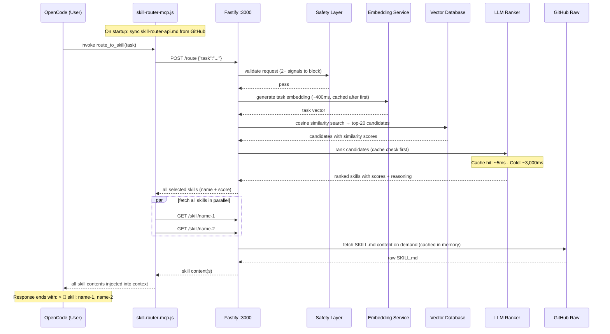

# Skills — An AI Skill Routing System

265 expert skills for AI coding agents, with a built-in routing engine that automatically selects and injects the right skill into your AI's context before it answers. No manual `/skill` commands — just ask, and the right expertise loads itself.

```
You → "review this Python code for security issues"
         ↓
   route_to_skill()  [auto-fires on every task]
         ↓
   embed → vector search → LLM re-rank → coding-security-review/SKILL.md
         ↓
   Full expert skill injected into context — AI answers as a security reviewer
```

---

## Quick Start

**With OpenAI (recommended):**

```bash
git clone https://github.com/paulpas/skills
cd skills
OPENAI_API_KEY=sk-... ./install-skill-router.sh --integrate-opencode
```

Restart OpenCode. Every task you type now automatically routes to the most relevant skill.

**No API key? Use a local model:**

```bash
./install-skill-router.sh \
  --provider llamacpp \
  --embedding-provider llamacpp \
  --llamacpp-url http://localhost:8080
```

> llama.cpp must serve both `/v1/chat/completions` and `/v1/embeddings`. No `OPENAI_API_KEY` required.

---

## FAQ

**Have questions?** Check the **[Comprehensive FAQ](./FAQ.md)** for 27 questions covering:
- Why MCP is better than direct skill loading
- How auto-routing works
- Skill management and creation
- Troubleshooting and best practices
- Offline mode, OpenCode integration, and more

---

## How It Works

Every time OpenCode receives a task, the `route_to_skill` MCP tool fires automatically:



### Latency

| Stage | Cold | Warm (cached) |
|---|---|---|
| Safety check | ~1 ms | ~1 ms |
| Task embedding | ~400 ms | ~1 ms (memory) |
| Vector search | ~1 ms | ~1 ms |
| LLM re-ranking | ~3,000 ms | ~5 ms (cache hit) |
| Skill content fetch | ~1 ms (disk) / ~150 ms (GitHub) | ~1 ms (memory) |
| **Total** | **~3.5 s** | **~10 ms** |

> Local llama.cpp drops cold LLM step to ~200–800 ms. Warm requests are fast regardless of provider.

### Key Behaviours

- **Multi-skill loading** — all high-confidence matches are fetched in parallel; the AI receives full context for each
- **Skill citation** — every response ends with `> 📖 skill: name-1, name-2` listing loaded skills
- **Auto index refresh** — `skills-index.json` is re-fetched from GitHub every `SKILL_SYNC_INTERVAL` seconds (default: 1 hour); new skills become routable without restart
- **API doc sync** — `skill-router-api.md` is fetched from GitHub on every MCP startup; edits to the repo file propagate automatically
- **LLM ranking cache** — identical task+candidates combos are served from memory (~5 ms) on repeat queries
- **Batch embeddings** — all skill embeddings are generated in parallel batches of 100 on startup (~2 s total)

---

## Monitoring

| What | Command |
|---|---|
| Skill accesses (MCP side) | `tail -f ~/.config/opencode/skill-router-mcp.log \| grep 'SKILL ACCESS'` |
| Full routing pipeline (Docker) | `docker logs -f skill-router 2>&1 \| grep -E 'Route result\|Vector search'` |
| Routing history (JSON) | `curl -s http://localhost:3000/access-log \| python3 -m json.tool` |
| Service health | `curl -s http://localhost:3000/health` |

---

## Utility Scripts

This repository includes automation scripts to maintain the skill catalog and improve trigger quality:

### 1. generate_readme.py

**Purpose:** Auto-generates the skills catalog in the README with zero manual effort.

**Location:** `scripts/generate_readme.py`

**What it does:**
- Reads all skill directories and extracts metadata (name, description, domain, role, triggers)
- Organizes skills into three auto-generated sections:
  - **Skills by Domain** — Grouped by domain category (agent, cncf, coding, trading, programming)
  - **Skills by Role** — Grouped by skill role (implementation, reference, orchestration, review)
  - **Complete Skills Index** — Alphabetical table of all 239+ skills with descriptions and triggers
- Inserts content between `<!-- AUTO-GENERATED SKILLS INDEX START/END -->` markers
- Preserves all existing README content outside the markers
- Includes generation timestamp
- Creates clickable hyperlinks to all skill SKILL.md files

**Usage:**
```bash
# Update README.md in-place
python3 scripts/generate_readme.py

# Generate custom output file
python3 scripts/generate_readme.py --output custom_skills.md
```

**When to use:**
- After adding new skills to the repository
- After modifying skill metadata (description, triggers, domain, role)
- Before committing changes to ensure README is up-to-date
- As part of CI/CD pipeline for automatic catalog maintenance

**Example output:**
All 239+ skills appear in the README with:
- Clickable links to `skills/<skill-name>/SKILL.md`
- Description from skill frontmatter
- Trigger keywords for skill discovery
- Organization by domain and role

---

### 2. enhance_triggers.py

**Purpose:** Adds user-friendly, conversational triggers to skills for improved discoverability.

**Location:** `scripts/enhance_triggers.py`

**What it does:**
- Scans all 239+ skills in the repository
- Identifies skills that could benefit from additional conversational triggers
- Adds user-friendly variants like:
  - "how do I..." questions
  - "what is..." clarifications
  - Common colloquialisms and business language
  - Related technology names
  - Operational task language
- Maintains the 5-8 term trigger limit per skill
- Generates detailed report in `TRIGGER_ENHANCEMENTS.md`
- Preserves YAML formatting and existing content

**Usage:**
```bash
# Enhance all skills and generate report
python3 scripts/enhance_triggers.py
```

**When to use:**
- After reviewing existing skill triggers for quality
- When skills need better user discovery
- After adding new skill categories
- To ensure triggers match both technical AND conversational language

**Example enhancements:**
```yaml
# Before
triggers: kubernetes, k8s, container orchestration, pod management

# After (with user-friendly variants added)
triggers: kubernetes, k8s, container orchestration, managing containers, how do i deploy apps
```

**Output:**
- Updates all SKILL.md files with improved triggers
- Generates `TRIGGER_ENHANCEMENTS.md` report showing:
  - All enhanced skills
  - Before/after trigger comparison
  - Enhancement statistics by domain
  - Quality assurance metrics

---

### 3. reformat_skills.py

**Purpose:** Validates and normalizes YAML frontmatter across all skills.

**Location:** `scripts/reformat_skills.py`

**What it does:**
- Validates YAML syntax in all skill frontmatter
- Normalizes formatting (indentation, field order)
- Fills in missing optional metadata fields from templates
- Reports errors and validation failures

**Usage:**
```bash
python3 scripts/reformat_skills.py
```

---

### 4. generate_index.py

**Purpose:** Regenerates the skill-router index for skill discovery.

**Location:** `generate_index.py` (top-level, maintained by repository)

**What it does:**
- Reads all skill metadata
- Generates `skills-index.json` for skill-router consumption
- Enables auto-loading of skills based on triggers
- Updates skill statistics and categorization

**Usage:**
```bash
python3 generate_index.py
```

---

## Recommended Workflow

When adding or modifying skills:

1. **Create or edit skill SKILL.md file**
   - Place in `skills/<skill-name>/` directory
   - Follow skill schema from [AGENTS.md](./AGENTS.md)

2. **Run reformat_skills.py**
   ```bash
   python3 scripts/reformat_skills.py
   ```

3. **Run enhance_triggers.py** (optional, for trigger improvement)
   ```bash
   python3 scripts/enhance_triggers.py
   ```

4. **Run generate_index.py**
   ```bash
   python3 generate_index.py
   ```

5. **Run generate_readme.py** (to update catalog)
   ```bash
   python3 scripts/generate_readme.py
   ```

6. **Commit and push**
   ```bash
   git add -A
   git commit -m "feat: add [skill-name] skill"
   git push origin main
   ```

**Or use one-line automation:**
```bash
python3 scripts/reformat_skills.py && \
python3 generate_index.py && \
python3 scripts/generate_readme.py
```

---

## The Skills Library

265 skills across 5 domains, organized in `skills/`. Each skill is a `SKILL.md` file with YAML frontmatter — the routing engine reads these directly.

```
skills-repo/
├── skills/                         ← all skill definitions live here
│   ├── agent-confidence-based-selector/
│   │   └── SKILL.md
│   ├── cncf-prometheus/
│   │   ├── SKILL.md
│   │   └── references/             ← optional sub-documents
│   ├── coding-code-review/
│   │   └── SKILL.md
│   ├── trading-risk-stop-loss/
│   │   └── SKILL.md
│   └── programming-algorithms/
│       └── SKILL.md
├── agent-skill-routing-system/     ← the HTTP routing service
├── README.md
├── SKILL_FORMAT_SPEC.md
├── reformat_skills.py
└── install-skill-router.sh
```

### Domain Prefixes

| Prefix | Description |
|---|---|
| `agent-*` | AI agent orchestration patterns (task decomposition, routing, planning) |
| `cncf-*` | CNCF cloud-native project reference (Kubernetes, Prometheus, Helm, etc.) |
| `coding-*` | Software engineering patterns (code review, TDD, FastAPI, Pydantic, etc.) |
| `trading-*` | Algorithmic trading implementation (risk management, execution, ML, backtesting) |
| `programming-*` | Algorithm and language reference material |

---

### Agent Orchestration

- [agent-confidence-based-selector](./skills/agent-confidence-based-selector/SKILL.md) — Selects the most appropriate skill based on confidence scores and relevance metrics
- [agent-dependency-graph-builder](./skills/agent-dependency-graph-builder/SKILL.md) — Builds and maintains dependency graphs for task execution
- [agent-dynamic-replanner](./skills/agent-dynamic-replanner/SKILL.md) — Dynamically adjusts execution plans based on real-time feedback and changing conditions
- [agent-goal-to-milestones](./skills/agent-goal-to-milestones/SKILL.md) — Translates high-level goals into actionable milestones
- [agent-multi-skill-executor](./skills/agent-multi-skill-executor/SKILL.md) — Orchestrates execution of multiple skills in sequence with dependency management
- [agent-parallel-skill-runner](./skills/agent-parallel-skill-runner/SKILL.md) — Executes multiple skills concurrently with synchronization and result collection
- [agent-task-decomposition-engine](./skills/agent-task-decomposition-engine/SKILL.md) — Decomposes complex tasks into manageable subtasks for specialized skills

---

### CNCF Cloud Native

#### Architecture & Best Practices

- [cncf-architecture-best-practices](./skills/cncf-architecture-best-practices/SKILL.md) — Production-grade Kubernetes: service mesh, CNI, GitOps, CI/CD, observability, security, networking, and scaling
- [cncf-networking-osi](./skills/cncf-networking-osi/SKILL.md) — OSI Model networking for cloud-native — all 7 layers with CNCF project mappings

#### Application Definition & Build

- [cncf-argo](./skills/cncf-argo/SKILL.md) — Kubernetes-native workflow, CI/CD, and governance
- [cncf-artifact-hub](./skills/cncf-artifact-hub/SKILL.md) — Repository for Kubernetes Helm, Falco, OPA, and more
- [cncf-backstage](./skills/cncf-backstage/SKILL.md) — Developer portal for microservices
- [cncf-buildpacks](./skills/cncf-buildpacks/SKILL.md) — Source code to container images without Dockerfiles
- [cncf-dapr](./skills/cncf-dapr/SKILL.md) — Distributed application runtime
- [cncf-helm](./skills/cncf-helm/SKILL.md) — The Kubernetes package manager
- [cncf-kubevela](./skills/cncf-kubevela/SKILL.md) — Kubernetes application platform
- [cncf-kubevirt](./skills/cncf-kubevirt/SKILL.md) — Virtualization on Kubernetes
- [cncf-operator-framework](./skills/cncf-operator-framework/SKILL.md) — Build and manage Kubernetes operators with standardized patterns

#### Container Runtime

- [cncf-containerd](./skills/cncf-containerd/SKILL.md) — Open and reliable container runtime
- [cncf-cri-o](./skills/cncf-cri-o/SKILL.md) — OCI-compliant container runtime for Kubernetes
- [cncf-krustlet](./skills/cncf-krustlet/SKILL.md) — Kubernetes runtime patterns and best practices
- [cncf-lima](./skills/cncf-lima/SKILL.md) — Container runtime patterns and best practices

#### Container Registry

- [cncf-dragonfly](./skills/cncf-dragonfly/SKILL.md) — P2P file distribution
- [cncf-harbor](./skills/cncf-harbor/SKILL.md) — Container registry
- [cncf-zot](./skills/cncf-zot/SKILL.md) — Cloud-native container registry patterns

#### Networking & Service Mesh

- [cncf-calico](./skills/cncf-calico/SKILL.md) — Cloud-native network security
- [cncf-cilium](./skills/cncf-cilium/SKILL.md) — eBPF-based cloud-native networking
- [cncf-cni](./skills/cncf-cni/SKILL.md) — Container Network Interface for Linux containers
- [cncf-container-network-interface-cni](./skills/cncf-container-network-interface-cni/SKILL.md) — CNI architecture patterns
- [cncf-contour](./skills/cncf-contour/SKILL.md) — Service proxy patterns
- [cncf-emissary-ingress](./skills/cncf-emissary-ingress/SKILL.md) — Kubernetes ingress controller
- [cncf-envoy](./skills/cncf-envoy/SKILL.md) — High-performance edge/middle/service proxy
- [cncf-grpc](./skills/cncf-grpc/SKILL.md) — Remote procedure call patterns
- [cncf-istio](./skills/cncf-istio/SKILL.md) — Connect, secure, control, and observe services
- [cncf-kong](./skills/cncf-kong/SKILL.md) — API gateway patterns
- [cncf-kong-ingress-controller](./skills/cncf-kong-ingress-controller/SKILL.md) — Kong Ingress Controller for Kubernetes
- [cncf-kuma](./skills/cncf-kuma/SKILL.md) — Service mesh patterns
- [cncf-linkerd](./skills/cncf-linkerd/SKILL.md) — Lightweight service mesh

#### Observability

- [cncf-cortex](./skills/cncf-cortex/SKILL.md) — Distributed, horizontally scalable Prometheus
- [cncf-fluentd](./skills/cncf-fluentd/SKILL.md) — Unified logging layer for cloud-native environments
- [cncf-jaeger](./skills/cncf-jaeger/SKILL.md) — Distributed tracing
- [cncf-open-telemetry](./skills/cncf-open-telemetry/SKILL.md) — OpenTelemetry architecture patterns
- [cncf-opentelemetry](./skills/cncf-opentelemetry/SKILL.md) — Vendor-neutral tracing, metrics, and logs framework
- [cncf-prometheus](./skills/cncf-prometheus/SKILL.md) — Monitoring system and time series database
- [cncf-thanos](./skills/cncf-thanos/SKILL.md) — High-availability Prometheus with long-term storage

#### Scheduling & Orchestration

- [cncf-crossplane](./skills/cncf-crossplane/SKILL.md) — Kubernetes-native multi-cloud infrastructure control plane
- [cncf-fluid](./skills/cncf-fluid/SKILL.md) — Kubernetes-native data acceleration for data-intensive apps
- [cncf-karmada](./skills/cncf-karmada/SKILL.md) — Multi-cluster orchestration
- [cncf-keda](./skills/cncf-keda/SKILL.md) — Event-driven autoscaling
- [cncf-knative](./skills/cncf-knative/SKILL.md) — Serverless on Kubernetes
- [cncf-kubeflow](./skills/cncf-kubeflow/SKILL.md) — ML on Kubernetes
- [cncf-kubernetes](./skills/cncf-kubernetes/SKILL.md) — Production-grade container scheduling and management
- [cncf-volcano](./skills/cncf-volcano/SKILL.md) — Batch scheduling infrastructure for Kubernetes
- [cncf-wasmcloud](./skills/cncf-wasmcloud/SKILL.md) — WebAssembly-based distributed applications platform

#### Security & Compliance

- [cncf-cert-manager](./skills/cncf-cert-manager/SKILL.md) — Certificate management for Kubernetes
- [cncf-falco](./skills/cncf-falco/SKILL.md) — Cloud-native runtime security
- [cncf-in-toto](./skills/cncf-in-toto/SKILL.md) — Supply chain security patterns
- [cncf-keycloak](./skills/cncf-keycloak/SKILL.md) — Identity and access management
- [cncf-kubescape](./skills/cncf-kubescape/SKILL.md) — Kubernetes security scanning
- [cncf-kyverno](./skills/cncf-kyverno/SKILL.md) — Kubernetes policy engine
- [cncf-notary-project](./skills/cncf-notary-project/SKILL.md) — Content trust and supply chain security
- [cncf-oathkeeper](./skills/cncf-oathkeeper/SKILL.md) — Identity and access proxy
- [cncf-open-policy-agent-opa](./skills/cncf-open-policy-agent-opa/SKILL.md) — Policy as code
- [cncf-openfga](./skills/cncf-openfga/SKILL.md) — Fine-grained authorization
- [cncf-openfeature](./skills/cncf-openfeature/SKILL.md) — Vendor-neutral feature flagging
- [cncf-ory-hydra](./skills/cncf-ory-hydra/SKILL.md) — OAuth 2.0 / OpenID Connect server
- [cncf-ory-kratos](./skills/cncf-ory-kratos/SKILL.md) — Cloud-native identity management
- [cncf-spiffe](./skills/cncf-spiffe/SKILL.md) — Secure production identity framework
- [cncf-spire](./skills/cncf-spire/SKILL.md) — SPIFFE implementation for real-world deployments
- [cncf-the-update-framework-tuf](./skills/cncf-the-update-framework-tuf/SKILL.md) — Secure software update framework

#### Storage

- [cncf-cubefs](./skills/cncf-cubefs/SKILL.md) — Distributed high-performance file system
- [cncf-longhorn](./skills/cncf-longhorn/SKILL.md) — Cloud-native storage patterns
- [cncf-rook](./skills/cncf-rook/SKILL.md) — Cloud-native storage orchestration for Kubernetes

#### Streaming & Messaging

- [cncf-cloudevents](./skills/cncf-cloudevents/SKILL.md) — Cloud-native event streaming patterns
- [cncf-nats](./skills/cncf-nats/SKILL.md) — Cloud-native messaging
- [cncf-strimzi](./skills/cncf-strimzi/SKILL.md) — Apache Kafka for cloud-native environments

#### Database & Key-Value

- [cncf-coredns](./skills/cncf-coredns/SKILL.md) — DNS server that chains plugins
- [cncf-etcd](./skills/cncf-etcd/SKILL.md) — Distributed key-value store
- [cncf-tikv](./skills/cncf-tikv/SKILL.md) — Distributed transactional key-value database
- [cncf-vitess](./skills/cncf-vitess/SKILL.md) — Horizontal scaling for MySQL

#### CI/CD & GitOps

- [cncf-flux](./skills/cncf-flux/SKILL.md) — GitOps for Kubernetes
- [cncf-openkruise](./skills/cncf-openkruise/SKILL.md) — Advanced Kubernetes workload management
- [cncf-tekton](./skills/cncf-tekton/SKILL.md) — Cloud-native pipeline resource

#### Automation & Edge

- [cncf-chaosmesh](./skills/cncf-chaosmesh/SKILL.md) — Chaos engineering platform for Kubernetes
- [cncf-cloud-custodian](./skills/cncf-cloud-custodian/SKILL.md) — Rules engine for cloud infrastructure management
- [cncf-flatcar-container-linux](./skills/cncf-flatcar-container-linux/SKILL.md) — Container-optimized Linux
- [cncf-kubeedge](./skills/cncf-kubeedge/SKILL.md) — Edge computing with Kubernetes
- [cncf-kserve](./skills/cncf-kserve/SKILL.md) — Model serving on Kubernetes
- [cncf-litmus](./skills/cncf-litmus/SKILL.md) — Cloud-native chaos engineering
- [cncf-metal3-io](./skills/cncf-metal3-io/SKILL.md) — Bare metal provisioning patterns
- [cncf-opencost](./skills/cncf-opencost/SKILL.md) — Kubernetes cost monitoring
- [cncf-openyurt](./skills/cncf-openyurt/SKILL.md) — Extending Kubernetes to edge scenarios

#### Process & Documentation

- [cncf-process-architecture](./skills/cncf-process-architecture/SKILL.md) — Create or update `ARCHITECTURE.md` for CNCF projects
- [cncf-process-incident-response](./skills/cncf-process-incident-response/SKILL.md) — Incident response plan: detection, triage, communication, post-incident review
- [cncf-process-releases](./skills/cncf-process-releases/SKILL.md) — Release process, versioning policy, and cadence documentation
- [cncf-process-security-policy](./skills/cncf-process-security-policy/SKILL.md) — Vulnerability reporting, disclosure timeline, and supported versions

---

### Coding Patterns

- [coding-code-review](./skills/coding-code-review/SKILL.md) — Bugs, security vulnerabilities, code smells, and architectural concerns with prioritized feedback
- [coding-conviction-scoring](./skills/coding-conviction-scoring/SKILL.md) — Trade confidence and risk assessment scoring
- [coding-data-normalization](./skills/coding-data-normalization/SKILL.md) — Typed dataclasses for ticker/trade/orderbook with exchange-specific parsing
- [coding-event-bus](./skills/coding-event-bus/SKILL.md) — Async pub/sub event bus with typed events and singleton initialization
- [coding-event-driven-architecture](./skills/coding-event-driven-architecture/SKILL.md) — Event-driven architecture for real-time systems: pub/sub, signal flow, strategy base
- [coding-fastapi-patterns](./skills/coding-fastapi-patterns/SKILL.md) — FastAPI structure: typed error hierarchy, exception handlers, CORS, request timing
- [coding-git-branching-strategies](./skills/coding-git-branching-strategies/SKILL.md) — Git Flow, GitHub Flow, Trunk-Based Development, and feature flag strategies
- [coding-juice-shop](./skills/coding-juice-shop/SKILL.md) — OWASP Juice Shop: web application security testing guide
- [coding-markdown-best-practices](./skills/coding-markdown-best-practices/SKILL.md) — Markdown syntax rules, common pitfalls, and documentation consistency
- [coding-pydantic-config](./skills/coding-pydantic-config/SKILL.md) — Pydantic config with frozen models, nested hierarchy, TOML/env parsing
- [coding-pydantic-models](./skills/coding-pydantic-models/SKILL.md) — Pydantic frozen data models: enums, annotated constraints, validators, computed properties
- [coding-security-review](./skills/coding-security-review/SKILL.md) — Security vulnerabilities: injection, XSS, insecure deserialization, misconfigurations
- [coding-strategy-base](./skills/coding-strategy-base/SKILL.md) — Abstract base strategy pattern with initialization guards and typed abstract methods
- [coding-test-driven-development](./skills/coding-test-driven-development/SKILL.md) — TDD and BDD with pytest, unit tests, mocking, and test pyramid principles
- [coding-websocket-manager](./skills/coding-websocket-manager/SKILL.md) — WebSocket state machine with exponential backoff and message routing

---

### Trading AI & ML

- [trading-ai-anomaly-detection](./skills/trading-ai-anomaly-detection/SKILL.md) — Detect anomalous market behavior, outliers, and potential manipulation
- [trading-ai-explainable-ai](./skills/trading-ai-explainable-ai/SKILL.md) — Explainable AI for understanding and trusting trading model decisions
- [trading-ai-feature-engineering](./skills/trading-ai-feature-engineering/SKILL.md) — Create actionable trading features from raw market data
- [trading-ai-hyperparameter-tuning](./skills/trading-ai-hyperparameter-tuning/SKILL.md) — Optimize model configurations for trading applications
- [trading-ai-live-model-monitoring](./skills/trading-ai-live-model-monitoring/SKILL.md) — Monitor production ML models for drift, decay, and performance degradation
- [trading-ai-llm-orchestration](./skills/trading-ai-llm-orchestration/SKILL.md) — LLM orchestration for trading analysis with structured output via instructor/pydantic
- [trading-ai-model-ensemble](./skills/trading-ai-model-ensemble/SKILL.md) — Combine multiple models for improved prediction accuracy
- [trading-ai-multi-asset-model](./skills/trading-ai-multi-asset-model/SKILL.md) — Model inter-asset relationships for portfolio and cross-asset strategies
- [trading-ai-news-embedding](./skills/trading-ai-news-embedding/SKILL.md) — Process news text using NLP embeddings for trading signals
- [trading-ai-order-flow-analysis](./skills/trading-ai-order-flow-analysis/SKILL.md) — Analyze order flow to detect market pressure and anticipate price moves
- [trading-ai-regime-classification](./skills/trading-ai-regime-classification/SKILL.md) — Detect current market regime for adaptive trading strategies
- [trading-ai-reinforcement-learning](./skills/trading-ai-reinforcement-learning/SKILL.md) — Reinforcement learning for automated trading agents and policy optimization
- [trading-ai-sentiment-analysis](./skills/trading-ai-sentiment-analysis/SKILL.md) — AI-powered sentiment from news, social media, and political figures
- [trading-ai-sentiment-features](./skills/trading-ai-sentiment-features/SKILL.md) — Extract market sentiment from news, social media, and analyst reports
- [trading-ai-synthetic-data](./skills/trading-ai-synthetic-data/SKILL.md) — Generate synthetic financial data for training and testing models
- [trading-ai-time-series-forecasting](./skills/trading-ai-time-series-forecasting/SKILL.md) — Time series forecasting for price prediction and market analysis
- [trading-ai-volatility-prediction](./skills/trading-ai-volatility-prediction/SKILL.md) — Forecast volatility for risk management and option pricing

---

### Trading Backtesting

- [trading-backtest-drawdown-analysis](./skills/trading-backtest-drawdown-analysis/SKILL.md) — Maximum drawdown, recovery time, and Value-at-Risk analysis
- [trading-backtest-lookahead-bias](./skills/trading-backtest-lookahead-bias/SKILL.md) — Prevent lookahead bias through strict causality enforcement and time-based validation
- [trading-backtest-position-exits](./skills/trading-backtest-position-exits/SKILL.md) — Exit strategies, trailing stops, and take-profit mechanisms
- [trading-backtest-position-sizing](./skills/trading-backtest-position-sizing/SKILL.md) — Fixed fractional, Kelly criterion, and volatility-adjusted sizing
- [trading-backtest-sharpe-ratio](./skills/trading-backtest-sharpe-ratio/SKILL.md) — Sharpe ratio and risk-adjusted performance metrics
- [trading-backtest-walk-forward](./skills/trading-backtest-walk-forward/SKILL.md) — Walk-forward optimization for robust strategy validation

---

### Trading Data Pipelines

- [trading-data-alternative-data](./skills/trading-data-alternative-data/SKILL.md) — Alternative data ingestion: news, social media, on-chain data sources
- [trading-data-backfill-strategy](./skills/trading-data-backfill-strategy/SKILL.md) — Strategic backfill for populating historical data
- [trading-data-candle-data](./skills/trading-data-candle-data/SKILL.md) — OHLCV processing, timeframe management, and validation
- [trading-data-enrichment](./skills/trading-data-enrichment/SKILL.md) — Add context to raw trading data
- [trading-data-feature-store](./skills/trading-data-feature-store/SKILL.md) — Feature storage and management for ML trading models
- [trading-data-lake](./skills/trading-data-lake/SKILL.md) — Data lake architecture for trading data storage
- [trading-data-order-book](./skills/trading-data-order-book/SKILL.md) — Order book handling, spread calculation, liquidity measurement
- [trading-data-stream-processing](./skills/trading-data-stream-processing/SKILL.md) — Streaming data processing for real-time signals and analytics
- [trading-data-time-series-database](./skills/trading-data-time-series-database/SKILL.md) — Time-series database queries and optimization for financial data
- [trading-data-validation](./skills/trading-data-validation/SKILL.md) — Data validation and quality assurance for trading pipelines

---

### Trading Exchange Integration

- [trading-exchange-ccxt-patterns](./skills/trading-exchange-ccxt-patterns/SKILL.md) — CCXT patterns: error handling, rate limiting, and state management
- [trading-exchange-failover-handling](./skills/trading-exchange-failover-handling/SKILL.md) — Automated failover and redundancy for exchange connectivity
- [trading-exchange-health](./skills/trading-exchange-health/SKILL.md) — Exchange health monitoring and connectivity status
- [trading-exchange-market-data-cache](./skills/trading-exchange-market-data-cache/SKILL.md) — High-performance caching for market data with low latency
- [trading-exchange-order-book-sync](./skills/trading-exchange-order-book-sync/SKILL.md) — Order book synchronization and state management
- [trading-exchange-order-execution-api](./skills/trading-exchange-order-execution-api/SKILL.md) — Order execution and management API
- [trading-exchange-rate-limiting](./skills/trading-exchange-rate-limiting/SKILL.md) — Rate limiting and circuit breaker patterns for exchange APIs
- [trading-exchange-trade-reporting](./skills/trading-exchange-trade-reporting/SKILL.md) — Real-time trade reporting and execution analytics
- [trading-exchange-websocket-handling](./skills/trading-exchange-websocket-handling/SKILL.md) — Real-time market data: connection management, data aggregation, error recovery
- [trading-exchange-websocket-streaming](./skills/trading-exchange-websocket-streaming/SKILL.md) — Real-time market data streaming and processing

---

### Trading Execution Algorithms

- [trading-execution-order-book-impact](./skills/trading-execution-order-book-impact/SKILL.md) — Order book impact measurement and market microstructure analysis
- [trading-execution-rate-limiting](./skills/trading-execution-rate-limiting/SKILL.md) — Rate limiting and exchange API management for robust execution
- [trading-execution-slippage-modeling](./skills/trading-execution-slippage-modeling/SKILL.md) — Slippage estimation, simulation, and fee modeling
- [trading-execution-twap](./skills/trading-execution-twap/SKILL.md) — Time-weighted average price for executing large orders with minimal impact
- [trading-execution-twap-vwap](./skills/trading-execution-twap-vwap/SKILL.md) — TWAP and VWAP: institutional-grade order execution
- [trading-execution-vwap](./skills/trading-execution-vwap/SKILL.md) — Volume-weighted average price execution

---

### Trading Paper Trading

- [trading-paper-commission-model](./skills/trading-paper-commission-model/SKILL.md) — Commission model and fee structure simulation
- [trading-paper-fill-simulation](./skills/trading-paper-fill-simulation/SKILL.md) — Fill simulation models for order execution probability
- [trading-paper-market-impact](./skills/trading-paper-market-impact/SKILL.md) — Market impact modeling and order book simulation
- [trading-paper-performance-attribution](./skills/trading-paper-performance-attribution/SKILL.md) — Performance attribution for trading strategy decomposition
- [trading-paper-realistic-simulation](./skills/trading-paper-realistic-simulation/SKILL.md) — Realistic paper trading with market impact and execution fees
- [trading-paper-slippage-model](./skills/trading-paper-slippage-model/SKILL.md) — Slippage modeling and execution simulation

---

### Trading Risk Management

- [trading-risk-correlation-risk](./skills/trading-risk-correlation-risk/SKILL.md) — Correlation breakdown and portfolio diversification risk
- [trading-risk-drawdown-control](./skills/trading-risk-drawdown-control/SKILL.md) — Maximum drawdown control and equity preservation
- [trading-risk-kill-switches](./skills/trading-risk-kill-switches/SKILL.md) — Multi-layered kill switches at account, strategy, market, and infrastructure levels
- [trading-risk-liquidity-risk](./skills/trading-risk-liquidity-risk/SKILL.md) — Liquidity assessment and trade execution risk
- [trading-risk-position-sizing](./skills/trading-risk-position-sizing/SKILL.md) — Kelly criterion, volatility adjustments, and edge-based sizing
- [trading-risk-stop-loss](./skills/trading-risk-stop-loss/SKILL.md) — Stop loss strategies for risk management
- [trading-risk-stress-testing](./skills/trading-risk-stress-testing/SKILL.md) — Stress test scenarios and portfolio resilience analysis
- [trading-risk-tail-risk](./skills/trading-risk-tail-risk/SKILL.md) — Tail risk management and extreme event protection
- [trading-risk-value-at-risk](./skills/trading-risk-value-at-risk/SKILL.md) — Value at Risk calculations for portfolio risk management

---

### Trading Technical Analysis

- [trading-technical-cycle-analysis](./skills/trading-technical-cycle-analysis/SKILL.md) — Market cycles and periodic patterns in price movement
- [trading-technical-false-signal-filtering](./skills/trading-technical-false-signal-filtering/SKILL.md) — False signal filtering for robust technical analysis
- [trading-technical-indicator-confluence](./skills/trading-technical-indicator-confluence/SKILL.md) — Indicator confluence validation for confirming trading signals
- [trading-technical-intermarket-analysis](./skills/trading-technical-intermarket-analysis/SKILL.md) — Cross-market relationships and asset class correlations
- [trading-technical-market-microstructure](./skills/trading-technical-market-microstructure/SKILL.md) — Order book dynamics and order flow analysis
- [trading-technical-momentum-indicators](./skills/trading-technical-momentum-indicators/SKILL.md) — RSI, MACD, stochastic oscillators, and momentum analysis
- [trading-technical-price-action-patterns](./skills/trading-technical-price-action-patterns/SKILL.md) — Candlestick and chart patterns for price movement prediction
- [trading-technical-regime-detection](./skills/trading-technical-regime-detection/SKILL.md) — Market regime detection for adaptive trading strategies
- [trading-technical-statistical-arbitrage](./skills/trading-technical-statistical-arbitrage/SKILL.md) — Pair trading and cointegration-based arbitrage
- [trading-technical-support-resistance](./skills/trading-technical-support-resistance/SKILL.md) — Technical levels where price tends to pause or reverse
- [trading-technical-trend-analysis](./skills/trading-technical-trend-analysis/SKILL.md) — Trend identification, classification, and continuation
- [trading-technical-volatility-analysis](./skills/trading-technical-volatility-analysis/SKILL.md) — Volatility measurement, forecasting, and risk assessment
- [trading-technical-volume-profile](./skills/trading-technical-volume-profile/SKILL.md) — Volume analysis for understanding market structure

---

### Trading Fundamentals

- [trading-fundamentals-market-regimes](./skills/trading-fundamentals-market-regimes/SKILL.md) — Market regime detection and adaptation across changing conditions
- [trading-fundamentals-market-structure](./skills/trading-fundamentals-market-structure/SKILL.md) — Market structure and trading participants analysis
- [trading-fundamentals-risk-management-basics](./skills/trading-fundamentals-risk-management-basics/SKILL.md) — Position sizing, stop-loss, and system-level risk controls
- [trading-fundamentals-trading-edge](./skills/trading-fundamentals-trading-edge/SKILL.md) — Finding and maintaining competitive advantage in trading systems
- [trading-fundamentals-trading-plan](./skills/trading-fundamentals-trading-plan/SKILL.md) — Trading plan structure and risk management framework
- [trading-fundamentals-trading-psychology](./skills/trading-fundamentals-trading-psychology/SKILL.md) — Emotional discipline, cognitive bias awareness, and operational integrity

---

### Programming

- [programming-algorithms](./skills/programming-algorithms/SKILL.md) — Algorithm selection guide: time/space trade-offs, input characteristics, and problem constraints

---

## Adding Skills

Create `skills/<domain>-<topic>/SKILL.md` following the format in [SKILL_FORMAT_SPEC.md](./SKILL_FORMAT_SPEC.md). Run `python reformat_skills.py` to apply standard frontmatter. Run `python3 generate_index.py` after adding a skill to update `skills-index.json`, then push. The router auto-discovers new skills within `SKILL_SYNC_INTERVAL` seconds (default: 1 hour). For immediate pickup: `curl -X POST http://localhost:3000/reload`

```yaml
---
name: my-skill-name
description: One-line description of what this skill does
license: MIT
compatibility: opencode
metadata:
  version: "1.0.0"
  domain: coding
  role: implementation
  scope: implementation
  output-format: code
  triggers: keyword1, keyword2, keyword3
---
```

Good triggers are specific and task-oriented (`kubernetes, k8s, pod, deployment, kubectl`) rather than generic (`cloud, infrastructure, ops`).

---

<!-- AUTO-GENERATED SKILLS INDEX START -->

> **Last updated:** 2026-04-24 17:45:56 UTC  
> **Total skills:** 338

## Skills by Domain


### Agent (29 skills)

| Skill Name | Description | Triggers |
|---|---|---|
| [agent-add-new-skill](../../skills/agent-add-new-skill/SKILL.md) | Step-by-step guide for adding a new skill to the... | add skill, contribute skill... |
| [agent-autoscaling-advisor](../../skills/agent-autoscaling-advisor/SKILL.md) | Advisors on optimal auto-scaling configurations for... | autoscaling advisor, autoscaling-advisor... |
| [agent-ci-cd-pipeline-analyzer](../../skills/agent-ci-cd-pipeline-analyzer/SKILL.md) | Analyzes CI/CD pipelines for optimization opportunities,... | build bottlenecks, ci-cd analysis... |
| [agent-code-correctness-verifier](../../skills/agent-code-correctness-verifier/SKILL.md) | Verifies code correctness by analyzing syntax, semantics,... | code correctness verifier, code-correctness-verifier... |
| [agent-confidence-based-selector](../../skills/agent-confidence-based-selector/SKILL.md) | Selects and executes the most appropriate skill based on... | appropriate, confidence based selector... |
| [agent-container-inspector](../../skills/agent-container-inspector/SKILL.md) | Inspects container configurations, runtime state, logs, and... | container, container inspector... |
| [agent-dependency-graph-builder](../../skills/agent-dependency-graph-builder/SKILL.md) | Builds and maintains dependency graphs for task execution,... | builds, dependency graph builder... |
| [agent-diff-quality-analyzer](../../skills/agent-diff-quality-analyzer/SKILL.md) | Analyzes code quality changes in diffs by evaluating... | analyzes, code quality... |
| [agent-dynamic-replanner](../../skills/agent-dynamic-replanner/SKILL.md) | Dynamically adjusts execution plans based on real-time... | adjusts, dynamic replanner... |
| [agent-error-trace-explainer](../../skills/agent-error-trace-explainer/SKILL.md) | Explains error traces and exceptions by analyzing stack... | error trace explainer, error-trace-explainer... |
| [agent-failure-mode-analysis](../../skills/agent-failure-mode-analysis/SKILL.md) | Performs failure mode analysis by identifying potential... | analyzes, failure mode analysis... |
| [agent-goal-to-milestones](../../skills/agent-goal-to-milestones/SKILL.md) | Translates high-level goals into actionable milestones and... | goal to milestones, goal-to-milestones... |
| [agent-hot-path-detector](../../skills/agent-hot-path-detector/SKILL.md) | Identifies critical execution paths (hot paths) in code... | critical, execution... |
| [agent-infra-drift-detector](../../skills/agent-infra-drift-detector/SKILL.md) | Detects and reports infrastructure drift between desired... | cloud infrastructure, drift detection... |
| [agent-k8s-debugger](../../skills/agent-k8s-debugger/SKILL.md) | Diagnoses Kubernetes cluster issues, debug pods,... | container orchestration, diagnoses... |
| [agent-memory-usage-analyzer](../../skills/agent-memory-usage-analyzer/SKILL.md) | Analyzes memory allocation patterns, identifies memory... | analyzes, leaks... |
| [agent-multi-skill-executor](../../skills/agent-multi-skill-executor/SKILL.md) | Orchestrates execution of multiple skill specifications in... | execution, multi skill executor... |
| [agent-network-diagnostics](../../skills/agent-network-diagnostics/SKILL.md) | Diagnoses network connectivity issues, identifies... | bottlenecks, connectivity issues... |
| [agent-parallel-skill-runner](../../skills/agent-parallel-skill-runner/SKILL.md) | Executes multiple skill specifications concurrently,... | executes, multiple... |
| [agent-performance-profiler](../../skills/agent-performance-profiler/SKILL.md) | Profiles code execution to identify performance bottlenecks... | bottlenecks, optimization... |
| [agent-query-optimizer](../../skills/agent-query-optimizer/SKILL.md) | Analyzes and optimizes database queries for performance,... | database optimization, query optimization... |
| [agent-regression-detector](../../skills/agent-regression-detector/SKILL.md) | Detects performance and behavioral regressions by comparing... | behavioral, detects... |
| [agent-resource-optimizer](../../skills/agent-resource-optimizer/SKILL.md) | Optimizes resource allocation across distributed systems to... | cost optimization, resource allocation... |
| [agent-runtime-log-analyzer](../../skills/agent-runtime-log-analyzer/SKILL.md) | Analyzes runtime logs from agent execution to identify... | analyzes, logs... |
| [agent-schema-inference-engine](../../skills/agent-schema-inference-engine/SKILL.md) | Inferences data schemas from actual data samples,... | data schema, schema discovery... |
| [agent-self-critique-engine](../../skills/agent-self-critique-engine/SKILL.md) | Enables autonomous agents to self-critique their work by... | correctness, evaluates... |
| [agent-stacktrace-root-cause](../../skills/agent-stacktrace-root-cause/SKILL.md) | Performs stacktrace root cause analysis by examining stack... | analyzes, failures... |
| [agent-task-decomposition-engine](../../skills/agent-task-decomposition-engine/SKILL.md) | Decomposes complex tasks into smaller, manageable subtasks... | complex, decomposes... |
| [agent-test-oracle-generator](../../skills/agent-test-oracle-generator/SKILL.md) | Generates test oracles and expected outputs for testing... | expected output, test oracle... |


### Cncf (149 skills)

| Skill Name | Description | Triggers |
|---|---|---|
| [cncf-architecture-best-practices](../../skills/cncf-architecture-best-practices/SKILL.md) | Cloud Native Computing Foundation (CNCF) architecture best... | architecture best practices, architecture-best-practices... |
| [cncf-argo](../../skills/cncf-argo/SKILL.md) | Argo in Cloud-Native Engineering - Kubernetes-Native... | argo, cloud-native... |
| [cncf-artifact-hub](../../skills/cncf-artifact-hub/SKILL.md) | Artifact Hub in Cloud-Native Engineering - Repository for... | artifact hub, artifact-hub... |
| [cncf-aws-auto-scaling](../../skills/cncf-aws-auto-scaling/SKILL.md) | Configures automatic scaling of compute resources (EC2,... | asg, auto-scaling... |
| [cncf-aws-cloudformation](../../skills/cncf-aws-cloudformation/SKILL.md) | Creates Infrastructure as Code templates with... | cloudformation, infrastructure as code... |
| [cncf-aws-cloudfront](../../skills/cncf-aws-cloudfront/SKILL.md) | Configures CloudFront CDN for global content distribution... | cloudfront, cdn... |
| [cncf-aws-cloudwatch](../../skills/cncf-aws-cloudwatch/SKILL.md) | Configures CloudWatch monitoring with metrics, logs,... | cloudwatch, monitoring... |
| [cncf-aws-dynamodb](../../skills/cncf-aws-dynamodb/SKILL.md) | Deploys managed NoSQL databases with DynamoDB for scalable,... | dynamodb, nosql... |
| [cncf-aws-ec2](../../skills/cncf-aws-ec2/SKILL.md) | Deploys, configures, and auto-scales EC2 instances with... | ec2, compute instances... |
| [cncf-aws-ecr](../../skills/cncf-aws-ecr/SKILL.md) | Manages container image repositories with ECR for secure... | container registry, container security... |
| [cncf-aws-eks](../../skills/cncf-aws-eks/SKILL.md) | Deploys managed Kubernetes clusters with EKS for container... | eks, container orchestration... |
| [cncf-aws-elb](../../skills/cncf-aws-elb/SKILL.md) | Configures Elastic Load Balancing (ALB, NLB, Classic) for... | elb, load balancer... |
| [cncf-aws-iam](../../skills/cncf-aws-iam/SKILL.md) | Configures identity and access management with IAM users,... | iam, identity management... |
| [cncf-aws-kms](../../skills/cncf-aws-kms/SKILL.md) | Manages encryption keys with AWS KMS for data protection at... | cmk, customer-managed key... |
| [cncf-aws-lambda](../../skills/cncf-aws-lambda/SKILL.md) | Deploys serverless event-driven applications with Lambda... | lambda, serverless... |
| [cncf-aws-rds](../../skills/cncf-aws-rds/SKILL.md) | Deploys managed relational databases (MySQL, PostgreSQL,... | rds, relational database... |
| [cncf-aws-route53](../../skills/cncf-aws-route53/SKILL.md) | Configures DNS routing with Route 53 for domain... | cname, dns... |
| [cncf-aws-s3](../../skills/cncf-aws-s3/SKILL.md) | Configures S3 object storage with versioning, lifecycle... | s3, object storage... |
| [cncf-aws-secrets-manager](../../skills/cncf-aws-secrets-manager/SKILL.md) | Manages sensitive data with automatic encryption, rotation,... | credential rotation, password rotation... |
| [cncf-aws-sns](../../skills/cncf-aws-sns/SKILL.md) | Deploys managed pub/sub messaging with SNS for asynchronous... | messaging, notifications... |
| [cncf-aws-sqs](../../skills/cncf-aws-sqs/SKILL.md) | Deploys managed message queues with SQS for asynchronous... | dead-letter queue, fifo queue... |
| [cncf-aws-ssm](../../skills/cncf-aws-ssm/SKILL.md) | Manages EC2 instances and on-premises servers with AWS... | configuration management, parameter store... |
| [cncf-aws-vpc](../../skills/cncf-aws-vpc/SKILL.md) | Configures Virtual Private Clouds with subnets, route... | vpc, virtual private cloud... |
| [cncf-azure-aks](../../skills/cncf-azure-aks/SKILL.md) | Managed Kubernetes cluster with automatic scaling and Azure... | aks, kubernetes... |
| [cncf-azure-automation](../../skills/cncf-azure-automation/SKILL.md) | Automation and orchestration of Azure resources with... | automation, runbooks... |
| [cncf-azure-blob-storage](../../skills/cncf-azure-blob-storage/SKILL.md) | Object storage with versioning, lifecycle policies, and... | blob storage, object storage... |
| [cncf-azure-cdn](../../skills/cncf-azure-cdn/SKILL.md) | Content delivery network for caching and global content... | cdn, content delivery... |
| [cncf-azure-container-registry](../../skills/cncf-azure-container-registry/SKILL.md) | Stores and manages container images with integration to AKS... | container registry, acr... |
| [cncf-azure-cosmos-db](../../skills/cncf-azure-cosmos-db/SKILL.md) | Global NoSQL database with multi-region distribution and... | cosmos db, nosql... |
| [cncf-azure-event-hubs](../../skills/cncf-azure-event-hubs/SKILL.md) | Event streaming platform for high-throughput data ingestion... | event hubs, event streaming... |
| [cncf-azure-functions](../../skills/cncf-azure-functions/SKILL.md) | Serverless computing with event-driven functions and... | azure functions, serverless... |
| [cncf-azure-key-vault](../../skills/cncf-azure-key-vault/SKILL.md) | Manages encryption keys, secrets, and certificates with... | key vault, key management... |
| [cncf-azure-keyvault-secrets](../../skills/cncf-azure-keyvault-secrets/SKILL.md) | Secret management and rotation for sensitive credentials... | secrets, secret management... |
| [cncf-azure-load-balancer](../../skills/cncf-azure-load-balancer/SKILL.md) | Distributes traffic across VMs with health probes and... | load balancer, load balancing... |
| [cncf-azure-monitor](../../skills/cncf-azure-monitor/SKILL.md) | Monitoring and logging for Azure resources with alerting... | azure monitor, monitoring... |
| [cncf-azure-rbac](../../skills/cncf-azure-rbac/SKILL.md) | Manages identity and access with roles, service principals,... | rbac, role-based access... |
| [cncf-azure-resource-manager](../../skills/cncf-azure-resource-manager/SKILL.md) | Infrastructure as code using ARM templates for repeatable... | resource manager, arm templates... |
| [cncf-azure-scale-sets](../../skills/cncf-azure-scale-sets/SKILL.md) | Manages auto-scaling VM groups with load balancing and... | scale sets, vmss... |
| [cncf-azure-service-bus](../../skills/cncf-azure-service-bus/SKILL.md) | Messaging service with queues and topics for reliable... | service bus, messaging... |
| [cncf-azure-sql-database](../../skills/cncf-azure-sql-database/SKILL.md) | Managed relational database with elastic pools,... | sql database, relational database... |
| [cncf-azure-traffic-manager](../../skills/cncf-azure-traffic-manager/SKILL.md) | DNS-based traffic routing with health checks and geographic... | traffic manager, dns... |
| [cncf-azure-virtual-machines](../../skills/cncf-azure-virtual-machines/SKILL.md) | Deploys and manages VMs with auto-scaling, availability... | virtual machines, vm... |
| [cncf-azure-virtual-networks](../../skills/cncf-azure-virtual-networks/SKILL.md) | Networking with subnets, network security groups, and VPN... | virtual networks, networking... |
| [cncf-backstage](../../skills/cncf-backstage/SKILL.md) | Backstage in Cloud-Native Engineering - Developer Portal... | backstage, cloud-native... |
| [cncf-buildpacks](../../skills/cncf-buildpacks/SKILL.md) | Buildpacks in Cloud-Native Engineering - Turn source code... | buildpacks, cloud-native... |
| [cncf-calico](../../skills/cncf-calico/SKILL.md) | Calico in Cloud Native Security - cloud native... | calico, cdn... |
| [cncf-cert-manager](../../skills/cncf-cert-manager/SKILL.md) | cert-manager in Cloud-Native Engineering - Certificate... | cert manager, cert-manager... |
| [cncf-chaosmesh](../../skills/cncf-chaosmesh/SKILL.md) | Chaos Mesh in Cloud-Native Engineering -混沌工程平台 for... | chaos, chaosmesh... |
| [cncf-cilium](../../skills/cncf-cilium/SKILL.md) | Cilium in Cloud Native Network - cloud native architecture,... | cdn, cilium... |
| [cncf-cloud-custodian](../../skills/cncf-cloud-custodian/SKILL.md) | Cloud Custodian in Cloud-Native Engineering -/rules engine... | cloud custodian, cloud-custodian... |
| [cncf-cloudevents](../../skills/cncf-cloudevents/SKILL.md) | CloudEvents in Streaming & Messaging - cloud native... | cdn, cloudevents... |
| [cncf-cni](../../skills/cncf-cni/SKILL.md) | Cni in Cloud-Native Engineering - Container Network... | cloud-native, cni... |
| [cncf-container-network-interface-cni](../../skills/cncf-container-network-interface-cni/SKILL.md) | Container Network Interface in Cloud Native Network - cloud... | architecture, cdn... |
| [cncf-containerd](../../skills/cncf-containerd/SKILL.md) | Containerd in Cloud-Native Engineering - An open and... | cloud-native, containerd... |
| [cncf-contour](../../skills/cncf-contour/SKILL.md) | Contour in Service Proxy - cloud native architecture,... | cdn, contour... |
| [cncf-coredns](../../skills/cncf-coredns/SKILL.md) | Coredns in Cloud-Native Engineering - CoreDNS is a DNS... | cloud-native, coredns... |
| [cncf-cortex](../../skills/cncf-cortex/SKILL.md) | Cortex in Monitoring & Observability - distributed,... | cortex, distributed... |
| [cncf-cri-o](../../skills/cncf-cri-o/SKILL.md) | CRI-O in Container Runtime - OCI-compliant container... | container, cri o... |
| [cncf-crossplane](../../skills/cncf-crossplane/SKILL.md) | Crossplane in Platform Engineering - Kubernetes-native... | container orchestration, crossplane... |
| [cncf-cubefs](../../skills/cncf-cubefs/SKILL.md) | CubeFS in Storage - distributed, high-performance file... | cubefs, distributed... |
| [cncf-dapr](../../skills/cncf-dapr/SKILL.md) | Dapr in Cloud-Native Engineering - distributed application... | cloud-native, dapr... |
| [cncf-dragonfly](../../skills/cncf-dragonfly/SKILL.md) | Dragonfly in Cloud-Native Engineering - P2P file... | cloud-native, distribution... |
| [cncf-emissary-ingress](../../skills/cncf-emissary-ingress/SKILL.md) | Emissary-Ingress in Cloud-Native Engineering - Kubernetes... | cloud-native, emissary ingress... |
| [cncf-envoy](../../skills/cncf-envoy/SKILL.md) | Envoy in Cloud-Native Engineering - Cloud-native... | cloud-native, engineering... |
| [cncf-etcd](../../skills/cncf-etcd/SKILL.md) | etcd in Cloud-Native Engineering - distributed key-value... | cloud-native, distributed... |
| [cncf-falco](../../skills/cncf-falco/SKILL.md) | Falco in Cloud-Native Engineering - Cloud Native Runtime... | cdn, cloud-native... |
| [cncf-flatcar-container-linux](../../skills/cncf-flatcar-container-linux/SKILL.md) | Flatcar Container Linux in Cloud-Native Engineering -... | cloud-native, engineering... |
| [cncf-fluentd](../../skills/cncf-fluentd/SKILL.md) | Fluentd unified logging layer for collecting, transforming,... | fluentd, log collection... |
| [cncf-fluid](../../skills/cncf-fluid/SKILL.md) | Fluid in A Kubernetes-native data acceleration layer for... | acceleration, container orchestration... |
| [cncf-flux](../../skills/cncf-flux/SKILL.md) | Flux in Cloud-Native Engineering - GitOps for Kubernetes | cloud-native, declarative... |
| [cncf-gcp-autoscaling](../../skills/cncf-gcp-autoscaling/SKILL.md) | Automatically scales compute resources based on metrics... | autoscaling, auto-scaling... |
| [cncf-gcp-cloud-cdn](../../skills/cncf-gcp-cloud-cdn/SKILL.md) | Content delivery network for caching and globally... | cloud cdn, cdn... |
| [cncf-gcp-cloud-dns](../../skills/cncf-gcp-cloud-dns/SKILL.md) | Manages DNS with health checks, traffic routing, and... | cloud dns, dns... |
| [cncf-gcp-cloud-functions](../../skills/cncf-gcp-cloud-functions/SKILL.md) | Deploys serverless functions triggered by events with... | cloud functions, serverless... |
| [cncf-gcp-cloud-kms](../../skills/cncf-gcp-cloud-kms/SKILL.md) | Manages encryption keys for data protection with automated... | kms, key management... |
| [cncf-gcp-cloud-load-balancing](../../skills/cncf-gcp-cloud-load-balancing/SKILL.md) | Distributes traffic across instances with automatic... | load balancing, traffic distribution... |
| [cncf-gcp-cloud-monitoring](../../skills/cncf-gcp-cloud-monitoring/SKILL.md) | Monitors GCP resources with metrics, logging, and alerting... | cloud monitoring, monitoring... |
| [cncf-gcp-cloud-operations](../../skills/cncf-gcp-cloud-operations/SKILL.md) | Systems management including monitoring, logging, error... | cloud operations, monitoring... |
| [cncf-gcp-cloud-pubsub](../../skills/cncf-gcp-cloud-pubsub/SKILL.md) | Asynchronous messaging service for event streaming and... | pubsub, messaging... |
| [cncf-gcp-cloud-sql](../../skills/cncf-gcp-cloud-sql/SKILL.md) | Provides managed relational databases (MySQL, PostgreSQL)... | cloud sql, relational database... |
| [cncf-gcp-cloud-storage](../../skills/cncf-gcp-cloud-storage/SKILL.md) | Stores objects with versioning, lifecycle policies, access... | cloud storage, gcs... |
| [cncf-gcp-cloud-tasks](../../skills/cncf-gcp-cloud-tasks/SKILL.md) | Manages task queues for asynchronous job execution with... | cloud tasks, task queue... |
| [cncf-gcp-compute-engine](../../skills/cncf-gcp-compute-engine/SKILL.md) | Deploys and manages virtual machine instances with... | compute engine, gce... |
| [cncf-gcp-container-registry](../../skills/cncf-gcp-container-registry/SKILL.md) | Stores and manages container images with integration to GKE... | container registry, gcr... |
| [cncf-gcp-deployment-manager](../../skills/cncf-gcp-deployment-manager/SKILL.md) | Infrastructure as code using YAML templates for repeatable... | deployment manager, infrastructure as code... |
| [cncf-gcp-firestore](../../skills/cncf-gcp-firestore/SKILL.md) | NoSQL document database with real-time sync, offline... | firestore, nosql... |
| [cncf-gcp-gke](../../skills/cncf-gcp-gke/SKILL.md) | Managed Kubernetes cluster with automatic scaling,... | gke, kubernetes... |
| [cncf-gcp-iam](../../skills/cncf-gcp-iam/SKILL.md) | Manages identity and access control with service accounts,... | iam, identity access management... |
| [cncf-gcp-secret-manager](../../skills/cncf-gcp-secret-manager/SKILL.md) | Stores and rotates secrets with encryption and audit... | secret manager, secrets... |
| [cncf-gcp-vpc](../../skills/cncf-gcp-vpc/SKILL.md) | Provides networking with subnets, firewall rules, and VPC... | vpc, virtual private cloud... |
| [cncf-grpc](../../skills/cncf-grpc/SKILL.md) | gRPC in Remote Procedure Call - cloud native architecture,... | cdn, grpc... |
| [cncf-harbor](../../skills/cncf-harbor/SKILL.md) | Harbor in Cloud-Native Engineering - container registry | cloud-native, container... |
| [cncf-helm](../../skills/cncf-helm/SKILL.md) | Helm in Cloud-Native Engineering - The Kubernetes Package... | cloud-native, container orchestration... |
| [cncf-in-toto](../../skills/cncf-in-toto/SKILL.md) | in-toto in Supply Chain Security - cloud native... | chain, in toto... |
| [cncf-istio](../../skills/cncf-istio/SKILL.md) | Istio in Cloud-Native Engineering - Connect, secure,... | cloud-native, connect... |
| [cncf-jaeger](../../skills/cncf-jaeger/SKILL.md) | Jaeger in Cloud-Native Engineering - distributed tracing | cloud-native, distributed... |
| [cncf-karmada](../../skills/cncf-karmada/SKILL.md) | Karmada in Cloud-Native Engineering - multi-cluster... | cloud-native, engineering... |
| [cncf-keda](../../skills/cncf-keda/SKILL.md) | KEDA in Cloud-Native Engineering - event-driven autoscaling | cloud-native, engineering... |
| [cncf-keycloak](../../skills/cncf-keycloak/SKILL.md) | Keycloak in Cloud-Native Engineering - identity and access... | cloud-native, engineering... |
| [cncf-knative](../../skills/cncf-knative/SKILL.md) | Knative in Cloud-Native Engineering - serverless on... | cloud-native, engineering... |
| [cncf-kong](../../skills/cncf-kong/SKILL.md) | Kong in API Gateway - cloud native architecture, patterns,... | cdn, gateway... |
| [cncf-kong-ingress-controller](../../skills/cncf-kong-ingress-controller/SKILL.md) | Kong Ingress Controller in Kubernetes - cloud native... | kong ingress controller, kong-ingress-controller... |
| [cncf-krustlet](../../skills/cncf-krustlet/SKILL.md) | Krustlet in Kubernetes Runtime - cloud native architecture,... | cdn, container orchestration... |
| [cncf-kserve](../../skills/cncf-kserve/SKILL.md) | KServe in Cloud-Native Engineering - model serving | cloud-native, engineering... |
| [cncf-kubeedge](../../skills/cncf-kubeedge/SKILL.md) | KubeEdge in Cloud-Native Engineering - edge computing | cloud-native, computing... |
| [cncf-kubeflow](../../skills/cncf-kubeflow/SKILL.md) | Kubeflow in Cloud-Native Engineering - ML on Kubernetes | cloud-native, container orchestration... |
| [cncf-kubernetes](../../skills/cncf-kubernetes/SKILL.md) | Kubernetes in Cloud-Native Engineering - Production-Grade... | cloud-native, container orchestration... |
| [cncf-kubescape](../../skills/cncf-kubescape/SKILL.md) | Kubescape in Cloud-Native Engineering - Kubernetes security | cloud-native, container orchestration... |
| [cncf-kubevela](../../skills/cncf-kubevela/SKILL.md) | KubeVela in Cloud-Native Engineering - application platform | application, cloud-native... |
| [cncf-kubevirt](../../skills/cncf-kubevirt/SKILL.md) | KubeVirt in Cloud-Native Engineering - virtualization on... | cloud-native, engineering... |
| [cncf-kuma](../../skills/cncf-kuma/SKILL.md) | Kuma in Service Mesh - cloud native architecture, patterns,... | cdn, infrastructure as code... |
| [cncf-kyverno](../../skills/cncf-kyverno/SKILL.md) | Kyverno in Cloud-Native Engineering - policy engine | cloud-native, engineering... |
| [cncf-lima](../../skills/cncf-lima/SKILL.md) | Lima in Container Runtime - cloud native architecture,... | cdn, container... |
| [cncf-linkerd](../../skills/cncf-linkerd/SKILL.md) | Linkerd in Service Mesh - cloud native architecture,... | cdn, infrastructure as code... |
| [cncf-litmus](../../skills/cncf-litmus/SKILL.md) | Litmus in Chaos Engineering - cloud native architecture,... | cdn, chaos... |
| [cncf-longhorn](../../skills/cncf-longhorn/SKILL.md) | Longhorn in Cloud Native Storage - cloud native... | cdn, infrastructure as code... |
| [cncf-metal3-io](../../skills/cncf-metal3-io/SKILL.md) | metal3.io in Bare Metal Provisioning - cloud native... | cdn, infrastructure as code... |
| [cncf-nats](../../skills/cncf-nats/SKILL.md) | NATS in Cloud Native Messaging - cloud native architecture,... | cdn, infrastructure as code... |
| [cncf-networking-osi](../../skills/cncf-networking-osi/SKILL.md) | OSI Model Networking for Cloud-Native - All 7 layers with... | cloud-native, layers... |
| [cncf-notary-project](../../skills/cncf-notary-project/SKILL.md) | Notary Project in Content Trust &amp; Security - cloud... | content, how do i find security issues... |
| [cncf-oathkeeper](../../skills/cncf-oathkeeper/SKILL.md) | Oathkeeper in Identity & Access - cloud native... | access, cdn... |
| [cncf-open-policy-agent-opa](../../skills/cncf-open-policy-agent-opa/SKILL.md) | Open Policy Agent in Security &amp; Compliance - cloud... | open policy agent opa, open-policy-agent-opa... |
| [cncf-open-telemetry](../../skills/cncf-open-telemetry/SKILL.md) | OpenTelemetry in Observability - cloud native architecture,... | cdn, infrastructure as code... |
| [cncf-opencost](../../skills/cncf-opencost/SKILL.md) | OpenCost in Kubernetes Cost Monitoring - cloud native... | cdn, container orchestration... |
| [cncf-openfeature](../../skills/cncf-openfeature/SKILL.md) | OpenFeature in Feature Flagging - cloud native... | cdn, feature... |
| [cncf-openfga](../../skills/cncf-openfga/SKILL.md) | OpenFGA in Security &amp; Compliance - cloud native... | cdn, compliance... |
| [cncf-openkruise](../../skills/cncf-openkruise/SKILL.md) | OpenKruise in Extended Kubernetes workload management with... | container orchestration, extended... |
| [cncf-opentelemetry](../../skills/cncf-opentelemetry/SKILL.md) | OpenTelemetry in Observability framework for tracing,... | framework, observability... |
| [cncf-openyurt](../../skills/cncf-openyurt/SKILL.md) | OpenYurt in Extending Kubernetes to edge computing... | computing, container orchestration... |
| [cncf-operator-framework](../../skills/cncf-operator-framework/SKILL.md) | Operator Framework in Tools to build and manage Kubernetes... | build, manage... |
| [cncf-ory-hydra](../../skills/cncf-ory-hydra/SKILL.md) | ORY Hydra in Security & Compliance - cloud native... | ory hydra, ory-hydra... |
| [cncf-ory-kratos](../../skills/cncf-ory-kratos/SKILL.md) | ORY Kratos in Identity & Access - cloud native... | access, cdn... |
| [cncf-process-architecture](../../skills/cncf-process-architecture/SKILL.md) | Creates or updates ARCHITECTURE.md documenting the... | creates, documenting... |
| [cncf-process-incident-response](../../skills/cncf-process-incident-response/SKILL.md) | Creates or updates an incident response plan covering... | covering, creates... |
| [cncf-process-releases](../../skills/cncf-process-releases/SKILL.md) | Creates or updates RELEASES.md documenting the release... | creates, documenting... |
| [cncf-process-security-policy](../../skills/cncf-process-security-policy/SKILL.md) | Creates or updates SECURITY.md defining the vulnerability... | creates, defining... |
| [cncf-prometheus](../../skills/cncf-prometheus/SKILL.md) | Prometheus in Cloud-Native Engineering - The Prometheus... | cloud-native, engineering... |
| [cncf-rook](../../skills/cncf-rook/SKILL.md) | Rook in Cloud-Native Storage Orchestration for Kubernetes | cloud-native, orchestration... |
| [cncf-spiffe](../../skills/cncf-spiffe/SKILL.md) | SPIFFE in Secure Product Identity Framework for Applications | identity, product... |
| [cncf-spire](../../skills/cncf-spire/SKILL.md) | SPIRE in SPIFFE Implementation for Real-World Deployments | implementation, real-world... |
| [cncf-strimzi](../../skills/cncf-strimzi/SKILL.md) | Strimzi in Kafka on Kubernetes - Apache Kafka for... | apache, container orchestration... |
| [cncf-tekton](../../skills/cncf-tekton/SKILL.md) | Tekton in Cloud-Native Engineering - A cloud-native... | cloud-native, engineering... |
| [cncf-thanos](../../skills/cncf-thanos/SKILL.md) | Thanos in High availability Prometheus solution with... | availability, metrics... |
| [cncf-the-update-framework-tuf](../../skills/cncf-the-update-framework-tuf/SKILL.md) | The Update Framework (TUF) in Secure software update... | protecting, secure... |
| [cncf-tikv](../../skills/cncf-tikv/SKILL.md) | TiKV in Distributed transactional key-value database... | distributed, key-value... |
| [cncf-vitess](../../skills/cncf-vitess/SKILL.md) | Vitess in Database clustering system for horizontal scaling... | clustering, system... |
| [cncf-volcano](../../skills/cncf-volcano/SKILL.md) | Volcano in Batch scheduling infrastructure for Kubernetes | batch, cloud infrastructure... |
| [cncf-wasmcloud](../../skills/cncf-wasmcloud/SKILL.md) | wasmCloud in WebAssembly-based distributed applications... | applications, distributed... |
| [cncf-zot](../../skills/cncf-zot/SKILL.md) | Zot in Container Registry - cloud native architecture,... | cdn, container... |


### Coding (74 skills)

| Skill Name | Description | Triggers |
|---|---|---|
| [coding-code-review](../../skills/coding-code-review/SKILL.md) | Analyzes code diffs and files to identify bugs, security... | analyzes, code review... |
| [coding-conviction-scoring](../../skills/coding-conviction-scoring/SKILL.md) | Multi-factor conviction scoring engine combining technical,... | combining, conviction scoring... |
| [coding-data-normalization](../../skills/coding-data-normalization/SKILL.md) | Exchange data normalization layer: typed dataclasses for... | data normalization, data-normalization... |
| [coding-ds-ab-testing](../../skills/coding-ds-ab-testing/SKILL.md) | Designs and analyzes A/B tests including hypothesis... | A/B testing, A/B test... |
| [coding-ds-anomaly-detection](../../skills/coding-ds-anomaly-detection/SKILL.md) | Detects anomalies and outliers using isolation forests,... | anomaly detection, outlier detection... |
| [coding-ds-association-rules](../../skills/coding-ds-association-rules/SKILL.md) | Discovers association rules and frequent itemsets using... | association rules, market basket... |
| [coding-ds-bayesian-inference](../../skills/coding-ds-bayesian-inference/SKILL.md) | Applies Bayesian methods for prior selection, posterior... | bayesian inference, bayes... |
| [coding-ds-bias-variance-tradeoff](../../skills/coding-ds-bias-variance-tradeoff/SKILL.md) | Analyzes bias-variance tradeoff, overfitting, underfitting,... | bias-variance, overfitting... |
| [coding-ds-categorical-encoding](../../skills/coding-ds-categorical-encoding/SKILL.md) | Encodes categorical variables using one-hot encoding,... | categorical encoding, one-hot encoding... |
| [coding-ds-causal-inference](../../skills/coding-ds-causal-inference/SKILL.md) | Implements causal models, directed acyclic graphs (DAGs),... | causal inference, causality... |
| [coding-ds-classification-metrics](../../skills/coding-ds-classification-metrics/SKILL.md) | Evaluates classification models using precision, recall,... | classification metrics, precision... |
| [coding-ds-clustering](../../skills/coding-ds-clustering/SKILL.md) | Implements clustering algorithms including K-means,... | clustering, k-means... |
| [coding-ds-community-detection](../../skills/coding-ds-community-detection/SKILL.md) | Detects communities and clusters in graphs using modularity... | community detection, graph clustering... |
| [coding-ds-confidence-intervals](../../skills/coding-ds-confidence-intervals/SKILL.md) | Constructs confidence intervals using bootstrap, analytical... | confidence intervals, bootstrap... |
| [coding-ds-correlation-analysis](../../skills/coding-ds-correlation-analysis/SKILL.md) | Analyzes correlation, covariance, and multivariate... | correlation analysis, covariance... |
| [coding-ds-cross-validation](../../skills/coding-ds-cross-validation/SKILL.md) | Implements k-fold cross-validation, stratified... | cross-validation, k-fold... |
| [coding-ds-data-collection](../../skills/coding-ds-data-collection/SKILL.md) | Implements data gathering strategies including APIs, web... | data collection, web scraping... |
| [coding-ds-data-ingestion](../../skills/coding-ds-data-ingestion/SKILL.md) | Designs and implements ETL pipelines, streaming data... | ETL pipeline, data ingestion... |
| [coding-ds-data-privacy](../../skills/coding-ds-data-privacy/SKILL.md) | Applies privacy-preserving techniques including... | data privacy, anonymization... |
| [coding-ds-data-profiling](../../skills/coding-ds-data-profiling/SKILL.md) | Extracts data profiles, schemas, metadata, and statistical... | data profiling, metadata extraction... |
| [coding-ds-data-quality](../../skills/coding-ds-data-quality/SKILL.md) | Implements data validation, cleaning, outlier detection,... | data validation, data cleaning... |
| [coding-ds-data-versioning](../../skills/coding-ds-data-versioning/SKILL.md) | Implements data versioning, lineage tracking, provenance... | data versioning, data lineage... |
| [coding-ds-data-visualization](../../skills/coding-ds-data-visualization/SKILL.md) | Creates effective visualizations including plots, charts,... | data visualization, plotting... |
| [coding-ds-dimensionality-reduction](../../skills/coding-ds-dimensionality-reduction/SKILL.md) | Reduces data dimensionality using PCA, t-SNE, UMAP,... | dimensionality reduction, PCA... |
| [coding-ds-distribution-fitting](../../skills/coding-ds-distribution-fitting/SKILL.md) | Fits statistical distributions to data using... | distribution fitting, goodness-of-fit... |
| [coding-ds-eda](../../skills/coding-ds-eda/SKILL.md) | Performs exploratory data analysis using summary... | exploratory data analysis, EDA... |
| [coding-ds-ensemble-methods](../../skills/coding-ds-ensemble-methods/SKILL.md) | Combines multiple models using bagging, boosting, stacking,... | ensemble methods, bagging... |
| [coding-ds-experimental-design](../../skills/coding-ds-experimental-design/SKILL.md) | Designs experiments using design of experiments (DOE),... | experimental design, DOE... |
| [coding-ds-explainability](../../skills/coding-ds-explainability/SKILL.md) | Implements explainability and interpretability techniques... | explainability, interpretability... |
| [coding-ds-feature-engineering](../../skills/coding-ds-feature-engineering/SKILL.md) | Creates and transforms features including polynomial... | feature engineering, feature creation... |
| [coding-ds-feature-interaction](../../skills/coding-ds-feature-interaction/SKILL.md) | Discovers and engineers feature interactions including... | feature interaction, interaction terms... |
| [coding-ds-feature-scaling-normalization](../../skills/coding-ds-feature-scaling-normalization/SKILL.md) | Scales and normalizes features using standardization,... | feature scaling, normalization... |
| [coding-ds-feature-selection](../../skills/coding-ds-feature-selection/SKILL.md) | Selects relevant features using univariate selection,... | feature selection, feature importance... |
| [coding-ds-hyperparameter-tuning](../../skills/coding-ds-hyperparameter-tuning/SKILL.md) | Optimizes hyperparameters using grid search, random search,... | hyperparameter tuning, grid search... |
| [coding-ds-hypothesis-testing](../../skills/coding-ds-hypothesis-testing/SKILL.md) | Implements hypothesis testing including t-tests, chi-square... | hypothesis testing, t-test... |
| [coding-ds-instrumental-variables](../../skills/coding-ds-instrumental-variables/SKILL.md) | Uses instrumental variables (IV), two-stage least squares... | instrumental variables, IV... |
| [coding-ds-intervention-analysis](../../skills/coding-ds-intervention-analysis/SKILL.md) | Estimates treatment effects, conditional average treatment... | treatment effects, intervention analysis... |
| [coding-ds-kernel-density](../../skills/coding-ds-kernel-density/SKILL.md) | Implements kernel density estimation, non-parametric... | kernel density estimation, KDE... |
| [coding-ds-linear-regression](../../skills/coding-ds-linear-regression/SKILL.md) | Implements linear regression including OLS, ridge... | linear regression, OLS... |
| [coding-ds-logistic-regression](../../skills/coding-ds-logistic-regression/SKILL.md) | Implements logistic regression for binary and multinomial... | logistic regression, classification... |
| [coding-ds-maximum-likelihood](../../skills/coding-ds-maximum-likelihood/SKILL.md) | Implements maximum likelihood estimation, likelihood... | maximum likelihood, MLE... |
| [coding-ds-metrics-and-kpis](../../skills/coding-ds-metrics-and-kpis/SKILL.md) | Defines, selects, and monitors key performance indicators... | metrics, KPI... |
| [coding-ds-missing-data](../../skills/coding-ds-missing-data/SKILL.md) | Handles missing data using imputation strategies, deletion... | missing data, imputation... |
| [coding-ds-model-fairness](../../skills/coding-ds-model-fairness/SKILL.md) | Evaluates and mitigates fairness issues including bias... | model fairness, fairness metrics... |
| [coding-ds-model-interpretation](../../skills/coding-ds-model-interpretation/SKILL.md) | Interprets models using SHAP values, LIME, feature... | model interpretation, SHAP... |
| [coding-ds-model-robustness](../../skills/coding-ds-model-robustness/SKILL.md) | Improves model robustness including adversarial robustness,... | model robustness, adversarial robustness... |
| [coding-ds-model-selection](../../skills/coding-ds-model-selection/SKILL.md) | Compares and selects models using AIC, BIC, validation... | model selection, AIC... |
| [coding-ds-monte-carlo](../../skills/coding-ds-monte-carlo/SKILL.md) | Implements Monte Carlo sampling, simulation methods, and... | monte carlo, sampling... |
| [coding-ds-neural-networks](../../skills/coding-ds-neural-networks/SKILL.md) | Implements deep neural networks, backpropagation,... | neural networks, deep learning... |
| [coding-ds-observational-studies](../../skills/coding-ds-observational-studies/SKILL.md) | Analyzes observational data using matching methods,... | observational studies, propensity score... |
| [coding-ds-online-experiments](../../skills/coding-ds-online-experiments/SKILL.md) | Implements multi-armed bandits, contextual bandits,... | multi-armed bandits, bandits... |
| [coding-ds-privacy-ml](../../skills/coding-ds-privacy-ml/SKILL.md) | Implements privacy-preserving machine learning including... | privacy machine learning, differential privacy... |
| [coding-ds-randomized-experiments](../../skills/coding-ds-randomized-experiments/SKILL.md) | Designs and analyzes randomized controlled trials (RCTs),... | randomized experiments, RCT... |
| [coding-ds-regression-evaluation](../../skills/coding-ds-regression-evaluation/SKILL.md) | Evaluates regression models using MSE, RMSE, MAE, MAPE,... | regression evaluation, MSE... |
| [coding-ds-reproducible-research](../../skills/coding-ds-reproducible-research/SKILL.md) | Implements reproducible research practices including code... | reproducible research, reproducibility... |
| [coding-ds-statistical-power](../../skills/coding-ds-statistical-power/SKILL.md) | Analyzes statistical power, sample size determination,... | statistical power, power analysis... |
| [coding-ds-support-vector-machines](../../skills/coding-ds-support-vector-machines/SKILL.md) | Implements support vector machines (SVM) with kernel... | support vector machines, SVM... |
| [coding-ds-synthetic-control](../../skills/coding-ds-synthetic-control/SKILL.md) | Implements synthetic control methods,... | synthetic control, difference-in-differences... |
| [coding-ds-time-series-forecasting](../../skills/coding-ds-time-series-forecasting/SKILL.md) | Implements ARIMA, exponential smoothing, state-space... | time series forecasting, ARIMA... |
| [coding-ds-topic-modeling](../../skills/coding-ds-topic-modeling/SKILL.md) | Implements topic modeling using Latent Dirichlet Allocation... | topic modeling, LDA... |
| [coding-ds-tree-methods](../../skills/coding-ds-tree-methods/SKILL.md) | Implements decision trees, random forests, gradient... | decision trees, random forest... |
| [coding-event-bus](../../skills/coding-event-bus/SKILL.md) | Async pub/sub event bus with typed events, mixed sync/async... | async, event bus... |
| [coding-event-driven-architecture](../../skills/coding-event-driven-architecture/SKILL.md) | Event-driven architecture for real-time trading systems:... | event driven architecture, event-driven... |
| [coding-fastapi-patterns](../../skills/coding-fastapi-patterns/SKILL.md) | FastAPI application structure with typed error hierarchy,... | application, cloud infrastructure... |
| [coding-git-branching-strategies](../../skills/coding-git-branching-strategies/SKILL.md) | Git branching models including Git Flow, GitHub Flow,... | git branching strategies, git repository... |
| [coding-juice-shop](../../skills/coding-juice-shop/SKILL.md) | OWASP Juice Shop guide: Web application security testing... | application, guide... |
| [coding-markdown-best-practices](../../skills/coding-markdown-best-practices/SKILL.md) | Markdown best practices for OpenCode skills - syntax rules,... | markdown best practices, markdown-best-practices... |
| [coding-pydantic-config](../../skills/coding-pydantic-config/SKILL.md) | Pydantic-based configuration management with frozen models,... | configuration, management... |
| [coding-pydantic-models](../../skills/coding-pydantic-models/SKILL.md) | Pydantic frozen data models for trading: enums, annotated... | enums, frozen... |
| [coding-security-review](../../skills/coding-security-review/SKILL.md) | Security-focused code review identifying vulnerabilities... | identifying, security review... |
| [coding-strategy-base](../../skills/coding-strategy-base/SKILL.md) | Abstract base strategy pattern with initialization guards,... | abstract, initialization... |
| [coding-test-driven-development](../../skills/coding-test-driven-development/SKILL.md) | Test-Driven Development (TDD) and Behavior-Driven... | behavior-driven, patterns... |
| [coding-websocket-manager](../../skills/coding-websocket-manager/SKILL.md) | WebSocket connection manager with state machine... | connection, machine... |
| [test-automation-demo](../../skills/test-automation-demo/SKILL.md) | Demonstrates the skill automation system with pre-commit... | test automation, automation testing... |


### Programming (3 skills)

| Skill Name | Description | Triggers |
|---|---|---|
| [programming-abl-v10-learning](../../skills/programming-abl-v10-learning/SKILL.md) | Reference guide for Progress OpenEdge ABL 10.1A (2005) —... | abl, abl programming... |
| [programming-abl-v12-learning](../../skills/programming-abl-v12-learning/SKILL.md) | Reference guide for Progress OpenEdge ABL 12.7 (2023) —... | abl v12, openedge 12... |
| [programming-algorithms](../../skills/programming-algorithms/SKILL.md) | Comprehensive algorithm selection guide — choose,... | algorithm, algorithms... |


### Trading (83 skills)

| Skill Name | Description | Triggers |
|---|---|---|
| [trading-ai-anomaly-detection](../../skills/trading-ai-anomaly-detection/SKILL.md) | Detect anomalous market behavior, outliers, and potential... | ai anomaly detection, ai-anomaly-detection... |
| [trading-ai-explainable-ai](../../skills/trading-ai-explainable-ai/SKILL.md) | Explainable AI for understanding and trusting trading model... | ai explainable ai, ai-explainable-ai... |
| [trading-ai-feature-engineering](../../skills/trading-ai-feature-engineering/SKILL.md) | Create actionable trading features from raw market data | actionable, ai feature engineering... |
| [trading-ai-hyperparameter-tuning](../../skills/trading-ai-hyperparameter-tuning/SKILL.md) | Optimize model configurations for trading applications | ai hyperparameter tuning, ai-hyperparameter-tuning... |
| [trading-ai-live-model-monitoring](../../skills/trading-ai-live-model-monitoring/SKILL.md) | Monitor production ML models for drift, decay, and... | ai live model monitoring, ai-live-model-monitoring... |
| [trading-ai-llm-orchestration](../../skills/trading-ai-llm-orchestration/SKILL.md) | Large Language Model orchestration for trading analysis... | ai llm orchestration, ai-llm-orchestration... |
| [trading-ai-model-ensemble](../../skills/trading-ai-model-ensemble/SKILL.md) | Combine multiple models for improved prediction accuracy... | ai model ensemble, ai-model-ensemble... |
| [trading-ai-multi-asset-model](../../skills/trading-ai-multi-asset-model/SKILL.md) | Model inter-asset relationships for portfolio and... | ai multi asset model, ai-multi-asset-model... |
| [trading-ai-news-embedding](../../skills/trading-ai-news-embedding/SKILL.md) | Process news text using NLP embeddings for trading signals | ai news embedding, ai-news-embedding... |
| [trading-ai-order-flow-analysis](../../skills/trading-ai-order-flow-analysis/SKILL.md) | Analyze order flow to detect market pressure and anticipate... | ai order flow analysis, ai-order-flow-analysis... |
| [trading-ai-regime-classification](../../skills/trading-ai-regime-classification/SKILL.md) | Detect current market regime for adaptive trading strategies | ai regime classification, ai-regime-classification... |
| [trading-ai-reinforcement-learning](../../skills/trading-ai-reinforcement-learning/SKILL.md) | Reinforcement Learning for automated trading agents and... | agents, ai reinforcement learning... |
| [trading-ai-sentiment-analysis](../../skills/trading-ai-sentiment-analysis/SKILL.md) | AI-powered sentiment analysis for news, social media, and... | ai sentiment analysis, ai-powered... |
| [trading-ai-sentiment-features](../../skills/trading-ai-sentiment-features/SKILL.md) | Extract market sentiment from news, social media, and... | ai sentiment features, ai-sentiment-features... |
| [trading-ai-synthetic-data](../../skills/trading-ai-synthetic-data/SKILL.md) | Generate synthetic financial data for training and testing... | ai synthetic data, ai-synthetic-data... |
| [trading-ai-time-series-forecasting](../../skills/trading-ai-time-series-forecasting/SKILL.md) | Time series forecasting for price prediction and market... | ai time series forecasting, ai-time-series-forecasting... |
| [trading-ai-volatility-prediction](../../skills/trading-ai-volatility-prediction/SKILL.md) | Forecast volatility for risk management and option pricing | ai volatility prediction, ai-volatility-prediction... |
| [trading-backtest-drawdown-analysis](../../skills/trading-backtest-drawdown-analysis/SKILL.md) | Maximum Drawdown, Recovery Time, and Value-at-Risk Analysis | backtest drawdown analysis, backtest-drawdown-analysis... |
| [trading-backtest-lookahead-bias](../../skills/trading-backtest-lookahead-bias/SKILL.md) | Preventing lookahead bias in backtesting through strict... | backtest lookahead bias, backtest-lookahead-bias... |
| [trading-backtest-position-exits](../../skills/trading-backtest-position-exits/SKILL.md) | Exit strategies, trailing stops, and take-profit mechanisms... | backtest position exits, backtest-position-exits... |
| [trading-backtest-position-sizing](../../skills/trading-backtest-position-sizing/SKILL.md) | Position Sizing Algorithms: Fixed Fractional, Kelly... | algorithms, backtest position sizing... |
| [trading-backtest-sharpe-ratio](../../skills/trading-backtest-sharpe-ratio/SKILL.md) | Sharpe Ratio Calculation and Risk-Adjusted Performance... | backtest sharpe ratio, backtest-sharpe-ratio... |
| [trading-backtest-walk-forward](../../skills/trading-backtest-walk-forward/SKILL.md) | Walk-Forward Optimization for Robust Strategy Validation | backtest walk forward, backtest-walk-forward... |
| [trading-data-alternative-data](../../skills/trading-data-alternative-data/SKILL.md) | Alternative data ingestion pipelines for trading signals... | data alternative data, data-alternative-data... |
| [trading-data-backfill-strategy](../../skills/trading-data-backfill-strategy/SKILL.md) | Strategic data backfill for populating historical data in... | data backfill strategy, data-backfill-strategy... |
| [trading-data-candle-data](../../skills/trading-data-candle-data/SKILL.md) | OHLCV candle data processing, timeframe management, and... | data candle data, data-candle-data... |
| [trading-data-enrichment](../../skills/trading-data-enrichment/SKILL.md) | Data enrichment techniques for adding context to raw... | adding, context... |
| [trading-data-feature-store](../../skills/trading-data-feature-store/SKILL.md) | Feature storage and management for machine learning trading... | data feature store, data-feature-store... |
| [trading-data-lake](../../skills/trading-data-lake/SKILL.md) | Data lake architecture and management for trading data... | architecture, data lake... |
| [trading-data-order-book](../../skills/trading-data-order-book/SKILL.md) | Order book data handling, spread calculation, liquidity... | calculation, data order book... |
| [trading-data-stream-processing](../../skills/trading-data-stream-processing/SKILL.md) | Streaming data processing for real-time trading signals and... | data stream processing, data-stream-processing... |
| [trading-data-time-series-database](../../skills/trading-data-time-series-database/SKILL.md) | Time-series database queries and optimization for financial... | data time series database, data-time-series-database... |
| [trading-data-validation](../../skills/trading-data-validation/SKILL.md) | Data validation and quality assurance for trading data... | assurance, data validation... |
| [trading-exchange-ccxt-patterns](../../skills/trading-exchange-ccxt-patterns/SKILL.md) | Effective patterns for using CCXT library for exchange... | connectivity, effective... |
| [trading-exchange-failover-handling](../../skills/trading-exchange-failover-handling/SKILL.md) | Automated failover and redundancy management for exchange... | automated, exchange failover handling... |
| [trading-exchange-health](../../skills/trading-exchange-health/SKILL.md) | Exchange system health monitoring and connectivity status... | connectivity, exchange health... |
| [trading-exchange-market-data-cache](../../skills/trading-exchange-market-data-cache/SKILL.md) | High-performance caching layer for market data with low... | caching, exchange market data cache... |
| [trading-exchange-order-book-sync](../../skills/trading-exchange-order-book-sync/SKILL.md) | Order book synchronization and state management for... | exchange order book sync, exchange-order-book-sync... |
| [trading-exchange-order-execution-api](../../skills/trading-exchange-order-execution-api/SKILL.md) | Order execution and management API for trading systems | exchange order execution api, exchange-order-execution-api... |
| [trading-exchange-rate-limiting](../../skills/trading-exchange-rate-limiting/SKILL.md) | Rate Limiting Strategies and Circuit Breaker Patterns for... | breaker, circuit... |
| [trading-exchange-trade-reporting](../../skills/trading-exchange-trade-reporting/SKILL.md) | Real-time trade reporting and execution analytics for... | analytics, exchange trade reporting... |
| [trading-exchange-websocket-handling](../../skills/trading-exchange-websocket-handling/SKILL.md) | Real-time market data handling with WebSockets including... | exchange websocket handling, exchange-websocket-handling... |
| [trading-exchange-websocket-streaming](../../skills/trading-exchange-websocket-streaming/SKILL.md) | Real-time market data streaming and processing | exchange websocket streaming, exchange-websocket-streaming... |
| [trading-execution-order-book-impact](../../skills/trading-execution-order-book-impact/SKILL.md) | Order Book Impact Measurement and Market Microstructure... | execution order book impact, execution-order-book-impact... |
| [trading-execution-rate-limiting](../../skills/trading-execution-rate-limiting/SKILL.md) | Rate Limiting and Exchange API Management for Robust... | exchange, execution rate limiting... |
| [trading-execution-slippage-modeling](../../skills/trading-execution-slippage-modeling/SKILL.md) | Slippage Estimation, Simulation, and Fee Modeling for... | estimation, execution slippage modeling... |
| [trading-execution-twap](../../skills/trading-execution-twap/SKILL.md) | Time-Weighted Average Price algorithm for executing large... | average, execution twap... |
| [trading-execution-twap-vwap](../../skills/trading-execution-twap-vwap/SKILL.md) | TWAP and VWAP Execution Algorithms: Institutional-Grade... | algorithms, execution twap vwap... |
| [trading-execution-vwap](../../skills/trading-execution-vwap/SKILL.md) | Volume-Weighted Average Price algorithm for executing... | average, execution vwap... |
| [trading-fundamentals-market-regimes](../../skills/trading-fundamentals-market-regimes/SKILL.md) | Market regime detection and adaptation for trading systems... | adaptation, detection... |
| [trading-fundamentals-market-structure](../../skills/trading-fundamentals-market-structure/SKILL.md) | Market Structure and Trading Participants Analysis | analysis, fundamentals market structure... |
| [trading-fundamentals-risk-management-basics](../../skills/trading-fundamentals-risk-management-basics/SKILL.md) | Position sizing, stop-loss implementation, and system-level... | fundamentals risk management basics, fundamentals-risk-management-basics... |
| [trading-fundamentals-trading-edge](../../skills/trading-fundamentals-trading-edge/SKILL.md) | Finding and maintaining competitive advantage in trading... | competitive, finding... |
| [trading-fundamentals-trading-plan](../../skills/trading-fundamentals-trading-plan/SKILL.md) | Trading Plan Structure and Risk Management Framework | cloud infrastructure, framework... |
| [trading-fundamentals-trading-psychology](../../skills/trading-fundamentals-trading-psychology/SKILL.md) | Emotional discipline, cognitive bias awareness, and... | cognitive, discipline... |
| [trading-paper-commission-model](../../skills/trading-paper-commission-model/SKILL.md) | Commission Model and Fee Structure Simulation | cloud infrastructure, paper commission model... |
| [trading-paper-fill-simulation](../../skills/trading-paper-fill-simulation/SKILL.md) | Fill Simulation Models for Order Execution Probability | execution, models... |
| [trading-paper-market-impact](../../skills/trading-paper-market-impact/SKILL.md) | Market Impact Modeling and Order Book Simulation | modeling, order... |
| [trading-paper-performance-attribution](../../skills/trading-paper-performance-attribution/SKILL.md) | Performance Attribution Systems for Trading Strategy... | optimization, paper performance attribution... |
| [trading-paper-realistic-simulation](../../skills/trading-paper-realistic-simulation/SKILL.md) | Realistic Paper Trading Simulation with Market Impact and... | impact, market... |
| [trading-paper-slippage-model](../../skills/trading-paper-slippage-model/SKILL.md) | Slippage Modeling and Execution Simulation | execution, modeling... |
| [trading-risk-correlation-risk](../../skills/trading-risk-correlation-risk/SKILL.md) | Correlation breakdown and portfolio diversification risk | breakdown, diversification... |
| [trading-risk-drawdown-control](../../skills/trading-risk-drawdown-control/SKILL.md) | Maximum drawdown control and equity preservation | equity, maximum... |
| [trading-risk-kill-switches](../../skills/trading-risk-kill-switches/SKILL.md) | Implementing multi-layered kill switches at account,... | account, implementing... |
| [trading-risk-liquidity-risk](../../skills/trading-risk-liquidity-risk/SKILL.md) | Liquidity assessment and trade execution risk | assessment, execution... |
| [trading-risk-position-sizing](../../skills/trading-risk-position-sizing/SKILL.md) | Calculating optimal position sizes using Kelly criterion,... | calculating, optimal... |
| [trading-risk-stop-loss](../../skills/trading-risk-stop-loss/SKILL.md) | Stop loss strategies for risk management | management, risk stop loss... |
| [trading-risk-stress-testing](../../skills/trading-risk-stress-testing/SKILL.md) | Stress test scenarios and portfolio resilience analysis | portfolio, resilience... |
| [trading-risk-tail-risk](../../skills/trading-risk-tail-risk/SKILL.md) | Tail risk management and extreme event protection | event, extreme... |
| [trading-risk-value-at-risk](../../skills/trading-risk-value-at-risk/SKILL.md) | Value at Risk calculations for portfolio risk management | calculations, management... |
| [trading-technical-cycle-analysis](../../skills/trading-technical-cycle-analysis/SKILL.md) | Market cycles and periodic patterns in price movement | cycles, market... |
| [trading-technical-false-signal-filtering](../../skills/trading-technical-false-signal-filtering/SKILL.md) | False Signal Filtering Techniques for Robust Technical... | analysis, robust... |
| [trading-technical-indicator-confluence](../../skills/trading-technical-indicator-confluence/SKILL.md) | Indicator Confluence Validation Systems for Confirming... | confirming, systems... |
| [trading-technical-intermarket-analysis](../../skills/trading-technical-intermarket-analysis/SKILL.md) | Cross-market relationships and asset class correlations | asset, cross-market... |
| [trading-technical-market-microstructure](../../skills/trading-technical-market-microstructure/SKILL.md) | Order book dynamics and order flow analysis | analysis, dynamics... |
| [trading-technical-momentum-indicators](../../skills/trading-technical-momentum-indicators/SKILL.md) | RSI, MACD, Stochastic oscillators and momentum analysis | analysis, oscillators... |
| [trading-technical-price-action-patterns](../../skills/trading-technical-price-action-patterns/SKILL.md) | Analysis of candlestick and chart patterns for price... | analysis, candlestick... |
| [trading-technical-regime-detection](../../skills/trading-technical-regime-detection/SKILL.md) | Market Regime Detection Systems for Adaptive Trading... | adaptive, market... |
| [trading-technical-statistical-arbitrage](../../skills/trading-technical-statistical-arbitrage/SKILL.md) | Pair trading and cointegration-based arbitrage strategies | cointegration-based, strategies... |
| [trading-technical-support-resistance](../../skills/trading-technical-support-resistance/SKILL.md) | Technical levels where price tends to pause or reverse | levels, price... |
| [trading-technical-trend-analysis](../../skills/trading-technical-trend-analysis/SKILL.md) | Trend identification, classification, and continuation... | classification, continuation... |
| [trading-technical-volatility-analysis](../../skills/trading-technical-volatility-analysis/SKILL.md) | Volatility measurement, forecasting, and risk assessment | assessment, forecasting... |
| [trading-technical-volume-profile](../../skills/trading-technical-volume-profile/SKILL.md) | Volume analysis techniques for understanding market... | analysis, technical volume profile... |

## Skills by Role


### Implementation (Build Features) (157 skills)

| Skill Name | Domain | Description |
|---|---|---|
| [coding-code-review](../../skills/coding-code-review/SKILL.md) | Coding | Analyzes code diffs and files to identify bugs, security... |
| [coding-conviction-scoring](../../skills/coding-conviction-scoring/SKILL.md) | Coding | Multi-factor conviction scoring engine combining technical,... |
| [coding-data-normalization](../../skills/coding-data-normalization/SKILL.md) | Coding | Exchange data normalization layer: typed dataclasses for... |
| [coding-ds-ab-testing](../../skills/coding-ds-ab-testing/SKILL.md) | Coding | Designs and analyzes A/B tests including hypothesis... |
| [coding-ds-anomaly-detection](../../skills/coding-ds-anomaly-detection/SKILL.md) | Coding | Detects anomalies and outliers using isolation forests,... |
| [coding-ds-association-rules](../../skills/coding-ds-association-rules/SKILL.md) | Coding | Discovers association rules and frequent itemsets using... |
| [coding-ds-bayesian-inference](../../skills/coding-ds-bayesian-inference/SKILL.md) | Coding | Applies Bayesian methods for prior selection, posterior... |
| [coding-ds-bias-variance-tradeoff](../../skills/coding-ds-bias-variance-tradeoff/SKILL.md) | Coding | Analyzes bias-variance tradeoff, overfitting, underfitting,... |
| [coding-ds-categorical-encoding](../../skills/coding-ds-categorical-encoding/SKILL.md) | Coding | Encodes categorical variables using one-hot encoding,... |
| [coding-ds-causal-inference](../../skills/coding-ds-causal-inference/SKILL.md) | Coding | Implements causal models, directed acyclic graphs (DAGs),... |
| [coding-ds-classification-metrics](../../skills/coding-ds-classification-metrics/SKILL.md) | Coding | Evaluates classification models using precision, recall,... |
| [coding-ds-clustering](../../skills/coding-ds-clustering/SKILL.md) | Coding | Implements clustering algorithms including K-means,... |
| [coding-ds-community-detection](../../skills/coding-ds-community-detection/SKILL.md) | Coding | Detects communities and clusters in graphs using modularity... |
| [coding-ds-confidence-intervals](../../skills/coding-ds-confidence-intervals/SKILL.md) | Coding | Constructs confidence intervals using bootstrap, analytical... |
| [coding-ds-correlation-analysis](../../skills/coding-ds-correlation-analysis/SKILL.md) | Coding | Analyzes correlation, covariance, and multivariate... |
| [coding-ds-cross-validation](../../skills/coding-ds-cross-validation/SKILL.md) | Coding | Implements k-fold cross-validation, stratified... |
| [coding-ds-data-collection](../../skills/coding-ds-data-collection/SKILL.md) | Coding | Implements data gathering strategies including APIs, web... |
| [coding-ds-data-ingestion](../../skills/coding-ds-data-ingestion/SKILL.md) | Coding | Designs and implements ETL pipelines, streaming data... |
| [coding-ds-data-privacy](../../skills/coding-ds-data-privacy/SKILL.md) | Coding | Applies privacy-preserving techniques including... |
| [coding-ds-data-profiling](../../skills/coding-ds-data-profiling/SKILL.md) | Coding | Extracts data profiles, schemas, metadata, and statistical... |
| [coding-ds-data-quality](../../skills/coding-ds-data-quality/SKILL.md) | Coding | Implements data validation, cleaning, outlier detection,... |
| [coding-ds-data-versioning](../../skills/coding-ds-data-versioning/SKILL.md) | Coding | Implements data versioning, lineage tracking, provenance... |
| [coding-ds-data-visualization](../../skills/coding-ds-data-visualization/SKILL.md) | Coding | Creates effective visualizations including plots, charts,... |
| [coding-ds-dimensionality-reduction](../../skills/coding-ds-dimensionality-reduction/SKILL.md) | Coding | Reduces data dimensionality using PCA, t-SNE, UMAP,... |
| [coding-ds-distribution-fitting](../../skills/coding-ds-distribution-fitting/SKILL.md) | Coding | Fits statistical distributions to data using... |
| [coding-ds-eda](../../skills/coding-ds-eda/SKILL.md) | Coding | Performs exploratory data analysis using summary... |
| [coding-ds-ensemble-methods](../../skills/coding-ds-ensemble-methods/SKILL.md) | Coding | Combines multiple models using bagging, boosting, stacking,... |
| [coding-ds-experimental-design](../../skills/coding-ds-experimental-design/SKILL.md) | Coding | Designs experiments using design of experiments (DOE),... |
| [coding-ds-explainability](../../skills/coding-ds-explainability/SKILL.md) | Coding | Implements explainability and interpretability techniques... |
| [coding-ds-feature-engineering](../../skills/coding-ds-feature-engineering/SKILL.md) | Coding | Creates and transforms features including polynomial... |
| [coding-ds-feature-interaction](../../skills/coding-ds-feature-interaction/SKILL.md) | Coding | Discovers and engineers feature interactions including... |
| [coding-ds-feature-scaling-normalization](../../skills/coding-ds-feature-scaling-normalization/SKILL.md) | Coding | Scales and normalizes features using standardization,... |
| [coding-ds-feature-selection](../../skills/coding-ds-feature-selection/SKILL.md) | Coding | Selects relevant features using univariate selection,... |
| [coding-ds-hyperparameter-tuning](../../skills/coding-ds-hyperparameter-tuning/SKILL.md) | Coding | Optimizes hyperparameters using grid search, random search,... |
| [coding-ds-hypothesis-testing](../../skills/coding-ds-hypothesis-testing/SKILL.md) | Coding | Implements hypothesis testing including t-tests, chi-square... |
| [coding-ds-instrumental-variables](../../skills/coding-ds-instrumental-variables/SKILL.md) | Coding | Uses instrumental variables (IV), two-stage least squares... |
| [coding-ds-intervention-analysis](../../skills/coding-ds-intervention-analysis/SKILL.md) | Coding | Estimates treatment effects, conditional average treatment... |
| [coding-ds-kernel-density](../../skills/coding-ds-kernel-density/SKILL.md) | Coding | Implements kernel density estimation, non-parametric... |
| [coding-ds-linear-regression](../../skills/coding-ds-linear-regression/SKILL.md) | Coding | Implements linear regression including OLS, ridge... |
| [coding-ds-logistic-regression](../../skills/coding-ds-logistic-regression/SKILL.md) | Coding | Implements logistic regression for binary and multinomial... |
| [coding-ds-maximum-likelihood](../../skills/coding-ds-maximum-likelihood/SKILL.md) | Coding | Implements maximum likelihood estimation, likelihood... |
| [coding-ds-metrics-and-kpis](../../skills/coding-ds-metrics-and-kpis/SKILL.md) | Coding | Defines, selects, and monitors key performance indicators... |
| [coding-ds-missing-data](../../skills/coding-ds-missing-data/SKILL.md) | Coding | Handles missing data using imputation strategies, deletion... |
| [coding-ds-model-fairness](../../skills/coding-ds-model-fairness/SKILL.md) | Coding | Evaluates and mitigates fairness issues including bias... |
| [coding-ds-model-interpretation](../../skills/coding-ds-model-interpretation/SKILL.md) | Coding | Interprets models using SHAP values, LIME, feature... |
| [coding-ds-model-robustness](../../skills/coding-ds-model-robustness/SKILL.md) | Coding | Improves model robustness including adversarial robustness,... |
| [coding-ds-model-selection](../../skills/coding-ds-model-selection/SKILL.md) | Coding | Compares and selects models using AIC, BIC, validation... |
| [coding-ds-monte-carlo](../../skills/coding-ds-monte-carlo/SKILL.md) | Coding | Implements Monte Carlo sampling, simulation methods, and... |
| [coding-ds-neural-networks](../../skills/coding-ds-neural-networks/SKILL.md) | Coding | Implements deep neural networks, backpropagation,... |
| [coding-ds-observational-studies](../../skills/coding-ds-observational-studies/SKILL.md) | Coding | Analyzes observational data using matching methods,... |
| [coding-ds-online-experiments](../../skills/coding-ds-online-experiments/SKILL.md) | Coding | Implements multi-armed bandits, contextual bandits,... |
| [coding-ds-privacy-ml](../../skills/coding-ds-privacy-ml/SKILL.md) | Coding | Implements privacy-preserving machine learning including... |
| [coding-ds-randomized-experiments](../../skills/coding-ds-randomized-experiments/SKILL.md) | Coding | Designs and analyzes randomized controlled trials (RCTs),... |
| [coding-ds-regression-evaluation](../../skills/coding-ds-regression-evaluation/SKILL.md) | Coding | Evaluates regression models using MSE, RMSE, MAE, MAPE,... |
| [coding-ds-reproducible-research](../../skills/coding-ds-reproducible-research/SKILL.md) | Coding | Implements reproducible research practices including code... |
| [coding-ds-statistical-power](../../skills/coding-ds-statistical-power/SKILL.md) | Coding | Analyzes statistical power, sample size determination,... |
| [coding-ds-support-vector-machines](../../skills/coding-ds-support-vector-machines/SKILL.md) | Coding | Implements support vector machines (SVM) with kernel... |
| [coding-ds-synthetic-control](../../skills/coding-ds-synthetic-control/SKILL.md) | Coding | Implements synthetic control methods,... |
| [coding-ds-time-series-forecasting](../../skills/coding-ds-time-series-forecasting/SKILL.md) | Coding | Implements ARIMA, exponential smoothing, state-space... |
| [coding-ds-topic-modeling](../../skills/coding-ds-topic-modeling/SKILL.md) | Coding | Implements topic modeling using Latent Dirichlet Allocation... |
| [coding-ds-tree-methods](../../skills/coding-ds-tree-methods/SKILL.md) | Coding | Implements decision trees, random forests, gradient... |
| [coding-event-bus](../../skills/coding-event-bus/SKILL.md) | Coding | Async pub/sub event bus with typed events, mixed sync/async... |
| [coding-event-driven-architecture](../../skills/coding-event-driven-architecture/SKILL.md) | Coding | Event-driven architecture for real-time trading systems:... |
| [coding-fastapi-patterns](../../skills/coding-fastapi-patterns/SKILL.md) | Coding | FastAPI application structure with typed error hierarchy,... |
| [coding-git-branching-strategies](../../skills/coding-git-branching-strategies/SKILL.md) | Coding | Git branching models including Git Flow, GitHub Flow,... |
| [coding-juice-shop](../../skills/coding-juice-shop/SKILL.md) | Coding | OWASP Juice Shop guide: Web application security testing... |
| [coding-markdown-best-practices](../../skills/coding-markdown-best-practices/SKILL.md) | Coding | Markdown best practices for OpenCode skills - syntax rules,... |
| [coding-pydantic-config](../../skills/coding-pydantic-config/SKILL.md) | Coding | Pydantic-based configuration management with frozen models,... |
| [coding-pydantic-models](../../skills/coding-pydantic-models/SKILL.md) | Coding | Pydantic frozen data models for trading: enums, annotated... |
| [coding-security-review](../../skills/coding-security-review/SKILL.md) | Coding | Security-focused code review identifying vulnerabilities... |
| [coding-strategy-base](../../skills/coding-strategy-base/SKILL.md) | Coding | Abstract base strategy pattern with initialization guards,... |
| [coding-test-driven-development](../../skills/coding-test-driven-development/SKILL.md) | Coding | Test-Driven Development (TDD) and Behavior-Driven... |
| [coding-websocket-manager](../../skills/coding-websocket-manager/SKILL.md) | Coding | WebSocket connection manager with state machine... |
| [test-automation-demo](../../skills/test-automation-demo/SKILL.md) | Coding | Demonstrates the skill automation system with pre-commit... |
| [trading-ai-anomaly-detection](../../skills/trading-ai-anomaly-detection/SKILL.md) | Trading | Detect anomalous market behavior, outliers, and potential... |
| [trading-ai-explainable-ai](../../skills/trading-ai-explainable-ai/SKILL.md) | Trading | Explainable AI for understanding and trusting trading model... |
| [trading-ai-feature-engineering](../../skills/trading-ai-feature-engineering/SKILL.md) | Trading | Create actionable trading features from raw market data |
| [trading-ai-hyperparameter-tuning](../../skills/trading-ai-hyperparameter-tuning/SKILL.md) | Trading | Optimize model configurations for trading applications |
| [trading-ai-live-model-monitoring](../../skills/trading-ai-live-model-monitoring/SKILL.md) | Trading | Monitor production ML models for drift, decay, and... |
| [trading-ai-llm-orchestration](../../skills/trading-ai-llm-orchestration/SKILL.md) | Trading | Large Language Model orchestration for trading analysis... |
| [trading-ai-model-ensemble](../../skills/trading-ai-model-ensemble/SKILL.md) | Trading | Combine multiple models for improved prediction accuracy... |
| [trading-ai-multi-asset-model](../../skills/trading-ai-multi-asset-model/SKILL.md) | Trading | Model inter-asset relationships for portfolio and... |
| [trading-ai-news-embedding](../../skills/trading-ai-news-embedding/SKILL.md) | Trading | Process news text using NLP embeddings for trading signals |
| [trading-ai-order-flow-analysis](../../skills/trading-ai-order-flow-analysis/SKILL.md) | Trading | Analyze order flow to detect market pressure and anticipate... |
| [trading-ai-regime-classification](../../skills/trading-ai-regime-classification/SKILL.md) | Trading | Detect current market regime for adaptive trading strategies |
| [trading-ai-reinforcement-learning](../../skills/trading-ai-reinforcement-learning/SKILL.md) | Trading | Reinforcement Learning for automated trading agents and... |
| [trading-ai-sentiment-analysis](../../skills/trading-ai-sentiment-analysis/SKILL.md) | Trading | AI-powered sentiment analysis for news, social media, and... |
| [trading-ai-sentiment-features](../../skills/trading-ai-sentiment-features/SKILL.md) | Trading | Extract market sentiment from news, social media, and... |
| [trading-ai-synthetic-data](../../skills/trading-ai-synthetic-data/SKILL.md) | Trading | Generate synthetic financial data for training and testing... |
| [trading-ai-time-series-forecasting](../../skills/trading-ai-time-series-forecasting/SKILL.md) | Trading | Time series forecasting for price prediction and market... |
| [trading-ai-volatility-prediction](../../skills/trading-ai-volatility-prediction/SKILL.md) | Trading | Forecast volatility for risk management and option pricing |
| [trading-backtest-drawdown-analysis](../../skills/trading-backtest-drawdown-analysis/SKILL.md) | Trading | Maximum Drawdown, Recovery Time, and Value-at-Risk Analysis |
| [trading-backtest-lookahead-bias](../../skills/trading-backtest-lookahead-bias/SKILL.md) | Trading | Preventing lookahead bias in backtesting through strict... |
| [trading-backtest-position-exits](../../skills/trading-backtest-position-exits/SKILL.md) | Trading | Exit strategies, trailing stops, and take-profit mechanisms... |
| [trading-backtest-position-sizing](../../skills/trading-backtest-position-sizing/SKILL.md) | Trading | Position Sizing Algorithms: Fixed Fractional, Kelly... |
| [trading-backtest-sharpe-ratio](../../skills/trading-backtest-sharpe-ratio/SKILL.md) | Trading | Sharpe Ratio Calculation and Risk-Adjusted Performance... |
| [trading-backtest-walk-forward](../../skills/trading-backtest-walk-forward/SKILL.md) | Trading | Walk-Forward Optimization for Robust Strategy Validation |
| [trading-data-alternative-data](../../skills/trading-data-alternative-data/SKILL.md) | Trading | Alternative data ingestion pipelines for trading signals... |
| [trading-data-backfill-strategy](../../skills/trading-data-backfill-strategy/SKILL.md) | Trading | Strategic data backfill for populating historical data in... |
| [trading-data-candle-data](../../skills/trading-data-candle-data/SKILL.md) | Trading | OHLCV candle data processing, timeframe management, and... |
| [trading-data-enrichment](../../skills/trading-data-enrichment/SKILL.md) | Trading | Data enrichment techniques for adding context to raw... |
| [trading-data-feature-store](../../skills/trading-data-feature-store/SKILL.md) | Trading | Feature storage and management for machine learning trading... |
| [trading-data-lake](../../skills/trading-data-lake/SKILL.md) | Trading | Data lake architecture and management for trading data... |
| [trading-data-order-book](../../skills/trading-data-order-book/SKILL.md) | Trading | Order book data handling, spread calculation, liquidity... |
| [trading-data-stream-processing](../../skills/trading-data-stream-processing/SKILL.md) | Trading | Streaming data processing for real-time trading signals and... |
| [trading-data-time-series-database](../../skills/trading-data-time-series-database/SKILL.md) | Trading | Time-series database queries and optimization for financial... |
| [trading-data-validation](../../skills/trading-data-validation/SKILL.md) | Trading | Data validation and quality assurance for trading data... |
| [trading-exchange-ccxt-patterns](../../skills/trading-exchange-ccxt-patterns/SKILL.md) | Trading | Effective patterns for using CCXT library for exchange... |
| [trading-exchange-failover-handling](../../skills/trading-exchange-failover-handling/SKILL.md) | Trading | Automated failover and redundancy management for exchange... |
| [trading-exchange-health](../../skills/trading-exchange-health/SKILL.md) | Trading | Exchange system health monitoring and connectivity status... |
| [trading-exchange-market-data-cache](../../skills/trading-exchange-market-data-cache/SKILL.md) | Trading | High-performance caching layer for market data with low... |
| [trading-exchange-order-book-sync](../../skills/trading-exchange-order-book-sync/SKILL.md) | Trading | Order book synchronization and state management for... |
| [trading-exchange-order-execution-api](../../skills/trading-exchange-order-execution-api/SKILL.md) | Trading | Order execution and management API for trading systems |
| [trading-exchange-rate-limiting](../../skills/trading-exchange-rate-limiting/SKILL.md) | Trading | Rate Limiting Strategies and Circuit Breaker Patterns for... |
| [trading-exchange-trade-reporting](../../skills/trading-exchange-trade-reporting/SKILL.md) | Trading | Real-time trade reporting and execution analytics for... |
| [trading-exchange-websocket-handling](../../skills/trading-exchange-websocket-handling/SKILL.md) | Trading | Real-time market data handling with WebSockets including... |
| [trading-exchange-websocket-streaming](../../skills/trading-exchange-websocket-streaming/SKILL.md) | Trading | Real-time market data streaming and processing |
| [trading-execution-order-book-impact](../../skills/trading-execution-order-book-impact/SKILL.md) | Trading | Order Book Impact Measurement and Market Microstructure... |
| [trading-execution-rate-limiting](../../skills/trading-execution-rate-limiting/SKILL.md) | Trading | Rate Limiting and Exchange API Management for Robust... |
| [trading-execution-slippage-modeling](../../skills/trading-execution-slippage-modeling/SKILL.md) | Trading | Slippage Estimation, Simulation, and Fee Modeling for... |
| [trading-execution-twap](../../skills/trading-execution-twap/SKILL.md) | Trading | Time-Weighted Average Price algorithm for executing large... |
| [trading-execution-twap-vwap](../../skills/trading-execution-twap-vwap/SKILL.md) | Trading | TWAP and VWAP Execution Algorithms: Institutional-Grade... |
| [trading-execution-vwap](../../skills/trading-execution-vwap/SKILL.md) | Trading | Volume-Weighted Average Price algorithm for executing... |
| [trading-fundamentals-market-regimes](../../skills/trading-fundamentals-market-regimes/SKILL.md) | Trading | Market regime detection and adaptation for trading systems... |
| [trading-fundamentals-market-structure](../../skills/trading-fundamentals-market-structure/SKILL.md) | Trading | Market Structure and Trading Participants Analysis |
| [trading-fundamentals-risk-management-basics](../../skills/trading-fundamentals-risk-management-basics/SKILL.md) | Trading | Position sizing, stop-loss implementation, and system-level... |
| [trading-fundamentals-trading-edge](../../skills/trading-fundamentals-trading-edge/SKILL.md) | Trading | Finding and maintaining competitive advantage in trading... |
| [trading-fundamentals-trading-plan](../../skills/trading-fundamentals-trading-plan/SKILL.md) | Trading | Trading Plan Structure and Risk Management Framework |
| [trading-fundamentals-trading-psychology](../../skills/trading-fundamentals-trading-psychology/SKILL.md) | Trading | Emotional discipline, cognitive bias awareness, and... |
| [trading-paper-commission-model](../../skills/trading-paper-commission-model/SKILL.md) | Trading | Commission Model and Fee Structure Simulation |
| [trading-paper-fill-simulation](../../skills/trading-paper-fill-simulation/SKILL.md) | Trading | Fill Simulation Models for Order Execution Probability |
| [trading-paper-market-impact](../../skills/trading-paper-market-impact/SKILL.md) | Trading | Market Impact Modeling and Order Book Simulation |
| [trading-paper-performance-attribution](../../skills/trading-paper-performance-attribution/SKILL.md) | Trading | Performance Attribution Systems for Trading Strategy... |
| [trading-paper-realistic-simulation](../../skills/trading-paper-realistic-simulation/SKILL.md) | Trading | Realistic Paper Trading Simulation with Market Impact and... |
| [trading-paper-slippage-model](../../skills/trading-paper-slippage-model/SKILL.md) | Trading | Slippage Modeling and Execution Simulation |
| [trading-risk-correlation-risk](../../skills/trading-risk-correlation-risk/SKILL.md) | Trading | Correlation breakdown and portfolio diversification risk |
| [trading-risk-drawdown-control](../../skills/trading-risk-drawdown-control/SKILL.md) | Trading | Maximum drawdown control and equity preservation |
| [trading-risk-kill-switches](../../skills/trading-risk-kill-switches/SKILL.md) | Trading | Implementing multi-layered kill switches at account,... |
| [trading-risk-liquidity-risk](../../skills/trading-risk-liquidity-risk/SKILL.md) | Trading | Liquidity assessment and trade execution risk |
| [trading-risk-position-sizing](../../skills/trading-risk-position-sizing/SKILL.md) | Trading | Calculating optimal position sizes using Kelly criterion,... |
| [trading-risk-stop-loss](../../skills/trading-risk-stop-loss/SKILL.md) | Trading | Stop loss strategies for risk management |
| [trading-risk-stress-testing](../../skills/trading-risk-stress-testing/SKILL.md) | Trading | Stress test scenarios and portfolio resilience analysis |
| [trading-risk-tail-risk](../../skills/trading-risk-tail-risk/SKILL.md) | Trading | Tail risk management and extreme event protection |
| [trading-risk-value-at-risk](../../skills/trading-risk-value-at-risk/SKILL.md) | Trading | Value at Risk calculations for portfolio risk management |
| [trading-technical-cycle-analysis](../../skills/trading-technical-cycle-analysis/SKILL.md) | Trading | Market cycles and periodic patterns in price movement |
| [trading-technical-false-signal-filtering](../../skills/trading-technical-false-signal-filtering/SKILL.md) | Trading | False Signal Filtering Techniques for Robust Technical... |
| [trading-technical-indicator-confluence](../../skills/trading-technical-indicator-confluence/SKILL.md) | Trading | Indicator Confluence Validation Systems for Confirming... |
| [trading-technical-intermarket-analysis](../../skills/trading-technical-intermarket-analysis/SKILL.md) | Trading | Cross-market relationships and asset class correlations |
| [trading-technical-market-microstructure](../../skills/trading-technical-market-microstructure/SKILL.md) | Trading | Order book dynamics and order flow analysis |
| [trading-technical-momentum-indicators](../../skills/trading-technical-momentum-indicators/SKILL.md) | Trading | RSI, MACD, Stochastic oscillators and momentum analysis |
| [trading-technical-price-action-patterns](../../skills/trading-technical-price-action-patterns/SKILL.md) | Trading | Analysis of candlestick and chart patterns for price... |
| [trading-technical-regime-detection](../../skills/trading-technical-regime-detection/SKILL.md) | Trading | Market Regime Detection Systems for Adaptive Trading... |
| [trading-technical-statistical-arbitrage](../../skills/trading-technical-statistical-arbitrage/SKILL.md) | Trading | Pair trading and cointegration-based arbitrage strategies |
| [trading-technical-support-resistance](../../skills/trading-technical-support-resistance/SKILL.md) | Trading | Technical levels where price tends to pause or reverse |
| [trading-technical-trend-analysis](../../skills/trading-technical-trend-analysis/SKILL.md) | Trading | Trend identification, classification, and continuation... |
| [trading-technical-volatility-analysis](../../skills/trading-technical-volatility-analysis/SKILL.md) | Trading | Volatility measurement, forecasting, and risk assessment |
| [trading-technical-volume-profile](../../skills/trading-technical-volume-profile/SKILL.md) | Trading | Volume analysis techniques for understanding market... |


### Reference (Learn & Understand) (152 skills)

| Skill Name | Domain | Description |
|---|---|---|
| [cncf-architecture-best-practices](../../skills/cncf-architecture-best-practices/SKILL.md) | Cncf | Cloud Native Computing Foundation (CNCF) architecture best... |
| [cncf-argo](../../skills/cncf-argo/SKILL.md) | Cncf | Argo in Cloud-Native Engineering - Kubernetes-Native... |
| [cncf-artifact-hub](../../skills/cncf-artifact-hub/SKILL.md) | Cncf | Artifact Hub in Cloud-Native Engineering - Repository for... |
| [cncf-aws-auto-scaling](../../skills/cncf-aws-auto-scaling/SKILL.md) | Cncf | Configures automatic scaling of compute resources (EC2,... |
| [cncf-aws-cloudformation](../../skills/cncf-aws-cloudformation/SKILL.md) | Cncf | Creates Infrastructure as Code templates with... |
| [cncf-aws-cloudfront](../../skills/cncf-aws-cloudfront/SKILL.md) | Cncf | Configures CloudFront CDN for global content distribution... |
| [cncf-aws-cloudwatch](../../skills/cncf-aws-cloudwatch/SKILL.md) | Cncf | Configures CloudWatch monitoring with metrics, logs,... |
| [cncf-aws-dynamodb](../../skills/cncf-aws-dynamodb/SKILL.md) | Cncf | Deploys managed NoSQL databases with DynamoDB for scalable,... |
| [cncf-aws-ec2](../../skills/cncf-aws-ec2/SKILL.md) | Cncf | Deploys, configures, and auto-scales EC2 instances with... |
| [cncf-aws-ecr](../../skills/cncf-aws-ecr/SKILL.md) | Cncf | Manages container image repositories with ECR for secure... |
| [cncf-aws-eks](../../skills/cncf-aws-eks/SKILL.md) | Cncf | Deploys managed Kubernetes clusters with EKS for container... |
| [cncf-aws-elb](../../skills/cncf-aws-elb/SKILL.md) | Cncf | Configures Elastic Load Balancing (ALB, NLB, Classic) for... |
| [cncf-aws-iam](../../skills/cncf-aws-iam/SKILL.md) | Cncf | Configures identity and access management with IAM users,... |
| [cncf-aws-kms](../../skills/cncf-aws-kms/SKILL.md) | Cncf | Manages encryption keys with AWS KMS for data protection at... |
| [cncf-aws-lambda](../../skills/cncf-aws-lambda/SKILL.md) | Cncf | Deploys serverless event-driven applications with Lambda... |
| [cncf-aws-rds](../../skills/cncf-aws-rds/SKILL.md) | Cncf | Deploys managed relational databases (MySQL, PostgreSQL,... |
| [cncf-aws-route53](../../skills/cncf-aws-route53/SKILL.md) | Cncf | Configures DNS routing with Route 53 for domain... |
| [cncf-aws-s3](../../skills/cncf-aws-s3/SKILL.md) | Cncf | Configures S3 object storage with versioning, lifecycle... |
| [cncf-aws-secrets-manager](../../skills/cncf-aws-secrets-manager/SKILL.md) | Cncf | Manages sensitive data with automatic encryption, rotation,... |
| [cncf-aws-sns](../../skills/cncf-aws-sns/SKILL.md) | Cncf | Deploys managed pub/sub messaging with SNS for asynchronous... |
| [cncf-aws-sqs](../../skills/cncf-aws-sqs/SKILL.md) | Cncf | Deploys managed message queues with SQS for asynchronous... |
| [cncf-aws-ssm](../../skills/cncf-aws-ssm/SKILL.md) | Cncf | Manages EC2 instances and on-premises servers with AWS... |
| [cncf-aws-vpc](../../skills/cncf-aws-vpc/SKILL.md) | Cncf | Configures Virtual Private Clouds with subnets, route... |
| [cncf-azure-aks](../../skills/cncf-azure-aks/SKILL.md) | Cncf | Managed Kubernetes cluster with automatic scaling and Azure... |
| [cncf-azure-automation](../../skills/cncf-azure-automation/SKILL.md) | Cncf | Automation and orchestration of Azure resources with... |
| [cncf-azure-blob-storage](../../skills/cncf-azure-blob-storage/SKILL.md) | Cncf | Object storage with versioning, lifecycle policies, and... |
| [cncf-azure-cdn](../../skills/cncf-azure-cdn/SKILL.md) | Cncf | Content delivery network for caching and global content... |
| [cncf-azure-container-registry](../../skills/cncf-azure-container-registry/SKILL.md) | Cncf | Stores and manages container images with integration to AKS... |
| [cncf-azure-cosmos-db](../../skills/cncf-azure-cosmos-db/SKILL.md) | Cncf | Global NoSQL database with multi-region distribution and... |
| [cncf-azure-event-hubs](../../skills/cncf-azure-event-hubs/SKILL.md) | Cncf | Event streaming platform for high-throughput data ingestion... |
| [cncf-azure-functions](../../skills/cncf-azure-functions/SKILL.md) | Cncf | Serverless computing with event-driven functions and... |
| [cncf-azure-key-vault](../../skills/cncf-azure-key-vault/SKILL.md) | Cncf | Manages encryption keys, secrets, and certificates with... |
| [cncf-azure-keyvault-secrets](../../skills/cncf-azure-keyvault-secrets/SKILL.md) | Cncf | Secret management and rotation for sensitive credentials... |
| [cncf-azure-load-balancer](../../skills/cncf-azure-load-balancer/SKILL.md) | Cncf | Distributes traffic across VMs with health probes and... |
| [cncf-azure-monitor](../../skills/cncf-azure-monitor/SKILL.md) | Cncf | Monitoring and logging for Azure resources with alerting... |
| [cncf-azure-rbac](../../skills/cncf-azure-rbac/SKILL.md) | Cncf | Manages identity and access with roles, service principals,... |
| [cncf-azure-resource-manager](../../skills/cncf-azure-resource-manager/SKILL.md) | Cncf | Infrastructure as code using ARM templates for repeatable... |
| [cncf-azure-scale-sets](../../skills/cncf-azure-scale-sets/SKILL.md) | Cncf | Manages auto-scaling VM groups with load balancing and... |
| [cncf-azure-service-bus](../../skills/cncf-azure-service-bus/SKILL.md) | Cncf | Messaging service with queues and topics for reliable... |
| [cncf-azure-sql-database](../../skills/cncf-azure-sql-database/SKILL.md) | Cncf | Managed relational database with elastic pools,... |
| [cncf-azure-traffic-manager](../../skills/cncf-azure-traffic-manager/SKILL.md) | Cncf | DNS-based traffic routing with health checks and geographic... |
| [cncf-azure-virtual-machines](../../skills/cncf-azure-virtual-machines/SKILL.md) | Cncf | Deploys and manages VMs with auto-scaling, availability... |
| [cncf-azure-virtual-networks](../../skills/cncf-azure-virtual-networks/SKILL.md) | Cncf | Networking with subnets, network security groups, and VPN... |
| [cncf-backstage](../../skills/cncf-backstage/SKILL.md) | Cncf | Backstage in Cloud-Native Engineering - Developer Portal... |
| [cncf-buildpacks](../../skills/cncf-buildpacks/SKILL.md) | Cncf | Buildpacks in Cloud-Native Engineering - Turn source code... |
| [cncf-calico](../../skills/cncf-calico/SKILL.md) | Cncf | Calico in Cloud Native Security - cloud native... |
| [cncf-cert-manager](../../skills/cncf-cert-manager/SKILL.md) | Cncf | cert-manager in Cloud-Native Engineering - Certificate... |
| [cncf-chaosmesh](../../skills/cncf-chaosmesh/SKILL.md) | Cncf | Chaos Mesh in Cloud-Native Engineering -混沌工程平台 for... |
| [cncf-cilium](../../skills/cncf-cilium/SKILL.md) | Cncf | Cilium in Cloud Native Network - cloud native architecture,... |
| [cncf-cloud-custodian](../../skills/cncf-cloud-custodian/SKILL.md) | Cncf | Cloud Custodian in Cloud-Native Engineering -/rules engine... |
| [cncf-cloudevents](../../skills/cncf-cloudevents/SKILL.md) | Cncf | CloudEvents in Streaming & Messaging - cloud native... |
| [cncf-cni](../../skills/cncf-cni/SKILL.md) | Cncf | Cni in Cloud-Native Engineering - Container Network... |
| [cncf-container-network-interface-cni](../../skills/cncf-container-network-interface-cni/SKILL.md) | Cncf | Container Network Interface in Cloud Native Network - cloud... |
| [cncf-containerd](../../skills/cncf-containerd/SKILL.md) | Cncf | Containerd in Cloud-Native Engineering - An open and... |
| [cncf-contour](../../skills/cncf-contour/SKILL.md) | Cncf | Contour in Service Proxy - cloud native architecture,... |
| [cncf-coredns](../../skills/cncf-coredns/SKILL.md) | Cncf | Coredns in Cloud-Native Engineering - CoreDNS is a DNS... |
| [cncf-cortex](../../skills/cncf-cortex/SKILL.md) | Cncf | Cortex in Monitoring & Observability - distributed,... |
| [cncf-cri-o](../../skills/cncf-cri-o/SKILL.md) | Cncf | CRI-O in Container Runtime - OCI-compliant container... |
| [cncf-crossplane](../../skills/cncf-crossplane/SKILL.md) | Cncf | Crossplane in Platform Engineering - Kubernetes-native... |
| [cncf-cubefs](../../skills/cncf-cubefs/SKILL.md) | Cncf | CubeFS in Storage - distributed, high-performance file... |
| [cncf-dapr](../../skills/cncf-dapr/SKILL.md) | Cncf | Dapr in Cloud-Native Engineering - distributed application... |
| [cncf-dragonfly](../../skills/cncf-dragonfly/SKILL.md) | Cncf | Dragonfly in Cloud-Native Engineering - P2P file... |
| [cncf-emissary-ingress](../../skills/cncf-emissary-ingress/SKILL.md) | Cncf | Emissary-Ingress in Cloud-Native Engineering - Kubernetes... |
| [cncf-envoy](../../skills/cncf-envoy/SKILL.md) | Cncf | Envoy in Cloud-Native Engineering - Cloud-native... |
| [cncf-etcd](../../skills/cncf-etcd/SKILL.md) | Cncf | etcd in Cloud-Native Engineering - distributed key-value... |
| [cncf-falco](../../skills/cncf-falco/SKILL.md) | Cncf | Falco in Cloud-Native Engineering - Cloud Native Runtime... |
| [cncf-flatcar-container-linux](../../skills/cncf-flatcar-container-linux/SKILL.md) | Cncf | Flatcar Container Linux in Cloud-Native Engineering -... |
| [cncf-fluentd](../../skills/cncf-fluentd/SKILL.md) | Cncf | Fluentd unified logging layer for collecting, transforming,... |
| [cncf-fluid](../../skills/cncf-fluid/SKILL.md) | Cncf | Fluid in A Kubernetes-native data acceleration layer for... |
| [cncf-flux](../../skills/cncf-flux/SKILL.md) | Cncf | Flux in Cloud-Native Engineering - GitOps for Kubernetes |
| [cncf-gcp-autoscaling](../../skills/cncf-gcp-autoscaling/SKILL.md) | Cncf | Automatically scales compute resources based on metrics... |
| [cncf-gcp-cloud-cdn](../../skills/cncf-gcp-cloud-cdn/SKILL.md) | Cncf | Content delivery network for caching and globally... |
| [cncf-gcp-cloud-dns](../../skills/cncf-gcp-cloud-dns/SKILL.md) | Cncf | Manages DNS with health checks, traffic routing, and... |
| [cncf-gcp-cloud-functions](../../skills/cncf-gcp-cloud-functions/SKILL.md) | Cncf | Deploys serverless functions triggered by events with... |
| [cncf-gcp-cloud-kms](../../skills/cncf-gcp-cloud-kms/SKILL.md) | Cncf | Manages encryption keys for data protection with automated... |
| [cncf-gcp-cloud-load-balancing](../../skills/cncf-gcp-cloud-load-balancing/SKILL.md) | Cncf | Distributes traffic across instances with automatic... |
| [cncf-gcp-cloud-monitoring](../../skills/cncf-gcp-cloud-monitoring/SKILL.md) | Cncf | Monitors GCP resources with metrics, logging, and alerting... |
| [cncf-gcp-cloud-operations](../../skills/cncf-gcp-cloud-operations/SKILL.md) | Cncf | Systems management including monitoring, logging, error... |
| [cncf-gcp-cloud-pubsub](../../skills/cncf-gcp-cloud-pubsub/SKILL.md) | Cncf | Asynchronous messaging service for event streaming and... |
| [cncf-gcp-cloud-sql](../../skills/cncf-gcp-cloud-sql/SKILL.md) | Cncf | Provides managed relational databases (MySQL, PostgreSQL)... |
| [cncf-gcp-cloud-storage](../../skills/cncf-gcp-cloud-storage/SKILL.md) | Cncf | Stores objects with versioning, lifecycle policies, access... |
| [cncf-gcp-cloud-tasks](../../skills/cncf-gcp-cloud-tasks/SKILL.md) | Cncf | Manages task queues for asynchronous job execution with... |
| [cncf-gcp-compute-engine](../../skills/cncf-gcp-compute-engine/SKILL.md) | Cncf | Deploys and manages virtual machine instances with... |
| [cncf-gcp-container-registry](../../skills/cncf-gcp-container-registry/SKILL.md) | Cncf | Stores and manages container images with integration to GKE... |
| [cncf-gcp-deployment-manager](../../skills/cncf-gcp-deployment-manager/SKILL.md) | Cncf | Infrastructure as code using YAML templates for repeatable... |
| [cncf-gcp-firestore](../../skills/cncf-gcp-firestore/SKILL.md) | Cncf | NoSQL document database with real-time sync, offline... |
| [cncf-gcp-gke](../../skills/cncf-gcp-gke/SKILL.md) | Cncf | Managed Kubernetes cluster with automatic scaling,... |
| [cncf-gcp-iam](../../skills/cncf-gcp-iam/SKILL.md) | Cncf | Manages identity and access control with service accounts,... |
| [cncf-gcp-secret-manager](../../skills/cncf-gcp-secret-manager/SKILL.md) | Cncf | Stores and rotates secrets with encryption and audit... |
| [cncf-gcp-vpc](../../skills/cncf-gcp-vpc/SKILL.md) | Cncf | Provides networking with subnets, firewall rules, and VPC... |
| [cncf-grpc](../../skills/cncf-grpc/SKILL.md) | Cncf | gRPC in Remote Procedure Call - cloud native architecture,... |
| [cncf-harbor](../../skills/cncf-harbor/SKILL.md) | Cncf | Harbor in Cloud-Native Engineering - container registry |
| [cncf-helm](../../skills/cncf-helm/SKILL.md) | Cncf | Helm in Cloud-Native Engineering - The Kubernetes Package... |
| [cncf-in-toto](../../skills/cncf-in-toto/SKILL.md) | Cncf | in-toto in Supply Chain Security - cloud native... |
| [cncf-istio](../../skills/cncf-istio/SKILL.md) | Cncf | Istio in Cloud-Native Engineering - Connect, secure,... |
| [cncf-jaeger](../../skills/cncf-jaeger/SKILL.md) | Cncf | Jaeger in Cloud-Native Engineering - distributed tracing |
| [cncf-karmada](../../skills/cncf-karmada/SKILL.md) | Cncf | Karmada in Cloud-Native Engineering - multi-cluster... |
| [cncf-keda](../../skills/cncf-keda/SKILL.md) | Cncf | KEDA in Cloud-Native Engineering - event-driven autoscaling |
| [cncf-keycloak](../../skills/cncf-keycloak/SKILL.md) | Cncf | Keycloak in Cloud-Native Engineering - identity and access... |
| [cncf-knative](../../skills/cncf-knative/SKILL.md) | Cncf | Knative in Cloud-Native Engineering - serverless on... |
| [cncf-kong](../../skills/cncf-kong/SKILL.md) | Cncf | Kong in API Gateway - cloud native architecture, patterns,... |
| [cncf-kong-ingress-controller](../../skills/cncf-kong-ingress-controller/SKILL.md) | Cncf | Kong Ingress Controller in Kubernetes - cloud native... |
| [cncf-krustlet](../../skills/cncf-krustlet/SKILL.md) | Cncf | Krustlet in Kubernetes Runtime - cloud native architecture,... |
| [cncf-kserve](../../skills/cncf-kserve/SKILL.md) | Cncf | KServe in Cloud-Native Engineering - model serving |
| [cncf-kubeedge](../../skills/cncf-kubeedge/SKILL.md) | Cncf | KubeEdge in Cloud-Native Engineering - edge computing |
| [cncf-kubeflow](../../skills/cncf-kubeflow/SKILL.md) | Cncf | Kubeflow in Cloud-Native Engineering - ML on Kubernetes |
| [cncf-kubernetes](../../skills/cncf-kubernetes/SKILL.md) | Cncf | Kubernetes in Cloud-Native Engineering - Production-Grade... |
| [cncf-kubescape](../../skills/cncf-kubescape/SKILL.md) | Cncf | Kubescape in Cloud-Native Engineering - Kubernetes security |
| [cncf-kubevela](../../skills/cncf-kubevela/SKILL.md) | Cncf | KubeVela in Cloud-Native Engineering - application platform |
| [cncf-kubevirt](../../skills/cncf-kubevirt/SKILL.md) | Cncf | KubeVirt in Cloud-Native Engineering - virtualization on... |
| [cncf-kuma](../../skills/cncf-kuma/SKILL.md) | Cncf | Kuma in Service Mesh - cloud native architecture, patterns,... |
| [cncf-kyverno](../../skills/cncf-kyverno/SKILL.md) | Cncf | Kyverno in Cloud-Native Engineering - policy engine |
| [cncf-lima](../../skills/cncf-lima/SKILL.md) | Cncf | Lima in Container Runtime - cloud native architecture,... |
| [cncf-linkerd](../../skills/cncf-linkerd/SKILL.md) | Cncf | Linkerd in Service Mesh - cloud native architecture,... |
| [cncf-litmus](../../skills/cncf-litmus/SKILL.md) | Cncf | Litmus in Chaos Engineering - cloud native architecture,... |
| [cncf-longhorn](../../skills/cncf-longhorn/SKILL.md) | Cncf | Longhorn in Cloud Native Storage - cloud native... |
| [cncf-metal3-io](../../skills/cncf-metal3-io/SKILL.md) | Cncf | metal3.io in Bare Metal Provisioning - cloud native... |
| [cncf-nats](../../skills/cncf-nats/SKILL.md) | Cncf | NATS in Cloud Native Messaging - cloud native architecture,... |
| [cncf-networking-osi](../../skills/cncf-networking-osi/SKILL.md) | Cncf | OSI Model Networking for Cloud-Native - All 7 layers with... |
| [cncf-notary-project](../../skills/cncf-notary-project/SKILL.md) | Cncf | Notary Project in Content Trust &amp; Security - cloud... |
| [cncf-oathkeeper](../../skills/cncf-oathkeeper/SKILL.md) | Cncf | Oathkeeper in Identity & Access - cloud native... |
| [cncf-open-policy-agent-opa](../../skills/cncf-open-policy-agent-opa/SKILL.md) | Cncf | Open Policy Agent in Security &amp; Compliance - cloud... |
| [cncf-open-telemetry](../../skills/cncf-open-telemetry/SKILL.md) | Cncf | OpenTelemetry in Observability - cloud native architecture,... |
| [cncf-opencost](../../skills/cncf-opencost/SKILL.md) | Cncf | OpenCost in Kubernetes Cost Monitoring - cloud native... |
| [cncf-openfeature](../../skills/cncf-openfeature/SKILL.md) | Cncf | OpenFeature in Feature Flagging - cloud native... |
| [cncf-openfga](../../skills/cncf-openfga/SKILL.md) | Cncf | OpenFGA in Security &amp; Compliance - cloud native... |
| [cncf-openkruise](../../skills/cncf-openkruise/SKILL.md) | Cncf | OpenKruise in Extended Kubernetes workload management with... |
| [cncf-opentelemetry](../../skills/cncf-opentelemetry/SKILL.md) | Cncf | OpenTelemetry in Observability framework for tracing,... |
| [cncf-openyurt](../../skills/cncf-openyurt/SKILL.md) | Cncf | OpenYurt in Extending Kubernetes to edge computing... |
| [cncf-operator-framework](../../skills/cncf-operator-framework/SKILL.md) | Cncf | Operator Framework in Tools to build and manage Kubernetes... |
| [cncf-ory-hydra](../../skills/cncf-ory-hydra/SKILL.md) | Cncf | ORY Hydra in Security & Compliance - cloud native... |
| [cncf-ory-kratos](../../skills/cncf-ory-kratos/SKILL.md) | Cncf | ORY Kratos in Identity & Access - cloud native... |
| [cncf-process-architecture](../../skills/cncf-process-architecture/SKILL.md) | Cncf | Creates or updates ARCHITECTURE.md documenting the... |
| [cncf-process-incident-response](../../skills/cncf-process-incident-response/SKILL.md) | Cncf | Creates or updates an incident response plan covering... |
| [cncf-process-releases](../../skills/cncf-process-releases/SKILL.md) | Cncf | Creates or updates RELEASES.md documenting the release... |
| [cncf-process-security-policy](../../skills/cncf-process-security-policy/SKILL.md) | Cncf | Creates or updates SECURITY.md defining the vulnerability... |
| [cncf-prometheus](../../skills/cncf-prometheus/SKILL.md) | Cncf | Prometheus in Cloud-Native Engineering - The Prometheus... |
| [cncf-rook](../../skills/cncf-rook/SKILL.md) | Cncf | Rook in Cloud-Native Storage Orchestration for Kubernetes |
| [cncf-spiffe](../../skills/cncf-spiffe/SKILL.md) | Cncf | SPIFFE in Secure Product Identity Framework for Applications |
| [cncf-spire](../../skills/cncf-spire/SKILL.md) | Cncf | SPIRE in SPIFFE Implementation for Real-World Deployments |
| [cncf-strimzi](../../skills/cncf-strimzi/SKILL.md) | Cncf | Strimzi in Kafka on Kubernetes - Apache Kafka for... |
| [cncf-tekton](../../skills/cncf-tekton/SKILL.md) | Cncf | Tekton in Cloud-Native Engineering - A cloud-native... |
| [cncf-thanos](../../skills/cncf-thanos/SKILL.md) | Cncf | Thanos in High availability Prometheus solution with... |
| [cncf-the-update-framework-tuf](../../skills/cncf-the-update-framework-tuf/SKILL.md) | Cncf | The Update Framework (TUF) in Secure software update... |
| [cncf-tikv](../../skills/cncf-tikv/SKILL.md) | Cncf | TiKV in Distributed transactional key-value database... |
| [cncf-vitess](../../skills/cncf-vitess/SKILL.md) | Cncf | Vitess in Database clustering system for horizontal scaling... |
| [cncf-volcano](../../skills/cncf-volcano/SKILL.md) | Cncf | Volcano in Batch scheduling infrastructure for Kubernetes |
| [cncf-wasmcloud](../../skills/cncf-wasmcloud/SKILL.md) | Cncf | wasmCloud in WebAssembly-based distributed applications... |
| [cncf-zot](../../skills/cncf-zot/SKILL.md) | Cncf | Zot in Container Registry - cloud native architecture,... |
| [programming-abl-v10-learning](../../skills/programming-abl-v10-learning/SKILL.md) | Programming | Reference guide for Progress OpenEdge ABL 10.1A (2005) —... |
| [programming-abl-v12-learning](../../skills/programming-abl-v12-learning/SKILL.md) | Programming | Reference guide for Progress OpenEdge ABL 12.7 (2023) —... |
| [programming-algorithms](../../skills/programming-algorithms/SKILL.md) | Programming | Comprehensive algorithm selection guide — choose,... |


### Orchestration (Manage AI Agents) (8 skills)

| Skill Name | Domain | Description |
|---|---|---|
| [agent-add-new-skill](../../skills/agent-add-new-skill/SKILL.md) | Agent | Step-by-step guide for adding a new skill to the... |
| [agent-confidence-based-selector](../../skills/agent-confidence-based-selector/SKILL.md) | Agent | Selects and executes the most appropriate skill based on... |
| [agent-dependency-graph-builder](../../skills/agent-dependency-graph-builder/SKILL.md) | Agent | Builds and maintains dependency graphs for task execution,... |
| [agent-dynamic-replanner](../../skills/agent-dynamic-replanner/SKILL.md) | Agent | Dynamically adjusts execution plans based on real-time... |
| [agent-goal-to-milestones](../../skills/agent-goal-to-milestones/SKILL.md) | Agent | Translates high-level goals into actionable milestones and... |
| [agent-multi-skill-executor](../../skills/agent-multi-skill-executor/SKILL.md) | Agent | Orchestrates execution of multiple skill specifications in... |
| [agent-parallel-skill-runner](../../skills/agent-parallel-skill-runner/SKILL.md) | Agent | Executes multiple skill specifications concurrently,... |
| [agent-task-decomposition-engine](../../skills/agent-task-decomposition-engine/SKILL.md) | Agent | Decomposes complex tasks into smaller, manageable subtasks... |

## Complete Skills Index

| Skill Name | Domain | Description | Role |
|---|---|---|---|
| [agent-add-new-skill](../../skills/agent-add-new-skill/SKILL.md) | Agent | Step-by-step guide for adding a new skill to the... | Orchestration |
| [agent-autoscaling-advisor](../../skills/agent-autoscaling-advisor/SKILL.md) | Agent | Advisors on optimal auto-scaling configurations for... | Optimization |
| [agent-ci-cd-pipeline-analyzer](../../skills/agent-ci-cd-pipeline-analyzer/SKILL.md) | Agent | Analyzes CI/CD pipelines for optimization opportunities,... | Optimization |
| [agent-code-correctness-verifier](../../skills/agent-code-correctness-verifier/SKILL.md) | Agent | Verifies code correctness by analyzing syntax, semantics,... | Verification |
| [agent-confidence-based-selector](../../skills/agent-confidence-based-selector/SKILL.md) | Agent | Selects and executes the most appropriate skill based on... | Orchestration |
| [agent-container-inspector](../../skills/agent-container-inspector/SKILL.md) | Agent | Inspects container configurations, runtime state, logs, and... | Debugging |
| [agent-dependency-graph-builder](../../skills/agent-dependency-graph-builder/SKILL.md) | Agent | Builds and maintains dependency graphs for task execution,... | Orchestration |
| [agent-diff-quality-analyzer](../../skills/agent-diff-quality-analyzer/SKILL.md) | Agent | Analyzes code quality changes in diffs by evaluating... | Analysis |
| [agent-dynamic-replanner](../../skills/agent-dynamic-replanner/SKILL.md) | Agent | Dynamically adjusts execution plans based on real-time... | Orchestration |
| [agent-error-trace-explainer](../../skills/agent-error-trace-explainer/SKILL.md) | Agent | Explains error traces and exceptions by analyzing stack... | Diagnosis |
| [agent-failure-mode-analysis](../../skills/agent-failure-mode-analysis/SKILL.md) | Agent | Performs failure mode analysis by identifying potential... | Reliability |
| [agent-goal-to-milestones](../../skills/agent-goal-to-milestones/SKILL.md) | Agent | Translates high-level goals into actionable milestones and... | Orchestration |
| [agent-hot-path-detector](../../skills/agent-hot-path-detector/SKILL.md) | Agent | Identifies critical execution paths (hot paths) in code... | Debugging |
| [agent-infra-drift-detector](../../skills/agent-infra-drift-detector/SKILL.md) | Agent | Detects and reports infrastructure drift between desired... | Debugging |
| [agent-k8s-debugger](../../skills/agent-k8s-debugger/SKILL.md) | Agent | Diagnoses Kubernetes cluster issues, debug pods,... | Debugging |
| [agent-memory-usage-analyzer](../../skills/agent-memory-usage-analyzer/SKILL.md) | Agent | Analyzes memory allocation patterns, identifies memory... | Debugging |
| [agent-multi-skill-executor](../../skills/agent-multi-skill-executor/SKILL.md) | Agent | Orchestrates execution of multiple skill specifications in... | Orchestration |
| [agent-network-diagnostics](../../skills/agent-network-diagnostics/SKILL.md) | Agent | Diagnoses network connectivity issues, identifies... | Debugging |
| [agent-parallel-skill-runner](../../skills/agent-parallel-skill-runner/SKILL.md) | Agent | Executes multiple skill specifications concurrently,... | Orchestration |
| [agent-performance-profiler](../../skills/agent-performance-profiler/SKILL.md) | Agent | Profiles code execution to identify performance bottlenecks... | Debugging |
| [agent-query-optimizer](../../skills/agent-query-optimizer/SKILL.md) | Agent | Analyzes and optimizes database queries for performance,... | Optimization |
| [agent-regression-detector](../../skills/agent-regression-detector/SKILL.md) | Agent | Detects performance and behavioral regressions by comparing... | Quality assurance |
| [agent-resource-optimizer](../../skills/agent-resource-optimizer/SKILL.md) | Agent | Optimizes resource allocation across distributed systems to... | Optimization |
| [agent-runtime-log-analyzer](../../skills/agent-runtime-log-analyzer/SKILL.md) | Agent | Analyzes runtime logs from agent execution to identify... | Monitoring |
| [agent-schema-inference-engine](../../skills/agent-schema-inference-engine/SKILL.md) | Agent | Inferences data schemas from actual data samples,... | Data |
| [agent-self-critique-engine](../../skills/agent-self-critique-engine/SKILL.md) | Agent | Enables autonomous agents to self-critique their work by... | Quality assurance |
| [agent-stacktrace-root-cause](../../skills/agent-stacktrace-root-cause/SKILL.md) | Agent | Performs stacktrace root cause analysis by examining stack... | Diagnosis |
| [agent-task-decomposition-engine](../../skills/agent-task-decomposition-engine/SKILL.md) | Agent | Decomposes complex tasks into smaller, manageable subtasks... | Orchestration |
| [agent-test-oracle-generator](../../skills/agent-test-oracle-generator/SKILL.md) | Agent | Generates test oracles and expected outputs for testing... | Testing |
| [cncf-architecture-best-practices](../../skills/cncf-architecture-best-practices/SKILL.md) | Cncf | Cloud Native Computing Foundation (CNCF) architecture best... | Reference |
| [cncf-argo](../../skills/cncf-argo/SKILL.md) | Cncf | Argo in Cloud-Native Engineering - Kubernetes-Native... | Reference |
| [cncf-artifact-hub](../../skills/cncf-artifact-hub/SKILL.md) | Cncf | Artifact Hub in Cloud-Native Engineering - Repository for... | Reference |
| [cncf-aws-auto-scaling](../../skills/cncf-aws-auto-scaling/SKILL.md) | Cncf | Configures automatic scaling of compute resources (EC2,... | Reference |
| [cncf-aws-cloudformation](../../skills/cncf-aws-cloudformation/SKILL.md) | Cncf | Creates Infrastructure as Code templates with... | Reference |
| [cncf-aws-cloudfront](../../skills/cncf-aws-cloudfront/SKILL.md) | Cncf | Configures CloudFront CDN for global content distribution... | Reference |
| [cncf-aws-cloudwatch](../../skills/cncf-aws-cloudwatch/SKILL.md) | Cncf | Configures CloudWatch monitoring with metrics, logs,... | Reference |
| [cncf-aws-dynamodb](../../skills/cncf-aws-dynamodb/SKILL.md) | Cncf | Deploys managed NoSQL databases with DynamoDB for scalable,... | Reference |
| [cncf-aws-ec2](../../skills/cncf-aws-ec2/SKILL.md) | Cncf | Deploys, configures, and auto-scales EC2 instances with... | Reference |
| [cncf-aws-ecr](../../skills/cncf-aws-ecr/SKILL.md) | Cncf | Manages container image repositories with ECR for secure... | Reference |
| [cncf-aws-eks](../../skills/cncf-aws-eks/SKILL.md) | Cncf | Deploys managed Kubernetes clusters with EKS for container... | Reference |
| [cncf-aws-elb](../../skills/cncf-aws-elb/SKILL.md) | Cncf | Configures Elastic Load Balancing (ALB, NLB, Classic) for... | Reference |
| [cncf-aws-iam](../../skills/cncf-aws-iam/SKILL.md) | Cncf | Configures identity and access management with IAM users,... | Reference |
| [cncf-aws-kms](../../skills/cncf-aws-kms/SKILL.md) | Cncf | Manages encryption keys with AWS KMS for data protection at... | Reference |
| [cncf-aws-lambda](../../skills/cncf-aws-lambda/SKILL.md) | Cncf | Deploys serverless event-driven applications with Lambda... | Reference |
| [cncf-aws-rds](../../skills/cncf-aws-rds/SKILL.md) | Cncf | Deploys managed relational databases (MySQL, PostgreSQL,... | Reference |
| [cncf-aws-route53](../../skills/cncf-aws-route53/SKILL.md) | Cncf | Configures DNS routing with Route 53 for domain... | Reference |
| [cncf-aws-s3](../../skills/cncf-aws-s3/SKILL.md) | Cncf | Configures S3 object storage with versioning, lifecycle... | Reference |
| [cncf-aws-secrets-manager](../../skills/cncf-aws-secrets-manager/SKILL.md) | Cncf | Manages sensitive data with automatic encryption, rotation,... | Reference |
| [cncf-aws-sns](../../skills/cncf-aws-sns/SKILL.md) | Cncf | Deploys managed pub/sub messaging with SNS for asynchronous... | Reference |
| [cncf-aws-sqs](../../skills/cncf-aws-sqs/SKILL.md) | Cncf | Deploys managed message queues with SQS for asynchronous... | Reference |
| [cncf-aws-ssm](../../skills/cncf-aws-ssm/SKILL.md) | Cncf | Manages EC2 instances and on-premises servers with AWS... | Reference |
| [cncf-aws-vpc](../../skills/cncf-aws-vpc/SKILL.md) | Cncf | Configures Virtual Private Clouds with subnets, route... | Reference |
| [cncf-azure-aks](../../skills/cncf-azure-aks/SKILL.md) | Cncf | Managed Kubernetes cluster with automatic scaling and Azure... | Reference |
| [cncf-azure-automation](../../skills/cncf-azure-automation/SKILL.md) | Cncf | Automation and orchestration of Azure resources with... | Reference |
| [cncf-azure-blob-storage](../../skills/cncf-azure-blob-storage/SKILL.md) | Cncf | Object storage with versioning, lifecycle policies, and... | Reference |
| [cncf-azure-cdn](../../skills/cncf-azure-cdn/SKILL.md) | Cncf | Content delivery network for caching and global content... | Reference |
| [cncf-azure-container-registry](../../skills/cncf-azure-container-registry/SKILL.md) | Cncf | Stores and manages container images with integration to AKS... | Reference |
| [cncf-azure-cosmos-db](../../skills/cncf-azure-cosmos-db/SKILL.md) | Cncf | Global NoSQL database with multi-region distribution and... | Reference |
| [cncf-azure-event-hubs](../../skills/cncf-azure-event-hubs/SKILL.md) | Cncf | Event streaming platform for high-throughput data ingestion... | Reference |
| [cncf-azure-functions](../../skills/cncf-azure-functions/SKILL.md) | Cncf | Serverless computing with event-driven functions and... | Reference |
| [cncf-azure-key-vault](../../skills/cncf-azure-key-vault/SKILL.md) | Cncf | Manages encryption keys, secrets, and certificates with... | Reference |
| [cncf-azure-keyvault-secrets](../../skills/cncf-azure-keyvault-secrets/SKILL.md) | Cncf | Secret management and rotation for sensitive credentials... | Reference |
| [cncf-azure-load-balancer](../../skills/cncf-azure-load-balancer/SKILL.md) | Cncf | Distributes traffic across VMs with health probes and... | Reference |
| [cncf-azure-monitor](../../skills/cncf-azure-monitor/SKILL.md) | Cncf | Monitoring and logging for Azure resources with alerting... | Reference |
| [cncf-azure-rbac](../../skills/cncf-azure-rbac/SKILL.md) | Cncf | Manages identity and access with roles, service principals,... | Reference |
| [cncf-azure-resource-manager](../../skills/cncf-azure-resource-manager/SKILL.md) | Cncf | Infrastructure as code using ARM templates for repeatable... | Reference |
| [cncf-azure-scale-sets](../../skills/cncf-azure-scale-sets/SKILL.md) | Cncf | Manages auto-scaling VM groups with load balancing and... | Reference |
| [cncf-azure-service-bus](../../skills/cncf-azure-service-bus/SKILL.md) | Cncf | Messaging service with queues and topics for reliable... | Reference |
| [cncf-azure-sql-database](../../skills/cncf-azure-sql-database/SKILL.md) | Cncf | Managed relational database with elastic pools,... | Reference |
| [cncf-azure-traffic-manager](../../skills/cncf-azure-traffic-manager/SKILL.md) | Cncf | DNS-based traffic routing with health checks and geographic... | Reference |
| [cncf-azure-virtual-machines](../../skills/cncf-azure-virtual-machines/SKILL.md) | Cncf | Deploys and manages VMs with auto-scaling, availability... | Reference |
| [cncf-azure-virtual-networks](../../skills/cncf-azure-virtual-networks/SKILL.md) | Cncf | Networking with subnets, network security groups, and VPN... | Reference |
| [cncf-backstage](../../skills/cncf-backstage/SKILL.md) | Cncf | Backstage in Cloud-Native Engineering - Developer Portal... | Reference |
| [cncf-buildpacks](../../skills/cncf-buildpacks/SKILL.md) | Cncf | Buildpacks in Cloud-Native Engineering - Turn source code... | Reference |
| [cncf-calico](../../skills/cncf-calico/SKILL.md) | Cncf | Calico in Cloud Native Security - cloud native... | Reference |
| [cncf-cert-manager](../../skills/cncf-cert-manager/SKILL.md) | Cncf | cert-manager in Cloud-Native Engineering - Certificate... | Reference |
| [cncf-chaosmesh](../../skills/cncf-chaosmesh/SKILL.md) | Cncf | Chaos Mesh in Cloud-Native Engineering -混沌工程平台 for... | Reference |
| [cncf-cilium](../../skills/cncf-cilium/SKILL.md) | Cncf | Cilium in Cloud Native Network - cloud native architecture,... | Reference |
| [cncf-cloud-custodian](../../skills/cncf-cloud-custodian/SKILL.md) | Cncf | Cloud Custodian in Cloud-Native Engineering -/rules engine... | Reference |
| [cncf-cloudevents](../../skills/cncf-cloudevents/SKILL.md) | Cncf | CloudEvents in Streaming & Messaging - cloud native... | Reference |
| [cncf-cni](../../skills/cncf-cni/SKILL.md) | Cncf | Cni in Cloud-Native Engineering - Container Network... | Reference |
| [cncf-container-network-interface-cni](../../skills/cncf-container-network-interface-cni/SKILL.md) | Cncf | Container Network Interface in Cloud Native Network - cloud... | Reference |
| [cncf-containerd](../../skills/cncf-containerd/SKILL.md) | Cncf | Containerd in Cloud-Native Engineering - An open and... | Reference |
| [cncf-contour](../../skills/cncf-contour/SKILL.md) | Cncf | Contour in Service Proxy - cloud native architecture,... | Reference |
| [cncf-coredns](../../skills/cncf-coredns/SKILL.md) | Cncf | Coredns in Cloud-Native Engineering - CoreDNS is a DNS... | Reference |
| [cncf-cortex](../../skills/cncf-cortex/SKILL.md) | Cncf | Cortex in Monitoring & Observability - distributed,... | Reference |
| [cncf-cri-o](../../skills/cncf-cri-o/SKILL.md) | Cncf | CRI-O in Container Runtime - OCI-compliant container... | Reference |
| [cncf-crossplane](../../skills/cncf-crossplane/SKILL.md) | Cncf | Crossplane in Platform Engineering - Kubernetes-native... | Reference |
| [cncf-cubefs](../../skills/cncf-cubefs/SKILL.md) | Cncf | CubeFS in Storage - distributed, high-performance file... | Reference |
| [cncf-dapr](../../skills/cncf-dapr/SKILL.md) | Cncf | Dapr in Cloud-Native Engineering - distributed application... | Reference |
| [cncf-dragonfly](../../skills/cncf-dragonfly/SKILL.md) | Cncf | Dragonfly in Cloud-Native Engineering - P2P file... | Reference |
| [cncf-emissary-ingress](../../skills/cncf-emissary-ingress/SKILL.md) | Cncf | Emissary-Ingress in Cloud-Native Engineering - Kubernetes... | Reference |
| [cncf-envoy](../../skills/cncf-envoy/SKILL.md) | Cncf | Envoy in Cloud-Native Engineering - Cloud-native... | Reference |
| [cncf-etcd](../../skills/cncf-etcd/SKILL.md) | Cncf | etcd in Cloud-Native Engineering - distributed key-value... | Reference |
| [cncf-falco](../../skills/cncf-falco/SKILL.md) | Cncf | Falco in Cloud-Native Engineering - Cloud Native Runtime... | Reference |
| [cncf-flatcar-container-linux](../../skills/cncf-flatcar-container-linux/SKILL.md) | Cncf | Flatcar Container Linux in Cloud-Native Engineering -... | Reference |
| [cncf-fluentd](../../skills/cncf-fluentd/SKILL.md) | Cncf | Fluentd unified logging layer for collecting, transforming,... | Reference |
| [cncf-fluid](../../skills/cncf-fluid/SKILL.md) | Cncf | Fluid in A Kubernetes-native data acceleration layer for... | Reference |
| [cncf-flux](../../skills/cncf-flux/SKILL.md) | Cncf | Flux in Cloud-Native Engineering - GitOps for Kubernetes | Reference |
| [cncf-gcp-autoscaling](../../skills/cncf-gcp-autoscaling/SKILL.md) | Cncf | Automatically scales compute resources based on metrics... | Reference |
| [cncf-gcp-cloud-cdn](../../skills/cncf-gcp-cloud-cdn/SKILL.md) | Cncf | Content delivery network for caching and globally... | Reference |
| [cncf-gcp-cloud-dns](../../skills/cncf-gcp-cloud-dns/SKILL.md) | Cncf | Manages DNS with health checks, traffic routing, and... | Reference |
| [cncf-gcp-cloud-functions](../../skills/cncf-gcp-cloud-functions/SKILL.md) | Cncf | Deploys serverless functions triggered by events with... | Reference |
| [cncf-gcp-cloud-kms](../../skills/cncf-gcp-cloud-kms/SKILL.md) | Cncf | Manages encryption keys for data protection with automated... | Reference |
| [cncf-gcp-cloud-load-balancing](../../skills/cncf-gcp-cloud-load-balancing/SKILL.md) | Cncf | Distributes traffic across instances with automatic... | Reference |
| [cncf-gcp-cloud-monitoring](../../skills/cncf-gcp-cloud-monitoring/SKILL.md) | Cncf | Monitors GCP resources with metrics, logging, and alerting... | Reference |
| [cncf-gcp-cloud-operations](../../skills/cncf-gcp-cloud-operations/SKILL.md) | Cncf | Systems management including monitoring, logging, error... | Reference |
| [cncf-gcp-cloud-pubsub](../../skills/cncf-gcp-cloud-pubsub/SKILL.md) | Cncf | Asynchronous messaging service for event streaming and... | Reference |
| [cncf-gcp-cloud-sql](../../skills/cncf-gcp-cloud-sql/SKILL.md) | Cncf | Provides managed relational databases (MySQL, PostgreSQL)... | Reference |
| [cncf-gcp-cloud-storage](../../skills/cncf-gcp-cloud-storage/SKILL.md) | Cncf | Stores objects with versioning, lifecycle policies, access... | Reference |
| [cncf-gcp-cloud-tasks](../../skills/cncf-gcp-cloud-tasks/SKILL.md) | Cncf | Manages task queues for asynchronous job execution with... | Reference |
| [cncf-gcp-compute-engine](../../skills/cncf-gcp-compute-engine/SKILL.md) | Cncf | Deploys and manages virtual machine instances with... | Reference |
| [cncf-gcp-container-registry](../../skills/cncf-gcp-container-registry/SKILL.md) | Cncf | Stores and manages container images with integration to GKE... | Reference |
| [cncf-gcp-deployment-manager](../../skills/cncf-gcp-deployment-manager/SKILL.md) | Cncf | Infrastructure as code using YAML templates for repeatable... | Reference |
| [cncf-gcp-firestore](../../skills/cncf-gcp-firestore/SKILL.md) | Cncf | NoSQL document database with real-time sync, offline... | Reference |
| [cncf-gcp-gke](../../skills/cncf-gcp-gke/SKILL.md) | Cncf | Managed Kubernetes cluster with automatic scaling,... | Reference |
| [cncf-gcp-iam](../../skills/cncf-gcp-iam/SKILL.md) | Cncf | Manages identity and access control with service accounts,... | Reference |
| [cncf-gcp-secret-manager](../../skills/cncf-gcp-secret-manager/SKILL.md) | Cncf | Stores and rotates secrets with encryption and audit... | Reference |
| [cncf-gcp-vpc](../../skills/cncf-gcp-vpc/SKILL.md) | Cncf | Provides networking with subnets, firewall rules, and VPC... | Reference |
| [cncf-grpc](../../skills/cncf-grpc/SKILL.md) | Cncf | gRPC in Remote Procedure Call - cloud native architecture,... | Reference |
| [cncf-harbor](../../skills/cncf-harbor/SKILL.md) | Cncf | Harbor in Cloud-Native Engineering - container registry | Reference |
| [cncf-helm](../../skills/cncf-helm/SKILL.md) | Cncf | Helm in Cloud-Native Engineering - The Kubernetes Package... | Reference |
| [cncf-in-toto](../../skills/cncf-in-toto/SKILL.md) | Cncf | in-toto in Supply Chain Security - cloud native... | Reference |
| [cncf-istio](../../skills/cncf-istio/SKILL.md) | Cncf | Istio in Cloud-Native Engineering - Connect, secure,... | Reference |
| [cncf-jaeger](../../skills/cncf-jaeger/SKILL.md) | Cncf | Jaeger in Cloud-Native Engineering - distributed tracing | Reference |
| [cncf-karmada](../../skills/cncf-karmada/SKILL.md) | Cncf | Karmada in Cloud-Native Engineering - multi-cluster... | Reference |
| [cncf-keda](../../skills/cncf-keda/SKILL.md) | Cncf | KEDA in Cloud-Native Engineering - event-driven autoscaling | Reference |
| [cncf-keycloak](../../skills/cncf-keycloak/SKILL.md) | Cncf | Keycloak in Cloud-Native Engineering - identity and access... | Reference |
| [cncf-knative](../../skills/cncf-knative/SKILL.md) | Cncf | Knative in Cloud-Native Engineering - serverless on... | Reference |
| [cncf-kong](../../skills/cncf-kong/SKILL.md) | Cncf | Kong in API Gateway - cloud native architecture, patterns,... | Reference |
| [cncf-kong-ingress-controller](../../skills/cncf-kong-ingress-controller/SKILL.md) | Cncf | Kong Ingress Controller in Kubernetes - cloud native... | Reference |
| [cncf-krustlet](../../skills/cncf-krustlet/SKILL.md) | Cncf | Krustlet in Kubernetes Runtime - cloud native architecture,... | Reference |
| [cncf-kserve](../../skills/cncf-kserve/SKILL.md) | Cncf | KServe in Cloud-Native Engineering - model serving | Reference |
| [cncf-kubeedge](../../skills/cncf-kubeedge/SKILL.md) | Cncf | KubeEdge in Cloud-Native Engineering - edge computing | Reference |
| [cncf-kubeflow](../../skills/cncf-kubeflow/SKILL.md) | Cncf | Kubeflow in Cloud-Native Engineering - ML on Kubernetes | Reference |
| [cncf-kubernetes](../../skills/cncf-kubernetes/SKILL.md) | Cncf | Kubernetes in Cloud-Native Engineering - Production-Grade... | Reference |
| [cncf-kubescape](../../skills/cncf-kubescape/SKILL.md) | Cncf | Kubescape in Cloud-Native Engineering - Kubernetes security | Reference |
| [cncf-kubevela](../../skills/cncf-kubevela/SKILL.md) | Cncf | KubeVela in Cloud-Native Engineering - application platform | Reference |
| [cncf-kubevirt](../../skills/cncf-kubevirt/SKILL.md) | Cncf | KubeVirt in Cloud-Native Engineering - virtualization on... | Reference |
| [cncf-kuma](../../skills/cncf-kuma/SKILL.md) | Cncf | Kuma in Service Mesh - cloud native architecture, patterns,... | Reference |
| [cncf-kyverno](../../skills/cncf-kyverno/SKILL.md) | Cncf | Kyverno in Cloud-Native Engineering - policy engine | Reference |
| [cncf-lima](../../skills/cncf-lima/SKILL.md) | Cncf | Lima in Container Runtime - cloud native architecture,... | Reference |
| [cncf-linkerd](../../skills/cncf-linkerd/SKILL.md) | Cncf | Linkerd in Service Mesh - cloud native architecture,... | Reference |
| [cncf-litmus](../../skills/cncf-litmus/SKILL.md) | Cncf | Litmus in Chaos Engineering - cloud native architecture,... | Reference |
| [cncf-longhorn](../../skills/cncf-longhorn/SKILL.md) | Cncf | Longhorn in Cloud Native Storage - cloud native... | Reference |
| [cncf-metal3-io](../../skills/cncf-metal3-io/SKILL.md) | Cncf | metal3.io in Bare Metal Provisioning - cloud native... | Reference |
| [cncf-nats](../../skills/cncf-nats/SKILL.md) | Cncf | NATS in Cloud Native Messaging - cloud native architecture,... | Reference |
| [cncf-networking-osi](../../skills/cncf-networking-osi/SKILL.md) | Cncf | OSI Model Networking for Cloud-Native - All 7 layers with... | Reference |
| [cncf-notary-project](../../skills/cncf-notary-project/SKILL.md) | Cncf | Notary Project in Content Trust &amp; Security - cloud... | Reference |
| [cncf-oathkeeper](../../skills/cncf-oathkeeper/SKILL.md) | Cncf | Oathkeeper in Identity & Access - cloud native... | Reference |
| [cncf-open-policy-agent-opa](../../skills/cncf-open-policy-agent-opa/SKILL.md) | Cncf | Open Policy Agent in Security &amp; Compliance - cloud... | Reference |
| [cncf-open-telemetry](../../skills/cncf-open-telemetry/SKILL.md) | Cncf | OpenTelemetry in Observability - cloud native architecture,... | Reference |
| [cncf-opencost](../../skills/cncf-opencost/SKILL.md) | Cncf | OpenCost in Kubernetes Cost Monitoring - cloud native... | Reference |
| [cncf-openfeature](../../skills/cncf-openfeature/SKILL.md) | Cncf | OpenFeature in Feature Flagging - cloud native... | Reference |
| [cncf-openfga](../../skills/cncf-openfga/SKILL.md) | Cncf | OpenFGA in Security &amp; Compliance - cloud native... | Reference |
| [cncf-openkruise](../../skills/cncf-openkruise/SKILL.md) | Cncf | OpenKruise in Extended Kubernetes workload management with... | Reference |
| [cncf-opentelemetry](../../skills/cncf-opentelemetry/SKILL.md) | Cncf | OpenTelemetry in Observability framework for tracing,... | Reference |
| [cncf-openyurt](../../skills/cncf-openyurt/SKILL.md) | Cncf | OpenYurt in Extending Kubernetes to edge computing... | Reference |
| [cncf-operator-framework](../../skills/cncf-operator-framework/SKILL.md) | Cncf | Operator Framework in Tools to build and manage Kubernetes... | Reference |
| [cncf-ory-hydra](../../skills/cncf-ory-hydra/SKILL.md) | Cncf | ORY Hydra in Security & Compliance - cloud native... | Reference |
| [cncf-ory-kratos](../../skills/cncf-ory-kratos/SKILL.md) | Cncf | ORY Kratos in Identity & Access - cloud native... | Reference |
| [cncf-process-architecture](../../skills/cncf-process-architecture/SKILL.md) | Cncf | Creates or updates ARCHITECTURE.md documenting the... | Reference |
| [cncf-process-incident-response](../../skills/cncf-process-incident-response/SKILL.md) | Cncf | Creates or updates an incident response plan covering... | Reference |
| [cncf-process-releases](../../skills/cncf-process-releases/SKILL.md) | Cncf | Creates or updates RELEASES.md documenting the release... | Reference |
| [cncf-process-security-policy](../../skills/cncf-process-security-policy/SKILL.md) | Cncf | Creates or updates SECURITY.md defining the vulnerability... | Reference |
| [cncf-prometheus](../../skills/cncf-prometheus/SKILL.md) | Cncf | Prometheus in Cloud-Native Engineering - The Prometheus... | Reference |
| [cncf-rook](../../skills/cncf-rook/SKILL.md) | Cncf | Rook in Cloud-Native Storage Orchestration for Kubernetes | Reference |
| [cncf-spiffe](../../skills/cncf-spiffe/SKILL.md) | Cncf | SPIFFE in Secure Product Identity Framework for Applications | Reference |
| [cncf-spire](../../skills/cncf-spire/SKILL.md) | Cncf | SPIRE in SPIFFE Implementation for Real-World Deployments | Reference |
| [cncf-strimzi](../../skills/cncf-strimzi/SKILL.md) | Cncf | Strimzi in Kafka on Kubernetes - Apache Kafka for... | Reference |
| [cncf-tekton](../../skills/cncf-tekton/SKILL.md) | Cncf | Tekton in Cloud-Native Engineering - A cloud-native... | Reference |
| [cncf-thanos](../../skills/cncf-thanos/SKILL.md) | Cncf | Thanos in High availability Prometheus solution with... | Reference |
| [cncf-the-update-framework-tuf](../../skills/cncf-the-update-framework-tuf/SKILL.md) | Cncf | The Update Framework (TUF) in Secure software update... | Reference |
| [cncf-tikv](../../skills/cncf-tikv/SKILL.md) | Cncf | TiKV in Distributed transactional key-value database... | Reference |
| [cncf-vitess](../../skills/cncf-vitess/SKILL.md) | Cncf | Vitess in Database clustering system for horizontal scaling... | Reference |
| [cncf-volcano](../../skills/cncf-volcano/SKILL.md) | Cncf | Volcano in Batch scheduling infrastructure for Kubernetes | Reference |
| [cncf-wasmcloud](../../skills/cncf-wasmcloud/SKILL.md) | Cncf | wasmCloud in WebAssembly-based distributed applications... | Reference |
| [cncf-zot](../../skills/cncf-zot/SKILL.md) | Cncf | Zot in Container Registry - cloud native architecture,... | Reference |
| [coding-code-review](../../skills/coding-code-review/SKILL.md) | Coding | Analyzes code diffs and files to identify bugs, security... | Implementation |
| [coding-conviction-scoring](../../skills/coding-conviction-scoring/SKILL.md) | Coding | Multi-factor conviction scoring engine combining technical,... | Implementation |
| [coding-data-normalization](../../skills/coding-data-normalization/SKILL.md) | Coding | Exchange data normalization layer: typed dataclasses for... | Implementation |
| [coding-ds-ab-testing](../../skills/coding-ds-ab-testing/SKILL.md) | Coding | Designs and analyzes A/B tests including hypothesis... | Implementation |
| [coding-ds-anomaly-detection](../../skills/coding-ds-anomaly-detection/SKILL.md) | Coding | Detects anomalies and outliers using isolation forests,... | Implementation |
| [coding-ds-association-rules](../../skills/coding-ds-association-rules/SKILL.md) | Coding | Discovers association rules and frequent itemsets using... | Implementation |
| [coding-ds-bayesian-inference](../../skills/coding-ds-bayesian-inference/SKILL.md) | Coding | Applies Bayesian methods for prior selection, posterior... | Implementation |
| [coding-ds-bias-variance-tradeoff](../../skills/coding-ds-bias-variance-tradeoff/SKILL.md) | Coding | Analyzes bias-variance tradeoff, overfitting, underfitting,... | Implementation |
| [coding-ds-categorical-encoding](../../skills/coding-ds-categorical-encoding/SKILL.md) | Coding | Encodes categorical variables using one-hot encoding,... | Implementation |
| [coding-ds-causal-inference](../../skills/coding-ds-causal-inference/SKILL.md) | Coding | Implements causal models, directed acyclic graphs (DAGs),... | Implementation |
| [coding-ds-classification-metrics](../../skills/coding-ds-classification-metrics/SKILL.md) | Coding | Evaluates classification models using precision, recall,... | Implementation |
| [coding-ds-clustering](../../skills/coding-ds-clustering/SKILL.md) | Coding | Implements clustering algorithms including K-means,... | Implementation |
| [coding-ds-community-detection](../../skills/coding-ds-community-detection/SKILL.md) | Coding | Detects communities and clusters in graphs using modularity... | Implementation |
| [coding-ds-confidence-intervals](../../skills/coding-ds-confidence-intervals/SKILL.md) | Coding | Constructs confidence intervals using bootstrap, analytical... | Implementation |
| [coding-ds-correlation-analysis](../../skills/coding-ds-correlation-analysis/SKILL.md) | Coding | Analyzes correlation, covariance, and multivariate... | Implementation |
| [coding-ds-cross-validation](../../skills/coding-ds-cross-validation/SKILL.md) | Coding | Implements k-fold cross-validation, stratified... | Implementation |
| [coding-ds-data-collection](../../skills/coding-ds-data-collection/SKILL.md) | Coding | Implements data gathering strategies including APIs, web... | Implementation |
| [coding-ds-data-ingestion](../../skills/coding-ds-data-ingestion/SKILL.md) | Coding | Designs and implements ETL pipelines, streaming data... | Implementation |
| [coding-ds-data-privacy](../../skills/coding-ds-data-privacy/SKILL.md) | Coding | Applies privacy-preserving techniques including... | Implementation |
| [coding-ds-data-profiling](../../skills/coding-ds-data-profiling/SKILL.md) | Coding | Extracts data profiles, schemas, metadata, and statistical... | Implementation |
| [coding-ds-data-quality](../../skills/coding-ds-data-quality/SKILL.md) | Coding | Implements data validation, cleaning, outlier detection,... | Implementation |
| [coding-ds-data-versioning](../../skills/coding-ds-data-versioning/SKILL.md) | Coding | Implements data versioning, lineage tracking, provenance... | Implementation |
| [coding-ds-data-visualization](../../skills/coding-ds-data-visualization/SKILL.md) | Coding | Creates effective visualizations including plots, charts,... | Implementation |
| [coding-ds-dimensionality-reduction](../../skills/coding-ds-dimensionality-reduction/SKILL.md) | Coding | Reduces data dimensionality using PCA, t-SNE, UMAP,... | Implementation |
| [coding-ds-distribution-fitting](../../skills/coding-ds-distribution-fitting/SKILL.md) | Coding | Fits statistical distributions to data using... | Implementation |
| [coding-ds-eda](../../skills/coding-ds-eda/SKILL.md) | Coding | Performs exploratory data analysis using summary... | Implementation |
| [coding-ds-ensemble-methods](../../skills/coding-ds-ensemble-methods/SKILL.md) | Coding | Combines multiple models using bagging, boosting, stacking,... | Implementation |
| [coding-ds-experimental-design](../../skills/coding-ds-experimental-design/SKILL.md) | Coding | Designs experiments using design of experiments (DOE),... | Implementation |
| [coding-ds-explainability](../../skills/coding-ds-explainability/SKILL.md) | Coding | Implements explainability and interpretability techniques... | Implementation |
| [coding-ds-feature-engineering](../../skills/coding-ds-feature-engineering/SKILL.md) | Coding | Creates and transforms features including polynomial... | Implementation |
| [coding-ds-feature-interaction](../../skills/coding-ds-feature-interaction/SKILL.md) | Coding | Discovers and engineers feature interactions including... | Implementation |
| [coding-ds-feature-scaling-normalization](../../skills/coding-ds-feature-scaling-normalization/SKILL.md) | Coding | Scales and normalizes features using standardization,... | Implementation |
| [coding-ds-feature-selection](../../skills/coding-ds-feature-selection/SKILL.md) | Coding | Selects relevant features using univariate selection,... | Implementation |
| [coding-ds-hyperparameter-tuning](../../skills/coding-ds-hyperparameter-tuning/SKILL.md) | Coding | Optimizes hyperparameters using grid search, random search,... | Implementation |
| [coding-ds-hypothesis-testing](../../skills/coding-ds-hypothesis-testing/SKILL.md) | Coding | Implements hypothesis testing including t-tests, chi-square... | Implementation |
| [coding-ds-instrumental-variables](../../skills/coding-ds-instrumental-variables/SKILL.md) | Coding | Uses instrumental variables (IV), two-stage least squares... | Implementation |
| [coding-ds-intervention-analysis](../../skills/coding-ds-intervention-analysis/SKILL.md) | Coding | Estimates treatment effects, conditional average treatment... | Implementation |
| [coding-ds-kernel-density](../../skills/coding-ds-kernel-density/SKILL.md) | Coding | Implements kernel density estimation, non-parametric... | Implementation |
| [coding-ds-linear-regression](../../skills/coding-ds-linear-regression/SKILL.md) | Coding | Implements linear regression including OLS, ridge... | Implementation |
| [coding-ds-logistic-regression](../../skills/coding-ds-logistic-regression/SKILL.md) | Coding | Implements logistic regression for binary and multinomial... | Implementation |
| [coding-ds-maximum-likelihood](../../skills/coding-ds-maximum-likelihood/SKILL.md) | Coding | Implements maximum likelihood estimation, likelihood... | Implementation |
| [coding-ds-metrics-and-kpis](../../skills/coding-ds-metrics-and-kpis/SKILL.md) | Coding | Defines, selects, and monitors key performance indicators... | Implementation |
| [coding-ds-missing-data](../../skills/coding-ds-missing-data/SKILL.md) | Coding | Handles missing data using imputation strategies, deletion... | Implementation |
| [coding-ds-model-fairness](../../skills/coding-ds-model-fairness/SKILL.md) | Coding | Evaluates and mitigates fairness issues including bias... | Implementation |
| [coding-ds-model-interpretation](../../skills/coding-ds-model-interpretation/SKILL.md) | Coding | Interprets models using SHAP values, LIME, feature... | Implementation |
| [coding-ds-model-robustness](../../skills/coding-ds-model-robustness/SKILL.md) | Coding | Improves model robustness including adversarial robustness,... | Implementation |
| [coding-ds-model-selection](../../skills/coding-ds-model-selection/SKILL.md) | Coding | Compares and selects models using AIC, BIC, validation... | Implementation |
| [coding-ds-monte-carlo](../../skills/coding-ds-monte-carlo/SKILL.md) | Coding | Implements Monte Carlo sampling, simulation methods, and... | Implementation |
| [coding-ds-neural-networks](../../skills/coding-ds-neural-networks/SKILL.md) | Coding | Implements deep neural networks, backpropagation,... | Implementation |
| [coding-ds-observational-studies](../../skills/coding-ds-observational-studies/SKILL.md) | Coding | Analyzes observational data using matching methods,... | Implementation |
| [coding-ds-online-experiments](../../skills/coding-ds-online-experiments/SKILL.md) | Coding | Implements multi-armed bandits, contextual bandits,... | Implementation |
| [coding-ds-privacy-ml](../../skills/coding-ds-privacy-ml/SKILL.md) | Coding | Implements privacy-preserving machine learning including... | Implementation |
| [coding-ds-randomized-experiments](../../skills/coding-ds-randomized-experiments/SKILL.md) | Coding | Designs and analyzes randomized controlled trials (RCTs),... | Implementation |
| [coding-ds-regression-evaluation](../../skills/coding-ds-regression-evaluation/SKILL.md) | Coding | Evaluates regression models using MSE, RMSE, MAE, MAPE,... | Implementation |
| [coding-ds-reproducible-research](../../skills/coding-ds-reproducible-research/SKILL.md) | Coding | Implements reproducible research practices including code... | Implementation |
| [coding-ds-statistical-power](../../skills/coding-ds-statistical-power/SKILL.md) | Coding | Analyzes statistical power, sample size determination,... | Implementation |
| [coding-ds-support-vector-machines](../../skills/coding-ds-support-vector-machines/SKILL.md) | Coding | Implements support vector machines (SVM) with kernel... | Implementation |
| [coding-ds-synthetic-control](../../skills/coding-ds-synthetic-control/SKILL.md) | Coding | Implements synthetic control methods,... | Implementation |
| [coding-ds-time-series-forecasting](../../skills/coding-ds-time-series-forecasting/SKILL.md) | Coding | Implements ARIMA, exponential smoothing, state-space... | Implementation |
| [coding-ds-topic-modeling](../../skills/coding-ds-topic-modeling/SKILL.md) | Coding | Implements topic modeling using Latent Dirichlet Allocation... | Implementation |
| [coding-ds-tree-methods](../../skills/coding-ds-tree-methods/SKILL.md) | Coding | Implements decision trees, random forests, gradient... | Implementation |
| [coding-event-bus](../../skills/coding-event-bus/SKILL.md) | Coding | Async pub/sub event bus with typed events, mixed sync/async... | Implementation |
| [coding-event-driven-architecture](../../skills/coding-event-driven-architecture/SKILL.md) | Coding | Event-driven architecture for real-time trading systems:... | Implementation |
| [coding-fastapi-patterns](../../skills/coding-fastapi-patterns/SKILL.md) | Coding | FastAPI application structure with typed error hierarchy,... | Implementation |
| [coding-git-branching-strategies](../../skills/coding-git-branching-strategies/SKILL.md) | Coding | Git branching models including Git Flow, GitHub Flow,... | Implementation |
| [coding-juice-shop](../../skills/coding-juice-shop/SKILL.md) | Coding | OWASP Juice Shop guide: Web application security testing... | Implementation |
| [coding-markdown-best-practices](../../skills/coding-markdown-best-practices/SKILL.md) | Coding | Markdown best practices for OpenCode skills - syntax rules,... | Implementation |
| [coding-pydantic-config](../../skills/coding-pydantic-config/SKILL.md) | Coding | Pydantic-based configuration management with frozen models,... | Implementation |
| [coding-pydantic-models](../../skills/coding-pydantic-models/SKILL.md) | Coding | Pydantic frozen data models for trading: enums, annotated... | Implementation |
| [coding-security-review](../../skills/coding-security-review/SKILL.md) | Coding | Security-focused code review identifying vulnerabilities... | Implementation |
| [coding-strategy-base](../../skills/coding-strategy-base/SKILL.md) | Coding | Abstract base strategy pattern with initialization guards,... | Implementation |
| [coding-test-driven-development](../../skills/coding-test-driven-development/SKILL.md) | Coding | Test-Driven Development (TDD) and Behavior-Driven... | Implementation |
| [coding-websocket-manager](../../skills/coding-websocket-manager/SKILL.md) | Coding | WebSocket connection manager with state machine... | Implementation |
| [programming-abl-v10-learning](../../skills/programming-abl-v10-learning/SKILL.md) | Programming | Reference guide for Progress OpenEdge ABL 10.1A (2005) —... | Reference |
| [programming-abl-v12-learning](../../skills/programming-abl-v12-learning/SKILL.md) | Programming | Reference guide for Progress OpenEdge ABL 12.7 (2023) —... | Reference |
| [programming-algorithms](../../skills/programming-algorithms/SKILL.md) | Programming | Comprehensive algorithm selection guide — choose,... | Reference |
| [test-automation-demo](../../skills/test-automation-demo/SKILL.md) | Coding | Demonstrates the skill automation system with pre-commit... | Implementation |
| [trading-ai-anomaly-detection](../../skills/trading-ai-anomaly-detection/SKILL.md) | Trading | Detect anomalous market behavior, outliers, and potential... | Implementation |
| [trading-ai-explainable-ai](../../skills/trading-ai-explainable-ai/SKILL.md) | Trading | Explainable AI for understanding and trusting trading model... | Implementation |
| [trading-ai-feature-engineering](../../skills/trading-ai-feature-engineering/SKILL.md) | Trading | Create actionable trading features from raw market data | Implementation |
| [trading-ai-hyperparameter-tuning](../../skills/trading-ai-hyperparameter-tuning/SKILL.md) | Trading | Optimize model configurations for trading applications | Implementation |
| [trading-ai-live-model-monitoring](../../skills/trading-ai-live-model-monitoring/SKILL.md) | Trading | Monitor production ML models for drift, decay, and... | Implementation |
| [trading-ai-llm-orchestration](../../skills/trading-ai-llm-orchestration/SKILL.md) | Trading | Large Language Model orchestration for trading analysis... | Implementation |
| [trading-ai-model-ensemble](../../skills/trading-ai-model-ensemble/SKILL.md) | Trading | Combine multiple models for improved prediction accuracy... | Implementation |
| [trading-ai-multi-asset-model](../../skills/trading-ai-multi-asset-model/SKILL.md) | Trading | Model inter-asset relationships for portfolio and... | Implementation |
| [trading-ai-news-embedding](../../skills/trading-ai-news-embedding/SKILL.md) | Trading | Process news text using NLP embeddings for trading signals | Implementation |
| [trading-ai-order-flow-analysis](../../skills/trading-ai-order-flow-analysis/SKILL.md) | Trading | Analyze order flow to detect market pressure and anticipate... | Implementation |
| [trading-ai-regime-classification](../../skills/trading-ai-regime-classification/SKILL.md) | Trading | Detect current market regime for adaptive trading strategies | Implementation |
| [trading-ai-reinforcement-learning](../../skills/trading-ai-reinforcement-learning/SKILL.md) | Trading | Reinforcement Learning for automated trading agents and... | Implementation |
| [trading-ai-sentiment-analysis](../../skills/trading-ai-sentiment-analysis/SKILL.md) | Trading | AI-powered sentiment analysis for news, social media, and... | Implementation |
| [trading-ai-sentiment-features](../../skills/trading-ai-sentiment-features/SKILL.md) | Trading | Extract market sentiment from news, social media, and... | Implementation |
| [trading-ai-synthetic-data](../../skills/trading-ai-synthetic-data/SKILL.md) | Trading | Generate synthetic financial data for training and testing... | Implementation |
| [trading-ai-time-series-forecasting](../../skills/trading-ai-time-series-forecasting/SKILL.md) | Trading | Time series forecasting for price prediction and market... | Implementation |
| [trading-ai-volatility-prediction](../../skills/trading-ai-volatility-prediction/SKILL.md) | Trading | Forecast volatility for risk management and option pricing | Implementation |
| [trading-backtest-drawdown-analysis](../../skills/trading-backtest-drawdown-analysis/SKILL.md) | Trading | Maximum Drawdown, Recovery Time, and Value-at-Risk Analysis | Implementation |
| [trading-backtest-lookahead-bias](../../skills/trading-backtest-lookahead-bias/SKILL.md) | Trading | Preventing lookahead bias in backtesting through strict... | Implementation |
| [trading-backtest-position-exits](../../skills/trading-backtest-position-exits/SKILL.md) | Trading | Exit strategies, trailing stops, and take-profit mechanisms... | Implementation |
| [trading-backtest-position-sizing](../../skills/trading-backtest-position-sizing/SKILL.md) | Trading | Position Sizing Algorithms: Fixed Fractional, Kelly... | Implementation |
| [trading-backtest-sharpe-ratio](../../skills/trading-backtest-sharpe-ratio/SKILL.md) | Trading | Sharpe Ratio Calculation and Risk-Adjusted Performance... | Implementation |
| [trading-backtest-walk-forward](../../skills/trading-backtest-walk-forward/SKILL.md) | Trading | Walk-Forward Optimization for Robust Strategy Validation | Implementation |
| [trading-data-alternative-data](../../skills/trading-data-alternative-data/SKILL.md) | Trading | Alternative data ingestion pipelines for trading signals... | Implementation |
| [trading-data-backfill-strategy](../../skills/trading-data-backfill-strategy/SKILL.md) | Trading | Strategic data backfill for populating historical data in... | Implementation |
| [trading-data-candle-data](../../skills/trading-data-candle-data/SKILL.md) | Trading | OHLCV candle data processing, timeframe management, and... | Implementation |
| [trading-data-enrichment](../../skills/trading-data-enrichment/SKILL.md) | Trading | Data enrichment techniques for adding context to raw... | Implementation |
| [trading-data-feature-store](../../skills/trading-data-feature-store/SKILL.md) | Trading | Feature storage and management for machine learning trading... | Implementation |
| [trading-data-lake](../../skills/trading-data-lake/SKILL.md) | Trading | Data lake architecture and management for trading data... | Implementation |
| [trading-data-order-book](../../skills/trading-data-order-book/SKILL.md) | Trading | Order book data handling, spread calculation, liquidity... | Implementation |
| [trading-data-stream-processing](../../skills/trading-data-stream-processing/SKILL.md) | Trading | Streaming data processing for real-time trading signals and... | Implementation |
| [trading-data-time-series-database](../../skills/trading-data-time-series-database/SKILL.md) | Trading | Time-series database queries and optimization for financial... | Implementation |
| [trading-data-validation](../../skills/trading-data-validation/SKILL.md) | Trading | Data validation and quality assurance for trading data... | Implementation |
| [trading-exchange-ccxt-patterns](../../skills/trading-exchange-ccxt-patterns/SKILL.md) | Trading | Effective patterns for using CCXT library for exchange... | Implementation |
| [trading-exchange-failover-handling](../../skills/trading-exchange-failover-handling/SKILL.md) | Trading | Automated failover and redundancy management for exchange... | Implementation |
| [trading-exchange-health](../../skills/trading-exchange-health/SKILL.md) | Trading | Exchange system health monitoring and connectivity status... | Implementation |
| [trading-exchange-market-data-cache](../../skills/trading-exchange-market-data-cache/SKILL.md) | Trading | High-performance caching layer for market data with low... | Implementation |
| [trading-exchange-order-book-sync](../../skills/trading-exchange-order-book-sync/SKILL.md) | Trading | Order book synchronization and state management for... | Implementation |
| [trading-exchange-order-execution-api](../../skills/trading-exchange-order-execution-api/SKILL.md) | Trading | Order execution and management API for trading systems | Implementation |
| [trading-exchange-rate-limiting](../../skills/trading-exchange-rate-limiting/SKILL.md) | Trading | Rate Limiting Strategies and Circuit Breaker Patterns for... | Implementation |
| [trading-exchange-trade-reporting](../../skills/trading-exchange-trade-reporting/SKILL.md) | Trading | Real-time trade reporting and execution analytics for... | Implementation |
| [trading-exchange-websocket-handling](../../skills/trading-exchange-websocket-handling/SKILL.md) | Trading | Real-time market data handling with WebSockets including... | Implementation |
| [trading-exchange-websocket-streaming](../../skills/trading-exchange-websocket-streaming/SKILL.md) | Trading | Real-time market data streaming and processing | Implementation |
| [trading-execution-order-book-impact](../../skills/trading-execution-order-book-impact/SKILL.md) | Trading | Order Book Impact Measurement and Market Microstructure... | Implementation |
| [trading-execution-rate-limiting](../../skills/trading-execution-rate-limiting/SKILL.md) | Trading | Rate Limiting and Exchange API Management for Robust... | Implementation |
| [trading-execution-slippage-modeling](../../skills/trading-execution-slippage-modeling/SKILL.md) | Trading | Slippage Estimation, Simulation, and Fee Modeling for... | Implementation |
| [trading-execution-twap](../../skills/trading-execution-twap/SKILL.md) | Trading | Time-Weighted Average Price algorithm for executing large... | Implementation |
| [trading-execution-twap-vwap](../../skills/trading-execution-twap-vwap/SKILL.md) | Trading | TWAP and VWAP Execution Algorithms: Institutional-Grade... | Implementation |
| [trading-execution-vwap](../../skills/trading-execution-vwap/SKILL.md) | Trading | Volume-Weighted Average Price algorithm for executing... | Implementation |
| [trading-fundamentals-market-regimes](../../skills/trading-fundamentals-market-regimes/SKILL.md) | Trading | Market regime detection and adaptation for trading systems... | Implementation |
| [trading-fundamentals-market-structure](../../skills/trading-fundamentals-market-structure/SKILL.md) | Trading | Market Structure and Trading Participants Analysis | Implementation |
| [trading-fundamentals-risk-management-basics](../../skills/trading-fundamentals-risk-management-basics/SKILL.md) | Trading | Position sizing, stop-loss implementation, and system-level... | Implementation |
| [trading-fundamentals-trading-edge](../../skills/trading-fundamentals-trading-edge/SKILL.md) | Trading | Finding and maintaining competitive advantage in trading... | Implementation |
| [trading-fundamentals-trading-plan](../../skills/trading-fundamentals-trading-plan/SKILL.md) | Trading | Trading Plan Structure and Risk Management Framework | Implementation |
| [trading-fundamentals-trading-psychology](../../skills/trading-fundamentals-trading-psychology/SKILL.md) | Trading | Emotional discipline, cognitive bias awareness, and... | Implementation |
| [trading-paper-commission-model](../../skills/trading-paper-commission-model/SKILL.md) | Trading | Commission Model and Fee Structure Simulation | Implementation |
| [trading-paper-fill-simulation](../../skills/trading-paper-fill-simulation/SKILL.md) | Trading | Fill Simulation Models for Order Execution Probability | Implementation |
| [trading-paper-market-impact](../../skills/trading-paper-market-impact/SKILL.md) | Trading | Market Impact Modeling and Order Book Simulation | Implementation |
| [trading-paper-performance-attribution](../../skills/trading-paper-performance-attribution/SKILL.md) | Trading | Performance Attribution Systems for Trading Strategy... | Implementation |
| [trading-paper-realistic-simulation](../../skills/trading-paper-realistic-simulation/SKILL.md) | Trading | Realistic Paper Trading Simulation with Market Impact and... | Implementation |
| [trading-paper-slippage-model](../../skills/trading-paper-slippage-model/SKILL.md) | Trading | Slippage Modeling and Execution Simulation | Implementation |
| [trading-risk-correlation-risk](../../skills/trading-risk-correlation-risk/SKILL.md) | Trading | Correlation breakdown and portfolio diversification risk | Implementation |
| [trading-risk-drawdown-control](../../skills/trading-risk-drawdown-control/SKILL.md) | Trading | Maximum drawdown control and equity preservation | Implementation |
| [trading-risk-kill-switches](../../skills/trading-risk-kill-switches/SKILL.md) | Trading | Implementing multi-layered kill switches at account,... | Implementation |
| [trading-risk-liquidity-risk](../../skills/trading-risk-liquidity-risk/SKILL.md) | Trading | Liquidity assessment and trade execution risk | Implementation |
| [trading-risk-position-sizing](../../skills/trading-risk-position-sizing/SKILL.md) | Trading | Calculating optimal position sizes using Kelly criterion,... | Implementation |
| [trading-risk-stop-loss](../../skills/trading-risk-stop-loss/SKILL.md) | Trading | Stop loss strategies for risk management | Implementation |
| [trading-risk-stress-testing](../../skills/trading-risk-stress-testing/SKILL.md) | Trading | Stress test scenarios and portfolio resilience analysis | Implementation |
| [trading-risk-tail-risk](../../skills/trading-risk-tail-risk/SKILL.md) | Trading | Tail risk management and extreme event protection | Implementation |
| [trading-risk-value-at-risk](../../skills/trading-risk-value-at-risk/SKILL.md) | Trading | Value at Risk calculations for portfolio risk management | Implementation |
| [trading-technical-cycle-analysis](../../skills/trading-technical-cycle-analysis/SKILL.md) | Trading | Market cycles and periodic patterns in price movement | Implementation |
| [trading-technical-false-signal-filtering](../../skills/trading-technical-false-signal-filtering/SKILL.md) | Trading | False Signal Filtering Techniques for Robust Technical... | Implementation |
| [trading-technical-indicator-confluence](../../skills/trading-technical-indicator-confluence/SKILL.md) | Trading | Indicator Confluence Validation Systems for Confirming... | Implementation |
| [trading-technical-intermarket-analysis](../../skills/trading-technical-intermarket-analysis/SKILL.md) | Trading | Cross-market relationships and asset class correlations | Implementation |
| [trading-technical-market-microstructure](../../skills/trading-technical-market-microstructure/SKILL.md) | Trading | Order book dynamics and order flow analysis | Implementation |
| [trading-technical-momentum-indicators](../../skills/trading-technical-momentum-indicators/SKILL.md) | Trading | RSI, MACD, Stochastic oscillators and momentum analysis | Implementation |
| [trading-technical-price-action-patterns](../../skills/trading-technical-price-action-patterns/SKILL.md) | Trading | Analysis of candlestick and chart patterns for price... | Implementation |
| [trading-technical-regime-detection](../../skills/trading-technical-regime-detection/SKILL.md) | Trading | Market Regime Detection Systems for Adaptive Trading... | Implementation |
| [trading-technical-statistical-arbitrage](../../skills/trading-technical-statistical-arbitrage/SKILL.md) | Trading | Pair trading and cointegration-based arbitrage strategies | Implementation |
| [trading-technical-support-resistance](../../skills/trading-technical-support-resistance/SKILL.md) | Trading | Technical levels where price tends to pause or reverse | Implementation |
| [trading-technical-trend-analysis](../../skills/trading-technical-trend-analysis/SKILL.md) | Trading | Trend identification, classification, and continuation... | Implementation |
| [trading-technical-volatility-analysis](../../skills/trading-technical-volatility-analysis/SKILL.md) | Trading | Volatility measurement, forecasting, and risk assessment | Implementation |
| [trading-technical-volume-profile](../../skills/trading-technical-volume-profile/SKILL.md) | Trading | Volume analysis techniques for understanding market... | Implementation |


<!-- AUTO-GENERATED SKILLS INDEX END -->

---

## Full Documentation

→ [`agent-skill-routing-system/README.md`](./agent-skill-routing-system/README.md) — complete router docs: all environment variables, API reference, provider configuration, safety features, and local model setup.
