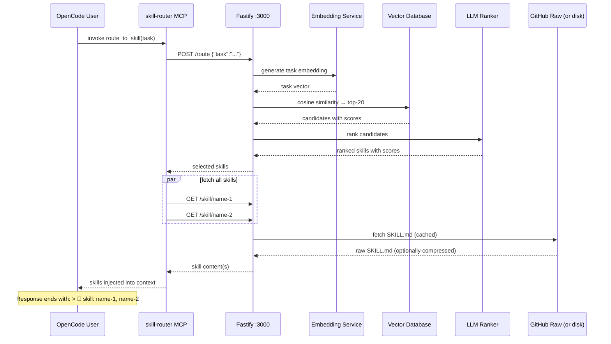

# Agent Skill Router — 1,827 Expert Skills with Built-In Compression

**An AI skill routing system that automatically selects and injects the right expertise into your AI's context.** With 1,827 skills across 5 domains and built-in SkillCompressor for reducing token overhead, the router makes expert knowledge instantly available without manual commands.

```
You → "review this Python code for security issues"
      ↓
skill-router auto-fires → embeds task → vector search → LLM ranks → loads skills
      ↓
Full expert skills injected into context (compressed if needed) — AI answers as expert reviewer
```

**Key Features:**
- 🎯 **1,827 Skills** organized across Agent, CNCF, Coding, Programming, and Trading domains
- 🔄 **Auto-Routing** — tasks automatically match the most relevant skills
- 🗜️ **SkillCompressor** — reduce token overhead by 28-65% with configurable compression levels (0-10+)
- ⚡ **Fast** — cached warm requests respond in ~10ms; cold requests in ~3.5s
- 📦 **Self-Contained** — run locally or via Docker; no external API required for routing
- 🔌 **MCP Integration** — works with OpenCode's `route_to_skill` tool

---

## Quick Start

### Installation (OpenAI)

```bash
git clone https://github.com/paulpas/agent-skill-router
cd agent-skill-router
OPENAI_API_KEY=sk-... ./install-skill-router.sh --integrate-opencode
```

Restart OpenCode. Every task automatically routes to the most relevant skill.

### Local Model (no API key required)

```bash
./install-skill-router.sh \
  --provider llamacpp \
  --embedding-provider llamacpp \
  --llamacpp-url http://localhost:8080
```

> **Note:** llama.cpp must serve both `/v1/chat/completions` and `/v1/embeddings`.

---

## Model Setup Guide

The Skill Router supports multiple LLM providers. Choose the one that fits your setup.

### OpenAI (Default)

```bash
./install-skill-router.sh --openai-key sk-...
```

Or set environment variable:
```bash
export OPENAI_API_KEY=sk-...
./install-skill-router.sh
```

**Default model:** `gpt-4o-mini` (used for embedding and ranking)
**Custom model:** Add `--model gpt-4o` to override

---

### Anthropic

```bash
./install-skill-router.sh \
  --provider anthropic \
  --anthropic-key sk-ant-... \
  --model claude-3-5-haiku-20241022
```

**Supported models:** `claude-3-5-haiku`, `claude-3-5-sonnet`, `claude-3-opus`

---

### Local llama.cpp (No API Keys)

```bash
./install-skill-router.sh \
  --provider llamacpp \
  --embedding-provider llamacpp \
  --llamacpp-url http://localhost:8080
```

**Requirements:**
- llama.cpp server running with both `/v1/chat/completions` and `/v1/embeddings` endpoints
- Compatible with OpenAI-compatible API format

**Common setup:**
```bash
# Start llama.cpp with embedding support
./server -m models/llama-3-8b.Q4_K_M.gguf \
  --host 0.0.0.0 \
  --port 8080 \
  --embedding
```

---

### Choosing a Model

| Use Case | Recommended Model | Why |
|----------|-------------------|-----|
| **Default/OpenAI** | `gpt-4o-mini` | Fast, cheap, good accuracy |
| **Budget-conscious** | `claude-3-5-haiku` | Lower cost, good performance |
| **High accuracy** | `gpt-4o`, `claude-3-opus` | Better ranking quality |
| **Offline/local** | llama-3-8b or mistral-7b | No API keys needed |

---

### Configuration Reference

| Flag | Environment Variable | Purpose |
|------|---------------------|---------|
| `--provider` | `LLM_PROVIDER` | `openai`, `anthropic`, `llamacpp` |
| `--model` | `LLM_MODEL` | Model name (uses provider default if omitted) |
| `--embedding-provider` | `EMBEDDING_PROVIDER` | `openai`, `llamacpp` |
| `--llamacpp-url` | `LLAMACPP_URL` | llama.cpp server URL |
| `--anthropic-key` | `ANTHROPIC_API_KEY` | Anthropic API key |

---

## Directory Structure

All skills live in `skills/` organized by domain:

```
skills/
├── agent/                       (271 skills)
│   ├── confidence-based-selector/
│   │   └── SKILL.md
│   ├── task-decomposition-engine/
│   │   └── SKILL.md
│   └── ... 269 more
│
├── cncf/                        (365 skills)
│   ├── kubernetes/
│   │   └── SKILL.md
│   ├── prometheus/
│   │   └── SKILL.md
│   └── ... 363 more
│
├── coding/                      (317 skills)
│   ├── code-review/
│   │   └── SKILL.md
│   ├── test-driven-development/
│   │   └── SKILL.md
│   └── ... 315 more
│
├── programming/                 (791 skills)
│   ├── react-best-practices/
│   │   └── SKILL.md
│   ├── advanced-evaluation/
│   │   └── SKILL.md
│   └── ... 789 more
│
└── trading/                     (83 skills)
    ├── ai-anomaly-detection/
    │   └── SKILL.md
    ├── backtest-walk-forward/
    │   └── SKILL.md
    └── ... 81 more

agent-skill-routing-system/      ← HTTP routing service
scripts/                         ← maintenance automation
README.md, FAQ.md, AGENTS.md     ← documentation
```

Each skill is a single `SKILL.md` file with YAML frontmatter defining its purpose, triggers, and content.

---

## Compression Configuration

### What Is Compression?

SkillCompressor reduces the token overhead of skill content by removing unnecessary whitespace, comments, and formatting. This saves 28-65% of tokens while preserving all executable code and critical information.

| Level | Description | Token Savings | Use Case |
|-------|-------------|---------------|----------|
| **0** | No compression | 0% | Development, testing, debugging |
| **1** | Remove blank lines + trailing whitespace | ~12% | Default for streaming |
| **2** | Level 1 + collapse multiple spaces | ~18% | Balanced (recommended for most) |
| **3** | Level 2 + remove comments | ~24% | Production with code focus |
| **4** | Level 3 + minify JSON/YAML | ~28% | **Default in Docker** — sweet spot |
| **5** | Level 4 + strip metadata | ~35% | Aggressive compression |
| **6-8** | Progressive minification | 40-50% | Content-heavy skills only |
| **9-10+** | Maximum compression | 50-65% | Only for huge reference skills |

### Building with Compression

Build Docker images with a specific compression level:

```bash
# Build with level 4 (28% savings, recommended)
docker build --build-arg COMPRESSION_LEVEL=4 -t skill-router:latest .

# Build with level 2 (18% savings, more readable)
docker build --build-arg COMPRESSION_LEVEL=2 -t skill-router:latest .

# Build with maximum compression (65% savings)
docker build --build-arg COMPRESSION_LEVEL=10 -t skill-router:latest .
```

### Running with Compression

Set compression at runtime:

```bash
# Default (no compression)
node dist/index.js

# Level 2 (18% savings, recommended)
SKILL_COMPRESSION_LEVEL=2 node dist/index.js

# Level 4 (28% savings, Docker default)
SKILL_COMPRESSION_LEVEL=4 node dist/index.js

# Level 5 (35% savings, aggressive)
SKILL_COMPRESSION_LEVEL=5 node dist/index.js
```

### API Queries with Compression

Request compressed skill content via HTTP:

```bash
# Get uncompressed skill
curl http://localhost:3000/skill/coding-code-review

# Get skill with level 2 compression (18% savings)
curl "http://localhost:3000/skill/coding-code-review?compression=2"

# Get skill with level 4 compression (28% savings)
curl "http://localhost:3000/skill/coding-code-review?compression=4"

# Get skill with maximum compression (65% savings)
curl "http://localhost:3000/skill/coding-code-review?compression=10"
```

### Docker Compose Example

```yaml
version: '3.8'

services:
  skill-router:
    build:
      context: .
      args:
        COMPRESSION_LEVEL: 4    # 28% token savings
    environment:
      OPENAI_API_KEY: ${OPENAI_API_KEY}
      SKILL_COMPRESSION_LEVEL: 4
    ports:
      - "3000:3000"
    volumes:
      - ./skills:/app/skills     # local skills mount
```

Run with:
```bash
docker-compose up -d
```

### Compression Metrics

Monitor compression savings:

```bash
curl http://localhost:3000/metrics
```

Example response:
```json
{
  "compression": {
    "level": 4,
    "avgTokenSavings": "28%",
    "skillsCompressed": 1777,
    "totalBytesOriginal": 52000000,
    "totalBytesCompressed": 37440000,
    "averageCompressionRatio": 0.72
  }
}
```

---

## How It Works

Every task triggers the `route_to_skill` MCP tool, which:



### Latency

| Stage | Cold | Warm (cached) |
|-------|------|---------------|
| Task embedding | ~400 ms | ~1 ms |
| Vector search | ~1 ms | ~1 ms |
| LLM ranking | ~3,000 ms | ~5 ms |
| Skill fetch + compression | ~150 ms | ~1 ms |
| **Total** | **~3.5 s** | **~10 ms** |

---

## API Endpoints

### Health & Status

```bash
# Health check
curl http://localhost:3000/health
# Response: {"status":"healthy","version":"1.0.0"}

# Service statistics
curl http://localhost:3000/stats
# Response: {"skills":{"totalSkills":1777,"domains":[...]}}

# Compression metrics
curl http://localhost:3000/metrics
```

### Skills Management

```bash
# List all skills
curl http://localhost:3000/skills
# Response: [{name:"skill-1",domain:"agent",...}, ...]

# Get specific skill (uncompressed)
curl http://localhost:3000/skill/coding-code-review

# Get skill with compression
curl "http://localhost:3000/skill/coding-code-review?compression=4"

# Get skill with custom compression and JSON response
curl "http://localhost:3000/skill/coding-code-review?compression=2&format=json"
```

### Routing & Execution

```bash
# Route a task to skills
curl -X POST http://localhost:3000/route \
  -H "Content-Type: application/json" \
  -d '{
    "task": "review this Python code for security issues",
    "maxSkills": 3
  }'
# Response: {selected: [{name:"coding-code-review",score:0.95},...]}

# Execute a task (auto-route + fetch skills)
curl -X POST http://localhost:3000/execute \
  -H "Content-Type: application/json" \
  -d '{
    "task": "help me deploy to Kubernetes",
    "compression": 2
  }'
```

### Access History

```bash
# Last 100 routing decisions
curl http://localhost:3000/access-log

# Response:
{
  "totalRequests": 150,
  "entries": [
    {
      "timestamp": "2026-04-25T14:30:00Z",
      "task": "review code",
      "topSkill": "coding-code-review",
      "confidence": 0.95,
      "latencyMs": 145
    }
  ]
}
```

### Force Sync (for new skills)

```bash
# Reload all skills from disk/GitHub
curl -X POST http://localhost:3000/reload
# Useful after pushing new skills
```

---

## Available Skills Directory

### Domain Breakdown

| Domain | Count | Focus |
|--------|-------|-------|
| **Agent** | 271 | AI orchestration, routing, task decomposition |
| **CNCF** | 365 | Kubernetes, cloud-native tooling, DevOps |
| **Coding** | 317 | Software patterns, security, testing |
| **Programming** | 791 | Algorithms, frameworks, languages |
| **Trading** | 83 | Execution, risk management, ML models |

### Agent Skills (271)

Orchestration, routing, and AI agent patterns for task automation.

| Skill | Description |
|-------|-------------|
| [confidence-based-selector](./skills/agent/confidence-based-selector/SKILL.md) | Select appropriate skill based on confidence scores and relevance |
| [task-decomposition-engine](./skills/agent/task-decomposition-engine/SKILL.md) | Break complex tasks into manageable subtasks |
| [parallel-skill-runner](./skills/agent/parallel-skill-runner/SKILL.md) | Execute multiple skills concurrently |
| [multi-skill-executor](./skills/agent/multi-skill-executor/SKILL.md) | Orchestrate skill execution with dependencies |
| [add-new-skill](./skills/agent/add-new-skill/SKILL.md) | Create and register new skills in the routing system |

*[View all 271 Agent skills →](./skills/agent/)*

### CNCF Skills (365)

Kubernetes, cloud-native projects, DevOps, and infrastructure patterns.

| Skill | Description |
|-------|-------------|
| [kubernetes](./skills/cncf/kubernetes/SKILL.md) | Container orchestration and cluster management |
| [prometheus](./skills/cncf/prometheus/SKILL.md) | Monitoring system and time series database |
| [helm](./skills/cncf/helm/SKILL.md) | Kubernetes package manager and templating |
| [istio](./skills/cncf/istio/SKILL.md) | Service mesh for traffic management |
| [etcd](./skills/cncf/etcd/SKILL.md) | Distributed key-value store for Kubernetes |

*[View all 365 CNCF skills →](./skills/cncf/)*

### Software Engineering (SWE) Skills (317)

Software engineering patterns, security, testing, and best practices.

| Skill | Description |
|-------|-------------|
| [code-review](./skills/coding/code-review/SKILL.md) | Security, bugs, code quality assessment |
| [test-driven-development](./skills/coding/test-driven-development/SKILL.md) | TDD workflows and test pyramid |
| [security-review](./skills/coding/security-review/SKILL.md) | Vulnerability scanning and secure coding |
| [fastapi-patterns](./skills/coding/fastapi-patterns/SKILL.md) | FastAPI structure and best practices |
| [pydantic-models](./skills/coding/pydantic-models/SKILL.md) | Data validation with Pydantic |

*[View all 317 Coding skills →](./skills/coding/)*

### Programming Skills (791)

Algorithms, data structures, frameworks, and language reference.

| Skill | Description |
|-------|-------------|
| [react-best-practices](./skills/programming/react-best-practices/SKILL.md) | Modern React patterns and hooks |
| [advanced-evaluation](./skills/programming/advanced-evaluation/SKILL.md) | Advanced evaluation techniques |
| [fp-react](./skills/programming/fp-react/SKILL.md) | Functional programming in React |
| [react-component-performance](./skills/programming/react-component-performance/SKILL.md) | React component optimization strategies |
| [react-flow-architect](./skills/programming/react-flow-architect/SKILL.md) | React Flow architecture and patterns |

*[View all 791 Programming skills →](./skills/programming/)*

### Trading Skills (83)

Algorithmic execution, risk management, backtesting, and ML models.

| Skill | Description |
|-------|-------------|
| [ai-anomaly-detection](./skills/trading/ai-anomaly-detection/SKILL.md) | AI-powered anomaly detection in market data |
| [backtest-walk-forward](./skills/trading/backtest-walk-forward/SKILL.md) | Robust strategy validation |
| [ai-explainable-ai](./skills/trading/ai-explainable-ai/SKILL.md) | Model interpretability in trading systems |
| [ai-feature-engineering](./skills/trading/ai-feature-engineering/SKILL.md) | Feature engineering for trading ML models |
| [ai-hyperparameter-tuning](./skills/trading/ai-hyperparameter-tuning/SKILL.md) | ML model hyperparameter optimization |

*[View all 83 Trading skills →](./skills/trading/)*

---

## Workflow: Adding New Skills

Create skills following this workflow:

### 1. Create Directory and SKILL.md

```bash
mkdir -p skills/<domain>/<skill-name>/
touch skills/<domain>/<skill-name>/SKILL.md
```

### 2. Write SKILL.md with Proper Format

```yaml
---
name: my-skill-name
description: What this skill does in one sentence
license: MIT
compatibility: opencode
metadata:
  version: "1.0.0"
  domain: coding
  role: implementation
  scope: implementation
  output-format: code
  triggers: keyword1, keyword2, keyword3, how do i implement
---

# My Skill Title

Brief description of the skill's purpose and when to use it.

## When to Use

- Concrete use case 1
- Concrete use case 2

## When NOT to Use

- Anti-pattern or irrelevant context

## Core Workflow

1. **Step 1** — Description
2. **Step 2** — Description
3. **Step 3** — Description

## Implementation Patterns

```python
# Example code
```

## Related Skills

| Skill | Purpose |
|-------|---------|
| [related-skill](../../skills/domain/related-skill/SKILL.md) | Why you'd use this alongside |
```

### 3. Validate and Regenerate Index

```bash
# Validate YAML syntax
python3 scripts/reformat_skills.py

# Update router index
python3 generate_index.py

# Regenerate README catalog
python3 scripts/generate_readme.py
```

### 4. Commit and Push

```bash
git add -A
git commit -m "feat: add my-skill-name skill

- New skill directory: skills/<domain>/<skill-name>/
- Description: Brief description
- Triggers: keyword1, keyword2, keyword3"
git push origin main
```

The router auto-discovers new skills within `SKILL_SYNC_INTERVAL` seconds (default: 1 hour). For immediate pickup:

```bash
curl -X POST http://localhost:3000/reload
```

---

## Maintenance & Automation

This repository includes scripts to maintain skills and keep metadata consistent.

### generate_readme.py

Auto-generates the skills catalog in documentation:

```bash
python3 scripts/generate_readme.py
```

Updates README with all 1,777 skills organized by domain and role.

### enhance_triggers.py

Adds conversational triggers for better skill discovery:

```bash
python3 scripts/enhance_triggers.py
```

Suggests trigger improvements like:
- "how do I..." questions
- Common colloquialisms
- Related technology names
- Operational task language

### reformat_skills.py

Validates and normalizes YAML frontmatter:

```bash
python3 scripts/reformat_skills.py
```

Ensures all skills follow the format specification.

### generate_index.py

Regenerates `skills-index.json` for routing:

```bash
python3 generate_index.py
```

Must run after adding or modifying skills.

---

## Monitoring & Debugging

### Skill Access Logs

View routing decisions and skill usage:

```bash
# Last 100 routing accesses
curl http://localhost:3000/access-log

# Filter by skill name
curl "http://localhost:3000/access-log?skill=coding-code-review"
```

### Docker Logs

View service logs:

```bash
# Follow logs in real-time
docker logs -f skill-router

# Search for specific task routes
docker logs skill-router | grep "Route result"
```

### Performance Metrics

Check system performance:

```bash
curl http://localhost:3000/metrics
```

Returns:
- Compression statistics
- Embedding cache hits
- Vector search latency
- LLM ranking latency
- Skill access frequency

---

## FAQ

**Have questions?** Check the comprehensive [FAQ.md](./FAQ.md) with 27+ Q&A covering:
- How auto-routing works
- Skill management and creation
- Compression configuration
- Troubleshooting and optimization
- Offline mode and local models

---

## Related Documentation

- **[AGENTS.md](./AGENTS.md)** — Complete guide for creating new skills
- **[SKILL_FORMAT_SPEC.md](./SKILL_FORMAT_SPEC.md)** — Formal skill file specification
- **[COMPRESSION.md](./SKILL_COMPRESSION_IMPLEMENTATION.md)** — Detailed compression guide
- **[FAQ.md](./FAQ.md)** — Common questions and troubleshooting

---

## Docker Deployment

### Build Image

```bash
# Default (no compression)
docker build -t skill-router:latest .

# With compression level 4 (28% savings, recommended)
docker build --build-arg COMPRESSION_LEVEL=4 -t skill-router:latest .
```

### Run Container

```bash
# Basic
docker run -p 3000:3000 \
  -e OPENAI_API_KEY=$OPENAI_API_KEY \
  skill-router:latest

# With compression
docker run -p 3000:3000 \
  -e OPENAI_API_KEY=$OPENAI_API_KEY \
  -e SKILL_COMPRESSION_LEVEL=4 \
  skill-router:latest

# With local volume mount
docker run -p 3000:3000 \
  -v $(pwd)/skills:/app/skills \
  -e OPENAI_API_KEY=$OPENAI_API_KEY \
  -e SKILL_COMPRESSION_LEVEL=2 \
  skill-router:latest
```

### Docker Compose (Production)

```yaml
version: '3.8'

services:
  skill-router:
    build:
      context: .
      args:
        COMPRESSION_LEVEL: 4
    environment:
      OPENAI_API_KEY: ${OPENAI_API_KEY}
      SKILL_COMPRESSION_LEVEL: 4
      SKILL_SYNC_INTERVAL: 3600
      NODE_ENV: production
    ports:
      - "3000:3000"
    volumes:
      - ./skills:/app/skills
      - skill-router-cache:/app/.cache
    restart: unless-stopped
    healthcheck:
      test: ["CMD", "curl", "-f", "http://localhost:3000/health"]
      interval: 30s
      timeout: 10s
      retries: 3

volumes:
  skill-router-cache:
```

Deploy:
```bash
docker-compose up -d
```

---

## Contributing

Skills are the core value of this system. To contribute:

1. Create a new skill following [AGENTS.md](./AGENTS.md)
2. Use specific, task-oriented triggers (not generic terms)
3. Include "When NOT to Use" section for complex skills
4. Run automation scripts before committing
5. Submit PR with descriptive commit message

---

## License

MIT — All skills are freely available and redistributable.

---

## Support

| Channel | Purpose |
|---------|---------|
| **GitHub Issues** | Bug reports, feature requests |
| **FAQ.md** | Common questions and troubleshooting |
| **AGENTS.md** | Skill creation guide and specifications |
| **OpenCode Integration** | Use `route_to_skill` in any task |

---

**Last updated:** 2026-04-25  
**Total skills:** 1,777  
**Domains:** Agent (222) · CNCF (365) · Coding (317) · Programming (790) · Trading (83)

<!-- AUTO-GENERATED SKILLS INDEX START -->

> **Last updated:** 2026-04-28 17:16:40 UTC  
> **Total skills:** 537

## Skills by Domain


### Agent (220 skills)

| Skill Name | Description | Triggers |
|---|---|---|
| [acceptance-orchestrator](../../skills/agent/acceptance-orchestrator/SKILL.md) | Implements intelligent acceptance orchestrator with... | acceptance-orchestrator, acceptance orchestrator... |
| [address-github-comments](../../skills/agent/address-github-comments/SKILL.md) | Implements intelligent address github comments with... | address-github-comments, address github comments... |
| [agent-evaluation](../../skills/agent/agent-evaluation/SKILL.md) | Implements intelligent agent evaluation with multi-factor... | agent-evaluation, agent evaluation... |
| [agent-manager-skill](../../skills/agent/agent-manager-skill/SKILL.md) | Implements intelligent agent manager skill with... | agent-manager-skill, agent manager skill... |
| [agent-memory-systems](../../skills/agent/agent-memory-systems/SKILL.md) | Implements intelligent agent memory systems with... | agent-memory-systems, agent memory systems... |
| [ai-agent-development](../../skills/agent/ai-agent-development/SKILL.md) | Implements intelligent ai agent development with... | ai-agent-development, ai agent development... |
| [ai-agents-architect](../../skills/agent/ai-agents-architect/SKILL.md) | Implements intelligent ai agents architect with... | ai-agents-architect, ai agents architect... |
| [ai-dev-jobs-mcp](../../skills/agent/ai-dev-jobs-mcp/SKILL.md) | Implements intelligent ai dev jobs mcp with multi-factor... | ai-dev-jobs-mcp, ai dev jobs mcp... |
| [ai-ml](../../skills/agent/ai-ml/SKILL.md) | Implements intelligent ai ml with multi-factor skill... | ai-ml, ai ml... |
| [airflow-dag-patterns](../../skills/agent/airflow-dag-patterns/SKILL.md) | Implements intelligent airflow dag patterns with... | airflow-dag-patterns, airflow dag patterns... |
| [airtable-automation](../../skills/agent/airtable-automation/SKILL.md) | Implements intelligent airtable automation with... | airtable-automation, airtable automation... |
| [analyze-project](../../skills/agent/analyze-project/SKILL.md) | Implements intelligent analyze project with multi-factor... | analyze-project, analyze project... |
| [andruia-consultant](../../skills/agent/andruia-consultant/SKILL.md) | Implements intelligent andruia consultant with multi-factor... | andruia-consultant, andruia consultant... |
| [andruia-niche-intelligence](../../skills/agent/andruia-niche-intelligence/SKILL.md) | Implements intelligent andruia niche intelligence with... | andruia-niche-intelligence, andruia niche intelligence... |
| [andruia-skill-smith](../../skills/agent/andruia-skill-smith/SKILL.md) | Implements intelligent andruia skill smith with... | andruia-skill-smith, andruia skill smith... |
| [antigravity-skill-orchestrator](../../skills/agent/antigravity-skill-orchestrator/SKILL.md) | Implements intelligent antigravity skill orchestrator with... | antigravity-skill-orchestrator, antigravity skill orchestrator... |
| [antigravity-workflows](../../skills/agent/antigravity-workflows/SKILL.md) | Implements intelligent antigravity workflows with... | antigravity-workflows, antigravity workflows... |
| [api-documentation](../../skills/agent/api-documentation/SKILL.md) | Implements intelligent api documentation with multi-factor... | api-documentation, api documentation... |
| [api-security-testing](../../skills/agent/api-security-testing/SKILL.md) | Implements intelligent api security testing with... | api-security-testing, api security testing... |
| [apify-actor-development](../../skills/agent/apify-actor-development/SKILL.md) | Implements intelligent apify actor development with... | apify-actor-development, apify actor development... |
| [apify-actorization](../../skills/agent/apify-actorization/SKILL.md) | Implements intelligent apify actorization with multi-factor... | apify-actorization, apify actorization... |
| [apify-audience-analysis](../../skills/agent/apify-audience-analysis/SKILL.md) | Implements intelligent apify audience analysis with... | apify-audience-analysis, apify audience analysis... |
| [apify-brand-reputation-monitoring](../../skills/agent/apify-brand-reputation-monitoring/SKILL.md) | Implements intelligent apify brand reputation monitoring... | apify-brand-reputation-monitoring, apify brand reputation monitoring... |
| [apify-competitor-intelligence](../../skills/agent/apify-competitor-intelligence/SKILL.md) | Implements intelligent apify competitor intelligence with... | apify-competitor-intelligence, apify competitor intelligence... |
| [apify-content-analytics](../../skills/agent/apify-content-analytics/SKILL.md) | Implements intelligent apify content analytics with... | apify-content-analytics, apify content analytics... |
| [apify-ecommerce](../../skills/agent/apify-ecommerce/SKILL.md) | Implements intelligent apify ecommerce with multi-factor... | apify-ecommerce, apify ecommerce... |
| [apify-influencer-discovery](../../skills/agent/apify-influencer-discovery/SKILL.md) | Implements intelligent apify influencer discovery with... | apify-influencer-discovery, apify influencer discovery... |
| [apify-lead-generation](../../skills/agent/apify-lead-generation/SKILL.md) | Implements intelligent apify lead generation with... | apify-lead-generation, apify lead generation... |
| [apify-market-research](../../skills/agent/apify-market-research/SKILL.md) | Implements intelligent apify market research with... | apify-market-research, apify market research... |
| [apify-trend-analysis](../../skills/agent/apify-trend-analysis/SKILL.md) | Implements intelligent apify trend analysis with... | apify-trend-analysis, apify trend analysis... |
| [apify-ultimate-scraper](../../skills/agent/apify-ultimate-scraper/SKILL.md) | Implements intelligent apify ultimate scraper with... | apify-ultimate-scraper, apify ultimate scraper... |
| [ask-questions-if-underspecified](../../skills/agent/ask-questions-if-underspecified/SKILL.md) | Implements intelligent ask questions if underspecified with... | ask-questions-if-underspecified, ask questions if underspecified... |
| [audio-transcriber](../../skills/agent/audio-transcriber/SKILL.md) | Implements intelligent audio transcriber with multi-factor... | audio-transcriber, audio transcriber... |
| [audit-context-building](../../skills/agent/audit-context-building/SKILL.md) | Implements intelligent audit context building with... | audit-context-building, audit context building... |
| [auri-core](../../skills/agent/auri-core/SKILL.md) | Implements intelligent auri core with multi-factor skill... | auri-core, auri core... |
| [bash-scripting](../../skills/agent/bash-scripting/SKILL.md) | Implements intelligent bash scripting with multi-factor... | bash-scripting, bash scripting... |
| [bdistill-behavioral-xray](../../skills/agent/bdistill-behavioral-xray/SKILL.md) | Implements intelligent bdistill behavioral xray with... | bdistill-behavioral-xray, bdistill behavioral xray... |
| [behavioral-modes](../../skills/agent/behavioral-modes/SKILL.md) | Implements intelligent behavioral modes with multi-factor... | behavioral-modes, behavioral modes... |
| [bitbucket-automation](../../skills/agent/bitbucket-automation/SKILL.md) | Implements intelligent bitbucket automation with... | bitbucket-automation, bitbucket automation... |
| [blueprint](../../skills/agent/blueprint/SKILL.md) | Implements intelligent blueprint with multi-factor skill... | blueprint, blueprint... |
| [build](../../skills/agent/build/SKILL.md) | Implements intelligent build with multi-factor skill... | build, build... |
| [cc-skill-backend-patterns](../../skills/agent/cc-skill-backend-patterns/SKILL.md) | Implements intelligent cc skill backend patterns with... | cc-skill-backend-patterns, cc skill backend patterns... |
| [cc-skill-clickhouse-io](../../skills/agent/cc-skill-clickhouse-io/SKILL.md) | Implements intelligent cc skill clickhouse io with... | cc-skill-clickhouse-io, cc skill clickhouse io... |
| [cc-skill-coding-standards](../../skills/agent/cc-skill-coding-standards/SKILL.md) | Implements intelligent cc skill coding standards with... | cc-skill-coding-standards, cc skill coding standards... |
| [cc-skill-continuous-learning](../../skills/agent/cc-skill-continuous-learning/SKILL.md) | Implements intelligent cc skill continuous learning with... | cc-skill-continuous-learning, cc skill continuous learning... |
| [cc-skill-frontend-patterns](../../skills/agent/cc-skill-frontend-patterns/SKILL.md) | Implements intelligent cc skill frontend patterns with... | cc-skill-frontend-patterns, cc skill frontend patterns... |
| [cc-skill-project-guidelines-example](../../skills/agent/cc-skill-project-guidelines-example/SKILL.md) | Implements intelligent cc skill project guidelines example... | cc-skill-project-guidelines-example, cc skill project guidelines example... |
| [cc-skill-security-review](../../skills/agent/cc-skill-security-review/SKILL.md) | Implements intelligent cc skill security review with... | cc-skill-security-review, cc skill security review... |
| [cc-skill-strategic-compact](../../skills/agent/cc-skill-strategic-compact/SKILL.md) | Implements intelligent cc skill strategic compact with... | cc-skill-strategic-compact, cc skill strategic compact... |
| [changelog-automation](../../skills/agent/changelog-automation/SKILL.md) | Implements intelligent changelog automation with... | changelog-automation, changelog automation... |
| [ci-cd-pipeline-analyzer](../../skills/agent/ci-cd-pipeline-analyzer/SKILL.md) | Implements intelligent ci cd pipeline analyzer with... | ci-cd-pipeline-analyzer, ci cd pipeline analyzer... |
| [cicd-automation-workflow-automate](../../skills/agent/cicd-automation-workflow-automate/SKILL.md) | Implements intelligent cicd automation workflow automate... | cicd-automation-workflow-automate, cicd automation workflow automate... |
| [circleci-automation](../../skills/agent/circleci-automation/SKILL.md) | Implements intelligent circleci automation with... | circleci-automation, circleci automation... |
| [clickup-automation](../../skills/agent/clickup-automation/SKILL.md) | Implements intelligent clickup automation with multi-factor... | clickup-automation, clickup automation... |
| [closed-loop-delivery](../../skills/agent/closed-loop-delivery/SKILL.md) | Implements intelligent closed loop delivery with... | closed-loop-delivery, closed loop delivery... |
| [cloud-devops](../../skills/agent/cloud-devops/SKILL.md) | Implements intelligent cloud devops with multi-factor skill... | cloud-devops, cloud devops... |
| [code-correctness-verifier](../../skills/agent/code-correctness-verifier/SKILL.md) | Implements intelligent code correctness verifier with... | code-correctness-verifier, code correctness verifier... |
| [commit](../../skills/agent/commit/SKILL.md) | Implements intelligent commit with multi-factor skill... | commit, commit... |
| [concise-planning](../../skills/agent/concise-planning/SKILL.md) | Implements intelligent concise planning with multi-factor... | concise-planning, concise planning... |
| [conductor-implement](../../skills/agent/conductor-implement/SKILL.md) | Implements intelligent conductor implement with... | conductor-implement, conductor implement... |
| [conductor-manage](../../skills/agent/conductor-manage/SKILL.md) | Implements intelligent conductor manage with multi-factor... | conductor-manage, conductor manage... |
| [conductor-new-track](../../skills/agent/conductor-new-track/SKILL.md) | Implements intelligent conductor new track with... | conductor-new-track, conductor new track... |
| [conductor-revert](../../skills/agent/conductor-revert/SKILL.md) | Implements intelligent conductor revert with multi-factor... | conductor-revert, conductor revert... |
| [conductor-setup](../../skills/agent/conductor-setup/SKILL.md) | Implements intelligent conductor setup with multi-factor... | conductor-setup, conductor setup... |
| [conductor-status](../../skills/agent/conductor-status/SKILL.md) | Implements intelligent conductor status with multi-factor... | conductor-status, conductor status... |
| [conductor-validator](../../skills/agent/conductor-validator/SKILL.md) | Implements intelligent conductor validator with... | conductor-validator, conductor validator... |
| [confidence-based-selector](../../skills/agent/confidence-based-selector/SKILL.md) | Implements intelligent confidence based selector with... | confidence-based-selector, confidence based selector... |
| [container-inspector](../../skills/agent/container-inspector/SKILL.md) | Implements intelligent container inspector with... | container-inspector, container inspector... |
| [context-window-management](../../skills/agent/context-window-management/SKILL.md) | Implements intelligent context window management with... | context-window-management, context window management... |
| [context7-auto-research](../../skills/agent/context7-auto-research/SKILL.md) | Implements intelligent context7 auto research with... | context7-auto-research, context7 auto research... |
| [conversation-memory](../../skills/agent/conversation-memory/SKILL.md) | Implements intelligent conversation memory with... | conversation-memory, conversation memory... |
| [create-branch](../../skills/agent/create-branch/SKILL.md) | Implements intelligent create branch with multi-factor... | create-branch, create branch... |
| [create-issue-gate](../../skills/agent/create-issue-gate/SKILL.md) | Implements intelligent create issue gate with multi-factor... | create-issue-gate, create issue gate... |
| [create-pr](../../skills/agent/create-pr/SKILL.md) | Implements intelligent create pr with multi-factor skill... | create-pr, create pr... |
| [database](../../skills/agent/database/SKILL.md) | Implements intelligent database with multi-factor skill... | database, database... |
| [dependency-graph-builder](../../skills/agent/dependency-graph-builder/SKILL.md) | Implements intelligent dependency graph builder with... | dependency-graph-builder, dependency graph builder... |
| [development](../../skills/agent/development/SKILL.md) | Implements intelligent development with multi-factor skill... | development, development... |
| [diary](../../skills/agent/diary/SKILL.md) | Implements intelligent diary with multi-factor skill... | diary, diary... |
| [diff-quality-analyzer](../../skills/agent/diff-quality-analyzer/SKILL.md) | Implements intelligent diff quality analyzer with... | diff-quality-analyzer, diff quality analyzer... |
| [dispatching-parallel-agents](../../skills/agent/dispatching-parallel-agents/SKILL.md) | Implements intelligent dispatching parallel agents with... | dispatching-parallel-agents, dispatching parallel agents... |
| [documentation](../../skills/agent/documentation/SKILL.md) | Implements intelligent documentation with multi-factor... | documentation, documentation... |
| [dynamic-replanner](../../skills/agent/dynamic-replanner/SKILL.md) | Implements intelligent dynamic replanner with multi-factor... | dynamic-replanner, dynamic replanner... |
| [e2e-testing](../../skills/agent/e2e-testing/SKILL.md) | Implements intelligent e2e testing with multi-factor skill... | e2e-testing, e2e testing... |
| [error-trace-explainer](../../skills/agent/error-trace-explainer/SKILL.md) | Implements intelligent error trace explainer with... | error-trace-explainer, error trace explainer... |
| [executing-plans](../../skills/agent/executing-plans/SKILL.md) | Implements intelligent executing plans with multi-factor... | executing-plans, executing plans... |
| [failure-mode-analysis](../../skills/agent/failure-mode-analysis/SKILL.md) | Implements intelligent failure mode analysis with... | failure-mode-analysis, failure mode analysis... |
| [fal-audio](../../skills/agent/fal-audio/SKILL.md) | Implements intelligent fal audio with multi-factor skill... | fal-audio, fal audio... |
| [filesystem-context](../../skills/agent/filesystem-context/SKILL.md) | Implements intelligent filesystem context with multi-factor... | filesystem-context, filesystem context... |
| [finishing-a-development-branch](../../skills/agent/finishing-a-development-branch/SKILL.md) | Implements intelligent finishing a development branch with... | finishing-a-development-branch, finishing a development branch... |
| [freshdesk-automation](../../skills/agent/freshdesk-automation/SKILL.md) | Implements intelligent freshdesk automation with... | freshdesk-automation, freshdesk automation... |
| [full-stack-orchestration-full-stack-feature](../../skills/agent/full-stack-orchestration-full-stack-feature/SKILL.md) | Implements intelligent full stack orchestration full stack... | full-stack-orchestration-full-stack-feature, full stack orchestration full stack feature... |
| [gemini-api-integration](../../skills/agent/gemini-api-integration/SKILL.md) | Implements intelligent gemini api integration with... | gemini-api-integration, gemini api integration... |
| [gh-review-requests](../../skills/agent/gh-review-requests/SKILL.md) | Implements intelligent gh review requests with multi-factor... | gh-review-requests, gh review requests... |
| [git-advanced-workflows](../../skills/agent/git-advanced-workflows/SKILL.md) | Implements intelligent git advanced workflows with... | git-advanced-workflows, git advanced workflows... |
| [git-hooks-automation](../../skills/agent/git-hooks-automation/SKILL.md) | Implements intelligent git hooks automation with... | git-hooks-automation, git hooks automation... |
| [git-pr-workflows-git-workflow](../../skills/agent/git-pr-workflows-git-workflow/SKILL.md) | Implements intelligent git pr workflows git workflow with... | git-pr-workflows-git-workflow, git pr workflows git workflow... |
| [git-pr-workflows-onboard](../../skills/agent/git-pr-workflows-onboard/SKILL.md) | Implements intelligent git pr workflows onboard with... | git-pr-workflows-onboard, git pr workflows onboard... |
| [git-pr-workflows-pr-enhance](../../skills/agent/git-pr-workflows-pr-enhance/SKILL.md) | Implements intelligent git pr workflows pr enhance with... | git-pr-workflows-pr-enhance, git pr workflows pr enhance... |
| [git-pushing](../../skills/agent/git-pushing/SKILL.md) | Implements intelligent git pushing with multi-factor skill... | git-pushing, git pushing... |
| [github-actions-templates](../../skills/agent/github-actions-templates/SKILL.md) | Implements intelligent github actions templates with... | github-actions-templates, github actions templates... |
| [github-automation](../../skills/agent/github-automation/SKILL.md) | Implements intelligent github automation with multi-factor... | github-automation, github automation... |
| [github-workflow-automation](../../skills/agent/github-workflow-automation/SKILL.md) | Implements intelligent github workflow automation with... | github-workflow-automation, github workflow automation... |
| [gitlab-automation](../../skills/agent/gitlab-automation/SKILL.md) | Implements intelligent gitlab automation with multi-factor... | gitlab-automation, gitlab automation... |
| [gitlab-ci-patterns](../../skills/agent/gitlab-ci-patterns/SKILL.md) | Implements intelligent gitlab ci patterns with multi-factor... | gitlab-ci-patterns, gitlab ci patterns... |
| [goal-to-milestones](../../skills/agent/goal-to-milestones/SKILL.md) | Implements intelligent goal to milestones with multi-factor... | goal-to-milestones, goal to milestones... |
| [google-analytics-automation](../../skills/agent/google-analytics-automation/SKILL.md) | Implements intelligent google analytics automation with... | google-analytics-automation, google analytics automation... |
| [google-docs-automation](../../skills/agent/google-docs-automation/SKILL.md) | Implements intelligent google docs automation with... | google-docs-automation, google docs automation... |
| [google-drive-automation](../../skills/agent/google-drive-automation/SKILL.md) | Implements intelligent google drive automation with... | google-drive-automation, google drive automation... |
| [helpdesk-automation](../../skills/agent/helpdesk-automation/SKILL.md) | Implements intelligent helpdesk automation with... | helpdesk-automation, helpdesk automation... |
| [hierarchical-agent-memory](../../skills/agent/hierarchical-agent-memory/SKILL.md) | Implements intelligent hierarchical agent memory with... | hierarchical-agent-memory, hierarchical agent memory... |
| [hosted-agents](../../skills/agent/hosted-agents/SKILL.md) | Implements intelligent hosted agents with multi-factor... | hosted-agents, hosted agents... |
| [hosted-agents-v2-py](../../skills/agent/hosted-agents-v2-py/SKILL.md) | Implements intelligent hosted agents v2 py with... | hosted-agents-v2-py, hosted agents v2 py... |
| [hot-path-detector](../../skills/agent/hot-path-detector/SKILL.md) | Implements intelligent hot path detector with multi-factor... | hot-path-detector, hot path detector... |
| [hubspot-automation](../../skills/agent/hubspot-automation/SKILL.md) | Implements intelligent hubspot automation with multi-factor... | hubspot-automation, hubspot automation... |
| [infra-drift-detector](../../skills/agent/infra-drift-detector/SKILL.md) | Implements intelligent infra drift detector with... | infra-drift-detector, infra drift detector... |
| [inngest](../../skills/agent/inngest/SKILL.md) | Implements intelligent inngest with multi-factor skill... | inngest, inngest... |
| [intercom-automation](../../skills/agent/intercom-automation/SKILL.md) | Implements intelligent intercom automation with... | intercom-automation, intercom automation... |
| [issues](../../skills/agent/issues/SKILL.md) | Implements intelligent issues with multi-factor skill... | issues, issues... |
| [iterate-pr](../../skills/agent/iterate-pr/SKILL.md) | Implements intelligent iterate pr with multi-factor skill... | iterate-pr, iterate pr... |
| [k8s-debugger](../../skills/agent/k8s-debugger/SKILL.md) | Implements intelligent k8s debugger with multi-factor skill... | k8s-debugger, k8s debugger... |
| [kubernetes-deployment](../../skills/agent/kubernetes-deployment/SKILL.md) | Implements intelligent kubernetes deployment with... | kubernetes-deployment, kubernetes deployment... |
| [lambda-lang](../../skills/agent/lambda-lang/SKILL.md) | Implements intelligent lambda lang with multi-factor skill... | lambda-lang, lambda lang... |
| [langgraph](../../skills/agent/langgraph/SKILL.md) | Implements intelligent langgraph with multi-factor skill... | langgraph, langgraph... |
| [lint-and-validate](../../skills/agent/lint-and-validate/SKILL.md) | Implements intelligent lint and validate with multi-factor... | lint-and-validate, lint and validate... |
| [linux-troubleshooting](../../skills/agent/linux-troubleshooting/SKILL.md) | Implements intelligent linux troubleshooting with... | linux-troubleshooting, linux troubleshooting... |
| [m365-agents-dotnet](../../skills/agent/m365-agents-dotnet/SKILL.md) | Implements intelligent m365 agents dotnet with multi-factor... | m365-agents-dotnet, m365 agents dotnet... |
| [m365-agents-ts](../../skills/agent/m365-agents-ts/SKILL.md) | Implements intelligent m365 agents ts with multi-factor... | m365-agents-ts, m365 agents ts... |
| [make-automation](../../skills/agent/make-automation/SKILL.md) | Implements intelligent make automation with multi-factor... | make-automation, make automation... |
| [mcp-builder](../../skills/agent/mcp-builder/SKILL.md) | Implements intelligent mcp builder with multi-factor skill... | mcp-builder, mcp builder... |
| [mcp-builder-ms](../../skills/agent/mcp-builder-ms/SKILL.md) | Implements intelligent mcp builder ms with multi-factor... | mcp-builder-ms, mcp builder ms... |
| [memory-systems](../../skills/agent/memory-systems/SKILL.md) | Implements intelligent memory systems with multi-factor... | memory-systems, memory systems... |
| [memory-usage-analyzer](../../skills/agent/memory-usage-analyzer/SKILL.md) | Implements intelligent memory usage analyzer with... | memory-usage-analyzer, memory usage analyzer... |
| [ml-pipeline-workflow](../../skills/agent/ml-pipeline-workflow/SKILL.md) | Implements intelligent ml pipeline workflow with... | ml-pipeline-workflow, ml pipeline workflow... |
| [multi-advisor](../../skills/agent/multi-advisor/SKILL.md) | Implements intelligent multi advisor with multi-factor... | multi-advisor, multi advisor... |
| [multi-agent-patterns](../../skills/agent/multi-agent-patterns/SKILL.md) | Implements intelligent multi agent patterns with... | multi-agent-patterns, multi agent patterns... |
| [multi-agent-task-orchestrator](../../skills/agent/multi-agent-task-orchestrator/SKILL.md) | Implements intelligent multi agent task orchestrator with... | multi-agent-task-orchestrator, multi agent task orchestrator... |
| [multi-skill-executor](../../skills/agent/multi-skill-executor/SKILL.md) | Implements intelligent multi skill executor with... | multi-skill-executor, multi skill executor... |
| [n8n-code-javascript](../../skills/agent/n8n-code-javascript/SKILL.md) | Implements intelligent n8n code javascript with... | n8n-code-javascript, n8n code javascript... |
| [n8n-code-python](../../skills/agent/n8n-code-python/SKILL.md) | Implements intelligent n8n code python with multi-factor... | n8n-code-python, n8n code python... |
| [n8n-expression-syntax](../../skills/agent/n8n-expression-syntax/SKILL.md) | Implements intelligent n8n expression syntax with... | n8n-expression-syntax, n8n expression syntax... |
| [n8n-mcp-tools-expert](../../skills/agent/n8n-mcp-tools-expert/SKILL.md) | Implements intelligent n8n mcp tools expert with... | n8n-mcp-tools-expert, n8n mcp tools expert... |
| [n8n-node-configuration](../../skills/agent/n8n-node-configuration/SKILL.md) | Implements intelligent n8n node configuration with... | n8n-node-configuration, n8n node configuration... |
| [n8n-validation-expert](../../skills/agent/n8n-validation-expert/SKILL.md) | Implements intelligent n8n validation expert with... | n8n-validation-expert, n8n validation expert... |
| [n8n-workflow-patterns](../../skills/agent/n8n-workflow-patterns/SKILL.md) | Implements intelligent n8n workflow patterns with... | n8n-workflow-patterns, n8n workflow patterns... |
| [network-diagnostics](../../skills/agent/network-diagnostics/SKILL.md) | Implements intelligent network diagnostics with... | network-diagnostics, network diagnostics... |
| [not-human-search-mcp](../../skills/agent/not-human-search-mcp/SKILL.md) | Implements intelligent not human search mcp with... | not-human-search-mcp, not human search mcp... |
| [notion-automation](../../skills/agent/notion-automation/SKILL.md) | Implements intelligent notion automation with multi-factor... | notion-automation, notion automation... |
| [os-scripting](../../skills/agent/os-scripting/SKILL.md) | Implements intelligent os scripting with multi-factor skill... | os-scripting, os scripting... |
| [outlook-automation](../../skills/agent/outlook-automation/SKILL.md) | Implements intelligent outlook automation with multi-factor... | outlook-automation, outlook automation... |
| [outlook-calendar-automation](../../skills/agent/outlook-calendar-automation/SKILL.md) | Implements intelligent outlook calendar automation with... | outlook-calendar-automation, outlook calendar automation... |
| [parallel-agents](../../skills/agent/parallel-agents/SKILL.md) | Implements intelligent parallel agents with multi-factor... | parallel-agents, parallel agents... |
| [parallel-skill-runner](../../skills/agent/parallel-skill-runner/SKILL.md) | Implements intelligent parallel skill runner with... | parallel-skill-runner, parallel skill runner... |
| [performance-profiler](../../skills/agent/performance-profiler/SKILL.md) | Implements intelligent performance profiler with... | performance-profiler, performance profiler... |
| [pipecat-friday-agent](../../skills/agent/pipecat-friday-agent/SKILL.md) | Implements intelligent pipecat friday agent with... | pipecat-friday-agent, pipecat friday agent... |
| [plan-writing](../../skills/agent/plan-writing/SKILL.md) | Implements intelligent plan writing with multi-factor skill... | plan-writing, plan writing... |
| [planning-with-files](../../skills/agent/planning-with-files/SKILL.md) | Implements intelligent planning with files with... | planning-with-files, planning with files... |
| [postgresql-optimization](../../skills/agent/postgresql-optimization/SKILL.md) | Implements intelligent postgresql optimization with... | postgresql-optimization, postgresql optimization... |
| [pr-writer](../../skills/agent/pr-writer/SKILL.md) | Implements intelligent pr writer with multi-factor skill... | pr-writer, pr writer... |
| [prompt-engineer](../../skills/agent/prompt-engineer/SKILL.md) | Implements intelligent prompt engineer with multi-factor... | prompt-engineer, prompt engineer... |
| [pydantic-ai](../../skills/agent/pydantic-ai/SKILL.md) | Implements intelligent pydantic ai with multi-factor skill... | pydantic-ai, pydantic ai... |
| [python-fastapi-development](../../skills/agent/python-fastapi-development/SKILL.md) | Implements intelligent python fastapi development with... | python-fastapi-development, python fastapi development... |
| [query-optimizer](../../skills/agent/query-optimizer/SKILL.md) | Implements intelligent query optimizer with multi-factor... | query-optimizer, query optimizer... |
| [rag-implementation](../../skills/agent/rag-implementation/SKILL.md) | Implements intelligent rag implementation with multi-factor... | rag-implementation, rag implementation... |
| [react-nextjs-development](../../skills/agent/react-nextjs-development/SKILL.md) | Implements intelligent react nextjs development with... | react-nextjs-development, react nextjs development... |
| [recallmax](../../skills/agent/recallmax/SKILL.md) | Implements intelligent recallmax with multi-factor skill... | recallmax, recallmax... |
| [receiving-code-review](../../skills/agent/receiving-code-review/SKILL.md) | Implements intelligent receiving code review with... | receiving-code-review, receiving code review... |
| [regression-detector](../../skills/agent/regression-detector/SKILL.md) | Implements intelligent regression detector with... | regression-detector, regression detector... |
| [render-automation](../../skills/agent/render-automation/SKILL.md) | Implements intelligent render automation with multi-factor... | render-automation, render automation... |
| [requesting-code-review](../../skills/agent/requesting-code-review/SKILL.md) | Implements intelligent requesting code review with... | requesting-code-review, requesting code review... |
| [resource-optimizer](../../skills/agent/resource-optimizer/SKILL.md) | Implements intelligent resource optimizer with multi-factor... | resource-optimizer, resource optimizer... |
| [runtime-log-analyzer](../../skills/agent/runtime-log-analyzer/SKILL.md) | Implements intelligent runtime log analyzer with... | runtime-log-analyzer, runtime log analyzer... |
| [schema-inference-engine](../../skills/agent/schema-inference-engine/SKILL.md) | Implements intelligent schema inference engine with... | schema-inference-engine, schema inference engine... |
| [security-audit](../../skills/agent/security-audit/SKILL.md) | Implements intelligent security audit with multi-factor... | security-audit, security audit... |
| [self-critique-engine](../../skills/agent/self-critique-engine/SKILL.md) | Implements intelligent self critique engine with... | self-critique-engine, self critique engine... |
| [sendgrid-automation](../../skills/agent/sendgrid-automation/SKILL.md) | Implements intelligent sendgrid automation with... | sendgrid-automation, sendgrid automation... |
| [shopify-automation](../../skills/agent/shopify-automation/SKILL.md) | Implements intelligent shopify automation with multi-factor... | shopify-automation, shopify automation... |
| [skill-creator](../../skills/agent/skill-creator/SKILL.md) | Implements intelligent skill creator with multi-factor... | skill-creator, skill creator... |
| [skill-creator-ms](../../skills/agent/skill-creator-ms/SKILL.md) | Implements intelligent skill creator ms with multi-factor... | skill-creator-ms, skill creator ms... |
| [skill-developer](../../skills/agent/skill-developer/SKILL.md) | Implements intelligent skill developer with multi-factor... | skill-developer, skill developer... |
| [skill-improver](../../skills/agent/skill-improver/SKILL.md) | Implements intelligent skill improver with multi-factor... | skill-improver, skill improver... |
| [skill-installer](../../skills/agent/skill-installer/SKILL.md) | Implements intelligent skill installer with multi-factor... | skill-installer, skill installer... |
| [skill-optimizer](../../skills/agent/skill-optimizer/SKILL.md) | Implements intelligent skill optimizer with multi-factor... | skill-optimizer, skill optimizer... |
| [skill-rails-upgrade](../../skills/agent/skill-rails-upgrade/SKILL.md) | Implements intelligent skill rails upgrade with... | skill-rails-upgrade, skill rails upgrade... |
| [skill-router](../../skills/agent/skill-router/SKILL.md) | Implements intelligent skill router with multi-factor skill... | skill-router, skill router... |
| [skill-scanner](../../skills/agent/skill-scanner/SKILL.md) | Implements intelligent skill scanner with multi-factor... | skill-scanner, skill scanner... |
| [skill-seekers](../../skills/agent/skill-seekers/SKILL.md) | Implements intelligent skill seekers with multi-factor... | skill-seekers, skill seekers... |
| [skill-sentinel](../../skills/agent/skill-sentinel/SKILL.md) | Implements intelligent skill sentinel with multi-factor... | skill-sentinel, skill sentinel... |
| [skill-writer](../../skills/agent/skill-writer/SKILL.md) | Implements intelligent skill writer with multi-factor skill... | skill-writer, skill writer... |
| [slack-automation](../../skills/agent/slack-automation/SKILL.md) | Implements intelligent slack automation with multi-factor... | slack-automation, slack automation... |
| [stacktrace-root-cause](../../skills/agent/stacktrace-root-cause/SKILL.md) | Implements intelligent stacktrace root cause with... | stacktrace-root-cause, stacktrace root cause... |
| [stripe-automation](../../skills/agent/stripe-automation/SKILL.md) | Implements intelligent stripe automation with multi-factor... | stripe-automation, stripe automation... |
| [subagent-driven-development](../../skills/agent/subagent-driven-development/SKILL.md) | Implements intelligent subagent driven development with... | subagent-driven-development, subagent driven development... |
| [task-decomposition-engine](../../skills/agent/task-decomposition-engine/SKILL.md) | Implements intelligent task decomposition engine with... | task-decomposition-engine, task decomposition engine... |
| [task-intelligence](../../skills/agent/task-intelligence/SKILL.md) | Implements intelligent task intelligence with multi-factor... | task-intelligence, task intelligence... |
| [temporal-golang-pro](../../skills/agent/temporal-golang-pro/SKILL.md) | Implements intelligent temporal golang pro with... | temporal-golang-pro, temporal golang pro... |
| [temporal-python-pro](../../skills/agent/temporal-python-pro/SKILL.md) | Implements intelligent temporal python pro with... | temporal-python-pro, temporal python pro... |
| [terraform-infrastructure](../../skills/agent/terraform-infrastructure/SKILL.md) | Implements intelligent terraform infrastructure with... | terraform-infrastructure, terraform infrastructure... |
| [test-oracle-generator](../../skills/agent/test-oracle-generator/SKILL.md) | Implements intelligent test oracle generator with... | test-oracle-generator, test oracle generator... |
| [testing-qa](../../skills/agent/testing-qa/SKILL.md) | Implements intelligent testing qa with multi-factor skill... | testing-qa, testing qa... |
| [track-management](../../skills/agent/track-management/SKILL.md) | Implements intelligent track management with multi-factor... | track-management, track management... |
| [trigger-dev](../../skills/agent/trigger-dev/SKILL.md) | Implements intelligent trigger dev with multi-factor skill... | trigger-dev, trigger dev... |
| [upstash-qstash](../../skills/agent/upstash-qstash/SKILL.md) | Implements intelligent upstash qstash with multi-factor... | upstash-qstash, upstash qstash... |
| [using-superpowers](../../skills/agent/using-superpowers/SKILL.md) | Implements intelligent using superpowers with multi-factor... | using-superpowers, using superpowers... |
| [verification-before-completion](../../skills/agent/verification-before-completion/SKILL.md) | Implements intelligent verification before completion with... | verification-before-completion, verification before completion... |
| [viboscope](../../skills/agent/viboscope/SKILL.md) | Implements intelligent viboscope with multi-factor skill... | viboscope, viboscope... |
| [voice-ai-development](../../skills/agent/voice-ai-development/SKILL.md) | Implements intelligent voice ai development with... | voice-ai-development, voice ai development... |
| [web-security-testing](../../skills/agent/web-security-testing/SKILL.md) | Implements intelligent web security testing with... | web-security-testing, web security testing... |
| [wordpress](../../skills/agent/wordpress/SKILL.md) | Implements intelligent wordpress with multi-factor skill... | wordpress, wordpress... |
| [wordpress-plugin-development](../../skills/agent/wordpress-plugin-development/SKILL.md) | Implements intelligent wordpress plugin development with... | wordpress-plugin-development, wordpress plugin development... |
| [wordpress-theme-development](../../skills/agent/wordpress-theme-development/SKILL.md) | Implements intelligent wordpress theme development with... | wordpress-theme-development, wordpress theme development... |
| [wordpress-woocommerce-development](../../skills/agent/wordpress-woocommerce-development/SKILL.md) | Implements intelligent wordpress woocommerce development... | wordpress-woocommerce-development, wordpress woocommerce development... |
| [workflow-automation](../../skills/agent/workflow-automation/SKILL.md) | Implements intelligent workflow automation with... | workflow-automation, workflow automation... |
| [workflow-orchestration-patterns](../../skills/agent/workflow-orchestration-patterns/SKILL.md) | Implements intelligent workflow orchestration patterns with... | workflow-orchestration-patterns, workflow orchestration patterns... |
| [workflow-patterns](../../skills/agent/workflow-patterns/SKILL.md) | Implements intelligent workflow patterns with multi-factor... | workflow-patterns, workflow patterns... |
| [writing-plans](../../skills/agent/writing-plans/SKILL.md) | Implements intelligent writing plans with multi-factor... | writing-plans, writing plans... |
| [writing-skills](../../skills/agent/writing-skills/SKILL.md) | Implements intelligent writing skills with multi-factor... | writing-skills, writing skills... |
| [zapier-make-patterns](../../skills/agent/zapier-make-patterns/SKILL.md) | Implements intelligent zapier make patterns with... | zapier-make-patterns, zapier make patterns... |
| [zendesk-automation](../../skills/agent/zendesk-automation/SKILL.md) | Implements intelligent zendesk automation with multi-factor... | zendesk-automation, zendesk automation... |
| [zipai-optimizer](../../skills/agent/zipai-optimizer/SKILL.md) | Implements intelligent zipai optimizer with multi-factor... | zipai-optimizer, zipai optimizer... |
| [zoom-automation](../../skills/agent/zoom-automation/SKILL.md) | Implements intelligent zoom automation with multi-factor... | zoom-automation, zoom automation... |


### Cncf (149 skills)

| Skill Name | Description | Triggers |
|---|---|---|
| [aks](../../skills/cncf/aks/SKILL.md) | "Provides Managed Kubernetes cluster with automatic scaling... | aks, kubernetes... |
| [architecture](../../skills/cncf/architecture/SKILL.md) | "Creates or updates ARCHITECTURE.md documenting the... | creates, documenting... |
| [argo](../../skills/cncf/argo/SKILL.md) | "Argo in Cloud-Native Engineering - Kubernetes-Native... | argo, cloud-native... |
| [auto-scaling](../../skills/cncf/auto-scaling/SKILL.md) | "Configures automatic scaling of compute resources (EC2,... | asg, auto-scaling... |
| [automation](../../skills/cncf/automation/SKILL.md) | Provides Automation and orchestration of Azure resources... | automation, runbooks... |
| [autoscaling](../../skills/cncf/autoscaling/SKILL.md) | "Provides Automatically scales compute resources based on... | autoscaling, auto-scaling... |
| [backstage](../../skills/cncf/backstage/SKILL.md) | "Provides Backstage in Cloud-Native Engineering - Developer... | backstage, cloud-native... |
| [best-practices](../../skills/cncf/best-practices/SKILL.md) | "Cloud Native Computing Foundation (CNCF) architecture best... | architecture best practices, architecture-best-practices... |
| [blob-storage](../../skills/cncf/blob-storage/SKILL.md) | Provides Object storage with versioning, lifecycle... | blob storage, object storage... |
| [buildpacks](../../skills/cncf/buildpacks/SKILL.md) | "Provides Buildpacks in Cloud-Native Engineering - Turn... | buildpacks, cloud-native... |
| [calico](../../skills/cncf/calico/SKILL.md) | "Calico in Cloud Native Security - cloud native... | calico, cdn... |
| [cdn](../../skills/cncf/cdn/SKILL.md) | Provides Content delivery network for caching and global... | cdn, content delivery... |
| [chaosmesh](../../skills/cncf/chaosmesh/SKILL.md) | ''Provides Chaos Mesh in Cloud-Native Engineering... | chaosmesh, chaos... |
| [cilium](../../skills/cncf/cilium/SKILL.md) | "Cilium in Cloud Native Network - cloud native... | cdn, cilium... |
| [cloud-cdn](../../skills/cncf/cloud-cdn/SKILL.md) | Provides Content delivery network for caching and globally... | cloud cdn, cdn... |
| [cloud-dns](../../skills/cncf/cloud-dns/SKILL.md) | Manages DNS with health checks, traffic routing, and... | cloud dns, dns... |
| [cloud-functions](../../skills/cncf/cloud-functions/SKILL.md) | Deploys serverless functions triggered by events with... | cloud functions, serverless... |
| [cloud-kms](../../skills/cncf/cloud-kms/SKILL.md) | "Manages encryption keys for data protection with automated... | kms, key management... |
| [cloud-load-balancing](../../skills/cncf/cloud-load-balancing/SKILL.md) | "Provides Distributes traffic across instances with... | load balancing, traffic distribution... |
| [cloud-monitoring](../../skills/cncf/cloud-monitoring/SKILL.md) | "Monitors GCP resources with metrics, logging, and alerting... | cloud monitoring, monitoring... |
| [cloud-operations](../../skills/cncf/cloud-operations/SKILL.md) | "Provides Systems management including monitoring, logging,... | cloud operations, monitoring... |
| [cloud-pubsub](../../skills/cncf/cloud-pubsub/SKILL.md) | "Asynchronous messaging service for event streaming and... | pubsub, messaging... |
| [cloud-sql](../../skills/cncf/cloud-sql/SKILL.md) | "Provides managed relational databases (MySQL, PostgreSQL)... | cloud sql, relational database... |
| [cloud-storage](../../skills/cncf/cloud-storage/SKILL.md) | "Provides Stores objects with versioning, lifecycle... | cloud storage, gcs... |
| [cloud-tasks](../../skills/cncf/cloud-tasks/SKILL.md) | "Manages task queues for asynchronous job execution with... | cloud tasks, task queue... |
| [cloudevents](../../skills/cncf/cloudevents/SKILL.md) | "CloudEvents in Streaming & Messaging - cloud native... | cdn, cloudevents... |
| [cloudformation](../../skills/cncf/cloudformation/SKILL.md) | "Creates Infrastructure as Code templates with... | cloudformation, infrastructure as code... |
| [cloudfront](../../skills/cncf/cloudfront/SKILL.md) | "Configures CloudFront CDN for global content distribution... | cloudfront, cdn... |
| [cloudwatch](../../skills/cncf/cloudwatch/SKILL.md) | "Configures CloudWatch monitoring with metrics, logs,... | cloudwatch, monitoring... |
| [cni](../../skills/cncf/cni/SKILL.md) | "Cni in Cloud-Native Engineering - Container Network... | cloud-native, cni... |
| [compute-engine](../../skills/cncf/compute-engine/SKILL.md) | "Deploys and manages virtual machine instances with... | compute engine, gce... |
| [container-linux](../../skills/cncf/container-linux/SKILL.md) | "Provides Flatcar Container Linux in Cloud-Native... | cloud-native, engineering... |
| [container-registry](../../skills/cncf/container-registry/SKILL.md) | "Provides Stores and manages container images with... | container registry, acr... |
| [container-registry](../../skills/cncf/container-registry/SKILL.md) | "Provides Stores and manages container images with... | container registry, gcr... |
| [containerd](../../skills/cncf/containerd/SKILL.md) | "Containerd in Cloud-Native Engineering - An open and... | cloud-native, containerd... |
| [contour](../../skills/cncf/contour/SKILL.md) | "Contour in Service Proxy - cloud native architecture,... | cdn, contour... |
| [coredns](../../skills/cncf/coredns/SKILL.md) | "Coredns in Cloud-Native Engineering - CoreDNS is a DNS... | cloud-native, coredns... |
| [cortex](../../skills/cncf/cortex/SKILL.md) | "Cortex in Monitoring & Observability - distributed,... | cortex, distributed... |
| [cosmos-db](../../skills/cncf/cosmos-db/SKILL.md) | Provides Global NoSQL database with multi-region... | cosmos db, nosql... |
| [crossplane](../../skills/cncf/crossplane/SKILL.md) | "Crossplane in Platform Engineering - Kubernetes-native... | container orchestration, crossplane... |
| [cubefs](../../skills/cncf/cubefs/SKILL.md) | "Provides CubeFS in Storage - distributed, high-performance... | cubefs, distributed... |
| [custodian](../../skills/cncf/custodian/SKILL.md) | "Provides Cloud Custodian in Cloud-Native Engineering... | cloud custodian, cloud-custodian... |
| [dapr](../../skills/cncf/dapr/SKILL.md) | "Provides Dapr in Cloud-Native Engineering - distributed... | cloud-native, dapr... |
| [deployment-manager](../../skills/cncf/deployment-manager/SKILL.md) | "Infrastructure as code using YAML templates for repeatable... | deployment manager, infrastructure as code... |
| [dragonfly](../../skills/cncf/dragonfly/SKILL.md) | "Provides Dragonfly in Cloud-Native Engineering - P2P file... | cloud-native, distribution... |
| [dynamodb](../../skills/cncf/dynamodb/SKILL.md) | "Deploys managed NoSQL databases with DynamoDB for... | dynamodb, nosql... |
| [ec2](../../skills/cncf/ec2/SKILL.md) | "Deploys, configures, and auto-scales EC2 instances with... | ec2, compute instances... |
| [ecr](../../skills/cncf/ecr/SKILL.md) | "Manages container image repositories with ECR for secure... | container registry, container security... |
| [eks](../../skills/cncf/eks/SKILL.md) | "Deploys managed Kubernetes clusters with EKS for container... | eks, container orchestration... |
| [elb](../../skills/cncf/elb/SKILL.md) | "Configures Elastic Load Balancing (ALB, NLB, Classic) for... | elb, load balancer... |
| [envoy](../../skills/cncf/envoy/SKILL.md) | "Envoy in Cloud-Native Engineering - Cloud-native... | cloud-native, engineering... |
| [etcd](../../skills/cncf/etcd/SKILL.md) | "Provides etcd in Cloud-Native Engineering - distributed... | cloud-native, distributed... |
| [event-hubs](../../skills/cncf/event-hubs/SKILL.md) | "Provides Event streaming platform for high-throughput data... | event hubs, event streaming... |
| [falco](../../skills/cncf/falco/SKILL.md) | "Provides Falco in Cloud-Native Engineering - Cloud Native... | cdn, cloud-native... |
| [firestore](../../skills/cncf/firestore/SKILL.md) | Provides NoSQL document database with real-time sync,... | firestore, nosql... |
| [fluentd](../../skills/cncf/fluentd/SKILL.md) | "Fluentd unified logging layer for collecting,... | fluentd, log collection... |
| [fluid](../../skills/cncf/fluid/SKILL.md) | "Fluid in A Kubernetes-native data acceleration layer for... | acceleration, container orchestration... |
| [flux](../../skills/cncf/flux/SKILL.md) | "Configures flux in cloud-native engineering - gitops for... | cloud-native, declarative... |
| [framework](../../skills/cncf/framework/SKILL.md) | "Operator Framework in Tools to build and manage Kubernetes... | build, manage... |
| [functions](../../skills/cncf/functions/SKILL.md) | Provides Serverless computing with event-driven functions... | azure functions, serverless... |
| [gke](../../skills/cncf/gke/SKILL.md) | "Provides Managed Kubernetes cluster with automatic... | gke, kubernetes... |
| [grpc](../../skills/cncf/grpc/SKILL.md) | "gRPC in Remote Procedure Call - cloud native architecture,... | cdn, grpc... |
| [harbor](../../skills/cncf/harbor/SKILL.md) | "Configures harbor in cloud-native engineering - container... | cloud-native, container... |
| [helm](../../skills/cncf/helm/SKILL.md) | "Provides Helm in Cloud-Native Engineering - The Kubernetes... | cloud-native, container orchestration... |
| [hub](../../skills/cncf/hub/SKILL.md) | "Provides Artifact Hub in Cloud-Native Engineering -... | artifact hub, artifact-hub... |
| [hydra](../../skills/cncf/hydra/SKILL.md) | "ORY Hydra in Security & Compliance - cloud native... | ory hydra, ory-hydra... |
| [iam](../../skills/cncf/iam/SKILL.md) | "Configures identity and access management with IAM users,... | iam, identity management... |
| [iam](../../skills/cncf/iam/SKILL.md) | "Manages identity and access control with service accounts,... | iam, identity access management... |
| [incident-response](../../skills/cncf/incident-response/SKILL.md) | "Creates or updates an incident response plan covering... | covering, creates... |
| [ingress](../../skills/cncf/ingress/SKILL.md) | "Provides Emissary-Ingress in Cloud-Native Engineering -... | cloud-native, emissary ingress... |
| [ingress-controller](../../skills/cncf/ingress-controller/SKILL.md) | "Kong Ingress Controller in Kubernetes - cloud native... | kong ingress controller, kong-ingress-controller... |
| [io](../../skills/cncf/io/SKILL.md) | "metal3.io in Bare Metal Provisioning - cloud native... | cdn, infrastructure as code... |
| [istio](../../skills/cncf/istio/SKILL.md) | "Istio in Cloud-Native Engineering - Connect, secure,... | cloud-native, connect... |
| [jaeger](../../skills/cncf/jaeger/SKILL.md) | "Configures jaeger in cloud-native engineering -... | cloud-native, distributed... |
| [karmada](../../skills/cncf/karmada/SKILL.md) | "Provides Karmada in Cloud-Native Engineering -... | cloud-native, engineering... |
| [keda](../../skills/cncf/keda/SKILL.md) | "Configures keda in cloud-native engineering - event-driven... | cloud-native, engineering... |
| [key-vault](../../skills/cncf/key-vault/SKILL.md) | "Manages encryption keys, secrets, and certificates with... | key vault, key management... |
| [keycloak](../../skills/cncf/keycloak/SKILL.md) | "Provides Keycloak in Cloud-Native Engineering - identity... | cloud-native, engineering... |
| [keyvault-secrets](../../skills/cncf/keyvault-secrets/SKILL.md) | "Provides Secret management and rotation for sensitive... | secrets, secret management... |
| [kms](../../skills/cncf/kms/SKILL.md) | "Manages encryption keys with AWS KMS for data protection... | cmk, customer-managed key... |
| [knative](../../skills/cncf/knative/SKILL.md) | "Provides Knative in Cloud-Native Engineering - serverless... | cloud-native, engineering... |
| [kong](../../skills/cncf/kong/SKILL.md) | "Kong in API Gateway - cloud native architecture, patterns,... | cdn, gateway... |
| [kratos](../../skills/cncf/kratos/SKILL.md) | "ORY Kratos in Identity & Access - cloud native... | access, cdn... |
| [krustlet](../../skills/cncf/krustlet/SKILL.md) | "Krustlet in Kubernetes Runtime - cloud native... | cdn, container orchestration... |
| [kserve](../../skills/cncf/kserve/SKILL.md) | "Configures kserve in cloud-native engineering - model... | cloud-native, engineering... |
| [kubeedge](../../skills/cncf/kubeedge/SKILL.md) | "Configures kubeedge in cloud-native engineering - edge... | cloud-native, computing... |
| [kubeflow](../../skills/cncf/kubeflow/SKILL.md) | "Configures kubeflow in cloud-native engineering - ml on... | cloud-native, container orchestration... |
| [kubernetes](../../skills/cncf/kubernetes/SKILL.md) | "Kubernetes in Cloud-Native Engineering - Production-Grade... | cloud-native, container orchestration... |
| [kubescape](../../skills/cncf/kubescape/SKILL.md) | "Configures kubescape in cloud-native engineering -... | cloud-native, container orchestration... |
| [kubevela](../../skills/cncf/kubevela/SKILL.md) | "Configures kubevela in cloud-native engineering -... | application, cloud-native... |
| [kubevirt](../../skills/cncf/kubevirt/SKILL.md) | "Provides KubeVirt in Cloud-Native Engineering -... | cloud-native, engineering... |
| [kuma](../../skills/cncf/kuma/SKILL.md) | "Kuma in Service Mesh - cloud native architecture,... | cdn, infrastructure as code... |
| [kyverno](../../skills/cncf/kyverno/SKILL.md) | "Configures kyverno in cloud-native engineering - policy... | cloud-native, engineering... |
| [lambda](../../skills/cncf/lambda/SKILL.md) | "Deploys serverless event-driven applications with Lambda... | lambda, serverless... |
| [lima](../../skills/cncf/lima/SKILL.md) | "Lima in Container Runtime - cloud native architecture,... | cdn, container... |
| [linkerd](../../skills/cncf/linkerd/SKILL.md) | "Linkerd in Service Mesh - cloud native architecture,... | cdn, infrastructure as code... |
| [litmus](../../skills/cncf/litmus/SKILL.md) | "Litmus in Chaos Engineering - cloud native architecture,... | cdn, chaos... |
| [load-balancer](../../skills/cncf/load-balancer/SKILL.md) | Provides Distributes traffic across VMs with health probes... | load balancer, load balancing... |
| [longhorn](../../skills/cncf/longhorn/SKILL.md) | "Longhorn in Cloud Native Storage - cloud native... | cdn, infrastructure as code... |
| [manager](../../skills/cncf/manager/SKILL.md) | "cert-manager in Cloud-Native Engineering - Certificate... | cert manager, cert-manager... |
| [monitor](../../skills/cncf/monitor/SKILL.md) | "Provides Monitoring and logging for Azure resources with... | azure monitor, monitoring... |
| [nats](../../skills/cncf/nats/SKILL.md) | "NATS in Cloud Native Messaging - cloud native... | cdn, infrastructure as code... |
| [network-interface-cni](../../skills/cncf/network-interface-cni/SKILL.md) | "Container Network Interface in Cloud Native Network -... | architecture, cdn... |
| [o](../../skills/cncf/o/SKILL.md) | "Provides CRI-O in Container Runtime - OCI-compliant... | container, cri o... |
| [oathkeeper](../../skills/cncf/oathkeeper/SKILL.md) | "Oathkeeper in Identity & Access - cloud native... | access, cdn... |
| [opencost](../../skills/cncf/opencost/SKILL.md) | "OpenCost in Kubernetes Cost Monitoring - cloud native... | cdn, container orchestration... |
| [openfeature](../../skills/cncf/openfeature/SKILL.md) | "OpenFeature in Feature Flagging - cloud native... | cdn, feature... |
| [openfga](../../skills/cncf/openfga/SKILL.md) | "OpenFGA in Security &amp; Compliance - cloud native... | cdn, compliance... |
| [openkruise](../../skills/cncf/openkruise/SKILL.md) | "OpenKruise in Extended Kubernetes workload management with... | container orchestration, extended... |
| [opentelemetry](../../skills/cncf/opentelemetry/SKILL.md) | "OpenTelemetry in Observability framework for tracing,... | framework, observability... |
| [openyurt](../../skills/cncf/openyurt/SKILL.md) | ''Provides OpenYurt in Extending Kubernetes to edge... | openyurt, extending... |
| [osi](../../skills/cncf/osi/SKILL.md) | "OSI Model Networking for Cloud-Native - All 7 layers with... | cloud-native, layers... |
| [policy-agent-opa](../../skills/cncf/policy-agent-opa/SKILL.md) | "Open Policy Agent in Security &amp; Compliance - cloud... | open policy agent opa, open-policy-agent-opa... |
| [project](../../skills/cncf/project/SKILL.md) | "Notary Project in Content Trust &amp; Security - cloud... | content, how do i find security issues... |
| [prometheus](../../skills/cncf/prometheus/SKILL.md) | "Prometheus in Cloud-Native Engineering - The Prometheus... | cloud-native, engineering... |
| [rbac](../../skills/cncf/rbac/SKILL.md) | "Manages identity and access with roles, service... | rbac, role-based access... |
| [rds](../../skills/cncf/rds/SKILL.md) | "Deploys managed relational databases (MySQL, PostgreSQL,... | rds, relational database... |
| [releases](../../skills/cncf/releases/SKILL.md) | "Creates or updates RELEASES.md documenting the release... | creates, documenting... |
| [resource-manager](../../skills/cncf/resource-manager/SKILL.md) | "Provides Infrastructure as code using ARM templates for... | resource manager, arm templates... |
| [rook](../../skills/cncf/rook/SKILL.md) | "Configures rook in cloud-native storage orchestration for... | cloud-native, orchestration... |
| [route53](../../skills/cncf/route53/SKILL.md) | "Configures DNS routing with Route 53 for domain... | cname, dns... |
| [s3](../../skills/cncf/s3/SKILL.md) | "Configures S3 object storage with versioning, lifecycle... | s3, object storage... |
| [scale-sets](../../skills/cncf/scale-sets/SKILL.md) | "Manages auto-scaling VM groups with load balancing and... | scale sets, vmss... |
| [secret-manager](../../skills/cncf/secret-manager/SKILL.md) | "Provides Stores and rotates secrets with encryption and... | secret manager, secrets... |
| [secrets-manager](../../skills/cncf/secrets-manager/SKILL.md) | "Manages sensitive data with automatic encryption,... | credential rotation, password rotation... |
| [security-policy](../../skills/cncf/security-policy/SKILL.md) | "Creates or updates SECURITY.md defining the vulnerability... | creates, defining... |
| [service-bus](../../skills/cncf/service-bus/SKILL.md) | "Provides Messaging service with queues and topics for... | service bus, messaging... |
| [sns](../../skills/cncf/sns/SKILL.md) | "Deploys managed pub/sub messaging with SNS for... | messaging, notifications... |
| [spiffe](../../skills/cncf/spiffe/SKILL.md) | "Provides SPIFFE in Secure Product Identity Framework for... | identity, product... |
| [spire](../../skills/cncf/spire/SKILL.md) | "Configures spire in spiffe implementation for real-world... | implementation, real-world... |
| [sql-database](../../skills/cncf/sql-database/SKILL.md) | Provides Managed relational database with elastic pools,... | sql database, relational database... |
| [sqs](../../skills/cncf/sqs/SKILL.md) | "Deploys managed message queues with SQS for asynchronous... | dead-letter queue, fifo queue... |
| [ssm](../../skills/cncf/ssm/SKILL.md) | "Manages EC2 instances and on-premises servers with AWS... | configuration management, parameter store... |
| [strimzi](../../skills/cncf/strimzi/SKILL.md) | "Provides Strimzi in Kafka on Kubernetes - Apache Kafka for... | apache, container orchestration... |
| [tekton](../../skills/cncf/tekton/SKILL.md) | "Provides Tekton in Cloud-Native Engineering - A... | cloud-native, engineering... |
| [telemetry](../../skills/cncf/telemetry/SKILL.md) | "OpenTelemetry in Observability - cloud native... | cdn, infrastructure as code... |
| [thanos](../../skills/cncf/thanos/SKILL.md) | "Provides Thanos in High availability Prometheus solution... | availability, metrics... |
| [tikv](../../skills/cncf/tikv/SKILL.md) | "TiKV in Distributed transactional key-value database... | distributed, key-value... |
| [toto](../../skills/cncf/toto/SKILL.md) | "in-toto in Supply Chain Security - cloud native... | chain, in toto... |
| [traffic-manager](../../skills/cncf/traffic-manager/SKILL.md) | Provides DNS-based traffic routing with health checks and... | traffic manager, dns... |
| [update-framework-tuf](../../skills/cncf/update-framework-tuf/SKILL.md) | "The Update Framework (TUF) in Secure software update... | protecting, secure... |
| [virtual-machines](../../skills/cncf/virtual-machines/SKILL.md) | "Deploys and manages VMs with auto-scaling, availability... | virtual machines, vm... |
| [virtual-networks](../../skills/cncf/virtual-networks/SKILL.md) | "Provides Networking with subnets, network security groups,... | virtual networks, networking... |
| [vitess](../../skills/cncf/vitess/SKILL.md) | "Provides Vitess in Database clustering system for... | clustering, system... |
| [volcano](../../skills/cncf/volcano/SKILL.md) | "Configures volcano in batch scheduling infrastructure for... | batch, cloud infrastructure... |
| [vpc](../../skills/cncf/vpc/SKILL.md) | "Configures Virtual Private Clouds with subnets, route... | vpc, virtual private cloud... |
| [vpc](../../skills/cncf/vpc/SKILL.md) | "Provides networking with subnets, firewall rules, and VPC... | vpc, virtual private cloud... |
| [wasmcloud](../../skills/cncf/wasmcloud/SKILL.md) | "Provides wasmCloud in WebAssembly-based distributed... | applications, distributed... |
| [zot](../../skills/cncf/zot/SKILL.md) | "Zot in Container Registry - cloud native architecture,... | cdn, container... |


### Coding (82 skills)

| Skill Name | Description | Triggers |
|---|---|---|
| [ab-testing](../../skills/coding/ab-testing/SKILL.md) | Provides Designs and analyzes A/B tests including... | A/B testing, A/B test... |
| [advanced](../../skills/coding/advanced/SKILL.md) | "Provides Advanced Git operations including rebasing,... | git rebase, git cherry-pick... |
| [anomaly-detection](../../skills/coding/anomaly-detection/SKILL.md) | "Detects anomalies and outliers using isolation forests,... | anomaly detection, outlier detection... |
| [association-rules](../../skills/coding/association-rules/SKILL.md) | "Provides Discovers association rules and frequent itemsets... | association rules, market basket... |
| [automation](../../skills/coding/automation/SKILL.md) | "Provides Automating semantic versioning in Git... | semantic versioning, semver... |
| [base](../../skills/coding/base/SKILL.md) | "Abstract base strategy pattern with initialization guards,... | abstract, initialization... |
| [bayesian-inference](../../skills/coding/bayesian-inference/SKILL.md) | "Applies Bayesian methods for prior selection, posterior... | bayesian inference, bayes... |
| [best-practices](../../skills/coding/best-practices/SKILL.md) | "Provides Markdown best practices for OpenCode skills -... | markdown best practices, markdown-best-practices... |
| [bias-variance-tradeoff](../../skills/coding/bias-variance-tradeoff/SKILL.md) | "Analyzes bias-variance tradeoff, overfitting,... | bias-variance, overfitting... |
| [branching-strategies](../../skills/coding/branching-strategies/SKILL.md) | "Git branching models including Git Flow, GitHub Flow,... | git branching strategies, git repository... |
| [bus](../../skills/coding/bus/SKILL.md) | "Async pub/sub event bus with typed events, mixed... | async, event bus... |
| [categorical-encoding](../../skills/coding/categorical-encoding/SKILL.md) | "Provides Encodes categorical variables using one-hot... | categorical encoding, one-hot encoding... |
| [causal-inference](../../skills/coding/causal-inference/SKILL.md) | Implements causal models, directed acyclic graphs (DAGs),... | causal inference, causality... |
| [classification-metrics](../../skills/coding/classification-metrics/SKILL.md) | "Evaluates classification models using precision, recall,... | classification metrics, precision... |
| [clustering](../../skills/coding/clustering/SKILL.md) | "Implements clustering algorithms including K-means,... | clustering, k-means... |
| [community-detection](../../skills/coding/community-detection/SKILL.md) | "Detects communities and clusters in graphs using... | community detection, graph clustering... |
| [confidence-intervals](../../skills/coding/confidence-intervals/SKILL.md) | "Provides Constructs confidence intervals using bootstrap,... | confidence intervals, bootstrap... |
| [config](../../skills/coding/config/SKILL.md) | "Pydantic-based configuration management with frozen... | configuration, management... |
| [correlation-analysis](../../skills/coding/correlation-analysis/SKILL.md) | "Analyzes correlation, covariance, and multivariate... | correlation analysis, covariance... |
| [cross-validation](../../skills/coding/cross-validation/SKILL.md) | "Implements k-fold cross-validation, stratified... | cross-validation, k-fold... |
| [data-collection](../../skills/coding/data-collection/SKILL.md) | "Implements data gathering strategies including APIs, web... | data collection, web scraping... |
| [data-ingestion](../../skills/coding/data-ingestion/SKILL.md) | "Provides Designs and implements ETL pipelines, streaming... | ETL pipeline, data ingestion... |
| [data-privacy](../../skills/coding/data-privacy/SKILL.md) | "Applies privacy-preserving techniques including... | data privacy, anonymization... |
| [data-profiling](../../skills/coding/data-profiling/SKILL.md) | Provides Extracts data profiles, schemas, metadata, and... | data profiling, metadata extraction... |
| [data-quality](../../skills/coding/data-quality/SKILL.md) | "Implements data validation, cleaning, outlier detection,... | data validation, data cleaning... |
| [data-versioning](../../skills/coding/data-versioning/SKILL.md) | "Implements data versioning, lineage tracking, provenance... | data versioning, data lineage... |
| [data-visualization](../../skills/coding/data-visualization/SKILL.md) | "Creates effective visualizations including plots, charts,... | data visualization, plotting... |
| [dependency-management](../../skills/coding/dependency-management/SKILL.md) | "Provides Cybersecurity operations skill for automating... | CVE, dependency management... |
| [dimensionality-reduction](../../skills/coding/dimensionality-reduction/SKILL.md) | "Provides Reduces data dimensionality using PCA, t-SNE,... | dimensionality reduction, PCA... |
| [distribution-fitting](../../skills/coding/distribution-fitting/SKILL.md) | "Provides Fits statistical distributions to data using... | distribution fitting, goodness-of-fit... |
| [driven-architecture](../../skills/coding/driven-architecture/SKILL.md) | "'Event-driven architecture for real-time trading systems:... | event driven architecture, event-driven... |
| [driven-development](../../skills/coding/driven-development/SKILL.md) | "Test-Driven Development (TDD) and Behavior-Driven... | behavior-driven, patterns... |
| [dry-principles](../../skills/coding/dry-principles/SKILL.md) | Implements DRY (Don't Repeat Yourself) principle... | dry principle, don't repeat yourself... |
| [eda](../../skills/coding/eda/SKILL.md) | "Provides Performs exploratory data analysis using summary... | exploratory data analysis, EDA... |
| [ensemble-methods](../../skills/coding/ensemble-methods/SKILL.md) | "Provides Combines multiple models using bagging, boosting,... | ensemble methods, bagging... |
| [experimental-design](../../skills/coding/experimental-design/SKILL.md) | "Provides Designs experiments using design of experiments... | experimental design, DOE... |
| [explainability](../../skills/coding/explainability/SKILL.md) | "Implements explainability and interpretability techniques... | explainability, interpretability... |
| [feature-engineering](../../skills/coding/feature-engineering/SKILL.md) | "Creates and transforms features including polynomial... | feature engineering, feature creation... |
| [feature-interaction](../../skills/coding/feature-interaction/SKILL.md) | "Provides Discovers and engineers feature interactions... | feature interaction, interaction terms... |
| [feature-scaling-normalization](../../skills/coding/feature-scaling-normalization/SKILL.md) | "Provides Scales and normalizes features using... | feature scaling, normalization... |
| [feature-selection](../../skills/coding/feature-selection/SKILL.md) | "Selects relevant features using univariate selection,... | feature selection, feature importance... |
| [humanizer](../../skills/coding/humanizer/SKILL.md) | Detects and removes AI writing patterns to produce natural... | humanize text, remove AI writing... |
| [hyperparameter-tuning](../../skills/coding/hyperparameter-tuning/SKILL.md) | "Optimizes hyperparameters using grid search, random... | hyperparameter tuning, grid search... |
| [hypothesis-testing](../../skills/coding/hypothesis-testing/SKILL.md) | Implements hypothesis testing including t-tests, chi-square... | hypothesis testing, t-test... |
| [instrumental-variables](../../skills/coding/instrumental-variables/SKILL.md) | "Provides Uses instrumental variables (IV), two-stage least... | instrumental variables, IV... |
| [intervention-analysis](../../skills/coding/intervention-analysis/SKILL.md) | "Provides Estimates treatment effects, conditional average... | treatment effects, intervention analysis... |
| [kernel-density](../../skills/coding/kernel-density/SKILL.md) | "Implements kernel density estimation, non-parametric... | kernel density estimation, KDE... |
| [linear-regression](../../skills/coding/linear-regression/SKILL.md) | "Implements linear regression including OLS, ridge... | linear regression, OLS... |
| [logistic-regression](../../skills/coding/logistic-regression/SKILL.md) | "Implements logistic regression for binary and multinomial... | logistic regression, classification... |
| [manager](../../skills/coding/manager/SKILL.md) | "WebSocket connection manager with state machine... | connection, machine... |
| [maximum-likelihood](../../skills/coding/maximum-likelihood/SKILL.md) | Implements maximum likelihood estimation, likelihood... | maximum likelihood, MLE... |
| [metrics-and-kpis](../../skills/coding/metrics-and-kpis/SKILL.md) | "Defines, selects, and monitors key performance indicators... | metrics, KPI... |
| [missing-data](../../skills/coding/missing-data/SKILL.md) | "Handles missing data using imputation strategies, deletion... | missing data, imputation... |
| [model-fairness](../../skills/coding/model-fairness/SKILL.md) | "Evaluates and mitigates fairness issues including bias... | model fairness, fairness metrics... |
| [model-interpretation](../../skills/coding/model-interpretation/SKILL.md) | "Provides Interprets models using SHAP values, LIME,... | model interpretation, SHAP... |
| [model-robustness](../../skills/coding/model-robustness/SKILL.md) | Improves model robustness including adversarial robustness,... | model robustness, adversarial robustness... |
| [model-selection](../../skills/coding/model-selection/SKILL.md) | "Provides Compares and selects models using AIC, BIC,... | model selection, AIC... |
| [models](../../skills/coding/models/SKILL.md) | "'Pydantic frozen data models for trading: enums, annotated... | enums, frozen... |
| [monte-carlo](../../skills/coding/monte-carlo/SKILL.md) | "Implements Monte Carlo sampling, simulation methods, and... | monte carlo, sampling... |
| [neural-networks](../../skills/coding/neural-networks/SKILL.md) | "Implements deep neural networks, backpropagation,... | neural networks, deep learning... |
| [normalization](../../skills/coding/normalization/SKILL.md) | 'Provides Exchange data normalization layer: typed... | data normalization, data-normalization... |
| [observational-studies](../../skills/coding/observational-studies/SKILL.md) | "Analyzes observational data using matching methods,... | observational studies, propensity score... |
| [online-experiments](../../skills/coding/online-experiments/SKILL.md) | "Implements multi-armed bandits, contextual bandits,... | multi-armed bandits, bandits... |
| [patterns](../../skills/coding/patterns/SKILL.md) | "Provides Software architecture patterns including MVC,... | architectural patterns, system design... |
| [patterns](../../skills/coding/patterns/SKILL.md) | "FastAPI application structure with typed error hierarchy,... | application, cloud infrastructure... |
| [privacy-ml](../../skills/coding/privacy-ml/SKILL.md) | "Implements privacy-preserving machine learning including... | privacy machine learning, differential privacy... |
| [quality-policies](../../skills/coding/quality-policies/SKILL.md) | "Provides Establishing policies for maintaining a clean... | code quality, clean code... |
| [randomized-experiments](../../skills/coding/randomized-experiments/SKILL.md) | "Provides Designs and analyzes randomized controlled trials... | randomized experiments, RCT... |
| [regression-evaluation](../../skills/coding/regression-evaluation/SKILL.md) | "Evaluates regression models using MSE, RMSE, MAE, MAPE,... | regression evaluation, MSE... |
| [release-pipeline](../../skills/coding/release-pipeline/SKILL.md) | Implements comprehensive secure release pipeline with CVE... | secure release, CVE scanning... |
| [reproducible-research](../../skills/coding/reproducible-research/SKILL.md) | "Implements reproducible research practices including code... | reproducible research, reproducibility... |
| [review](../../skills/coding/review/SKILL.md) | "Analyzes code diffs and files to identify bugs, security... | analyzes, code review... |
| [review](../../skills/coding/review/SKILL.md) | "Security-focused code review identifying vulnerabilities... | identifying, security review... |
| [scoring](../../skills/coding/scoring/SKILL.md) | "Multi-factor conviction scoring engine combining... | combining, conviction scoring... |
| [shop](../../skills/coding/shop/SKILL.md) | "'OWASP Juice Shop guide: Web application security testing... | application, guide... |
| [statistical-power](../../skills/coding/statistical-power/SKILL.md) | "Analyzes statistical power, sample size determination,... | statistical power, power analysis... |
| [support-vector-machines](../../skills/coding/support-vector-machines/SKILL.md) | "Implements support vector machines (SVM) with kernel... | support vector machines, SVM... |
| [synthetic-control](../../skills/coding/synthetic-control/SKILL.md) | "Implements synthetic control methods,... | synthetic control, difference-in-differences... |
| [time-series-forecasting](../../skills/coding/time-series-forecasting/SKILL.md) | "Implements ARIMA, exponential smoothing, state-space... | time series forecasting, ARIMA... |
| [topic-modeling](../../skills/coding/topic-modeling/SKILL.md) | "Implements topic modeling using Latent Dirichlet... | topic modeling, LDA... |
| [tree-methods](../../skills/coding/tree-methods/SKILL.md) | "Implements decision trees, random forests, gradient... | decision trees, random forest... |
| [validation](../../skills/coding/validation/SKILL.md) | Validates pipeline stages and returns config status strings... | validation, code validation... |


### Programming (3 skills)

| Skill Name | Description | Triggers |
|---|---|---|
| [algorithms](../../skills/programming/algorithms/SKILL.md) | ''Provides Comprehensive algorithm selection guide u2014... | algorithms, comprehensive... |
| [v10-learning](../../skills/programming/v10-learning/SKILL.md) | "Reference guide for Progress OpenEdge ABL 10.1A (2005) —... | abl, abl programming... |
| [v12-learning](../../skills/programming/v12-learning/SKILL.md) | "Reference guide for Progress OpenEdge ABL 12.7 (2023) —... | abl v12, openedge 12... |


### Trading (83 skills)

| Skill Name | Description | Triggers |
|---|---|---|
| [alternative-data](../../skills/trading/alternative-data/SKILL.md) | "Alternative data ingestion pipelines for trading signals... | data alternative data, data-alternative-data... |
| [anomaly-detection](../../skills/trading/anomaly-detection/SKILL.md) | "Provides Detect anomalous market behavior, outliers, and... | ai anomaly detection, ai-anomaly-detection... |
| [backfill-strategy](../../skills/trading/backfill-strategy/SKILL.md) | "Provides Strategic data backfill for populating historical... | data backfill strategy, data-backfill-strategy... |
| [candle-data](../../skills/trading/candle-data/SKILL.md) | "OHLCV candle data processing, timeframe management, and... | data candle data, data-candle-data... |
| [ccxt-patterns](../../skills/trading/ccxt-patterns/SKILL.md) | "Effective patterns for using CCXT library for exchange... | connectivity, effective... |
| [commission-model](../../skills/trading/commission-model/SKILL.md) | "Implements commission model and fee structure simulation... | cloud infrastructure, paper commission model... |
| [correlation-risk](../../skills/trading/correlation-risk/SKILL.md) | "Implements correlation breakdown and portfolio... | breakdown, diversification... |
| [cycle-analysis](../../skills/trading/cycle-analysis/SKILL.md) | "Implements market cycles and periodic patterns in price... | cycles, market... |
| [drawdown-analysis](../../skills/trading/drawdown-analysis/SKILL.md) | "Implements maximum drawdown, recovery time, and... | backtest drawdown analysis, backtest-drawdown-analysis... |
| [drawdown-control](../../skills/trading/drawdown-control/SKILL.md) | "Implements maximum drawdown control and equity... | equity, maximum... |
| [enrichment](../../skills/trading/enrichment/SKILL.md) | "Provides Data enrichment techniques for adding context to... | adding, context... |
| [explainable-ai](../../skills/trading/explainable-ai/SKILL.md) | "Provides Explainable AI for understanding and trusting... | ai explainable ai, ai-explainable-ai... |
| [failover-handling](../../skills/trading/failover-handling/SKILL.md) | "Provides Automated failover and redundancy management for... | automated, exchange failover handling... |
| [false-signal-filtering](../../skills/trading/false-signal-filtering/SKILL.md) | "Provides False Signal Filtering Techniques for Robust... | analysis, robust... |
| [feature-engineering](../../skills/trading/feature-engineering/SKILL.md) | "Implements create actionable trading features from raw... | actionable, ai feature engineering... |
| [feature-store](../../skills/trading/feature-store/SKILL.md) | "Provides Feature storage and management for machine... | data feature store, data-feature-store... |
| [fill-simulation](../../skills/trading/fill-simulation/SKILL.md) | "Implements fill simulation models for order execution... | execution, models... |
| [health](../../skills/trading/health/SKILL.md) | "Provides Exchange system health monitoring and... | connectivity, exchange health... |
| [hyperparameter-tuning](../../skills/trading/hyperparameter-tuning/SKILL.md) | "Implements optimize model configurations for trading... | ai hyperparameter tuning, ai-hyperparameter-tuning... |
| [indicator-confluence](../../skills/trading/indicator-confluence/SKILL.md) | "Provides Indicator Confluence Validation Systems for... | confirming, systems... |
| [intermarket-analysis](../../skills/trading/intermarket-analysis/SKILL.md) | "Implements cross-market relationships and asset class... | asset, cross-market... |
| [kill-switches](../../skills/trading/kill-switches/SKILL.md) | "Implementing multi-layered kill switches at account,... | account, implementing... |
| [lake](../../skills/trading/lake/SKILL.md) | "Provides Data lake architecture and management for trading... | architecture, data lake... |
| [liquidity-risk](../../skills/trading/liquidity-risk/SKILL.md) | "Implements liquidity assessment and trade execution risk... | assessment, execution... |
| [live-model-monitoring](../../skills/trading/live-model-monitoring/SKILL.md) | "Provides Monitor production ML models for drift, decay,... | ai live model monitoring, ai-live-model-monitoring... |
| [llm-orchestration](../../skills/trading/llm-orchestration/SKILL.md) | "Large Language Model orchestration for trading analysis... | ai llm orchestration, ai-llm-orchestration... |
| [lookahead-bias](../../skills/trading/lookahead-bias/SKILL.md) | "Preventing lookahead bias in backtesting through strict... | backtest lookahead bias, backtest-lookahead-bias... |
| [market-data-cache](../../skills/trading/market-data-cache/SKILL.md) | "High-performance caching layer for market data with low... | caching, exchange market data cache... |
| [market-impact](../../skills/trading/market-impact/SKILL.md) | "Implements market impact modeling and order book... | modeling, order... |
| [market-microstructure](../../skills/trading/market-microstructure/SKILL.md) | "Implements order book dynamics and order flow analysis for... | analysis, dynamics... |
| [market-regimes](../../skills/trading/market-regimes/SKILL.md) | "Market regime detection and adaptation for trading systems... | adaptation, detection... |
| [market-structure](../../skills/trading/market-structure/SKILL.md) | "Implements market structure and trading participants... | analysis, fundamentals market structure... |
| [model-ensemble](../../skills/trading/model-ensemble/SKILL.md) | "Provides Combine multiple models for improved prediction... | ai model ensemble, ai-model-ensemble... |
| [momentum-indicators](../../skills/trading/momentum-indicators/SKILL.md) | "Implements rsi, macd, stochastic oscillators and momentum... | analysis, oscillators... |
| [multi-asset-model](../../skills/trading/multi-asset-model/SKILL.md) | "Provides Model inter-asset relationships for portfolio and... | ai multi asset model, ai-multi-asset-model... |
| [news-embedding](../../skills/trading/news-embedding/SKILL.md) | "Implements process news text using nlp embeddings for... | ai news embedding, ai-news-embedding... |
| [order-book](../../skills/trading/order-book/SKILL.md) | "Order book data handling, spread calculation, liquidity... | calculation, data order book... |
| [order-book-impact](../../skills/trading/order-book-impact/SKILL.md) | "Provides Order Book Impact Measurement and Market... | execution order book impact, execution-order-book-impact... |
| [order-book-sync](../../skills/trading/order-book-sync/SKILL.md) | "Provides Order book synchronization and state management... | exchange order book sync, exchange-order-book-sync... |
| [order-execution-api](../../skills/trading/order-execution-api/SKILL.md) | "Implements order execution and management api for trading... | exchange order execution api, exchange-order-execution-api... |
| [order-flow-analysis](../../skills/trading/order-flow-analysis/SKILL.md) | "Provides Analyze order flow to detect market pressure and... | ai order flow analysis, ai-order-flow-analysis... |
| [performance-attribution](../../skills/trading/performance-attribution/SKILL.md) | "Provides Performance Attribution Systems for Trading... | optimization, paper performance attribution... |
| [position-exits](../../skills/trading/position-exits/SKILL.md) | "Exit strategies, trailing stops, and take-profit... | backtest position exits, backtest-position-exits... |
| [position-sizing](../../skills/trading/position-sizing/SKILL.md) | "'Position Sizing Algorithms: Fixed Fractional, Kelly... | algorithms, backtest position sizing... |
| [position-sizing](../../skills/trading/position-sizing/SKILL.md) | "Calculating optimal position sizes using Kelly criterion,... | calculating, optimal... |
| [price-action-patterns](../../skills/trading/price-action-patterns/SKILL.md) | "Provides Analysis of candlestick and chart patterns for... | analysis, candlestick... |
| [rate-limiting](../../skills/trading/rate-limiting/SKILL.md) | "Rate Limiting Strategies and Circuit Breaker Patterns for... | breaker, circuit... |
| [rate-limiting](../../skills/trading/rate-limiting/SKILL.md) | "Provides Rate Limiting and Exchange API Management for... | exchange, execution rate limiting... |
| [realistic-simulation](../../skills/trading/realistic-simulation/SKILL.md) | "Provides Realistic Paper Trading Simulation with Market... | impact, market... |
| [regime-classification](../../skills/trading/regime-classification/SKILL.md) | "Provides Detect current market regime for adaptive trading... | ai regime classification, ai-regime-classification... |
| [regime-detection](../../skills/trading/regime-detection/SKILL.md) | "Provides Market Regime Detection Systems for Adaptive... | adaptive, market... |
| [reinforcement-learning](../../skills/trading/reinforcement-learning/SKILL.md) | "Provides Reinforcement Learning for automated trading... | agents, ai reinforcement learning... |
| [risk-management-basics](../../skills/trading/risk-management-basics/SKILL.md) | "Position sizing, stop-loss implementation, and... | fundamentals risk management basics, fundamentals-risk-management-basics... |
| [sentiment-analysis](../../skills/trading/sentiment-analysis/SKILL.md) | "AI-powered sentiment analysis for news, social media, and... | ai sentiment analysis, ai-powered... |
| [sentiment-features](../../skills/trading/sentiment-features/SKILL.md) | "Provides Extract market sentiment from news, social media,... | ai sentiment features, ai-sentiment-features... |
| [sharpe-ratio](../../skills/trading/sharpe-ratio/SKILL.md) | "Provides Sharpe Ratio Calculation and Risk-Adjusted... | backtest sharpe ratio, backtest-sharpe-ratio... |
| [slippage-model](../../skills/trading/slippage-model/SKILL.md) | "Implements slippage modeling and execution simulation for... | execution, modeling... |
| [slippage-modeling](../../skills/trading/slippage-modeling/SKILL.md) | "Slippage Estimation, Simulation, and Fee Modeling for... | estimation, execution slippage modeling... |
| [statistical-arbitrage](../../skills/trading/statistical-arbitrage/SKILL.md) | "Implements pair trading and cointegration-based arbitrage... | cointegration-based, strategies... |
| [stop-loss](../../skills/trading/stop-loss/SKILL.md) | "Implements stop loss strategies for risk management for... | management, risk stop loss... |
| [stream-processing](../../skills/trading/stream-processing/SKILL.md) | "Provides Streaming data processing for real-time trading... | data stream processing, data-stream-processing... |
| [stress-testing](../../skills/trading/stress-testing/SKILL.md) | "Implements stress test scenarios and portfolio resilience... | portfolio, resilience... |
| [support-resistance](../../skills/trading/support-resistance/SKILL.md) | "Implements technical levels where price tends to pause or... | levels, price... |
| [synthetic-data](../../skills/trading/synthetic-data/SKILL.md) | "Provides Generate synthetic financial data for training... | ai synthetic data, ai-synthetic-data... |
| [tail-risk](../../skills/trading/tail-risk/SKILL.md) | "Implements tail risk management and extreme event... | event, extreme... |
| [time-series-database](../../skills/trading/time-series-database/SKILL.md) | "Provides Time-series database queries and optimization for... | data time series database, data-time-series-database... |
| [time-series-forecasting](../../skills/trading/time-series-forecasting/SKILL.md) | "Provides Time series forecasting for price prediction and... | ai time series forecasting, ai-time-series-forecasting... |
| [trade-reporting](../../skills/trading/trade-reporting/SKILL.md) | "Real-time trade reporting and execution analytics for... | analytics, exchange trade reporting... |
| [trading-edge](../../skills/trading/trading-edge/SKILL.md) | "Provides Finding and maintaining competitive advantage in... | competitive, finding... |
| [trading-plan](../../skills/trading/trading-plan/SKILL.md) | "Implements trading plan structure and risk management... | cloud infrastructure, framework... |
| [trading-psychology](../../skills/trading/trading-psychology/SKILL.md) | "Emotional discipline, cognitive bias awareness, and... | cognitive, discipline... |
| [trend-analysis](../../skills/trading/trend-analysis/SKILL.md) | "Provides Trend identification, classification, and... | classification, continuation... |
| [twap](../../skills/trading/twap/SKILL.md) | "Time-Weighted Average Price algorithm for executing large... | average, execution twap... |
| [twap-vwap](../../skills/trading/twap-vwap/SKILL.md) | 'Provides ''TWAP and VWAP Execution Algorithms:... | algorithms, execution twap vwap... |
| [validation](../../skills/trading/validation/SKILL.md) | "Provides Data validation and quality assurance for trading... | assurance, data validation... |
| [value-at-risk](../../skills/trading/value-at-risk/SKILL.md) | "Implements value at risk calculations for portfolio risk... | calculations, management... |
| [volatility-analysis](../../skills/trading/volatility-analysis/SKILL.md) | "Implements volatility measurement, forecasting, and risk... | assessment, forecasting... |
| [volatility-prediction](../../skills/trading/volatility-prediction/SKILL.md) | "Implements forecast volatility for risk management and... | ai volatility prediction, ai-volatility-prediction... |
| [volume-profile](../../skills/trading/volume-profile/SKILL.md) | "Provides Volume analysis techniques for understanding... | analysis, technical volume profile... |
| [vwap](../../skills/trading/vwap/SKILL.md) | "Volume-Weighted Average Price algorithm for executing... | average, execution vwap... |
| [walk-forward](../../skills/trading/walk-forward/SKILL.md) | "Implements walk-forward optimization for robust strategy... | backtest walk forward, backtest-walk-forward... |
| [websocket-handling](../../skills/trading/websocket-handling/SKILL.md) | "Real-time market data handling with WebSockets including... | exchange websocket handling, exchange-websocket-handling... |
| [websocket-streaming](../../skills/trading/websocket-streaming/SKILL.md) | "Implements real-time market data streaming and processing... | exchange websocket streaming, exchange-websocket-streaming... |

## Skills by Role


### Implementation (Build Features) (162 skills)

| Skill Name | Domain | Description |
|---|---|---|
| [ab-testing](../../skills/ab-testing/SKILL.md) | Coding | Provides Designs and analyzes A/B tests including... |
| [alternative-data](../../skills/alternative-data/SKILL.md) | Trading | "Alternative data ingestion pipelines for trading signals... |
| [anomaly-detection](../../skills/anomaly-detection/SKILL.md) | Coding | "Detects anomalies and outliers using isolation forests,... |
| [anomaly-detection](../../skills/anomaly-detection/SKILL.md) | Trading | "Provides Detect anomalous market behavior, outliers, and... |
| [association-rules](../../skills/association-rules/SKILL.md) | Coding | "Provides Discovers association rules and frequent itemsets... |
| [automation](../../skills/automation/SKILL.md) | Coding | "Provides Automating semantic versioning in Git... |
| [backfill-strategy](../../skills/backfill-strategy/SKILL.md) | Trading | "Provides Strategic data backfill for populating historical... |
| [base](../../skills/base/SKILL.md) | Coding | "Abstract base strategy pattern with initialization guards,... |
| [bayesian-inference](../../skills/bayesian-inference/SKILL.md) | Coding | "Applies Bayesian methods for prior selection, posterior... |
| [best-practices](../../skills/best-practices/SKILL.md) | Coding | "Provides Markdown best practices for OpenCode skills -... |
| [bias-variance-tradeoff](../../skills/bias-variance-tradeoff/SKILL.md) | Coding | "Analyzes bias-variance tradeoff, overfitting,... |
| [branching-strategies](../../skills/branching-strategies/SKILL.md) | Coding | "Git branching models including Git Flow, GitHub Flow,... |
| [bus](../../skills/bus/SKILL.md) | Coding | "Async pub/sub event bus with typed events, mixed... |
| [candle-data](../../skills/candle-data/SKILL.md) | Trading | "OHLCV candle data processing, timeframe management, and... |
| [categorical-encoding](../../skills/categorical-encoding/SKILL.md) | Coding | "Provides Encodes categorical variables using one-hot... |
| [causal-inference](../../skills/causal-inference/SKILL.md) | Coding | Implements causal models, directed acyclic graphs (DAGs),... |
| [ccxt-patterns](../../skills/ccxt-patterns/SKILL.md) | Trading | "Effective patterns for using CCXT library for exchange... |
| [classification-metrics](../../skills/classification-metrics/SKILL.md) | Coding | "Evaluates classification models using precision, recall,... |
| [clustering](../../skills/clustering/SKILL.md) | Coding | "Implements clustering algorithms including K-means,... |
| [commission-model](../../skills/commission-model/SKILL.md) | Trading | "Implements commission model and fee structure simulation... |
| [community-detection](../../skills/community-detection/SKILL.md) | Coding | "Detects communities and clusters in graphs using... |
| [confidence-intervals](../../skills/confidence-intervals/SKILL.md) | Coding | "Provides Constructs confidence intervals using bootstrap,... |
| [config](../../skills/config/SKILL.md) | Coding | "Pydantic-based configuration management with frozen... |
| [correlation-analysis](../../skills/correlation-analysis/SKILL.md) | Coding | "Analyzes correlation, covariance, and multivariate... |
| [correlation-risk](../../skills/correlation-risk/SKILL.md) | Trading | "Implements correlation breakdown and portfolio... |
| [cross-validation](../../skills/cross-validation/SKILL.md) | Coding | "Implements k-fold cross-validation, stratified... |
| [cycle-analysis](../../skills/cycle-analysis/SKILL.md) | Trading | "Implements market cycles and periodic patterns in price... |
| [data-collection](../../skills/data-collection/SKILL.md) | Coding | "Implements data gathering strategies including APIs, web... |
| [data-ingestion](../../skills/data-ingestion/SKILL.md) | Coding | "Provides Designs and implements ETL pipelines, streaming... |
| [data-privacy](../../skills/data-privacy/SKILL.md) | Coding | "Applies privacy-preserving techniques including... |
| [data-profiling](../../skills/data-profiling/SKILL.md) | Coding | Provides Extracts data profiles, schemas, metadata, and... |
| [data-quality](../../skills/data-quality/SKILL.md) | Coding | "Implements data validation, cleaning, outlier detection,... |
| [data-versioning](../../skills/data-versioning/SKILL.md) | Coding | "Implements data versioning, lineage tracking, provenance... |
| [data-visualization](../../skills/data-visualization/SKILL.md) | Coding | "Creates effective visualizations including plots, charts,... |
| [dependency-management](../../skills/dependency-management/SKILL.md) | Coding | "Provides Cybersecurity operations skill for automating... |
| [dimensionality-reduction](../../skills/dimensionality-reduction/SKILL.md) | Coding | "Provides Reduces data dimensionality using PCA, t-SNE,... |
| [distribution-fitting](../../skills/distribution-fitting/SKILL.md) | Coding | "Provides Fits statistical distributions to data using... |
| [drawdown-analysis](../../skills/drawdown-analysis/SKILL.md) | Trading | "Implements maximum drawdown, recovery time, and... |
| [drawdown-control](../../skills/drawdown-control/SKILL.md) | Trading | "Implements maximum drawdown control and equity... |
| [driven-architecture](../../skills/driven-architecture/SKILL.md) | Coding | "'Event-driven architecture for real-time trading systems:... |
| [driven-development](../../skills/driven-development/SKILL.md) | Coding | "Test-Driven Development (TDD) and Behavior-Driven... |
| [dry-principles](../../skills/dry-principles/SKILL.md) | Coding | Implements DRY (Don't Repeat Yourself) principle... |
| [eda](../../skills/eda/SKILL.md) | Coding | "Provides Performs exploratory data analysis using summary... |
| [enrichment](../../skills/enrichment/SKILL.md) | Trading | "Provides Data enrichment techniques for adding context to... |
| [ensemble-methods](../../skills/ensemble-methods/SKILL.md) | Coding | "Provides Combines multiple models using bagging, boosting,... |
| [experimental-design](../../skills/experimental-design/SKILL.md) | Coding | "Provides Designs experiments using design of experiments... |
| [explainability](../../skills/explainability/SKILL.md) | Coding | "Implements explainability and interpretability techniques... |
| [explainable-ai](../../skills/explainable-ai/SKILL.md) | Trading | "Provides Explainable AI for understanding and trusting... |
| [failover-handling](../../skills/failover-handling/SKILL.md) | Trading | "Provides Automated failover and redundancy management for... |
| [false-signal-filtering](../../skills/false-signal-filtering/SKILL.md) | Trading | "Provides False Signal Filtering Techniques for Robust... |
| [feature-engineering](../../skills/feature-engineering/SKILL.md) | Coding | "Creates and transforms features including polynomial... |
| [feature-engineering](../../skills/feature-engineering/SKILL.md) | Trading | "Implements create actionable trading features from raw... |
| [feature-interaction](../../skills/feature-interaction/SKILL.md) | Coding | "Provides Discovers and engineers feature interactions... |
| [feature-scaling-normalization](../../skills/feature-scaling-normalization/SKILL.md) | Coding | "Provides Scales and normalizes features using... |
| [feature-selection](../../skills/feature-selection/SKILL.md) | Coding | "Selects relevant features using univariate selection,... |
| [feature-store](../../skills/feature-store/SKILL.md) | Trading | "Provides Feature storage and management for machine... |
| [fill-simulation](../../skills/fill-simulation/SKILL.md) | Trading | "Implements fill simulation models for order execution... |
| [health](../../skills/health/SKILL.md) | Trading | "Provides Exchange system health monitoring and... |
| [hyperparameter-tuning](../../skills/hyperparameter-tuning/SKILL.md) | Coding | "Optimizes hyperparameters using grid search, random... |
| [hyperparameter-tuning](../../skills/hyperparameter-tuning/SKILL.md) | Trading | "Implements optimize model configurations for trading... |
| [hypothesis-testing](../../skills/hypothesis-testing/SKILL.md) | Coding | Implements hypothesis testing including t-tests, chi-square... |
| [indicator-confluence](../../skills/indicator-confluence/SKILL.md) | Trading | "Provides Indicator Confluence Validation Systems for... |
| [instrumental-variables](../../skills/instrumental-variables/SKILL.md) | Coding | "Provides Uses instrumental variables (IV), two-stage least... |
| [intermarket-analysis](../../skills/intermarket-analysis/SKILL.md) | Trading | "Implements cross-market relationships and asset class... |
| [intervention-analysis](../../skills/intervention-analysis/SKILL.md) | Coding | "Provides Estimates treatment effects, conditional average... |
| [kernel-density](../../skills/kernel-density/SKILL.md) | Coding | "Implements kernel density estimation, non-parametric... |
| [kill-switches](../../skills/kill-switches/SKILL.md) | Trading | "Implementing multi-layered kill switches at account,... |
| [lake](../../skills/lake/SKILL.md) | Trading | "Provides Data lake architecture and management for trading... |
| [linear-regression](../../skills/linear-regression/SKILL.md) | Coding | "Implements linear regression including OLS, ridge... |
| [liquidity-risk](../../skills/liquidity-risk/SKILL.md) | Trading | "Implements liquidity assessment and trade execution risk... |
| [live-model-monitoring](../../skills/live-model-monitoring/SKILL.md) | Trading | "Provides Monitor production ML models for drift, decay,... |
| [llm-orchestration](../../skills/llm-orchestration/SKILL.md) | Trading | "Large Language Model orchestration for trading analysis... |
| [logistic-regression](../../skills/logistic-regression/SKILL.md) | Coding | "Implements logistic regression for binary and multinomial... |
| [lookahead-bias](../../skills/lookahead-bias/SKILL.md) | Trading | "Preventing lookahead bias in backtesting through strict... |
| [manager](../../skills/manager/SKILL.md) | Coding | "WebSocket connection manager with state machine... |
| [market-data-cache](../../skills/market-data-cache/SKILL.md) | Trading | "High-performance caching layer for market data with low... |
| [market-impact](../../skills/market-impact/SKILL.md) | Trading | "Implements market impact modeling and order book... |
| [market-microstructure](../../skills/market-microstructure/SKILL.md) | Trading | "Implements order book dynamics and order flow analysis for... |
| [market-regimes](../../skills/market-regimes/SKILL.md) | Trading | "Market regime detection and adaptation for trading systems... |
| [market-structure](../../skills/market-structure/SKILL.md) | Trading | "Implements market structure and trading participants... |
| [maximum-likelihood](../../skills/maximum-likelihood/SKILL.md) | Coding | Implements maximum likelihood estimation, likelihood... |
| [metrics-and-kpis](../../skills/metrics-and-kpis/SKILL.md) | Coding | "Defines, selects, and monitors key performance indicators... |
| [missing-data](../../skills/missing-data/SKILL.md) | Coding | "Handles missing data using imputation strategies, deletion... |
| [model-ensemble](../../skills/model-ensemble/SKILL.md) | Trading | "Provides Combine multiple models for improved prediction... |
| [model-fairness](../../skills/model-fairness/SKILL.md) | Coding | "Evaluates and mitigates fairness issues including bias... |
| [model-interpretation](../../skills/model-interpretation/SKILL.md) | Coding | "Provides Interprets models using SHAP values, LIME,... |
| [model-robustness](../../skills/model-robustness/SKILL.md) | Coding | Improves model robustness including adversarial robustness,... |
| [model-selection](../../skills/model-selection/SKILL.md) | Coding | "Provides Compares and selects models using AIC, BIC,... |
| [models](../../skills/models/SKILL.md) | Coding | "'Pydantic frozen data models for trading: enums, annotated... |
| [momentum-indicators](../../skills/momentum-indicators/SKILL.md) | Trading | "Implements rsi, macd, stochastic oscillators and momentum... |
| [monte-carlo](../../skills/monte-carlo/SKILL.md) | Coding | "Implements Monte Carlo sampling, simulation methods, and... |
| [multi-asset-model](../../skills/multi-asset-model/SKILL.md) | Trading | "Provides Model inter-asset relationships for portfolio and... |
| [neural-networks](../../skills/neural-networks/SKILL.md) | Coding | "Implements deep neural networks, backpropagation,... |
| [news-embedding](../../skills/news-embedding/SKILL.md) | Trading | "Implements process news text using nlp embeddings for... |
| [normalization](../../skills/normalization/SKILL.md) | Coding | 'Provides Exchange data normalization layer: typed... |
| [observational-studies](../../skills/observational-studies/SKILL.md) | Coding | "Analyzes observational data using matching methods,... |
| [online-experiments](../../skills/online-experiments/SKILL.md) | Coding | "Implements multi-armed bandits, contextual bandits,... |
| [order-book](../../skills/order-book/SKILL.md) | Trading | "Order book data handling, spread calculation, liquidity... |
| [order-book-impact](../../skills/order-book-impact/SKILL.md) | Trading | "Provides Order Book Impact Measurement and Market... |
| [order-book-sync](../../skills/order-book-sync/SKILL.md) | Trading | "Provides Order book synchronization and state management... |
| [order-execution-api](../../skills/order-execution-api/SKILL.md) | Trading | "Implements order execution and management api for trading... |
| [order-flow-analysis](../../skills/order-flow-analysis/SKILL.md) | Trading | "Provides Analyze order flow to detect market pressure and... |
| [patterns](../../skills/patterns/SKILL.md) | Coding | "FastAPI application structure with typed error hierarchy,... |
| [performance-attribution](../../skills/performance-attribution/SKILL.md) | Trading | "Provides Performance Attribution Systems for Trading... |
| [position-exits](../../skills/position-exits/SKILL.md) | Trading | "Exit strategies, trailing stops, and take-profit... |
| [position-sizing](../../skills/position-sizing/SKILL.md) | Trading | "'Position Sizing Algorithms: Fixed Fractional, Kelly... |
| [position-sizing](../../skills/position-sizing/SKILL.md) | Trading | "Calculating optimal position sizes using Kelly criterion,... |
| [price-action-patterns](../../skills/price-action-patterns/SKILL.md) | Trading | "Provides Analysis of candlestick and chart patterns for... |
| [privacy-ml](../../skills/privacy-ml/SKILL.md) | Coding | "Implements privacy-preserving machine learning including... |
| [quality-policies](../../skills/quality-policies/SKILL.md) | Coding | "Provides Establishing policies for maintaining a clean... |
| [randomized-experiments](../../skills/randomized-experiments/SKILL.md) | Coding | "Provides Designs and analyzes randomized controlled trials... |
| [rate-limiting](../../skills/rate-limiting/SKILL.md) | Trading | "Rate Limiting Strategies and Circuit Breaker Patterns for... |
| [rate-limiting](../../skills/rate-limiting/SKILL.md) | Trading | "Provides Rate Limiting and Exchange API Management for... |
| [realistic-simulation](../../skills/realistic-simulation/SKILL.md) | Trading | "Provides Realistic Paper Trading Simulation with Market... |
| [regime-classification](../../skills/regime-classification/SKILL.md) | Trading | "Provides Detect current market regime for adaptive trading... |
| [regime-detection](../../skills/regime-detection/SKILL.md) | Trading | "Provides Market Regime Detection Systems for Adaptive... |
| [regression-evaluation](../../skills/regression-evaluation/SKILL.md) | Coding | "Evaluates regression models using MSE, RMSE, MAE, MAPE,... |
| [reinforcement-learning](../../skills/reinforcement-learning/SKILL.md) | Trading | "Provides Reinforcement Learning for automated trading... |
| [release-pipeline](../../skills/release-pipeline/SKILL.md) | Coding | Implements comprehensive secure release pipeline with CVE... |
| [reproducible-research](../../skills/reproducible-research/SKILL.md) | Coding | "Implements reproducible research practices including code... |
| [review](../../skills/review/SKILL.md) | Coding | "Analyzes code diffs and files to identify bugs, security... |
| [review](../../skills/review/SKILL.md) | Coding | "Security-focused code review identifying vulnerabilities... |
| [risk-management-basics](../../skills/risk-management-basics/SKILL.md) | Trading | "Position sizing, stop-loss implementation, and... |
| [scoring](../../skills/scoring/SKILL.md) | Coding | "Multi-factor conviction scoring engine combining... |
| [sentiment-analysis](../../skills/sentiment-analysis/SKILL.md) | Trading | "AI-powered sentiment analysis for news, social media, and... |
| [sentiment-features](../../skills/sentiment-features/SKILL.md) | Trading | "Provides Extract market sentiment from news, social media,... |
| [sharpe-ratio](../../skills/sharpe-ratio/SKILL.md) | Trading | "Provides Sharpe Ratio Calculation and Risk-Adjusted... |
| [shop](../../skills/shop/SKILL.md) | Coding | "'OWASP Juice Shop guide: Web application security testing... |
| [slippage-model](../../skills/slippage-model/SKILL.md) | Trading | "Implements slippage modeling and execution simulation for... |
| [slippage-modeling](../../skills/slippage-modeling/SKILL.md) | Trading | "Slippage Estimation, Simulation, and Fee Modeling for... |
| [statistical-arbitrage](../../skills/statistical-arbitrage/SKILL.md) | Trading | "Implements pair trading and cointegration-based arbitrage... |
| [statistical-power](../../skills/statistical-power/SKILL.md) | Coding | "Analyzes statistical power, sample size determination,... |
| [stop-loss](../../skills/stop-loss/SKILL.md) | Trading | "Implements stop loss strategies for risk management for... |
| [stream-processing](../../skills/stream-processing/SKILL.md) | Trading | "Provides Streaming data processing for real-time trading... |
| [stress-testing](../../skills/stress-testing/SKILL.md) | Trading | "Implements stress test scenarios and portfolio resilience... |
| [support-resistance](../../skills/support-resistance/SKILL.md) | Trading | "Implements technical levels where price tends to pause or... |
| [support-vector-machines](../../skills/support-vector-machines/SKILL.md) | Coding | "Implements support vector machines (SVM) with kernel... |
| [synthetic-control](../../skills/synthetic-control/SKILL.md) | Coding | "Implements synthetic control methods,... |
| [synthetic-data](../../skills/synthetic-data/SKILL.md) | Trading | "Provides Generate synthetic financial data for training... |
| [tail-risk](../../skills/tail-risk/SKILL.md) | Trading | "Implements tail risk management and extreme event... |
| [time-series-database](../../skills/time-series-database/SKILL.md) | Trading | "Provides Time-series database queries and optimization for... |
| [time-series-forecasting](../../skills/time-series-forecasting/SKILL.md) | Coding | "Implements ARIMA, exponential smoothing, state-space... |
| [time-series-forecasting](../../skills/time-series-forecasting/SKILL.md) | Trading | "Provides Time series forecasting for price prediction and... |
| [topic-modeling](../../skills/topic-modeling/SKILL.md) | Coding | "Implements topic modeling using Latent Dirichlet... |
| [trade-reporting](../../skills/trade-reporting/SKILL.md) | Trading | "Real-time trade reporting and execution analytics for... |
| [trading-edge](../../skills/trading-edge/SKILL.md) | Trading | "Provides Finding and maintaining competitive advantage in... |
| [trading-plan](../../skills/trading-plan/SKILL.md) | Trading | "Implements trading plan structure and risk management... |
| [trading-psychology](../../skills/trading-psychology/SKILL.md) | Trading | "Emotional discipline, cognitive bias awareness, and... |
| [tree-methods](../../skills/tree-methods/SKILL.md) | Coding | "Implements decision trees, random forests, gradient... |
| [trend-analysis](../../skills/trend-analysis/SKILL.md) | Trading | "Provides Trend identification, classification, and... |
| [twap](../../skills/twap/SKILL.md) | Trading | "Time-Weighted Average Price algorithm for executing large... |
| [twap-vwap](../../skills/twap-vwap/SKILL.md) | Trading | 'Provides ''TWAP and VWAP Execution Algorithms:... |
| [validation](../../skills/validation/SKILL.md) | Coding | Validates pipeline stages and returns config status strings... |
| [validation](../../skills/validation/SKILL.md) | Trading | "Provides Data validation and quality assurance for trading... |
| [value-at-risk](../../skills/value-at-risk/SKILL.md) | Trading | "Implements value at risk calculations for portfolio risk... |
| [volatility-analysis](../../skills/volatility-analysis/SKILL.md) | Trading | "Implements volatility measurement, forecasting, and risk... |
| [volatility-prediction](../../skills/volatility-prediction/SKILL.md) | Trading | "Implements forecast volatility for risk management and... |
| [volume-profile](../../skills/volume-profile/SKILL.md) | Trading | "Provides Volume analysis techniques for understanding... |
| [vwap](../../skills/vwap/SKILL.md) | Trading | "Volume-Weighted Average Price algorithm for executing... |
| [walk-forward](../../skills/walk-forward/SKILL.md) | Trading | "Implements walk-forward optimization for robust strategy... |
| [websocket-handling](../../skills/websocket-handling/SKILL.md) | Trading | "Real-time market data handling with WebSockets including... |
| [websocket-streaming](../../skills/websocket-streaming/SKILL.md) | Trading | "Implements real-time market data streaming and processing... |


### Reference (Learn & Understand) (154 skills)

| Skill Name | Domain | Description |
|---|---|---|
| [advanced](../../skills/advanced/SKILL.md) | Coding | "Provides Advanced Git operations including rebasing,... |
| [aks](../../skills/aks/SKILL.md) | Cncf | "Provides Managed Kubernetes cluster with automatic scaling... |
| [algorithms](../../skills/algorithms/SKILL.md) | Programming | ''Provides Comprehensive algorithm selection guide u2014... |
| [architecture](../../skills/architecture/SKILL.md) | Cncf | "Creates or updates ARCHITECTURE.md documenting the... |
| [argo](../../skills/argo/SKILL.md) | Cncf | "Argo in Cloud-Native Engineering - Kubernetes-Native... |
| [auto-scaling](../../skills/auto-scaling/SKILL.md) | Cncf | "Configures automatic scaling of compute resources (EC2,... |
| [automation](../../skills/automation/SKILL.md) | Cncf | Provides Automation and orchestration of Azure resources... |
| [autoscaling](../../skills/autoscaling/SKILL.md) | Cncf | "Provides Automatically scales compute resources based on... |
| [backstage](../../skills/backstage/SKILL.md) | Cncf | "Provides Backstage in Cloud-Native Engineering - Developer... |
| [best-practices](../../skills/best-practices/SKILL.md) | Cncf | "Cloud Native Computing Foundation (CNCF) architecture best... |
| [blob-storage](../../skills/blob-storage/SKILL.md) | Cncf | Provides Object storage with versioning, lifecycle... |
| [buildpacks](../../skills/buildpacks/SKILL.md) | Cncf | "Provides Buildpacks in Cloud-Native Engineering - Turn... |
| [calico](../../skills/calico/SKILL.md) | Cncf | "Calico in Cloud Native Security - cloud native... |
| [cdn](../../skills/cdn/SKILL.md) | Cncf | Provides Content delivery network for caching and global... |
| [chaosmesh](../../skills/chaosmesh/SKILL.md) | Cncf | ''Provides Chaos Mesh in Cloud-Native Engineering... |
| [cilium](../../skills/cilium/SKILL.md) | Cncf | "Cilium in Cloud Native Network - cloud native... |
| [cloud-cdn](../../skills/cloud-cdn/SKILL.md) | Cncf | Provides Content delivery network for caching and globally... |
| [cloud-dns](../../skills/cloud-dns/SKILL.md) | Cncf | Manages DNS with health checks, traffic routing, and... |
| [cloud-functions](../../skills/cloud-functions/SKILL.md) | Cncf | Deploys serverless functions triggered by events with... |
| [cloud-kms](../../skills/cloud-kms/SKILL.md) | Cncf | "Manages encryption keys for data protection with automated... |
| [cloud-load-balancing](../../skills/cloud-load-balancing/SKILL.md) | Cncf | "Provides Distributes traffic across instances with... |
| [cloud-monitoring](../../skills/cloud-monitoring/SKILL.md) | Cncf | "Monitors GCP resources with metrics, logging, and alerting... |
| [cloud-operations](../../skills/cloud-operations/SKILL.md) | Cncf | "Provides Systems management including monitoring, logging,... |
| [cloud-pubsub](../../skills/cloud-pubsub/SKILL.md) | Cncf | "Asynchronous messaging service for event streaming and... |
| [cloud-sql](../../skills/cloud-sql/SKILL.md) | Cncf | "Provides managed relational databases (MySQL, PostgreSQL)... |
| [cloud-storage](../../skills/cloud-storage/SKILL.md) | Cncf | "Provides Stores objects with versioning, lifecycle... |
| [cloud-tasks](../../skills/cloud-tasks/SKILL.md) | Cncf | "Manages task queues for asynchronous job execution with... |
| [cloudevents](../../skills/cloudevents/SKILL.md) | Cncf | "CloudEvents in Streaming & Messaging - cloud native... |
| [cloudformation](../../skills/cloudformation/SKILL.md) | Cncf | "Creates Infrastructure as Code templates with... |
| [cloudfront](../../skills/cloudfront/SKILL.md) | Cncf | "Configures CloudFront CDN for global content distribution... |
| [cloudwatch](../../skills/cloudwatch/SKILL.md) | Cncf | "Configures CloudWatch monitoring with metrics, logs,... |
| [cni](../../skills/cni/SKILL.md) | Cncf | "Cni in Cloud-Native Engineering - Container Network... |
| [compute-engine](../../skills/compute-engine/SKILL.md) | Cncf | "Deploys and manages virtual machine instances with... |
| [container-linux](../../skills/container-linux/SKILL.md) | Cncf | "Provides Flatcar Container Linux in Cloud-Native... |
| [container-registry](../../skills/container-registry/SKILL.md) | Cncf | "Provides Stores and manages container images with... |
| [container-registry](../../skills/container-registry/SKILL.md) | Cncf | "Provides Stores and manages container images with... |
| [containerd](../../skills/containerd/SKILL.md) | Cncf | "Containerd in Cloud-Native Engineering - An open and... |
| [contour](../../skills/contour/SKILL.md) | Cncf | "Contour in Service Proxy - cloud native architecture,... |
| [coredns](../../skills/coredns/SKILL.md) | Cncf | "Coredns in Cloud-Native Engineering - CoreDNS is a DNS... |
| [cortex](../../skills/cortex/SKILL.md) | Cncf | "Cortex in Monitoring & Observability - distributed,... |
| [cosmos-db](../../skills/cosmos-db/SKILL.md) | Cncf | Provides Global NoSQL database with multi-region... |
| [crossplane](../../skills/crossplane/SKILL.md) | Cncf | "Crossplane in Platform Engineering - Kubernetes-native... |
| [cubefs](../../skills/cubefs/SKILL.md) | Cncf | "Provides CubeFS in Storage - distributed, high-performance... |
| [custodian](../../skills/custodian/SKILL.md) | Cncf | "Provides Cloud Custodian in Cloud-Native Engineering... |
| [dapr](../../skills/dapr/SKILL.md) | Cncf | "Provides Dapr in Cloud-Native Engineering - distributed... |
| [deployment-manager](../../skills/deployment-manager/SKILL.md) | Cncf | "Infrastructure as code using YAML templates for repeatable... |
| [dragonfly](../../skills/dragonfly/SKILL.md) | Cncf | "Provides Dragonfly in Cloud-Native Engineering - P2P file... |
| [dynamodb](../../skills/dynamodb/SKILL.md) | Cncf | "Deploys managed NoSQL databases with DynamoDB for... |
| [ec2](../../skills/ec2/SKILL.md) | Cncf | "Deploys, configures, and auto-scales EC2 instances with... |
| [ecr](../../skills/ecr/SKILL.md) | Cncf | "Manages container image repositories with ECR for secure... |
| [eks](../../skills/eks/SKILL.md) | Cncf | "Deploys managed Kubernetes clusters with EKS for container... |
| [elb](../../skills/elb/SKILL.md) | Cncf | "Configures Elastic Load Balancing (ALB, NLB, Classic) for... |
| [envoy](../../skills/envoy/SKILL.md) | Cncf | "Envoy in Cloud-Native Engineering - Cloud-native... |
| [etcd](../../skills/etcd/SKILL.md) | Cncf | "Provides etcd in Cloud-Native Engineering - distributed... |
| [event-hubs](../../skills/event-hubs/SKILL.md) | Cncf | "Provides Event streaming platform for high-throughput data... |
| [falco](../../skills/falco/SKILL.md) | Cncf | "Provides Falco in Cloud-Native Engineering - Cloud Native... |
| [firestore](../../skills/firestore/SKILL.md) | Cncf | Provides NoSQL document database with real-time sync,... |
| [fluentd](../../skills/fluentd/SKILL.md) | Cncf | "Fluentd unified logging layer for collecting,... |
| [fluid](../../skills/fluid/SKILL.md) | Cncf | "Fluid in A Kubernetes-native data acceleration layer for... |
| [flux](../../skills/flux/SKILL.md) | Cncf | "Configures flux in cloud-native engineering - gitops for... |
| [framework](../../skills/framework/SKILL.md) | Cncf | "Operator Framework in Tools to build and manage Kubernetes... |
| [functions](../../skills/functions/SKILL.md) | Cncf | Provides Serverless computing with event-driven functions... |
| [gke](../../skills/gke/SKILL.md) | Cncf | "Provides Managed Kubernetes cluster with automatic... |
| [grpc](../../skills/grpc/SKILL.md) | Cncf | "gRPC in Remote Procedure Call - cloud native architecture,... |
| [harbor](../../skills/harbor/SKILL.md) | Cncf | "Configures harbor in cloud-native engineering - container... |
| [helm](../../skills/helm/SKILL.md) | Cncf | "Provides Helm in Cloud-Native Engineering - The Kubernetes... |
| [hub](../../skills/hub/SKILL.md) | Cncf | "Provides Artifact Hub in Cloud-Native Engineering -... |
| [hydra](../../skills/hydra/SKILL.md) | Cncf | "ORY Hydra in Security & Compliance - cloud native... |
| [iam](../../skills/iam/SKILL.md) | Cncf | "Configures identity and access management with IAM users,... |
| [iam](../../skills/iam/SKILL.md) | Cncf | "Manages identity and access control with service accounts,... |
| [incident-response](../../skills/incident-response/SKILL.md) | Cncf | "Creates or updates an incident response plan covering... |
| [ingress](../../skills/ingress/SKILL.md) | Cncf | "Provides Emissary-Ingress in Cloud-Native Engineering -... |
| [ingress-controller](../../skills/ingress-controller/SKILL.md) | Cncf | "Kong Ingress Controller in Kubernetes - cloud native... |
| [io](../../skills/io/SKILL.md) | Cncf | "metal3.io in Bare Metal Provisioning - cloud native... |
| [istio](../../skills/istio/SKILL.md) | Cncf | "Istio in Cloud-Native Engineering - Connect, secure,... |
| [jaeger](../../skills/jaeger/SKILL.md) | Cncf | "Configures jaeger in cloud-native engineering -... |
| [karmada](../../skills/karmada/SKILL.md) | Cncf | "Provides Karmada in Cloud-Native Engineering -... |
| [keda](../../skills/keda/SKILL.md) | Cncf | "Configures keda in cloud-native engineering - event-driven... |
| [key-vault](../../skills/key-vault/SKILL.md) | Cncf | "Manages encryption keys, secrets, and certificates with... |
| [keycloak](../../skills/keycloak/SKILL.md) | Cncf | "Provides Keycloak in Cloud-Native Engineering - identity... |
| [keyvault-secrets](../../skills/keyvault-secrets/SKILL.md) | Cncf | "Provides Secret management and rotation for sensitive... |
| [kms](../../skills/kms/SKILL.md) | Cncf | "Manages encryption keys with AWS KMS for data protection... |
| [knative](../../skills/knative/SKILL.md) | Cncf | "Provides Knative in Cloud-Native Engineering - serverless... |
| [kong](../../skills/kong/SKILL.md) | Cncf | "Kong in API Gateway - cloud native architecture, patterns,... |
| [kratos](../../skills/kratos/SKILL.md) | Cncf | "ORY Kratos in Identity & Access - cloud native... |
| [krustlet](../../skills/krustlet/SKILL.md) | Cncf | "Krustlet in Kubernetes Runtime - cloud native... |
| [kserve](../../skills/kserve/SKILL.md) | Cncf | "Configures kserve in cloud-native engineering - model... |
| [kubeedge](../../skills/kubeedge/SKILL.md) | Cncf | "Configures kubeedge in cloud-native engineering - edge... |
| [kubeflow](../../skills/kubeflow/SKILL.md) | Cncf | "Configures kubeflow in cloud-native engineering - ml on... |
| [kubernetes](../../skills/kubernetes/SKILL.md) | Cncf | "Kubernetes in Cloud-Native Engineering - Production-Grade... |
| [kubescape](../../skills/kubescape/SKILL.md) | Cncf | "Configures kubescape in cloud-native engineering -... |
| [kubevela](../../skills/kubevela/SKILL.md) | Cncf | "Configures kubevela in cloud-native engineering -... |
| [kubevirt](../../skills/kubevirt/SKILL.md) | Cncf | "Provides KubeVirt in Cloud-Native Engineering -... |
| [kuma](../../skills/kuma/SKILL.md) | Cncf | "Kuma in Service Mesh - cloud native architecture,... |
| [kyverno](../../skills/kyverno/SKILL.md) | Cncf | "Configures kyverno in cloud-native engineering - policy... |
| [lambda](../../skills/lambda/SKILL.md) | Cncf | "Deploys serverless event-driven applications with Lambda... |
| [lima](../../skills/lima/SKILL.md) | Cncf | "Lima in Container Runtime - cloud native architecture,... |
| [linkerd](../../skills/linkerd/SKILL.md) | Cncf | "Linkerd in Service Mesh - cloud native architecture,... |
| [litmus](../../skills/litmus/SKILL.md) | Cncf | "Litmus in Chaos Engineering - cloud native architecture,... |
| [load-balancer](../../skills/load-balancer/SKILL.md) | Cncf | Provides Distributes traffic across VMs with health probes... |
| [longhorn](../../skills/longhorn/SKILL.md) | Cncf | "Longhorn in Cloud Native Storage - cloud native... |
| [manager](../../skills/manager/SKILL.md) | Cncf | "cert-manager in Cloud-Native Engineering - Certificate... |
| [monitor](../../skills/monitor/SKILL.md) | Cncf | "Provides Monitoring and logging for Azure resources with... |
| [nats](../../skills/nats/SKILL.md) | Cncf | "NATS in Cloud Native Messaging - cloud native... |
| [network-interface-cni](../../skills/network-interface-cni/SKILL.md) | Cncf | "Container Network Interface in Cloud Native Network -... |
| [o](../../skills/o/SKILL.md) | Cncf | "Provides CRI-O in Container Runtime - OCI-compliant... |
| [oathkeeper](../../skills/oathkeeper/SKILL.md) | Cncf | "Oathkeeper in Identity & Access - cloud native... |
| [opencost](../../skills/opencost/SKILL.md) | Cncf | "OpenCost in Kubernetes Cost Monitoring - cloud native... |
| [openfeature](../../skills/openfeature/SKILL.md) | Cncf | "OpenFeature in Feature Flagging - cloud native... |
| [openfga](../../skills/openfga/SKILL.md) | Cncf | "OpenFGA in Security &amp; Compliance - cloud native... |
| [openkruise](../../skills/openkruise/SKILL.md) | Cncf | "OpenKruise in Extended Kubernetes workload management with... |
| [opentelemetry](../../skills/opentelemetry/SKILL.md) | Cncf | "OpenTelemetry in Observability framework for tracing,... |
| [openyurt](../../skills/openyurt/SKILL.md) | Cncf | ''Provides OpenYurt in Extending Kubernetes to edge... |
| [osi](../../skills/osi/SKILL.md) | Cncf | "OSI Model Networking for Cloud-Native - All 7 layers with... |
| [patterns](../../skills/patterns/SKILL.md) | Coding | "Provides Software architecture patterns including MVC,... |
| [policy-agent-opa](../../skills/policy-agent-opa/SKILL.md) | Cncf | "Open Policy Agent in Security &amp; Compliance - cloud... |
| [project](../../skills/project/SKILL.md) | Cncf | "Notary Project in Content Trust &amp; Security - cloud... |
| [prometheus](../../skills/prometheus/SKILL.md) | Cncf | "Prometheus in Cloud-Native Engineering - The Prometheus... |
| [rbac](../../skills/rbac/SKILL.md) | Cncf | "Manages identity and access with roles, service... |
| [rds](../../skills/rds/SKILL.md) | Cncf | "Deploys managed relational databases (MySQL, PostgreSQL,... |
| [releases](../../skills/releases/SKILL.md) | Cncf | "Creates or updates RELEASES.md documenting the release... |
| [resource-manager](../../skills/resource-manager/SKILL.md) | Cncf | "Provides Infrastructure as code using ARM templates for... |
| [rook](../../skills/rook/SKILL.md) | Cncf | "Configures rook in cloud-native storage orchestration for... |
| [route53](../../skills/route53/SKILL.md) | Cncf | "Configures DNS routing with Route 53 for domain... |
| [s3](../../skills/s3/SKILL.md) | Cncf | "Configures S3 object storage with versioning, lifecycle... |
| [scale-sets](../../skills/scale-sets/SKILL.md) | Cncf | "Manages auto-scaling VM groups with load balancing and... |
| [secret-manager](../../skills/secret-manager/SKILL.md) | Cncf | "Provides Stores and rotates secrets with encryption and... |
| [secrets-manager](../../skills/secrets-manager/SKILL.md) | Cncf | "Manages sensitive data with automatic encryption,... |
| [security-policy](../../skills/security-policy/SKILL.md) | Cncf | "Creates or updates SECURITY.md defining the vulnerability... |
| [service-bus](../../skills/service-bus/SKILL.md) | Cncf | "Provides Messaging service with queues and topics for... |
| [sns](../../skills/sns/SKILL.md) | Cncf | "Deploys managed pub/sub messaging with SNS for... |
| [spiffe](../../skills/spiffe/SKILL.md) | Cncf | "Provides SPIFFE in Secure Product Identity Framework for... |
| [spire](../../skills/spire/SKILL.md) | Cncf | "Configures spire in spiffe implementation for real-world... |
| [sql-database](../../skills/sql-database/SKILL.md) | Cncf | Provides Managed relational database with elastic pools,... |
| [sqs](../../skills/sqs/SKILL.md) | Cncf | "Deploys managed message queues with SQS for asynchronous... |
| [ssm](../../skills/ssm/SKILL.md) | Cncf | "Manages EC2 instances and on-premises servers with AWS... |
| [strimzi](../../skills/strimzi/SKILL.md) | Cncf | "Provides Strimzi in Kafka on Kubernetes - Apache Kafka for... |
| [tekton](../../skills/tekton/SKILL.md) | Cncf | "Provides Tekton in Cloud-Native Engineering - A... |
| [telemetry](../../skills/telemetry/SKILL.md) | Cncf | "OpenTelemetry in Observability - cloud native... |
| [thanos](../../skills/thanos/SKILL.md) | Cncf | "Provides Thanos in High availability Prometheus solution... |
| [tikv](../../skills/tikv/SKILL.md) | Cncf | "TiKV in Distributed transactional key-value database... |
| [toto](../../skills/toto/SKILL.md) | Cncf | "in-toto in Supply Chain Security - cloud native... |
| [traffic-manager](../../skills/traffic-manager/SKILL.md) | Cncf | Provides DNS-based traffic routing with health checks and... |
| [update-framework-tuf](../../skills/update-framework-tuf/SKILL.md) | Cncf | "The Update Framework (TUF) in Secure software update... |
| [v10-learning](../../skills/v10-learning/SKILL.md) | Programming | "Reference guide for Progress OpenEdge ABL 10.1A (2005) —... |
| [v12-learning](../../skills/v12-learning/SKILL.md) | Programming | "Reference guide for Progress OpenEdge ABL 12.7 (2023) —... |
| [virtual-machines](../../skills/virtual-machines/SKILL.md) | Cncf | "Deploys and manages VMs with auto-scaling, availability... |
| [virtual-networks](../../skills/virtual-networks/SKILL.md) | Cncf | "Provides Networking with subnets, network security groups,... |
| [vitess](../../skills/vitess/SKILL.md) | Cncf | "Provides Vitess in Database clustering system for... |
| [volcano](../../skills/volcano/SKILL.md) | Cncf | "Configures volcano in batch scheduling infrastructure for... |
| [vpc](../../skills/vpc/SKILL.md) | Cncf | "Configures Virtual Private Clouds with subnets, route... |
| [vpc](../../skills/vpc/SKILL.md) | Cncf | "Provides networking with subnets, firewall rules, and VPC... |
| [wasmcloud](../../skills/wasmcloud/SKILL.md) | Cncf | "Provides wasmCloud in WebAssembly-based distributed... |
| [zot](../../skills/zot/SKILL.md) | Cncf | "Zot in Container Registry - cloud native architecture,... |


### Orchestration (Manage AI Agents) (220 skills)

| Skill Name | Domain | Description |
|---|---|---|
| [acceptance-orchestrator](../../skills/acceptance-orchestrator/SKILL.md) | Agent | Implements intelligent acceptance orchestrator with... |
| [address-github-comments](../../skills/address-github-comments/SKILL.md) | Agent | Implements intelligent address github comments with... |
| [agent-evaluation](../../skills/agent-evaluation/SKILL.md) | Agent | Implements intelligent agent evaluation with multi-factor... |
| [agent-manager-skill](../../skills/agent-manager-skill/SKILL.md) | Agent | Implements intelligent agent manager skill with... |
| [agent-memory-systems](../../skills/agent-memory-systems/SKILL.md) | Agent | Implements intelligent agent memory systems with... |
| [ai-agent-development](../../skills/ai-agent-development/SKILL.md) | Agent | Implements intelligent ai agent development with... |
| [ai-agents-architect](../../skills/ai-agents-architect/SKILL.md) | Agent | Implements intelligent ai agents architect with... |
| [ai-dev-jobs-mcp](../../skills/ai-dev-jobs-mcp/SKILL.md) | Agent | Implements intelligent ai dev jobs mcp with multi-factor... |
| [ai-ml](../../skills/ai-ml/SKILL.md) | Agent | Implements intelligent ai ml with multi-factor skill... |
| [airflow-dag-patterns](../../skills/airflow-dag-patterns/SKILL.md) | Agent | Implements intelligent airflow dag patterns with... |
| [airtable-automation](../../skills/airtable-automation/SKILL.md) | Agent | Implements intelligent airtable automation with... |
| [analyze-project](../../skills/analyze-project/SKILL.md) | Agent | Implements intelligent analyze project with multi-factor... |
| [andruia-consultant](../../skills/andruia-consultant/SKILL.md) | Agent | Implements intelligent andruia consultant with multi-factor... |
| [andruia-niche-intelligence](../../skills/andruia-niche-intelligence/SKILL.md) | Agent | Implements intelligent andruia niche intelligence with... |
| [andruia-skill-smith](../../skills/andruia-skill-smith/SKILL.md) | Agent | Implements intelligent andruia skill smith with... |
| [antigravity-skill-orchestrator](../../skills/antigravity-skill-orchestrator/SKILL.md) | Agent | Implements intelligent antigravity skill orchestrator with... |
| [antigravity-workflows](../../skills/antigravity-workflows/SKILL.md) | Agent | Implements intelligent antigravity workflows with... |
| [api-documentation](../../skills/api-documentation/SKILL.md) | Agent | Implements intelligent api documentation with multi-factor... |
| [api-security-testing](../../skills/api-security-testing/SKILL.md) | Agent | Implements intelligent api security testing with... |
| [apify-actor-development](../../skills/apify-actor-development/SKILL.md) | Agent | Implements intelligent apify actor development with... |
| [apify-actorization](../../skills/apify-actorization/SKILL.md) | Agent | Implements intelligent apify actorization with multi-factor... |
| [apify-audience-analysis](../../skills/apify-audience-analysis/SKILL.md) | Agent | Implements intelligent apify audience analysis with... |
| [apify-brand-reputation-monitoring](../../skills/apify-brand-reputation-monitoring/SKILL.md) | Agent | Implements intelligent apify brand reputation monitoring... |
| [apify-competitor-intelligence](../../skills/apify-competitor-intelligence/SKILL.md) | Agent | Implements intelligent apify competitor intelligence with... |
| [apify-content-analytics](../../skills/apify-content-analytics/SKILL.md) | Agent | Implements intelligent apify content analytics with... |
| [apify-ecommerce](../../skills/apify-ecommerce/SKILL.md) | Agent | Implements intelligent apify ecommerce with multi-factor... |
| [apify-influencer-discovery](../../skills/apify-influencer-discovery/SKILL.md) | Agent | Implements intelligent apify influencer discovery with... |
| [apify-lead-generation](../../skills/apify-lead-generation/SKILL.md) | Agent | Implements intelligent apify lead generation with... |
| [apify-market-research](../../skills/apify-market-research/SKILL.md) | Agent | Implements intelligent apify market research with... |
| [apify-trend-analysis](../../skills/apify-trend-analysis/SKILL.md) | Agent | Implements intelligent apify trend analysis with... |
| [apify-ultimate-scraper](../../skills/apify-ultimate-scraper/SKILL.md) | Agent | Implements intelligent apify ultimate scraper with... |
| [ask-questions-if-underspecified](../../skills/ask-questions-if-underspecified/SKILL.md) | Agent | Implements intelligent ask questions if underspecified with... |
| [audio-transcriber](../../skills/audio-transcriber/SKILL.md) | Agent | Implements intelligent audio transcriber with multi-factor... |
| [audit-context-building](../../skills/audit-context-building/SKILL.md) | Agent | Implements intelligent audit context building with... |
| [auri-core](../../skills/auri-core/SKILL.md) | Agent | Implements intelligent auri core with multi-factor skill... |
| [bash-scripting](../../skills/bash-scripting/SKILL.md) | Agent | Implements intelligent bash scripting with multi-factor... |
| [bdistill-behavioral-xray](../../skills/bdistill-behavioral-xray/SKILL.md) | Agent | Implements intelligent bdistill behavioral xray with... |
| [behavioral-modes](../../skills/behavioral-modes/SKILL.md) | Agent | Implements intelligent behavioral modes with multi-factor... |
| [bitbucket-automation](../../skills/bitbucket-automation/SKILL.md) | Agent | Implements intelligent bitbucket automation with... |
| [blueprint](../../skills/blueprint/SKILL.md) | Agent | Implements intelligent blueprint with multi-factor skill... |
| [build](../../skills/build/SKILL.md) | Agent | Implements intelligent build with multi-factor skill... |
| [cc-skill-backend-patterns](../../skills/cc-skill-backend-patterns/SKILL.md) | Agent | Implements intelligent cc skill backend patterns with... |
| [cc-skill-clickhouse-io](../../skills/cc-skill-clickhouse-io/SKILL.md) | Agent | Implements intelligent cc skill clickhouse io with... |
| [cc-skill-coding-standards](../../skills/cc-skill-coding-standards/SKILL.md) | Agent | Implements intelligent cc skill coding standards with... |
| [cc-skill-continuous-learning](../../skills/cc-skill-continuous-learning/SKILL.md) | Agent | Implements intelligent cc skill continuous learning with... |
| [cc-skill-frontend-patterns](../../skills/cc-skill-frontend-patterns/SKILL.md) | Agent | Implements intelligent cc skill frontend patterns with... |
| [cc-skill-project-guidelines-example](../../skills/cc-skill-project-guidelines-example/SKILL.md) | Agent | Implements intelligent cc skill project guidelines example... |
| [cc-skill-security-review](../../skills/cc-skill-security-review/SKILL.md) | Agent | Implements intelligent cc skill security review with... |
| [cc-skill-strategic-compact](../../skills/cc-skill-strategic-compact/SKILL.md) | Agent | Implements intelligent cc skill strategic compact with... |
| [changelog-automation](../../skills/changelog-automation/SKILL.md) | Agent | Implements intelligent changelog automation with... |
| [ci-cd-pipeline-analyzer](../../skills/ci-cd-pipeline-analyzer/SKILL.md) | Agent | Implements intelligent ci cd pipeline analyzer with... |
| [cicd-automation-workflow-automate](../../skills/cicd-automation-workflow-automate/SKILL.md) | Agent | Implements intelligent cicd automation workflow automate... |
| [circleci-automation](../../skills/circleci-automation/SKILL.md) | Agent | Implements intelligent circleci automation with... |
| [clickup-automation](../../skills/clickup-automation/SKILL.md) | Agent | Implements intelligent clickup automation with multi-factor... |
| [closed-loop-delivery](../../skills/closed-loop-delivery/SKILL.md) | Agent | Implements intelligent closed loop delivery with... |
| [cloud-devops](../../skills/cloud-devops/SKILL.md) | Agent | Implements intelligent cloud devops with multi-factor skill... |
| [code-correctness-verifier](../../skills/code-correctness-verifier/SKILL.md) | Agent | Implements intelligent code correctness verifier with... |
| [commit](../../skills/commit/SKILL.md) | Agent | Implements intelligent commit with multi-factor skill... |
| [concise-planning](../../skills/concise-planning/SKILL.md) | Agent | Implements intelligent concise planning with multi-factor... |
| [conductor-implement](../../skills/conductor-implement/SKILL.md) | Agent | Implements intelligent conductor implement with... |
| [conductor-manage](../../skills/conductor-manage/SKILL.md) | Agent | Implements intelligent conductor manage with multi-factor... |
| [conductor-new-track](../../skills/conductor-new-track/SKILL.md) | Agent | Implements intelligent conductor new track with... |
| [conductor-revert](../../skills/conductor-revert/SKILL.md) | Agent | Implements intelligent conductor revert with multi-factor... |
| [conductor-setup](../../skills/conductor-setup/SKILL.md) | Agent | Implements intelligent conductor setup with multi-factor... |
| [conductor-status](../../skills/conductor-status/SKILL.md) | Agent | Implements intelligent conductor status with multi-factor... |
| [conductor-validator](../../skills/conductor-validator/SKILL.md) | Agent | Implements intelligent conductor validator with... |
| [confidence-based-selector](../../skills/confidence-based-selector/SKILL.md) | Agent | Implements intelligent confidence based selector with... |
| [container-inspector](../../skills/container-inspector/SKILL.md) | Agent | Implements intelligent container inspector with... |
| [context-window-management](../../skills/context-window-management/SKILL.md) | Agent | Implements intelligent context window management with... |
| [context7-auto-research](../../skills/context7-auto-research/SKILL.md) | Agent | Implements intelligent context7 auto research with... |
| [conversation-memory](../../skills/conversation-memory/SKILL.md) | Agent | Implements intelligent conversation memory with... |
| [create-branch](../../skills/create-branch/SKILL.md) | Agent | Implements intelligent create branch with multi-factor... |
| [create-issue-gate](../../skills/create-issue-gate/SKILL.md) | Agent | Implements intelligent create issue gate with multi-factor... |
| [create-pr](../../skills/create-pr/SKILL.md) | Agent | Implements intelligent create pr with multi-factor skill... |
| [database](../../skills/database/SKILL.md) | Agent | Implements intelligent database with multi-factor skill... |
| [dependency-graph-builder](../../skills/dependency-graph-builder/SKILL.md) | Agent | Implements intelligent dependency graph builder with... |
| [development](../../skills/development/SKILL.md) | Agent | Implements intelligent development with multi-factor skill... |
| [diary](../../skills/diary/SKILL.md) | Agent | Implements intelligent diary with multi-factor skill... |
| [diff-quality-analyzer](../../skills/diff-quality-analyzer/SKILL.md) | Agent | Implements intelligent diff quality analyzer with... |
| [dispatching-parallel-agents](../../skills/dispatching-parallel-agents/SKILL.md) | Agent | Implements intelligent dispatching parallel agents with... |
| [documentation](../../skills/documentation/SKILL.md) | Agent | Implements intelligent documentation with multi-factor... |
| [dynamic-replanner](../../skills/dynamic-replanner/SKILL.md) | Agent | Implements intelligent dynamic replanner with multi-factor... |
| [e2e-testing](../../skills/e2e-testing/SKILL.md) | Agent | Implements intelligent e2e testing with multi-factor skill... |
| [error-trace-explainer](../../skills/error-trace-explainer/SKILL.md) | Agent | Implements intelligent error trace explainer with... |
| [executing-plans](../../skills/executing-plans/SKILL.md) | Agent | Implements intelligent executing plans with multi-factor... |
| [failure-mode-analysis](../../skills/failure-mode-analysis/SKILL.md) | Agent | Implements intelligent failure mode analysis with... |
| [fal-audio](../../skills/fal-audio/SKILL.md) | Agent | Implements intelligent fal audio with multi-factor skill... |
| [filesystem-context](../../skills/filesystem-context/SKILL.md) | Agent | Implements intelligent filesystem context with multi-factor... |
| [finishing-a-development-branch](../../skills/finishing-a-development-branch/SKILL.md) | Agent | Implements intelligent finishing a development branch with... |
| [freshdesk-automation](../../skills/freshdesk-automation/SKILL.md) | Agent | Implements intelligent freshdesk automation with... |
| [full-stack-orchestration-full-stack-feature](../../skills/full-stack-orchestration-full-stack-feature/SKILL.md) | Agent | Implements intelligent full stack orchestration full stack... |
| [gemini-api-integration](../../skills/gemini-api-integration/SKILL.md) | Agent | Implements intelligent gemini api integration with... |
| [gh-review-requests](../../skills/gh-review-requests/SKILL.md) | Agent | Implements intelligent gh review requests with multi-factor... |
| [git-advanced-workflows](../../skills/git-advanced-workflows/SKILL.md) | Agent | Implements intelligent git advanced workflows with... |
| [git-hooks-automation](../../skills/git-hooks-automation/SKILL.md) | Agent | Implements intelligent git hooks automation with... |
| [git-pr-workflows-git-workflow](../../skills/git-pr-workflows-git-workflow/SKILL.md) | Agent | Implements intelligent git pr workflows git workflow with... |
| [git-pr-workflows-onboard](../../skills/git-pr-workflows-onboard/SKILL.md) | Agent | Implements intelligent git pr workflows onboard with... |
| [git-pr-workflows-pr-enhance](../../skills/git-pr-workflows-pr-enhance/SKILL.md) | Agent | Implements intelligent git pr workflows pr enhance with... |
| [git-pushing](../../skills/git-pushing/SKILL.md) | Agent | Implements intelligent git pushing with multi-factor skill... |
| [github-actions-templates](../../skills/github-actions-templates/SKILL.md) | Agent | Implements intelligent github actions templates with... |
| [github-automation](../../skills/github-automation/SKILL.md) | Agent | Implements intelligent github automation with multi-factor... |
| [github-workflow-automation](../../skills/github-workflow-automation/SKILL.md) | Agent | Implements intelligent github workflow automation with... |
| [gitlab-automation](../../skills/gitlab-automation/SKILL.md) | Agent | Implements intelligent gitlab automation with multi-factor... |
| [gitlab-ci-patterns](../../skills/gitlab-ci-patterns/SKILL.md) | Agent | Implements intelligent gitlab ci patterns with multi-factor... |
| [goal-to-milestones](../../skills/goal-to-milestones/SKILL.md) | Agent | Implements intelligent goal to milestones with multi-factor... |
| [google-analytics-automation](../../skills/google-analytics-automation/SKILL.md) | Agent | Implements intelligent google analytics automation with... |
| [google-docs-automation](../../skills/google-docs-automation/SKILL.md) | Agent | Implements intelligent google docs automation with... |
| [google-drive-automation](../../skills/google-drive-automation/SKILL.md) | Agent | Implements intelligent google drive automation with... |
| [helpdesk-automation](../../skills/helpdesk-automation/SKILL.md) | Agent | Implements intelligent helpdesk automation with... |
| [hierarchical-agent-memory](../../skills/hierarchical-agent-memory/SKILL.md) | Agent | Implements intelligent hierarchical agent memory with... |
| [hosted-agents](../../skills/hosted-agents/SKILL.md) | Agent | Implements intelligent hosted agents with multi-factor... |
| [hosted-agents-v2-py](../../skills/hosted-agents-v2-py/SKILL.md) | Agent | Implements intelligent hosted agents v2 py with... |
| [hot-path-detector](../../skills/hot-path-detector/SKILL.md) | Agent | Implements intelligent hot path detector with multi-factor... |
| [hubspot-automation](../../skills/hubspot-automation/SKILL.md) | Agent | Implements intelligent hubspot automation with multi-factor... |
| [infra-drift-detector](../../skills/infra-drift-detector/SKILL.md) | Agent | Implements intelligent infra drift detector with... |
| [inngest](../../skills/inngest/SKILL.md) | Agent | Implements intelligent inngest with multi-factor skill... |
| [intercom-automation](../../skills/intercom-automation/SKILL.md) | Agent | Implements intelligent intercom automation with... |
| [issues](../../skills/issues/SKILL.md) | Agent | Implements intelligent issues with multi-factor skill... |
| [iterate-pr](../../skills/iterate-pr/SKILL.md) | Agent | Implements intelligent iterate pr with multi-factor skill... |
| [k8s-debugger](../../skills/k8s-debugger/SKILL.md) | Agent | Implements intelligent k8s debugger with multi-factor skill... |
| [kubernetes-deployment](../../skills/kubernetes-deployment/SKILL.md) | Agent | Implements intelligent kubernetes deployment with... |
| [lambda-lang](../../skills/lambda-lang/SKILL.md) | Agent | Implements intelligent lambda lang with multi-factor skill... |
| [langgraph](../../skills/langgraph/SKILL.md) | Agent | Implements intelligent langgraph with multi-factor skill... |
| [lint-and-validate](../../skills/lint-and-validate/SKILL.md) | Agent | Implements intelligent lint and validate with multi-factor... |
| [linux-troubleshooting](../../skills/linux-troubleshooting/SKILL.md) | Agent | Implements intelligent linux troubleshooting with... |
| [m365-agents-dotnet](../../skills/m365-agents-dotnet/SKILL.md) | Agent | Implements intelligent m365 agents dotnet with multi-factor... |
| [m365-agents-ts](../../skills/m365-agents-ts/SKILL.md) | Agent | Implements intelligent m365 agents ts with multi-factor... |
| [make-automation](../../skills/make-automation/SKILL.md) | Agent | Implements intelligent make automation with multi-factor... |
| [mcp-builder](../../skills/mcp-builder/SKILL.md) | Agent | Implements intelligent mcp builder with multi-factor skill... |
| [mcp-builder-ms](../../skills/mcp-builder-ms/SKILL.md) | Agent | Implements intelligent mcp builder ms with multi-factor... |
| [memory-systems](../../skills/memory-systems/SKILL.md) | Agent | Implements intelligent memory systems with multi-factor... |
| [memory-usage-analyzer](../../skills/memory-usage-analyzer/SKILL.md) | Agent | Implements intelligent memory usage analyzer with... |
| [ml-pipeline-workflow](../../skills/ml-pipeline-workflow/SKILL.md) | Agent | Implements intelligent ml pipeline workflow with... |
| [multi-advisor](../../skills/multi-advisor/SKILL.md) | Agent | Implements intelligent multi advisor with multi-factor... |
| [multi-agent-patterns](../../skills/multi-agent-patterns/SKILL.md) | Agent | Implements intelligent multi agent patterns with... |
| [multi-agent-task-orchestrator](../../skills/multi-agent-task-orchestrator/SKILL.md) | Agent | Implements intelligent multi agent task orchestrator with... |
| [multi-skill-executor](../../skills/multi-skill-executor/SKILL.md) | Agent | Implements intelligent multi skill executor with... |
| [n8n-code-javascript](../../skills/n8n-code-javascript/SKILL.md) | Agent | Implements intelligent n8n code javascript with... |
| [n8n-code-python](../../skills/n8n-code-python/SKILL.md) | Agent | Implements intelligent n8n code python with multi-factor... |
| [n8n-expression-syntax](../../skills/n8n-expression-syntax/SKILL.md) | Agent | Implements intelligent n8n expression syntax with... |
| [n8n-mcp-tools-expert](../../skills/n8n-mcp-tools-expert/SKILL.md) | Agent | Implements intelligent n8n mcp tools expert with... |
| [n8n-node-configuration](../../skills/n8n-node-configuration/SKILL.md) | Agent | Implements intelligent n8n node configuration with... |
| [n8n-validation-expert](../../skills/n8n-validation-expert/SKILL.md) | Agent | Implements intelligent n8n validation expert with... |
| [n8n-workflow-patterns](../../skills/n8n-workflow-patterns/SKILL.md) | Agent | Implements intelligent n8n workflow patterns with... |
| [network-diagnostics](../../skills/network-diagnostics/SKILL.md) | Agent | Implements intelligent network diagnostics with... |
| [not-human-search-mcp](../../skills/not-human-search-mcp/SKILL.md) | Agent | Implements intelligent not human search mcp with... |
| [notion-automation](../../skills/notion-automation/SKILL.md) | Agent | Implements intelligent notion automation with multi-factor... |
| [os-scripting](../../skills/os-scripting/SKILL.md) | Agent | Implements intelligent os scripting with multi-factor skill... |
| [outlook-automation](../../skills/outlook-automation/SKILL.md) | Agent | Implements intelligent outlook automation with multi-factor... |
| [outlook-calendar-automation](../../skills/outlook-calendar-automation/SKILL.md) | Agent | Implements intelligent outlook calendar automation with... |
| [parallel-agents](../../skills/parallel-agents/SKILL.md) | Agent | Implements intelligent parallel agents with multi-factor... |
| [parallel-skill-runner](../../skills/parallel-skill-runner/SKILL.md) | Agent | Implements intelligent parallel skill runner with... |
| [performance-profiler](../../skills/performance-profiler/SKILL.md) | Agent | Implements intelligent performance profiler with... |
| [pipecat-friday-agent](../../skills/pipecat-friday-agent/SKILL.md) | Agent | Implements intelligent pipecat friday agent with... |
| [plan-writing](../../skills/plan-writing/SKILL.md) | Agent | Implements intelligent plan writing with multi-factor skill... |
| [planning-with-files](../../skills/planning-with-files/SKILL.md) | Agent | Implements intelligent planning with files with... |
| [postgresql-optimization](../../skills/postgresql-optimization/SKILL.md) | Agent | Implements intelligent postgresql optimization with... |
| [pr-writer](../../skills/pr-writer/SKILL.md) | Agent | Implements intelligent pr writer with multi-factor skill... |
| [prompt-engineer](../../skills/prompt-engineer/SKILL.md) | Agent | Implements intelligent prompt engineer with multi-factor... |
| [pydantic-ai](../../skills/pydantic-ai/SKILL.md) | Agent | Implements intelligent pydantic ai with multi-factor skill... |
| [python-fastapi-development](../../skills/python-fastapi-development/SKILL.md) | Agent | Implements intelligent python fastapi development with... |
| [query-optimizer](../../skills/query-optimizer/SKILL.md) | Agent | Implements intelligent query optimizer with multi-factor... |
| [rag-implementation](../../skills/rag-implementation/SKILL.md) | Agent | Implements intelligent rag implementation with multi-factor... |
| [react-nextjs-development](../../skills/react-nextjs-development/SKILL.md) | Agent | Implements intelligent react nextjs development with... |
| [recallmax](../../skills/recallmax/SKILL.md) | Agent | Implements intelligent recallmax with multi-factor skill... |
| [receiving-code-review](../../skills/receiving-code-review/SKILL.md) | Agent | Implements intelligent receiving code review with... |
| [regression-detector](../../skills/regression-detector/SKILL.md) | Agent | Implements intelligent regression detector with... |
| [render-automation](../../skills/render-automation/SKILL.md) | Agent | Implements intelligent render automation with multi-factor... |
| [requesting-code-review](../../skills/requesting-code-review/SKILL.md) | Agent | Implements intelligent requesting code review with... |
| [resource-optimizer](../../skills/resource-optimizer/SKILL.md) | Agent | Implements intelligent resource optimizer with multi-factor... |
| [runtime-log-analyzer](../../skills/runtime-log-analyzer/SKILL.md) | Agent | Implements intelligent runtime log analyzer with... |
| [schema-inference-engine](../../skills/schema-inference-engine/SKILL.md) | Agent | Implements intelligent schema inference engine with... |
| [security-audit](../../skills/security-audit/SKILL.md) | Agent | Implements intelligent security audit with multi-factor... |
| [self-critique-engine](../../skills/self-critique-engine/SKILL.md) | Agent | Implements intelligent self critique engine with... |
| [sendgrid-automation](../../skills/sendgrid-automation/SKILL.md) | Agent | Implements intelligent sendgrid automation with... |
| [shopify-automation](../../skills/shopify-automation/SKILL.md) | Agent | Implements intelligent shopify automation with multi-factor... |
| [skill-creator](../../skills/skill-creator/SKILL.md) | Agent | Implements intelligent skill creator with multi-factor... |
| [skill-creator-ms](../../skills/skill-creator-ms/SKILL.md) | Agent | Implements intelligent skill creator ms with multi-factor... |
| [skill-developer](../../skills/skill-developer/SKILL.md) | Agent | Implements intelligent skill developer with multi-factor... |
| [skill-improver](../../skills/skill-improver/SKILL.md) | Agent | Implements intelligent skill improver with multi-factor... |
| [skill-installer](../../skills/skill-installer/SKILL.md) | Agent | Implements intelligent skill installer with multi-factor... |
| [skill-optimizer](../../skills/skill-optimizer/SKILL.md) | Agent | Implements intelligent skill optimizer with multi-factor... |
| [skill-rails-upgrade](../../skills/skill-rails-upgrade/SKILL.md) | Agent | Implements intelligent skill rails upgrade with... |
| [skill-router](../../skills/skill-router/SKILL.md) | Agent | Implements intelligent skill router with multi-factor skill... |
| [skill-scanner](../../skills/skill-scanner/SKILL.md) | Agent | Implements intelligent skill scanner with multi-factor... |
| [skill-seekers](../../skills/skill-seekers/SKILL.md) | Agent | Implements intelligent skill seekers with multi-factor... |
| [skill-sentinel](../../skills/skill-sentinel/SKILL.md) | Agent | Implements intelligent skill sentinel with multi-factor... |
| [skill-writer](../../skills/skill-writer/SKILL.md) | Agent | Implements intelligent skill writer with multi-factor skill... |
| [slack-automation](../../skills/slack-automation/SKILL.md) | Agent | Implements intelligent slack automation with multi-factor... |
| [stacktrace-root-cause](../../skills/stacktrace-root-cause/SKILL.md) | Agent | Implements intelligent stacktrace root cause with... |
| [stripe-automation](../../skills/stripe-automation/SKILL.md) | Agent | Implements intelligent stripe automation with multi-factor... |
| [subagent-driven-development](../../skills/subagent-driven-development/SKILL.md) | Agent | Implements intelligent subagent driven development with... |
| [task-decomposition-engine](../../skills/task-decomposition-engine/SKILL.md) | Agent | Implements intelligent task decomposition engine with... |
| [task-intelligence](../../skills/task-intelligence/SKILL.md) | Agent | Implements intelligent task intelligence with multi-factor... |
| [temporal-golang-pro](../../skills/temporal-golang-pro/SKILL.md) | Agent | Implements intelligent temporal golang pro with... |
| [temporal-python-pro](../../skills/temporal-python-pro/SKILL.md) | Agent | Implements intelligent temporal python pro with... |
| [terraform-infrastructure](../../skills/terraform-infrastructure/SKILL.md) | Agent | Implements intelligent terraform infrastructure with... |
| [test-oracle-generator](../../skills/test-oracle-generator/SKILL.md) | Agent | Implements intelligent test oracle generator with... |
| [testing-qa](../../skills/testing-qa/SKILL.md) | Agent | Implements intelligent testing qa with multi-factor skill... |
| [track-management](../../skills/track-management/SKILL.md) | Agent | Implements intelligent track management with multi-factor... |
| [trigger-dev](../../skills/trigger-dev/SKILL.md) | Agent | Implements intelligent trigger dev with multi-factor skill... |
| [upstash-qstash](../../skills/upstash-qstash/SKILL.md) | Agent | Implements intelligent upstash qstash with multi-factor... |
| [using-superpowers](../../skills/using-superpowers/SKILL.md) | Agent | Implements intelligent using superpowers with multi-factor... |
| [verification-before-completion](../../skills/verification-before-completion/SKILL.md) | Agent | Implements intelligent verification before completion with... |
| [viboscope](../../skills/viboscope/SKILL.md) | Agent | Implements intelligent viboscope with multi-factor skill... |
| [voice-ai-development](../../skills/voice-ai-development/SKILL.md) | Agent | Implements intelligent voice ai development with... |
| [web-security-testing](../../skills/web-security-testing/SKILL.md) | Agent | Implements intelligent web security testing with... |
| [wordpress](../../skills/wordpress/SKILL.md) | Agent | Implements intelligent wordpress with multi-factor skill... |
| [wordpress-plugin-development](../../skills/wordpress-plugin-development/SKILL.md) | Agent | Implements intelligent wordpress plugin development with... |
| [wordpress-theme-development](../../skills/wordpress-theme-development/SKILL.md) | Agent | Implements intelligent wordpress theme development with... |
| [wordpress-woocommerce-development](../../skills/wordpress-woocommerce-development/SKILL.md) | Agent | Implements intelligent wordpress woocommerce development... |
| [workflow-automation](../../skills/workflow-automation/SKILL.md) | Agent | Implements intelligent workflow automation with... |
| [workflow-orchestration-patterns](../../skills/workflow-orchestration-patterns/SKILL.md) | Agent | Implements intelligent workflow orchestration patterns with... |
| [workflow-patterns](../../skills/workflow-patterns/SKILL.md) | Agent | Implements intelligent workflow patterns with multi-factor... |
| [writing-plans](../../skills/writing-plans/SKILL.md) | Agent | Implements intelligent writing plans with multi-factor... |
| [writing-skills](../../skills/writing-skills/SKILL.md) | Agent | Implements intelligent writing skills with multi-factor... |
| [zapier-make-patterns](../../skills/zapier-make-patterns/SKILL.md) | Agent | Implements intelligent zapier make patterns with... |
| [zendesk-automation](../../skills/zendesk-automation/SKILL.md) | Agent | Implements intelligent zendesk automation with multi-factor... |
| [zipai-optimizer](../../skills/zipai-optimizer/SKILL.md) | Agent | Implements intelligent zipai optimizer with multi-factor... |
| [zoom-automation](../../skills/zoom-automation/SKILL.md) | Agent | Implements intelligent zoom automation with multi-factor... |


### Review (Audit & Validate) (1 skills)

| Skill Name | Domain | Description |
|---|---|---|
| [humanizer](../../skills/humanizer/SKILL.md) | Coding | Detects and removes AI writing patterns to produce natural... |

## Complete Skills Index

| Skill Name | Domain | Description | Role |
|---|---|---|---|
| [ab-testing](../../skills/coding/ab-testing/SKILL.md) | Coding | Provides Designs and analyzes A/B tests including... | Implementation |
| [acceptance-orchestrator](../../skills/agent/acceptance-orchestrator/SKILL.md) | Agent | Implements intelligent acceptance orchestrator with... | Orchestration |
| [address-github-comments](../../skills/agent/address-github-comments/SKILL.md) | Agent | Implements intelligent address github comments with... | Orchestration |
| [advanced](../../skills/coding/advanced/SKILL.md) | Coding | "Provides Advanced Git operations including rebasing,... | Reference |
| [agent-evaluation](../../skills/agent/agent-evaluation/SKILL.md) | Agent | Implements intelligent agent evaluation with multi-factor... | Orchestration |
| [agent-manager-skill](../../skills/agent/agent-manager-skill/SKILL.md) | Agent | Implements intelligent agent manager skill with... | Orchestration |
| [agent-memory-systems](../../skills/agent/agent-memory-systems/SKILL.md) | Agent | Implements intelligent agent memory systems with... | Orchestration |
| [ai-agent-development](../../skills/agent/ai-agent-development/SKILL.md) | Agent | Implements intelligent ai agent development with... | Orchestration |
| [ai-agents-architect](../../skills/agent/ai-agents-architect/SKILL.md) | Agent | Implements intelligent ai agents architect with... | Orchestration |
| [ai-dev-jobs-mcp](../../skills/agent/ai-dev-jobs-mcp/SKILL.md) | Agent | Implements intelligent ai dev jobs mcp with multi-factor... | Orchestration |
| [ai-ml](../../skills/agent/ai-ml/SKILL.md) | Agent | Implements intelligent ai ml with multi-factor skill... | Orchestration |
| [airflow-dag-patterns](../../skills/agent/airflow-dag-patterns/SKILL.md) | Agent | Implements intelligent airflow dag patterns with... | Orchestration |
| [airtable-automation](../../skills/agent/airtable-automation/SKILL.md) | Agent | Implements intelligent airtable automation with... | Orchestration |
| [aks](../../skills/cncf/aks/SKILL.md) | Cncf | "Provides Managed Kubernetes cluster with automatic scaling... | Reference |
| [algorithms](../../skills/programming/algorithms/SKILL.md) | Programming | ''Provides Comprehensive algorithm selection guide u2014... | Reference |
| [alternative-data](../../skills/trading/alternative-data/SKILL.md) | Trading | "Alternative data ingestion pipelines for trading signals... | Implementation |
| [analyze-project](../../skills/agent/analyze-project/SKILL.md) | Agent | Implements intelligent analyze project with multi-factor... | Orchestration |
| [andruia-consultant](../../skills/agent/andruia-consultant/SKILL.md) | Agent | Implements intelligent andruia consultant with multi-factor... | Orchestration |
| [andruia-niche-intelligence](../../skills/agent/andruia-niche-intelligence/SKILL.md) | Agent | Implements intelligent andruia niche intelligence with... | Orchestration |
| [andruia-skill-smith](../../skills/agent/andruia-skill-smith/SKILL.md) | Agent | Implements intelligent andruia skill smith with... | Orchestration |
| [anomaly-detection](../../skills/coding/anomaly-detection/SKILL.md) | Coding | "Detects anomalies and outliers using isolation forests,... | Implementation |
| [anomaly-detection](../../skills/trading/anomaly-detection/SKILL.md) | Trading | "Provides Detect anomalous market behavior, outliers, and... | Implementation |
| [antigravity-skill-orchestrator](../../skills/agent/antigravity-skill-orchestrator/SKILL.md) | Agent | Implements intelligent antigravity skill orchestrator with... | Orchestration |
| [antigravity-workflows](../../skills/agent/antigravity-workflows/SKILL.md) | Agent | Implements intelligent antigravity workflows with... | Orchestration |
| [api-documentation](../../skills/agent/api-documentation/SKILL.md) | Agent | Implements intelligent api documentation with multi-factor... | Orchestration |
| [api-security-testing](../../skills/agent/api-security-testing/SKILL.md) | Agent | Implements intelligent api security testing with... | Orchestration |
| [apify-actor-development](../../skills/agent/apify-actor-development/SKILL.md) | Agent | Implements intelligent apify actor development with... | Orchestration |
| [apify-actorization](../../skills/agent/apify-actorization/SKILL.md) | Agent | Implements intelligent apify actorization with multi-factor... | Orchestration |
| [apify-audience-analysis](../../skills/agent/apify-audience-analysis/SKILL.md) | Agent | Implements intelligent apify audience analysis with... | Orchestration |
| [apify-brand-reputation-monitoring](../../skills/agent/apify-brand-reputation-monitoring/SKILL.md) | Agent | Implements intelligent apify brand reputation monitoring... | Orchestration |
| [apify-competitor-intelligence](../../skills/agent/apify-competitor-intelligence/SKILL.md) | Agent | Implements intelligent apify competitor intelligence with... | Orchestration |
| [apify-content-analytics](../../skills/agent/apify-content-analytics/SKILL.md) | Agent | Implements intelligent apify content analytics with... | Orchestration |
| [apify-ecommerce](../../skills/agent/apify-ecommerce/SKILL.md) | Agent | Implements intelligent apify ecommerce with multi-factor... | Orchestration |
| [apify-influencer-discovery](../../skills/agent/apify-influencer-discovery/SKILL.md) | Agent | Implements intelligent apify influencer discovery with... | Orchestration |
| [apify-lead-generation](../../skills/agent/apify-lead-generation/SKILL.md) | Agent | Implements intelligent apify lead generation with... | Orchestration |
| [apify-market-research](../../skills/agent/apify-market-research/SKILL.md) | Agent | Implements intelligent apify market research with... | Orchestration |
| [apify-trend-analysis](../../skills/agent/apify-trend-analysis/SKILL.md) | Agent | Implements intelligent apify trend analysis with... | Orchestration |
| [apify-ultimate-scraper](../../skills/agent/apify-ultimate-scraper/SKILL.md) | Agent | Implements intelligent apify ultimate scraper with... | Orchestration |
| [architecture](../../skills/cncf/architecture/SKILL.md) | Cncf | "Creates or updates ARCHITECTURE.md documenting the... | Reference |
| [argo](../../skills/cncf/argo/SKILL.md) | Cncf | "Argo in Cloud-Native Engineering - Kubernetes-Native... | Reference |
| [ask-questions-if-underspecified](../../skills/agent/ask-questions-if-underspecified/SKILL.md) | Agent | Implements intelligent ask questions if underspecified with... | Orchestration |
| [association-rules](../../skills/coding/association-rules/SKILL.md) | Coding | "Provides Discovers association rules and frequent itemsets... | Implementation |
| [audio-transcriber](../../skills/agent/audio-transcriber/SKILL.md) | Agent | Implements intelligent audio transcriber with multi-factor... | Orchestration |
| [audit-context-building](../../skills/agent/audit-context-building/SKILL.md) | Agent | Implements intelligent audit context building with... | Orchestration |
| [auri-core](../../skills/agent/auri-core/SKILL.md) | Agent | Implements intelligent auri core with multi-factor skill... | Orchestration |
| [auto-scaling](../../skills/cncf/auto-scaling/SKILL.md) | Cncf | "Configures automatic scaling of compute resources (EC2,... | Reference |
| [automation](../../skills/cncf/automation/SKILL.md) | Cncf | Provides Automation and orchestration of Azure resources... | Reference |
| [automation](../../skills/coding/automation/SKILL.md) | Coding | "Provides Automating semantic versioning in Git... | Implementation |
| [autoscaling](../../skills/cncf/autoscaling/SKILL.md) | Cncf | "Provides Automatically scales compute resources based on... | Reference |
| [backfill-strategy](../../skills/trading/backfill-strategy/SKILL.md) | Trading | "Provides Strategic data backfill for populating historical... | Implementation |
| [backstage](../../skills/cncf/backstage/SKILL.md) | Cncf | "Provides Backstage in Cloud-Native Engineering - Developer... | Reference |
| [base](../../skills/coding/base/SKILL.md) | Coding | "Abstract base strategy pattern with initialization guards,... | Implementation |
| [bash-scripting](../../skills/agent/bash-scripting/SKILL.md) | Agent | Implements intelligent bash scripting with multi-factor... | Orchestration |
| [bayesian-inference](../../skills/coding/bayesian-inference/SKILL.md) | Coding | "Applies Bayesian methods for prior selection, posterior... | Implementation |
| [bdistill-behavioral-xray](../../skills/agent/bdistill-behavioral-xray/SKILL.md) | Agent | Implements intelligent bdistill behavioral xray with... | Orchestration |
| [behavioral-modes](../../skills/agent/behavioral-modes/SKILL.md) | Agent | Implements intelligent behavioral modes with multi-factor... | Orchestration |
| [best-practices](../../skills/cncf/best-practices/SKILL.md) | Cncf | "Cloud Native Computing Foundation (CNCF) architecture best... | Reference |
| [best-practices](../../skills/coding/best-practices/SKILL.md) | Coding | "Provides Markdown best practices for OpenCode skills -... | Implementation |
| [bias-variance-tradeoff](../../skills/coding/bias-variance-tradeoff/SKILL.md) | Coding | "Analyzes bias-variance tradeoff, overfitting,... | Implementation |
| [bitbucket-automation](../../skills/agent/bitbucket-automation/SKILL.md) | Agent | Implements intelligent bitbucket automation with... | Orchestration |
| [blob-storage](../../skills/cncf/blob-storage/SKILL.md) | Cncf | Provides Object storage with versioning, lifecycle... | Reference |
| [blueprint](../../skills/agent/blueprint/SKILL.md) | Agent | Implements intelligent blueprint with multi-factor skill... | Orchestration |
| [branching-strategies](../../skills/coding/branching-strategies/SKILL.md) | Coding | "Git branching models including Git Flow, GitHub Flow,... | Implementation |
| [build](../../skills/agent/build/SKILL.md) | Agent | Implements intelligent build with multi-factor skill... | Orchestration |
| [buildpacks](../../skills/cncf/buildpacks/SKILL.md) | Cncf | "Provides Buildpacks in Cloud-Native Engineering - Turn... | Reference |
| [bus](../../skills/coding/bus/SKILL.md) | Coding | "Async pub/sub event bus with typed events, mixed... | Implementation |
| [calico](../../skills/cncf/calico/SKILL.md) | Cncf | "Calico in Cloud Native Security - cloud native... | Reference |
| [candle-data](../../skills/trading/candle-data/SKILL.md) | Trading | "OHLCV candle data processing, timeframe management, and... | Implementation |
| [categorical-encoding](../../skills/coding/categorical-encoding/SKILL.md) | Coding | "Provides Encodes categorical variables using one-hot... | Implementation |
| [causal-inference](../../skills/coding/causal-inference/SKILL.md) | Coding | Implements causal models, directed acyclic graphs (DAGs),... | Implementation |
| [cc-skill-backend-patterns](../../skills/agent/cc-skill-backend-patterns/SKILL.md) | Agent | Implements intelligent cc skill backend patterns with... | Orchestration |
| [cc-skill-clickhouse-io](../../skills/agent/cc-skill-clickhouse-io/SKILL.md) | Agent | Implements intelligent cc skill clickhouse io with... | Orchestration |
| [cc-skill-coding-standards](../../skills/agent/cc-skill-coding-standards/SKILL.md) | Agent | Implements intelligent cc skill coding standards with... | Orchestration |
| [cc-skill-continuous-learning](../../skills/agent/cc-skill-continuous-learning/SKILL.md) | Agent | Implements intelligent cc skill continuous learning with... | Orchestration |
| [cc-skill-frontend-patterns](../../skills/agent/cc-skill-frontend-patterns/SKILL.md) | Agent | Implements intelligent cc skill frontend patterns with... | Orchestration |
| [cc-skill-project-guidelines-example](../../skills/agent/cc-skill-project-guidelines-example/SKILL.md) | Agent | Implements intelligent cc skill project guidelines example... | Orchestration |
| [cc-skill-security-review](../../skills/agent/cc-skill-security-review/SKILL.md) | Agent | Implements intelligent cc skill security review with... | Orchestration |
| [cc-skill-strategic-compact](../../skills/agent/cc-skill-strategic-compact/SKILL.md) | Agent | Implements intelligent cc skill strategic compact with... | Orchestration |
| [ccxt-patterns](../../skills/trading/ccxt-patterns/SKILL.md) | Trading | "Effective patterns for using CCXT library for exchange... | Implementation |
| [cdn](../../skills/cncf/cdn/SKILL.md) | Cncf | Provides Content delivery network for caching and global... | Reference |
| [changelog-automation](../../skills/agent/changelog-automation/SKILL.md) | Agent | Implements intelligent changelog automation with... | Orchestration |
| [chaosmesh](../../skills/cncf/chaosmesh/SKILL.md) | Cncf | ''Provides Chaos Mesh in Cloud-Native Engineering... | Reference |
| [ci-cd-pipeline-analyzer](../../skills/agent/ci-cd-pipeline-analyzer/SKILL.md) | Agent | Implements intelligent ci cd pipeline analyzer with... | Orchestration |
| [cicd-automation-workflow-automate](../../skills/agent/cicd-automation-workflow-automate/SKILL.md) | Agent | Implements intelligent cicd automation workflow automate... | Orchestration |
| [cilium](../../skills/cncf/cilium/SKILL.md) | Cncf | "Cilium in Cloud Native Network - cloud native... | Reference |
| [circleci-automation](../../skills/agent/circleci-automation/SKILL.md) | Agent | Implements intelligent circleci automation with... | Orchestration |
| [classification-metrics](../../skills/coding/classification-metrics/SKILL.md) | Coding | "Evaluates classification models using precision, recall,... | Implementation |
| [clickup-automation](../../skills/agent/clickup-automation/SKILL.md) | Agent | Implements intelligent clickup automation with multi-factor... | Orchestration |
| [closed-loop-delivery](../../skills/agent/closed-loop-delivery/SKILL.md) | Agent | Implements intelligent closed loop delivery with... | Orchestration |
| [cloud-cdn](../../skills/cncf/cloud-cdn/SKILL.md) | Cncf | Provides Content delivery network for caching and globally... | Reference |
| [cloud-devops](../../skills/agent/cloud-devops/SKILL.md) | Agent | Implements intelligent cloud devops with multi-factor skill... | Orchestration |
| [cloud-dns](../../skills/cncf/cloud-dns/SKILL.md) | Cncf | Manages DNS with health checks, traffic routing, and... | Reference |
| [cloud-functions](../../skills/cncf/cloud-functions/SKILL.md) | Cncf | Deploys serverless functions triggered by events with... | Reference |
| [cloud-kms](../../skills/cncf/cloud-kms/SKILL.md) | Cncf | "Manages encryption keys for data protection with automated... | Reference |
| [cloud-load-balancing](../../skills/cncf/cloud-load-balancing/SKILL.md) | Cncf | "Provides Distributes traffic across instances with... | Reference |
| [cloud-monitoring](../../skills/cncf/cloud-monitoring/SKILL.md) | Cncf | "Monitors GCP resources with metrics, logging, and alerting... | Reference |
| [cloud-operations](../../skills/cncf/cloud-operations/SKILL.md) | Cncf | "Provides Systems management including monitoring, logging,... | Reference |
| [cloud-pubsub](../../skills/cncf/cloud-pubsub/SKILL.md) | Cncf | "Asynchronous messaging service for event streaming and... | Reference |
| [cloud-sql](../../skills/cncf/cloud-sql/SKILL.md) | Cncf | "Provides managed relational databases (MySQL, PostgreSQL)... | Reference |
| [cloud-storage](../../skills/cncf/cloud-storage/SKILL.md) | Cncf | "Provides Stores objects with versioning, lifecycle... | Reference |
| [cloud-tasks](../../skills/cncf/cloud-tasks/SKILL.md) | Cncf | "Manages task queues for asynchronous job execution with... | Reference |
| [cloudevents](../../skills/cncf/cloudevents/SKILL.md) | Cncf | "CloudEvents in Streaming & Messaging - cloud native... | Reference |
| [cloudformation](../../skills/cncf/cloudformation/SKILL.md) | Cncf | "Creates Infrastructure as Code templates with... | Reference |
| [cloudfront](../../skills/cncf/cloudfront/SKILL.md) | Cncf | "Configures CloudFront CDN for global content distribution... | Reference |
| [cloudwatch](../../skills/cncf/cloudwatch/SKILL.md) | Cncf | "Configures CloudWatch monitoring with metrics, logs,... | Reference |
| [clustering](../../skills/coding/clustering/SKILL.md) | Coding | "Implements clustering algorithms including K-means,... | Implementation |
| [cni](../../skills/cncf/cni/SKILL.md) | Cncf | "Cni in Cloud-Native Engineering - Container Network... | Reference |
| [code-correctness-verifier](../../skills/agent/code-correctness-verifier/SKILL.md) | Agent | Implements intelligent code correctness verifier with... | Orchestration |
| [commission-model](../../skills/trading/commission-model/SKILL.md) | Trading | "Implements commission model and fee structure simulation... | Implementation |
| [commit](../../skills/agent/commit/SKILL.md) | Agent | Implements intelligent commit with multi-factor skill... | Orchestration |
| [community-detection](../../skills/coding/community-detection/SKILL.md) | Coding | "Detects communities and clusters in graphs using... | Implementation |
| [compute-engine](../../skills/cncf/compute-engine/SKILL.md) | Cncf | "Deploys and manages virtual machine instances with... | Reference |
| [concise-planning](../../skills/agent/concise-planning/SKILL.md) | Agent | Implements intelligent concise planning with multi-factor... | Orchestration |
| [conductor-implement](../../skills/agent/conductor-implement/SKILL.md) | Agent | Implements intelligent conductor implement with... | Orchestration |
| [conductor-manage](../../skills/agent/conductor-manage/SKILL.md) | Agent | Implements intelligent conductor manage with multi-factor... | Orchestration |
| [conductor-new-track](../../skills/agent/conductor-new-track/SKILL.md) | Agent | Implements intelligent conductor new track with... | Orchestration |
| [conductor-revert](../../skills/agent/conductor-revert/SKILL.md) | Agent | Implements intelligent conductor revert with multi-factor... | Orchestration |
| [conductor-setup](../../skills/agent/conductor-setup/SKILL.md) | Agent | Implements intelligent conductor setup with multi-factor... | Orchestration |
| [conductor-status](../../skills/agent/conductor-status/SKILL.md) | Agent | Implements intelligent conductor status with multi-factor... | Orchestration |
| [conductor-validator](../../skills/agent/conductor-validator/SKILL.md) | Agent | Implements intelligent conductor validator with... | Orchestration |
| [confidence-based-selector](../../skills/agent/confidence-based-selector/SKILL.md) | Agent | Implements intelligent confidence based selector with... | Orchestration |
| [confidence-intervals](../../skills/coding/confidence-intervals/SKILL.md) | Coding | "Provides Constructs confidence intervals using bootstrap,... | Implementation |
| [config](../../skills/coding/config/SKILL.md) | Coding | "Pydantic-based configuration management with frozen... | Implementation |
| [container-inspector](../../skills/agent/container-inspector/SKILL.md) | Agent | Implements intelligent container inspector with... | Orchestration |
| [container-linux](../../skills/cncf/container-linux/SKILL.md) | Cncf | "Provides Flatcar Container Linux in Cloud-Native... | Reference |
| [container-registry](../../skills/cncf/container-registry/SKILL.md) | Cncf | "Provides Stores and manages container images with... | Reference |
| [container-registry](../../skills/cncf/container-registry/SKILL.md) | Cncf | "Provides Stores and manages container images with... | Reference |
| [containerd](../../skills/cncf/containerd/SKILL.md) | Cncf | "Containerd in Cloud-Native Engineering - An open and... | Reference |
| [context-window-management](../../skills/agent/context-window-management/SKILL.md) | Agent | Implements intelligent context window management with... | Orchestration |
| [context7-auto-research](../../skills/agent/context7-auto-research/SKILL.md) | Agent | Implements intelligent context7 auto research with... | Orchestration |
| [contour](../../skills/cncf/contour/SKILL.md) | Cncf | "Contour in Service Proxy - cloud native architecture,... | Reference |
| [conversation-memory](../../skills/agent/conversation-memory/SKILL.md) | Agent | Implements intelligent conversation memory with... | Orchestration |
| [coredns](../../skills/cncf/coredns/SKILL.md) | Cncf | "Coredns in Cloud-Native Engineering - CoreDNS is a DNS... | Reference |
| [correlation-analysis](../../skills/coding/correlation-analysis/SKILL.md) | Coding | "Analyzes correlation, covariance, and multivariate... | Implementation |
| [correlation-risk](../../skills/trading/correlation-risk/SKILL.md) | Trading | "Implements correlation breakdown and portfolio... | Implementation |
| [cortex](../../skills/cncf/cortex/SKILL.md) | Cncf | "Cortex in Monitoring & Observability - distributed,... | Reference |
| [cosmos-db](../../skills/cncf/cosmos-db/SKILL.md) | Cncf | Provides Global NoSQL database with multi-region... | Reference |
| [create-branch](../../skills/agent/create-branch/SKILL.md) | Agent | Implements intelligent create branch with multi-factor... | Orchestration |
| [create-issue-gate](../../skills/agent/create-issue-gate/SKILL.md) | Agent | Implements intelligent create issue gate with multi-factor... | Orchestration |
| [create-pr](../../skills/agent/create-pr/SKILL.md) | Agent | Implements intelligent create pr with multi-factor skill... | Orchestration |
| [cross-validation](../../skills/coding/cross-validation/SKILL.md) | Coding | "Implements k-fold cross-validation, stratified... | Implementation |
| [crossplane](../../skills/cncf/crossplane/SKILL.md) | Cncf | "Crossplane in Platform Engineering - Kubernetes-native... | Reference |
| [cubefs](../../skills/cncf/cubefs/SKILL.md) | Cncf | "Provides CubeFS in Storage - distributed, high-performance... | Reference |
| [custodian](../../skills/cncf/custodian/SKILL.md) | Cncf | "Provides Cloud Custodian in Cloud-Native Engineering... | Reference |
| [cycle-analysis](../../skills/trading/cycle-analysis/SKILL.md) | Trading | "Implements market cycles and periodic patterns in price... | Implementation |
| [dapr](../../skills/cncf/dapr/SKILL.md) | Cncf | "Provides Dapr in Cloud-Native Engineering - distributed... | Reference |
| [data-collection](../../skills/coding/data-collection/SKILL.md) | Coding | "Implements data gathering strategies including APIs, web... | Implementation |
| [data-ingestion](../../skills/coding/data-ingestion/SKILL.md) | Coding | "Provides Designs and implements ETL pipelines, streaming... | Implementation |
| [data-privacy](../../skills/coding/data-privacy/SKILL.md) | Coding | "Applies privacy-preserving techniques including... | Implementation |
| [data-profiling](../../skills/coding/data-profiling/SKILL.md) | Coding | Provides Extracts data profiles, schemas, metadata, and... | Implementation |
| [data-quality](../../skills/coding/data-quality/SKILL.md) | Coding | "Implements data validation, cleaning, outlier detection,... | Implementation |
| [data-versioning](../../skills/coding/data-versioning/SKILL.md) | Coding | "Implements data versioning, lineage tracking, provenance... | Implementation |
| [data-visualization](../../skills/coding/data-visualization/SKILL.md) | Coding | "Creates effective visualizations including plots, charts,... | Implementation |
| [database](../../skills/agent/database/SKILL.md) | Agent | Implements intelligent database with multi-factor skill... | Orchestration |
| [dependency-graph-builder](../../skills/agent/dependency-graph-builder/SKILL.md) | Agent | Implements intelligent dependency graph builder with... | Orchestration |
| [dependency-management](../../skills/coding/dependency-management/SKILL.md) | Coding | "Provides Cybersecurity operations skill for automating... | Implementation |
| [deployment-manager](../../skills/cncf/deployment-manager/SKILL.md) | Cncf | "Infrastructure as code using YAML templates for repeatable... | Reference |
| [development](../../skills/agent/development/SKILL.md) | Agent | Implements intelligent development with multi-factor skill... | Orchestration |
| [diary](../../skills/agent/diary/SKILL.md) | Agent | Implements intelligent diary with multi-factor skill... | Orchestration |
| [diff-quality-analyzer](../../skills/agent/diff-quality-analyzer/SKILL.md) | Agent | Implements intelligent diff quality analyzer with... | Orchestration |
| [dimensionality-reduction](../../skills/coding/dimensionality-reduction/SKILL.md) | Coding | "Provides Reduces data dimensionality using PCA, t-SNE,... | Implementation |
| [dispatching-parallel-agents](../../skills/agent/dispatching-parallel-agents/SKILL.md) | Agent | Implements intelligent dispatching parallel agents with... | Orchestration |
| [distribution-fitting](../../skills/coding/distribution-fitting/SKILL.md) | Coding | "Provides Fits statistical distributions to data using... | Implementation |
| [documentation](../../skills/agent/documentation/SKILL.md) | Agent | Implements intelligent documentation with multi-factor... | Orchestration |
| [dragonfly](../../skills/cncf/dragonfly/SKILL.md) | Cncf | "Provides Dragonfly in Cloud-Native Engineering - P2P file... | Reference |
| [drawdown-analysis](../../skills/trading/drawdown-analysis/SKILL.md) | Trading | "Implements maximum drawdown, recovery time, and... | Implementation |
| [drawdown-control](../../skills/trading/drawdown-control/SKILL.md) | Trading | "Implements maximum drawdown control and equity... | Implementation |
| [driven-architecture](../../skills/coding/driven-architecture/SKILL.md) | Coding | "'Event-driven architecture for real-time trading systems:... | Implementation |
| [driven-development](../../skills/coding/driven-development/SKILL.md) | Coding | "Test-Driven Development (TDD) and Behavior-Driven... | Implementation |
| [dry-principles](../../skills/coding/dry-principles/SKILL.md) | Coding | Implements DRY (Don't Repeat Yourself) principle... | Implementation |
| [dynamic-replanner](../../skills/agent/dynamic-replanner/SKILL.md) | Agent | Implements intelligent dynamic replanner with multi-factor... | Orchestration |
| [dynamodb](../../skills/cncf/dynamodb/SKILL.md) | Cncf | "Deploys managed NoSQL databases with DynamoDB for... | Reference |
| [e2e-testing](../../skills/agent/e2e-testing/SKILL.md) | Agent | Implements intelligent e2e testing with multi-factor skill... | Orchestration |
| [ec2](../../skills/cncf/ec2/SKILL.md) | Cncf | "Deploys, configures, and auto-scales EC2 instances with... | Reference |
| [ecr](../../skills/cncf/ecr/SKILL.md) | Cncf | "Manages container image repositories with ECR for secure... | Reference |
| [eda](../../skills/coding/eda/SKILL.md) | Coding | "Provides Performs exploratory data analysis using summary... | Implementation |
| [eks](../../skills/cncf/eks/SKILL.md) | Cncf | "Deploys managed Kubernetes clusters with EKS for container... | Reference |
| [elb](../../skills/cncf/elb/SKILL.md) | Cncf | "Configures Elastic Load Balancing (ALB, NLB, Classic) for... | Reference |
| [enrichment](../../skills/trading/enrichment/SKILL.md) | Trading | "Provides Data enrichment techniques for adding context to... | Implementation |
| [ensemble-methods](../../skills/coding/ensemble-methods/SKILL.md) | Coding | "Provides Combines multiple models using bagging, boosting,... | Implementation |
| [envoy](../../skills/cncf/envoy/SKILL.md) | Cncf | "Envoy in Cloud-Native Engineering - Cloud-native... | Reference |
| [error-trace-explainer](../../skills/agent/error-trace-explainer/SKILL.md) | Agent | Implements intelligent error trace explainer with... | Orchestration |
| [etcd](../../skills/cncf/etcd/SKILL.md) | Cncf | "Provides etcd in Cloud-Native Engineering - distributed... | Reference |
| [event-hubs](../../skills/cncf/event-hubs/SKILL.md) | Cncf | "Provides Event streaming platform for high-throughput data... | Reference |
| [executing-plans](../../skills/agent/executing-plans/SKILL.md) | Agent | Implements intelligent executing plans with multi-factor... | Orchestration |
| [experimental-design](../../skills/coding/experimental-design/SKILL.md) | Coding | "Provides Designs experiments using design of experiments... | Implementation |
| [explainability](../../skills/coding/explainability/SKILL.md) | Coding | "Implements explainability and interpretability techniques... | Implementation |
| [explainable-ai](../../skills/trading/explainable-ai/SKILL.md) | Trading | "Provides Explainable AI for understanding and trusting... | Implementation |
| [failover-handling](../../skills/trading/failover-handling/SKILL.md) | Trading | "Provides Automated failover and redundancy management for... | Implementation |
| [failure-mode-analysis](../../skills/agent/failure-mode-analysis/SKILL.md) | Agent | Implements intelligent failure mode analysis with... | Orchestration |
| [fal-audio](../../skills/agent/fal-audio/SKILL.md) | Agent | Implements intelligent fal audio with multi-factor skill... | Orchestration |
| [falco](../../skills/cncf/falco/SKILL.md) | Cncf | "Provides Falco in Cloud-Native Engineering - Cloud Native... | Reference |
| [false-signal-filtering](../../skills/trading/false-signal-filtering/SKILL.md) | Trading | "Provides False Signal Filtering Techniques for Robust... | Implementation |
| [feature-engineering](../../skills/coding/feature-engineering/SKILL.md) | Coding | "Creates and transforms features including polynomial... | Implementation |
| [feature-engineering](../../skills/trading/feature-engineering/SKILL.md) | Trading | "Implements create actionable trading features from raw... | Implementation |
| [feature-interaction](../../skills/coding/feature-interaction/SKILL.md) | Coding | "Provides Discovers and engineers feature interactions... | Implementation |
| [feature-scaling-normalization](../../skills/coding/feature-scaling-normalization/SKILL.md) | Coding | "Provides Scales and normalizes features using... | Implementation |
| [feature-selection](../../skills/coding/feature-selection/SKILL.md) | Coding | "Selects relevant features using univariate selection,... | Implementation |
| [feature-store](../../skills/trading/feature-store/SKILL.md) | Trading | "Provides Feature storage and management for machine... | Implementation |
| [filesystem-context](../../skills/agent/filesystem-context/SKILL.md) | Agent | Implements intelligent filesystem context with multi-factor... | Orchestration |
| [fill-simulation](../../skills/trading/fill-simulation/SKILL.md) | Trading | "Implements fill simulation models for order execution... | Implementation |
| [finishing-a-development-branch](../../skills/agent/finishing-a-development-branch/SKILL.md) | Agent | Implements intelligent finishing a development branch with... | Orchestration |
| [firestore](../../skills/cncf/firestore/SKILL.md) | Cncf | Provides NoSQL document database with real-time sync,... | Reference |
| [fluentd](../../skills/cncf/fluentd/SKILL.md) | Cncf | "Fluentd unified logging layer for collecting,... | Reference |
| [fluid](../../skills/cncf/fluid/SKILL.md) | Cncf | "Fluid in A Kubernetes-native data acceleration layer for... | Reference |
| [flux](../../skills/cncf/flux/SKILL.md) | Cncf | "Configures flux in cloud-native engineering - gitops for... | Reference |
| [framework](../../skills/cncf/framework/SKILL.md) | Cncf | "Operator Framework in Tools to build and manage Kubernetes... | Reference |
| [freshdesk-automation](../../skills/agent/freshdesk-automation/SKILL.md) | Agent | Implements intelligent freshdesk automation with... | Orchestration |
| [full-stack-orchestration-full-stack-feature](../../skills/agent/full-stack-orchestration-full-stack-feature/SKILL.md) | Agent | Implements intelligent full stack orchestration full stack... | Orchestration |
| [functions](../../skills/cncf/functions/SKILL.md) | Cncf | Provides Serverless computing with event-driven functions... | Reference |
| [gemini-api-integration](../../skills/agent/gemini-api-integration/SKILL.md) | Agent | Implements intelligent gemini api integration with... | Orchestration |
| [gh-review-requests](../../skills/agent/gh-review-requests/SKILL.md) | Agent | Implements intelligent gh review requests with multi-factor... | Orchestration |
| [git-advanced-workflows](../../skills/agent/git-advanced-workflows/SKILL.md) | Agent | Implements intelligent git advanced workflows with... | Orchestration |
| [git-hooks-automation](../../skills/agent/git-hooks-automation/SKILL.md) | Agent | Implements intelligent git hooks automation with... | Orchestration |
| [git-pr-workflows-git-workflow](../../skills/agent/git-pr-workflows-git-workflow/SKILL.md) | Agent | Implements intelligent git pr workflows git workflow with... | Orchestration |
| [git-pr-workflows-onboard](../../skills/agent/git-pr-workflows-onboard/SKILL.md) | Agent | Implements intelligent git pr workflows onboard with... | Orchestration |
| [git-pr-workflows-pr-enhance](../../skills/agent/git-pr-workflows-pr-enhance/SKILL.md) | Agent | Implements intelligent git pr workflows pr enhance with... | Orchestration |
| [git-pushing](../../skills/agent/git-pushing/SKILL.md) | Agent | Implements intelligent git pushing with multi-factor skill... | Orchestration |
| [github-actions-templates](../../skills/agent/github-actions-templates/SKILL.md) | Agent | Implements intelligent github actions templates with... | Orchestration |
| [github-automation](../../skills/agent/github-automation/SKILL.md) | Agent | Implements intelligent github automation with multi-factor... | Orchestration |
| [github-workflow-automation](../../skills/agent/github-workflow-automation/SKILL.md) | Agent | Implements intelligent github workflow automation with... | Orchestration |
| [gitlab-automation](../../skills/agent/gitlab-automation/SKILL.md) | Agent | Implements intelligent gitlab automation with multi-factor... | Orchestration |
| [gitlab-ci-patterns](../../skills/agent/gitlab-ci-patterns/SKILL.md) | Agent | Implements intelligent gitlab ci patterns with multi-factor... | Orchestration |
| [gke](../../skills/cncf/gke/SKILL.md) | Cncf | "Provides Managed Kubernetes cluster with automatic... | Reference |
| [goal-to-milestones](../../skills/agent/goal-to-milestones/SKILL.md) | Agent | Implements intelligent goal to milestones with multi-factor... | Orchestration |
| [google-analytics-automation](../../skills/agent/google-analytics-automation/SKILL.md) | Agent | Implements intelligent google analytics automation with... | Orchestration |
| [google-docs-automation](../../skills/agent/google-docs-automation/SKILL.md) | Agent | Implements intelligent google docs automation with... | Orchestration |
| [google-drive-automation](../../skills/agent/google-drive-automation/SKILL.md) | Agent | Implements intelligent google drive automation with... | Orchestration |
| [grpc](../../skills/cncf/grpc/SKILL.md) | Cncf | "gRPC in Remote Procedure Call - cloud native architecture,... | Reference |
| [harbor](../../skills/cncf/harbor/SKILL.md) | Cncf | "Configures harbor in cloud-native engineering - container... | Reference |
| [health](../../skills/trading/health/SKILL.md) | Trading | "Provides Exchange system health monitoring and... | Implementation |
| [helm](../../skills/cncf/helm/SKILL.md) | Cncf | "Provides Helm in Cloud-Native Engineering - The Kubernetes... | Reference |
| [helpdesk-automation](../../skills/agent/helpdesk-automation/SKILL.md) | Agent | Implements intelligent helpdesk automation with... | Orchestration |
| [hierarchical-agent-memory](../../skills/agent/hierarchical-agent-memory/SKILL.md) | Agent | Implements intelligent hierarchical agent memory with... | Orchestration |
| [hosted-agents](../../skills/agent/hosted-agents/SKILL.md) | Agent | Implements intelligent hosted agents with multi-factor... | Orchestration |
| [hosted-agents-v2-py](../../skills/agent/hosted-agents-v2-py/SKILL.md) | Agent | Implements intelligent hosted agents v2 py with... | Orchestration |
| [hot-path-detector](../../skills/agent/hot-path-detector/SKILL.md) | Agent | Implements intelligent hot path detector with multi-factor... | Orchestration |
| [hub](../../skills/cncf/hub/SKILL.md) | Cncf | "Provides Artifact Hub in Cloud-Native Engineering -... | Reference |
| [hubspot-automation](../../skills/agent/hubspot-automation/SKILL.md) | Agent | Implements intelligent hubspot automation with multi-factor... | Orchestration |
| [humanizer](../../skills/coding/humanizer/SKILL.md) | Coding | Detects and removes AI writing patterns to produce natural... | Review |
| [hydra](../../skills/cncf/hydra/SKILL.md) | Cncf | "ORY Hydra in Security & Compliance - cloud native... | Reference |
| [hyperparameter-tuning](../../skills/coding/hyperparameter-tuning/SKILL.md) | Coding | "Optimizes hyperparameters using grid search, random... | Implementation |
| [hyperparameter-tuning](../../skills/trading/hyperparameter-tuning/SKILL.md) | Trading | "Implements optimize model configurations for trading... | Implementation |
| [hypothesis-testing](../../skills/coding/hypothesis-testing/SKILL.md) | Coding | Implements hypothesis testing including t-tests, chi-square... | Implementation |
| [iam](../../skills/cncf/iam/SKILL.md) | Cncf | "Configures identity and access management with IAM users,... | Reference |
| [iam](../../skills/cncf/iam/SKILL.md) | Cncf | "Manages identity and access control with service accounts,... | Reference |
| [incident-response](../../skills/cncf/incident-response/SKILL.md) | Cncf | "Creates or updates an incident response plan covering... | Reference |
| [indicator-confluence](../../skills/trading/indicator-confluence/SKILL.md) | Trading | "Provides Indicator Confluence Validation Systems for... | Implementation |
| [infra-drift-detector](../../skills/agent/infra-drift-detector/SKILL.md) | Agent | Implements intelligent infra drift detector with... | Orchestration |
| [ingress](../../skills/cncf/ingress/SKILL.md) | Cncf | "Provides Emissary-Ingress in Cloud-Native Engineering -... | Reference |
| [ingress-controller](../../skills/cncf/ingress-controller/SKILL.md) | Cncf | "Kong Ingress Controller in Kubernetes - cloud native... | Reference |
| [inngest](../../skills/agent/inngest/SKILL.md) | Agent | Implements intelligent inngest with multi-factor skill... | Orchestration |
| [instrumental-variables](../../skills/coding/instrumental-variables/SKILL.md) | Coding | "Provides Uses instrumental variables (IV), two-stage least... | Implementation |
| [intercom-automation](../../skills/agent/intercom-automation/SKILL.md) | Agent | Implements intelligent intercom automation with... | Orchestration |
| [intermarket-analysis](../../skills/trading/intermarket-analysis/SKILL.md) | Trading | "Implements cross-market relationships and asset class... | Implementation |
| [intervention-analysis](../../skills/coding/intervention-analysis/SKILL.md) | Coding | "Provides Estimates treatment effects, conditional average... | Implementation |
| [io](../../skills/cncf/io/SKILL.md) | Cncf | "metal3.io in Bare Metal Provisioning - cloud native... | Reference |
| [issues](../../skills/agent/issues/SKILL.md) | Agent | Implements intelligent issues with multi-factor skill... | Orchestration |
| [istio](../../skills/cncf/istio/SKILL.md) | Cncf | "Istio in Cloud-Native Engineering - Connect, secure,... | Reference |
| [iterate-pr](../../skills/agent/iterate-pr/SKILL.md) | Agent | Implements intelligent iterate pr with multi-factor skill... | Orchestration |
| [jaeger](../../skills/cncf/jaeger/SKILL.md) | Cncf | "Configures jaeger in cloud-native engineering -... | Reference |
| [k8s-debugger](../../skills/agent/k8s-debugger/SKILL.md) | Agent | Implements intelligent k8s debugger with multi-factor skill... | Orchestration |
| [karmada](../../skills/cncf/karmada/SKILL.md) | Cncf | "Provides Karmada in Cloud-Native Engineering -... | Reference |
| [keda](../../skills/cncf/keda/SKILL.md) | Cncf | "Configures keda in cloud-native engineering - event-driven... | Reference |
| [kernel-density](../../skills/coding/kernel-density/SKILL.md) | Coding | "Implements kernel density estimation, non-parametric... | Implementation |
| [key-vault](../../skills/cncf/key-vault/SKILL.md) | Cncf | "Manages encryption keys, secrets, and certificates with... | Reference |
| [keycloak](../../skills/cncf/keycloak/SKILL.md) | Cncf | "Provides Keycloak in Cloud-Native Engineering - identity... | Reference |
| [keyvault-secrets](../../skills/cncf/keyvault-secrets/SKILL.md) | Cncf | "Provides Secret management and rotation for sensitive... | Reference |
| [kill-switches](../../skills/trading/kill-switches/SKILL.md) | Trading | "Implementing multi-layered kill switches at account,... | Implementation |
| [kms](../../skills/cncf/kms/SKILL.md) | Cncf | "Manages encryption keys with AWS KMS for data protection... | Reference |
| [knative](../../skills/cncf/knative/SKILL.md) | Cncf | "Provides Knative in Cloud-Native Engineering - serverless... | Reference |
| [kong](../../skills/cncf/kong/SKILL.md) | Cncf | "Kong in API Gateway - cloud native architecture, patterns,... | Reference |
| [kratos](../../skills/cncf/kratos/SKILL.md) | Cncf | "ORY Kratos in Identity & Access - cloud native... | Reference |
| [krustlet](../../skills/cncf/krustlet/SKILL.md) | Cncf | "Krustlet in Kubernetes Runtime - cloud native... | Reference |
| [kserve](../../skills/cncf/kserve/SKILL.md) | Cncf | "Configures kserve in cloud-native engineering - model... | Reference |
| [kubeedge](../../skills/cncf/kubeedge/SKILL.md) | Cncf | "Configures kubeedge in cloud-native engineering - edge... | Reference |
| [kubeflow](../../skills/cncf/kubeflow/SKILL.md) | Cncf | "Configures kubeflow in cloud-native engineering - ml on... | Reference |
| [kubernetes](../../skills/cncf/kubernetes/SKILL.md) | Cncf | "Kubernetes in Cloud-Native Engineering - Production-Grade... | Reference |
| [kubernetes-deployment](../../skills/agent/kubernetes-deployment/SKILL.md) | Agent | Implements intelligent kubernetes deployment with... | Orchestration |
| [kubescape](../../skills/cncf/kubescape/SKILL.md) | Cncf | "Configures kubescape in cloud-native engineering -... | Reference |
| [kubevela](../../skills/cncf/kubevela/SKILL.md) | Cncf | "Configures kubevela in cloud-native engineering -... | Reference |
| [kubevirt](../../skills/cncf/kubevirt/SKILL.md) | Cncf | "Provides KubeVirt in Cloud-Native Engineering -... | Reference |
| [kuma](../../skills/cncf/kuma/SKILL.md) | Cncf | "Kuma in Service Mesh - cloud native architecture,... | Reference |
| [kyverno](../../skills/cncf/kyverno/SKILL.md) | Cncf | "Configures kyverno in cloud-native engineering - policy... | Reference |
| [lake](../../skills/trading/lake/SKILL.md) | Trading | "Provides Data lake architecture and management for trading... | Implementation |
| [lambda](../../skills/cncf/lambda/SKILL.md) | Cncf | "Deploys serverless event-driven applications with Lambda... | Reference |
| [lambda-lang](../../skills/agent/lambda-lang/SKILL.md) | Agent | Implements intelligent lambda lang with multi-factor skill... | Orchestration |
| [langgraph](../../skills/agent/langgraph/SKILL.md) | Agent | Implements intelligent langgraph with multi-factor skill... | Orchestration |
| [lima](../../skills/cncf/lima/SKILL.md) | Cncf | "Lima in Container Runtime - cloud native architecture,... | Reference |
| [linear-regression](../../skills/coding/linear-regression/SKILL.md) | Coding | "Implements linear regression including OLS, ridge... | Implementation |
| [linkerd](../../skills/cncf/linkerd/SKILL.md) | Cncf | "Linkerd in Service Mesh - cloud native architecture,... | Reference |
| [lint-and-validate](../../skills/agent/lint-and-validate/SKILL.md) | Agent | Implements intelligent lint and validate with multi-factor... | Orchestration |
| [linux-troubleshooting](../../skills/agent/linux-troubleshooting/SKILL.md) | Agent | Implements intelligent linux troubleshooting with... | Orchestration |
| [liquidity-risk](../../skills/trading/liquidity-risk/SKILL.md) | Trading | "Implements liquidity assessment and trade execution risk... | Implementation |
| [litmus](../../skills/cncf/litmus/SKILL.md) | Cncf | "Litmus in Chaos Engineering - cloud native architecture,... | Reference |
| [live-model-monitoring](../../skills/trading/live-model-monitoring/SKILL.md) | Trading | "Provides Monitor production ML models for drift, decay,... | Implementation |
| [llm-orchestration](../../skills/trading/llm-orchestration/SKILL.md) | Trading | "Large Language Model orchestration for trading analysis... | Implementation |
| [load-balancer](../../skills/cncf/load-balancer/SKILL.md) | Cncf | Provides Distributes traffic across VMs with health probes... | Reference |
| [logistic-regression](../../skills/coding/logistic-regression/SKILL.md) | Coding | "Implements logistic regression for binary and multinomial... | Implementation |
| [longhorn](../../skills/cncf/longhorn/SKILL.md) | Cncf | "Longhorn in Cloud Native Storage - cloud native... | Reference |
| [lookahead-bias](../../skills/trading/lookahead-bias/SKILL.md) | Trading | "Preventing lookahead bias in backtesting through strict... | Implementation |
| [m365-agents-dotnet](../../skills/agent/m365-agents-dotnet/SKILL.md) | Agent | Implements intelligent m365 agents dotnet with multi-factor... | Orchestration |
| [m365-agents-ts](../../skills/agent/m365-agents-ts/SKILL.md) | Agent | Implements intelligent m365 agents ts with multi-factor... | Orchestration |
| [make-automation](../../skills/agent/make-automation/SKILL.md) | Agent | Implements intelligent make automation with multi-factor... | Orchestration |
| [manager](../../skills/cncf/manager/SKILL.md) | Cncf | "cert-manager in Cloud-Native Engineering - Certificate... | Reference |
| [manager](../../skills/coding/manager/SKILL.md) | Coding | "WebSocket connection manager with state machine... | Implementation |
| [market-data-cache](../../skills/trading/market-data-cache/SKILL.md) | Trading | "High-performance caching layer for market data with low... | Implementation |
| [market-impact](../../skills/trading/market-impact/SKILL.md) | Trading | "Implements market impact modeling and order book... | Implementation |
| [market-microstructure](../../skills/trading/market-microstructure/SKILL.md) | Trading | "Implements order book dynamics and order flow analysis for... | Implementation |
| [market-regimes](../../skills/trading/market-regimes/SKILL.md) | Trading | "Market regime detection and adaptation for trading systems... | Implementation |
| [market-structure](../../skills/trading/market-structure/SKILL.md) | Trading | "Implements market structure and trading participants... | Implementation |
| [maximum-likelihood](../../skills/coding/maximum-likelihood/SKILL.md) | Coding | Implements maximum likelihood estimation, likelihood... | Implementation |
| [mcp-builder](../../skills/agent/mcp-builder/SKILL.md) | Agent | Implements intelligent mcp builder with multi-factor skill... | Orchestration |
| [mcp-builder-ms](../../skills/agent/mcp-builder-ms/SKILL.md) | Agent | Implements intelligent mcp builder ms with multi-factor... | Orchestration |
| [memory-systems](../../skills/agent/memory-systems/SKILL.md) | Agent | Implements intelligent memory systems with multi-factor... | Orchestration |
| [memory-usage-analyzer](../../skills/agent/memory-usage-analyzer/SKILL.md) | Agent | Implements intelligent memory usage analyzer with... | Orchestration |
| [metrics-and-kpis](../../skills/coding/metrics-and-kpis/SKILL.md) | Coding | "Defines, selects, and monitors key performance indicators... | Implementation |
| [missing-data](../../skills/coding/missing-data/SKILL.md) | Coding | "Handles missing data using imputation strategies, deletion... | Implementation |
| [ml-pipeline-workflow](../../skills/agent/ml-pipeline-workflow/SKILL.md) | Agent | Implements intelligent ml pipeline workflow with... | Orchestration |
| [model-ensemble](../../skills/trading/model-ensemble/SKILL.md) | Trading | "Provides Combine multiple models for improved prediction... | Implementation |
| [model-fairness](../../skills/coding/model-fairness/SKILL.md) | Coding | "Evaluates and mitigates fairness issues including bias... | Implementation |
| [model-interpretation](../../skills/coding/model-interpretation/SKILL.md) | Coding | "Provides Interprets models using SHAP values, LIME,... | Implementation |
| [model-robustness](../../skills/coding/model-robustness/SKILL.md) | Coding | Improves model robustness including adversarial robustness,... | Implementation |
| [model-selection](../../skills/coding/model-selection/SKILL.md) | Coding | "Provides Compares and selects models using AIC, BIC,... | Implementation |
| [models](../../skills/coding/models/SKILL.md) | Coding | "'Pydantic frozen data models for trading: enums, annotated... | Implementation |
| [momentum-indicators](../../skills/trading/momentum-indicators/SKILL.md) | Trading | "Implements rsi, macd, stochastic oscillators and momentum... | Implementation |
| [monitor](../../skills/cncf/monitor/SKILL.md) | Cncf | "Provides Monitoring and logging for Azure resources with... | Reference |
| [monte-carlo](../../skills/coding/monte-carlo/SKILL.md) | Coding | "Implements Monte Carlo sampling, simulation methods, and... | Implementation |
| [multi-advisor](../../skills/agent/multi-advisor/SKILL.md) | Agent | Implements intelligent multi advisor with multi-factor... | Orchestration |
| [multi-agent-patterns](../../skills/agent/multi-agent-patterns/SKILL.md) | Agent | Implements intelligent multi agent patterns with... | Orchestration |
| [multi-agent-task-orchestrator](../../skills/agent/multi-agent-task-orchestrator/SKILL.md) | Agent | Implements intelligent multi agent task orchestrator with... | Orchestration |
| [multi-asset-model](../../skills/trading/multi-asset-model/SKILL.md) | Trading | "Provides Model inter-asset relationships for portfolio and... | Implementation |
| [multi-skill-executor](../../skills/agent/multi-skill-executor/SKILL.md) | Agent | Implements intelligent multi skill executor with... | Orchestration |
| [n8n-code-javascript](../../skills/agent/n8n-code-javascript/SKILL.md) | Agent | Implements intelligent n8n code javascript with... | Orchestration |
| [n8n-code-python](../../skills/agent/n8n-code-python/SKILL.md) | Agent | Implements intelligent n8n code python with multi-factor... | Orchestration |
| [n8n-expression-syntax](../../skills/agent/n8n-expression-syntax/SKILL.md) | Agent | Implements intelligent n8n expression syntax with... | Orchestration |
| [n8n-mcp-tools-expert](../../skills/agent/n8n-mcp-tools-expert/SKILL.md) | Agent | Implements intelligent n8n mcp tools expert with... | Orchestration |
| [n8n-node-configuration](../../skills/agent/n8n-node-configuration/SKILL.md) | Agent | Implements intelligent n8n node configuration with... | Orchestration |
| [n8n-validation-expert](../../skills/agent/n8n-validation-expert/SKILL.md) | Agent | Implements intelligent n8n validation expert with... | Orchestration |
| [n8n-workflow-patterns](../../skills/agent/n8n-workflow-patterns/SKILL.md) | Agent | Implements intelligent n8n workflow patterns with... | Orchestration |
| [nats](../../skills/cncf/nats/SKILL.md) | Cncf | "NATS in Cloud Native Messaging - cloud native... | Reference |
| [network-diagnostics](../../skills/agent/network-diagnostics/SKILL.md) | Agent | Implements intelligent network diagnostics with... | Orchestration |
| [network-interface-cni](../../skills/cncf/network-interface-cni/SKILL.md) | Cncf | "Container Network Interface in Cloud Native Network -... | Reference |
| [neural-networks](../../skills/coding/neural-networks/SKILL.md) | Coding | "Implements deep neural networks, backpropagation,... | Implementation |
| [news-embedding](../../skills/trading/news-embedding/SKILL.md) | Trading | "Implements process news text using nlp embeddings for... | Implementation |
| [normalization](../../skills/coding/normalization/SKILL.md) | Coding | 'Provides Exchange data normalization layer: typed... | Implementation |
| [not-human-search-mcp](../../skills/agent/not-human-search-mcp/SKILL.md) | Agent | Implements intelligent not human search mcp with... | Orchestration |
| [notion-automation](../../skills/agent/notion-automation/SKILL.md) | Agent | Implements intelligent notion automation with multi-factor... | Orchestration |
| [o](../../skills/cncf/o/SKILL.md) | Cncf | "Provides CRI-O in Container Runtime - OCI-compliant... | Reference |
| [oathkeeper](../../skills/cncf/oathkeeper/SKILL.md) | Cncf | "Oathkeeper in Identity & Access - cloud native... | Reference |
| [observational-studies](../../skills/coding/observational-studies/SKILL.md) | Coding | "Analyzes observational data using matching methods,... | Implementation |
| [online-experiments](../../skills/coding/online-experiments/SKILL.md) | Coding | "Implements multi-armed bandits, contextual bandits,... | Implementation |
| [opencost](../../skills/cncf/opencost/SKILL.md) | Cncf | "OpenCost in Kubernetes Cost Monitoring - cloud native... | Reference |
| [openfeature](../../skills/cncf/openfeature/SKILL.md) | Cncf | "OpenFeature in Feature Flagging - cloud native... | Reference |
| [openfga](../../skills/cncf/openfga/SKILL.md) | Cncf | "OpenFGA in Security &amp; Compliance - cloud native... | Reference |
| [openkruise](../../skills/cncf/openkruise/SKILL.md) | Cncf | "OpenKruise in Extended Kubernetes workload management with... | Reference |
| [opentelemetry](../../skills/cncf/opentelemetry/SKILL.md) | Cncf | "OpenTelemetry in Observability framework for tracing,... | Reference |
| [openyurt](../../skills/cncf/openyurt/SKILL.md) | Cncf | ''Provides OpenYurt in Extending Kubernetes to edge... | Reference |
| [order-book](../../skills/trading/order-book/SKILL.md) | Trading | "Order book data handling, spread calculation, liquidity... | Implementation |
| [order-book-impact](../../skills/trading/order-book-impact/SKILL.md) | Trading | "Provides Order Book Impact Measurement and Market... | Implementation |
| [order-book-sync](../../skills/trading/order-book-sync/SKILL.md) | Trading | "Provides Order book synchronization and state management... | Implementation |
| [order-execution-api](../../skills/trading/order-execution-api/SKILL.md) | Trading | "Implements order execution and management api for trading... | Implementation |
| [order-flow-analysis](../../skills/trading/order-flow-analysis/SKILL.md) | Trading | "Provides Analyze order flow to detect market pressure and... | Implementation |
| [os-scripting](../../skills/agent/os-scripting/SKILL.md) | Agent | Implements intelligent os scripting with multi-factor skill... | Orchestration |
| [osi](../../skills/cncf/osi/SKILL.md) | Cncf | "OSI Model Networking for Cloud-Native - All 7 layers with... | Reference |
| [outlook-automation](../../skills/agent/outlook-automation/SKILL.md) | Agent | Implements intelligent outlook automation with multi-factor... | Orchestration |
| [outlook-calendar-automation](../../skills/agent/outlook-calendar-automation/SKILL.md) | Agent | Implements intelligent outlook calendar automation with... | Orchestration |
| [parallel-agents](../../skills/agent/parallel-agents/SKILL.md) | Agent | Implements intelligent parallel agents with multi-factor... | Orchestration |
| [parallel-skill-runner](../../skills/agent/parallel-skill-runner/SKILL.md) | Agent | Implements intelligent parallel skill runner with... | Orchestration |
| [patterns](../../skills/coding/patterns/SKILL.md) | Coding | "Provides Software architecture patterns including MVC,... | Reference |
| [patterns](../../skills/coding/patterns/SKILL.md) | Coding | "FastAPI application structure with typed error hierarchy,... | Implementation |
| [performance-attribution](../../skills/trading/performance-attribution/SKILL.md) | Trading | "Provides Performance Attribution Systems for Trading... | Implementation |
| [performance-profiler](../../skills/agent/performance-profiler/SKILL.md) | Agent | Implements intelligent performance profiler with... | Orchestration |
| [pipecat-friday-agent](../../skills/agent/pipecat-friday-agent/SKILL.md) | Agent | Implements intelligent pipecat friday agent with... | Orchestration |
| [plan-writing](../../skills/agent/plan-writing/SKILL.md) | Agent | Implements intelligent plan writing with multi-factor skill... | Orchestration |
| [planning-with-files](../../skills/agent/planning-with-files/SKILL.md) | Agent | Implements intelligent planning with files with... | Orchestration |
| [policy-agent-opa](../../skills/cncf/policy-agent-opa/SKILL.md) | Cncf | "Open Policy Agent in Security &amp; Compliance - cloud... | Reference |
| [position-exits](../../skills/trading/position-exits/SKILL.md) | Trading | "Exit strategies, trailing stops, and take-profit... | Implementation |
| [position-sizing](../../skills/trading/position-sizing/SKILL.md) | Trading | "'Position Sizing Algorithms: Fixed Fractional, Kelly... | Implementation |
| [position-sizing](../../skills/trading/position-sizing/SKILL.md) | Trading | "Calculating optimal position sizes using Kelly criterion,... | Implementation |
| [postgresql-optimization](../../skills/agent/postgresql-optimization/SKILL.md) | Agent | Implements intelligent postgresql optimization with... | Orchestration |
| [pr-writer](../../skills/agent/pr-writer/SKILL.md) | Agent | Implements intelligent pr writer with multi-factor skill... | Orchestration |
| [price-action-patterns](../../skills/trading/price-action-patterns/SKILL.md) | Trading | "Provides Analysis of candlestick and chart patterns for... | Implementation |
| [privacy-ml](../../skills/coding/privacy-ml/SKILL.md) | Coding | "Implements privacy-preserving machine learning including... | Implementation |
| [project](../../skills/cncf/project/SKILL.md) | Cncf | "Notary Project in Content Trust &amp; Security - cloud... | Reference |
| [prometheus](../../skills/cncf/prometheus/SKILL.md) | Cncf | "Prometheus in Cloud-Native Engineering - The Prometheus... | Reference |
| [prompt-engineer](../../skills/agent/prompt-engineer/SKILL.md) | Agent | Implements intelligent prompt engineer with multi-factor... | Orchestration |
| [pydantic-ai](../../skills/agent/pydantic-ai/SKILL.md) | Agent | Implements intelligent pydantic ai with multi-factor skill... | Orchestration |
| [python-fastapi-development](../../skills/agent/python-fastapi-development/SKILL.md) | Agent | Implements intelligent python fastapi development with... | Orchestration |
| [quality-policies](../../skills/coding/quality-policies/SKILL.md) | Coding | "Provides Establishing policies for maintaining a clean... | Implementation |
| [query-optimizer](../../skills/agent/query-optimizer/SKILL.md) | Agent | Implements intelligent query optimizer with multi-factor... | Orchestration |
| [rag-implementation](../../skills/agent/rag-implementation/SKILL.md) | Agent | Implements intelligent rag implementation with multi-factor... | Orchestration |
| [randomized-experiments](../../skills/coding/randomized-experiments/SKILL.md) | Coding | "Provides Designs and analyzes randomized controlled trials... | Implementation |
| [rate-limiting](../../skills/trading/rate-limiting/SKILL.md) | Trading | "Rate Limiting Strategies and Circuit Breaker Patterns for... | Implementation |
| [rate-limiting](../../skills/trading/rate-limiting/SKILL.md) | Trading | "Provides Rate Limiting and Exchange API Management for... | Implementation |
| [rbac](../../skills/cncf/rbac/SKILL.md) | Cncf | "Manages identity and access with roles, service... | Reference |
| [rds](../../skills/cncf/rds/SKILL.md) | Cncf | "Deploys managed relational databases (MySQL, PostgreSQL,... | Reference |
| [react-nextjs-development](../../skills/agent/react-nextjs-development/SKILL.md) | Agent | Implements intelligent react nextjs development with... | Orchestration |
| [realistic-simulation](../../skills/trading/realistic-simulation/SKILL.md) | Trading | "Provides Realistic Paper Trading Simulation with Market... | Implementation |
| [recallmax](../../skills/agent/recallmax/SKILL.md) | Agent | Implements intelligent recallmax with multi-factor skill... | Orchestration |
| [receiving-code-review](../../skills/agent/receiving-code-review/SKILL.md) | Agent | Implements intelligent receiving code review with... | Orchestration |
| [regime-classification](../../skills/trading/regime-classification/SKILL.md) | Trading | "Provides Detect current market regime for adaptive trading... | Implementation |
| [regime-detection](../../skills/trading/regime-detection/SKILL.md) | Trading | "Provides Market Regime Detection Systems for Adaptive... | Implementation |
| [regression-detector](../../skills/agent/regression-detector/SKILL.md) | Agent | Implements intelligent regression detector with... | Orchestration |
| [regression-evaluation](../../skills/coding/regression-evaluation/SKILL.md) | Coding | "Evaluates regression models using MSE, RMSE, MAE, MAPE,... | Implementation |
| [reinforcement-learning](../../skills/trading/reinforcement-learning/SKILL.md) | Trading | "Provides Reinforcement Learning for automated trading... | Implementation |
| [release-pipeline](../../skills/coding/release-pipeline/SKILL.md) | Coding | Implements comprehensive secure release pipeline with CVE... | Implementation |
| [releases](../../skills/cncf/releases/SKILL.md) | Cncf | "Creates or updates RELEASES.md documenting the release... | Reference |
| [render-automation](../../skills/agent/render-automation/SKILL.md) | Agent | Implements intelligent render automation with multi-factor... | Orchestration |
| [reproducible-research](../../skills/coding/reproducible-research/SKILL.md) | Coding | "Implements reproducible research practices including code... | Implementation |
| [requesting-code-review](../../skills/agent/requesting-code-review/SKILL.md) | Agent | Implements intelligent requesting code review with... | Orchestration |
| [resource-manager](../../skills/cncf/resource-manager/SKILL.md) | Cncf | "Provides Infrastructure as code using ARM templates for... | Reference |
| [resource-optimizer](../../skills/agent/resource-optimizer/SKILL.md) | Agent | Implements intelligent resource optimizer with multi-factor... | Orchestration |
| [review](../../skills/coding/review/SKILL.md) | Coding | "Analyzes code diffs and files to identify bugs, security... | Implementation |
| [review](../../skills/coding/review/SKILL.md) | Coding | "Security-focused code review identifying vulnerabilities... | Implementation |
| [risk-management-basics](../../skills/trading/risk-management-basics/SKILL.md) | Trading | "Position sizing, stop-loss implementation, and... | Implementation |
| [rook](../../skills/cncf/rook/SKILL.md) | Cncf | "Configures rook in cloud-native storage orchestration for... | Reference |
| [route53](../../skills/cncf/route53/SKILL.md) | Cncf | "Configures DNS routing with Route 53 for domain... | Reference |
| [runtime-log-analyzer](../../skills/agent/runtime-log-analyzer/SKILL.md) | Agent | Implements intelligent runtime log analyzer with... | Orchestration |
| [s3](../../skills/cncf/s3/SKILL.md) | Cncf | "Configures S3 object storage with versioning, lifecycle... | Reference |
| [scale-sets](../../skills/cncf/scale-sets/SKILL.md) | Cncf | "Manages auto-scaling VM groups with load balancing and... | Reference |
| [schema-inference-engine](../../skills/agent/schema-inference-engine/SKILL.md) | Agent | Implements intelligent schema inference engine with... | Orchestration |
| [scoring](../../skills/coding/scoring/SKILL.md) | Coding | "Multi-factor conviction scoring engine combining... | Implementation |
| [secret-manager](../../skills/cncf/secret-manager/SKILL.md) | Cncf | "Provides Stores and rotates secrets with encryption and... | Reference |
| [secrets-manager](../../skills/cncf/secrets-manager/SKILL.md) | Cncf | "Manages sensitive data with automatic encryption,... | Reference |
| [security-audit](../../skills/agent/security-audit/SKILL.md) | Agent | Implements intelligent security audit with multi-factor... | Orchestration |
| [security-policy](../../skills/cncf/security-policy/SKILL.md) | Cncf | "Creates or updates SECURITY.md defining the vulnerability... | Reference |
| [self-critique-engine](../../skills/agent/self-critique-engine/SKILL.md) | Agent | Implements intelligent self critique engine with... | Orchestration |
| [sendgrid-automation](../../skills/agent/sendgrid-automation/SKILL.md) | Agent | Implements intelligent sendgrid automation with... | Orchestration |
| [sentiment-analysis](../../skills/trading/sentiment-analysis/SKILL.md) | Trading | "AI-powered sentiment analysis for news, social media, and... | Implementation |
| [sentiment-features](../../skills/trading/sentiment-features/SKILL.md) | Trading | "Provides Extract market sentiment from news, social media,... | Implementation |
| [service-bus](../../skills/cncf/service-bus/SKILL.md) | Cncf | "Provides Messaging service with queues and topics for... | Reference |
| [sharpe-ratio](../../skills/trading/sharpe-ratio/SKILL.md) | Trading | "Provides Sharpe Ratio Calculation and Risk-Adjusted... | Implementation |
| [shop](../../skills/coding/shop/SKILL.md) | Coding | "'OWASP Juice Shop guide: Web application security testing... | Implementation |
| [shopify-automation](../../skills/agent/shopify-automation/SKILL.md) | Agent | Implements intelligent shopify automation with multi-factor... | Orchestration |
| [skill-creator](../../skills/agent/skill-creator/SKILL.md) | Agent | Implements intelligent skill creator with multi-factor... | Orchestration |
| [skill-creator-ms](../../skills/agent/skill-creator-ms/SKILL.md) | Agent | Implements intelligent skill creator ms with multi-factor... | Orchestration |
| [skill-developer](../../skills/agent/skill-developer/SKILL.md) | Agent | Implements intelligent skill developer with multi-factor... | Orchestration |
| [skill-improver](../../skills/agent/skill-improver/SKILL.md) | Agent | Implements intelligent skill improver with multi-factor... | Orchestration |
| [skill-installer](../../skills/agent/skill-installer/SKILL.md) | Agent | Implements intelligent skill installer with multi-factor... | Orchestration |
| [skill-optimizer](../../skills/agent/skill-optimizer/SKILL.md) | Agent | Implements intelligent skill optimizer with multi-factor... | Orchestration |
| [skill-rails-upgrade](../../skills/agent/skill-rails-upgrade/SKILL.md) | Agent | Implements intelligent skill rails upgrade with... | Orchestration |
| [skill-router](../../skills/agent/skill-router/SKILL.md) | Agent | Implements intelligent skill router with multi-factor skill... | Orchestration |
| [skill-scanner](../../skills/agent/skill-scanner/SKILL.md) | Agent | Implements intelligent skill scanner with multi-factor... | Orchestration |
| [skill-seekers](../../skills/agent/skill-seekers/SKILL.md) | Agent | Implements intelligent skill seekers with multi-factor... | Orchestration |
| [skill-sentinel](../../skills/agent/skill-sentinel/SKILL.md) | Agent | Implements intelligent skill sentinel with multi-factor... | Orchestration |
| [skill-writer](../../skills/agent/skill-writer/SKILL.md) | Agent | Implements intelligent skill writer with multi-factor skill... | Orchestration |
| [slack-automation](../../skills/agent/slack-automation/SKILL.md) | Agent | Implements intelligent slack automation with multi-factor... | Orchestration |
| [slippage-model](../../skills/trading/slippage-model/SKILL.md) | Trading | "Implements slippage modeling and execution simulation for... | Implementation |
| [slippage-modeling](../../skills/trading/slippage-modeling/SKILL.md) | Trading | "Slippage Estimation, Simulation, and Fee Modeling for... | Implementation |
| [sns](../../skills/cncf/sns/SKILL.md) | Cncf | "Deploys managed pub/sub messaging with SNS for... | Reference |
| [spiffe](../../skills/cncf/spiffe/SKILL.md) | Cncf | "Provides SPIFFE in Secure Product Identity Framework for... | Reference |
| [spire](../../skills/cncf/spire/SKILL.md) | Cncf | "Configures spire in spiffe implementation for real-world... | Reference |
| [sql-database](../../skills/cncf/sql-database/SKILL.md) | Cncf | Provides Managed relational database with elastic pools,... | Reference |
| [sqs](../../skills/cncf/sqs/SKILL.md) | Cncf | "Deploys managed message queues with SQS for asynchronous... | Reference |
| [ssm](../../skills/cncf/ssm/SKILL.md) | Cncf | "Manages EC2 instances and on-premises servers with AWS... | Reference |
| [stacktrace-root-cause](../../skills/agent/stacktrace-root-cause/SKILL.md) | Agent | Implements intelligent stacktrace root cause with... | Orchestration |
| [statistical-arbitrage](../../skills/trading/statistical-arbitrage/SKILL.md) | Trading | "Implements pair trading and cointegration-based arbitrage... | Implementation |
| [statistical-power](../../skills/coding/statistical-power/SKILL.md) | Coding | "Analyzes statistical power, sample size determination,... | Implementation |
| [stop-loss](../../skills/trading/stop-loss/SKILL.md) | Trading | "Implements stop loss strategies for risk management for... | Implementation |
| [stream-processing](../../skills/trading/stream-processing/SKILL.md) | Trading | "Provides Streaming data processing for real-time trading... | Implementation |
| [stress-testing](../../skills/trading/stress-testing/SKILL.md) | Trading | "Implements stress test scenarios and portfolio resilience... | Implementation |
| [strimzi](../../skills/cncf/strimzi/SKILL.md) | Cncf | "Provides Strimzi in Kafka on Kubernetes - Apache Kafka for... | Reference |
| [stripe-automation](../../skills/agent/stripe-automation/SKILL.md) | Agent | Implements intelligent stripe automation with multi-factor... | Orchestration |
| [subagent-driven-development](../../skills/agent/subagent-driven-development/SKILL.md) | Agent | Implements intelligent subagent driven development with... | Orchestration |
| [support-resistance](../../skills/trading/support-resistance/SKILL.md) | Trading | "Implements technical levels where price tends to pause or... | Implementation |
| [support-vector-machines](../../skills/coding/support-vector-machines/SKILL.md) | Coding | "Implements support vector machines (SVM) with kernel... | Implementation |
| [synthetic-control](../../skills/coding/synthetic-control/SKILL.md) | Coding | "Implements synthetic control methods,... | Implementation |
| [synthetic-data](../../skills/trading/synthetic-data/SKILL.md) | Trading | "Provides Generate synthetic financial data for training... | Implementation |
| [tail-risk](../../skills/trading/tail-risk/SKILL.md) | Trading | "Implements tail risk management and extreme event... | Implementation |
| [task-decomposition-engine](../../skills/agent/task-decomposition-engine/SKILL.md) | Agent | Implements intelligent task decomposition engine with... | Orchestration |
| [task-intelligence](../../skills/agent/task-intelligence/SKILL.md) | Agent | Implements intelligent task intelligence with multi-factor... | Orchestration |
| [tekton](../../skills/cncf/tekton/SKILL.md) | Cncf | "Provides Tekton in Cloud-Native Engineering - A... | Reference |
| [telemetry](../../skills/cncf/telemetry/SKILL.md) | Cncf | "OpenTelemetry in Observability - cloud native... | Reference |
| [temporal-golang-pro](../../skills/agent/temporal-golang-pro/SKILL.md) | Agent | Implements intelligent temporal golang pro with... | Orchestration |
| [temporal-python-pro](../../skills/agent/temporal-python-pro/SKILL.md) | Agent | Implements intelligent temporal python pro with... | Orchestration |
| [terraform-infrastructure](../../skills/agent/terraform-infrastructure/SKILL.md) | Agent | Implements intelligent terraform infrastructure with... | Orchestration |
| [test-oracle-generator](../../skills/agent/test-oracle-generator/SKILL.md) | Agent | Implements intelligent test oracle generator with... | Orchestration |
| [testing-qa](../../skills/agent/testing-qa/SKILL.md) | Agent | Implements intelligent testing qa with multi-factor skill... | Orchestration |
| [thanos](../../skills/cncf/thanos/SKILL.md) | Cncf | "Provides Thanos in High availability Prometheus solution... | Reference |
| [tikv](../../skills/cncf/tikv/SKILL.md) | Cncf | "TiKV in Distributed transactional key-value database... | Reference |
| [time-series-database](../../skills/trading/time-series-database/SKILL.md) | Trading | "Provides Time-series database queries and optimization for... | Implementation |
| [time-series-forecasting](../../skills/coding/time-series-forecasting/SKILL.md) | Coding | "Implements ARIMA, exponential smoothing, state-space... | Implementation |
| [time-series-forecasting](../../skills/trading/time-series-forecasting/SKILL.md) | Trading | "Provides Time series forecasting for price prediction and... | Implementation |
| [topic-modeling](../../skills/coding/topic-modeling/SKILL.md) | Coding | "Implements topic modeling using Latent Dirichlet... | Implementation |
| [toto](../../skills/cncf/toto/SKILL.md) | Cncf | "in-toto in Supply Chain Security - cloud native... | Reference |
| [track-management](../../skills/agent/track-management/SKILL.md) | Agent | Implements intelligent track management with multi-factor... | Orchestration |
| [trade-reporting](../../skills/trading/trade-reporting/SKILL.md) | Trading | "Real-time trade reporting and execution analytics for... | Implementation |
| [trading-edge](../../skills/trading/trading-edge/SKILL.md) | Trading | "Provides Finding and maintaining competitive advantage in... | Implementation |
| [trading-plan](../../skills/trading/trading-plan/SKILL.md) | Trading | "Implements trading plan structure and risk management... | Implementation |
| [trading-psychology](../../skills/trading/trading-psychology/SKILL.md) | Trading | "Emotional discipline, cognitive bias awareness, and... | Implementation |
| [traffic-manager](../../skills/cncf/traffic-manager/SKILL.md) | Cncf | Provides DNS-based traffic routing with health checks and... | Reference |
| [tree-methods](../../skills/coding/tree-methods/SKILL.md) | Coding | "Implements decision trees, random forests, gradient... | Implementation |
| [trend-analysis](../../skills/trading/trend-analysis/SKILL.md) | Trading | "Provides Trend identification, classification, and... | Implementation |
| [trigger-dev](../../skills/agent/trigger-dev/SKILL.md) | Agent | Implements intelligent trigger dev with multi-factor skill... | Orchestration |
| [twap](../../skills/trading/twap/SKILL.md) | Trading | "Time-Weighted Average Price algorithm for executing large... | Implementation |
| [twap-vwap](../../skills/trading/twap-vwap/SKILL.md) | Trading | 'Provides ''TWAP and VWAP Execution Algorithms:... | Implementation |
| [update-framework-tuf](../../skills/cncf/update-framework-tuf/SKILL.md) | Cncf | "The Update Framework (TUF) in Secure software update... | Reference |
| [upstash-qstash](../../skills/agent/upstash-qstash/SKILL.md) | Agent | Implements intelligent upstash qstash with multi-factor... | Orchestration |
| [using-superpowers](../../skills/agent/using-superpowers/SKILL.md) | Agent | Implements intelligent using superpowers with multi-factor... | Orchestration |
| [v10-learning](../../skills/programming/v10-learning/SKILL.md) | Programming | "Reference guide for Progress OpenEdge ABL 10.1A (2005) —... | Reference |
| [v12-learning](../../skills/programming/v12-learning/SKILL.md) | Programming | "Reference guide for Progress OpenEdge ABL 12.7 (2023) —... | Reference |
| [validation](../../skills/coding/validation/SKILL.md) | Coding | Validates pipeline stages and returns config status strings... | Implementation |
| [validation](../../skills/trading/validation/SKILL.md) | Trading | "Provides Data validation and quality assurance for trading... | Implementation |
| [value-at-risk](../../skills/trading/value-at-risk/SKILL.md) | Trading | "Implements value at risk calculations for portfolio risk... | Implementation |
| [verification-before-completion](../../skills/agent/verification-before-completion/SKILL.md) | Agent | Implements intelligent verification before completion with... | Orchestration |
| [viboscope](../../skills/agent/viboscope/SKILL.md) | Agent | Implements intelligent viboscope with multi-factor skill... | Orchestration |
| [virtual-machines](../../skills/cncf/virtual-machines/SKILL.md) | Cncf | "Deploys and manages VMs with auto-scaling, availability... | Reference |
| [virtual-networks](../../skills/cncf/virtual-networks/SKILL.md) | Cncf | "Provides Networking with subnets, network security groups,... | Reference |
| [vitess](../../skills/cncf/vitess/SKILL.md) | Cncf | "Provides Vitess in Database clustering system for... | Reference |
| [voice-ai-development](../../skills/agent/voice-ai-development/SKILL.md) | Agent | Implements intelligent voice ai development with... | Orchestration |
| [volatility-analysis](../../skills/trading/volatility-analysis/SKILL.md) | Trading | "Implements volatility measurement, forecasting, and risk... | Implementation |
| [volatility-prediction](../../skills/trading/volatility-prediction/SKILL.md) | Trading | "Implements forecast volatility for risk management and... | Implementation |
| [volcano](../../skills/cncf/volcano/SKILL.md) | Cncf | "Configures volcano in batch scheduling infrastructure for... | Reference |
| [volume-profile](../../skills/trading/volume-profile/SKILL.md) | Trading | "Provides Volume analysis techniques for understanding... | Implementation |
| [vpc](../../skills/cncf/vpc/SKILL.md) | Cncf | "Configures Virtual Private Clouds with subnets, route... | Reference |
| [vpc](../../skills/cncf/vpc/SKILL.md) | Cncf | "Provides networking with subnets, firewall rules, and VPC... | Reference |
| [vwap](../../skills/trading/vwap/SKILL.md) | Trading | "Volume-Weighted Average Price algorithm for executing... | Implementation |
| [walk-forward](../../skills/trading/walk-forward/SKILL.md) | Trading | "Implements walk-forward optimization for robust strategy... | Implementation |
| [wasmcloud](../../skills/cncf/wasmcloud/SKILL.md) | Cncf | "Provides wasmCloud in WebAssembly-based distributed... | Reference |
| [web-security-testing](../../skills/agent/web-security-testing/SKILL.md) | Agent | Implements intelligent web security testing with... | Orchestration |
| [websocket-handling](../../skills/trading/websocket-handling/SKILL.md) | Trading | "Real-time market data handling with WebSockets including... | Implementation |
| [websocket-streaming](../../skills/trading/websocket-streaming/SKILL.md) | Trading | "Implements real-time market data streaming and processing... | Implementation |
| [wordpress](../../skills/agent/wordpress/SKILL.md) | Agent | Implements intelligent wordpress with multi-factor skill... | Orchestration |
| [wordpress-plugin-development](../../skills/agent/wordpress-plugin-development/SKILL.md) | Agent | Implements intelligent wordpress plugin development with... | Orchestration |
| [wordpress-theme-development](../../skills/agent/wordpress-theme-development/SKILL.md) | Agent | Implements intelligent wordpress theme development with... | Orchestration |
| [wordpress-woocommerce-development](../../skills/agent/wordpress-woocommerce-development/SKILL.md) | Agent | Implements intelligent wordpress woocommerce development... | Orchestration |
| [workflow-automation](../../skills/agent/workflow-automation/SKILL.md) | Agent | Implements intelligent workflow automation with... | Orchestration |
| [workflow-orchestration-patterns](../../skills/agent/workflow-orchestration-patterns/SKILL.md) | Agent | Implements intelligent workflow orchestration patterns with... | Orchestration |
| [workflow-patterns](../../skills/agent/workflow-patterns/SKILL.md) | Agent | Implements intelligent workflow patterns with multi-factor... | Orchestration |
| [writing-plans](../../skills/agent/writing-plans/SKILL.md) | Agent | Implements intelligent writing plans with multi-factor... | Orchestration |
| [writing-skills](../../skills/agent/writing-skills/SKILL.md) | Agent | Implements intelligent writing skills with multi-factor... | Orchestration |
| [zapier-make-patterns](../../skills/agent/zapier-make-patterns/SKILL.md) | Agent | Implements intelligent zapier make patterns with... | Orchestration |
| [zendesk-automation](../../skills/agent/zendesk-automation/SKILL.md) | Agent | Implements intelligent zendesk automation with multi-factor... | Orchestration |
| [zipai-optimizer](../../skills/agent/zipai-optimizer/SKILL.md) | Agent | Implements intelligent zipai optimizer with multi-factor... | Orchestration |
| [zoom-automation](../../skills/agent/zoom-automation/SKILL.md) | Agent | Implements intelligent zoom automation with multi-factor... | Orchestration |
| [zot](../../skills/cncf/zot/SKILL.md) | Cncf | "Zot in Container Registry - cloud native architecture,... | Reference |


<!-- AUTO-GENERATED SKILLS INDEX END -->