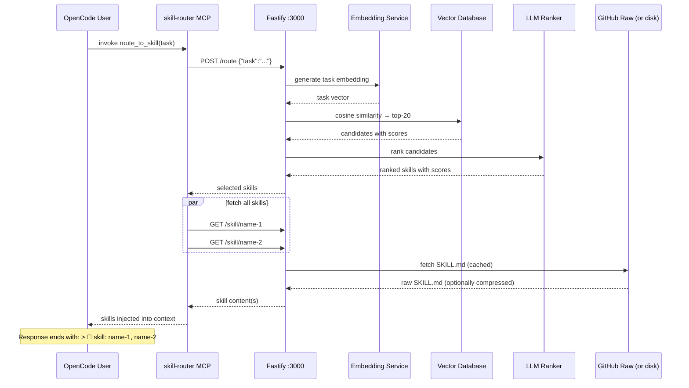

# Agent Skill Router — 1,827 Expert Skills with Built-In Compression

**An AI skill routing system that automatically selects and injects the right expertise into your AI's context.** With 1,827 skills across 5 domains and built-in SkillCompressor for reducing token overhead, the router makes expert knowledge instantly available without manual commands.

```
You → "review this Python code for security issues"
      ↓
skill-router auto-fires → embeds task → vector search → LLM ranks → loads skills
      ↓
Full expert skills injected into context (compressed if needed) — AI answers as expert reviewer
```

**Key Features:**
- 🎯 **1,827 Skills** organized across Agent, CNCF, Coding, Programming, and Trading domains
- 🔄 **Auto-Routing** — tasks automatically match the most relevant skills
- 🗜️ **SkillCompressor** — reduce token overhead by 28-65% with configurable compression levels (0-10+)
- ⚡ **Fast** — cached warm requests respond in ~10ms; cold requests in ~3.5s
- 📦 **Self-Contained** — run locally or via Docker; no external API required for routing
- 🔌 **MCP Integration** — works with OpenCode's `route_to_skill` tool

---

## Quick Start

### Installation (OpenAI)

```bash
git clone https://github.com/paulpas/agent-skill-router
cd agent-skill-router
OPENAI_API_KEY=sk-... ./install-skill-router.sh --integrate-opencode
```

Restart OpenCode. Every task automatically routes to the most relevant skill.

### Local Model (no API key required)

```bash
./install-skill-router.sh \
  --provider llamacpp \
  --embedding-provider llamacpp \
  --llamacpp-url http://localhost:8080
```

> **Note:** llama.cpp must serve both `/v1/chat/completions` and `/v1/embeddings`.

---

## Directory Structure

All skills live in `skills/` organized by domain:

```
skills/
├── agent/                       (271 skills)
│   ├── confidence-based-selector/
│   │   └── SKILL.md
│   ├── task-decomposition-engine/
│   │   └── SKILL.md
│   └── ... 269 more
│
├── cncf/                        (365 skills)
│   ├── kubernetes/
│   │   └── SKILL.md
│   ├── prometheus/
│   │   └── SKILL.md
│   └── ... 363 more
│
├── coding/                      (317 skills)
│   ├── code-review/
│   │   └── SKILL.md
│   ├── test-driven-development/
│   │   └── SKILL.md
│   └── ... 315 more
│
├── programming/                 (791 skills)
│   ├── react-best-practices/
│   │   └── SKILL.md
│   ├── advanced-evaluation/
│   │   └── SKILL.md
│   └── ... 789 more
│
└── trading/                     (83 skills)
    ├── ai-anomaly-detection/
    │   └── SKILL.md
    ├── backtest-walk-forward/
    │   └── SKILL.md
    └── ... 81 more

agent-skill-routing-system/      ← HTTP routing service
scripts/                         ← maintenance automation
README.md, FAQ.md, AGENTS.md     ← documentation
```

Each skill is a single `SKILL.md` file with YAML frontmatter defining its purpose, triggers, and content.

---

## Compression Configuration

### What Is Compression?

SkillCompressor reduces the token overhead of skill content by removing unnecessary whitespace, comments, and formatting. This saves 28-65% of tokens while preserving all executable code and critical information.

| Level | Description | Token Savings | Use Case |
|-------|-------------|---------------|----------|
| **0** | No compression | 0% | Development, testing, debugging |
| **1** | Remove blank lines + trailing whitespace | ~12% | Default for streaming |
| **2** | Level 1 + collapse multiple spaces | ~18% | Balanced (recommended for most) |
| **3** | Level 2 + remove comments | ~24% | Production with code focus |
| **4** | Level 3 + minify JSON/YAML | ~28% | **Default in Docker** — sweet spot |
| **5** | Level 4 + strip metadata | ~35% | Aggressive compression |
| **6-8** | Progressive minification | 40-50% | Content-heavy skills only |
| **9-10+** | Maximum compression | 50-65% | Only for huge reference skills |

### Building with Compression

Build Docker images with a specific compression level:

```bash
# Build with level 4 (28% savings, recommended)
docker build --build-arg COMPRESSION_LEVEL=4 -t skill-router:latest .

# Build with level 2 (18% savings, more readable)
docker build --build-arg COMPRESSION_LEVEL=2 -t skill-router:latest .

# Build with maximum compression (65% savings)
docker build --build-arg COMPRESSION_LEVEL=10 -t skill-router:latest .
```

### Running with Compression

Set compression at runtime:

```bash
# Default (no compression)
node dist/index.js

# Level 2 (18% savings, recommended)
SKILL_COMPRESSION_LEVEL=2 node dist/index.js

# Level 4 (28% savings, Docker default)
SKILL_COMPRESSION_LEVEL=4 node dist/index.js

# Level 5 (35% savings, aggressive)
SKILL_COMPRESSION_LEVEL=5 node dist/index.js
```

### API Queries with Compression

Request compressed skill content via HTTP:

```bash
# Get uncompressed skill
curl http://localhost:3000/skill/coding-code-review

# Get skill with level 2 compression (18% savings)
curl "http://localhost:3000/skill/coding-code-review?compression=2"

# Get skill with level 4 compression (28% savings)
curl "http://localhost:3000/skill/coding-code-review?compression=4"

# Get skill with maximum compression (65% savings)
curl "http://localhost:3000/skill/coding-code-review?compression=10"
```

### Docker Compose Example

```yaml
version: '3.8'

services:
  skill-router:
    build:
      context: .
      args:
        COMPRESSION_LEVEL: 4    # 28% token savings
    environment:
      OPENAI_API_KEY: ${OPENAI_API_KEY}
      SKILL_COMPRESSION_LEVEL: 4
    ports:
      - "3000:3000"
    volumes:
      - ./skills:/app/skills     # local skills mount
```

Run with:
```bash
docker-compose up -d
```

### Compression Metrics

Monitor compression savings:

```bash
curl http://localhost:3000/metrics
```

Example response:
```json
{
  "compression": {
    "level": 4,
    "avgTokenSavings": "28%",
    "skillsCompressed": 1777,
    "totalBytesOriginal": 52000000,
    "totalBytesCompressed": 37440000,
    "averageCompressionRatio": 0.72
  }
}
```

---

## How It Works

Every task triggers the `route_to_skill` MCP tool, which:



### Latency

| Stage | Cold | Warm (cached) |
|-------|------|---------------|
| Task embedding | ~400 ms | ~1 ms |
| Vector search | ~1 ms | ~1 ms |
| LLM ranking | ~3,000 ms | ~5 ms |
| Skill fetch + compression | ~150 ms | ~1 ms |
| **Total** | **~3.5 s** | **~10 ms** |

---

## API Endpoints

### Health & Status

```bash
# Health check
curl http://localhost:3000/health
# Response: {"status":"healthy","version":"1.0.0"}

# Service statistics
curl http://localhost:3000/stats
# Response: {"skills":{"totalSkills":1777,"domains":[...]}}

# Compression metrics
curl http://localhost:3000/metrics
```

### Skills Management

```bash
# List all skills
curl http://localhost:3000/skills
# Response: [{name:"skill-1",domain:"agent",...}, ...]

# Get specific skill (uncompressed)
curl http://localhost:3000/skill/coding-code-review

# Get skill with compression
curl "http://localhost:3000/skill/coding-code-review?compression=4"

# Get skill with custom compression and JSON response
curl "http://localhost:3000/skill/coding-code-review?compression=2&format=json"
```

### Routing & Execution

```bash
# Route a task to skills
curl -X POST http://localhost:3000/route \
  -H "Content-Type: application/json" \
  -d '{
    "task": "review this Python code for security issues",
    "maxSkills": 3
  }'
# Response: {selected: [{name:"coding-code-review",score:0.95},...]}

# Execute a task (auto-route + fetch skills)
curl -X POST http://localhost:3000/execute \
  -H "Content-Type: application/json" \
  -d '{
    "task": "help me deploy to Kubernetes",
    "compression": 2
  }'
```

### Access History

```bash
# Last 100 routing decisions
curl http://localhost:3000/access-log

# Response:
{
  "totalRequests": 150,
  "entries": [
    {
      "timestamp": "2026-04-25T14:30:00Z",
      "task": "review code",
      "topSkill": "coding-code-review",
      "confidence": 0.95,
      "latencyMs": 145
    }
  ]
}
```

### Force Sync (for new skills)

```bash
# Reload all skills from disk/GitHub
curl -X POST http://localhost:3000/reload
# Useful after pushing new skills
```

---

## Available Skills Directory

### Domain Breakdown

| Domain | Count | Focus |
|--------|-------|-------|
| **Agent** | 271 | AI orchestration, routing, task decomposition |
| **CNCF** | 365 | Kubernetes, cloud-native tooling, DevOps |
| **Coding** | 317 | Software patterns, security, testing |
| **Programming** | 791 | Algorithms, frameworks, languages |
| **Trading** | 83 | Execution, risk management, ML models |

### Agent Skills (271)

Orchestration, routing, and AI agent patterns for task automation.

| Skill | Description |
|-------|-------------|
| [confidence-based-selector](./skills/agent/confidence-based-selector/SKILL.md) | Select appropriate skill based on confidence scores and relevance |
| [task-decomposition-engine](./skills/agent/task-decomposition-engine/SKILL.md) | Break complex tasks into manageable subtasks |
| [parallel-skill-runner](./skills/agent/parallel-skill-runner/SKILL.md) | Execute multiple skills concurrently |
| [multi-skill-executor](./skills/agent/multi-skill-executor/SKILL.md) | Orchestrate skill execution with dependencies |
| [add-new-skill](./skills/agent/add-new-skill/SKILL.md) | Create and register new skills in the routing system |

*[View all 271 Agent skills →](./skills/agent/)*

### CNCF Skills (365)

Kubernetes, cloud-native projects, DevOps, and infrastructure patterns.

| Skill | Description |
|-------|-------------|
| [kubernetes](./skills/cncf/kubernetes/SKILL.md) | Container orchestration and cluster management |
| [prometheus](./skills/cncf/prometheus/SKILL.md) | Monitoring system and time series database |
| [helm](./skills/cncf/helm/SKILL.md) | Kubernetes package manager and templating |
| [istio](./skills/cncf/istio/SKILL.md) | Service mesh for traffic management |
| [etcd](./skills/cncf/etcd/SKILL.md) | Distributed key-value store for Kubernetes |

*[View all 365 CNCF skills →](./skills/cncf/)*

### Coding Skills (317)

Software engineering patterns, security, testing, and best practices.

| Skill | Description |
|-------|-------------|
| [code-review](./skills/coding/code-review/SKILL.md) | Security, bugs, code quality assessment |
| [test-driven-development](./skills/coding/test-driven-development/SKILL.md) | TDD workflows and test pyramid |
| [security-review](./skills/coding/security-review/SKILL.md) | Vulnerability scanning and secure coding |
| [fastapi-patterns](./skills/coding/fastapi-patterns/SKILL.md) | FastAPI structure and best practices |
| [pydantic-models](./skills/coding/pydantic-models/SKILL.md) | Data validation with Pydantic |

*[View all 317 Coding skills →](./skills/coding/)*

### Programming Skills (791)

Algorithms, data structures, frameworks, and language reference.

| Skill | Description |
|-------|-------------|
| [react-best-practices](./skills/programming/react-best-practices/SKILL.md) | Modern React patterns and hooks |
| [advanced-evaluation](./skills/programming/advanced-evaluation/SKILL.md) | Advanced evaluation techniques |
| [fp-react](./skills/programming/fp-react/SKILL.md) | Functional programming in React |
| [react-component-performance](./skills/programming/react-component-performance/SKILL.md) | React component optimization strategies |
| [react-flow-architect](./skills/programming/react-flow-architect/SKILL.md) | React Flow architecture and patterns |

*[View all 791 Programming skills →](./skills/programming/)*

### Trading Skills (83)

Algorithmic execution, risk management, backtesting, and ML models.

| Skill | Description |
|-------|-------------|
| [ai-anomaly-detection](./skills/trading/ai-anomaly-detection/SKILL.md) | AI-powered anomaly detection in market data |
| [backtest-walk-forward](./skills/trading/backtest-walk-forward/SKILL.md) | Robust strategy validation |
| [ai-explainable-ai](./skills/trading/ai-explainable-ai/SKILL.md) | Model interpretability in trading systems |
| [ai-feature-engineering](./skills/trading/ai-feature-engineering/SKILL.md) | Feature engineering for trading ML models |
| [ai-hyperparameter-tuning](./skills/trading/ai-hyperparameter-tuning/SKILL.md) | ML model hyperparameter optimization |

*[View all 83 Trading skills →](./skills/trading/)*

---

## Workflow: Adding New Skills

Create skills following this workflow:

### 1. Create Directory and SKILL.md

```bash
mkdir -p skills/<domain>/<skill-name>/
touch skills/<domain>/<skill-name>/SKILL.md
```

### 2. Write SKILL.md with Proper Format

```yaml
---
name: my-skill-name
description: What this skill does in one sentence
license: MIT
compatibility: opencode
metadata:
  version: "1.0.0"
  domain: coding
  role: implementation
  scope: implementation
  output-format: code
  triggers: keyword1, keyword2, keyword3, how do i implement
---

# My Skill Title

Brief description of the skill's purpose and when to use it.

## When to Use

- Concrete use case 1
- Concrete use case 2

## When NOT to Use

- Anti-pattern or irrelevant context

## Core Workflow

1. **Step 1** — Description
2. **Step 2** — Description
3. **Step 3** — Description

## Implementation Patterns

```python
# Example code
```

## Related Skills

| Skill | Purpose |
|-------|---------|
| [related-skill](../../skills/domain/related-skill/SKILL.md) | Why you'd use this alongside |
```

### 3. Validate and Regenerate Index

```bash
# Validate YAML syntax
python3 scripts/reformat_skills.py

# Update router index
python3 generate_index.py

# Regenerate README catalog
python3 scripts/generate_readme.py
```

### 4. Commit and Push

```bash
git add -A
git commit -m "feat: add my-skill-name skill

- New skill directory: skills/<domain>/<skill-name>/
- Description: Brief description
- Triggers: keyword1, keyword2, keyword3"
git push origin main
```

The router auto-discovers new skills within `SKILL_SYNC_INTERVAL` seconds (default: 1 hour). For immediate pickup:

```bash
curl -X POST http://localhost:3000/reload
```

---

## Maintenance & Automation

This repository includes scripts to maintain skills and keep metadata consistent.

### generate_readme.py

Auto-generates the skills catalog in documentation:

```bash
python3 scripts/generate_readme.py
```

Updates README with all 1,777 skills organized by domain and role.

### enhance_triggers.py

Adds conversational triggers for better skill discovery:

```bash
python3 scripts/enhance_triggers.py
```

Suggests trigger improvements like:
- "how do I..." questions
- Common colloquialisms
- Related technology names
- Operational task language

### reformat_skills.py

Validates and normalizes YAML frontmatter:

```bash
python3 scripts/reformat_skills.py
```

Ensures all skills follow the format specification.

### generate_index.py

Regenerates `skills-index.json` for routing:

```bash
python3 generate_index.py
```

Must run after adding or modifying skills.

---

## Monitoring & Debugging

### Skill Access Logs

View routing decisions and skill usage:

```bash
# Last 100 routing accesses
curl http://localhost:3000/access-log

# Filter by skill name
curl "http://localhost:3000/access-log?skill=coding-code-review"
```

### Docker Logs

View service logs:

```bash
# Follow logs in real-time
docker logs -f skill-router

# Search for specific task routes
docker logs skill-router | grep "Route result"
```

### Performance Metrics

Check system performance:

```bash
curl http://localhost:3000/metrics
```

Returns:
- Compression statistics
- Embedding cache hits
- Vector search latency
- LLM ranking latency
- Skill access frequency

---

## FAQ

**Have questions?** Check the comprehensive [FAQ.md](./FAQ.md) with 27+ Q&A covering:
- How auto-routing works
- Skill management and creation
- Compression configuration
- Troubleshooting and optimization
- Offline mode and local models

---

## Related Documentation

- **[AGENTS.md](./AGENTS.md)** — Complete guide for creating new skills
- **[SKILL_FORMAT_SPEC.md](./SKILL_FORMAT_SPEC.md)** — Formal skill file specification
- **[COMPRESSION.md](./SKILL_COMPRESSION_IMPLEMENTATION.md)** — Detailed compression guide
- **[FAQ.md](./FAQ.md)** — Common questions and troubleshooting

---

## Docker Deployment

### Build Image

```bash
# Default (no compression)
docker build -t skill-router:latest .

# With compression level 4 (28% savings, recommended)
docker build --build-arg COMPRESSION_LEVEL=4 -t skill-router:latest .
```

### Run Container

```bash
# Basic
docker run -p 3000:3000 \
  -e OPENAI_API_KEY=$OPENAI_API_KEY \
  skill-router:latest

# With compression
docker run -p 3000:3000 \
  -e OPENAI_API_KEY=$OPENAI_API_KEY \
  -e SKILL_COMPRESSION_LEVEL=4 \
  skill-router:latest

# With local volume mount
docker run -p 3000:3000 \
  -v $(pwd)/skills:/app/skills \
  -e OPENAI_API_KEY=$OPENAI_API_KEY \
  -e SKILL_COMPRESSION_LEVEL=2 \
  skill-router:latest
```

### Docker Compose (Production)

```yaml
version: '3.8'

services:
  skill-router:
    build:
      context: .
      args:
        COMPRESSION_LEVEL: 4
    environment:
      OPENAI_API_KEY: ${OPENAI_API_KEY}
      SKILL_COMPRESSION_LEVEL: 4
      SKILL_SYNC_INTERVAL: 3600
      NODE_ENV: production
    ports:
      - "3000:3000"
    volumes:
      - ./skills:/app/skills
      - skill-router-cache:/app/.cache
    restart: unless-stopped
    healthcheck:
      test: ["CMD", "curl", "-f", "http://localhost:3000/health"]
      interval: 30s
      timeout: 10s
      retries: 3

volumes:
  skill-router-cache:
```

Deploy:
```bash
docker-compose up -d
```

---

## Contributing

Skills are the core value of this system. To contribute:

1. Create a new skill following [AGENTS.md](./AGENTS.md)
2. Use specific, task-oriented triggers (not generic terms)
3. Include "When NOT to Use" section for complex skills
4. Run automation scripts before committing
5. Submit PR with descriptive commit message

---

## License

MIT — All skills are freely available and redistributable.

---

## Support

| Channel | Purpose |
|---------|---------|
| **GitHub Issues** | Bug reports, feature requests |
| **FAQ.md** | Common questions and troubleshooting |
| **AGENTS.md** | Skill creation guide and specifications |
| **OpenCode Integration** | Use `route_to_skill` in any task |

---

**Last updated:** 2026-04-25  
**Total skills:** 1,777  
**Domains:** Agent (222) · CNCF (365) · Coding (317) · Programming (790) · Trading (83)
