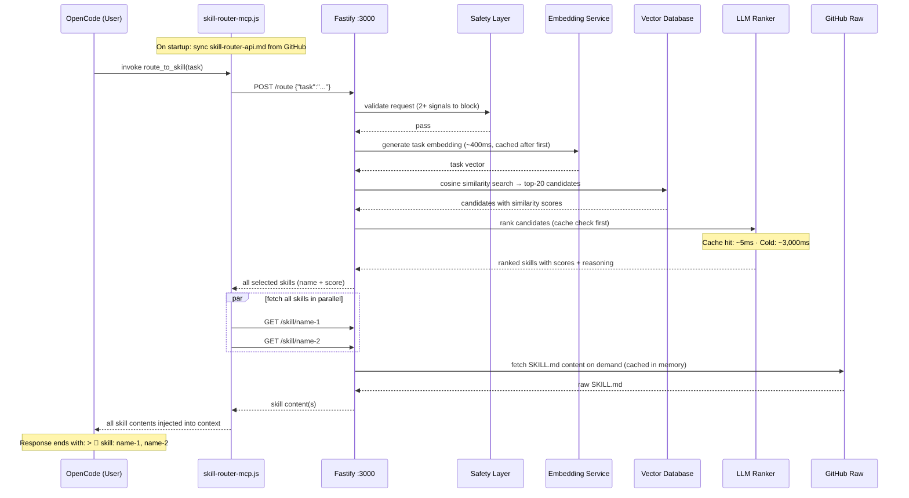

# Skills — An AI Skill Routing System

265 expert skills for AI coding agents, with a built-in routing engine that automatically selects and injects the right skill into your AI's context before it answers. No manual `/skill` commands — just ask, and the right expertise loads itself.

```
You → "review this Python code for security issues"
         ↓
   route_to_skill()  [auto-fires on every task]
         ↓
   embed → vector search → LLM re-rank → coding-security-review/SKILL.md
         ↓
   Full expert skill injected into context — AI answers as a security reviewer
```

---

## Quick Start

**With OpenAI (recommended):**

```bash
git clone https://github.com/paulpas/skills
cd skills
OPENAI_API_KEY=sk-... ./install-skill-router.sh --integrate-opencode
```

Restart OpenCode. Every task you type now automatically routes to the most relevant skill.

**No API key? Use a local model:**

```bash
./install-skill-router.sh \
  --provider llamacpp \
  --embedding-provider llamacpp \
  --llamacpp-url http://localhost:8080
```

> llama.cpp must serve both `/v1/chat/completions` and `/v1/embeddings`. No `OPENAI_API_KEY` required.

---

## How It Works

Every time OpenCode receives a task, the `route_to_skill` MCP tool fires automatically:



### Latency

| Stage | Cold | Warm (cached) |
|---|---|---|
| Safety check | ~1 ms | ~1 ms |
| Task embedding | ~400 ms | ~1 ms (memory) |
| Vector search | ~1 ms | ~1 ms |
| LLM re-ranking | ~3,000 ms | ~5 ms (cache hit) |
| Skill content fetch | ~1 ms (disk) / ~150 ms (GitHub) | ~1 ms (memory) |
| **Total** | **~3.5 s** | **~10 ms** |

> Local llama.cpp drops cold LLM step to ~200–800 ms. Warm requests are fast regardless of provider.

### Key Behaviours

- **Multi-skill loading** — all high-confidence matches are fetched in parallel; the AI receives full context for each
- **Skill citation** — every response ends with `> 📖 skill: name-1, name-2` listing loaded skills
- **Auto index refresh** — `skills-index.json` is re-fetched from GitHub every `SKILL_SYNC_INTERVAL` seconds (default: 1 hour); new skills become routable without restart
- **API doc sync** — `skill-router-api.md` is fetched from GitHub on every MCP startup; edits to the repo file propagate automatically
- **LLM ranking cache** — identical task+candidates combos are served from memory (~5 ms) on repeat queries
- **Batch embeddings** — all skill embeddings are generated in parallel batches of 100 on startup (~2 s total)

---

## Monitoring

| What | Command |
|---|---|
| Skill accesses (MCP side) | `tail -f ~/.config/opencode/skill-router-mcp.log \| grep 'SKILL ACCESS'` |
| Full routing pipeline (Docker) | `docker logs -f skill-router 2>&1 \| grep -E 'Route result\|Vector search'` |
| Routing history (JSON) | `curl -s http://localhost:3000/access-log \| python3 -m json.tool` |
| Service health | `curl -s http://localhost:3000/health` |

---

## The Skills Library

265 skills across 5 domains, organized in `skills/`. Each skill is a `SKILL.md` file with YAML frontmatter — the routing engine reads these directly.

```
skills-repo/
├── skills/                         ← all skill definitions live here
│   ├── agent-confidence-based-selector/
│   │   └── SKILL.md
│   ├── cncf-prometheus/
│   │   ├── SKILL.md
│   │   └── references/             ← optional sub-documents
│   ├── coding-code-review/
│   │   └── SKILL.md
│   ├── trading-risk-stop-loss/
│   │   └── SKILL.md
│   └── programming-algorithms/
│       └── SKILL.md
├── agent-skill-routing-system/     ← the HTTP routing service
├── README.md
├── SKILL_FORMAT_SPEC.md
├── reformat_skills.py
└── install-skill-router.sh
```

### Domain Prefixes

| Prefix | Description |
|---|---|
| `agent-*` | AI agent orchestration patterns (task decomposition, routing, planning) |
| `cncf-*` | CNCF cloud-native project reference (Kubernetes, Prometheus, Helm, etc.) |
| `coding-*` | Software engineering patterns (code review, TDD, FastAPI, Pydantic, etc.) |
| `trading-*` | Algorithmic trading implementation (risk management, execution, ML, backtesting) |
| `programming-*` | Algorithm and language reference material |

---

### Agent Orchestration

- [agent-confidence-based-selector](./skills/agent-confidence-based-selector/SKILL.md) — Selects the most appropriate skill based on confidence scores and relevance metrics
- [agent-dependency-graph-builder](./skills/agent-dependency-graph-builder/SKILL.md) — Builds and maintains dependency graphs for task execution
- [agent-dynamic-replanner](./skills/agent-dynamic-replanner/SKILL.md) — Dynamically adjusts execution plans based on real-time feedback and changing conditions
- [agent-goal-to-milestones](./skills/agent-goal-to-milestones/SKILL.md) — Translates high-level goals into actionable milestones
- [agent-multi-skill-executor](./skills/agent-multi-skill-executor/SKILL.md) — Orchestrates execution of multiple skills in sequence with dependency management
- [agent-parallel-skill-runner](./skills/agent-parallel-skill-runner/SKILL.md) — Executes multiple skills concurrently with synchronization and result collection
- [agent-task-decomposition-engine](./skills/agent-task-decomposition-engine/SKILL.md) — Decomposes complex tasks into manageable subtasks for specialized skills

---

### CNCF Cloud Native

#### Architecture & Best Practices

- [cncf-architecture-best-practices](./skills/cncf-architecture-best-practices/SKILL.md) — Production-grade Kubernetes: service mesh, CNI, GitOps, CI/CD, observability, security, networking, and scaling
- [cncf-networking-osi](./skills/cncf-networking-osi/SKILL.md) — OSI Model networking for cloud-native — all 7 layers with CNCF project mappings

#### Application Definition & Build

- [cncf-argo](./skills/cncf-argo/SKILL.md) — Kubernetes-native workflow, CI/CD, and governance
- [cncf-artifact-hub](./skills/cncf-artifact-hub/SKILL.md) — Repository for Kubernetes Helm, Falco, OPA, and more
- [cncf-backstage](./skills/cncf-backstage/SKILL.md) — Developer portal for microservices
- [cncf-buildpacks](./skills/cncf-buildpacks/SKILL.md) — Source code to container images without Dockerfiles
- [cncf-dapr](./skills/cncf-dapr/SKILL.md) — Distributed application runtime
- [cncf-helm](./skills/cncf-helm/SKILL.md) — The Kubernetes package manager
- [cncf-kubevela](./skills/cncf-kubevela/SKILL.md) — Kubernetes application platform
- [cncf-kubevirt](./skills/cncf-kubevirt/SKILL.md) — Virtualization on Kubernetes
- [cncf-operator-framework](./skills/cncf-operator-framework/SKILL.md) — Build and manage Kubernetes operators with standardized patterns

#### Container Runtime

- [cncf-containerd](./skills/cncf-containerd/SKILL.md) — Open and reliable container runtime
- [cncf-cri-o](./skills/cncf-cri-o/SKILL.md) — OCI-compliant container runtime for Kubernetes
- [cncf-krustlet](./skills/cncf-krustlet/SKILL.md) — Kubernetes runtime patterns and best practices
- [cncf-lima](./skills/cncf-lima/SKILL.md) — Container runtime patterns and best practices

#### Container Registry

- [cncf-dragonfly](./skills/cncf-dragonfly/SKILL.md) — P2P file distribution
- [cncf-harbor](./skills/cncf-harbor/SKILL.md) — Container registry
- [cncf-zot](./skills/cncf-zot/SKILL.md) — Cloud-native container registry patterns

#### Networking & Service Mesh

- [cncf-calico](./skills/cncf-calico/SKILL.md) — Cloud-native network security
- [cncf-cilium](./skills/cncf-cilium/SKILL.md) — eBPF-based cloud-native networking
- [cncf-cni](./skills/cncf-cni/SKILL.md) — Container Network Interface for Linux containers
- [cncf-container-network-interface-cni](./skills/cncf-container-network-interface-cni/SKILL.md) — CNI architecture patterns
- [cncf-contour](./skills/cncf-contour/SKILL.md) — Service proxy patterns
- [cncf-emissary-ingress](./skills/cncf-emissary-ingress/SKILL.md) — Kubernetes ingress controller
- [cncf-envoy](./skills/cncf-envoy/SKILL.md) — High-performance edge/middle/service proxy
- [cncf-grpc](./skills/cncf-grpc/SKILL.md) — Remote procedure call patterns
- [cncf-istio](./skills/cncf-istio/SKILL.md) — Connect, secure, control, and observe services
- [cncf-kong](./skills/cncf-kong/SKILL.md) — API gateway patterns
- [cncf-kong-ingress-controller](./skills/cncf-kong-ingress-controller/SKILL.md) — Kong Ingress Controller for Kubernetes
- [cncf-kuma](./skills/cncf-kuma/SKILL.md) — Service mesh patterns
- [cncf-linkerd](./skills/cncf-linkerd/SKILL.md) — Lightweight service mesh

#### Observability

- [cncf-cortex](./skills/cncf-cortex/SKILL.md) — Distributed, horizontally scalable Prometheus
- [cncf-fluentd](./skills/cncf-fluentd/SKILL.md) — Unified logging layer for cloud-native environments
- [cncf-jaeger](./skills/cncf-jaeger/SKILL.md) — Distributed tracing
- [cncf-open-telemetry](./skills/cncf-open-telemetry/SKILL.md) — OpenTelemetry architecture patterns
- [cncf-opentelemetry](./skills/cncf-opentelemetry/SKILL.md) — Vendor-neutral tracing, metrics, and logs framework
- [cncf-prometheus](./skills/cncf-prometheus/SKILL.md) — Monitoring system and time series database
- [cncf-thanos](./skills/cncf-thanos/SKILL.md) — High-availability Prometheus with long-term storage

#### Scheduling & Orchestration

- [cncf-crossplane](./skills/cncf-crossplane/SKILL.md) — Kubernetes-native multi-cloud infrastructure control plane
- [cncf-fluid](./skills/cncf-fluid/SKILL.md) — Kubernetes-native data acceleration for data-intensive apps
- [cncf-karmada](./skills/cncf-karmada/SKILL.md) — Multi-cluster orchestration
- [cncf-keda](./skills/cncf-keda/SKILL.md) — Event-driven autoscaling
- [cncf-knative](./skills/cncf-knative/SKILL.md) — Serverless on Kubernetes
- [cncf-kubeflow](./skills/cncf-kubeflow/SKILL.md) — ML on Kubernetes
- [cncf-kubernetes](./skills/cncf-kubernetes/SKILL.md) — Production-grade container scheduling and management
- [cncf-volcano](./skills/cncf-volcano/SKILL.md) — Batch scheduling infrastructure for Kubernetes
- [cncf-wasmcloud](./skills/cncf-wasmcloud/SKILL.md) — WebAssembly-based distributed applications platform

#### Security & Compliance

- [cncf-cert-manager](./skills/cncf-cert-manager/SKILL.md) — Certificate management for Kubernetes
- [cncf-falco](./skills/cncf-falco/SKILL.md) — Cloud-native runtime security
- [cncf-in-toto](./skills/cncf-in-toto/SKILL.md) — Supply chain security patterns
- [cncf-keycloak](./skills/cncf-keycloak/SKILL.md) — Identity and access management
- [cncf-kubescape](./skills/cncf-kubescape/SKILL.md) — Kubernetes security scanning
- [cncf-kyverno](./skills/cncf-kyverno/SKILL.md) — Kubernetes policy engine
- [cncf-notary-project](./skills/cncf-notary-project/SKILL.md) — Content trust and supply chain security
- [cncf-oathkeeper](./skills/cncf-oathkeeper/SKILL.md) — Identity and access proxy
- [cncf-open-policy-agent-opa](./skills/cncf-open-policy-agent-opa/SKILL.md) — Policy as code
- [cncf-openfga](./skills/cncf-openfga/SKILL.md) — Fine-grained authorization
- [cncf-openfeature](./skills/cncf-openfeature/SKILL.md) — Vendor-neutral feature flagging
- [cncf-ory-hydra](./skills/cncf-ory-hydra/SKILL.md) — OAuth 2.0 / OpenID Connect server
- [cncf-ory-kratos](./skills/cncf-ory-kratos/SKILL.md) — Cloud-native identity management
- [cncf-spiffe](./skills/cncf-spiffe/SKILL.md) — Secure production identity framework
- [cncf-spire](./skills/cncf-spire/SKILL.md) — SPIFFE implementation for real-world deployments
- [cncf-the-update-framework-tuf](./skills/cncf-the-update-framework-tuf/SKILL.md) — Secure software update framework

#### Storage

- [cncf-cubefs](./skills/cncf-cubefs/SKILL.md) — Distributed high-performance file system
- [cncf-longhorn](./skills/cncf-longhorn/SKILL.md) — Cloud-native storage patterns
- [cncf-rook](./skills/cncf-rook/SKILL.md) — Cloud-native storage orchestration for Kubernetes

#### Streaming & Messaging

- [cncf-cloudevents](./skills/cncf-cloudevents/SKILL.md) — Cloud-native event streaming patterns
- [cncf-nats](./skills/cncf-nats/SKILL.md) — Cloud-native messaging
- [cncf-strimzi](./skills/cncf-strimzi/SKILL.md) — Apache Kafka for cloud-native environments

#### Database & Key-Value

- [cncf-coredns](./skills/cncf-coredns/SKILL.md) — DNS server that chains plugins
- [cncf-etcd](./skills/cncf-etcd/SKILL.md) — Distributed key-value store
- [cncf-tikv](./skills/cncf-tikv/SKILL.md) — Distributed transactional key-value database
- [cncf-vitess](./skills/cncf-vitess/SKILL.md) — Horizontal scaling for MySQL

#### CI/CD & GitOps

- [cncf-flux](./skills/cncf-flux/SKILL.md) — GitOps for Kubernetes
- [cncf-openkruise](./skills/cncf-openkruise/SKILL.md) — Advanced Kubernetes workload management
- [cncf-tekton](./skills/cncf-tekton/SKILL.md) — Cloud-native pipeline resource

#### Automation & Edge

- [cncf-chaosmesh](./skills/cncf-chaosmesh/SKILL.md) — Chaos engineering platform for Kubernetes
- [cncf-cloud-custodian](./skills/cncf-cloud-custodian/SKILL.md) — Rules engine for cloud infrastructure management
- [cncf-flatcar-container-linux](./skills/cncf-flatcar-container-linux/SKILL.md) — Container-optimized Linux
- [cncf-kubeedge](./skills/cncf-kubeedge/SKILL.md) — Edge computing with Kubernetes
- [cncf-kserve](./skills/cncf-kserve/SKILL.md) — Model serving on Kubernetes
- [cncf-litmus](./skills/cncf-litmus/SKILL.md) — Cloud-native chaos engineering
- [cncf-metal3-io](./skills/cncf-metal3-io/SKILL.md) — Bare metal provisioning patterns
- [cncf-opencost](./skills/cncf-opencost/SKILL.md) — Kubernetes cost monitoring
- [cncf-openyurt](./skills/cncf-openyurt/SKILL.md) — Extending Kubernetes to edge scenarios

#### Process & Documentation

- [cncf-process-architecture](./skills/cncf-process-architecture/SKILL.md) — Create or update `ARCHITECTURE.md` for CNCF projects
- [cncf-process-incident-response](./skills/cncf-process-incident-response/SKILL.md) — Incident response plan: detection, triage, communication, post-incident review
- [cncf-process-releases](./skills/cncf-process-releases/SKILL.md) — Release process, versioning policy, and cadence documentation
- [cncf-process-security-policy](./skills/cncf-process-security-policy/SKILL.md) — Vulnerability reporting, disclosure timeline, and supported versions

---

### Coding Patterns

- [coding-code-review](./skills/coding-code-review/SKILL.md) — Bugs, security vulnerabilities, code smells, and architectural concerns with prioritized feedback
- [coding-conviction-scoring](./skills/coding-conviction-scoring/SKILL.md) — Trade confidence and risk assessment scoring
- [coding-data-normalization](./skills/coding-data-normalization/SKILL.md) — Typed dataclasses for ticker/trade/orderbook with exchange-specific parsing
- [coding-event-bus](./skills/coding-event-bus/SKILL.md) — Async pub/sub event bus with typed events and singleton initialization
- [coding-event-driven-architecture](./skills/coding-event-driven-architecture/SKILL.md) — Event-driven architecture for real-time systems: pub/sub, signal flow, strategy base
- [coding-fastapi-patterns](./skills/coding-fastapi-patterns/SKILL.md) — FastAPI structure: typed error hierarchy, exception handlers, CORS, request timing
- [coding-git-branching-strategies](./skills/coding-git-branching-strategies/SKILL.md) — Git Flow, GitHub Flow, Trunk-Based Development, and feature flag strategies
- [coding-juice-shop](./skills/coding-juice-shop/SKILL.md) — OWASP Juice Shop: web application security testing guide
- [coding-markdown-best-practices](./skills/coding-markdown-best-practices/SKILL.md) — Markdown syntax rules, common pitfalls, and documentation consistency
- [coding-pydantic-config](./skills/coding-pydantic-config/SKILL.md) — Pydantic config with frozen models, nested hierarchy, TOML/env parsing
- [coding-pydantic-models](./skills/coding-pydantic-models/SKILL.md) — Pydantic frozen data models: enums, annotated constraints, validators, computed properties
- [coding-security-review](./skills/coding-security-review/SKILL.md) — Security vulnerabilities: injection, XSS, insecure deserialization, misconfigurations
- [coding-strategy-base](./skills/coding-strategy-base/SKILL.md) — Abstract base strategy pattern with initialization guards and typed abstract methods
- [coding-test-driven-development](./skills/coding-test-driven-development/SKILL.md) — TDD and BDD with pytest, unit tests, mocking, and test pyramid principles
- [coding-websocket-manager](./skills/coding-websocket-manager/SKILL.md) — WebSocket state machine with exponential backoff and message routing

---

### Trading AI & ML

- [trading-ai-anomaly-detection](./skills/trading-ai-anomaly-detection/SKILL.md) — Detect anomalous market behavior, outliers, and potential manipulation
- [trading-ai-explainable-ai](./skills/trading-ai-explainable-ai/SKILL.md) — Explainable AI for understanding and trusting trading model decisions
- [trading-ai-feature-engineering](./skills/trading-ai-feature-engineering/SKILL.md) — Create actionable trading features from raw market data
- [trading-ai-hyperparameter-tuning](./skills/trading-ai-hyperparameter-tuning/SKILL.md) — Optimize model configurations for trading applications
- [trading-ai-live-model-monitoring](./skills/trading-ai-live-model-monitoring/SKILL.md) — Monitor production ML models for drift, decay, and performance degradation
- [trading-ai-llm-orchestration](./skills/trading-ai-llm-orchestration/SKILL.md) — LLM orchestration for trading analysis with structured output via instructor/pydantic
- [trading-ai-model-ensemble](./skills/trading-ai-model-ensemble/SKILL.md) — Combine multiple models for improved prediction accuracy
- [trading-ai-multi-asset-model](./skills/trading-ai-multi-asset-model/SKILL.md) — Model inter-asset relationships for portfolio and cross-asset strategies
- [trading-ai-news-embedding](./skills/trading-ai-news-embedding/SKILL.md) — Process news text using NLP embeddings for trading signals
- [trading-ai-order-flow-analysis](./skills/trading-ai-order-flow-analysis/SKILL.md) — Analyze order flow to detect market pressure and anticipate price moves
- [trading-ai-regime-classification](./skills/trading-ai-regime-classification/SKILL.md) — Detect current market regime for adaptive trading strategies
- [trading-ai-reinforcement-learning](./skills/trading-ai-reinforcement-learning/SKILL.md) — Reinforcement learning for automated trading agents and policy optimization
- [trading-ai-sentiment-analysis](./skills/trading-ai-sentiment-analysis/SKILL.md) — AI-powered sentiment from news, social media, and political figures
- [trading-ai-sentiment-features](./skills/trading-ai-sentiment-features/SKILL.md) — Extract market sentiment from news, social media, and analyst reports
- [trading-ai-synthetic-data](./skills/trading-ai-synthetic-data/SKILL.md) — Generate synthetic financial data for training and testing models
- [trading-ai-time-series-forecasting](./skills/trading-ai-time-series-forecasting/SKILL.md) — Time series forecasting for price prediction and market analysis
- [trading-ai-volatility-prediction](./skills/trading-ai-volatility-prediction/SKILL.md) — Forecast volatility for risk management and option pricing

---

### Trading Backtesting

- [trading-backtest-drawdown-analysis](./skills/trading-backtest-drawdown-analysis/SKILL.md) — Maximum drawdown, recovery time, and Value-at-Risk analysis
- [trading-backtest-lookahead-bias](./skills/trading-backtest-lookahead-bias/SKILL.md) — Prevent lookahead bias through strict causality enforcement and time-based validation
- [trading-backtest-position-exits](./skills/trading-backtest-position-exits/SKILL.md) — Exit strategies, trailing stops, and take-profit mechanisms
- [trading-backtest-position-sizing](./skills/trading-backtest-position-sizing/SKILL.md) — Fixed fractional, Kelly criterion, and volatility-adjusted sizing
- [trading-backtest-sharpe-ratio](./skills/trading-backtest-sharpe-ratio/SKILL.md) — Sharpe ratio and risk-adjusted performance metrics
- [trading-backtest-walk-forward](./skills/trading-backtest-walk-forward/SKILL.md) — Walk-forward optimization for robust strategy validation

---

### Trading Data Pipelines

- [trading-data-alternative-data](./skills/trading-data-alternative-data/SKILL.md) — Alternative data ingestion: news, social media, on-chain data sources
- [trading-data-backfill-strategy](./skills/trading-data-backfill-strategy/SKILL.md) — Strategic backfill for populating historical data
- [trading-data-candle-data](./skills/trading-data-candle-data/SKILL.md) — OHLCV processing, timeframe management, and validation
- [trading-data-enrichment](./skills/trading-data-enrichment/SKILL.md) — Add context to raw trading data
- [trading-data-feature-store](./skills/trading-data-feature-store/SKILL.md) — Feature storage and management for ML trading models
- [trading-data-lake](./skills/trading-data-lake/SKILL.md) — Data lake architecture for trading data storage
- [trading-data-order-book](./skills/trading-data-order-book/SKILL.md) — Order book handling, spread calculation, liquidity measurement
- [trading-data-stream-processing](./skills/trading-data-stream-processing/SKILL.md) — Streaming data processing for real-time signals and analytics
- [trading-data-time-series-database](./skills/trading-data-time-series-database/SKILL.md) — Time-series database queries and optimization for financial data
- [trading-data-validation](./skills/trading-data-validation/SKILL.md) — Data validation and quality assurance for trading pipelines

---

### Trading Exchange Integration

- [trading-exchange-ccxt-patterns](./skills/trading-exchange-ccxt-patterns/SKILL.md) — CCXT patterns: error handling, rate limiting, and state management
- [trading-exchange-failover-handling](./skills/trading-exchange-failover-handling/SKILL.md) — Automated failover and redundancy for exchange connectivity
- [trading-exchange-health](./skills/trading-exchange-health/SKILL.md) — Exchange health monitoring and connectivity status
- [trading-exchange-market-data-cache](./skills/trading-exchange-market-data-cache/SKILL.md) — High-performance caching for market data with low latency
- [trading-exchange-order-book-sync](./skills/trading-exchange-order-book-sync/SKILL.md) — Order book synchronization and state management
- [trading-exchange-order-execution-api](./skills/trading-exchange-order-execution-api/SKILL.md) — Order execution and management API
- [trading-exchange-rate-limiting](./skills/trading-exchange-rate-limiting/SKILL.md) — Rate limiting and circuit breaker patterns for exchange APIs
- [trading-exchange-trade-reporting](./skills/trading-exchange-trade-reporting/SKILL.md) — Real-time trade reporting and execution analytics
- [trading-exchange-websocket-handling](./skills/trading-exchange-websocket-handling/SKILL.md) — Real-time market data: connection management, data aggregation, error recovery
- [trading-exchange-websocket-streaming](./skills/trading-exchange-websocket-streaming/SKILL.md) — Real-time market data streaming and processing

---

### Trading Execution Algorithms

- [trading-execution-order-book-impact](./skills/trading-execution-order-book-impact/SKILL.md) — Order book impact measurement and market microstructure analysis
- [trading-execution-rate-limiting](./skills/trading-execution-rate-limiting/SKILL.md) — Rate limiting and exchange API management for robust execution
- [trading-execution-slippage-modeling](./skills/trading-execution-slippage-modeling/SKILL.md) — Slippage estimation, simulation, and fee modeling
- [trading-execution-twap](./skills/trading-execution-twap/SKILL.md) — Time-weighted average price for executing large orders with minimal impact
- [trading-execution-twap-vwap](./skills/trading-execution-twap-vwap/SKILL.md) — TWAP and VWAP: institutional-grade order execution
- [trading-execution-vwap](./skills/trading-execution-vwap/SKILL.md) — Volume-weighted average price execution

---

### Trading Paper Trading

- [trading-paper-commission-model](./skills/trading-paper-commission-model/SKILL.md) — Commission model and fee structure simulation
- [trading-paper-fill-simulation](./skills/trading-paper-fill-simulation/SKILL.md) — Fill simulation models for order execution probability
- [trading-paper-market-impact](./skills/trading-paper-market-impact/SKILL.md) — Market impact modeling and order book simulation
- [trading-paper-performance-attribution](./skills/trading-paper-performance-attribution/SKILL.md) — Performance attribution for trading strategy decomposition
- [trading-paper-realistic-simulation](./skills/trading-paper-realistic-simulation/SKILL.md) — Realistic paper trading with market impact and execution fees
- [trading-paper-slippage-model](./skills/trading-paper-slippage-model/SKILL.md) — Slippage modeling and execution simulation

---

### Trading Risk Management

- [trading-risk-correlation-risk](./skills/trading-risk-correlation-risk/SKILL.md) — Correlation breakdown and portfolio diversification risk
- [trading-risk-drawdown-control](./skills/trading-risk-drawdown-control/SKILL.md) — Maximum drawdown control and equity preservation
- [trading-risk-kill-switches](./skills/trading-risk-kill-switches/SKILL.md) — Multi-layered kill switches at account, strategy, market, and infrastructure levels
- [trading-risk-liquidity-risk](./skills/trading-risk-liquidity-risk/SKILL.md) — Liquidity assessment and trade execution risk
- [trading-risk-position-sizing](./skills/trading-risk-position-sizing/SKILL.md) — Kelly criterion, volatility adjustments, and edge-based sizing
- [trading-risk-stop-loss](./skills/trading-risk-stop-loss/SKILL.md) — Stop loss strategies for risk management
- [trading-risk-stress-testing](./skills/trading-risk-stress-testing/SKILL.md) — Stress test scenarios and portfolio resilience analysis
- [trading-risk-tail-risk](./skills/trading-risk-tail-risk/SKILL.md) — Tail risk management and extreme event protection
- [trading-risk-value-at-risk](./skills/trading-risk-value-at-risk/SKILL.md) — Value at Risk calculations for portfolio risk management

---

### Trading Technical Analysis

- [trading-technical-cycle-analysis](./skills/trading-technical-cycle-analysis/SKILL.md) — Market cycles and periodic patterns in price movement
- [trading-technical-false-signal-filtering](./skills/trading-technical-false-signal-filtering/SKILL.md) — False signal filtering for robust technical analysis
- [trading-technical-indicator-confluence](./skills/trading-technical-indicator-confluence/SKILL.md) — Indicator confluence validation for confirming trading signals
- [trading-technical-intermarket-analysis](./skills/trading-technical-intermarket-analysis/SKILL.md) — Cross-market relationships and asset class correlations
- [trading-technical-market-microstructure](./skills/trading-technical-market-microstructure/SKILL.md) — Order book dynamics and order flow analysis
- [trading-technical-momentum-indicators](./skills/trading-technical-momentum-indicators/SKILL.md) — RSI, MACD, stochastic oscillators, and momentum analysis
- [trading-technical-price-action-patterns](./skills/trading-technical-price-action-patterns/SKILL.md) — Candlestick and chart patterns for price movement prediction
- [trading-technical-regime-detection](./skills/trading-technical-regime-detection/SKILL.md) — Market regime detection for adaptive trading strategies
- [trading-technical-statistical-arbitrage](./skills/trading-technical-statistical-arbitrage/SKILL.md) — Pair trading and cointegration-based arbitrage
- [trading-technical-support-resistance](./skills/trading-technical-support-resistance/SKILL.md) — Technical levels where price tends to pause or reverse
- [trading-technical-trend-analysis](./skills/trading-technical-trend-analysis/SKILL.md) — Trend identification, classification, and continuation
- [trading-technical-volatility-analysis](./skills/trading-technical-volatility-analysis/SKILL.md) — Volatility measurement, forecasting, and risk assessment
- [trading-technical-volume-profile](./skills/trading-technical-volume-profile/SKILL.md) — Volume analysis for understanding market structure

---

### Trading Fundamentals

- [trading-fundamentals-market-regimes](./skills/trading-fundamentals-market-regimes/SKILL.md) — Market regime detection and adaptation across changing conditions
- [trading-fundamentals-market-structure](./skills/trading-fundamentals-market-structure/SKILL.md) — Market structure and trading participants analysis
- [trading-fundamentals-risk-management-basics](./skills/trading-fundamentals-risk-management-basics/SKILL.md) — Position sizing, stop-loss, and system-level risk controls
- [trading-fundamentals-trading-edge](./skills/trading-fundamentals-trading-edge/SKILL.md) — Finding and maintaining competitive advantage in trading systems
- [trading-fundamentals-trading-plan](./skills/trading-fundamentals-trading-plan/SKILL.md) — Trading plan structure and risk management framework
- [trading-fundamentals-trading-psychology](./skills/trading-fundamentals-trading-psychology/SKILL.md) — Emotional discipline, cognitive bias awareness, and operational integrity

---

### Programming

- [programming-algorithms](./skills/programming-algorithms/SKILL.md) — Algorithm selection guide: time/space trade-offs, input characteristics, and problem constraints

---

## Adding Skills

Create `skills/<domain>-<topic>/SKILL.md` following the format in [SKILL_FORMAT_SPEC.md](./SKILL_FORMAT_SPEC.md). Run `python reformat_skills.py` to apply standard frontmatter. Run `python3 generate_index.py` after adding a skill to update `skills-index.json`, then push. The router auto-discovers new skills within `SKILL_SYNC_INTERVAL` seconds (default: 1 hour). For immediate pickup: `curl -X POST http://localhost:3000/reload`

```yaml
---
name: my-skill-name
description: One-line description of what this skill does
license: MIT
compatibility: opencode
metadata:
  version: "1.0.0"
  domain: coding
  role: implementation
  scope: implementation
  output-format: code
  triggers: keyword1, keyword2, keyword3
---
```

Good triggers are specific and task-oriented (`kubernetes, k8s, pod, deployment, kubectl`) rather than generic (`cloud, infrastructure, ops`).

---

<!-- AUTO-GENERATED SKILLS INDEX START -->

> **Last updated:** 2026-04-24 13:07:23 UTC  
> **Total skills:** 239

## Skills by Domain


### Agent (29 skills)

- **agent-add-new-skill** — Step-by-step guide for adding a new skill to the paulpas/skills repository: fron...
- **agent-autoscaling-advisor** — Advisors on optimal auto-scaling configurations for distributed systems to balan...
- **agent-ci-cd-pipeline-analyzer** — Analyzes CI/CD pipelines for optimization opportunities, identifying bottlenecks...
- **agent-code-correctness-verifier** — Verifies code correctness by analyzing syntax, semantics, and type consistency a...
- **agent-confidence-based-selector** — Selects and executes the most appropriate skill based on confidence scores and r...
- **agent-container-inspector** — Inspects container configurations, runtime state, logs, and system resources for...
- **agent-dependency-graph-builder** — Builds and maintains dependency graphs for task execution, enabling visualizatio...
- **agent-diff-quality-analyzer** — Analyzes code quality changes in diffs by evaluating syntactic, semantic, and ar...
- **agent-dynamic-replanner** — Dynamically adjusts execution plans based on real-time feedback, changing condit...
- **agent-error-trace-explainer** — Explains error traces and exceptions by analyzing stack traces, error messages, ...
- **agent-failure-mode-analysis** — Performs failure mode analysis by identifying potential failure points in agent ...
- **agent-goal-to-milestones** — Translates high-level goals into actionable milestones and tasks that can be exe...
- **agent-hot-path-detector** — Identifies critical execution paths (hot paths) in code that impact most perform...
- **agent-infra-drift-detector** — Detects and reports infrastructure drift between desired state and actual cloud ...
- **agent-k8s-debugger** — Diagnoses Kubernetes cluster issues, debug pods, deployments, and cluster compon...
- **agent-memory-usage-analyzer** — Analyzes memory allocation patterns, identifies memory leaks, and provides optim...
- **agent-multi-skill-executor** — Orchestrates execution of multiple skill specifications in sequence, managing sk...
- **agent-network-diagnostics** — Diagnoses network connectivity issues, identifies bottlenecks, and provides acti...
- **agent-parallel-skill-runner** — Executes multiple skill specifications concurrently, managing parallel workers, ...
- **agent-performance-profiler** — Profiles code execution to identify performance bottlenecks and optimization opp...
- **agent-query-optimizer** — Analyzes and optimizes database queries for performance, identifying bottlenecks...
- **agent-regression-detector** — Detects performance and behavioral regressions by comparing agent execution befo...
- **agent-resource-optimizer** — Optimizes resource allocation across distributed systems to minimize costs while...
- **agent-runtime-log-analyzer** — Analyzes runtime logs from agent execution to identify patterns, detect anomalie...
- **agent-schema-inference-engine** — Inferences data schemas from actual data samples, generatingtyped data structure...
- **agent-self-critique-engine** — Enables autonomous agents to self-critique their work by evaluating output quali...
- **agent-stacktrace-root-cause** — Performs stacktrace root cause analysis by examining stack frames, identifying f...
- **agent-task-decomposition-engine** — Decomposes complex tasks into smaller, manageable subtasks that can be executed ...
- **agent-test-oracle-generator** — Generates test oracles and expected outputs for testing code by analyzing specif...


### Cncf (109 skills)

- **cncf-architecture-best-practices** — Cloud Native Computing Foundation (CNCF) architecture best practices for product...
- **cncf-argo** — Argo in Cloud-Native Engineering - Kubernetes-Native Workflow, CI/CD, and Govern...
- **cncf-artifact-hub** — Artifact Hub in Cloud-Native Engineering - Repository for Kubernetes Helm, Falco...
- **cncf-aws-auto-scaling** — Configures automatic scaling of compute resources (EC2, RDS, DynamoDB, Lambda) b...
- **cncf-aws-cloudformation** — Creates Infrastructure as Code templates with CloudFormation for reproducible, v...
- **cncf-aws-cloudfront** — Configures CloudFront CDN for global content distribution with edge caching, DDo...
- **cncf-aws-cloudwatch** — Configures CloudWatch monitoring with metrics, logs, alarms, and dashboards for ...
- **cncf-aws-dynamodb** — Deploys managed NoSQL databases with DynamoDB for scalable, low-latency key-valu...
- **cncf-aws-ec2** — Deploys, configures, and auto-scales EC2 instances with load balancing, using be...
- **cncf-aws-ecr** — Manages container image repositories with ECR for secure storage, scanning, repl...
- **cncf-aws-eks** — Deploys managed Kubernetes clusters with EKS for container orchestration, auto-s...
- **cncf-aws-elb** — Configures Elastic Load Balancing (ALB, NLB, Classic) for distributing traffic a...
- **cncf-aws-iam** — Configures identity and access management with IAM users, roles, policies, and M...
- **cncf-aws-kms** — Manages encryption keys with AWS KMS for data protection at rest and in transit,...
- **cncf-aws-lambda** — Deploys serverless event-driven applications with Lambda functions, triggers, la...
- **cncf-aws-rds** — Deploys managed relational databases (MySQL, PostgreSQL, MariaDB, Oracle, SQL Se...
- **cncf-aws-route53** — Configures DNS routing with Route 53 for domain registration, health checks, fai...
- **cncf-aws-s3** — Configures S3 object storage with versioning, lifecycle policies, encryption, an...
- **cncf-aws-secrets-manager** — Manages sensitive data with automatic encryption, rotation, and fine-grained acc...
- **cncf-aws-sns** — Deploys managed pub/sub messaging with SNS for asynchronous notifications across...
- **cncf-aws-sqs** — Deploys managed message queues with SQS for asynchronous processing, decoupling ...
- **cncf-aws-ssm** — Manages EC2 instances and on-premises servers with AWS Systems Manager for confi...
- **cncf-aws-vpc** — Configures Virtual Private Clouds with subnets, route tables, NAT gateways, secu...
- **cncf-backstage** — Backstage in Cloud-Native Engineering - Developer Portal for Microservices
- **cncf-buildpacks** — Buildpacks in Cloud-Native Engineering - Turn source code into container images ...
- **cncf-calico** — Calico in Cloud Native Security - cloud native architecture, patterns, pitfalls,...
- **cncf-cert-manager** — cert-manager in Cloud-Native Engineering - Certificate Management for Kubernetes
- **cncf-chaosmesh** — Chaos Mesh in Cloud-Native Engineering -混沌工程平台 for Kubernetes
- **cncf-cilium** — Cilium in Cloud Native Network - cloud native architecture, patterns, pitfalls, ...
- **cncf-cloud-custodian** — Cloud Custodian in Cloud-Native Engineering -/rules engine for cloud infrastruct...
- **cncf-cloudevents** — CloudEvents in Streaming & Messaging - cloud native architecture, patterns, pitf...
- **cncf-cni** — Cni in Cloud-Native Engineering - Container Network Interface - networking for L...
- **cncf-container-network-interface-cni** — Container Network Interface in Cloud Native Network - cloud native architecture,...
- **cncf-containerd** — Containerd in Cloud-Native Engineering - An open and reliable container runtime
- **cncf-contour** — Contour in Service Proxy - cloud native architecture, patterns, pitfalls, and be...
- **cncf-coredns** — Coredns in Cloud-Native Engineering - CoreDNS is a DNS server that chains plugin...
- **cncf-cortex** — Cortex in Monitoring & Observability - distributed, horizontally scalable Promet...
- **cncf-cri-o** — CRI-O in Container Runtime - OCI-compliant container runtime for Kubernetes
- **cncf-crossplane** — Crossplane in Platform Engineering - Kubernetes-native control plane for multi-c...
- **cncf-cubefs** — CubeFS in Storage - distributed, high-performance file system
- **cncf-dapr** — Dapr in Cloud-Native Engineering - distributed application runtime
- **cncf-dragonfly** — Dragonfly in Cloud-Native Engineering - P2P file distribution
- **cncf-emissary-ingress** — Emissary-Ingress in Cloud-Native Engineering - Kubernetes ingress controller
- **cncf-envoy** — Envoy in Cloud-Native Engineering - Cloud-native high-performance edge/middle/se...
- **cncf-etcd** — etcd in Cloud-Native Engineering - distributed key-value store
- **cncf-falco** — Falco in Cloud-Native Engineering - Cloud Native Runtime Security
- **cncf-flatcar-container-linux** — Flatcar Container Linux in Cloud-Native Engineering - container Linux
- **cncf-fluentd** — Fluentd unified logging layer for collecting, transforming, and routing log data...
- **cncf-fluid** — Fluid in A Kubernetes-native data acceleration layer for data-intensive applicat...
- **cncf-flux** — Flux in Cloud-Native Engineering - GitOps for Kubernetes
- **cncf-grpc** — gRPC in Remote Procedure Call - cloud native architecture, patterns, pitfalls, a...
- **cncf-harbor** — Harbor in Cloud-Native Engineering - container registry
- **cncf-helm** — Helm in Cloud-Native Engineering - The Kubernetes Package Manager
- **cncf-in-toto** — in-toto in Supply Chain Security - cloud native architecture, patterns, pitfalls...
- **cncf-istio** — Istio in Cloud-Native Engineering - Connect, secure, control, and observe servic...
- **cncf-jaeger** — Jaeger in Cloud-Native Engineering - distributed tracing
- **cncf-karmada** — Karmada in Cloud-Native Engineering - multi-cluster orchestration
- **cncf-keda** — KEDA in Cloud-Native Engineering - event-driven autoscaling
- **cncf-keycloak** — Keycloak in Cloud-Native Engineering - identity and access management
- **cncf-knative** — Knative in Cloud-Native Engineering - serverless on Kubernetes
- **cncf-kong** — Kong in API Gateway - cloud native architecture, patterns, pitfalls, and best pr...
- **cncf-kong-ingress-controller** — Kong Ingress Controller in Kubernetes - cloud native architecture, patterns, pit...
- **cncf-krustlet** — Krustlet in Kubernetes Runtime - cloud native architecture, patterns, pitfalls, ...
- **cncf-kserve** — KServe in Cloud-Native Engineering - model serving
- **cncf-kubeedge** — KubeEdge in Cloud-Native Engineering - edge computing
- **cncf-kubeflow** — Kubeflow in Cloud-Native Engineering - ML on Kubernetes
- **cncf-kubernetes** — Kubernetes in Cloud-Native Engineering - Production-Grade Container Scheduling a...
- **cncf-kubescape** — Kubescape in Cloud-Native Engineering - Kubernetes security
- **cncf-kubevela** — KubeVela in Cloud-Native Engineering - application platform
- **cncf-kubevirt** — KubeVirt in Cloud-Native Engineering - virtualization on Kubernetes
- **cncf-kuma** — Kuma in Service Mesh - cloud native architecture, patterns, pitfalls, and best p...
- **cncf-kyverno** — Kyverno in Cloud-Native Engineering - policy engine
- **cncf-lima** — Lima in Container Runtime - cloud native architecture, patterns, pitfalls, and b...
- **cncf-linkerd** — Linkerd in Service Mesh - cloud native architecture, patterns, pitfalls, and bes...
- **cncf-litmus** — Litmus in Chaos Engineering - cloud native architecture, patterns, pits and best...
- **cncf-longhorn** — Longhorn in Cloud Native Storage - cloud native architecture, patterns, pitfalls...
- **cncf-metal3-io** — metal3.io in Bare Metal Provisioning - cloud native architecture, patterns, pitf...
- **cncf-nats** — NATS in Cloud Native Messaging - cloud native architecture, patterns, pitfalls, ...
- **cncf-networking-osi** — OSI Model Networking for Cloud-Native - All 7 layers with CNCF project mappings,...
- **cncf-notary-project** — Notary Project in Content Trust &amp; Security - cloud native architecture, patt...
- **cncf-oathkeeper** — Oathkeeper in Identity & Access - cloud native architecture, patterns, pitfalls,...
- **cncf-open-policy-agent-opa** — Open Policy Agent in Security &amp; Compliance - cloud native architecture, patt...
- **cncf-open-telemetry** — OpenTelemetry in Observability - cloud native architecture, patterns, pitfalls, ...
- **cncf-opencost** — OpenCost in Kubernetes Cost Monitoring - cloud native architecture, patterns, pi...
- **cncf-openfeature** — OpenFeature in Feature Flagging - cloud native architecture, patterns, pitfalls,...
- **cncf-openfga** — OpenFGA in Security &amp; Compliance - cloud native architecture, patterns, pitf...
- **cncf-openkruise** — OpenKruise in Extended Kubernetes workload management with advanced deployment s...
- **cncf-opentelemetry** — OpenTelemetry in Observability framework for tracing, metrics, and logs with ven...
- **cncf-openyurt** — OpenYurt in Extending Kubernetes to edge computing scenarios with cloud-edge协同
- **cncf-operator-framework** — Operator Framework in Tools to build and manage Kubernetes operators with standa...
- **cncf-ory-hydra** — ORY Hydra in Security & Compliance - cloud native architecture, patterns, pitfal...
- **cncf-ory-kratos** — ORY Kratos in Identity & Access - cloud native architecture, patterns, pitfalls,...
- **cncf-process-architecture** — Creates or updates ARCHITECTURE.md documenting the project's design, components,...
- **cncf-process-incident-response** — Creates or updates an incident response plan covering detection, triage, communi...
- **cncf-process-releases** — Creates or updates RELEASES.md documenting the release process, versioning polic...
- **cncf-process-security-policy** — Creates or updates SECURITY.md defining the vulnerability reporting process, dis...
- **cncf-prometheus** — Prometheus in Cloud-Native Engineering - The Prometheus monitoring system and ti...
- **cncf-rook** — Rook in Cloud-Native Storage Orchestration for Kubernetes
- **cncf-spiffe** — SPIFFE in Secure Product Identity Framework for Applications
- **cncf-spire** — SPIRE in SPIFFE Implementation for Real-World Deployments
- **cncf-strimzi** — Strimzi in Kafka on Kubernetes - Apache Kafka for cloud-native environments
- **cncf-tekton** — Tekton in Cloud-Native Engineering - A cloud-native Pipeline resource.
- **cncf-thanos** — Thanos in High availability Prometheus solution with long-term storage
- **cncf-the-update-framework-tuf** — The Update Framework (TUF) in Secure software update framework for protecting so...
- **cncf-tikv** — TiKV in Distributed transactional key-value database inspired by Google Spanner
- **cncf-vitess** — Vitess in Database clustering system for horizontal scaling of MySQL
- **cncf-volcano** — Volcano in Batch scheduling infrastructure for Kubernetes
- **cncf-wasmcloud** — wasmCloud in WebAssembly-based distributed applications platform
- **cncf-zot** — Zot in Container Registry - cloud native architecture, patterns, pitfalls, and b...


### Coding (15 skills)

- **coding-code-review** — Analyzes code diffs and files to identify bugs, security vulnerabilities, code s...
- **coding-conviction-scoring** — Multi-factor conviction scoring engine combining technical, momentum, trend, vol...
- **coding-data-normalization** — Exchange data normalization layer: typed dataclasses for ticker/trade/orderbook,...
- **coding-event-bus** — Async pub/sub event bus with typed events, mixed sync/async dispatch, and single...
- **coding-event-driven-architecture** — Event-driven architecture for real-time trading systems: pub/sub patterns, event...
- **coding-fastapi-patterns** — FastAPI application structure with typed error hierarchy, global exception handl...
- **coding-git-branching-strategies** — Git branching models including Git Flow, GitHub Flow, Trunk-Based Development, a...
- **coding-juice-shop** — OWASP Juice Shop guide: Web application security testing with intentionally vuln...
- **coding-markdown-best-practices** — Markdown best practices for OpenCode skills - syntax rules, common pitfalls, and...
- **coding-pydantic-config** — Pydantic-based configuration management with frozen models, nested hierarchy, TO...
- **coding-pydantic-models** — Pydantic frozen data models for trading: enums, annotated constraints, field/mod...
- **coding-security-review** — Security-focused code review identifying vulnerabilities like injection, XSS, in...
- **coding-strategy-base** — Abstract base strategy pattern with initialization guards, typed abstract method...
- **coding-test-driven-development** — Test-Driven Development (TDD) and Behavior-Driven Development (BDD) patterns wit...
- **coding-websocket-manager** — WebSocket connection manager with state machine (connecting/connected/reconnecti...


### Programming (3 skills)

- **programming-abl-v10-learning** — Reference guide for Progress OpenEdge ABL 10.1A (2005) — data types, variable de...
- **programming-abl-v12-learning** — Reference guide for Progress OpenEdge ABL 12.7 (2023) — v10→v12 migration, INT64...
- **programming-algorithms** — Comprehensive algorithm selection guide — choose, implement, and optimize algori...


### Trading (83 skills)

- **trading-ai-anomaly-detection** — Detect anomalous market behavior, outliers, and potential market manipulation
- **trading-ai-explainable-ai** — Explainable AI for understanding and trusting trading model decisions
- **trading-ai-feature-engineering** — Create actionable trading features from raw market data
- **trading-ai-hyperparameter-tuning** — Optimize model configurations for trading applications
- **trading-ai-live-model-monitoring** — Monitor production ML models for drift, decay, and performance degradation
- **trading-ai-llm-orchestration** — Large Language Model orchestration for trading analysis with structured output u...
- **trading-ai-model-ensemble** — Combine multiple models for improved prediction accuracy and robustness
- **trading-ai-multi-asset-model** — Model inter-asset relationships for portfolio and cross-asset strategies
- **trading-ai-news-embedding** — Process news text using NLP embeddings for trading signals
- **trading-ai-order-flow-analysis** — Analyze order flow to detect market pressure and anticipate price moves
- **trading-ai-regime-classification** — Detect current market regime for adaptive trading strategies
- **trading-ai-reinforcement-learning** — Reinforcement Learning for automated trading agents and policy optimization
- **trading-ai-sentiment-analysis** — AI-powered sentiment analysis for news, social media, and political figures in t...
- **trading-ai-sentiment-features** — Extract market sentiment from news, social media, and analyst reports
- **trading-ai-synthetic-data** — Generate synthetic financial data for training and testing trading models
- **trading-ai-time-series-forecasting** — Time series forecasting for price prediction and market analysis
- **trading-ai-volatility-prediction** — Forecast volatility for risk management and option pricing
- **trading-backtest-drawdown-analysis** — Maximum Drawdown, Recovery Time, and Value-at-Risk Analysis
- **trading-backtest-lookahead-bias** — Preventing lookahead bias in backtesting through strict causality enforcement, t...
- **trading-backtest-position-exits** — Exit strategies, trailing stops, and take-profit mechanisms for trading systems.
- **trading-backtest-position-sizing** — Position Sizing Algorithms: Fixed Fractional, Kelly Criterion, and Volatility Ad...
- **trading-backtest-sharpe-ratio** — Sharpe Ratio Calculation and Risk-Adjusted Performance Metrics
- **trading-backtest-walk-forward** — Walk-Forward Optimization for Robust Strategy Validation
- **trading-data-alternative-data** — Alternative data ingestion pipelines for trading signals including news, social ...
- **trading-data-backfill-strategy** — Strategic data backfill for populating historical data in trading systems
- **trading-data-candle-data** — OHLCV candle data processing, timeframe management, and validation for trading a...
- **trading-data-enrichment** — Data enrichment techniques for adding context to raw trading data
- **trading-data-feature-store** — Feature storage and management for machine learning trading models
- **trading-data-lake** — Data lake architecture and management for trading data storage
- **trading-data-order-book** — Order book data handling, spread calculation, liquidity measurement, and cross-e...
- **trading-data-stream-processing** — Streaming data processing for real-time trading signals and analytics
- **trading-data-time-series-database** — Time-series database queries and optimization for financial data
- **trading-data-validation** — Data validation and quality assurance for trading data pipelines
- **trading-exchange-ccxt-patterns** — Effective patterns for using CCXT library for exchange connectivity including er...
- **trading-exchange-failover-handling** — Automated failover and redundancy management for exchange connectivity
- **trading-exchange-health** — Exchange system health monitoring and connectivity status tracking
- **trading-exchange-market-data-cache** — High-performance caching layer for market data with low latency and high through...
- **trading-exchange-order-book-sync** — Order book synchronization and state management for accurate trading
- **trading-exchange-order-execution-api** — Order execution and management API for trading systems
- **trading-exchange-rate-limiting** — Rate Limiting Strategies and Circuit Breaker Patterns for Exchange API Integrati...
- **trading-exchange-trade-reporting** — Real-time trade reporting and execution analytics for monitoring and optimizatio...
- **trading-exchange-websocket-handling** — Real-time market data handling with WebSockets including connection management, ...
- **trading-exchange-websocket-streaming** — Real-time market data streaming and processing
- **trading-execution-order-book-impact** — Order Book Impact Measurement and Market Microstructure Analysis
- **trading-execution-rate-limiting** — Rate Limiting and Exchange API Management for Robust Trading Execution
- **trading-execution-slippage-modeling** — Slippage Estimation, Simulation, and Fee Modeling for Realistic Execution Analys...
- **trading-execution-twap** — Time-Weighted Average Price algorithm for executing large orders with minimal ma...
- **trading-execution-twap-vwap** — TWAP and VWAP Execution Algorithms: Institutional-Grade Order Execution
- **trading-execution-vwap** — Volume-Weighted Average Price algorithm for executing orders relative to market ...
- **trading-fundamentals-market-regimes** — Market regime detection and adaptation for trading systems across changing marke...
- **trading-fundamentals-market-structure** — Market Structure and Trading Participants Analysis
- **trading-fundamentals-risk-management-basics** — Position sizing, stop-loss implementation, and system-level risk controls to pre...
- **trading-fundamentals-trading-edge** — Finding and maintaining competitive advantage in trading systems.
- **trading-fundamentals-trading-plan** — Trading Plan Structure and Risk Management Framework
- **trading-fundamentals-trading-psychology** — Emotional discipline, cognitive bias awareness, and maintaining operational inte...
- **trading-paper-commission-model** — Commission Model and Fee Structure Simulation
- **trading-paper-fill-simulation** — Fill Simulation Models for Order Execution Probability
- **trading-paper-market-impact** — Market Impact Modeling and Order Book Simulation
- **trading-paper-performance-attribution** — Performance Attribution Systems for Trading Strategy Decomposition
- **trading-paper-realistic-simulation** — Realistic Paper Trading Simulation with Market Impact and Execution Fees
- **trading-paper-slippage-model** — Slippage Modeling and Execution Simulation
- **trading-risk-correlation-risk** — Correlation breakdown and portfolio diversification risk
- **trading-risk-drawdown-control** — Maximum drawdown control and equity preservation
- **trading-risk-kill-switches** — Implementing multi-layered kill switches at account, strategy, market, and infra...
- **trading-risk-liquidity-risk** — Liquidity assessment and trade execution risk
- **trading-risk-position-sizing** — Calculating optimal position sizes using Kelly criterion, volatility adjustments...
- **trading-risk-stop-loss** — Stop loss strategies for risk management
- **trading-risk-stress-testing** — Stress test scenarios and portfolio resilience analysis
- **trading-risk-tail-risk** — Tail risk management and extreme event protection
- **trading-risk-value-at-risk** — Value at Risk calculations for portfolio risk management
- **trading-technical-cycle-analysis** — Market cycles and periodic patterns in price movement
- **trading-technical-false-signal-filtering** — False Signal Filtering Techniques for Robust Technical Analysis
- **trading-technical-indicator-confluence** — Indicator Confluence Validation Systems for Confirming Trading Signals
- **trading-technical-intermarket-analysis** — Cross-market relationships and asset class correlations
- **trading-technical-market-microstructure** — Order book dynamics and order flow analysis
- **trading-technical-momentum-indicators** — RSI, MACD, Stochastic oscillators and momentum analysis
- **trading-technical-price-action-patterns** — Analysis of candlestick and chart patterns for price movement prediction
- **trading-technical-regime-detection** — Market Regime Detection Systems for Adaptive Trading Strategies
- **trading-technical-statistical-arbitrage** — Pair trading and cointegration-based arbitrage strategies
- **trading-technical-support-resistance** — Technical levels where price tends to pause or reverse
- **trading-technical-trend-analysis** — Trend identification, classification, and continuation analysis
- **trading-technical-volatility-analysis** — Volatility measurement, forecasting, and risk assessment
- **trading-technical-volume-profile** — Volume analysis techniques for understanding market structure

## Skills by Role


### Implementation (Build Features) (98 skills)

- **coding-code-review** — Analyzes code diffs and files to identify bugs, security vulnerabilities, code s...
- **coding-conviction-scoring** — Multi-factor conviction scoring engine combining technical, momentum, trend, vol...
- **coding-data-normalization** — Exchange data normalization layer: typed dataclasses for ticker/trade/orderbook,...
- **coding-event-bus** — Async pub/sub event bus with typed events, mixed sync/async dispatch, and single...
- **coding-event-driven-architecture** — Event-driven architecture for real-time trading systems: pub/sub patterns, event...
- **coding-fastapi-patterns** — FastAPI application structure with typed error hierarchy, global exception handl...
- **coding-git-branching-strategies** — Git branching models including Git Flow, GitHub Flow, Trunk-Based Development, a...
- **coding-juice-shop** — OWASP Juice Shop guide: Web application security testing with intentionally vuln...
- **coding-markdown-best-practices** — Markdown best practices for OpenCode skills - syntax rules, common pitfalls, and...
- **coding-pydantic-config** — Pydantic-based configuration management with frozen models, nested hierarchy, TO...
- **coding-pydantic-models** — Pydantic frozen data models for trading: enums, annotated constraints, field/mod...
- **coding-security-review** — Security-focused code review identifying vulnerabilities like injection, XSS, in...
- **coding-strategy-base** — Abstract base strategy pattern with initialization guards, typed abstract method...
- **coding-test-driven-development** — Test-Driven Development (TDD) and Behavior-Driven Development (BDD) patterns wit...
- **coding-websocket-manager** — WebSocket connection manager with state machine (connecting/connected/reconnecti...
- **trading-ai-anomaly-detection** — Detect anomalous market behavior, outliers, and potential market manipulation
- **trading-ai-explainable-ai** — Explainable AI for understanding and trusting trading model decisions
- **trading-ai-feature-engineering** — Create actionable trading features from raw market data
- **trading-ai-hyperparameter-tuning** — Optimize model configurations for trading applications
- **trading-ai-live-model-monitoring** — Monitor production ML models for drift, decay, and performance degradation
- **trading-ai-llm-orchestration** — Large Language Model orchestration for trading analysis with structured output u...
- **trading-ai-model-ensemble** — Combine multiple models for improved prediction accuracy and robustness
- **trading-ai-multi-asset-model** — Model inter-asset relationships for portfolio and cross-asset strategies
- **trading-ai-news-embedding** — Process news text using NLP embeddings for trading signals
- **trading-ai-order-flow-analysis** — Analyze order flow to detect market pressure and anticipate price moves
- **trading-ai-regime-classification** — Detect current market regime for adaptive trading strategies
- **trading-ai-reinforcement-learning** — Reinforcement Learning for automated trading agents and policy optimization
- **trading-ai-sentiment-analysis** — AI-powered sentiment analysis for news, social media, and political figures in t...
- **trading-ai-sentiment-features** — Extract market sentiment from news, social media, and analyst reports
- **trading-ai-synthetic-data** — Generate synthetic financial data for training and testing trading models
- **trading-ai-time-series-forecasting** — Time series forecasting for price prediction and market analysis
- **trading-ai-volatility-prediction** — Forecast volatility for risk management and option pricing
- **trading-backtest-drawdown-analysis** — Maximum Drawdown, Recovery Time, and Value-at-Risk Analysis
- **trading-backtest-lookahead-bias** — Preventing lookahead bias in backtesting through strict causality enforcement, t...
- **trading-backtest-position-exits** — Exit strategies, trailing stops, and take-profit mechanisms for trading systems.
- **trading-backtest-position-sizing** — Position Sizing Algorithms: Fixed Fractional, Kelly Criterion, and Volatility Ad...
- **trading-backtest-sharpe-ratio** — Sharpe Ratio Calculation and Risk-Adjusted Performance Metrics
- **trading-backtest-walk-forward** — Walk-Forward Optimization for Robust Strategy Validation
- **trading-data-alternative-data** — Alternative data ingestion pipelines for trading signals including news, social ...
- **trading-data-backfill-strategy** — Strategic data backfill for populating historical data in trading systems
- **trading-data-candle-data** — OHLCV candle data processing, timeframe management, and validation for trading a...
- **trading-data-enrichment** — Data enrichment techniques for adding context to raw trading data
- **trading-data-feature-store** — Feature storage and management for machine learning trading models
- **trading-data-lake** — Data lake architecture and management for trading data storage
- **trading-data-order-book** — Order book data handling, spread calculation, liquidity measurement, and cross-e...
- **trading-data-stream-processing** — Streaming data processing for real-time trading signals and analytics
- **trading-data-time-series-database** — Time-series database queries and optimization for financial data
- **trading-data-validation** — Data validation and quality assurance for trading data pipelines
- **trading-exchange-ccxt-patterns** — Effective patterns for using CCXT library for exchange connectivity including er...
- **trading-exchange-failover-handling** — Automated failover and redundancy management for exchange connectivity
- **trading-exchange-health** — Exchange system health monitoring and connectivity status tracking
- **trading-exchange-market-data-cache** — High-performance caching layer for market data with low latency and high through...
- **trading-exchange-order-book-sync** — Order book synchronization and state management for accurate trading
- **trading-exchange-order-execution-api** — Order execution and management API for trading systems
- **trading-exchange-rate-limiting** — Rate Limiting Strategies and Circuit Breaker Patterns for Exchange API Integrati...
- **trading-exchange-trade-reporting** — Real-time trade reporting and execution analytics for monitoring and optimizatio...
- **trading-exchange-websocket-handling** — Real-time market data handling with WebSockets including connection management, ...
- **trading-exchange-websocket-streaming** — Real-time market data streaming and processing
- **trading-execution-order-book-impact** — Order Book Impact Measurement and Market Microstructure Analysis
- **trading-execution-rate-limiting** — Rate Limiting and Exchange API Management for Robust Trading Execution
- **trading-execution-slippage-modeling** — Slippage Estimation, Simulation, and Fee Modeling for Realistic Execution Analys...
- **trading-execution-twap** — Time-Weighted Average Price algorithm for executing large orders with minimal ma...
- **trading-execution-twap-vwap** — TWAP and VWAP Execution Algorithms: Institutional-Grade Order Execution
- **trading-execution-vwap** — Volume-Weighted Average Price algorithm for executing orders relative to market ...
- **trading-fundamentals-market-regimes** — Market regime detection and adaptation for trading systems across changing marke...
- **trading-fundamentals-market-structure** — Market Structure and Trading Participants Analysis
- **trading-fundamentals-risk-management-basics** — Position sizing, stop-loss implementation, and system-level risk controls to pre...
- **trading-fundamentals-trading-edge** — Finding and maintaining competitive advantage in trading systems.
- **trading-fundamentals-trading-plan** — Trading Plan Structure and Risk Management Framework
- **trading-fundamentals-trading-psychology** — Emotional discipline, cognitive bias awareness, and maintaining operational inte...
- **trading-paper-commission-model** — Commission Model and Fee Structure Simulation
- **trading-paper-fill-simulation** — Fill Simulation Models for Order Execution Probability
- **trading-paper-market-impact** — Market Impact Modeling and Order Book Simulation
- **trading-paper-performance-attribution** — Performance Attribution Systems for Trading Strategy Decomposition
- **trading-paper-realistic-simulation** — Realistic Paper Trading Simulation with Market Impact and Execution Fees
- **trading-paper-slippage-model** — Slippage Modeling and Execution Simulation
- **trading-risk-correlation-risk** — Correlation breakdown and portfolio diversification risk
- **trading-risk-drawdown-control** — Maximum drawdown control and equity preservation
- **trading-risk-kill-switches** — Implementing multi-layered kill switches at account, strategy, market, and infra...
- **trading-risk-liquidity-risk** — Liquidity assessment and trade execution risk
- **trading-risk-position-sizing** — Calculating optimal position sizes using Kelly criterion, volatility adjustments...
- **trading-risk-stop-loss** — Stop loss strategies for risk management
- **trading-risk-stress-testing** — Stress test scenarios and portfolio resilience analysis
- **trading-risk-tail-risk** — Tail risk management and extreme event protection
- **trading-risk-value-at-risk** — Value at Risk calculations for portfolio risk management
- **trading-technical-cycle-analysis** — Market cycles and periodic patterns in price movement
- **trading-technical-false-signal-filtering** — False Signal Filtering Techniques for Robust Technical Analysis
- **trading-technical-indicator-confluence** — Indicator Confluence Validation Systems for Confirming Trading Signals
- **trading-technical-intermarket-analysis** — Cross-market relationships and asset class correlations
- **trading-technical-market-microstructure** — Order book dynamics and order flow analysis
- **trading-technical-momentum-indicators** — RSI, MACD, Stochastic oscillators and momentum analysis
- **trading-technical-price-action-patterns** — Analysis of candlestick and chart patterns for price movement prediction
- **trading-technical-regime-detection** — Market Regime Detection Systems for Adaptive Trading Strategies
- **trading-technical-statistical-arbitrage** — Pair trading and cointegration-based arbitrage strategies
- **trading-technical-support-resistance** — Technical levels where price tends to pause or reverse
- **trading-technical-trend-analysis** — Trend identification, classification, and continuation analysis
- **trading-technical-volatility-analysis** — Volatility measurement, forecasting, and risk assessment
- **trading-technical-volume-profile** — Volume analysis techniques for understanding market structure


### Reference (Learn & Understand) (112 skills)

- **cncf-architecture-best-practices** — Cloud Native Computing Foundation (CNCF) architecture best practices for product...
- **cncf-argo** — Argo in Cloud-Native Engineering - Kubernetes-Native Workflow, CI/CD, and Govern...
- **cncf-artifact-hub** — Artifact Hub in Cloud-Native Engineering - Repository for Kubernetes Helm, Falco...
- **cncf-aws-auto-scaling** — Configures automatic scaling of compute resources (EC2, RDS, DynamoDB, Lambda) b...
- **cncf-aws-cloudformation** — Creates Infrastructure as Code templates with CloudFormation for reproducible, v...
- **cncf-aws-cloudfront** — Configures CloudFront CDN for global content distribution with edge caching, DDo...
- **cncf-aws-cloudwatch** — Configures CloudWatch monitoring with metrics, logs, alarms, and dashboards for ...
- **cncf-aws-dynamodb** — Deploys managed NoSQL databases with DynamoDB for scalable, low-latency key-valu...
- **cncf-aws-ec2** — Deploys, configures, and auto-scales EC2 instances with load balancing, using be...
- **cncf-aws-ecr** — Manages container image repositories with ECR for secure storage, scanning, repl...
- **cncf-aws-eks** — Deploys managed Kubernetes clusters with EKS for container orchestration, auto-s...
- **cncf-aws-elb** — Configures Elastic Load Balancing (ALB, NLB, Classic) for distributing traffic a...
- **cncf-aws-iam** — Configures identity and access management with IAM users, roles, policies, and M...
- **cncf-aws-kms** — Manages encryption keys with AWS KMS for data protection at rest and in transit,...
- **cncf-aws-lambda** — Deploys serverless event-driven applications with Lambda functions, triggers, la...
- **cncf-aws-rds** — Deploys managed relational databases (MySQL, PostgreSQL, MariaDB, Oracle, SQL Se...
- **cncf-aws-route53** — Configures DNS routing with Route 53 for domain registration, health checks, fai...
- **cncf-aws-s3** — Configures S3 object storage with versioning, lifecycle policies, encryption, an...
- **cncf-aws-secrets-manager** — Manages sensitive data with automatic encryption, rotation, and fine-grained acc...
- **cncf-aws-sns** — Deploys managed pub/sub messaging with SNS for asynchronous notifications across...
- **cncf-aws-sqs** — Deploys managed message queues with SQS for asynchronous processing, decoupling ...
- **cncf-aws-ssm** — Manages EC2 instances and on-premises servers with AWS Systems Manager for confi...
- **cncf-aws-vpc** — Configures Virtual Private Clouds with subnets, route tables, NAT gateways, secu...
- **cncf-backstage** — Backstage in Cloud-Native Engineering - Developer Portal for Microservices
- **cncf-buildpacks** — Buildpacks in Cloud-Native Engineering - Turn source code into container images ...
- **cncf-calico** — Calico in Cloud Native Security - cloud native architecture, patterns, pitfalls,...
- **cncf-cert-manager** — cert-manager in Cloud-Native Engineering - Certificate Management for Kubernetes
- **cncf-chaosmesh** — Chaos Mesh in Cloud-Native Engineering -混沌工程平台 for Kubernetes
- **cncf-cilium** — Cilium in Cloud Native Network - cloud native architecture, patterns, pitfalls, ...
- **cncf-cloud-custodian** — Cloud Custodian in Cloud-Native Engineering -/rules engine for cloud infrastruct...
- **cncf-cloudevents** — CloudEvents in Streaming & Messaging - cloud native architecture, patterns, pitf...
- **cncf-cni** — Cni in Cloud-Native Engineering - Container Network Interface - networking for L...
- **cncf-container-network-interface-cni** — Container Network Interface in Cloud Native Network - cloud native architecture,...
- **cncf-containerd** — Containerd in Cloud-Native Engineering - An open and reliable container runtime
- **cncf-contour** — Contour in Service Proxy - cloud native architecture, patterns, pitfalls, and be...
- **cncf-coredns** — Coredns in Cloud-Native Engineering - CoreDNS is a DNS server that chains plugin...
- **cncf-cortex** — Cortex in Monitoring & Observability - distributed, horizontally scalable Promet...
- **cncf-cri-o** — CRI-O in Container Runtime - OCI-compliant container runtime for Kubernetes
- **cncf-crossplane** — Crossplane in Platform Engineering - Kubernetes-native control plane for multi-c...
- **cncf-cubefs** — CubeFS in Storage - distributed, high-performance file system
- **cncf-dapr** — Dapr in Cloud-Native Engineering - distributed application runtime
- **cncf-dragonfly** — Dragonfly in Cloud-Native Engineering - P2P file distribution
- **cncf-emissary-ingress** — Emissary-Ingress in Cloud-Native Engineering - Kubernetes ingress controller
- **cncf-envoy** — Envoy in Cloud-Native Engineering - Cloud-native high-performance edge/middle/se...
- **cncf-etcd** — etcd in Cloud-Native Engineering - distributed key-value store
- **cncf-falco** — Falco in Cloud-Native Engineering - Cloud Native Runtime Security
- **cncf-flatcar-container-linux** — Flatcar Container Linux in Cloud-Native Engineering - container Linux
- **cncf-fluentd** — Fluentd unified logging layer for collecting, transforming, and routing log data...
- **cncf-fluid** — Fluid in A Kubernetes-native data acceleration layer for data-intensive applicat...
- **cncf-flux** — Flux in Cloud-Native Engineering - GitOps for Kubernetes
- **cncf-grpc** — gRPC in Remote Procedure Call - cloud native architecture, patterns, pitfalls, a...
- **cncf-harbor** — Harbor in Cloud-Native Engineering - container registry
- **cncf-helm** — Helm in Cloud-Native Engineering - The Kubernetes Package Manager
- **cncf-in-toto** — in-toto in Supply Chain Security - cloud native architecture, patterns, pitfalls...
- **cncf-istio** — Istio in Cloud-Native Engineering - Connect, secure, control, and observe servic...
- **cncf-jaeger** — Jaeger in Cloud-Native Engineering - distributed tracing
- **cncf-karmada** — Karmada in Cloud-Native Engineering - multi-cluster orchestration
- **cncf-keda** — KEDA in Cloud-Native Engineering - event-driven autoscaling
- **cncf-keycloak** — Keycloak in Cloud-Native Engineering - identity and access management
- **cncf-knative** — Knative in Cloud-Native Engineering - serverless on Kubernetes
- **cncf-kong** — Kong in API Gateway - cloud native architecture, patterns, pitfalls, and best pr...
- **cncf-kong-ingress-controller** — Kong Ingress Controller in Kubernetes - cloud native architecture, patterns, pit...
- **cncf-krustlet** — Krustlet in Kubernetes Runtime - cloud native architecture, patterns, pitfalls, ...
- **cncf-kserve** — KServe in Cloud-Native Engineering - model serving
- **cncf-kubeedge** — KubeEdge in Cloud-Native Engineering - edge computing
- **cncf-kubeflow** — Kubeflow in Cloud-Native Engineering - ML on Kubernetes
- **cncf-kubernetes** — Kubernetes in Cloud-Native Engineering - Production-Grade Container Scheduling a...
- **cncf-kubescape** — Kubescape in Cloud-Native Engineering - Kubernetes security
- **cncf-kubevela** — KubeVela in Cloud-Native Engineering - application platform
- **cncf-kubevirt** — KubeVirt in Cloud-Native Engineering - virtualization on Kubernetes
- **cncf-kuma** — Kuma in Service Mesh - cloud native architecture, patterns, pitfalls, and best p...
- **cncf-kyverno** — Kyverno in Cloud-Native Engineering - policy engine
- **cncf-lima** — Lima in Container Runtime - cloud native architecture, patterns, pitfalls, and b...
- **cncf-linkerd** — Linkerd in Service Mesh - cloud native architecture, patterns, pitfalls, and bes...
- **cncf-litmus** — Litmus in Chaos Engineering - cloud native architecture, patterns, pits and best...
- **cncf-longhorn** — Longhorn in Cloud Native Storage - cloud native architecture, patterns, pitfalls...
- **cncf-metal3-io** — metal3.io in Bare Metal Provisioning - cloud native architecture, patterns, pitf...
- **cncf-nats** — NATS in Cloud Native Messaging - cloud native architecture, patterns, pitfalls, ...
- **cncf-networking-osi** — OSI Model Networking for Cloud-Native - All 7 layers with CNCF project mappings,...
- **cncf-notary-project** — Notary Project in Content Trust &amp; Security - cloud native architecture, patt...
- **cncf-oathkeeper** — Oathkeeper in Identity & Access - cloud native architecture, patterns, pitfalls,...
- **cncf-open-policy-agent-opa** — Open Policy Agent in Security &amp; Compliance - cloud native architecture, patt...
- **cncf-open-telemetry** — OpenTelemetry in Observability - cloud native architecture, patterns, pitfalls, ...
- **cncf-opencost** — OpenCost in Kubernetes Cost Monitoring - cloud native architecture, patterns, pi...
- **cncf-openfeature** — OpenFeature in Feature Flagging - cloud native architecture, patterns, pitfalls,...
- **cncf-openfga** — OpenFGA in Security &amp; Compliance - cloud native architecture, patterns, pitf...
- **cncf-openkruise** — OpenKruise in Extended Kubernetes workload management with advanced deployment s...
- **cncf-opentelemetry** — OpenTelemetry in Observability framework for tracing, metrics, and logs with ven...
- **cncf-openyurt** — OpenYurt in Extending Kubernetes to edge computing scenarios with cloud-edge协同
- **cncf-operator-framework** — Operator Framework in Tools to build and manage Kubernetes operators with standa...
- **cncf-ory-hydra** — ORY Hydra in Security & Compliance - cloud native architecture, patterns, pitfal...
- **cncf-ory-kratos** — ORY Kratos in Identity & Access - cloud native architecture, patterns, pitfalls,...
- **cncf-process-architecture** — Creates or updates ARCHITECTURE.md documenting the project's design, components,...
- **cncf-process-incident-response** — Creates or updates an incident response plan covering detection, triage, communi...
- **cncf-process-releases** — Creates or updates RELEASES.md documenting the release process, versioning polic...
- **cncf-process-security-policy** — Creates or updates SECURITY.md defining the vulnerability reporting process, dis...
- **cncf-prometheus** — Prometheus in Cloud-Native Engineering - The Prometheus monitoring system and ti...
- **cncf-rook** — Rook in Cloud-Native Storage Orchestration for Kubernetes
- **cncf-spiffe** — SPIFFE in Secure Product Identity Framework for Applications
- **cncf-spire** — SPIRE in SPIFFE Implementation for Real-World Deployments
- **cncf-strimzi** — Strimzi in Kafka on Kubernetes - Apache Kafka for cloud-native environments
- **cncf-tekton** — Tekton in Cloud-Native Engineering - A cloud-native Pipeline resource.
- **cncf-thanos** — Thanos in High availability Prometheus solution with long-term storage
- **cncf-the-update-framework-tuf** — The Update Framework (TUF) in Secure software update framework for protecting so...
- **cncf-tikv** — TiKV in Distributed transactional key-value database inspired by Google Spanner
- **cncf-vitess** — Vitess in Database clustering system for horizontal scaling of MySQL
- **cncf-volcano** — Volcano in Batch scheduling infrastructure for Kubernetes
- **cncf-wasmcloud** — wasmCloud in WebAssembly-based distributed applications platform
- **cncf-zot** — Zot in Container Registry - cloud native architecture, patterns, pitfalls, and b...
- **programming-abl-v10-learning** — Reference guide for Progress OpenEdge ABL 10.1A (2005) — data types, variable de...
- **programming-abl-v12-learning** — Reference guide for Progress OpenEdge ABL 12.7 (2023) — v10→v12 migration, INT64...
- **programming-algorithms** — Comprehensive algorithm selection guide — choose, implement, and optimize algori...


### Orchestration (Manage AI Agents) (8 skills)

- **agent-add-new-skill** — Step-by-step guide for adding a new skill to the paulpas/skills repository: fron...
- **agent-confidence-based-selector** — Selects and executes the most appropriate skill based on confidence scores and r...
- **agent-dependency-graph-builder** — Builds and maintains dependency graphs for task execution, enabling visualizatio...
- **agent-dynamic-replanner** — Dynamically adjusts execution plans based on real-time feedback, changing condit...
- **agent-goal-to-milestones** — Translates high-level goals into actionable milestones and tasks that can be exe...
- **agent-multi-skill-executor** — Orchestrates execution of multiple skill specifications in sequence, managing sk...
- **agent-parallel-skill-runner** — Executes multiple skill specifications concurrently, managing parallel workers, ...
- **agent-task-decomposition-engine** — Decomposes complex tasks into smaller, manageable subtasks that can be executed ...

## Complete Skills Index

| Skill Name | Category | Description | Triggers |
|---|---|---|---|
| `agent-add-new-skill` | Agent | Step-by-step guide for adding a new skill to the paulpas/... | add skill, new skill, create skill... |
| `agent-autoscaling-advisor` | Agent | Advisors on optimal auto-scaling configurations for distr... | autoscaling advisor, autoscaling-advisor, scaling policies... |
| `agent-ci-cd-pipeline-analyzer` | Agent | Analyzes CI/CD pipelines for optimization opportunities, ... | ci-cd analyzer, ci-cd-pipeline-analyzer, pipeline optimization... |
| `agent-code-correctness-verifier` | Agent | Verifies code correctness by analyzing syntax, semantics,... | code correctness verifier, code-correctness-verifier, verifies... |
| `agent-confidence-based-selector` | Agent | Selects and executes the most appropriate skill based on ... | confidence based selector, confidence-based-selector, selects... |
| `agent-container-inspector` | Agent | Inspects container configurations, runtime state, logs, a... | container inspector, container-inspector, inspects... |
| `agent-dependency-graph-builder` | Agent | Builds and maintains dependency graphs for task execution... | dependency graph builder, dependency-graph-builder, builds... |
| `agent-diff-quality-analyzer` | Agent | Analyzes code quality changes in diffs by evaluating synt... | diff quality analyzer, diff-quality-analyzer, analyzes... |
| `agent-dynamic-replanner` | Agent | Dynamically adjusts execution plans based on real-time fe... | dynamic replanner, dynamic-replanner, dynamically... |
| `agent-error-trace-explainer` | Agent | Explains error traces and exceptions by analyzing stack t... | error trace explainer, error-trace-explainer, explains... |
| `agent-failure-mode-analysis` | Agent | Performs failure mode analysis by identifying potential f... | failure mode analysis, failure-mode-analysis, analyzes... |
| `agent-goal-to-milestones` | Agent | Translates high-level goals into actionable milestones an... | goal to milestones, goal-to-milestones, translates... |
| `agent-hot-path-detector` | Agent | Identifies critical execution paths (hot paths) in code t... | hot path detector, hot-path-detector, identifies... |
| `agent-infra-drift-detector` | Agent | Detects and reports infrastructure drift between desired ... | infra drift, infra-drift-detector, drift detection... |
| `agent-k8s-debugger` | Agent | Diagnoses Kubernetes cluster issues, debug pods, deployme... | k8s debugger, kubernetes-debugger, k8s-debugger... |
| `agent-memory-usage-analyzer` | Agent | Analyzes memory allocation patterns, identifies memory le... | memory usage analyzer, memory-usage-analyzer, analyzes... |
| `agent-multi-skill-executor` | Agent | Orchestrates execution of multiple skill specifications i... | multi skill executor, multi-skill-executor, orchestrates... |
| `agent-network-diagnostics` | Agent | Diagnoses network connectivity issues, identifies bottlen... | network diagnostics, network-diagnostics, connectivity issues... |
| `agent-parallel-skill-runner` | Agent | Executes multiple skill specifications concurrently, mana... | parallel skill runner, parallel-skill-runner, executes... |
| `agent-performance-profiler` | Agent | Profiles code execution to identify performance bottlenec... | performance profiler, performance-profiler, profiles... |
| `agent-query-optimizer` | Agent | Analyzes and optimizes database queries for performance, ... | query optimizer, query-optimizer, query optimization... |
| `agent-regression-detector` | Agent | Detects performance and behavioral regressions by compari... | regression detector, regression-detector, detects... |
| `agent-resource-optimizer` | Agent | Optimizes resource allocation across distributed systems ... | resource optimizer, resource-optimizer, cost optimization... |
| `agent-runtime-log-analyzer` | Agent | Analyzes runtime logs from agent execution to identify pa... | runtime log analyzer, runtime-log-analyzer, analyzes... |
| `agent-schema-inference-engine` | Agent | Inferences data schemas from actual data samples, generat... | schema inference, schema-inference-engine, schema discovery... |
| `agent-self-critique-engine` | Agent | Enables autonomous agents to self-critique their work by ... | self critique engine, self-critique-engine, self-critiques... |
| `agent-stacktrace-root-cause` | Agent | Performs stacktrace root cause analysis by examining stac... | stacktrace root cause, stacktrace-root-cause, analyzes... |
| `agent-task-decomposition-engine` | Agent | Decomposes complex tasks into smaller, manageable subtask... | task decomposition engine, task-decomposition-engine, decomposes... |
| `agent-test-oracle-generator` | Agent | Generates test oracles and expected outputs for testing c... | test oracle, test-oracle, test validation... |
| `cncf-architecture-best-practices` | Cncf | Cloud Native Computing Foundation (CNCF) architecture bes... | architecture best practices, architecture-best-practices, cloud... |
| `cncf-argo` | Cncf | Argo in Cloud-Native Engineering - Kubernetes-Native Work... | argo, cloud-native, engineering... |
| `cncf-artifact-hub` | Cncf | Artifact Hub in Cloud-Native Engineering - Repository for... | artifact hub, artifact-hub, cloud-native... |
| `cncf-aws-auto-scaling` | Cncf | Configures automatic scaling of compute resources (EC2, R... | auto-scaling, scaling policy, target tracking... |
| `cncf-aws-cloudformation` | Cncf | Creates Infrastructure as Code templates with CloudFormat... | CloudFormation, infrastructure as code, IaC... |
| `cncf-aws-cloudfront` | Cncf | Configures CloudFront CDN for global content distribution... | CloudFront, CDN, content distribution... |
| `cncf-aws-cloudwatch` | Cncf | Configures CloudWatch monitoring with metrics, logs, alar... | CloudWatch, monitoring, metrics... |
| `cncf-aws-dynamodb` | Cncf | Deploys managed NoSQL databases with DynamoDB for scalabl... | DynamoDB, NoSQL, key-value store... |
| `cncf-aws-ec2` | Cncf | Deploys, configures, and auto-scales EC2 instances with l... | EC2, compute instances, auto-scaling... |
| `cncf-aws-ecr` | Cncf | Manages container image repositories with ECR for secure ... | ECR, container registry, Docker images... |
| `cncf-aws-eks` | Cncf | Deploys managed Kubernetes clusters with EKS for containe... | EKS, Kubernetes, container orchestration... |
| `cncf-aws-elb` | Cncf | Configures Elastic Load Balancing (ALB, NLB, Classic) for... | ELB, load balancer, ALB... |
| `cncf-aws-iam` | Cncf | Configures identity and access management with IAM users,... | IAM, identity management, access control... |
| `cncf-aws-kms` | Cncf | Manages encryption keys with AWS KMS for data protection ... | KMS, encryption, key management... |
| `cncf-aws-lambda` | Cncf | Deploys serverless event-driven applications with Lambda ... | Lambda, serverless, event-driven... |
| `cncf-aws-rds` | Cncf | Deploys managed relational databases (MySQL, PostgreSQL, ... | RDS, relational database, MySQL... |
| `cncf-aws-route53` | Cncf | Configures DNS routing with Route 53 for domain registrat... | Route 53, DNS, domain... |
| `cncf-aws-s3` | Cncf | Configures S3 object storage with versioning, lifecycle p... | S3, object storage, bucket... |
| `cncf-aws-secrets-manager` | Cncf | Manages sensitive data with automatic encryption, rotatio... | Secrets Manager, secret management, credential rotation... |
| `cncf-aws-sns` | Cncf | Deploys managed pub/sub messaging with SNS for asynchrono... | SNS, publish subscribe, messaging... |
| `cncf-aws-sqs` | Cncf | Deploys managed message queues with SQS for asynchronous ... | SQS, message queue, queue... |
| `cncf-aws-ssm` | Cncf | Manages EC2 instances and on-premises servers with AWS Sy... | Systems Manager, SSM, patch management... |
| `cncf-aws-vpc` | Cncf | Configures Virtual Private Clouds with subnets, route tab... | VPC, virtual private cloud, subnet... |
| `cncf-backstage` | Cncf | Backstage in Cloud-Native Engineering - Developer Portal ... | backstage, cloud-native, engineering... |
| `cncf-buildpacks` | Cncf | Buildpacks in Cloud-Native Engineering - Turn source code... | buildpacks, cloud-native, engineering... |
| `cncf-calico` | Cncf | Calico in Cloud Native Security - cloud native architectu... | calico, cloud, native... |
| `cncf-cert-manager` | Cncf | cert-manager in Cloud-Native Engineering - Certificate Ma... | cert manager, cert-manager, cert-manager... |
| `cncf-chaosmesh` | Cncf | Chaos Mesh in Cloud-Native Engineering -混沌工程平台 for Kubern... | chaosmesh, chaos, cloud-native... |
| `cncf-cilium` | Cncf | Cilium in Cloud Native Network - cloud native architectur... | cilium, cloud, native... |
| `cncf-cloud-custodian` | Cncf | Cloud Custodian in Cloud-Native Engineering -/rules engin... | cloud custodian, cloud-custodian, cloud-native... |
| `cncf-cloudevents` | Cncf | CloudEvents in Streaming & Messaging - cloud native archi... | cloudevents, streaming, messaging... |
| `cncf-cni` | Cncf | Cni in Cloud-Native Engineering - Container Network Inter... | cni, cloud-native, engineering... |
| `cncf-container-network-interface-cni` | Cncf | Container Network Interface in Cloud Native Network - clo... | container network interface cni, container-network-interface-cni, cloud... |
| `cncf-containerd` | Cncf | Containerd in Cloud-Native Engineering - An open and reli... | containerd, cloud-native, engineering... |
| `cncf-contour` | Cncf | Contour in Service Proxy - cloud native architecture, pat... | contour, service, proxy... |
| `cncf-coredns` | Cncf | Coredns in Cloud-Native Engineering - CoreDNS is a DNS se... | coredns, cloud-native, engineering... |
| `cncf-cortex` | Cncf | Cortex in Monitoring & Observability - distributed, horiz... | cortex, monitoring, observability... |
| `cncf-cri-o` | Cncf | CRI-O in Container Runtime - OCI-compliant container runt... | cri o, cri-o, cri-o... |
| `cncf-crossplane` | Cncf | Crossplane in Platform Engineering - Kubernetes-native co... | crossplane, platform, engineering... |
| `cncf-cubefs` | Cncf | CubeFS in Storage - distributed, high-performance file sy... | cubefs, storage, distributed... |
| `cncf-dapr` | Cncf | Dapr in Cloud-Native Engineering - distributed applicatio... | dapr, cloud-native, engineering... |
| `cncf-dragonfly` | Cncf | Dragonfly in Cloud-Native Engineering - P2P file distribu... | dragonfly, cloud-native, engineering... |
| `cncf-emissary-ingress` | Cncf | Emissary-Ingress in Cloud-Native Engineering - Kubernetes... | emissary ingress, emissary-ingress, emissary-ingress... |
| `cncf-envoy` | Cncf | Envoy in Cloud-Native Engineering - Cloud-native high-per... | envoy, cloud-native, engineering... |
| `cncf-etcd` | Cncf | etcd in Cloud-Native Engineering - distributed key-value ... | etcd, cloud-native, engineering... |
| `cncf-falco` | Cncf | Falco in Cloud-Native Engineering - Cloud Native Runtime ... | falco, cloud-native, engineering... |
| `cncf-flatcar-container-linux` | Cncf | Flatcar Container Linux in Cloud-Native Engineering - con... | flatcar container linux, flatcar-container-linux, cloud-native... |
| `cncf-fluentd` | Cncf | Fluentd unified logging layer for collecting, transformin... | fluentd, log collection, logging... |
| `cncf-fluid` | Cncf | Fluid in A Kubernetes-native data acceleration layer for ... | fluid, kubernetes-native, acceleration... |
| `cncf-flux` | Cncf | Flux in Cloud-Native Engineering - GitOps for Kubernetes | flux, cloud-native, engineering... |
| `cncf-grpc` | Cncf | gRPC in Remote Procedure Call - cloud native architecture... | grpc, remote, procedure... |
| `cncf-harbor` | Cncf | Harbor in Cloud-Native Engineering - container registry | harbor, cloud-native, engineering... |
| `cncf-helm` | Cncf | Helm in Cloud-Native Engineering - The Kubernetes Package... | helm, cloud-native, engineering... |
| `cncf-in-toto` | Cncf | in-toto in Supply Chain Security - cloud native architect... | in toto, in-toto, in-toto... |
| `cncf-istio` | Cncf | Istio in Cloud-Native Engineering - Connect, secure, cont... | istio, cloud-native, engineering... |
| `cncf-jaeger` | Cncf | Jaeger in Cloud-Native Engineering - distributed tracing | jaeger, cloud-native, engineering... |
| `cncf-karmada` | Cncf | Karmada in Cloud-Native Engineering - multi-cluster orche... | karmada, cloud-native, engineering... |
| `cncf-keda` | Cncf | KEDA in Cloud-Native Engineering - event-driven autoscaling | keda, cloud-native, engineering... |
| `cncf-keycloak` | Cncf | Keycloak in Cloud-Native Engineering - identity and acces... | keycloak, cloud-native, engineering... |
| `cncf-knative` | Cncf | Knative in Cloud-Native Engineering - serverless on Kuber... | knative, cloud-native, engineering... |
| `cncf-kong` | Cncf | Kong in API Gateway - cloud native architecture, patterns... | kong, gateway, cloud... |
| `cncf-kong-ingress-controller` | Cncf | Kong Ingress Controller in Kubernetes - cloud native arch... | kong ingress controller, kong-ingress-controller, kubernetes... |
| `cncf-krustlet` | Cncf | Krustlet in Kubernetes Runtime - cloud native architectur... | krustlet, kubernetes, runtime... |
| `cncf-kserve` | Cncf | KServe in Cloud-Native Engineering - model serving | kserve, cloud-native, engineering... |
| `cncf-kubeedge` | Cncf | KubeEdge in Cloud-Native Engineering - edge computing | kubeedge, cloud-native, engineering... |
| `cncf-kubeflow` | Cncf | Kubeflow in Cloud-Native Engineering - ML on Kubernetes | kubeflow, cloud-native, engineering... |
| `cncf-kubernetes` | Cncf | Kubernetes in Cloud-Native Engineering - Production-Grade... | kubernetes, cloud-native, engineering... |
| `cncf-kubescape` | Cncf | Kubescape in Cloud-Native Engineering - Kubernetes security | kubescape, cloud-native, engineering... |
| `cncf-kubevela` | Cncf | KubeVela in Cloud-Native Engineering - application platform | kubevela, cloud-native, engineering... |
| `cncf-kubevirt` | Cncf | KubeVirt in Cloud-Native Engineering - virtualization on ... | kubevirt, cloud-native, engineering... |
| `cncf-kuma` | Cncf | Kuma in Service Mesh - cloud native architecture, pattern... | kuma, service, cloud... |
| `cncf-kyverno` | Cncf | Kyverno in Cloud-Native Engineering - policy engine | kyverno, cloud-native, engineering... |
| `cncf-lima` | Cncf | Lima in Container Runtime - cloud native architecture, pa... | lima, container, runtime... |
| `cncf-linkerd` | Cncf | Linkerd in Service Mesh - cloud native architecture, patt... | linkerd, service, cloud... |
| `cncf-litmus` | Cncf | Litmus in Chaos Engineering - cloud native architecture, ... | litmus, chaos, engineering... |
| `cncf-longhorn` | Cncf | Longhorn in Cloud Native Storage - cloud native architect... | longhorn, cloud, native... |
| `cncf-metal3-io` | Cncf | metal3.io in Bare Metal Provisioning - cloud native archi... | metal3 io, metal3-io, metal... |
| `cncf-nats` | Cncf | NATS in Cloud Native Messaging - cloud native architectur... | nats, cloud, native... |
| `cncf-networking-osi` | Cncf | OSI Model Networking for Cloud-Native - All 7 layers with... | networking osi, networking-osi, model... |
| `cncf-notary-project` | Cncf | Notary Project in Content Trust &amp; Security - cloud na... | notary project, notary-project, content... |
| `cncf-oathkeeper` | Cncf | Oathkeeper in Identity & Access - cloud native architectu... | oathkeeper, identity, access... |
| `cncf-open-policy-agent-opa` | Cncf | Open Policy Agent in Security &amp; Compliance - cloud na... | open policy agent opa, open-policy-agent-opa, security... |
| `cncf-open-telemetry` | Cncf | OpenTelemetry in Observability - cloud native architectur... | open telemetry, open-telemetry, opentelemetry... |
| `cncf-opencost` | Cncf | OpenCost in Kubernetes Cost Monitoring - cloud native arc... | opencost, kubernetes, monitoring... |
| `cncf-openfeature` | Cncf | OpenFeature in Feature Flagging - cloud native architectu... | openfeature, feature, flagging... |
| `cncf-openfga` | Cncf | OpenFGA in Security &amp; Compliance - cloud native archi... | openfga, security, compliance... |
| `cncf-openkruise` | Cncf | OpenKruise in Extended Kubernetes workload management wit... | openkruise, extended, kubernetes... |
| `cncf-opentelemetry` | Cncf | OpenTelemetry in Observability framework for tracing, met... | opentelemetry, observability, framework... |
| `cncf-openyurt` | Cncf | OpenYurt in Extending Kubernetes to edge computing scenar... | openyurt, extending, kubernetes... |
| `cncf-operator-framework` | Cncf | Operator Framework in Tools to build and manage Kubernete... | operator framework, operator-framework, tools... |
| `cncf-ory-hydra` | Cncf | ORY Hydra in Security & Compliance - cloud native archite... | ory hydra, ory-hydra, security... |
| `cncf-ory-kratos` | Cncf | ORY Kratos in Identity & Access - cloud native architectu... | ory kratos, ory-kratos, identity... |
| `cncf-process-architecture` | Cncf | Creates or updates ARCHITECTURE.md documenting the projec... | process architecture, process-architecture, creates... |
| `cncf-process-incident-response` | Cncf | Creates or updates an incident response plan covering det... | process incident response, process-incident-response, creates... |
| `cncf-process-releases` | Cncf | Creates or updates RELEASES.md documenting the release pr... | process releases, process-releases, creates... |
| `cncf-process-security-policy` | Cncf | Creates or updates SECURITY.md defining the vulnerability... | process security policy, process-security-policy, creates... |
| `cncf-prometheus` | Cncf | Prometheus in Cloud-Native Engineering - The Prometheus m... | prometheus, cloud-native, engineering... |
| `cncf-rook` | Cncf | Rook in Cloud-Native Storage Orchestration for Kubernetes | rook, cloud-native, storage... |
| `cncf-spiffe` | Cncf | SPIFFE in Secure Product Identity Framework for Applications | spiffe, secure, product... |
| `cncf-spire` | Cncf | SPIRE in SPIFFE Implementation for Real-World Deployments | spire, spiffe, implementation... |
| `cncf-strimzi` | Cncf | Strimzi in Kafka on Kubernetes - Apache Kafka for cloud-n... | strimzi, kafka, kubernetes... |
| `cncf-tekton` | Cncf | Tekton in Cloud-Native Engineering - A cloud-native Pipel... | tekton, cloud-native, engineering... |
| `cncf-thanos` | Cncf | Thanos in High availability Prometheus solution with long... | thanos, availability, prometheus... |
| `cncf-the-update-framework-tuf` | Cncf | The Update Framework (TUF) in Secure software update fram... | the update framework tuf, the-update-framework-tuf, secure... |
| `cncf-tikv` | Cncf | TiKV in Distributed transactional key-value database insp... | tikv, distributed, transactional... |
| `cncf-vitess` | Cncf | Vitess in Database clustering system for horizontal scali... | vitess, database, clustering... |
| `cncf-volcano` | Cncf | Volcano in Batch scheduling infrastructure for Kubernetes | volcano, batch, scheduling... |
| `cncf-wasmcloud` | Cncf | wasmCloud in WebAssembly-based distributed applications p... | wasmcloud, webassembly-based, distributed... |
| `cncf-zot` | Cncf | Zot in Container Registry - cloud native architecture, pa... | zot, container, registry... |
| `coding-code-review` | Coding | Analyzes code diffs and files to identify bugs, security ... | code review, code-review, analyzes... |
| `coding-conviction-scoring` | Coding | Multi-factor conviction scoring engine combining technica... | conviction scoring, conviction-scoring, multi-factor... |
| `coding-data-normalization` | Coding | Exchange data normalization layer: typed dataclasses for ... | data normalization, data-normalization, exchange... |
| `coding-event-bus` | Coding | Async pub/sub event bus with typed events, mixed sync/asy... | event bus, event-bus, async... |
| `coding-event-driven-architecture` | Coding | Event-driven architecture for real-time trading systems: ... | event driven architecture, event-driven-architecture, event-driven... |
| `coding-fastapi-patterns` | Coding | FastAPI application structure with typed error hierarchy,... | fastapi patterns, fastapi-patterns, application... |
| `coding-git-branching-strategies` | Coding | Git branching models including Git Flow, GitHub Flow, Tru... | git branching strategies, git-branching-strategies, models... |
| `coding-juice-shop` | Coding | OWASP Juice Shop guide: Web application security testing ... | juice shop, juice-shop, owasp... |
| `coding-markdown-best-practices` | Coding | Markdown best practices for OpenCode skills - syntax rule... | markdown best practices, markdown-best-practices, opencode... |
| `coding-pydantic-config` | Coding | Pydantic-based configuration management with frozen model... | pydantic config, pydantic-config, pydantic-based... |
| `coding-pydantic-models` | Coding | Pydantic frozen data models for trading: enums, annotated... | pydantic models, pydantic-models, frozen... |
| `coding-security-review` | Coding | Security-focused code review identifying vulnerabilities ... | security review, security-review, security-focused... |
| `coding-strategy-base` | Coding | Abstract base strategy pattern with initialization guards... | strategy base, strategy-base, abstract... |
| `coding-test-driven-development` | Coding | Test-Driven Development (TDD) and Behavior-Driven Develop... | test driven development, test-driven-development, test-driven... |
| `coding-websocket-manager` | Coding | WebSocket connection manager with state machine (connecti... | websocket manager, websocket-manager, connection... |
| `programming-abl-v10-learning` | Programming | Reference guide for Progress OpenEdge ABL 10.1A (2005) — ... | ABL, OpenEdge, Progress 4GL... |
| `programming-abl-v12-learning` | Programming | Reference guide for Progress OpenEdge ABL 12.7 (2023) — v... | ABL v12, OpenEdge 12, ABL 12.7... |
| `programming-algorithms` | Programming | Comprehensive algorithm selection guide — choose, impleme... | algorithm, algorithms, data structure... |
| `trading-ai-anomaly-detection` | Trading | Detect anomalous market behavior, outliers, and potential... | ai anomaly detection, ai-anomaly-detection, detect... |
| `trading-ai-explainable-ai` | Trading | Explainable AI for understanding and trusting trading mod... | ai explainable ai, ai-explainable-ai, understanding... |
| `trading-ai-feature-engineering` | Trading | Create actionable trading features from raw market data | ai feature engineering, ai-feature-engineering, create... |
| `trading-ai-hyperparameter-tuning` | Trading | Optimize model configurations for trading applications | ai hyperparameter tuning, ai-hyperparameter-tuning, optimize... |
| `trading-ai-live-model-monitoring` | Trading | Monitor production ML models for drift, decay, and perfor... | ai live model monitoring, ai-live-model-monitoring, monitor... |
| `trading-ai-llm-orchestration` | Trading | Large Language Model orchestration for trading analysis w... | ai llm orchestration, ai-llm-orchestration, large... |
| `trading-ai-model-ensemble` | Trading | Combine multiple models for improved prediction accuracy ... | ai model ensemble, ai-model-ensemble, combine... |
| `trading-ai-multi-asset-model` | Trading | Model inter-asset relationships for portfolio and cross-a... | ai multi asset model, ai-multi-asset-model, inter-asset... |
| `trading-ai-news-embedding` | Trading | Process news text using NLP embeddings for trading signals | ai news embedding, ai-news-embedding, process... |
| `trading-ai-order-flow-analysis` | Trading | Analyze order flow to detect market pressure and anticipa... | ai order flow analysis, ai-order-flow-analysis, analyze... |
| `trading-ai-regime-classification` | Trading | Detect current market regime for adaptive trading strategies | ai regime classification, ai-regime-classification, detect... |
| `trading-ai-reinforcement-learning` | Trading | Reinforcement Learning for automated trading agents and p... | ai reinforcement learning, ai-reinforcement-learning, automated... |
| `trading-ai-sentiment-analysis` | Trading | AI-powered sentiment analysis for news, social media, and... | ai sentiment analysis, ai-sentiment-analysis, ai-powered... |
| `trading-ai-sentiment-features` | Trading | Extract market sentiment from news, social media, and ana... | ai sentiment features, ai-sentiment-features, extract... |
| `trading-ai-synthetic-data` | Trading | Generate synthetic financial data for training and testin... | ai synthetic data, ai-synthetic-data, generate... |
| `trading-ai-time-series-forecasting` | Trading | Time series forecasting for price prediction and market a... | ai time series forecasting, ai-time-series-forecasting, price... |
| `trading-ai-volatility-prediction` | Trading | Forecast volatility for risk management and option pricing | ai volatility prediction, ai-volatility-prediction, forecast... |
| `trading-backtest-drawdown-analysis` | Trading | Maximum Drawdown, Recovery Time, and Value-at-Risk Analysis | backtest drawdown analysis, backtest-drawdown-analysis, maximum... |
| `trading-backtest-lookahead-bias` | Trading | Preventing lookahead bias in backtesting through strict c... | backtest lookahead bias, backtest-lookahead-bias, preventing... |
| `trading-backtest-position-exits` | Trading | Exit strategies, trailing stops, and take-profit mechanis... | backtest position exits, backtest-position-exits, strategies... |
| `trading-backtest-position-sizing` | Trading | Position Sizing Algorithms: Fixed Fractional, Kelly Crite... | backtest position sizing, backtest-position-sizing, algorithms... |
| `trading-backtest-sharpe-ratio` | Trading | Sharpe Ratio Calculation and Risk-Adjusted Performance Me... | backtest sharpe ratio, backtest-sharpe-ratio, calculation... |
| `trading-backtest-walk-forward` | Trading | Walk-Forward Optimization for Robust Strategy Validation | backtest walk forward, backtest-walk-forward, walk-forward... |
| `trading-data-alternative-data` | Trading | Alternative data ingestion pipelines for trading signals ... | data alternative data, data-alternative-data, ingestion... |
| `trading-data-backfill-strategy` | Trading | Strategic data backfill for populating historical data in... | data backfill strategy, data-backfill-strategy, strategic... |
| `trading-data-candle-data` | Trading | OHLCV candle data processing, timeframe management, and v... | data candle data, data-candle-data, ohlcv... |
| `trading-data-enrichment` | Trading | Data enrichment techniques for adding context to raw trad... | data enrichment, data-enrichment, techniques... |
| `trading-data-feature-store` | Trading | Feature storage and management for machine learning tradi... | data feature store, data-feature-store, storage... |
| `trading-data-lake` | Trading | Data lake architecture and management for trading data st... | data lake, data-lake, architecture... |
| `trading-data-order-book` | Trading | Order book data handling, spread calculation, liquidity m... | data order book, data-order-book, handling... |
| `trading-data-stream-processing` | Trading | Streaming data processing for real-time trading signals a... | data stream processing, data-stream-processing, streaming... |
| `trading-data-time-series-database` | Trading | Time-series database queries and optimization for financi... | data time series database, data-time-series-database, time-series... |
| `trading-data-validation` | Trading | Data validation and quality assurance for trading data pi... | data validation, data-validation, quality... |
| `trading-exchange-ccxt-patterns` | Trading | Effective patterns for using CCXT library for exchange co... | exchange ccxt patterns, exchange-ccxt-patterns, effective... |
| `trading-exchange-failover-handling` | Trading | Automated failover and redundancy management for exchange... | exchange failover handling, exchange-failover-handling, automated... |
| `trading-exchange-health` | Trading | Exchange system health monitoring and connectivity status... | exchange health, exchange-health, system... |
| `trading-exchange-market-data-cache` | Trading | High-performance caching layer for market data with low l... | exchange market data cache, exchange-market-data-cache, high-performance... |
| `trading-exchange-order-book-sync` | Trading | Order book synchronization and state management for accur... | exchange order book sync, exchange-order-book-sync, synchronization... |
| `trading-exchange-order-execution-api` | Trading | Order execution and management API for trading systems | exchange order execution api, exchange-order-execution-api, management... |
| `trading-exchange-rate-limiting` | Trading | Rate Limiting Strategies and Circuit Breaker Patterns for... | exchange rate limiting, exchange-rate-limiting, strategies... |
| `trading-exchange-trade-reporting` | Trading | Real-time trade reporting and execution analytics for mon... | exchange trade reporting, exchange-trade-reporting, real-time... |
| `trading-exchange-websocket-handling` | Trading | Real-time market data handling with WebSockets including ... | exchange websocket handling, exchange-websocket-handling, real-time... |
| `trading-exchange-websocket-streaming` | Trading | Real-time market data streaming and processing | exchange websocket streaming, exchange-websocket-streaming, real-time... |
| `trading-execution-order-book-impact` | Trading | Order Book Impact Measurement and Market Microstructure A... | execution order book impact, execution-order-book-impact, measurement... |
| `trading-execution-rate-limiting` | Trading | Rate Limiting and Exchange API Management for Robust Trad... | execution rate limiting, execution-rate-limiting, exchange... |
| `trading-execution-slippage-modeling` | Trading | Slippage Estimation, Simulation, and Fee Modeling for Rea... | execution slippage modeling, execution-slippage-modeling, estimation... |
| `trading-execution-twap` | Trading | Time-Weighted Average Price algorithm for executing large... | execution twap, execution-twap, time-weighted... |
| `trading-execution-twap-vwap` | Trading | TWAP and VWAP Execution Algorithms: Institutional-Grade O... | execution twap vwap, execution-twap-vwap, algorithms... |
| `trading-execution-vwap` | Trading | Volume-Weighted Average Price algorithm for executing ord... | execution vwap, execution-vwap, volume-weighted... |
| `trading-fundamentals-market-regimes` | Trading | Market regime detection and adaptation for trading system... | fundamentals market regimes, fundamentals-market-regimes, regime... |
| `trading-fundamentals-market-structure` | Trading | Market Structure and Trading Participants Analysis | fundamentals market structure, fundamentals-market-structure, trading... |
| `trading-fundamentals-risk-management-basics` | Trading | Position sizing, stop-loss implementation, and system-lev... | fundamentals risk management basics, fundamentals-risk-management-basics, position... |
| `trading-fundamentals-trading-edge` | Trading | Finding and maintaining competitive advantage in trading ... | fundamentals trading edge, fundamentals-trading-edge, finding... |
| `trading-fundamentals-trading-plan` | Trading | Trading Plan Structure and Risk Management Framework | fundamentals trading plan, fundamentals-trading-plan, structure... |
| `trading-fundamentals-trading-psychology` | Trading | Emotional discipline, cognitive bias awareness, and maint... | fundamentals trading psychology, fundamentals-trading-psychology, emotional... |
| `trading-paper-commission-model` | Trading | Commission Model and Fee Structure Simulation | paper commission model, paper-commission-model, structure... |
| `trading-paper-fill-simulation` | Trading | Fill Simulation Models for Order Execution Probability | paper fill simulation, paper-fill-simulation, models... |
| `trading-paper-market-impact` | Trading | Market Impact Modeling and Order Book Simulation | paper market impact, paper-market-impact, modeling... |
| `trading-paper-performance-attribution` | Trading | Performance Attribution Systems for Trading Strategy Deco... | paper performance attribution, paper-performance-attribution, systems... |
| `trading-paper-realistic-simulation` | Trading | Realistic Paper Trading Simulation with Market Impact and... | paper realistic simulation, paper-realistic-simulation, trading... |
| `trading-paper-slippage-model` | Trading | Slippage Modeling and Execution Simulation | paper slippage model, paper-slippage-model, modeling... |
| `trading-risk-correlation-risk` | Trading | Correlation breakdown and portfolio diversification risk | risk correlation risk, risk-correlation-risk, breakdown... |
| `trading-risk-drawdown-control` | Trading | Maximum drawdown control and equity preservation | risk drawdown control, risk-drawdown-control, maximum... |
| `trading-risk-kill-switches` | Trading | Implementing multi-layered kill switches at account, stra... | risk kill switches, risk-kill-switches, implementing... |
| `trading-risk-liquidity-risk` | Trading | Liquidity assessment and trade execution risk | risk liquidity risk, risk-liquidity-risk, assessment... |
| `trading-risk-position-sizing` | Trading | Calculating optimal position sizes using Kelly criterion,... | risk position sizing, risk-position-sizing, calculating... |
| `trading-risk-stop-loss` | Trading | Stop loss strategies for risk management | risk stop loss, risk-stop-loss, strategies... |
| `trading-risk-stress-testing` | Trading | Stress test scenarios and portfolio resilience analysis | risk stress testing, risk-stress-testing, scenarios... |
| `trading-risk-tail-risk` | Trading | Tail risk management and extreme event protection | risk tail risk, risk-tail-risk, management... |
| `trading-risk-value-at-risk` | Trading | Value at Risk calculations for portfolio risk management | risk value at risk, risk-value-at-risk, calculations... |
| `trading-technical-cycle-analysis` | Trading | Market cycles and periodic patterns in price movement | technical cycle analysis, technical-cycle-analysis, market... |
| `trading-technical-false-signal-filtering` | Trading | False Signal Filtering Techniques for Robust Technical An... | technical false signal filtering, technical-false-signal-filtering, techniques... |
| `trading-technical-indicator-confluence` | Trading | Indicator Confluence Validation Systems for Confirming Tr... | technical indicator confluence, technical-indicator-confluence, validation... |
| `trading-technical-intermarket-analysis` | Trading | Cross-market relationships and asset class correlations | technical intermarket analysis, technical-intermarket-analysis, cross-market... |
| `trading-technical-market-microstructure` | Trading | Order book dynamics and order flow analysis | technical market microstructure, technical-market-microstructure, order... |
| `trading-technical-momentum-indicators` | Trading | RSI, MACD, Stochastic oscillators and momentum analysis | technical momentum indicators, technical-momentum-indicators, stochastic... |
| `trading-technical-price-action-patterns` | Trading | Analysis of candlestick and chart patterns for price move... | technical price action patterns, technical-price-action-patterns, analysis... |
| `trading-technical-regime-detection` | Trading | Market Regime Detection Systems for Adaptive Trading Stra... | technical regime detection, technical-regime-detection, market... |
| `trading-technical-statistical-arbitrage` | Trading | Pair trading and cointegration-based arbitrage strategies | technical statistical arbitrage, technical-statistical-arbitrage, trading... |
| `trading-technical-support-resistance` | Trading | Technical levels where price tends to pause or reverse | technical support resistance, technical-support-resistance, levels... |
| `trading-technical-trend-analysis` | Trading | Trend identification, classification, and continuation an... | technical trend analysis, technical-trend-analysis, identification... |
| `trading-technical-volatility-analysis` | Trading | Volatility measurement, forecasting, and risk assessment | technical volatility analysis, technical-volatility-analysis, measurement... |
| `trading-technical-volume-profile` | Trading | Volume analysis techniques for understanding market struc... | technical volume profile, technical-volume-profile, analysis... |


<!-- AUTO-GENERATED SKILLS INDEX END -->

---

## Full Documentation

→ [`agent-skill-routing-system/README.md`](./agent-skill-routing-system/README.md) — complete router docs: all environment variables, API reference, provider configuration, safety features, and local model setup.
