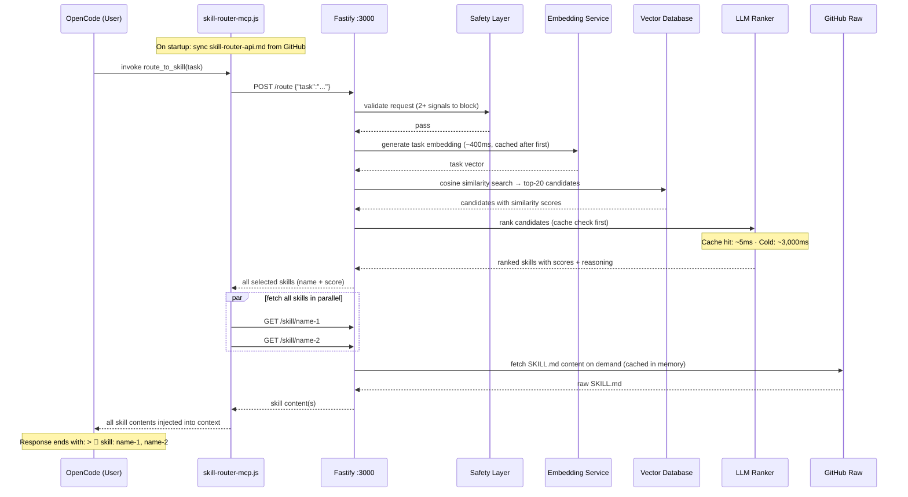

# Skills — An AI Skill Routing System

265 expert skills for AI coding agents, with a built-in routing engine that automatically selects and injects the right skill into your AI's context before it answers. No manual `/skill` commands — just ask, and the right expertise loads itself.

```
You → "review this Python code for security issues"
         ↓
   route_to_skill()  [auto-fires on every task]
         ↓
   embed → vector search → LLM re-rank → coding-security-review/SKILL.md
         ↓
   Full expert skill injected into context — AI answers as a security reviewer
```

---

## Quick Start

**With OpenAI (recommended):**

```bash
git clone https://github.com/paulpas/skills
cd skills
OPENAI_API_KEY=sk-... ./install-skill-router.sh --integrate-opencode
```

Restart OpenCode. Every task you type now automatically routes to the most relevant skill.

**No API key? Use a local model:**

```bash
./install-skill-router.sh \
  --provider llamacpp \
  --embedding-provider llamacpp \
  --llamacpp-url http://localhost:8080
```

> llama.cpp must serve both `/v1/chat/completions` and `/v1/embeddings`. No `OPENAI_API_KEY` required.

---

## FAQ

**Have questions?** Check the **[Comprehensive FAQ](./FAQ.md)** for 27 questions covering:
- Why MCP is better than direct skill loading
- How auto-routing works
- Skill management and creation
- Troubleshooting and best practices
- Offline mode, OpenCode integration, and more

---

## How It Works

Every time OpenCode receives a task, the `route_to_skill` MCP tool fires automatically:



### Latency

| Stage | Cold | Warm (cached) |
|---|---|---|
| Safety check | ~1 ms | ~1 ms |
| Task embedding | ~400 ms | ~1 ms (memory) |
| Vector search | ~1 ms | ~1 ms |
| LLM re-ranking | ~3,000 ms | ~5 ms (cache hit) |
| Skill content fetch | ~1 ms (disk) / ~150 ms (GitHub) | ~1 ms (memory) |
| **Total** | **~3.5 s** | **~10 ms** |

> Local llama.cpp drops cold LLM step to ~200–800 ms. Warm requests are fast regardless of provider.

### Key Behaviours

- **Multi-skill loading** — all high-confidence matches are fetched in parallel; the AI receives full context for each
- **Skill citation** — every response ends with `> 📖 skill: name-1, name-2` listing loaded skills
- **Auto index refresh** — `skills-index.json` is re-fetched from GitHub every `SKILL_SYNC_INTERVAL` seconds (default: 1 hour); new skills become routable without restart
- **API doc sync** — `skill-router-api.md` is fetched from GitHub on every MCP startup; edits to the repo file propagate automatically
- **LLM ranking cache** — identical task+candidates combos are served from memory (~5 ms) on repeat queries
- **Batch embeddings** — all skill embeddings are generated in parallel batches of 100 on startup (~2 s total)

---

## Monitoring

| What | Command |
|---|---|
| Skill accesses (MCP side) | `tail -f ~/.config/opencode/skill-router-mcp.log \| grep 'SKILL ACCESS'` |
| Full routing pipeline (Docker) | `docker logs -f skill-router 2>&1 \| grep -E 'Route result\|Vector search'` |
| Routing history (JSON) | `curl -s http://localhost:3000/access-log \| python3 -m json.tool` |
| Service health | `curl -s http://localhost:3000/health` |

---

## Utility Scripts

This repository includes automation scripts to maintain the skill catalog and improve trigger quality:

### 1. generate_readme.py

**Purpose:** Auto-generates the skills catalog in the README with zero manual effort.

**Location:** `scripts/generate_readme.py`

**What it does:**
- Reads all skill directories and extracts metadata (name, description, domain, role, triggers)
- Organizes skills into three auto-generated sections:
  - **Skills by Domain** — Grouped by domain category (agent, cncf, coding, trading, programming)
  - **Skills by Role** — Grouped by skill role (implementation, reference, orchestration, review)
  - **Complete Skills Index** — Alphabetical table of all 239+ skills with descriptions and triggers
- Inserts content between `<!-- AUTO-GENERATED SKILLS INDEX START/END -->` markers
- Preserves all existing README content outside the markers
- Includes generation timestamp
- Creates clickable hyperlinks to all skill SKILL.md files

**Usage:**
```bash
# Update README.md in-place
python3 scripts/generate_readme.py

# Generate custom output file
python3 scripts/generate_readme.py --output custom_skills.md
```

**When to use:**
- After adding new skills to the repository
- After modifying skill metadata (description, triggers, domain, role)
- Before committing changes to ensure README is up-to-date
- As part of CI/CD pipeline for automatic catalog maintenance

**Example output:**
All 239+ skills appear in the README with:
- Clickable links to `skills/<skill-name>/SKILL.md`
- Description from skill frontmatter
- Trigger keywords for skill discovery
- Organization by domain and role

---

### 2. enhance_triggers.py

**Purpose:** Adds user-friendly, conversational triggers to skills for improved discoverability.

**Location:** `scripts/enhance_triggers.py`

**What it does:**
- Scans all 239+ skills in the repository
- Identifies skills that could benefit from additional conversational triggers
- Adds user-friendly variants like:
  - "how do I..." questions
  - "what is..." clarifications
  - Common colloquialisms and business language
  - Related technology names
  - Operational task language
- Maintains the 5-8 term trigger limit per skill
- Generates detailed report in `TRIGGER_ENHANCEMENTS.md`
- Preserves YAML formatting and existing content

**Usage:**
```bash
# Enhance all skills and generate report
python3 scripts/enhance_triggers.py
```

**When to use:**
- After reviewing existing skill triggers for quality
- When skills need better user discovery
- After adding new skill categories
- To ensure triggers match both technical AND conversational language

**Example enhancements:**
```yaml
# Before
triggers: kubernetes, k8s, container orchestration, pod management

# After (with user-friendly variants added)
triggers: kubernetes, k8s, container orchestration, managing containers, how do i deploy apps
```

**Output:**
- Updates all SKILL.md files with improved triggers
- Generates `TRIGGER_ENHANCEMENTS.md` report showing:
  - All enhanced skills
  - Before/after trigger comparison
  - Enhancement statistics by domain
  - Quality assurance metrics

---

### 3. reformat_skills.py

**Purpose:** Validates and normalizes YAML frontmatter across all skills.

**Location:** `scripts/reformat_skills.py`

**What it does:**
- Validates YAML syntax in all skill frontmatter
- Normalizes formatting (indentation, field order)
- Fills in missing optional metadata fields from templates
- Reports errors and validation failures

**Usage:**
```bash
python3 scripts/reformat_skills.py
```

---

### 4. generate_index.py

**Purpose:** Regenerates the skill-router index for skill discovery.

**Location:** `generate_index.py` (top-level, maintained by repository)

**What it does:**
- Reads all skill metadata
- Generates `skills-index.json` for skill-router consumption
- Enables auto-loading of skills based on triggers
- Updates skill statistics and categorization

**Usage:**
```bash
python3 generate_index.py
```

---

## Recommended Workflow

When adding or modifying skills:

1. **Create or edit skill SKILL.md file**
   - Place in `skills/<skill-name>/` directory
   - Follow skill schema from [AGENTS.md](./AGENTS.md)

2. **Run reformat_skills.py**
   ```bash
   python3 scripts/reformat_skills.py
   ```

3. **Run enhance_triggers.py** (optional, for trigger improvement)
   ```bash
   python3 scripts/enhance_triggers.py
   ```

4. **Run generate_index.py**
   ```bash
   python3 generate_index.py
   ```

5. **Run generate_readme.py** (to update catalog)
   ```bash
   python3 scripts/generate_readme.py
   ```

6. **Commit and push**
   ```bash
   git add -A
   git commit -m "feat: add [skill-name] skill"
   git push origin main
   ```

**Or use one-line automation:**
```bash
python3 scripts/reformat_skills.py && \
python3 generate_index.py && \
python3 scripts/generate_readme.py
```

---

## The Skills Library

265 skills across 5 domains, organized in `skills/`. Each skill is a `SKILL.md` file with YAML frontmatter — the routing engine reads these directly.

```
skills-repo/
├── skills/                         ← all skill definitions live here
│   ├── agent-confidence-based-selector/
│   │   └── SKILL.md
│   ├── cncf-prometheus/
│   │   ├── SKILL.md
│   │   └── references/             ← optional sub-documents
│   ├── coding-code-review/
│   │   └── SKILL.md
│   ├── trading-risk-stop-loss/
│   │   └── SKILL.md
│   └── programming-algorithms/
│       └── SKILL.md
├── agent-skill-routing-system/     ← the HTTP routing service
├── README.md
├── SKILL_FORMAT_SPEC.md
├── reformat_skills.py
└── install-skill-router.sh
```

### Domain Prefixes

| Prefix | Description |
|---|---|
| `agent-*` | AI agent orchestration patterns (task decomposition, routing, planning) |
| `cncf-*` | CNCF cloud-native project reference (Kubernetes, Prometheus, Helm, etc.) |
| `coding-*` | Software engineering patterns (code review, TDD, FastAPI, Pydantic, etc.) |
| `trading-*` | Algorithmic trading implementation (risk management, execution, ML, backtesting) |
| `programming-*` | Algorithm and language reference material |

---

### Agent Orchestration

- [agent-confidence-based-selector](./skills/agent-confidence-based-selector/SKILL.md) — Selects the most appropriate skill based on confidence scores and relevance metrics
- [agent-dependency-graph-builder](./skills/agent-dependency-graph-builder/SKILL.md) — Builds and maintains dependency graphs for task execution
- [agent-dynamic-replanner](./skills/agent-dynamic-replanner/SKILL.md) — Dynamically adjusts execution plans based on real-time feedback and changing conditions
- [agent-goal-to-milestones](./skills/agent-goal-to-milestones/SKILL.md) — Translates high-level goals into actionable milestones
- [agent-multi-skill-executor](./skills/agent-multi-skill-executor/SKILL.md) — Orchestrates execution of multiple skills in sequence with dependency management
- [agent-parallel-skill-runner](./skills/agent-parallel-skill-runner/SKILL.md) — Executes multiple skills concurrently with synchronization and result collection
- [agent-task-decomposition-engine](./skills/agent-task-decomposition-engine/SKILL.md) — Decomposes complex tasks into manageable subtasks for specialized skills

---

### CNCF Cloud Native

#### Architecture & Best Practices

- [cncf-architecture-best-practices](./skills/cncf-architecture-best-practices/SKILL.md) — Production-grade Kubernetes: service mesh, CNI, GitOps, CI/CD, observability, security, networking, and scaling
- [cncf-networking-osi](./skills/cncf-networking-osi/SKILL.md) — OSI Model networking for cloud-native — all 7 layers with CNCF project mappings

#### Application Definition & Build

- [cncf-argo](./skills/cncf-argo/SKILL.md) — Kubernetes-native workflow, CI/CD, and governance
- [cncf-artifact-hub](./skills/cncf-artifact-hub/SKILL.md) — Repository for Kubernetes Helm, Falco, OPA, and more
- [cncf-backstage](./skills/cncf-backstage/SKILL.md) — Developer portal for microservices
- [cncf-buildpacks](./skills/cncf-buildpacks/SKILL.md) — Source code to container images without Dockerfiles
- [cncf-dapr](./skills/cncf-dapr/SKILL.md) — Distributed application runtime
- [cncf-helm](./skills/cncf-helm/SKILL.md) — The Kubernetes package manager
- [cncf-kubevela](./skills/cncf-kubevela/SKILL.md) — Kubernetes application platform
- [cncf-kubevirt](./skills/cncf-kubevirt/SKILL.md) — Virtualization on Kubernetes
- [cncf-operator-framework](./skills/cncf-operator-framework/SKILL.md) — Build and manage Kubernetes operators with standardized patterns

#### Container Runtime

- [cncf-containerd](./skills/cncf-containerd/SKILL.md) — Open and reliable container runtime
- [cncf-cri-o](./skills/cncf-cri-o/SKILL.md) — OCI-compliant container runtime for Kubernetes
- [cncf-krustlet](./skills/cncf-krustlet/SKILL.md) — Kubernetes runtime patterns and best practices
- [cncf-lima](./skills/cncf-lima/SKILL.md) — Container runtime patterns and best practices

#### Container Registry

- [cncf-dragonfly](./skills/cncf-dragonfly/SKILL.md) — P2P file distribution
- [cncf-harbor](./skills/cncf-harbor/SKILL.md) — Container registry
- [cncf-zot](./skills/cncf-zot/SKILL.md) — Cloud-native container registry patterns

#### Networking & Service Mesh

- [cncf-calico](./skills/cncf-calico/SKILL.md) — Cloud-native network security
- [cncf-cilium](./skills/cncf-cilium/SKILL.md) — eBPF-based cloud-native networking
- [cncf-cni](./skills/cncf-cni/SKILL.md) — Container Network Interface for Linux containers
- [cncf-container-network-interface-cni](./skills/cncf-container-network-interface-cni/SKILL.md) — CNI architecture patterns
- [cncf-contour](./skills/cncf-contour/SKILL.md) — Service proxy patterns
- [cncf-emissary-ingress](./skills/cncf-emissary-ingress/SKILL.md) — Kubernetes ingress controller
- [cncf-envoy](./skills/cncf-envoy/SKILL.md) — High-performance edge/middle/service proxy
- [cncf-grpc](./skills/cncf-grpc/SKILL.md) — Remote procedure call patterns
- [cncf-istio](./skills/cncf-istio/SKILL.md) — Connect, secure, control, and observe services
- [cncf-kong](./skills/cncf-kong/SKILL.md) — API gateway patterns
- [cncf-kong-ingress-controller](./skills/cncf-kong-ingress-controller/SKILL.md) — Kong Ingress Controller for Kubernetes
- [cncf-kuma](./skills/cncf-kuma/SKILL.md) — Service mesh patterns
- [cncf-linkerd](./skills/cncf-linkerd/SKILL.md) — Lightweight service mesh

#### Observability

- [cncf-cortex](./skills/cncf-cortex/SKILL.md) — Distributed, horizontally scalable Prometheus
- [cncf-fluentd](./skills/cncf-fluentd/SKILL.md) — Unified logging layer for cloud-native environments
- [cncf-jaeger](./skills/cncf-jaeger/SKILL.md) — Distributed tracing
- [cncf-open-telemetry](./skills/cncf-open-telemetry/SKILL.md) — OpenTelemetry architecture patterns
- [cncf-opentelemetry](./skills/cncf-opentelemetry/SKILL.md) — Vendor-neutral tracing, metrics, and logs framework
- [cncf-prometheus](./skills/cncf-prometheus/SKILL.md) — Monitoring system and time series database
- [cncf-thanos](./skills/cncf-thanos/SKILL.md) — High-availability Prometheus with long-term storage

#### Scheduling & Orchestration

- [cncf-crossplane](./skills/cncf-crossplane/SKILL.md) — Kubernetes-native multi-cloud infrastructure control plane
- [cncf-fluid](./skills/cncf-fluid/SKILL.md) — Kubernetes-native data acceleration for data-intensive apps
- [cncf-karmada](./skills/cncf-karmada/SKILL.md) — Multi-cluster orchestration
- [cncf-keda](./skills/cncf-keda/SKILL.md) — Event-driven autoscaling
- [cncf-knative](./skills/cncf-knative/SKILL.md) — Serverless on Kubernetes
- [cncf-kubeflow](./skills/cncf-kubeflow/SKILL.md) — ML on Kubernetes
- [cncf-kubernetes](./skills/cncf-kubernetes/SKILL.md) — Production-grade container scheduling and management
- [cncf-volcano](./skills/cncf-volcano/SKILL.md) — Batch scheduling infrastructure for Kubernetes
- [cncf-wasmcloud](./skills/cncf-wasmcloud/SKILL.md) — WebAssembly-based distributed applications platform

#### Security & Compliance

- [cncf-cert-manager](./skills/cncf-cert-manager/SKILL.md) — Certificate management for Kubernetes
- [cncf-falco](./skills/cncf-falco/SKILL.md) — Cloud-native runtime security
- [cncf-in-toto](./skills/cncf-in-toto/SKILL.md) — Supply chain security patterns
- [cncf-keycloak](./skills/cncf-keycloak/SKILL.md) — Identity and access management
- [cncf-kubescape](./skills/cncf-kubescape/SKILL.md) — Kubernetes security scanning
- [cncf-kyverno](./skills/cncf-kyverno/SKILL.md) — Kubernetes policy engine
- [cncf-notary-project](./skills/cncf-notary-project/SKILL.md) — Content trust and supply chain security
- [cncf-oathkeeper](./skills/cncf-oathkeeper/SKILL.md) — Identity and access proxy
- [cncf-open-policy-agent-opa](./skills/cncf-open-policy-agent-opa/SKILL.md) — Policy as code
- [cncf-openfga](./skills/cncf-openfga/SKILL.md) — Fine-grained authorization
- [cncf-openfeature](./skills/cncf-openfeature/SKILL.md) — Vendor-neutral feature flagging
- [cncf-ory-hydra](./skills/cncf-ory-hydra/SKILL.md) — OAuth 2.0 / OpenID Connect server
- [cncf-ory-kratos](./skills/cncf-ory-kratos/SKILL.md) — Cloud-native identity management
- [cncf-spiffe](./skills/cncf-spiffe/SKILL.md) — Secure production identity framework
- [cncf-spire](./skills/cncf-spire/SKILL.md) — SPIFFE implementation for real-world deployments
- [cncf-the-update-framework-tuf](./skills/cncf-the-update-framework-tuf/SKILL.md) — Secure software update framework

#### Storage

- [cncf-cubefs](./skills/cncf-cubefs/SKILL.md) — Distributed high-performance file system
- [cncf-longhorn](./skills/cncf-longhorn/SKILL.md) — Cloud-native storage patterns
- [cncf-rook](./skills/cncf-rook/SKILL.md) — Cloud-native storage orchestration for Kubernetes

#### Streaming & Messaging

- [cncf-cloudevents](./skills/cncf-cloudevents/SKILL.md) — Cloud-native event streaming patterns
- [cncf-nats](./skills/cncf-nats/SKILL.md) — Cloud-native messaging
- [cncf-strimzi](./skills/cncf-strimzi/SKILL.md) — Apache Kafka for cloud-native environments

#### Database & Key-Value

- [cncf-coredns](./skills/cncf-coredns/SKILL.md) — DNS server that chains plugins
- [cncf-etcd](./skills/cncf-etcd/SKILL.md) — Distributed key-value store
- [cncf-tikv](./skills/cncf-tikv/SKILL.md) — Distributed transactional key-value database
- [cncf-vitess](./skills/cncf-vitess/SKILL.md) — Horizontal scaling for MySQL

#### CI/CD & GitOps

- [cncf-flux](./skills/cncf-flux/SKILL.md) — GitOps for Kubernetes
- [cncf-openkruise](./skills/cncf-openkruise/SKILL.md) — Advanced Kubernetes workload management
- [cncf-tekton](./skills/cncf-tekton/SKILL.md) — Cloud-native pipeline resource

#### Automation & Edge

- [cncf-chaosmesh](./skills/cncf-chaosmesh/SKILL.md) — Chaos engineering platform for Kubernetes
- [cncf-cloud-custodian](./skills/cncf-cloud-custodian/SKILL.md) — Rules engine for cloud infrastructure management
- [cncf-flatcar-container-linux](./skills/cncf-flatcar-container-linux/SKILL.md) — Container-optimized Linux
- [cncf-kubeedge](./skills/cncf-kubeedge/SKILL.md) — Edge computing with Kubernetes
- [cncf-kserve](./skills/cncf-kserve/SKILL.md) — Model serving on Kubernetes
- [cncf-litmus](./skills/cncf-litmus/SKILL.md) — Cloud-native chaos engineering
- [cncf-metal3-io](./skills/cncf-metal3-io/SKILL.md) — Bare metal provisioning patterns
- [cncf-opencost](./skills/cncf-opencost/SKILL.md) — Kubernetes cost monitoring
- [cncf-openyurt](./skills/cncf-openyurt/SKILL.md) — Extending Kubernetes to edge scenarios

#### Process & Documentation

- [cncf-process-architecture](./skills/cncf-process-architecture/SKILL.md) — Create or update `ARCHITECTURE.md` for CNCF projects
- [cncf-process-incident-response](./skills/cncf-process-incident-response/SKILL.md) — Incident response plan: detection, triage, communication, post-incident review
- [cncf-process-releases](./skills/cncf-process-releases/SKILL.md) — Release process, versioning policy, and cadence documentation
- [cncf-process-security-policy](./skills/cncf-process-security-policy/SKILL.md) — Vulnerability reporting, disclosure timeline, and supported versions

---

### Coding Patterns

- [coding-code-review](./skills/coding-code-review/SKILL.md) — Bugs, security vulnerabilities, code smells, and architectural concerns with prioritized feedback
- [coding-conviction-scoring](./skills/coding-conviction-scoring/SKILL.md) — Trade confidence and risk assessment scoring
- [coding-data-normalization](./skills/coding-data-normalization/SKILL.md) — Typed dataclasses for ticker/trade/orderbook with exchange-specific parsing
- [coding-event-bus](./skills/coding-event-bus/SKILL.md) — Async pub/sub event bus with typed events and singleton initialization
- [coding-event-driven-architecture](./skills/coding-event-driven-architecture/SKILL.md) — Event-driven architecture for real-time systems: pub/sub, signal flow, strategy base
- [coding-fastapi-patterns](./skills/coding-fastapi-patterns/SKILL.md) — FastAPI structure: typed error hierarchy, exception handlers, CORS, request timing
- [coding-git-branching-strategies](./skills/coding-git-branching-strategies/SKILL.md) — Git Flow, GitHub Flow, Trunk-Based Development, and feature flag strategies
- [coding-juice-shop](./skills/coding-juice-shop/SKILL.md) — OWASP Juice Shop: web application security testing guide
- [coding-markdown-best-practices](./skills/coding-markdown-best-practices/SKILL.md) — Markdown syntax rules, common pitfalls, and documentation consistency
- [coding-pydantic-config](./skills/coding-pydantic-config/SKILL.md) — Pydantic config with frozen models, nested hierarchy, TOML/env parsing
- [coding-pydantic-models](./skills/coding-pydantic-models/SKILL.md) — Pydantic frozen data models: enums, annotated constraints, validators, computed properties
- [coding-security-review](./skills/coding-security-review/SKILL.md) — Security vulnerabilities: injection, XSS, insecure deserialization, misconfigurations
- [coding-strategy-base](./skills/coding-strategy-base/SKILL.md) — Abstract base strategy pattern with initialization guards and typed abstract methods
- [coding-test-driven-development](./skills/coding-test-driven-development/SKILL.md) — TDD and BDD with pytest, unit tests, mocking, and test pyramid principles
- [coding-websocket-manager](./skills/coding-websocket-manager/SKILL.md) — WebSocket state machine with exponential backoff and message routing

---

### Trading AI & ML

- [trading-ai-anomaly-detection](./skills/trading-ai-anomaly-detection/SKILL.md) — Detect anomalous market behavior, outliers, and potential manipulation
- [trading-ai-explainable-ai](./skills/trading-ai-explainable-ai/SKILL.md) — Explainable AI for understanding and trusting trading model decisions
- [trading-ai-feature-engineering](./skills/trading-ai-feature-engineering/SKILL.md) — Create actionable trading features from raw market data
- [trading-ai-hyperparameter-tuning](./skills/trading-ai-hyperparameter-tuning/SKILL.md) — Optimize model configurations for trading applications
- [trading-ai-live-model-monitoring](./skills/trading-ai-live-model-monitoring/SKILL.md) — Monitor production ML models for drift, decay, and performance degradation
- [trading-ai-llm-orchestration](./skills/trading-ai-llm-orchestration/SKILL.md) — LLM orchestration for trading analysis with structured output via instructor/pydantic
- [trading-ai-model-ensemble](./skills/trading-ai-model-ensemble/SKILL.md) — Combine multiple models for improved prediction accuracy
- [trading-ai-multi-asset-model](./skills/trading-ai-multi-asset-model/SKILL.md) — Model inter-asset relationships for portfolio and cross-asset strategies
- [trading-ai-news-embedding](./skills/trading-ai-news-embedding/SKILL.md) — Process news text using NLP embeddings for trading signals
- [trading-ai-order-flow-analysis](./skills/trading-ai-order-flow-analysis/SKILL.md) — Analyze order flow to detect market pressure and anticipate price moves
- [trading-ai-regime-classification](./skills/trading-ai-regime-classification/SKILL.md) — Detect current market regime for adaptive trading strategies
- [trading-ai-reinforcement-learning](./skills/trading-ai-reinforcement-learning/SKILL.md) — Reinforcement learning for automated trading agents and policy optimization
- [trading-ai-sentiment-analysis](./skills/trading-ai-sentiment-analysis/SKILL.md) — AI-powered sentiment from news, social media, and political figures
- [trading-ai-sentiment-features](./skills/trading-ai-sentiment-features/SKILL.md) — Extract market sentiment from news, social media, and analyst reports
- [trading-ai-synthetic-data](./skills/trading-ai-synthetic-data/SKILL.md) — Generate synthetic financial data for training and testing models
- [trading-ai-time-series-forecasting](./skills/trading-ai-time-series-forecasting/SKILL.md) — Time series forecasting for price prediction and market analysis
- [trading-ai-volatility-prediction](./skills/trading-ai-volatility-prediction/SKILL.md) — Forecast volatility for risk management and option pricing

---

### Trading Backtesting

- [trading-backtest-drawdown-analysis](./skills/trading-backtest-drawdown-analysis/SKILL.md) — Maximum drawdown, recovery time, and Value-at-Risk analysis
- [trading-backtest-lookahead-bias](./skills/trading-backtest-lookahead-bias/SKILL.md) — Prevent lookahead bias through strict causality enforcement and time-based validation
- [trading-backtest-position-exits](./skills/trading-backtest-position-exits/SKILL.md) — Exit strategies, trailing stops, and take-profit mechanisms
- [trading-backtest-position-sizing](./skills/trading-backtest-position-sizing/SKILL.md) — Fixed fractional, Kelly criterion, and volatility-adjusted sizing
- [trading-backtest-sharpe-ratio](./skills/trading-backtest-sharpe-ratio/SKILL.md) — Sharpe ratio and risk-adjusted performance metrics
- [trading-backtest-walk-forward](./skills/trading-backtest-walk-forward/SKILL.md) — Walk-forward optimization for robust strategy validation

---

### Trading Data Pipelines

- [trading-data-alternative-data](./skills/trading-data-alternative-data/SKILL.md) — Alternative data ingestion: news, social media, on-chain data sources
- [trading-data-backfill-strategy](./skills/trading-data-backfill-strategy/SKILL.md) — Strategic backfill for populating historical data
- [trading-data-candle-data](./skills/trading-data-candle-data/SKILL.md) — OHLCV processing, timeframe management, and validation
- [trading-data-enrichment](./skills/trading-data-enrichment/SKILL.md) — Add context to raw trading data
- [trading-data-feature-store](./skills/trading-data-feature-store/SKILL.md) — Feature storage and management for ML trading models
- [trading-data-lake](./skills/trading-data-lake/SKILL.md) — Data lake architecture for trading data storage
- [trading-data-order-book](./skills/trading-data-order-book/SKILL.md) — Order book handling, spread calculation, liquidity measurement
- [trading-data-stream-processing](./skills/trading-data-stream-processing/SKILL.md) — Streaming data processing for real-time signals and analytics
- [trading-data-time-series-database](./skills/trading-data-time-series-database/SKILL.md) — Time-series database queries and optimization for financial data
- [trading-data-validation](./skills/trading-data-validation/SKILL.md) — Data validation and quality assurance for trading pipelines

---

### Trading Exchange Integration

- [trading-exchange-ccxt-patterns](./skills/trading-exchange-ccxt-patterns/SKILL.md) — CCXT patterns: error handling, rate limiting, and state management
- [trading-exchange-failover-handling](./skills/trading-exchange-failover-handling/SKILL.md) — Automated failover and redundancy for exchange connectivity
- [trading-exchange-health](./skills/trading-exchange-health/SKILL.md) — Exchange health monitoring and connectivity status
- [trading-exchange-market-data-cache](./skills/trading-exchange-market-data-cache/SKILL.md) — High-performance caching for market data with low latency
- [trading-exchange-order-book-sync](./skills/trading-exchange-order-book-sync/SKILL.md) — Order book synchronization and state management
- [trading-exchange-order-execution-api](./skills/trading-exchange-order-execution-api/SKILL.md) — Order execution and management API
- [trading-exchange-rate-limiting](./skills/trading-exchange-rate-limiting/SKILL.md) — Rate limiting and circuit breaker patterns for exchange APIs
- [trading-exchange-trade-reporting](./skills/trading-exchange-trade-reporting/SKILL.md) — Real-time trade reporting and execution analytics
- [trading-exchange-websocket-handling](./skills/trading-exchange-websocket-handling/SKILL.md) — Real-time market data: connection management, data aggregation, error recovery
- [trading-exchange-websocket-streaming](./skills/trading-exchange-websocket-streaming/SKILL.md) — Real-time market data streaming and processing

---

### Trading Execution Algorithms

- [trading-execution-order-book-impact](./skills/trading-execution-order-book-impact/SKILL.md) — Order book impact measurement and market microstructure analysis
- [trading-execution-rate-limiting](./skills/trading-execution-rate-limiting/SKILL.md) — Rate limiting and exchange API management for robust execution
- [trading-execution-slippage-modeling](./skills/trading-execution-slippage-modeling/SKILL.md) — Slippage estimation, simulation, and fee modeling
- [trading-execution-twap](./skills/trading-execution-twap/SKILL.md) — Time-weighted average price for executing large orders with minimal impact
- [trading-execution-twap-vwap](./skills/trading-execution-twap-vwap/SKILL.md) — TWAP and VWAP: institutional-grade order execution
- [trading-execution-vwap](./skills/trading-execution-vwap/SKILL.md) — Volume-weighted average price execution

---

### Trading Paper Trading

- [trading-paper-commission-model](./skills/trading-paper-commission-model/SKILL.md) — Commission model and fee structure simulation
- [trading-paper-fill-simulation](./skills/trading-paper-fill-simulation/SKILL.md) — Fill simulation models for order execution probability
- [trading-paper-market-impact](./skills/trading-paper-market-impact/SKILL.md) — Market impact modeling and order book simulation
- [trading-paper-performance-attribution](./skills/trading-paper-performance-attribution/SKILL.md) — Performance attribution for trading strategy decomposition
- [trading-paper-realistic-simulation](./skills/trading-paper-realistic-simulation/SKILL.md) — Realistic paper trading with market impact and execution fees
- [trading-paper-slippage-model](./skills/trading-paper-slippage-model/SKILL.md) — Slippage modeling and execution simulation

---

### Trading Risk Management

- [trading-risk-correlation-risk](./skills/trading-risk-correlation-risk/SKILL.md) — Correlation breakdown and portfolio diversification risk
- [trading-risk-drawdown-control](./skills/trading-risk-drawdown-control/SKILL.md) — Maximum drawdown control and equity preservation
- [trading-risk-kill-switches](./skills/trading-risk-kill-switches/SKILL.md) — Multi-layered kill switches at account, strategy, market, and infrastructure levels
- [trading-risk-liquidity-risk](./skills/trading-risk-liquidity-risk/SKILL.md) — Liquidity assessment and trade execution risk
- [trading-risk-position-sizing](./skills/trading-risk-position-sizing/SKILL.md) — Kelly criterion, volatility adjustments, and edge-based sizing
- [trading-risk-stop-loss](./skills/trading-risk-stop-loss/SKILL.md) — Stop loss strategies for risk management
- [trading-risk-stress-testing](./skills/trading-risk-stress-testing/SKILL.md) — Stress test scenarios and portfolio resilience analysis
- [trading-risk-tail-risk](./skills/trading-risk-tail-risk/SKILL.md) — Tail risk management and extreme event protection
- [trading-risk-value-at-risk](./skills/trading-risk-value-at-risk/SKILL.md) — Value at Risk calculations for portfolio risk management

---

### Trading Technical Analysis

- [trading-technical-cycle-analysis](./skills/trading-technical-cycle-analysis/SKILL.md) — Market cycles and periodic patterns in price movement
- [trading-technical-false-signal-filtering](./skills/trading-technical-false-signal-filtering/SKILL.md) — False signal filtering for robust technical analysis
- [trading-technical-indicator-confluence](./skills/trading-technical-indicator-confluence/SKILL.md) — Indicator confluence validation for confirming trading signals
- [trading-technical-intermarket-analysis](./skills/trading-technical-intermarket-analysis/SKILL.md) — Cross-market relationships and asset class correlations
- [trading-technical-market-microstructure](./skills/trading-technical-market-microstructure/SKILL.md) — Order book dynamics and order flow analysis
- [trading-technical-momentum-indicators](./skills/trading-technical-momentum-indicators/SKILL.md) — RSI, MACD, stochastic oscillators, and momentum analysis
- [trading-technical-price-action-patterns](./skills/trading-technical-price-action-patterns/SKILL.md) — Candlestick and chart patterns for price movement prediction
- [trading-technical-regime-detection](./skills/trading-technical-regime-detection/SKILL.md) — Market regime detection for adaptive trading strategies
- [trading-technical-statistical-arbitrage](./skills/trading-technical-statistical-arbitrage/SKILL.md) — Pair trading and cointegration-based arbitrage
- [trading-technical-support-resistance](./skills/trading-technical-support-resistance/SKILL.md) — Technical levels where price tends to pause or reverse
- [trading-technical-trend-analysis](./skills/trading-technical-trend-analysis/SKILL.md) — Trend identification, classification, and continuation
- [trading-technical-volatility-analysis](./skills/trading-technical-volatility-analysis/SKILL.md) — Volatility measurement, forecasting, and risk assessment
- [trading-technical-volume-profile](./skills/trading-technical-volume-profile/SKILL.md) — Volume analysis for understanding market structure

---

### Trading Fundamentals

- [trading-fundamentals-market-regimes](./skills/trading-fundamentals-market-regimes/SKILL.md) — Market regime detection and adaptation across changing conditions
- [trading-fundamentals-market-structure](./skills/trading-fundamentals-market-structure/SKILL.md) — Market structure and trading participants analysis
- [trading-fundamentals-risk-management-basics](./skills/trading-fundamentals-risk-management-basics/SKILL.md) — Position sizing, stop-loss, and system-level risk controls
- [trading-fundamentals-trading-edge](./skills/trading-fundamentals-trading-edge/SKILL.md) — Finding and maintaining competitive advantage in trading systems
- [trading-fundamentals-trading-plan](./skills/trading-fundamentals-trading-plan/SKILL.md) — Trading plan structure and risk management framework
- [trading-fundamentals-trading-psychology](./skills/trading-fundamentals-trading-psychology/SKILL.md) — Emotional discipline, cognitive bias awareness, and operational integrity

---

### Programming

- [programming-algorithms](./skills/programming-algorithms/SKILL.md) — Algorithm selection guide: time/space trade-offs, input characteristics, and problem constraints

---

## Adding Skills

Create `skills/<domain>-<topic>/SKILL.md` following the format in [SKILL_FORMAT_SPEC.md](./SKILL_FORMAT_SPEC.md). Run `python reformat_skills.py` to apply standard frontmatter. Run `python3 generate_index.py` after adding a skill to update `skills-index.json`, then push. The router auto-discovers new skills within `SKILL_SYNC_INTERVAL` seconds (default: 1 hour). For immediate pickup: `curl -X POST http://localhost:3000/reload`

```yaml
---
name: my-skill-name
description: One-line description of what this skill does
license: MIT
compatibility: opencode
metadata:
  version: "1.0.0"
  domain: coding
  role: implementation
  scope: implementation
  output-format: code
  triggers: keyword1, keyword2, keyword3
---
```

Good triggers are specific and task-oriented (`kubernetes, k8s, pod, deployment, kubectl`) rather than generic (`cloud, infrastructure, ops`).

---

<!-- AUTO-GENERATED SKILLS INDEX START -->

> **Last updated:** 2026-04-25 09:34:31 UTC  
> **Total skills:** 1770

## Skills by Domain


### Agent (222 skills)

| Skill Name | Description | Triggers |
|---|---|---|
| [00-andruia-consultant](../../skills/00-andruia-consultant/SKILL.md) | "Provides Arquitecto de Soluciones Principal y Consultor... | 00 andruia consultant, andruia... |
| [10-andruia-skill-smith](../../skills/10-andruia-skill-smith/SKILL.md) | "Provides Ingeniero de Sistemas de Andru.ia. Diseña,... | 10 andruia skill smith, andruia... |
| [20-andruia-niche-intelligence](../../skills/20-andruia-niche-intelligence/SKILL.md) | "Provides Estratega de Inteligencia de Dominio de Andru.ia.... | 20 andruia niche intelligence, andruia... |
| [acceptance-orchestrator](../../skills/acceptance-orchestrator/SKILL.md) | "Provides use when a coding task should be driven... | acceptance orchestrator, workflow... |
| [address-github-comments](../../skills/address-github-comments/SKILL.md) | "Provides use when you need to address review or issue... | address github comments, workflow... |
| [agent-add-new-skill](../../skills/agent-add-new-skill/SKILL.md) | "'Step-by-step guide for adding a new skill to the... | add skill, contribute skill... |
| [agent-autoscaling-advisor](../../skills/agent-autoscaling-advisor/SKILL.md) | "Advisors on optimal auto-scaling configurations for... | autoscaling advisor, autoscaling-advisor... |
| [agent-ci-cd-pipeline-analyzer](../../skills/agent-ci-cd-pipeline-analyzer/SKILL.md) | "Analyzes CI/CD pipelines for optimization opportunities,... | build bottlenecks, ci-cd analysis... |
| [agent-code-correctness-verifier](../../skills/agent-code-correctness-verifier/SKILL.md) | "Verifies code correctness by analyzing syntax, semantics,... | code correctness verifier, code-correctness-verifier... |
| [agent-confidence-based-selector](../../skills/agent-confidence-based-selector/SKILL.md) | "Selects and executes the most appropriate skill based on... | appropriate, confidence based selector... |
| [agent-container-inspector](../../skills/agent-container-inspector/SKILL.md) | "Inspects container configurations, runtime state, logs,... | container, container inspector... |
| [agent-dependency-graph-builder](../../skills/agent-dependency-graph-builder/SKILL.md) | "Builds and maintains dependency graphs for task execution,... | builds, dependency graph builder... |
| [agent-diff-quality-analyzer](../../skills/agent-diff-quality-analyzer/SKILL.md) | "Analyzes code quality changes in diffs by evaluating... | analyzes, code quality... |
| [agent-dynamic-replanner](../../skills/agent-dynamic-replanner/SKILL.md) | "Dynamically adjusts execution plans based on real-time... | adjusts, dynamic replanner... |
| [agent-error-trace-explainer](../../skills/agent-error-trace-explainer/SKILL.md) | "Explains error traces and exceptions by analyzing stack... | error trace explainer, error-trace-explainer... |
| [agent-evaluation](../../skills/agent-evaluation/SKILL.md) | "Provides Testing and benchmarking LLM agents including... | agent evaluation, ai... |
| [agent-failure-mode-analysis](../../skills/agent-failure-mode-analysis/SKILL.md) | "Performs failure mode analysis by identifying potential... | analyzes, failure mode analysis... |
| [agent-goal-to-milestones](../../skills/agent-goal-to-milestones/SKILL.md) | "Translates high-level goals into actionable milestones and... | goal to milestones, goal-to-milestones... |
| [agent-hot-path-detector](../../skills/agent-hot-path-detector/SKILL.md) | "Identifies critical execution paths (hot paths) in code... | critical, execution... |
| [agent-infra-drift-detector](../../skills/agent-infra-drift-detector/SKILL.md) | "Detects and reports infrastructure drift between desired... | cloud infrastructure, drift detection... |
| [agent-k8s-debugger](../../skills/agent-k8s-debugger/SKILL.md) | "Diagnoses Kubernetes cluster issues, debug pods,... | container orchestration, diagnoses... |
| [agent-manager-skill](../../skills/agent-manager-skill/SKILL.md) | Provides Manage multiple local CLI agents via tmux sessions... | agent manager skill, ai... |
| [agent-memory-systems](../../skills/agent-memory-systems/SKILL.md) | 'Provides Memory is the cornerstone of intelligent agents.... | agent memory systems, memory... |
| [agent-memory-usage-analyzer](../../skills/agent-memory-usage-analyzer/SKILL.md) | "Analyzes memory allocation patterns, identifies memory... | analyzes, leaks... |
| [agent-multi-skill-executor](../../skills/agent-multi-skill-executor/SKILL.md) | "Orchestrates execution of multiple skill specifications in... | execution, multi skill executor... |
| [agent-network-diagnostics](../../skills/agent-network-diagnostics/SKILL.md) | "Diagnoses network connectivity issues, identifies... | bottlenecks, connectivity issues... |
| [agent-parallel-skill-runner](../../skills/agent-parallel-skill-runner/SKILL.md) | "Executes multiple skill specifications concurrently,... | executes, multiple... |
| [agent-performance-profiler](../../skills/agent-performance-profiler/SKILL.md) | "Profiles code execution to identify performance... | bottlenecks, optimization... |
| [agent-query-optimizer](../../skills/agent-query-optimizer/SKILL.md) | "Analyzes and optimizes database queries for performance,... | database optimization, query optimization... |
| [agent-regression-detector](../../skills/agent-regression-detector/SKILL.md) | "Detects performance and behavioral regressions by... | behavioral, detects... |
| [agent-resource-optimizer](../../skills/agent-resource-optimizer/SKILL.md) | "Optimizes resource allocation across distributed systems... | cost optimization, resource allocation... |
| [agent-runtime-log-analyzer](../../skills/agent-runtime-log-analyzer/SKILL.md) | "Analyzes runtime logs from agent execution to identify... | analyzes, logs... |
| [agent-schema-inference-engine](../../skills/agent-schema-inference-engine/SKILL.md) | "Inferences data schemas from actual data samples,... | data schema, schema discovery... |
| [agent-self-critique-engine](../../skills/agent-self-critique-engine/SKILL.md) | "Enables autonomous agents to self-critique their work by... | correctness, evaluates... |
| [agent-stacktrace-root-cause](../../skills/agent-stacktrace-root-cause/SKILL.md) | "Performs stacktrace root cause analysis by examining stack... | analyzes, failures... |
| [agent-task-decomposition-engine](../../skills/agent-task-decomposition-engine/SKILL.md) | "Decomposes complex tasks into smaller, manageable subtasks... | complex, decomposes... |
| [agent-test-oracle-generator](../../skills/agent-test-oracle-generator/SKILL.md) | "Generates test oracles and expected outputs for testing... | expected output, test oracle... |
| [ai-agent-development](../../skills/ai-agent-development/SKILL.md) | "Provides AI agent development workflow for building... | ai agent development, granular... |
| [ai-agents-architect](../../skills/ai-agents-architect/SKILL.md) | Provides Expert in designing and building autonomous AI... | ai agents architect, ai... |
| [ai-dev-jobs-mcp](../../skills/ai-dev-jobs-mcp/SKILL.md) | "Provides Search 8,400+ AI and ML jobs across 489... | ai dev jobs mcp, mcp... |
| [ai-ml](../../skills/ai-ml/SKILL.md) | "Provides AI and machine learning workflow covering LLM... | ai ml, workflow... |
| [airflow-dag-patterns](../../skills/airflow-dag-patterns/SKILL.md) | Provides Build production Apache Airflow DAGs with best... | airflow dag patterns, workflow... |
| [airtable-automation](../../skills/airtable-automation/SKILL.md) | 'Provides Automate Airtable tasks via Rube MCP (Composio):... | airtable automation, automation... |
| [analyze-project](../../skills/analyze-project/SKILL.md) | "Provides Forensic root cause analyzer for Antigravity... | analyze project, meta... |
| [antigravity-skill-orchestrator](../../skills/antigravity-skill-orchestrator/SKILL.md) | "Provides a meta-skill that understands task requirements,... | antigravity skill orchestrator, meta... |
| [antigravity-workflows](../../skills/antigravity-workflows/SKILL.md) | "Provides Orchestrate multiple Antigravity skills through... | antigravity workflows, workflow... |
| [api-documentation](../../skills/api-documentation/SKILL.md) | "Provides API documentation workflow for generating OpenAPI... | api documentation, granular... |
| [api-security-testing](../../skills/api-security-testing/SKILL.md) | Provides API security testing workflow for REST and GraphQL... | api security testing, granular... |
| [apify-actor-development](../../skills/apify-actor-development/SKILL.md) | 'Provides Important: Before you begin, fill in the... | apify actor development, automation... |
| [apify-actorization](../../skills/apify-actorization/SKILL.md) | Provides Actorization converts existing software into... | apify actorization, automation... |
| [apify-audience-analysis](../../skills/apify-audience-analysis/SKILL.md) | Provides Understand audience demographics, preferences,... | apify audience analysis, automation... |
| [apify-brand-reputation-monitoring](../../skills/apify-brand-reputation-monitoring/SKILL.md) | Provides Scrape reviews, ratings, and brand mentions from... | apify brand reputation monitoring, automation... |
| [apify-competitor-intelligence](../../skills/apify-competitor-intelligence/SKILL.md) | Provides Analyze competitor strategies, content, pricing,... | apify competitor intelligence, automation... |
| [apify-content-analytics](../../skills/apify-content-analytics/SKILL.md) | Provides Track engagement metrics, measure campaign ROI,... | apify content analytics, automation... |
| [apify-ecommerce](../../skills/apify-ecommerce/SKILL.md) | Provides Extract product data, prices, reviews, and seller... | apify ecommerce, automation... |
| [apify-influencer-discovery](../../skills/apify-influencer-discovery/SKILL.md) | Provides Find and evaluate influencers for brand... | apify influencer discovery, automation... |
| [apify-lead-generation](../../skills/apify-lead-generation/SKILL.md) | Implements scrape leads from multiple platforms using apify... | apify lead generation, automation... |
| [apify-market-research](../../skills/apify-market-research/SKILL.md) | Provides Analyze market conditions, geographic... | apify market research, automation... |
| [apify-trend-analysis](../../skills/apify-trend-analysis/SKILL.md) | Provides Discover and track emerging trends across Google... | apify trend analysis, automation... |
| [apify-ultimate-scraper](../../skills/apify-ultimate-scraper/SKILL.md) | Provides AI-driven data extraction from 55+ Actors across... | apify ultimate scraper, automation... |
| [ask-questions-if-underspecified](../../skills/ask-questions-if-underspecified/SKILL.md) | "Provides Clarify requirements before implementing. Use... | ask questions if underspecified, workflow... |
| [audio-transcriber](../../skills/audio-transcriber/SKILL.md) | "Provides Transform audio recordings into professional... | audio transcriber, voice... |
| [audit-context-building](../../skills/audit-context-building/SKILL.md) | "Enables ultra-granular, line-by-line code analysis to... | audit context building, meta... |
| [auri-core](../../skills/auri-core/SKILL.md) | 'Provides Auri: assistente de voz inteligente (Alexa +... | auri core, voice... |
| [bash-scripting](../../skills/bash-scripting/SKILL.md) | "Provides Bash scripting workflow for creating... | bash scripting, granular... |
| [bdistill-behavioral-xray](../../skills/bdistill-behavioral-xray/SKILL.md) | "Provides X-ray any AI model's behavioral patterns —... | bdistill behavioral xray, ai... |
| [behavioral-modes](../../skills/behavioral-modes/SKILL.md) | "Provides AI operational modes (brainstorm, implement,... | behavioral modes, meta... |
| [bitbucket-automation](../../skills/bitbucket-automation/SKILL.md) | "Provides Automate Bitbucket repositories, pull requests,... | bitbucket automation, workflow... |
| [blueprint](../../skills/blueprint/SKILL.md) | "Provides Turn a one-line objective into a step-by-step... | blueprint, planning... |
| [build](../../skills/build/SKILL.md) | "Implements build for orchestration and agent coordination... | build, workflow... |
| [cc-skill-backend-patterns](../../skills/cc-skill-backend-patterns/SKILL.md) | Provides Backend architecture patterns, API design,... | cc skill backend patterns, meta... |
| [cc-skill-clickhouse-io](../../skills/cc-skill-clickhouse-io/SKILL.md) | Provides ClickHouse database patterns, query optimization,... | cc skill clickhouse io, meta... |
| [cc-skill-coding-standards](../../skills/cc-skill-coding-standards/SKILL.md) | "Provides Universal coding standards, best practices, and... | cc skill coding standards, meta... |
| [cc-skill-continuous-learning](../../skills/cc-skill-continuous-learning/SKILL.md) | "Implements development skill from everything-claude-code... | cc skill continuous learning, meta... |
| [cc-skill-frontend-patterns](../../skills/cc-skill-frontend-patterns/SKILL.md) | "Provides Frontend development patterns for React, Next.js,... | cc skill frontend patterns, meta... |
| [cc-skill-project-guidelines-example](../../skills/cc-skill-project-guidelines-example/SKILL.md) | "Implements project guidelines skill (example) for... | cc skill project guidelines example, meta... |
| [cc-skill-security-review](../../skills/cc-skill-security-review/SKILL.md) | Provides this skill ensures all code follows security best... | cc skill security review, meta... |
| [cc-skill-strategic-compact](../../skills/cc-skill-strategic-compact/SKILL.md) | "Implements development skill from everything-claude-code... | cc skill strategic compact, meta... |
| [changelog-automation](../../skills/changelog-automation/SKILL.md) | "Provides Automate changelog generation from commits, PRs,... | changelog automation, workflow... |
| [cicd-automation-workflow-automate](../../skills/cicd-automation-workflow-automate/SKILL.md) | Provides You are a workflow automation expert specializing... | cicd automation workflow automate, automation... |
| [circleci-automation](../../skills/circleci-automation/SKILL.md) | 'Provides Automate CircleCI tasks via Rube MCP (Composio):... | circleci automation, automation... |
| [clickup-automation](../../skills/clickup-automation/SKILL.md) | Provides Automate ClickUp project management including... | clickup automation, automation... |
| [closed-loop-delivery](../../skills/closed-loop-delivery/SKILL.md) | "Provides use when a coding task must be completed against... | closed loop delivery, workflow... |
| [cloud-devops](../../skills/cloud-devops/SKILL.md) | "Provides Cloud infrastructure and DevOps workflow covering... | cloud devops, workflow... |
| [commit](../../skills/commit/SKILL.md) | "Provides ALWAYS use this skill when committing code... | commit, workflow... |
| [concise-planning](../../skills/concise-planning/SKILL.md) | "Provides use when a user asks for a plan for a coding... | concise planning, planning... |
| [conductor-implement](../../skills/conductor-implement/SKILL.md) | "Provides Execute tasks from a track's implementation plan... | conductor implement, workflow... |
| [conductor-manage](../../skills/conductor-manage/SKILL.md) | 'Provides Manage track lifecycle: archive, restore, delete,... | conductor manage, workflow... |
| [conductor-new-track](../../skills/conductor-new-track/SKILL.md) | "Provides Create a new track with specification and phased... | conductor new track, workflow... |
| [conductor-revert](../../skills/conductor-revert/SKILL.md) | "Implements git-aware undo by logical work unit (track,... | conductor revert, workflow... |
| [conductor-setup](../../skills/conductor-setup/SKILL.md) | "Provides Configure a Rails project to work with Conductor... | conductor setup, workflow... |
| [conductor-status](../../skills/conductor-status/SKILL.md) | "Implements display project status, active tracks, and next... | conductor status, workflow... |
| [conductor-validator](../../skills/conductor-validator/SKILL.md) | "Validates Conductor project artifacts for completeness"... | conductor validator, workflow... |
| [context-window-management](../../skills/context-window-management/SKILL.md) | "Provides Strategies for managing LLM context windows... | context window management, memory... |
| [context7-auto-research](../../skills/context7-auto-research/SKILL.md) | "Provides Automatically fetch latest library/framework... | context7 auto research, meta... |
| [conversation-memory](../../skills/conversation-memory/SKILL.md) | "Provides Persistent memory systems for LLM conversations... | conversation memory, memory... |
| [create-branch](../../skills/create-branch/SKILL.md) | "Provides Create a git branch following Sentry naming... | create branch, workflow... |
| [create-issue-gate](../../skills/create-issue-gate/SKILL.md) | "Provides use when starting a new implementation task and... | create issue gate, workflow... |
| [create-pr](../../skills/create-pr/SKILL.md) | "Provides Alias for sentry-skills:pr-writer. Use when users... | create pr, workflow... |
| [database](../../skills/database/SKILL.md) | Provides Database development and operations workflow... | database, workflow... |
| [development](../../skills/development/SKILL.md) | "Provides Comprehensive web, mobile, and backend... | development, workflow... |
| [diary](../../skills/diary/SKILL.md) | 'Provides Unified Diary System: A context-preserving... | diary, meta... |
| [dispatching-parallel-agents](../../skills/dispatching-parallel-agents/SKILL.md) | Provides use when facing 2+ independent tasks that can be... | dispatching parallel agents, ai... |
| [documentation](../../skills/documentation/SKILL.md) | "Provides Documentation generation workflow covering API... | documentation, workflow... |
| [e2e-testing](../../skills/e2e-testing/SKILL.md) | Provides End-to-end testing workflow with Playwright for... | e2e testing, granular... |
| [executing-plans](../../skills/executing-plans/SKILL.md) | "Provides use when you have a written implementation plan... | executing plans, workflow... |
| [fal-audio](../../skills/fal-audio/SKILL.md) | "Implements text-to-speech and speech-to-text using fal.ai... | fal audio, voice... |
| [filesystem-context](../../skills/filesystem-context/SKILL.md) | "Provides use for file-based context management, dynamic... | filesystem context, meta... |
| [finishing-a-development-branch](../../skills/finishing-a-development-branch/SKILL.md) | "Provides use when implementation is complete, all tests... | finishing a development branch, workflow... |
| [freshdesk-automation](../../skills/freshdesk-automation/SKILL.md) | Provides Automate Freshdesk helpdesk operations including... | freshdesk automation, automation... |
| [full-stack-orchestration-full-stack-feature](../../skills/full-stack-orchestration-full-stack-feature/SKILL.md) | "Provides use when working with full stack orchestration... | full stack orchestration full stack feature, workflow... |
| [gemini-api-integration](../../skills/gemini-api-integration/SKILL.md) | Provides use when integrating google gemini api into... | gemini api integration, automation... |
| [gh-review-requests](../../skills/gh-review-requests/SKILL.md) | "Provides Fetch unread GitHub notifications for open PRs... | gh review requests, workflow... |
| [git-advanced-workflows](../../skills/git-advanced-workflows/SKILL.md) | "Provides Master advanced Git techniques to maintain clean... | git advanced workflows, workflow... |
| [git-hooks-automation](../../skills/git-hooks-automation/SKILL.md) | "Provides Master Git hooks setup with Husky, lint-staged,... | git hooks automation, workflow... |
| [git-pr-workflows-git-workflow](../../skills/git-pr-workflows-git-workflow/SKILL.md) | "Provides Orchestrate a comprehensive git workflow from... | git pr workflows git workflow, workflow... |
| [git-pr-workflows-onboard](../../skills/git-pr-workflows-onboard/SKILL.md) | "Provides You are an **expert onboarding specialist and... | git pr workflows onboard, workflow... |
| [git-pr-workflows-pr-enhance](../../skills/git-pr-workflows-pr-enhance/SKILL.md) | "Provides You are a PR optimization expert specializing in... | git pr workflows pr enhance, workflow... |
| [git-pushing](../../skills/git-pushing/SKILL.md) | "Provides Stage all changes, create a conventional commit,... | git pushing, workflow... |
| [github-actions-templates](../../skills/github-actions-templates/SKILL.md) | "Provides Production-ready GitHub Actions workflow patterns... | github actions templates, workflow... |
| [github-automation](../../skills/github-automation/SKILL.md) | "Provides Automate GitHub repositories, issues, pull... | github automation, workflow... |
| [github-workflow-automation](../../skills/github-workflow-automation/SKILL.md) | "Provides Patterns for automating GitHub workflows with AI... | github workflow automation, workflow... |
| [gitlab-automation](../../skills/gitlab-automation/SKILL.md) | "Provides Automate GitLab project management, issues, merge... | gitlab automation, workflow... |
| [gitlab-ci-patterns](../../skills/gitlab-ci-patterns/SKILL.md) | "Provides Comprehensive GitLab CI/CD pipeline patterns for... | gitlab ci patterns, workflow... |
| [google-analytics-automation](../../skills/google-analytics-automation/SKILL.md) | 'Provides Automate Google Analytics tasks via Rube MCP... | google analytics automation, automation... |
| [google-docs-automation](../../skills/google-docs-automation/SKILL.md) | Provides Lightweight Google Docs integration with... | google docs automation, automation... |
| [google-drive-automation](../../skills/google-drive-automation/SKILL.md) | Provides Lightweight Google Drive integration with... | google drive automation, automation... |
| [helpdesk-automation](../../skills/helpdesk-automation/SKILL.md) | 'Provides Automate HelpDesk tasks via Rube MCP (Composio):... | helpdesk automation, automation... |
| [hierarchical-agent-memory](../../skills/hierarchical-agent-memory/SKILL.md) | "Provides Scoped CLAUDE.md memory system that reduces... | hierarchical agent memory, memory... |
| [hosted-agents](../../skills/hosted-agents/SKILL.md) | Provides Build background agents in sandboxed environments.... | hosted agents, ai... |
| [hosted-agents-v2-py](../../skills/hosted-agents-v2-py/SKILL.md) | Provides Build hosted agents using Azure AI Projects SDK... | hosted agents v2 py, ai... |
| [hubspot-automation](../../skills/hubspot-automation/SKILL.md) | Provides Automate HubSpot CRM operations (contacts,... | hubspot automation, automation... |
| [inngest](../../skills/inngest/SKILL.md) | "Provides Inngest expert for serverless-first background... | inngest, workflow... |
| [intercom-automation](../../skills/intercom-automation/SKILL.md) | 'Provides Automate Intercom tasks via Rube MCP (Composio):... | intercom automation, automation... |
| [issues](../../skills/issues/SKILL.md) | "Implements interact with github issues - create, list, and... | issues, workflow... |
| [iterate-pr](../../skills/iterate-pr/SKILL.md) | "Provides Iterate on a PR until CI passes. Use when you... | iterate pr, workflow... |
| [kubernetes-deployment](../../skills/kubernetes-deployment/SKILL.md) | Provides Kubernetes deployment workflow for container... | kubernetes deployment, granular... |
| [lambda-lang](../../skills/lambda-lang/SKILL.md) | Provides Native agent-to-agent language for compact... | lambda lang, ai... |
| [langgraph](../../skills/langgraph/SKILL.md) | Provides Expert in LangGraph - the production-grade... | langgraph, ai... |
| [lint-and-validate](../../skills/lint-and-validate/SKILL.md) | 'Provides MANDATORY: Run appropriate validation tools after... | lint and validate, workflow... |
| [linux-troubleshooting](../../skills/linux-troubleshooting/SKILL.md) | "Provides Linux system troubleshooting workflow for... | linux troubleshooting, granular... |
| [m365-agents-dotnet](../../skills/m365-agents-dotnet/SKILL.md) | Provides Microsoft 365 Agents SDK for .NET. Build... | m365 agents dotnet, ai... |
| [m365-agents-ts](../../skills/m365-agents-ts/SKILL.md) | Implements microsoft 365 agents sdk for typescript/node.js... | m365 agents ts, ai... |
| [make-automation](../../skills/make-automation/SKILL.md) | 'Provides Automate Make (Integromat) tasks via Rube MCP... | make automation, automation... |
| [mcp-builder](../../skills/mcp-builder/SKILL.md) | Provides Create MCP (Model Context Protocol) servers that... | mcp builder, ai... |
| [mcp-builder-ms](../../skills/mcp-builder-ms/SKILL.md) | Provides use this skill when building mcp servers to... | mcp builder ms, ai... |
| [memory-systems](../../skills/memory-systems/SKILL.md) | "Provides Design short-term, long-term, and graph-based... | memory systems, memory... |
| [ml-pipeline-workflow](../../skills/ml-pipeline-workflow/SKILL.md) | "Provides Complete end-to-end MLOps pipeline orchestration... | ml pipeline workflow, workflow... |
| [multi-advisor](../../skills/multi-advisor/SKILL.md) | "Provides Conselho de especialistas — consulta multiplos... | multi advisor, ai... |
| [multi-agent-patterns](../../skills/multi-agent-patterns/SKILL.md) | Implements this skill should be used when the user asks to... | multi agent patterns, ai... |
| [multi-agent-task-orchestrator](../../skills/multi-agent-task-orchestrator/SKILL.md) | "Provides Route tasks to specialized AI agents with... | multi agent task orchestrator, agent... |
| [n8n-code-javascript](../../skills/n8n-code-javascript/SKILL.md) | Provides Write JavaScript code in n8n Code nodes. Use when... | n8n code javascript, automation... |
| [n8n-code-python](../../skills/n8n-code-python/SKILL.md) | Provides Write Python code in n8n Code nodes. Use when... | n8n code python, automation... |
| [n8n-expression-syntax](../../skills/n8n-expression-syntax/SKILL.md) | Provides Validate n8n expression syntax and fix common... | n8n expression syntax, automation... |
| [n8n-mcp-tools-expert](../../skills/n8n-mcp-tools-expert/SKILL.md) | Provides Expert guide for using n8n-mcp MCP tools... | n8n mcp tools expert, automation... |
| [n8n-node-configuration](../../skills/n8n-node-configuration/SKILL.md) | Provides Operation-aware node configuration guidance. Use... | n8n node configuration, automation... |
| [n8n-validation-expert](../../skills/n8n-validation-expert/SKILL.md) | Provides Expert guide for interpreting and fixing n8n... | n8n validation expert, automation... |
| [n8n-workflow-patterns](../../skills/n8n-workflow-patterns/SKILL.md) | Implements proven architectural patterns for building n8n... | n8n workflow patterns, automation... |
| [not-human-search-mcp](../../skills/not-human-search-mcp/SKILL.md) | "Provides Search AI-ready websites, inspect indexed site... | not human search mcp, mcp... |
| [notion-automation](../../skills/notion-automation/SKILL.md) | 'Provides Automate Notion tasks via Rube MCP (Composio):... | notion automation, automation... |
| [os-scripting](../../skills/os-scripting/SKILL.md) | "Provides Operating system and shell scripting... | os scripting, workflow... |
| [outlook-automation](../../skills/outlook-automation/SKILL.md) | 'Provides Automate Outlook tasks via Rube MCP (Composio):... | outlook automation, automation... |
| [outlook-calendar-automation](../../skills/outlook-calendar-automation/SKILL.md) | 'Provides Automate Outlook Calendar tasks via Rube MCP... | outlook calendar automation, automation... |
| [parallel-agents](../../skills/parallel-agents/SKILL.md) | Provides Multi-agent orchestration patterns. Use when... | parallel agents, ai... |
| [pipecat-friday-agent](../../skills/pipecat-friday-agent/SKILL.md) | "Provides Build a low-latency, Iron Man-inspired tactical... | pipecat friday agent, voice... |
| [plan-writing](../../skills/plan-writing/SKILL.md) | "Provides Structured task planning with clear breakdowns,... | plan writing, planning... |
| [planning-with-files](../../skills/planning-with-files/SKILL.md) | 'Implements work like manus: use persistent markdown files... | planning with files, planning... |
| [postgresql-optimization](../../skills/postgresql-optimization/SKILL.md) | Provides PostgreSQL database optimization workflow for... | postgresql optimization, granular... |
| [pr-writer](../../skills/pr-writer/SKILL.md) | "Provides Create pull requests following Sentry's... | pr writer, workflow... |
| [prompt-engineer](../../skills/prompt-engineer/SKILL.md) | Transforms user prompts into optimized prompts using... | prompt engineer, automation... |
| [pydantic-ai](../../skills/pydantic-ai/SKILL.md) | "Provides Build production-ready AI agents with PydanticAI... | pydantic ai, ai... |
| [python-fastapi-development](../../skills/python-fastapi-development/SKILL.md) | "Provides Python FastAPI backend development with async... | python fastapi development, granular... |
| [rag-implementation](../../skills/rag-implementation/SKILL.md) | Provides RAG (Retrieval-Augmented Generation)... | rag implementation, granular... |
| [react-nextjs-development](../../skills/react-nextjs-development/SKILL.md) | "Provides React and Next.js 14+ application development... | react nextjs development, granular... |
| [recallmax](../../skills/recallmax/SKILL.md) | "Provides FREE — God-tier long-context memory for AI... | recallmax, memory... |
| [receiving-code-review](../../skills/receiving-code-review/SKILL.md) | "Provides Code review requires technical evaluation, not... | receiving code review, workflow... |
| [render-automation](../../skills/render-automation/SKILL.md) | 'Provides Automate Render tasks via Rube MCP (Composio):... | render automation, automation... |
| [requesting-code-review](../../skills/requesting-code-review/SKILL.md) | "Provides use when completing tasks, implementing major... | requesting code review, workflow... |
| [security-audit](../../skills/security-audit/SKILL.md) | Provides Comprehensive security auditing workflow covering... | security audit, workflow... |
| [sendgrid-automation](../../skills/sendgrid-automation/SKILL.md) | Provides Automate SendGrid email delivery workflows... | sendgrid automation, automation... |
| [shopify-automation](../../skills/shopify-automation/SKILL.md) | 'Provides Automate Shopify tasks via Rube MCP (Composio):... | shopify automation, automation... |
| [skill-creator](../../skills/skill-creator/SKILL.md) | "Provides To create new CLI skills following Anthropic's... | skill creator, meta... |
| [skill-creator-ms](../../skills/skill-creator-ms/SKILL.md) | "Provides Guide for creating effective skills for AI coding... | skill creator ms, meta... |
| [skill-developer](../../skills/skill-developer/SKILL.md) | "Provides Comprehensive guide for creating and managing... | skill developer, meta... |
| [skill-improver](../../skills/skill-improver/SKILL.md) | "Provides Iteratively improve a Claude Code skill using the... | skill improver, meta... |
| [skill-installer](../../skills/skill-installer/SKILL.md) | "Provides Instala, valida, registra e verifica novas skills... | skill installer, meta... |
| [skill-optimizer](../../skills/skill-optimizer/SKILL.md) | Provides Diagnose and optimize Agent Skills (SKILL.md) with... | skill optimizer, meta... |
| [skill-rails-upgrade](../../skills/skill-rails-upgrade/SKILL.md) | "Implements analyze rails apps and provide upgrade... | skill rails upgrade, meta... |
| [skill-router](../../skills/skill-router/SKILL.md) | "Provides use when the user is unsure which skill to use or... | skill router, meta... |
| [skill-scanner](../../skills/skill-scanner/SKILL.md) | "Provides Scan agent skills for security issues before... | skill scanner, meta... |
| [skill-seekers](../../skills/skill-seekers/SKILL.md) | "Provides -Automatically convert documentation websites,... | skill seekers, meta... |
| [skill-sentinel](../../skills/skill-sentinel/SKILL.md) | "Provides Auditoria e evolucao do ecossistema de skills.... | skill sentinel, meta... |
| [skill-writer](../../skills/skill-writer/SKILL.md) | "Provides Create and improve agent skills following the... | skill writer, meta... |
| [slack-automation](../../skills/slack-automation/SKILL.md) | Provides Automate Slack workspace operations including... | slack automation, automation... |
| [stripe-automation](../../skills/stripe-automation/SKILL.md) | 'Provides Automate Stripe tasks via Rube MCP (Composio):... | stripe automation, automation... |
| [subagent-driven-development](../../skills/subagent-driven-development/SKILL.md) | "Provides use when executing implementation plans with... | subagent driven development, workflow... |
| [task-intelligence](../../skills/task-intelligence/SKILL.md) | "Provides Protocolo de Inteligência Pré-Tarefa — ativa... | task intelligence, workflow... |
| [temporal-golang-pro](../../skills/temporal-golang-pro/SKILL.md) | "Provides use when building durable distributed systems... | temporal golang pro, workflow... |
| [temporal-python-pro](../../skills/temporal-python-pro/SKILL.md) | "Provides Master Temporal workflow orchestration with... | temporal python pro, workflow... |
| [terraform-infrastructure](../../skills/terraform-infrastructure/SKILL.md) | Provides Terraform infrastructure as code workflow for... | terraform infrastructure, granular... |
| [testing-qa](../../skills/testing-qa/SKILL.md) | Provides Comprehensive testing and QA workflow covering... | testing qa, workflow... |
| [track-management](../../skills/track-management/SKILL.md) | "Provides use this skill when creating, managing, or... | track management, planning... |
| [trigger-dev](../../skills/trigger-dev/SKILL.md) | "Provides Trigger.dev expert for background jobs, AI... | trigger dev, workflow... |
| [upstash-qstash](../../skills/upstash-qstash/SKILL.md) | "Provides Upstash QStash expert for serverless message... | upstash qstash, workflow... |
| [using-superpowers](../../skills/using-superpowers/SKILL.md) | "Provides use when starting any conversation - establishes... | using superpowers, meta... |
| [verification-before-completion](../../skills/verification-before-completion/SKILL.md) | "Provides Claiming work is complete without verification is... | verification before completion, workflow... |
| [viboscope](../../skills/viboscope/SKILL.md) | "Provides Psychological compatibility matching — find... | viboscope, collaboration... |
| [voice-ai-development](../../skills/voice-ai-development/SKILL.md) | "Provides Expert in building voice AI applications - from... | voice ai development, voice... |
| [web-security-testing](../../skills/web-security-testing/SKILL.md) | Provides Web application security testing workflow for... | web security testing, granular... |
| [wordpress](../../skills/wordpress/SKILL.md) | "Provides Complete WordPress development workflow covering... | wordpress, workflow... |
| [wordpress-plugin-development](../../skills/wordpress-plugin-development/SKILL.md) | "Provides WordPress plugin development workflow covering... | wordpress plugin development, granular... |
| [wordpress-theme-development](../../skills/wordpress-theme-development/SKILL.md) | "Provides WordPress theme development workflow covering... | wordpress theme development, granular... |
| [wordpress-woocommerce-development](../../skills/wordpress-woocommerce-development/SKILL.md) | 'Provides WooCommerce store development workflow covering... | wordpress woocommerce development, granular... |
| [workflow-automation](../../skills/workflow-automation/SKILL.md) | Provides Workflow automation is the infrastructure that... | workflow automation, workflow... |
| [workflow-orchestration-patterns](../../skills/workflow-orchestration-patterns/SKILL.md) | "Provides Master workflow orchestration architecture with... | workflow orchestration patterns, workflow... |
| [workflow-patterns](../../skills/workflow-patterns/SKILL.md) | "Provides use this skill when implementing tasks according... | workflow patterns, workflow... |
| [writing-plans](../../skills/writing-plans/SKILL.md) | "Provides use when you have a spec or requirements for a... | writing plans, planning... |
| [writing-skills](../../skills/writing-skills/SKILL.md) | "Implements use when creating, updating, or improving agent... | writing skills, meta... |
| [zapier-make-patterns](../../skills/zapier-make-patterns/SKILL.md) | Provides No-code automation democratizes workflow building.... | zapier make patterns, automation... |
| [zendesk-automation](../../skills/zendesk-automation/SKILL.md) | 'Provides Automate Zendesk tasks via Rube MCP (Composio):... | zendesk automation, automation... |
| [zipai-optimizer](../../skills/zipai-optimizer/SKILL.md) | 'Provides Adaptive token optimizer: intelligent filtering,... | zipai optimizer, agent... |
| [zoom-automation](../../skills/zoom-automation/SKILL.md) | Provides Automate Zoom meeting creation, management,... | zoom automation, automation... |


### Cncf (363 skills)

| Skill Name | Description | Triggers |
|---|---|---|
| [aegisops-ai](../../skills/aegisops-ai/SKILL.md) | "Provides Autonomous DevSecOps & FinOps Guardrails.... | aegisops ai, devops... |
| [algolia-search](../../skills/algolia-search/SKILL.md) | "Provides Expert patterns for Algolia search... | algolia search, api... |
| [amazon-alexa](../../skills/amazon-alexa/SKILL.md) | "Provides Integracao completa com Amazon Alexa para criar... | amazon alexa, cloud... |
| [application-performance-performance-optimization](../../skills/application-performance-performance-optimization/SKILL.md) | Provides Optimize end-to-end application performance with... | application performance performance optimization, reliability... |
| [aws-cost-cleanup](../../skills/aws-cost-cleanup/SKILL.md) | "Configures automated cleanup of unused aws resources to... | aws cost cleanup, cloud... |
| [aws-cost-optimizer](../../skills/aws-cost-optimizer/SKILL.md) | "Provides Comprehensive AWS cost analysis and optimization... | aws cost optimizer, cloud... |
| [aws-penetration-testing](../../skills/aws-penetration-testing/SKILL.md) | Provides Provide comprehensive techniques for penetration... | aws penetration testing, cloud... |
| [aws-serverless](../../skills/aws-serverless/SKILL.md) | "Provides Specialized skill for building production-ready... | aws serverless, cloud... |
| [aws-skills](../../skills/aws-skills/SKILL.md) | "Provides AWS development with infrastructure automation... | aws skills, cloud... |
| [azd-deployment](../../skills/azd-deployment/SKILL.md) | Provides Deploy containerized frontend + backend... | azd deployment, cloud... |
| [azure-ai-agents-persistent-dotnet](../../skills/azure-ai-agents-persistent-dotnet/SKILL.md) | "Provides Azure AI Agents Persistent SDK for .NET.... | azure ai agents persistent dotnet, cloud... |
| [azure-ai-agents-persistent-java](../../skills/azure-ai-agents-persistent-java/SKILL.md) | "Provides Azure AI Agents Persistent SDK for Java.... | azure ai agents persistent java, cloud... |
| [azure-ai-anomalydetector-java](../../skills/azure-ai-anomalydetector-java/SKILL.md) | "Provides Build anomaly detection applications with Azure... | azure ai anomalydetector java, cloud... |
| [azure-ai-contentsafety-java](../../skills/azure-ai-contentsafety-java/SKILL.md) | "Provides Build content moderation applications using the... | azure ai contentsafety java, cloud... |
| [azure-ai-contentsafety-py](../../skills/azure-ai-contentsafety-py/SKILL.md) | "Provides Azure AI Content Safety SDK for Python. Use for... | azure ai contentsafety py, cloud... |
| [azure-ai-contentsafety-ts](../../skills/azure-ai-contentsafety-ts/SKILL.md) | "Provides Analyze text and images for harmful content with... | azure ai contentsafety ts, cloud... |
| [azure-ai-contentunderstanding-py](../../skills/azure-ai-contentunderstanding-py/SKILL.md) | "Provides Azure AI Content Understanding SDK for Python.... | azure ai contentunderstanding py, cloud... |
| [azure-ai-document-intelligence-dotnet](../../skills/azure-ai-document-intelligence-dotnet/SKILL.md) | Provides Azure AI Document Intelligence SDK for .NET.... | azure ai document intelligence dotnet, cloud... |
| [azure-ai-document-intelligence-ts](../../skills/azure-ai-document-intelligence-ts/SKILL.md) | Provides Extract text, tables, and structured data from... | azure ai document intelligence ts, cloud... |
| [azure-ai-formrecognizer-java](../../skills/azure-ai-formrecognizer-java/SKILL.md) | "Provides Build document analysis applications using the... | azure ai formrecognizer java, cloud... |
| [azure-ai-ml-py](../../skills/azure-ai-ml-py/SKILL.md) | Provides Azure Machine Learning SDK v2 for Python. Use for... | azure ai ml py, cloud... |
| [azure-ai-openai-dotnet](../../skills/azure-ai-openai-dotnet/SKILL.md) | "Provides Azure OpenAI SDK for .NET. Client library for... | azure ai openai dotnet, cloud... |
| [azure-ai-projects-dotnet](../../skills/azure-ai-projects-dotnet/SKILL.md) | "Provides Azure AI Projects SDK for .NET. High-level client... | azure ai projects dotnet, cloud... |
| [azure-ai-projects-java](../../skills/azure-ai-projects-java/SKILL.md) | Provides Azure AI Projects SDK for Java. High-level SDK for... | azure ai projects java, cloud... |
| [azure-ai-projects-py](../../skills/azure-ai-projects-py/SKILL.md) | "Provides Build AI applications on Microsoft Foundry using... | azure ai projects py, cloud... |
| [azure-ai-projects-ts](../../skills/azure-ai-projects-ts/SKILL.md) | "Provides High-level SDK for Azure AI Foundry projects with... | azure ai projects ts, cloud... |
| [azure-ai-textanalytics-py](../../skills/azure-ai-textanalytics-py/SKILL.md) | "Provides Azure AI Text Analytics SDK for sentiment... | azure ai textanalytics py, cloud... |
| [azure-ai-transcription-py](../../skills/azure-ai-transcription-py/SKILL.md) | "Provides Azure AI Transcription SDK for Python. Use for... | azure ai transcription py, cloud... |
| [azure-ai-translation-document-py](../../skills/azure-ai-translation-document-py/SKILL.md) | "Provides Azure AI Document Translation SDK for batch... | azure ai translation document py, cloud... |
| [azure-ai-translation-text-py](../../skills/azure-ai-translation-text-py/SKILL.md) | "Provides Azure AI Text Translation SDK for real-time text... | azure ai translation text py, cloud... |
| [azure-ai-translation-ts](../../skills/azure-ai-translation-ts/SKILL.md) | "Configures text and document translation with rest-style... | azure ai translation ts, cloud... |
| [azure-ai-vision-imageanalysis-java](../../skills/azure-ai-vision-imageanalysis-java/SKILL.md) | "Provides Build image analysis applications with Azure AI... | azure ai vision imageanalysis java, cloud... |
| [azure-ai-vision-imageanalysis-py](../../skills/azure-ai-vision-imageanalysis-py/SKILL.md) | "Provides Azure AI Vision Image Analysis SDK for captions,... | azure ai vision imageanalysis py, cloud... |
| [azure-ai-voicelive-dotnet](../../skills/azure-ai-voicelive-dotnet/SKILL.md) | "Provides Azure AI Voice Live SDK for .NET. Build real-time... | azure ai voicelive dotnet, cloud... |
| [azure-ai-voicelive-java](../../skills/azure-ai-voicelive-java/SKILL.md) | "Provides Azure AI VoiceLive SDK for Java. Real-time... | azure ai voicelive java, cloud... |
| [azure-ai-voicelive-py](../../skills/azure-ai-voicelive-py/SKILL.md) | "Provides Build real-time voice AI applications with... | azure ai voicelive py, cloud... |
| [azure-ai-voicelive-ts](../../skills/azure-ai-voicelive-ts/SKILL.md) | "Provides Azure AI Voice Live SDK for... | azure ai voicelive ts, cloud... |
| [azure-appconfiguration-java](../../skills/azure-appconfiguration-java/SKILL.md) | "Provides Azure App Configuration SDK for Java. Centralized... | azure appconfiguration java, cloud... |
| [azure-appconfiguration-py](../../skills/azure-appconfiguration-py/SKILL.md) | "Provides Azure App Configuration SDK for Python. Use for... | azure appconfiguration py, cloud... |
| [azure-appconfiguration-ts](../../skills/azure-appconfiguration-ts/SKILL.md) | "Provides Centralized configuration management with feature... | azure appconfiguration ts, cloud... |
| [azure-communication-callautomation-java](../../skills/azure-communication-callautomation-java/SKILL.md) | "Provides Build server-side call automation workflows... | azure communication callautomation java, cloud... |
| [azure-communication-callingserver-java](../../skills/azure-communication-callingserver-java/SKILL.md) | "Provides ⚠️ DEPRECATED: This SDK has been renamed to Call ... | azure communication callingserver java, cloud... |
| [azure-communication-chat-java](../../skills/azure-communication-chat-java/SKILL.md) | "Provides Build real-time chat applications with thread... | azure communication chat java, cloud... |
| [azure-communication-common-java](../../skills/azure-communication-common-java/SKILL.md) | "Provides Azure Communication Services common utilities for... | azure communication common java, cloud... |
| [azure-communication-sms-java](../../skills/azure-communication-sms-java/SKILL.md) | "Provides Send SMS messages with Azure Communication... | azure communication sms java, cloud... |
| [azure-compute-batch-java](../../skills/azure-compute-batch-java/SKILL.md) | "Provides Azure Batch SDK for Java. Run large-scale... | azure compute batch java, cloud... |
| [azure-containerregistry-py](../../skills/azure-containerregistry-py/SKILL.md) | "Provides Azure Container Registry SDK for Python. Use for... | azure containerregistry py, cloud... |
| [azure-cosmos-db-py](../../skills/azure-cosmos-db-py/SKILL.md) | "Provides Build production-grade Azure Cosmos DB NoSQL... | azure cosmos db py, cloud... |
| [azure-cosmos-java](../../skills/azure-cosmos-java/SKILL.md) | Provides Azure Cosmos DB SDK for Java. NoSQL database... | azure cosmos java, cloud... |
| [azure-cosmos-py](../../skills/azure-cosmos-py/SKILL.md) | Provides Azure Cosmos DB SDK for Python (NoSQL API). Use... | azure cosmos py, cloud... |
| [azure-cosmos-rust](../../skills/azure-cosmos-rust/SKILL.md) | Provides Azure Cosmos DB SDK for Rust (NoSQL API). Use for... | azure cosmos rust, cloud... |
| [azure-cosmos-ts](../../skills/azure-cosmos-ts/SKILL.md) | Provides Azure Cosmos DB JavaScript/TypeScript SDK... | azure cosmos ts, cloud... |
| [azure-data-tables-java](../../skills/azure-data-tables-java/SKILL.md) | "Provides Build table storage applications using the Azure... | azure data tables java, cloud... |
| [azure-data-tables-py](../../skills/azure-data-tables-py/SKILL.md) | "Provides Azure Tables SDK for Python (Storage and Cosmos... | azure data tables py, cloud... |
| [azure-eventgrid-dotnet](../../skills/azure-eventgrid-dotnet/SKILL.md) | "Provides Azure Event Grid SDK for .NET. Client library for... | azure eventgrid dotnet, cloud... |
| [azure-eventgrid-java](../../skills/azure-eventgrid-java/SKILL.md) | "Provides Build event-driven applications with Azure Event... | azure eventgrid java, cloud... |
| [azure-eventgrid-py](../../skills/azure-eventgrid-py/SKILL.md) | "Provides Azure Event Grid SDK for Python. Use for... | azure eventgrid py, cloud... |
| [azure-eventhub-dotnet](../../skills/azure-eventhub-dotnet/SKILL.md) | "Configures azure event hubs sdk for .net for cloud-native... | azure eventhub dotnet, cloud... |
| [azure-eventhub-java](../../skills/azure-eventhub-java/SKILL.md) | Provides Build real-time streaming applications with Azure... | azure eventhub java, cloud... |
| [azure-eventhub-py](../../skills/azure-eventhub-py/SKILL.md) | "Provides Azure Event Hubs SDK for Python streaming. Use... | azure eventhub py, cloud... |
| [azure-eventhub-rust](../../skills/azure-eventhub-rust/SKILL.md) | Provides Azure Event Hubs SDK for Rust. Use for sending and... | azure eventhub rust, cloud... |
| [azure-eventhub-ts](../../skills/azure-eventhub-ts/SKILL.md) | Provides High-throughput event streaming and real-time data... | azure eventhub ts, cloud... |
| [azure-identity-dotnet](../../skills/azure-identity-dotnet/SKILL.md) | "Provides Azure Identity SDK for .NET. Authentication... | azure identity dotnet, cloud... |
| [azure-identity-java](../../skills/azure-identity-java/SKILL.md) | "Provides Authenticate Java applications with Azure... | azure identity java, cloud... |
| [azure-identity-py](../../skills/azure-identity-py/SKILL.md) | "Provides Azure Identity SDK for Python authentication. Use... | azure identity py, cloud... |
| [azure-identity-rust](../../skills/azure-identity-rust/SKILL.md) | "Provides Azure Identity SDK for Rust authentication. Use... | azure identity rust, cloud... |
| [azure-identity-ts](../../skills/azure-identity-ts/SKILL.md) | "Provides Authenticate to Azure services with various... | azure identity ts, cloud... |
| [azure-keyvault-certificates-rust](../../skills/azure-keyvault-certificates-rust/SKILL.md) | "Provides Azure Key Vault Certificates SDK for Rust. Use... | azure keyvault certificates rust, cloud... |
| [azure-keyvault-keys-rust](../../skills/azure-keyvault-keys-rust/SKILL.md) | "Provides Azure Key Vault Keys SDK for Rust. Use for... | azure keyvault keys rust, cloud... |
| [azure-keyvault-keys-ts](../../skills/azure-keyvault-keys-ts/SKILL.md) | "Provides Manage cryptographic keys using Azure Key Vault... | azure keyvault keys ts, cloud... |
| [azure-keyvault-py](../../skills/azure-keyvault-py/SKILL.md) | "Provides Azure Key Vault SDK for Python. Use for secrets,... | azure keyvault py, cloud... |
| [azure-keyvault-secrets-rust](../../skills/azure-keyvault-secrets-rust/SKILL.md) | "Provides Azure Key Vault Secrets SDK for Rust. Use for... | azure keyvault secrets rust, cloud... |
| [azure-keyvault-secrets-ts](../../skills/azure-keyvault-secrets-ts/SKILL.md) | "Provides Manage secrets using Azure Key Vault Secrets SDK... | azure keyvault secrets ts, cloud... |
| [azure-maps-search-dotnet](../../skills/azure-maps-search-dotnet/SKILL.md) | "Provides Azure Maps SDK for .NET. Location-based services... | azure maps search dotnet, cloud... |
| [azure-messaging-webpubsub-java](../../skills/azure-messaging-webpubsub-java/SKILL.md) | "Provides Build real-time web applications with Azure Web... | azure messaging webpubsub java, cloud... |
| [azure-messaging-webpubsubservice-py](../../skills/azure-messaging-webpubsubservice-py/SKILL.md) | "Provides Azure Web PubSub Service SDK for Python. Use for... | azure messaging webpubsubservice py, cloud... |
| [azure-mgmt-apicenter-dotnet](../../skills/azure-mgmt-apicenter-dotnet/SKILL.md) | "Provides Azure API Center SDK for .NET. Centralized API... | azure mgmt apicenter dotnet, cloud... |
| [azure-mgmt-apicenter-py](../../skills/azure-mgmt-apicenter-py/SKILL.md) | Provides Azure API Center Management SDK for Python. Use... | azure mgmt apicenter py, cloud... |
| [azure-mgmt-apimanagement-dotnet](../../skills/azure-mgmt-apimanagement-dotnet/SKILL.md) | "Configures azure resource manager sdk for api management... | azure mgmt apimanagement dotnet, cloud... |
| [azure-mgmt-apimanagement-py](../../skills/azure-mgmt-apimanagement-py/SKILL.md) | "Provides Azure API Management SDK for Python. Use for... | azure mgmt apimanagement py, cloud... |
| [azure-mgmt-applicationinsights-dotnet](../../skills/azure-mgmt-applicationinsights-dotnet/SKILL.md) | "Provides Azure Application Insights SDK for .NET.... | azure mgmt applicationinsights dotnet, cloud... |
| [azure-mgmt-arizeaiobservabilityeval-dotnet](../../skills/azure-mgmt-arizeaiobservabilityeval-dotnet/SKILL.md) | "Provides Azure Resource Manager SDK for Arize AI... | azure mgmt arizeaiobservabilityeval dotnet, cloud... |
| [azure-mgmt-botservice-dotnet](../../skills/azure-mgmt-botservice-dotnet/SKILL.md) | "Provides Azure Resource Manager SDK for Bot Service in... | azure mgmt botservice dotnet, cloud... |
| [azure-mgmt-botservice-py](../../skills/azure-mgmt-botservice-py/SKILL.md) | "Provides Azure Bot Service Management SDK for Python. Use... | azure mgmt botservice py, cloud... |
| [azure-mgmt-fabric-dotnet](../../skills/azure-mgmt-fabric-dotnet/SKILL.md) | "Configures azure resource manager sdk for fabric in .net... | azure mgmt fabric dotnet, cloud... |
| [azure-mgmt-fabric-py](../../skills/azure-mgmt-fabric-py/SKILL.md) | "Provides Azure Fabric Management SDK for Python. Use for... | azure mgmt fabric py, cloud... |
| [azure-mgmt-mongodbatlas-dotnet](../../skills/azure-mgmt-mongodbatlas-dotnet/SKILL.md) | "Provides Manage MongoDB Atlas Organizations as Azure ARM... | azure mgmt mongodbatlas dotnet, cloud... |
| [azure-mgmt-weightsandbiases-dotnet](../../skills/azure-mgmt-weightsandbiases-dotnet/SKILL.md) | "Provides Azure Weights & Biases SDK for .NET. ML... | azure mgmt weightsandbiases dotnet, cloud... |
| [azure-microsoft-playwright-testing-ts](../../skills/azure-microsoft-playwright-testing-ts/SKILL.md) | Provides Run Playwright tests at scale with cloud-hosted... | azure microsoft playwright testing ts, cloud... |
| [azure-monitor-ingestion-java](../../skills/azure-monitor-ingestion-java/SKILL.md) | Provides Azure Monitor Ingestion SDK for Java. Send custom... | azure monitor ingestion java, cloud... |
| [azure-monitor-ingestion-py](../../skills/azure-monitor-ingestion-py/SKILL.md) | "Provides Azure Monitor Ingestion SDK for Python. Use for... | azure monitor ingestion py, cloud... |
| [azure-monitor-opentelemetry-exporter-java](../../skills/azure-monitor-opentelemetry-exporter-java/SKILL.md) | "Provides Azure Monitor OpenTelemetry Exporter for Java.... | azure monitor opentelemetry exporter java, cloud... |
| [azure-monitor-opentelemetry-exporter-py](../../skills/azure-monitor-opentelemetry-exporter-py/SKILL.md) | "Provides Azure Monitor OpenTelemetry Exporter for Python.... | azure monitor opentelemetry exporter py, cloud... |
| [azure-monitor-opentelemetry-py](../../skills/azure-monitor-opentelemetry-py/SKILL.md) | "Provides Azure Monitor OpenTelemetry Distro for Python.... | azure monitor opentelemetry py, cloud... |
| [azure-monitor-opentelemetry-ts](../../skills/azure-monitor-opentelemetry-ts/SKILL.md) | "Provides Auto-instrument Node.js applications with... | azure monitor opentelemetry ts, cloud... |
| [azure-monitor-query-java](../../skills/azure-monitor-query-java/SKILL.md) | "Provides Azure Monitor Query SDK for Java. Execute Kusto... | azure monitor query java, cloud... |
| [azure-monitor-query-py](../../skills/azure-monitor-query-py/SKILL.md) | "Provides Azure Monitor Query SDK for Python. Use for... | azure monitor query py, cloud... |
| [azure-postgres-ts](../../skills/azure-postgres-ts/SKILL.md) | Provides Connect to Azure Database for PostgreSQL Flexible... | azure postgres ts, cloud... |
| [azure-resource-manager-cosmosdb-dotnet](../../skills/azure-resource-manager-cosmosdb-dotnet/SKILL.md) | "Configures azure resource manager sdk for cosmos db in... | azure resource manager cosmosdb dotnet, cloud... |
| [azure-resource-manager-durabletask-dotnet](../../skills/azure-resource-manager-durabletask-dotnet/SKILL.md) | "Provides Azure Resource Manager SDK for Durable Task... | azure resource manager durabletask dotnet, cloud... |
| [azure-resource-manager-mysql-dotnet](../../skills/azure-resource-manager-mysql-dotnet/SKILL.md) | Provides Azure MySQL Flexible Server SDK for .NET. Database... | azure resource manager mysql dotnet, cloud... |
| [azure-resource-manager-playwright-dotnet](../../skills/azure-resource-manager-playwright-dotnet/SKILL.md) | "Provides Azure Resource Manager SDK for Microsoft... | azure resource manager playwright dotnet, cloud... |
| [azure-resource-manager-postgresql-dotnet](../../skills/azure-resource-manager-postgresql-dotnet/SKILL.md) | Provides Azure PostgreSQL Flexible Server SDK for .NET.... | azure resource manager postgresql dotnet, cloud... |
| [azure-resource-manager-redis-dotnet](../../skills/azure-resource-manager-redis-dotnet/SKILL.md) | Configures azure resource manager sdk for redis in .net for... | azure resource manager redis dotnet, cloud... |
| [azure-resource-manager-sql-dotnet](../../skills/azure-resource-manager-sql-dotnet/SKILL.md) | "Configures azure resource manager sdk for azure sql in... | azure resource manager sql dotnet, cloud... |
| [azure-search-documents-dotnet](../../skills/azure-search-documents-dotnet/SKILL.md) | "Provides Azure AI Search SDK for .NET... | azure search documents dotnet, cloud... |
| [azure-search-documents-py](../../skills/azure-search-documents-py/SKILL.md) | "Provides Azure AI Search SDK for Python. Use for vector... | azure search documents py, cloud... |
| [azure-search-documents-ts](../../skills/azure-search-documents-ts/SKILL.md) | "Provides Build search applications with vector, hybrid,... | azure search documents ts, cloud... |
| [azure-security-keyvault-keys-dotnet](../../skills/azure-security-keyvault-keys-dotnet/SKILL.md) | Provides Azure Key Vault Keys SDK for .NET. Client library... | azure security keyvault keys dotnet, cloud... |
| [azure-security-keyvault-keys-java](../../skills/azure-security-keyvault-keys-java/SKILL.md) | Provides Azure Key Vault Keys Java SDK for cryptographic... | azure security keyvault keys java, cloud... |
| [azure-security-keyvault-secrets-java](../../skills/azure-security-keyvault-secrets-java/SKILL.md) | Provides Azure Key Vault Secrets Java SDK for secret... | azure security keyvault secrets java, cloud... |
| [azure-servicebus-dotnet](../../skills/azure-servicebus-dotnet/SKILL.md) | "Provides Azure Service Bus SDK for .NET. Enterprise... | azure servicebus dotnet, cloud... |
| [azure-servicebus-py](../../skills/azure-servicebus-py/SKILL.md) | "Provides Azure Service Bus SDK for Python messaging. Use... | azure servicebus py, cloud... |
| [azure-servicebus-ts](../../skills/azure-servicebus-ts/SKILL.md) | "Configures enterprise messaging with queues, topics, and... | azure servicebus ts, cloud... |
| [azure-speech-to-text-rest-py](../../skills/azure-speech-to-text-rest-py/SKILL.md) | "Provides Azure Speech to Text REST API for short audio... | azure speech to text rest py, cloud... |
| [azure-storage-blob-java](../../skills/azure-storage-blob-java/SKILL.md) | "Provides Build blob storage applications using the Azure... | azure storage blob java, cloud... |
| [azure-storage-blob-py](../../skills/azure-storage-blob-py/SKILL.md) | "Provides Azure Blob Storage SDK for Python. Use for... | azure storage blob py, cloud... |
| [azure-storage-blob-rust](../../skills/azure-storage-blob-rust/SKILL.md) | "Provides Azure Blob Storage SDK for Rust. Use for... | azure storage blob rust, cloud... |
| [azure-storage-blob-ts](../../skills/azure-storage-blob-ts/SKILL.md) | "Provides Azure Blob Storage JavaScript/TypeScript SDK... | azure storage blob ts, cloud... |
| [azure-storage-file-datalake-py](../../skills/azure-storage-file-datalake-py/SKILL.md) | Provides Azure Data Lake Storage Gen2 SDK for Python. Use... | azure storage file datalake py, cloud... |
| [azure-storage-file-share-py](../../skills/azure-storage-file-share-py/SKILL.md) | "Provides Azure Storage File Share SDK for Python. Use for... | azure storage file share py, cloud... |
| [azure-storage-file-share-ts](../../skills/azure-storage-file-share-ts/SKILL.md) | "Provides Azure File Share JavaScript/TypeScript SDK... | azure storage file share ts, cloud... |
| [azure-storage-queue-py](../../skills/azure-storage-queue-py/SKILL.md) | "Provides Azure Queue Storage SDK for Python. Use for... | azure storage queue py, cloud... |
| [azure-storage-queue-ts](../../skills/azure-storage-queue-ts/SKILL.md) | "Provides Azure Queue Storage JavaScript/TypeScript SDK... | azure storage queue ts, cloud... |
| [azure-web-pubsub-ts](../../skills/azure-web-pubsub-ts/SKILL.md) | "Provides Real-time messaging with WebSocket connections... | azure web pubsub ts, cloud... |
| [base](../../skills/base/SKILL.md) | Provides Database management, forms, reports, and data... | base, database... |
| [cdk-patterns](../../skills/cdk-patterns/SKILL.md) | "Provides Common AWS CDK patterns and constructs for... | cdk patterns, cloud... |
| [claimable-postgres](../../skills/claimable-postgres/SKILL.md) | Provides Provision instant temporary Postgres databases via... | claimable postgres, database... |
| [cloud-architect](../../skills/cloud-architect/SKILL.md) | "Provides Expert cloud architect specializing in... | cloud architect, cloud... |
| [cloud-penetration-testing](../../skills/cloud-penetration-testing/SKILL.md) | Provides Conduct comprehensive security assessments of... | cloud penetration testing, cloud... |
| [cloudformation-best-practices](../../skills/cloudformation-best-practices/SKILL.md) | Provides CloudFormation template optimization, nested... | cloudformation best practices, cloud... |
| [cncf-architecture-best-practices](../../skills/cncf-architecture-best-practices/SKILL.md) | "Cloud Native Computing Foundation (CNCF) architecture best... | architecture best practices, architecture-best-practices... |
| [cncf-argo](../../skills/cncf-argo/SKILL.md) | "Argo in Cloud-Native Engineering - Kubernetes-Native... | argo, cloud-native... |
| [cncf-artifact-hub](../../skills/cncf-artifact-hub/SKILL.md) | "Provides Artifact Hub in Cloud-Native Engineering -... | artifact hub, artifact-hub... |
| [cncf-aws-auto-scaling](../../skills/cncf-aws-auto-scaling/SKILL.md) | "Configures automatic scaling of compute resources (EC2,... | asg, auto-scaling... |
| [cncf-aws-cloudformation](../../skills/cncf-aws-cloudformation/SKILL.md) | "Creates Infrastructure as Code templates with... | cloudformation, infrastructure as code... |
| [cncf-aws-cloudfront](../../skills/cncf-aws-cloudfront/SKILL.md) | "Configures CloudFront CDN for global content distribution... | cloudfront, cdn... |
| [cncf-aws-cloudwatch](../../skills/cncf-aws-cloudwatch/SKILL.md) | "Configures CloudWatch monitoring with metrics, logs,... | cloudwatch, monitoring... |
| [cncf-aws-dynamodb](../../skills/cncf-aws-dynamodb/SKILL.md) | "Deploys managed NoSQL databases with DynamoDB for... | dynamodb, nosql... |
| [cncf-aws-ec2](../../skills/cncf-aws-ec2/SKILL.md) | "Deploys, configures, and auto-scales EC2 instances with... | ec2, compute instances... |
| [cncf-aws-ecr](../../skills/cncf-aws-ecr/SKILL.md) | "Manages container image repositories with ECR for secure... | container registry, container security... |
| [cncf-aws-eks](../../skills/cncf-aws-eks/SKILL.md) | "Deploys managed Kubernetes clusters with EKS for container... | eks, container orchestration... |
| [cncf-aws-elb](../../skills/cncf-aws-elb/SKILL.md) | "Configures Elastic Load Balancing (ALB, NLB, Classic) for... | elb, load balancer... |
| [cncf-aws-iam](../../skills/cncf-aws-iam/SKILL.md) | "Configures identity and access management with IAM users,... | iam, identity management... |
| [cncf-aws-kms](../../skills/cncf-aws-kms/SKILL.md) | "Manages encryption keys with AWS KMS for data protection... | cmk, customer-managed key... |
| [cncf-aws-lambda](../../skills/cncf-aws-lambda/SKILL.md) | "Deploys serverless event-driven applications with Lambda... | lambda, serverless... |
| [cncf-aws-rds](../../skills/cncf-aws-rds/SKILL.md) | "Deploys managed relational databases (MySQL, PostgreSQL,... | rds, relational database... |
| [cncf-aws-route53](../../skills/cncf-aws-route53/SKILL.md) | "Configures DNS routing with Route 53 for domain... | cname, dns... |
| [cncf-aws-s3](../../skills/cncf-aws-s3/SKILL.md) | "Configures S3 object storage with versioning, lifecycle... | s3, object storage... |
| [cncf-aws-secrets-manager](../../skills/cncf-aws-secrets-manager/SKILL.md) | "Manages sensitive data with automatic encryption,... | credential rotation, password rotation... |
| [cncf-aws-sns](../../skills/cncf-aws-sns/SKILL.md) | "Deploys managed pub/sub messaging with SNS for... | messaging, notifications... |
| [cncf-aws-sqs](../../skills/cncf-aws-sqs/SKILL.md) | "Deploys managed message queues with SQS for asynchronous... | dead-letter queue, fifo queue... |
| [cncf-aws-ssm](../../skills/cncf-aws-ssm/SKILL.md) | "Manages EC2 instances and on-premises servers with AWS... | configuration management, parameter store... |
| [cncf-aws-vpc](../../skills/cncf-aws-vpc/SKILL.md) | "Configures Virtual Private Clouds with subnets, route... | vpc, virtual private cloud... |
| [cncf-azure-aks](../../skills/cncf-azure-aks/SKILL.md) | "Provides Managed Kubernetes cluster with automatic scaling... | aks, kubernetes... |
| [cncf-azure-automation](../../skills/cncf-azure-automation/SKILL.md) | Provides Automation and orchestration of Azure resources... | automation, runbooks... |
| [cncf-azure-blob-storage](../../skills/cncf-azure-blob-storage/SKILL.md) | Provides Object storage with versioning, lifecycle... | blob storage, object storage... |
| [cncf-azure-cdn](../../skills/cncf-azure-cdn/SKILL.md) | Provides Content delivery network for caching and global... | cdn, content delivery... |
| [cncf-azure-container-registry](../../skills/cncf-azure-container-registry/SKILL.md) | "Provides Stores and manages container images with... | container registry, acr... |
| [cncf-azure-cosmos-db](../../skills/cncf-azure-cosmos-db/SKILL.md) | Provides Global NoSQL database with multi-region... | cosmos db, nosql... |
| [cncf-azure-event-hubs](../../skills/cncf-azure-event-hubs/SKILL.md) | "Provides Event streaming platform for high-throughput data... | event hubs, event streaming... |
| [cncf-azure-functions](../../skills/cncf-azure-functions/SKILL.md) | Provides Serverless computing with event-driven functions... | azure functions, serverless... |
| [cncf-azure-key-vault](../../skills/cncf-azure-key-vault/SKILL.md) | "Manages encryption keys, secrets, and certificates with... | key vault, key management... |
| [cncf-azure-keyvault-secrets](../../skills/cncf-azure-keyvault-secrets/SKILL.md) | "Provides Secret management and rotation for sensitive... | secrets, secret management... |
| [cncf-azure-load-balancer](../../skills/cncf-azure-load-balancer/SKILL.md) | Provides Distributes traffic across VMs with health probes... | load balancer, load balancing... |
| [cncf-azure-monitor](../../skills/cncf-azure-monitor/SKILL.md) | "Provides Monitoring and logging for Azure resources with... | azure monitor, monitoring... |
| [cncf-azure-rbac](../../skills/cncf-azure-rbac/SKILL.md) | "Manages identity and access with roles, service... | rbac, role-based access... |
| [cncf-azure-resource-manager](../../skills/cncf-azure-resource-manager/SKILL.md) | "Provides Infrastructure as code using ARM templates for... | resource manager, arm templates... |
| [cncf-azure-scale-sets](../../skills/cncf-azure-scale-sets/SKILL.md) | "Manages auto-scaling VM groups with load balancing and... | scale sets, vmss... |
| [cncf-azure-service-bus](../../skills/cncf-azure-service-bus/SKILL.md) | "Provides Messaging service with queues and topics for... | service bus, messaging... |
| [cncf-azure-sql-database](../../skills/cncf-azure-sql-database/SKILL.md) | Provides Managed relational database with elastic pools,... | sql database, relational database... |
| [cncf-azure-traffic-manager](../../skills/cncf-azure-traffic-manager/SKILL.md) | Provides DNS-based traffic routing with health checks and... | traffic manager, dns... |
| [cncf-azure-virtual-machines](../../skills/cncf-azure-virtual-machines/SKILL.md) | "Deploys and manages VMs with auto-scaling, availability... | virtual machines, vm... |
| [cncf-azure-virtual-networks](../../skills/cncf-azure-virtual-networks/SKILL.md) | "Provides Networking with subnets, network security groups,... | virtual networks, networking... |
| [cncf-backstage](../../skills/cncf-backstage/SKILL.md) | "Provides Backstage in Cloud-Native Engineering - Developer... | backstage, cloud-native... |
| [cncf-buildpacks](../../skills/cncf-buildpacks/SKILL.md) | "Provides Buildpacks in Cloud-Native Engineering - Turn... | buildpacks, cloud-native... |
| [cncf-calico](../../skills/cncf-calico/SKILL.md) | "Calico in Cloud Native Security - cloud native... | calico, cdn... |
| [cncf-cert-manager](../../skills/cncf-cert-manager/SKILL.md) | "cert-manager in Cloud-Native Engineering - Certificate... | cert manager, cert-manager... |
| [cncf-cilium](../../skills/cncf-cilium/SKILL.md) | "Cilium in Cloud Native Network - cloud native... | cdn, cilium... |
| [cncf-cloud-custodian](../../skills/cncf-cloud-custodian/SKILL.md) | "Provides Cloud Custodian in Cloud-Native Engineering... | cloud custodian, cloud-custodian... |
| [cncf-cloudevents](../../skills/cncf-cloudevents/SKILL.md) | "CloudEvents in Streaming & Messaging - cloud native... | cdn, cloudevents... |
| [cncf-cni](../../skills/cncf-cni/SKILL.md) | "Cni in Cloud-Native Engineering - Container Network... | cloud-native, cni... |
| [cncf-container-network-interface-cni](../../skills/cncf-container-network-interface-cni/SKILL.md) | "Container Network Interface in Cloud Native Network -... | architecture, cdn... |
| [cncf-containerd](../../skills/cncf-containerd/SKILL.md) | "Containerd in Cloud-Native Engineering - An open and... | cloud-native, containerd... |
| [cncf-contour](../../skills/cncf-contour/SKILL.md) | "Contour in Service Proxy - cloud native architecture,... | cdn, contour... |
| [cncf-coredns](../../skills/cncf-coredns/SKILL.md) | "Coredns in Cloud-Native Engineering - CoreDNS is a DNS... | cloud-native, coredns... |
| [cncf-cortex](../../skills/cncf-cortex/SKILL.md) | "Cortex in Monitoring & Observability - distributed,... | cortex, distributed... |
| [cncf-cri-o](../../skills/cncf-cri-o/SKILL.md) | "Provides CRI-O in Container Runtime - OCI-compliant... | container, cri o... |
| [cncf-crossplane](../../skills/cncf-crossplane/SKILL.md) | "Crossplane in Platform Engineering - Kubernetes-native... | container orchestration, crossplane... |
| [cncf-cubefs](../../skills/cncf-cubefs/SKILL.md) | "Provides CubeFS in Storage - distributed, high-performance... | cubefs, distributed... |
| [cncf-dapr](../../skills/cncf-dapr/SKILL.md) | "Provides Dapr in Cloud-Native Engineering - distributed... | cloud-native, dapr... |
| [cncf-dragonfly](../../skills/cncf-dragonfly/SKILL.md) | "Provides Dragonfly in Cloud-Native Engineering - P2P file... | cloud-native, distribution... |
| [cncf-emissary-ingress](../../skills/cncf-emissary-ingress/SKILL.md) | "Provides Emissary-Ingress in Cloud-Native Engineering -... | cloud-native, emissary ingress... |
| [cncf-envoy](../../skills/cncf-envoy/SKILL.md) | "Envoy in Cloud-Native Engineering - Cloud-native... | cloud-native, engineering... |
| [cncf-etcd](../../skills/cncf-etcd/SKILL.md) | "Provides etcd in Cloud-Native Engineering - distributed... | cloud-native, distributed... |
| [cncf-falco](../../skills/cncf-falco/SKILL.md) | "Provides Falco in Cloud-Native Engineering - Cloud Native... | cdn, cloud-native... |
| [cncf-flatcar-container-linux](../../skills/cncf-flatcar-container-linux/SKILL.md) | "Provides Flatcar Container Linux in Cloud-Native... | cloud-native, engineering... |
| [cncf-fluentd](../../skills/cncf-fluentd/SKILL.md) | "Fluentd unified logging layer for collecting,... | fluentd, log collection... |
| [cncf-fluid](../../skills/cncf-fluid/SKILL.md) | "Fluid in A Kubernetes-native data acceleration layer for... | acceleration, container orchestration... |
| [cncf-flux](../../skills/cncf-flux/SKILL.md) | "Configures flux in cloud-native engineering - gitops for... | cloud-native, declarative... |
| [cncf-gcp-autoscaling](../../skills/cncf-gcp-autoscaling/SKILL.md) | "Provides Automatically scales compute resources based on... | autoscaling, auto-scaling... |
| [cncf-gcp-cloud-cdn](../../skills/cncf-gcp-cloud-cdn/SKILL.md) | Provides Content delivery network for caching and globally... | cloud cdn, cdn... |
| [cncf-gcp-cloud-dns](../../skills/cncf-gcp-cloud-dns/SKILL.md) | Manages DNS with health checks, traffic routing, and... | cloud dns, dns... |
| [cncf-gcp-cloud-functions](../../skills/cncf-gcp-cloud-functions/SKILL.md) | Deploys serverless functions triggered by events with... | cloud functions, serverless... |
| [cncf-gcp-cloud-kms](../../skills/cncf-gcp-cloud-kms/SKILL.md) | "Manages encryption keys for data protection with automated... | kms, key management... |
| [cncf-gcp-cloud-load-balancing](../../skills/cncf-gcp-cloud-load-balancing/SKILL.md) | "Provides Distributes traffic across instances with... | load balancing, traffic distribution... |
| [cncf-gcp-cloud-monitoring](../../skills/cncf-gcp-cloud-monitoring/SKILL.md) | "Monitors GCP resources with metrics, logging, and alerting... | cloud monitoring, monitoring... |
| [cncf-gcp-cloud-operations](../../skills/cncf-gcp-cloud-operations/SKILL.md) | "Provides Systems management including monitoring, logging,... | cloud operations, monitoring... |
| [cncf-gcp-cloud-pubsub](../../skills/cncf-gcp-cloud-pubsub/SKILL.md) | "Asynchronous messaging service for event streaming and... | pubsub, messaging... |
| [cncf-gcp-cloud-sql](../../skills/cncf-gcp-cloud-sql/SKILL.md) | "Provides managed relational databases (MySQL, PostgreSQL)... | cloud sql, relational database... |
| [cncf-gcp-cloud-storage](../../skills/cncf-gcp-cloud-storage/SKILL.md) | "Provides Stores objects with versioning, lifecycle... | cloud storage, gcs... |
| [cncf-gcp-cloud-tasks](../../skills/cncf-gcp-cloud-tasks/SKILL.md) | "Manages task queues for asynchronous job execution with... | cloud tasks, task queue... |
| [cncf-gcp-compute-engine](../../skills/cncf-gcp-compute-engine/SKILL.md) | "Deploys and manages virtual machine instances with... | compute engine, gce... |
| [cncf-gcp-container-registry](../../skills/cncf-gcp-container-registry/SKILL.md) | "Provides Stores and manages container images with... | container registry, gcr... |
| [cncf-gcp-deployment-manager](../../skills/cncf-gcp-deployment-manager/SKILL.md) | "Infrastructure as code using YAML templates for repeatable... | deployment manager, infrastructure as code... |
| [cncf-gcp-firestore](../../skills/cncf-gcp-firestore/SKILL.md) | Provides NoSQL document database with real-time sync,... | firestore, nosql... |
| [cncf-gcp-gke](../../skills/cncf-gcp-gke/SKILL.md) | "Provides Managed Kubernetes cluster with automatic... | gke, kubernetes... |
| [cncf-gcp-iam](../../skills/cncf-gcp-iam/SKILL.md) | "Manages identity and access control with service accounts,... | iam, identity access management... |
| [cncf-gcp-secret-manager](../../skills/cncf-gcp-secret-manager/SKILL.md) | "Provides Stores and rotates secrets with encryption and... | secret manager, secrets... |
| [cncf-gcp-vpc](../../skills/cncf-gcp-vpc/SKILL.md) | "Provides networking with subnets, firewall rules, and VPC... | vpc, virtual private cloud... |
| [cncf-grpc](../../skills/cncf-grpc/SKILL.md) | "gRPC in Remote Procedure Call - cloud native architecture,... | cdn, grpc... |
| [cncf-harbor](../../skills/cncf-harbor/SKILL.md) | "Configures harbor in cloud-native engineering - container... | cloud-native, container... |
| [cncf-helm](../../skills/cncf-helm/SKILL.md) | "Provides Helm in Cloud-Native Engineering - The Kubernetes... | cloud-native, container orchestration... |
| [cncf-in-toto](../../skills/cncf-in-toto/SKILL.md) | "in-toto in Supply Chain Security - cloud native... | chain, in toto... |
| [cncf-istio](../../skills/cncf-istio/SKILL.md) | "Istio in Cloud-Native Engineering - Connect, secure,... | cloud-native, connect... |
| [cncf-jaeger](../../skills/cncf-jaeger/SKILL.md) | "Configures jaeger in cloud-native engineering -... | cloud-native, distributed... |
| [cncf-karmada](../../skills/cncf-karmada/SKILL.md) | "Provides Karmada in Cloud-Native Engineering -... | cloud-native, engineering... |
| [cncf-keda](../../skills/cncf-keda/SKILL.md) | "Configures keda in cloud-native engineering - event-driven... | cloud-native, engineering... |
| [cncf-keycloak](../../skills/cncf-keycloak/SKILL.md) | "Provides Keycloak in Cloud-Native Engineering - identity... | cloud-native, engineering... |
| [cncf-knative](../../skills/cncf-knative/SKILL.md) | "Provides Knative in Cloud-Native Engineering - serverless... | cloud-native, engineering... |
| [cncf-kong](../../skills/cncf-kong/SKILL.md) | "Kong in API Gateway - cloud native architecture, patterns,... | cdn, gateway... |
| [cncf-kong-ingress-controller](../../skills/cncf-kong-ingress-controller/SKILL.md) | "Kong Ingress Controller in Kubernetes - cloud native... | kong ingress controller, kong-ingress-controller... |
| [cncf-krustlet](../../skills/cncf-krustlet/SKILL.md) | "Krustlet in Kubernetes Runtime - cloud native... | cdn, container orchestration... |
| [cncf-kserve](../../skills/cncf-kserve/SKILL.md) | "Configures kserve in cloud-native engineering - model... | cloud-native, engineering... |
| [cncf-kubeedge](../../skills/cncf-kubeedge/SKILL.md) | "Configures kubeedge in cloud-native engineering - edge... | cloud-native, computing... |
| [cncf-kubeflow](../../skills/cncf-kubeflow/SKILL.md) | "Configures kubeflow in cloud-native engineering - ml on... | cloud-native, container orchestration... |
| [cncf-kubernetes](../../skills/cncf-kubernetes/SKILL.md) | "Kubernetes in Cloud-Native Engineering - Production-Grade... | cloud-native, container orchestration... |
| [cncf-kubescape](../../skills/cncf-kubescape/SKILL.md) | "Configures kubescape in cloud-native engineering -... | cloud-native, container orchestration... |
| [cncf-kubevela](../../skills/cncf-kubevela/SKILL.md) | "Configures kubevela in cloud-native engineering -... | application, cloud-native... |
| [cncf-kubevirt](../../skills/cncf-kubevirt/SKILL.md) | "Provides KubeVirt in Cloud-Native Engineering -... | cloud-native, engineering... |
| [cncf-kuma](../../skills/cncf-kuma/SKILL.md) | "Kuma in Service Mesh - cloud native architecture,... | cdn, infrastructure as code... |
| [cncf-kyverno](../../skills/cncf-kyverno/SKILL.md) | "Configures kyverno in cloud-native engineering - policy... | cloud-native, engineering... |
| [cncf-lima](../../skills/cncf-lima/SKILL.md) | "Lima in Container Runtime - cloud native architecture,... | cdn, container... |
| [cncf-linkerd](../../skills/cncf-linkerd/SKILL.md) | "Linkerd in Service Mesh - cloud native architecture,... | cdn, infrastructure as code... |
| [cncf-litmus](../../skills/cncf-litmus/SKILL.md) | "Litmus in Chaos Engineering - cloud native architecture,... | cdn, chaos... |
| [cncf-longhorn](../../skills/cncf-longhorn/SKILL.md) | "Longhorn in Cloud Native Storage - cloud native... | cdn, infrastructure as code... |
| [cncf-metal3-io](../../skills/cncf-metal3-io/SKILL.md) | "metal3.io in Bare Metal Provisioning - cloud native... | cdn, infrastructure as code... |
| [cncf-nats](../../skills/cncf-nats/SKILL.md) | "NATS in Cloud Native Messaging - cloud native... | cdn, infrastructure as code... |
| [cncf-networking-osi](../../skills/cncf-networking-osi/SKILL.md) | "OSI Model Networking for Cloud-Native - All 7 layers with... | cloud-native, layers... |
| [cncf-notary-project](../../skills/cncf-notary-project/SKILL.md) | "Notary Project in Content Trust &amp; Security - cloud... | content, how do i find security issues... |
| [cncf-oathkeeper](../../skills/cncf-oathkeeper/SKILL.md) | "Oathkeeper in Identity & Access - cloud native... | access, cdn... |
| [cncf-open-policy-agent-opa](../../skills/cncf-open-policy-agent-opa/SKILL.md) | "Open Policy Agent in Security &amp; Compliance - cloud... | open policy agent opa, open-policy-agent-opa... |
| [cncf-open-telemetry](../../skills/cncf-open-telemetry/SKILL.md) | "OpenTelemetry in Observability - cloud native... | cdn, infrastructure as code... |
| [cncf-opencost](../../skills/cncf-opencost/SKILL.md) | "OpenCost in Kubernetes Cost Monitoring - cloud native... | cdn, container orchestration... |
| [cncf-openfeature](../../skills/cncf-openfeature/SKILL.md) | "OpenFeature in Feature Flagging - cloud native... | cdn, feature... |
| [cncf-openfga](../../skills/cncf-openfga/SKILL.md) | "OpenFGA in Security &amp; Compliance - cloud native... | cdn, compliance... |
| [cncf-openkruise](../../skills/cncf-openkruise/SKILL.md) | "OpenKruise in Extended Kubernetes workload management with... | container orchestration, extended... |
| [cncf-opentelemetry](../../skills/cncf-opentelemetry/SKILL.md) | "OpenTelemetry in Observability framework for tracing,... | framework, observability... |
| [cncf-operator-framework](../../skills/cncf-operator-framework/SKILL.md) | "Operator Framework in Tools to build and manage Kubernetes... | build, manage... |
| [cncf-ory-hydra](../../skills/cncf-ory-hydra/SKILL.md) | "ORY Hydra in Security & Compliance - cloud native... | ory hydra, ory-hydra... |
| [cncf-ory-kratos](../../skills/cncf-ory-kratos/SKILL.md) | "ORY Kratos in Identity & Access - cloud native... | access, cdn... |
| [cncf-process-architecture](../../skills/cncf-process-architecture/SKILL.md) | "Creates or updates ARCHITECTURE.md documenting the... | creates, documenting... |
| [cncf-process-incident-response](../../skills/cncf-process-incident-response/SKILL.md) | "Creates or updates an incident response plan covering... | covering, creates... |
| [cncf-process-releases](../../skills/cncf-process-releases/SKILL.md) | "Creates or updates RELEASES.md documenting the release... | creates, documenting... |
| [cncf-process-security-policy](../../skills/cncf-process-security-policy/SKILL.md) | "Creates or updates SECURITY.md defining the vulnerability... | creates, defining... |
| [cncf-prometheus](../../skills/cncf-prometheus/SKILL.md) | "Prometheus in Cloud-Native Engineering - The Prometheus... | cloud-native, engineering... |
| [cncf-rook](../../skills/cncf-rook/SKILL.md) | "Configures rook in cloud-native storage orchestration for... | cloud-native, orchestration... |
| [cncf-spiffe](../../skills/cncf-spiffe/SKILL.md) | "Provides SPIFFE in Secure Product Identity Framework for... | identity, product... |
| [cncf-spire](../../skills/cncf-spire/SKILL.md) | "Configures spire in spiffe implementation for real-world... | implementation, real-world... |
| [cncf-strimzi](../../skills/cncf-strimzi/SKILL.md) | "Provides Strimzi in Kafka on Kubernetes - Apache Kafka for... | apache, container orchestration... |
| [cncf-tekton](../../skills/cncf-tekton/SKILL.md) | "Provides Tekton in Cloud-Native Engineering - A... | cloud-native, engineering... |
| [cncf-thanos](../../skills/cncf-thanos/SKILL.md) | "Provides Thanos in High availability Prometheus solution... | availability, metrics... |
| [cncf-the-update-framework-tuf](../../skills/cncf-the-update-framework-tuf/SKILL.md) | "The Update Framework (TUF) in Secure software update... | protecting, secure... |
| [cncf-tikv](../../skills/cncf-tikv/SKILL.md) | "TiKV in Distributed transactional key-value database... | distributed, key-value... |
| [cncf-vitess](../../skills/cncf-vitess/SKILL.md) | "Provides Vitess in Database clustering system for... | clustering, system... |
| [cncf-volcano](../../skills/cncf-volcano/SKILL.md) | "Configures volcano in batch scheduling infrastructure for... | batch, cloud infrastructure... |
| [cncf-wasmcloud](../../skills/cncf-wasmcloud/SKILL.md) | "Provides wasmCloud in WebAssembly-based distributed... | applications, distributed... |
| [cncf-zot](../../skills/cncf-zot/SKILL.md) | "Zot in Container Registry - cloud native architecture,... | cdn, container... |
| [cost-optimization](../../skills/cost-optimization/SKILL.md) | "Provides Strategies and patterns for optimizing cloud... | cost optimization, cloud... |
| [database-admin](../../skills/database-admin/SKILL.md) | "Provides Expert database administrator specializing in... | database admin, database... |
| [database-architect](../../skills/database-architect/SKILL.md) | Provides Expert database architect specializing in data... | database architect, database... |
| [database-cloud-optimization-cost-optimize](../../skills/database-cloud-optimization-cost-optimize/SKILL.md) | Provides You are a cloud cost optimization expert... | database cloud optimization cost optimize, database... |
| [database-design](../../skills/database-design/SKILL.md) | Provides Database design principles and decision-making.... | database design, database... |
| [database-migration](../../skills/database-migration/SKILL.md) | "Provides Master database schema and data migrations across... | database migration, database... |
| [database-migrations-migration-observability](../../skills/database-migrations-migration-observability/SKILL.md) | Configures migration monitoring, cdc, and observability... | database migrations migration observability, database... |
| [database-migrations-sql-migrations](../../skills/database-migrations-sql-migrations/SKILL.md) | Provides SQL database migrations with zero-downtime... | database migrations sql migrations, database... |
| [database-optimizer](../../skills/database-optimizer/SKILL.md) | Provides Expert database optimizer specializing in modern... | database optimizer, database... |
| [datadog-automation](../../skills/datadog-automation/SKILL.md) | 'Provides Automate Datadog tasks via Rube MCP (Composio):... | datadog automation, reliability... |
| [deployment-engineer](../../skills/deployment-engineer/SKILL.md) | Provides Expert deployment engineer specializing in modern... | deployment engineer, devops... |
| [deployment-pipeline-design](../../skills/deployment-pipeline-design/SKILL.md) | Provides Architecture patterns for multi-stage CI/CD... | deployment pipeline design, devops... |
| [deployment-procedures](../../skills/deployment-procedures/SKILL.md) | Provides Production deployment principles and... | deployment procedures, devops... |
| [deployment-validation-config-validate](../../skills/deployment-validation-config-validate/SKILL.md) | Provides You are a configuration management expert... | deployment validation config validate, devops... |
| [devops-deploy](../../skills/devops-deploy/SKILL.md) | "Provides DevOps e deploy de aplicacoes — Docker, CI/CD com... | devops deploy, devops... |
| [devops-troubleshooter](../../skills/devops-troubleshooter/SKILL.md) | "Provides Expert DevOps troubleshooter specializing in... | devops troubleshooter, devops... |
| [discord-automation](../../skills/discord-automation/SKILL.md) | 'Provides Automate Discord tasks via Rube MCP (Composio):... | discord automation, api... |
| [distributed-debugging-debug-trace](../../skills/distributed-debugging-debug-trace/SKILL.md) | Provides You are a debugging expert specializing in setting... | distributed debugging debug trace, reliability... |
| [distributed-tracing](../../skills/distributed-tracing/SKILL.md) | Provides Implement distributed tracing with Jaeger and... | distributed tracing, reliability... |
| [docker-expert](../../skills/docker-expert/SKILL.md) | Provides You are an advanced Docker containerization expert... | docker expert, devops... |
| [drizzle-orm-expert](../../skills/drizzle-orm-expert/SKILL.md) | "Provides Expert in Drizzle ORM for TypeScript — schema... | drizzle orm expert, database... |
| [firebase](../../skills/firebase/SKILL.md) | "Provides Firebase gives you a complete backend in minutes... | firebase, cloud... |
| [gcp-cloud-run](../../skills/gcp-cloud-run/SKILL.md) | "Provides Specialized skill for building production-ready... | gcp cloud run, cloud... |
| [gitops-workflow](../../skills/gitops-workflow/SKILL.md) | "Provides Complete guide to implementing GitOps workflows... | gitops workflow, devops... |
| [grafana-dashboards](../../skills/grafana-dashboards/SKILL.md) | Provides Create and manage production-ready Grafana... | grafana dashboards, devops... |
| [helm-chart-scaffolding](../../skills/helm-chart-scaffolding/SKILL.md) | Provides Comprehensive guidance for creating, organizing,... | helm chart scaffolding, devops... |
| [hubspot-integration](../../skills/hubspot-integration/SKILL.md) | "Provides Expert patterns for HubSpot CRM integration... | hubspot integration, api... |
| [hybrid-cloud-architect](../../skills/hybrid-cloud-architect/SKILL.md) | "Provides Expert hybrid cloud architect specializing in... | hybrid cloud architect, cloud... |
| [hybrid-cloud-networking](../../skills/hybrid-cloud-networking/SKILL.md) | "Provides Configure secure, high-performance connectivity... | hybrid cloud networking, cloud... |
| [incident-responder](../../skills/incident-responder/SKILL.md) | Provides Expert SRE incident responder specializing in... | incident responder, reliability... |
| [incident-response-incident-response](../../skills/incident-response-incident-response/SKILL.md) | "Configures use when working with incident response... | incident response incident response, devops... |
| [incident-response-smart-fix](../../skills/incident-response-smart-fix/SKILL.md) | 'Provides [Extended thinking: This workflow implements a... | incident response smart fix, devops... |
| [incident-runbook-templates](../../skills/incident-runbook-templates/SKILL.md) | "Provides Production-ready templates for incident response... | incident runbook templates, devops... |
| [istio-traffic-management](../../skills/istio-traffic-management/SKILL.md) | Provides Comprehensive guide to Istio traffic management... | istio traffic management, cloud... |
| [k8s-manifest-generator](../../skills/k8s-manifest-generator/SKILL.md) | Provides Step-by-step guidance for creating... | k8s manifest generator, devops... |
| [k8s-security-policies](../../skills/k8s-security-policies/SKILL.md) | Provides Comprehensive guide for implementing... | k8s security policies, devops... |
| [kubernetes-architect](../../skills/kubernetes-architect/SKILL.md) | Provides Expert Kubernetes architect specializing in... | kubernetes architect, devops... |
| [microsoft-azure-webjobs-extensions-authentication-events-dotnet](../../skills/microsoft-azure-webjobs-extensions-authentication-events-dotnet/SKILL.md) | "Provides Microsoft Entra Authentication Events SDK for... | microsoft azure webjobs extensions authentication events dotnet, cloud... |
| [microsoft-teams-automation](../../skills/microsoft-teams-automation/SKILL.md) | 'Provides Automate Microsoft Teams tasks via Rube MCP... | microsoft teams automation, api... |
| [mise-configurator](../../skills/mise-configurator/SKILL.md) | "Provides Generate production-ready mise.toml setups for... | mise configurator, devops... |
| [moodle-external-api-development](../../skills/moodle-external-api-development/SKILL.md) | "Provides this skill guides you through creating custom... | moodle external api development, api... |
| [multi-cloud-architecture](../../skills/multi-cloud-architecture/SKILL.md) | "Provides Decision framework and patterns for architecting... | multi cloud architecture, cloud... |
| [neon-postgres](../../skills/neon-postgres/SKILL.md) | Provides Expert patterns for Neon serverless Postgres,... | neon postgres, database... |
| [nosql-expert](../../skills/nosql-expert/SKILL.md) | Provides Expert guidance for distributed NoSQL databases... | nosql expert, database... |
| [observability-engineer](../../skills/observability-engineer/SKILL.md) | Provides Build production-ready monitoring, logging, and... | observability engineer, reliability... |
| [observability-monitoring-monitor-setup](../../skills/observability-monitoring-monitor-setup/SKILL.md) | "Provides You are a monitoring and observability expert... | observability monitoring monitor setup, devops... |
| [observability-monitoring-slo-implement](../../skills/observability-monitoring-slo-implement/SKILL.md) | "Provides You are an SLO (Service Level Objective) expert... | observability monitoring slo implement, devops... |
| [on-call-handoff-patterns](../../skills/on-call-handoff-patterns/SKILL.md) | Provides Effective patterns for on-call shift transitions,... | on call handoff patterns, reliability... |
| [openapi-spec-generation](../../skills/openapi-spec-generation/SKILL.md) | "Provides Generate and maintain OpenAPI 3.1 specifications... | openapi spec generation, api... |
| [pagerduty-automation](../../skills/pagerduty-automation/SKILL.md) | 'Provides Automate PagerDuty tasks via Rube MCP (Composio):... | pagerduty automation, reliability... |
| [pakistan-payments-stack](../../skills/pakistan-payments-stack/SKILL.md) | "Provides Design and implement production-grade Pakistani... | pakistan payments stack, api... |
| [payment-integration](../../skills/payment-integration/SKILL.md) | "Provides Integrate Stripe, PayPal, and payment processors.... | payment integration, api... |
| [paypal-integration](../../skills/paypal-integration/SKILL.md) | "Provides Master PayPal payment integration including... | paypal integration, api... |
| [plaid-fintech](../../skills/plaid-fintech/SKILL.md) | "Provides Expert patterns for Plaid API integration... | plaid fintech, api... |
| [postgres-best-practices](../../skills/postgres-best-practices/SKILL.md) | Provides Postgres performance optimization and best... | postgres best practices, database... |
| [postgresql](../../skills/postgresql/SKILL.md) | Provides Design a PostgreSQL-specific schema. Covers... | postgresql, database... |
| [postmark-automation](../../skills/postmark-automation/SKILL.md) | 'Provides Automate Postmark email delivery tasks via Rube... | postmark automation, api... |
| [postmortem-writing](../../skills/postmortem-writing/SKILL.md) | Provides Comprehensive guide to writing effective,... | postmortem writing, reliability... |
| [prisma-expert](../../skills/prisma-expert/SKILL.md) | Provides You are an expert in Prisma ORM with deep... | prisma expert, database... |
| [saas-multi-tenant](../../skills/saas-multi-tenant/SKILL.md) | "Provides Design and implement multi-tenant SaaS... | saas multi tenant, database... |
| [salesforce-automation](../../skills/salesforce-automation/SKILL.md) | 'Provides Automate Salesforce tasks via Rube MCP... | salesforce automation, api... |
| [salesforce-development](../../skills/salesforce-development/SKILL.md) | "Provides Expert patterns for Salesforce platform... | salesforce development, api... |
| [sentry-automation](../../skills/sentry-automation/SKILL.md) | 'Provides Automate Sentry tasks via Rube MCP (Composio):... | sentry automation, reliability... |
| [server-management](../../skills/server-management/SKILL.md) | Provides Server management principles and decision-making.... | server management, reliability... |
| [service-mesh-expert](../../skills/service-mesh-expert/SKILL.md) | Provides Expert service mesh architect specializing in... | service mesh expert, reliability... |
| [service-mesh-observability](../../skills/service-mesh-observability/SKILL.md) | Provides Complete guide to observability patterns for... | service mesh observability, devops... |
| [shopify-apps](../../skills/shopify-apps/SKILL.md) | "Provides Expert patterns for Shopify app development... | shopify apps, api... |
| [shopify-development](../../skills/shopify-development/SKILL.md) | "Provides Build Shopify apps, extensions, themes using... | shopify development, api... |
| [slack-bot-builder](../../skills/slack-bot-builder/SKILL.md) | "Provides Build Slack apps using the Bolt framework across... | slack bot builder, api... |
| [slo-implementation](../../skills/slo-implementation/SKILL.md) | Provides Framework for defining and implementing Service... | slo implementation, reliability... |
| [sql-optimization-patterns](../../skills/sql-optimization-patterns/SKILL.md) | Provides Transform slow database queries into... | sql optimization patterns, database... |
| [sqlmap-database-pentesting](../../skills/sqlmap-database-pentesting/SKILL.md) | "Provides Provide systematic methodologies for automated... | sqlmap database pentesting, database... |
| [square-automation](../../skills/square-automation/SKILL.md) | 'Provides Automate Square tasks via Rube MCP (Composio):... | square automation, api... |
| [stripe-integration](../../skills/stripe-integration/SKILL.md) | "Provides Master Stripe payment processing integration for... | stripe integration, api... |
| [telegram-automation](../../skills/telegram-automation/SKILL.md) | 'Provides Automate Telegram tasks via Rube MCP (Composio):... | telegram automation, api... |
| [telegram-bot-builder](../../skills/telegram-bot-builder/SKILL.md) | "Provides Expert in building Telegram bots that solve real... | telegram bot builder, api... |
| [terraform-aws-modules](../../skills/terraform-aws-modules/SKILL.md) | "Provides Terraform module creation for AWS — reusable... | terraform aws modules, devops... |
| [terraform-module-library](../../skills/terraform-module-library/SKILL.md) | Provides Production-ready Terraform module patterns for... | terraform module library, devops... |
| [terraform-skill](../../skills/terraform-skill/SKILL.md) | Configures terraform infrastructure as code best practices... | terraform skill, devops... |
| [terraform-specialist](../../skills/terraform-specialist/SKILL.md) | Provides Expert Terraform/OpenTofu specialist mastering... | terraform specialist, devops... |
| [tool-use-guardian](../../skills/tool-use-guardian/SKILL.md) | "Provides FREE — Intelligent tool-call reliability wrapper.... | tool use guardian, reliability... |
| [twilio-communications](../../skills/twilio-communications/SKILL.md) | 'Provides Build communication features with Twilio: SMS... | twilio communications, api... |
| [unsplash-integration](../../skills/unsplash-integration/SKILL.md) | "Provides Integration skill for searching and fetching... | unsplash integration, api... |
| [using-neon](../../skills/using-neon/SKILL.md) | Provides Neon is a serverless Postgres platform that... | using neon, database... |
| [whatsapp-automation](../../skills/whatsapp-automation/SKILL.md) | 'Provides Automate WhatsApp Business tasks via Rube MCP... | whatsapp automation, api... |


### Coding (317 skills)

| Skill Name | Description | Triggers |
|---|---|---|
| [007](../../skills/007/SKILL.md) | "Provides Security audit, hardening, threat modeling... | 007, security... |
| [active-directory-attacks](../../skills/active-directory-attacks/SKILL.md) | "Provides Provide comprehensive techniques for attacking... | active directory attacks, security... |
| [android-ui-verification](../../skills/android-ui-verification/SKILL.md) | Provides Automated end-to-end UI testing and verification... | android ui verification, test... |
| [anti-reversing-techniques](../../skills/anti-reversing-techniques/SKILL.md) | 'Provides AUTHORIZED USE ONLY: This skill contains dual-use... | anti reversing techniques, security... |
| [api-design-principles](../../skills/api-design-principles/SKILL.md) | "Provides Master REST and GraphQL API design principles to... | api design principles, backend... |
| [api-documentation-generator](../../skills/api-documentation-generator/SKILL.md) | "Provides Generate comprehensive, developer-friendly API... | api documentation generator, backend... |
| [api-documenter](../../skills/api-documenter/SKILL.md) | "Provides Master API documentation with OpenAPI 3.1,... | api documenter, backend... |
| [api-fuzzing-bug-bounty](../../skills/api-fuzzing-bug-bounty/SKILL.md) | "Provides Provide comprehensive techniques for testing... | api fuzzing bug bounty, backend... |
| [api-patterns](../../skills/api-patterns/SKILL.md) | "Provides API design principles and decision-making. REST... | api patterns, backend... |
| [api-security-best-practices](../../skills/api-security-best-practices/SKILL.md) | Provides Implement secure API design patterns including... | api security best practices, backend... |
| [api-testing-observability-api-mock](../../skills/api-testing-observability-api-mock/SKILL.md) | Provides You are an API mocking expert specializing in... | api testing observability api mock, backend... |
| [appdeploy](../../skills/appdeploy/SKILL.md) | "Provides Deploy web apps with backend APIs, database, and... | appdeploy, backend... |
| [architect-review](../../skills/architect-review/SKILL.md) | "Provides Master software architect specializing in modern... | architect review, architecture... |
| [architecture](../../skills/architecture/SKILL.md) | "Provides Architectural decision-making framework.... | architecture, implementation guide... |
| [architecture-decision-records](../../skills/architecture-decision-records/SKILL.md) | "Provides Comprehensive patterns for creating, maintaining,... | architecture decision records, architecture... |
| [architecture-patterns](../../skills/architecture-patterns/SKILL.md) | Provides Master proven backend architecture patterns... | architecture patterns, architecture... |
| [astro](../../skills/astro/SKILL.md) | "Provides Build content-focused websites with Astro — zero... | astro, frontend... |
| [attack-tree-construction](../../skills/attack-tree-construction/SKILL.md) | "Provides Build comprehensive attack trees to visualize... | attack tree construction, security... |
| [audit-skills](../../skills/audit-skills/SKILL.md) | "Provides Expert security auditor for AI Skills and... | audit skills, security... |
| [auth-implementation-patterns](../../skills/auth-implementation-patterns/SKILL.md) | "Provides Build secure, scalable authentication and... | auth implementation patterns, security... |
| [aws-compliance-checker](../../skills/aws-compliance-checker/SKILL.md) | "Provides Automated compliance checking against CIS,... | aws compliance checker, security... |
| [aws-iam-best-practices](../../skills/aws-iam-best-practices/SKILL.md) | Provides IAM policy review, hardening, and least privilege... | aws iam best practices, security... |
| [aws-secrets-rotation](../../skills/aws-secrets-rotation/SKILL.md) | "Provides Automate AWS secrets rotation for RDS, API keys,... | aws secrets rotation, security... |
| [aws-security-audit](../../skills/aws-security-audit/SKILL.md) | "Provides Comprehensive AWS security posture assessment... | aws security audit, security... |
| [awt-e2e-testing](../../skills/awt-e2e-testing/SKILL.md) | "Provides AI-powered E2E web testing — eyes and hands for... | awt e2e testing, test... |
| [backend-architect](../../skills/backend-architect/SKILL.md) | "Provides Expert backend architect specializing in scalable... | backend architect, backend... |
| [backend-dev-guidelines](../../skills/backend-dev-guidelines/SKILL.md) | "Provides You are a senior backend engineer operating... | backend dev guidelines, backend... |
| [backend-development-feature-development](../../skills/backend-development-feature-development/SKILL.md) | "Provides Orchestrate end-to-end backend feature... | backend development feature development, backend... |
| [backend-security-coder](../../skills/backend-security-coder/SKILL.md) | Provides Expert in secure backend coding practices... | backend security coder, backend... |
| [bats-testing-patterns](../../skills/bats-testing-patterns/SKILL.md) | "Provides Master Bash Automated Testing System (Bats) for... | bats testing patterns, testing... |
| [binary-analysis-patterns](../../skills/binary-analysis-patterns/SKILL.md) | "Provides Comprehensive patterns and techniques for... | binary analysis patterns, security... |
| [broken-authentication](../../skills/broken-authentication/SKILL.md) | "Provides Identify and exploit authentication and session... | broken authentication, security... |
| [browser-automation](../../skills/browser-automation/SKILL.md) | Provides Browser automation powers web testing, scraping,... | browser automation, test... |
| [bug-hunter](../../skills/bug-hunter/SKILL.md) | "Provides Systematically finds and fixes bugs using proven... | bug hunter, development... |
| [bullmq-specialist](../../skills/bullmq-specialist/SKILL.md) | "Provides BullMQ expert for Redis-backed job queues,... | bullmq specialist, framework... |
| [burp-suite-testing](../../skills/burp-suite-testing/SKILL.md) | Provides Execute comprehensive web application security... | burp suite testing, security... |
| [burpsuite-project-parser](../../skills/burpsuite-project-parser/SKILL.md) | "Provides Searches and explores Burp Suite project files... | burpsuite project parser, security... |
| [c-pro](../../skills/c-pro/SKILL.md) | "Provides Write efficient C code with proper memory... | c pro, code... |
| [c4-architecture-c4-architecture](../../skills/c4-architecture-c4-architecture/SKILL.md) | "Provides Generate comprehensive C4 architecture... | c4 architecture c4 architecture, architecture... |
| [c4-code](../../skills/c4-code/SKILL.md) | "Provides Expert C4 Code-level documentation specialist.... | c4 code, architecture... |
| [c4-component](../../skills/c4-component/SKILL.md) | "Provides Expert C4 Component-level documentation... | c4 component, architecture... |
| [c4-container](../../skills/c4-container/SKILL.md) | "Implements expert c4 container-level documentation... | c4 container, architecture... |
| [c4-context](../../skills/c4-context/SKILL.md) | "Provides Expert C4 Context-level documentation specialist.... | c4 context, architecture... |
| [chat-widget](../../skills/chat-widget/SKILL.md) | "Provides Build a real-time support chat system with a... | chat widget, front... |
| [chrome-extension-developer](../../skills/chrome-extension-developer/SKILL.md) | "Provides Expert in building Chrome Extensions using... | chrome extension developer, front... |
| [clarvia-aeo-check](../../skills/clarvia-aeo-check/SKILL.md) | "Provides Score any MCP server, API, or CLI for... | clarvia aeo check, tool... |
| [clean-code](../../skills/clean-code/SKILL.md) | "Implements this skill embodies the principles of patterns... | clean code, code... |
| [cloudflare-workers-expert](../../skills/cloudflare-workers-expert/SKILL.md) | "Provides Expert in Cloudflare Workers and the Edge... | cloudflare workers expert, framework... |
| [code-refactoring-refactor-clean](../../skills/code-refactoring-refactor-clean/SKILL.md) | Provides You are a code refactoring expert specializing in... | code refactoring refactor clean, code... |
| [code-review-checklist](../../skills/code-review-checklist/SKILL.md) | "Provides Comprehensive checklist for conducting thorough... | code review checklist, code... |
| [codebase-cleanup-tech-debt](../../skills/codebase-cleanup-tech-debt/SKILL.md) | "Provides You are a technical debt expert specializing in... | codebase cleanup tech debt, code... |
| [codex-review](../../skills/codex-review/SKILL.md) | "Provides Professional code review with auto CHANGELOG... | codex review, code... |
| [coding-architectural-patterns](../../skills/coding-architectural-patterns/SKILL.md) | "Provides Software architecture patterns including MVC,... | architectural patterns, system design... |
| [coding-code-quality-policies](../../skills/coding-code-quality-policies/SKILL.md) | "Provides Establishing policies for maintaining a clean... | code quality, clean code... |
| [coding-code-review](../../skills/coding-code-review/SKILL.md) | "Analyzes code diffs and files to identify bugs, security... | analyzes, code review... |
| [coding-conviction-scoring](../../skills/coding-conviction-scoring/SKILL.md) | "Multi-factor conviction scoring engine combining... | combining, conviction scoring... |
| [coding-cve-dependency-management](../../skills/coding-cve-dependency-management/SKILL.md) | "Provides Cybersecurity operations skill for automating... | CVE, dependency management... |
| [coding-data-normalization](../../skills/coding-data-normalization/SKILL.md) | 'Provides Exchange data normalization layer: typed... | data normalization, data-normalization... |
| [coding-ds-ab-testing](../../skills/coding-ds-ab-testing/SKILL.md) | Provides Designs and analyzes A/B tests including... | A/B testing, A/B test... |
| [coding-ds-anomaly-detection](../../skills/coding-ds-anomaly-detection/SKILL.md) | "Detects anomalies and outliers using isolation forests,... | anomaly detection, outlier detection... |
| [coding-ds-association-rules](../../skills/coding-ds-association-rules/SKILL.md) | "Provides Discovers association rules and frequent itemsets... | association rules, market basket... |
| [coding-ds-bayesian-inference](../../skills/coding-ds-bayesian-inference/SKILL.md) | "Applies Bayesian methods for prior selection, posterior... | bayesian inference, bayes... |
| [coding-ds-bias-variance-tradeoff](../../skills/coding-ds-bias-variance-tradeoff/SKILL.md) | "Analyzes bias-variance tradeoff, overfitting,... | bias-variance, overfitting... |
| [coding-ds-categorical-encoding](../../skills/coding-ds-categorical-encoding/SKILL.md) | "Provides Encodes categorical variables using one-hot... | categorical encoding, one-hot encoding... |
| [coding-ds-causal-inference](../../skills/coding-ds-causal-inference/SKILL.md) | Implements causal models, directed acyclic graphs (DAGs),... | causal inference, causality... |
| [coding-ds-classification-metrics](../../skills/coding-ds-classification-metrics/SKILL.md) | "Evaluates classification models using precision, recall,... | classification metrics, precision... |
| [coding-ds-clustering](../../skills/coding-ds-clustering/SKILL.md) | "Implements clustering algorithms including K-means,... | clustering, k-means... |
| [coding-ds-community-detection](../../skills/coding-ds-community-detection/SKILL.md) | "Detects communities and clusters in graphs using... | community detection, graph clustering... |
| [coding-ds-confidence-intervals](../../skills/coding-ds-confidence-intervals/SKILL.md) | "Provides Constructs confidence intervals using bootstrap,... | confidence intervals, bootstrap... |
| [coding-ds-correlation-analysis](../../skills/coding-ds-correlation-analysis/SKILL.md) | "Analyzes correlation, covariance, and multivariate... | correlation analysis, covariance... |
| [coding-ds-cross-validation](../../skills/coding-ds-cross-validation/SKILL.md) | "Implements k-fold cross-validation, stratified... | cross-validation, k-fold... |
| [coding-ds-data-collection](../../skills/coding-ds-data-collection/SKILL.md) | "Implements data gathering strategies including APIs, web... | data collection, web scraping... |
| [coding-ds-data-ingestion](../../skills/coding-ds-data-ingestion/SKILL.md) | "Provides Designs and implements ETL pipelines, streaming... | ETL pipeline, data ingestion... |
| [coding-ds-data-privacy](../../skills/coding-ds-data-privacy/SKILL.md) | "Applies privacy-preserving techniques including... | data privacy, anonymization... |
| [coding-ds-data-profiling](../../skills/coding-ds-data-profiling/SKILL.md) | Provides Extracts data profiles, schemas, metadata, and... | data profiling, metadata extraction... |
| [coding-ds-data-quality](../../skills/coding-ds-data-quality/SKILL.md) | "Implements data validation, cleaning, outlier detection,... | data validation, data cleaning... |
| [coding-ds-data-versioning](../../skills/coding-ds-data-versioning/SKILL.md) | "Implements data versioning, lineage tracking, provenance... | data versioning, data lineage... |
| [coding-ds-data-visualization](../../skills/coding-ds-data-visualization/SKILL.md) | "Creates effective visualizations including plots, charts,... | data visualization, plotting... |
| [coding-ds-dimensionality-reduction](../../skills/coding-ds-dimensionality-reduction/SKILL.md) | "Provides Reduces data dimensionality using PCA, t-SNE,... | dimensionality reduction, PCA... |
| [coding-ds-distribution-fitting](../../skills/coding-ds-distribution-fitting/SKILL.md) | "Provides Fits statistical distributions to data using... | distribution fitting, goodness-of-fit... |
| [coding-ds-eda](../../skills/coding-ds-eda/SKILL.md) | "Provides Performs exploratory data analysis using summary... | exploratory data analysis, EDA... |
| [coding-ds-ensemble-methods](../../skills/coding-ds-ensemble-methods/SKILL.md) | "Provides Combines multiple models using bagging, boosting,... | ensemble methods, bagging... |
| [coding-ds-experimental-design](../../skills/coding-ds-experimental-design/SKILL.md) | "Provides Designs experiments using design of experiments... | experimental design, DOE... |
| [coding-ds-explainability](../../skills/coding-ds-explainability/SKILL.md) | "Implements explainability and interpretability techniques... | explainability, interpretability... |
| [coding-ds-feature-engineering](../../skills/coding-ds-feature-engineering/SKILL.md) | "Creates and transforms features including polynomial... | feature engineering, feature creation... |
| [coding-ds-feature-interaction](../../skills/coding-ds-feature-interaction/SKILL.md) | "Provides Discovers and engineers feature interactions... | feature interaction, interaction terms... |
| [coding-ds-feature-scaling-normalization](../../skills/coding-ds-feature-scaling-normalization/SKILL.md) | "Provides Scales and normalizes features using... | feature scaling, normalization... |
| [coding-ds-feature-selection](../../skills/coding-ds-feature-selection/SKILL.md) | "Selects relevant features using univariate selection,... | feature selection, feature importance... |
| [coding-ds-hyperparameter-tuning](../../skills/coding-ds-hyperparameter-tuning/SKILL.md) | "Optimizes hyperparameters using grid search, random... | hyperparameter tuning, grid search... |
| [coding-ds-hypothesis-testing](../../skills/coding-ds-hypothesis-testing/SKILL.md) | Implements hypothesis testing including t-tests, chi-square... | hypothesis testing, t-test... |
| [coding-ds-instrumental-variables](../../skills/coding-ds-instrumental-variables/SKILL.md) | "Provides Uses instrumental variables (IV), two-stage least... | instrumental variables, IV... |
| [coding-ds-intervention-analysis](../../skills/coding-ds-intervention-analysis/SKILL.md) | "Provides Estimates treatment effects, conditional average... | treatment effects, intervention analysis... |
| [coding-ds-kernel-density](../../skills/coding-ds-kernel-density/SKILL.md) | "Implements kernel density estimation, non-parametric... | kernel density estimation, KDE... |
| [coding-ds-linear-regression](../../skills/coding-ds-linear-regression/SKILL.md) | "Implements linear regression including OLS, ridge... | linear regression, OLS... |
| [coding-ds-logistic-regression](../../skills/coding-ds-logistic-regression/SKILL.md) | "Implements logistic regression for binary and multinomial... | logistic regression, classification... |
| [coding-ds-maximum-likelihood](../../skills/coding-ds-maximum-likelihood/SKILL.md) | Implements maximum likelihood estimation, likelihood... | maximum likelihood, MLE... |
| [coding-ds-metrics-and-kpis](../../skills/coding-ds-metrics-and-kpis/SKILL.md) | "Defines, selects, and monitors key performance indicators... | metrics, KPI... |
| [coding-ds-missing-data](../../skills/coding-ds-missing-data/SKILL.md) | "Handles missing data using imputation strategies, deletion... | missing data, imputation... |
| [coding-ds-model-fairness](../../skills/coding-ds-model-fairness/SKILL.md) | "Evaluates and mitigates fairness issues including bias... | model fairness, fairness metrics... |
| [coding-ds-model-interpretation](../../skills/coding-ds-model-interpretation/SKILL.md) | "Provides Interprets models using SHAP values, LIME,... | model interpretation, SHAP... |
| [coding-ds-model-robustness](../../skills/coding-ds-model-robustness/SKILL.md) | Improves model robustness including adversarial robustness,... | model robustness, adversarial robustness... |
| [coding-ds-model-selection](../../skills/coding-ds-model-selection/SKILL.md) | "Provides Compares and selects models using AIC, BIC,... | model selection, AIC... |
| [coding-ds-monte-carlo](../../skills/coding-ds-monte-carlo/SKILL.md) | "Implements Monte Carlo sampling, simulation methods, and... | monte carlo, sampling... |
| [coding-ds-neural-networks](../../skills/coding-ds-neural-networks/SKILL.md) | "Implements deep neural networks, backpropagation,... | neural networks, deep learning... |
| [coding-ds-observational-studies](../../skills/coding-ds-observational-studies/SKILL.md) | "Analyzes observational data using matching methods,... | observational studies, propensity score... |
| [coding-ds-online-experiments](../../skills/coding-ds-online-experiments/SKILL.md) | "Implements multi-armed bandits, contextual bandits,... | multi-armed bandits, bandits... |
| [coding-ds-privacy-ml](../../skills/coding-ds-privacy-ml/SKILL.md) | "Implements privacy-preserving machine learning including... | privacy machine learning, differential privacy... |
| [coding-ds-randomized-experiments](../../skills/coding-ds-randomized-experiments/SKILL.md) | "Provides Designs and analyzes randomized controlled trials... | randomized experiments, RCT... |
| [coding-ds-regression-evaluation](../../skills/coding-ds-regression-evaluation/SKILL.md) | "Evaluates regression models using MSE, RMSE, MAE, MAPE,... | regression evaluation, MSE... |
| [coding-ds-reproducible-research](../../skills/coding-ds-reproducible-research/SKILL.md) | "Implements reproducible research practices including code... | reproducible research, reproducibility... |
| [coding-ds-statistical-power](../../skills/coding-ds-statistical-power/SKILL.md) | "Analyzes statistical power, sample size determination,... | statistical power, power analysis... |
| [coding-ds-support-vector-machines](../../skills/coding-ds-support-vector-machines/SKILL.md) | "Implements support vector machines (SVM) with kernel... | support vector machines, SVM... |
| [coding-ds-synthetic-control](../../skills/coding-ds-synthetic-control/SKILL.md) | "Implements synthetic control methods,... | synthetic control, difference-in-differences... |
| [coding-ds-time-series-forecasting](../../skills/coding-ds-time-series-forecasting/SKILL.md) | "Implements ARIMA, exponential smoothing, state-space... | time series forecasting, ARIMA... |
| [coding-ds-topic-modeling](../../skills/coding-ds-topic-modeling/SKILL.md) | "Implements topic modeling using Latent Dirichlet... | topic modeling, LDA... |
| [coding-ds-tree-methods](../../skills/coding-ds-tree-methods/SKILL.md) | "Implements decision trees, random forests, gradient... | decision trees, random forest... |
| [coding-event-bus](../../skills/coding-event-bus/SKILL.md) | "Async pub/sub event bus with typed events, mixed... | async, event bus... |
| [coding-event-driven-architecture](../../skills/coding-event-driven-architecture/SKILL.md) | "'Event-driven architecture for real-time trading systems:... | event driven architecture, event-driven... |
| [coding-fastapi-patterns](../../skills/coding-fastapi-patterns/SKILL.md) | "FastAPI application structure with typed error hierarchy,... | application, cloud infrastructure... |
| [coding-git-advanced](../../skills/coding-git-advanced/SKILL.md) | "Provides Advanced Git operations including rebasing,... | git rebase, git cherry-pick... |
| [coding-git-branching-strategies](../../skills/coding-git-branching-strategies/SKILL.md) | "Git branching models including Git Flow, GitHub Flow,... | git branching strategies, git repository... |
| [coding-juice-shop](../../skills/coding-juice-shop/SKILL.md) | "'OWASP Juice Shop guide: Web application security testing... | application, guide... |
| [coding-markdown-best-practices](../../skills/coding-markdown-best-practices/SKILL.md) | "Provides Markdown best practices for OpenCode skills -... | markdown best practices, markdown-best-practices... |
| [coding-pydantic-config](../../skills/coding-pydantic-config/SKILL.md) | "Pydantic-based configuration management with frozen... | configuration, management... |
| [coding-pydantic-models](../../skills/coding-pydantic-models/SKILL.md) | "'Pydantic frozen data models for trading: enums, annotated... | enums, frozen... |
| [coding-security-review](../../skills/coding-security-review/SKILL.md) | "Security-focused code review identifying vulnerabilities... | identifying, security review... |
| [coding-semver-automation](../../skills/coding-semver-automation/SKILL.md) | "Provides Automating semantic versioning in Git... | semantic versioning, semver... |
| [coding-strategy-base](../../skills/coding-strategy-base/SKILL.md) | "Abstract base strategy pattern with initialization guards,... | abstract, initialization... |
| [coding-test-driven-development](../../skills/coding-test-driven-development/SKILL.md) | "Test-Driven Development (TDD) and Behavior-Driven... | behavior-driven, patterns... |
| [coding-websocket-manager](../../skills/coding-websocket-manager/SKILL.md) | "WebSocket connection manager with state machine... | connection, machine... |
| [comfyui-gateway](../../skills/comfyui-gateway/SKILL.md) | "Provides REST API gateway for ComfyUI servers. Workflow... | comfyui gateway, backend... |
| [comprehensive-review-full-review](../../skills/comprehensive-review-full-review/SKILL.md) | "Implements use when working with comprehensive review full... | comprehensive review full review, code... |
| [comprehensive-review-pr-enhance](../../skills/comprehensive-review-pr-enhance/SKILL.md) | "Provides Generate structured PR descriptions from diffs,... | comprehensive review pr enhance, code... |
| [constant-time-analysis](../../skills/constant-time-analysis/SKILL.md) | "Provides Analyze cryptographic code to detect operations... | constant time analysis, security... |
| [convex](../../skills/convex/SKILL.md) | 'Provides Convex reactive backend expert: schema design,... | convex, framework... |
| [copilot-sdk](../../skills/copilot-sdk/SKILL.md) | "Provides Build applications that programmatically interact... | copilot sdk, backend... |
| [cpp-pro](../../skills/cpp-pro/SKILL.md) | "Provides Write idiomatic C++ code with modern features,... | cpp pro, code... |
| [cqrs-implementation](../../skills/cqrs-implementation/SKILL.md) | "Provides Implement Command Query Responsibility... | cqrs implementation, architecture... |
| [cred-omega](../../skills/cred-omega/SKILL.md) | "Provides CISO operacional enterprise para gestao total de... | cred omega, security... |
| [csharp-pro](../../skills/csharp-pro/SKILL.md) | "Provides Write modern C# code with advanced features like... | csharp pro, code... |
| [ddd-context-mapping](../../skills/ddd-context-mapping/SKILL.md) | "Provides Map relationships between bounded contexts and... | ddd context mapping, architecture... |
| [ddd-strategic-design](../../skills/ddd-strategic-design/SKILL.md) | "Provides Design DDD strategic artifacts including... | ddd strategic design, architecture... |
| [ddd-tactical-patterns](../../skills/ddd-tactical-patterns/SKILL.md) | "Provides Apply DDD tactical patterns in code using... | ddd tactical patterns, architecture... |
| [debugger](../../skills/debugger/SKILL.md) | "Debugging specialist for errors, test failures, and... | debugger, development... |
| [debugging-strategies](../../skills/debugging-strategies/SKILL.md) | "Provides Transform debugging from frustrating guesswork... | debugging strategies, development... |
| [dependency-management-deps-audit](../../skills/dependency-management-deps-audit/SKILL.md) | "Provides You are a dependency security expert specializing... | dependency management deps audit, security... |
| [design-taste-frontend](../../skills/design-taste-frontend/SKILL.md) | "Provides use when building high-agency frontend interfaces... | design taste frontend, frontend... |
| [differential-review](../../skills/differential-review/SKILL.md) | "Implements security-focused code review for prs, commits,... | differential review, security... |
| [django-access-review](../../skills/django-access-review/SKILL.md) | "Implements django-access-review patterns for software... | django access review, backend... |
| [django-perf-review](../../skills/django-perf-review/SKILL.md) | "Implements django performance code review. use when asked... | django perf review, backend... |
| [django-pro](../../skills/django-pro/SKILL.md) | "Provides Master Django 5.x with async views, DRF, Celery,... | django pro, framework... |
| [docs-architect](../../skills/docs-architect/SKILL.md) | "Creates comprehensive technical documentation from... | docs architect, architecture... |
| [domain-driven-design](../../skills/domain-driven-design/SKILL.md) | "Provides Plan and route Domain-Driven Design work from... | domain driven design, architecture... |
| [dotnet-backend](../../skills/dotnet-backend/SKILL.md) | "Provides Build ASP.NET Core 8+ backend services with EF... | dotnet backend, backend... |
| [dotnet-backend-patterns](../../skills/dotnet-backend-patterns/SKILL.md) | "Provides Master C#/.NET patterns for building... | dotnet backend patterns, backend... |
| [e2e-testing-patterns](../../skills/e2e-testing-patterns/SKILL.md) | Provides Build reliable, fast, and maintainable end-to-end... | e2e testing patterns, test... |
| [elixir-pro](../../skills/elixir-pro/SKILL.md) | "Provides Write idiomatic Elixir code with OTP patterns,... | elixir pro, code... |
| [ethical-hacking-methodology](../../skills/ethical-hacking-methodology/SKILL.md) | "Provides Master the complete penetration testing lifecycle... | ethical hacking methodology, security... |
| [event-sourcing-architect](../../skills/event-sourcing-architect/SKILL.md) | "Provides Expert in event sourcing, CQRS, and event-driven... | event sourcing architect, architecture... |
| [event-store-design](../../skills/event-store-design/SKILL.md) | "Provides Design and implement event stores for... | event store design, architecture... |
| [faf-expert](../../skills/faf-expert/SKILL.md) | "Provides Advanced .faf (Foundational AI-context Format)... | faf expert, coding... |
| [fastapi-pro](../../skills/fastapi-pro/SKILL.md) | "Provides Build high-performance async APIs with FastAPI,... | fastapi pro, framework... |
| [fastapi-router-py](../../skills/fastapi-router-py/SKILL.md) | "Provides Create FastAPI routers following established... | fastapi router py, backend... |
| [fastapi-templates](../../skills/fastapi-templates/SKILL.md) | "Provides Create production-ready FastAPI projects with... | fastapi templates, app... |
| [ffuf-claude-skill](../../skills/ffuf-claude-skill/SKILL.md) | "Implements web fuzzing with ffuf patterns for software... | ffuf claude skill, security... |
| [ffuf-web-fuzzing](../../skills/ffuf-web-fuzzing/SKILL.md) | "Provides Expert guidance for ffuf web fuzzing during... | ffuf web fuzzing, security... |
| [file-path-traversal](../../skills/file-path-traversal/SKILL.md) | "Provides Identify and exploit file path traversal... | file path traversal, security... |
| [file-uploads](../../skills/file-uploads/SKILL.md) | "Provides Expert at handling file uploads and cloud... | file uploads, security... |
| [find-bugs](../../skills/find-bugs/SKILL.md) | "Provides Find bugs, security vulnerabilities, and code... | find bugs, code... |
| [firmware-analyst](../../skills/firmware-analyst/SKILL.md) | "Provides Expert firmware analyst specializing in embedded... | firmware analyst, security... |
| [fix-review](../../skills/fix-review/SKILL.md) | "Implements verify fix commits address audit findings... | fix review, code... |
| [fixing-accessibility](../../skills/fixing-accessibility/SKILL.md) | "Provides Audit and fix HTML accessibility issues including... | fixing accessibility, front... |
| [fixing-metadata](../../skills/fixing-metadata/SKILL.md) | Provides Audit and fix HTML metadata including page titles,... | fixing metadata, front... |
| [fixing-motion-performance](../../skills/fixing-motion-performance/SKILL.md) | Provides Audit and fix animation performance issues... | fixing motion performance, front... |
| [frontend-api-integration-patterns](../../skills/frontend-api-integration-patterns/SKILL.md) | "Provides Production-ready patterns for integrating... | frontend api integration patterns, frontend... |
| [frontend-design](../../skills/frontend-design/SKILL.md) | "Provides You are a frontend designer-engineer, not a... | frontend design, front... |
| [frontend-dev-guidelines](../../skills/frontend-dev-guidelines/SKILL.md) | "Provides You are a senior frontend engineer operating... | frontend dev guidelines, front... |
| [frontend-developer](../../skills/frontend-developer/SKILL.md) | "Provides Build React components, implement responsive... | frontend developer, front... |
| [frontend-mobile-development-component-scaffold](../../skills/frontend-mobile-development-component-scaffold/SKILL.md) | "Provides You are a React component architecture expert... | frontend mobile development component scaffold, app... |
| [frontend-security-coder](../../skills/frontend-security-coder/SKILL.md) | "Provides Expert in secure frontend coding practices... | frontend security coder, security... |
| [full-output-enforcement](../../skills/full-output-enforcement/SKILL.md) | "Provides use when a task requires exhaustive unabridged... | full output enforcement, frontend... |
| [gdpr-data-handling](../../skills/gdpr-data-handling/SKILL.md) | "Provides Practical implementation guide for GDPR-compliant... | gdpr data handling, security... |
| [gha-security-review](../../skills/gha-security-review/SKILL.md) | "Provides Find exploitable vulnerabilities in GitHub... | gha security review, security... |
| [go-playwright](../../skills/go-playwright/SKILL.md) | Provides Expert capability for robust, stealthy, and... | go playwright, test... |
| [golang-pro](../../skills/golang-pro/SKILL.md) | "Provides Master Go 1.21+ with modern patterns, advanced... | golang pro, code... |
| [gpt-taste](../../skills/gpt-taste/SKILL.md) | "Provides use when generating elite gsap-heavy frontend... | gpt taste, frontend... |
| [graphql](../../skills/graphql/SKILL.md) | Provides GraphQL gives clients exactly the data they need -... | graphql, backend... |
| [graphql-architect](../../skills/graphql-architect/SKILL.md) | "Provides Master modern GraphQL with federation,... | graphql architect, architecture... |
| [haskell-pro](../../skills/haskell-pro/SKILL.md) | "Provides Expert Haskell engineer specializing in advanced... | haskell pro, code... |
| [high-end-visual-design](../../skills/high-end-visual-design/SKILL.md) | "Provides use when designing expensive agency-grade... | high end visual design, frontend... |
| [hono](../../skills/hono/SKILL.md) | "Provides Build ultra-fast web APIs and full-stack apps... | hono, backend... |
| [html-injection-testing](../../skills/html-injection-testing/SKILL.md) | Provides Identify and exploit HTML injection... | html injection testing, security... |
| [idor-testing](../../skills/idor-testing/SKILL.md) | Provides Provide systematic methodologies for identifying... | idor testing, security... |
| [industrial-brutalist-ui](../../skills/industrial-brutalist-ui/SKILL.md) | Provides use when creating raw industrial or tactical... | industrial brutalist ui, frontend... |
| [interactive-portfolio](../../skills/interactive-portfolio/SKILL.md) | "Provides Expert in building portfolios that actually land... | interactive portfolio, front... |
| [java-pro](../../skills/java-pro/SKILL.md) | "Provides Master Java 21+ with modern features like virtual... | java pro, code... |
| [javascript-pro](../../skills/javascript-pro/SKILL.md) | "Provides Master modern JavaScript with ES6+, async... | javascript pro, code... |
| [javascript-typescript-typescript-scaffold](../../skills/javascript-typescript-typescript-scaffold/SKILL.md) | "Provides You are a TypeScript project architecture expert... | javascript typescript typescript scaffold, app... |
| [julia-pro](../../skills/julia-pro/SKILL.md) | "Provides Master Julia 1.10+ with modern features,... | julia pro, code... |
| [junta-leiloeiros](../../skills/junta-leiloeiros/SKILL.md) | "Provides Coleta e consulta dados de leiloeiros oficiais de... | junta leiloeiros, backend... |
| [k6-load-testing](../../skills/k6-load-testing/SKILL.md) | "Provides Comprehensive k6 load testing skill for API,... | k6 load testing, testing... |
| [kaizen](../../skills/kaizen/SKILL.md) | "Provides Guide for continuous improvement, error proofing,... | kaizen, code... |
| [lambdatest-agent-skills](../../skills/lambdatest-agent-skills/SKILL.md) | "Provides Production-grade test automation skills for 46... | lambdatest agent skills, testing... |
| [landing-page-generator](../../skills/landing-page-generator/SKILL.md) | "Generates high-converting Next.js/React landing pages with... | landing page generator, front... |
| [laravel-expert](../../skills/laravel-expert/SKILL.md) | "Provides Senior Laravel Engineer role for... | laravel expert, framework... |
| [laravel-security-audit](../../skills/laravel-security-audit/SKILL.md) | "Provides Security auditor for Laravel applications.... | laravel security audit, security... |
| [linux-privilege-escalation](../../skills/linux-privilege-escalation/SKILL.md) | "Provides Execute systematic privilege escalation... | linux privilege escalation, security... |
| [malware-analyst](../../skills/malware-analyst/SKILL.md) | "Provides Expert malware analyst specializing in defensive... | malware analyst, security... |
| [memory-forensics](../../skills/memory-forensics/SKILL.md) | "Provides Comprehensive techniques for acquiring,... | memory forensics, security... |
| [metasploit-framework](../../skills/metasploit-framework/SKILL.md) | "Provides ⚠️ AUTHORIZED USE ONLY > This skill is for... | metasploit framework, security... |
| [microservices-patterns](../../skills/microservices-patterns/SKILL.md) | Provides Master microservices architecture patterns... | microservices patterns, architecture... |
| [minimalist-ui](../../skills/minimalist-ui/SKILL.md) | "Provides use when creating clean editorial interfaces with... | minimalist ui, frontend... |
| [mtls-configuration](../../skills/mtls-configuration/SKILL.md) | "Provides Configure mutual TLS (mTLS) for zero-trust... | mtls configuration, security... |
| [nestjs-expert](../../skills/nestjs-expert/SKILL.md) | "Provides You are an expert in Nest.js with deep knowledge... | nestjs expert, framework... |
| [network-101](../../skills/network-101/SKILL.md) | "Provides Configure and test common network services (HTTP,... | network 101, testing... |
| [nextjs-app-router-patterns](../../skills/nextjs-app-router-patterns/SKILL.md) | "Provides Comprehensive patterns for Next.js 14+ App Router... | nextjs app router patterns, framework... |
| [nextjs-best-practices](../../skills/nextjs-best-practices/SKILL.md) | Provides Next.js App Router principles. Server Components,... | nextjs best practices, frontend... |
| [nodejs-backend-patterns](../../skills/nodejs-backend-patterns/SKILL.md) | "Provides Comprehensive guidance for building scalable,... | nodejs backend patterns, backend... |
| [nodejs-best-practices](../../skills/nodejs-best-practices/SKILL.md) | "Provides Node.js development principles and... | nodejs best practices, architecture... |
| [openclaw-github-repo-commander](../../skills/openclaw-github-repo-commander/SKILL.md) | "Provides 7-stage super workflow for GitHub repo audit,... | openclaw github repo commander, development... |
| [pci-compliance](../../skills/pci-compliance/SKILL.md) | "Provides Master PCI DSS (Payment Card Industry Data... | pci compliance, security... |
| [pentest-checklist](../../skills/pentest-checklist/SKILL.md) | "Provides Provide a comprehensive checklist for planning,... | pentest checklist, security... |
| [pentest-commands](../../skills/pentest-commands/SKILL.md) | "Provides Provide a comprehensive command reference for... | pentest commands, security... |
| [php-pro](../../skills/php-pro/SKILL.md) | "Write idiomatic PHP code with generators, iterators, SPL... | php pro, code... |
| [playwright-java](../../skills/playwright-java/SKILL.md) | Provides Scaffold, write, debug, and enhance... | playwright java, test... |
| [playwright-skill](../../skills/playwright-skill/SKILL.md) | 'Provides IMPORTANT - Path Resolution: This skill can be... | playwright skill, test... |
| [privacy-by-design](../../skills/privacy-by-design/SKILL.md) | "Provides use when building apps that collect user data.... | privacy by design, security... |
| [privilege-escalation-methods](../../skills/privilege-escalation-methods/SKILL.md) | "Provides Provide comprehensive techniques for escalating... | privilege escalation methods, security... |
| [production-code-audit](../../skills/production-code-audit/SKILL.md) | "Provides Autonomously deep-scan entire codebase... | production code audit, architecture... |
| [progressive-web-app](../../skills/progressive-web-app/SKILL.md) | "Provides Build Progressive Web Apps (PWAs) with offline... | progressive web app, front... |
| [projection-patterns](../../skills/projection-patterns/SKILL.md) | "Provides Build read models and projections from event... | projection patterns, architecture... |
| [protocol-reverse-engineering](../../skills/protocol-reverse-engineering/SKILL.md) | "Provides Comprehensive techniques for capturing,... | protocol reverse engineering, security... |
| [pubmed-database](../../skills/pubmed-database/SKILL.md) | "Provides Direct REST API access to PubMed. Advanced... | pubmed database, backend... |
| [pypict-skill](../../skills/pypict-skill/SKILL.md) | "Implements pairwise test generation patterns for software... | pypict skill, testing... |
| [python-pro](../../skills/python-pro/SKILL.md) | "Provides Master Python 3.12+ with modern features, async... | python pro, code... |
| [react-patterns](../../skills/react-patterns/SKILL.md) | "Provides Modern React patterns and principles. Hooks,... | react patterns, frontend... |
| [red-team-tactics](../../skills/red-team-tactics/SKILL.md) | "Provides Red team tactics principles based on MITRE... | red team tactics, security... |
| [red-team-tools](../../skills/red-team-tools/SKILL.md) | "Provides Implement proven methodologies and tool workflows... | red team tools, security... |
| [redesign-existing-projects](../../skills/redesign-existing-projects/SKILL.md) | "Provides use when upgrading existing websites or apps by... | redesign existing projects, frontend... |
| [reverse-engineer](../../skills/reverse-engineer/SKILL.md) | "Provides Expert reverse engineer specializing in binary... | reverse engineer, security... |
| [ruby-pro](../../skills/ruby-pro/SKILL.md) | "Provides Write idiomatic Ruby code with metaprogramming,... | ruby pro, code... |
| [rust-pro](../../skills/rust-pro/SKILL.md) | "Provides Master Rust 1.75+ with modern async patterns,... | rust pro, code... |
| [saga-orchestration](../../skills/saga-orchestration/SKILL.md) | "Provides Patterns for managing distributed transactions... | saga orchestration, architecture... |
| [sankhya-dashboard-html-jsp-custom-best-pratices](../../skills/sankhya-dashboard-html-jsp-custom-best-pratices/SKILL.md) | "Provides this skill should be used when the user asks for... | sankhya dashboard html jsp custom best pratices, code... |
| [sast-configuration](../../skills/sast-configuration/SKILL.md) | Provides Static Application Security Testing (SAST) tool... | sast configuration, security... |
| [scala-pro](../../skills/scala-pro/SKILL.md) | Provides Master enterprise-grade Scala development with... | scala pro, code... |
| [scanning-tools](../../skills/scanning-tools/SKILL.md) | "Provides Master essential security scanning tools for... | scanning tools, security... |
| [screen-reader-testing](../../skills/screen-reader-testing/SKILL.md) | "Provides Practical guide to testing web applications with... | screen reader testing, testing... |
| [scroll-experience](../../skills/scroll-experience/SKILL.md) | "Provides Expert in building immersive scroll-driven... | scroll experience, front... |
| [secrets-management](../../skills/secrets-management/SKILL.md) | Provides Secure secrets management practices for CI/CD... | secrets management, security... |
| [security-auditor](../../skills/security-auditor/SKILL.md) | "Provides Expert security auditor specializing in... | security auditor, security... |
| [security-bluebook-builder](../../skills/security-bluebook-builder/SKILL.md) | "Provides Build a minimal but real security policy for... | security bluebook builder, security... |
| [security-compliance-compliance-check](../../skills/security-compliance-compliance-check/SKILL.md) | "Provides You are a compliance expert specializing in... | security compliance compliance check, security... |
| [security-requirement-extraction](../../skills/security-requirement-extraction/SKILL.md) | "Provides Derive security requirements from threat models... | security requirement extraction, security... |
| [security-scanning-security-dependencies](../../skills/security-scanning-security-dependencies/SKILL.md) | "Provides You are a security expert specializing in... | security scanning security dependencies, security... |
| [security-scanning-security-hardening](../../skills/security-scanning-security-hardening/SKILL.md) | "Provides Coordinate multi-layer security scanning and... | security scanning security hardening, security... |
| [security-scanning-security-sast](../../skills/security-scanning-security-sast/SKILL.md) | "Static Application Security Testing (SAST) for code... | security scanning security sast, security... |
| [semgrep-rule-creator](../../skills/semgrep-rule-creator/SKILL.md) | "Creates custom Semgrep rules for detecting security... | semgrep rule creator, security... |
| [semgrep-rule-variant-creator](../../skills/semgrep-rule-variant-creator/SKILL.md) | "Creates language variants of existing Semgrep rules. Use... | semgrep rule variant creator, security... |
| [shadcn](../../skills/shadcn/SKILL.md) | "Manages shadcn/ui components and projects, providing... | shadcn, framework... |
| [shellcheck-configuration](../../skills/shellcheck-configuration/SKILL.md) | "Provides Master ShellCheck static analysis configuration... | shellcheck configuration, code... |
| [shodan-reconnaissance](../../skills/shodan-reconnaissance/SKILL.md) | "Provides Provide systematic methodologies for leveraging... | shodan reconnaissance, security... |
| [site-architecture](../../skills/site-architecture/SKILL.md) | "Provides Plan or restructure website hierarchy,... | site architecture, architecture... |
| [skyvern-browser-automation](../../skills/skyvern-browser-automation/SKILL.md) | "Provides AI-powered browser automation — navigate sites,... | skyvern browser automation, browser... |
| [smtp-penetration-testing](../../skills/smtp-penetration-testing/SKILL.md) | Provides Conduct comprehensive security assessments of SMTP... | smtp penetration testing, security... |
| [software-architecture](../../skills/software-architecture/SKILL.md) | "Provides Guide for quality focused software architecture.... | software architecture, architecture... |
| [solidity-security](../../skills/solidity-security/SKILL.md) | "Provides Master smart contract security best practices,... | solidity security, security... |
| [spec-to-code-compliance](../../skills/spec-to-code-compliance/SKILL.md) | "Provides Verifies code implements exactly what... | spec to code compliance, code... |
| [sql-injection-testing](../../skills/sql-injection-testing/SKILL.md) | Provides Execute comprehensive SQL injection vulnerability... | sql injection testing, security... |
| [ssh-penetration-testing](../../skills/ssh-penetration-testing/SKILL.md) | Provides Conduct comprehensive SSH security assessments... | ssh penetration testing, security... |
| [stitch-design-taste](../../skills/stitch-design-taste/SKILL.md) | "Provides use when generating google stitch design.md... | stitch design taste, frontend... |
| [stride-analysis-patterns](../../skills/stride-analysis-patterns/SKILL.md) | "Provides Apply STRIDE methodology to systematically... | stride analysis patterns, security... |
| [sveltekit](../../skills/sveltekit/SKILL.md) | "Provides Build full-stack web applications with SvelteKit... | sveltekit, frontend... |
| [systematic-debugging](../../skills/systematic-debugging/SKILL.md) | "Provides use when encountering any bug, test failure, or... | systematic debugging, development... |
| [tailwind-patterns](../../skills/tailwind-patterns/SKILL.md) | "Provides Tailwind CSS v4 principles. CSS-first... | tailwind patterns, frontend... |
| [tanstack-query-expert](../../skills/tanstack-query-expert/SKILL.md) | "Provides Expert in TanStack Query (React Query) —... | tanstack query expert, framework... |
| [tdd-orchestrator](../../skills/tdd-orchestrator/SKILL.md) | "Provides Master TDD orchestrator specializing in... | tdd orchestrator, testing... |
| [tdd-workflow](../../skills/tdd-workflow/SKILL.md) | "Provides Test-Driven Development workflow principles.... | tdd workflow, testing... |
| [tdd-workflows-tdd-cycle](../../skills/tdd-workflows-tdd-cycle/SKILL.md) | "Implements use when working with tdd workflows tdd cycle... | tdd workflows tdd cycle, testing... |
| [tdd-workflows-tdd-green](../../skills/tdd-workflows-tdd-green/SKILL.md) | "Provides Implement the minimal code needed to make failing... | tdd workflows tdd green, testing... |
| [tdd-workflows-tdd-red](../../skills/tdd-workflows-tdd-red/SKILL.md) | "Provides Generate failing tests for the TDD red phase to... | tdd workflows tdd red, testing... |
| [tdd-workflows-tdd-refactor](../../skills/tdd-workflows-tdd-refactor/SKILL.md) | "Implements use when working with tdd workflows tdd... | tdd workflows tdd refactor, testing... |
| [telegram](../../skills/telegram/SKILL.md) | "Provides Integracao completa com Telegram Bot API. Setup... | telegram, backend... |
| [templates](../../skills/templates/SKILL.md) | "Provides Project scaffolding templates for new... | templates, app... |
| [temporal-python-testing](../../skills/temporal-python-testing/SKILL.md) | "Provides Comprehensive testing approaches for Temporal... | temporal python testing, testing... |
| [test-automation-demo](../../skills/test-automation-demo/SKILL.md) | "Demonstrates the skill automation system with pre-commit... | test automation, automation testing... |
| [test-automator](../../skills/test-automator/SKILL.md) | Provides Master AI-powered test automation with modern... | test automator, test... |
| [test-fixing](../../skills/test-fixing/SKILL.md) | "Provides Systematically identify and fix all failing tests... | test fixing, development... |
| [testing-patterns](../../skills/testing-patterns/SKILL.md) | "Provides Jest testing patterns, factory functions, mocking... | testing patterns, testing... |
| [threat-mitigation-mapping](../../skills/threat-mitigation-mapping/SKILL.md) | "Provides Map identified threats to appropriate security... | threat mitigation mapping, security... |
| [threat-modeling-expert](../../skills/threat-modeling-expert/SKILL.md) | "Provides Expert in threat modeling methodologies, security... | threat modeling expert, security... |
| [top-web-vulnerabilities](../../skills/top-web-vulnerabilities/SKILL.md) | "Provides Provide a comprehensive, structured reference for... | top web vulnerabilities, security... |
| [trpc-fullstack](../../skills/trpc-fullstack/SKILL.md) | "Provides Build end-to-end type-safe APIs with tRPC —... | trpc fullstack, framework... |
| [typescript-advanced-types](../../skills/typescript-advanced-types/SKILL.md) | "Provides Comprehensive guidance for mastering TypeScript's... | typescript advanced types, code... |
| [typescript-expert](../../skills/typescript-expert/SKILL.md) | "Provides TypeScript and JavaScript expert with deep... | typescript expert, framework... |
| [typescript-pro](../../skills/typescript-pro/SKILL.md) | "Provides Master TypeScript with advanced types, generics,... | typescript pro, code... |
| [ui-ux-pro-max](../../skills/ui-ux-pro-max/SKILL.md) | "Provides Comprehensive design guide for web and mobile... | ui ux pro max, front... |
| [uncle-bob-craft](../../skills/uncle-bob-craft/SKILL.md) | "Provides use when performing code review, writing or... | uncle bob craft, code... |
| [uniprot-database](../../skills/uniprot-database/SKILL.md) | Provides Direct REST API access to UniProt. Protein... | uniprot database, backend... |
| [unit-testing-test-generate](../../skills/unit-testing-test-generate/SKILL.md) | "Provides Generate comprehensive, maintainable unit tests... | unit testing test generate, testing... |
| [unreal-engine-cpp-pro](../../skills/unreal-engine-cpp-pro/SKILL.md) | "Provides Expert guide for Unreal Engine 5.x C++... | unreal engine cpp pro, code... |
| [varlock](../../skills/varlock/SKILL.md) | "Provides Secure-by-default environment variable management... | varlock, security... |
| [varlock-claude-skill](../../skills/varlock-claude-skill/SKILL.md) | "Provides Secure environment variable management ensuring... | varlock claude skill, security... |
| [vibe-code-auditor](../../skills/vibe-code-auditor/SKILL.md) | "Provides Audit rapidly generated or AI-produced code for... | vibe code auditor, code... |
| [vibers-code-review](../../skills/vibers-code-review/SKILL.md) | "Provides Human review workflow for AI-generated GitHub... | vibers code review, code... |
| [vulnerability-scanner](../../skills/vulnerability-scanner/SKILL.md) | "Provides Advanced vulnerability analysis principles. OWASP... | vulnerability scanner, security... |
| [web-performance-optimization](../../skills/web-performance-optimization/SKILL.md) | Provides Optimize website and web application performance... | web performance optimization, front... |
| [webapp-testing](../../skills/webapp-testing/SKILL.md) | Provides To test local web applications, write native... | webapp testing, test... |
| [whatsapp-cloud-api](../../skills/whatsapp-cloud-api/SKILL.md) | "Provides Integracao com WhatsApp Business Cloud API... | whatsapp cloud api, backend... |
| [windows-privilege-escalation](../../skills/windows-privilege-escalation/SKILL.md) | "Provides Provide systematic methodologies for discovering... | windows privilege escalation, security... |
| [wireshark-analysis](../../skills/wireshark-analysis/SKILL.md) | "Provides Execute comprehensive network traffic analysis... | wireshark analysis, security... |
| [wordpress-penetration-testing](../../skills/wordpress-penetration-testing/SKILL.md) | Provides Assess WordPress installations for common... | wordpress penetration testing, security... |
| [x402-express-wrapper](../../skills/x402-express-wrapper/SKILL.md) | "Provides Wrapper oficial de M2MCent (Node.js) para... | x402 express wrapper, backend... |
| [xss-html-injection](../../skills/xss-html-injection/SKILL.md) | "Provides Execute comprehensive client-side injection... | xss html injection, security... |
| [zeroize-audit](../../skills/zeroize-audit/SKILL.md) | "Detects missing zeroization of sensitive data in source... | zeroize audit, security... |
| [zod-validation-expert](../../skills/zod-validation-expert/SKILL.md) | "Provides Expert in Zod — TypeScript-first schema... | zod validation expert, framework... |
| [zustand-store-ts](../../skills/zustand-store-ts/SKILL.md) | "Provides Create Zustand stores following established... | zustand store ts, frontend... |


### Programming (785 skills)

| Skill Name | Description | Triggers |
|---|---|---|
| [2d-games](../../skills/2d-games/SKILL.md) | "Provides 2D game development principles. Sprites,... | 2d games, game... |
| [3d-games](../../skills/3d-games/SKILL.md) | "Provides 3D game development principles. Rendering,... | 3d games, game... |
| [3d-web-experience](../../skills/3d-web-experience/SKILL.md) | "Provides Expert in building 3D experiences for the web -... | 3d web experience, design... |
| [ab-test-setup](../../skills/ab-test-setup/SKILL.md) | "Provides Structured guide for setting up A/B tests with... | ab test setup, marketing... |
| [accessibility-compliance-accessibility-audit](../../skills/accessibility-compliance-accessibility-audit/SKILL.md) | "Provides You are an accessibility expert specializing in... | accessibility compliance accessibility audit, design... |
| [activecampaign-automation](../../skills/activecampaign-automation/SKILL.md) | 'Provides Automate ActiveCampaign tasks via Rube MCP... | activecampaign automation, marketing... |
| [ad-creative](../../skills/ad-creative/SKILL.md) | "Provides Create, iterate, and scale paid ad creative for... | ad creative, uncategorized... |
| [adhx](../../skills/adhx/SKILL.md) | Provides Fetch any X/Twitter post as clean LLM-friendly... | adhx, uncategorized... |
| [advanced-evaluation](../../skills/advanced-evaluation/SKILL.md) | Provides this skill should be used when the user asks to... | advanced evaluation, ai... |
| [advogado-criminal](../../skills/advogado-criminal/SKILL.md) | "Provides Advogado criminalista especializado em Maria da... | advogado criminal, legal... |
| [advogado-especialista](../../skills/advogado-especialista/SKILL.md) | 'Provides Advogado especialista em todas as areas do... | advogado especialista, legal... |
| [agent-framework-azure-ai-py](../../skills/agent-framework-azure-ai-py/SKILL.md) | Provides Build persistent agents on Azure AI Foundry using... | agent framework azure ai py, ai... |
| [agent-memory-mcp](../../skills/agent-memory-mcp/SKILL.md) | Provides a hybrid memory system that provides persistent,... | agent memory mcp, ai... |
| [agent-orchestration-improve-agent](../../skills/agent-orchestration-improve-agent/SKILL.md) | Provides Systematic improvement of existing agents through... | agent orchestration improve agent, ai... |
| [agent-orchestration-multi-agent-optimize](../../skills/agent-orchestration-multi-agent-optimize/SKILL.md) | Provides Optimize multi-agent systems with coordinated... | agent orchestration multi agent optimize, ai... |
| [agent-orchestrator](../../skills/agent-orchestrator/SKILL.md) | Provides Meta-skill que orquestra todos os agentes do... | agent orchestrator, ai... |
| [agent-tool-builder](../../skills/agent-tool-builder/SKILL.md) | Provides Tools are how AI agents interact with the world. A... | agent tool builder, ai... |
| [agentflow](../../skills/agentflow/SKILL.md) | "Provides Orchestrate autonomous AI development pipelines... | agentflow, uncategorized... |
| [agentfolio](../../skills/agentfolio/SKILL.md) | Provides Skill for discovering and researching autonomous... | agentfolio, ai... |
| [agentic-actions-auditor](../../skills/agentic-actions-auditor/SKILL.md) | Audits GitHub Actions workflows for security... | agentic actions auditor, ai... |
| [agentmail](../../skills/agentmail/SKILL.md) | Provides Email infrastructure for AI agents. Create... | agentmail, ai... |
| [agentphone](../../skills/agentphone/SKILL.md) | Provides Build AI phone agents with AgentPhone API. Use... | agentphone, ai... |
| [agents-md](../../skills/agents-md/SKILL.md) | Provides this skill should be used when the user asks to... | agents md, ai... |
| [agents-v2-py](../../skills/agents-v2-py/SKILL.md) | Provides Build container-based Foundry Agents with Azure AI... | agents v2 py, ai... |
| [ai-analyzer](../../skills/ai-analyzer/SKILL.md) | "Provides AI驱动的综合健康分析系 统，整合多维度健康数据、识别 异常模式、预测健康风险、提供... | ai analyzer, ai... |
| [ai-engineer](../../skills/ai-engineer/SKILL.md) | Provides Build production-ready LLM applications, advanced... | ai engineer, ai... |
| [ai-engineering-toolkit](../../skills/ai-engineering-toolkit/SKILL.md) | 'Provides 6 production-ready AI engineering workflows:... | ai engineering toolkit, data... |
| [ai-md](../../skills/ai-md/SKILL.md) | Provides Convert human-written CLAUDE.md into AI-native... | ai md, ai... |
| [ai-native-cli](../../skills/ai-native-cli/SKILL.md) | Provides Design spec with 98 rules for building CLI tools... | ai native cli, ai... |
| [ai-product](../../skills/ai-product/SKILL.md) | Provides Every product will be AI-powered. The question is... | ai product, ai... |
| [ai-seo](../../skills/ai-seo/SKILL.md) | Provides Optimize content for AI search and LLM citations... | ai seo, ai... |
| [ai-studio-image](../../skills/ai-studio-image/SKILL.md) | Provides Geracao de imagens humanizadas via Google AI... | ai studio image, ai... |
| [ai-wrapper-product](../../skills/ai-wrapper-product/SKILL.md) | Provides Expert in building products that wrap AI APIs... | ai wrapper product, ai... |
| [akf-trust-metadata](../../skills/akf-trust-metadata/SKILL.md) | "Provides the ai native file format. exif for ai — stamps... | akf trust metadata, uncategorized... |
| [algorithmic-art](../../skills/algorithmic-art/SKILL.md) | "Provides Algorithmic philosophies are computational... | algorithmic art, graphics... |
| [alpha-vantage](../../skills/alpha-vantage/SKILL.md) | 'Provides Access 20+ years of global financial data:... | alpha vantage, data... |
| [amplitude-automation](../../skills/amplitude-automation/SKILL.md) | 'Provides Automate Amplitude tasks via Rube MCP (Composio):... | amplitude automation, data... |
| [analytics-product](../../skills/analytics-product/SKILL.md) | "Provides Analytics de produto — PostHog, Mixpanel,... | analytics product, data... |
| [analytics-tracking](../../skills/analytics-tracking/SKILL.md) | Provides Design, audit, and improve analytics tracking... | analytics tracking, data... |
| [andrej-karpathy](../../skills/andrej-karpathy/SKILL.md) | "Provides Agente que simula Andrej Karpathy — ex-Director... | andrej karpathy, ai... |
| [android-jetpack-compose-expert](../../skills/android-jetpack-compose-expert/SKILL.md) | "Provides Expert guidance for building modern Android UIs... | android jetpack compose expert, mobile... |
| [angular](../../skills/angular/SKILL.md) | "Provides Modern Angular (v20+) expert with deep knowledge... | angular, web... |
| [angular-best-practices](../../skills/angular-best-practices/SKILL.md) | "Provides Angular performance optimization and best... | angular best practices, web... |
| [angular-migration](../../skills/angular-migration/SKILL.md) | "Provides Master AngularJS to Angular migration, including... | angular migration, web... |
| [angular-state-management](../../skills/angular-state-management/SKILL.md) | "Provides Master modern Angular state management with... | angular state management, web... |
| [angular-ui-patterns](../../skills/angular-ui-patterns/SKILL.md) | Provides Modern Angular UI patterns for loading states,... | angular ui patterns, web... |
| [animejs-animation](../../skills/animejs-animation/SKILL.md) | "Provides Advanced JavaScript animation library skill for... | animejs animation, web... |
| [antigravity-design-expert](../../skills/antigravity-design-expert/SKILL.md) | "Provides Core UI/UX engineering skill for building highly... | antigravity design expert, design... |
| [api-endpoint-builder](../../skills/api-endpoint-builder/SKILL.md) | "Builds production-ready REST API endpoints with... | api endpoint builder, development... |
| [app-builder](../../skills/app-builder/SKILL.md) | Provides Main application building orchestrator. Creates... | app builder, ai... |
| [app-store-changelog](../../skills/app-store-changelog/SKILL.md) | "Provides Generate user-facing App Store release notes from... | app store changelog, uncategorized... |
| [app-store-optimization](../../skills/app-store-optimization/SKILL.md) | "Provides Complete App Store Optimization (ASO) toolkit for... | app store optimization, marketing... |
| [arm-cortex-expert](../../skills/arm-cortex-expert/SKILL.md) | "Provides Senior embedded software engineer specializing in... | arm cortex expert, development... |
| [asana-automation](../../skills/asana-automation/SKILL.md) | 'Provides Automate Asana tasks via Rube MCP (Composio):... | asana automation, project... |
| [astropy](../../skills/astropy/SKILL.md) | Provides Astropy is the core Python package for astronomy,... | astropy, science... |
| [async-python-patterns](../../skills/async-python-patterns/SKILL.md) | "Provides Comprehensive guidance for implementing... | async python patterns, development... |
| [autonomous-agent-patterns](../../skills/autonomous-agent-patterns/SKILL.md) | Provides Design patterns for building autonomous coding... | autonomous agent patterns, ai... |
| [autonomous-agents](../../skills/autonomous-agents/SKILL.md) | Provides Autonomous agents are AI systems that can... | autonomous agents, ai... |
| [avalonia-layout-zafiro](../../skills/avalonia-layout-zafiro/SKILL.md) | "Provides Guidelines for modern Avalonia UI layout using... | avalonia layout zafiro, development... |
| [avalonia-viewmodels-zafiro](../../skills/avalonia-viewmodels-zafiro/SKILL.md) | "Provides Optimal ViewModel and Wizard creation patterns... | avalonia viewmodels zafiro, development... |
| [avalonia-zafiro-development](../../skills/avalonia-zafiro-development/SKILL.md) | "Provides Mandatory skills, conventions, and behavioral... | avalonia zafiro development, development... |
| [avoid-ai-writing](../../skills/avoid-ai-writing/SKILL.md) | "Provides Audit and rewrite content to remove 21 categories... | avoid ai writing, content... |
| [awareness-stage-mapper](../../skills/awareness-stage-mapper/SKILL.md) | "Provides one sentence - what this skill does and when to... | awareness stage mapper, uncategorized... |
| [axiom](../../skills/axiom/SKILL.md) | "Provides First-principles assumption auditor. Classifies... | axiom, uncategorized... |
| [backtesting-frameworks](../../skills/backtesting-frameworks/SKILL.md) | "Provides Build robust, production-grade backtesting... | backtesting frameworks, business... |
| [bamboohr-automation](../../skills/bamboohr-automation/SKILL.md) | 'Provides Automate BambooHR tasks via Rube MCP (Composio):... | bamboohr automation, business... |
| [basecamp-automation](../../skills/basecamp-automation/SKILL.md) | "Provides Automate Basecamp project management, to-dos,... | basecamp automation, project... |
| [baseline-ui](../../skills/baseline-ui/SKILL.md) | "Validates animation durations, enforces typography scale,... | baseline ui, web... |
| [bash-defensive-patterns](../../skills/bash-defensive-patterns/SKILL.md) | "Provides Master defensive Bash programming techniques for... | bash defensive patterns, development... |
| [bash-linux](../../skills/bash-linux/SKILL.md) | "Provides Bash/Linux terminal patterns. Critical commands,... | bash linux, development... |
| [bash-pro](../../skills/bash-pro/SKILL.md) | "Master of defensive Bash scripting for production... | bash pro, development... |
| [bazel-build-optimization](../../skills/bazel-build-optimization/SKILL.md) | "Provides Optimize Bazel builds for large-scale monorepos.... | bazel build optimization, development... |
| [bdi-mental-states](../../skills/bdi-mental-states/SKILL.md) | Provides this skill should be used when the user asks to... | bdi mental states, ai... |
| [bdistill-knowledge-extraction](../../skills/bdistill-knowledge-extraction/SKILL.md) | Provides Extract structured domain knowledge from AI models... | bdistill knowledge extraction, ai... |
| [beautiful-prose](../../skills/beautiful-prose/SKILL.md) | "Provides a hard-edged writing style contract for timeless,... | beautiful prose, content... |
| [bevy-ecs-expert](../../skills/bevy-ecs-expert/SKILL.md) | Provides Master Bevy's Entity Component System (ECS) in... | bevy ecs expert, uncategorized... |
| [bill-gates](../../skills/bill-gates/SKILL.md) | "Provides Agente que simula Bill Gates — cofundador da... | bill gates, uncategorized... |
| [billing-automation](../../skills/billing-automation/SKILL.md) | "Provides Master automated billing systems including... | billing automation, uncategorized... |
| [biopython](../../skills/biopython/SKILL.md) | "Provides Biopython is a comprehensive set of freely... | biopython, science... |
| [blockchain-developer](../../skills/blockchain-developer/SKILL.md) | "Provides Build production-ready Web3 applications, smart... | blockchain developer, blockchain... |
| [blockrun](../../skills/blockrun/SKILL.md) | "Provides blockrun works with claude code and google... | blockrun, uncategorized... |
| [blog-writing-guide](../../skills/blog-writing-guide/SKILL.md) | "Provides this skill enforces sentry's blog writing... | blog writing guide, content... |
| [box-automation](../../skills/box-automation/SKILL.md) | "Provides Automate Box operations including file... | box automation, productivity... |
| [brainstorming](../../skills/brainstorming/SKILL.md) | "Provides use before creative or constructive work... | brainstorming, uncategorized... |
| [brand-guidelines](../../skills/brand-guidelines/SKILL.md) | "Provides Write copy following Sentry brand guidelines. Use... | brand guidelines, marketing... |
| [brand-guidelines-anthropic](../../skills/brand-guidelines-anthropic/SKILL.md) | "Provides To access Anthropic's official brand identity and... | brand guidelines anthropic, marketing... |
| [brand-guidelines-community](../../skills/brand-guidelines-community/SKILL.md) | "Provides To access Anthropic's official brand identity and... | brand guidelines community, marketing... |
| [brand-perception-psychologist](../../skills/brand-perception-psychologist/SKILL.md) | "Provides one sentence - what this skill does and when to... | brand perception psychologist, uncategorized... |
| [brevo-automation](../../skills/brevo-automation/SKILL.md) | "Provides Automate Brevo (formerly Sendinblue) email... | brevo automation, marketing... |
| [browser-extension-builder](../../skills/browser-extension-builder/SKILL.md) | "Provides Expert in building browser extensions that solve... | browser extension builder, web... |
| [building-native-ui](../../skills/building-native-ui/SKILL.md) | "Provides Complete guide for building beautiful apps with... | building native ui, mobile... |
| [bulletmind](../../skills/bulletmind/SKILL.md) | "Provides Convert input into clean, structured,... | bulletmind, writing... |
| [bun-development](../../skills/bun-development/SKILL.md) | "Provides Fast, modern JavaScript/TypeScript development... | bun development, web... |
| [business-analyst](../../skills/business-analyst/SKILL.md) | Provides Master modern business analysis with AI-powered... | business analyst, business... |
| [busybox-on-windows](../../skills/busybox-on-windows/SKILL.md) | "Provides How to use a Win32 build of BusyBox to run many... | busybox on windows, development... |
| [cal-com-automation](../../skills/cal-com-automation/SKILL.md) | 'Provides Automate Cal.com tasks via Rube MCP (Composio):... | cal com automation, productivity... |
| [calc](../../skills/calc/SKILL.md) | "Provides Spreadsheet creation, format conversion... | calc, spreadsheet... |
| [calendly-automation](../../skills/calendly-automation/SKILL.md) | "Provides Automate Calendly scheduling, event management,... | calendly automation, productivity... |
| [canva-automation](../../skills/canva-automation/SKILL.md) | 'Provides Automate Canva tasks via Rube MCP (Composio):... | canva automation, design... |
| [canvas-design](../../skills/canvas-design/SKILL.md) | "Provides These are instructions for creating design... | canvas design, graphics... |
| [carrier-relationship-management](../../skills/carrier-relationship-management/SKILL.md) | "Provides Codified expertise for managing carrier... | carrier relationship management, business... |
| [churn-prevention](../../skills/churn-prevention/SKILL.md) | "Provides Reduce voluntary and involuntary churn with... | churn prevention, uncategorized... |
| [cirq](../../skills/cirq/SKILL.md) | "Provides Cirq is Google Quantum AI's open-source framework... | cirq, science... |
| [citation-management](../../skills/citation-management/SKILL.md) | "Provides Manage citations systematically throughout the... | citation management, content... |
| [clarity-gate](../../skills/clarity-gate/SKILL.md) | Provides Pre-ingestion verification for epistemic quality... | clarity gate, data... |
| [claude-ally-health](../../skills/claude-ally-health/SKILL.md) | Provides a health assistant skill for medical information... | claude ally health, ai... |
| [claude-api](../../skills/claude-api/SKILL.md) | 'Provides Build apps with the Claude API or Anthropic SDK.... | claude api, ai... |
| [claude-code-expert](../../skills/claude-code-expert/SKILL.md) | Provides Especialista profundo em Claude Code - CLI da... | claude code expert, ai... |
| [claude-code-guide](../../skills/claude-code-guide/SKILL.md) | Provides To provide a comprehensive reference for... | claude code guide, ai... |
| [claude-d3js-skill](../../skills/claude-d3js-skill/SKILL.md) | Provides this skill provides guidance for creating... | claude d3js skill, ai... |
| [claude-in-chrome-troubleshooting](../../skills/claude-in-chrome-troubleshooting/SKILL.md) | Provides Diagnose and fix Claude in Chrome MCP extension... | claude in chrome troubleshooting, ai... |
| [claude-monitor](../../skills/claude-monitor/SKILL.md) | Provides Monitor de performance do Claude Code e sistema... | claude monitor, ai... |
| [claude-scientific-skills](../../skills/claude-scientific-skills/SKILL.md) | Provides scientific research and analysis skills... | claude scientific skills, ai... |
| [claude-settings-audit](../../skills/claude-settings-audit/SKILL.md) | Provides Analyze a repository to generate recommended... | claude settings audit, ai... |
| [claude-speed-reader](../../skills/claude-speed-reader/SKILL.md) | Provides -Speed read Claude's responses at 600+ WPM using... | claude speed reader, ai... |
| [claude-win11-speckit-update-skill](../../skills/claude-win11-speckit-update-skill/SKILL.md) | Provides windows 11 system management functionality and... | claude win11 speckit update skill, ai... |
| [clerk-auth](../../skills/clerk-auth/SKILL.md) | "Provides Expert patterns for Clerk auth implementation,... | clerk auth, uncategorized... |
| [close-automation](../../skills/close-automation/SKILL.md) | 'Provides Automate Close CRM tasks via Rube MCP (Composio):... | close automation, uncategorized... |
| [coda-automation](../../skills/coda-automation/SKILL.md) | 'Provides Automate Coda tasks via Rube MCP (Composio):... | coda automation, uncategorized... |
| [code-documentation-code-explain](../../skills/code-documentation-code-explain/SKILL.md) | "Provides You are a code education expert specializing in... | code documentation code explain, development... |
| [code-documentation-doc-generate](../../skills/code-documentation-doc-generate/SKILL.md) | "Provides You are a documentation expert specializing in... | code documentation doc generate, development... |
| [code-refactoring-context-restore](../../skills/code-refactoring-context-restore/SKILL.md) | Provides use when working with code refactoring context... | code refactoring context restore, development... |
| [code-refactoring-tech-debt](../../skills/code-refactoring-tech-debt/SKILL.md) | Provides You are a technical debt expert specializing in... | code refactoring tech debt, development... |
| [code-review-ai-ai-review](../../skills/code-review-ai-ai-review/SKILL.md) | "Provides You are an expert AI-powered code review... | code review ai ai review, development... |
| [code-review-excellence](../../skills/code-review-excellence/SKILL.md) | "Provides Transform code reviews from gatekeeping to... | code review excellence, development... |
| [code-reviewer](../../skills/code-reviewer/SKILL.md) | "Provides Elite code review expert specializing in modern... | code reviewer, development... |
| [code-simplifier](../../skills/code-simplifier/SKILL.md) | "Provides Simplifies and refines code for clarity,... | code simplifier, development... |
| [codebase-audit-pre-push](../../skills/codebase-audit-pre-push/SKILL.md) | 'Provides Deep audit before GitHub push: removes junk... | codebase audit pre push, development... |
| [codebase-cleanup-deps-audit](../../skills/codebase-cleanup-deps-audit/SKILL.md) | "Provides You are a dependency security expert specializing... | codebase cleanup deps audit, development... |
| [codebase-cleanup-refactor-clean](../../skills/codebase-cleanup-refactor-clean/SKILL.md) | "Provides You are a code refactoring expert specializing in... | codebase cleanup refactor clean, development... |
| [codebase-to-wordpress-converter](../../skills/codebase-to-wordpress-converter/SKILL.md) | "Provides Expert skill for converting any codebase... | codebase to wordpress converter, development... |
| [cold-email](../../skills/cold-email/SKILL.md) | "Provides Write B2B cold emails and follow-up sequences... | cold email, uncategorized... |
| [competitive-landscape](../../skills/competitive-landscape/SKILL.md) | "Provides Comprehensive frameworks for analyzing... | competitive landscape, business... |
| [competitor-alternatives](../../skills/competitor-alternatives/SKILL.md) | "Provides You are an expert in creating competitor... | competitor alternatives, business... |
| [computer-use-agents](../../skills/computer-use-agents/SKILL.md) | Provides Build AI agents that interact with computers like... | computer use agents, ai... |
| [computer-vision-expert](../../skills/computer-vision-expert/SKILL.md) | Provides SOTA Computer Vision Expert (2026). Specialized in... | computer vision expert, ai... |
| [confluence-automation](../../skills/confluence-automation/SKILL.md) | "Provides Automate Confluence page creation, content... | confluence automation, project... |
| [content-creator](../../skills/content-creator/SKILL.md) | "Provides Professional-grade brand voice analysis, SEO... | content creator, marketing... |
| [content-marketer](../../skills/content-marketer/SKILL.md) | Provides Elite content marketing strategist specializing in... | content marketer, content... |
| [content-strategy](../../skills/content-strategy/SKILL.md) | "Provides Plan a content strategy, topic clusters,... | content strategy, uncategorized... |
| [context-agent](../../skills/context-agent/SKILL.md) | Provides Agente de contexto para continuidade entre... | context agent, ai... |
| [context-compression](../../skills/context-compression/SKILL.md) | Implements when agent sessions generate millions of tokens... | context compression, ai... |
| [context-degradation](../../skills/context-degradation/SKILL.md) | Provides Language models exhibit predictable degradation... | context degradation, ai... |
| [context-driven-development](../../skills/context-driven-development/SKILL.md) | Provides Guide for implementing and maintaining context as... | context driven development, ai... |
| [context-fundamentals](../../skills/context-fundamentals/SKILL.md) | Provides Context is the complete state available to a... | context fundamentals, ai... |
| [context-guardian](../../skills/context-guardian/SKILL.md) | Provides Guardiao de contexto que preserva dados criticos... | context guardian, ai... |
| [context-management-context-restore](../../skills/context-management-context-restore/SKILL.md) | Provides use when working with context management context... | context management context restore, ai... |
| [context-management-context-save](../../skills/context-management-context-save/SKILL.md) | Provides use when working with context management context... | context management context save, ai... |
| [context-manager](../../skills/context-manager/SKILL.md) | Provides Elite AI context engineering specialist mastering... | context manager, ai... |
| [context-optimization](../../skills/context-optimization/SKILL.md) | Provides Context optimization extends the effective... | context optimization, ai... |
| [convertkit-automation](../../skills/convertkit-automation/SKILL.md) | 'Provides Automate ConvertKit (Kit) tasks via Rube MCP... | convertkit automation, marketing... |
| [copy-editing](../../skills/copy-editing/SKILL.md) | "Provides You are an expert copy editor specializing in... | copy editing, marketing... |
| [copywriting](../../skills/copywriting/SKILL.md) | "Provides Write rigorous, conversion-focused marketing copy... | copywriting, marketing... |
| [copywriting-psychologist](../../skills/copywriting-psychologist/SKILL.md) | "Provides one sentence - what this skill does and when to... | copywriting psychologist, content... |
| [core-components](../../skills/core-components/SKILL.md) | "Provides Core component library and design system... | core components, web... |
| [crewai](../../skills/crewai/SKILL.md) | "Provides Expert in CrewAI - the leading role-based... | crewai, uncategorized... |
| [crypto-bd-agent](../../skills/crypto-bd-agent/SKILL.md) | "Provides Production-tested patterns for building AI agents... | crypto bd agent, blockchain... |
| [customer-psychographic-profiler](../../skills/customer-psychographic-profiler/SKILL.md) | "Provides one sentence - what this skill does and when to... | customer psychographic profiler, uncategorized... |
| [customer-support](../../skills/customer-support/SKILL.md) | "Provides Elite AI-powered customer support specialist... | customer support, business... |
| [customs-trade-compliance](../../skills/customs-trade-compliance/SKILL.md) | "Provides Codified expertise for customs documentation,... | customs trade compliance, legal... |
| [daily](../../skills/daily/SKILL.md) | "Provides documentation and capabilities reference for... | daily, uncategorized... |
| [daily-gift](../../skills/daily-gift/SKILL.md) | "Provides Relationship-aware daily gift engine with... | daily gift, productivity... |
| [daily-news-report](../../skills/daily-news-report/SKILL.md) | "Provides Scrapes content based on a preset URL list,... | daily news report, content... |
| [data-engineer](../../skills/data-engineer/SKILL.md) | Provides Build scalable data pipelines, modern data... | data engineer, data... |
| [data-engineering-data-driven-feature](../../skills/data-engineering-data-driven-feature/SKILL.md) | "Provides Build features guided by data insights, A/B... | data engineering data driven feature, data... |
| [data-engineering-data-pipeline](../../skills/data-engineering-data-pipeline/SKILL.md) | Provides You are a data pipeline architecture expert... | data engineering data pipeline, data... |
| [data-quality-frameworks](../../skills/data-quality-frameworks/SKILL.md) | "Provides Implement data quality validation with Great... | data quality frameworks, data... |
| [data-scientist](../../skills/data-scientist/SKILL.md) | Provides Expert data scientist for advanced analytics,... | data scientist, data... |
| [data-storytelling](../../skills/data-storytelling/SKILL.md) | Provides Transform raw data into compelling narratives that... | data storytelling, data... |
| [data-structure-protocol](../../skills/data-structure-protocol/SKILL.md) | "Provides Give agents persistent structural memory of a... | data structure protocol, data... |
| [dbos-golang](../../skills/dbos-golang/SKILL.md) | "Provides Guide for building reliable, fault-tolerant Go... | dbos golang, development... |
| [dbos-python](../../skills/dbos-python/SKILL.md) | "Provides Guide for building reliable, fault-tolerant... | dbos python, development... |
| [dbos-typescript](../../skills/dbos-typescript/SKILL.md) | "Provides Guide for building reliable, fault-tolerant... | dbos typescript, development... |
| [dbt-transformation-patterns](../../skills/dbt-transformation-patterns/SKILL.md) | "Provides Production-ready patterns for dbt (data build... | dbt transformation patterns, data... |
| [debug-buttercup](../../skills/debug-buttercup/SKILL.md) | "Provides All pods run in namespace crs. Use when pods in... | debug buttercup, uncategorized... |
| [debugging-toolkit-smart-debug](../../skills/debugging-toolkit-smart-debug/SKILL.md) | "Provides use when working with debugging toolkit smart... | debugging toolkit smart debug, development... |
| [deep-research](../../skills/deep-research/SKILL.md) | Provides Run autonomous research tasks that plan, search,... | deep research, ai... |
| [defi-protocol-templates](../../skills/defi-protocol-templates/SKILL.md) | "Provides Implement DeFi protocols with production-ready... | defi protocol templates, blockchain... |
| [defuddle](../../skills/defuddle/SKILL.md) | "Provides Extract clean markdown content from web pages... | defuddle, content... |
| [dependency-upgrade](../../skills/dependency-upgrade/SKILL.md) | "Provides Master major dependency version upgrades,... | dependency upgrade, development... |
| [design-md](../../skills/design-md/SKILL.md) | "Provides Analyze Stitch projects and synthesize a semantic... | design md, design... |
| [design-orchestration](../../skills/design-orchestration/SKILL.md) | "Orchestrates design workflows by routing work through... | design orchestration, design... |
| [design-spells](../../skills/design-spells/SKILL.md) | "Provides curated micro-interactions and design details... | design spells, design... |
| [devcontainer-setup](../../skills/devcontainer-setup/SKILL.md) | "Creates devcontainers with Claude Code, language-specific... | devcontainer setup, development... |
| [discord-bot-architect](../../skills/discord-bot-architect/SKILL.md) | "Provides Specialized skill for building production-ready... | discord bot architect, web... |
| [doc-coauthoring](../../skills/doc-coauthoring/SKILL.md) | "Provides this skill provides a structured workflow for... | doc coauthoring, document... |
| [documentation-generation-doc-generate](../../skills/documentation-generation-doc-generate/SKILL.md) | "Provides You are a documentation expert specializing in... | documentation generation doc generate, content... |
| [documentation-templates](../../skills/documentation-templates/SKILL.md) | "Provides Documentation templates and structure guidelines.... | documentation templates, content... |
| [docusign-automation](../../skills/docusign-automation/SKILL.md) | 'Provides Automate DocuSign tasks via Rube MCP (Composio):... | docusign automation, productivity... |
| [docx-official](../../skills/docx-official/SKILL.md) | "Provides a user may ask you to create, edit, or analyze... | docx official, document... |
| [dotnet-architect](../../skills/dotnet-architect/SKILL.md) | "Provides Expert .NET backend architect specializing in C#,... | dotnet architect, development... |
| [draw](../../skills/draw/SKILL.md) | "Provides Vector graphics and diagram creation, format... | draw, graphics... |
| [dropbox-automation](../../skills/dropbox-automation/SKILL.md) | "Provides Automate Dropbox file management, sharing,... | dropbox automation, productivity... |
| [dwarf-expert](../../skills/dwarf-expert/SKILL.md) | "Provides expertise for analyzing DWARF debug files and... | dwarf expert, development... |
| [dx-optimizer](../../skills/dx-optimizer/SKILL.md) | "Provides Developer Experience specialist. Improves... | dx optimizer, development... |
| [earllm-build](../../skills/earllm-build/SKILL.md) | "Provides Build, maintain, and extend the EarLLM One... | earllm build, uncategorized... |
| [electron-development](../../skills/electron-development/SKILL.md) | "Provides Master Electron desktop app development with... | electron development, development... |
| [elon-musk](../../skills/elon-musk/SKILL.md) | "Provides Agente que simula Elon Musk com profundidade... | elon musk, uncategorized... |
| [email-sequence](../../skills/email-sequence/SKILL.md) | "Provides You are an expert in email marketing and... | email sequence, marketing... |
| [email-systems](../../skills/email-systems/SKILL.md) | "Provides Email has the highest ROI of any marketing... | email systems, uncategorized... |
| [embedding-strategies](../../skills/embedding-strategies/SKILL.md) | Provides Guide to selecting and optimizing embedding models... | embedding strategies, data... |
| [emblemai-crypto-wallet](../../skills/emblemai-crypto-wallet/SKILL.md) | "Provides Crypto wallet management across 7 blockchains via... | emblemai crypto wallet, uncategorized... |
| [emergency-card](../../skills/emergency-card/SKILL.md) | "Provides 生成紧急情况下快速访 问的医疗信息摘要卡片。当用户 需要旅行、就诊准备、紧急情况 或询问... | emergency card, health... |
| [emotional-arc-designer](../../skills/emotional-arc-designer/SKILL.md) | "Provides one sentence - what this skill does and when to... | emotional arc designer, uncategorized... |
| [employment-contract-templates](../../skills/employment-contract-templates/SKILL.md) | "Provides Templates and patterns for creating legally sound... | employment contract templates, legal... |
| [energy-procurement](../../skills/energy-procurement/SKILL.md) | "Provides Codified expertise for electricity and gas... | energy procurement, business... |
| [enhance-prompt](../../skills/enhance-prompt/SKILL.md) | "Transforms vague UI ideas into polished, Stitch-optimized... | enhance prompt, web... |
| [environment-setup-guide](../../skills/environment-setup-guide/SKILL.md) | "Provides Guide developers through setting up development... | environment setup guide, development... |
| [error-debugging-error-analysis](../../skills/error-debugging-error-analysis/SKILL.md) | "Provides You are an expert error analysis specialist with... | error debugging error analysis, development... |
| [error-debugging-error-trace](../../skills/error-debugging-error-trace/SKILL.md) | "Provides You are an error tracking and observability... | error debugging error trace, development... |
| [error-debugging-multi-agent-review](../../skills/error-debugging-multi-agent-review/SKILL.md) | "Provides use when working with error debugging multi agent... | error debugging multi agent review, development... |
| [error-detective](../../skills/error-detective/SKILL.md) | "Provides Search logs and codebases for error patterns,... | error detective, development... |
| [error-diagnostics-error-analysis](../../skills/error-diagnostics-error-analysis/SKILL.md) | "Provides You are an expert error analysis specialist with... | error diagnostics error analysis, development... |
| [error-diagnostics-error-trace](../../skills/error-diagnostics-error-trace/SKILL.md) | "Provides You are an error tracking and observability... | error diagnostics error trace, development... |
| [error-diagnostics-smart-debug](../../skills/error-diagnostics-smart-debug/SKILL.md) | "Provides use when working with error diagnostics smart... | error diagnostics smart debug, development... |
| [error-handling-patterns](../../skills/error-handling-patterns/SKILL.md) | "Provides Build resilient applications with robust error... | error handling patterns, development... |
| [evaluation](../../skills/evaluation/SKILL.md) | Provides Build evaluation frameworks for agent systems. Use... | evaluation, ai... |
| [evolution](../../skills/evolution/SKILL.md) | "Provides this skill enables makepad-skills to self-improve... | evolution, uncategorized... |
| [exa-search](../../skills/exa-search/SKILL.md) | Provides Semantic search, similar content discovery, and... | exa search, data... |
| [explain-like-socrates](../../skills/explain-like-socrates/SKILL.md) | "Explains concepts using Socratic-style dialogue. Use when... | explain like socrates, content... |
| [expo-api-routes](../../skills/expo-api-routes/SKILL.md) | "Provides Guidelines for creating API routes in Expo Router... | expo api routes, mobile... |
| [expo-cicd-workflows](../../skills/expo-cicd-workflows/SKILL.md) | "Provides Helps understand and write EAS workflow YAML... | expo cicd workflows, mobile... |
| [expo-deployment](../../skills/expo-deployment/SKILL.md) | Provides deploy expo apps to production functionality and... | expo deployment, mobile... |
| [expo-dev-client](../../skills/expo-dev-client/SKILL.md) | "Provides Build and distribute Expo development clients... | expo dev client, mobile... |
| [expo-tailwind-setup](../../skills/expo-tailwind-setup/SKILL.md) | "Provides Set up Tailwind CSS v4 in Expo with... | expo tailwind setup, mobile... |
| [expo-ui-jetpack-compose](../../skills/expo-ui-jetpack-compose/SKILL.md) | "Provides expo-ui-jetpack-compose functionality and... | expo ui jetpack compose, mobile... |
| [expo-ui-swift-ui](../../skills/expo-ui-swift-ui/SKILL.md) | "Provides expo-ui-swift-ui functionality and capabilities." | expo ui swift ui, mobile... |
| [faf-wizard](../../skills/faf-wizard/SKILL.md) | "Provides Done-for-you .faf generator. One-click AI context... | faf wizard, productivity... |
| [fal-generate](../../skills/fal-generate/SKILL.md) | Provides generate images and videos using fal.ai ai models... | fal generate, ai... |
| [fal-image-edit](../../skills/fal-image-edit/SKILL.md) | Provides AI-powered image editing with style transfer and... | fal image edit, ai... |
| [fal-platform](../../skills/fal-platform/SKILL.md) | Provides Platform APIs for model management, pricing, and... | fal platform, ai... |
| [fal-upscale](../../skills/fal-upscale/SKILL.md) | Provides upscale and enhance image and video resolution... | fal upscale, ai... |
| [fal-workflow](../../skills/fal-workflow/SKILL.md) | Provides generate workflow json files for chaining ai... | fal workflow, ai... |
| [family-health-analyzer](../../skills/family-health-analyzer/SKILL.md) | "Provides 分析家族病史、评估遗 传风险、识别家庭健康模式、提 供个性化预防建议 functionality... | family health analyzer, health... |
| [favicon](../../skills/favicon/SKILL.md) | "Provides generate favicons from a source image... | favicon, uncategorized... |
| [fda-food-safety-auditor](../../skills/fda-food-safety-auditor/SKILL.md) | "Provides Expert AI auditor for FDA Food Safety (FSMA),... | fda food safety auditor, legal... |
| [fda-medtech-compliance-auditor](../../skills/fda-medtech-compliance-auditor/SKILL.md) | "Provides Expert AI auditor for Medical Device (SaMD)... | fda medtech compliance auditor, legal... |
| [figma-automation](../../skills/figma-automation/SKILL.md) | 'Provides Automate Figma tasks via Rube MCP (Composio):... | figma automation, design... |
| [file-organizer](../../skills/file-organizer/SKILL.md) | 'Provides 6. Reduces Clutter: Identifies old files you... | file organizer, productivity... |
| [firecrawl-scraper](../../skills/firecrawl-scraper/SKILL.md) | Provides Deep web scraping, screenshots, PDF parsing, and... | firecrawl scraper, data... |
| [fitness-analyzer](../../skills/fitness-analyzer/SKILL.md) | "Provides 分析运动数据、识别运 动模式、评估健身进展，并提供 个性化训练建议。支持与慢性病 数据的关联分析。... | fitness analyzer, health... |
| [flutter-expert](../../skills/flutter-expert/SKILL.md) | "Provides Master Flutter development with Dart 3, advanced... | flutter expert, mobile... |
| [food-database-query](../../skills/food-database-query/SKILL.md) | Provides food database query functionality and capabilities. | food database query, health... |
| [form-cro](../../skills/form-cro/SKILL.md) | "Provides Optimize any form that is NOT signup or account... | form cro, marketing... |
| [fp-async](../../skills/fp-async/SKILL.md) | "Provides Practical async patterns using TaskEither - clean... | fp async, development... |
| [fp-backend](../../skills/fp-backend/SKILL.md) | "Provides Functional programming patterns for Node.js/Deno... | fp backend, development... |
| [fp-data-transforms](../../skills/fp-data-transforms/SKILL.md) | Provides Everyday data transformations using functional... | fp data transforms, development... |
| [fp-either-ref](../../skills/fp-either-ref/SKILL.md) | "Provides Quick reference for Either type. Use when user... | fp either ref, development... |
| [fp-errors](../../skills/fp-errors/SKILL.md) | "Provides Stop throwing everywhere - handle errors as... | fp errors, development... |
| [fp-option-ref](../../skills/fp-option-ref/SKILL.md) | Provides Quick reference for Option type. Use when user... | fp option ref, development... |
| [fp-pipe-ref](../../skills/fp-pipe-ref/SKILL.md) | Provides Quick reference for pipe and flow. Use when user... | fp pipe ref, development... |
| [fp-pragmatic](../../skills/fp-pragmatic/SKILL.md) | "Provides a practical, jargon-free guide to functional... | fp pragmatic, development... |
| [fp-react](../../skills/fp-react/SKILL.md) | Provides Practical patterns for using fp-ts with React -... | fp react, development... |
| [fp-refactor](../../skills/fp-refactor/SKILL.md) | "Provides Comprehensive guide for refactoring imperative... | fp refactor, development... |
| [fp-taskeither-ref](../../skills/fp-taskeither-ref/SKILL.md) | "Provides Quick reference for TaskEither. Use when user... | fp taskeither ref, development... |
| [fp-ts-errors](../../skills/fp-ts-errors/SKILL.md) | "Provides Handle errors as values using fp-ts Either and... | fp ts errors, development... |
| [fp-ts-pragmatic](../../skills/fp-ts-pragmatic/SKILL.md) | "Provides a practical, jargon-free guide to fp-ts... | fp ts pragmatic, development... |
| [fp-ts-react](../../skills/fp-ts-react/SKILL.md) | Provides Practical patterns for using fp-ts with React -... | fp ts react, development... |
| [fp-types-ref](../../skills/fp-types-ref/SKILL.md) | "Provides Quick reference for fp-ts types. Use when user... | fp types ref, development... |
| [framework-migration-code-migrate](../../skills/framework-migration-code-migrate/SKILL.md) | "Provides You are a code migration expert specializing in... | framework migration code migrate, development... |
| [framework-migration-deps-upgrade](../../skills/framework-migration-deps-upgrade/SKILL.md) | "Provides You are a dependency management expert... | framework migration deps upgrade, development... |
| [framework-migration-legacy-modernize](../../skills/framework-migration-legacy-modernize/SKILL.md) | "Provides Orchestrate a comprehensive legacy system... | framework migration legacy modernize, development... |
| [free-tool-strategy](../../skills/free-tool-strategy/SKILL.md) | "Provides You are an expert in engineering-as-marketing... | free tool strategy, marketing... |
| [freshservice-automation](../../skills/freshservice-automation/SKILL.md) | 'Provides Automate Freshservice ITSM tasks via Rube MCP... | freshservice automation, project... |
| [frontend-mobile-security-xss-scan](../../skills/frontend-mobile-security-xss-scan/SKILL.md) | Provides You are a frontend security specialist focusing on... | frontend mobile security xss scan, web... |
| [frontend-slides](../../skills/frontend-slides/SKILL.md) | "Provides Create stunning, animation-rich HTML... | frontend slides, presentation... |
| [frontend-ui-dark-ts](../../skills/frontend-ui-dark-ts/SKILL.md) | Provides a modern dark-themed react ui system using... | frontend ui dark ts, web... |
| [game-art](../../skills/game-art/SKILL.md) | "Provides Game art principles. Visual style selection,... | game art, game... |
| [game-audio](../../skills/game-audio/SKILL.md) | "Provides Game audio principles. Sound design, music... | game audio, game... |
| [game-design](../../skills/game-design/SKILL.md) | "Provides Game design principles. GDD structure, balancing,... | game design, game... |
| [game-development](../../skills/game-development/SKILL.md) | "Provides Game development orchestrator. Routes to... | game development, game... |
| [gdb-cli](../../skills/gdb-cli/SKILL.md) | "Provides GDB debugging assistant for AI agents - analyze... | gdb cli, development... |
| [gemini-api-dev](../../skills/gemini-api-dev/SKILL.md) | 'Provides the gemini api provides access to google''s most... | gemini api dev, ai... |
| [geo-fundamentals](../../skills/geo-fundamentals/SKILL.md) | "Provides Generative Engine Optimization for AI search... | geo fundamentals, marketing... |
| [geoffrey-hinton](../../skills/geoffrey-hinton/SKILL.md) | "Provides Agente que simula Geoffrey Hinton — Godfather of... | geoffrey hinton, uncategorized... |
| [github](../../skills/github/SKILL.md) | "Provides use the `gh` cli for issues, pull requests,... | github, uncategorized... |
| [github-issue-creator](../../skills/github-issue-creator/SKILL.md) | "Provides Turn error logs, screenshots, voice notes, and... | github issue creator, project... |
| [global-chat-agent-discovery](../../skills/global-chat-agent-discovery/SKILL.md) | "Provides Discover and search 18K+ MCP servers and AI... | global chat agent discovery, development... |
| [gmail-automation](../../skills/gmail-automation/SKILL.md) | "Provides Lightweight Gmail integration with standalone... | gmail automation, productivity... |
| [go-concurrency-patterns](../../skills/go-concurrency-patterns/SKILL.md) | "Provides Master Go concurrency with goroutines, channels,... | go concurrency patterns, development... |
| [go-rod-master](../../skills/go-rod-master/SKILL.md) | "Provides Comprehensive guide for browser automation and... | go rod master, development... |
| [goal-analyzer](../../skills/goal-analyzer/SKILL.md) | "Provides 分析健康目标数据、识 别目标模式、评估目标进度,并提 供个性化目标管理建议。支持与... | goal analyzer, health... |
| [godot-4-migration](../../skills/godot-4-migration/SKILL.md) | "Provides Specialized guide for migrating Godot 3.x... | godot 4 migration, game... |
| [godot-gdscript-patterns](../../skills/godot-gdscript-patterns/SKILL.md) | "Provides Master Godot 4 GDScript patterns including... | godot gdscript patterns, game... |
| [google-calendar-automation](../../skills/google-calendar-automation/SKILL.md) | "Provides Lightweight Google Calendar integration with... | google calendar automation, productivity... |
| [google-sheets-automation](../../skills/google-sheets-automation/SKILL.md) | "Provides Lightweight Google Sheets integration with... | google sheets automation, spreadsheet... |
| [google-slides-automation](../../skills/google-slides-automation/SKILL.md) | "Provides Lightweight Google Slides integration with... | google slides automation, presentation... |
| [googlesheets-automation](../../skills/googlesheets-automation/SKILL.md) | "Provides Automate Google Sheets operations (read, write,... | googlesheets automation, spreadsheet... |
| [growth-engine](../../skills/growth-engine/SKILL.md) | "Provides Motor de crescimento para produtos digitais --... | growth engine, marketing... |
| [grpc-golang](../../skills/grpc-golang/SKILL.md) | "Provides Build production-ready gRPC services in Go with... | grpc golang, development... |
| [headline-psychologist](../../skills/headline-psychologist/SKILL.md) | "Provides one sentence - what this skill does and when to... | headline psychologist, uncategorized... |
| [health-trend-analyzer](../../skills/health-trend-analyzer/SKILL.md) | "Provides 分析一段时间内健康数 据的趋势和模式。关联药物、症 状、生命体征、化验结果和其他... | health trend analyzer, health... |
| [helium-mcp](../../skills/helium-mcp/SKILL.md) | Provides Connect to Helium's MCP server for news research,... | helium mcp, uncategorized... |
| [hig-components-content](../../skills/hig-components-content/SKILL.md) | "Provides Apple Human Interface Guidelines for content... | hig components content, development... |
| [hig-components-controls](../../skills/hig-components-controls/SKILL.md) | "Provides Check for .claude/apple-design-context.md before... | hig components controls, development... |
| [hig-components-dialogs](../../skills/hig-components-dialogs/SKILL.md) | "Provides Apple HIG guidance for presentation components... | hig components dialogs, development... |
| [hig-components-layout](../../skills/hig-components-layout/SKILL.md) | "Provides Apple Human Interface Guidelines for layout and... | hig components layout, development... |
| [hig-components-menus](../../skills/hig-components-menus/SKILL.md) | "Provides Check for .claude/apple-design-context.md before... | hig components menus, development... |
| [hig-components-search](../../skills/hig-components-search/SKILL.md) | "Provides Apple HIG guidance for navigation-related... | hig components search, development... |
| [hig-components-status](../../skills/hig-components-status/SKILL.md) | "Provides Apple HIG guidance for status and progress UI... | hig components status, development... |
| [hig-components-system](../../skills/hig-components-system/SKILL.md) | 'Provides Apple HIG guidance for system experience... | hig components system, development... |
| [hig-foundations](../../skills/hig-foundations/SKILL.md) | "Provides apple human interface guidelines design... | hig foundations, development... |
| [hig-inputs](../../skills/hig-inputs/SKILL.md) | "Provides Check for .claude/apple-design-context.md before... | hig inputs, development... |
| [hig-patterns](../../skills/hig-patterns/SKILL.md) | "Provides Apple Human Interface Guidelines interaction and... | hig patterns, development... |
| [hig-platforms](../../skills/hig-platforms/SKILL.md) | "Provides Apple Human Interface Guidelines for... | hig platforms, development... |
| [hig-project-context](../../skills/hig-project-context/SKILL.md) | "Provides Create or update a shared Apple design context... | hig project context, development... |
| [hig-technologies](../../skills/hig-technologies/SKILL.md) | "Provides Check for .claude/apple-design-context.md before... | hig technologies, development... |
| [hr-pro](../../skills/hr-pro/SKILL.md) | "Provides Professional, ethical HR partner for hiring,... | hr pro, business... |
| [hugging-face-cli](../../skills/hugging-face-cli/SKILL.md) | Provides use the hugging face hub cli (`hf`) to download,... | hugging face cli, ai... |
| [hugging-face-community-evals](../../skills/hugging-face-community-evals/SKILL.md) | Provides Run local evaluations for Hugging Face Hub models... | hugging face community evals, ai... |
| [hugging-face-dataset-viewer](../../skills/hugging-face-dataset-viewer/SKILL.md) | Provides Query Hugging Face datasets through the Dataset... | hugging face dataset viewer, ai... |
| [hugging-face-datasets](../../skills/hugging-face-datasets/SKILL.md) | Provides Create and manage datasets on Hugging Face Hub.... | hugging face datasets, ai... |
| [hugging-face-evaluation](../../skills/hugging-face-evaluation/SKILL.md) | Provides Add and manage evaluation results in Hugging Face... | hugging face evaluation, ai... |
| [hugging-face-gradio](../../skills/hugging-face-gradio/SKILL.md) | Provides Build or edit Gradio apps, layouts, components,... | hugging face gradio, ai... |
| [hugging-face-jobs](../../skills/hugging-face-jobs/SKILL.md) | Provides Run workloads on Hugging Face Jobs with managed... | hugging face jobs, ai... |
| [hugging-face-model-trainer](../../skills/hugging-face-model-trainer/SKILL.md) | Provides Train or fine-tune TRL language models on Hugging... | hugging face model trainer, ai... |
| [hugging-face-paper-publisher](../../skills/hugging-face-paper-publisher/SKILL.md) | Provides Publish and manage research papers on Hugging Face... | hugging face paper publisher, ai... |
| [hugging-face-papers](../../skills/hugging-face-papers/SKILL.md) | Provides Read and analyze Hugging Face paper pages or arXiv... | hugging face papers, ai... |
| [hugging-face-tool-builder](../../skills/hugging-face-tool-builder/SKILL.md) | Provides Your purpose is now is to create reusable command... | hugging face tool builder, ai... |
| [hugging-face-trackio](../../skills/hugging-face-trackio/SKILL.md) | Provides Track ML experiments with Trackio using Python... | hugging face trackio, ai... |
| [hugging-face-vision-trainer](../../skills/hugging-face-vision-trainer/SKILL.md) | Provides Train or fine-tune vision models on Hugging Face... | hugging face vision trainer, ai... |
| [humanize-chinese](../../skills/humanize-chinese/SKILL.md) | "Provides Detect and rewrite AI-like Chinese text with a... | humanize chinese, content... |
| [hybrid-search-implementation](../../skills/hybrid-search-implementation/SKILL.md) | Provides Combine vector and keyword search for improved... | hybrid search implementation, ai... |
| [i18n-localization](../../skills/i18n-localization/SKILL.md) | "Provides Internationalization and localization patterns.... | i18n localization, development... |
| [iconsax-library](../../skills/iconsax-library/SKILL.md) | "Provides Extensive icon library and AI-driven icon... | iconsax library, web... |
| [idea-darwin](../../skills/idea-darwin/SKILL.md) | "Provides Darwinian idea evolution engine — toss rough... | idea darwin, uncategorized... |
| [idea-os](../../skills/idea-os/SKILL.md) | "Provides Five-phase pipeline (triage → clarify → research ... | idea os, product... |
| [identity-mirror](../../skills/identity-mirror/SKILL.md) | "Provides one sentence - what this skill does and when to... | identity mirror, uncategorized... |
| [ilya-sutskever](../../skills/ilya-sutskever/SKILL.md) | "Provides Agente que simula Ilya Sutskever — co-fundador da... | ilya sutskever, ai... |
| [image-studio](../../skills/image-studio/SKILL.md) | "Provides Studio de geracao de imagens inteligente —... | image studio, graphics... |
| [imagen](../../skills/imagen/SKILL.md) | "Provides AI image generation skill powered by Google... | imagen, graphics... |
| [impress](../../skills/impress/SKILL.md) | "Provides Presentation creation, format conversion... | impress, presentation... |
| [indexing-issue-auditor](../../skills/indexing-issue-auditor/SKILL.md) | "Provides High-level technical SEO and site architecture... | indexing issue auditor, growth... |
| [infinite-gratitude](../../skills/infinite-gratitude/SKILL.md) | Provides Multi-agent research skill for parallel research... | infinite gratitude, ai... |
| [instagram](../../skills/instagram/SKILL.md) | "Provides Integracao completa com Instagram via Graph API.... | instagram, marketing... |
| [instagram-automation](../../skills/instagram-automation/SKILL.md) | 'Provides Automate Instagram tasks via Rube MCP (Composio):... | instagram automation, marketing... |
| [internal-comms](../../skills/internal-comms/SKILL.md) | "Provides Write internal communications such as status... | internal comms, uncategorized... |
| [internal-comms-anthropic](../../skills/internal-comms-anthropic/SKILL.md) | 'Provides to write internal communications, use this skill... | internal comms anthropic, content... |
| [internal-comms-community](../../skills/internal-comms-community/SKILL.md) | 'Provides to write internal communications, use this skill... | internal comms community, content... |
| [interview-coach](../../skills/interview-coach/SKILL.md) | "Provides Full job search coaching system — JD decoding,... | interview coach, productivity... |
| [inventory-demand-planning](../../skills/inventory-demand-planning/SKILL.md) | "Provides Codified expertise for demand forecasting, safety... | inventory demand planning, business... |
| [ios-debugger-agent](../../skills/ios-debugger-agent/SKILL.md) | "Provides Debug the current iOS project on a booted... | ios debugger agent, mobile... |
| [ios-developer](../../skills/ios-developer/SKILL.md) | Provides Develop native iOS applications with... | ios developer, mobile... |
| [it-manager-hospital](../../skills/it-manager-hospital/SKILL.md) | "Provides World-class Hospital IT Management Advisor... | it manager hospital, uncategorized... |
| [it-manager-pro](../../skills/it-manager-pro/SKILL.md) | Provides Elite IT Management Advisor specializing in... | it manager pro, uncategorized... |
| [itil-expert](../../skills/itil-expert/SKILL.md) | "Provides Expert advisor for ITIL 4 and ITIL 5 (2026... | itil expert, uncategorized... |
| [javascript-mastery](../../skills/javascript-mastery/SKILL.md) | "Provides 33+ essential JavaScript concepts every developer... | javascript mastery, development... |
| [javascript-testing-patterns](../../skills/javascript-testing-patterns/SKILL.md) | Provides Comprehensive guide for implementing robust... | javascript testing patterns, development... |
| [jira-automation](../../skills/jira-automation/SKILL.md) | 'Provides Automate Jira tasks via Rube MCP (Composio):... | jira automation, project... |
| [jobgpt](../../skills/jobgpt/SKILL.md) | "Provides Job search automation, auto apply, resume... | jobgpt, uncategorized... |
| [jobs-to-be-done-analyst](../../skills/jobs-to-be-done-analyst/SKILL.md) | "Provides one sentence - what this skill does and when to... | jobs to be done analyst, uncategorized... |
| [jq](../../skills/jq/SKILL.md) | "Provides Expert jq usage for JSON querying, filtering,... | jq, development... |
| [json-canvas](../../skills/json-canvas/SKILL.md) | "Provides Create and edit JSON Canvas files (.canvas) with... | json canvas, uncategorized... |
| [keyword-extractor](../../skills/keyword-extractor/SKILL.md) | "Extracts up to 50 highly relevant SEO keywords from text.... | keyword extractor, marketing... |
| [klaviyo-automation](../../skills/klaviyo-automation/SKILL.md) | 'Provides Automate Klaviyo tasks via Rube MCP (Composio):... | klaviyo automation, marketing... |
| [kotler-macro-analyzer](../../skills/kotler-macro-analyzer/SKILL.md) | "Provides Professional PESTEL/SWOT analysis agent based on... | kotler macro analyzer, business... |
| [kotlin-coroutines-expert](../../skills/kotlin-coroutines-expert/SKILL.md) | "Provides Expert patterns for Kotlin Coroutines and Flow,... | kotlin coroutines expert, development... |
| [kpi-dashboard-design](../../skills/kpi-dashboard-design/SKILL.md) | "Provides Comprehensive patterns for designing effective... | kpi dashboard design, business... |
| [langchain-architecture](../../skills/langchain-architecture/SKILL.md) | Provides Master the LangChain framework for building... | langchain architecture, ai... |
| [langfuse](../../skills/langfuse/SKILL.md) | Provides Expert in Langfuse - the open-source LLM... | langfuse, uncategorized... |
| [last30days](../../skills/last30days/SKILL.md) | "Provides Research a topic from the last 30 days on Reddit... | last30days, uncategorized... |
| [latex-paper-conversion](../../skills/latex-paper-conversion/SKILL.md) | "Provides this skill should be used when the user asks to... | latex paper conversion, uncategorized... |
| [launch-strategy](../../skills/launch-strategy/SKILL.md) | "Provides You are an expert in SaaS product launches and... | launch strategy, marketing... |
| [lead-magnets](../../skills/lead-magnets/SKILL.md) | "Provides Plan and optimize lead magnets for email capture... | lead magnets, uncategorized... |
| [legacy-modernizer](../../skills/legacy-modernizer/SKILL.md) | "Provides Refactor legacy codebases, migrate outdated... | legacy modernizer, development... |
| [legal-advisor](../../skills/legal-advisor/SKILL.md) | Provides Draft privacy policies, terms of service,... | legal advisor, legal... |
| [leiloeiro-avaliacao](../../skills/leiloeiro-avaliacao/SKILL.md) | "Provides Avaliacao pericial de imoveis em leilao. Valor de... | leiloeiro avaliacao, leiloeiro... |
| [leiloeiro-edital](../../skills/leiloeiro-edital/SKILL.md) | "Provides Analise e auditoria de editais de leilao judicial... | leiloeiro edital, leiloeiro... |
| [leiloeiro-ia](../../skills/leiloeiro-ia/SKILL.md) | "Provides Especialista em leiloes judiciais e... | leiloeiro ia, leiloeiro... |
| [leiloeiro-juridico](../../skills/leiloeiro-juridico/SKILL.md) | 'Provides Analise juridica de leiloes: nulidades, bem de... | leiloeiro juridico, leiloeiro... |
| [leiloeiro-mercado](../../skills/leiloeiro-mercado/SKILL.md) | "Provides Analise de mercado imobiliario para leiloes.... | leiloeiro mercado, leiloeiro... |
| [leiloeiro-risco](../../skills/leiloeiro-risco/SKILL.md) | "Provides Analise de risco em leiloes de imoveis. Score 36... | leiloeiro risco, leiloeiro... |
| [lex](../../skills/lex/SKILL.md) | "Provides Centralized 'Truth Engine' for... | lex, legal... |
| [lightning-architecture-review](../../skills/lightning-architecture-review/SKILL.md) | "Provides Review Bitcoin Lightning Network protocol... | lightning architecture review, blockchain... |
| [lightning-channel-factories](../../skills/lightning-channel-factories/SKILL.md) | "Provides Technical reference on Lightning Network channel... | lightning channel factories, blockchain... |
| [lightning-factory-explainer](../../skills/lightning-factory-explainer/SKILL.md) | "Provides Explain Bitcoin Lightning channel factories and... | lightning factory explainer, blockchain... |
| [linear-automation](../../skills/linear-automation/SKILL.md) | 'Provides Automate Linear tasks via Rube MCP (Composio):... | linear automation, project... |
| [linear-claude-skill](../../skills/linear-claude-skill/SKILL.md) | "Provides manage linear issues, projects, and teams... | linear claude skill, project... |
| [linkedin-automation](../../skills/linkedin-automation/SKILL.md) | 'Provides Automate LinkedIn tasks via Rube MCP (Composio):... | linkedin automation, marketing... |
| [linkedin-cli](../../skills/linkedin-cli/SKILL.md) | 'Provides use when automating linkedin via cli: fetch... | linkedin cli, marketing... |
| [linkedin-profile-optimizer](../../skills/linkedin-profile-optimizer/SKILL.md) | "Provides High-intent expert for LinkedIn profile checks,... | linkedin profile optimizer, growth... |
| [linkerd-patterns](../../skills/linkerd-patterns/SKILL.md) | Provides Production patterns for Linkerd service mesh - the... | linkerd patterns, uncategorized... |
| [linux-shell-scripting](../../skills/linux-shell-scripting/SKILL.md) | "Provides Provide production-ready shell script templates... | linux shell scripting, development... |
| [llm-app-patterns](../../skills/llm-app-patterns/SKILL.md) | Provides Production-ready patterns for building LLM... | llm app patterns, data... |
| [llm-application-dev-ai-assistant](../../skills/llm-application-dev-ai-assistant/SKILL.md) | Provides You are an AI assistant development expert... | llm application dev ai assistant, ai... |
| [llm-application-dev-langchain-agent](../../skills/llm-application-dev-langchain-agent/SKILL.md) | Provides You are an expert LangChain agent developer... | llm application dev langchain agent, ai... |
| [llm-application-dev-prompt-optimize](../../skills/llm-application-dev-prompt-optimize/SKILL.md) | Provides You are an expert prompt engineer specializing in... | llm application dev prompt optimize, ai... |
| [llm-evaluation](../../skills/llm-evaluation/SKILL.md) | Provides Master comprehensive evaluation strategies for LLM... | llm evaluation, ai... |
| [llm-ops](../../skills/llm-ops/SKILL.md) | Provides LLM Operations -- RAG, embeddings, vector... | llm ops, ai... |
| [llm-prompt-optimizer](../../skills/llm-prompt-optimizer/SKILL.md) | Provides use when improving prompts for any llm. applies... | llm prompt optimizer, ai... |
| [llm-structured-output](../../skills/llm-structured-output/SKILL.md) | "Get reliable JSON, enums, and typed objects from LLMs... | llm structured output, ai... |
| [local-legal-seo-audit](../../skills/local-legal-seo-audit/SKILL.md) | "Provides Audit and improve local SEO for law firms,... | local legal seo audit, marketing... |
| [local-llm-expert](../../skills/local-llm-expert/SKILL.md) | Provides Master local LLM inference, model selection, VRAM... | local llm expert, data... |
| [logistics-exception-management](../../skills/logistics-exception-management/SKILL.md) | "Provides Codified expertise for handling freight... | logistics exception management, uncategorized... |
| [loki-mode](../../skills/loki-mode/SKILL.md) | 'Provides Version 2.35.0 | PRD to Production | Zero Human... | loki mode, ai... |
| [loss-aversion-designer](../../skills/loss-aversion-designer/SKILL.md) | "Provides one sentence - what this skill does and when to... | loss aversion designer, uncategorized... |
| [m365-agents-py](../../skills/m365-agents-py/SKILL.md) | Provides Microsoft 365 Agents SDK for Python. Build... | m365 agents py, ai... |
| [machine-learning-ops-ml-pipeline](../../skills/machine-learning-ops-ml-pipeline/SKILL.md) | 'Provides design and implement a complete ml pipeline for:... | machine learning ops ml pipeline, uncategorized... |
| [macos-menubar-tuist-app](../../skills/macos-menubar-tuist-app/SKILL.md) | "Provides Build, refactor, or review SwiftUI macOS menubar... | macos menubar tuist app, uncategorized... |
| [macos-spm-app-packaging](../../skills/macos-spm-app-packaging/SKILL.md) | "Provides Scaffold, build, sign, and package SwiftPM macOS... | macos spm app packaging, uncategorized... |
| [magic-animator](../../skills/magic-animator/SKILL.md) | "Provides AI-powered animation tool for creating motion in... | magic animator, uncategorized... |
| [magic-ui-generator](../../skills/magic-ui-generator/SKILL.md) | "Provides Utilizes Magic by 21st.dev to generate, compare,... | magic ui generator, web... |
| [mailchimp-automation](../../skills/mailchimp-automation/SKILL.md) | "Provides Automate Mailchimp email marketing including... | mailchimp automation, marketing... |
| [makepad-basics](../../skills/makepad-basics/SKILL.md) | "CRITICAL: Use for Makepad getting started and app... | makepad basics, development... |
| [makepad-deployment](../../skills/makepad-deployment/SKILL.md) | "CRITICAL: Use for Makepad packaging and deployment.... | makepad deployment, development... |
| [makepad-dsl](../../skills/makepad-dsl/SKILL.md) | "CRITICAL: Use for Makepad DSL syntax and inheritance.... | makepad dsl, development... |
| [makepad-event-action](../../skills/makepad-event-action/SKILL.md) | "CRITICAL: Use for Makepad event and action handling.... | makepad event action, development... |
| [makepad-font](../../skills/makepad-font/SKILL.md) | "CRITICAL: Use for Makepad font and text rendering.... | makepad font, development... |
| [makepad-layout](../../skills/makepad-layout/SKILL.md) | "CRITICAL: Use for Makepad layout system. Triggers on"... | makepad layout, development... |
| [makepad-platform](../../skills/makepad-platform/SKILL.md) | "CRITICAL: Use for Makepad cross-platform support. Triggers... | makepad platform, development... |
| [makepad-reference](../../skills/makepad-reference/SKILL.md) | "Provides this category provides reference materials for... | makepad reference, development... |
| [makepad-shaders](../../skills/makepad-shaders/SKILL.md) | "CRITICAL: Use for Makepad shader system. Triggers on"... | makepad shaders, development... |
| [makepad-skills](../../skills/makepad-skills/SKILL.md) | 'Provides Makepad UI development skills for Rust apps:... | makepad skills, development... |
| [makepad-splash](../../skills/makepad-splash/SKILL.md) | "CRITICAL: Use for Makepad Splash scripting language.... | makepad splash, development... |
| [makepad-widgets](../../skills/makepad-widgets/SKILL.md) | 'Provides Version: makepad-widgets (dev branch) | Last... | makepad widgets, development... |
| [manage-skills](../../skills/manage-skills/SKILL.md) | Provides Discover, list, create, edit, toggle, copy, move,... | manage skills, ai... |
| [manifest](../../skills/manifest/SKILL.md) | "Provides Install and configure the Manifest observability... | manifest, uncategorized... |
| [market-sizing-analysis](../../skills/market-sizing-analysis/SKILL.md) | "Provides Comprehensive market sizing methodologies for... | market sizing analysis, business... |
| [marketing-ideas](../../skills/marketing-ideas/SKILL.md) | "Provides Provide proven marketing strategies and growth... | marketing ideas, marketing... |
| [marketing-psychology](../../skills/marketing-psychology/SKILL.md) | "Provides Apply behavioral science and mental models to... | marketing psychology, marketing... |
| [matematico-tao](../../skills/matematico-tao/SKILL.md) | "Provides Matemático ultra-avançado inspirado em Terence... | matematico tao, uncategorized... |
| [matplotlib](../../skills/matplotlib/SKILL.md) | "Provides Matplotlib is Python's foundational visualization... | matplotlib, science... |
| [maxia](../../skills/maxia/SKILL.md) | "Provides Connect to MAXIA AI-to-AI marketplace on Solana.... | maxia, uncategorized... |
| [memory-safety-patterns](../../skills/memory-safety-patterns/SKILL.md) | "Provides Cross-language patterns for memory-safe... | memory safety patterns, development... |
| [mental-health-analyzer](../../skills/mental-health-analyzer/SKILL.md) | "Provides 分析心理健康数据、识 别心理模式、评估心理健康状况 、提供个性化心理健康建议。支... | mental health analyzer, health... |
| [mermaid-expert](../../skills/mermaid-expert/SKILL.md) | "Provides Create Mermaid diagrams for flowcharts,... | mermaid expert, content... |
| [micro-saas-launcher](../../skills/micro-saas-launcher/SKILL.md) | "Provides Expert in launching small, focused SaaS products... | micro saas launcher, business... |
| [minecraft-bukkit-pro](../../skills/minecraft-bukkit-pro/SKILL.md) | "Provides Master Minecraft server plugin development with... | minecraft bukkit pro, game... |
| [miro-automation](../../skills/miro-automation/SKILL.md) | 'Provides Automate Miro tasks via Rube MCP (Composio):... | miro automation, project... |
| [mixpanel-automation](../../skills/mixpanel-automation/SKILL.md) | 'Provides Automate Mixpanel tasks via Rube MCP (Composio):... | mixpanel automation, data... |
| [ml-engineer](../../skills/ml-engineer/SKILL.md) | Provides Build production ML systems with PyTorch 2.x,... | ml engineer, ai... |
| [mlops-engineer](../../skills/mlops-engineer/SKILL.md) | Provides Build comprehensive ML pipelines, experiment... | mlops engineer, ai... |
| [mmx-cli](../../skills/mmx-cli/SKILL.md) | "Provides use mmx to generate text, images, video, speech,... | mmx cli, uncategorized... |
| [mobile-design](../../skills/mobile-design/SKILL.md) | "Provides (mobile-first · touch-first ·... | mobile design, mobile... |
| [mobile-developer](../../skills/mobile-developer/SKILL.md) | "Provides Develop React Native, Flutter, or native mobile... | mobile developer, mobile... |
| [mobile-games](../../skills/mobile-games/SKILL.md) | "Provides Mobile game development principles. Touch input,... | mobile games, game... |
| [mobile-security-coder](../../skills/mobile-security-coder/SKILL.md) | Provides Expert in secure mobile coding practices... | mobile security coder, mobile... |
| [modern-javascript-patterns](../../skills/modern-javascript-patterns/SKILL.md) | "Provides Comprehensive guide for mastering modern... | modern javascript patterns, development... |
| [molykit](../../skills/molykit/SKILL.md) | "CRITICAL: Use for MolyKit AI chat toolkit. Triggers on"... | molykit, ai... |
| [monday-automation](../../skills/monday-automation/SKILL.md) | "Provides Automate Monday.com work management including... | monday automation, project... |
| [monetization](../../skills/monetization/SKILL.md) | "Provides Estrategia e implementacao de monetizacao para... | monetization, business... |
| [monorepo-architect](../../skills/monorepo-architect/SKILL.md) | "Provides Expert in monorepo architecture, build systems,... | monorepo architect, development... |
| [monorepo-management](../../skills/monorepo-management/SKILL.md) | "Provides Build efficient, scalable monorepos that enable... | monorepo management, development... |
| [monte-carlo-monitor-creation](../../skills/monte-carlo-monitor-creation/SKILL.md) | "Guides creation of Monte Carlo monitors via MCP tools,... | monte carlo monitor creation, data... |
| [monte-carlo-prevent](../../skills/monte-carlo-prevent/SKILL.md) | Provides Surfaces Monte Carlo data observability context... | monte carlo prevent, data... |
| [monte-carlo-push-ingestion](../../skills/monte-carlo-push-ingestion/SKILL.md) | Provides Expert guide for pushing metadata, lineage, and... | monte carlo push ingestion, data... |
| [monte-carlo-validation-notebook](../../skills/monte-carlo-validation-notebook/SKILL.md) | Generates SQL validation notebooks for dbt PR changes with... | monte carlo validation notebook, data... |
| [moyu](../../skills/moyu/SKILL.md) | "Anti-over-engineering guardrail that activates when an AI... | moyu, ai... |
| [multi-agent-brainstorming](../../skills/multi-agent-brainstorming/SKILL.md) | Provides Simulate a structured peer-review process using... | multi agent brainstorming, ai... |
| [multi-platform-apps-multi-platform](../../skills/multi-platform-apps-multi-platform/SKILL.md) | "Provides Build and deploy the same feature consistently... | multi platform apps multi platform, development... |
| [multiplayer](../../skills/multiplayer/SKILL.md) | "Provides Multiplayer game development principles.... | multiplayer, game... |
| [nanobanana-ppt-skills](../../skills/nanobanana-ppt-skills/SKILL.md) | "Provides AI-powered PPT generation with document analysis... | nanobanana ppt skills, presentation... |
| [native-data-fetching](../../skills/native-data-fetching/SKILL.md) | Provides use when implementing or debugging any network... | native data fetching, development... |
| [nerdzao-elite](../../skills/nerdzao-elite/SKILL.md) | "Provides Senior Elite Software Engineer (15+) and Senior... | nerdzao elite, uncategorized... |
| [nerdzao-elite-gemini-high](../../skills/nerdzao-elite-gemini-high/SKILL.md) | "Provides Modo Elite Coder + UX Pixel-Perfect otimizado... | nerdzao elite gemini high, uncategorized... |
| [network-engineer](../../skills/network-engineer/SKILL.md) | "Provides Expert network engineer specializing in modern... | network engineer, uncategorized... |
| [networkx](../../skills/networkx/SKILL.md) | "Provides NetworkX is a Python package for creating,... | networkx, science... |
| [new-rails-project](../../skills/new-rails-project/SKILL.md) | "Provides create a new rails project functionality and... | new rails project, uncategorized... |
| [nextjs-supabase-auth](../../skills/nextjs-supabase-auth/SKILL.md) | "Provides expert integration of supabase auth with next.js... | nextjs supabase auth, uncategorized... |
| [nft-standards](../../skills/nft-standards/SKILL.md) | Provides Master ERC-721 and ERC-1155 NFT standards,... | nft standards, uncategorized... |
| [notebooklm](../../skills/notebooklm/SKILL.md) | Provides Interact with Google NotebookLM to query... | notebooklm, data... |
| [notion-template-business](../../skills/notion-template-business/SKILL.md) | "Provides Expert in building and selling Notion templates... | notion template business, business... |
| [nutrition-analyzer](../../skills/nutrition-analyzer/SKILL.md) | "Provides 分析营养数据、识别营 养模式、评估营养状况，并提供 个性化营养建议。支持与运动、... | nutrition analyzer, health... |
| [nx-workspace-patterns](../../skills/nx-workspace-patterns/SKILL.md) | "Provides Configure and optimize Nx monorepo workspaces.... | nx workspace patterns, development... |
| [objection-preemptor](../../skills/objection-preemptor/SKILL.md) | "Provides one sentence - what this skill does and when to... | objection preemptor, uncategorized... |
| [obsidian-bases](../../skills/obsidian-bases/SKILL.md) | Provides Create and edit Obsidian Bases (.base files) with... | obsidian bases, uncategorized... |
| [obsidian-cli](../../skills/obsidian-cli/SKILL.md) | "Provides use the obsidian cli to read, create, search, and... | obsidian cli, uncategorized... |
| [obsidian-clipper-template-creator](../../skills/obsidian-clipper-template-creator/SKILL.md) | "Provides Guide for creating templates for the Obsidian Web... | obsidian clipper template creator, uncategorized... |
| [obsidian-markdown](../../skills/obsidian-markdown/SKILL.md) | "Provides Create and edit Obsidian Flavored Markdown with... | obsidian markdown, uncategorized... |
| [occupational-health-analyzer](../../skills/occupational-health-analyzer/SKILL.md) | "Provides 分析职业健康数据、识 别工作相关健康风险、评估职业 健康状况、提供个性化职业健康... | occupational health analyzer, health... |
| [odoo-accounting-setup](../../skills/odoo-accounting-setup/SKILL.md) | 'Provides Expert guide for configuring Odoo Accounting:... | odoo accounting setup, business... |
| [odoo-automated-tests](../../skills/odoo-automated-tests/SKILL.md) | "Provides Write and run Odoo automated tests using... | odoo automated tests, business... |
| [odoo-backup-strategy](../../skills/odoo-backup-strategy/SKILL.md) | 'Provides Complete Odoo backup and restore strategy:... | odoo backup strategy, business... |
| [odoo-docker-deployment](../../skills/odoo-docker-deployment/SKILL.md) | Provides Production-ready Docker and docker-compose setup... | odoo docker deployment, business... |
| [odoo-ecommerce-configurator](../../skills/odoo-ecommerce-configurator/SKILL.md) | 'Provides Expert guide for Odoo eCommerce and Website:... | odoo ecommerce configurator, business... |
| [odoo-edi-connector](../../skills/odoo-edi-connector/SKILL.md) | 'Provides Guide for implementing EDI (Electronic Data... | odoo edi connector, business... |
| [odoo-hr-payroll-setup](../../skills/odoo-hr-payroll-setup/SKILL.md) | 'Provides Expert guide for Odoo HR and Payroll: salary... | odoo hr payroll setup, business... |
| [odoo-inventory-optimizer](../../skills/odoo-inventory-optimizer/SKILL.md) | 'Provides Expert guide for Odoo Inventory: stock valuation... | odoo inventory optimizer, business... |
| [odoo-l10n-compliance](../../skills/odoo-l10n-compliance/SKILL.md) | 'Provides Country-specific Odoo localization: tax... | odoo l10n compliance, business... |
| [odoo-manufacturing-advisor](../../skills/odoo-manufacturing-advisor/SKILL.md) | 'Provides Expert guide for Odoo Manufacturing: Bills of... | odoo manufacturing advisor, business... |
| [odoo-migration-helper](../../skills/odoo-migration-helper/SKILL.md) | "Provides Step-by-step guide for migrating Odoo custom... | odoo migration helper, business... |
| [odoo-module-developer](../../skills/odoo-module-developer/SKILL.md) | "Provides Expert guide for creating custom Odoo modules.... | odoo module developer, business... |
| [odoo-orm-expert](../../skills/odoo-orm-expert/SKILL.md) | 'Provides Master Odoo ORM patterns: search, browse, create,... | odoo orm expert, business... |
| [odoo-performance-tuner](../../skills/odoo-performance-tuner/SKILL.md) | 'Provides Expert guide for diagnosing and fixing Odoo... | odoo performance tuner, business... |
| [odoo-project-timesheet](../../skills/odoo-project-timesheet/SKILL.md) | 'Provides Expert guide for Odoo Project and Timesheets:... | odoo project timesheet, business... |
| [odoo-purchase-workflow](../../skills/odoo-purchase-workflow/SKILL.md) | "Provides Expert guide for Odoo Purchase: RFQ → PO →... | odoo purchase workflow, business... |
| [odoo-qweb-templates](../../skills/odoo-qweb-templates/SKILL.md) | "Provides Expert in Odoo QWeb templating for PDF reports,... | odoo qweb templates, business... |
| [odoo-rpc-api](../../skills/odoo-rpc-api/SKILL.md) | "Provides Expert on Odoo's external JSON-RPC and XML-RPC... | odoo rpc api, business... |
| [odoo-sales-crm-expert](../../skills/odoo-sales-crm-expert/SKILL.md) | 'Provides Expert guide for Odoo Sales and CRM: pipeline... | odoo sales crm expert, business... |
| [odoo-security-rules](../../skills/odoo-security-rules/SKILL.md) | 'Provides Expert in Odoo access control:... | odoo security rules, business... |
| [odoo-shopify-integration](../../skills/odoo-shopify-integration/SKILL.md) | 'Provides Connect Odoo with Shopify: sync products,... | odoo shopify integration, business... |
| [odoo-upgrade-advisor](../../skills/odoo-upgrade-advisor/SKILL.md) | 'Provides Step-by-step Odoo version upgrade advisor:... | odoo upgrade advisor, business... |
| [odoo-woocommerce-bridge](../../skills/odoo-woocommerce-bridge/SKILL.md) | 'Provides Sync Odoo with WooCommerce: products, inventory,... | odoo woocommerce bridge, business... |
| [odoo-xml-views-builder](../../skills/odoo-xml-views-builder/SKILL.md) | 'Provides Expert at building Odoo XML views: Form, List,... | odoo xml views builder, business... |
| [office-productivity](../../skills/office-productivity/SKILL.md) | "Provides Office productivity workflow covering document... | office productivity, productivity... |
| [onboarding-cro](../../skills/onboarding-cro/SKILL.md) | "Provides You are an expert in user onboarding and... | onboarding cro, marketing... |
| [onboarding-psychologist](../../skills/onboarding-psychologist/SKILL.md) | "Provides one sentence - what this skill does and when to... | onboarding psychologist, uncategorized... |
| [one-drive-automation](../../skills/one-drive-automation/SKILL.md) | "Provides Automate OneDrive file management, search,... | one drive automation, productivity... |
| [oral-health-analyzer](../../skills/oral-health-analyzer/SKILL.md) | "Provides 分析口腔健康数据、识 别口腔问题模式、评估口腔健康 状况、提供个性化口腔健康建议... | oral health analyzer, health... |
| [orchestrate-batch-refactor](../../skills/orchestrate-batch-refactor/SKILL.md) | "Provides Plan and execute large refactors with... | orchestrate batch refactor, uncategorized... |
| [oss-hunter](../../skills/oss-hunter/SKILL.md) | "Provides Automatically hunt for high-impact OSS... | oss hunter, uncategorized... |
| [osterwalder-canvas-architect](../../skills/osterwalder-canvas-architect/SKILL.md) | "Provides Iterative consultant agent for building and... | osterwalder canvas architect, business... |
| [page-cro](../../skills/page-cro/SKILL.md) | "Provides Analyze and optimize individual pages for... | page cro, marketing... |
| [paid-ads](../../skills/paid-ads/SKILL.md) | "Provides You are an expert performance marketer with... | paid ads, marketing... |
| [paywall-upgrade-cro](../../skills/paywall-upgrade-cro/SKILL.md) | "Provides You are an expert in in-app paywalls and upgrade... | paywall upgrade cro, marketing... |
| [pc-games](../../skills/pc-games/SKILL.md) | "Provides PC and console game development principles.... | pc games, game... |
| [pdf-official](../../skills/pdf-official/SKILL.md) | "Provides this guide covers essential pdf processing... | pdf official, document... |
| [performance-engineer](../../skills/performance-engineer/SKILL.md) | Provides Expert performance engineer specializing in modern... | performance engineer, development... |
| [performance-optimizer](../../skills/performance-optimizer/SKILL.md) | Provides Identifies and fixes performance bottlenecks in... | performance optimizer, development... |
| [performance-profiling](../../skills/performance-profiling/SKILL.md) | Provides Performance profiling principles. Measurement,... | performance profiling, development... |
| [performance-testing-review-ai-review](../../skills/performance-testing-review-ai-review/SKILL.md) | Provides You are an expert AI-powered code review... | performance testing review ai review, development... |
| [performance-testing-review-multi-agent-review](../../skills/performance-testing-review-multi-agent-review/SKILL.md) | Provides use when working with performance testing review... | performance testing review multi agent review, development... |
| [personal-tool-builder](../../skills/personal-tool-builder/SKILL.md) | "Provides Expert in building custom tools that solve your... | personal tool builder, uncategorized... |
| [phase-gated-debugging](../../skills/phase-gated-debugging/SKILL.md) | "Provides use when debugging any bug. enforces a 5-phase... | phase gated debugging, uncategorized... |
| [pipedrive-automation](../../skills/pipedrive-automation/SKILL.md) | "Provides Automate Pipedrive CRM operations including... | pipedrive automation, business... |
| [pitch-psychologist](../../skills/pitch-psychologist/SKILL.md) | "Provides one sentence - what this skill does and when to... | pitch psychologist, uncategorized... |
| [plotly](../../skills/plotly/SKILL.md) | Provides Interactive visualization library. Use when you... | plotly, data... |
| [podcast-generation](../../skills/podcast-generation/SKILL.md) | "Provides Generate real audio narratives from text content... | podcast generation, uncategorized... |
| [polars](../../skills/polars/SKILL.md) | Provides Fast in-memory DataFrame library for datasets that... | polars, data... |
| [popup-cro](../../skills/popup-cro/SKILL.md) | "Provides Create and optimize popups, modals, overlays,... | popup cro, marketing... |
| [posix-shell-pro](../../skills/posix-shell-pro/SKILL.md) | "Provides Expert in strict POSIX sh scripting for maximum... | posix shell pro, uncategorized... |
| [posthog-automation](../../skills/posthog-automation/SKILL.md) | 'Provides Automate PostHog tasks via Rube MCP (Composio):... | posthog automation, data... |
| [powershell-windows](../../skills/powershell-windows/SKILL.md) | "Provides PowerShell Windows patterns. Critical pitfalls,... | powershell windows, uncategorized... |
| [pptx-official](../../skills/pptx-official/SKILL.md) | "Provides a user may ask you to create, edit, or analyze... | pptx official, presentation... |
| [price-psychology-strategist](../../skills/price-psychology-strategist/SKILL.md) | "Provides one sentence - what this skill does and when to... | price psychology strategist, uncategorized... |
| [pricing-strategy](../../skills/pricing-strategy/SKILL.md) | "Provides Design pricing, packaging, and monetization... | pricing strategy, business... |
| [product-design](../../skills/product-design/SKILL.md) | "Provides Design de produto nivel Apple — sistemas visuais,... | product design, business... |
| [product-inventor](../../skills/product-inventor/SKILL.md) | "Provides Product Inventor e Design Alchemist de nivel... | product inventor, business... |
| [product-manager](../../skills/product-manager/SKILL.md) | "Provides Senior PM agent with 6 knowledge domains, 30+... | product manager, business... |
| [product-manager-toolkit](../../skills/product-manager-toolkit/SKILL.md) | "Provides Essential tools and frameworks for modern product... | product manager toolkit, business... |
| [product-marketing-context](../../skills/product-marketing-context/SKILL.md) | "Provides Create or update a reusable product marketing... | product marketing context, business... |
| [production-scheduling](../../skills/production-scheduling/SKILL.md) | "Provides Codified expertise for production scheduling, job... | production scheduling, business... |
| [professional-proofreader](../../skills/professional-proofreader/SKILL.md) | "Provides use when a user asks to functionality and... | professional proofreader, content... |
| [programmatic-seo](../../skills/programmatic-seo/SKILL.md) | Provides Design and evaluate programmatic SEO strategies... | programmatic seo, marketing... |
| [programming-abl-v10-learning](../../skills/programming-abl-v10-learning/SKILL.md) | "Reference guide for Progress OpenEdge ABL 10.1A (2005) —... | abl, abl programming... |
| [programming-abl-v12-learning](../../skills/programming-abl-v12-learning/SKILL.md) | "Reference guide for Progress OpenEdge ABL 12.7 (2023) —... | abl v12, openedge 12... |
| [progressive-estimation](../../skills/progressive-estimation/SKILL.md) | "Provides Estimate AI-assisted and hybrid human+agent... | progressive estimation, project... |
| [project-development](../../skills/project-development/SKILL.md) | Provides this skill covers the principles for identifying... | project development, ai... |
| [project-skill-audit](../../skills/project-skill-audit/SKILL.md) | "Provides Audit a project and recommend the highest-value... | project skill audit, uncategorized... |
| [prometheus-configuration](../../skills/prometheus-configuration/SKILL.md) | Provides Complete guide to Prometheus setup, metric... | prometheus configuration, uncategorized... |
| [prompt-caching](../../skills/prompt-caching/SKILL.md) | Provides Caching strategies for LLM prompts including... | prompt caching, ai... |
| [prompt-engineering](../../skills/prompt-engineering/SKILL.md) | Provides Expert guide on prompt engineering patterns, best... | prompt engineering, ai... |
| [prompt-engineering-patterns](../../skills/prompt-engineering-patterns/SKILL.md) | Provides Master advanced prompt engineering techniques to... | prompt engineering patterns, ai... |
| [prompt-library](../../skills/prompt-library/SKILL.md) | "Provides a comprehensive collection of battle-tested... | prompt library, content... |
| [protect-mcp-governance](../../skills/protect-mcp-governance/SKILL.md) | "Provides Agent governance skill for MCP tool calls — Cedar... | protect mcp governance, uncategorized... |
| [puzzle-activity-planner](../../skills/puzzle-activity-planner/SKILL.md) | "Provides Plan puzzle-based activities for classrooms,... | puzzle activity planner, education... |
| [pydantic-models-py](../../skills/pydantic-models-py/SKILL.md) | "Provides Create Pydantic models following the multi-model... | pydantic models py, development... |
| [python-development-python-scaffold](../../skills/python-development-python-scaffold/SKILL.md) | "Provides You are a Python project architecture expert... | python development python scaffold, development... |
| [python-packaging](../../skills/python-packaging/SKILL.md) | "Provides Comprehensive guide to creating, structuring, and... | python packaging, development... |
| [python-patterns](../../skills/python-patterns/SKILL.md) | "Provides Python development principles and... | python patterns, development... |
| [python-performance-optimization](../../skills/python-performance-optimization/SKILL.md) | Provides Profile and optimize Python code using cProfile,... | python performance optimization, development... |
| [python-pptx-generator](../../skills/python-pptx-generator/SKILL.md) | "Provides Generate complete Python scripts that build... | python pptx generator, development... |
| [python-testing-patterns](../../skills/python-testing-patterns/SKILL.md) | Provides Implement comprehensive testing strategies with... | python testing patterns, development... |
| [qiskit](../../skills/qiskit/SKILL.md) | "Provides Qiskit is the world's most popular open-source... | qiskit, science... |
| [quality-nonconformance](../../skills/quality-nonconformance/SKILL.md) | "Provides Codified expertise for quality control,... | quality nonconformance, business... |
| [quant-analyst](../../skills/quant-analyst/SKILL.md) | "Provides Build financial models, backtest trading... | quant analyst, business... |
| [radix-ui-design-system](../../skills/radix-ui-design-system/SKILL.md) | "Provides Build accessible design systems with Radix UI... | radix ui design system, web... |
| [rag-engineer](../../skills/rag-engineer/SKILL.md) | Provides Expert in building Retrieval-Augmented Generation... | rag engineer, data... |
| [rayden-code](../../skills/rayden-code/SKILL.md) | "Provides Generate React code with Rayden UI components... | rayden code, development... |
| [rayden-use](../../skills/rayden-use/SKILL.md) | "Provides Build and maintain Rayden UI components and... | rayden use, design... |
| [react-best-practices](../../skills/react-best-practices/SKILL.md) | "Provides Comprehensive performance optimization guide for... | react best practices, web... |
| [react-component-performance](../../skills/react-component-performance/SKILL.md) | Provides Diagnose slow React components and suggest... | react component performance, web... |
| [react-flow-architect](../../skills/react-flow-architect/SKILL.md) | "Provides Build production-ready ReactFlow applications... | react flow architect, web... |
| [react-flow-node-ts](../../skills/react-flow-node-ts/SKILL.md) | "Provides Create React Flow node components following... | react flow node ts, web... |
| [react-modernization](../../skills/react-modernization/SKILL.md) | "Provides Master React version upgrades, class to hooks... | react modernization, web... |
| [react-native-architecture](../../skills/react-native-architecture/SKILL.md) | "Provides Production-ready patterns for React Native... | react native architecture, web... |
| [react-state-management](../../skills/react-state-management/SKILL.md) | "Provides Master modern React state management with Redux... | react state management, web... |
| [react-ui-patterns](../../skills/react-ui-patterns/SKILL.md) | Provides Modern React UI patterns for loading states, error... | react ui patterns, web... |
| [readme](../../skills/readme/SKILL.md) | "Provides You are an expert technical writer creating... | readme, content... |
| [reddit-automation](../../skills/reddit-automation/SKILL.md) | 'Provides Automate Reddit tasks via Rube MCP (Composio):... | reddit automation, marketing... |
| [reference-builder](../../skills/reference-builder/SKILL.md) | "Creates exhaustive technical references and API... | reference builder, content... |
| [referral-program](../../skills/referral-program/SKILL.md) | Provides You are an expert in viral growth and referral... | referral program, marketing... |
| [rehabilitation-analyzer](../../skills/rehabilitation-analyzer/SKILL.md) | "Provides 分析康复训练数据、识 别康复模式、评估康复进展，并 提供个性化康复建议 functionality... | rehabilitation analyzer, health... |
| [remotion](../../skills/remotion/SKILL.md) | "Provides Generate walkthrough videos from Stitch projects... | remotion, media... |
| [remotion-best-practices](../../skills/remotion-best-practices/SKILL.md) | "Provides best practices for remotion - video creation in... | remotion best practices, media... |
| [returns-reverse-logistics](../../skills/returns-reverse-logistics/SKILL.md) | "Provides Codified expertise for returns authorisation,... | returns reverse logistics, business... |
| [revops](../../skills/revops/SKILL.md) | "Provides Design and improve revenue operations, lead... | revops, business... |
| [risk-manager](../../skills/risk-manager/SKILL.md) | "Provides Monitor portfolio risk, R-multiples, and position... | risk manager, business... |
| [risk-metrics-calculation](../../skills/risk-metrics-calculation/SKILL.md) | "Provides Calculate portfolio risk metrics including VaR,... | risk metrics calculation, business... |
| [robius-event-action](../../skills/robius-event-action/SKILL.md) | "CRITICAL: Use for Robius event and action patterns.... | robius event action, development... |
| [robius-matrix-integration](../../skills/robius-matrix-integration/SKILL.md) | "CRITICAL: Use for Matrix SDK integration with Makepad.... | robius matrix integration, development... |
| [robius-widget-patterns](../../skills/robius-widget-patterns/SKILL.md) | "CRITICAL: Use for Robius widget patterns. Triggers on"... | robius widget patterns, development... |
| [rust-async-patterns](../../skills/rust-async-patterns/SKILL.md) | "Provides Master Rust async programming with Tokio, async... | rust async patterns, development... |
| [saas-mvp-launcher](../../skills/saas-mvp-launcher/SKILL.md) | "Provides use when planning or building a saas mvp from... | saas mvp launcher, business... |
| [sales-automator](../../skills/sales-automator/SKILL.md) | "Provides Draft cold emails, follow-ups, and proposal... | sales automator, business... |
| [sales-enablement](../../skills/sales-enablement/SKILL.md) | "Provides Create sales collateral such as decks,... | sales enablement, uncategorized... |
| [sam-altman](../../skills/sam-altman/SKILL.md) | "Provides Agente que simula Sam Altman — CEO da OpenAI,... | sam altman, ai... |
| [satori](../../skills/satori/SKILL.md) | "Provides Clinically informed wisdom companion blending... | satori, personal... |
| [scanpy](../../skills/scanpy/SKILL.md) | Provides Scanpy is a scalable Python toolkit for analyzing... | scanpy, science... |
| [scarcity-urgency-psychologist](../../skills/scarcity-urgency-psychologist/SKILL.md) | "Provides one sentence - what this skill does and when to... | scarcity urgency psychologist, uncategorized... |
| [schema-markup](../../skills/schema-markup/SKILL.md) | Provides Design, validate, and optimize schema.org... | schema markup, marketing... |
| [scientific-writing](../../skills/scientific-writing/SKILL.md) | "Provides this is the core skill for the deep research and... | scientific writing, content... |
| [scikit-learn](../../skills/scikit-learn/SKILL.md) | Provides Machine learning in Python with scikit-learn. Use... | scikit learn, ai... |
| [screenshots](../../skills/screenshots/SKILL.md) | "Provides Generate marketing screenshots of your app using... | screenshots, marketing... |
| [seaborn](../../skills/seaborn/SKILL.md) | Provides Seaborn is a Python visualization library for... | seaborn, science... |
| [search-specialist](../../skills/search-specialist/SKILL.md) | "Provides expert web researcher using advanced search... | search specialist, content... |
| [seek-and-analyze-video](../../skills/seek-and-analyze-video/SKILL.md) | Provides Seek and analyze video content using Memories.ai... | seek and analyze video, data... |
| [segment-automation](../../skills/segment-automation/SKILL.md) | 'Provides Automate Segment tasks via Rube MCP (Composio):... | segment automation, data... |
| [segment-cdp](../../skills/segment-cdp/SKILL.md) | Provides Expert patterns for Segment Customer Data Platform... | segment cdp, data... |
| [senior-architect](../../skills/senior-architect/SKILL.md) | "Provides Complete toolkit for senior architect with modern... | senior architect, development... |
| [senior-frontend](../../skills/senior-frontend/SKILL.md) | "Provides Frontend development skill for React, Next.js,... | senior frontend, web... |
| [senior-fullstack](../../skills/senior-fullstack/SKILL.md) | "Provides Complete toolkit for senior fullstack with modern... | senior fullstack, development... |
| [seo](../../skills/seo/SKILL.md) | "Provides Run a broad SEO audit across technical SEO,... | seo, content... |
| [seo-aeo-blog-writer](../../skills/seo-aeo-blog-writer/SKILL.md) | "Provides Writes long-form blog posts with TL;DR block,... | seo aeo blog writer, content... |
| [seo-aeo-content-cluster](../../skills/seo-aeo-content-cluster/SKILL.md) | "Builds a topical authority map with a pillar page,... | seo aeo content cluster, content... |
| [seo-aeo-content-quality-auditor](../../skills/seo-aeo-content-quality-auditor/SKILL.md) | "Audits content for SEO and AEO performance with scored... | seo aeo content quality auditor, content... |
| [seo-aeo-internal-linking](../../skills/seo-aeo-internal-linking/SKILL.md) | "Provides Maps internal link opportunities between pages... | seo aeo internal linking, uncategorized... |
| [seo-aeo-keyword-research](../../skills/seo-aeo-keyword-research/SKILL.md) | "Provides Researches and prioritises SEO keywords with AEO... | seo aeo keyword research, content... |
| [seo-aeo-landing-page-writer](../../skills/seo-aeo-landing-page-writer/SKILL.md) | "Provides Writes complete, structured landing pages... | seo aeo landing page writer, uncategorized... |
| [seo-aeo-meta-description-generator](../../skills/seo-aeo-meta-description-generator/SKILL.md) | "Provides Writes 3 title tag variants and 3 meta... | seo aeo meta description generator, uncategorized... |
| [seo-aeo-schema-generator](../../skills/seo-aeo-schema-generator/SKILL.md) | Generates valid JSON-LD structured data for 10 schema types... | seo aeo schema generator, uncategorized... |
| [seo-audit](../../skills/seo-audit/SKILL.md) | "Provides Diagnose and audit SEO issues affecting... | seo audit, content... |
| [seo-authority-builder](../../skills/seo-authority-builder/SKILL.md) | "Analyzes content for E-E-A-T signals and suggests... | seo authority builder, content... |
| [seo-cannibalization-detector](../../skills/seo-cannibalization-detector/SKILL.md) | "Analyzes multiple provided pages to identify keyword... | seo cannibalization detector, content... |
| [seo-competitor-pages](../../skills/seo-competitor-pages/SKILL.md) | "Provides Generate SEO-optimized competitor comparison and... | seo competitor pages, uncategorized... |
| [seo-content](../../skills/seo-content/SKILL.md) | "Provides Content quality and E-E-A-T analysis with AI... | seo content, content... |
| [seo-content-auditor](../../skills/seo-content-auditor/SKILL.md) | "Analyzes provided content for quality, E-E-A-T signals,... | seo content auditor, content... |
| [seo-content-planner](../../skills/seo-content-planner/SKILL.md) | "Creates comprehensive content outlines and topic clusters... | seo content planner, content... |
| [seo-content-refresher](../../skills/seo-content-refresher/SKILL.md) | "Provides Identifies outdated elements in provided content... | seo content refresher, content... |
| [seo-content-writer](../../skills/seo-content-writer/SKILL.md) | "Provides Writes SEO-optimized content based on provided... | seo content writer, content... |
| [seo-dataforseo](../../skills/seo-dataforseo/SKILL.md) | Provides use dataforseo for live serps, keyword metrics,... | seo dataforseo, uncategorized... |
| [seo-forensic-incident-response](../../skills/seo-forensic-incident-response/SKILL.md) | "Provides Investigate sudden drops in organic traffic or... | seo forensic incident response, content... |
| [seo-fundamentals](../../skills/seo-fundamentals/SKILL.md) | "Provides Core principles of SEO including E-E-A-T, Core... | seo fundamentals, content... |
| [seo-geo](../../skills/seo-geo/SKILL.md) | "Provides Optimize content for AI Overviews, ChatGPT,... | seo geo, uncategorized... |
| [seo-hreflang](../../skills/seo-hreflang/SKILL.md) | "Provides Hreflang and international SEO audit, validation,... | seo hreflang, uncategorized... |
| [seo-image-gen](../../skills/seo-image-gen/SKILL.md) | "Provides Generate SEO-focused images such as OG cards,... | seo image gen, content... |
| [seo-images](../../skills/seo-images/SKILL.md) | "Provides Image optimization analysis for SEO and... | seo images, uncategorized... |
| [seo-keyword-strategist](../../skills/seo-keyword-strategist/SKILL.md) | "Analyzes keyword usage in provided content, calculates... | seo keyword strategist, content... |
| [seo-meta-optimizer](../../skills/seo-meta-optimizer/SKILL.md) | "Creates optimized meta titles, descriptions, and URL... | seo meta optimizer, content... |
| [seo-page](../../skills/seo-page/SKILL.md) | "Provides Deep single-page SEO analysis covering on-page... | seo page, uncategorized... |
| [seo-plan](../../skills/seo-plan/SKILL.md) | "Provides Strategic SEO planning for new or existing... | seo plan, content... |
| [seo-programmatic](../../skills/seo-programmatic/SKILL.md) | Provides Plan and audit programmatic SEO pages generated at... | seo programmatic, uncategorized... |
| [seo-schema](../../skills/seo-schema/SKILL.md) | "Detect, validate, and generate Schema.org structured data.... | seo schema, uncategorized... |
| [seo-sitemap](../../skills/seo-sitemap/SKILL.md) | "Provides Analyze existing XML sitemaps or generate new... | seo sitemap, uncategorized... |
| [seo-snippet-hunter](../../skills/seo-snippet-hunter/SKILL.md) | "Provides Formats content to be eligible for featured... | seo snippet hunter, content... |
| [seo-structure-architect](../../skills/seo-structure-architect/SKILL.md) | "Analyzes and optimizes content structure including header... | seo structure architect, content... |
| [seo-technical](../../skills/seo-technical/SKILL.md) | "Provides Audit technical SEO across crawlability,... | seo technical, web... |
| [sequence-psychologist](../../skills/sequence-psychologist/SKILL.md) | "Provides one sentence - what this skill does and when to... | sequence psychologist, uncategorized... |
| [sexual-health-analyzer](../../skills/sexual-health-analyzer/SKILL.md) | "Provides sexual health analyzer functionality and... | sexual health analyzer, health... |
| [shader-programming-glsl](../../skills/shader-programming-glsl/SKILL.md) | "Provides Expert guide for writing efficient GLSL shaders... | shader programming glsl, uncategorized... |
| [sharp-edges](../../skills/sharp-edges/SKILL.md) | "Provides sharp-edges functionality and capabilities." | sharp edges, uncategorized... |
| [signup-flow-cro](../../skills/signup-flow-cro/SKILL.md) | "Provides You are an expert in optimizing signup and... | signup flow cro, marketing... |
| [similarity-search-patterns](../../skills/similarity-search-patterns/SKILL.md) | Provides Implement efficient similarity search with vector... | similarity search patterns, data... |
| [simplify-code](../../skills/simplify-code/SKILL.md) | "Provides Review a diff for clarity and safe... | simplify code, uncategorized... |
| [skill-check](../../skills/skill-check/SKILL.md) | "Provides Validate Claude Code skills against the... | skill check, development... |
| [skin-health-analyzer](../../skills/skin-health-analyzer/SKILL.md) | Provides Analyze skin health data, identify skin problem... | skin health analyzer, health... |
| [slack-gif-creator](../../skills/slack-gif-creator/SKILL.md) | "Provides a toolkit providing utilities and knowledge for... | slack gif creator, uncategorized... |
| [sleep-analyzer](../../skills/sleep-analyzer/SKILL.md) | "Provides 分析睡眠数据、识别睡 眠模式、评估睡眠质量，并提供 个性化睡眠改善建议。支持与其... | sleep analyzer, health... |
| [snowflake-development](../../skills/snowflake-development/SKILL.md) | Provides Comprehensive Snowflake development assistant... | snowflake development, data... |
| [social-content](../../skills/social-content/SKILL.md) | "Provides You are an expert social media strategist with... | social content, marketing... |
| [social-orchestrator](../../skills/social-orchestrator/SKILL.md) | "Provides Orquestrador unificado de canais sociais —... | social orchestrator, marketing... |
| [social-post-writer-seo](../../skills/social-post-writer-seo/SKILL.md) | "Provides Social Media Strategist and Content Writer.... | social post writer seo, growth... |
| [social-proof-architect](../../skills/social-proof-architect/SKILL.md) | "Provides one sentence - what this skill does and when to... | social proof architect, uncategorized... |
| [spark-optimization](../../skills/spark-optimization/SKILL.md) | Provides Optimize Apache Spark jobs with partitioning,... | spark optimization, data... |
| [speckit-updater](../../skills/speckit-updater/SKILL.md) | "Provides speckit safe update functionality and... | speckit updater, uncategorized... |
| [speed](../../skills/speed/SKILL.md) | Provides launch rsvp speed reader for text functionality... | speed, uncategorized... |
| [spline-3d-integration](../../skills/spline-3d-integration/SKILL.md) | "Provides use when adding interactive 3d scenes from... | spline 3d integration, web... |
| [sql-pro](../../skills/sql-pro/SKILL.md) | Provides Master modern SQL with cloud-native databases,... | sql pro, data... |
| [sred-project-organizer](../../skills/sred-project-organizer/SKILL.md) | "Provides Take a list of projects and their related... | sred project organizer, project... |
| [sred-work-summary](../../skills/sred-work-summary/SKILL.md) | "Provides Go back through the previous year of work and... | sred work summary, project... |
| [stability-ai](../../skills/stability-ai/SKILL.md) | "Provides Geracao de imagens via Stability AI (SD3.5,... | stability ai, media... |
| [startup-analyst](../../skills/startup-analyst/SKILL.md) | "Provides Expert startup business analyst specializing in... | startup analyst, business... |
| [startup-business-analyst-business-case](../../skills/startup-business-analyst-business-case/SKILL.md) | "Generate comprehensive investor-ready business case... | startup business analyst business case, business... |
| [startup-business-analyst-financial-projections](../../skills/startup-business-analyst-financial-projections/SKILL.md) | "Create detailed 3-5 year financial model with revenue,... | startup business analyst financial projections, business... |
| [startup-business-analyst-market-opportunity](../../skills/startup-business-analyst-market-opportunity/SKILL.md) | "Generate comprehensive market opportunity analysis with... | startup business analyst market opportunity, business... |
| [startup-financial-modeling](../../skills/startup-financial-modeling/SKILL.md) | "Provides Build comprehensive 3-5 year financial models... | startup financial modeling, business... |
| [startup-metrics-framework](../../skills/startup-metrics-framework/SKILL.md) | "Provides Comprehensive guide to tracking, calculating, and... | startup metrics framework, business... |
| [statsmodels](../../skills/statsmodels/SKILL.md) | "Provides Statsmodels is Python's premier library for... | statsmodels, science... |
| [steve-jobs](../../skills/steve-jobs/SKILL.md) | "Provides Agente que simula Steve Jobs — cofundador da... | steve jobs, uncategorized... |
| [stitch-loop](../../skills/stitch-loop/SKILL.md) | "Teaches agents to iteratively build websites using Stitch... | stitch loop, uncategorized... |
| [stitch-ui-design](../../skills/stitch-ui-design/SKILL.md) | "Provides Expert guidance for crafting effective prompts in... | stitch ui design, design... |
| [subject-line-psychologist](../../skills/subject-line-psychologist/SKILL.md) | "Provides one sentence - what this skill does and when to... | subject line psychologist, uncategorized... |
| [supabase-automation](../../skills/supabase-automation/SKILL.md) | "Provides Automate Supabase database queries, table... | supabase automation, uncategorized... |
| [superpowers-lab](../../skills/superpowers-lab/SKILL.md) | "Provides lab environment for claude superpowers... | superpowers lab, uncategorized... |
| [supply-chain-risk-auditor](../../skills/supply-chain-risk-auditor/SKILL.md) | "Provides Identifies dependencies at heightened risk of... | supply chain risk auditor, uncategorized... |
| [swift-concurrency-expert](../../skills/swift-concurrency-expert/SKILL.md) | "Provides Review and fix Swift concurrency issues such as... | swift concurrency expert, uncategorized... |
| [swiftui-expert-skill](../../skills/swiftui-expert-skill/SKILL.md) | "Provides Write, review, or improve SwiftUI code following... | swiftui expert skill, mobile... |
| [swiftui-liquid-glass](../../skills/swiftui-liquid-glass/SKILL.md) | "Provides Implement or review SwiftUI Liquid Glass APIs... | swiftui liquid glass, mobile... |
| [swiftui-performance-audit](../../skills/swiftui-performance-audit/SKILL.md) | Provides Audit SwiftUI performance issues from code review... | swiftui performance audit, mobile... |
| [swiftui-ui-patterns](../../skills/swiftui-ui-patterns/SKILL.md) | "Provides Apply proven SwiftUI UI patterns for navigation,... | swiftui ui patterns, mobile... |
| [swiftui-view-refactor](../../skills/swiftui-view-refactor/SKILL.md) | Provides Refactor SwiftUI views into smaller components... | swiftui view refactor, mobile... |
| [sympy](../../skills/sympy/SKILL.md) | "Provides SymPy is a Python library for symbolic... | sympy, science... |
| [systems-programming-rust-project](../../skills/systems-programming-rust-project/SKILL.md) | "Provides You are a Rust project architecture expert... | systems programming rust project, development... |
| [tailwind-design-system](../../skills/tailwind-design-system/SKILL.md) | "Provides Build production-ready design systems with... | tailwind design system, web... |
| [tavily-web](../../skills/tavily-web/SKILL.md) | Provides Web search, content extraction, crawling, and... | tavily web, data... |
| [tcm-constitution-analyzer](../../skills/tcm-constitution-analyzer/SKILL.md) | "Provides 分析中医体质数据、识 别体质类型、评估体质特征,并提 供个性化养生建议。支持与营养... | tcm constitution analyzer, health... |
| [team-collaboration-issue](../../skills/team-collaboration-issue/SKILL.md) | "Provides You are a GitHub issue resolution expert... | team collaboration issue, project... |
| [team-collaboration-standup-notes](../../skills/team-collaboration-standup-notes/SKILL.md) | "Provides You are an expert team communication specialist... | team collaboration standup notes, project... |
| [team-composition-analysis](../../skills/team-composition-analysis/SKILL.md) | "Provides Design optimal team structures, hiring plans,... | team composition analysis, business... |
| [technical-change-tracker](../../skills/technical-change-tracker/SKILL.md) | "Provides Track code changes with structured JSON records,... | technical change tracker, development... |
| [telegram-mini-app](../../skills/telegram-mini-app/SKILL.md) | "Provides Expert in building Telegram Mini Apps (TWA) - web... | telegram mini app, uncategorized... |
| [theme-factory](../../skills/theme-factory/SKILL.md) | "Provides this skill provides a curated collection of... | theme factory, design... |
| [threejs-animation](../../skills/threejs-animation/SKILL.md) | "Provides Three.js animation - keyframe animation, skeletal... | threejs animation, web... |
| [threejs-fundamentals](../../skills/threejs-fundamentals/SKILL.md) | "Provides Three.js scene setup, cameras, renderer, Object3D... | threejs fundamentals, web... |
| [threejs-geometry](../../skills/threejs-geometry/SKILL.md) | "Provides Three.js geometry creation - built-in shapes,... | threejs geometry, web... |
| [threejs-interaction](../../skills/threejs-interaction/SKILL.md) | "Provides Three.js interaction - raycasting, controls,... | threejs interaction, web... |
| [threejs-lighting](../../skills/threejs-lighting/SKILL.md) | "Provides Three.js lighting - light types, shadows,... | threejs lighting, web... |
| [threejs-loaders](../../skills/threejs-loaders/SKILL.md) | "Provides Three.js asset loading - GLTF, textures, images,... | threejs loaders, web... |
| [threejs-materials](../../skills/threejs-materials/SKILL.md) | "Provides Three.js materials - PBR, basic, phong, shader... | threejs materials, web... |
| [threejs-postprocessing](../../skills/threejs-postprocessing/SKILL.md) | "Provides Three.js post-processing - EffectComposer, bloom,... | threejs postprocessing, web... |
| [threejs-shaders](../../skills/threejs-shaders/SKILL.md) | "Provides Three.js shaders - GLSL, ShaderMaterial,... | threejs shaders, web... |
| [threejs-skills](../../skills/threejs-skills/SKILL.md) | "Provides Create 3D scenes, interactive experiences, and... | threejs skills, web... |
| [threejs-textures](../../skills/threejs-textures/SKILL.md) | "Provides Three.js textures - texture types, UV mapping,... | threejs textures, web... |
| [tiktok-automation](../../skills/tiktok-automation/SKILL.md) | 'Provides Automate TikTok tasks via Rube MCP (Composio):... | tiktok automation, marketing... |
| [tmux](../../skills/tmux/SKILL.md) | "Provides Expert tmux session, window, and pane management... | tmux, development... |
| [todoist-automation](../../skills/todoist-automation/SKILL.md) | "Provides Automate Todoist task management, projects,... | todoist automation, project... |
| [tool-design](../../skills/tool-design/SKILL.md) | Provides Build tools that agents can use effectively,... | tool design, ai... |
| [transformers-js](../../skills/transformers-js/SKILL.md) | "Provides Run Hugging Face models in JavaScript or... | transformers js, web... |
| [travel-health-analyzer](../../skills/travel-health-analyzer/SKILL.md) | "Provides 分析旅行健康数据、评 估目的地健康风险、提供疫苗接 种建议、生成多语言紧急医疗信... | travel health analyzer, health... |
| [trello-automation](../../skills/trello-automation/SKILL.md) | "Provides Automate Trello boards, cards, and workflows via... | trello automation, project... |
| [trust-calibrator](../../skills/trust-calibrator/SKILL.md) | "Provides one sentence - what this skill does and when to... | trust calibrator, uncategorized... |
| [turborepo-caching](../../skills/turborepo-caching/SKILL.md) | "Provides Configure Turborepo for efficient monorepo builds... | turborepo caching, development... |
| [tutorial-engineer](../../skills/tutorial-engineer/SKILL.md) | "Creates step-by-step tutorials and educational content... | tutorial engineer, content... |
| [twitter-automation](../../skills/twitter-automation/SKILL.md) | 'Provides Automate Twitter/X tasks via Rube MCP (Composio):... | twitter automation, marketing... |
| [ui-a11y](../../skills/ui-a11y/SKILL.md) | "Provides Audit a StyleSeed-based component or page for... | ui a11y, design... |
| [ui-component](../../skills/ui-component/SKILL.md) | "Provides Generate a new UI component that follows... | ui component, design... |
| [ui-page](../../skills/ui-page/SKILL.md) | "Provides Scaffold a new mobile-first page using StyleSeed... | ui page, design... |
| [ui-pattern](../../skills/ui-pattern/SKILL.md) | "Provides Generate reusable UI patterns such as card... | ui pattern, design... |
| [ui-review](../../skills/ui-review/SKILL.md) | "Provides Review UI code for StyleSeed design-system... | ui review, design... |
| [ui-setup](../../skills/ui-setup/SKILL.md) | "Provides Interactive StyleSeed setup wizard for choosing... | ui setup, design... |
| [ui-skills](../../skills/ui-skills/SKILL.md) | Provides Opinionated, evolving constraints to guide agents... | ui skills, ai... |
| [ui-tokens](../../skills/ui-tokens/SKILL.md) | "Provides List, add, and update StyleSeed design tokens... | ui tokens, design... |
| [ui-ux-designer](../../skills/ui-ux-designer/SKILL.md) | "Provides Create interface designs, wireframes, and design... | ui ux designer, web... |
| [ui-visual-validator](../../skills/ui-visual-validator/SKILL.md) | "Provides Rigorous visual validation expert specializing in... | ui visual validator, design... |
| [unity-developer](../../skills/unity-developer/SKILL.md) | "Provides Build Unity games with optimized C# scripts,... | unity developer, game... |
| [unity-ecs-patterns](../../skills/unity-ecs-patterns/SKILL.md) | Provides Production patterns for Unity's Data-Oriented... | unity ecs patterns, game... |
| [upgrading-expo](../../skills/upgrading-expo/SKILL.md) | "Provides upgrade expo sdk versions functionality and... | upgrading expo, mobile... |
| [using-git-worktrees](../../skills/using-git-worktrees/SKILL.md) | "Provides Git worktrees create isolated workspaces sharing... | using git worktrees, development... |
| [uv-package-manager](../../skills/uv-package-manager/SKILL.md) | "Provides Comprehensive guide to using uv, an extremely... | uv package manager, development... |
| [ux-audit](../../skills/ux-audit/SKILL.md) | "Provides Audit screens against Nielsen's heuristics and... | ux audit, design... |
| [ux-copy](../../skills/ux-copy/SKILL.md) | "Provides Generate UX microcopy in StyleSeed's... | ux copy, design... |
| [ux-feedback](../../skills/ux-feedback/SKILL.md) | "Provides Add loading, empty, error, and success feedback... | ux feedback, design... |
| [ux-flow](../../skills/ux-flow/SKILL.md) | "Provides Design user flows and screen structure using... | ux flow, design... |
| [ux-persuasion-engineer](../../skills/ux-persuasion-engineer/SKILL.md) | "Provides one sentence - what this skill does and when to... | ux persuasion engineer, uncategorized... |
| [uxui-principles](../../skills/uxui-principles/SKILL.md) | "Provides Evaluate interfaces against 168 research-backed... | uxui principles, design... |
| [variant-analysis](../../skills/variant-analysis/SKILL.md) | "Provides Find similar vulnerabilities and bugs across... | variant analysis, uncategorized... |
| [vector-database-engineer](../../skills/vector-database-engineer/SKILL.md) | Provides Expert in vector databases, embedding strategies,... | vector database engineer, data... |
| [vector-index-tuning](../../skills/vector-index-tuning/SKILL.md) | Provides Optimize vector index performance for latency,... | vector index tuning, data... |
| [vercel-ai-sdk-expert](../../skills/vercel-ai-sdk-expert/SKILL.md) | "Provides Expert in the Vercel AI SDK. Covers Core API... | vercel ai sdk expert, web... |
| [vercel-automation](../../skills/vercel-automation/SKILL.md) | 'Provides Automate Vercel tasks via Rube MCP (Composio):... | vercel automation, uncategorized... |
| [vercel-deployment](../../skills/vercel-deployment/SKILL.md) | Provides expert knowledge for deploying to vercel with... | vercel deployment, uncategorized... |
| [vexor](../../skills/vexor/SKILL.md) | "Provides Vector-powered CLI for semantic file search with... | vexor, development... |
| [vexor-cli](../../skills/vexor-cli/SKILL.md) | "Provides Semantic file discovery via `vexor`. Use whenever... | vexor cli, development... |
| [videodb](../../skills/videodb/SKILL.md) | "Provides Video and audio perception, indexing, and... | videodb, media... |
| [videodb-skills](../../skills/videodb-skills/SKILL.md) | "Provides Upload, stream, search, edit, transcribe, and... | videodb skills, media... |
| [viral-generator-builder](../../skills/viral-generator-builder/SKILL.md) | "Provides Expert in building shareable generator tools that... | viral generator builder, marketing... |
| [visual-emotion-engineer](../../skills/visual-emotion-engineer/SKILL.md) | "Provides one sentence - what this skill does and when to... | visual emotion engineer, uncategorized... |
| [vizcom](../../skills/vizcom/SKILL.md) | "Provides AI-powered product design tool for transforming... | vizcom, design... |
| [voice-agents](../../skills/voice-agents/SKILL.md) | Provides Voice agents represent the frontier of AI... | voice agents, ai... |
| [voice-ai-engine-development](../../skills/voice-ai-engine-development/SKILL.md) | Provides Build real-time conversational AI voice engines... | voice ai engine development, ai... |
| [vr-ar](../../skills/vr-ar/SKILL.md) | "Provides VR/AR development principles. Comfort,... | vr ar, game... |
| [vscode-extension-guide-en](../../skills/vscode-extension-guide-en/SKILL.md) | "Provides Guide for VS Code extension development from... | vscode extension guide en, core... |
| [warren-buffett](../../skills/warren-buffett/SKILL.md) | "Provides Agente que simula Warren Buffett — o maior... | warren buffett, uncategorized... |
| [wcag-audit-patterns](../../skills/wcag-audit-patterns/SKILL.md) | "Provides Comprehensive guide to auditing web content... | wcag audit patterns, design... |
| [web-artifacts-builder](../../skills/web-artifacts-builder/SKILL.md) | 'Provides To build powerful frontend claude.ai artifacts,... | web artifacts builder, web... |
| [web-design-guidelines](../../skills/web-design-guidelines/SKILL.md) | "Provides review files for compliance with web interface... | web design guidelines, design... |
| [web-games](../../skills/web-games/SKILL.md) | "Provides Web browser game development principles.... | web games, game... |
| [web-scraper](../../skills/web-scraper/SKILL.md) | Provides Web scraping inteligente multi-estrategia. Extrai... | web scraper, data... |
| [web3-testing](../../skills/web3-testing/SKILL.md) | Provides Master comprehensive testing strategies for smart... | web3 testing, blockchain... |
| [webflow-automation](../../skills/webflow-automation/SKILL.md) | "Provides Automate Webflow CMS collections, site... | webflow automation, design... |
| [weightloss-analyzer](../../skills/weightloss-analyzer/SKILL.md) | "Provides 分析减肥数据、计算代 谢率、追踪能量缺口、管理减肥 阶段 functionality and... | weightloss analyzer, health... |
| [wellally-tech](../../skills/wellally-tech/SKILL.md) | Provides Integrate multiple digital health data sources,... | wellally tech, uncategorized... |
| [wiki-architect](../../skills/wiki-architect/SKILL.md) | "Provides You are a documentation architect that produces... | wiki architect, content... |
| [wiki-changelog](../../skills/wiki-changelog/SKILL.md) | "Provides Generate structured changelogs from git history.... | wiki changelog, content... |
| [wiki-onboarding](../../skills/wiki-onboarding/SKILL.md) | "Provides Generate two complementary onboarding documents... | wiki onboarding, content... |
| [wiki-page-writer](../../skills/wiki-page-writer/SKILL.md) | "Provides You are a senior documentation engineer that... | wiki page writer, content... |
| [wiki-qa](../../skills/wiki-qa/SKILL.md) | "Provides Answer repository questions grounded entirely in... | wiki qa, content... |
| [wiki-researcher](../../skills/wiki-researcher/SKILL.md) | "Provides You are an expert software engineer and systems... | wiki researcher, content... |
| [wiki-vitepress](../../skills/wiki-vitepress/SKILL.md) | "Provides Transform generated wiki Markdown files into a... | wiki vitepress, content... |
| [windows-shell-reliability](../../skills/windows-shell-reliability/SKILL.md) | 'Provides Reliable command execution on Windows: paths,... | windows shell reliability, uncategorized... |
| [wordpress-centric-high-seo-optimized-blogwriting-skill](../../skills/wordpress-centric-high-seo-optimized-blogwriting-skill/SKILL.md) | "Provides use this skill when the user asks to write a blog... | wordpress centric high seo optimized blogwriting skill, content... |
| [wrike-automation](../../skills/wrike-automation/SKILL.md) | 'Provides Automate Wrike project management via Rube MCP... | wrike automation, project... |
| [writer](../../skills/writer/SKILL.md) | "Provides Document creation, format conversion... | writer, document... |
| [x-article-publisher-skill](../../skills/x-article-publisher-skill/SKILL.md) | "Provides publish articles to x/twitter functionality and... | x article publisher skill, marketing... |
| [x-twitter-scraper](../../skills/x-twitter-scraper/SKILL.md) | "Provides X (Twitter) data platform skill — tweet search,... | x twitter scraper, data... |
| [xlsx-official](../../skills/xlsx-official/SKILL.md) | "Provides unless otherwise stated by the user or existing... | xlsx official, spreadsheet... |
| [xvary-stock-research](../../skills/xvary-stock-research/SKILL.md) | Provides Thesis-driven equity analysis from public SEC... | xvary stock research, uncategorized... |
| [yann-lecun](../../skills/yann-lecun/SKILL.md) | "Provides Agente que simula Yann LeCun — inventor das... | yann lecun, ai... |
| [yann-lecun-debate](../../skills/yann-lecun-debate/SKILL.md) | "Provides Sub-skill de debates e posições de Yann LeCun.... | yann lecun debate, ai... |
| [yann-lecun-filosofia](../../skills/yann-lecun-filosofia/SKILL.md) | "Provides sub-skill filosófica e pedagógica de yann lecun... | yann lecun filosofia, ai... |
| [yann-lecun-tecnico](../../skills/yann-lecun-tecnico/SKILL.md) | "Provides Sub-skill técnica de Yann LeCun. Cobre CNNs,... | yann lecun tecnico, ai... |
| [yes-md](../../skills/yes-md/SKILL.md) | 'Provides 6-layer AI governance: safety gates,... | yes md, uncategorized... |
| [youtube-automation](../../skills/youtube-automation/SKILL.md) | 'Provides Automate YouTube tasks via Rube MCP (Composio):... | youtube automation, marketing... |
| [youtube-summarizer](../../skills/youtube-summarizer/SKILL.md) | "Provides Extract transcripts from YouTube videos and... | youtube summarizer, content... |
| [zoho-crm-automation](../../skills/zoho-crm-automation/SKILL.md) | 'Provides Automate Zoho CRM tasks via Rube MCP (Composio):... | zoho crm automation, business... |


### Trading (83 skills)

| Skill Name | Description | Triggers |
|---|---|---|
| [trading-ai-anomaly-detection](../../skills/trading-ai-anomaly-detection/SKILL.md) | "Provides Detect anomalous market behavior, outliers, and... | ai anomaly detection, ai-anomaly-detection... |
| [trading-ai-explainable-ai](../../skills/trading-ai-explainable-ai/SKILL.md) | "Provides Explainable AI for understanding and trusting... | ai explainable ai, ai-explainable-ai... |
| [trading-ai-feature-engineering](../../skills/trading-ai-feature-engineering/SKILL.md) | "Implements create actionable trading features from raw... | actionable, ai feature engineering... |
| [trading-ai-hyperparameter-tuning](../../skills/trading-ai-hyperparameter-tuning/SKILL.md) | "Implements optimize model configurations for trading... | ai hyperparameter tuning, ai-hyperparameter-tuning... |
| [trading-ai-live-model-monitoring](../../skills/trading-ai-live-model-monitoring/SKILL.md) | "Provides Monitor production ML models for drift, decay,... | ai live model monitoring, ai-live-model-monitoring... |
| [trading-ai-llm-orchestration](../../skills/trading-ai-llm-orchestration/SKILL.md) | "Large Language Model orchestration for trading analysis... | ai llm orchestration, ai-llm-orchestration... |
| [trading-ai-model-ensemble](../../skills/trading-ai-model-ensemble/SKILL.md) | "Provides Combine multiple models for improved prediction... | ai model ensemble, ai-model-ensemble... |
| [trading-ai-multi-asset-model](../../skills/trading-ai-multi-asset-model/SKILL.md) | "Provides Model inter-asset relationships for portfolio and... | ai multi asset model, ai-multi-asset-model... |
| [trading-ai-news-embedding](../../skills/trading-ai-news-embedding/SKILL.md) | "Implements process news text using nlp embeddings for... | ai news embedding, ai-news-embedding... |
| [trading-ai-order-flow-analysis](../../skills/trading-ai-order-flow-analysis/SKILL.md) | "Provides Analyze order flow to detect market pressure and... | ai order flow analysis, ai-order-flow-analysis... |
| [trading-ai-regime-classification](../../skills/trading-ai-regime-classification/SKILL.md) | "Provides Detect current market regime for adaptive trading... | ai regime classification, ai-regime-classification... |
| [trading-ai-reinforcement-learning](../../skills/trading-ai-reinforcement-learning/SKILL.md) | "Provides Reinforcement Learning for automated trading... | agents, ai reinforcement learning... |
| [trading-ai-sentiment-analysis](../../skills/trading-ai-sentiment-analysis/SKILL.md) | "AI-powered sentiment analysis for news, social media, and... | ai sentiment analysis, ai-powered... |
| [trading-ai-sentiment-features](../../skills/trading-ai-sentiment-features/SKILL.md) | "Provides Extract market sentiment from news, social media,... | ai sentiment features, ai-sentiment-features... |
| [trading-ai-synthetic-data](../../skills/trading-ai-synthetic-data/SKILL.md) | "Provides Generate synthetic financial data for training... | ai synthetic data, ai-synthetic-data... |
| [trading-ai-time-series-forecasting](../../skills/trading-ai-time-series-forecasting/SKILL.md) | "Provides Time series forecasting for price prediction and... | ai time series forecasting, ai-time-series-forecasting... |
| [trading-ai-volatility-prediction](../../skills/trading-ai-volatility-prediction/SKILL.md) | "Implements forecast volatility for risk management and... | ai volatility prediction, ai-volatility-prediction... |
| [trading-backtest-drawdown-analysis](../../skills/trading-backtest-drawdown-analysis/SKILL.md) | "Implements maximum drawdown, recovery time, and... | backtest drawdown analysis, backtest-drawdown-analysis... |
| [trading-backtest-lookahead-bias](../../skills/trading-backtest-lookahead-bias/SKILL.md) | "Preventing lookahead bias in backtesting through strict... | backtest lookahead bias, backtest-lookahead-bias... |
| [trading-backtest-position-exits](../../skills/trading-backtest-position-exits/SKILL.md) | "Exit strategies, trailing stops, and take-profit... | backtest position exits, backtest-position-exits... |
| [trading-backtest-position-sizing](../../skills/trading-backtest-position-sizing/SKILL.md) | "'Position Sizing Algorithms: Fixed Fractional, Kelly... | algorithms, backtest position sizing... |
| [trading-backtest-sharpe-ratio](../../skills/trading-backtest-sharpe-ratio/SKILL.md) | "Provides Sharpe Ratio Calculation and Risk-Adjusted... | backtest sharpe ratio, backtest-sharpe-ratio... |
| [trading-backtest-walk-forward](../../skills/trading-backtest-walk-forward/SKILL.md) | "Implements walk-forward optimization for robust strategy... | backtest walk forward, backtest-walk-forward... |
| [trading-data-alternative-data](../../skills/trading-data-alternative-data/SKILL.md) | "Alternative data ingestion pipelines for trading signals... | data alternative data, data-alternative-data... |
| [trading-data-backfill-strategy](../../skills/trading-data-backfill-strategy/SKILL.md) | "Provides Strategic data backfill for populating historical... | data backfill strategy, data-backfill-strategy... |
| [trading-data-candle-data](../../skills/trading-data-candle-data/SKILL.md) | "OHLCV candle data processing, timeframe management, and... | data candle data, data-candle-data... |
| [trading-data-enrichment](../../skills/trading-data-enrichment/SKILL.md) | "Provides Data enrichment techniques for adding context to... | adding, context... |
| [trading-data-feature-store](../../skills/trading-data-feature-store/SKILL.md) | "Provides Feature storage and management for machine... | data feature store, data-feature-store... |
| [trading-data-lake](../../skills/trading-data-lake/SKILL.md) | "Provides Data lake architecture and management for trading... | architecture, data lake... |
| [trading-data-order-book](../../skills/trading-data-order-book/SKILL.md) | "Order book data handling, spread calculation, liquidity... | calculation, data order book... |
| [trading-data-stream-processing](../../skills/trading-data-stream-processing/SKILL.md) | "Provides Streaming data processing for real-time trading... | data stream processing, data-stream-processing... |
| [trading-data-time-series-database](../../skills/trading-data-time-series-database/SKILL.md) | "Provides Time-series database queries and optimization for... | data time series database, data-time-series-database... |
| [trading-data-validation](../../skills/trading-data-validation/SKILL.md) | "Provides Data validation and quality assurance for trading... | assurance, data validation... |
| [trading-exchange-ccxt-patterns](../../skills/trading-exchange-ccxt-patterns/SKILL.md) | "Effective patterns for using CCXT library for exchange... | connectivity, effective... |
| [trading-exchange-failover-handling](../../skills/trading-exchange-failover-handling/SKILL.md) | "Provides Automated failover and redundancy management for... | automated, exchange failover handling... |
| [trading-exchange-health](../../skills/trading-exchange-health/SKILL.md) | "Provides Exchange system health monitoring and... | connectivity, exchange health... |
| [trading-exchange-market-data-cache](../../skills/trading-exchange-market-data-cache/SKILL.md) | "High-performance caching layer for market data with low... | caching, exchange market data cache... |
| [trading-exchange-order-book-sync](../../skills/trading-exchange-order-book-sync/SKILL.md) | "Provides Order book synchronization and state management... | exchange order book sync, exchange-order-book-sync... |
| [trading-exchange-order-execution-api](../../skills/trading-exchange-order-execution-api/SKILL.md) | "Implements order execution and management api for trading... | exchange order execution api, exchange-order-execution-api... |
| [trading-exchange-rate-limiting](../../skills/trading-exchange-rate-limiting/SKILL.md) | "Rate Limiting Strategies and Circuit Breaker Patterns for... | breaker, circuit... |
| [trading-exchange-trade-reporting](../../skills/trading-exchange-trade-reporting/SKILL.md) | "Real-time trade reporting and execution analytics for... | analytics, exchange trade reporting... |
| [trading-exchange-websocket-handling](../../skills/trading-exchange-websocket-handling/SKILL.md) | "Real-time market data handling with WebSockets including... | exchange websocket handling, exchange-websocket-handling... |
| [trading-exchange-websocket-streaming](../../skills/trading-exchange-websocket-streaming/SKILL.md) | "Implements real-time market data streaming and processing... | exchange websocket streaming, exchange-websocket-streaming... |
| [trading-execution-order-book-impact](../../skills/trading-execution-order-book-impact/SKILL.md) | "Provides Order Book Impact Measurement and Market... | execution order book impact, execution-order-book-impact... |
| [trading-execution-rate-limiting](../../skills/trading-execution-rate-limiting/SKILL.md) | "Provides Rate Limiting and Exchange API Management for... | exchange, execution rate limiting... |
| [trading-execution-slippage-modeling](../../skills/trading-execution-slippage-modeling/SKILL.md) | "Slippage Estimation, Simulation, and Fee Modeling for... | estimation, execution slippage modeling... |
| [trading-execution-twap](../../skills/trading-execution-twap/SKILL.md) | "Time-Weighted Average Price algorithm for executing large... | average, execution twap... |
| [trading-execution-twap-vwap](../../skills/trading-execution-twap-vwap/SKILL.md) | 'Provides ''TWAP and VWAP Execution Algorithms:... | algorithms, execution twap vwap... |
| [trading-execution-vwap](../../skills/trading-execution-vwap/SKILL.md) | "Volume-Weighted Average Price algorithm for executing... | average, execution vwap... |
| [trading-fundamentals-market-regimes](../../skills/trading-fundamentals-market-regimes/SKILL.md) | "Market regime detection and adaptation for trading systems... | adaptation, detection... |
| [trading-fundamentals-market-structure](../../skills/trading-fundamentals-market-structure/SKILL.md) | "Implements market structure and trading participants... | analysis, fundamentals market structure... |
| [trading-fundamentals-risk-management-basics](../../skills/trading-fundamentals-risk-management-basics/SKILL.md) | "Position sizing, stop-loss implementation, and... | fundamentals risk management basics, fundamentals-risk-management-basics... |
| [trading-fundamentals-trading-edge](../../skills/trading-fundamentals-trading-edge/SKILL.md) | "Provides Finding and maintaining competitive advantage in... | competitive, finding... |
| [trading-fundamentals-trading-plan](../../skills/trading-fundamentals-trading-plan/SKILL.md) | "Implements trading plan structure and risk management... | cloud infrastructure, framework... |
| [trading-fundamentals-trading-psychology](../../skills/trading-fundamentals-trading-psychology/SKILL.md) | "Emotional discipline, cognitive bias awareness, and... | cognitive, discipline... |
| [trading-paper-commission-model](../../skills/trading-paper-commission-model/SKILL.md) | "Implements commission model and fee structure simulation... | cloud infrastructure, paper commission model... |
| [trading-paper-fill-simulation](../../skills/trading-paper-fill-simulation/SKILL.md) | "Implements fill simulation models for order execution... | execution, models... |
| [trading-paper-market-impact](../../skills/trading-paper-market-impact/SKILL.md) | "Implements market impact modeling and order book... | modeling, order... |
| [trading-paper-performance-attribution](../../skills/trading-paper-performance-attribution/SKILL.md) | "Provides Performance Attribution Systems for Trading... | optimization, paper performance attribution... |
| [trading-paper-realistic-simulation](../../skills/trading-paper-realistic-simulation/SKILL.md) | "Provides Realistic Paper Trading Simulation with Market... | impact, market... |
| [trading-paper-slippage-model](../../skills/trading-paper-slippage-model/SKILL.md) | "Implements slippage modeling and execution simulation for... | execution, modeling... |
| [trading-risk-correlation-risk](../../skills/trading-risk-correlation-risk/SKILL.md) | "Implements correlation breakdown and portfolio... | breakdown, diversification... |
| [trading-risk-drawdown-control](../../skills/trading-risk-drawdown-control/SKILL.md) | "Implements maximum drawdown control and equity... | equity, maximum... |
| [trading-risk-kill-switches](../../skills/trading-risk-kill-switches/SKILL.md) | "Implementing multi-layered kill switches at account,... | account, implementing... |
| [trading-risk-liquidity-risk](../../skills/trading-risk-liquidity-risk/SKILL.md) | "Implements liquidity assessment and trade execution risk... | assessment, execution... |
| [trading-risk-position-sizing](../../skills/trading-risk-position-sizing/SKILL.md) | "Calculating optimal position sizes using Kelly criterion,... | calculating, optimal... |
| [trading-risk-stop-loss](../../skills/trading-risk-stop-loss/SKILL.md) | "Implements stop loss strategies for risk management for... | management, risk stop loss... |
| [trading-risk-stress-testing](../../skills/trading-risk-stress-testing/SKILL.md) | "Implements stress test scenarios and portfolio resilience... | portfolio, resilience... |
| [trading-risk-tail-risk](../../skills/trading-risk-tail-risk/SKILL.md) | "Implements tail risk management and extreme event... | event, extreme... |
| [trading-risk-value-at-risk](../../skills/trading-risk-value-at-risk/SKILL.md) | "Implements value at risk calculations for portfolio risk... | calculations, management... |
| [trading-technical-cycle-analysis](../../skills/trading-technical-cycle-analysis/SKILL.md) | "Implements market cycles and periodic patterns in price... | cycles, market... |
| [trading-technical-false-signal-filtering](../../skills/trading-technical-false-signal-filtering/SKILL.md) | "Provides False Signal Filtering Techniques for Robust... | analysis, robust... |
| [trading-technical-indicator-confluence](../../skills/trading-technical-indicator-confluence/SKILL.md) | "Provides Indicator Confluence Validation Systems for... | confirming, systems... |
| [trading-technical-intermarket-analysis](../../skills/trading-technical-intermarket-analysis/SKILL.md) | "Implements cross-market relationships and asset class... | asset, cross-market... |
| [trading-technical-market-microstructure](../../skills/trading-technical-market-microstructure/SKILL.md) | "Implements order book dynamics and order flow analysis for... | analysis, dynamics... |
| [trading-technical-momentum-indicators](../../skills/trading-technical-momentum-indicators/SKILL.md) | "Implements rsi, macd, stochastic oscillators and momentum... | analysis, oscillators... |
| [trading-technical-price-action-patterns](../../skills/trading-technical-price-action-patterns/SKILL.md) | "Provides Analysis of candlestick and chart patterns for... | analysis, candlestick... |
| [trading-technical-regime-detection](../../skills/trading-technical-regime-detection/SKILL.md) | "Provides Market Regime Detection Systems for Adaptive... | adaptive, market... |
| [trading-technical-statistical-arbitrage](../../skills/trading-technical-statistical-arbitrage/SKILL.md) | "Implements pair trading and cointegration-based arbitrage... | cointegration-based, strategies... |
| [trading-technical-support-resistance](../../skills/trading-technical-support-resistance/SKILL.md) | "Implements technical levels where price tends to pause or... | levels, price... |
| [trading-technical-trend-analysis](../../skills/trading-technical-trend-analysis/SKILL.md) | "Provides Trend identification, classification, and... | classification, continuation... |
| [trading-technical-volatility-analysis](../../skills/trading-technical-volatility-analysis/SKILL.md) | "Implements volatility measurement, forecasting, and risk... | assessment, forecasting... |
| [trading-technical-volume-profile](../../skills/trading-technical-volume-profile/SKILL.md) | "Provides Volume analysis techniques for understanding... | analysis, technical volume profile... |

## Skills by Role


### Implementation (Build Features) (1418 skills)

| Skill Name | Domain | Description |
|---|---|---|
| [00-andruia-consultant](../../skills/00-andruia-consultant/SKILL.md) | Agent | "Provides Arquitecto de Soluciones Principal y Consultor... |
| [10-andruia-skill-smith](../../skills/10-andruia-skill-smith/SKILL.md) | Agent | "Provides Ingeniero de Sistemas de Andru.ia. Diseña,... |
| [20-andruia-niche-intelligence](../../skills/20-andruia-niche-intelligence/SKILL.md) | Agent | "Provides Estratega de Inteligencia de Dominio de Andru.ia.... |
| [2d-games](../../skills/2d-games/SKILL.md) | Programming | "Provides 2D game development principles. Sprites,... |
| [3d-games](../../skills/3d-games/SKILL.md) | Programming | "Provides 3D game development principles. Rendering,... |
| [3d-web-experience](../../skills/3d-web-experience/SKILL.md) | Programming | "Provides Expert in building 3D experiences for the web -... |
| [ab-test-setup](../../skills/ab-test-setup/SKILL.md) | Programming | "Provides Structured guide for setting up A/B tests with... |
| [accessibility-compliance-accessibility-audit](../../skills/accessibility-compliance-accessibility-audit/SKILL.md) | Programming | "Provides You are an accessibility expert specializing in... |
| [activecampaign-automation](../../skills/activecampaign-automation/SKILL.md) | Programming | 'Provides Automate ActiveCampaign tasks via Rube MCP... |
| [ad-creative](../../skills/ad-creative/SKILL.md) | Programming | "Provides Create, iterate, and scale paid ad creative for... |
| [adhx](../../skills/adhx/SKILL.md) | Programming | Provides Fetch any X/Twitter post as clean LLM-friendly... |
| [advanced-evaluation](../../skills/advanced-evaluation/SKILL.md) | Programming | Provides this skill should be used when the user asks to... |
| [advogado-criminal](../../skills/advogado-criminal/SKILL.md) | Programming | "Provides Advogado criminalista especializado em Maria da... |
| [advogado-especialista](../../skills/advogado-especialista/SKILL.md) | Programming | 'Provides Advogado especialista em todas as areas do... |
| [aegisops-ai](../../skills/aegisops-ai/SKILL.md) | Cncf | "Provides Autonomous DevSecOps & FinOps Guardrails.... |
| [agent-evaluation](../../skills/agent-evaluation/SKILL.md) | Agent | "Provides Testing and benchmarking LLM agents including... |
| [agent-framework-azure-ai-py](../../skills/agent-framework-azure-ai-py/SKILL.md) | Programming | Provides Build persistent agents on Azure AI Foundry using... |
| [agent-manager-skill](../../skills/agent-manager-skill/SKILL.md) | Agent | Provides Manage multiple local CLI agents via tmux sessions... |
| [agent-memory-mcp](../../skills/agent-memory-mcp/SKILL.md) | Programming | Provides a hybrid memory system that provides persistent,... |
| [agent-memory-systems](../../skills/agent-memory-systems/SKILL.md) | Agent | 'Provides Memory is the cornerstone of intelligent agents.... |
| [agent-orchestration-improve-agent](../../skills/agent-orchestration-improve-agent/SKILL.md) | Programming | Provides Systematic improvement of existing agents through... |
| [agent-orchestration-multi-agent-optimize](../../skills/agent-orchestration-multi-agent-optimize/SKILL.md) | Programming | Provides Optimize multi-agent systems with coordinated... |
| [agent-orchestrator](../../skills/agent-orchestrator/SKILL.md) | Programming | Provides Meta-skill que orquestra todos os agentes do... |
| [agent-tool-builder](../../skills/agent-tool-builder/SKILL.md) | Programming | Provides Tools are how AI agents interact with the world. A... |
| [agentflow](../../skills/agentflow/SKILL.md) | Programming | "Provides Orchestrate autonomous AI development pipelines... |
| [agentfolio](../../skills/agentfolio/SKILL.md) | Programming | Provides Skill for discovering and researching autonomous... |
| [agentic-actions-auditor](../../skills/agentic-actions-auditor/SKILL.md) | Programming | Audits GitHub Actions workflows for security... |
| [agentmail](../../skills/agentmail/SKILL.md) | Programming | Provides Email infrastructure for AI agents. Create... |
| [agentphone](../../skills/agentphone/SKILL.md) | Programming | Provides Build AI phone agents with AgentPhone API. Use... |
| [agents-md](../../skills/agents-md/SKILL.md) | Programming | Provides this skill should be used when the user asks to... |
| [agents-v2-py](../../skills/agents-v2-py/SKILL.md) | Programming | Provides Build container-based Foundry Agents with Azure AI... |
| [ai-agent-development](../../skills/ai-agent-development/SKILL.md) | Agent | "Provides AI agent development workflow for building... |
| [ai-agents-architect](../../skills/ai-agents-architect/SKILL.md) | Agent | Provides Expert in designing and building autonomous AI... |
| [ai-analyzer](../../skills/ai-analyzer/SKILL.md) | Programming | "Provides AI驱动的综合健康分析系 统，整合多维度健康数据、识别 异常模式、预测健康风险、提供... |
| [ai-dev-jobs-mcp](../../skills/ai-dev-jobs-mcp/SKILL.md) | Agent | "Provides Search 8,400+ AI and ML jobs across 489... |
| [ai-engineer](../../skills/ai-engineer/SKILL.md) | Programming | Provides Build production-ready LLM applications, advanced... |
| [ai-engineering-toolkit](../../skills/ai-engineering-toolkit/SKILL.md) | Programming | 'Provides 6 production-ready AI engineering workflows:... |
| [ai-md](../../skills/ai-md/SKILL.md) | Programming | Provides Convert human-written CLAUDE.md into AI-native... |
| [ai-ml](../../skills/ai-ml/SKILL.md) | Agent | "Provides AI and machine learning workflow covering LLM... |
| [ai-native-cli](../../skills/ai-native-cli/SKILL.md) | Programming | Provides Design spec with 98 rules for building CLI tools... |
| [ai-product](../../skills/ai-product/SKILL.md) | Programming | Provides Every product will be AI-powered. The question is... |
| [ai-seo](../../skills/ai-seo/SKILL.md) | Programming | Provides Optimize content for AI search and LLM citations... |
| [ai-studio-image](../../skills/ai-studio-image/SKILL.md) | Programming | Provides Geracao de imagens humanizadas via Google AI... |
| [ai-wrapper-product](../../skills/ai-wrapper-product/SKILL.md) | Programming | Provides Expert in building products that wrap AI APIs... |
| [airtable-automation](../../skills/airtable-automation/SKILL.md) | Agent | 'Provides Automate Airtable tasks via Rube MCP (Composio):... |
| [akf-trust-metadata](../../skills/akf-trust-metadata/SKILL.md) | Programming | "Provides the ai native file format. exif for ai — stamps... |
| [algolia-search](../../skills/algolia-search/SKILL.md) | Cncf | "Provides Expert patterns for Algolia search... |
| [algorithmic-art](../../skills/algorithmic-art/SKILL.md) | Programming | "Provides Algorithmic philosophies are computational... |
| [alpha-vantage](../../skills/alpha-vantage/SKILL.md) | Programming | 'Provides Access 20+ years of global financial data:... |
| [amazon-alexa](../../skills/amazon-alexa/SKILL.md) | Cncf | "Provides Integracao completa com Amazon Alexa para criar... |
| [amplitude-automation](../../skills/amplitude-automation/SKILL.md) | Programming | 'Provides Automate Amplitude tasks via Rube MCP (Composio):... |
| [analytics-product](../../skills/analytics-product/SKILL.md) | Programming | "Provides Analytics de produto — PostHog, Mixpanel,... |
| [analytics-tracking](../../skills/analytics-tracking/SKILL.md) | Programming | Provides Design, audit, and improve analytics tracking... |
| [analyze-project](../../skills/analyze-project/SKILL.md) | Agent | "Provides Forensic root cause analyzer for Antigravity... |
| [andrej-karpathy](../../skills/andrej-karpathy/SKILL.md) | Programming | "Provides Agente que simula Andrej Karpathy — ex-Director... |
| [android-jetpack-compose-expert](../../skills/android-jetpack-compose-expert/SKILL.md) | Programming | "Provides Expert guidance for building modern Android UIs... |
| [angular](../../skills/angular/SKILL.md) | Programming | "Provides Modern Angular (v20+) expert with deep knowledge... |
| [angular-best-practices](../../skills/angular-best-practices/SKILL.md) | Programming | "Provides Angular performance optimization and best... |
| [angular-migration](../../skills/angular-migration/SKILL.md) | Programming | "Provides Master AngularJS to Angular migration, including... |
| [angular-state-management](../../skills/angular-state-management/SKILL.md) | Programming | "Provides Master modern Angular state management with... |
| [angular-ui-patterns](../../skills/angular-ui-patterns/SKILL.md) | Programming | Provides Modern Angular UI patterns for loading states,... |
| [animejs-animation](../../skills/animejs-animation/SKILL.md) | Programming | "Provides Advanced JavaScript animation library skill for... |
| [antigravity-design-expert](../../skills/antigravity-design-expert/SKILL.md) | Programming | "Provides Core UI/UX engineering skill for building highly... |
| [antigravity-skill-orchestrator](../../skills/antigravity-skill-orchestrator/SKILL.md) | Agent | "Provides a meta-skill that understands task requirements,... |
| [api-design-principles](../../skills/api-design-principles/SKILL.md) | Coding | "Provides Master REST and GraphQL API design principles to... |
| [api-documentation](../../skills/api-documentation/SKILL.md) | Agent | "Provides API documentation workflow for generating OpenAPI... |
| [api-documentation-generator](../../skills/api-documentation-generator/SKILL.md) | Coding | "Provides Generate comprehensive, developer-friendly API... |
| [api-documenter](../../skills/api-documenter/SKILL.md) | Coding | "Provides Master API documentation with OpenAPI 3.1,... |
| [api-endpoint-builder](../../skills/api-endpoint-builder/SKILL.md) | Programming | "Builds production-ready REST API endpoints with... |
| [api-fuzzing-bug-bounty](../../skills/api-fuzzing-bug-bounty/SKILL.md) | Coding | "Provides Provide comprehensive techniques for testing... |
| [api-patterns](../../skills/api-patterns/SKILL.md) | Coding | "Provides API design principles and decision-making. REST... |
| [api-security-best-practices](../../skills/api-security-best-practices/SKILL.md) | Coding | Provides Implement secure API design patterns including... |
| [api-security-testing](../../skills/api-security-testing/SKILL.md) | Agent | Provides API security testing workflow for REST and GraphQL... |
| [api-testing-observability-api-mock](../../skills/api-testing-observability-api-mock/SKILL.md) | Coding | Provides You are an API mocking expert specializing in... |
| [apify-actor-development](../../skills/apify-actor-development/SKILL.md) | Agent | 'Provides Important: Before you begin, fill in the... |
| [apify-actorization](../../skills/apify-actorization/SKILL.md) | Agent | Provides Actorization converts existing software into... |
| [apify-audience-analysis](../../skills/apify-audience-analysis/SKILL.md) | Agent | Provides Understand audience demographics, preferences,... |
| [apify-brand-reputation-monitoring](../../skills/apify-brand-reputation-monitoring/SKILL.md) | Agent | Provides Scrape reviews, ratings, and brand mentions from... |
| [apify-competitor-intelligence](../../skills/apify-competitor-intelligence/SKILL.md) | Agent | Provides Analyze competitor strategies, content, pricing,... |
| [apify-content-analytics](../../skills/apify-content-analytics/SKILL.md) | Agent | Provides Track engagement metrics, measure campaign ROI,... |
| [apify-ecommerce](../../skills/apify-ecommerce/SKILL.md) | Agent | Provides Extract product data, prices, reviews, and seller... |
| [apify-influencer-discovery](../../skills/apify-influencer-discovery/SKILL.md) | Agent | Provides Find and evaluate influencers for brand... |
| [apify-lead-generation](../../skills/apify-lead-generation/SKILL.md) | Agent | Implements scrape leads from multiple platforms using apify... |
| [apify-market-research](../../skills/apify-market-research/SKILL.md) | Agent | Provides Analyze market conditions, geographic... |
| [apify-trend-analysis](../../skills/apify-trend-analysis/SKILL.md) | Agent | Provides Discover and track emerging trends across Google... |
| [apify-ultimate-scraper](../../skills/apify-ultimate-scraper/SKILL.md) | Agent | Provides AI-driven data extraction from 55+ Actors across... |
| [app-builder](../../skills/app-builder/SKILL.md) | Programming | Provides Main application building orchestrator. Creates... |
| [app-store-changelog](../../skills/app-store-changelog/SKILL.md) | Programming | "Provides Generate user-facing App Store release notes from... |
| [app-store-optimization](../../skills/app-store-optimization/SKILL.md) | Programming | "Provides Complete App Store Optimization (ASO) toolkit for... |
| [appdeploy](../../skills/appdeploy/SKILL.md) | Coding | "Provides Deploy web apps with backend APIs, database, and... |
| [application-performance-performance-optimization](../../skills/application-performance-performance-optimization/SKILL.md) | Cncf | Provides Optimize end-to-end application performance with... |
| [architect-review](../../skills/architect-review/SKILL.md) | Coding | "Provides Master software architect specializing in modern... |
| [architecture](../../skills/architecture/SKILL.md) | Coding | "Provides Architectural decision-making framework.... |
| [architecture-decision-records](../../skills/architecture-decision-records/SKILL.md) | Coding | "Provides Comprehensive patterns for creating, maintaining,... |
| [architecture-patterns](../../skills/architecture-patterns/SKILL.md) | Coding | Provides Master proven backend architecture patterns... |
| [arm-cortex-expert](../../skills/arm-cortex-expert/SKILL.md) | Programming | "Provides Senior embedded software engineer specializing in... |
| [asana-automation](../../skills/asana-automation/SKILL.md) | Programming | 'Provides Automate Asana tasks via Rube MCP (Composio):... |
| [astro](../../skills/astro/SKILL.md) | Coding | "Provides Build content-focused websites with Astro — zero... |
| [astropy](../../skills/astropy/SKILL.md) | Programming | Provides Astropy is the core Python package for astronomy,... |
| [async-python-patterns](../../skills/async-python-patterns/SKILL.md) | Programming | "Provides Comprehensive guidance for implementing... |
| [audio-transcriber](../../skills/audio-transcriber/SKILL.md) | Agent | "Provides Transform audio recordings into professional... |
| [audit-context-building](../../skills/audit-context-building/SKILL.md) | Agent | "Enables ultra-granular, line-by-line code analysis to... |
| [auri-core](../../skills/auri-core/SKILL.md) | Agent | 'Provides Auri: assistente de voz inteligente (Alexa +... |
| [autonomous-agent-patterns](../../skills/autonomous-agent-patterns/SKILL.md) | Programming | Provides Design patterns for building autonomous coding... |
| [autonomous-agents](../../skills/autonomous-agents/SKILL.md) | Programming | Provides Autonomous agents are AI systems that can... |
| [avalonia-layout-zafiro](../../skills/avalonia-layout-zafiro/SKILL.md) | Programming | "Provides Guidelines for modern Avalonia UI layout using... |
| [avalonia-viewmodels-zafiro](../../skills/avalonia-viewmodels-zafiro/SKILL.md) | Programming | "Provides Optimal ViewModel and Wizard creation patterns... |
| [avalonia-zafiro-development](../../skills/avalonia-zafiro-development/SKILL.md) | Programming | "Provides Mandatory skills, conventions, and behavioral... |
| [avoid-ai-writing](../../skills/avoid-ai-writing/SKILL.md) | Programming | "Provides Audit and rewrite content to remove 21 categories... |
| [awareness-stage-mapper](../../skills/awareness-stage-mapper/SKILL.md) | Programming | "Provides one sentence - what this skill does and when to... |
| [aws-cost-cleanup](../../skills/aws-cost-cleanup/SKILL.md) | Cncf | "Configures automated cleanup of unused aws resources to... |
| [aws-cost-optimizer](../../skills/aws-cost-optimizer/SKILL.md) | Cncf | "Provides Comprehensive AWS cost analysis and optimization... |
| [aws-penetration-testing](../../skills/aws-penetration-testing/SKILL.md) | Cncf | Provides Provide comprehensive techniques for penetration... |
| [aws-serverless](../../skills/aws-serverless/SKILL.md) | Cncf | "Provides Specialized skill for building production-ready... |
| [aws-skills](../../skills/aws-skills/SKILL.md) | Cncf | "Provides AWS development with infrastructure automation... |
| [axiom](../../skills/axiom/SKILL.md) | Programming | "Provides First-principles assumption auditor. Classifies... |
| [azd-deployment](../../skills/azd-deployment/SKILL.md) | Cncf | Provides Deploy containerized frontend + backend... |
| [azure-ai-agents-persistent-dotnet](../../skills/azure-ai-agents-persistent-dotnet/SKILL.md) | Cncf | "Provides Azure AI Agents Persistent SDK for .NET.... |
| [azure-ai-agents-persistent-java](../../skills/azure-ai-agents-persistent-java/SKILL.md) | Cncf | "Provides Azure AI Agents Persistent SDK for Java.... |
| [azure-ai-anomalydetector-java](../../skills/azure-ai-anomalydetector-java/SKILL.md) | Cncf | "Provides Build anomaly detection applications with Azure... |
| [azure-ai-contentsafety-java](../../skills/azure-ai-contentsafety-java/SKILL.md) | Cncf | "Provides Build content moderation applications using the... |
| [azure-ai-contentsafety-py](../../skills/azure-ai-contentsafety-py/SKILL.md) | Cncf | "Provides Azure AI Content Safety SDK for Python. Use for... |
| [azure-ai-contentsafety-ts](../../skills/azure-ai-contentsafety-ts/SKILL.md) | Cncf | "Provides Analyze text and images for harmful content with... |
| [azure-ai-contentunderstanding-py](../../skills/azure-ai-contentunderstanding-py/SKILL.md) | Cncf | "Provides Azure AI Content Understanding SDK for Python.... |
| [azure-ai-document-intelligence-dotnet](../../skills/azure-ai-document-intelligence-dotnet/SKILL.md) | Cncf | Provides Azure AI Document Intelligence SDK for .NET.... |
| [azure-ai-document-intelligence-ts](../../skills/azure-ai-document-intelligence-ts/SKILL.md) | Cncf | Provides Extract text, tables, and structured data from... |
| [azure-ai-formrecognizer-java](../../skills/azure-ai-formrecognizer-java/SKILL.md) | Cncf | "Provides Build document analysis applications using the... |
| [azure-ai-ml-py](../../skills/azure-ai-ml-py/SKILL.md) | Cncf | Provides Azure Machine Learning SDK v2 for Python. Use for... |
| [azure-ai-openai-dotnet](../../skills/azure-ai-openai-dotnet/SKILL.md) | Cncf | "Provides Azure OpenAI SDK for .NET. Client library for... |
| [azure-ai-projects-dotnet](../../skills/azure-ai-projects-dotnet/SKILL.md) | Cncf | "Provides Azure AI Projects SDK for .NET. High-level client... |
| [azure-ai-projects-java](../../skills/azure-ai-projects-java/SKILL.md) | Cncf | Provides Azure AI Projects SDK for Java. High-level SDK for... |
| [azure-ai-projects-py](../../skills/azure-ai-projects-py/SKILL.md) | Cncf | "Provides Build AI applications on Microsoft Foundry using... |
| [azure-ai-projects-ts](../../skills/azure-ai-projects-ts/SKILL.md) | Cncf | "Provides High-level SDK for Azure AI Foundry projects with... |
| [azure-ai-textanalytics-py](../../skills/azure-ai-textanalytics-py/SKILL.md) | Cncf | "Provides Azure AI Text Analytics SDK for sentiment... |
| [azure-ai-transcription-py](../../skills/azure-ai-transcription-py/SKILL.md) | Cncf | "Provides Azure AI Transcription SDK for Python. Use for... |
| [azure-ai-translation-document-py](../../skills/azure-ai-translation-document-py/SKILL.md) | Cncf | "Provides Azure AI Document Translation SDK for batch... |
| [azure-ai-translation-text-py](../../skills/azure-ai-translation-text-py/SKILL.md) | Cncf | "Provides Azure AI Text Translation SDK for real-time text... |
| [azure-ai-translation-ts](../../skills/azure-ai-translation-ts/SKILL.md) | Cncf | "Configures text and document translation with rest-style... |
| [azure-ai-vision-imageanalysis-java](../../skills/azure-ai-vision-imageanalysis-java/SKILL.md) | Cncf | "Provides Build image analysis applications with Azure AI... |
| [azure-ai-vision-imageanalysis-py](../../skills/azure-ai-vision-imageanalysis-py/SKILL.md) | Cncf | "Provides Azure AI Vision Image Analysis SDK for captions,... |
| [azure-ai-voicelive-dotnet](../../skills/azure-ai-voicelive-dotnet/SKILL.md) | Cncf | "Provides Azure AI Voice Live SDK for .NET. Build real-time... |
| [azure-ai-voicelive-java](../../skills/azure-ai-voicelive-java/SKILL.md) | Cncf | "Provides Azure AI VoiceLive SDK for Java. Real-time... |
| [azure-ai-voicelive-py](../../skills/azure-ai-voicelive-py/SKILL.md) | Cncf | "Provides Build real-time voice AI applications with... |
| [azure-ai-voicelive-ts](../../skills/azure-ai-voicelive-ts/SKILL.md) | Cncf | "Provides Azure AI Voice Live SDK for... |
| [azure-appconfiguration-java](../../skills/azure-appconfiguration-java/SKILL.md) | Cncf | "Provides Azure App Configuration SDK for Java. Centralized... |
| [azure-appconfiguration-py](../../skills/azure-appconfiguration-py/SKILL.md) | Cncf | "Provides Azure App Configuration SDK for Python. Use for... |
| [azure-appconfiguration-ts](../../skills/azure-appconfiguration-ts/SKILL.md) | Cncf | "Provides Centralized configuration management with feature... |
| [azure-communication-callautomation-java](../../skills/azure-communication-callautomation-java/SKILL.md) | Cncf | "Provides Build server-side call automation workflows... |
| [azure-communication-callingserver-java](../../skills/azure-communication-callingserver-java/SKILL.md) | Cncf | "Provides ⚠️ DEPRECATED: This SDK has been renamed to Call ... |
| [azure-communication-chat-java](../../skills/azure-communication-chat-java/SKILL.md) | Cncf | "Provides Build real-time chat applications with thread... |
| [azure-communication-common-java](../../skills/azure-communication-common-java/SKILL.md) | Cncf | "Provides Azure Communication Services common utilities for... |
| [azure-communication-sms-java](../../skills/azure-communication-sms-java/SKILL.md) | Cncf | "Provides Send SMS messages with Azure Communication... |
| [azure-compute-batch-java](../../skills/azure-compute-batch-java/SKILL.md) | Cncf | "Provides Azure Batch SDK for Java. Run large-scale... |
| [azure-containerregistry-py](../../skills/azure-containerregistry-py/SKILL.md) | Cncf | "Provides Azure Container Registry SDK for Python. Use for... |
| [azure-cosmos-db-py](../../skills/azure-cosmos-db-py/SKILL.md) | Cncf | "Provides Build production-grade Azure Cosmos DB NoSQL... |
| [azure-cosmos-java](../../skills/azure-cosmos-java/SKILL.md) | Cncf | Provides Azure Cosmos DB SDK for Java. NoSQL database... |
| [azure-cosmos-py](../../skills/azure-cosmos-py/SKILL.md) | Cncf | Provides Azure Cosmos DB SDK for Python (NoSQL API). Use... |
| [azure-cosmos-rust](../../skills/azure-cosmos-rust/SKILL.md) | Cncf | Provides Azure Cosmos DB SDK for Rust (NoSQL API). Use for... |
| [azure-cosmos-ts](../../skills/azure-cosmos-ts/SKILL.md) | Cncf | Provides Azure Cosmos DB JavaScript/TypeScript SDK... |
| [azure-data-tables-java](../../skills/azure-data-tables-java/SKILL.md) | Cncf | "Provides Build table storage applications using the Azure... |
| [azure-data-tables-py](../../skills/azure-data-tables-py/SKILL.md) | Cncf | "Provides Azure Tables SDK for Python (Storage and Cosmos... |
| [azure-eventgrid-dotnet](../../skills/azure-eventgrid-dotnet/SKILL.md) | Cncf | "Provides Azure Event Grid SDK for .NET. Client library for... |
| [azure-eventgrid-java](../../skills/azure-eventgrid-java/SKILL.md) | Cncf | "Provides Build event-driven applications with Azure Event... |
| [azure-eventgrid-py](../../skills/azure-eventgrid-py/SKILL.md) | Cncf | "Provides Azure Event Grid SDK for Python. Use for... |
| [azure-eventhub-dotnet](../../skills/azure-eventhub-dotnet/SKILL.md) | Cncf | "Configures azure event hubs sdk for .net for cloud-native... |
| [azure-eventhub-java](../../skills/azure-eventhub-java/SKILL.md) | Cncf | Provides Build real-time streaming applications with Azure... |
| [azure-eventhub-py](../../skills/azure-eventhub-py/SKILL.md) | Cncf | "Provides Azure Event Hubs SDK for Python streaming. Use... |
| [azure-eventhub-rust](../../skills/azure-eventhub-rust/SKILL.md) | Cncf | Provides Azure Event Hubs SDK for Rust. Use for sending and... |
| [azure-eventhub-ts](../../skills/azure-eventhub-ts/SKILL.md) | Cncf | Provides High-throughput event streaming and real-time data... |
| [azure-identity-dotnet](../../skills/azure-identity-dotnet/SKILL.md) | Cncf | "Provides Azure Identity SDK for .NET. Authentication... |
| [azure-identity-java](../../skills/azure-identity-java/SKILL.md) | Cncf | "Provides Authenticate Java applications with Azure... |
| [azure-identity-py](../../skills/azure-identity-py/SKILL.md) | Cncf | "Provides Azure Identity SDK for Python authentication. Use... |
| [azure-identity-rust](../../skills/azure-identity-rust/SKILL.md) | Cncf | "Provides Azure Identity SDK for Rust authentication. Use... |
| [azure-identity-ts](../../skills/azure-identity-ts/SKILL.md) | Cncf | "Provides Authenticate to Azure services with various... |
| [azure-keyvault-certificates-rust](../../skills/azure-keyvault-certificates-rust/SKILL.md) | Cncf | "Provides Azure Key Vault Certificates SDK for Rust. Use... |
| [azure-keyvault-keys-rust](../../skills/azure-keyvault-keys-rust/SKILL.md) | Cncf | "Provides Azure Key Vault Keys SDK for Rust. Use for... |
| [azure-keyvault-keys-ts](../../skills/azure-keyvault-keys-ts/SKILL.md) | Cncf | "Provides Manage cryptographic keys using Azure Key Vault... |
| [azure-keyvault-py](../../skills/azure-keyvault-py/SKILL.md) | Cncf | "Provides Azure Key Vault SDK for Python. Use for secrets,... |
| [azure-keyvault-secrets-rust](../../skills/azure-keyvault-secrets-rust/SKILL.md) | Cncf | "Provides Azure Key Vault Secrets SDK for Rust. Use for... |
| [azure-keyvault-secrets-ts](../../skills/azure-keyvault-secrets-ts/SKILL.md) | Cncf | "Provides Manage secrets using Azure Key Vault Secrets SDK... |
| [azure-maps-search-dotnet](../../skills/azure-maps-search-dotnet/SKILL.md) | Cncf | "Provides Azure Maps SDK for .NET. Location-based services... |
| [azure-messaging-webpubsub-java](../../skills/azure-messaging-webpubsub-java/SKILL.md) | Cncf | "Provides Build real-time web applications with Azure Web... |
| [azure-messaging-webpubsubservice-py](../../skills/azure-messaging-webpubsubservice-py/SKILL.md) | Cncf | "Provides Azure Web PubSub Service SDK for Python. Use for... |
| [azure-mgmt-apicenter-dotnet](../../skills/azure-mgmt-apicenter-dotnet/SKILL.md) | Cncf | "Provides Azure API Center SDK for .NET. Centralized API... |
| [azure-mgmt-apicenter-py](../../skills/azure-mgmt-apicenter-py/SKILL.md) | Cncf | Provides Azure API Center Management SDK for Python. Use... |
| [azure-mgmt-apimanagement-dotnet](../../skills/azure-mgmt-apimanagement-dotnet/SKILL.md) | Cncf | "Configures azure resource manager sdk for api management... |
| [azure-mgmt-apimanagement-py](../../skills/azure-mgmt-apimanagement-py/SKILL.md) | Cncf | "Provides Azure API Management SDK for Python. Use for... |
| [azure-mgmt-applicationinsights-dotnet](../../skills/azure-mgmt-applicationinsights-dotnet/SKILL.md) | Cncf | "Provides Azure Application Insights SDK for .NET.... |
| [azure-mgmt-arizeaiobservabilityeval-dotnet](../../skills/azure-mgmt-arizeaiobservabilityeval-dotnet/SKILL.md) | Cncf | "Provides Azure Resource Manager SDK for Arize AI... |
| [azure-mgmt-botservice-dotnet](../../skills/azure-mgmt-botservice-dotnet/SKILL.md) | Cncf | "Provides Azure Resource Manager SDK for Bot Service in... |
| [azure-mgmt-botservice-py](../../skills/azure-mgmt-botservice-py/SKILL.md) | Cncf | "Provides Azure Bot Service Management SDK for Python. Use... |
| [azure-mgmt-fabric-dotnet](../../skills/azure-mgmt-fabric-dotnet/SKILL.md) | Cncf | "Configures azure resource manager sdk for fabric in .net... |
| [azure-mgmt-fabric-py](../../skills/azure-mgmt-fabric-py/SKILL.md) | Cncf | "Provides Azure Fabric Management SDK for Python. Use for... |
| [azure-mgmt-mongodbatlas-dotnet](../../skills/azure-mgmt-mongodbatlas-dotnet/SKILL.md) | Cncf | "Provides Manage MongoDB Atlas Organizations as Azure ARM... |
| [azure-mgmt-weightsandbiases-dotnet](../../skills/azure-mgmt-weightsandbiases-dotnet/SKILL.md) | Cncf | "Provides Azure Weights & Biases SDK for .NET. ML... |
| [azure-microsoft-playwright-testing-ts](../../skills/azure-microsoft-playwright-testing-ts/SKILL.md) | Cncf | Provides Run Playwright tests at scale with cloud-hosted... |
| [azure-monitor-ingestion-java](../../skills/azure-monitor-ingestion-java/SKILL.md) | Cncf | Provides Azure Monitor Ingestion SDK for Java. Send custom... |
| [azure-monitor-ingestion-py](../../skills/azure-monitor-ingestion-py/SKILL.md) | Cncf | "Provides Azure Monitor Ingestion SDK for Python. Use for... |
| [azure-monitor-opentelemetry-exporter-java](../../skills/azure-monitor-opentelemetry-exporter-java/SKILL.md) | Cncf | "Provides Azure Monitor OpenTelemetry Exporter for Java.... |
| [azure-monitor-opentelemetry-exporter-py](../../skills/azure-monitor-opentelemetry-exporter-py/SKILL.md) | Cncf | "Provides Azure Monitor OpenTelemetry Exporter for Python.... |
| [azure-monitor-opentelemetry-py](../../skills/azure-monitor-opentelemetry-py/SKILL.md) | Cncf | "Provides Azure Monitor OpenTelemetry Distro for Python.... |
| [azure-monitor-opentelemetry-ts](../../skills/azure-monitor-opentelemetry-ts/SKILL.md) | Cncf | "Provides Auto-instrument Node.js applications with... |
| [azure-monitor-query-java](../../skills/azure-monitor-query-java/SKILL.md) | Cncf | "Provides Azure Monitor Query SDK for Java. Execute Kusto... |
| [azure-monitor-query-py](../../skills/azure-monitor-query-py/SKILL.md) | Cncf | "Provides Azure Monitor Query SDK for Python. Use for... |
| [azure-postgres-ts](../../skills/azure-postgres-ts/SKILL.md) | Cncf | Provides Connect to Azure Database for PostgreSQL Flexible... |
| [azure-resource-manager-cosmosdb-dotnet](../../skills/azure-resource-manager-cosmosdb-dotnet/SKILL.md) | Cncf | "Configures azure resource manager sdk for cosmos db in... |
| [azure-resource-manager-durabletask-dotnet](../../skills/azure-resource-manager-durabletask-dotnet/SKILL.md) | Cncf | "Provides Azure Resource Manager SDK for Durable Task... |
| [azure-resource-manager-mysql-dotnet](../../skills/azure-resource-manager-mysql-dotnet/SKILL.md) | Cncf | Provides Azure MySQL Flexible Server SDK for .NET. Database... |
| [azure-resource-manager-playwright-dotnet](../../skills/azure-resource-manager-playwright-dotnet/SKILL.md) | Cncf | "Provides Azure Resource Manager SDK for Microsoft... |
| [azure-resource-manager-postgresql-dotnet](../../skills/azure-resource-manager-postgresql-dotnet/SKILL.md) | Cncf | Provides Azure PostgreSQL Flexible Server SDK for .NET.... |
| [azure-resource-manager-redis-dotnet](../../skills/azure-resource-manager-redis-dotnet/SKILL.md) | Cncf | Configures azure resource manager sdk for redis in .net for... |
| [azure-resource-manager-sql-dotnet](../../skills/azure-resource-manager-sql-dotnet/SKILL.md) | Cncf | "Configures azure resource manager sdk for azure sql in... |
| [azure-search-documents-dotnet](../../skills/azure-search-documents-dotnet/SKILL.md) | Cncf | "Provides Azure AI Search SDK for .NET... |
| [azure-search-documents-py](../../skills/azure-search-documents-py/SKILL.md) | Cncf | "Provides Azure AI Search SDK for Python. Use for vector... |
| [azure-search-documents-ts](../../skills/azure-search-documents-ts/SKILL.md) | Cncf | "Provides Build search applications with vector, hybrid,... |
| [azure-security-keyvault-keys-dotnet](../../skills/azure-security-keyvault-keys-dotnet/SKILL.md) | Cncf | Provides Azure Key Vault Keys SDK for .NET. Client library... |
| [azure-security-keyvault-keys-java](../../skills/azure-security-keyvault-keys-java/SKILL.md) | Cncf | Provides Azure Key Vault Keys Java SDK for cryptographic... |
| [azure-security-keyvault-secrets-java](../../skills/azure-security-keyvault-secrets-java/SKILL.md) | Cncf | Provides Azure Key Vault Secrets Java SDK for secret... |
| [azure-servicebus-dotnet](../../skills/azure-servicebus-dotnet/SKILL.md) | Cncf | "Provides Azure Service Bus SDK for .NET. Enterprise... |
| [azure-servicebus-py](../../skills/azure-servicebus-py/SKILL.md) | Cncf | "Provides Azure Service Bus SDK for Python messaging. Use... |
| [azure-servicebus-ts](../../skills/azure-servicebus-ts/SKILL.md) | Cncf | "Configures enterprise messaging with queues, topics, and... |
| [azure-speech-to-text-rest-py](../../skills/azure-speech-to-text-rest-py/SKILL.md) | Cncf | "Provides Azure Speech to Text REST API for short audio... |
| [azure-storage-blob-java](../../skills/azure-storage-blob-java/SKILL.md) | Cncf | "Provides Build blob storage applications using the Azure... |
| [azure-storage-blob-py](../../skills/azure-storage-blob-py/SKILL.md) | Cncf | "Provides Azure Blob Storage SDK for Python. Use for... |
| [azure-storage-blob-rust](../../skills/azure-storage-blob-rust/SKILL.md) | Cncf | "Provides Azure Blob Storage SDK for Rust. Use for... |
| [azure-storage-blob-ts](../../skills/azure-storage-blob-ts/SKILL.md) | Cncf | "Provides Azure Blob Storage JavaScript/TypeScript SDK... |
| [azure-storage-file-datalake-py](../../skills/azure-storage-file-datalake-py/SKILL.md) | Cncf | Provides Azure Data Lake Storage Gen2 SDK for Python. Use... |
| [azure-storage-file-share-py](../../skills/azure-storage-file-share-py/SKILL.md) | Cncf | "Provides Azure Storage File Share SDK for Python. Use for... |
| [azure-storage-file-share-ts](../../skills/azure-storage-file-share-ts/SKILL.md) | Cncf | "Provides Azure File Share JavaScript/TypeScript SDK... |
| [azure-storage-queue-py](../../skills/azure-storage-queue-py/SKILL.md) | Cncf | "Provides Azure Queue Storage SDK for Python. Use for... |
| [azure-storage-queue-ts](../../skills/azure-storage-queue-ts/SKILL.md) | Cncf | "Provides Azure Queue Storage JavaScript/TypeScript SDK... |
| [azure-web-pubsub-ts](../../skills/azure-web-pubsub-ts/SKILL.md) | Cncf | "Provides Real-time messaging with WebSocket connections... |
| [backend-architect](../../skills/backend-architect/SKILL.md) | Coding | "Provides Expert backend architect specializing in scalable... |
| [backend-dev-guidelines](../../skills/backend-dev-guidelines/SKILL.md) | Coding | "Provides You are a senior backend engineer operating... |
| [backend-development-feature-development](../../skills/backend-development-feature-development/SKILL.md) | Coding | "Provides Orchestrate end-to-end backend feature... |
| [backend-security-coder](../../skills/backend-security-coder/SKILL.md) | Coding | Provides Expert in secure backend coding practices... |
| [backtesting-frameworks](../../skills/backtesting-frameworks/SKILL.md) | Programming | "Provides Build robust, production-grade backtesting... |
| [bamboohr-automation](../../skills/bamboohr-automation/SKILL.md) | Programming | 'Provides Automate BambooHR tasks via Rube MCP (Composio):... |
| [base](../../skills/base/SKILL.md) | Cncf | Provides Database management, forms, reports, and data... |
| [basecamp-automation](../../skills/basecamp-automation/SKILL.md) | Programming | "Provides Automate Basecamp project management, to-dos,... |
| [baseline-ui](../../skills/baseline-ui/SKILL.md) | Programming | "Validates animation durations, enforces typography scale,... |
| [bash-defensive-patterns](../../skills/bash-defensive-patterns/SKILL.md) | Programming | "Provides Master defensive Bash programming techniques for... |
| [bash-linux](../../skills/bash-linux/SKILL.md) | Programming | "Provides Bash/Linux terminal patterns. Critical commands,... |
| [bash-pro](../../skills/bash-pro/SKILL.md) | Programming | "Master of defensive Bash scripting for production... |
| [bash-scripting](../../skills/bash-scripting/SKILL.md) | Agent | "Provides Bash scripting workflow for creating... |
| [bazel-build-optimization](../../skills/bazel-build-optimization/SKILL.md) | Programming | "Provides Optimize Bazel builds for large-scale monorepos.... |
| [bdi-mental-states](../../skills/bdi-mental-states/SKILL.md) | Programming | Provides this skill should be used when the user asks to... |
| [bdistill-behavioral-xray](../../skills/bdistill-behavioral-xray/SKILL.md) | Agent | "Provides X-ray any AI model's behavioral patterns —... |
| [bdistill-knowledge-extraction](../../skills/bdistill-knowledge-extraction/SKILL.md) | Programming | Provides Extract structured domain knowledge from AI models... |
| [beautiful-prose](../../skills/beautiful-prose/SKILL.md) | Programming | "Provides a hard-edged writing style contract for timeless,... |
| [behavioral-modes](../../skills/behavioral-modes/SKILL.md) | Agent | "Provides AI operational modes (brainstorm, implement,... |
| [bevy-ecs-expert](../../skills/bevy-ecs-expert/SKILL.md) | Programming | Provides Master Bevy's Entity Component System (ECS) in... |
| [bill-gates](../../skills/bill-gates/SKILL.md) | Programming | "Provides Agente que simula Bill Gates — cofundador da... |
| [billing-automation](../../skills/billing-automation/SKILL.md) | Programming | "Provides Master automated billing systems including... |
| [biopython](../../skills/biopython/SKILL.md) | Programming | "Provides Biopython is a comprehensive set of freely... |
| [blockchain-developer](../../skills/blockchain-developer/SKILL.md) | Programming | "Provides Build production-ready Web3 applications, smart... |
| [blockrun](../../skills/blockrun/SKILL.md) | Programming | "Provides blockrun works with claude code and google... |
| [blog-writing-guide](../../skills/blog-writing-guide/SKILL.md) | Programming | "Provides this skill enforces sentry's blog writing... |
| [box-automation](../../skills/box-automation/SKILL.md) | Programming | "Provides Automate Box operations including file... |
| [brainstorming](../../skills/brainstorming/SKILL.md) | Programming | "Provides use before creative or constructive work... |
| [brand-guidelines](../../skills/brand-guidelines/SKILL.md) | Programming | "Provides Write copy following Sentry brand guidelines. Use... |
| [brand-guidelines-anthropic](../../skills/brand-guidelines-anthropic/SKILL.md) | Programming | "Provides To access Anthropic's official brand identity and... |
| [brand-guidelines-community](../../skills/brand-guidelines-community/SKILL.md) | Programming | "Provides To access Anthropic's official brand identity and... |
| [brand-perception-psychologist](../../skills/brand-perception-psychologist/SKILL.md) | Programming | "Provides one sentence - what this skill does and when to... |
| [brevo-automation](../../skills/brevo-automation/SKILL.md) | Programming | "Provides Automate Brevo (formerly Sendinblue) email... |
| [browser-extension-builder](../../skills/browser-extension-builder/SKILL.md) | Programming | "Provides Expert in building browser extensions that solve... |
| [bug-hunter](../../skills/bug-hunter/SKILL.md) | Coding | "Provides Systematically finds and fixes bugs using proven... |
| [building-native-ui](../../skills/building-native-ui/SKILL.md) | Programming | "Provides Complete guide for building beautiful apps with... |
| [bulletmind](../../skills/bulletmind/SKILL.md) | Programming | "Provides Convert input into clean, structured,... |
| [bullmq-specialist](../../skills/bullmq-specialist/SKILL.md) | Coding | "Provides BullMQ expert for Redis-backed job queues,... |
| [bun-development](../../skills/bun-development/SKILL.md) | Programming | "Provides Fast, modern JavaScript/TypeScript development... |
| [business-analyst](../../skills/business-analyst/SKILL.md) | Programming | Provides Master modern business analysis with AI-powered... |
| [busybox-on-windows](../../skills/busybox-on-windows/SKILL.md) | Programming | "Provides How to use a Win32 build of BusyBox to run many... |
| [c-pro](../../skills/c-pro/SKILL.md) | Coding | "Provides Write efficient C code with proper memory... |
| [c4-architecture-c4-architecture](../../skills/c4-architecture-c4-architecture/SKILL.md) | Coding | "Provides Generate comprehensive C4 architecture... |
| [c4-code](../../skills/c4-code/SKILL.md) | Coding | "Provides Expert C4 Code-level documentation specialist.... |
| [c4-component](../../skills/c4-component/SKILL.md) | Coding | "Provides Expert C4 Component-level documentation... |
| [c4-container](../../skills/c4-container/SKILL.md) | Coding | "Implements expert c4 container-level documentation... |
| [c4-context](../../skills/c4-context/SKILL.md) | Coding | "Provides Expert C4 Context-level documentation specialist.... |
| [cal-com-automation](../../skills/cal-com-automation/SKILL.md) | Programming | 'Provides Automate Cal.com tasks via Rube MCP (Composio):... |
| [calc](../../skills/calc/SKILL.md) | Programming | "Provides Spreadsheet creation, format conversion... |
| [calendly-automation](../../skills/calendly-automation/SKILL.md) | Programming | "Provides Automate Calendly scheduling, event management,... |
| [canva-automation](../../skills/canva-automation/SKILL.md) | Programming | 'Provides Automate Canva tasks via Rube MCP (Composio):... |
| [canvas-design](../../skills/canvas-design/SKILL.md) | Programming | "Provides These are instructions for creating design... |
| [carrier-relationship-management](../../skills/carrier-relationship-management/SKILL.md) | Programming | "Provides Codified expertise for managing carrier... |
| [cc-skill-backend-patterns](../../skills/cc-skill-backend-patterns/SKILL.md) | Agent | Provides Backend architecture patterns, API design,... |
| [cc-skill-clickhouse-io](../../skills/cc-skill-clickhouse-io/SKILL.md) | Agent | Provides ClickHouse database patterns, query optimization,... |
| [cc-skill-coding-standards](../../skills/cc-skill-coding-standards/SKILL.md) | Agent | "Provides Universal coding standards, best practices, and... |
| [cc-skill-continuous-learning](../../skills/cc-skill-continuous-learning/SKILL.md) | Agent | "Implements development skill from everything-claude-code... |
| [cc-skill-frontend-patterns](../../skills/cc-skill-frontend-patterns/SKILL.md) | Agent | "Provides Frontend development patterns for React, Next.js,... |
| [cc-skill-project-guidelines-example](../../skills/cc-skill-project-guidelines-example/SKILL.md) | Agent | "Implements project guidelines skill (example) for... |
| [cc-skill-security-review](../../skills/cc-skill-security-review/SKILL.md) | Agent | Provides this skill ensures all code follows security best... |
| [cc-skill-strategic-compact](../../skills/cc-skill-strategic-compact/SKILL.md) | Agent | "Implements development skill from everything-claude-code... |
| [cdk-patterns](../../skills/cdk-patterns/SKILL.md) | Cncf | "Provides Common AWS CDK patterns and constructs for... |
| [chat-widget](../../skills/chat-widget/SKILL.md) | Coding | "Provides Build a real-time support chat system with a... |
| [chrome-extension-developer](../../skills/chrome-extension-developer/SKILL.md) | Coding | "Provides Expert in building Chrome Extensions using... |
| [churn-prevention](../../skills/churn-prevention/SKILL.md) | Programming | "Provides Reduce voluntary and involuntary churn with... |
| [cicd-automation-workflow-automate](../../skills/cicd-automation-workflow-automate/SKILL.md) | Agent | Provides You are a workflow automation expert specializing... |
| [circleci-automation](../../skills/circleci-automation/SKILL.md) | Agent | 'Provides Automate CircleCI tasks via Rube MCP (Composio):... |
| [cirq](../../skills/cirq/SKILL.md) | Programming | "Provides Cirq is Google Quantum AI's open-source framework... |
| [citation-management](../../skills/citation-management/SKILL.md) | Programming | "Provides Manage citations systematically throughout the... |
| [claimable-postgres](../../skills/claimable-postgres/SKILL.md) | Cncf | Provides Provision instant temporary Postgres databases via... |
| [clarity-gate](../../skills/clarity-gate/SKILL.md) | Programming | Provides Pre-ingestion verification for epistemic quality... |
| [clarvia-aeo-check](../../skills/clarvia-aeo-check/SKILL.md) | Coding | "Provides Score any MCP server, API, or CLI for... |
| [claude-ally-health](../../skills/claude-ally-health/SKILL.md) | Programming | Provides a health assistant skill for medical information... |
| [claude-api](../../skills/claude-api/SKILL.md) | Programming | 'Provides Build apps with the Claude API or Anthropic SDK.... |
| [claude-code-expert](../../skills/claude-code-expert/SKILL.md) | Programming | Provides Especialista profundo em Claude Code - CLI da... |
| [claude-code-guide](../../skills/claude-code-guide/SKILL.md) | Programming | Provides To provide a comprehensive reference for... |
| [claude-d3js-skill](../../skills/claude-d3js-skill/SKILL.md) | Programming | Provides this skill provides guidance for creating... |
| [claude-in-chrome-troubleshooting](../../skills/claude-in-chrome-troubleshooting/SKILL.md) | Programming | Provides Diagnose and fix Claude in Chrome MCP extension... |
| [claude-monitor](../../skills/claude-monitor/SKILL.md) | Programming | Provides Monitor de performance do Claude Code e sistema... |
| [claude-scientific-skills](../../skills/claude-scientific-skills/SKILL.md) | Programming | Provides scientific research and analysis skills... |
| [claude-settings-audit](../../skills/claude-settings-audit/SKILL.md) | Programming | Provides Analyze a repository to generate recommended... |
| [claude-speed-reader](../../skills/claude-speed-reader/SKILL.md) | Programming | Provides -Speed read Claude's responses at 600+ WPM using... |
| [claude-win11-speckit-update-skill](../../skills/claude-win11-speckit-update-skill/SKILL.md) | Programming | Provides windows 11 system management functionality and... |
| [clerk-auth](../../skills/clerk-auth/SKILL.md) | Programming | "Provides Expert patterns for Clerk auth implementation,... |
| [clickup-automation](../../skills/clickup-automation/SKILL.md) | Agent | Provides Automate ClickUp project management including... |
| [close-automation](../../skills/close-automation/SKILL.md) | Programming | 'Provides Automate Close CRM tasks via Rube MCP (Composio):... |
| [cloud-architect](../../skills/cloud-architect/SKILL.md) | Cncf | "Provides Expert cloud architect specializing in... |
| [cloud-devops](../../skills/cloud-devops/SKILL.md) | Agent | "Provides Cloud infrastructure and DevOps workflow covering... |
| [cloud-penetration-testing](../../skills/cloud-penetration-testing/SKILL.md) | Cncf | Provides Conduct comprehensive security assessments of... |
| [cloudflare-workers-expert](../../skills/cloudflare-workers-expert/SKILL.md) | Coding | "Provides Expert in Cloudflare Workers and the Edge... |
| [cloudformation-best-practices](../../skills/cloudformation-best-practices/SKILL.md) | Cncf | Provides CloudFormation template optimization, nested... |
| [coda-automation](../../skills/coda-automation/SKILL.md) | Programming | 'Provides Automate Coda tasks via Rube MCP (Composio):... |
| [code-documentation-code-explain](../../skills/code-documentation-code-explain/SKILL.md) | Programming | "Provides You are a code education expert specializing in... |
| [code-documentation-doc-generate](../../skills/code-documentation-doc-generate/SKILL.md) | Programming | "Provides You are a documentation expert specializing in... |
| [code-refactoring-context-restore](../../skills/code-refactoring-context-restore/SKILL.md) | Programming | Provides use when working with code refactoring context... |
| [code-refactoring-tech-debt](../../skills/code-refactoring-tech-debt/SKILL.md) | Programming | Provides You are a technical debt expert specializing in... |
| [code-review-ai-ai-review](../../skills/code-review-ai-ai-review/SKILL.md) | Programming | "Provides You are an expert AI-powered code review... |
| [code-review-excellence](../../skills/code-review-excellence/SKILL.md) | Programming | "Provides Transform code reviews from gatekeeping to... |
| [code-reviewer](../../skills/code-reviewer/SKILL.md) | Programming | "Provides Elite code review expert specializing in modern... |
| [code-simplifier](../../skills/code-simplifier/SKILL.md) | Programming | "Provides Simplifies and refines code for clarity,... |
| [codebase-audit-pre-push](../../skills/codebase-audit-pre-push/SKILL.md) | Programming | 'Provides Deep audit before GitHub push: removes junk... |
| [codebase-cleanup-deps-audit](../../skills/codebase-cleanup-deps-audit/SKILL.md) | Programming | "Provides You are a dependency security expert specializing... |
| [codebase-cleanup-refactor-clean](../../skills/codebase-cleanup-refactor-clean/SKILL.md) | Programming | "Provides You are a code refactoring expert specializing in... |
| [codebase-to-wordpress-converter](../../skills/codebase-to-wordpress-converter/SKILL.md) | Programming | "Provides Expert skill for converting any codebase... |
| [coding-code-quality-policies](../../skills/coding-code-quality-policies/SKILL.md) | Coding | "Provides Establishing policies for maintaining a clean... |
| [coding-code-review](../../skills/coding-code-review/SKILL.md) | Coding | "Analyzes code diffs and files to identify bugs, security... |
| [coding-conviction-scoring](../../skills/coding-conviction-scoring/SKILL.md) | Coding | "Multi-factor conviction scoring engine combining... |
| [coding-cve-dependency-management](../../skills/coding-cve-dependency-management/SKILL.md) | Coding | "Provides Cybersecurity operations skill for automating... |
| [coding-data-normalization](../../skills/coding-data-normalization/SKILL.md) | Coding | 'Provides Exchange data normalization layer: typed... |
| [coding-ds-ab-testing](../../skills/coding-ds-ab-testing/SKILL.md) | Coding | Provides Designs and analyzes A/B tests including... |
| [coding-ds-anomaly-detection](../../skills/coding-ds-anomaly-detection/SKILL.md) | Coding | "Detects anomalies and outliers using isolation forests,... |
| [coding-ds-association-rules](../../skills/coding-ds-association-rules/SKILL.md) | Coding | "Provides Discovers association rules and frequent itemsets... |
| [coding-ds-bayesian-inference](../../skills/coding-ds-bayesian-inference/SKILL.md) | Coding | "Applies Bayesian methods for prior selection, posterior... |
| [coding-ds-bias-variance-tradeoff](../../skills/coding-ds-bias-variance-tradeoff/SKILL.md) | Coding | "Analyzes bias-variance tradeoff, overfitting,... |
| [coding-ds-categorical-encoding](../../skills/coding-ds-categorical-encoding/SKILL.md) | Coding | "Provides Encodes categorical variables using one-hot... |
| [coding-ds-causal-inference](../../skills/coding-ds-causal-inference/SKILL.md) | Coding | Implements causal models, directed acyclic graphs (DAGs),... |
| [coding-ds-classification-metrics](../../skills/coding-ds-classification-metrics/SKILL.md) | Coding | "Evaluates classification models using precision, recall,... |
| [coding-ds-clustering](../../skills/coding-ds-clustering/SKILL.md) | Coding | "Implements clustering algorithms including K-means,... |
| [coding-ds-community-detection](../../skills/coding-ds-community-detection/SKILL.md) | Coding | "Detects communities and clusters in graphs using... |
| [coding-ds-confidence-intervals](../../skills/coding-ds-confidence-intervals/SKILL.md) | Coding | "Provides Constructs confidence intervals using bootstrap,... |
| [coding-ds-correlation-analysis](../../skills/coding-ds-correlation-analysis/SKILL.md) | Coding | "Analyzes correlation, covariance, and multivariate... |
| [coding-ds-cross-validation](../../skills/coding-ds-cross-validation/SKILL.md) | Coding | "Implements k-fold cross-validation, stratified... |
| [coding-ds-data-collection](../../skills/coding-ds-data-collection/SKILL.md) | Coding | "Implements data gathering strategies including APIs, web... |
| [coding-ds-data-ingestion](../../skills/coding-ds-data-ingestion/SKILL.md) | Coding | "Provides Designs and implements ETL pipelines, streaming... |
| [coding-ds-data-privacy](../../skills/coding-ds-data-privacy/SKILL.md) | Coding | "Applies privacy-preserving techniques including... |
| [coding-ds-data-profiling](../../skills/coding-ds-data-profiling/SKILL.md) | Coding | Provides Extracts data profiles, schemas, metadata, and... |
| [coding-ds-data-quality](../../skills/coding-ds-data-quality/SKILL.md) | Coding | "Implements data validation, cleaning, outlier detection,... |
| [coding-ds-data-versioning](../../skills/coding-ds-data-versioning/SKILL.md) | Coding | "Implements data versioning, lineage tracking, provenance... |
| [coding-ds-data-visualization](../../skills/coding-ds-data-visualization/SKILL.md) | Coding | "Creates effective visualizations including plots, charts,... |
| [coding-ds-dimensionality-reduction](../../skills/coding-ds-dimensionality-reduction/SKILL.md) | Coding | "Provides Reduces data dimensionality using PCA, t-SNE,... |
| [coding-ds-distribution-fitting](../../skills/coding-ds-distribution-fitting/SKILL.md) | Coding | "Provides Fits statistical distributions to data using... |
| [coding-ds-eda](../../skills/coding-ds-eda/SKILL.md) | Coding | "Provides Performs exploratory data analysis using summary... |
| [coding-ds-ensemble-methods](../../skills/coding-ds-ensemble-methods/SKILL.md) | Coding | "Provides Combines multiple models using bagging, boosting,... |
| [coding-ds-experimental-design](../../skills/coding-ds-experimental-design/SKILL.md) | Coding | "Provides Designs experiments using design of experiments... |
| [coding-ds-explainability](../../skills/coding-ds-explainability/SKILL.md) | Coding | "Implements explainability and interpretability techniques... |
| [coding-ds-feature-engineering](../../skills/coding-ds-feature-engineering/SKILL.md) | Coding | "Creates and transforms features including polynomial... |
| [coding-ds-feature-interaction](../../skills/coding-ds-feature-interaction/SKILL.md) | Coding | "Provides Discovers and engineers feature interactions... |
| [coding-ds-feature-scaling-normalization](../../skills/coding-ds-feature-scaling-normalization/SKILL.md) | Coding | "Provides Scales and normalizes features using... |
| [coding-ds-feature-selection](../../skills/coding-ds-feature-selection/SKILL.md) | Coding | "Selects relevant features using univariate selection,... |
| [coding-ds-hyperparameter-tuning](../../skills/coding-ds-hyperparameter-tuning/SKILL.md) | Coding | "Optimizes hyperparameters using grid search, random... |
| [coding-ds-hypothesis-testing](../../skills/coding-ds-hypothesis-testing/SKILL.md) | Coding | Implements hypothesis testing including t-tests, chi-square... |
| [coding-ds-instrumental-variables](../../skills/coding-ds-instrumental-variables/SKILL.md) | Coding | "Provides Uses instrumental variables (IV), two-stage least... |
| [coding-ds-intervention-analysis](../../skills/coding-ds-intervention-analysis/SKILL.md) | Coding | "Provides Estimates treatment effects, conditional average... |
| [coding-ds-kernel-density](../../skills/coding-ds-kernel-density/SKILL.md) | Coding | "Implements kernel density estimation, non-parametric... |
| [coding-ds-linear-regression](../../skills/coding-ds-linear-regression/SKILL.md) | Coding | "Implements linear regression including OLS, ridge... |
| [coding-ds-logistic-regression](../../skills/coding-ds-logistic-regression/SKILL.md) | Coding | "Implements logistic regression for binary and multinomial... |
| [coding-ds-maximum-likelihood](../../skills/coding-ds-maximum-likelihood/SKILL.md) | Coding | Implements maximum likelihood estimation, likelihood... |
| [coding-ds-metrics-and-kpis](../../skills/coding-ds-metrics-and-kpis/SKILL.md) | Coding | "Defines, selects, and monitors key performance indicators... |
| [coding-ds-missing-data](../../skills/coding-ds-missing-data/SKILL.md) | Coding | "Handles missing data using imputation strategies, deletion... |
| [coding-ds-model-fairness](../../skills/coding-ds-model-fairness/SKILL.md) | Coding | "Evaluates and mitigates fairness issues including bias... |
| [coding-ds-model-interpretation](../../skills/coding-ds-model-interpretation/SKILL.md) | Coding | "Provides Interprets models using SHAP values, LIME,... |
| [coding-ds-model-robustness](../../skills/coding-ds-model-robustness/SKILL.md) | Coding | Improves model robustness including adversarial robustness,... |
| [coding-ds-model-selection](../../skills/coding-ds-model-selection/SKILL.md) | Coding | "Provides Compares and selects models using AIC, BIC,... |
| [coding-ds-monte-carlo](../../skills/coding-ds-monte-carlo/SKILL.md) | Coding | "Implements Monte Carlo sampling, simulation methods, and... |
| [coding-ds-neural-networks](../../skills/coding-ds-neural-networks/SKILL.md) | Coding | "Implements deep neural networks, backpropagation,... |
| [coding-ds-observational-studies](../../skills/coding-ds-observational-studies/SKILL.md) | Coding | "Analyzes observational data using matching methods,... |
| [coding-ds-online-experiments](../../skills/coding-ds-online-experiments/SKILL.md) | Coding | "Implements multi-armed bandits, contextual bandits,... |
| [coding-ds-privacy-ml](../../skills/coding-ds-privacy-ml/SKILL.md) | Coding | "Implements privacy-preserving machine learning including... |
| [coding-ds-randomized-experiments](../../skills/coding-ds-randomized-experiments/SKILL.md) | Coding | "Provides Designs and analyzes randomized controlled trials... |
| [coding-ds-regression-evaluation](../../skills/coding-ds-regression-evaluation/SKILL.md) | Coding | "Evaluates regression models using MSE, RMSE, MAE, MAPE,... |
| [coding-ds-reproducible-research](../../skills/coding-ds-reproducible-research/SKILL.md) | Coding | "Implements reproducible research practices including code... |
| [coding-ds-statistical-power](../../skills/coding-ds-statistical-power/SKILL.md) | Coding | "Analyzes statistical power, sample size determination,... |
| [coding-ds-support-vector-machines](../../skills/coding-ds-support-vector-machines/SKILL.md) | Coding | "Implements support vector machines (SVM) with kernel... |
| [coding-ds-synthetic-control](../../skills/coding-ds-synthetic-control/SKILL.md) | Coding | "Implements synthetic control methods,... |
| [coding-ds-time-series-forecasting](../../skills/coding-ds-time-series-forecasting/SKILL.md) | Coding | "Implements ARIMA, exponential smoothing, state-space... |
| [coding-ds-topic-modeling](../../skills/coding-ds-topic-modeling/SKILL.md) | Coding | "Implements topic modeling using Latent Dirichlet... |
| [coding-ds-tree-methods](../../skills/coding-ds-tree-methods/SKILL.md) | Coding | "Implements decision trees, random forests, gradient... |
| [coding-event-bus](../../skills/coding-event-bus/SKILL.md) | Coding | "Async pub/sub event bus with typed events, mixed... |
| [coding-event-driven-architecture](../../skills/coding-event-driven-architecture/SKILL.md) | Coding | "'Event-driven architecture for real-time trading systems:... |
| [coding-fastapi-patterns](../../skills/coding-fastapi-patterns/SKILL.md) | Coding | "FastAPI application structure with typed error hierarchy,... |
| [coding-git-branching-strategies](../../skills/coding-git-branching-strategies/SKILL.md) | Coding | "Git branching models including Git Flow, GitHub Flow,... |
| [coding-juice-shop](../../skills/coding-juice-shop/SKILL.md) | Coding | "'OWASP Juice Shop guide: Web application security testing... |
| [coding-markdown-best-practices](../../skills/coding-markdown-best-practices/SKILL.md) | Coding | "Provides Markdown best practices for OpenCode skills -... |
| [coding-pydantic-config](../../skills/coding-pydantic-config/SKILL.md) | Coding | "Pydantic-based configuration management with frozen... |
| [coding-pydantic-models](../../skills/coding-pydantic-models/SKILL.md) | Coding | "'Pydantic frozen data models for trading: enums, annotated... |
| [coding-security-review](../../skills/coding-security-review/SKILL.md) | Coding | "Security-focused code review identifying vulnerabilities... |
| [coding-semver-automation](../../skills/coding-semver-automation/SKILL.md) | Coding | "Provides Automating semantic versioning in Git... |
| [coding-strategy-base](../../skills/coding-strategy-base/SKILL.md) | Coding | "Abstract base strategy pattern with initialization guards,... |
| [coding-test-driven-development](../../skills/coding-test-driven-development/SKILL.md) | Coding | "Test-Driven Development (TDD) and Behavior-Driven... |
| [coding-websocket-manager](../../skills/coding-websocket-manager/SKILL.md) | Coding | "WebSocket connection manager with state machine... |
| [cold-email](../../skills/cold-email/SKILL.md) | Programming | "Provides Write B2B cold emails and follow-up sequences... |
| [comfyui-gateway](../../skills/comfyui-gateway/SKILL.md) | Coding | "Provides REST API gateway for ComfyUI servers. Workflow... |
| [competitive-landscape](../../skills/competitive-landscape/SKILL.md) | Programming | "Provides Comprehensive frameworks for analyzing... |
| [competitor-alternatives](../../skills/competitor-alternatives/SKILL.md) | Programming | "Provides You are an expert in creating competitor... |
| [computer-use-agents](../../skills/computer-use-agents/SKILL.md) | Programming | Provides Build AI agents that interact with computers like... |
| [computer-vision-expert](../../skills/computer-vision-expert/SKILL.md) | Programming | Provides SOTA Computer Vision Expert (2026). Specialized in... |
| [confluence-automation](../../skills/confluence-automation/SKILL.md) | Programming | "Provides Automate Confluence page creation, content... |
| [content-creator](../../skills/content-creator/SKILL.md) | Programming | "Provides Professional-grade brand voice analysis, SEO... |
| [content-marketer](../../skills/content-marketer/SKILL.md) | Programming | Provides Elite content marketing strategist specializing in... |
| [content-strategy](../../skills/content-strategy/SKILL.md) | Programming | "Provides Plan a content strategy, topic clusters,... |
| [context-agent](../../skills/context-agent/SKILL.md) | Programming | Provides Agente de contexto para continuidade entre... |
| [context-compression](../../skills/context-compression/SKILL.md) | Programming | Implements when agent sessions generate millions of tokens... |
| [context-degradation](../../skills/context-degradation/SKILL.md) | Programming | Provides Language models exhibit predictable degradation... |
| [context-driven-development](../../skills/context-driven-development/SKILL.md) | Programming | Provides Guide for implementing and maintaining context as... |
| [context-fundamentals](../../skills/context-fundamentals/SKILL.md) | Programming | Provides Context is the complete state available to a... |
| [context-guardian](../../skills/context-guardian/SKILL.md) | Programming | Provides Guardiao de contexto que preserva dados criticos... |
| [context-management-context-restore](../../skills/context-management-context-restore/SKILL.md) | Programming | Provides use when working with context management context... |
| [context-management-context-save](../../skills/context-management-context-save/SKILL.md) | Programming | Provides use when working with context management context... |
| [context-manager](../../skills/context-manager/SKILL.md) | Programming | Provides Elite AI context engineering specialist mastering... |
| [context-optimization](../../skills/context-optimization/SKILL.md) | Programming | Provides Context optimization extends the effective... |
| [context-window-management](../../skills/context-window-management/SKILL.md) | Agent | "Provides Strategies for managing LLM context windows... |
| [context7-auto-research](../../skills/context7-auto-research/SKILL.md) | Agent | "Provides Automatically fetch latest library/framework... |
| [conversation-memory](../../skills/conversation-memory/SKILL.md) | Agent | "Provides Persistent memory systems for LLM conversations... |
| [convertkit-automation](../../skills/convertkit-automation/SKILL.md) | Programming | 'Provides Automate ConvertKit (Kit) tasks via Rube MCP... |
| [convex](../../skills/convex/SKILL.md) | Coding | 'Provides Convex reactive backend expert: schema design,... |
| [copilot-sdk](../../skills/copilot-sdk/SKILL.md) | Coding | "Provides Build applications that programmatically interact... |
| [copy-editing](../../skills/copy-editing/SKILL.md) | Programming | "Provides You are an expert copy editor specializing in... |
| [copywriting](../../skills/copywriting/SKILL.md) | Programming | "Provides Write rigorous, conversion-focused marketing copy... |
| [copywriting-psychologist](../../skills/copywriting-psychologist/SKILL.md) | Programming | "Provides one sentence - what this skill does and when to... |
| [core-components](../../skills/core-components/SKILL.md) | Programming | "Provides Core component library and design system... |
| [cost-optimization](../../skills/cost-optimization/SKILL.md) | Cncf | "Provides Strategies and patterns for optimizing cloud... |
| [cpp-pro](../../skills/cpp-pro/SKILL.md) | Coding | "Provides Write idiomatic C++ code with modern features,... |
| [cqrs-implementation](../../skills/cqrs-implementation/SKILL.md) | Coding | "Provides Implement Command Query Responsibility... |
| [crewai](../../skills/crewai/SKILL.md) | Programming | "Provides Expert in CrewAI - the leading role-based... |
| [crypto-bd-agent](../../skills/crypto-bd-agent/SKILL.md) | Programming | "Provides Production-tested patterns for building AI agents... |
| [csharp-pro](../../skills/csharp-pro/SKILL.md) | Coding | "Provides Write modern C# code with advanced features like... |
| [customer-psychographic-profiler](../../skills/customer-psychographic-profiler/SKILL.md) | Programming | "Provides one sentence - what this skill does and when to... |
| [customer-support](../../skills/customer-support/SKILL.md) | Programming | "Provides Elite AI-powered customer support specialist... |
| [customs-trade-compliance](../../skills/customs-trade-compliance/SKILL.md) | Programming | "Provides Codified expertise for customs documentation,... |
| [daily](../../skills/daily/SKILL.md) | Programming | "Provides documentation and capabilities reference for... |
| [daily-gift](../../skills/daily-gift/SKILL.md) | Programming | "Provides Relationship-aware daily gift engine with... |
| [daily-news-report](../../skills/daily-news-report/SKILL.md) | Programming | "Provides Scrapes content based on a preset URL list,... |
| [data-engineer](../../skills/data-engineer/SKILL.md) | Programming | Provides Build scalable data pipelines, modern data... |
| [data-engineering-data-driven-feature](../../skills/data-engineering-data-driven-feature/SKILL.md) | Programming | "Provides Build features guided by data insights, A/B... |
| [data-engineering-data-pipeline](../../skills/data-engineering-data-pipeline/SKILL.md) | Programming | Provides You are a data pipeline architecture expert... |
| [data-quality-frameworks](../../skills/data-quality-frameworks/SKILL.md) | Programming | "Provides Implement data quality validation with Great... |
| [data-scientist](../../skills/data-scientist/SKILL.md) | Programming | Provides Expert data scientist for advanced analytics,... |
| [data-storytelling](../../skills/data-storytelling/SKILL.md) | Programming | Provides Transform raw data into compelling narratives that... |
| [data-structure-protocol](../../skills/data-structure-protocol/SKILL.md) | Programming | "Provides Give agents persistent structural memory of a... |
| [database](../../skills/database/SKILL.md) | Agent | Provides Database development and operations workflow... |
| [database-admin](../../skills/database-admin/SKILL.md) | Cncf | "Provides Expert database administrator specializing in... |
| [database-architect](../../skills/database-architect/SKILL.md) | Cncf | Provides Expert database architect specializing in data... |
| [database-cloud-optimization-cost-optimize](../../skills/database-cloud-optimization-cost-optimize/SKILL.md) | Cncf | Provides You are a cloud cost optimization expert... |
| [database-design](../../skills/database-design/SKILL.md) | Cncf | Provides Database design principles and decision-making.... |
| [database-migration](../../skills/database-migration/SKILL.md) | Cncf | "Provides Master database schema and data migrations across... |
| [database-migrations-migration-observability](../../skills/database-migrations-migration-observability/SKILL.md) | Cncf | Configures migration monitoring, cdc, and observability... |
| [database-migrations-sql-migrations](../../skills/database-migrations-sql-migrations/SKILL.md) | Cncf | Provides SQL database migrations with zero-downtime... |
| [database-optimizer](../../skills/database-optimizer/SKILL.md) | Cncf | Provides Expert database optimizer specializing in modern... |
| [datadog-automation](../../skills/datadog-automation/SKILL.md) | Cncf | 'Provides Automate Datadog tasks via Rube MCP (Composio):... |
| [dbos-golang](../../skills/dbos-golang/SKILL.md) | Programming | "Provides Guide for building reliable, fault-tolerant Go... |
| [dbos-python](../../skills/dbos-python/SKILL.md) | Programming | "Provides Guide for building reliable, fault-tolerant... |
| [dbos-typescript](../../skills/dbos-typescript/SKILL.md) | Programming | "Provides Guide for building reliable, fault-tolerant... |
| [dbt-transformation-patterns](../../skills/dbt-transformation-patterns/SKILL.md) | Programming | "Provides Production-ready patterns for dbt (data build... |
| [ddd-context-mapping](../../skills/ddd-context-mapping/SKILL.md) | Coding | "Provides Map relationships between bounded contexts and... |
| [ddd-strategic-design](../../skills/ddd-strategic-design/SKILL.md) | Coding | "Provides Design DDD strategic artifacts including... |
| [ddd-tactical-patterns](../../skills/ddd-tactical-patterns/SKILL.md) | Coding | "Provides Apply DDD tactical patterns in code using... |
| [debug-buttercup](../../skills/debug-buttercup/SKILL.md) | Programming | "Provides All pods run in namespace crs. Use when pods in... |
| [debugger](../../skills/debugger/SKILL.md) | Coding | "Debugging specialist for errors, test failures, and... |
| [debugging-strategies](../../skills/debugging-strategies/SKILL.md) | Coding | "Provides Transform debugging from frustrating guesswork... |
| [debugging-toolkit-smart-debug](../../skills/debugging-toolkit-smart-debug/SKILL.md) | Programming | "Provides use when working with debugging toolkit smart... |
| [deep-research](../../skills/deep-research/SKILL.md) | Programming | Provides Run autonomous research tasks that plan, search,... |
| [defi-protocol-templates](../../skills/defi-protocol-templates/SKILL.md) | Programming | "Provides Implement DeFi protocols with production-ready... |
| [defuddle](../../skills/defuddle/SKILL.md) | Programming | "Provides Extract clean markdown content from web pages... |
| [dependency-upgrade](../../skills/dependency-upgrade/SKILL.md) | Programming | "Provides Master major dependency version upgrades,... |
| [deployment-engineer](../../skills/deployment-engineer/SKILL.md) | Cncf | Provides Expert deployment engineer specializing in modern... |
| [deployment-pipeline-design](../../skills/deployment-pipeline-design/SKILL.md) | Cncf | Provides Architecture patterns for multi-stage CI/CD... |
| [deployment-procedures](../../skills/deployment-procedures/SKILL.md) | Cncf | Provides Production deployment principles and... |
| [deployment-validation-config-validate](../../skills/deployment-validation-config-validate/SKILL.md) | Cncf | Provides You are a configuration management expert... |
| [design-md](../../skills/design-md/SKILL.md) | Programming | "Provides Analyze Stitch projects and synthesize a semantic... |
| [design-orchestration](../../skills/design-orchestration/SKILL.md) | Programming | "Orchestrates design workflows by routing work through... |
| [design-spells](../../skills/design-spells/SKILL.md) | Programming | "Provides curated micro-interactions and design details... |
| [design-taste-frontend](../../skills/design-taste-frontend/SKILL.md) | Coding | "Provides use when building high-agency frontend interfaces... |
| [devcontainer-setup](../../skills/devcontainer-setup/SKILL.md) | Programming | "Creates devcontainers with Claude Code, language-specific... |
| [development](../../skills/development/SKILL.md) | Agent | "Provides Comprehensive web, mobile, and backend... |
| [devops-deploy](../../skills/devops-deploy/SKILL.md) | Cncf | "Provides DevOps e deploy de aplicacoes — Docker, CI/CD com... |
| [devops-troubleshooter](../../skills/devops-troubleshooter/SKILL.md) | Cncf | "Provides Expert DevOps troubleshooter specializing in... |
| [diary](../../skills/diary/SKILL.md) | Agent | 'Provides Unified Diary System: A context-preserving... |
| [discord-automation](../../skills/discord-automation/SKILL.md) | Cncf | 'Provides Automate Discord tasks via Rube MCP (Composio):... |
| [discord-bot-architect](../../skills/discord-bot-architect/SKILL.md) | Programming | "Provides Specialized skill for building production-ready... |
| [dispatching-parallel-agents](../../skills/dispatching-parallel-agents/SKILL.md) | Agent | Provides use when facing 2+ independent tasks that can be... |
| [distributed-debugging-debug-trace](../../skills/distributed-debugging-debug-trace/SKILL.md) | Cncf | Provides You are a debugging expert specializing in setting... |
| [distributed-tracing](../../skills/distributed-tracing/SKILL.md) | Cncf | Provides Implement distributed tracing with Jaeger and... |
| [django-access-review](../../skills/django-access-review/SKILL.md) | Coding | "Implements django-access-review patterns for software... |
| [django-perf-review](../../skills/django-perf-review/SKILL.md) | Coding | "Implements django performance code review. use when asked... |
| [django-pro](../../skills/django-pro/SKILL.md) | Coding | "Provides Master Django 5.x with async views, DRF, Celery,... |
| [doc-coauthoring](../../skills/doc-coauthoring/SKILL.md) | Programming | "Provides this skill provides a structured workflow for... |
| [docker-expert](../../skills/docker-expert/SKILL.md) | Cncf | Provides You are an advanced Docker containerization expert... |
| [docs-architect](../../skills/docs-architect/SKILL.md) | Coding | "Creates comprehensive technical documentation from... |
| [documentation](../../skills/documentation/SKILL.md) | Agent | "Provides Documentation generation workflow covering API... |
| [documentation-generation-doc-generate](../../skills/documentation-generation-doc-generate/SKILL.md) | Programming | "Provides You are a documentation expert specializing in... |
| [documentation-templates](../../skills/documentation-templates/SKILL.md) | Programming | "Provides Documentation templates and structure guidelines.... |
| [docusign-automation](../../skills/docusign-automation/SKILL.md) | Programming | 'Provides Automate DocuSign tasks via Rube MCP (Composio):... |
| [docx-official](../../skills/docx-official/SKILL.md) | Programming | "Provides a user may ask you to create, edit, or analyze... |
| [domain-driven-design](../../skills/domain-driven-design/SKILL.md) | Coding | "Provides Plan and route Domain-Driven Design work from... |
| [dotnet-architect](../../skills/dotnet-architect/SKILL.md) | Programming | "Provides Expert .NET backend architect specializing in C#,... |
| [dotnet-backend](../../skills/dotnet-backend/SKILL.md) | Coding | "Provides Build ASP.NET Core 8+ backend services with EF... |
| [dotnet-backend-patterns](../../skills/dotnet-backend-patterns/SKILL.md) | Coding | "Provides Master C#/.NET patterns for building... |
| [draw](../../skills/draw/SKILL.md) | Programming | "Provides Vector graphics and diagram creation, format... |
| [drizzle-orm-expert](../../skills/drizzle-orm-expert/SKILL.md) | Cncf | "Provides Expert in Drizzle ORM for TypeScript — schema... |
| [dropbox-automation](../../skills/dropbox-automation/SKILL.md) | Programming | "Provides Automate Dropbox file management, sharing,... |
| [dwarf-expert](../../skills/dwarf-expert/SKILL.md) | Programming | "Provides expertise for analyzing DWARF debug files and... |
| [dx-optimizer](../../skills/dx-optimizer/SKILL.md) | Programming | "Provides Developer Experience specialist. Improves... |
| [e2e-testing](../../skills/e2e-testing/SKILL.md) | Agent | Provides End-to-end testing workflow with Playwright for... |
| [earllm-build](../../skills/earllm-build/SKILL.md) | Programming | "Provides Build, maintain, and extend the EarLLM One... |
| [electron-development](../../skills/electron-development/SKILL.md) | Programming | "Provides Master Electron desktop app development with... |
| [elixir-pro](../../skills/elixir-pro/SKILL.md) | Coding | "Provides Write idiomatic Elixir code with OTP patterns,... |
| [elon-musk](../../skills/elon-musk/SKILL.md) | Programming | "Provides Agente que simula Elon Musk com profundidade... |
| [email-sequence](../../skills/email-sequence/SKILL.md) | Programming | "Provides You are an expert in email marketing and... |
| [email-systems](../../skills/email-systems/SKILL.md) | Programming | "Provides Email has the highest ROI of any marketing... |
| [embedding-strategies](../../skills/embedding-strategies/SKILL.md) | Programming | Provides Guide to selecting and optimizing embedding models... |
| [emblemai-crypto-wallet](../../skills/emblemai-crypto-wallet/SKILL.md) | Programming | "Provides Crypto wallet management across 7 blockchains via... |
| [emergency-card](../../skills/emergency-card/SKILL.md) | Programming | "Provides 生成紧急情况下快速访 问的医疗信息摘要卡片。当用户 需要旅行、就诊准备、紧急情况 或询问... |
| [emotional-arc-designer](../../skills/emotional-arc-designer/SKILL.md) | Programming | "Provides one sentence - what this skill does and when to... |
| [employment-contract-templates](../../skills/employment-contract-templates/SKILL.md) | Programming | "Provides Templates and patterns for creating legally sound... |
| [energy-procurement](../../skills/energy-procurement/SKILL.md) | Programming | "Provides Codified expertise for electricity and gas... |
| [enhance-prompt](../../skills/enhance-prompt/SKILL.md) | Programming | "Transforms vague UI ideas into polished, Stitch-optimized... |
| [environment-setup-guide](../../skills/environment-setup-guide/SKILL.md) | Programming | "Provides Guide developers through setting up development... |
| [error-debugging-error-analysis](../../skills/error-debugging-error-analysis/SKILL.md) | Programming | "Provides You are an expert error analysis specialist with... |
| [error-debugging-error-trace](../../skills/error-debugging-error-trace/SKILL.md) | Programming | "Provides You are an error tracking and observability... |
| [error-debugging-multi-agent-review](../../skills/error-debugging-multi-agent-review/SKILL.md) | Programming | "Provides use when working with error debugging multi agent... |
| [error-detective](../../skills/error-detective/SKILL.md) | Programming | "Provides Search logs and codebases for error patterns,... |
| [error-diagnostics-error-analysis](../../skills/error-diagnostics-error-analysis/SKILL.md) | Programming | "Provides You are an expert error analysis specialist with... |
| [error-diagnostics-error-trace](../../skills/error-diagnostics-error-trace/SKILL.md) | Programming | "Provides You are an error tracking and observability... |
| [error-diagnostics-smart-debug](../../skills/error-diagnostics-smart-debug/SKILL.md) | Programming | "Provides use when working with error diagnostics smart... |
| [error-handling-patterns](../../skills/error-handling-patterns/SKILL.md) | Programming | "Provides Build resilient applications with robust error... |
| [evaluation](../../skills/evaluation/SKILL.md) | Programming | Provides Build evaluation frameworks for agent systems. Use... |
| [event-sourcing-architect](../../skills/event-sourcing-architect/SKILL.md) | Coding | "Provides Expert in event sourcing, CQRS, and event-driven... |
| [event-store-design](../../skills/event-store-design/SKILL.md) | Coding | "Provides Design and implement event stores for... |
| [evolution](../../skills/evolution/SKILL.md) | Programming | "Provides this skill enables makepad-skills to self-improve... |
| [exa-search](../../skills/exa-search/SKILL.md) | Programming | Provides Semantic search, similar content discovery, and... |
| [explain-like-socrates](../../skills/explain-like-socrates/SKILL.md) | Programming | "Explains concepts using Socratic-style dialogue. Use when... |
| [expo-api-routes](../../skills/expo-api-routes/SKILL.md) | Programming | "Provides Guidelines for creating API routes in Expo Router... |
| [expo-cicd-workflows](../../skills/expo-cicd-workflows/SKILL.md) | Programming | "Provides Helps understand and write EAS workflow YAML... |
| [expo-deployment](../../skills/expo-deployment/SKILL.md) | Programming | Provides deploy expo apps to production functionality and... |
| [expo-dev-client](../../skills/expo-dev-client/SKILL.md) | Programming | "Provides Build and distribute Expo development clients... |
| [expo-tailwind-setup](../../skills/expo-tailwind-setup/SKILL.md) | Programming | "Provides Set up Tailwind CSS v4 in Expo with... |
| [expo-ui-jetpack-compose](../../skills/expo-ui-jetpack-compose/SKILL.md) | Programming | "Provides expo-ui-jetpack-compose functionality and... |
| [expo-ui-swift-ui](../../skills/expo-ui-swift-ui/SKILL.md) | Programming | "Provides expo-ui-swift-ui functionality and capabilities." |
| [faf-expert](../../skills/faf-expert/SKILL.md) | Coding | "Provides Advanced .faf (Foundational AI-context Format)... |
| [faf-wizard](../../skills/faf-wizard/SKILL.md) | Programming | "Provides Done-for-you .faf generator. One-click AI context... |
| [fal-audio](../../skills/fal-audio/SKILL.md) | Agent | "Implements text-to-speech and speech-to-text using fal.ai... |
| [fal-generate](../../skills/fal-generate/SKILL.md) | Programming | Provides generate images and videos using fal.ai ai models... |
| [fal-image-edit](../../skills/fal-image-edit/SKILL.md) | Programming | Provides AI-powered image editing with style transfer and... |
| [fal-platform](../../skills/fal-platform/SKILL.md) | Programming | Provides Platform APIs for model management, pricing, and... |
| [fal-upscale](../../skills/fal-upscale/SKILL.md) | Programming | Provides upscale and enhance image and video resolution... |
| [fal-workflow](../../skills/fal-workflow/SKILL.md) | Programming | Provides generate workflow json files for chaining ai... |
| [family-health-analyzer](../../skills/family-health-analyzer/SKILL.md) | Programming | "Provides 分析家族病史、评估遗 传风险、识别家庭健康模式、提 供个性化预防建议 functionality... |
| [fastapi-pro](../../skills/fastapi-pro/SKILL.md) | Coding | "Provides Build high-performance async APIs with FastAPI,... |
| [fastapi-router-py](../../skills/fastapi-router-py/SKILL.md) | Coding | "Provides Create FastAPI routers following established... |
| [fastapi-templates](../../skills/fastapi-templates/SKILL.md) | Coding | "Provides Create production-ready FastAPI projects with... |
| [favicon](../../skills/favicon/SKILL.md) | Programming | "Provides generate favicons from a source image... |
| [fda-food-safety-auditor](../../skills/fda-food-safety-auditor/SKILL.md) | Programming | "Provides Expert AI auditor for FDA Food Safety (FSMA),... |
| [fda-medtech-compliance-auditor](../../skills/fda-medtech-compliance-auditor/SKILL.md) | Programming | "Provides Expert AI auditor for Medical Device (SaMD)... |
| [figma-automation](../../skills/figma-automation/SKILL.md) | Programming | 'Provides Automate Figma tasks via Rube MCP (Composio):... |
| [file-organizer](../../skills/file-organizer/SKILL.md) | Programming | 'Provides 6. Reduces Clutter: Identifies old files you... |
| [filesystem-context](../../skills/filesystem-context/SKILL.md) | Agent | "Provides use for file-based context management, dynamic... |
| [firebase](../../skills/firebase/SKILL.md) | Cncf | "Provides Firebase gives you a complete backend in minutes... |
| [firecrawl-scraper](../../skills/firecrawl-scraper/SKILL.md) | Programming | Provides Deep web scraping, screenshots, PDF parsing, and... |
| [fitness-analyzer](../../skills/fitness-analyzer/SKILL.md) | Programming | "Provides 分析运动数据、识别运 动模式、评估健身进展，并提供 个性化训练建议。支持与慢性病 数据的关联分析。... |
| [fixing-accessibility](../../skills/fixing-accessibility/SKILL.md) | Coding | "Provides Audit and fix HTML accessibility issues including... |
| [fixing-metadata](../../skills/fixing-metadata/SKILL.md) | Coding | Provides Audit and fix HTML metadata including page titles,... |
| [fixing-motion-performance](../../skills/fixing-motion-performance/SKILL.md) | Coding | Provides Audit and fix animation performance issues... |
| [flutter-expert](../../skills/flutter-expert/SKILL.md) | Programming | "Provides Master Flutter development with Dart 3, advanced... |
| [food-database-query](../../skills/food-database-query/SKILL.md) | Programming | Provides food database query functionality and capabilities. |
| [form-cro](../../skills/form-cro/SKILL.md) | Programming | "Provides Optimize any form that is NOT signup or account... |
| [fp-async](../../skills/fp-async/SKILL.md) | Programming | "Provides Practical async patterns using TaskEither - clean... |
| [fp-backend](../../skills/fp-backend/SKILL.md) | Programming | "Provides Functional programming patterns for Node.js/Deno... |
| [fp-data-transforms](../../skills/fp-data-transforms/SKILL.md) | Programming | Provides Everyday data transformations using functional... |
| [fp-either-ref](../../skills/fp-either-ref/SKILL.md) | Programming | "Provides Quick reference for Either type. Use when user... |
| [fp-errors](../../skills/fp-errors/SKILL.md) | Programming | "Provides Stop throwing everywhere - handle errors as... |
| [fp-option-ref](../../skills/fp-option-ref/SKILL.md) | Programming | Provides Quick reference for Option type. Use when user... |
| [fp-pipe-ref](../../skills/fp-pipe-ref/SKILL.md) | Programming | Provides Quick reference for pipe and flow. Use when user... |
| [fp-pragmatic](../../skills/fp-pragmatic/SKILL.md) | Programming | "Provides a practical, jargon-free guide to functional... |
| [fp-react](../../skills/fp-react/SKILL.md) | Programming | Provides Practical patterns for using fp-ts with React -... |
| [fp-refactor](../../skills/fp-refactor/SKILL.md) | Programming | "Provides Comprehensive guide for refactoring imperative... |
| [fp-taskeither-ref](../../skills/fp-taskeither-ref/SKILL.md) | Programming | "Provides Quick reference for TaskEither. Use when user... |
| [fp-ts-errors](../../skills/fp-ts-errors/SKILL.md) | Programming | "Provides Handle errors as values using fp-ts Either and... |
| [fp-ts-pragmatic](../../skills/fp-ts-pragmatic/SKILL.md) | Programming | "Provides a practical, jargon-free guide to fp-ts... |
| [fp-ts-react](../../skills/fp-ts-react/SKILL.md) | Programming | Provides Practical patterns for using fp-ts with React -... |
| [fp-types-ref](../../skills/fp-types-ref/SKILL.md) | Programming | "Provides Quick reference for fp-ts types. Use when user... |
| [framework-migration-code-migrate](../../skills/framework-migration-code-migrate/SKILL.md) | Programming | "Provides You are a code migration expert specializing in... |
| [framework-migration-deps-upgrade](../../skills/framework-migration-deps-upgrade/SKILL.md) | Programming | "Provides You are a dependency management expert... |
| [framework-migration-legacy-modernize](../../skills/framework-migration-legacy-modernize/SKILL.md) | Programming | "Provides Orchestrate a comprehensive legacy system... |
| [free-tool-strategy](../../skills/free-tool-strategy/SKILL.md) | Programming | "Provides You are an expert in engineering-as-marketing... |
| [freshdesk-automation](../../skills/freshdesk-automation/SKILL.md) | Agent | Provides Automate Freshdesk helpdesk operations including... |
| [freshservice-automation](../../skills/freshservice-automation/SKILL.md) | Programming | 'Provides Automate Freshservice ITSM tasks via Rube MCP... |
| [frontend-api-integration-patterns](../../skills/frontend-api-integration-patterns/SKILL.md) | Coding | "Provides Production-ready patterns for integrating... |
| [frontend-design](../../skills/frontend-design/SKILL.md) | Coding | "Provides You are a frontend designer-engineer, not a... |
| [frontend-dev-guidelines](../../skills/frontend-dev-guidelines/SKILL.md) | Coding | "Provides You are a senior frontend engineer operating... |
| [frontend-developer](../../skills/frontend-developer/SKILL.md) | Coding | "Provides Build React components, implement responsive... |
| [frontend-mobile-development-component-scaffold](../../skills/frontend-mobile-development-component-scaffold/SKILL.md) | Coding | "Provides You are a React component architecture expert... |
| [frontend-mobile-security-xss-scan](../../skills/frontend-mobile-security-xss-scan/SKILL.md) | Programming | Provides You are a frontend security specialist focusing on... |
| [frontend-slides](../../skills/frontend-slides/SKILL.md) | Programming | "Provides Create stunning, animation-rich HTML... |
| [frontend-ui-dark-ts](../../skills/frontend-ui-dark-ts/SKILL.md) | Programming | Provides a modern dark-themed react ui system using... |
| [full-output-enforcement](../../skills/full-output-enforcement/SKILL.md) | Coding | "Provides use when a task requires exhaustive unabridged... |
| [game-art](../../skills/game-art/SKILL.md) | Programming | "Provides Game art principles. Visual style selection,... |
| [game-audio](../../skills/game-audio/SKILL.md) | Programming | "Provides Game audio principles. Sound design, music... |
| [game-design](../../skills/game-design/SKILL.md) | Programming | "Provides Game design principles. GDD structure, balancing,... |
| [game-development](../../skills/game-development/SKILL.md) | Programming | "Provides Game development orchestrator. Routes to... |
| [gcp-cloud-run](../../skills/gcp-cloud-run/SKILL.md) | Cncf | "Provides Specialized skill for building production-ready... |
| [gdb-cli](../../skills/gdb-cli/SKILL.md) | Programming | "Provides GDB debugging assistant for AI agents - analyze... |
| [gemini-api-dev](../../skills/gemini-api-dev/SKILL.md) | Programming | 'Provides the gemini api provides access to google''s most... |
| [gemini-api-integration](../../skills/gemini-api-integration/SKILL.md) | Agent | Provides use when integrating google gemini api into... |
| [geo-fundamentals](../../skills/geo-fundamentals/SKILL.md) | Programming | "Provides Generative Engine Optimization for AI search... |
| [geoffrey-hinton](../../skills/geoffrey-hinton/SKILL.md) | Programming | "Provides Agente que simula Geoffrey Hinton — Godfather of... |
| [github](../../skills/github/SKILL.md) | Programming | "Provides use the `gh` cli for issues, pull requests,... |
| [github-issue-creator](../../skills/github-issue-creator/SKILL.md) | Programming | "Provides Turn error logs, screenshots, voice notes, and... |
| [gitops-workflow](../../skills/gitops-workflow/SKILL.md) | Cncf | "Provides Complete guide to implementing GitOps workflows... |
| [global-chat-agent-discovery](../../skills/global-chat-agent-discovery/SKILL.md) | Programming | "Provides Discover and search 18K+ MCP servers and AI... |
| [gmail-automation](../../skills/gmail-automation/SKILL.md) | Programming | "Provides Lightweight Gmail integration with standalone... |
| [go-concurrency-patterns](../../skills/go-concurrency-patterns/SKILL.md) | Programming | "Provides Master Go concurrency with goroutines, channels,... |
| [go-rod-master](../../skills/go-rod-master/SKILL.md) | Programming | "Provides Comprehensive guide for browser automation and... |
| [goal-analyzer](../../skills/goal-analyzer/SKILL.md) | Programming | "Provides 分析健康目标数据、识 别目标模式、评估目标进度,并提 供个性化目标管理建议。支持与... |
| [godot-4-migration](../../skills/godot-4-migration/SKILL.md) | Programming | "Provides Specialized guide for migrating Godot 3.x... |
| [godot-gdscript-patterns](../../skills/godot-gdscript-patterns/SKILL.md) | Programming | "Provides Master Godot 4 GDScript patterns including... |
| [golang-pro](../../skills/golang-pro/SKILL.md) | Coding | "Provides Master Go 1.21+ with modern patterns, advanced... |
| [google-analytics-automation](../../skills/google-analytics-automation/SKILL.md) | Agent | 'Provides Automate Google Analytics tasks via Rube MCP... |
| [google-calendar-automation](../../skills/google-calendar-automation/SKILL.md) | Programming | "Provides Lightweight Google Calendar integration with... |
| [google-docs-automation](../../skills/google-docs-automation/SKILL.md) | Agent | Provides Lightweight Google Docs integration with... |
| [google-drive-automation](../../skills/google-drive-automation/SKILL.md) | Agent | Provides Lightweight Google Drive integration with... |
| [google-sheets-automation](../../skills/google-sheets-automation/SKILL.md) | Programming | "Provides Lightweight Google Sheets integration with... |
| [google-slides-automation](../../skills/google-slides-automation/SKILL.md) | Programming | "Provides Lightweight Google Slides integration with... |
| [googlesheets-automation](../../skills/googlesheets-automation/SKILL.md) | Programming | "Provides Automate Google Sheets operations (read, write,... |
| [gpt-taste](../../skills/gpt-taste/SKILL.md) | Coding | "Provides use when generating elite gsap-heavy frontend... |
| [grafana-dashboards](../../skills/grafana-dashboards/SKILL.md) | Cncf | Provides Create and manage production-ready Grafana... |
| [graphql](../../skills/graphql/SKILL.md) | Coding | Provides GraphQL gives clients exactly the data they need -... |
| [graphql-architect](../../skills/graphql-architect/SKILL.md) | Coding | "Provides Master modern GraphQL with federation,... |
| [growth-engine](../../skills/growth-engine/SKILL.md) | Programming | "Provides Motor de crescimento para produtos digitais --... |
| [grpc-golang](../../skills/grpc-golang/SKILL.md) | Programming | "Provides Build production-ready gRPC services in Go with... |
| [haskell-pro](../../skills/haskell-pro/SKILL.md) | Coding | "Provides Expert Haskell engineer specializing in advanced... |
| [headline-psychologist](../../skills/headline-psychologist/SKILL.md) | Programming | "Provides one sentence - what this skill does and when to... |
| [health-trend-analyzer](../../skills/health-trend-analyzer/SKILL.md) | Programming | "Provides 分析一段时间内健康数 据的趋势和模式。关联药物、症 状、生命体征、化验结果和其他... |
| [helium-mcp](../../skills/helium-mcp/SKILL.md) | Programming | Provides Connect to Helium's MCP server for news research,... |
| [helm-chart-scaffolding](../../skills/helm-chart-scaffolding/SKILL.md) | Cncf | Provides Comprehensive guidance for creating, organizing,... |
| [helpdesk-automation](../../skills/helpdesk-automation/SKILL.md) | Agent | 'Provides Automate HelpDesk tasks via Rube MCP (Composio):... |
| [hierarchical-agent-memory](../../skills/hierarchical-agent-memory/SKILL.md) | Agent | "Provides Scoped CLAUDE.md memory system that reduces... |
| [hig-components-content](../../skills/hig-components-content/SKILL.md) | Programming | "Provides Apple Human Interface Guidelines for content... |
| [hig-components-controls](../../skills/hig-components-controls/SKILL.md) | Programming | "Provides Check for .claude/apple-design-context.md before... |
| [hig-components-dialogs](../../skills/hig-components-dialogs/SKILL.md) | Programming | "Provides Apple HIG guidance for presentation components... |
| [hig-components-layout](../../skills/hig-components-layout/SKILL.md) | Programming | "Provides Apple Human Interface Guidelines for layout and... |
| [hig-components-menus](../../skills/hig-components-menus/SKILL.md) | Programming | "Provides Check for .claude/apple-design-context.md before... |
| [hig-components-search](../../skills/hig-components-search/SKILL.md) | Programming | "Provides Apple HIG guidance for navigation-related... |
| [hig-components-status](../../skills/hig-components-status/SKILL.md) | Programming | "Provides Apple HIG guidance for status and progress UI... |
| [hig-components-system](../../skills/hig-components-system/SKILL.md) | Programming | 'Provides Apple HIG guidance for system experience... |
| [hig-foundations](../../skills/hig-foundations/SKILL.md) | Programming | "Provides apple human interface guidelines design... |
| [hig-inputs](../../skills/hig-inputs/SKILL.md) | Programming | "Provides Check for .claude/apple-design-context.md before... |
| [hig-patterns](../../skills/hig-patterns/SKILL.md) | Programming | "Provides Apple Human Interface Guidelines interaction and... |
| [hig-platforms](../../skills/hig-platforms/SKILL.md) | Programming | "Provides Apple Human Interface Guidelines for... |
| [hig-project-context](../../skills/hig-project-context/SKILL.md) | Programming | "Provides Create or update a shared Apple design context... |
| [hig-technologies](../../skills/hig-technologies/SKILL.md) | Programming | "Provides Check for .claude/apple-design-context.md before... |
| [high-end-visual-design](../../skills/high-end-visual-design/SKILL.md) | Coding | "Provides use when designing expensive agency-grade... |
| [hono](../../skills/hono/SKILL.md) | Coding | "Provides Build ultra-fast web APIs and full-stack apps... |
| [hosted-agents](../../skills/hosted-agents/SKILL.md) | Agent | Provides Build background agents in sandboxed environments.... |
| [hosted-agents-v2-py](../../skills/hosted-agents-v2-py/SKILL.md) | Agent | Provides Build hosted agents using Azure AI Projects SDK... |
| [hr-pro](../../skills/hr-pro/SKILL.md) | Programming | "Provides Professional, ethical HR partner for hiring,... |
| [hubspot-automation](../../skills/hubspot-automation/SKILL.md) | Agent | Provides Automate HubSpot CRM operations (contacts,... |
| [hubspot-integration](../../skills/hubspot-integration/SKILL.md) | Cncf | "Provides Expert patterns for HubSpot CRM integration... |
| [hugging-face-cli](../../skills/hugging-face-cli/SKILL.md) | Programming | Provides use the hugging face hub cli (`hf`) to download,... |
| [hugging-face-community-evals](../../skills/hugging-face-community-evals/SKILL.md) | Programming | Provides Run local evaluations for Hugging Face Hub models... |
| [hugging-face-dataset-viewer](../../skills/hugging-face-dataset-viewer/SKILL.md) | Programming | Provides Query Hugging Face datasets through the Dataset... |
| [hugging-face-datasets](../../skills/hugging-face-datasets/SKILL.md) | Programming | Provides Create and manage datasets on Hugging Face Hub.... |
| [hugging-face-evaluation](../../skills/hugging-face-evaluation/SKILL.md) | Programming | Provides Add and manage evaluation results in Hugging Face... |
| [hugging-face-gradio](../../skills/hugging-face-gradio/SKILL.md) | Programming | Provides Build or edit Gradio apps, layouts, components,... |
| [hugging-face-jobs](../../skills/hugging-face-jobs/SKILL.md) | Programming | Provides Run workloads on Hugging Face Jobs with managed... |
| [hugging-face-model-trainer](../../skills/hugging-face-model-trainer/SKILL.md) | Programming | Provides Train or fine-tune TRL language models on Hugging... |
| [hugging-face-paper-publisher](../../skills/hugging-face-paper-publisher/SKILL.md) | Programming | Provides Publish and manage research papers on Hugging Face... |
| [hugging-face-papers](../../skills/hugging-face-papers/SKILL.md) | Programming | Provides Read and analyze Hugging Face paper pages or arXiv... |
| [hugging-face-tool-builder](../../skills/hugging-face-tool-builder/SKILL.md) | Programming | Provides Your purpose is now is to create reusable command... |
| [hugging-face-trackio](../../skills/hugging-face-trackio/SKILL.md) | Programming | Provides Track ML experiments with Trackio using Python... |
| [hugging-face-vision-trainer](../../skills/hugging-face-vision-trainer/SKILL.md) | Programming | Provides Train or fine-tune vision models on Hugging Face... |
| [humanize-chinese](../../skills/humanize-chinese/SKILL.md) | Programming | "Provides Detect and rewrite AI-like Chinese text with a... |
| [hybrid-cloud-architect](../../skills/hybrid-cloud-architect/SKILL.md) | Cncf | "Provides Expert hybrid cloud architect specializing in... |
| [hybrid-cloud-networking](../../skills/hybrid-cloud-networking/SKILL.md) | Cncf | "Provides Configure secure, high-performance connectivity... |
| [hybrid-search-implementation](../../skills/hybrid-search-implementation/SKILL.md) | Programming | Provides Combine vector and keyword search for improved... |
| [i18n-localization](../../skills/i18n-localization/SKILL.md) | Programming | "Provides Internationalization and localization patterns.... |
| [iconsax-library](../../skills/iconsax-library/SKILL.md) | Programming | "Provides Extensive icon library and AI-driven icon... |
| [idea-darwin](../../skills/idea-darwin/SKILL.md) | Programming | "Provides Darwinian idea evolution engine — toss rough... |
| [idea-os](../../skills/idea-os/SKILL.md) | Programming | "Provides Five-phase pipeline (triage → clarify → research ... |
| [identity-mirror](../../skills/identity-mirror/SKILL.md) | Programming | "Provides one sentence - what this skill does and when to... |
| [ilya-sutskever](../../skills/ilya-sutskever/SKILL.md) | Programming | "Provides Agente que simula Ilya Sutskever — co-fundador da... |
| [image-studio](../../skills/image-studio/SKILL.md) | Programming | "Provides Studio de geracao de imagens inteligente —... |
| [imagen](../../skills/imagen/SKILL.md) | Programming | "Provides AI image generation skill powered by Google... |
| [impress](../../skills/impress/SKILL.md) | Programming | "Provides Presentation creation, format conversion... |
| [incident-responder](../../skills/incident-responder/SKILL.md) | Cncf | Provides Expert SRE incident responder specializing in... |
| [incident-response-incident-response](../../skills/incident-response-incident-response/SKILL.md) | Cncf | "Configures use when working with incident response... |
| [incident-response-smart-fix](../../skills/incident-response-smart-fix/SKILL.md) | Cncf | 'Provides [Extended thinking: This workflow implements a... |
| [incident-runbook-templates](../../skills/incident-runbook-templates/SKILL.md) | Cncf | "Provides Production-ready templates for incident response... |
| [indexing-issue-auditor](../../skills/indexing-issue-auditor/SKILL.md) | Programming | "Provides High-level technical SEO and site architecture... |
| [industrial-brutalist-ui](../../skills/industrial-brutalist-ui/SKILL.md) | Coding | Provides use when creating raw industrial or tactical... |
| [infinite-gratitude](../../skills/infinite-gratitude/SKILL.md) | Programming | Provides Multi-agent research skill for parallel research... |
| [instagram](../../skills/instagram/SKILL.md) | Programming | "Provides Integracao completa com Instagram via Graph API.... |
| [instagram-automation](../../skills/instagram-automation/SKILL.md) | Programming | 'Provides Automate Instagram tasks via Rube MCP (Composio):... |
| [interactive-portfolio](../../skills/interactive-portfolio/SKILL.md) | Coding | "Provides Expert in building portfolios that actually land... |
| [intercom-automation](../../skills/intercom-automation/SKILL.md) | Agent | 'Provides Automate Intercom tasks via Rube MCP (Composio):... |
| [internal-comms](../../skills/internal-comms/SKILL.md) | Programming | "Provides Write internal communications such as status... |
| [internal-comms-anthropic](../../skills/internal-comms-anthropic/SKILL.md) | Programming | 'Provides to write internal communications, use this skill... |
| [internal-comms-community](../../skills/internal-comms-community/SKILL.md) | Programming | 'Provides to write internal communications, use this skill... |
| [interview-coach](../../skills/interview-coach/SKILL.md) | Programming | "Provides Full job search coaching system — JD decoding,... |
| [inventory-demand-planning](../../skills/inventory-demand-planning/SKILL.md) | Programming | "Provides Codified expertise for demand forecasting, safety... |
| [ios-debugger-agent](../../skills/ios-debugger-agent/SKILL.md) | Programming | "Provides Debug the current iOS project on a booted... |
| [ios-developer](../../skills/ios-developer/SKILL.md) | Programming | Provides Develop native iOS applications with... |
| [istio-traffic-management](../../skills/istio-traffic-management/SKILL.md) | Cncf | Provides Comprehensive guide to Istio traffic management... |
| [it-manager-hospital](../../skills/it-manager-hospital/SKILL.md) | Programming | "Provides World-class Hospital IT Management Advisor... |
| [it-manager-pro](../../skills/it-manager-pro/SKILL.md) | Programming | Provides Elite IT Management Advisor specializing in... |
| [itil-expert](../../skills/itil-expert/SKILL.md) | Programming | "Provides Expert advisor for ITIL 4 and ITIL 5 (2026... |
| [java-pro](../../skills/java-pro/SKILL.md) | Coding | "Provides Master Java 21+ with modern features like virtual... |
| [javascript-mastery](../../skills/javascript-mastery/SKILL.md) | Programming | "Provides 33+ essential JavaScript concepts every developer... |
| [javascript-pro](../../skills/javascript-pro/SKILL.md) | Coding | "Provides Master modern JavaScript with ES6+, async... |
| [javascript-testing-patterns](../../skills/javascript-testing-patterns/SKILL.md) | Programming | Provides Comprehensive guide for implementing robust... |
| [javascript-typescript-typescript-scaffold](../../skills/javascript-typescript-typescript-scaffold/SKILL.md) | Coding | "Provides You are a TypeScript project architecture expert... |
| [jira-automation](../../skills/jira-automation/SKILL.md) | Programming | 'Provides Automate Jira tasks via Rube MCP (Composio):... |
| [jobgpt](../../skills/jobgpt/SKILL.md) | Programming | "Provides Job search automation, auto apply, resume... |
| [jobs-to-be-done-analyst](../../skills/jobs-to-be-done-analyst/SKILL.md) | Programming | "Provides one sentence - what this skill does and when to... |
| [jq](../../skills/jq/SKILL.md) | Programming | "Provides Expert jq usage for JSON querying, filtering,... |
| [json-canvas](../../skills/json-canvas/SKILL.md) | Programming | "Provides Create and edit JSON Canvas files (.canvas) with... |
| [julia-pro](../../skills/julia-pro/SKILL.md) | Coding | "Provides Master Julia 1.10+ with modern features,... |
| [junta-leiloeiros](../../skills/junta-leiloeiros/SKILL.md) | Coding | "Provides Coleta e consulta dados de leiloeiros oficiais de... |
| [k8s-manifest-generator](../../skills/k8s-manifest-generator/SKILL.md) | Cncf | Provides Step-by-step guidance for creating... |
| [k8s-security-policies](../../skills/k8s-security-policies/SKILL.md) | Cncf | Provides Comprehensive guide for implementing... |
| [keyword-extractor](../../skills/keyword-extractor/SKILL.md) | Programming | "Extracts up to 50 highly relevant SEO keywords from text.... |
| [klaviyo-automation](../../skills/klaviyo-automation/SKILL.md) | Programming | 'Provides Automate Klaviyo tasks via Rube MCP (Composio):... |
| [kotler-macro-analyzer](../../skills/kotler-macro-analyzer/SKILL.md) | Programming | "Provides Professional PESTEL/SWOT analysis agent based on... |
| [kotlin-coroutines-expert](../../skills/kotlin-coroutines-expert/SKILL.md) | Programming | "Provides Expert patterns for Kotlin Coroutines and Flow,... |
| [kpi-dashboard-design](../../skills/kpi-dashboard-design/SKILL.md) | Programming | "Provides Comprehensive patterns for designing effective... |
| [kubernetes-architect](../../skills/kubernetes-architect/SKILL.md) | Cncf | Provides Expert Kubernetes architect specializing in... |
| [kubernetes-deployment](../../skills/kubernetes-deployment/SKILL.md) | Agent | Provides Kubernetes deployment workflow for container... |
| [lambda-lang](../../skills/lambda-lang/SKILL.md) | Agent | Provides Native agent-to-agent language for compact... |
| [landing-page-generator](../../skills/landing-page-generator/SKILL.md) | Coding | "Generates high-converting Next.js/React landing pages with... |
| [langchain-architecture](../../skills/langchain-architecture/SKILL.md) | Programming | Provides Master the LangChain framework for building... |
| [langfuse](../../skills/langfuse/SKILL.md) | Programming | Provides Expert in Langfuse - the open-source LLM... |
| [langgraph](../../skills/langgraph/SKILL.md) | Agent | Provides Expert in LangGraph - the production-grade... |
| [laravel-expert](../../skills/laravel-expert/SKILL.md) | Coding | "Provides Senior Laravel Engineer role for... |
| [last30days](../../skills/last30days/SKILL.md) | Programming | "Provides Research a topic from the last 30 days on Reddit... |
| [latex-paper-conversion](../../skills/latex-paper-conversion/SKILL.md) | Programming | "Provides this skill should be used when the user asks to... |
| [launch-strategy](../../skills/launch-strategy/SKILL.md) | Programming | "Provides You are an expert in SaaS product launches and... |
| [lead-magnets](../../skills/lead-magnets/SKILL.md) | Programming | "Provides Plan and optimize lead magnets for email capture... |
| [legacy-modernizer](../../skills/legacy-modernizer/SKILL.md) | Programming | "Provides Refactor legacy codebases, migrate outdated... |
| [legal-advisor](../../skills/legal-advisor/SKILL.md) | Programming | Provides Draft privacy policies, terms of service,... |
| [leiloeiro-avaliacao](../../skills/leiloeiro-avaliacao/SKILL.md) | Programming | "Provides Avaliacao pericial de imoveis em leilao. Valor de... |
| [leiloeiro-edital](../../skills/leiloeiro-edital/SKILL.md) | Programming | "Provides Analise e auditoria de editais de leilao judicial... |
| [leiloeiro-ia](../../skills/leiloeiro-ia/SKILL.md) | Programming | "Provides Especialista em leiloes judiciais e... |
| [leiloeiro-juridico](../../skills/leiloeiro-juridico/SKILL.md) | Programming | 'Provides Analise juridica de leiloes: nulidades, bem de... |
| [leiloeiro-mercado](../../skills/leiloeiro-mercado/SKILL.md) | Programming | "Provides Analise de mercado imobiliario para leiloes.... |
| [leiloeiro-risco](../../skills/leiloeiro-risco/SKILL.md) | Programming | "Provides Analise de risco em leiloes de imoveis. Score 36... |
| [lex](../../skills/lex/SKILL.md) | Programming | "Provides Centralized 'Truth Engine' for... |
| [lightning-architecture-review](../../skills/lightning-architecture-review/SKILL.md) | Programming | "Provides Review Bitcoin Lightning Network protocol... |
| [lightning-channel-factories](../../skills/lightning-channel-factories/SKILL.md) | Programming | "Provides Technical reference on Lightning Network channel... |
| [lightning-factory-explainer](../../skills/lightning-factory-explainer/SKILL.md) | Programming | "Provides Explain Bitcoin Lightning channel factories and... |
| [linear-automation](../../skills/linear-automation/SKILL.md) | Programming | 'Provides Automate Linear tasks via Rube MCP (Composio):... |
| [linear-claude-skill](../../skills/linear-claude-skill/SKILL.md) | Programming | "Provides manage linear issues, projects, and teams... |
| [linkedin-automation](../../skills/linkedin-automation/SKILL.md) | Programming | 'Provides Automate LinkedIn tasks via Rube MCP (Composio):... |
| [linkedin-cli](../../skills/linkedin-cli/SKILL.md) | Programming | 'Provides use when automating linkedin via cli: fetch... |
| [linkedin-profile-optimizer](../../skills/linkedin-profile-optimizer/SKILL.md) | Programming | "Provides High-intent expert for LinkedIn profile checks,... |
| [linkerd-patterns](../../skills/linkerd-patterns/SKILL.md) | Programming | Provides Production patterns for Linkerd service mesh - the... |
| [linux-shell-scripting](../../skills/linux-shell-scripting/SKILL.md) | Programming | "Provides Provide production-ready shell script templates... |
| [linux-troubleshooting](../../skills/linux-troubleshooting/SKILL.md) | Agent | "Provides Linux system troubleshooting workflow for... |
| [llm-app-patterns](../../skills/llm-app-patterns/SKILL.md) | Programming | Provides Production-ready patterns for building LLM... |
| [llm-application-dev-ai-assistant](../../skills/llm-application-dev-ai-assistant/SKILL.md) | Programming | Provides You are an AI assistant development expert... |
| [llm-application-dev-langchain-agent](../../skills/llm-application-dev-langchain-agent/SKILL.md) | Programming | Provides You are an expert LangChain agent developer... |
| [llm-application-dev-prompt-optimize](../../skills/llm-application-dev-prompt-optimize/SKILL.md) | Programming | Provides You are an expert prompt engineer specializing in... |
| [llm-evaluation](../../skills/llm-evaluation/SKILL.md) | Programming | Provides Master comprehensive evaluation strategies for LLM... |
| [llm-ops](../../skills/llm-ops/SKILL.md) | Programming | Provides LLM Operations -- RAG, embeddings, vector... |
| [llm-prompt-optimizer](../../skills/llm-prompt-optimizer/SKILL.md) | Programming | Provides use when improving prompts for any llm. applies... |
| [llm-structured-output](../../skills/llm-structured-output/SKILL.md) | Programming | "Get reliable JSON, enums, and typed objects from LLMs... |
| [local-legal-seo-audit](../../skills/local-legal-seo-audit/SKILL.md) | Programming | "Provides Audit and improve local SEO for law firms,... |
| [local-llm-expert](../../skills/local-llm-expert/SKILL.md) | Programming | Provides Master local LLM inference, model selection, VRAM... |
| [logistics-exception-management](../../skills/logistics-exception-management/SKILL.md) | Programming | "Provides Codified expertise for handling freight... |
| [loki-mode](../../skills/loki-mode/SKILL.md) | Programming | 'Provides Version 2.35.0 | PRD to Production | Zero Human... |
| [loss-aversion-designer](../../skills/loss-aversion-designer/SKILL.md) | Programming | "Provides one sentence - what this skill does and when to... |
| [m365-agents-dotnet](../../skills/m365-agents-dotnet/SKILL.md) | Agent | Provides Microsoft 365 Agents SDK for .NET. Build... |
| [m365-agents-py](../../skills/m365-agents-py/SKILL.md) | Programming | Provides Microsoft 365 Agents SDK for Python. Build... |
| [m365-agents-ts](../../skills/m365-agents-ts/SKILL.md) | Agent | Implements microsoft 365 agents sdk for typescript/node.js... |
| [machine-learning-ops-ml-pipeline](../../skills/machine-learning-ops-ml-pipeline/SKILL.md) | Programming | 'Provides design and implement a complete ml pipeline for:... |
| [macos-menubar-tuist-app](../../skills/macos-menubar-tuist-app/SKILL.md) | Programming | "Provides Build, refactor, or review SwiftUI macOS menubar... |
| [macos-spm-app-packaging](../../skills/macos-spm-app-packaging/SKILL.md) | Programming | "Provides Scaffold, build, sign, and package SwiftPM macOS... |
| [magic-animator](../../skills/magic-animator/SKILL.md) | Programming | "Provides AI-powered animation tool for creating motion in... |
| [magic-ui-generator](../../skills/magic-ui-generator/SKILL.md) | Programming | "Provides Utilizes Magic by 21st.dev to generate, compare,... |
| [mailchimp-automation](../../skills/mailchimp-automation/SKILL.md) | Programming | "Provides Automate Mailchimp email marketing including... |
| [make-automation](../../skills/make-automation/SKILL.md) | Agent | 'Provides Automate Make (Integromat) tasks via Rube MCP... |
| [makepad-basics](../../skills/makepad-basics/SKILL.md) | Programming | "CRITICAL: Use for Makepad getting started and app... |
| [makepad-deployment](../../skills/makepad-deployment/SKILL.md) | Programming | "CRITICAL: Use for Makepad packaging and deployment.... |
| [makepad-dsl](../../skills/makepad-dsl/SKILL.md) | Programming | "CRITICAL: Use for Makepad DSL syntax and inheritance.... |
| [makepad-event-action](../../skills/makepad-event-action/SKILL.md) | Programming | "CRITICAL: Use for Makepad event and action handling.... |
| [makepad-font](../../skills/makepad-font/SKILL.md) | Programming | "CRITICAL: Use for Makepad font and text rendering.... |
| [makepad-layout](../../skills/makepad-layout/SKILL.md) | Programming | "CRITICAL: Use for Makepad layout system. Triggers on"... |
| [makepad-platform](../../skills/makepad-platform/SKILL.md) | Programming | "CRITICAL: Use for Makepad cross-platform support. Triggers... |
| [makepad-reference](../../skills/makepad-reference/SKILL.md) | Programming | "Provides this category provides reference materials for... |
| [makepad-shaders](../../skills/makepad-shaders/SKILL.md) | Programming | "CRITICAL: Use for Makepad shader system. Triggers on"... |
| [makepad-skills](../../skills/makepad-skills/SKILL.md) | Programming | 'Provides Makepad UI development skills for Rust apps:... |
| [makepad-splash](../../skills/makepad-splash/SKILL.md) | Programming | "CRITICAL: Use for Makepad Splash scripting language.... |
| [makepad-widgets](../../skills/makepad-widgets/SKILL.md) | Programming | 'Provides Version: makepad-widgets (dev branch) | Last... |
| [manage-skills](../../skills/manage-skills/SKILL.md) | Programming | Provides Discover, list, create, edit, toggle, copy, move,... |
| [manifest](../../skills/manifest/SKILL.md) | Programming | "Provides Install and configure the Manifest observability... |
| [market-sizing-analysis](../../skills/market-sizing-analysis/SKILL.md) | Programming | "Provides Comprehensive market sizing methodologies for... |
| [marketing-ideas](../../skills/marketing-ideas/SKILL.md) | Programming | "Provides Provide proven marketing strategies and growth... |
| [marketing-psychology](../../skills/marketing-psychology/SKILL.md) | Programming | "Provides Apply behavioral science and mental models to... |
| [matematico-tao](../../skills/matematico-tao/SKILL.md) | Programming | "Provides Matemático ultra-avançado inspirado em Terence... |
| [matplotlib](../../skills/matplotlib/SKILL.md) | Programming | "Provides Matplotlib is Python's foundational visualization... |
| [maxia](../../skills/maxia/SKILL.md) | Programming | "Provides Connect to MAXIA AI-to-AI marketplace on Solana.... |
| [mcp-builder](../../skills/mcp-builder/SKILL.md) | Agent | Provides Create MCP (Model Context Protocol) servers that... |
| [mcp-builder-ms](../../skills/mcp-builder-ms/SKILL.md) | Agent | Provides use this skill when building mcp servers to... |
| [memory-safety-patterns](../../skills/memory-safety-patterns/SKILL.md) | Programming | "Provides Cross-language patterns for memory-safe... |
| [memory-systems](../../skills/memory-systems/SKILL.md) | Agent | "Provides Design short-term, long-term, and graph-based... |
| [mental-health-analyzer](../../skills/mental-health-analyzer/SKILL.md) | Programming | "Provides 分析心理健康数据、识 别心理模式、评估心理健康状况 、提供个性化心理健康建议。支... |
| [mermaid-expert](../../skills/mermaid-expert/SKILL.md) | Programming | "Provides Create Mermaid diagrams for flowcharts,... |
| [micro-saas-launcher](../../skills/micro-saas-launcher/SKILL.md) | Programming | "Provides Expert in launching small, focused SaaS products... |
| [microservices-patterns](../../skills/microservices-patterns/SKILL.md) | Coding | Provides Master microservices architecture patterns... |
| [microsoft-azure-webjobs-extensions-authentication-events-dotnet](../../skills/microsoft-azure-webjobs-extensions-authentication-events-dotnet/SKILL.md) | Cncf | "Provides Microsoft Entra Authentication Events SDK for... |
| [microsoft-teams-automation](../../skills/microsoft-teams-automation/SKILL.md) | Cncf | 'Provides Automate Microsoft Teams tasks via Rube MCP... |
| [minecraft-bukkit-pro](../../skills/minecraft-bukkit-pro/SKILL.md) | Programming | "Provides Master Minecraft server plugin development with... |
| [minimalist-ui](../../skills/minimalist-ui/SKILL.md) | Coding | "Provides use when creating clean editorial interfaces with... |
| [miro-automation](../../skills/miro-automation/SKILL.md) | Programming | 'Provides Automate Miro tasks via Rube MCP (Composio):... |
| [mise-configurator](../../skills/mise-configurator/SKILL.md) | Cncf | "Provides Generate production-ready mise.toml setups for... |
| [mixpanel-automation](../../skills/mixpanel-automation/SKILL.md) | Programming | 'Provides Automate Mixpanel tasks via Rube MCP (Composio):... |
| [ml-engineer](../../skills/ml-engineer/SKILL.md) | Programming | Provides Build production ML systems with PyTorch 2.x,... |
| [mlops-engineer](../../skills/mlops-engineer/SKILL.md) | Programming | Provides Build comprehensive ML pipelines, experiment... |
| [mmx-cli](../../skills/mmx-cli/SKILL.md) | Programming | "Provides use mmx to generate text, images, video, speech,... |
| [mobile-design](../../skills/mobile-design/SKILL.md) | Programming | "Provides (mobile-first · touch-first ·... |
| [mobile-developer](../../skills/mobile-developer/SKILL.md) | Programming | "Provides Develop React Native, Flutter, or native mobile... |
| [mobile-games](../../skills/mobile-games/SKILL.md) | Programming | "Provides Mobile game development principles. Touch input,... |
| [mobile-security-coder](../../skills/mobile-security-coder/SKILL.md) | Programming | Provides Expert in secure mobile coding practices... |
| [modern-javascript-patterns](../../skills/modern-javascript-patterns/SKILL.md) | Programming | "Provides Comprehensive guide for mastering modern... |
| [molykit](../../skills/molykit/SKILL.md) | Programming | "CRITICAL: Use for MolyKit AI chat toolkit. Triggers on"... |
| [monday-automation](../../skills/monday-automation/SKILL.md) | Programming | "Provides Automate Monday.com work management including... |
| [monetization](../../skills/monetization/SKILL.md) | Programming | "Provides Estrategia e implementacao de monetizacao para... |
| [monorepo-architect](../../skills/monorepo-architect/SKILL.md) | Programming | "Provides Expert in monorepo architecture, build systems,... |
| [monorepo-management](../../skills/monorepo-management/SKILL.md) | Programming | "Provides Build efficient, scalable monorepos that enable... |
| [monte-carlo-monitor-creation](../../skills/monte-carlo-monitor-creation/SKILL.md) | Programming | "Guides creation of Monte Carlo monitors via MCP tools,... |
| [monte-carlo-prevent](../../skills/monte-carlo-prevent/SKILL.md) | Programming | Provides Surfaces Monte Carlo data observability context... |
| [monte-carlo-push-ingestion](../../skills/monte-carlo-push-ingestion/SKILL.md) | Programming | Provides Expert guide for pushing metadata, lineage, and... |
| [monte-carlo-validation-notebook](../../skills/monte-carlo-validation-notebook/SKILL.md) | Programming | Generates SQL validation notebooks for dbt PR changes with... |
| [moodle-external-api-development](../../skills/moodle-external-api-development/SKILL.md) | Cncf | "Provides this skill guides you through creating custom... |
| [moyu](../../skills/moyu/SKILL.md) | Programming | "Anti-over-engineering guardrail that activates when an AI... |
| [multi-advisor](../../skills/multi-advisor/SKILL.md) | Agent | "Provides Conselho de especialistas — consulta multiplos... |
| [multi-agent-brainstorming](../../skills/multi-agent-brainstorming/SKILL.md) | Programming | Provides Simulate a structured peer-review process using... |
| [multi-agent-patterns](../../skills/multi-agent-patterns/SKILL.md) | Agent | Implements this skill should be used when the user asks to... |
| [multi-cloud-architecture](../../skills/multi-cloud-architecture/SKILL.md) | Cncf | "Provides Decision framework and patterns for architecting... |
| [multi-platform-apps-multi-platform](../../skills/multi-platform-apps-multi-platform/SKILL.md) | Programming | "Provides Build and deploy the same feature consistently... |
| [multiplayer](../../skills/multiplayer/SKILL.md) | Programming | "Provides Multiplayer game development principles.... |
| [n8n-code-javascript](../../skills/n8n-code-javascript/SKILL.md) | Agent | Provides Write JavaScript code in n8n Code nodes. Use when... |
| [n8n-code-python](../../skills/n8n-code-python/SKILL.md) | Agent | Provides Write Python code in n8n Code nodes. Use when... |
| [n8n-expression-syntax](../../skills/n8n-expression-syntax/SKILL.md) | Agent | Provides Validate n8n expression syntax and fix common... |
| [n8n-mcp-tools-expert](../../skills/n8n-mcp-tools-expert/SKILL.md) | Agent | Provides Expert guide for using n8n-mcp MCP tools... |
| [n8n-node-configuration](../../skills/n8n-node-configuration/SKILL.md) | Agent | Provides Operation-aware node configuration guidance. Use... |
| [n8n-validation-expert](../../skills/n8n-validation-expert/SKILL.md) | Agent | Provides Expert guide for interpreting and fixing n8n... |
| [n8n-workflow-patterns](../../skills/n8n-workflow-patterns/SKILL.md) | Agent | Implements proven architectural patterns for building n8n... |
| [nanobanana-ppt-skills](../../skills/nanobanana-ppt-skills/SKILL.md) | Programming | "Provides AI-powered PPT generation with document analysis... |
| [native-data-fetching](../../skills/native-data-fetching/SKILL.md) | Programming | Provides use when implementing or debugging any network... |
| [neon-postgres](../../skills/neon-postgres/SKILL.md) | Cncf | Provides Expert patterns for Neon serverless Postgres,... |
| [nerdzao-elite](../../skills/nerdzao-elite/SKILL.md) | Programming | "Provides Senior Elite Software Engineer (15+) and Senior... |
| [nerdzao-elite-gemini-high](../../skills/nerdzao-elite-gemini-high/SKILL.md) | Programming | "Provides Modo Elite Coder + UX Pixel-Perfect otimizado... |
| [nestjs-expert](../../skills/nestjs-expert/SKILL.md) | Coding | "Provides You are an expert in Nest.js with deep knowledge... |
| [network-engineer](../../skills/network-engineer/SKILL.md) | Programming | "Provides Expert network engineer specializing in modern... |
| [networkx](../../skills/networkx/SKILL.md) | Programming | "Provides NetworkX is a Python package for creating,... |
| [new-rails-project](../../skills/new-rails-project/SKILL.md) | Programming | "Provides create a new rails project functionality and... |
| [nextjs-app-router-patterns](../../skills/nextjs-app-router-patterns/SKILL.md) | Coding | "Provides Comprehensive patterns for Next.js 14+ App Router... |
| [nextjs-best-practices](../../skills/nextjs-best-practices/SKILL.md) | Coding | Provides Next.js App Router principles. Server Components,... |
| [nextjs-supabase-auth](../../skills/nextjs-supabase-auth/SKILL.md) | Programming | "Provides expert integration of supabase auth with next.js... |
| [nft-standards](../../skills/nft-standards/SKILL.md) | Programming | Provides Master ERC-721 and ERC-1155 NFT standards,... |
| [nodejs-backend-patterns](../../skills/nodejs-backend-patterns/SKILL.md) | Coding | "Provides Comprehensive guidance for building scalable,... |
| [nodejs-best-practices](../../skills/nodejs-best-practices/SKILL.md) | Coding | "Provides Node.js development principles and... |
| [nosql-expert](../../skills/nosql-expert/SKILL.md) | Cncf | Provides Expert guidance for distributed NoSQL databases... |
| [not-human-search-mcp](../../skills/not-human-search-mcp/SKILL.md) | Agent | "Provides Search AI-ready websites, inspect indexed site... |
| [notebooklm](../../skills/notebooklm/SKILL.md) | Programming | Provides Interact with Google NotebookLM to query... |
| [notion-automation](../../skills/notion-automation/SKILL.md) | Agent | 'Provides Automate Notion tasks via Rube MCP (Composio):... |
| [notion-template-business](../../skills/notion-template-business/SKILL.md) | Programming | "Provides Expert in building and selling Notion templates... |
| [nutrition-analyzer](../../skills/nutrition-analyzer/SKILL.md) | Programming | "Provides 分析营养数据、识别营 养模式、评估营养状况，并提供 个性化营养建议。支持与运动、... |
| [nx-workspace-patterns](../../skills/nx-workspace-patterns/SKILL.md) | Programming | "Provides Configure and optimize Nx monorepo workspaces.... |
| [objection-preemptor](../../skills/objection-preemptor/SKILL.md) | Programming | "Provides one sentence - what this skill does and when to... |
| [observability-engineer](../../skills/observability-engineer/SKILL.md) | Cncf | Provides Build production-ready monitoring, logging, and... |
| [observability-monitoring-monitor-setup](../../skills/observability-monitoring-monitor-setup/SKILL.md) | Cncf | "Provides You are a monitoring and observability expert... |
| [observability-monitoring-slo-implement](../../skills/observability-monitoring-slo-implement/SKILL.md) | Cncf | "Provides You are an SLO (Service Level Objective) expert... |
| [obsidian-bases](../../skills/obsidian-bases/SKILL.md) | Programming | Provides Create and edit Obsidian Bases (.base files) with... |
| [obsidian-cli](../../skills/obsidian-cli/SKILL.md) | Programming | "Provides use the obsidian cli to read, create, search, and... |
| [obsidian-clipper-template-creator](../../skills/obsidian-clipper-template-creator/SKILL.md) | Programming | "Provides Guide for creating templates for the Obsidian Web... |
| [obsidian-markdown](../../skills/obsidian-markdown/SKILL.md) | Programming | "Provides Create and edit Obsidian Flavored Markdown with... |
| [occupational-health-analyzer](../../skills/occupational-health-analyzer/SKILL.md) | Programming | "Provides 分析职业健康数据、识 别工作相关健康风险、评估职业 健康状况、提供个性化职业健康... |
| [odoo-accounting-setup](../../skills/odoo-accounting-setup/SKILL.md) | Programming | 'Provides Expert guide for configuring Odoo Accounting:... |
| [odoo-automated-tests](../../skills/odoo-automated-tests/SKILL.md) | Programming | "Provides Write and run Odoo automated tests using... |
| [odoo-backup-strategy](../../skills/odoo-backup-strategy/SKILL.md) | Programming | 'Provides Complete Odoo backup and restore strategy:... |
| [odoo-docker-deployment](../../skills/odoo-docker-deployment/SKILL.md) | Programming | Provides Production-ready Docker and docker-compose setup... |
| [odoo-ecommerce-configurator](../../skills/odoo-ecommerce-configurator/SKILL.md) | Programming | 'Provides Expert guide for Odoo eCommerce and Website:... |
| [odoo-edi-connector](../../skills/odoo-edi-connector/SKILL.md) | Programming | 'Provides Guide for implementing EDI (Electronic Data... |
| [odoo-hr-payroll-setup](../../skills/odoo-hr-payroll-setup/SKILL.md) | Programming | 'Provides Expert guide for Odoo HR and Payroll: salary... |
| [odoo-inventory-optimizer](../../skills/odoo-inventory-optimizer/SKILL.md) | Programming | 'Provides Expert guide for Odoo Inventory: stock valuation... |
| [odoo-l10n-compliance](../../skills/odoo-l10n-compliance/SKILL.md) | Programming | 'Provides Country-specific Odoo localization: tax... |
| [odoo-manufacturing-advisor](../../skills/odoo-manufacturing-advisor/SKILL.md) | Programming | 'Provides Expert guide for Odoo Manufacturing: Bills of... |
| [odoo-migration-helper](../../skills/odoo-migration-helper/SKILL.md) | Programming | "Provides Step-by-step guide for migrating Odoo custom... |
| [odoo-module-developer](../../skills/odoo-module-developer/SKILL.md) | Programming | "Provides Expert guide for creating custom Odoo modules.... |
| [odoo-orm-expert](../../skills/odoo-orm-expert/SKILL.md) | Programming | 'Provides Master Odoo ORM patterns: search, browse, create,... |
| [odoo-performance-tuner](../../skills/odoo-performance-tuner/SKILL.md) | Programming | 'Provides Expert guide for diagnosing and fixing Odoo... |
| [odoo-project-timesheet](../../skills/odoo-project-timesheet/SKILL.md) | Programming | 'Provides Expert guide for Odoo Project and Timesheets:... |
| [odoo-purchase-workflow](../../skills/odoo-purchase-workflow/SKILL.md) | Programming | "Provides Expert guide for Odoo Purchase: RFQ → PO →... |
| [odoo-qweb-templates](../../skills/odoo-qweb-templates/SKILL.md) | Programming | "Provides Expert in Odoo QWeb templating for PDF reports,... |
| [odoo-rpc-api](../../skills/odoo-rpc-api/SKILL.md) | Programming | "Provides Expert on Odoo's external JSON-RPC and XML-RPC... |
| [odoo-sales-crm-expert](../../skills/odoo-sales-crm-expert/SKILL.md) | Programming | 'Provides Expert guide for Odoo Sales and CRM: pipeline... |
| [odoo-security-rules](../../skills/odoo-security-rules/SKILL.md) | Programming | 'Provides Expert in Odoo access control:... |
| [odoo-shopify-integration](../../skills/odoo-shopify-integration/SKILL.md) | Programming | 'Provides Connect Odoo with Shopify: sync products,... |
| [odoo-upgrade-advisor](../../skills/odoo-upgrade-advisor/SKILL.md) | Programming | 'Provides Step-by-step Odoo version upgrade advisor:... |
| [odoo-woocommerce-bridge](../../skills/odoo-woocommerce-bridge/SKILL.md) | Programming | 'Provides Sync Odoo with WooCommerce: products, inventory,... |
| [odoo-xml-views-builder](../../skills/odoo-xml-views-builder/SKILL.md) | Programming | 'Provides Expert at building Odoo XML views: Form, List,... |
| [office-productivity](../../skills/office-productivity/SKILL.md) | Programming | "Provides Office productivity workflow covering document... |
| [on-call-handoff-patterns](../../skills/on-call-handoff-patterns/SKILL.md) | Cncf | Provides Effective patterns for on-call shift transitions,... |
| [onboarding-cro](../../skills/onboarding-cro/SKILL.md) | Programming | "Provides You are an expert in user onboarding and... |
| [onboarding-psychologist](../../skills/onboarding-psychologist/SKILL.md) | Programming | "Provides one sentence - what this skill does and when to... |
| [one-drive-automation](../../skills/one-drive-automation/SKILL.md) | Programming | "Provides Automate OneDrive file management, search,... |
| [openapi-spec-generation](../../skills/openapi-spec-generation/SKILL.md) | Cncf | "Provides Generate and maintain OpenAPI 3.1 specifications... |
| [openclaw-github-repo-commander](../../skills/openclaw-github-repo-commander/SKILL.md) | Coding | "Provides 7-stage super workflow for GitHub repo audit,... |
| [oral-health-analyzer](../../skills/oral-health-analyzer/SKILL.md) | Programming | "Provides 分析口腔健康数据、识 别口腔问题模式、评估口腔健康 状况、提供个性化口腔健康建议... |
| [orchestrate-batch-refactor](../../skills/orchestrate-batch-refactor/SKILL.md) | Programming | "Provides Plan and execute large refactors with... |
| [os-scripting](../../skills/os-scripting/SKILL.md) | Agent | "Provides Operating system and shell scripting... |
| [oss-hunter](../../skills/oss-hunter/SKILL.md) | Programming | "Provides Automatically hunt for high-impact OSS... |
| [osterwalder-canvas-architect](../../skills/osterwalder-canvas-architect/SKILL.md) | Programming | "Provides Iterative consultant agent for building and... |
| [outlook-automation](../../skills/outlook-automation/SKILL.md) | Agent | 'Provides Automate Outlook tasks via Rube MCP (Composio):... |
| [outlook-calendar-automation](../../skills/outlook-calendar-automation/SKILL.md) | Agent | 'Provides Automate Outlook Calendar tasks via Rube MCP... |
| [page-cro](../../skills/page-cro/SKILL.md) | Programming | "Provides Analyze and optimize individual pages for... |
| [pagerduty-automation](../../skills/pagerduty-automation/SKILL.md) | Cncf | 'Provides Automate PagerDuty tasks via Rube MCP (Composio):... |
| [paid-ads](../../skills/paid-ads/SKILL.md) | Programming | "Provides You are an expert performance marketer with... |
| [pakistan-payments-stack](../../skills/pakistan-payments-stack/SKILL.md) | Cncf | "Provides Design and implement production-grade Pakistani... |
| [parallel-agents](../../skills/parallel-agents/SKILL.md) | Agent | Provides Multi-agent orchestration patterns. Use when... |
| [payment-integration](../../skills/payment-integration/SKILL.md) | Cncf | "Provides Integrate Stripe, PayPal, and payment processors.... |
| [paypal-integration](../../skills/paypal-integration/SKILL.md) | Cncf | "Provides Master PayPal payment integration including... |
| [paywall-upgrade-cro](../../skills/paywall-upgrade-cro/SKILL.md) | Programming | "Provides You are an expert in in-app paywalls and upgrade... |
| [pc-games](../../skills/pc-games/SKILL.md) | Programming | "Provides PC and console game development principles.... |
| [pdf-official](../../skills/pdf-official/SKILL.md) | Programming | "Provides this guide covers essential pdf processing... |
| [performance-engineer](../../skills/performance-engineer/SKILL.md) | Programming | Provides Expert performance engineer specializing in modern... |
| [performance-optimizer](../../skills/performance-optimizer/SKILL.md) | Programming | Provides Identifies and fixes performance bottlenecks in... |
| [performance-profiling](../../skills/performance-profiling/SKILL.md) | Programming | Provides Performance profiling principles. Measurement,... |
| [performance-testing-review-ai-review](../../skills/performance-testing-review-ai-review/SKILL.md) | Programming | Provides You are an expert AI-powered code review... |
| [performance-testing-review-multi-agent-review](../../skills/performance-testing-review-multi-agent-review/SKILL.md) | Programming | Provides use when working with performance testing review... |
| [personal-tool-builder](../../skills/personal-tool-builder/SKILL.md) | Programming | "Provides Expert in building custom tools that solve your... |
| [phase-gated-debugging](../../skills/phase-gated-debugging/SKILL.md) | Programming | "Provides use when debugging any bug. enforces a 5-phase... |
| [php-pro](../../skills/php-pro/SKILL.md) | Coding | "Write idiomatic PHP code with generators, iterators, SPL... |
| [pipecat-friday-agent](../../skills/pipecat-friday-agent/SKILL.md) | Agent | "Provides Build a low-latency, Iron Man-inspired tactical... |
| [pipedrive-automation](../../skills/pipedrive-automation/SKILL.md) | Programming | "Provides Automate Pipedrive CRM operations including... |
| [pitch-psychologist](../../skills/pitch-psychologist/SKILL.md) | Programming | "Provides one sentence - what this skill does and when to... |
| [plaid-fintech](../../skills/plaid-fintech/SKILL.md) | Cncf | "Provides Expert patterns for Plaid API integration... |
| [plotly](../../skills/plotly/SKILL.md) | Programming | Provides Interactive visualization library. Use when you... |
| [podcast-generation](../../skills/podcast-generation/SKILL.md) | Programming | "Provides Generate real audio narratives from text content... |
| [polars](../../skills/polars/SKILL.md) | Programming | Provides Fast in-memory DataFrame library for datasets that... |
| [popup-cro](../../skills/popup-cro/SKILL.md) | Programming | "Provides Create and optimize popups, modals, overlays,... |
| [posix-shell-pro](../../skills/posix-shell-pro/SKILL.md) | Programming | "Provides Expert in strict POSIX sh scripting for maximum... |
| [postgres-best-practices](../../skills/postgres-best-practices/SKILL.md) | Cncf | Provides Postgres performance optimization and best... |
| [postgresql](../../skills/postgresql/SKILL.md) | Cncf | Provides Design a PostgreSQL-specific schema. Covers... |
| [postgresql-optimization](../../skills/postgresql-optimization/SKILL.md) | Agent | Provides PostgreSQL database optimization workflow for... |
| [posthog-automation](../../skills/posthog-automation/SKILL.md) | Programming | 'Provides Automate PostHog tasks via Rube MCP (Composio):... |
| [postmark-automation](../../skills/postmark-automation/SKILL.md) | Cncf | 'Provides Automate Postmark email delivery tasks via Rube... |
| [postmortem-writing](../../skills/postmortem-writing/SKILL.md) | Cncf | Provides Comprehensive guide to writing effective,... |
| [powershell-windows](../../skills/powershell-windows/SKILL.md) | Programming | "Provides PowerShell Windows patterns. Critical pitfalls,... |
| [pptx-official](../../skills/pptx-official/SKILL.md) | Programming | "Provides a user may ask you to create, edit, or analyze... |
| [price-psychology-strategist](../../skills/price-psychology-strategist/SKILL.md) | Programming | "Provides one sentence - what this skill does and when to... |
| [pricing-strategy](../../skills/pricing-strategy/SKILL.md) | Programming | "Provides Design pricing, packaging, and monetization... |
| [prisma-expert](../../skills/prisma-expert/SKILL.md) | Cncf | Provides You are an expert in Prisma ORM with deep... |
| [product-design](../../skills/product-design/SKILL.md) | Programming | "Provides Design de produto nivel Apple — sistemas visuais,... |
| [product-inventor](../../skills/product-inventor/SKILL.md) | Programming | "Provides Product Inventor e Design Alchemist de nivel... |
| [product-manager](../../skills/product-manager/SKILL.md) | Programming | "Provides Senior PM agent with 6 knowledge domains, 30+... |
| [product-manager-toolkit](../../skills/product-manager-toolkit/SKILL.md) | Programming | "Provides Essential tools and frameworks for modern product... |
| [product-marketing-context](../../skills/product-marketing-context/SKILL.md) | Programming | "Provides Create or update a reusable product marketing... |
| [production-code-audit](../../skills/production-code-audit/SKILL.md) | Coding | "Provides Autonomously deep-scan entire codebase... |
| [production-scheduling](../../skills/production-scheduling/SKILL.md) | Programming | "Provides Codified expertise for production scheduling, job... |
| [professional-proofreader](../../skills/professional-proofreader/SKILL.md) | Programming | "Provides use when a user asks to functionality and... |
| [programmatic-seo](../../skills/programmatic-seo/SKILL.md) | Programming | Provides Design and evaluate programmatic SEO strategies... |
| [progressive-estimation](../../skills/progressive-estimation/SKILL.md) | Programming | "Provides Estimate AI-assisted and hybrid human+agent... |
| [progressive-web-app](../../skills/progressive-web-app/SKILL.md) | Coding | "Provides Build Progressive Web Apps (PWAs) with offline... |
| [project-development](../../skills/project-development/SKILL.md) | Programming | Provides this skill covers the principles for identifying... |
| [project-skill-audit](../../skills/project-skill-audit/SKILL.md) | Programming | "Provides Audit a project and recommend the highest-value... |
| [projection-patterns](../../skills/projection-patterns/SKILL.md) | Coding | "Provides Build read models and projections from event... |
| [prometheus-configuration](../../skills/prometheus-configuration/SKILL.md) | Programming | Provides Complete guide to Prometheus setup, metric... |
| [prompt-caching](../../skills/prompt-caching/SKILL.md) | Programming | Provides Caching strategies for LLM prompts including... |
| [prompt-engineer](../../skills/prompt-engineer/SKILL.md) | Agent | Transforms user prompts into optimized prompts using... |
| [prompt-engineering](../../skills/prompt-engineering/SKILL.md) | Programming | Provides Expert guide on prompt engineering patterns, best... |
| [prompt-engineering-patterns](../../skills/prompt-engineering-patterns/SKILL.md) | Programming | Provides Master advanced prompt engineering techniques to... |
| [prompt-library](../../skills/prompt-library/SKILL.md) | Programming | "Provides a comprehensive collection of battle-tested... |
| [protect-mcp-governance](../../skills/protect-mcp-governance/SKILL.md) | Programming | "Provides Agent governance skill for MCP tool calls — Cedar... |
| [pubmed-database](../../skills/pubmed-database/SKILL.md) | Coding | "Provides Direct REST API access to PubMed. Advanced... |
| [puzzle-activity-planner](../../skills/puzzle-activity-planner/SKILL.md) | Programming | "Provides Plan puzzle-based activities for classrooms,... |
| [pydantic-ai](../../skills/pydantic-ai/SKILL.md) | Agent | "Provides Build production-ready AI agents with PydanticAI... |
| [pydantic-models-py](../../skills/pydantic-models-py/SKILL.md) | Programming | "Provides Create Pydantic models following the multi-model... |
| [python-development-python-scaffold](../../skills/python-development-python-scaffold/SKILL.md) | Programming | "Provides You are a Python project architecture expert... |
| [python-fastapi-development](../../skills/python-fastapi-development/SKILL.md) | Agent | "Provides Python FastAPI backend development with async... |
| [python-packaging](../../skills/python-packaging/SKILL.md) | Programming | "Provides Comprehensive guide to creating, structuring, and... |
| [python-patterns](../../skills/python-patterns/SKILL.md) | Programming | "Provides Python development principles and... |
| [python-performance-optimization](../../skills/python-performance-optimization/SKILL.md) | Programming | Provides Profile and optimize Python code using cProfile,... |
| [python-pptx-generator](../../skills/python-pptx-generator/SKILL.md) | Programming | "Provides Generate complete Python scripts that build... |
| [python-pro](../../skills/python-pro/SKILL.md) | Coding | "Provides Master Python 3.12+ with modern features, async... |
| [python-testing-patterns](../../skills/python-testing-patterns/SKILL.md) | Programming | Provides Implement comprehensive testing strategies with... |
| [qiskit](../../skills/qiskit/SKILL.md) | Programming | "Provides Qiskit is the world's most popular open-source... |
| [quality-nonconformance](../../skills/quality-nonconformance/SKILL.md) | Programming | "Provides Codified expertise for quality control,... |
| [quant-analyst](../../skills/quant-analyst/SKILL.md) | Programming | "Provides Build financial models, backtest trading... |
| [radix-ui-design-system](../../skills/radix-ui-design-system/SKILL.md) | Programming | "Provides Build accessible design systems with Radix UI... |
| [rag-engineer](../../skills/rag-engineer/SKILL.md) | Programming | Provides Expert in building Retrieval-Augmented Generation... |
| [rag-implementation](../../skills/rag-implementation/SKILL.md) | Agent | Provides RAG (Retrieval-Augmented Generation)... |
| [rayden-code](../../skills/rayden-code/SKILL.md) | Programming | "Provides Generate React code with Rayden UI components... |
| [rayden-use](../../skills/rayden-use/SKILL.md) | Programming | "Provides Build and maintain Rayden UI components and... |
| [react-best-practices](../../skills/react-best-practices/SKILL.md) | Programming | "Provides Comprehensive performance optimization guide for... |
| [react-component-performance](../../skills/react-component-performance/SKILL.md) | Programming | Provides Diagnose slow React components and suggest... |
| [react-flow-architect](../../skills/react-flow-architect/SKILL.md) | Programming | "Provides Build production-ready ReactFlow applications... |
| [react-flow-node-ts](../../skills/react-flow-node-ts/SKILL.md) | Programming | "Provides Create React Flow node components following... |
| [react-modernization](../../skills/react-modernization/SKILL.md) | Programming | "Provides Master React version upgrades, class to hooks... |
| [react-native-architecture](../../skills/react-native-architecture/SKILL.md) | Programming | "Provides Production-ready patterns for React Native... |
| [react-nextjs-development](../../skills/react-nextjs-development/SKILL.md) | Agent | "Provides React and Next.js 14+ application development... |
| [react-patterns](../../skills/react-patterns/SKILL.md) | Coding | "Provides Modern React patterns and principles. Hooks,... |
| [react-state-management](../../skills/react-state-management/SKILL.md) | Programming | "Provides Master modern React state management with Redux... |
| [react-ui-patterns](../../skills/react-ui-patterns/SKILL.md) | Programming | Provides Modern React UI patterns for loading states, error... |
| [readme](../../skills/readme/SKILL.md) | Programming | "Provides You are an expert technical writer creating... |
| [recallmax](../../skills/recallmax/SKILL.md) | Agent | "Provides FREE — God-tier long-context memory for AI... |
| [reddit-automation](../../skills/reddit-automation/SKILL.md) | Programming | 'Provides Automate Reddit tasks via Rube MCP (Composio):... |
| [redesign-existing-projects](../../skills/redesign-existing-projects/SKILL.md) | Coding | "Provides use when upgrading existing websites or apps by... |
| [reference-builder](../../skills/reference-builder/SKILL.md) | Programming | "Creates exhaustive technical references and API... |
| [referral-program](../../skills/referral-program/SKILL.md) | Programming | Provides You are an expert in viral growth and referral... |
| [rehabilitation-analyzer](../../skills/rehabilitation-analyzer/SKILL.md) | Programming | "Provides 分析康复训练数据、识 别康复模式、评估康复进展，并 提供个性化康复建议 functionality... |
| [remotion](../../skills/remotion/SKILL.md) | Programming | "Provides Generate walkthrough videos from Stitch projects... |
| [remotion-best-practices](../../skills/remotion-best-practices/SKILL.md) | Programming | "Provides best practices for remotion - video creation in... |
| [render-automation](../../skills/render-automation/SKILL.md) | Agent | 'Provides Automate Render tasks via Rube MCP (Composio):... |
| [returns-reverse-logistics](../../skills/returns-reverse-logistics/SKILL.md) | Programming | "Provides Codified expertise for returns authorisation,... |
| [revops](../../skills/revops/SKILL.md) | Programming | "Provides Design and improve revenue operations, lead... |
| [risk-manager](../../skills/risk-manager/SKILL.md) | Programming | "Provides Monitor portfolio risk, R-multiples, and position... |
| [risk-metrics-calculation](../../skills/risk-metrics-calculation/SKILL.md) | Programming | "Provides Calculate portfolio risk metrics including VaR,... |
| [robius-event-action](../../skills/robius-event-action/SKILL.md) | Programming | "CRITICAL: Use for Robius event and action patterns.... |
| [robius-matrix-integration](../../skills/robius-matrix-integration/SKILL.md) | Programming | "CRITICAL: Use for Matrix SDK integration with Makepad.... |
| [robius-widget-patterns](../../skills/robius-widget-patterns/SKILL.md) | Programming | "CRITICAL: Use for Robius widget patterns. Triggers on"... |
| [ruby-pro](../../skills/ruby-pro/SKILL.md) | Coding | "Provides Write idiomatic Ruby code with metaprogramming,... |
| [rust-async-patterns](../../skills/rust-async-patterns/SKILL.md) | Programming | "Provides Master Rust async programming with Tokio, async... |
| [rust-pro](../../skills/rust-pro/SKILL.md) | Coding | "Provides Master Rust 1.75+ with modern async patterns,... |
| [saas-multi-tenant](../../skills/saas-multi-tenant/SKILL.md) | Cncf | "Provides Design and implement multi-tenant SaaS... |
| [saas-mvp-launcher](../../skills/saas-mvp-launcher/SKILL.md) | Programming | "Provides use when planning or building a saas mvp from... |
| [saga-orchestration](../../skills/saga-orchestration/SKILL.md) | Coding | "Provides Patterns for managing distributed transactions... |
| [sales-automator](../../skills/sales-automator/SKILL.md) | Programming | "Provides Draft cold emails, follow-ups, and proposal... |
| [sales-enablement](../../skills/sales-enablement/SKILL.md) | Programming | "Provides Create sales collateral such as decks,... |
| [salesforce-automation](../../skills/salesforce-automation/SKILL.md) | Cncf | 'Provides Automate Salesforce tasks via Rube MCP... |
| [salesforce-development](../../skills/salesforce-development/SKILL.md) | Cncf | "Provides Expert patterns for Salesforce platform... |
| [sam-altman](../../skills/sam-altman/SKILL.md) | Programming | "Provides Agente que simula Sam Altman — CEO da OpenAI,... |
| [sankhya-dashboard-html-jsp-custom-best-pratices](../../skills/sankhya-dashboard-html-jsp-custom-best-pratices/SKILL.md) | Coding | "Provides this skill should be used when the user asks for... |
| [satori](../../skills/satori/SKILL.md) | Programming | "Provides Clinically informed wisdom companion blending... |
| [scala-pro](../../skills/scala-pro/SKILL.md) | Coding | Provides Master enterprise-grade Scala development with... |
| [scanpy](../../skills/scanpy/SKILL.md) | Programming | Provides Scanpy is a scalable Python toolkit for analyzing... |
| [scarcity-urgency-psychologist](../../skills/scarcity-urgency-psychologist/SKILL.md) | Programming | "Provides one sentence - what this skill does and when to... |
| [schema-markup](../../skills/schema-markup/SKILL.md) | Programming | Provides Design, validate, and optimize schema.org... |
| [scientific-writing](../../skills/scientific-writing/SKILL.md) | Programming | "Provides this is the core skill for the deep research and... |
| [scikit-learn](../../skills/scikit-learn/SKILL.md) | Programming | Provides Machine learning in Python with scikit-learn. Use... |
| [screenshots](../../skills/screenshots/SKILL.md) | Programming | "Provides Generate marketing screenshots of your app using... |
| [scroll-experience](../../skills/scroll-experience/SKILL.md) | Coding | "Provides Expert in building immersive scroll-driven... |
| [seaborn](../../skills/seaborn/SKILL.md) | Programming | Provides Seaborn is a Python visualization library for... |
| [search-specialist](../../skills/search-specialist/SKILL.md) | Programming | "Provides expert web researcher using advanced search... |
| [security-audit](../../skills/security-audit/SKILL.md) | Agent | Provides Comprehensive security auditing workflow covering... |
| [seek-and-analyze-video](../../skills/seek-and-analyze-video/SKILL.md) | Programming | Provides Seek and analyze video content using Memories.ai... |
| [segment-automation](../../skills/segment-automation/SKILL.md) | Programming | 'Provides Automate Segment tasks via Rube MCP (Composio):... |
| [segment-cdp](../../skills/segment-cdp/SKILL.md) | Programming | Provides Expert patterns for Segment Customer Data Platform... |
| [sendgrid-automation](../../skills/sendgrid-automation/SKILL.md) | Agent | Provides Automate SendGrid email delivery workflows... |
| [senior-architect](../../skills/senior-architect/SKILL.md) | Programming | "Provides Complete toolkit for senior architect with modern... |
| [senior-frontend](../../skills/senior-frontend/SKILL.md) | Programming | "Provides Frontend development skill for React, Next.js,... |
| [senior-fullstack](../../skills/senior-fullstack/SKILL.md) | Programming | "Provides Complete toolkit for senior fullstack with modern... |
| [sentry-automation](../../skills/sentry-automation/SKILL.md) | Cncf | 'Provides Automate Sentry tasks via Rube MCP (Composio):... |
| [seo](../../skills/seo/SKILL.md) | Programming | "Provides Run a broad SEO audit across technical SEO,... |
| [seo-aeo-blog-writer](../../skills/seo-aeo-blog-writer/SKILL.md) | Programming | "Provides Writes long-form blog posts with TL;DR block,... |
| [seo-aeo-content-cluster](../../skills/seo-aeo-content-cluster/SKILL.md) | Programming | "Builds a topical authority map with a pillar page,... |
| [seo-aeo-content-quality-auditor](../../skills/seo-aeo-content-quality-auditor/SKILL.md) | Programming | "Audits content for SEO and AEO performance with scored... |
| [seo-aeo-internal-linking](../../skills/seo-aeo-internal-linking/SKILL.md) | Programming | "Provides Maps internal link opportunities between pages... |
| [seo-aeo-keyword-research](../../skills/seo-aeo-keyword-research/SKILL.md) | Programming | "Provides Researches and prioritises SEO keywords with AEO... |
| [seo-aeo-landing-page-writer](../../skills/seo-aeo-landing-page-writer/SKILL.md) | Programming | "Provides Writes complete, structured landing pages... |
| [seo-aeo-meta-description-generator](../../skills/seo-aeo-meta-description-generator/SKILL.md) | Programming | "Provides Writes 3 title tag variants and 3 meta... |
| [seo-aeo-schema-generator](../../skills/seo-aeo-schema-generator/SKILL.md) | Programming | Generates valid JSON-LD structured data for 10 schema types... |
| [seo-audit](../../skills/seo-audit/SKILL.md) | Programming | "Provides Diagnose and audit SEO issues affecting... |
| [seo-authority-builder](../../skills/seo-authority-builder/SKILL.md) | Programming | "Analyzes content for E-E-A-T signals and suggests... |
| [seo-cannibalization-detector](../../skills/seo-cannibalization-detector/SKILL.md) | Programming | "Analyzes multiple provided pages to identify keyword... |
| [seo-competitor-pages](../../skills/seo-competitor-pages/SKILL.md) | Programming | "Provides Generate SEO-optimized competitor comparison and... |
| [seo-content](../../skills/seo-content/SKILL.md) | Programming | "Provides Content quality and E-E-A-T analysis with AI... |
| [seo-content-auditor](../../skills/seo-content-auditor/SKILL.md) | Programming | "Analyzes provided content for quality, E-E-A-T signals,... |
| [seo-content-planner](../../skills/seo-content-planner/SKILL.md) | Programming | "Creates comprehensive content outlines and topic clusters... |
| [seo-content-refresher](../../skills/seo-content-refresher/SKILL.md) | Programming | "Provides Identifies outdated elements in provided content... |
| [seo-content-writer](../../skills/seo-content-writer/SKILL.md) | Programming | "Provides Writes SEO-optimized content based on provided... |
| [seo-dataforseo](../../skills/seo-dataforseo/SKILL.md) | Programming | Provides use dataforseo for live serps, keyword metrics,... |
| [seo-forensic-incident-response](../../skills/seo-forensic-incident-response/SKILL.md) | Programming | "Provides Investigate sudden drops in organic traffic or... |
| [seo-fundamentals](../../skills/seo-fundamentals/SKILL.md) | Programming | "Provides Core principles of SEO including E-E-A-T, Core... |
| [seo-geo](../../skills/seo-geo/SKILL.md) | Programming | "Provides Optimize content for AI Overviews, ChatGPT,... |
| [seo-hreflang](../../skills/seo-hreflang/SKILL.md) | Programming | "Provides Hreflang and international SEO audit, validation,... |
| [seo-image-gen](../../skills/seo-image-gen/SKILL.md) | Programming | "Provides Generate SEO-focused images such as OG cards,... |
| [seo-images](../../skills/seo-images/SKILL.md) | Programming | "Provides Image optimization analysis for SEO and... |
| [seo-keyword-strategist](../../skills/seo-keyword-strategist/SKILL.md) | Programming | "Analyzes keyword usage in provided content, calculates... |
| [seo-meta-optimizer](../../skills/seo-meta-optimizer/SKILL.md) | Programming | "Creates optimized meta titles, descriptions, and URL... |
| [seo-page](../../skills/seo-page/SKILL.md) | Programming | "Provides Deep single-page SEO analysis covering on-page... |
| [seo-plan](../../skills/seo-plan/SKILL.md) | Programming | "Provides Strategic SEO planning for new or existing... |
| [seo-programmatic](../../skills/seo-programmatic/SKILL.md) | Programming | Provides Plan and audit programmatic SEO pages generated at... |
| [seo-schema](../../skills/seo-schema/SKILL.md) | Programming | "Detect, validate, and generate Schema.org structured data.... |
| [seo-sitemap](../../skills/seo-sitemap/SKILL.md) | Programming | "Provides Analyze existing XML sitemaps or generate new... |
| [seo-snippet-hunter](../../skills/seo-snippet-hunter/SKILL.md) | Programming | "Provides Formats content to be eligible for featured... |
| [seo-structure-architect](../../skills/seo-structure-architect/SKILL.md) | Programming | "Analyzes and optimizes content structure including header... |
| [seo-technical](../../skills/seo-technical/SKILL.md) | Programming | "Provides Audit technical SEO across crawlability,... |
| [sequence-psychologist](../../skills/sequence-psychologist/SKILL.md) | Programming | "Provides one sentence - what this skill does and when to... |
| [server-management](../../skills/server-management/SKILL.md) | Cncf | Provides Server management principles and decision-making.... |
| [service-mesh-expert](../../skills/service-mesh-expert/SKILL.md) | Cncf | Provides Expert service mesh architect specializing in... |
| [service-mesh-observability](../../skills/service-mesh-observability/SKILL.md) | Cncf | Provides Complete guide to observability patterns for... |
| [sexual-health-analyzer](../../skills/sexual-health-analyzer/SKILL.md) | Programming | "Provides sexual health analyzer functionality and... |
| [shadcn](../../skills/shadcn/SKILL.md) | Coding | "Manages shadcn/ui components and projects, providing... |
| [shader-programming-glsl](../../skills/shader-programming-glsl/SKILL.md) | Programming | "Provides Expert guide for writing efficient GLSL shaders... |
| [sharp-edges](../../skills/sharp-edges/SKILL.md) | Programming | "Provides sharp-edges functionality and capabilities." |
| [shopify-apps](../../skills/shopify-apps/SKILL.md) | Cncf | "Provides Expert patterns for Shopify app development... |
| [shopify-automation](../../skills/shopify-automation/SKILL.md) | Agent | 'Provides Automate Shopify tasks via Rube MCP (Composio):... |
| [shopify-development](../../skills/shopify-development/SKILL.md) | Cncf | "Provides Build Shopify apps, extensions, themes using... |
| [signup-flow-cro](../../skills/signup-flow-cro/SKILL.md) | Programming | "Provides You are an expert in optimizing signup and... |
| [similarity-search-patterns](../../skills/similarity-search-patterns/SKILL.md) | Programming | Provides Implement efficient similarity search with vector... |
| [simplify-code](../../skills/simplify-code/SKILL.md) | Programming | "Provides Review a diff for clarity and safe... |
| [site-architecture](../../skills/site-architecture/SKILL.md) | Coding | "Provides Plan or restructure website hierarchy,... |
| [skill-check](../../skills/skill-check/SKILL.md) | Programming | "Provides Validate Claude Code skills against the... |
| [skill-creator](../../skills/skill-creator/SKILL.md) | Agent | "Provides To create new CLI skills following Anthropic's... |
| [skill-creator-ms](../../skills/skill-creator-ms/SKILL.md) | Agent | "Provides Guide for creating effective skills for AI coding... |
| [skill-developer](../../skills/skill-developer/SKILL.md) | Agent | "Provides Comprehensive guide for creating and managing... |
| [skill-improver](../../skills/skill-improver/SKILL.md) | Agent | "Provides Iteratively improve a Claude Code skill using the... |
| [skill-installer](../../skills/skill-installer/SKILL.md) | Agent | "Provides Instala, valida, registra e verifica novas skills... |
| [skill-optimizer](../../skills/skill-optimizer/SKILL.md) | Agent | Provides Diagnose and optimize Agent Skills (SKILL.md) with... |
| [skill-rails-upgrade](../../skills/skill-rails-upgrade/SKILL.md) | Agent | "Implements analyze rails apps and provide upgrade... |
| [skill-router](../../skills/skill-router/SKILL.md) | Agent | "Provides use when the user is unsure which skill to use or... |
| [skill-scanner](../../skills/skill-scanner/SKILL.md) | Agent | "Provides Scan agent skills for security issues before... |
| [skill-seekers](../../skills/skill-seekers/SKILL.md) | Agent | "Provides -Automatically convert documentation websites,... |
| [skill-sentinel](../../skills/skill-sentinel/SKILL.md) | Agent | "Provides Auditoria e evolucao do ecossistema de skills.... |
| [skill-writer](../../skills/skill-writer/SKILL.md) | Agent | "Provides Create and improve agent skills following the... |
| [skin-health-analyzer](../../skills/skin-health-analyzer/SKILL.md) | Programming | Provides Analyze skin health data, identify skin problem... |
| [skyvern-browser-automation](../../skills/skyvern-browser-automation/SKILL.md) | Coding | "Provides AI-powered browser automation — navigate sites,... |
| [slack-automation](../../skills/slack-automation/SKILL.md) | Agent | Provides Automate Slack workspace operations including... |
| [slack-bot-builder](../../skills/slack-bot-builder/SKILL.md) | Cncf | "Provides Build Slack apps using the Bolt framework across... |
| [slack-gif-creator](../../skills/slack-gif-creator/SKILL.md) | Programming | "Provides a toolkit providing utilities and knowledge for... |
| [sleep-analyzer](../../skills/sleep-analyzer/SKILL.md) | Programming | "Provides 分析睡眠数据、识别睡 眠模式、评估睡眠质量，并提供 个性化睡眠改善建议。支持与其... |
| [slo-implementation](../../skills/slo-implementation/SKILL.md) | Cncf | Provides Framework for defining and implementing Service... |
| [snowflake-development](../../skills/snowflake-development/SKILL.md) | Programming | Provides Comprehensive Snowflake development assistant... |
| [social-content](../../skills/social-content/SKILL.md) | Programming | "Provides You are an expert social media strategist with... |
| [social-orchestrator](../../skills/social-orchestrator/SKILL.md) | Programming | "Provides Orquestrador unificado de canais sociais —... |
| [social-post-writer-seo](../../skills/social-post-writer-seo/SKILL.md) | Programming | "Provides Social Media Strategist and Content Writer.... |
| [social-proof-architect](../../skills/social-proof-architect/SKILL.md) | Programming | "Provides one sentence - what this skill does and when to... |
| [software-architecture](../../skills/software-architecture/SKILL.md) | Coding | "Provides Guide for quality focused software architecture.... |
| [spark-optimization](../../skills/spark-optimization/SKILL.md) | Programming | Provides Optimize Apache Spark jobs with partitioning,... |
| [speckit-updater](../../skills/speckit-updater/SKILL.md) | Programming | "Provides speckit safe update functionality and... |
| [speed](../../skills/speed/SKILL.md) | Programming | Provides launch rsvp speed reader for text functionality... |
| [spline-3d-integration](../../skills/spline-3d-integration/SKILL.md) | Programming | "Provides use when adding interactive 3d scenes from... |
| [sql-optimization-patterns](../../skills/sql-optimization-patterns/SKILL.md) | Cncf | Provides Transform slow database queries into... |
| [sql-pro](../../skills/sql-pro/SKILL.md) | Programming | Provides Master modern SQL with cloud-native databases,... |
| [sqlmap-database-pentesting](../../skills/sqlmap-database-pentesting/SKILL.md) | Cncf | "Provides Provide systematic methodologies for automated... |
| [square-automation](../../skills/square-automation/SKILL.md) | Cncf | 'Provides Automate Square tasks via Rube MCP (Composio):... |
| [sred-project-organizer](../../skills/sred-project-organizer/SKILL.md) | Programming | "Provides Take a list of projects and their related... |
| [sred-work-summary](../../skills/sred-work-summary/SKILL.md) | Programming | "Provides Go back through the previous year of work and... |
| [stability-ai](../../skills/stability-ai/SKILL.md) | Programming | "Provides Geracao de imagens via Stability AI (SD3.5,... |
| [startup-analyst](../../skills/startup-analyst/SKILL.md) | Programming | "Provides Expert startup business analyst specializing in... |
| [startup-business-analyst-business-case](../../skills/startup-business-analyst-business-case/SKILL.md) | Programming | "Generate comprehensive investor-ready business case... |
| [startup-business-analyst-financial-projections](../../skills/startup-business-analyst-financial-projections/SKILL.md) | Programming | "Create detailed 3-5 year financial model with revenue,... |
| [startup-business-analyst-market-opportunity](../../skills/startup-business-analyst-market-opportunity/SKILL.md) | Programming | "Generate comprehensive market opportunity analysis with... |
| [startup-financial-modeling](../../skills/startup-financial-modeling/SKILL.md) | Programming | "Provides Build comprehensive 3-5 year financial models... |
| [startup-metrics-framework](../../skills/startup-metrics-framework/SKILL.md) | Programming | "Provides Comprehensive guide to tracking, calculating, and... |
| [statsmodels](../../skills/statsmodels/SKILL.md) | Programming | "Provides Statsmodels is Python's premier library for... |
| [steve-jobs](../../skills/steve-jobs/SKILL.md) | Programming | "Provides Agente que simula Steve Jobs — cofundador da... |
| [stitch-design-taste](../../skills/stitch-design-taste/SKILL.md) | Coding | "Provides use when generating google stitch design.md... |
| [stitch-loop](../../skills/stitch-loop/SKILL.md) | Programming | "Teaches agents to iteratively build websites using Stitch... |
| [stitch-ui-design](../../skills/stitch-ui-design/SKILL.md) | Programming | "Provides Expert guidance for crafting effective prompts in... |
| [stripe-automation](../../skills/stripe-automation/SKILL.md) | Agent | 'Provides Automate Stripe tasks via Rube MCP (Composio):... |
| [stripe-integration](../../skills/stripe-integration/SKILL.md) | Cncf | "Provides Master Stripe payment processing integration for... |
| [subject-line-psychologist](../../skills/subject-line-psychologist/SKILL.md) | Programming | "Provides one sentence - what this skill does and when to... |
| [supabase-automation](../../skills/supabase-automation/SKILL.md) | Programming | "Provides Automate Supabase database queries, table... |
| [superpowers-lab](../../skills/superpowers-lab/SKILL.md) | Programming | "Provides lab environment for claude superpowers... |
| [supply-chain-risk-auditor](../../skills/supply-chain-risk-auditor/SKILL.md) | Programming | "Provides Identifies dependencies at heightened risk of... |
| [sveltekit](../../skills/sveltekit/SKILL.md) | Coding | "Provides Build full-stack web applications with SvelteKit... |
| [swift-concurrency-expert](../../skills/swift-concurrency-expert/SKILL.md) | Programming | "Provides Review and fix Swift concurrency issues such as... |
| [swiftui-expert-skill](../../skills/swiftui-expert-skill/SKILL.md) | Programming | "Provides Write, review, or improve SwiftUI code following... |
| [swiftui-liquid-glass](../../skills/swiftui-liquid-glass/SKILL.md) | Programming | "Provides Implement or review SwiftUI Liquid Glass APIs... |
| [swiftui-performance-audit](../../skills/swiftui-performance-audit/SKILL.md) | Programming | Provides Audit SwiftUI performance issues from code review... |
| [swiftui-ui-patterns](../../skills/swiftui-ui-patterns/SKILL.md) | Programming | "Provides Apply proven SwiftUI UI patterns for navigation,... |
| [swiftui-view-refactor](../../skills/swiftui-view-refactor/SKILL.md) | Programming | Provides Refactor SwiftUI views into smaller components... |
| [sympy](../../skills/sympy/SKILL.md) | Programming | "Provides SymPy is a Python library for symbolic... |
| [systematic-debugging](../../skills/systematic-debugging/SKILL.md) | Coding | "Provides use when encountering any bug, test failure, or... |
| [systems-programming-rust-project](../../skills/systems-programming-rust-project/SKILL.md) | Programming | "Provides You are a Rust project architecture expert... |
| [tailwind-design-system](../../skills/tailwind-design-system/SKILL.md) | Programming | "Provides Build production-ready design systems with... |
| [tailwind-patterns](../../skills/tailwind-patterns/SKILL.md) | Coding | "Provides Tailwind CSS v4 principles. CSS-first... |
| [tanstack-query-expert](../../skills/tanstack-query-expert/SKILL.md) | Coding | "Provides Expert in TanStack Query (React Query) —... |
| [tavily-web](../../skills/tavily-web/SKILL.md) | Programming | Provides Web search, content extraction, crawling, and... |
| [tcm-constitution-analyzer](../../skills/tcm-constitution-analyzer/SKILL.md) | Programming | "Provides 分析中医体质数据、识 别体质类型、评估体质特征,并提 供个性化养生建议。支持与营养... |
| [team-collaboration-issue](../../skills/team-collaboration-issue/SKILL.md) | Programming | "Provides You are a GitHub issue resolution expert... |
| [team-collaboration-standup-notes](../../skills/team-collaboration-standup-notes/SKILL.md) | Programming | "Provides You are an expert team communication specialist... |
| [team-composition-analysis](../../skills/team-composition-analysis/SKILL.md) | Programming | "Provides Design optimal team structures, hiring plans,... |
| [technical-change-tracker](../../skills/technical-change-tracker/SKILL.md) | Programming | "Provides Track code changes with structured JSON records,... |
| [telegram](../../skills/telegram/SKILL.md) | Coding | "Provides Integracao completa com Telegram Bot API. Setup... |
| [telegram-automation](../../skills/telegram-automation/SKILL.md) | Cncf | 'Provides Automate Telegram tasks via Rube MCP (Composio):... |
| [telegram-bot-builder](../../skills/telegram-bot-builder/SKILL.md) | Cncf | "Provides Expert in building Telegram bots that solve real... |
| [telegram-mini-app](../../skills/telegram-mini-app/SKILL.md) | Programming | "Provides Expert in building Telegram Mini Apps (TWA) - web... |
| [templates](../../skills/templates/SKILL.md) | Coding | "Provides Project scaffolding templates for new... |
| [terraform-aws-modules](../../skills/terraform-aws-modules/SKILL.md) | Cncf | "Provides Terraform module creation for AWS — reusable... |
| [terraform-infrastructure](../../skills/terraform-infrastructure/SKILL.md) | Agent | Provides Terraform infrastructure as code workflow for... |
| [terraform-module-library](../../skills/terraform-module-library/SKILL.md) | Cncf | Provides Production-ready Terraform module patterns for... |
| [terraform-skill](../../skills/terraform-skill/SKILL.md) | Cncf | Configures terraform infrastructure as code best practices... |
| [terraform-specialist](../../skills/terraform-specialist/SKILL.md) | Cncf | Provides Expert Terraform/OpenTofu specialist mastering... |
| [test-automation-demo](../../skills/test-automation-demo/SKILL.md) | Coding | "Demonstrates the skill automation system with pre-commit... |
| [test-fixing](../../skills/test-fixing/SKILL.md) | Coding | "Provides Systematically identify and fix all failing tests... |
| [testing-qa](../../skills/testing-qa/SKILL.md) | Agent | Provides Comprehensive testing and QA workflow covering... |
| [theme-factory](../../skills/theme-factory/SKILL.md) | Programming | "Provides this skill provides a curated collection of... |
| [threejs-animation](../../skills/threejs-animation/SKILL.md) | Programming | "Provides Three.js animation - keyframe animation, skeletal... |
| [threejs-fundamentals](../../skills/threejs-fundamentals/SKILL.md) | Programming | "Provides Three.js scene setup, cameras, renderer, Object3D... |
| [threejs-geometry](../../skills/threejs-geometry/SKILL.md) | Programming | "Provides Three.js geometry creation - built-in shapes,... |
| [threejs-interaction](../../skills/threejs-interaction/SKILL.md) | Programming | "Provides Three.js interaction - raycasting, controls,... |
| [threejs-lighting](../../skills/threejs-lighting/SKILL.md) | Programming | "Provides Three.js lighting - light types, shadows,... |
| [threejs-loaders](../../skills/threejs-loaders/SKILL.md) | Programming | "Provides Three.js asset loading - GLTF, textures, images,... |
| [threejs-materials](../../skills/threejs-materials/SKILL.md) | Programming | "Provides Three.js materials - PBR, basic, phong, shader... |
| [threejs-postprocessing](../../skills/threejs-postprocessing/SKILL.md) | Programming | "Provides Three.js post-processing - EffectComposer, bloom,... |
| [threejs-shaders](../../skills/threejs-shaders/SKILL.md) | Programming | "Provides Three.js shaders - GLSL, ShaderMaterial,... |
| [threejs-skills](../../skills/threejs-skills/SKILL.md) | Programming | "Provides Create 3D scenes, interactive experiences, and... |
| [threejs-textures](../../skills/threejs-textures/SKILL.md) | Programming | "Provides Three.js textures - texture types, UV mapping,... |
| [tiktok-automation](../../skills/tiktok-automation/SKILL.md) | Programming | 'Provides Automate TikTok tasks via Rube MCP (Composio):... |
| [tmux](../../skills/tmux/SKILL.md) | Programming | "Provides Expert tmux session, window, and pane management... |
| [todoist-automation](../../skills/todoist-automation/SKILL.md) | Programming | "Provides Automate Todoist task management, projects,... |
| [tool-design](../../skills/tool-design/SKILL.md) | Programming | Provides Build tools that agents can use effectively,... |
| [tool-use-guardian](../../skills/tool-use-guardian/SKILL.md) | Cncf | "Provides FREE — Intelligent tool-call reliability wrapper.... |
| [trading-ai-anomaly-detection](../../skills/trading-ai-anomaly-detection/SKILL.md) | Trading | "Provides Detect anomalous market behavior, outliers, and... |
| [trading-ai-explainable-ai](../../skills/trading-ai-explainable-ai/SKILL.md) | Trading | "Provides Explainable AI for understanding and trusting... |
| [trading-ai-feature-engineering](../../skills/trading-ai-feature-engineering/SKILL.md) | Trading | "Implements create actionable trading features from raw... |
| [trading-ai-hyperparameter-tuning](../../skills/trading-ai-hyperparameter-tuning/SKILL.md) | Trading | "Implements optimize model configurations for trading... |
| [trading-ai-live-model-monitoring](../../skills/trading-ai-live-model-monitoring/SKILL.md) | Trading | "Provides Monitor production ML models for drift, decay,... |
| [trading-ai-llm-orchestration](../../skills/trading-ai-llm-orchestration/SKILL.md) | Trading | "Large Language Model orchestration for trading analysis... |
| [trading-ai-model-ensemble](../../skills/trading-ai-model-ensemble/SKILL.md) | Trading | "Provides Combine multiple models for improved prediction... |
| [trading-ai-multi-asset-model](../../skills/trading-ai-multi-asset-model/SKILL.md) | Trading | "Provides Model inter-asset relationships for portfolio and... |
| [trading-ai-news-embedding](../../skills/trading-ai-news-embedding/SKILL.md) | Trading | "Implements process news text using nlp embeddings for... |
| [trading-ai-order-flow-analysis](../../skills/trading-ai-order-flow-analysis/SKILL.md) | Trading | "Provides Analyze order flow to detect market pressure and... |
| [trading-ai-regime-classification](../../skills/trading-ai-regime-classification/SKILL.md) | Trading | "Provides Detect current market regime for adaptive trading... |
| [trading-ai-reinforcement-learning](../../skills/trading-ai-reinforcement-learning/SKILL.md) | Trading | "Provides Reinforcement Learning for automated trading... |
| [trading-ai-sentiment-analysis](../../skills/trading-ai-sentiment-analysis/SKILL.md) | Trading | "AI-powered sentiment analysis for news, social media, and... |
| [trading-ai-sentiment-features](../../skills/trading-ai-sentiment-features/SKILL.md) | Trading | "Provides Extract market sentiment from news, social media,... |
| [trading-ai-synthetic-data](../../skills/trading-ai-synthetic-data/SKILL.md) | Trading | "Provides Generate synthetic financial data for training... |
| [trading-ai-time-series-forecasting](../../skills/trading-ai-time-series-forecasting/SKILL.md) | Trading | "Provides Time series forecasting for price prediction and... |
| [trading-ai-volatility-prediction](../../skills/trading-ai-volatility-prediction/SKILL.md) | Trading | "Implements forecast volatility for risk management and... |
| [trading-backtest-drawdown-analysis](../../skills/trading-backtest-drawdown-analysis/SKILL.md) | Trading | "Implements maximum drawdown, recovery time, and... |
| [trading-backtest-lookahead-bias](../../skills/trading-backtest-lookahead-bias/SKILL.md) | Trading | "Preventing lookahead bias in backtesting through strict... |
| [trading-backtest-position-exits](../../skills/trading-backtest-position-exits/SKILL.md) | Trading | "Exit strategies, trailing stops, and take-profit... |
| [trading-backtest-position-sizing](../../skills/trading-backtest-position-sizing/SKILL.md) | Trading | "'Position Sizing Algorithms: Fixed Fractional, Kelly... |
| [trading-backtest-sharpe-ratio](../../skills/trading-backtest-sharpe-ratio/SKILL.md) | Trading | "Provides Sharpe Ratio Calculation and Risk-Adjusted... |
| [trading-backtest-walk-forward](../../skills/trading-backtest-walk-forward/SKILL.md) | Trading | "Implements walk-forward optimization for robust strategy... |
| [trading-data-alternative-data](../../skills/trading-data-alternative-data/SKILL.md) | Trading | "Alternative data ingestion pipelines for trading signals... |
| [trading-data-backfill-strategy](../../skills/trading-data-backfill-strategy/SKILL.md) | Trading | "Provides Strategic data backfill for populating historical... |
| [trading-data-candle-data](../../skills/trading-data-candle-data/SKILL.md) | Trading | "OHLCV candle data processing, timeframe management, and... |
| [trading-data-enrichment](../../skills/trading-data-enrichment/SKILL.md) | Trading | "Provides Data enrichment techniques for adding context to... |
| [trading-data-feature-store](../../skills/trading-data-feature-store/SKILL.md) | Trading | "Provides Feature storage and management for machine... |
| [trading-data-lake](../../skills/trading-data-lake/SKILL.md) | Trading | "Provides Data lake architecture and management for trading... |
| [trading-data-order-book](../../skills/trading-data-order-book/SKILL.md) | Trading | "Order book data handling, spread calculation, liquidity... |
| [trading-data-stream-processing](../../skills/trading-data-stream-processing/SKILL.md) | Trading | "Provides Streaming data processing for real-time trading... |
| [trading-data-time-series-database](../../skills/trading-data-time-series-database/SKILL.md) | Trading | "Provides Time-series database queries and optimization for... |
| [trading-data-validation](../../skills/trading-data-validation/SKILL.md) | Trading | "Provides Data validation and quality assurance for trading... |
| [trading-exchange-ccxt-patterns](../../skills/trading-exchange-ccxt-patterns/SKILL.md) | Trading | "Effective patterns for using CCXT library for exchange... |
| [trading-exchange-failover-handling](../../skills/trading-exchange-failover-handling/SKILL.md) | Trading | "Provides Automated failover and redundancy management for... |
| [trading-exchange-health](../../skills/trading-exchange-health/SKILL.md) | Trading | "Provides Exchange system health monitoring and... |
| [trading-exchange-market-data-cache](../../skills/trading-exchange-market-data-cache/SKILL.md) | Trading | "High-performance caching layer for market data with low... |
| [trading-exchange-order-book-sync](../../skills/trading-exchange-order-book-sync/SKILL.md) | Trading | "Provides Order book synchronization and state management... |
| [trading-exchange-order-execution-api](../../skills/trading-exchange-order-execution-api/SKILL.md) | Trading | "Implements order execution and management api for trading... |
| [trading-exchange-rate-limiting](../../skills/trading-exchange-rate-limiting/SKILL.md) | Trading | "Rate Limiting Strategies and Circuit Breaker Patterns for... |
| [trading-exchange-trade-reporting](../../skills/trading-exchange-trade-reporting/SKILL.md) | Trading | "Real-time trade reporting and execution analytics for... |
| [trading-exchange-websocket-handling](../../skills/trading-exchange-websocket-handling/SKILL.md) | Trading | "Real-time market data handling with WebSockets including... |
| [trading-exchange-websocket-streaming](../../skills/trading-exchange-websocket-streaming/SKILL.md) | Trading | "Implements real-time market data streaming and processing... |
| [trading-execution-order-book-impact](../../skills/trading-execution-order-book-impact/SKILL.md) | Trading | "Provides Order Book Impact Measurement and Market... |
| [trading-execution-rate-limiting](../../skills/trading-execution-rate-limiting/SKILL.md) | Trading | "Provides Rate Limiting and Exchange API Management for... |
| [trading-execution-slippage-modeling](../../skills/trading-execution-slippage-modeling/SKILL.md) | Trading | "Slippage Estimation, Simulation, and Fee Modeling for... |
| [trading-execution-twap](../../skills/trading-execution-twap/SKILL.md) | Trading | "Time-Weighted Average Price algorithm for executing large... |
| [trading-execution-twap-vwap](../../skills/trading-execution-twap-vwap/SKILL.md) | Trading | 'Provides ''TWAP and VWAP Execution Algorithms:... |
| [trading-execution-vwap](../../skills/trading-execution-vwap/SKILL.md) | Trading | "Volume-Weighted Average Price algorithm for executing... |
| [trading-fundamentals-market-regimes](../../skills/trading-fundamentals-market-regimes/SKILL.md) | Trading | "Market regime detection and adaptation for trading systems... |
| [trading-fundamentals-market-structure](../../skills/trading-fundamentals-market-structure/SKILL.md) | Trading | "Implements market structure and trading participants... |
| [trading-fundamentals-risk-management-basics](../../skills/trading-fundamentals-risk-management-basics/SKILL.md) | Trading | "Position sizing, stop-loss implementation, and... |
| [trading-fundamentals-trading-edge](../../skills/trading-fundamentals-trading-edge/SKILL.md) | Trading | "Provides Finding and maintaining competitive advantage in... |
| [trading-fundamentals-trading-plan](../../skills/trading-fundamentals-trading-plan/SKILL.md) | Trading | "Implements trading plan structure and risk management... |
| [trading-fundamentals-trading-psychology](../../skills/trading-fundamentals-trading-psychology/SKILL.md) | Trading | "Emotional discipline, cognitive bias awareness, and... |
| [trading-paper-commission-model](../../skills/trading-paper-commission-model/SKILL.md) | Trading | "Implements commission model and fee structure simulation... |
| [trading-paper-fill-simulation](../../skills/trading-paper-fill-simulation/SKILL.md) | Trading | "Implements fill simulation models for order execution... |
| [trading-paper-market-impact](../../skills/trading-paper-market-impact/SKILL.md) | Trading | "Implements market impact modeling and order book... |
| [trading-paper-performance-attribution](../../skills/trading-paper-performance-attribution/SKILL.md) | Trading | "Provides Performance Attribution Systems for Trading... |
| [trading-paper-realistic-simulation](../../skills/trading-paper-realistic-simulation/SKILL.md) | Trading | "Provides Realistic Paper Trading Simulation with Market... |
| [trading-paper-slippage-model](../../skills/trading-paper-slippage-model/SKILL.md) | Trading | "Implements slippage modeling and execution simulation for... |
| [trading-risk-correlation-risk](../../skills/trading-risk-correlation-risk/SKILL.md) | Trading | "Implements correlation breakdown and portfolio... |
| [trading-risk-drawdown-control](../../skills/trading-risk-drawdown-control/SKILL.md) | Trading | "Implements maximum drawdown control and equity... |
| [trading-risk-kill-switches](../../skills/trading-risk-kill-switches/SKILL.md) | Trading | "Implementing multi-layered kill switches at account,... |
| [trading-risk-liquidity-risk](../../skills/trading-risk-liquidity-risk/SKILL.md) | Trading | "Implements liquidity assessment and trade execution risk... |
| [trading-risk-position-sizing](../../skills/trading-risk-position-sizing/SKILL.md) | Trading | "Calculating optimal position sizes using Kelly criterion,... |
| [trading-risk-stop-loss](../../skills/trading-risk-stop-loss/SKILL.md) | Trading | "Implements stop loss strategies for risk management for... |
| [trading-risk-stress-testing](../../skills/trading-risk-stress-testing/SKILL.md) | Trading | "Implements stress test scenarios and portfolio resilience... |
| [trading-risk-tail-risk](../../skills/trading-risk-tail-risk/SKILL.md) | Trading | "Implements tail risk management and extreme event... |
| [trading-risk-value-at-risk](../../skills/trading-risk-value-at-risk/SKILL.md) | Trading | "Implements value at risk calculations for portfolio risk... |
| [trading-technical-cycle-analysis](../../skills/trading-technical-cycle-analysis/SKILL.md) | Trading | "Implements market cycles and periodic patterns in price... |
| [trading-technical-false-signal-filtering](../../skills/trading-technical-false-signal-filtering/SKILL.md) | Trading | "Provides False Signal Filtering Techniques for Robust... |
| [trading-technical-indicator-confluence](../../skills/trading-technical-indicator-confluence/SKILL.md) | Trading | "Provides Indicator Confluence Validation Systems for... |
| [trading-technical-intermarket-analysis](../../skills/trading-technical-intermarket-analysis/SKILL.md) | Trading | "Implements cross-market relationships and asset class... |
| [trading-technical-market-microstructure](../../skills/trading-technical-market-microstructure/SKILL.md) | Trading | "Implements order book dynamics and order flow analysis for... |
| [trading-technical-momentum-indicators](../../skills/trading-technical-momentum-indicators/SKILL.md) | Trading | "Implements rsi, macd, stochastic oscillators and momentum... |
| [trading-technical-price-action-patterns](../../skills/trading-technical-price-action-patterns/SKILL.md) | Trading | "Provides Analysis of candlestick and chart patterns for... |
| [trading-technical-regime-detection](../../skills/trading-technical-regime-detection/SKILL.md) | Trading | "Provides Market Regime Detection Systems for Adaptive... |
| [trading-technical-statistical-arbitrage](../../skills/trading-technical-statistical-arbitrage/SKILL.md) | Trading | "Implements pair trading and cointegration-based arbitrage... |
| [trading-technical-support-resistance](../../skills/trading-technical-support-resistance/SKILL.md) | Trading | "Implements technical levels where price tends to pause or... |
| [trading-technical-trend-analysis](../../skills/trading-technical-trend-analysis/SKILL.md) | Trading | "Provides Trend identification, classification, and... |
| [trading-technical-volatility-analysis](../../skills/trading-technical-volatility-analysis/SKILL.md) | Trading | "Implements volatility measurement, forecasting, and risk... |
| [trading-technical-volume-profile](../../skills/trading-technical-volume-profile/SKILL.md) | Trading | "Provides Volume analysis techniques for understanding... |
| [transformers-js](../../skills/transformers-js/SKILL.md) | Programming | "Provides Run Hugging Face models in JavaScript or... |
| [travel-health-analyzer](../../skills/travel-health-analyzer/SKILL.md) | Programming | "Provides 分析旅行健康数据、评 估目的地健康风险、提供疫苗接 种建议、生成多语言紧急医疗信... |
| [trello-automation](../../skills/trello-automation/SKILL.md) | Programming | "Provides Automate Trello boards, cards, and workflows via... |
| [trpc-fullstack](../../skills/trpc-fullstack/SKILL.md) | Coding | "Provides Build end-to-end type-safe APIs with tRPC —... |
| [trust-calibrator](../../skills/trust-calibrator/SKILL.md) | Programming | "Provides one sentence - what this skill does and when to... |
| [turborepo-caching](../../skills/turborepo-caching/SKILL.md) | Programming | "Provides Configure Turborepo for efficient monorepo builds... |
| [tutorial-engineer](../../skills/tutorial-engineer/SKILL.md) | Programming | "Creates step-by-step tutorials and educational content... |
| [twilio-communications](../../skills/twilio-communications/SKILL.md) | Cncf | 'Provides Build communication features with Twilio: SMS... |
| [twitter-automation](../../skills/twitter-automation/SKILL.md) | Programming | 'Provides Automate Twitter/X tasks via Rube MCP (Composio):... |
| [typescript-advanced-types](../../skills/typescript-advanced-types/SKILL.md) | Coding | "Provides Comprehensive guidance for mastering TypeScript's... |
| [typescript-expert](../../skills/typescript-expert/SKILL.md) | Coding | "Provides TypeScript and JavaScript expert with deep... |
| [typescript-pro](../../skills/typescript-pro/SKILL.md) | Coding | "Provides Master TypeScript with advanced types, generics,... |
| [ui-a11y](../../skills/ui-a11y/SKILL.md) | Programming | "Provides Audit a StyleSeed-based component or page for... |
| [ui-component](../../skills/ui-component/SKILL.md) | Programming | "Provides Generate a new UI component that follows... |
| [ui-page](../../skills/ui-page/SKILL.md) | Programming | "Provides Scaffold a new mobile-first page using StyleSeed... |
| [ui-pattern](../../skills/ui-pattern/SKILL.md) | Programming | "Provides Generate reusable UI patterns such as card... |
| [ui-review](../../skills/ui-review/SKILL.md) | Programming | "Provides Review UI code for StyleSeed design-system... |
| [ui-setup](../../skills/ui-setup/SKILL.md) | Programming | "Provides Interactive StyleSeed setup wizard for choosing... |
| [ui-skills](../../skills/ui-skills/SKILL.md) | Programming | Provides Opinionated, evolving constraints to guide agents... |
| [ui-tokens](../../skills/ui-tokens/SKILL.md) | Programming | "Provides List, add, and update StyleSeed design tokens... |
| [ui-ux-designer](../../skills/ui-ux-designer/SKILL.md) | Programming | "Provides Create interface designs, wireframes, and design... |
| [ui-ux-pro-max](../../skills/ui-ux-pro-max/SKILL.md) | Coding | "Provides Comprehensive design guide for web and mobile... |
| [ui-visual-validator](../../skills/ui-visual-validator/SKILL.md) | Programming | "Provides Rigorous visual validation expert specializing in... |
| [uniprot-database](../../skills/uniprot-database/SKILL.md) | Coding | Provides Direct REST API access to UniProt. Protein... |
| [unity-developer](../../skills/unity-developer/SKILL.md) | Programming | "Provides Build Unity games with optimized C# scripts,... |
| [unity-ecs-patterns](../../skills/unity-ecs-patterns/SKILL.md) | Programming | Provides Production patterns for Unity's Data-Oriented... |
| [unreal-engine-cpp-pro](../../skills/unreal-engine-cpp-pro/SKILL.md) | Coding | "Provides Expert guide for Unreal Engine 5.x C++... |
| [unsplash-integration](../../skills/unsplash-integration/SKILL.md) | Cncf | "Provides Integration skill for searching and fetching... |
| [upgrading-expo](../../skills/upgrading-expo/SKILL.md) | Programming | "Provides upgrade expo sdk versions functionality and... |
| [using-git-worktrees](../../skills/using-git-worktrees/SKILL.md) | Programming | "Provides Git worktrees create isolated workspaces sharing... |
| [using-neon](../../skills/using-neon/SKILL.md) | Cncf | Provides Neon is a serverless Postgres platform that... |
| [using-superpowers](../../skills/using-superpowers/SKILL.md) | Agent | "Provides use when starting any conversation - establishes... |
| [uv-package-manager](../../skills/uv-package-manager/SKILL.md) | Programming | "Provides Comprehensive guide to using uv, an extremely... |
| [ux-audit](../../skills/ux-audit/SKILL.md) | Programming | "Provides Audit screens against Nielsen's heuristics and... |
| [ux-copy](../../skills/ux-copy/SKILL.md) | Programming | "Provides Generate UX microcopy in StyleSeed's... |
| [ux-feedback](../../skills/ux-feedback/SKILL.md) | Programming | "Provides Add loading, empty, error, and success feedback... |
| [ux-flow](../../skills/ux-flow/SKILL.md) | Programming | "Provides Design user flows and screen structure using... |
| [ux-persuasion-engineer](../../skills/ux-persuasion-engineer/SKILL.md) | Programming | "Provides one sentence - what this skill does and when to... |
| [uxui-principles](../../skills/uxui-principles/SKILL.md) | Programming | "Provides Evaluate interfaces against 168 research-backed... |
| [variant-analysis](../../skills/variant-analysis/SKILL.md) | Programming | "Provides Find similar vulnerabilities and bugs across... |
| [vector-database-engineer](../../skills/vector-database-engineer/SKILL.md) | Programming | Provides Expert in vector databases, embedding strategies,... |
| [vector-index-tuning](../../skills/vector-index-tuning/SKILL.md) | Programming | Provides Optimize vector index performance for latency,... |
| [vercel-ai-sdk-expert](../../skills/vercel-ai-sdk-expert/SKILL.md) | Programming | "Provides Expert in the Vercel AI SDK. Covers Core API... |
| [vercel-automation](../../skills/vercel-automation/SKILL.md) | Programming | 'Provides Automate Vercel tasks via Rube MCP (Composio):... |
| [vercel-deployment](../../skills/vercel-deployment/SKILL.md) | Programming | Provides expert knowledge for deploying to vercel with... |
| [vexor](../../skills/vexor/SKILL.md) | Programming | "Provides Vector-powered CLI for semantic file search with... |
| [vexor-cli](../../skills/vexor-cli/SKILL.md) | Programming | "Provides Semantic file discovery via `vexor`. Use whenever... |
| [viboscope](../../skills/viboscope/SKILL.md) | Agent | "Provides Psychological compatibility matching — find... |
| [videodb](../../skills/videodb/SKILL.md) | Programming | "Provides Video and audio perception, indexing, and... |
| [videodb-skills](../../skills/videodb-skills/SKILL.md) | Programming | "Provides Upload, stream, search, edit, transcribe, and... |
| [viral-generator-builder](../../skills/viral-generator-builder/SKILL.md) | Programming | "Provides Expert in building shareable generator tools that... |
| [visual-emotion-engineer](../../skills/visual-emotion-engineer/SKILL.md) | Programming | "Provides one sentence - what this skill does and when to... |
| [vizcom](../../skills/vizcom/SKILL.md) | Programming | "Provides AI-powered product design tool for transforming... |
| [voice-agents](../../skills/voice-agents/SKILL.md) | Programming | Provides Voice agents represent the frontier of AI... |
| [voice-ai-development](../../skills/voice-ai-development/SKILL.md) | Agent | "Provides Expert in building voice AI applications - from... |
| [voice-ai-engine-development](../../skills/voice-ai-engine-development/SKILL.md) | Programming | Provides Build real-time conversational AI voice engines... |
| [vr-ar](../../skills/vr-ar/SKILL.md) | Programming | "Provides VR/AR development principles. Comfort,... |
| [vscode-extension-guide-en](../../skills/vscode-extension-guide-en/SKILL.md) | Programming | "Provides Guide for VS Code extension development from... |
| [warren-buffett](../../skills/warren-buffett/SKILL.md) | Programming | "Provides Agente que simula Warren Buffett — o maior... |
| [wcag-audit-patterns](../../skills/wcag-audit-patterns/SKILL.md) | Programming | "Provides Comprehensive guide to auditing web content... |
| [web-artifacts-builder](../../skills/web-artifacts-builder/SKILL.md) | Programming | 'Provides To build powerful frontend claude.ai artifacts,... |
| [web-design-guidelines](../../skills/web-design-guidelines/SKILL.md) | Programming | "Provides review files for compliance with web interface... |
| [web-games](../../skills/web-games/SKILL.md) | Programming | "Provides Web browser game development principles.... |
| [web-performance-optimization](../../skills/web-performance-optimization/SKILL.md) | Coding | Provides Optimize website and web application performance... |
| [web-scraper](../../skills/web-scraper/SKILL.md) | Programming | Provides Web scraping inteligente multi-estrategia. Extrai... |
| [web-security-testing](../../skills/web-security-testing/SKILL.md) | Agent | Provides Web application security testing workflow for... |
| [web3-testing](../../skills/web3-testing/SKILL.md) | Programming | Provides Master comprehensive testing strategies for smart... |
| [webflow-automation](../../skills/webflow-automation/SKILL.md) | Programming | "Provides Automate Webflow CMS collections, site... |
| [weightloss-analyzer](../../skills/weightloss-analyzer/SKILL.md) | Programming | "Provides 分析减肥数据、计算代 谢率、追踪能量缺口、管理减肥 阶段 functionality and... |
| [wellally-tech](../../skills/wellally-tech/SKILL.md) | Programming | Provides Integrate multiple digital health data sources,... |
| [whatsapp-automation](../../skills/whatsapp-automation/SKILL.md) | Cncf | 'Provides Automate WhatsApp Business tasks via Rube MCP... |
| [whatsapp-cloud-api](../../skills/whatsapp-cloud-api/SKILL.md) | Coding | "Provides Integracao com WhatsApp Business Cloud API... |
| [wiki-architect](../../skills/wiki-architect/SKILL.md) | Programming | "Provides You are a documentation architect that produces... |
| [wiki-changelog](../../skills/wiki-changelog/SKILL.md) | Programming | "Provides Generate structured changelogs from git history.... |
| [wiki-onboarding](../../skills/wiki-onboarding/SKILL.md) | Programming | "Provides Generate two complementary onboarding documents... |
| [wiki-page-writer](../../skills/wiki-page-writer/SKILL.md) | Programming | "Provides You are a senior documentation engineer that... |
| [wiki-qa](../../skills/wiki-qa/SKILL.md) | Programming | "Provides Answer repository questions grounded entirely in... |
| [wiki-researcher](../../skills/wiki-researcher/SKILL.md) | Programming | "Provides You are an expert software engineer and systems... |
| [wiki-vitepress](../../skills/wiki-vitepress/SKILL.md) | Programming | "Provides Transform generated wiki Markdown files into a... |
| [windows-shell-reliability](../../skills/windows-shell-reliability/SKILL.md) | Programming | 'Provides Reliable command execution on Windows: paths,... |
| [wordpress](../../skills/wordpress/SKILL.md) | Agent | "Provides Complete WordPress development workflow covering... |
| [wordpress-centric-high-seo-optimized-blogwriting-skill](../../skills/wordpress-centric-high-seo-optimized-blogwriting-skill/SKILL.md) | Programming | "Provides use this skill when the user asks to write a blog... |
| [wordpress-plugin-development](../../skills/wordpress-plugin-development/SKILL.md) | Agent | "Provides WordPress plugin development workflow covering... |
| [wordpress-theme-development](../../skills/wordpress-theme-development/SKILL.md) | Agent | "Provides WordPress theme development workflow covering... |
| [wordpress-woocommerce-development](../../skills/wordpress-woocommerce-development/SKILL.md) | Agent | 'Provides WooCommerce store development workflow covering... |
| [wrike-automation](../../skills/wrike-automation/SKILL.md) | Programming | 'Provides Automate Wrike project management via Rube MCP... |
| [writer](../../skills/writer/SKILL.md) | Programming | "Provides Document creation, format conversion... |
| [writing-skills](../../skills/writing-skills/SKILL.md) | Agent | "Implements use when creating, updating, or improving agent... |
| [x-article-publisher-skill](../../skills/x-article-publisher-skill/SKILL.md) | Programming | "Provides publish articles to x/twitter functionality and... |
| [x-twitter-scraper](../../skills/x-twitter-scraper/SKILL.md) | Programming | "Provides X (Twitter) data platform skill — tweet search,... |
| [x402-express-wrapper](../../skills/x402-express-wrapper/SKILL.md) | Coding | "Provides Wrapper oficial de M2MCent (Node.js) para... |
| [xlsx-official](../../skills/xlsx-official/SKILL.md) | Programming | "Provides unless otherwise stated by the user or existing... |
| [xvary-stock-research](../../skills/xvary-stock-research/SKILL.md) | Programming | Provides Thesis-driven equity analysis from public SEC... |
| [yann-lecun](../../skills/yann-lecun/SKILL.md) | Programming | "Provides Agente que simula Yann LeCun — inventor das... |
| [yann-lecun-debate](../../skills/yann-lecun-debate/SKILL.md) | Programming | "Provides Sub-skill de debates e posições de Yann LeCun.... |
| [yann-lecun-filosofia](../../skills/yann-lecun-filosofia/SKILL.md) | Programming | "Provides sub-skill filosófica e pedagógica de yann lecun... |
| [yann-lecun-tecnico](../../skills/yann-lecun-tecnico/SKILL.md) | Programming | "Provides Sub-skill técnica de Yann LeCun. Cobre CNNs,... |
| [yes-md](../../skills/yes-md/SKILL.md) | Programming | 'Provides 6-layer AI governance: safety gates,... |
| [youtube-automation](../../skills/youtube-automation/SKILL.md) | Programming | 'Provides Automate YouTube tasks via Rube MCP (Composio):... |
| [youtube-summarizer](../../skills/youtube-summarizer/SKILL.md) | Programming | "Provides Extract transcripts from YouTube videos and... |
| [zapier-make-patterns](../../skills/zapier-make-patterns/SKILL.md) | Agent | Provides No-code automation democratizes workflow building.... |
| [zendesk-automation](../../skills/zendesk-automation/SKILL.md) | Agent | 'Provides Automate Zendesk tasks via Rube MCP (Composio):... |
| [zipai-optimizer](../../skills/zipai-optimizer/SKILL.md) | Agent | 'Provides Adaptive token optimizer: intelligent filtering,... |
| [zod-validation-expert](../../skills/zod-validation-expert/SKILL.md) | Coding | "Provides Expert in Zod — TypeScript-first schema... |
| [zoho-crm-automation](../../skills/zoho-crm-automation/SKILL.md) | Programming | 'Provides Automate Zoho CRM tasks via Rube MCP (Composio):... |
| [zoom-automation](../../skills/zoom-automation/SKILL.md) | Agent | Provides Automate Zoom meeting creation, management,... |
| [zustand-store-ts](../../skills/zustand-store-ts/SKILL.md) | Coding | "Provides Create Zustand stores following established... |


### Reference (Learn & Understand) (151 skills)

| Skill Name | Domain | Description |
|---|---|---|
| [cncf-architecture-best-practices](../../skills/cncf-architecture-best-practices/SKILL.md) | Cncf | "Cloud Native Computing Foundation (CNCF) architecture best... |
| [cncf-argo](../../skills/cncf-argo/SKILL.md) | Cncf | "Argo in Cloud-Native Engineering - Kubernetes-Native... |
| [cncf-artifact-hub](../../skills/cncf-artifact-hub/SKILL.md) | Cncf | "Provides Artifact Hub in Cloud-Native Engineering -... |
| [cncf-aws-auto-scaling](../../skills/cncf-aws-auto-scaling/SKILL.md) | Cncf | "Configures automatic scaling of compute resources (EC2,... |
| [cncf-aws-cloudformation](../../skills/cncf-aws-cloudformation/SKILL.md) | Cncf | "Creates Infrastructure as Code templates with... |
| [cncf-aws-cloudfront](../../skills/cncf-aws-cloudfront/SKILL.md) | Cncf | "Configures CloudFront CDN for global content distribution... |
| [cncf-aws-cloudwatch](../../skills/cncf-aws-cloudwatch/SKILL.md) | Cncf | "Configures CloudWatch monitoring with metrics, logs,... |
| [cncf-aws-dynamodb](../../skills/cncf-aws-dynamodb/SKILL.md) | Cncf | "Deploys managed NoSQL databases with DynamoDB for... |
| [cncf-aws-ec2](../../skills/cncf-aws-ec2/SKILL.md) | Cncf | "Deploys, configures, and auto-scales EC2 instances with... |
| [cncf-aws-ecr](../../skills/cncf-aws-ecr/SKILL.md) | Cncf | "Manages container image repositories with ECR for secure... |
| [cncf-aws-eks](../../skills/cncf-aws-eks/SKILL.md) | Cncf | "Deploys managed Kubernetes clusters with EKS for container... |
| [cncf-aws-elb](../../skills/cncf-aws-elb/SKILL.md) | Cncf | "Configures Elastic Load Balancing (ALB, NLB, Classic) for... |
| [cncf-aws-iam](../../skills/cncf-aws-iam/SKILL.md) | Cncf | "Configures identity and access management with IAM users,... |
| [cncf-aws-kms](../../skills/cncf-aws-kms/SKILL.md) | Cncf | "Manages encryption keys with AWS KMS for data protection... |
| [cncf-aws-lambda](../../skills/cncf-aws-lambda/SKILL.md) | Cncf | "Deploys serverless event-driven applications with Lambda... |
| [cncf-aws-rds](../../skills/cncf-aws-rds/SKILL.md) | Cncf | "Deploys managed relational databases (MySQL, PostgreSQL,... |
| [cncf-aws-route53](../../skills/cncf-aws-route53/SKILL.md) | Cncf | "Configures DNS routing with Route 53 for domain... |
| [cncf-aws-s3](../../skills/cncf-aws-s3/SKILL.md) | Cncf | "Configures S3 object storage with versioning, lifecycle... |
| [cncf-aws-secrets-manager](../../skills/cncf-aws-secrets-manager/SKILL.md) | Cncf | "Manages sensitive data with automatic encryption,... |
| [cncf-aws-sns](../../skills/cncf-aws-sns/SKILL.md) | Cncf | "Deploys managed pub/sub messaging with SNS for... |
| [cncf-aws-sqs](../../skills/cncf-aws-sqs/SKILL.md) | Cncf | "Deploys managed message queues with SQS for asynchronous... |
| [cncf-aws-ssm](../../skills/cncf-aws-ssm/SKILL.md) | Cncf | "Manages EC2 instances and on-premises servers with AWS... |
| [cncf-aws-vpc](../../skills/cncf-aws-vpc/SKILL.md) | Cncf | "Configures Virtual Private Clouds with subnets, route... |
| [cncf-azure-aks](../../skills/cncf-azure-aks/SKILL.md) | Cncf | "Provides Managed Kubernetes cluster with automatic scaling... |
| [cncf-azure-automation](../../skills/cncf-azure-automation/SKILL.md) | Cncf | Provides Automation and orchestration of Azure resources... |
| [cncf-azure-blob-storage](../../skills/cncf-azure-blob-storage/SKILL.md) | Cncf | Provides Object storage with versioning, lifecycle... |
| [cncf-azure-cdn](../../skills/cncf-azure-cdn/SKILL.md) | Cncf | Provides Content delivery network for caching and global... |
| [cncf-azure-container-registry](../../skills/cncf-azure-container-registry/SKILL.md) | Cncf | "Provides Stores and manages container images with... |
| [cncf-azure-cosmos-db](../../skills/cncf-azure-cosmos-db/SKILL.md) | Cncf | Provides Global NoSQL database with multi-region... |
| [cncf-azure-event-hubs](../../skills/cncf-azure-event-hubs/SKILL.md) | Cncf | "Provides Event streaming platform for high-throughput data... |
| [cncf-azure-functions](../../skills/cncf-azure-functions/SKILL.md) | Cncf | Provides Serverless computing with event-driven functions... |
| [cncf-azure-key-vault](../../skills/cncf-azure-key-vault/SKILL.md) | Cncf | "Manages encryption keys, secrets, and certificates with... |
| [cncf-azure-keyvault-secrets](../../skills/cncf-azure-keyvault-secrets/SKILL.md) | Cncf | "Provides Secret management and rotation for sensitive... |
| [cncf-azure-load-balancer](../../skills/cncf-azure-load-balancer/SKILL.md) | Cncf | Provides Distributes traffic across VMs with health probes... |
| [cncf-azure-monitor](../../skills/cncf-azure-monitor/SKILL.md) | Cncf | "Provides Monitoring and logging for Azure resources with... |
| [cncf-azure-rbac](../../skills/cncf-azure-rbac/SKILL.md) | Cncf | "Manages identity and access with roles, service... |
| [cncf-azure-resource-manager](../../skills/cncf-azure-resource-manager/SKILL.md) | Cncf | "Provides Infrastructure as code using ARM templates for... |
| [cncf-azure-scale-sets](../../skills/cncf-azure-scale-sets/SKILL.md) | Cncf | "Manages auto-scaling VM groups with load balancing and... |
| [cncf-azure-service-bus](../../skills/cncf-azure-service-bus/SKILL.md) | Cncf | "Provides Messaging service with queues and topics for... |
| [cncf-azure-sql-database](../../skills/cncf-azure-sql-database/SKILL.md) | Cncf | Provides Managed relational database with elastic pools,... |
| [cncf-azure-traffic-manager](../../skills/cncf-azure-traffic-manager/SKILL.md) | Cncf | Provides DNS-based traffic routing with health checks and... |
| [cncf-azure-virtual-machines](../../skills/cncf-azure-virtual-machines/SKILL.md) | Cncf | "Deploys and manages VMs with auto-scaling, availability... |
| [cncf-azure-virtual-networks](../../skills/cncf-azure-virtual-networks/SKILL.md) | Cncf | "Provides Networking with subnets, network security groups,... |
| [cncf-backstage](../../skills/cncf-backstage/SKILL.md) | Cncf | "Provides Backstage in Cloud-Native Engineering - Developer... |
| [cncf-buildpacks](../../skills/cncf-buildpacks/SKILL.md) | Cncf | "Provides Buildpacks in Cloud-Native Engineering - Turn... |
| [cncf-calico](../../skills/cncf-calico/SKILL.md) | Cncf | "Calico in Cloud Native Security - cloud native... |
| [cncf-cert-manager](../../skills/cncf-cert-manager/SKILL.md) | Cncf | "cert-manager in Cloud-Native Engineering - Certificate... |
| [cncf-cilium](../../skills/cncf-cilium/SKILL.md) | Cncf | "Cilium in Cloud Native Network - cloud native... |
| [cncf-cloud-custodian](../../skills/cncf-cloud-custodian/SKILL.md) | Cncf | "Provides Cloud Custodian in Cloud-Native Engineering... |
| [cncf-cloudevents](../../skills/cncf-cloudevents/SKILL.md) | Cncf | "CloudEvents in Streaming & Messaging - cloud native... |
| [cncf-cni](../../skills/cncf-cni/SKILL.md) | Cncf | "Cni in Cloud-Native Engineering - Container Network... |
| [cncf-container-network-interface-cni](../../skills/cncf-container-network-interface-cni/SKILL.md) | Cncf | "Container Network Interface in Cloud Native Network -... |
| [cncf-containerd](../../skills/cncf-containerd/SKILL.md) | Cncf | "Containerd in Cloud-Native Engineering - An open and... |
| [cncf-contour](../../skills/cncf-contour/SKILL.md) | Cncf | "Contour in Service Proxy - cloud native architecture,... |
| [cncf-coredns](../../skills/cncf-coredns/SKILL.md) | Cncf | "Coredns in Cloud-Native Engineering - CoreDNS is a DNS... |
| [cncf-cortex](../../skills/cncf-cortex/SKILL.md) | Cncf | "Cortex in Monitoring & Observability - distributed,... |
| [cncf-cri-o](../../skills/cncf-cri-o/SKILL.md) | Cncf | "Provides CRI-O in Container Runtime - OCI-compliant... |
| [cncf-crossplane](../../skills/cncf-crossplane/SKILL.md) | Cncf | "Crossplane in Platform Engineering - Kubernetes-native... |
| [cncf-cubefs](../../skills/cncf-cubefs/SKILL.md) | Cncf | "Provides CubeFS in Storage - distributed, high-performance... |
| [cncf-dapr](../../skills/cncf-dapr/SKILL.md) | Cncf | "Provides Dapr in Cloud-Native Engineering - distributed... |
| [cncf-dragonfly](../../skills/cncf-dragonfly/SKILL.md) | Cncf | "Provides Dragonfly in Cloud-Native Engineering - P2P file... |
| [cncf-emissary-ingress](../../skills/cncf-emissary-ingress/SKILL.md) | Cncf | "Provides Emissary-Ingress in Cloud-Native Engineering -... |
| [cncf-envoy](../../skills/cncf-envoy/SKILL.md) | Cncf | "Envoy in Cloud-Native Engineering - Cloud-native... |
| [cncf-etcd](../../skills/cncf-etcd/SKILL.md) | Cncf | "Provides etcd in Cloud-Native Engineering - distributed... |
| [cncf-falco](../../skills/cncf-falco/SKILL.md) | Cncf | "Provides Falco in Cloud-Native Engineering - Cloud Native... |
| [cncf-flatcar-container-linux](../../skills/cncf-flatcar-container-linux/SKILL.md) | Cncf | "Provides Flatcar Container Linux in Cloud-Native... |
| [cncf-fluentd](../../skills/cncf-fluentd/SKILL.md) | Cncf | "Fluentd unified logging layer for collecting,... |
| [cncf-fluid](../../skills/cncf-fluid/SKILL.md) | Cncf | "Fluid in A Kubernetes-native data acceleration layer for... |
| [cncf-flux](../../skills/cncf-flux/SKILL.md) | Cncf | "Configures flux in cloud-native engineering - gitops for... |
| [cncf-gcp-autoscaling](../../skills/cncf-gcp-autoscaling/SKILL.md) | Cncf | "Provides Automatically scales compute resources based on... |
| [cncf-gcp-cloud-cdn](../../skills/cncf-gcp-cloud-cdn/SKILL.md) | Cncf | Provides Content delivery network for caching and globally... |
| [cncf-gcp-cloud-dns](../../skills/cncf-gcp-cloud-dns/SKILL.md) | Cncf | Manages DNS with health checks, traffic routing, and... |
| [cncf-gcp-cloud-functions](../../skills/cncf-gcp-cloud-functions/SKILL.md) | Cncf | Deploys serverless functions triggered by events with... |
| [cncf-gcp-cloud-kms](../../skills/cncf-gcp-cloud-kms/SKILL.md) | Cncf | "Manages encryption keys for data protection with automated... |
| [cncf-gcp-cloud-load-balancing](../../skills/cncf-gcp-cloud-load-balancing/SKILL.md) | Cncf | "Provides Distributes traffic across instances with... |
| [cncf-gcp-cloud-monitoring](../../skills/cncf-gcp-cloud-monitoring/SKILL.md) | Cncf | "Monitors GCP resources with metrics, logging, and alerting... |
| [cncf-gcp-cloud-operations](../../skills/cncf-gcp-cloud-operations/SKILL.md) | Cncf | "Provides Systems management including monitoring, logging,... |
| [cncf-gcp-cloud-pubsub](../../skills/cncf-gcp-cloud-pubsub/SKILL.md) | Cncf | "Asynchronous messaging service for event streaming and... |
| [cncf-gcp-cloud-sql](../../skills/cncf-gcp-cloud-sql/SKILL.md) | Cncf | "Provides managed relational databases (MySQL, PostgreSQL)... |
| [cncf-gcp-cloud-storage](../../skills/cncf-gcp-cloud-storage/SKILL.md) | Cncf | "Provides Stores objects with versioning, lifecycle... |
| [cncf-gcp-cloud-tasks](../../skills/cncf-gcp-cloud-tasks/SKILL.md) | Cncf | "Manages task queues for asynchronous job execution with... |
| [cncf-gcp-compute-engine](../../skills/cncf-gcp-compute-engine/SKILL.md) | Cncf | "Deploys and manages virtual machine instances with... |
| [cncf-gcp-container-registry](../../skills/cncf-gcp-container-registry/SKILL.md) | Cncf | "Provides Stores and manages container images with... |
| [cncf-gcp-deployment-manager](../../skills/cncf-gcp-deployment-manager/SKILL.md) | Cncf | "Infrastructure as code using YAML templates for repeatable... |
| [cncf-gcp-firestore](../../skills/cncf-gcp-firestore/SKILL.md) | Cncf | Provides NoSQL document database with real-time sync,... |
| [cncf-gcp-gke](../../skills/cncf-gcp-gke/SKILL.md) | Cncf | "Provides Managed Kubernetes cluster with automatic... |
| [cncf-gcp-iam](../../skills/cncf-gcp-iam/SKILL.md) | Cncf | "Manages identity and access control with service accounts,... |
| [cncf-gcp-secret-manager](../../skills/cncf-gcp-secret-manager/SKILL.md) | Cncf | "Provides Stores and rotates secrets with encryption and... |
| [cncf-gcp-vpc](../../skills/cncf-gcp-vpc/SKILL.md) | Cncf | "Provides networking with subnets, firewall rules, and VPC... |
| [cncf-grpc](../../skills/cncf-grpc/SKILL.md) | Cncf | "gRPC in Remote Procedure Call - cloud native architecture,... |
| [cncf-harbor](../../skills/cncf-harbor/SKILL.md) | Cncf | "Configures harbor in cloud-native engineering - container... |
| [cncf-helm](../../skills/cncf-helm/SKILL.md) | Cncf | "Provides Helm in Cloud-Native Engineering - The Kubernetes... |
| [cncf-in-toto](../../skills/cncf-in-toto/SKILL.md) | Cncf | "in-toto in Supply Chain Security - cloud native... |
| [cncf-istio](../../skills/cncf-istio/SKILL.md) | Cncf | "Istio in Cloud-Native Engineering - Connect, secure,... |
| [cncf-jaeger](../../skills/cncf-jaeger/SKILL.md) | Cncf | "Configures jaeger in cloud-native engineering -... |
| [cncf-karmada](../../skills/cncf-karmada/SKILL.md) | Cncf | "Provides Karmada in Cloud-Native Engineering -... |
| [cncf-keda](../../skills/cncf-keda/SKILL.md) | Cncf | "Configures keda in cloud-native engineering - event-driven... |
| [cncf-keycloak](../../skills/cncf-keycloak/SKILL.md) | Cncf | "Provides Keycloak in Cloud-Native Engineering - identity... |
| [cncf-knative](../../skills/cncf-knative/SKILL.md) | Cncf | "Provides Knative in Cloud-Native Engineering - serverless... |
| [cncf-kong](../../skills/cncf-kong/SKILL.md) | Cncf | "Kong in API Gateway - cloud native architecture, patterns,... |
| [cncf-kong-ingress-controller](../../skills/cncf-kong-ingress-controller/SKILL.md) | Cncf | "Kong Ingress Controller in Kubernetes - cloud native... |
| [cncf-krustlet](../../skills/cncf-krustlet/SKILL.md) | Cncf | "Krustlet in Kubernetes Runtime - cloud native... |
| [cncf-kserve](../../skills/cncf-kserve/SKILL.md) | Cncf | "Configures kserve in cloud-native engineering - model... |
| [cncf-kubeedge](../../skills/cncf-kubeedge/SKILL.md) | Cncf | "Configures kubeedge in cloud-native engineering - edge... |
| [cncf-kubeflow](../../skills/cncf-kubeflow/SKILL.md) | Cncf | "Configures kubeflow in cloud-native engineering - ml on... |
| [cncf-kubernetes](../../skills/cncf-kubernetes/SKILL.md) | Cncf | "Kubernetes in Cloud-Native Engineering - Production-Grade... |
| [cncf-kubescape](../../skills/cncf-kubescape/SKILL.md) | Cncf | "Configures kubescape in cloud-native engineering -... |
| [cncf-kubevela](../../skills/cncf-kubevela/SKILL.md) | Cncf | "Configures kubevela in cloud-native engineering -... |
| [cncf-kubevirt](../../skills/cncf-kubevirt/SKILL.md) | Cncf | "Provides KubeVirt in Cloud-Native Engineering -... |
| [cncf-kuma](../../skills/cncf-kuma/SKILL.md) | Cncf | "Kuma in Service Mesh - cloud native architecture,... |
| [cncf-kyverno](../../skills/cncf-kyverno/SKILL.md) | Cncf | "Configures kyverno in cloud-native engineering - policy... |
| [cncf-lima](../../skills/cncf-lima/SKILL.md) | Cncf | "Lima in Container Runtime - cloud native architecture,... |
| [cncf-linkerd](../../skills/cncf-linkerd/SKILL.md) | Cncf | "Linkerd in Service Mesh - cloud native architecture,... |
| [cncf-litmus](../../skills/cncf-litmus/SKILL.md) | Cncf | "Litmus in Chaos Engineering - cloud native architecture,... |
| [cncf-longhorn](../../skills/cncf-longhorn/SKILL.md) | Cncf | "Longhorn in Cloud Native Storage - cloud native... |
| [cncf-metal3-io](../../skills/cncf-metal3-io/SKILL.md) | Cncf | "metal3.io in Bare Metal Provisioning - cloud native... |
| [cncf-nats](../../skills/cncf-nats/SKILL.md) | Cncf | "NATS in Cloud Native Messaging - cloud native... |
| [cncf-networking-osi](../../skills/cncf-networking-osi/SKILL.md) | Cncf | "OSI Model Networking for Cloud-Native - All 7 layers with... |
| [cncf-notary-project](../../skills/cncf-notary-project/SKILL.md) | Cncf | "Notary Project in Content Trust &amp; Security - cloud... |
| [cncf-oathkeeper](../../skills/cncf-oathkeeper/SKILL.md) | Cncf | "Oathkeeper in Identity & Access - cloud native... |
| [cncf-open-policy-agent-opa](../../skills/cncf-open-policy-agent-opa/SKILL.md) | Cncf | "Open Policy Agent in Security &amp; Compliance - cloud... |
| [cncf-open-telemetry](../../skills/cncf-open-telemetry/SKILL.md) | Cncf | "OpenTelemetry in Observability - cloud native... |
| [cncf-opencost](../../skills/cncf-opencost/SKILL.md) | Cncf | "OpenCost in Kubernetes Cost Monitoring - cloud native... |
| [cncf-openfeature](../../skills/cncf-openfeature/SKILL.md) | Cncf | "OpenFeature in Feature Flagging - cloud native... |
| [cncf-openfga](../../skills/cncf-openfga/SKILL.md) | Cncf | "OpenFGA in Security &amp; Compliance - cloud native... |
| [cncf-openkruise](../../skills/cncf-openkruise/SKILL.md) | Cncf | "OpenKruise in Extended Kubernetes workload management with... |
| [cncf-opentelemetry](../../skills/cncf-opentelemetry/SKILL.md) | Cncf | "OpenTelemetry in Observability framework for tracing,... |
| [cncf-operator-framework](../../skills/cncf-operator-framework/SKILL.md) | Cncf | "Operator Framework in Tools to build and manage Kubernetes... |
| [cncf-ory-hydra](../../skills/cncf-ory-hydra/SKILL.md) | Cncf | "ORY Hydra in Security & Compliance - cloud native... |
| [cncf-ory-kratos](../../skills/cncf-ory-kratos/SKILL.md) | Cncf | "ORY Kratos in Identity & Access - cloud native... |
| [cncf-process-architecture](../../skills/cncf-process-architecture/SKILL.md) | Cncf | "Creates or updates ARCHITECTURE.md documenting the... |
| [cncf-process-incident-response](../../skills/cncf-process-incident-response/SKILL.md) | Cncf | "Creates or updates an incident response plan covering... |
| [cncf-process-releases](../../skills/cncf-process-releases/SKILL.md) | Cncf | "Creates or updates RELEASES.md documenting the release... |
| [cncf-process-security-policy](../../skills/cncf-process-security-policy/SKILL.md) | Cncf | "Creates or updates SECURITY.md defining the vulnerability... |
| [cncf-prometheus](../../skills/cncf-prometheus/SKILL.md) | Cncf | "Prometheus in Cloud-Native Engineering - The Prometheus... |
| [cncf-rook](../../skills/cncf-rook/SKILL.md) | Cncf | "Configures rook in cloud-native storage orchestration for... |
| [cncf-spiffe](../../skills/cncf-spiffe/SKILL.md) | Cncf | "Provides SPIFFE in Secure Product Identity Framework for... |
| [cncf-spire](../../skills/cncf-spire/SKILL.md) | Cncf | "Configures spire in spiffe implementation for real-world... |
| [cncf-strimzi](../../skills/cncf-strimzi/SKILL.md) | Cncf | "Provides Strimzi in Kafka on Kubernetes - Apache Kafka for... |
| [cncf-tekton](../../skills/cncf-tekton/SKILL.md) | Cncf | "Provides Tekton in Cloud-Native Engineering - A... |
| [cncf-thanos](../../skills/cncf-thanos/SKILL.md) | Cncf | "Provides Thanos in High availability Prometheus solution... |
| [cncf-the-update-framework-tuf](../../skills/cncf-the-update-framework-tuf/SKILL.md) | Cncf | "The Update Framework (TUF) in Secure software update... |
| [cncf-tikv](../../skills/cncf-tikv/SKILL.md) | Cncf | "TiKV in Distributed transactional key-value database... |
| [cncf-vitess](../../skills/cncf-vitess/SKILL.md) | Cncf | "Provides Vitess in Database clustering system for... |
| [cncf-volcano](../../skills/cncf-volcano/SKILL.md) | Cncf | "Configures volcano in batch scheduling infrastructure for... |
| [cncf-wasmcloud](../../skills/cncf-wasmcloud/SKILL.md) | Cncf | "Provides wasmCloud in WebAssembly-based distributed... |
| [cncf-zot](../../skills/cncf-zot/SKILL.md) | Cncf | "Zot in Container Registry - cloud native architecture,... |
| [coding-architectural-patterns](../../skills/coding-architectural-patterns/SKILL.md) | Coding | "Provides Software architecture patterns including MVC,... |
| [coding-git-advanced](../../skills/coding-git-advanced/SKILL.md) | Coding | "Provides Advanced Git operations including rebasing,... |
| [programming-abl-v10-learning](../../skills/programming-abl-v10-learning/SKILL.md) | Programming | "Reference guide for Progress OpenEdge ABL 10.1A (2005) —... |
| [programming-abl-v12-learning](../../skills/programming-abl-v12-learning/SKILL.md) | Programming | "Reference guide for Progress OpenEdge ABL 12.7 (2023) —... |


### Orchestration (Manage AI Agents) (68 skills)

| Skill Name | Domain | Description |
|---|---|---|
| [acceptance-orchestrator](../../skills/acceptance-orchestrator/SKILL.md) | Agent | "Provides use when a coding task should be driven... |
| [address-github-comments](../../skills/address-github-comments/SKILL.md) | Agent | "Provides use when you need to address review or issue... |
| [agent-add-new-skill](../../skills/agent-add-new-skill/SKILL.md) | Agent | "'Step-by-step guide for adding a new skill to the... |
| [agent-confidence-based-selector](../../skills/agent-confidence-based-selector/SKILL.md) | Agent | "Selects and executes the most appropriate skill based on... |
| [agent-dependency-graph-builder](../../skills/agent-dependency-graph-builder/SKILL.md) | Agent | "Builds and maintains dependency graphs for task execution,... |
| [agent-dynamic-replanner](../../skills/agent-dynamic-replanner/SKILL.md) | Agent | "Dynamically adjusts execution plans based on real-time... |
| [agent-goal-to-milestones](../../skills/agent-goal-to-milestones/SKILL.md) | Agent | "Translates high-level goals into actionable milestones and... |
| [agent-multi-skill-executor](../../skills/agent-multi-skill-executor/SKILL.md) | Agent | "Orchestrates execution of multiple skill specifications in... |
| [agent-parallel-skill-runner](../../skills/agent-parallel-skill-runner/SKILL.md) | Agent | "Executes multiple skill specifications concurrently,... |
| [agent-task-decomposition-engine](../../skills/agent-task-decomposition-engine/SKILL.md) | Agent | "Decomposes complex tasks into smaller, manageable subtasks... |
| [airflow-dag-patterns](../../skills/airflow-dag-patterns/SKILL.md) | Agent | Provides Build production Apache Airflow DAGs with best... |
| [antigravity-workflows](../../skills/antigravity-workflows/SKILL.md) | Agent | "Provides Orchestrate multiple Antigravity skills through... |
| [ask-questions-if-underspecified](../../skills/ask-questions-if-underspecified/SKILL.md) | Agent | "Provides Clarify requirements before implementing. Use... |
| [bitbucket-automation](../../skills/bitbucket-automation/SKILL.md) | Agent | "Provides Automate Bitbucket repositories, pull requests,... |
| [blueprint](../../skills/blueprint/SKILL.md) | Agent | "Provides Turn a one-line objective into a step-by-step... |
| [build](../../skills/build/SKILL.md) | Agent | "Implements build for orchestration and agent coordination... |
| [changelog-automation](../../skills/changelog-automation/SKILL.md) | Agent | "Provides Automate changelog generation from commits, PRs,... |
| [closed-loop-delivery](../../skills/closed-loop-delivery/SKILL.md) | Agent | "Provides use when a coding task must be completed against... |
| [commit](../../skills/commit/SKILL.md) | Agent | "Provides ALWAYS use this skill when committing code... |
| [concise-planning](../../skills/concise-planning/SKILL.md) | Agent | "Provides use when a user asks for a plan for a coding... |
| [conductor-implement](../../skills/conductor-implement/SKILL.md) | Agent | "Provides Execute tasks from a track's implementation plan... |
| [conductor-manage](../../skills/conductor-manage/SKILL.md) | Agent | 'Provides Manage track lifecycle: archive, restore, delete,... |
| [conductor-new-track](../../skills/conductor-new-track/SKILL.md) | Agent | "Provides Create a new track with specification and phased... |
| [conductor-revert](../../skills/conductor-revert/SKILL.md) | Agent | "Implements git-aware undo by logical work unit (track,... |
| [conductor-setup](../../skills/conductor-setup/SKILL.md) | Agent | "Provides Configure a Rails project to work with Conductor... |
| [conductor-status](../../skills/conductor-status/SKILL.md) | Agent | "Implements display project status, active tracks, and next... |
| [conductor-validator](../../skills/conductor-validator/SKILL.md) | Agent | "Validates Conductor project artifacts for completeness"... |
| [create-branch](../../skills/create-branch/SKILL.md) | Agent | "Provides Create a git branch following Sentry naming... |
| [create-issue-gate](../../skills/create-issue-gate/SKILL.md) | Agent | "Provides use when starting a new implementation task and... |
| [create-pr](../../skills/create-pr/SKILL.md) | Agent | "Provides Alias for sentry-skills:pr-writer. Use when users... |
| [executing-plans](../../skills/executing-plans/SKILL.md) | Agent | "Provides use when you have a written implementation plan... |
| [finishing-a-development-branch](../../skills/finishing-a-development-branch/SKILL.md) | Agent | "Provides use when implementation is complete, all tests... |
| [full-stack-orchestration-full-stack-feature](../../skills/full-stack-orchestration-full-stack-feature/SKILL.md) | Agent | "Provides use when working with full stack orchestration... |
| [gh-review-requests](../../skills/gh-review-requests/SKILL.md) | Agent | "Provides Fetch unread GitHub notifications for open PRs... |
| [git-advanced-workflows](../../skills/git-advanced-workflows/SKILL.md) | Agent | "Provides Master advanced Git techniques to maintain clean... |
| [git-hooks-automation](../../skills/git-hooks-automation/SKILL.md) | Agent | "Provides Master Git hooks setup with Husky, lint-staged,... |
| [git-pr-workflows-git-workflow](../../skills/git-pr-workflows-git-workflow/SKILL.md) | Agent | "Provides Orchestrate a comprehensive git workflow from... |
| [git-pr-workflows-onboard](../../skills/git-pr-workflows-onboard/SKILL.md) | Agent | "Provides You are an **expert onboarding specialist and... |
| [git-pr-workflows-pr-enhance](../../skills/git-pr-workflows-pr-enhance/SKILL.md) | Agent | "Provides You are a PR optimization expert specializing in... |
| [git-pushing](../../skills/git-pushing/SKILL.md) | Agent | "Provides Stage all changes, create a conventional commit,... |
| [github-actions-templates](../../skills/github-actions-templates/SKILL.md) | Agent | "Provides Production-ready GitHub Actions workflow patterns... |
| [github-automation](../../skills/github-automation/SKILL.md) | Agent | "Provides Automate GitHub repositories, issues, pull... |
| [github-workflow-automation](../../skills/github-workflow-automation/SKILL.md) | Agent | "Provides Patterns for automating GitHub workflows with AI... |
| [gitlab-automation](../../skills/gitlab-automation/SKILL.md) | Agent | "Provides Automate GitLab project management, issues, merge... |
| [gitlab-ci-patterns](../../skills/gitlab-ci-patterns/SKILL.md) | Agent | "Provides Comprehensive GitLab CI/CD pipeline patterns for... |
| [inngest](../../skills/inngest/SKILL.md) | Agent | "Provides Inngest expert for serverless-first background... |
| [issues](../../skills/issues/SKILL.md) | Agent | "Implements interact with github issues - create, list, and... |
| [iterate-pr](../../skills/iterate-pr/SKILL.md) | Agent | "Provides Iterate on a PR until CI passes. Use when you... |
| [lint-and-validate](../../skills/lint-and-validate/SKILL.md) | Agent | 'Provides MANDATORY: Run appropriate validation tools after... |
| [ml-pipeline-workflow](../../skills/ml-pipeline-workflow/SKILL.md) | Agent | "Provides Complete end-to-end MLOps pipeline orchestration... |
| [multi-agent-task-orchestrator](../../skills/multi-agent-task-orchestrator/SKILL.md) | Agent | "Provides Route tasks to specialized AI agents with... |
| [plan-writing](../../skills/plan-writing/SKILL.md) | Agent | "Provides Structured task planning with clear breakdowns,... |
| [planning-with-files](../../skills/planning-with-files/SKILL.md) | Agent | 'Implements work like manus: use persistent markdown files... |
| [pr-writer](../../skills/pr-writer/SKILL.md) | Agent | "Provides Create pull requests following Sentry's... |
| [receiving-code-review](../../skills/receiving-code-review/SKILL.md) | Agent | "Provides Code review requires technical evaluation, not... |
| [requesting-code-review](../../skills/requesting-code-review/SKILL.md) | Agent | "Provides use when completing tasks, implementing major... |
| [subagent-driven-development](../../skills/subagent-driven-development/SKILL.md) | Agent | "Provides use when executing implementation plans with... |
| [task-intelligence](../../skills/task-intelligence/SKILL.md) | Agent | "Provides Protocolo de Inteligência Pré-Tarefa — ativa... |
| [temporal-golang-pro](../../skills/temporal-golang-pro/SKILL.md) | Agent | "Provides use when building durable distributed systems... |
| [temporal-python-pro](../../skills/temporal-python-pro/SKILL.md) | Agent | "Provides Master Temporal workflow orchestration with... |
| [track-management](../../skills/track-management/SKILL.md) | Agent | "Provides use this skill when creating, managing, or... |
| [trigger-dev](../../skills/trigger-dev/SKILL.md) | Agent | "Provides Trigger.dev expert for background jobs, AI... |
| [upstash-qstash](../../skills/upstash-qstash/SKILL.md) | Agent | "Provides Upstash QStash expert for serverless message... |
| [verification-before-completion](../../skills/verification-before-completion/SKILL.md) | Agent | "Provides Claiming work is complete without verification is... |
| [workflow-automation](../../skills/workflow-automation/SKILL.md) | Agent | Provides Workflow automation is the infrastructure that... |
| [workflow-orchestration-patterns](../../skills/workflow-orchestration-patterns/SKILL.md) | Agent | "Provides Master workflow orchestration architecture with... |
| [workflow-patterns](../../skills/workflow-patterns/SKILL.md) | Agent | "Provides use this skill when implementing tasks according... |
| [writing-plans](../../skills/writing-plans/SKILL.md) | Agent | "Provides use when you have a spec or requirements for a... |


### Review (Audit & Validate) (112 skills)

| Skill Name | Domain | Description |
|---|---|---|
| [007](../../skills/007/SKILL.md) | Coding | "Provides Security audit, hardening, threat modeling... |
| [active-directory-attacks](../../skills/active-directory-attacks/SKILL.md) | Coding | "Provides Provide comprehensive techniques for attacking... |
| [android-ui-verification](../../skills/android-ui-verification/SKILL.md) | Coding | Provides Automated end-to-end UI testing and verification... |
| [anti-reversing-techniques](../../skills/anti-reversing-techniques/SKILL.md) | Coding | 'Provides AUTHORIZED USE ONLY: This skill contains dual-use... |
| [attack-tree-construction](../../skills/attack-tree-construction/SKILL.md) | Coding | "Provides Build comprehensive attack trees to visualize... |
| [audit-skills](../../skills/audit-skills/SKILL.md) | Coding | "Provides Expert security auditor for AI Skills and... |
| [auth-implementation-patterns](../../skills/auth-implementation-patterns/SKILL.md) | Coding | "Provides Build secure, scalable authentication and... |
| [aws-compliance-checker](../../skills/aws-compliance-checker/SKILL.md) | Coding | "Provides Automated compliance checking against CIS,... |
| [aws-iam-best-practices](../../skills/aws-iam-best-practices/SKILL.md) | Coding | Provides IAM policy review, hardening, and least privilege... |
| [aws-secrets-rotation](../../skills/aws-secrets-rotation/SKILL.md) | Coding | "Provides Automate AWS secrets rotation for RDS, API keys,... |
| [aws-security-audit](../../skills/aws-security-audit/SKILL.md) | Coding | "Provides Comprehensive AWS security posture assessment... |
| [awt-e2e-testing](../../skills/awt-e2e-testing/SKILL.md) | Coding | "Provides AI-powered E2E web testing — eyes and hands for... |
| [bats-testing-patterns](../../skills/bats-testing-patterns/SKILL.md) | Coding | "Provides Master Bash Automated Testing System (Bats) for... |
| [binary-analysis-patterns](../../skills/binary-analysis-patterns/SKILL.md) | Coding | "Provides Comprehensive patterns and techniques for... |
| [broken-authentication](../../skills/broken-authentication/SKILL.md) | Coding | "Provides Identify and exploit authentication and session... |
| [browser-automation](../../skills/browser-automation/SKILL.md) | Coding | Provides Browser automation powers web testing, scraping,... |
| [burp-suite-testing](../../skills/burp-suite-testing/SKILL.md) | Coding | Provides Execute comprehensive web application security... |
| [burpsuite-project-parser](../../skills/burpsuite-project-parser/SKILL.md) | Coding | "Provides Searches and explores Burp Suite project files... |
| [clean-code](../../skills/clean-code/SKILL.md) | Coding | "Implements this skill embodies the principles of patterns... |
| [code-refactoring-refactor-clean](../../skills/code-refactoring-refactor-clean/SKILL.md) | Coding | Provides You are a code refactoring expert specializing in... |
| [code-review-checklist](../../skills/code-review-checklist/SKILL.md) | Coding | "Provides Comprehensive checklist for conducting thorough... |
| [codebase-cleanup-tech-debt](../../skills/codebase-cleanup-tech-debt/SKILL.md) | Coding | "Provides You are a technical debt expert specializing in... |
| [codex-review](../../skills/codex-review/SKILL.md) | Coding | "Provides Professional code review with auto CHANGELOG... |
| [comprehensive-review-full-review](../../skills/comprehensive-review-full-review/SKILL.md) | Coding | "Implements use when working with comprehensive review full... |
| [comprehensive-review-pr-enhance](../../skills/comprehensive-review-pr-enhance/SKILL.md) | Coding | "Provides Generate structured PR descriptions from diffs,... |
| [constant-time-analysis](../../skills/constant-time-analysis/SKILL.md) | Coding | "Provides Analyze cryptographic code to detect operations... |
| [cred-omega](../../skills/cred-omega/SKILL.md) | Coding | "Provides CISO operacional enterprise para gestao total de... |
| [dependency-management-deps-audit](../../skills/dependency-management-deps-audit/SKILL.md) | Coding | "Provides You are a dependency security expert specializing... |
| [differential-review](../../skills/differential-review/SKILL.md) | Coding | "Implements security-focused code review for prs, commits,... |
| [e2e-testing-patterns](../../skills/e2e-testing-patterns/SKILL.md) | Coding | Provides Build reliable, fast, and maintainable end-to-end... |
| [ethical-hacking-methodology](../../skills/ethical-hacking-methodology/SKILL.md) | Coding | "Provides Master the complete penetration testing lifecycle... |
| [ffuf-claude-skill](../../skills/ffuf-claude-skill/SKILL.md) | Coding | "Implements web fuzzing with ffuf patterns for software... |
| [ffuf-web-fuzzing](../../skills/ffuf-web-fuzzing/SKILL.md) | Coding | "Provides Expert guidance for ffuf web fuzzing during... |
| [file-path-traversal](../../skills/file-path-traversal/SKILL.md) | Coding | "Provides Identify and exploit file path traversal... |
| [file-uploads](../../skills/file-uploads/SKILL.md) | Coding | "Provides Expert at handling file uploads and cloud... |
| [find-bugs](../../skills/find-bugs/SKILL.md) | Coding | "Provides Find bugs, security vulnerabilities, and code... |
| [firmware-analyst](../../skills/firmware-analyst/SKILL.md) | Coding | "Provides Expert firmware analyst specializing in embedded... |
| [fix-review](../../skills/fix-review/SKILL.md) | Coding | "Implements verify fix commits address audit findings... |
| [frontend-security-coder](../../skills/frontend-security-coder/SKILL.md) | Coding | "Provides Expert in secure frontend coding practices... |
| [gdpr-data-handling](../../skills/gdpr-data-handling/SKILL.md) | Coding | "Provides Practical implementation guide for GDPR-compliant... |
| [gha-security-review](../../skills/gha-security-review/SKILL.md) | Coding | "Provides Find exploitable vulnerabilities in GitHub... |
| [go-playwright](../../skills/go-playwright/SKILL.md) | Coding | Provides Expert capability for robust, stealthy, and... |
| [html-injection-testing](../../skills/html-injection-testing/SKILL.md) | Coding | Provides Identify and exploit HTML injection... |
| [idor-testing](../../skills/idor-testing/SKILL.md) | Coding | Provides Provide systematic methodologies for identifying... |
| [k6-load-testing](../../skills/k6-load-testing/SKILL.md) | Coding | "Provides Comprehensive k6 load testing skill for API,... |
| [kaizen](../../skills/kaizen/SKILL.md) | Coding | "Provides Guide for continuous improvement, error proofing,... |
| [lambdatest-agent-skills](../../skills/lambdatest-agent-skills/SKILL.md) | Coding | "Provides Production-grade test automation skills for 46... |
| [laravel-security-audit](../../skills/laravel-security-audit/SKILL.md) | Coding | "Provides Security auditor for Laravel applications.... |
| [linux-privilege-escalation](../../skills/linux-privilege-escalation/SKILL.md) | Coding | "Provides Execute systematic privilege escalation... |
| [malware-analyst](../../skills/malware-analyst/SKILL.md) | Coding | "Provides Expert malware analyst specializing in defensive... |
| [memory-forensics](../../skills/memory-forensics/SKILL.md) | Coding | "Provides Comprehensive techniques for acquiring,... |
| [metasploit-framework](../../skills/metasploit-framework/SKILL.md) | Coding | "Provides ⚠️ AUTHORIZED USE ONLY > This skill is for... |
| [mtls-configuration](../../skills/mtls-configuration/SKILL.md) | Coding | "Provides Configure mutual TLS (mTLS) for zero-trust... |
| [network-101](../../skills/network-101/SKILL.md) | Coding | "Provides Configure and test common network services (HTTP,... |
| [pci-compliance](../../skills/pci-compliance/SKILL.md) | Coding | "Provides Master PCI DSS (Payment Card Industry Data... |
| [pentest-checklist](../../skills/pentest-checklist/SKILL.md) | Coding | "Provides Provide a comprehensive checklist for planning,... |
| [pentest-commands](../../skills/pentest-commands/SKILL.md) | Coding | "Provides Provide a comprehensive command reference for... |
| [playwright-java](../../skills/playwright-java/SKILL.md) | Coding | Provides Scaffold, write, debug, and enhance... |
| [playwright-skill](../../skills/playwright-skill/SKILL.md) | Coding | 'Provides IMPORTANT - Path Resolution: This skill can be... |
| [privacy-by-design](../../skills/privacy-by-design/SKILL.md) | Coding | "Provides use when building apps that collect user data.... |
| [privilege-escalation-methods](../../skills/privilege-escalation-methods/SKILL.md) | Coding | "Provides Provide comprehensive techniques for escalating... |
| [protocol-reverse-engineering](../../skills/protocol-reverse-engineering/SKILL.md) | Coding | "Provides Comprehensive techniques for capturing,... |
| [pypict-skill](../../skills/pypict-skill/SKILL.md) | Coding | "Implements pairwise test generation patterns for software... |
| [red-team-tactics](../../skills/red-team-tactics/SKILL.md) | Coding | "Provides Red team tactics principles based on MITRE... |
| [red-team-tools](../../skills/red-team-tools/SKILL.md) | Coding | "Provides Implement proven methodologies and tool workflows... |
| [reverse-engineer](../../skills/reverse-engineer/SKILL.md) | Coding | "Provides Expert reverse engineer specializing in binary... |
| [sast-configuration](../../skills/sast-configuration/SKILL.md) | Coding | Provides Static Application Security Testing (SAST) tool... |
| [scanning-tools](../../skills/scanning-tools/SKILL.md) | Coding | "Provides Master essential security scanning tools for... |
| [screen-reader-testing](../../skills/screen-reader-testing/SKILL.md) | Coding | "Provides Practical guide to testing web applications with... |
| [secrets-management](../../skills/secrets-management/SKILL.md) | Coding | Provides Secure secrets management practices for CI/CD... |
| [security-auditor](../../skills/security-auditor/SKILL.md) | Coding | "Provides Expert security auditor specializing in... |
| [security-bluebook-builder](../../skills/security-bluebook-builder/SKILL.md) | Coding | "Provides Build a minimal but real security policy for... |
| [security-compliance-compliance-check](../../skills/security-compliance-compliance-check/SKILL.md) | Coding | "Provides You are a compliance expert specializing in... |
| [security-requirement-extraction](../../skills/security-requirement-extraction/SKILL.md) | Coding | "Provides Derive security requirements from threat models... |
| [security-scanning-security-dependencies](../../skills/security-scanning-security-dependencies/SKILL.md) | Coding | "Provides You are a security expert specializing in... |
| [security-scanning-security-hardening](../../skills/security-scanning-security-hardening/SKILL.md) | Coding | "Provides Coordinate multi-layer security scanning and... |
| [security-scanning-security-sast](../../skills/security-scanning-security-sast/SKILL.md) | Coding | "Static Application Security Testing (SAST) for code... |
| [semgrep-rule-creator](../../skills/semgrep-rule-creator/SKILL.md) | Coding | "Creates custom Semgrep rules for detecting security... |
| [semgrep-rule-variant-creator](../../skills/semgrep-rule-variant-creator/SKILL.md) | Coding | "Creates language variants of existing Semgrep rules. Use... |
| [shellcheck-configuration](../../skills/shellcheck-configuration/SKILL.md) | Coding | "Provides Master ShellCheck static analysis configuration... |
| [shodan-reconnaissance](../../skills/shodan-reconnaissance/SKILL.md) | Coding | "Provides Provide systematic methodologies for leveraging... |
| [smtp-penetration-testing](../../skills/smtp-penetration-testing/SKILL.md) | Coding | Provides Conduct comprehensive security assessments of SMTP... |
| [solidity-security](../../skills/solidity-security/SKILL.md) | Coding | "Provides Master smart contract security best practices,... |
| [spec-to-code-compliance](../../skills/spec-to-code-compliance/SKILL.md) | Coding | "Provides Verifies code implements exactly what... |
| [sql-injection-testing](../../skills/sql-injection-testing/SKILL.md) | Coding | Provides Execute comprehensive SQL injection vulnerability... |
| [ssh-penetration-testing](../../skills/ssh-penetration-testing/SKILL.md) | Coding | Provides Conduct comprehensive SSH security assessments... |
| [stride-analysis-patterns](../../skills/stride-analysis-patterns/SKILL.md) | Coding | "Provides Apply STRIDE methodology to systematically... |
| [tdd-orchestrator](../../skills/tdd-orchestrator/SKILL.md) | Coding | "Provides Master TDD orchestrator specializing in... |
| [tdd-workflow](../../skills/tdd-workflow/SKILL.md) | Coding | "Provides Test-Driven Development workflow principles.... |
| [tdd-workflows-tdd-cycle](../../skills/tdd-workflows-tdd-cycle/SKILL.md) | Coding | "Implements use when working with tdd workflows tdd cycle... |
| [tdd-workflows-tdd-green](../../skills/tdd-workflows-tdd-green/SKILL.md) | Coding | "Provides Implement the minimal code needed to make failing... |
| [tdd-workflows-tdd-red](../../skills/tdd-workflows-tdd-red/SKILL.md) | Coding | "Provides Generate failing tests for the TDD red phase to... |
| [tdd-workflows-tdd-refactor](../../skills/tdd-workflows-tdd-refactor/SKILL.md) | Coding | "Implements use when working with tdd workflows tdd... |
| [temporal-python-testing](../../skills/temporal-python-testing/SKILL.md) | Coding | "Provides Comprehensive testing approaches for Temporal... |
| [test-automator](../../skills/test-automator/SKILL.md) | Coding | Provides Master AI-powered test automation with modern... |
| [testing-patterns](../../skills/testing-patterns/SKILL.md) | Coding | "Provides Jest testing patterns, factory functions, mocking... |
| [threat-mitigation-mapping](../../skills/threat-mitigation-mapping/SKILL.md) | Coding | "Provides Map identified threats to appropriate security... |
| [threat-modeling-expert](../../skills/threat-modeling-expert/SKILL.md) | Coding | "Provides Expert in threat modeling methodologies, security... |
| [top-web-vulnerabilities](../../skills/top-web-vulnerabilities/SKILL.md) | Coding | "Provides Provide a comprehensive, structured reference for... |
| [uncle-bob-craft](../../skills/uncle-bob-craft/SKILL.md) | Coding | "Provides use when performing code review, writing or... |
| [unit-testing-test-generate](../../skills/unit-testing-test-generate/SKILL.md) | Coding | "Provides Generate comprehensive, maintainable unit tests... |
| [varlock](../../skills/varlock/SKILL.md) | Coding | "Provides Secure-by-default environment variable management... |
| [varlock-claude-skill](../../skills/varlock-claude-skill/SKILL.md) | Coding | "Provides Secure environment variable management ensuring... |
| [vibe-code-auditor](../../skills/vibe-code-auditor/SKILL.md) | Coding | "Provides Audit rapidly generated or AI-produced code for... |
| [vibers-code-review](../../skills/vibers-code-review/SKILL.md) | Coding | "Provides Human review workflow for AI-generated GitHub... |
| [vulnerability-scanner](../../skills/vulnerability-scanner/SKILL.md) | Coding | "Provides Advanced vulnerability analysis principles. OWASP... |
| [webapp-testing](../../skills/webapp-testing/SKILL.md) | Coding | Provides To test local web applications, write native... |
| [windows-privilege-escalation](../../skills/windows-privilege-escalation/SKILL.md) | Coding | "Provides Provide systematic methodologies for discovering... |
| [wireshark-analysis](../../skills/wireshark-analysis/SKILL.md) | Coding | "Provides Execute comprehensive network traffic analysis... |
| [wordpress-penetration-testing](../../skills/wordpress-penetration-testing/SKILL.md) | Coding | Provides Assess WordPress installations for common... |
| [xss-html-injection](../../skills/xss-html-injection/SKILL.md) | Coding | "Provides Execute comprehensive client-side injection... |
| [zeroize-audit](../../skills/zeroize-audit/SKILL.md) | Coding | "Detects missing zeroization of sensitive data in source... |

## Complete Skills Index

| Skill Name | Domain | Description | Role |
|---|---|---|---|
| [00-andruia-consultant](../../skills/00-andruia-consultant/SKILL.md) | Agent | "Provides Arquitecto de Soluciones Principal y Consultor... | Implementation |
| [007](../../skills/007/SKILL.md) | Coding | "Provides Security audit, hardening, threat modeling... | Review |
| [10-andruia-skill-smith](../../skills/10-andruia-skill-smith/SKILL.md) | Agent | "Provides Ingeniero de Sistemas de Andru.ia. Diseña,... | Implementation |
| [20-andruia-niche-intelligence](../../skills/20-andruia-niche-intelligence/SKILL.md) | Agent | "Provides Estratega de Inteligencia de Dominio de Andru.ia.... | Implementation |
| [2d-games](../../skills/2d-games/SKILL.md) | Programming | "Provides 2D game development principles. Sprites,... | Implementation |
| [3d-games](../../skills/3d-games/SKILL.md) | Programming | "Provides 3D game development principles. Rendering,... | Implementation |
| [3d-web-experience](../../skills/3d-web-experience/SKILL.md) | Programming | "Provides Expert in building 3D experiences for the web -... | Implementation |
| [ab-test-setup](../../skills/ab-test-setup/SKILL.md) | Programming | "Provides Structured guide for setting up A/B tests with... | Implementation |
| [acceptance-orchestrator](../../skills/acceptance-orchestrator/SKILL.md) | Agent | "Provides use when a coding task should be driven... | Orchestration |
| [accessibility-compliance-accessibility-audit](../../skills/accessibility-compliance-accessibility-audit/SKILL.md) | Programming | "Provides You are an accessibility expert specializing in... | Implementation |
| [active-directory-attacks](../../skills/active-directory-attacks/SKILL.md) | Coding | "Provides Provide comprehensive techniques for attacking... | Review |
| [activecampaign-automation](../../skills/activecampaign-automation/SKILL.md) | Programming | 'Provides Automate ActiveCampaign tasks via Rube MCP... | Implementation |
| [ad-creative](../../skills/ad-creative/SKILL.md) | Programming | "Provides Create, iterate, and scale paid ad creative for... | Implementation |
| [address-github-comments](../../skills/address-github-comments/SKILL.md) | Agent | "Provides use when you need to address review or issue... | Orchestration |
| [adhx](../../skills/adhx/SKILL.md) | Programming | Provides Fetch any X/Twitter post as clean LLM-friendly... | Implementation |
| [advanced-evaluation](../../skills/advanced-evaluation/SKILL.md) | Programming | Provides this skill should be used when the user asks to... | Implementation |
| [advogado-criminal](../../skills/advogado-criminal/SKILL.md) | Programming | "Provides Advogado criminalista especializado em Maria da... | Implementation |
| [advogado-especialista](../../skills/advogado-especialista/SKILL.md) | Programming | 'Provides Advogado especialista em todas as areas do... | Implementation |
| [aegisops-ai](../../skills/aegisops-ai/SKILL.md) | Cncf | "Provides Autonomous DevSecOps & FinOps Guardrails.... | Implementation |
| [agent-add-new-skill](../../skills/agent-add-new-skill/SKILL.md) | Agent | "'Step-by-step guide for adding a new skill to the... | Orchestration |
| [agent-autoscaling-advisor](../../skills/agent-autoscaling-advisor/SKILL.md) | Agent | "Advisors on optimal auto-scaling configurations for... | Optimization |
| [agent-ci-cd-pipeline-analyzer](../../skills/agent-ci-cd-pipeline-analyzer/SKILL.md) | Agent | "Analyzes CI/CD pipelines for optimization opportunities,... | Optimization |
| [agent-code-correctness-verifier](../../skills/agent-code-correctness-verifier/SKILL.md) | Agent | "Verifies code correctness by analyzing syntax, semantics,... | Verification |
| [agent-confidence-based-selector](../../skills/agent-confidence-based-selector/SKILL.md) | Agent | "Selects and executes the most appropriate skill based on... | Orchestration |
| [agent-container-inspector](../../skills/agent-container-inspector/SKILL.md) | Agent | "Inspects container configurations, runtime state, logs,... | Debugging |
| [agent-dependency-graph-builder](../../skills/agent-dependency-graph-builder/SKILL.md) | Agent | "Builds and maintains dependency graphs for task execution,... | Orchestration |
| [agent-diff-quality-analyzer](../../skills/agent-diff-quality-analyzer/SKILL.md) | Agent | "Analyzes code quality changes in diffs by evaluating... | Analysis |
| [agent-dynamic-replanner](../../skills/agent-dynamic-replanner/SKILL.md) | Agent | "Dynamically adjusts execution plans based on real-time... | Orchestration |
| [agent-error-trace-explainer](../../skills/agent-error-trace-explainer/SKILL.md) | Agent | "Explains error traces and exceptions by analyzing stack... | Diagnosis |
| [agent-evaluation](../../skills/agent-evaluation/SKILL.md) | Agent | "Provides Testing and benchmarking LLM agents including... | Implementation |
| [agent-failure-mode-analysis](../../skills/agent-failure-mode-analysis/SKILL.md) | Agent | "Performs failure mode analysis by identifying potential... | Reliability |
| [agent-framework-azure-ai-py](../../skills/agent-framework-azure-ai-py/SKILL.md) | Programming | Provides Build persistent agents on Azure AI Foundry using... | Implementation |
| [agent-goal-to-milestones](../../skills/agent-goal-to-milestones/SKILL.md) | Agent | "Translates high-level goals into actionable milestones and... | Orchestration |
| [agent-hot-path-detector](../../skills/agent-hot-path-detector/SKILL.md) | Agent | "Identifies critical execution paths (hot paths) in code... | Debugging |
| [agent-infra-drift-detector](../../skills/agent-infra-drift-detector/SKILL.md) | Agent | "Detects and reports infrastructure drift between desired... | Debugging |
| [agent-k8s-debugger](../../skills/agent-k8s-debugger/SKILL.md) | Agent | "Diagnoses Kubernetes cluster issues, debug pods,... | Debugging |
| [agent-manager-skill](../../skills/agent-manager-skill/SKILL.md) | Agent | Provides Manage multiple local CLI agents via tmux sessions... | Implementation |
| [agent-memory-mcp](../../skills/agent-memory-mcp/SKILL.md) | Programming | Provides a hybrid memory system that provides persistent,... | Implementation |
| [agent-memory-systems](../../skills/agent-memory-systems/SKILL.md) | Agent | 'Provides Memory is the cornerstone of intelligent agents.... | Implementation |
| [agent-memory-usage-analyzer](../../skills/agent-memory-usage-analyzer/SKILL.md) | Agent | "Analyzes memory allocation patterns, identifies memory... | Debugging |
| [agent-multi-skill-executor](../../skills/agent-multi-skill-executor/SKILL.md) | Agent | "Orchestrates execution of multiple skill specifications in... | Orchestration |
| [agent-network-diagnostics](../../skills/agent-network-diagnostics/SKILL.md) | Agent | "Diagnoses network connectivity issues, identifies... | Debugging |
| [agent-orchestration-improve-agent](../../skills/agent-orchestration-improve-agent/SKILL.md) | Programming | Provides Systematic improvement of existing agents through... | Implementation |
| [agent-orchestration-multi-agent-optimize](../../skills/agent-orchestration-multi-agent-optimize/SKILL.md) | Programming | Provides Optimize multi-agent systems with coordinated... | Implementation |
| [agent-orchestrator](../../skills/agent-orchestrator/SKILL.md) | Programming | Provides Meta-skill que orquestra todos os agentes do... | Implementation |
| [agent-parallel-skill-runner](../../skills/agent-parallel-skill-runner/SKILL.md) | Agent | "Executes multiple skill specifications concurrently,... | Orchestration |
| [agent-performance-profiler](../../skills/agent-performance-profiler/SKILL.md) | Agent | "Profiles code execution to identify performance... | Debugging |
| [agent-query-optimizer](../../skills/agent-query-optimizer/SKILL.md) | Agent | "Analyzes and optimizes database queries for performance,... | Optimization |
| [agent-regression-detector](../../skills/agent-regression-detector/SKILL.md) | Agent | "Detects performance and behavioral regressions by... | Quality assurance |
| [agent-resource-optimizer](../../skills/agent-resource-optimizer/SKILL.md) | Agent | "Optimizes resource allocation across distributed systems... | Optimization |
| [agent-runtime-log-analyzer](../../skills/agent-runtime-log-analyzer/SKILL.md) | Agent | "Analyzes runtime logs from agent execution to identify... | Monitoring |
| [agent-schema-inference-engine](../../skills/agent-schema-inference-engine/SKILL.md) | Agent | "Inferences data schemas from actual data samples,... | Data |
| [agent-self-critique-engine](../../skills/agent-self-critique-engine/SKILL.md) | Agent | "Enables autonomous agents to self-critique their work by... | Quality assurance |
| [agent-stacktrace-root-cause](../../skills/agent-stacktrace-root-cause/SKILL.md) | Agent | "Performs stacktrace root cause analysis by examining stack... | Diagnosis |
| [agent-task-decomposition-engine](../../skills/agent-task-decomposition-engine/SKILL.md) | Agent | "Decomposes complex tasks into smaller, manageable subtasks... | Orchestration |
| [agent-test-oracle-generator](../../skills/agent-test-oracle-generator/SKILL.md) | Agent | "Generates test oracles and expected outputs for testing... | Testing |
| [agent-tool-builder](../../skills/agent-tool-builder/SKILL.md) | Programming | Provides Tools are how AI agents interact with the world. A... | Implementation |
| [agentflow](../../skills/agentflow/SKILL.md) | Programming | "Provides Orchestrate autonomous AI development pipelines... | Implementation |
| [agentfolio](../../skills/agentfolio/SKILL.md) | Programming | Provides Skill for discovering and researching autonomous... | Implementation |
| [agentic-actions-auditor](../../skills/agentic-actions-auditor/SKILL.md) | Programming | Audits GitHub Actions workflows for security... | Implementation |
| [agentmail](../../skills/agentmail/SKILL.md) | Programming | Provides Email infrastructure for AI agents. Create... | Implementation |
| [agentphone](../../skills/agentphone/SKILL.md) | Programming | Provides Build AI phone agents with AgentPhone API. Use... | Implementation |
| [agents-md](../../skills/agents-md/SKILL.md) | Programming | Provides this skill should be used when the user asks to... | Implementation |
| [agents-v2-py](../../skills/agents-v2-py/SKILL.md) | Programming | Provides Build container-based Foundry Agents with Azure AI... | Implementation |
| [ai-agent-development](../../skills/ai-agent-development/SKILL.md) | Agent | "Provides AI agent development workflow for building... | Implementation |
| [ai-agents-architect](../../skills/ai-agents-architect/SKILL.md) | Agent | Provides Expert in designing and building autonomous AI... | Implementation |
| [ai-analyzer](../../skills/ai-analyzer/SKILL.md) | Programming | "Provides AI驱动的综合健康分析系 统，整合多维度健康数据、识别 异常模式、预测健康风险、提供... | Implementation |
| [ai-dev-jobs-mcp](../../skills/ai-dev-jobs-mcp/SKILL.md) | Agent | "Provides Search 8,400+ AI and ML jobs across 489... | Implementation |
| [ai-engineer](../../skills/ai-engineer/SKILL.md) | Programming | Provides Build production-ready LLM applications, advanced... | Implementation |
| [ai-engineering-toolkit](../../skills/ai-engineering-toolkit/SKILL.md) | Programming | 'Provides 6 production-ready AI engineering workflows:... | Implementation |
| [ai-md](../../skills/ai-md/SKILL.md) | Programming | Provides Convert human-written CLAUDE.md into AI-native... | Implementation |
| [ai-ml](../../skills/ai-ml/SKILL.md) | Agent | "Provides AI and machine learning workflow covering LLM... | Implementation |
| [ai-native-cli](../../skills/ai-native-cli/SKILL.md) | Programming | Provides Design spec with 98 rules for building CLI tools... | Implementation |
| [ai-product](../../skills/ai-product/SKILL.md) | Programming | Provides Every product will be AI-powered. The question is... | Implementation |
| [ai-seo](../../skills/ai-seo/SKILL.md) | Programming | Provides Optimize content for AI search and LLM citations... | Implementation |
| [ai-studio-image](../../skills/ai-studio-image/SKILL.md) | Programming | Provides Geracao de imagens humanizadas via Google AI... | Implementation |
| [ai-wrapper-product](../../skills/ai-wrapper-product/SKILL.md) | Programming | Provides Expert in building products that wrap AI APIs... | Implementation |
| [airflow-dag-patterns](../../skills/airflow-dag-patterns/SKILL.md) | Agent | Provides Build production Apache Airflow DAGs with best... | Orchestration |
| [airtable-automation](../../skills/airtable-automation/SKILL.md) | Agent | 'Provides Automate Airtable tasks via Rube MCP (Composio):... | Implementation |
| [akf-trust-metadata](../../skills/akf-trust-metadata/SKILL.md) | Programming | "Provides the ai native file format. exif for ai — stamps... | Implementation |
| [algolia-search](../../skills/algolia-search/SKILL.md) | Cncf | "Provides Expert patterns for Algolia search... | Implementation |
| [algorithmic-art](../../skills/algorithmic-art/SKILL.md) | Programming | "Provides Algorithmic philosophies are computational... | Implementation |
| [alpha-vantage](../../skills/alpha-vantage/SKILL.md) | Programming | 'Provides Access 20+ years of global financial data:... | Implementation |
| [amazon-alexa](../../skills/amazon-alexa/SKILL.md) | Cncf | "Provides Integracao completa com Amazon Alexa para criar... | Implementation |
| [amplitude-automation](../../skills/amplitude-automation/SKILL.md) | Programming | 'Provides Automate Amplitude tasks via Rube MCP (Composio):... | Implementation |
| [analytics-product](../../skills/analytics-product/SKILL.md) | Programming | "Provides Analytics de produto — PostHog, Mixpanel,... | Implementation |
| [analytics-tracking](../../skills/analytics-tracking/SKILL.md) | Programming | Provides Design, audit, and improve analytics tracking... | Implementation |
| [analyze-project](../../skills/analyze-project/SKILL.md) | Agent | "Provides Forensic root cause analyzer for Antigravity... | Implementation |
| [andrej-karpathy](../../skills/andrej-karpathy/SKILL.md) | Programming | "Provides Agente que simula Andrej Karpathy — ex-Director... | Implementation |
| [android-jetpack-compose-expert](../../skills/android-jetpack-compose-expert/SKILL.md) | Programming | "Provides Expert guidance for building modern Android UIs... | Implementation |
| [android-ui-verification](../../skills/android-ui-verification/SKILL.md) | Coding | Provides Automated end-to-end UI testing and verification... | Review |
| [angular](../../skills/angular/SKILL.md) | Programming | "Provides Modern Angular (v20+) expert with deep knowledge... | Implementation |
| [angular-best-practices](../../skills/angular-best-practices/SKILL.md) | Programming | "Provides Angular performance optimization and best... | Implementation |
| [angular-migration](../../skills/angular-migration/SKILL.md) | Programming | "Provides Master AngularJS to Angular migration, including... | Implementation |
| [angular-state-management](../../skills/angular-state-management/SKILL.md) | Programming | "Provides Master modern Angular state management with... | Implementation |
| [angular-ui-patterns](../../skills/angular-ui-patterns/SKILL.md) | Programming | Provides Modern Angular UI patterns for loading states,... | Implementation |
| [animejs-animation](../../skills/animejs-animation/SKILL.md) | Programming | "Provides Advanced JavaScript animation library skill for... | Implementation |
| [anti-reversing-techniques](../../skills/anti-reversing-techniques/SKILL.md) | Coding | 'Provides AUTHORIZED USE ONLY: This skill contains dual-use... | Review |
| [antigravity-design-expert](../../skills/antigravity-design-expert/SKILL.md) | Programming | "Provides Core UI/UX engineering skill for building highly... | Implementation |
| [antigravity-skill-orchestrator](../../skills/antigravity-skill-orchestrator/SKILL.md) | Agent | "Provides a meta-skill that understands task requirements,... | Implementation |
| [antigravity-workflows](../../skills/antigravity-workflows/SKILL.md) | Agent | "Provides Orchestrate multiple Antigravity skills through... | Orchestration |
| [api-design-principles](../../skills/api-design-principles/SKILL.md) | Coding | "Provides Master REST and GraphQL API design principles to... | Implementation |
| [api-documentation](../../skills/api-documentation/SKILL.md) | Agent | "Provides API documentation workflow for generating OpenAPI... | Implementation |
| [api-documentation-generator](../../skills/api-documentation-generator/SKILL.md) | Coding | "Provides Generate comprehensive, developer-friendly API... | Implementation |
| [api-documenter](../../skills/api-documenter/SKILL.md) | Coding | "Provides Master API documentation with OpenAPI 3.1,... | Implementation |
| [api-endpoint-builder](../../skills/api-endpoint-builder/SKILL.md) | Programming | "Builds production-ready REST API endpoints with... | Implementation |
| [api-fuzzing-bug-bounty](../../skills/api-fuzzing-bug-bounty/SKILL.md) | Coding | "Provides Provide comprehensive techniques for testing... | Implementation |
| [api-patterns](../../skills/api-patterns/SKILL.md) | Coding | "Provides API design principles and decision-making. REST... | Implementation |
| [api-security-best-practices](../../skills/api-security-best-practices/SKILL.md) | Coding | Provides Implement secure API design patterns including... | Implementation |
| [api-security-testing](../../skills/api-security-testing/SKILL.md) | Agent | Provides API security testing workflow for REST and GraphQL... | Implementation |
| [api-testing-observability-api-mock](../../skills/api-testing-observability-api-mock/SKILL.md) | Coding | Provides You are an API mocking expert specializing in... | Implementation |
| [apify-actor-development](../../skills/apify-actor-development/SKILL.md) | Agent | 'Provides Important: Before you begin, fill in the... | Implementation |
| [apify-actorization](../../skills/apify-actorization/SKILL.md) | Agent | Provides Actorization converts existing software into... | Implementation |
| [apify-audience-analysis](../../skills/apify-audience-analysis/SKILL.md) | Agent | Provides Understand audience demographics, preferences,... | Implementation |
| [apify-brand-reputation-monitoring](../../skills/apify-brand-reputation-monitoring/SKILL.md) | Agent | Provides Scrape reviews, ratings, and brand mentions from... | Implementation |
| [apify-competitor-intelligence](../../skills/apify-competitor-intelligence/SKILL.md) | Agent | Provides Analyze competitor strategies, content, pricing,... | Implementation |
| [apify-content-analytics](../../skills/apify-content-analytics/SKILL.md) | Agent | Provides Track engagement metrics, measure campaign ROI,... | Implementation |
| [apify-ecommerce](../../skills/apify-ecommerce/SKILL.md) | Agent | Provides Extract product data, prices, reviews, and seller... | Implementation |
| [apify-influencer-discovery](../../skills/apify-influencer-discovery/SKILL.md) | Agent | Provides Find and evaluate influencers for brand... | Implementation |
| [apify-lead-generation](../../skills/apify-lead-generation/SKILL.md) | Agent | Implements scrape leads from multiple platforms using apify... | Implementation |
| [apify-market-research](../../skills/apify-market-research/SKILL.md) | Agent | Provides Analyze market conditions, geographic... | Implementation |
| [apify-trend-analysis](../../skills/apify-trend-analysis/SKILL.md) | Agent | Provides Discover and track emerging trends across Google... | Implementation |
| [apify-ultimate-scraper](../../skills/apify-ultimate-scraper/SKILL.md) | Agent | Provides AI-driven data extraction from 55+ Actors across... | Implementation |
| [app-builder](../../skills/app-builder/SKILL.md) | Programming | Provides Main application building orchestrator. Creates... | Implementation |
| [app-store-changelog](../../skills/app-store-changelog/SKILL.md) | Programming | "Provides Generate user-facing App Store release notes from... | Implementation |
| [app-store-optimization](../../skills/app-store-optimization/SKILL.md) | Programming | "Provides Complete App Store Optimization (ASO) toolkit for... | Implementation |
| [appdeploy](../../skills/appdeploy/SKILL.md) | Coding | "Provides Deploy web apps with backend APIs, database, and... | Implementation |
| [application-performance-performance-optimization](../../skills/application-performance-performance-optimization/SKILL.md) | Cncf | Provides Optimize end-to-end application performance with... | Implementation |
| [architect-review](../../skills/architect-review/SKILL.md) | Coding | "Provides Master software architect specializing in modern... | Implementation |
| [architecture](../../skills/architecture/SKILL.md) | Coding | "Provides Architectural decision-making framework.... | Implementation |
| [architecture-decision-records](../../skills/architecture-decision-records/SKILL.md) | Coding | "Provides Comprehensive patterns for creating, maintaining,... | Implementation |
| [architecture-patterns](../../skills/architecture-patterns/SKILL.md) | Coding | Provides Master proven backend architecture patterns... | Implementation |
| [arm-cortex-expert](../../skills/arm-cortex-expert/SKILL.md) | Programming | "Provides Senior embedded software engineer specializing in... | Implementation |
| [asana-automation](../../skills/asana-automation/SKILL.md) | Programming | 'Provides Automate Asana tasks via Rube MCP (Composio):... | Implementation |
| [ask-questions-if-underspecified](../../skills/ask-questions-if-underspecified/SKILL.md) | Agent | "Provides Clarify requirements before implementing. Use... | Orchestration |
| [astro](../../skills/astro/SKILL.md) | Coding | "Provides Build content-focused websites with Astro — zero... | Implementation |
| [astropy](../../skills/astropy/SKILL.md) | Programming | Provides Astropy is the core Python package for astronomy,... | Implementation |
| [async-python-patterns](../../skills/async-python-patterns/SKILL.md) | Programming | "Provides Comprehensive guidance for implementing... | Implementation |
| [attack-tree-construction](../../skills/attack-tree-construction/SKILL.md) | Coding | "Provides Build comprehensive attack trees to visualize... | Review |
| [audio-transcriber](../../skills/audio-transcriber/SKILL.md) | Agent | "Provides Transform audio recordings into professional... | Implementation |
| [audit-context-building](../../skills/audit-context-building/SKILL.md) | Agent | "Enables ultra-granular, line-by-line code analysis to... | Implementation |
| [audit-skills](../../skills/audit-skills/SKILL.md) | Coding | "Provides Expert security auditor for AI Skills and... | Review |
| [auri-core](../../skills/auri-core/SKILL.md) | Agent | 'Provides Auri: assistente de voz inteligente (Alexa +... | Implementation |
| [auth-implementation-patterns](../../skills/auth-implementation-patterns/SKILL.md) | Coding | "Provides Build secure, scalable authentication and... | Review |
| [autonomous-agent-patterns](../../skills/autonomous-agent-patterns/SKILL.md) | Programming | Provides Design patterns for building autonomous coding... | Implementation |
| [autonomous-agents](../../skills/autonomous-agents/SKILL.md) | Programming | Provides Autonomous agents are AI systems that can... | Implementation |
| [avalonia-layout-zafiro](../../skills/avalonia-layout-zafiro/SKILL.md) | Programming | "Provides Guidelines for modern Avalonia UI layout using... | Implementation |
| [avalonia-viewmodels-zafiro](../../skills/avalonia-viewmodels-zafiro/SKILL.md) | Programming | "Provides Optimal ViewModel and Wizard creation patterns... | Implementation |
| [avalonia-zafiro-development](../../skills/avalonia-zafiro-development/SKILL.md) | Programming | "Provides Mandatory skills, conventions, and behavioral... | Implementation |
| [avoid-ai-writing](../../skills/avoid-ai-writing/SKILL.md) | Programming | "Provides Audit and rewrite content to remove 21 categories... | Implementation |
| [awareness-stage-mapper](../../skills/awareness-stage-mapper/SKILL.md) | Programming | "Provides one sentence - what this skill does and when to... | Implementation |
| [aws-compliance-checker](../../skills/aws-compliance-checker/SKILL.md) | Coding | "Provides Automated compliance checking against CIS,... | Review |
| [aws-cost-cleanup](../../skills/aws-cost-cleanup/SKILL.md) | Cncf | "Configures automated cleanup of unused aws resources to... | Implementation |
| [aws-cost-optimizer](../../skills/aws-cost-optimizer/SKILL.md) | Cncf | "Provides Comprehensive AWS cost analysis and optimization... | Implementation |
| [aws-iam-best-practices](../../skills/aws-iam-best-practices/SKILL.md) | Coding | Provides IAM policy review, hardening, and least privilege... | Review |
| [aws-penetration-testing](../../skills/aws-penetration-testing/SKILL.md) | Cncf | Provides Provide comprehensive techniques for penetration... | Implementation |
| [aws-secrets-rotation](../../skills/aws-secrets-rotation/SKILL.md) | Coding | "Provides Automate AWS secrets rotation for RDS, API keys,... | Review |
| [aws-security-audit](../../skills/aws-security-audit/SKILL.md) | Coding | "Provides Comprehensive AWS security posture assessment... | Review |
| [aws-serverless](../../skills/aws-serverless/SKILL.md) | Cncf | "Provides Specialized skill for building production-ready... | Implementation |
| [aws-skills](../../skills/aws-skills/SKILL.md) | Cncf | "Provides AWS development with infrastructure automation... | Implementation |
| [awt-e2e-testing](../../skills/awt-e2e-testing/SKILL.md) | Coding | "Provides AI-powered E2E web testing — eyes and hands for... | Review |
| [axiom](../../skills/axiom/SKILL.md) | Programming | "Provides First-principles assumption auditor. Classifies... | Implementation |
| [azd-deployment](../../skills/azd-deployment/SKILL.md) | Cncf | Provides Deploy containerized frontend + backend... | Implementation |
| [azure-ai-agents-persistent-dotnet](../../skills/azure-ai-agents-persistent-dotnet/SKILL.md) | Cncf | "Provides Azure AI Agents Persistent SDK for .NET.... | Implementation |
| [azure-ai-agents-persistent-java](../../skills/azure-ai-agents-persistent-java/SKILL.md) | Cncf | "Provides Azure AI Agents Persistent SDK for Java.... | Implementation |
| [azure-ai-anomalydetector-java](../../skills/azure-ai-anomalydetector-java/SKILL.md) | Cncf | "Provides Build anomaly detection applications with Azure... | Implementation |
| [azure-ai-contentsafety-java](../../skills/azure-ai-contentsafety-java/SKILL.md) | Cncf | "Provides Build content moderation applications using the... | Implementation |
| [azure-ai-contentsafety-py](../../skills/azure-ai-contentsafety-py/SKILL.md) | Cncf | "Provides Azure AI Content Safety SDK for Python. Use for... | Implementation |
| [azure-ai-contentsafety-ts](../../skills/azure-ai-contentsafety-ts/SKILL.md) | Cncf | "Provides Analyze text and images for harmful content with... | Implementation |
| [azure-ai-contentunderstanding-py](../../skills/azure-ai-contentunderstanding-py/SKILL.md) | Cncf | "Provides Azure AI Content Understanding SDK for Python.... | Implementation |
| [azure-ai-document-intelligence-dotnet](../../skills/azure-ai-document-intelligence-dotnet/SKILL.md) | Cncf | Provides Azure AI Document Intelligence SDK for .NET.... | Implementation |
| [azure-ai-document-intelligence-ts](../../skills/azure-ai-document-intelligence-ts/SKILL.md) | Cncf | Provides Extract text, tables, and structured data from... | Implementation |
| [azure-ai-formrecognizer-java](../../skills/azure-ai-formrecognizer-java/SKILL.md) | Cncf | "Provides Build document analysis applications using the... | Implementation |
| [azure-ai-ml-py](../../skills/azure-ai-ml-py/SKILL.md) | Cncf | Provides Azure Machine Learning SDK v2 for Python. Use for... | Implementation |
| [azure-ai-openai-dotnet](../../skills/azure-ai-openai-dotnet/SKILL.md) | Cncf | "Provides Azure OpenAI SDK for .NET. Client library for... | Implementation |
| [azure-ai-projects-dotnet](../../skills/azure-ai-projects-dotnet/SKILL.md) | Cncf | "Provides Azure AI Projects SDK for .NET. High-level client... | Implementation |
| [azure-ai-projects-java](../../skills/azure-ai-projects-java/SKILL.md) | Cncf | Provides Azure AI Projects SDK for Java. High-level SDK for... | Implementation |
| [azure-ai-projects-py](../../skills/azure-ai-projects-py/SKILL.md) | Cncf | "Provides Build AI applications on Microsoft Foundry using... | Implementation |
| [azure-ai-projects-ts](../../skills/azure-ai-projects-ts/SKILL.md) | Cncf | "Provides High-level SDK for Azure AI Foundry projects with... | Implementation |
| [azure-ai-textanalytics-py](../../skills/azure-ai-textanalytics-py/SKILL.md) | Cncf | "Provides Azure AI Text Analytics SDK for sentiment... | Implementation |
| [azure-ai-transcription-py](../../skills/azure-ai-transcription-py/SKILL.md) | Cncf | "Provides Azure AI Transcription SDK for Python. Use for... | Implementation |
| [azure-ai-translation-document-py](../../skills/azure-ai-translation-document-py/SKILL.md) | Cncf | "Provides Azure AI Document Translation SDK for batch... | Implementation |
| [azure-ai-translation-text-py](../../skills/azure-ai-translation-text-py/SKILL.md) | Cncf | "Provides Azure AI Text Translation SDK for real-time text... | Implementation |
| [azure-ai-translation-ts](../../skills/azure-ai-translation-ts/SKILL.md) | Cncf | "Configures text and document translation with rest-style... | Implementation |
| [azure-ai-vision-imageanalysis-java](../../skills/azure-ai-vision-imageanalysis-java/SKILL.md) | Cncf | "Provides Build image analysis applications with Azure AI... | Implementation |
| [azure-ai-vision-imageanalysis-py](../../skills/azure-ai-vision-imageanalysis-py/SKILL.md) | Cncf | "Provides Azure AI Vision Image Analysis SDK for captions,... | Implementation |
| [azure-ai-voicelive-dotnet](../../skills/azure-ai-voicelive-dotnet/SKILL.md) | Cncf | "Provides Azure AI Voice Live SDK for .NET. Build real-time... | Implementation |
| [azure-ai-voicelive-java](../../skills/azure-ai-voicelive-java/SKILL.md) | Cncf | "Provides Azure AI VoiceLive SDK for Java. Real-time... | Implementation |
| [azure-ai-voicelive-py](../../skills/azure-ai-voicelive-py/SKILL.md) | Cncf | "Provides Build real-time voice AI applications with... | Implementation |
| [azure-ai-voicelive-ts](../../skills/azure-ai-voicelive-ts/SKILL.md) | Cncf | "Provides Azure AI Voice Live SDK for... | Implementation |
| [azure-appconfiguration-java](../../skills/azure-appconfiguration-java/SKILL.md) | Cncf | "Provides Azure App Configuration SDK for Java. Centralized... | Implementation |
| [azure-appconfiguration-py](../../skills/azure-appconfiguration-py/SKILL.md) | Cncf | "Provides Azure App Configuration SDK for Python. Use for... | Implementation |
| [azure-appconfiguration-ts](../../skills/azure-appconfiguration-ts/SKILL.md) | Cncf | "Provides Centralized configuration management with feature... | Implementation |
| [azure-communication-callautomation-java](../../skills/azure-communication-callautomation-java/SKILL.md) | Cncf | "Provides Build server-side call automation workflows... | Implementation |
| [azure-communication-callingserver-java](../../skills/azure-communication-callingserver-java/SKILL.md) | Cncf | "Provides ⚠️ DEPRECATED: This SDK has been renamed to Call ... | Implementation |
| [azure-communication-chat-java](../../skills/azure-communication-chat-java/SKILL.md) | Cncf | "Provides Build real-time chat applications with thread... | Implementation |
| [azure-communication-common-java](../../skills/azure-communication-common-java/SKILL.md) | Cncf | "Provides Azure Communication Services common utilities for... | Implementation |
| [azure-communication-sms-java](../../skills/azure-communication-sms-java/SKILL.md) | Cncf | "Provides Send SMS messages with Azure Communication... | Implementation |
| [azure-compute-batch-java](../../skills/azure-compute-batch-java/SKILL.md) | Cncf | "Provides Azure Batch SDK for Java. Run large-scale... | Implementation |
| [azure-containerregistry-py](../../skills/azure-containerregistry-py/SKILL.md) | Cncf | "Provides Azure Container Registry SDK for Python. Use for... | Implementation |
| [azure-cosmos-db-py](../../skills/azure-cosmos-db-py/SKILL.md) | Cncf | "Provides Build production-grade Azure Cosmos DB NoSQL... | Implementation |
| [azure-cosmos-java](../../skills/azure-cosmos-java/SKILL.md) | Cncf | Provides Azure Cosmos DB SDK for Java. NoSQL database... | Implementation |
| [azure-cosmos-py](../../skills/azure-cosmos-py/SKILL.md) | Cncf | Provides Azure Cosmos DB SDK for Python (NoSQL API). Use... | Implementation |
| [azure-cosmos-rust](../../skills/azure-cosmos-rust/SKILL.md) | Cncf | Provides Azure Cosmos DB SDK for Rust (NoSQL API). Use for... | Implementation |
| [azure-cosmos-ts](../../skills/azure-cosmos-ts/SKILL.md) | Cncf | Provides Azure Cosmos DB JavaScript/TypeScript SDK... | Implementation |
| [azure-data-tables-java](../../skills/azure-data-tables-java/SKILL.md) | Cncf | "Provides Build table storage applications using the Azure... | Implementation |
| [azure-data-tables-py](../../skills/azure-data-tables-py/SKILL.md) | Cncf | "Provides Azure Tables SDK for Python (Storage and Cosmos... | Implementation |
| [azure-eventgrid-dotnet](../../skills/azure-eventgrid-dotnet/SKILL.md) | Cncf | "Provides Azure Event Grid SDK for .NET. Client library for... | Implementation |
| [azure-eventgrid-java](../../skills/azure-eventgrid-java/SKILL.md) | Cncf | "Provides Build event-driven applications with Azure Event... | Implementation |
| [azure-eventgrid-py](../../skills/azure-eventgrid-py/SKILL.md) | Cncf | "Provides Azure Event Grid SDK for Python. Use for... | Implementation |
| [azure-eventhub-dotnet](../../skills/azure-eventhub-dotnet/SKILL.md) | Cncf | "Configures azure event hubs sdk for .net for cloud-native... | Implementation |
| [azure-eventhub-java](../../skills/azure-eventhub-java/SKILL.md) | Cncf | Provides Build real-time streaming applications with Azure... | Implementation |
| [azure-eventhub-py](../../skills/azure-eventhub-py/SKILL.md) | Cncf | "Provides Azure Event Hubs SDK for Python streaming. Use... | Implementation |
| [azure-eventhub-rust](../../skills/azure-eventhub-rust/SKILL.md) | Cncf | Provides Azure Event Hubs SDK for Rust. Use for sending and... | Implementation |
| [azure-eventhub-ts](../../skills/azure-eventhub-ts/SKILL.md) | Cncf | Provides High-throughput event streaming and real-time data... | Implementation |
| [azure-identity-dotnet](../../skills/azure-identity-dotnet/SKILL.md) | Cncf | "Provides Azure Identity SDK for .NET. Authentication... | Implementation |
| [azure-identity-java](../../skills/azure-identity-java/SKILL.md) | Cncf | "Provides Authenticate Java applications with Azure... | Implementation |
| [azure-identity-py](../../skills/azure-identity-py/SKILL.md) | Cncf | "Provides Azure Identity SDK for Python authentication. Use... | Implementation |
| [azure-identity-rust](../../skills/azure-identity-rust/SKILL.md) | Cncf | "Provides Azure Identity SDK for Rust authentication. Use... | Implementation |
| [azure-identity-ts](../../skills/azure-identity-ts/SKILL.md) | Cncf | "Provides Authenticate to Azure services with various... | Implementation |
| [azure-keyvault-certificates-rust](../../skills/azure-keyvault-certificates-rust/SKILL.md) | Cncf | "Provides Azure Key Vault Certificates SDK for Rust. Use... | Implementation |
| [azure-keyvault-keys-rust](../../skills/azure-keyvault-keys-rust/SKILL.md) | Cncf | "Provides Azure Key Vault Keys SDK for Rust. Use for... | Implementation |
| [azure-keyvault-keys-ts](../../skills/azure-keyvault-keys-ts/SKILL.md) | Cncf | "Provides Manage cryptographic keys using Azure Key Vault... | Implementation |
| [azure-keyvault-py](../../skills/azure-keyvault-py/SKILL.md) | Cncf | "Provides Azure Key Vault SDK for Python. Use for secrets,... | Implementation |
| [azure-keyvault-secrets-rust](../../skills/azure-keyvault-secrets-rust/SKILL.md) | Cncf | "Provides Azure Key Vault Secrets SDK for Rust. Use for... | Implementation |
| [azure-keyvault-secrets-ts](../../skills/azure-keyvault-secrets-ts/SKILL.md) | Cncf | "Provides Manage secrets using Azure Key Vault Secrets SDK... | Implementation |
| [azure-maps-search-dotnet](../../skills/azure-maps-search-dotnet/SKILL.md) | Cncf | "Provides Azure Maps SDK for .NET. Location-based services... | Implementation |
| [azure-messaging-webpubsub-java](../../skills/azure-messaging-webpubsub-java/SKILL.md) | Cncf | "Provides Build real-time web applications with Azure Web... | Implementation |
| [azure-messaging-webpubsubservice-py](../../skills/azure-messaging-webpubsubservice-py/SKILL.md) | Cncf | "Provides Azure Web PubSub Service SDK for Python. Use for... | Implementation |
| [azure-mgmt-apicenter-dotnet](../../skills/azure-mgmt-apicenter-dotnet/SKILL.md) | Cncf | "Provides Azure API Center SDK for .NET. Centralized API... | Implementation |
| [azure-mgmt-apicenter-py](../../skills/azure-mgmt-apicenter-py/SKILL.md) | Cncf | Provides Azure API Center Management SDK for Python. Use... | Implementation |
| [azure-mgmt-apimanagement-dotnet](../../skills/azure-mgmt-apimanagement-dotnet/SKILL.md) | Cncf | "Configures azure resource manager sdk for api management... | Implementation |
| [azure-mgmt-apimanagement-py](../../skills/azure-mgmt-apimanagement-py/SKILL.md) | Cncf | "Provides Azure API Management SDK for Python. Use for... | Implementation |
| [azure-mgmt-applicationinsights-dotnet](../../skills/azure-mgmt-applicationinsights-dotnet/SKILL.md) | Cncf | "Provides Azure Application Insights SDK for .NET.... | Implementation |
| [azure-mgmt-arizeaiobservabilityeval-dotnet](../../skills/azure-mgmt-arizeaiobservabilityeval-dotnet/SKILL.md) | Cncf | "Provides Azure Resource Manager SDK for Arize AI... | Implementation |
| [azure-mgmt-botservice-dotnet](../../skills/azure-mgmt-botservice-dotnet/SKILL.md) | Cncf | "Provides Azure Resource Manager SDK for Bot Service in... | Implementation |
| [azure-mgmt-botservice-py](../../skills/azure-mgmt-botservice-py/SKILL.md) | Cncf | "Provides Azure Bot Service Management SDK for Python. Use... | Implementation |
| [azure-mgmt-fabric-dotnet](../../skills/azure-mgmt-fabric-dotnet/SKILL.md) | Cncf | "Configures azure resource manager sdk for fabric in .net... | Implementation |
| [azure-mgmt-fabric-py](../../skills/azure-mgmt-fabric-py/SKILL.md) | Cncf | "Provides Azure Fabric Management SDK for Python. Use for... | Implementation |
| [azure-mgmt-mongodbatlas-dotnet](../../skills/azure-mgmt-mongodbatlas-dotnet/SKILL.md) | Cncf | "Provides Manage MongoDB Atlas Organizations as Azure ARM... | Implementation |
| [azure-mgmt-weightsandbiases-dotnet](../../skills/azure-mgmt-weightsandbiases-dotnet/SKILL.md) | Cncf | "Provides Azure Weights & Biases SDK for .NET. ML... | Implementation |
| [azure-microsoft-playwright-testing-ts](../../skills/azure-microsoft-playwright-testing-ts/SKILL.md) | Cncf | Provides Run Playwright tests at scale with cloud-hosted... | Implementation |
| [azure-monitor-ingestion-java](../../skills/azure-monitor-ingestion-java/SKILL.md) | Cncf | Provides Azure Monitor Ingestion SDK for Java. Send custom... | Implementation |
| [azure-monitor-ingestion-py](../../skills/azure-monitor-ingestion-py/SKILL.md) | Cncf | "Provides Azure Monitor Ingestion SDK for Python. Use for... | Implementation |
| [azure-monitor-opentelemetry-exporter-java](../../skills/azure-monitor-opentelemetry-exporter-java/SKILL.md) | Cncf | "Provides Azure Monitor OpenTelemetry Exporter for Java.... | Implementation |
| [azure-monitor-opentelemetry-exporter-py](../../skills/azure-monitor-opentelemetry-exporter-py/SKILL.md) | Cncf | "Provides Azure Monitor OpenTelemetry Exporter for Python.... | Implementation |
| [azure-monitor-opentelemetry-py](../../skills/azure-monitor-opentelemetry-py/SKILL.md) | Cncf | "Provides Azure Monitor OpenTelemetry Distro for Python.... | Implementation |
| [azure-monitor-opentelemetry-ts](../../skills/azure-monitor-opentelemetry-ts/SKILL.md) | Cncf | "Provides Auto-instrument Node.js applications with... | Implementation |
| [azure-monitor-query-java](../../skills/azure-monitor-query-java/SKILL.md) | Cncf | "Provides Azure Monitor Query SDK for Java. Execute Kusto... | Implementation |
| [azure-monitor-query-py](../../skills/azure-monitor-query-py/SKILL.md) | Cncf | "Provides Azure Monitor Query SDK for Python. Use for... | Implementation |
| [azure-postgres-ts](../../skills/azure-postgres-ts/SKILL.md) | Cncf | Provides Connect to Azure Database for PostgreSQL Flexible... | Implementation |
| [azure-resource-manager-cosmosdb-dotnet](../../skills/azure-resource-manager-cosmosdb-dotnet/SKILL.md) | Cncf | "Configures azure resource manager sdk for cosmos db in... | Implementation |
| [azure-resource-manager-durabletask-dotnet](../../skills/azure-resource-manager-durabletask-dotnet/SKILL.md) | Cncf | "Provides Azure Resource Manager SDK for Durable Task... | Implementation |
| [azure-resource-manager-mysql-dotnet](../../skills/azure-resource-manager-mysql-dotnet/SKILL.md) | Cncf | Provides Azure MySQL Flexible Server SDK for .NET. Database... | Implementation |
| [azure-resource-manager-playwright-dotnet](../../skills/azure-resource-manager-playwright-dotnet/SKILL.md) | Cncf | "Provides Azure Resource Manager SDK for Microsoft... | Implementation |
| [azure-resource-manager-postgresql-dotnet](../../skills/azure-resource-manager-postgresql-dotnet/SKILL.md) | Cncf | Provides Azure PostgreSQL Flexible Server SDK for .NET.... | Implementation |
| [azure-resource-manager-redis-dotnet](../../skills/azure-resource-manager-redis-dotnet/SKILL.md) | Cncf | Configures azure resource manager sdk for redis in .net for... | Implementation |
| [azure-resource-manager-sql-dotnet](../../skills/azure-resource-manager-sql-dotnet/SKILL.md) | Cncf | "Configures azure resource manager sdk for azure sql in... | Implementation |
| [azure-search-documents-dotnet](../../skills/azure-search-documents-dotnet/SKILL.md) | Cncf | "Provides Azure AI Search SDK for .NET... | Implementation |
| [azure-search-documents-py](../../skills/azure-search-documents-py/SKILL.md) | Cncf | "Provides Azure AI Search SDK for Python. Use for vector... | Implementation |
| [azure-search-documents-ts](../../skills/azure-search-documents-ts/SKILL.md) | Cncf | "Provides Build search applications with vector, hybrid,... | Implementation |
| [azure-security-keyvault-keys-dotnet](../../skills/azure-security-keyvault-keys-dotnet/SKILL.md) | Cncf | Provides Azure Key Vault Keys SDK for .NET. Client library... | Implementation |
| [azure-security-keyvault-keys-java](../../skills/azure-security-keyvault-keys-java/SKILL.md) | Cncf | Provides Azure Key Vault Keys Java SDK for cryptographic... | Implementation |
| [azure-security-keyvault-secrets-java](../../skills/azure-security-keyvault-secrets-java/SKILL.md) | Cncf | Provides Azure Key Vault Secrets Java SDK for secret... | Implementation |
| [azure-servicebus-dotnet](../../skills/azure-servicebus-dotnet/SKILL.md) | Cncf | "Provides Azure Service Bus SDK for .NET. Enterprise... | Implementation |
| [azure-servicebus-py](../../skills/azure-servicebus-py/SKILL.md) | Cncf | "Provides Azure Service Bus SDK for Python messaging. Use... | Implementation |
| [azure-servicebus-ts](../../skills/azure-servicebus-ts/SKILL.md) | Cncf | "Configures enterprise messaging with queues, topics, and... | Implementation |
| [azure-speech-to-text-rest-py](../../skills/azure-speech-to-text-rest-py/SKILL.md) | Cncf | "Provides Azure Speech to Text REST API for short audio... | Implementation |
| [azure-storage-blob-java](../../skills/azure-storage-blob-java/SKILL.md) | Cncf | "Provides Build blob storage applications using the Azure... | Implementation |
| [azure-storage-blob-py](../../skills/azure-storage-blob-py/SKILL.md) | Cncf | "Provides Azure Blob Storage SDK for Python. Use for... | Implementation |
| [azure-storage-blob-rust](../../skills/azure-storage-blob-rust/SKILL.md) | Cncf | "Provides Azure Blob Storage SDK for Rust. Use for... | Implementation |
| [azure-storage-blob-ts](../../skills/azure-storage-blob-ts/SKILL.md) | Cncf | "Provides Azure Blob Storage JavaScript/TypeScript SDK... | Implementation |
| [azure-storage-file-datalake-py](../../skills/azure-storage-file-datalake-py/SKILL.md) | Cncf | Provides Azure Data Lake Storage Gen2 SDK for Python. Use... | Implementation |
| [azure-storage-file-share-py](../../skills/azure-storage-file-share-py/SKILL.md) | Cncf | "Provides Azure Storage File Share SDK for Python. Use for... | Implementation |
| [azure-storage-file-share-ts](../../skills/azure-storage-file-share-ts/SKILL.md) | Cncf | "Provides Azure File Share JavaScript/TypeScript SDK... | Implementation |
| [azure-storage-queue-py](../../skills/azure-storage-queue-py/SKILL.md) | Cncf | "Provides Azure Queue Storage SDK for Python. Use for... | Implementation |
| [azure-storage-queue-ts](../../skills/azure-storage-queue-ts/SKILL.md) | Cncf | "Provides Azure Queue Storage JavaScript/TypeScript SDK... | Implementation |
| [azure-web-pubsub-ts](../../skills/azure-web-pubsub-ts/SKILL.md) | Cncf | "Provides Real-time messaging with WebSocket connections... | Implementation |
| [backend-architect](../../skills/backend-architect/SKILL.md) | Coding | "Provides Expert backend architect specializing in scalable... | Implementation |
| [backend-dev-guidelines](../../skills/backend-dev-guidelines/SKILL.md) | Coding | "Provides You are a senior backend engineer operating... | Implementation |
| [backend-development-feature-development](../../skills/backend-development-feature-development/SKILL.md) | Coding | "Provides Orchestrate end-to-end backend feature... | Implementation |
| [backend-security-coder](../../skills/backend-security-coder/SKILL.md) | Coding | Provides Expert in secure backend coding practices... | Implementation |
| [backtesting-frameworks](../../skills/backtesting-frameworks/SKILL.md) | Programming | "Provides Build robust, production-grade backtesting... | Implementation |
| [bamboohr-automation](../../skills/bamboohr-automation/SKILL.md) | Programming | 'Provides Automate BambooHR tasks via Rube MCP (Composio):... | Implementation |
| [base](../../skills/base/SKILL.md) | Cncf | Provides Database management, forms, reports, and data... | Implementation |
| [basecamp-automation](../../skills/basecamp-automation/SKILL.md) | Programming | "Provides Automate Basecamp project management, to-dos,... | Implementation |
| [baseline-ui](../../skills/baseline-ui/SKILL.md) | Programming | "Validates animation durations, enforces typography scale,... | Implementation |
| [bash-defensive-patterns](../../skills/bash-defensive-patterns/SKILL.md) | Programming | "Provides Master defensive Bash programming techniques for... | Implementation |
| [bash-linux](../../skills/bash-linux/SKILL.md) | Programming | "Provides Bash/Linux terminal patterns. Critical commands,... | Implementation |
| [bash-pro](../../skills/bash-pro/SKILL.md) | Programming | "Master of defensive Bash scripting for production... | Implementation |
| [bash-scripting](../../skills/bash-scripting/SKILL.md) | Agent | "Provides Bash scripting workflow for creating... | Implementation |
| [bats-testing-patterns](../../skills/bats-testing-patterns/SKILL.md) | Coding | "Provides Master Bash Automated Testing System (Bats) for... | Review |
| [bazel-build-optimization](../../skills/bazel-build-optimization/SKILL.md) | Programming | "Provides Optimize Bazel builds for large-scale monorepos.... | Implementation |
| [bdi-mental-states](../../skills/bdi-mental-states/SKILL.md) | Programming | Provides this skill should be used when the user asks to... | Implementation |
| [bdistill-behavioral-xray](../../skills/bdistill-behavioral-xray/SKILL.md) | Agent | "Provides X-ray any AI model's behavioral patterns —... | Implementation |
| [bdistill-knowledge-extraction](../../skills/bdistill-knowledge-extraction/SKILL.md) | Programming | Provides Extract structured domain knowledge from AI models... | Implementation |
| [beautiful-prose](../../skills/beautiful-prose/SKILL.md) | Programming | "Provides a hard-edged writing style contract for timeless,... | Implementation |
| [behavioral-modes](../../skills/behavioral-modes/SKILL.md) | Agent | "Provides AI operational modes (brainstorm, implement,... | Implementation |
| [bevy-ecs-expert](../../skills/bevy-ecs-expert/SKILL.md) | Programming | Provides Master Bevy's Entity Component System (ECS) in... | Implementation |
| [bill-gates](../../skills/bill-gates/SKILL.md) | Programming | "Provides Agente que simula Bill Gates — cofundador da... | Implementation |
| [billing-automation](../../skills/billing-automation/SKILL.md) | Programming | "Provides Master automated billing systems including... | Implementation |
| [binary-analysis-patterns](../../skills/binary-analysis-patterns/SKILL.md) | Coding | "Provides Comprehensive patterns and techniques for... | Review |
| [biopython](../../skills/biopython/SKILL.md) | Programming | "Provides Biopython is a comprehensive set of freely... | Implementation |
| [bitbucket-automation](../../skills/bitbucket-automation/SKILL.md) | Agent | "Provides Automate Bitbucket repositories, pull requests,... | Orchestration |
| [blockchain-developer](../../skills/blockchain-developer/SKILL.md) | Programming | "Provides Build production-ready Web3 applications, smart... | Implementation |
| [blockrun](../../skills/blockrun/SKILL.md) | Programming | "Provides blockrun works with claude code and google... | Implementation |
| [blog-writing-guide](../../skills/blog-writing-guide/SKILL.md) | Programming | "Provides this skill enforces sentry's blog writing... | Implementation |
| [blueprint](../../skills/blueprint/SKILL.md) | Agent | "Provides Turn a one-line objective into a step-by-step... | Orchestration |
| [box-automation](../../skills/box-automation/SKILL.md) | Programming | "Provides Automate Box operations including file... | Implementation |
| [brainstorming](../../skills/brainstorming/SKILL.md) | Programming | "Provides use before creative or constructive work... | Implementation |
| [brand-guidelines](../../skills/brand-guidelines/SKILL.md) | Programming | "Provides Write copy following Sentry brand guidelines. Use... | Implementation |
| [brand-guidelines-anthropic](../../skills/brand-guidelines-anthropic/SKILL.md) | Programming | "Provides To access Anthropic's official brand identity and... | Implementation |
| [brand-guidelines-community](../../skills/brand-guidelines-community/SKILL.md) | Programming | "Provides To access Anthropic's official brand identity and... | Implementation |
| [brand-perception-psychologist](../../skills/brand-perception-psychologist/SKILL.md) | Programming | "Provides one sentence - what this skill does and when to... | Implementation |
| [brevo-automation](../../skills/brevo-automation/SKILL.md) | Programming | "Provides Automate Brevo (formerly Sendinblue) email... | Implementation |
| [broken-authentication](../../skills/broken-authentication/SKILL.md) | Coding | "Provides Identify and exploit authentication and session... | Review |
| [browser-automation](../../skills/browser-automation/SKILL.md) | Coding | Provides Browser automation powers web testing, scraping,... | Review |
| [browser-extension-builder](../../skills/browser-extension-builder/SKILL.md) | Programming | "Provides Expert in building browser extensions that solve... | Implementation |
| [bug-hunter](../../skills/bug-hunter/SKILL.md) | Coding | "Provides Systematically finds and fixes bugs using proven... | Implementation |
| [build](../../skills/build/SKILL.md) | Agent | "Implements build for orchestration and agent coordination... | Orchestration |
| [building-native-ui](../../skills/building-native-ui/SKILL.md) | Programming | "Provides Complete guide for building beautiful apps with... | Implementation |
| [bulletmind](../../skills/bulletmind/SKILL.md) | Programming | "Provides Convert input into clean, structured,... | Implementation |
| [bullmq-specialist](../../skills/bullmq-specialist/SKILL.md) | Coding | "Provides BullMQ expert for Redis-backed job queues,... | Implementation |
| [bun-development](../../skills/bun-development/SKILL.md) | Programming | "Provides Fast, modern JavaScript/TypeScript development... | Implementation |
| [burp-suite-testing](../../skills/burp-suite-testing/SKILL.md) | Coding | Provides Execute comprehensive web application security... | Review |
| [burpsuite-project-parser](../../skills/burpsuite-project-parser/SKILL.md) | Coding | "Provides Searches and explores Burp Suite project files... | Review |
| [business-analyst](../../skills/business-analyst/SKILL.md) | Programming | Provides Master modern business analysis with AI-powered... | Implementation |
| [busybox-on-windows](../../skills/busybox-on-windows/SKILL.md) | Programming | "Provides How to use a Win32 build of BusyBox to run many... | Implementation |
| [c-pro](../../skills/c-pro/SKILL.md) | Coding | "Provides Write efficient C code with proper memory... | Implementation |
| [c4-architecture-c4-architecture](../../skills/c4-architecture-c4-architecture/SKILL.md) | Coding | "Provides Generate comprehensive C4 architecture... | Implementation |
| [c4-code](../../skills/c4-code/SKILL.md) | Coding | "Provides Expert C4 Code-level documentation specialist.... | Implementation |
| [c4-component](../../skills/c4-component/SKILL.md) | Coding | "Provides Expert C4 Component-level documentation... | Implementation |
| [c4-container](../../skills/c4-container/SKILL.md) | Coding | "Implements expert c4 container-level documentation... | Implementation |
| [c4-context](../../skills/c4-context/SKILL.md) | Coding | "Provides Expert C4 Context-level documentation specialist.... | Implementation |
| [cal-com-automation](../../skills/cal-com-automation/SKILL.md) | Programming | 'Provides Automate Cal.com tasks via Rube MCP (Composio):... | Implementation |
| [calc](../../skills/calc/SKILL.md) | Programming | "Provides Spreadsheet creation, format conversion... | Implementation |
| [calendly-automation](../../skills/calendly-automation/SKILL.md) | Programming | "Provides Automate Calendly scheduling, event management,... | Implementation |
| [canva-automation](../../skills/canva-automation/SKILL.md) | Programming | 'Provides Automate Canva tasks via Rube MCP (Composio):... | Implementation |
| [canvas-design](../../skills/canvas-design/SKILL.md) | Programming | "Provides These are instructions for creating design... | Implementation |
| [carrier-relationship-management](../../skills/carrier-relationship-management/SKILL.md) | Programming | "Provides Codified expertise for managing carrier... | Implementation |
| [cc-skill-backend-patterns](../../skills/cc-skill-backend-patterns/SKILL.md) | Agent | Provides Backend architecture patterns, API design,... | Implementation |
| [cc-skill-clickhouse-io](../../skills/cc-skill-clickhouse-io/SKILL.md) | Agent | Provides ClickHouse database patterns, query optimization,... | Implementation |
| [cc-skill-coding-standards](../../skills/cc-skill-coding-standards/SKILL.md) | Agent | "Provides Universal coding standards, best practices, and... | Implementation |
| [cc-skill-continuous-learning](../../skills/cc-skill-continuous-learning/SKILL.md) | Agent | "Implements development skill from everything-claude-code... | Implementation |
| [cc-skill-frontend-patterns](../../skills/cc-skill-frontend-patterns/SKILL.md) | Agent | "Provides Frontend development patterns for React, Next.js,... | Implementation |
| [cc-skill-project-guidelines-example](../../skills/cc-skill-project-guidelines-example/SKILL.md) | Agent | "Implements project guidelines skill (example) for... | Implementation |
| [cc-skill-security-review](../../skills/cc-skill-security-review/SKILL.md) | Agent | Provides this skill ensures all code follows security best... | Implementation |
| [cc-skill-strategic-compact](../../skills/cc-skill-strategic-compact/SKILL.md) | Agent | "Implements development skill from everything-claude-code... | Implementation |
| [cdk-patterns](../../skills/cdk-patterns/SKILL.md) | Cncf | "Provides Common AWS CDK patterns and constructs for... | Implementation |
| [changelog-automation](../../skills/changelog-automation/SKILL.md) | Agent | "Provides Automate changelog generation from commits, PRs,... | Orchestration |
| [chat-widget](../../skills/chat-widget/SKILL.md) | Coding | "Provides Build a real-time support chat system with a... | Implementation |
| [chrome-extension-developer](../../skills/chrome-extension-developer/SKILL.md) | Coding | "Provides Expert in building Chrome Extensions using... | Implementation |
| [churn-prevention](../../skills/churn-prevention/SKILL.md) | Programming | "Provides Reduce voluntary and involuntary churn with... | Implementation |
| [cicd-automation-workflow-automate](../../skills/cicd-automation-workflow-automate/SKILL.md) | Agent | Provides You are a workflow automation expert specializing... | Implementation |
| [circleci-automation](../../skills/circleci-automation/SKILL.md) | Agent | 'Provides Automate CircleCI tasks via Rube MCP (Composio):... | Implementation |
| [cirq](../../skills/cirq/SKILL.md) | Programming | "Provides Cirq is Google Quantum AI's open-source framework... | Implementation |
| [citation-management](../../skills/citation-management/SKILL.md) | Programming | "Provides Manage citations systematically throughout the... | Implementation |
| [claimable-postgres](../../skills/claimable-postgres/SKILL.md) | Cncf | Provides Provision instant temporary Postgres databases via... | Implementation |
| [clarity-gate](../../skills/clarity-gate/SKILL.md) | Programming | Provides Pre-ingestion verification for epistemic quality... | Implementation |
| [clarvia-aeo-check](../../skills/clarvia-aeo-check/SKILL.md) | Coding | "Provides Score any MCP server, API, or CLI for... | Implementation |
| [claude-ally-health](../../skills/claude-ally-health/SKILL.md) | Programming | Provides a health assistant skill for medical information... | Implementation |
| [claude-api](../../skills/claude-api/SKILL.md) | Programming | 'Provides Build apps with the Claude API or Anthropic SDK.... | Implementation |
| [claude-code-expert](../../skills/claude-code-expert/SKILL.md) | Programming | Provides Especialista profundo em Claude Code - CLI da... | Implementation |
| [claude-code-guide](../../skills/claude-code-guide/SKILL.md) | Programming | Provides To provide a comprehensive reference for... | Implementation |
| [claude-d3js-skill](../../skills/claude-d3js-skill/SKILL.md) | Programming | Provides this skill provides guidance for creating... | Implementation |
| [claude-in-chrome-troubleshooting](../../skills/claude-in-chrome-troubleshooting/SKILL.md) | Programming | Provides Diagnose and fix Claude in Chrome MCP extension... | Implementation |
| [claude-monitor](../../skills/claude-monitor/SKILL.md) | Programming | Provides Monitor de performance do Claude Code e sistema... | Implementation |
| [claude-scientific-skills](../../skills/claude-scientific-skills/SKILL.md) | Programming | Provides scientific research and analysis skills... | Implementation |
| [claude-settings-audit](../../skills/claude-settings-audit/SKILL.md) | Programming | Provides Analyze a repository to generate recommended... | Implementation |
| [claude-speed-reader](../../skills/claude-speed-reader/SKILL.md) | Programming | Provides -Speed read Claude's responses at 600+ WPM using... | Implementation |
| [claude-win11-speckit-update-skill](../../skills/claude-win11-speckit-update-skill/SKILL.md) | Programming | Provides windows 11 system management functionality and... | Implementation |
| [clean-code](../../skills/clean-code/SKILL.md) | Coding | "Implements this skill embodies the principles of patterns... | Review |
| [clerk-auth](../../skills/clerk-auth/SKILL.md) | Programming | "Provides Expert patterns for Clerk auth implementation,... | Implementation |
| [clickup-automation](../../skills/clickup-automation/SKILL.md) | Agent | Provides Automate ClickUp project management including... | Implementation |
| [close-automation](../../skills/close-automation/SKILL.md) | Programming | 'Provides Automate Close CRM tasks via Rube MCP (Composio):... | Implementation |
| [closed-loop-delivery](../../skills/closed-loop-delivery/SKILL.md) | Agent | "Provides use when a coding task must be completed against... | Orchestration |
| [cloud-architect](../../skills/cloud-architect/SKILL.md) | Cncf | "Provides Expert cloud architect specializing in... | Implementation |
| [cloud-devops](../../skills/cloud-devops/SKILL.md) | Agent | "Provides Cloud infrastructure and DevOps workflow covering... | Implementation |
| [cloud-penetration-testing](../../skills/cloud-penetration-testing/SKILL.md) | Cncf | Provides Conduct comprehensive security assessments of... | Implementation |
| [cloudflare-workers-expert](../../skills/cloudflare-workers-expert/SKILL.md) | Coding | "Provides Expert in Cloudflare Workers and the Edge... | Implementation |
| [cloudformation-best-practices](../../skills/cloudformation-best-practices/SKILL.md) | Cncf | Provides CloudFormation template optimization, nested... | Implementation |
| [cncf-architecture-best-practices](../../skills/cncf-architecture-best-practices/SKILL.md) | Cncf | "Cloud Native Computing Foundation (CNCF) architecture best... | Reference |
| [cncf-argo](../../skills/cncf-argo/SKILL.md) | Cncf | "Argo in Cloud-Native Engineering - Kubernetes-Native... | Reference |
| [cncf-artifact-hub](../../skills/cncf-artifact-hub/SKILL.md) | Cncf | "Provides Artifact Hub in Cloud-Native Engineering -... | Reference |
| [cncf-aws-auto-scaling](../../skills/cncf-aws-auto-scaling/SKILL.md) | Cncf | "Configures automatic scaling of compute resources (EC2,... | Reference |
| [cncf-aws-cloudformation](../../skills/cncf-aws-cloudformation/SKILL.md) | Cncf | "Creates Infrastructure as Code templates with... | Reference |
| [cncf-aws-cloudfront](../../skills/cncf-aws-cloudfront/SKILL.md) | Cncf | "Configures CloudFront CDN for global content distribution... | Reference |
| [cncf-aws-cloudwatch](../../skills/cncf-aws-cloudwatch/SKILL.md) | Cncf | "Configures CloudWatch monitoring with metrics, logs,... | Reference |
| [cncf-aws-dynamodb](../../skills/cncf-aws-dynamodb/SKILL.md) | Cncf | "Deploys managed NoSQL databases with DynamoDB for... | Reference |
| [cncf-aws-ec2](../../skills/cncf-aws-ec2/SKILL.md) | Cncf | "Deploys, configures, and auto-scales EC2 instances with... | Reference |
| [cncf-aws-ecr](../../skills/cncf-aws-ecr/SKILL.md) | Cncf | "Manages container image repositories with ECR for secure... | Reference |
| [cncf-aws-eks](../../skills/cncf-aws-eks/SKILL.md) | Cncf | "Deploys managed Kubernetes clusters with EKS for container... | Reference |
| [cncf-aws-elb](../../skills/cncf-aws-elb/SKILL.md) | Cncf | "Configures Elastic Load Balancing (ALB, NLB, Classic) for... | Reference |
| [cncf-aws-iam](../../skills/cncf-aws-iam/SKILL.md) | Cncf | "Configures identity and access management with IAM users,... | Reference |
| [cncf-aws-kms](../../skills/cncf-aws-kms/SKILL.md) | Cncf | "Manages encryption keys with AWS KMS for data protection... | Reference |
| [cncf-aws-lambda](../../skills/cncf-aws-lambda/SKILL.md) | Cncf | "Deploys serverless event-driven applications with Lambda... | Reference |
| [cncf-aws-rds](../../skills/cncf-aws-rds/SKILL.md) | Cncf | "Deploys managed relational databases (MySQL, PostgreSQL,... | Reference |
| [cncf-aws-route53](../../skills/cncf-aws-route53/SKILL.md) | Cncf | "Configures DNS routing with Route 53 for domain... | Reference |
| [cncf-aws-s3](../../skills/cncf-aws-s3/SKILL.md) | Cncf | "Configures S3 object storage with versioning, lifecycle... | Reference |
| [cncf-aws-secrets-manager](../../skills/cncf-aws-secrets-manager/SKILL.md) | Cncf | "Manages sensitive data with automatic encryption,... | Reference |
| [cncf-aws-sns](../../skills/cncf-aws-sns/SKILL.md) | Cncf | "Deploys managed pub/sub messaging with SNS for... | Reference |
| [cncf-aws-sqs](../../skills/cncf-aws-sqs/SKILL.md) | Cncf | "Deploys managed message queues with SQS for asynchronous... | Reference |
| [cncf-aws-ssm](../../skills/cncf-aws-ssm/SKILL.md) | Cncf | "Manages EC2 instances and on-premises servers with AWS... | Reference |
| [cncf-aws-vpc](../../skills/cncf-aws-vpc/SKILL.md) | Cncf | "Configures Virtual Private Clouds with subnets, route... | Reference |
| [cncf-azure-aks](../../skills/cncf-azure-aks/SKILL.md) | Cncf | "Provides Managed Kubernetes cluster with automatic scaling... | Reference |
| [cncf-azure-automation](../../skills/cncf-azure-automation/SKILL.md) | Cncf | Provides Automation and orchestration of Azure resources... | Reference |
| [cncf-azure-blob-storage](../../skills/cncf-azure-blob-storage/SKILL.md) | Cncf | Provides Object storage with versioning, lifecycle... | Reference |
| [cncf-azure-cdn](../../skills/cncf-azure-cdn/SKILL.md) | Cncf | Provides Content delivery network for caching and global... | Reference |
| [cncf-azure-container-registry](../../skills/cncf-azure-container-registry/SKILL.md) | Cncf | "Provides Stores and manages container images with... | Reference |
| [cncf-azure-cosmos-db](../../skills/cncf-azure-cosmos-db/SKILL.md) | Cncf | Provides Global NoSQL database with multi-region... | Reference |
| [cncf-azure-event-hubs](../../skills/cncf-azure-event-hubs/SKILL.md) | Cncf | "Provides Event streaming platform for high-throughput data... | Reference |
| [cncf-azure-functions](../../skills/cncf-azure-functions/SKILL.md) | Cncf | Provides Serverless computing with event-driven functions... | Reference |
| [cncf-azure-key-vault](../../skills/cncf-azure-key-vault/SKILL.md) | Cncf | "Manages encryption keys, secrets, and certificates with... | Reference |
| [cncf-azure-keyvault-secrets](../../skills/cncf-azure-keyvault-secrets/SKILL.md) | Cncf | "Provides Secret management and rotation for sensitive... | Reference |
| [cncf-azure-load-balancer](../../skills/cncf-azure-load-balancer/SKILL.md) | Cncf | Provides Distributes traffic across VMs with health probes... | Reference |
| [cncf-azure-monitor](../../skills/cncf-azure-monitor/SKILL.md) | Cncf | "Provides Monitoring and logging for Azure resources with... | Reference |
| [cncf-azure-rbac](../../skills/cncf-azure-rbac/SKILL.md) | Cncf | "Manages identity and access with roles, service... | Reference |
| [cncf-azure-resource-manager](../../skills/cncf-azure-resource-manager/SKILL.md) | Cncf | "Provides Infrastructure as code using ARM templates for... | Reference |
| [cncf-azure-scale-sets](../../skills/cncf-azure-scale-sets/SKILL.md) | Cncf | "Manages auto-scaling VM groups with load balancing and... | Reference |
| [cncf-azure-service-bus](../../skills/cncf-azure-service-bus/SKILL.md) | Cncf | "Provides Messaging service with queues and topics for... | Reference |
| [cncf-azure-sql-database](../../skills/cncf-azure-sql-database/SKILL.md) | Cncf | Provides Managed relational database with elastic pools,... | Reference |
| [cncf-azure-traffic-manager](../../skills/cncf-azure-traffic-manager/SKILL.md) | Cncf | Provides DNS-based traffic routing with health checks and... | Reference |
| [cncf-azure-virtual-machines](../../skills/cncf-azure-virtual-machines/SKILL.md) | Cncf | "Deploys and manages VMs with auto-scaling, availability... | Reference |
| [cncf-azure-virtual-networks](../../skills/cncf-azure-virtual-networks/SKILL.md) | Cncf | "Provides Networking with subnets, network security groups,... | Reference |
| [cncf-backstage](../../skills/cncf-backstage/SKILL.md) | Cncf | "Provides Backstage in Cloud-Native Engineering - Developer... | Reference |
| [cncf-buildpacks](../../skills/cncf-buildpacks/SKILL.md) | Cncf | "Provides Buildpacks in Cloud-Native Engineering - Turn... | Reference |
| [cncf-calico](../../skills/cncf-calico/SKILL.md) | Cncf | "Calico in Cloud Native Security - cloud native... | Reference |
| [cncf-cert-manager](../../skills/cncf-cert-manager/SKILL.md) | Cncf | "cert-manager in Cloud-Native Engineering - Certificate... | Reference |
| [cncf-cilium](../../skills/cncf-cilium/SKILL.md) | Cncf | "Cilium in Cloud Native Network - cloud native... | Reference |
| [cncf-cloud-custodian](../../skills/cncf-cloud-custodian/SKILL.md) | Cncf | "Provides Cloud Custodian in Cloud-Native Engineering... | Reference |
| [cncf-cloudevents](../../skills/cncf-cloudevents/SKILL.md) | Cncf | "CloudEvents in Streaming & Messaging - cloud native... | Reference |
| [cncf-cni](../../skills/cncf-cni/SKILL.md) | Cncf | "Cni in Cloud-Native Engineering - Container Network... | Reference |
| [cncf-container-network-interface-cni](../../skills/cncf-container-network-interface-cni/SKILL.md) | Cncf | "Container Network Interface in Cloud Native Network -... | Reference |
| [cncf-containerd](../../skills/cncf-containerd/SKILL.md) | Cncf | "Containerd in Cloud-Native Engineering - An open and... | Reference |
| [cncf-contour](../../skills/cncf-contour/SKILL.md) | Cncf | "Contour in Service Proxy - cloud native architecture,... | Reference |
| [cncf-coredns](../../skills/cncf-coredns/SKILL.md) | Cncf | "Coredns in Cloud-Native Engineering - CoreDNS is a DNS... | Reference |
| [cncf-cortex](../../skills/cncf-cortex/SKILL.md) | Cncf | "Cortex in Monitoring & Observability - distributed,... | Reference |
| [cncf-cri-o](../../skills/cncf-cri-o/SKILL.md) | Cncf | "Provides CRI-O in Container Runtime - OCI-compliant... | Reference |
| [cncf-crossplane](../../skills/cncf-crossplane/SKILL.md) | Cncf | "Crossplane in Platform Engineering - Kubernetes-native... | Reference |
| [cncf-cubefs](../../skills/cncf-cubefs/SKILL.md) | Cncf | "Provides CubeFS in Storage - distributed, high-performance... | Reference |
| [cncf-dapr](../../skills/cncf-dapr/SKILL.md) | Cncf | "Provides Dapr in Cloud-Native Engineering - distributed... | Reference |
| [cncf-dragonfly](../../skills/cncf-dragonfly/SKILL.md) | Cncf | "Provides Dragonfly in Cloud-Native Engineering - P2P file... | Reference |
| [cncf-emissary-ingress](../../skills/cncf-emissary-ingress/SKILL.md) | Cncf | "Provides Emissary-Ingress in Cloud-Native Engineering -... | Reference |
| [cncf-envoy](../../skills/cncf-envoy/SKILL.md) | Cncf | "Envoy in Cloud-Native Engineering - Cloud-native... | Reference |
| [cncf-etcd](../../skills/cncf-etcd/SKILL.md) | Cncf | "Provides etcd in Cloud-Native Engineering - distributed... | Reference |
| [cncf-falco](../../skills/cncf-falco/SKILL.md) | Cncf | "Provides Falco in Cloud-Native Engineering - Cloud Native... | Reference |
| [cncf-flatcar-container-linux](../../skills/cncf-flatcar-container-linux/SKILL.md) | Cncf | "Provides Flatcar Container Linux in Cloud-Native... | Reference |
| [cncf-fluentd](../../skills/cncf-fluentd/SKILL.md) | Cncf | "Fluentd unified logging layer for collecting,... | Reference |
| [cncf-fluid](../../skills/cncf-fluid/SKILL.md) | Cncf | "Fluid in A Kubernetes-native data acceleration layer for... | Reference |
| [cncf-flux](../../skills/cncf-flux/SKILL.md) | Cncf | "Configures flux in cloud-native engineering - gitops for... | Reference |
| [cncf-gcp-autoscaling](../../skills/cncf-gcp-autoscaling/SKILL.md) | Cncf | "Provides Automatically scales compute resources based on... | Reference |
| [cncf-gcp-cloud-cdn](../../skills/cncf-gcp-cloud-cdn/SKILL.md) | Cncf | Provides Content delivery network for caching and globally... | Reference |
| [cncf-gcp-cloud-dns](../../skills/cncf-gcp-cloud-dns/SKILL.md) | Cncf | Manages DNS with health checks, traffic routing, and... | Reference |
| [cncf-gcp-cloud-functions](../../skills/cncf-gcp-cloud-functions/SKILL.md) | Cncf | Deploys serverless functions triggered by events with... | Reference |
| [cncf-gcp-cloud-kms](../../skills/cncf-gcp-cloud-kms/SKILL.md) | Cncf | "Manages encryption keys for data protection with automated... | Reference |
| [cncf-gcp-cloud-load-balancing](../../skills/cncf-gcp-cloud-load-balancing/SKILL.md) | Cncf | "Provides Distributes traffic across instances with... | Reference |
| [cncf-gcp-cloud-monitoring](../../skills/cncf-gcp-cloud-monitoring/SKILL.md) | Cncf | "Monitors GCP resources with metrics, logging, and alerting... | Reference |
| [cncf-gcp-cloud-operations](../../skills/cncf-gcp-cloud-operations/SKILL.md) | Cncf | "Provides Systems management including monitoring, logging,... | Reference |
| [cncf-gcp-cloud-pubsub](../../skills/cncf-gcp-cloud-pubsub/SKILL.md) | Cncf | "Asynchronous messaging service for event streaming and... | Reference |
| [cncf-gcp-cloud-sql](../../skills/cncf-gcp-cloud-sql/SKILL.md) | Cncf | "Provides managed relational databases (MySQL, PostgreSQL)... | Reference |
| [cncf-gcp-cloud-storage](../../skills/cncf-gcp-cloud-storage/SKILL.md) | Cncf | "Provides Stores objects with versioning, lifecycle... | Reference |
| [cncf-gcp-cloud-tasks](../../skills/cncf-gcp-cloud-tasks/SKILL.md) | Cncf | "Manages task queues for asynchronous job execution with... | Reference |
| [cncf-gcp-compute-engine](../../skills/cncf-gcp-compute-engine/SKILL.md) | Cncf | "Deploys and manages virtual machine instances with... | Reference |
| [cncf-gcp-container-registry](../../skills/cncf-gcp-container-registry/SKILL.md) | Cncf | "Provides Stores and manages container images with... | Reference |
| [cncf-gcp-deployment-manager](../../skills/cncf-gcp-deployment-manager/SKILL.md) | Cncf | "Infrastructure as code using YAML templates for repeatable... | Reference |
| [cncf-gcp-firestore](../../skills/cncf-gcp-firestore/SKILL.md) | Cncf | Provides NoSQL document database with real-time sync,... | Reference |
| [cncf-gcp-gke](../../skills/cncf-gcp-gke/SKILL.md) | Cncf | "Provides Managed Kubernetes cluster with automatic... | Reference |
| [cncf-gcp-iam](../../skills/cncf-gcp-iam/SKILL.md) | Cncf | "Manages identity and access control with service accounts,... | Reference |
| [cncf-gcp-secret-manager](../../skills/cncf-gcp-secret-manager/SKILL.md) | Cncf | "Provides Stores and rotates secrets with encryption and... | Reference |
| [cncf-gcp-vpc](../../skills/cncf-gcp-vpc/SKILL.md) | Cncf | "Provides networking with subnets, firewall rules, and VPC... | Reference |
| [cncf-grpc](../../skills/cncf-grpc/SKILL.md) | Cncf | "gRPC in Remote Procedure Call - cloud native architecture,... | Reference |
| [cncf-harbor](../../skills/cncf-harbor/SKILL.md) | Cncf | "Configures harbor in cloud-native engineering - container... | Reference |
| [cncf-helm](../../skills/cncf-helm/SKILL.md) | Cncf | "Provides Helm in Cloud-Native Engineering - The Kubernetes... | Reference |
| [cncf-in-toto](../../skills/cncf-in-toto/SKILL.md) | Cncf | "in-toto in Supply Chain Security - cloud native... | Reference |
| [cncf-istio](../../skills/cncf-istio/SKILL.md) | Cncf | "Istio in Cloud-Native Engineering - Connect, secure,... | Reference |
| [cncf-jaeger](../../skills/cncf-jaeger/SKILL.md) | Cncf | "Configures jaeger in cloud-native engineering -... | Reference |
| [cncf-karmada](../../skills/cncf-karmada/SKILL.md) | Cncf | "Provides Karmada in Cloud-Native Engineering -... | Reference |
| [cncf-keda](../../skills/cncf-keda/SKILL.md) | Cncf | "Configures keda in cloud-native engineering - event-driven... | Reference |
| [cncf-keycloak](../../skills/cncf-keycloak/SKILL.md) | Cncf | "Provides Keycloak in Cloud-Native Engineering - identity... | Reference |
| [cncf-knative](../../skills/cncf-knative/SKILL.md) | Cncf | "Provides Knative in Cloud-Native Engineering - serverless... | Reference |
| [cncf-kong](../../skills/cncf-kong/SKILL.md) | Cncf | "Kong in API Gateway - cloud native architecture, patterns,... | Reference |
| [cncf-kong-ingress-controller](../../skills/cncf-kong-ingress-controller/SKILL.md) | Cncf | "Kong Ingress Controller in Kubernetes - cloud native... | Reference |
| [cncf-krustlet](../../skills/cncf-krustlet/SKILL.md) | Cncf | "Krustlet in Kubernetes Runtime - cloud native... | Reference |
| [cncf-kserve](../../skills/cncf-kserve/SKILL.md) | Cncf | "Configures kserve in cloud-native engineering - model... | Reference |
| [cncf-kubeedge](../../skills/cncf-kubeedge/SKILL.md) | Cncf | "Configures kubeedge in cloud-native engineering - edge... | Reference |
| [cncf-kubeflow](../../skills/cncf-kubeflow/SKILL.md) | Cncf | "Configures kubeflow in cloud-native engineering - ml on... | Reference |
| [cncf-kubernetes](../../skills/cncf-kubernetes/SKILL.md) | Cncf | "Kubernetes in Cloud-Native Engineering - Production-Grade... | Reference |
| [cncf-kubescape](../../skills/cncf-kubescape/SKILL.md) | Cncf | "Configures kubescape in cloud-native engineering -... | Reference |
| [cncf-kubevela](../../skills/cncf-kubevela/SKILL.md) | Cncf | "Configures kubevela in cloud-native engineering -... | Reference |
| [cncf-kubevirt](../../skills/cncf-kubevirt/SKILL.md) | Cncf | "Provides KubeVirt in Cloud-Native Engineering -... | Reference |
| [cncf-kuma](../../skills/cncf-kuma/SKILL.md) | Cncf | "Kuma in Service Mesh - cloud native architecture,... | Reference |
| [cncf-kyverno](../../skills/cncf-kyverno/SKILL.md) | Cncf | "Configures kyverno in cloud-native engineering - policy... | Reference |
| [cncf-lima](../../skills/cncf-lima/SKILL.md) | Cncf | "Lima in Container Runtime - cloud native architecture,... | Reference |
| [cncf-linkerd](../../skills/cncf-linkerd/SKILL.md) | Cncf | "Linkerd in Service Mesh - cloud native architecture,... | Reference |
| [cncf-litmus](../../skills/cncf-litmus/SKILL.md) | Cncf | "Litmus in Chaos Engineering - cloud native architecture,... | Reference |
| [cncf-longhorn](../../skills/cncf-longhorn/SKILL.md) | Cncf | "Longhorn in Cloud Native Storage - cloud native... | Reference |
| [cncf-metal3-io](../../skills/cncf-metal3-io/SKILL.md) | Cncf | "metal3.io in Bare Metal Provisioning - cloud native... | Reference |
| [cncf-nats](../../skills/cncf-nats/SKILL.md) | Cncf | "NATS in Cloud Native Messaging - cloud native... | Reference |
| [cncf-networking-osi](../../skills/cncf-networking-osi/SKILL.md) | Cncf | "OSI Model Networking for Cloud-Native - All 7 layers with... | Reference |
| [cncf-notary-project](../../skills/cncf-notary-project/SKILL.md) | Cncf | "Notary Project in Content Trust &amp; Security - cloud... | Reference |
| [cncf-oathkeeper](../../skills/cncf-oathkeeper/SKILL.md) | Cncf | "Oathkeeper in Identity & Access - cloud native... | Reference |
| [cncf-open-policy-agent-opa](../../skills/cncf-open-policy-agent-opa/SKILL.md) | Cncf | "Open Policy Agent in Security &amp; Compliance - cloud... | Reference |
| [cncf-open-telemetry](../../skills/cncf-open-telemetry/SKILL.md) | Cncf | "OpenTelemetry in Observability - cloud native... | Reference |
| [cncf-opencost](../../skills/cncf-opencost/SKILL.md) | Cncf | "OpenCost in Kubernetes Cost Monitoring - cloud native... | Reference |
| [cncf-openfeature](../../skills/cncf-openfeature/SKILL.md) | Cncf | "OpenFeature in Feature Flagging - cloud native... | Reference |
| [cncf-openfga](../../skills/cncf-openfga/SKILL.md) | Cncf | "OpenFGA in Security &amp; Compliance - cloud native... | Reference |
| [cncf-openkruise](../../skills/cncf-openkruise/SKILL.md) | Cncf | "OpenKruise in Extended Kubernetes workload management with... | Reference |
| [cncf-opentelemetry](../../skills/cncf-opentelemetry/SKILL.md) | Cncf | "OpenTelemetry in Observability framework for tracing,... | Reference |
| [cncf-operator-framework](../../skills/cncf-operator-framework/SKILL.md) | Cncf | "Operator Framework in Tools to build and manage Kubernetes... | Reference |
| [cncf-ory-hydra](../../skills/cncf-ory-hydra/SKILL.md) | Cncf | "ORY Hydra in Security & Compliance - cloud native... | Reference |
| [cncf-ory-kratos](../../skills/cncf-ory-kratos/SKILL.md) | Cncf | "ORY Kratos in Identity & Access - cloud native... | Reference |
| [cncf-process-architecture](../../skills/cncf-process-architecture/SKILL.md) | Cncf | "Creates or updates ARCHITECTURE.md documenting the... | Reference |
| [cncf-process-incident-response](../../skills/cncf-process-incident-response/SKILL.md) | Cncf | "Creates or updates an incident response plan covering... | Reference |
| [cncf-process-releases](../../skills/cncf-process-releases/SKILL.md) | Cncf | "Creates or updates RELEASES.md documenting the release... | Reference |
| [cncf-process-security-policy](../../skills/cncf-process-security-policy/SKILL.md) | Cncf | "Creates or updates SECURITY.md defining the vulnerability... | Reference |
| [cncf-prometheus](../../skills/cncf-prometheus/SKILL.md) | Cncf | "Prometheus in Cloud-Native Engineering - The Prometheus... | Reference |
| [cncf-rook](../../skills/cncf-rook/SKILL.md) | Cncf | "Configures rook in cloud-native storage orchestration for... | Reference |
| [cncf-spiffe](../../skills/cncf-spiffe/SKILL.md) | Cncf | "Provides SPIFFE in Secure Product Identity Framework for... | Reference |
| [cncf-spire](../../skills/cncf-spire/SKILL.md) | Cncf | "Configures spire in spiffe implementation for real-world... | Reference |
| [cncf-strimzi](../../skills/cncf-strimzi/SKILL.md) | Cncf | "Provides Strimzi in Kafka on Kubernetes - Apache Kafka for... | Reference |
| [cncf-tekton](../../skills/cncf-tekton/SKILL.md) | Cncf | "Provides Tekton in Cloud-Native Engineering - A... | Reference |
| [cncf-thanos](../../skills/cncf-thanos/SKILL.md) | Cncf | "Provides Thanos in High availability Prometheus solution... | Reference |
| [cncf-the-update-framework-tuf](../../skills/cncf-the-update-framework-tuf/SKILL.md) | Cncf | "The Update Framework (TUF) in Secure software update... | Reference |
| [cncf-tikv](../../skills/cncf-tikv/SKILL.md) | Cncf | "TiKV in Distributed transactional key-value database... | Reference |
| [cncf-vitess](../../skills/cncf-vitess/SKILL.md) | Cncf | "Provides Vitess in Database clustering system for... | Reference |
| [cncf-volcano](../../skills/cncf-volcano/SKILL.md) | Cncf | "Configures volcano in batch scheduling infrastructure for... | Reference |
| [cncf-wasmcloud](../../skills/cncf-wasmcloud/SKILL.md) | Cncf | "Provides wasmCloud in WebAssembly-based distributed... | Reference |
| [cncf-zot](../../skills/cncf-zot/SKILL.md) | Cncf | "Zot in Container Registry - cloud native architecture,... | Reference |
| [coda-automation](../../skills/coda-automation/SKILL.md) | Programming | 'Provides Automate Coda tasks via Rube MCP (Composio):... | Implementation |
| [code-documentation-code-explain](../../skills/code-documentation-code-explain/SKILL.md) | Programming | "Provides You are a code education expert specializing in... | Implementation |
| [code-documentation-doc-generate](../../skills/code-documentation-doc-generate/SKILL.md) | Programming | "Provides You are a documentation expert specializing in... | Implementation |
| [code-refactoring-context-restore](../../skills/code-refactoring-context-restore/SKILL.md) | Programming | Provides use when working with code refactoring context... | Implementation |
| [code-refactoring-refactor-clean](../../skills/code-refactoring-refactor-clean/SKILL.md) | Coding | Provides You are a code refactoring expert specializing in... | Review |
| [code-refactoring-tech-debt](../../skills/code-refactoring-tech-debt/SKILL.md) | Programming | Provides You are a technical debt expert specializing in... | Implementation |
| [code-review-ai-ai-review](../../skills/code-review-ai-ai-review/SKILL.md) | Programming | "Provides You are an expert AI-powered code review... | Implementation |
| [code-review-checklist](../../skills/code-review-checklist/SKILL.md) | Coding | "Provides Comprehensive checklist for conducting thorough... | Review |
| [code-review-excellence](../../skills/code-review-excellence/SKILL.md) | Programming | "Provides Transform code reviews from gatekeeping to... | Implementation |
| [code-reviewer](../../skills/code-reviewer/SKILL.md) | Programming | "Provides Elite code review expert specializing in modern... | Implementation |
| [code-simplifier](../../skills/code-simplifier/SKILL.md) | Programming | "Provides Simplifies and refines code for clarity,... | Implementation |
| [codebase-audit-pre-push](../../skills/codebase-audit-pre-push/SKILL.md) | Programming | 'Provides Deep audit before GitHub push: removes junk... | Implementation |
| [codebase-cleanup-deps-audit](../../skills/codebase-cleanup-deps-audit/SKILL.md) | Programming | "Provides You are a dependency security expert specializing... | Implementation |
| [codebase-cleanup-refactor-clean](../../skills/codebase-cleanup-refactor-clean/SKILL.md) | Programming | "Provides You are a code refactoring expert specializing in... | Implementation |
| [codebase-cleanup-tech-debt](../../skills/codebase-cleanup-tech-debt/SKILL.md) | Coding | "Provides You are a technical debt expert specializing in... | Review |
| [codebase-to-wordpress-converter](../../skills/codebase-to-wordpress-converter/SKILL.md) | Programming | "Provides Expert skill for converting any codebase... | Implementation |
| [codex-review](../../skills/codex-review/SKILL.md) | Coding | "Provides Professional code review with auto CHANGELOG... | Review |
| [coding-architectural-patterns](../../skills/coding-architectural-patterns/SKILL.md) | Coding | "Provides Software architecture patterns including MVC,... | Reference |
| [coding-code-quality-policies](../../skills/coding-code-quality-policies/SKILL.md) | Coding | "Provides Establishing policies for maintaining a clean... | Implementation |
| [coding-code-review](../../skills/coding-code-review/SKILL.md) | Coding | "Analyzes code diffs and files to identify bugs, security... | Implementation |
| [coding-conviction-scoring](../../skills/coding-conviction-scoring/SKILL.md) | Coding | "Multi-factor conviction scoring engine combining... | Implementation |
| [coding-cve-dependency-management](../../skills/coding-cve-dependency-management/SKILL.md) | Coding | "Provides Cybersecurity operations skill for automating... | Implementation |
| [coding-data-normalization](../../skills/coding-data-normalization/SKILL.md) | Coding | 'Provides Exchange data normalization layer: typed... | Implementation |
| [coding-ds-ab-testing](../../skills/coding-ds-ab-testing/SKILL.md) | Coding | Provides Designs and analyzes A/B tests including... | Implementation |
| [coding-ds-anomaly-detection](../../skills/coding-ds-anomaly-detection/SKILL.md) | Coding | "Detects anomalies and outliers using isolation forests,... | Implementation |
| [coding-ds-association-rules](../../skills/coding-ds-association-rules/SKILL.md) | Coding | "Provides Discovers association rules and frequent itemsets... | Implementation |
| [coding-ds-bayesian-inference](../../skills/coding-ds-bayesian-inference/SKILL.md) | Coding | "Applies Bayesian methods for prior selection, posterior... | Implementation |
| [coding-ds-bias-variance-tradeoff](../../skills/coding-ds-bias-variance-tradeoff/SKILL.md) | Coding | "Analyzes bias-variance tradeoff, overfitting,... | Implementation |
| [coding-ds-categorical-encoding](../../skills/coding-ds-categorical-encoding/SKILL.md) | Coding | "Provides Encodes categorical variables using one-hot... | Implementation |
| [coding-ds-causal-inference](../../skills/coding-ds-causal-inference/SKILL.md) | Coding | Implements causal models, directed acyclic graphs (DAGs),... | Implementation |
| [coding-ds-classification-metrics](../../skills/coding-ds-classification-metrics/SKILL.md) | Coding | "Evaluates classification models using precision, recall,... | Implementation |
| [coding-ds-clustering](../../skills/coding-ds-clustering/SKILL.md) | Coding | "Implements clustering algorithms including K-means,... | Implementation |
| [coding-ds-community-detection](../../skills/coding-ds-community-detection/SKILL.md) | Coding | "Detects communities and clusters in graphs using... | Implementation |
| [coding-ds-confidence-intervals](../../skills/coding-ds-confidence-intervals/SKILL.md) | Coding | "Provides Constructs confidence intervals using bootstrap,... | Implementation |
| [coding-ds-correlation-analysis](../../skills/coding-ds-correlation-analysis/SKILL.md) | Coding | "Analyzes correlation, covariance, and multivariate... | Implementation |
| [coding-ds-cross-validation](../../skills/coding-ds-cross-validation/SKILL.md) | Coding | "Implements k-fold cross-validation, stratified... | Implementation |
| [coding-ds-data-collection](../../skills/coding-ds-data-collection/SKILL.md) | Coding | "Implements data gathering strategies including APIs, web... | Implementation |
| [coding-ds-data-ingestion](../../skills/coding-ds-data-ingestion/SKILL.md) | Coding | "Provides Designs and implements ETL pipelines, streaming... | Implementation |
| [coding-ds-data-privacy](../../skills/coding-ds-data-privacy/SKILL.md) | Coding | "Applies privacy-preserving techniques including... | Implementation |
| [coding-ds-data-profiling](../../skills/coding-ds-data-profiling/SKILL.md) | Coding | Provides Extracts data profiles, schemas, metadata, and... | Implementation |
| [coding-ds-data-quality](../../skills/coding-ds-data-quality/SKILL.md) | Coding | "Implements data validation, cleaning, outlier detection,... | Implementation |
| [coding-ds-data-versioning](../../skills/coding-ds-data-versioning/SKILL.md) | Coding | "Implements data versioning, lineage tracking, provenance... | Implementation |
| [coding-ds-data-visualization](../../skills/coding-ds-data-visualization/SKILL.md) | Coding | "Creates effective visualizations including plots, charts,... | Implementation |
| [coding-ds-dimensionality-reduction](../../skills/coding-ds-dimensionality-reduction/SKILL.md) | Coding | "Provides Reduces data dimensionality using PCA, t-SNE,... | Implementation |
| [coding-ds-distribution-fitting](../../skills/coding-ds-distribution-fitting/SKILL.md) | Coding | "Provides Fits statistical distributions to data using... | Implementation |
| [coding-ds-eda](../../skills/coding-ds-eda/SKILL.md) | Coding | "Provides Performs exploratory data analysis using summary... | Implementation |
| [coding-ds-ensemble-methods](../../skills/coding-ds-ensemble-methods/SKILL.md) | Coding | "Provides Combines multiple models using bagging, boosting,... | Implementation |
| [coding-ds-experimental-design](../../skills/coding-ds-experimental-design/SKILL.md) | Coding | "Provides Designs experiments using design of experiments... | Implementation |
| [coding-ds-explainability](../../skills/coding-ds-explainability/SKILL.md) | Coding | "Implements explainability and interpretability techniques... | Implementation |
| [coding-ds-feature-engineering](../../skills/coding-ds-feature-engineering/SKILL.md) | Coding | "Creates and transforms features including polynomial... | Implementation |
| [coding-ds-feature-interaction](../../skills/coding-ds-feature-interaction/SKILL.md) | Coding | "Provides Discovers and engineers feature interactions... | Implementation |
| [coding-ds-feature-scaling-normalization](../../skills/coding-ds-feature-scaling-normalization/SKILL.md) | Coding | "Provides Scales and normalizes features using... | Implementation |
| [coding-ds-feature-selection](../../skills/coding-ds-feature-selection/SKILL.md) | Coding | "Selects relevant features using univariate selection,... | Implementation |
| [coding-ds-hyperparameter-tuning](../../skills/coding-ds-hyperparameter-tuning/SKILL.md) | Coding | "Optimizes hyperparameters using grid search, random... | Implementation |
| [coding-ds-hypothesis-testing](../../skills/coding-ds-hypothesis-testing/SKILL.md) | Coding | Implements hypothesis testing including t-tests, chi-square... | Implementation |
| [coding-ds-instrumental-variables](../../skills/coding-ds-instrumental-variables/SKILL.md) | Coding | "Provides Uses instrumental variables (IV), two-stage least... | Implementation |
| [coding-ds-intervention-analysis](../../skills/coding-ds-intervention-analysis/SKILL.md) | Coding | "Provides Estimates treatment effects, conditional average... | Implementation |
| [coding-ds-kernel-density](../../skills/coding-ds-kernel-density/SKILL.md) | Coding | "Implements kernel density estimation, non-parametric... | Implementation |
| [coding-ds-linear-regression](../../skills/coding-ds-linear-regression/SKILL.md) | Coding | "Implements linear regression including OLS, ridge... | Implementation |
| [coding-ds-logistic-regression](../../skills/coding-ds-logistic-regression/SKILL.md) | Coding | "Implements logistic regression for binary and multinomial... | Implementation |
| [coding-ds-maximum-likelihood](../../skills/coding-ds-maximum-likelihood/SKILL.md) | Coding | Implements maximum likelihood estimation, likelihood... | Implementation |
| [coding-ds-metrics-and-kpis](../../skills/coding-ds-metrics-and-kpis/SKILL.md) | Coding | "Defines, selects, and monitors key performance indicators... | Implementation |
| [coding-ds-missing-data](../../skills/coding-ds-missing-data/SKILL.md) | Coding | "Handles missing data using imputation strategies, deletion... | Implementation |
| [coding-ds-model-fairness](../../skills/coding-ds-model-fairness/SKILL.md) | Coding | "Evaluates and mitigates fairness issues including bias... | Implementation |
| [coding-ds-model-interpretation](../../skills/coding-ds-model-interpretation/SKILL.md) | Coding | "Provides Interprets models using SHAP values, LIME,... | Implementation |
| [coding-ds-model-robustness](../../skills/coding-ds-model-robustness/SKILL.md) | Coding | Improves model robustness including adversarial robustness,... | Implementation |
| [coding-ds-model-selection](../../skills/coding-ds-model-selection/SKILL.md) | Coding | "Provides Compares and selects models using AIC, BIC,... | Implementation |
| [coding-ds-monte-carlo](../../skills/coding-ds-monte-carlo/SKILL.md) | Coding | "Implements Monte Carlo sampling, simulation methods, and... | Implementation |
| [coding-ds-neural-networks](../../skills/coding-ds-neural-networks/SKILL.md) | Coding | "Implements deep neural networks, backpropagation,... | Implementation |
| [coding-ds-observational-studies](../../skills/coding-ds-observational-studies/SKILL.md) | Coding | "Analyzes observational data using matching methods,... | Implementation |
| [coding-ds-online-experiments](../../skills/coding-ds-online-experiments/SKILL.md) | Coding | "Implements multi-armed bandits, contextual bandits,... | Implementation |
| [coding-ds-privacy-ml](../../skills/coding-ds-privacy-ml/SKILL.md) | Coding | "Implements privacy-preserving machine learning including... | Implementation |
| [coding-ds-randomized-experiments](../../skills/coding-ds-randomized-experiments/SKILL.md) | Coding | "Provides Designs and analyzes randomized controlled trials... | Implementation |
| [coding-ds-regression-evaluation](../../skills/coding-ds-regression-evaluation/SKILL.md) | Coding | "Evaluates regression models using MSE, RMSE, MAE, MAPE,... | Implementation |
| [coding-ds-reproducible-research](../../skills/coding-ds-reproducible-research/SKILL.md) | Coding | "Implements reproducible research practices including code... | Implementation |
| [coding-ds-statistical-power](../../skills/coding-ds-statistical-power/SKILL.md) | Coding | "Analyzes statistical power, sample size determination,... | Implementation |
| [coding-ds-support-vector-machines](../../skills/coding-ds-support-vector-machines/SKILL.md) | Coding | "Implements support vector machines (SVM) with kernel... | Implementation |
| [coding-ds-synthetic-control](../../skills/coding-ds-synthetic-control/SKILL.md) | Coding | "Implements synthetic control methods,... | Implementation |
| [coding-ds-time-series-forecasting](../../skills/coding-ds-time-series-forecasting/SKILL.md) | Coding | "Implements ARIMA, exponential smoothing, state-space... | Implementation |
| [coding-ds-topic-modeling](../../skills/coding-ds-topic-modeling/SKILL.md) | Coding | "Implements topic modeling using Latent Dirichlet... | Implementation |
| [coding-ds-tree-methods](../../skills/coding-ds-tree-methods/SKILL.md) | Coding | "Implements decision trees, random forests, gradient... | Implementation |
| [coding-event-bus](../../skills/coding-event-bus/SKILL.md) | Coding | "Async pub/sub event bus with typed events, mixed... | Implementation |
| [coding-event-driven-architecture](../../skills/coding-event-driven-architecture/SKILL.md) | Coding | "'Event-driven architecture for real-time trading systems:... | Implementation |
| [coding-fastapi-patterns](../../skills/coding-fastapi-patterns/SKILL.md) | Coding | "FastAPI application structure with typed error hierarchy,... | Implementation |
| [coding-git-advanced](../../skills/coding-git-advanced/SKILL.md) | Coding | "Provides Advanced Git operations including rebasing,... | Reference |
| [coding-git-branching-strategies](../../skills/coding-git-branching-strategies/SKILL.md) | Coding | "Git branching models including Git Flow, GitHub Flow,... | Implementation |
| [coding-juice-shop](../../skills/coding-juice-shop/SKILL.md) | Coding | "'OWASP Juice Shop guide: Web application security testing... | Implementation |
| [coding-markdown-best-practices](../../skills/coding-markdown-best-practices/SKILL.md) | Coding | "Provides Markdown best practices for OpenCode skills -... | Implementation |
| [coding-pydantic-config](../../skills/coding-pydantic-config/SKILL.md) | Coding | "Pydantic-based configuration management with frozen... | Implementation |
| [coding-pydantic-models](../../skills/coding-pydantic-models/SKILL.md) | Coding | "'Pydantic frozen data models for trading: enums, annotated... | Implementation |
| [coding-security-review](../../skills/coding-security-review/SKILL.md) | Coding | "Security-focused code review identifying vulnerabilities... | Implementation |
| [coding-semver-automation](../../skills/coding-semver-automation/SKILL.md) | Coding | "Provides Automating semantic versioning in Git... | Implementation |
| [coding-strategy-base](../../skills/coding-strategy-base/SKILL.md) | Coding | "Abstract base strategy pattern with initialization guards,... | Implementation |
| [coding-test-driven-development](../../skills/coding-test-driven-development/SKILL.md) | Coding | "Test-Driven Development (TDD) and Behavior-Driven... | Implementation |
| [coding-websocket-manager](../../skills/coding-websocket-manager/SKILL.md) | Coding | "WebSocket connection manager with state machine... | Implementation |
| [cold-email](../../skills/cold-email/SKILL.md) | Programming | "Provides Write B2B cold emails and follow-up sequences... | Implementation |
| [comfyui-gateway](../../skills/comfyui-gateway/SKILL.md) | Coding | "Provides REST API gateway for ComfyUI servers. Workflow... | Implementation |
| [commit](../../skills/commit/SKILL.md) | Agent | "Provides ALWAYS use this skill when committing code... | Orchestration |
| [competitive-landscape](../../skills/competitive-landscape/SKILL.md) | Programming | "Provides Comprehensive frameworks for analyzing... | Implementation |
| [competitor-alternatives](../../skills/competitor-alternatives/SKILL.md) | Programming | "Provides You are an expert in creating competitor... | Implementation |
| [comprehensive-review-full-review](../../skills/comprehensive-review-full-review/SKILL.md) | Coding | "Implements use when working with comprehensive review full... | Review |
| [comprehensive-review-pr-enhance](../../skills/comprehensive-review-pr-enhance/SKILL.md) | Coding | "Provides Generate structured PR descriptions from diffs,... | Review |
| [computer-use-agents](../../skills/computer-use-agents/SKILL.md) | Programming | Provides Build AI agents that interact with computers like... | Implementation |
| [computer-vision-expert](../../skills/computer-vision-expert/SKILL.md) | Programming | Provides SOTA Computer Vision Expert (2026). Specialized in... | Implementation |
| [concise-planning](../../skills/concise-planning/SKILL.md) | Agent | "Provides use when a user asks for a plan for a coding... | Orchestration |
| [conductor-implement](../../skills/conductor-implement/SKILL.md) | Agent | "Provides Execute tasks from a track's implementation plan... | Orchestration |
| [conductor-manage](../../skills/conductor-manage/SKILL.md) | Agent | 'Provides Manage track lifecycle: archive, restore, delete,... | Orchestration |
| [conductor-new-track](../../skills/conductor-new-track/SKILL.md) | Agent | "Provides Create a new track with specification and phased... | Orchestration |
| [conductor-revert](../../skills/conductor-revert/SKILL.md) | Agent | "Implements git-aware undo by logical work unit (track,... | Orchestration |
| [conductor-setup](../../skills/conductor-setup/SKILL.md) | Agent | "Provides Configure a Rails project to work with Conductor... | Orchestration |
| [conductor-status](../../skills/conductor-status/SKILL.md) | Agent | "Implements display project status, active tracks, and next... | Orchestration |
| [conductor-validator](../../skills/conductor-validator/SKILL.md) | Agent | "Validates Conductor project artifacts for completeness"... | Orchestration |
| [confluence-automation](../../skills/confluence-automation/SKILL.md) | Programming | "Provides Automate Confluence page creation, content... | Implementation |
| [constant-time-analysis](../../skills/constant-time-analysis/SKILL.md) | Coding | "Provides Analyze cryptographic code to detect operations... | Review |
| [content-creator](../../skills/content-creator/SKILL.md) | Programming | "Provides Professional-grade brand voice analysis, SEO... | Implementation |
| [content-marketer](../../skills/content-marketer/SKILL.md) | Programming | Provides Elite content marketing strategist specializing in... | Implementation |
| [content-strategy](../../skills/content-strategy/SKILL.md) | Programming | "Provides Plan a content strategy, topic clusters,... | Implementation |
| [context-agent](../../skills/context-agent/SKILL.md) | Programming | Provides Agente de contexto para continuidade entre... | Implementation |
| [context-compression](../../skills/context-compression/SKILL.md) | Programming | Implements when agent sessions generate millions of tokens... | Implementation |
| [context-degradation](../../skills/context-degradation/SKILL.md) | Programming | Provides Language models exhibit predictable degradation... | Implementation |
| [context-driven-development](../../skills/context-driven-development/SKILL.md) | Programming | Provides Guide for implementing and maintaining context as... | Implementation |
| [context-fundamentals](../../skills/context-fundamentals/SKILL.md) | Programming | Provides Context is the complete state available to a... | Implementation |
| [context-guardian](../../skills/context-guardian/SKILL.md) | Programming | Provides Guardiao de contexto que preserva dados criticos... | Implementation |
| [context-management-context-restore](../../skills/context-management-context-restore/SKILL.md) | Programming | Provides use when working with context management context... | Implementation |
| [context-management-context-save](../../skills/context-management-context-save/SKILL.md) | Programming | Provides use when working with context management context... | Implementation |
| [context-manager](../../skills/context-manager/SKILL.md) | Programming | Provides Elite AI context engineering specialist mastering... | Implementation |
| [context-optimization](../../skills/context-optimization/SKILL.md) | Programming | Provides Context optimization extends the effective... | Implementation |
| [context-window-management](../../skills/context-window-management/SKILL.md) | Agent | "Provides Strategies for managing LLM context windows... | Implementation |
| [context7-auto-research](../../skills/context7-auto-research/SKILL.md) | Agent | "Provides Automatically fetch latest library/framework... | Implementation |
| [conversation-memory](../../skills/conversation-memory/SKILL.md) | Agent | "Provides Persistent memory systems for LLM conversations... | Implementation |
| [convertkit-automation](../../skills/convertkit-automation/SKILL.md) | Programming | 'Provides Automate ConvertKit (Kit) tasks via Rube MCP... | Implementation |
| [convex](../../skills/convex/SKILL.md) | Coding | 'Provides Convex reactive backend expert: schema design,... | Implementation |
| [copilot-sdk](../../skills/copilot-sdk/SKILL.md) | Coding | "Provides Build applications that programmatically interact... | Implementation |
| [copy-editing](../../skills/copy-editing/SKILL.md) | Programming | "Provides You are an expert copy editor specializing in... | Implementation |
| [copywriting](../../skills/copywriting/SKILL.md) | Programming | "Provides Write rigorous, conversion-focused marketing copy... | Implementation |
| [copywriting-psychologist](../../skills/copywriting-psychologist/SKILL.md) | Programming | "Provides one sentence - what this skill does and when to... | Implementation |
| [core-components](../../skills/core-components/SKILL.md) | Programming | "Provides Core component library and design system... | Implementation |
| [cost-optimization](../../skills/cost-optimization/SKILL.md) | Cncf | "Provides Strategies and patterns for optimizing cloud... | Implementation |
| [cpp-pro](../../skills/cpp-pro/SKILL.md) | Coding | "Provides Write idiomatic C++ code with modern features,... | Implementation |
| [cqrs-implementation](../../skills/cqrs-implementation/SKILL.md) | Coding | "Provides Implement Command Query Responsibility... | Implementation |
| [create-branch](../../skills/create-branch/SKILL.md) | Agent | "Provides Create a git branch following Sentry naming... | Orchestration |
| [create-issue-gate](../../skills/create-issue-gate/SKILL.md) | Agent | "Provides use when starting a new implementation task and... | Orchestration |
| [create-pr](../../skills/create-pr/SKILL.md) | Agent | "Provides Alias for sentry-skills:pr-writer. Use when users... | Orchestration |
| [cred-omega](../../skills/cred-omega/SKILL.md) | Coding | "Provides CISO operacional enterprise para gestao total de... | Review |
| [crewai](../../skills/crewai/SKILL.md) | Programming | "Provides Expert in CrewAI - the leading role-based... | Implementation |
| [crypto-bd-agent](../../skills/crypto-bd-agent/SKILL.md) | Programming | "Provides Production-tested patterns for building AI agents... | Implementation |
| [csharp-pro](../../skills/csharp-pro/SKILL.md) | Coding | "Provides Write modern C# code with advanced features like... | Implementation |
| [customer-psychographic-profiler](../../skills/customer-psychographic-profiler/SKILL.md) | Programming | "Provides one sentence - what this skill does and when to... | Implementation |
| [customer-support](../../skills/customer-support/SKILL.md) | Programming | "Provides Elite AI-powered customer support specialist... | Implementation |
| [customs-trade-compliance](../../skills/customs-trade-compliance/SKILL.md) | Programming | "Provides Codified expertise for customs documentation,... | Implementation |
| [daily](../../skills/daily/SKILL.md) | Programming | "Provides documentation and capabilities reference for... | Implementation |
| [daily-gift](../../skills/daily-gift/SKILL.md) | Programming | "Provides Relationship-aware daily gift engine with... | Implementation |
| [daily-news-report](../../skills/daily-news-report/SKILL.md) | Programming | "Provides Scrapes content based on a preset URL list,... | Implementation |
| [data-engineer](../../skills/data-engineer/SKILL.md) | Programming | Provides Build scalable data pipelines, modern data... | Implementation |
| [data-engineering-data-driven-feature](../../skills/data-engineering-data-driven-feature/SKILL.md) | Programming | "Provides Build features guided by data insights, A/B... | Implementation |
| [data-engineering-data-pipeline](../../skills/data-engineering-data-pipeline/SKILL.md) | Programming | Provides You are a data pipeline architecture expert... | Implementation |
| [data-quality-frameworks](../../skills/data-quality-frameworks/SKILL.md) | Programming | "Provides Implement data quality validation with Great... | Implementation |
| [data-scientist](../../skills/data-scientist/SKILL.md) | Programming | Provides Expert data scientist for advanced analytics,... | Implementation |
| [data-storytelling](../../skills/data-storytelling/SKILL.md) | Programming | Provides Transform raw data into compelling narratives that... | Implementation |
| [data-structure-protocol](../../skills/data-structure-protocol/SKILL.md) | Programming | "Provides Give agents persistent structural memory of a... | Implementation |
| [database](../../skills/database/SKILL.md) | Agent | Provides Database development and operations workflow... | Implementation |
| [database-admin](../../skills/database-admin/SKILL.md) | Cncf | "Provides Expert database administrator specializing in... | Implementation |
| [database-architect](../../skills/database-architect/SKILL.md) | Cncf | Provides Expert database architect specializing in data... | Implementation |
| [database-cloud-optimization-cost-optimize](../../skills/database-cloud-optimization-cost-optimize/SKILL.md) | Cncf | Provides You are a cloud cost optimization expert... | Implementation |
| [database-design](../../skills/database-design/SKILL.md) | Cncf | Provides Database design principles and decision-making.... | Implementation |
| [database-migration](../../skills/database-migration/SKILL.md) | Cncf | "Provides Master database schema and data migrations across... | Implementation |
| [database-migrations-migration-observability](../../skills/database-migrations-migration-observability/SKILL.md) | Cncf | Configures migration monitoring, cdc, and observability... | Implementation |
| [database-migrations-sql-migrations](../../skills/database-migrations-sql-migrations/SKILL.md) | Cncf | Provides SQL database migrations with zero-downtime... | Implementation |
| [database-optimizer](../../skills/database-optimizer/SKILL.md) | Cncf | Provides Expert database optimizer specializing in modern... | Implementation |
| [datadog-automation](../../skills/datadog-automation/SKILL.md) | Cncf | 'Provides Automate Datadog tasks via Rube MCP (Composio):... | Implementation |
| [dbos-golang](../../skills/dbos-golang/SKILL.md) | Programming | "Provides Guide for building reliable, fault-tolerant Go... | Implementation |
| [dbos-python](../../skills/dbos-python/SKILL.md) | Programming | "Provides Guide for building reliable, fault-tolerant... | Implementation |
| [dbos-typescript](../../skills/dbos-typescript/SKILL.md) | Programming | "Provides Guide for building reliable, fault-tolerant... | Implementation |
| [dbt-transformation-patterns](../../skills/dbt-transformation-patterns/SKILL.md) | Programming | "Provides Production-ready patterns for dbt (data build... | Implementation |
| [ddd-context-mapping](../../skills/ddd-context-mapping/SKILL.md) | Coding | "Provides Map relationships between bounded contexts and... | Implementation |
| [ddd-strategic-design](../../skills/ddd-strategic-design/SKILL.md) | Coding | "Provides Design DDD strategic artifacts including... | Implementation |
| [ddd-tactical-patterns](../../skills/ddd-tactical-patterns/SKILL.md) | Coding | "Provides Apply DDD tactical patterns in code using... | Implementation |
| [debug-buttercup](../../skills/debug-buttercup/SKILL.md) | Programming | "Provides All pods run in namespace crs. Use when pods in... | Implementation |
| [debugger](../../skills/debugger/SKILL.md) | Coding | "Debugging specialist for errors, test failures, and... | Implementation |
| [debugging-strategies](../../skills/debugging-strategies/SKILL.md) | Coding | "Provides Transform debugging from frustrating guesswork... | Implementation |
| [debugging-toolkit-smart-debug](../../skills/debugging-toolkit-smart-debug/SKILL.md) | Programming | "Provides use when working with debugging toolkit smart... | Implementation |
| [deep-research](../../skills/deep-research/SKILL.md) | Programming | Provides Run autonomous research tasks that plan, search,... | Implementation |
| [defi-protocol-templates](../../skills/defi-protocol-templates/SKILL.md) | Programming | "Provides Implement DeFi protocols with production-ready... | Implementation |
| [defuddle](../../skills/defuddle/SKILL.md) | Programming | "Provides Extract clean markdown content from web pages... | Implementation |
| [dependency-management-deps-audit](../../skills/dependency-management-deps-audit/SKILL.md) | Coding | "Provides You are a dependency security expert specializing... | Review |
| [dependency-upgrade](../../skills/dependency-upgrade/SKILL.md) | Programming | "Provides Master major dependency version upgrades,... | Implementation |
| [deployment-engineer](../../skills/deployment-engineer/SKILL.md) | Cncf | Provides Expert deployment engineer specializing in modern... | Implementation |
| [deployment-pipeline-design](../../skills/deployment-pipeline-design/SKILL.md) | Cncf | Provides Architecture patterns for multi-stage CI/CD... | Implementation |
| [deployment-procedures](../../skills/deployment-procedures/SKILL.md) | Cncf | Provides Production deployment principles and... | Implementation |
| [deployment-validation-config-validate](../../skills/deployment-validation-config-validate/SKILL.md) | Cncf | Provides You are a configuration management expert... | Implementation |
| [design-md](../../skills/design-md/SKILL.md) | Programming | "Provides Analyze Stitch projects and synthesize a semantic... | Implementation |
| [design-orchestration](../../skills/design-orchestration/SKILL.md) | Programming | "Orchestrates design workflows by routing work through... | Implementation |
| [design-spells](../../skills/design-spells/SKILL.md) | Programming | "Provides curated micro-interactions and design details... | Implementation |
| [design-taste-frontend](../../skills/design-taste-frontend/SKILL.md) | Coding | "Provides use when building high-agency frontend interfaces... | Implementation |
| [devcontainer-setup](../../skills/devcontainer-setup/SKILL.md) | Programming | "Creates devcontainers with Claude Code, language-specific... | Implementation |
| [development](../../skills/development/SKILL.md) | Agent | "Provides Comprehensive web, mobile, and backend... | Implementation |
| [devops-deploy](../../skills/devops-deploy/SKILL.md) | Cncf | "Provides DevOps e deploy de aplicacoes — Docker, CI/CD com... | Implementation |
| [devops-troubleshooter](../../skills/devops-troubleshooter/SKILL.md) | Cncf | "Provides Expert DevOps troubleshooter specializing in... | Implementation |
| [diary](../../skills/diary/SKILL.md) | Agent | 'Provides Unified Diary System: A context-preserving... | Implementation |
| [differential-review](../../skills/differential-review/SKILL.md) | Coding | "Implements security-focused code review for prs, commits,... | Review |
| [discord-automation](../../skills/discord-automation/SKILL.md) | Cncf | 'Provides Automate Discord tasks via Rube MCP (Composio):... | Implementation |
| [discord-bot-architect](../../skills/discord-bot-architect/SKILL.md) | Programming | "Provides Specialized skill for building production-ready... | Implementation |
| [dispatching-parallel-agents](../../skills/dispatching-parallel-agents/SKILL.md) | Agent | Provides use when facing 2+ independent tasks that can be... | Implementation |
| [distributed-debugging-debug-trace](../../skills/distributed-debugging-debug-trace/SKILL.md) | Cncf | Provides You are a debugging expert specializing in setting... | Implementation |
| [distributed-tracing](../../skills/distributed-tracing/SKILL.md) | Cncf | Provides Implement distributed tracing with Jaeger and... | Implementation |
| [django-access-review](../../skills/django-access-review/SKILL.md) | Coding | "Implements django-access-review patterns for software... | Implementation |
| [django-perf-review](../../skills/django-perf-review/SKILL.md) | Coding | "Implements django performance code review. use when asked... | Implementation |
| [django-pro](../../skills/django-pro/SKILL.md) | Coding | "Provides Master Django 5.x with async views, DRF, Celery,... | Implementation |
| [doc-coauthoring](../../skills/doc-coauthoring/SKILL.md) | Programming | "Provides this skill provides a structured workflow for... | Implementation |
| [docker-expert](../../skills/docker-expert/SKILL.md) | Cncf | Provides You are an advanced Docker containerization expert... | Implementation |
| [docs-architect](../../skills/docs-architect/SKILL.md) | Coding | "Creates comprehensive technical documentation from... | Implementation |
| [documentation](../../skills/documentation/SKILL.md) | Agent | "Provides Documentation generation workflow covering API... | Implementation |
| [documentation-generation-doc-generate](../../skills/documentation-generation-doc-generate/SKILL.md) | Programming | "Provides You are a documentation expert specializing in... | Implementation |
| [documentation-templates](../../skills/documentation-templates/SKILL.md) | Programming | "Provides Documentation templates and structure guidelines.... | Implementation |
| [docusign-automation](../../skills/docusign-automation/SKILL.md) | Programming | 'Provides Automate DocuSign tasks via Rube MCP (Composio):... | Implementation |
| [docx-official](../../skills/docx-official/SKILL.md) | Programming | "Provides a user may ask you to create, edit, or analyze... | Implementation |
| [domain-driven-design](../../skills/domain-driven-design/SKILL.md) | Coding | "Provides Plan and route Domain-Driven Design work from... | Implementation |
| [dotnet-architect](../../skills/dotnet-architect/SKILL.md) | Programming | "Provides Expert .NET backend architect specializing in C#,... | Implementation |
| [dotnet-backend](../../skills/dotnet-backend/SKILL.md) | Coding | "Provides Build ASP.NET Core 8+ backend services with EF... | Implementation |
| [dotnet-backend-patterns](../../skills/dotnet-backend-patterns/SKILL.md) | Coding | "Provides Master C#/.NET patterns for building... | Implementation |
| [draw](../../skills/draw/SKILL.md) | Programming | "Provides Vector graphics and diagram creation, format... | Implementation |
| [drizzle-orm-expert](../../skills/drizzle-orm-expert/SKILL.md) | Cncf | "Provides Expert in Drizzle ORM for TypeScript — schema... | Implementation |
| [dropbox-automation](../../skills/dropbox-automation/SKILL.md) | Programming | "Provides Automate Dropbox file management, sharing,... | Implementation |
| [dwarf-expert](../../skills/dwarf-expert/SKILL.md) | Programming | "Provides expertise for analyzing DWARF debug files and... | Implementation |
| [dx-optimizer](../../skills/dx-optimizer/SKILL.md) | Programming | "Provides Developer Experience specialist. Improves... | Implementation |
| [e2e-testing](../../skills/e2e-testing/SKILL.md) | Agent | Provides End-to-end testing workflow with Playwright for... | Implementation |
| [e2e-testing-patterns](../../skills/e2e-testing-patterns/SKILL.md) | Coding | Provides Build reliable, fast, and maintainable end-to-end... | Review |
| [earllm-build](../../skills/earllm-build/SKILL.md) | Programming | "Provides Build, maintain, and extend the EarLLM One... | Implementation |
| [electron-development](../../skills/electron-development/SKILL.md) | Programming | "Provides Master Electron desktop app development with... | Implementation |
| [elixir-pro](../../skills/elixir-pro/SKILL.md) | Coding | "Provides Write idiomatic Elixir code with OTP patterns,... | Implementation |
| [elon-musk](../../skills/elon-musk/SKILL.md) | Programming | "Provides Agente que simula Elon Musk com profundidade... | Implementation |
| [email-sequence](../../skills/email-sequence/SKILL.md) | Programming | "Provides You are an expert in email marketing and... | Implementation |
| [email-systems](../../skills/email-systems/SKILL.md) | Programming | "Provides Email has the highest ROI of any marketing... | Implementation |
| [embedding-strategies](../../skills/embedding-strategies/SKILL.md) | Programming | Provides Guide to selecting and optimizing embedding models... | Implementation |
| [emblemai-crypto-wallet](../../skills/emblemai-crypto-wallet/SKILL.md) | Programming | "Provides Crypto wallet management across 7 blockchains via... | Implementation |
| [emergency-card](../../skills/emergency-card/SKILL.md) | Programming | "Provides 生成紧急情况下快速访 问的医疗信息摘要卡片。当用户 需要旅行、就诊准备、紧急情况 或询问... | Implementation |
| [emotional-arc-designer](../../skills/emotional-arc-designer/SKILL.md) | Programming | "Provides one sentence - what this skill does and when to... | Implementation |
| [employment-contract-templates](../../skills/employment-contract-templates/SKILL.md) | Programming | "Provides Templates and patterns for creating legally sound... | Implementation |
| [energy-procurement](../../skills/energy-procurement/SKILL.md) | Programming | "Provides Codified expertise for electricity and gas... | Implementation |
| [enhance-prompt](../../skills/enhance-prompt/SKILL.md) | Programming | "Transforms vague UI ideas into polished, Stitch-optimized... | Implementation |
| [environment-setup-guide](../../skills/environment-setup-guide/SKILL.md) | Programming | "Provides Guide developers through setting up development... | Implementation |
| [error-debugging-error-analysis](../../skills/error-debugging-error-analysis/SKILL.md) | Programming | "Provides You are an expert error analysis specialist with... | Implementation |
| [error-debugging-error-trace](../../skills/error-debugging-error-trace/SKILL.md) | Programming | "Provides You are an error tracking and observability... | Implementation |
| [error-debugging-multi-agent-review](../../skills/error-debugging-multi-agent-review/SKILL.md) | Programming | "Provides use when working with error debugging multi agent... | Implementation |
| [error-detective](../../skills/error-detective/SKILL.md) | Programming | "Provides Search logs and codebases for error patterns,... | Implementation |
| [error-diagnostics-error-analysis](../../skills/error-diagnostics-error-analysis/SKILL.md) | Programming | "Provides You are an expert error analysis specialist with... | Implementation |
| [error-diagnostics-error-trace](../../skills/error-diagnostics-error-trace/SKILL.md) | Programming | "Provides You are an error tracking and observability... | Implementation |
| [error-diagnostics-smart-debug](../../skills/error-diagnostics-smart-debug/SKILL.md) | Programming | "Provides use when working with error diagnostics smart... | Implementation |
| [error-handling-patterns](../../skills/error-handling-patterns/SKILL.md) | Programming | "Provides Build resilient applications with robust error... | Implementation |
| [ethical-hacking-methodology](../../skills/ethical-hacking-methodology/SKILL.md) | Coding | "Provides Master the complete penetration testing lifecycle... | Review |
| [evaluation](../../skills/evaluation/SKILL.md) | Programming | Provides Build evaluation frameworks for agent systems. Use... | Implementation |
| [event-sourcing-architect](../../skills/event-sourcing-architect/SKILL.md) | Coding | "Provides Expert in event sourcing, CQRS, and event-driven... | Implementation |
| [event-store-design](../../skills/event-store-design/SKILL.md) | Coding | "Provides Design and implement event stores for... | Implementation |
| [evolution](../../skills/evolution/SKILL.md) | Programming | "Provides this skill enables makepad-skills to self-improve... | Implementation |
| [exa-search](../../skills/exa-search/SKILL.md) | Programming | Provides Semantic search, similar content discovery, and... | Implementation |
| [executing-plans](../../skills/executing-plans/SKILL.md) | Agent | "Provides use when you have a written implementation plan... | Orchestration |
| [explain-like-socrates](../../skills/explain-like-socrates/SKILL.md) | Programming | "Explains concepts using Socratic-style dialogue. Use when... | Implementation |
| [expo-api-routes](../../skills/expo-api-routes/SKILL.md) | Programming | "Provides Guidelines for creating API routes in Expo Router... | Implementation |
| [expo-cicd-workflows](../../skills/expo-cicd-workflows/SKILL.md) | Programming | "Provides Helps understand and write EAS workflow YAML... | Implementation |
| [expo-deployment](../../skills/expo-deployment/SKILL.md) | Programming | Provides deploy expo apps to production functionality and... | Implementation |
| [expo-dev-client](../../skills/expo-dev-client/SKILL.md) | Programming | "Provides Build and distribute Expo development clients... | Implementation |
| [expo-tailwind-setup](../../skills/expo-tailwind-setup/SKILL.md) | Programming | "Provides Set up Tailwind CSS v4 in Expo with... | Implementation |
| [expo-ui-jetpack-compose](../../skills/expo-ui-jetpack-compose/SKILL.md) | Programming | "Provides expo-ui-jetpack-compose functionality and... | Implementation |
| [expo-ui-swift-ui](../../skills/expo-ui-swift-ui/SKILL.md) | Programming | "Provides expo-ui-swift-ui functionality and capabilities." | Implementation |
| [faf-expert](../../skills/faf-expert/SKILL.md) | Coding | "Provides Advanced .faf (Foundational AI-context Format)... | Implementation |
| [faf-wizard](../../skills/faf-wizard/SKILL.md) | Programming | "Provides Done-for-you .faf generator. One-click AI context... | Implementation |
| [fal-audio](../../skills/fal-audio/SKILL.md) | Agent | "Implements text-to-speech and speech-to-text using fal.ai... | Implementation |
| [fal-generate](../../skills/fal-generate/SKILL.md) | Programming | Provides generate images and videos using fal.ai ai models... | Implementation |
| [fal-image-edit](../../skills/fal-image-edit/SKILL.md) | Programming | Provides AI-powered image editing with style transfer and... | Implementation |
| [fal-platform](../../skills/fal-platform/SKILL.md) | Programming | Provides Platform APIs for model management, pricing, and... | Implementation |
| [fal-upscale](../../skills/fal-upscale/SKILL.md) | Programming | Provides upscale and enhance image and video resolution... | Implementation |
| [fal-workflow](../../skills/fal-workflow/SKILL.md) | Programming | Provides generate workflow json files for chaining ai... | Implementation |
| [family-health-analyzer](../../skills/family-health-analyzer/SKILL.md) | Programming | "Provides 分析家族病史、评估遗 传风险、识别家庭健康模式、提 供个性化预防建议 functionality... | Implementation |
| [fastapi-pro](../../skills/fastapi-pro/SKILL.md) | Coding | "Provides Build high-performance async APIs with FastAPI,... | Implementation |
| [fastapi-router-py](../../skills/fastapi-router-py/SKILL.md) | Coding | "Provides Create FastAPI routers following established... | Implementation |
| [fastapi-templates](../../skills/fastapi-templates/SKILL.md) | Coding | "Provides Create production-ready FastAPI projects with... | Implementation |
| [favicon](../../skills/favicon/SKILL.md) | Programming | "Provides generate favicons from a source image... | Implementation |
| [fda-food-safety-auditor](../../skills/fda-food-safety-auditor/SKILL.md) | Programming | "Provides Expert AI auditor for FDA Food Safety (FSMA),... | Implementation |
| [fda-medtech-compliance-auditor](../../skills/fda-medtech-compliance-auditor/SKILL.md) | Programming | "Provides Expert AI auditor for Medical Device (SaMD)... | Implementation |
| [ffuf-claude-skill](../../skills/ffuf-claude-skill/SKILL.md) | Coding | "Implements web fuzzing with ffuf patterns for software... | Review |
| [ffuf-web-fuzzing](../../skills/ffuf-web-fuzzing/SKILL.md) | Coding | "Provides Expert guidance for ffuf web fuzzing during... | Review |
| [figma-automation](../../skills/figma-automation/SKILL.md) | Programming | 'Provides Automate Figma tasks via Rube MCP (Composio):... | Implementation |
| [file-organizer](../../skills/file-organizer/SKILL.md) | Programming | 'Provides 6. Reduces Clutter: Identifies old files you... | Implementation |
| [file-path-traversal](../../skills/file-path-traversal/SKILL.md) | Coding | "Provides Identify and exploit file path traversal... | Review |
| [file-uploads](../../skills/file-uploads/SKILL.md) | Coding | "Provides Expert at handling file uploads and cloud... | Review |
| [filesystem-context](../../skills/filesystem-context/SKILL.md) | Agent | "Provides use for file-based context management, dynamic... | Implementation |
| [find-bugs](../../skills/find-bugs/SKILL.md) | Coding | "Provides Find bugs, security vulnerabilities, and code... | Review |
| [finishing-a-development-branch](../../skills/finishing-a-development-branch/SKILL.md) | Agent | "Provides use when implementation is complete, all tests... | Orchestration |
| [firebase](../../skills/firebase/SKILL.md) | Cncf | "Provides Firebase gives you a complete backend in minutes... | Implementation |
| [firecrawl-scraper](../../skills/firecrawl-scraper/SKILL.md) | Programming | Provides Deep web scraping, screenshots, PDF parsing, and... | Implementation |
| [firmware-analyst](../../skills/firmware-analyst/SKILL.md) | Coding | "Provides Expert firmware analyst specializing in embedded... | Review |
| [fitness-analyzer](../../skills/fitness-analyzer/SKILL.md) | Programming | "Provides 分析运动数据、识别运 动模式、评估健身进展，并提供 个性化训练建议。支持与慢性病 数据的关联分析。... | Implementation |
| [fix-review](../../skills/fix-review/SKILL.md) | Coding | "Implements verify fix commits address audit findings... | Review |
| [fixing-accessibility](../../skills/fixing-accessibility/SKILL.md) | Coding | "Provides Audit and fix HTML accessibility issues including... | Implementation |
| [fixing-metadata](../../skills/fixing-metadata/SKILL.md) | Coding | Provides Audit and fix HTML metadata including page titles,... | Implementation |
| [fixing-motion-performance](../../skills/fixing-motion-performance/SKILL.md) | Coding | Provides Audit and fix animation performance issues... | Implementation |
| [flutter-expert](../../skills/flutter-expert/SKILL.md) | Programming | "Provides Master Flutter development with Dart 3, advanced... | Implementation |
| [food-database-query](../../skills/food-database-query/SKILL.md) | Programming | Provides food database query functionality and capabilities. | Implementation |
| [form-cro](../../skills/form-cro/SKILL.md) | Programming | "Provides Optimize any form that is NOT signup or account... | Implementation |
| [fp-async](../../skills/fp-async/SKILL.md) | Programming | "Provides Practical async patterns using TaskEither - clean... | Implementation |
| [fp-backend](../../skills/fp-backend/SKILL.md) | Programming | "Provides Functional programming patterns for Node.js/Deno... | Implementation |
| [fp-data-transforms](../../skills/fp-data-transforms/SKILL.md) | Programming | Provides Everyday data transformations using functional... | Implementation |
| [fp-either-ref](../../skills/fp-either-ref/SKILL.md) | Programming | "Provides Quick reference for Either type. Use when user... | Implementation |
| [fp-errors](../../skills/fp-errors/SKILL.md) | Programming | "Provides Stop throwing everywhere - handle errors as... | Implementation |
| [fp-option-ref](../../skills/fp-option-ref/SKILL.md) | Programming | Provides Quick reference for Option type. Use when user... | Implementation |
| [fp-pipe-ref](../../skills/fp-pipe-ref/SKILL.md) | Programming | Provides Quick reference for pipe and flow. Use when user... | Implementation |
| [fp-pragmatic](../../skills/fp-pragmatic/SKILL.md) | Programming | "Provides a practical, jargon-free guide to functional... | Implementation |
| [fp-react](../../skills/fp-react/SKILL.md) | Programming | Provides Practical patterns for using fp-ts with React -... | Implementation |
| [fp-refactor](../../skills/fp-refactor/SKILL.md) | Programming | "Provides Comprehensive guide for refactoring imperative... | Implementation |
| [fp-taskeither-ref](../../skills/fp-taskeither-ref/SKILL.md) | Programming | "Provides Quick reference for TaskEither. Use when user... | Implementation |
| [fp-ts-errors](../../skills/fp-ts-errors/SKILL.md) | Programming | "Provides Handle errors as values using fp-ts Either and... | Implementation |
| [fp-ts-pragmatic](../../skills/fp-ts-pragmatic/SKILL.md) | Programming | "Provides a practical, jargon-free guide to fp-ts... | Implementation |
| [fp-ts-react](../../skills/fp-ts-react/SKILL.md) | Programming | Provides Practical patterns for using fp-ts with React -... | Implementation |
| [fp-types-ref](../../skills/fp-types-ref/SKILL.md) | Programming | "Provides Quick reference for fp-ts types. Use when user... | Implementation |
| [framework-migration-code-migrate](../../skills/framework-migration-code-migrate/SKILL.md) | Programming | "Provides You are a code migration expert specializing in... | Implementation |
| [framework-migration-deps-upgrade](../../skills/framework-migration-deps-upgrade/SKILL.md) | Programming | "Provides You are a dependency management expert... | Implementation |
| [framework-migration-legacy-modernize](../../skills/framework-migration-legacy-modernize/SKILL.md) | Programming | "Provides Orchestrate a comprehensive legacy system... | Implementation |
| [free-tool-strategy](../../skills/free-tool-strategy/SKILL.md) | Programming | "Provides You are an expert in engineering-as-marketing... | Implementation |
| [freshdesk-automation](../../skills/freshdesk-automation/SKILL.md) | Agent | Provides Automate Freshdesk helpdesk operations including... | Implementation |
| [freshservice-automation](../../skills/freshservice-automation/SKILL.md) | Programming | 'Provides Automate Freshservice ITSM tasks via Rube MCP... | Implementation |
| [frontend-api-integration-patterns](../../skills/frontend-api-integration-patterns/SKILL.md) | Coding | "Provides Production-ready patterns for integrating... | Implementation |
| [frontend-design](../../skills/frontend-design/SKILL.md) | Coding | "Provides You are a frontend designer-engineer, not a... | Implementation |
| [frontend-dev-guidelines](../../skills/frontend-dev-guidelines/SKILL.md) | Coding | "Provides You are a senior frontend engineer operating... | Implementation |
| [frontend-developer](../../skills/frontend-developer/SKILL.md) | Coding | "Provides Build React components, implement responsive... | Implementation |
| [frontend-mobile-development-component-scaffold](../../skills/frontend-mobile-development-component-scaffold/SKILL.md) | Coding | "Provides You are a React component architecture expert... | Implementation |
| [frontend-mobile-security-xss-scan](../../skills/frontend-mobile-security-xss-scan/SKILL.md) | Programming | Provides You are a frontend security specialist focusing on... | Implementation |
| [frontend-security-coder](../../skills/frontend-security-coder/SKILL.md) | Coding | "Provides Expert in secure frontend coding practices... | Review |
| [frontend-slides](../../skills/frontend-slides/SKILL.md) | Programming | "Provides Create stunning, animation-rich HTML... | Implementation |
| [frontend-ui-dark-ts](../../skills/frontend-ui-dark-ts/SKILL.md) | Programming | Provides a modern dark-themed react ui system using... | Implementation |
| [full-output-enforcement](../../skills/full-output-enforcement/SKILL.md) | Coding | "Provides use when a task requires exhaustive unabridged... | Implementation |
| [full-stack-orchestration-full-stack-feature](../../skills/full-stack-orchestration-full-stack-feature/SKILL.md) | Agent | "Provides use when working with full stack orchestration... | Orchestration |
| [game-art](../../skills/game-art/SKILL.md) | Programming | "Provides Game art principles. Visual style selection,... | Implementation |
| [game-audio](../../skills/game-audio/SKILL.md) | Programming | "Provides Game audio principles. Sound design, music... | Implementation |
| [game-design](../../skills/game-design/SKILL.md) | Programming | "Provides Game design principles. GDD structure, balancing,... | Implementation |
| [game-development](../../skills/game-development/SKILL.md) | Programming | "Provides Game development orchestrator. Routes to... | Implementation |
| [gcp-cloud-run](../../skills/gcp-cloud-run/SKILL.md) | Cncf | "Provides Specialized skill for building production-ready... | Implementation |
| [gdb-cli](../../skills/gdb-cli/SKILL.md) | Programming | "Provides GDB debugging assistant for AI agents - analyze... | Implementation |
| [gdpr-data-handling](../../skills/gdpr-data-handling/SKILL.md) | Coding | "Provides Practical implementation guide for GDPR-compliant... | Review |
| [gemini-api-dev](../../skills/gemini-api-dev/SKILL.md) | Programming | 'Provides the gemini api provides access to google''s most... | Implementation |
| [gemini-api-integration](../../skills/gemini-api-integration/SKILL.md) | Agent | Provides use when integrating google gemini api into... | Implementation |
| [geo-fundamentals](../../skills/geo-fundamentals/SKILL.md) | Programming | "Provides Generative Engine Optimization for AI search... | Implementation |
| [geoffrey-hinton](../../skills/geoffrey-hinton/SKILL.md) | Programming | "Provides Agente que simula Geoffrey Hinton — Godfather of... | Implementation |
| [gh-review-requests](../../skills/gh-review-requests/SKILL.md) | Agent | "Provides Fetch unread GitHub notifications for open PRs... | Orchestration |
| [gha-security-review](../../skills/gha-security-review/SKILL.md) | Coding | "Provides Find exploitable vulnerabilities in GitHub... | Review |
| [git-advanced-workflows](../../skills/git-advanced-workflows/SKILL.md) | Agent | "Provides Master advanced Git techniques to maintain clean... | Orchestration |
| [git-hooks-automation](../../skills/git-hooks-automation/SKILL.md) | Agent | "Provides Master Git hooks setup with Husky, lint-staged,... | Orchestration |
| [git-pr-workflows-git-workflow](../../skills/git-pr-workflows-git-workflow/SKILL.md) | Agent | "Provides Orchestrate a comprehensive git workflow from... | Orchestration |
| [git-pr-workflows-onboard](../../skills/git-pr-workflows-onboard/SKILL.md) | Agent | "Provides You are an **expert onboarding specialist and... | Orchestration |
| [git-pr-workflows-pr-enhance](../../skills/git-pr-workflows-pr-enhance/SKILL.md) | Agent | "Provides You are a PR optimization expert specializing in... | Orchestration |
| [git-pushing](../../skills/git-pushing/SKILL.md) | Agent | "Provides Stage all changes, create a conventional commit,... | Orchestration |
| [github](../../skills/github/SKILL.md) | Programming | "Provides use the `gh` cli for issues, pull requests,... | Implementation |
| [github-actions-templates](../../skills/github-actions-templates/SKILL.md) | Agent | "Provides Production-ready GitHub Actions workflow patterns... | Orchestration |
| [github-automation](../../skills/github-automation/SKILL.md) | Agent | "Provides Automate GitHub repositories, issues, pull... | Orchestration |
| [github-issue-creator](../../skills/github-issue-creator/SKILL.md) | Programming | "Provides Turn error logs, screenshots, voice notes, and... | Implementation |
| [github-workflow-automation](../../skills/github-workflow-automation/SKILL.md) | Agent | "Provides Patterns for automating GitHub workflows with AI... | Orchestration |
| [gitlab-automation](../../skills/gitlab-automation/SKILL.md) | Agent | "Provides Automate GitLab project management, issues, merge... | Orchestration |
| [gitlab-ci-patterns](../../skills/gitlab-ci-patterns/SKILL.md) | Agent | "Provides Comprehensive GitLab CI/CD pipeline patterns for... | Orchestration |
| [gitops-workflow](../../skills/gitops-workflow/SKILL.md) | Cncf | "Provides Complete guide to implementing GitOps workflows... | Implementation |
| [global-chat-agent-discovery](../../skills/global-chat-agent-discovery/SKILL.md) | Programming | "Provides Discover and search 18K+ MCP servers and AI... | Implementation |
| [gmail-automation](../../skills/gmail-automation/SKILL.md) | Programming | "Provides Lightweight Gmail integration with standalone... | Implementation |
| [go-concurrency-patterns](../../skills/go-concurrency-patterns/SKILL.md) | Programming | "Provides Master Go concurrency with goroutines, channels,... | Implementation |
| [go-playwright](../../skills/go-playwright/SKILL.md) | Coding | Provides Expert capability for robust, stealthy, and... | Review |
| [go-rod-master](../../skills/go-rod-master/SKILL.md) | Programming | "Provides Comprehensive guide for browser automation and... | Implementation |
| [goal-analyzer](../../skills/goal-analyzer/SKILL.md) | Programming | "Provides 分析健康目标数据、识 别目标模式、评估目标进度,并提 供个性化目标管理建议。支持与... | Implementation |
| [godot-4-migration](../../skills/godot-4-migration/SKILL.md) | Programming | "Provides Specialized guide for migrating Godot 3.x... | Implementation |
| [godot-gdscript-patterns](../../skills/godot-gdscript-patterns/SKILL.md) | Programming | "Provides Master Godot 4 GDScript patterns including... | Implementation |
| [golang-pro](../../skills/golang-pro/SKILL.md) | Coding | "Provides Master Go 1.21+ with modern patterns, advanced... | Implementation |
| [google-analytics-automation](../../skills/google-analytics-automation/SKILL.md) | Agent | 'Provides Automate Google Analytics tasks via Rube MCP... | Implementation |
| [google-calendar-automation](../../skills/google-calendar-automation/SKILL.md) | Programming | "Provides Lightweight Google Calendar integration with... | Implementation |
| [google-docs-automation](../../skills/google-docs-automation/SKILL.md) | Agent | Provides Lightweight Google Docs integration with... | Implementation |
| [google-drive-automation](../../skills/google-drive-automation/SKILL.md) | Agent | Provides Lightweight Google Drive integration with... | Implementation |
| [google-sheets-automation](../../skills/google-sheets-automation/SKILL.md) | Programming | "Provides Lightweight Google Sheets integration with... | Implementation |
| [google-slides-automation](../../skills/google-slides-automation/SKILL.md) | Programming | "Provides Lightweight Google Slides integration with... | Implementation |
| [googlesheets-automation](../../skills/googlesheets-automation/SKILL.md) | Programming | "Provides Automate Google Sheets operations (read, write,... | Implementation |
| [gpt-taste](../../skills/gpt-taste/SKILL.md) | Coding | "Provides use when generating elite gsap-heavy frontend... | Implementation |
| [grafana-dashboards](../../skills/grafana-dashboards/SKILL.md) | Cncf | Provides Create and manage production-ready Grafana... | Implementation |
| [graphql](../../skills/graphql/SKILL.md) | Coding | Provides GraphQL gives clients exactly the data they need -... | Implementation |
| [graphql-architect](../../skills/graphql-architect/SKILL.md) | Coding | "Provides Master modern GraphQL with federation,... | Implementation |
| [growth-engine](../../skills/growth-engine/SKILL.md) | Programming | "Provides Motor de crescimento para produtos digitais --... | Implementation |
| [grpc-golang](../../skills/grpc-golang/SKILL.md) | Programming | "Provides Build production-ready gRPC services in Go with... | Implementation |
| [haskell-pro](../../skills/haskell-pro/SKILL.md) | Coding | "Provides Expert Haskell engineer specializing in advanced... | Implementation |
| [headline-psychologist](../../skills/headline-psychologist/SKILL.md) | Programming | "Provides one sentence - what this skill does and when to... | Implementation |
| [health-trend-analyzer](../../skills/health-trend-analyzer/SKILL.md) | Programming | "Provides 分析一段时间内健康数 据的趋势和模式。关联药物、症 状、生命体征、化验结果和其他... | Implementation |
| [helium-mcp](../../skills/helium-mcp/SKILL.md) | Programming | Provides Connect to Helium's MCP server for news research,... | Implementation |
| [helm-chart-scaffolding](../../skills/helm-chart-scaffolding/SKILL.md) | Cncf | Provides Comprehensive guidance for creating, organizing,... | Implementation |
| [helpdesk-automation](../../skills/helpdesk-automation/SKILL.md) | Agent | 'Provides Automate HelpDesk tasks via Rube MCP (Composio):... | Implementation |
| [hierarchical-agent-memory](../../skills/hierarchical-agent-memory/SKILL.md) | Agent | "Provides Scoped CLAUDE.md memory system that reduces... | Implementation |
| [hig-components-content](../../skills/hig-components-content/SKILL.md) | Programming | "Provides Apple Human Interface Guidelines for content... | Implementation |
| [hig-components-controls](../../skills/hig-components-controls/SKILL.md) | Programming | "Provides Check for .claude/apple-design-context.md before... | Implementation |
| [hig-components-dialogs](../../skills/hig-components-dialogs/SKILL.md) | Programming | "Provides Apple HIG guidance for presentation components... | Implementation |
| [hig-components-layout](../../skills/hig-components-layout/SKILL.md) | Programming | "Provides Apple Human Interface Guidelines for layout and... | Implementation |
| [hig-components-menus](../../skills/hig-components-menus/SKILL.md) | Programming | "Provides Check for .claude/apple-design-context.md before... | Implementation |
| [hig-components-search](../../skills/hig-components-search/SKILL.md) | Programming | "Provides Apple HIG guidance for navigation-related... | Implementation |
| [hig-components-status](../../skills/hig-components-status/SKILL.md) | Programming | "Provides Apple HIG guidance for status and progress UI... | Implementation |
| [hig-components-system](../../skills/hig-components-system/SKILL.md) | Programming | 'Provides Apple HIG guidance for system experience... | Implementation |
| [hig-foundations](../../skills/hig-foundations/SKILL.md) | Programming | "Provides apple human interface guidelines design... | Implementation |
| [hig-inputs](../../skills/hig-inputs/SKILL.md) | Programming | "Provides Check for .claude/apple-design-context.md before... | Implementation |
| [hig-patterns](../../skills/hig-patterns/SKILL.md) | Programming | "Provides Apple Human Interface Guidelines interaction and... | Implementation |
| [hig-platforms](../../skills/hig-platforms/SKILL.md) | Programming | "Provides Apple Human Interface Guidelines for... | Implementation |
| [hig-project-context](../../skills/hig-project-context/SKILL.md) | Programming | "Provides Create or update a shared Apple design context... | Implementation |
| [hig-technologies](../../skills/hig-technologies/SKILL.md) | Programming | "Provides Check for .claude/apple-design-context.md before... | Implementation |
| [high-end-visual-design](../../skills/high-end-visual-design/SKILL.md) | Coding | "Provides use when designing expensive agency-grade... | Implementation |
| [hono](../../skills/hono/SKILL.md) | Coding | "Provides Build ultra-fast web APIs and full-stack apps... | Implementation |
| [hosted-agents](../../skills/hosted-agents/SKILL.md) | Agent | Provides Build background agents in sandboxed environments.... | Implementation |
| [hosted-agents-v2-py](../../skills/hosted-agents-v2-py/SKILL.md) | Agent | Provides Build hosted agents using Azure AI Projects SDK... | Implementation |
| [hr-pro](../../skills/hr-pro/SKILL.md) | Programming | "Provides Professional, ethical HR partner for hiring,... | Implementation |
| [html-injection-testing](../../skills/html-injection-testing/SKILL.md) | Coding | Provides Identify and exploit HTML injection... | Review |
| [hubspot-automation](../../skills/hubspot-automation/SKILL.md) | Agent | Provides Automate HubSpot CRM operations (contacts,... | Implementation |
| [hubspot-integration](../../skills/hubspot-integration/SKILL.md) | Cncf | "Provides Expert patterns for HubSpot CRM integration... | Implementation |
| [hugging-face-cli](../../skills/hugging-face-cli/SKILL.md) | Programming | Provides use the hugging face hub cli (`hf`) to download,... | Implementation |
| [hugging-face-community-evals](../../skills/hugging-face-community-evals/SKILL.md) | Programming | Provides Run local evaluations for Hugging Face Hub models... | Implementation |
| [hugging-face-dataset-viewer](../../skills/hugging-face-dataset-viewer/SKILL.md) | Programming | Provides Query Hugging Face datasets through the Dataset... | Implementation |
| [hugging-face-datasets](../../skills/hugging-face-datasets/SKILL.md) | Programming | Provides Create and manage datasets on Hugging Face Hub.... | Implementation |
| [hugging-face-evaluation](../../skills/hugging-face-evaluation/SKILL.md) | Programming | Provides Add and manage evaluation results in Hugging Face... | Implementation |
| [hugging-face-gradio](../../skills/hugging-face-gradio/SKILL.md) | Programming | Provides Build or edit Gradio apps, layouts, components,... | Implementation |
| [hugging-face-jobs](../../skills/hugging-face-jobs/SKILL.md) | Programming | Provides Run workloads on Hugging Face Jobs with managed... | Implementation |
| [hugging-face-model-trainer](../../skills/hugging-face-model-trainer/SKILL.md) | Programming | Provides Train or fine-tune TRL language models on Hugging... | Implementation |
| [hugging-face-paper-publisher](../../skills/hugging-face-paper-publisher/SKILL.md) | Programming | Provides Publish and manage research papers on Hugging Face... | Implementation |
| [hugging-face-papers](../../skills/hugging-face-papers/SKILL.md) | Programming | Provides Read and analyze Hugging Face paper pages or arXiv... | Implementation |
| [hugging-face-tool-builder](../../skills/hugging-face-tool-builder/SKILL.md) | Programming | Provides Your purpose is now is to create reusable command... | Implementation |
| [hugging-face-trackio](../../skills/hugging-face-trackio/SKILL.md) | Programming | Provides Track ML experiments with Trackio using Python... | Implementation |
| [hugging-face-vision-trainer](../../skills/hugging-face-vision-trainer/SKILL.md) | Programming | Provides Train or fine-tune vision models on Hugging Face... | Implementation |
| [humanize-chinese](../../skills/humanize-chinese/SKILL.md) | Programming | "Provides Detect and rewrite AI-like Chinese text with a... | Implementation |
| [hybrid-cloud-architect](../../skills/hybrid-cloud-architect/SKILL.md) | Cncf | "Provides Expert hybrid cloud architect specializing in... | Implementation |
| [hybrid-cloud-networking](../../skills/hybrid-cloud-networking/SKILL.md) | Cncf | "Provides Configure secure, high-performance connectivity... | Implementation |
| [hybrid-search-implementation](../../skills/hybrid-search-implementation/SKILL.md) | Programming | Provides Combine vector and keyword search for improved... | Implementation |
| [i18n-localization](../../skills/i18n-localization/SKILL.md) | Programming | "Provides Internationalization and localization patterns.... | Implementation |
| [iconsax-library](../../skills/iconsax-library/SKILL.md) | Programming | "Provides Extensive icon library and AI-driven icon... | Implementation |
| [idea-darwin](../../skills/idea-darwin/SKILL.md) | Programming | "Provides Darwinian idea evolution engine — toss rough... | Implementation |
| [idea-os](../../skills/idea-os/SKILL.md) | Programming | "Provides Five-phase pipeline (triage → clarify → research ... | Implementation |
| [identity-mirror](../../skills/identity-mirror/SKILL.md) | Programming | "Provides one sentence - what this skill does and when to... | Implementation |
| [idor-testing](../../skills/idor-testing/SKILL.md) | Coding | Provides Provide systematic methodologies for identifying... | Review |
| [ilya-sutskever](../../skills/ilya-sutskever/SKILL.md) | Programming | "Provides Agente que simula Ilya Sutskever — co-fundador da... | Implementation |
| [image-studio](../../skills/image-studio/SKILL.md) | Programming | "Provides Studio de geracao de imagens inteligente —... | Implementation |
| [imagen](../../skills/imagen/SKILL.md) | Programming | "Provides AI image generation skill powered by Google... | Implementation |
| [impress](../../skills/impress/SKILL.md) | Programming | "Provides Presentation creation, format conversion... | Implementation |
| [incident-responder](../../skills/incident-responder/SKILL.md) | Cncf | Provides Expert SRE incident responder specializing in... | Implementation |
| [incident-response-incident-response](../../skills/incident-response-incident-response/SKILL.md) | Cncf | "Configures use when working with incident response... | Implementation |
| [incident-response-smart-fix](../../skills/incident-response-smart-fix/SKILL.md) | Cncf | 'Provides [Extended thinking: This workflow implements a... | Implementation |
| [incident-runbook-templates](../../skills/incident-runbook-templates/SKILL.md) | Cncf | "Provides Production-ready templates for incident response... | Implementation |
| [indexing-issue-auditor](../../skills/indexing-issue-auditor/SKILL.md) | Programming | "Provides High-level technical SEO and site architecture... | Implementation |
| [industrial-brutalist-ui](../../skills/industrial-brutalist-ui/SKILL.md) | Coding | Provides use when creating raw industrial or tactical... | Implementation |
| [infinite-gratitude](../../skills/infinite-gratitude/SKILL.md) | Programming | Provides Multi-agent research skill for parallel research... | Implementation |
| [inngest](../../skills/inngest/SKILL.md) | Agent | "Provides Inngest expert for serverless-first background... | Orchestration |
| [instagram](../../skills/instagram/SKILL.md) | Programming | "Provides Integracao completa com Instagram via Graph API.... | Implementation |
| [instagram-automation](../../skills/instagram-automation/SKILL.md) | Programming | 'Provides Automate Instagram tasks via Rube MCP (Composio):... | Implementation |
| [interactive-portfolio](../../skills/interactive-portfolio/SKILL.md) | Coding | "Provides Expert in building portfolios that actually land... | Implementation |
| [intercom-automation](../../skills/intercom-automation/SKILL.md) | Agent | 'Provides Automate Intercom tasks via Rube MCP (Composio):... | Implementation |
| [internal-comms](../../skills/internal-comms/SKILL.md) | Programming | "Provides Write internal communications such as status... | Implementation |
| [internal-comms-anthropic](../../skills/internal-comms-anthropic/SKILL.md) | Programming | 'Provides to write internal communications, use this skill... | Implementation |
| [internal-comms-community](../../skills/internal-comms-community/SKILL.md) | Programming | 'Provides to write internal communications, use this skill... | Implementation |
| [interview-coach](../../skills/interview-coach/SKILL.md) | Programming | "Provides Full job search coaching system — JD decoding,... | Implementation |
| [inventory-demand-planning](../../skills/inventory-demand-planning/SKILL.md) | Programming | "Provides Codified expertise for demand forecasting, safety... | Implementation |
| [ios-debugger-agent](../../skills/ios-debugger-agent/SKILL.md) | Programming | "Provides Debug the current iOS project on a booted... | Implementation |
| [ios-developer](../../skills/ios-developer/SKILL.md) | Programming | Provides Develop native iOS applications with... | Implementation |
| [issues](../../skills/issues/SKILL.md) | Agent | "Implements interact with github issues - create, list, and... | Orchestration |
| [istio-traffic-management](../../skills/istio-traffic-management/SKILL.md) | Cncf | Provides Comprehensive guide to Istio traffic management... | Implementation |
| [it-manager-hospital](../../skills/it-manager-hospital/SKILL.md) | Programming | "Provides World-class Hospital IT Management Advisor... | Implementation |
| [it-manager-pro](../../skills/it-manager-pro/SKILL.md) | Programming | Provides Elite IT Management Advisor specializing in... | Implementation |
| [iterate-pr](../../skills/iterate-pr/SKILL.md) | Agent | "Provides Iterate on a PR until CI passes. Use when you... | Orchestration |
| [itil-expert](../../skills/itil-expert/SKILL.md) | Programming | "Provides Expert advisor for ITIL 4 and ITIL 5 (2026... | Implementation |
| [java-pro](../../skills/java-pro/SKILL.md) | Coding | "Provides Master Java 21+ with modern features like virtual... | Implementation |
| [javascript-mastery](../../skills/javascript-mastery/SKILL.md) | Programming | "Provides 33+ essential JavaScript concepts every developer... | Implementation |
| [javascript-pro](../../skills/javascript-pro/SKILL.md) | Coding | "Provides Master modern JavaScript with ES6+, async... | Implementation |
| [javascript-testing-patterns](../../skills/javascript-testing-patterns/SKILL.md) | Programming | Provides Comprehensive guide for implementing robust... | Implementation |
| [javascript-typescript-typescript-scaffold](../../skills/javascript-typescript-typescript-scaffold/SKILL.md) | Coding | "Provides You are a TypeScript project architecture expert... | Implementation |
| [jira-automation](../../skills/jira-automation/SKILL.md) | Programming | 'Provides Automate Jira tasks via Rube MCP (Composio):... | Implementation |
| [jobgpt](../../skills/jobgpt/SKILL.md) | Programming | "Provides Job search automation, auto apply, resume... | Implementation |
| [jobs-to-be-done-analyst](../../skills/jobs-to-be-done-analyst/SKILL.md) | Programming | "Provides one sentence - what this skill does and when to... | Implementation |
| [jq](../../skills/jq/SKILL.md) | Programming | "Provides Expert jq usage for JSON querying, filtering,... | Implementation |
| [json-canvas](../../skills/json-canvas/SKILL.md) | Programming | "Provides Create and edit JSON Canvas files (.canvas) with... | Implementation |
| [julia-pro](../../skills/julia-pro/SKILL.md) | Coding | "Provides Master Julia 1.10+ with modern features,... | Implementation |
| [junta-leiloeiros](../../skills/junta-leiloeiros/SKILL.md) | Coding | "Provides Coleta e consulta dados de leiloeiros oficiais de... | Implementation |
| [k6-load-testing](../../skills/k6-load-testing/SKILL.md) | Coding | "Provides Comprehensive k6 load testing skill for API,... | Review |
| [k8s-manifest-generator](../../skills/k8s-manifest-generator/SKILL.md) | Cncf | Provides Step-by-step guidance for creating... | Implementation |
| [k8s-security-policies](../../skills/k8s-security-policies/SKILL.md) | Cncf | Provides Comprehensive guide for implementing... | Implementation |
| [kaizen](../../skills/kaizen/SKILL.md) | Coding | "Provides Guide for continuous improvement, error proofing,... | Review |
| [keyword-extractor](../../skills/keyword-extractor/SKILL.md) | Programming | "Extracts up to 50 highly relevant SEO keywords from text.... | Implementation |
| [klaviyo-automation](../../skills/klaviyo-automation/SKILL.md) | Programming | 'Provides Automate Klaviyo tasks via Rube MCP (Composio):... | Implementation |
| [kotler-macro-analyzer](../../skills/kotler-macro-analyzer/SKILL.md) | Programming | "Provides Professional PESTEL/SWOT analysis agent based on... | Implementation |
| [kotlin-coroutines-expert](../../skills/kotlin-coroutines-expert/SKILL.md) | Programming | "Provides Expert patterns for Kotlin Coroutines and Flow,... | Implementation |
| [kpi-dashboard-design](../../skills/kpi-dashboard-design/SKILL.md) | Programming | "Provides Comprehensive patterns for designing effective... | Implementation |
| [kubernetes-architect](../../skills/kubernetes-architect/SKILL.md) | Cncf | Provides Expert Kubernetes architect specializing in... | Implementation |
| [kubernetes-deployment](../../skills/kubernetes-deployment/SKILL.md) | Agent | Provides Kubernetes deployment workflow for container... | Implementation |
| [lambda-lang](../../skills/lambda-lang/SKILL.md) | Agent | Provides Native agent-to-agent language for compact... | Implementation |
| [lambdatest-agent-skills](../../skills/lambdatest-agent-skills/SKILL.md) | Coding | "Provides Production-grade test automation skills for 46... | Review |
| [landing-page-generator](../../skills/landing-page-generator/SKILL.md) | Coding | "Generates high-converting Next.js/React landing pages with... | Implementation |
| [langchain-architecture](../../skills/langchain-architecture/SKILL.md) | Programming | Provides Master the LangChain framework for building... | Implementation |
| [langfuse](../../skills/langfuse/SKILL.md) | Programming | Provides Expert in Langfuse - the open-source LLM... | Implementation |
| [langgraph](../../skills/langgraph/SKILL.md) | Agent | Provides Expert in LangGraph - the production-grade... | Implementation |
| [laravel-expert](../../skills/laravel-expert/SKILL.md) | Coding | "Provides Senior Laravel Engineer role for... | Implementation |
| [laravel-security-audit](../../skills/laravel-security-audit/SKILL.md) | Coding | "Provides Security auditor for Laravel applications.... | Review |
| [last30days](../../skills/last30days/SKILL.md) | Programming | "Provides Research a topic from the last 30 days on Reddit... | Implementation |
| [latex-paper-conversion](../../skills/latex-paper-conversion/SKILL.md) | Programming | "Provides this skill should be used when the user asks to... | Implementation |
| [launch-strategy](../../skills/launch-strategy/SKILL.md) | Programming | "Provides You are an expert in SaaS product launches and... | Implementation |
| [lead-magnets](../../skills/lead-magnets/SKILL.md) | Programming | "Provides Plan and optimize lead magnets for email capture... | Implementation |
| [legacy-modernizer](../../skills/legacy-modernizer/SKILL.md) | Programming | "Provides Refactor legacy codebases, migrate outdated... | Implementation |
| [legal-advisor](../../skills/legal-advisor/SKILL.md) | Programming | Provides Draft privacy policies, terms of service,... | Implementation |
| [leiloeiro-avaliacao](../../skills/leiloeiro-avaliacao/SKILL.md) | Programming | "Provides Avaliacao pericial de imoveis em leilao. Valor de... | Implementation |
| [leiloeiro-edital](../../skills/leiloeiro-edital/SKILL.md) | Programming | "Provides Analise e auditoria de editais de leilao judicial... | Implementation |
| [leiloeiro-ia](../../skills/leiloeiro-ia/SKILL.md) | Programming | "Provides Especialista em leiloes judiciais e... | Implementation |
| [leiloeiro-juridico](../../skills/leiloeiro-juridico/SKILL.md) | Programming | 'Provides Analise juridica de leiloes: nulidades, bem de... | Implementation |
| [leiloeiro-mercado](../../skills/leiloeiro-mercado/SKILL.md) | Programming | "Provides Analise de mercado imobiliario para leiloes.... | Implementation |
| [leiloeiro-risco](../../skills/leiloeiro-risco/SKILL.md) | Programming | "Provides Analise de risco em leiloes de imoveis. Score 36... | Implementation |
| [lex](../../skills/lex/SKILL.md) | Programming | "Provides Centralized 'Truth Engine' for... | Implementation |
| [lightning-architecture-review](../../skills/lightning-architecture-review/SKILL.md) | Programming | "Provides Review Bitcoin Lightning Network protocol... | Implementation |
| [lightning-channel-factories](../../skills/lightning-channel-factories/SKILL.md) | Programming | "Provides Technical reference on Lightning Network channel... | Implementation |
| [lightning-factory-explainer](../../skills/lightning-factory-explainer/SKILL.md) | Programming | "Provides Explain Bitcoin Lightning channel factories and... | Implementation |
| [linear-automation](../../skills/linear-automation/SKILL.md) | Programming | 'Provides Automate Linear tasks via Rube MCP (Composio):... | Implementation |
| [linear-claude-skill](../../skills/linear-claude-skill/SKILL.md) | Programming | "Provides manage linear issues, projects, and teams... | Implementation |
| [linkedin-automation](../../skills/linkedin-automation/SKILL.md) | Programming | 'Provides Automate LinkedIn tasks via Rube MCP (Composio):... | Implementation |
| [linkedin-cli](../../skills/linkedin-cli/SKILL.md) | Programming | 'Provides use when automating linkedin via cli: fetch... | Implementation |
| [linkedin-profile-optimizer](../../skills/linkedin-profile-optimizer/SKILL.md) | Programming | "Provides High-intent expert for LinkedIn profile checks,... | Implementation |
| [linkerd-patterns](../../skills/linkerd-patterns/SKILL.md) | Programming | Provides Production patterns for Linkerd service mesh - the... | Implementation |
| [lint-and-validate](../../skills/lint-and-validate/SKILL.md) | Agent | 'Provides MANDATORY: Run appropriate validation tools after... | Orchestration |
| [linux-privilege-escalation](../../skills/linux-privilege-escalation/SKILL.md) | Coding | "Provides Execute systematic privilege escalation... | Review |
| [linux-shell-scripting](../../skills/linux-shell-scripting/SKILL.md) | Programming | "Provides Provide production-ready shell script templates... | Implementation |
| [linux-troubleshooting](../../skills/linux-troubleshooting/SKILL.md) | Agent | "Provides Linux system troubleshooting workflow for... | Implementation |
| [llm-app-patterns](../../skills/llm-app-patterns/SKILL.md) | Programming | Provides Production-ready patterns for building LLM... | Implementation |
| [llm-application-dev-ai-assistant](../../skills/llm-application-dev-ai-assistant/SKILL.md) | Programming | Provides You are an AI assistant development expert... | Implementation |
| [llm-application-dev-langchain-agent](../../skills/llm-application-dev-langchain-agent/SKILL.md) | Programming | Provides You are an expert LangChain agent developer... | Implementation |
| [llm-application-dev-prompt-optimize](../../skills/llm-application-dev-prompt-optimize/SKILL.md) | Programming | Provides You are an expert prompt engineer specializing in... | Implementation |
| [llm-evaluation](../../skills/llm-evaluation/SKILL.md) | Programming | Provides Master comprehensive evaluation strategies for LLM... | Implementation |
| [llm-ops](../../skills/llm-ops/SKILL.md) | Programming | Provides LLM Operations -- RAG, embeddings, vector... | Implementation |
| [llm-prompt-optimizer](../../skills/llm-prompt-optimizer/SKILL.md) | Programming | Provides use when improving prompts for any llm. applies... | Implementation |
| [llm-structured-output](../../skills/llm-structured-output/SKILL.md) | Programming | "Get reliable JSON, enums, and typed objects from LLMs... | Implementation |
| [local-legal-seo-audit](../../skills/local-legal-seo-audit/SKILL.md) | Programming | "Provides Audit and improve local SEO for law firms,... | Implementation |
| [local-llm-expert](../../skills/local-llm-expert/SKILL.md) | Programming | Provides Master local LLM inference, model selection, VRAM... | Implementation |
| [logistics-exception-management](../../skills/logistics-exception-management/SKILL.md) | Programming | "Provides Codified expertise for handling freight... | Implementation |
| [loki-mode](../../skills/loki-mode/SKILL.md) | Programming | 'Provides Version 2.35.0 | PRD to Production | Zero Human... | Implementation |
| [loss-aversion-designer](../../skills/loss-aversion-designer/SKILL.md) | Programming | "Provides one sentence - what this skill does and when to... | Implementation |
| [m365-agents-dotnet](../../skills/m365-agents-dotnet/SKILL.md) | Agent | Provides Microsoft 365 Agents SDK for .NET. Build... | Implementation |
| [m365-agents-py](../../skills/m365-agents-py/SKILL.md) | Programming | Provides Microsoft 365 Agents SDK for Python. Build... | Implementation |
| [m365-agents-ts](../../skills/m365-agents-ts/SKILL.md) | Agent | Implements microsoft 365 agents sdk for typescript/node.js... | Implementation |
| [machine-learning-ops-ml-pipeline](../../skills/machine-learning-ops-ml-pipeline/SKILL.md) | Programming | 'Provides design and implement a complete ml pipeline for:... | Implementation |
| [macos-menubar-tuist-app](../../skills/macos-menubar-tuist-app/SKILL.md) | Programming | "Provides Build, refactor, or review SwiftUI macOS menubar... | Implementation |
| [macos-spm-app-packaging](../../skills/macos-spm-app-packaging/SKILL.md) | Programming | "Provides Scaffold, build, sign, and package SwiftPM macOS... | Implementation |
| [magic-animator](../../skills/magic-animator/SKILL.md) | Programming | "Provides AI-powered animation tool for creating motion in... | Implementation |
| [magic-ui-generator](../../skills/magic-ui-generator/SKILL.md) | Programming | "Provides Utilizes Magic by 21st.dev to generate, compare,... | Implementation |
| [mailchimp-automation](../../skills/mailchimp-automation/SKILL.md) | Programming | "Provides Automate Mailchimp email marketing including... | Implementation |
| [make-automation](../../skills/make-automation/SKILL.md) | Agent | 'Provides Automate Make (Integromat) tasks via Rube MCP... | Implementation |
| [makepad-basics](../../skills/makepad-basics/SKILL.md) | Programming | "CRITICAL: Use for Makepad getting started and app... | Implementation |
| [makepad-deployment](../../skills/makepad-deployment/SKILL.md) | Programming | "CRITICAL: Use for Makepad packaging and deployment.... | Implementation |
| [makepad-dsl](../../skills/makepad-dsl/SKILL.md) | Programming | "CRITICAL: Use for Makepad DSL syntax and inheritance.... | Implementation |
| [makepad-event-action](../../skills/makepad-event-action/SKILL.md) | Programming | "CRITICAL: Use for Makepad event and action handling.... | Implementation |
| [makepad-font](../../skills/makepad-font/SKILL.md) | Programming | "CRITICAL: Use for Makepad font and text rendering.... | Implementation |
| [makepad-layout](../../skills/makepad-layout/SKILL.md) | Programming | "CRITICAL: Use for Makepad layout system. Triggers on"... | Implementation |
| [makepad-platform](../../skills/makepad-platform/SKILL.md) | Programming | "CRITICAL: Use for Makepad cross-platform support. Triggers... | Implementation |
| [makepad-reference](../../skills/makepad-reference/SKILL.md) | Programming | "Provides this category provides reference materials for... | Implementation |
| [makepad-shaders](../../skills/makepad-shaders/SKILL.md) | Programming | "CRITICAL: Use for Makepad shader system. Triggers on"... | Implementation |
| [makepad-skills](../../skills/makepad-skills/SKILL.md) | Programming | 'Provides Makepad UI development skills for Rust apps:... | Implementation |
| [makepad-splash](../../skills/makepad-splash/SKILL.md) | Programming | "CRITICAL: Use for Makepad Splash scripting language.... | Implementation |
| [makepad-widgets](../../skills/makepad-widgets/SKILL.md) | Programming | 'Provides Version: makepad-widgets (dev branch) | Last... | Implementation |
| [malware-analyst](../../skills/malware-analyst/SKILL.md) | Coding | "Provides Expert malware analyst specializing in defensive... | Review |
| [manage-skills](../../skills/manage-skills/SKILL.md) | Programming | Provides Discover, list, create, edit, toggle, copy, move,... | Implementation |
| [manifest](../../skills/manifest/SKILL.md) | Programming | "Provides Install and configure the Manifest observability... | Implementation |
| [market-sizing-analysis](../../skills/market-sizing-analysis/SKILL.md) | Programming | "Provides Comprehensive market sizing methodologies for... | Implementation |
| [marketing-ideas](../../skills/marketing-ideas/SKILL.md) | Programming | "Provides Provide proven marketing strategies and growth... | Implementation |
| [marketing-psychology](../../skills/marketing-psychology/SKILL.md) | Programming | "Provides Apply behavioral science and mental models to... | Implementation |
| [matematico-tao](../../skills/matematico-tao/SKILL.md) | Programming | "Provides Matemático ultra-avançado inspirado em Terence... | Implementation |
| [matplotlib](../../skills/matplotlib/SKILL.md) | Programming | "Provides Matplotlib is Python's foundational visualization... | Implementation |
| [maxia](../../skills/maxia/SKILL.md) | Programming | "Provides Connect to MAXIA AI-to-AI marketplace on Solana.... | Implementation |
| [mcp-builder](../../skills/mcp-builder/SKILL.md) | Agent | Provides Create MCP (Model Context Protocol) servers that... | Implementation |
| [mcp-builder-ms](../../skills/mcp-builder-ms/SKILL.md) | Agent | Provides use this skill when building mcp servers to... | Implementation |
| [memory-forensics](../../skills/memory-forensics/SKILL.md) | Coding | "Provides Comprehensive techniques for acquiring,... | Review |
| [memory-safety-patterns](../../skills/memory-safety-patterns/SKILL.md) | Programming | "Provides Cross-language patterns for memory-safe... | Implementation |
| [memory-systems](../../skills/memory-systems/SKILL.md) | Agent | "Provides Design short-term, long-term, and graph-based... | Implementation |
| [mental-health-analyzer](../../skills/mental-health-analyzer/SKILL.md) | Programming | "Provides 分析心理健康数据、识 别心理模式、评估心理健康状况 、提供个性化心理健康建议。支... | Implementation |
| [mermaid-expert](../../skills/mermaid-expert/SKILL.md) | Programming | "Provides Create Mermaid diagrams for flowcharts,... | Implementation |
| [metasploit-framework](../../skills/metasploit-framework/SKILL.md) | Coding | "Provides ⚠️ AUTHORIZED USE ONLY > This skill is for... | Review |
| [micro-saas-launcher](../../skills/micro-saas-launcher/SKILL.md) | Programming | "Provides Expert in launching small, focused SaaS products... | Implementation |
| [microservices-patterns](../../skills/microservices-patterns/SKILL.md) | Coding | Provides Master microservices architecture patterns... | Implementation |
| [microsoft-azure-webjobs-extensions-authentication-events-dotnet](../../skills/microsoft-azure-webjobs-extensions-authentication-events-dotnet/SKILL.md) | Cncf | "Provides Microsoft Entra Authentication Events SDK for... | Implementation |
| [microsoft-teams-automation](../../skills/microsoft-teams-automation/SKILL.md) | Cncf | 'Provides Automate Microsoft Teams tasks via Rube MCP... | Implementation |
| [minecraft-bukkit-pro](../../skills/minecraft-bukkit-pro/SKILL.md) | Programming | "Provides Master Minecraft server plugin development with... | Implementation |
| [minimalist-ui](../../skills/minimalist-ui/SKILL.md) | Coding | "Provides use when creating clean editorial interfaces with... | Implementation |
| [miro-automation](../../skills/miro-automation/SKILL.md) | Programming | 'Provides Automate Miro tasks via Rube MCP (Composio):... | Implementation |
| [mise-configurator](../../skills/mise-configurator/SKILL.md) | Cncf | "Provides Generate production-ready mise.toml setups for... | Implementation |
| [mixpanel-automation](../../skills/mixpanel-automation/SKILL.md) | Programming | 'Provides Automate Mixpanel tasks via Rube MCP (Composio):... | Implementation |
| [ml-engineer](../../skills/ml-engineer/SKILL.md) | Programming | Provides Build production ML systems with PyTorch 2.x,... | Implementation |
| [ml-pipeline-workflow](../../skills/ml-pipeline-workflow/SKILL.md) | Agent | "Provides Complete end-to-end MLOps pipeline orchestration... | Orchestration |
| [mlops-engineer](../../skills/mlops-engineer/SKILL.md) | Programming | Provides Build comprehensive ML pipelines, experiment... | Implementation |
| [mmx-cli](../../skills/mmx-cli/SKILL.md) | Programming | "Provides use mmx to generate text, images, video, speech,... | Implementation |
| [mobile-design](../../skills/mobile-design/SKILL.md) | Programming | "Provides (mobile-first · touch-first ·... | Implementation |
| [mobile-developer](../../skills/mobile-developer/SKILL.md) | Programming | "Provides Develop React Native, Flutter, or native mobile... | Implementation |
| [mobile-games](../../skills/mobile-games/SKILL.md) | Programming | "Provides Mobile game development principles. Touch input,... | Implementation |
| [mobile-security-coder](../../skills/mobile-security-coder/SKILL.md) | Programming | Provides Expert in secure mobile coding practices... | Implementation |
| [modern-javascript-patterns](../../skills/modern-javascript-patterns/SKILL.md) | Programming | "Provides Comprehensive guide for mastering modern... | Implementation |
| [molykit](../../skills/molykit/SKILL.md) | Programming | "CRITICAL: Use for MolyKit AI chat toolkit. Triggers on"... | Implementation |
| [monday-automation](../../skills/monday-automation/SKILL.md) | Programming | "Provides Automate Monday.com work management including... | Implementation |
| [monetization](../../skills/monetization/SKILL.md) | Programming | "Provides Estrategia e implementacao de monetizacao para... | Implementation |
| [monorepo-architect](../../skills/monorepo-architect/SKILL.md) | Programming | "Provides Expert in monorepo architecture, build systems,... | Implementation |
| [monorepo-management](../../skills/monorepo-management/SKILL.md) | Programming | "Provides Build efficient, scalable monorepos that enable... | Implementation |
| [monte-carlo-monitor-creation](../../skills/monte-carlo-monitor-creation/SKILL.md) | Programming | "Guides creation of Monte Carlo monitors via MCP tools,... | Implementation |
| [monte-carlo-prevent](../../skills/monte-carlo-prevent/SKILL.md) | Programming | Provides Surfaces Monte Carlo data observability context... | Implementation |
| [monte-carlo-push-ingestion](../../skills/monte-carlo-push-ingestion/SKILL.md) | Programming | Provides Expert guide for pushing metadata, lineage, and... | Implementation |
| [monte-carlo-validation-notebook](../../skills/monte-carlo-validation-notebook/SKILL.md) | Programming | Generates SQL validation notebooks for dbt PR changes with... | Implementation |
| [moodle-external-api-development](../../skills/moodle-external-api-development/SKILL.md) | Cncf | "Provides this skill guides you through creating custom... | Implementation |
| [moyu](../../skills/moyu/SKILL.md) | Programming | "Anti-over-engineering guardrail that activates when an AI... | Implementation |
| [mtls-configuration](../../skills/mtls-configuration/SKILL.md) | Coding | "Provides Configure mutual TLS (mTLS) for zero-trust... | Review |
| [multi-advisor](../../skills/multi-advisor/SKILL.md) | Agent | "Provides Conselho de especialistas — consulta multiplos... | Implementation |
| [multi-agent-brainstorming](../../skills/multi-agent-brainstorming/SKILL.md) | Programming | Provides Simulate a structured peer-review process using... | Implementation |
| [multi-agent-patterns](../../skills/multi-agent-patterns/SKILL.md) | Agent | Implements this skill should be used when the user asks to... | Implementation |
| [multi-agent-task-orchestrator](../../skills/multi-agent-task-orchestrator/SKILL.md) | Agent | "Provides Route tasks to specialized AI agents with... | Orchestration |
| [multi-cloud-architecture](../../skills/multi-cloud-architecture/SKILL.md) | Cncf | "Provides Decision framework and patterns for architecting... | Implementation |
| [multi-platform-apps-multi-platform](../../skills/multi-platform-apps-multi-platform/SKILL.md) | Programming | "Provides Build and deploy the same feature consistently... | Implementation |
| [multiplayer](../../skills/multiplayer/SKILL.md) | Programming | "Provides Multiplayer game development principles.... | Implementation |
| [n8n-code-javascript](../../skills/n8n-code-javascript/SKILL.md) | Agent | Provides Write JavaScript code in n8n Code nodes. Use when... | Implementation |
| [n8n-code-python](../../skills/n8n-code-python/SKILL.md) | Agent | Provides Write Python code in n8n Code nodes. Use when... | Implementation |
| [n8n-expression-syntax](../../skills/n8n-expression-syntax/SKILL.md) | Agent | Provides Validate n8n expression syntax and fix common... | Implementation |
| [n8n-mcp-tools-expert](../../skills/n8n-mcp-tools-expert/SKILL.md) | Agent | Provides Expert guide for using n8n-mcp MCP tools... | Implementation |
| [n8n-node-configuration](../../skills/n8n-node-configuration/SKILL.md) | Agent | Provides Operation-aware node configuration guidance. Use... | Implementation |
| [n8n-validation-expert](../../skills/n8n-validation-expert/SKILL.md) | Agent | Provides Expert guide for interpreting and fixing n8n... | Implementation |
| [n8n-workflow-patterns](../../skills/n8n-workflow-patterns/SKILL.md) | Agent | Implements proven architectural patterns for building n8n... | Implementation |
| [nanobanana-ppt-skills](../../skills/nanobanana-ppt-skills/SKILL.md) | Programming | "Provides AI-powered PPT generation with document analysis... | Implementation |
| [native-data-fetching](../../skills/native-data-fetching/SKILL.md) | Programming | Provides use when implementing or debugging any network... | Implementation |
| [neon-postgres](../../skills/neon-postgres/SKILL.md) | Cncf | Provides Expert patterns for Neon serverless Postgres,... | Implementation |
| [nerdzao-elite](../../skills/nerdzao-elite/SKILL.md) | Programming | "Provides Senior Elite Software Engineer (15+) and Senior... | Implementation |
| [nerdzao-elite-gemini-high](../../skills/nerdzao-elite-gemini-high/SKILL.md) | Programming | "Provides Modo Elite Coder + UX Pixel-Perfect otimizado... | Implementation |
| [nestjs-expert](../../skills/nestjs-expert/SKILL.md) | Coding | "Provides You are an expert in Nest.js with deep knowledge... | Implementation |
| [network-101](../../skills/network-101/SKILL.md) | Coding | "Provides Configure and test common network services (HTTP,... | Review |
| [network-engineer](../../skills/network-engineer/SKILL.md) | Programming | "Provides Expert network engineer specializing in modern... | Implementation |
| [networkx](../../skills/networkx/SKILL.md) | Programming | "Provides NetworkX is a Python package for creating,... | Implementation |
| [new-rails-project](../../skills/new-rails-project/SKILL.md) | Programming | "Provides create a new rails project functionality and... | Implementation |
| [nextjs-app-router-patterns](../../skills/nextjs-app-router-patterns/SKILL.md) | Coding | "Provides Comprehensive patterns for Next.js 14+ App Router... | Implementation |
| [nextjs-best-practices](../../skills/nextjs-best-practices/SKILL.md) | Coding | Provides Next.js App Router principles. Server Components,... | Implementation |
| [nextjs-supabase-auth](../../skills/nextjs-supabase-auth/SKILL.md) | Programming | "Provides expert integration of supabase auth with next.js... | Implementation |
| [nft-standards](../../skills/nft-standards/SKILL.md) | Programming | Provides Master ERC-721 and ERC-1155 NFT standards,... | Implementation |
| [nodejs-backend-patterns](../../skills/nodejs-backend-patterns/SKILL.md) | Coding | "Provides Comprehensive guidance for building scalable,... | Implementation |
| [nodejs-best-practices](../../skills/nodejs-best-practices/SKILL.md) | Coding | "Provides Node.js development principles and... | Implementation |
| [nosql-expert](../../skills/nosql-expert/SKILL.md) | Cncf | Provides Expert guidance for distributed NoSQL databases... | Implementation |
| [not-human-search-mcp](../../skills/not-human-search-mcp/SKILL.md) | Agent | "Provides Search AI-ready websites, inspect indexed site... | Implementation |
| [notebooklm](../../skills/notebooklm/SKILL.md) | Programming | Provides Interact with Google NotebookLM to query... | Implementation |
| [notion-automation](../../skills/notion-automation/SKILL.md) | Agent | 'Provides Automate Notion tasks via Rube MCP (Composio):... | Implementation |
| [notion-template-business](../../skills/notion-template-business/SKILL.md) | Programming | "Provides Expert in building and selling Notion templates... | Implementation |
| [nutrition-analyzer](../../skills/nutrition-analyzer/SKILL.md) | Programming | "Provides 分析营养数据、识别营 养模式、评估营养状况，并提供 个性化营养建议。支持与运动、... | Implementation |
| [nx-workspace-patterns](../../skills/nx-workspace-patterns/SKILL.md) | Programming | "Provides Configure and optimize Nx monorepo workspaces.... | Implementation |
| [objection-preemptor](../../skills/objection-preemptor/SKILL.md) | Programming | "Provides one sentence - what this skill does and when to... | Implementation |
| [observability-engineer](../../skills/observability-engineer/SKILL.md) | Cncf | Provides Build production-ready monitoring, logging, and... | Implementation |
| [observability-monitoring-monitor-setup](../../skills/observability-monitoring-monitor-setup/SKILL.md) | Cncf | "Provides You are a monitoring and observability expert... | Implementation |
| [observability-monitoring-slo-implement](../../skills/observability-monitoring-slo-implement/SKILL.md) | Cncf | "Provides You are an SLO (Service Level Objective) expert... | Implementation |
| [obsidian-bases](../../skills/obsidian-bases/SKILL.md) | Programming | Provides Create and edit Obsidian Bases (.base files) with... | Implementation |
| [obsidian-cli](../../skills/obsidian-cli/SKILL.md) | Programming | "Provides use the obsidian cli to read, create, search, and... | Implementation |
| [obsidian-clipper-template-creator](../../skills/obsidian-clipper-template-creator/SKILL.md) | Programming | "Provides Guide for creating templates for the Obsidian Web... | Implementation |
| [obsidian-markdown](../../skills/obsidian-markdown/SKILL.md) | Programming | "Provides Create and edit Obsidian Flavored Markdown with... | Implementation |
| [occupational-health-analyzer](../../skills/occupational-health-analyzer/SKILL.md) | Programming | "Provides 分析职业健康数据、识 别工作相关健康风险、评估职业 健康状况、提供个性化职业健康... | Implementation |
| [odoo-accounting-setup](../../skills/odoo-accounting-setup/SKILL.md) | Programming | 'Provides Expert guide for configuring Odoo Accounting:... | Implementation |
| [odoo-automated-tests](../../skills/odoo-automated-tests/SKILL.md) | Programming | "Provides Write and run Odoo automated tests using... | Implementation |
| [odoo-backup-strategy](../../skills/odoo-backup-strategy/SKILL.md) | Programming | 'Provides Complete Odoo backup and restore strategy:... | Implementation |
| [odoo-docker-deployment](../../skills/odoo-docker-deployment/SKILL.md) | Programming | Provides Production-ready Docker and docker-compose setup... | Implementation |
| [odoo-ecommerce-configurator](../../skills/odoo-ecommerce-configurator/SKILL.md) | Programming | 'Provides Expert guide for Odoo eCommerce and Website:... | Implementation |
| [odoo-edi-connector](../../skills/odoo-edi-connector/SKILL.md) | Programming | 'Provides Guide for implementing EDI (Electronic Data... | Implementation |
| [odoo-hr-payroll-setup](../../skills/odoo-hr-payroll-setup/SKILL.md) | Programming | 'Provides Expert guide for Odoo HR and Payroll: salary... | Implementation |
| [odoo-inventory-optimizer](../../skills/odoo-inventory-optimizer/SKILL.md) | Programming | 'Provides Expert guide for Odoo Inventory: stock valuation... | Implementation |
| [odoo-l10n-compliance](../../skills/odoo-l10n-compliance/SKILL.md) | Programming | 'Provides Country-specific Odoo localization: tax... | Implementation |
| [odoo-manufacturing-advisor](../../skills/odoo-manufacturing-advisor/SKILL.md) | Programming | 'Provides Expert guide for Odoo Manufacturing: Bills of... | Implementation |
| [odoo-migration-helper](../../skills/odoo-migration-helper/SKILL.md) | Programming | "Provides Step-by-step guide for migrating Odoo custom... | Implementation |
| [odoo-module-developer](../../skills/odoo-module-developer/SKILL.md) | Programming | "Provides Expert guide for creating custom Odoo modules.... | Implementation |
| [odoo-orm-expert](../../skills/odoo-orm-expert/SKILL.md) | Programming | 'Provides Master Odoo ORM patterns: search, browse, create,... | Implementation |
| [odoo-performance-tuner](../../skills/odoo-performance-tuner/SKILL.md) | Programming | 'Provides Expert guide for diagnosing and fixing Odoo... | Implementation |
| [odoo-project-timesheet](../../skills/odoo-project-timesheet/SKILL.md) | Programming | 'Provides Expert guide for Odoo Project and Timesheets:... | Implementation |
| [odoo-purchase-workflow](../../skills/odoo-purchase-workflow/SKILL.md) | Programming | "Provides Expert guide for Odoo Purchase: RFQ → PO →... | Implementation |
| [odoo-qweb-templates](../../skills/odoo-qweb-templates/SKILL.md) | Programming | "Provides Expert in Odoo QWeb templating for PDF reports,... | Implementation |
| [odoo-rpc-api](../../skills/odoo-rpc-api/SKILL.md) | Programming | "Provides Expert on Odoo's external JSON-RPC and XML-RPC... | Implementation |
| [odoo-sales-crm-expert](../../skills/odoo-sales-crm-expert/SKILL.md) | Programming | 'Provides Expert guide for Odoo Sales and CRM: pipeline... | Implementation |
| [odoo-security-rules](../../skills/odoo-security-rules/SKILL.md) | Programming | 'Provides Expert in Odoo access control:... | Implementation |
| [odoo-shopify-integration](../../skills/odoo-shopify-integration/SKILL.md) | Programming | 'Provides Connect Odoo with Shopify: sync products,... | Implementation |
| [odoo-upgrade-advisor](../../skills/odoo-upgrade-advisor/SKILL.md) | Programming | 'Provides Step-by-step Odoo version upgrade advisor:... | Implementation |
| [odoo-woocommerce-bridge](../../skills/odoo-woocommerce-bridge/SKILL.md) | Programming | 'Provides Sync Odoo with WooCommerce: products, inventory,... | Implementation |
| [odoo-xml-views-builder](../../skills/odoo-xml-views-builder/SKILL.md) | Programming | 'Provides Expert at building Odoo XML views: Form, List,... | Implementation |
| [office-productivity](../../skills/office-productivity/SKILL.md) | Programming | "Provides Office productivity workflow covering document... | Implementation |
| [on-call-handoff-patterns](../../skills/on-call-handoff-patterns/SKILL.md) | Cncf | Provides Effective patterns for on-call shift transitions,... | Implementation |
| [onboarding-cro](../../skills/onboarding-cro/SKILL.md) | Programming | "Provides You are an expert in user onboarding and... | Implementation |
| [onboarding-psychologist](../../skills/onboarding-psychologist/SKILL.md) | Programming | "Provides one sentence - what this skill does and when to... | Implementation |
| [one-drive-automation](../../skills/one-drive-automation/SKILL.md) | Programming | "Provides Automate OneDrive file management, search,... | Implementation |
| [openapi-spec-generation](../../skills/openapi-spec-generation/SKILL.md) | Cncf | "Provides Generate and maintain OpenAPI 3.1 specifications... | Implementation |
| [openclaw-github-repo-commander](../../skills/openclaw-github-repo-commander/SKILL.md) | Coding | "Provides 7-stage super workflow for GitHub repo audit,... | Implementation |
| [oral-health-analyzer](../../skills/oral-health-analyzer/SKILL.md) | Programming | "Provides 分析口腔健康数据、识 别口腔问题模式、评估口腔健康 状况、提供个性化口腔健康建议... | Implementation |
| [orchestrate-batch-refactor](../../skills/orchestrate-batch-refactor/SKILL.md) | Programming | "Provides Plan and execute large refactors with... | Implementation |
| [os-scripting](../../skills/os-scripting/SKILL.md) | Agent | "Provides Operating system and shell scripting... | Implementation |
| [oss-hunter](../../skills/oss-hunter/SKILL.md) | Programming | "Provides Automatically hunt for high-impact OSS... | Implementation |
| [osterwalder-canvas-architect](../../skills/osterwalder-canvas-architect/SKILL.md) | Programming | "Provides Iterative consultant agent for building and... | Implementation |
| [outlook-automation](../../skills/outlook-automation/SKILL.md) | Agent | 'Provides Automate Outlook tasks via Rube MCP (Composio):... | Implementation |
| [outlook-calendar-automation](../../skills/outlook-calendar-automation/SKILL.md) | Agent | 'Provides Automate Outlook Calendar tasks via Rube MCP... | Implementation |
| [page-cro](../../skills/page-cro/SKILL.md) | Programming | "Provides Analyze and optimize individual pages for... | Implementation |
| [pagerduty-automation](../../skills/pagerduty-automation/SKILL.md) | Cncf | 'Provides Automate PagerDuty tasks via Rube MCP (Composio):... | Implementation |
| [paid-ads](../../skills/paid-ads/SKILL.md) | Programming | "Provides You are an expert performance marketer with... | Implementation |
| [pakistan-payments-stack](../../skills/pakistan-payments-stack/SKILL.md) | Cncf | "Provides Design and implement production-grade Pakistani... | Implementation |
| [parallel-agents](../../skills/parallel-agents/SKILL.md) | Agent | Provides Multi-agent orchestration patterns. Use when... | Implementation |
| [payment-integration](../../skills/payment-integration/SKILL.md) | Cncf | "Provides Integrate Stripe, PayPal, and payment processors.... | Implementation |
| [paypal-integration](../../skills/paypal-integration/SKILL.md) | Cncf | "Provides Master PayPal payment integration including... | Implementation |
| [paywall-upgrade-cro](../../skills/paywall-upgrade-cro/SKILL.md) | Programming | "Provides You are an expert in in-app paywalls and upgrade... | Implementation |
| [pc-games](../../skills/pc-games/SKILL.md) | Programming | "Provides PC and console game development principles.... | Implementation |
| [pci-compliance](../../skills/pci-compliance/SKILL.md) | Coding | "Provides Master PCI DSS (Payment Card Industry Data... | Review |
| [pdf-official](../../skills/pdf-official/SKILL.md) | Programming | "Provides this guide covers essential pdf processing... | Implementation |
| [pentest-checklist](../../skills/pentest-checklist/SKILL.md) | Coding | "Provides Provide a comprehensive checklist for planning,... | Review |
| [pentest-commands](../../skills/pentest-commands/SKILL.md) | Coding | "Provides Provide a comprehensive command reference for... | Review |
| [performance-engineer](../../skills/performance-engineer/SKILL.md) | Programming | Provides Expert performance engineer specializing in modern... | Implementation |
| [performance-optimizer](../../skills/performance-optimizer/SKILL.md) | Programming | Provides Identifies and fixes performance bottlenecks in... | Implementation |
| [performance-profiling](../../skills/performance-profiling/SKILL.md) | Programming | Provides Performance profiling principles. Measurement,... | Implementation |
| [performance-testing-review-ai-review](../../skills/performance-testing-review-ai-review/SKILL.md) | Programming | Provides You are an expert AI-powered code review... | Implementation |
| [performance-testing-review-multi-agent-review](../../skills/performance-testing-review-multi-agent-review/SKILL.md) | Programming | Provides use when working with performance testing review... | Implementation |
| [personal-tool-builder](../../skills/personal-tool-builder/SKILL.md) | Programming | "Provides Expert in building custom tools that solve your... | Implementation |
| [phase-gated-debugging](../../skills/phase-gated-debugging/SKILL.md) | Programming | "Provides use when debugging any bug. enforces a 5-phase... | Implementation |
| [php-pro](../../skills/php-pro/SKILL.md) | Coding | "Write idiomatic PHP code with generators, iterators, SPL... | Implementation |
| [pipecat-friday-agent](../../skills/pipecat-friday-agent/SKILL.md) | Agent | "Provides Build a low-latency, Iron Man-inspired tactical... | Implementation |
| [pipedrive-automation](../../skills/pipedrive-automation/SKILL.md) | Programming | "Provides Automate Pipedrive CRM operations including... | Implementation |
| [pitch-psychologist](../../skills/pitch-psychologist/SKILL.md) | Programming | "Provides one sentence - what this skill does and when to... | Implementation |
| [plaid-fintech](../../skills/plaid-fintech/SKILL.md) | Cncf | "Provides Expert patterns for Plaid API integration... | Implementation |
| [plan-writing](../../skills/plan-writing/SKILL.md) | Agent | "Provides Structured task planning with clear breakdowns,... | Orchestration |
| [planning-with-files](../../skills/planning-with-files/SKILL.md) | Agent | 'Implements work like manus: use persistent markdown files... | Orchestration |
| [playwright-java](../../skills/playwright-java/SKILL.md) | Coding | Provides Scaffold, write, debug, and enhance... | Review |
| [playwright-skill](../../skills/playwright-skill/SKILL.md) | Coding | 'Provides IMPORTANT - Path Resolution: This skill can be... | Review |
| [plotly](../../skills/plotly/SKILL.md) | Programming | Provides Interactive visualization library. Use when you... | Implementation |
| [podcast-generation](../../skills/podcast-generation/SKILL.md) | Programming | "Provides Generate real audio narratives from text content... | Implementation |
| [polars](../../skills/polars/SKILL.md) | Programming | Provides Fast in-memory DataFrame library for datasets that... | Implementation |
| [popup-cro](../../skills/popup-cro/SKILL.md) | Programming | "Provides Create and optimize popups, modals, overlays,... | Implementation |
| [posix-shell-pro](../../skills/posix-shell-pro/SKILL.md) | Programming | "Provides Expert in strict POSIX sh scripting for maximum... | Implementation |
| [postgres-best-practices](../../skills/postgres-best-practices/SKILL.md) | Cncf | Provides Postgres performance optimization and best... | Implementation |
| [postgresql](../../skills/postgresql/SKILL.md) | Cncf | Provides Design a PostgreSQL-specific schema. Covers... | Implementation |
| [postgresql-optimization](../../skills/postgresql-optimization/SKILL.md) | Agent | Provides PostgreSQL database optimization workflow for... | Implementation |
| [posthog-automation](../../skills/posthog-automation/SKILL.md) | Programming | 'Provides Automate PostHog tasks via Rube MCP (Composio):... | Implementation |
| [postmark-automation](../../skills/postmark-automation/SKILL.md) | Cncf | 'Provides Automate Postmark email delivery tasks via Rube... | Implementation |
| [postmortem-writing](../../skills/postmortem-writing/SKILL.md) | Cncf | Provides Comprehensive guide to writing effective,... | Implementation |
| [powershell-windows](../../skills/powershell-windows/SKILL.md) | Programming | "Provides PowerShell Windows patterns. Critical pitfalls,... | Implementation |
| [pptx-official](../../skills/pptx-official/SKILL.md) | Programming | "Provides a user may ask you to create, edit, or analyze... | Implementation |
| [pr-writer](../../skills/pr-writer/SKILL.md) | Agent | "Provides Create pull requests following Sentry's... | Orchestration |
| [price-psychology-strategist](../../skills/price-psychology-strategist/SKILL.md) | Programming | "Provides one sentence - what this skill does and when to... | Implementation |
| [pricing-strategy](../../skills/pricing-strategy/SKILL.md) | Programming | "Provides Design pricing, packaging, and monetization... | Implementation |
| [prisma-expert](../../skills/prisma-expert/SKILL.md) | Cncf | Provides You are an expert in Prisma ORM with deep... | Implementation |
| [privacy-by-design](../../skills/privacy-by-design/SKILL.md) | Coding | "Provides use when building apps that collect user data.... | Review |
| [privilege-escalation-methods](../../skills/privilege-escalation-methods/SKILL.md) | Coding | "Provides Provide comprehensive techniques for escalating... | Review |
| [product-design](../../skills/product-design/SKILL.md) | Programming | "Provides Design de produto nivel Apple — sistemas visuais,... | Implementation |
| [product-inventor](../../skills/product-inventor/SKILL.md) | Programming | "Provides Product Inventor e Design Alchemist de nivel... | Implementation |
| [product-manager](../../skills/product-manager/SKILL.md) | Programming | "Provides Senior PM agent with 6 knowledge domains, 30+... | Implementation |
| [product-manager-toolkit](../../skills/product-manager-toolkit/SKILL.md) | Programming | "Provides Essential tools and frameworks for modern product... | Implementation |
| [product-marketing-context](../../skills/product-marketing-context/SKILL.md) | Programming | "Provides Create or update a reusable product marketing... | Implementation |
| [production-code-audit](../../skills/production-code-audit/SKILL.md) | Coding | "Provides Autonomously deep-scan entire codebase... | Implementation |
| [production-scheduling](../../skills/production-scheduling/SKILL.md) | Programming | "Provides Codified expertise for production scheduling, job... | Implementation |
| [professional-proofreader](../../skills/professional-proofreader/SKILL.md) | Programming | "Provides use when a user asks to functionality and... | Implementation |
| [programmatic-seo](../../skills/programmatic-seo/SKILL.md) | Programming | Provides Design and evaluate programmatic SEO strategies... | Implementation |
| [programming-abl-v10-learning](../../skills/programming-abl-v10-learning/SKILL.md) | Programming | "Reference guide for Progress OpenEdge ABL 10.1A (2005) —... | Reference |
| [programming-abl-v12-learning](../../skills/programming-abl-v12-learning/SKILL.md) | Programming | "Reference guide for Progress OpenEdge ABL 12.7 (2023) —... | Reference |
| [progressive-estimation](../../skills/progressive-estimation/SKILL.md) | Programming | "Provides Estimate AI-assisted and hybrid human+agent... | Implementation |
| [progressive-web-app](../../skills/progressive-web-app/SKILL.md) | Coding | "Provides Build Progressive Web Apps (PWAs) with offline... | Implementation |
| [project-development](../../skills/project-development/SKILL.md) | Programming | Provides this skill covers the principles for identifying... | Implementation |
| [project-skill-audit](../../skills/project-skill-audit/SKILL.md) | Programming | "Provides Audit a project and recommend the highest-value... | Implementation |
| [projection-patterns](../../skills/projection-patterns/SKILL.md) | Coding | "Provides Build read models and projections from event... | Implementation |
| [prometheus-configuration](../../skills/prometheus-configuration/SKILL.md) | Programming | Provides Complete guide to Prometheus setup, metric... | Implementation |
| [prompt-caching](../../skills/prompt-caching/SKILL.md) | Programming | Provides Caching strategies for LLM prompts including... | Implementation |
| [prompt-engineer](../../skills/prompt-engineer/SKILL.md) | Agent | Transforms user prompts into optimized prompts using... | Implementation |
| [prompt-engineering](../../skills/prompt-engineering/SKILL.md) | Programming | Provides Expert guide on prompt engineering patterns, best... | Implementation |
| [prompt-engineering-patterns](../../skills/prompt-engineering-patterns/SKILL.md) | Programming | Provides Master advanced prompt engineering techniques to... | Implementation |
| [prompt-library](../../skills/prompt-library/SKILL.md) | Programming | "Provides a comprehensive collection of battle-tested... | Implementation |
| [protect-mcp-governance](../../skills/protect-mcp-governance/SKILL.md) | Programming | "Provides Agent governance skill for MCP tool calls — Cedar... | Implementation |
| [protocol-reverse-engineering](../../skills/protocol-reverse-engineering/SKILL.md) | Coding | "Provides Comprehensive techniques for capturing,... | Review |
| [pubmed-database](../../skills/pubmed-database/SKILL.md) | Coding | "Provides Direct REST API access to PubMed. Advanced... | Implementation |
| [puzzle-activity-planner](../../skills/puzzle-activity-planner/SKILL.md) | Programming | "Provides Plan puzzle-based activities for classrooms,... | Implementation |
| [pydantic-ai](../../skills/pydantic-ai/SKILL.md) | Agent | "Provides Build production-ready AI agents with PydanticAI... | Implementation |
| [pydantic-models-py](../../skills/pydantic-models-py/SKILL.md) | Programming | "Provides Create Pydantic models following the multi-model... | Implementation |
| [pypict-skill](../../skills/pypict-skill/SKILL.md) | Coding | "Implements pairwise test generation patterns for software... | Review |
| [python-development-python-scaffold](../../skills/python-development-python-scaffold/SKILL.md) | Programming | "Provides You are a Python project architecture expert... | Implementation |
| [python-fastapi-development](../../skills/python-fastapi-development/SKILL.md) | Agent | "Provides Python FastAPI backend development with async... | Implementation |
| [python-packaging](../../skills/python-packaging/SKILL.md) | Programming | "Provides Comprehensive guide to creating, structuring, and... | Implementation |
| [python-patterns](../../skills/python-patterns/SKILL.md) | Programming | "Provides Python development principles and... | Implementation |
| [python-performance-optimization](../../skills/python-performance-optimization/SKILL.md) | Programming | Provides Profile and optimize Python code using cProfile,... | Implementation |
| [python-pptx-generator](../../skills/python-pptx-generator/SKILL.md) | Programming | "Provides Generate complete Python scripts that build... | Implementation |
| [python-pro](../../skills/python-pro/SKILL.md) | Coding | "Provides Master Python 3.12+ with modern features, async... | Implementation |
| [python-testing-patterns](../../skills/python-testing-patterns/SKILL.md) | Programming | Provides Implement comprehensive testing strategies with... | Implementation |
| [qiskit](../../skills/qiskit/SKILL.md) | Programming | "Provides Qiskit is the world's most popular open-source... | Implementation |
| [quality-nonconformance](../../skills/quality-nonconformance/SKILL.md) | Programming | "Provides Codified expertise for quality control,... | Implementation |
| [quant-analyst](../../skills/quant-analyst/SKILL.md) | Programming | "Provides Build financial models, backtest trading... | Implementation |
| [radix-ui-design-system](../../skills/radix-ui-design-system/SKILL.md) | Programming | "Provides Build accessible design systems with Radix UI... | Implementation |
| [rag-engineer](../../skills/rag-engineer/SKILL.md) | Programming | Provides Expert in building Retrieval-Augmented Generation... | Implementation |
| [rag-implementation](../../skills/rag-implementation/SKILL.md) | Agent | Provides RAG (Retrieval-Augmented Generation)... | Implementation |
| [rayden-code](../../skills/rayden-code/SKILL.md) | Programming | "Provides Generate React code with Rayden UI components... | Implementation |
| [rayden-use](../../skills/rayden-use/SKILL.md) | Programming | "Provides Build and maintain Rayden UI components and... | Implementation |
| [react-best-practices](../../skills/react-best-practices/SKILL.md) | Programming | "Provides Comprehensive performance optimization guide for... | Implementation |
| [react-component-performance](../../skills/react-component-performance/SKILL.md) | Programming | Provides Diagnose slow React components and suggest... | Implementation |
| [react-flow-architect](../../skills/react-flow-architect/SKILL.md) | Programming | "Provides Build production-ready ReactFlow applications... | Implementation |
| [react-flow-node-ts](../../skills/react-flow-node-ts/SKILL.md) | Programming | "Provides Create React Flow node components following... | Implementation |
| [react-modernization](../../skills/react-modernization/SKILL.md) | Programming | "Provides Master React version upgrades, class to hooks... | Implementation |
| [react-native-architecture](../../skills/react-native-architecture/SKILL.md) | Programming | "Provides Production-ready patterns for React Native... | Implementation |
| [react-nextjs-development](../../skills/react-nextjs-development/SKILL.md) | Agent | "Provides React and Next.js 14+ application development... | Implementation |
| [react-patterns](../../skills/react-patterns/SKILL.md) | Coding | "Provides Modern React patterns and principles. Hooks,... | Implementation |
| [react-state-management](../../skills/react-state-management/SKILL.md) | Programming | "Provides Master modern React state management with Redux... | Implementation |
| [react-ui-patterns](../../skills/react-ui-patterns/SKILL.md) | Programming | Provides Modern React UI patterns for loading states, error... | Implementation |
| [readme](../../skills/readme/SKILL.md) | Programming | "Provides You are an expert technical writer creating... | Implementation |
| [recallmax](../../skills/recallmax/SKILL.md) | Agent | "Provides FREE — God-tier long-context memory for AI... | Implementation |
| [receiving-code-review](../../skills/receiving-code-review/SKILL.md) | Agent | "Provides Code review requires technical evaluation, not... | Orchestration |
| [red-team-tactics](../../skills/red-team-tactics/SKILL.md) | Coding | "Provides Red team tactics principles based on MITRE... | Review |
| [red-team-tools](../../skills/red-team-tools/SKILL.md) | Coding | "Provides Implement proven methodologies and tool workflows... | Review |
| [reddit-automation](../../skills/reddit-automation/SKILL.md) | Programming | 'Provides Automate Reddit tasks via Rube MCP (Composio):... | Implementation |
| [redesign-existing-projects](../../skills/redesign-existing-projects/SKILL.md) | Coding | "Provides use when upgrading existing websites or apps by... | Implementation |
| [reference-builder](../../skills/reference-builder/SKILL.md) | Programming | "Creates exhaustive technical references and API... | Implementation |
| [referral-program](../../skills/referral-program/SKILL.md) | Programming | Provides You are an expert in viral growth and referral... | Implementation |
| [rehabilitation-analyzer](../../skills/rehabilitation-analyzer/SKILL.md) | Programming | "Provides 分析康复训练数据、识 别康复模式、评估康复进展，并 提供个性化康复建议 functionality... | Implementation |
| [remotion](../../skills/remotion/SKILL.md) | Programming | "Provides Generate walkthrough videos from Stitch projects... | Implementation |
| [remotion-best-practices](../../skills/remotion-best-practices/SKILL.md) | Programming | "Provides best practices for remotion - video creation in... | Implementation |
| [render-automation](../../skills/render-automation/SKILL.md) | Agent | 'Provides Automate Render tasks via Rube MCP (Composio):... | Implementation |
| [requesting-code-review](../../skills/requesting-code-review/SKILL.md) | Agent | "Provides use when completing tasks, implementing major... | Orchestration |
| [returns-reverse-logistics](../../skills/returns-reverse-logistics/SKILL.md) | Programming | "Provides Codified expertise for returns authorisation,... | Implementation |
| [reverse-engineer](../../skills/reverse-engineer/SKILL.md) | Coding | "Provides Expert reverse engineer specializing in binary... | Review |
| [revops](../../skills/revops/SKILL.md) | Programming | "Provides Design and improve revenue operations, lead... | Implementation |
| [risk-manager](../../skills/risk-manager/SKILL.md) | Programming | "Provides Monitor portfolio risk, R-multiples, and position... | Implementation |
| [risk-metrics-calculation](../../skills/risk-metrics-calculation/SKILL.md) | Programming | "Provides Calculate portfolio risk metrics including VaR,... | Implementation |
| [robius-event-action](../../skills/robius-event-action/SKILL.md) | Programming | "CRITICAL: Use for Robius event and action patterns.... | Implementation |
| [robius-matrix-integration](../../skills/robius-matrix-integration/SKILL.md) | Programming | "CRITICAL: Use for Matrix SDK integration with Makepad.... | Implementation |
| [robius-widget-patterns](../../skills/robius-widget-patterns/SKILL.md) | Programming | "CRITICAL: Use for Robius widget patterns. Triggers on"... | Implementation |
| [ruby-pro](../../skills/ruby-pro/SKILL.md) | Coding | "Provides Write idiomatic Ruby code with metaprogramming,... | Implementation |
| [rust-async-patterns](../../skills/rust-async-patterns/SKILL.md) | Programming | "Provides Master Rust async programming with Tokio, async... | Implementation |
| [rust-pro](../../skills/rust-pro/SKILL.md) | Coding | "Provides Master Rust 1.75+ with modern async patterns,... | Implementation |
| [saas-multi-tenant](../../skills/saas-multi-tenant/SKILL.md) | Cncf | "Provides Design and implement multi-tenant SaaS... | Implementation |
| [saas-mvp-launcher](../../skills/saas-mvp-launcher/SKILL.md) | Programming | "Provides use when planning or building a saas mvp from... | Implementation |
| [saga-orchestration](../../skills/saga-orchestration/SKILL.md) | Coding | "Provides Patterns for managing distributed transactions... | Implementation |
| [sales-automator](../../skills/sales-automator/SKILL.md) | Programming | "Provides Draft cold emails, follow-ups, and proposal... | Implementation |
| [sales-enablement](../../skills/sales-enablement/SKILL.md) | Programming | "Provides Create sales collateral such as decks,... | Implementation |
| [salesforce-automation](../../skills/salesforce-automation/SKILL.md) | Cncf | 'Provides Automate Salesforce tasks via Rube MCP... | Implementation |
| [salesforce-development](../../skills/salesforce-development/SKILL.md) | Cncf | "Provides Expert patterns for Salesforce platform... | Implementation |
| [sam-altman](../../skills/sam-altman/SKILL.md) | Programming | "Provides Agente que simula Sam Altman — CEO da OpenAI,... | Implementation |
| [sankhya-dashboard-html-jsp-custom-best-pratices](../../skills/sankhya-dashboard-html-jsp-custom-best-pratices/SKILL.md) | Coding | "Provides this skill should be used when the user asks for... | Implementation |
| [sast-configuration](../../skills/sast-configuration/SKILL.md) | Coding | Provides Static Application Security Testing (SAST) tool... | Review |
| [satori](../../skills/satori/SKILL.md) | Programming | "Provides Clinically informed wisdom companion blending... | Implementation |
| [scala-pro](../../skills/scala-pro/SKILL.md) | Coding | Provides Master enterprise-grade Scala development with... | Implementation |
| [scanning-tools](../../skills/scanning-tools/SKILL.md) | Coding | "Provides Master essential security scanning tools for... | Review |
| [scanpy](../../skills/scanpy/SKILL.md) | Programming | Provides Scanpy is a scalable Python toolkit for analyzing... | Implementation |
| [scarcity-urgency-psychologist](../../skills/scarcity-urgency-psychologist/SKILL.md) | Programming | "Provides one sentence - what this skill does and when to... | Implementation |
| [schema-markup](../../skills/schema-markup/SKILL.md) | Programming | Provides Design, validate, and optimize schema.org... | Implementation |
| [scientific-writing](../../skills/scientific-writing/SKILL.md) | Programming | "Provides this is the core skill for the deep research and... | Implementation |
| [scikit-learn](../../skills/scikit-learn/SKILL.md) | Programming | Provides Machine learning in Python with scikit-learn. Use... | Implementation |
| [screen-reader-testing](../../skills/screen-reader-testing/SKILL.md) | Coding | "Provides Practical guide to testing web applications with... | Review |
| [screenshots](../../skills/screenshots/SKILL.md) | Programming | "Provides Generate marketing screenshots of your app using... | Implementation |
| [scroll-experience](../../skills/scroll-experience/SKILL.md) | Coding | "Provides Expert in building immersive scroll-driven... | Implementation |
| [seaborn](../../skills/seaborn/SKILL.md) | Programming | Provides Seaborn is a Python visualization library for... | Implementation |
| [search-specialist](../../skills/search-specialist/SKILL.md) | Programming | "Provides expert web researcher using advanced search... | Implementation |
| [secrets-management](../../skills/secrets-management/SKILL.md) | Coding | Provides Secure secrets management practices for CI/CD... | Review |
| [security-audit](../../skills/security-audit/SKILL.md) | Agent | Provides Comprehensive security auditing workflow covering... | Implementation |
| [security-auditor](../../skills/security-auditor/SKILL.md) | Coding | "Provides Expert security auditor specializing in... | Review |
| [security-bluebook-builder](../../skills/security-bluebook-builder/SKILL.md) | Coding | "Provides Build a minimal but real security policy for... | Review |
| [security-compliance-compliance-check](../../skills/security-compliance-compliance-check/SKILL.md) | Coding | "Provides You are a compliance expert specializing in... | Review |
| [security-requirement-extraction](../../skills/security-requirement-extraction/SKILL.md) | Coding | "Provides Derive security requirements from threat models... | Review |
| [security-scanning-security-dependencies](../../skills/security-scanning-security-dependencies/SKILL.md) | Coding | "Provides You are a security expert specializing in... | Review |
| [security-scanning-security-hardening](../../skills/security-scanning-security-hardening/SKILL.md) | Coding | "Provides Coordinate multi-layer security scanning and... | Review |
| [security-scanning-security-sast](../../skills/security-scanning-security-sast/SKILL.md) | Coding | "Static Application Security Testing (SAST) for code... | Review |
| [seek-and-analyze-video](../../skills/seek-and-analyze-video/SKILL.md) | Programming | Provides Seek and analyze video content using Memories.ai... | Implementation |
| [segment-automation](../../skills/segment-automation/SKILL.md) | Programming | 'Provides Automate Segment tasks via Rube MCP (Composio):... | Implementation |
| [segment-cdp](../../skills/segment-cdp/SKILL.md) | Programming | Provides Expert patterns for Segment Customer Data Platform... | Implementation |
| [semgrep-rule-creator](../../skills/semgrep-rule-creator/SKILL.md) | Coding | "Creates custom Semgrep rules for detecting security... | Review |
| [semgrep-rule-variant-creator](../../skills/semgrep-rule-variant-creator/SKILL.md) | Coding | "Creates language variants of existing Semgrep rules. Use... | Review |
| [sendgrid-automation](../../skills/sendgrid-automation/SKILL.md) | Agent | Provides Automate SendGrid email delivery workflows... | Implementation |
| [senior-architect](../../skills/senior-architect/SKILL.md) | Programming | "Provides Complete toolkit for senior architect with modern... | Implementation |
| [senior-frontend](../../skills/senior-frontend/SKILL.md) | Programming | "Provides Frontend development skill for React, Next.js,... | Implementation |
| [senior-fullstack](../../skills/senior-fullstack/SKILL.md) | Programming | "Provides Complete toolkit for senior fullstack with modern... | Implementation |
| [sentry-automation](../../skills/sentry-automation/SKILL.md) | Cncf | 'Provides Automate Sentry tasks via Rube MCP (Composio):... | Implementation |
| [seo](../../skills/seo/SKILL.md) | Programming | "Provides Run a broad SEO audit across technical SEO,... | Implementation |
| [seo-aeo-blog-writer](../../skills/seo-aeo-blog-writer/SKILL.md) | Programming | "Provides Writes long-form blog posts with TL;DR block,... | Implementation |
| [seo-aeo-content-cluster](../../skills/seo-aeo-content-cluster/SKILL.md) | Programming | "Builds a topical authority map with a pillar page,... | Implementation |
| [seo-aeo-content-quality-auditor](../../skills/seo-aeo-content-quality-auditor/SKILL.md) | Programming | "Audits content for SEO and AEO performance with scored... | Implementation |
| [seo-aeo-internal-linking](../../skills/seo-aeo-internal-linking/SKILL.md) | Programming | "Provides Maps internal link opportunities between pages... | Implementation |
| [seo-aeo-keyword-research](../../skills/seo-aeo-keyword-research/SKILL.md) | Programming | "Provides Researches and prioritises SEO keywords with AEO... | Implementation |
| [seo-aeo-landing-page-writer](../../skills/seo-aeo-landing-page-writer/SKILL.md) | Programming | "Provides Writes complete, structured landing pages... | Implementation |
| [seo-aeo-meta-description-generator](../../skills/seo-aeo-meta-description-generator/SKILL.md) | Programming | "Provides Writes 3 title tag variants and 3 meta... | Implementation |
| [seo-aeo-schema-generator](../../skills/seo-aeo-schema-generator/SKILL.md) | Programming | Generates valid JSON-LD structured data for 10 schema types... | Implementation |
| [seo-audit](../../skills/seo-audit/SKILL.md) | Programming | "Provides Diagnose and audit SEO issues affecting... | Implementation |
| [seo-authority-builder](../../skills/seo-authority-builder/SKILL.md) | Programming | "Analyzes content for E-E-A-T signals and suggests... | Implementation |
| [seo-cannibalization-detector](../../skills/seo-cannibalization-detector/SKILL.md) | Programming | "Analyzes multiple provided pages to identify keyword... | Implementation |
| [seo-competitor-pages](../../skills/seo-competitor-pages/SKILL.md) | Programming | "Provides Generate SEO-optimized competitor comparison and... | Implementation |
| [seo-content](../../skills/seo-content/SKILL.md) | Programming | "Provides Content quality and E-E-A-T analysis with AI... | Implementation |
| [seo-content-auditor](../../skills/seo-content-auditor/SKILL.md) | Programming | "Analyzes provided content for quality, E-E-A-T signals,... | Implementation |
| [seo-content-planner](../../skills/seo-content-planner/SKILL.md) | Programming | "Creates comprehensive content outlines and topic clusters... | Implementation |
| [seo-content-refresher](../../skills/seo-content-refresher/SKILL.md) | Programming | "Provides Identifies outdated elements in provided content... | Implementation |
| [seo-content-writer](../../skills/seo-content-writer/SKILL.md) | Programming | "Provides Writes SEO-optimized content based on provided... | Implementation |
| [seo-dataforseo](../../skills/seo-dataforseo/SKILL.md) | Programming | Provides use dataforseo for live serps, keyword metrics,... | Implementation |
| [seo-forensic-incident-response](../../skills/seo-forensic-incident-response/SKILL.md) | Programming | "Provides Investigate sudden drops in organic traffic or... | Implementation |
| [seo-fundamentals](../../skills/seo-fundamentals/SKILL.md) | Programming | "Provides Core principles of SEO including E-E-A-T, Core... | Implementation |
| [seo-geo](../../skills/seo-geo/SKILL.md) | Programming | "Provides Optimize content for AI Overviews, ChatGPT,... | Implementation |
| [seo-hreflang](../../skills/seo-hreflang/SKILL.md) | Programming | "Provides Hreflang and international SEO audit, validation,... | Implementation |
| [seo-image-gen](../../skills/seo-image-gen/SKILL.md) | Programming | "Provides Generate SEO-focused images such as OG cards,... | Implementation |
| [seo-images](../../skills/seo-images/SKILL.md) | Programming | "Provides Image optimization analysis for SEO and... | Implementation |
| [seo-keyword-strategist](../../skills/seo-keyword-strategist/SKILL.md) | Programming | "Analyzes keyword usage in provided content, calculates... | Implementation |
| [seo-meta-optimizer](../../skills/seo-meta-optimizer/SKILL.md) | Programming | "Creates optimized meta titles, descriptions, and URL... | Implementation |
| [seo-page](../../skills/seo-page/SKILL.md) | Programming | "Provides Deep single-page SEO analysis covering on-page... | Implementation |
| [seo-plan](../../skills/seo-plan/SKILL.md) | Programming | "Provides Strategic SEO planning for new or existing... | Implementation |
| [seo-programmatic](../../skills/seo-programmatic/SKILL.md) | Programming | Provides Plan and audit programmatic SEO pages generated at... | Implementation |
| [seo-schema](../../skills/seo-schema/SKILL.md) | Programming | "Detect, validate, and generate Schema.org structured data.... | Implementation |
| [seo-sitemap](../../skills/seo-sitemap/SKILL.md) | Programming | "Provides Analyze existing XML sitemaps or generate new... | Implementation |
| [seo-snippet-hunter](../../skills/seo-snippet-hunter/SKILL.md) | Programming | "Provides Formats content to be eligible for featured... | Implementation |
| [seo-structure-architect](../../skills/seo-structure-architect/SKILL.md) | Programming | "Analyzes and optimizes content structure including header... | Implementation |
| [seo-technical](../../skills/seo-technical/SKILL.md) | Programming | "Provides Audit technical SEO across crawlability,... | Implementation |
| [sequence-psychologist](../../skills/sequence-psychologist/SKILL.md) | Programming | "Provides one sentence - what this skill does and when to... | Implementation |
| [server-management](../../skills/server-management/SKILL.md) | Cncf | Provides Server management principles and decision-making.... | Implementation |
| [service-mesh-expert](../../skills/service-mesh-expert/SKILL.md) | Cncf | Provides Expert service mesh architect specializing in... | Implementation |
| [service-mesh-observability](../../skills/service-mesh-observability/SKILL.md) | Cncf | Provides Complete guide to observability patterns for... | Implementation |
| [sexual-health-analyzer](../../skills/sexual-health-analyzer/SKILL.md) | Programming | "Provides sexual health analyzer functionality and... | Implementation |
| [shadcn](../../skills/shadcn/SKILL.md) | Coding | "Manages shadcn/ui components and projects, providing... | Implementation |
| [shader-programming-glsl](../../skills/shader-programming-glsl/SKILL.md) | Programming | "Provides Expert guide for writing efficient GLSL shaders... | Implementation |
| [sharp-edges](../../skills/sharp-edges/SKILL.md) | Programming | "Provides sharp-edges functionality and capabilities." | Implementation |
| [shellcheck-configuration](../../skills/shellcheck-configuration/SKILL.md) | Coding | "Provides Master ShellCheck static analysis configuration... | Review |
| [shodan-reconnaissance](../../skills/shodan-reconnaissance/SKILL.md) | Coding | "Provides Provide systematic methodologies for leveraging... | Review |
| [shopify-apps](../../skills/shopify-apps/SKILL.md) | Cncf | "Provides Expert patterns for Shopify app development... | Implementation |
| [shopify-automation](../../skills/shopify-automation/SKILL.md) | Agent | 'Provides Automate Shopify tasks via Rube MCP (Composio):... | Implementation |
| [shopify-development](../../skills/shopify-development/SKILL.md) | Cncf | "Provides Build Shopify apps, extensions, themes using... | Implementation |
| [signup-flow-cro](../../skills/signup-flow-cro/SKILL.md) | Programming | "Provides You are an expert in optimizing signup and... | Implementation |
| [similarity-search-patterns](../../skills/similarity-search-patterns/SKILL.md) | Programming | Provides Implement efficient similarity search with vector... | Implementation |
| [simplify-code](../../skills/simplify-code/SKILL.md) | Programming | "Provides Review a diff for clarity and safe... | Implementation |
| [site-architecture](../../skills/site-architecture/SKILL.md) | Coding | "Provides Plan or restructure website hierarchy,... | Implementation |
| [skill-check](../../skills/skill-check/SKILL.md) | Programming | "Provides Validate Claude Code skills against the... | Implementation |
| [skill-creator](../../skills/skill-creator/SKILL.md) | Agent | "Provides To create new CLI skills following Anthropic's... | Implementation |
| [skill-creator-ms](../../skills/skill-creator-ms/SKILL.md) | Agent | "Provides Guide for creating effective skills for AI coding... | Implementation |
| [skill-developer](../../skills/skill-developer/SKILL.md) | Agent | "Provides Comprehensive guide for creating and managing... | Implementation |
| [skill-improver](../../skills/skill-improver/SKILL.md) | Agent | "Provides Iteratively improve a Claude Code skill using the... | Implementation |
| [skill-installer](../../skills/skill-installer/SKILL.md) | Agent | "Provides Instala, valida, registra e verifica novas skills... | Implementation |
| [skill-optimizer](../../skills/skill-optimizer/SKILL.md) | Agent | Provides Diagnose and optimize Agent Skills (SKILL.md) with... | Implementation |
| [skill-rails-upgrade](../../skills/skill-rails-upgrade/SKILL.md) | Agent | "Implements analyze rails apps and provide upgrade... | Implementation |
| [skill-router](../../skills/skill-router/SKILL.md) | Agent | "Provides use when the user is unsure which skill to use or... | Implementation |
| [skill-scanner](../../skills/skill-scanner/SKILL.md) | Agent | "Provides Scan agent skills for security issues before... | Implementation |
| [skill-seekers](../../skills/skill-seekers/SKILL.md) | Agent | "Provides -Automatically convert documentation websites,... | Implementation |
| [skill-sentinel](../../skills/skill-sentinel/SKILL.md) | Agent | "Provides Auditoria e evolucao do ecossistema de skills.... | Implementation |
| [skill-writer](../../skills/skill-writer/SKILL.md) | Agent | "Provides Create and improve agent skills following the... | Implementation |
| [skin-health-analyzer](../../skills/skin-health-analyzer/SKILL.md) | Programming | Provides Analyze skin health data, identify skin problem... | Implementation |
| [skyvern-browser-automation](../../skills/skyvern-browser-automation/SKILL.md) | Coding | "Provides AI-powered browser automation — navigate sites,... | Implementation |
| [slack-automation](../../skills/slack-automation/SKILL.md) | Agent | Provides Automate Slack workspace operations including... | Implementation |
| [slack-bot-builder](../../skills/slack-bot-builder/SKILL.md) | Cncf | "Provides Build Slack apps using the Bolt framework across... | Implementation |
| [slack-gif-creator](../../skills/slack-gif-creator/SKILL.md) | Programming | "Provides a toolkit providing utilities and knowledge for... | Implementation |
| [sleep-analyzer](../../skills/sleep-analyzer/SKILL.md) | Programming | "Provides 分析睡眠数据、识别睡 眠模式、评估睡眠质量，并提供 个性化睡眠改善建议。支持与其... | Implementation |
| [slo-implementation](../../skills/slo-implementation/SKILL.md) | Cncf | Provides Framework for defining and implementing Service... | Implementation |
| [smtp-penetration-testing](../../skills/smtp-penetration-testing/SKILL.md) | Coding | Provides Conduct comprehensive security assessments of SMTP... | Review |
| [snowflake-development](../../skills/snowflake-development/SKILL.md) | Programming | Provides Comprehensive Snowflake development assistant... | Implementation |
| [social-content](../../skills/social-content/SKILL.md) | Programming | "Provides You are an expert social media strategist with... | Implementation |
| [social-orchestrator](../../skills/social-orchestrator/SKILL.md) | Programming | "Provides Orquestrador unificado de canais sociais —... | Implementation |
| [social-post-writer-seo](../../skills/social-post-writer-seo/SKILL.md) | Programming | "Provides Social Media Strategist and Content Writer.... | Implementation |
| [social-proof-architect](../../skills/social-proof-architect/SKILL.md) | Programming | "Provides one sentence - what this skill does and when to... | Implementation |
| [software-architecture](../../skills/software-architecture/SKILL.md) | Coding | "Provides Guide for quality focused software architecture.... | Implementation |
| [solidity-security](../../skills/solidity-security/SKILL.md) | Coding | "Provides Master smart contract security best practices,... | Review |
| [spark-optimization](../../skills/spark-optimization/SKILL.md) | Programming | Provides Optimize Apache Spark jobs with partitioning,... | Implementation |
| [spec-to-code-compliance](../../skills/spec-to-code-compliance/SKILL.md) | Coding | "Provides Verifies code implements exactly what... | Review |
| [speckit-updater](../../skills/speckit-updater/SKILL.md) | Programming | "Provides speckit safe update functionality and... | Implementation |
| [speed](../../skills/speed/SKILL.md) | Programming | Provides launch rsvp speed reader for text functionality... | Implementation |
| [spline-3d-integration](../../skills/spline-3d-integration/SKILL.md) | Programming | "Provides use when adding interactive 3d scenes from... | Implementation |
| [sql-injection-testing](../../skills/sql-injection-testing/SKILL.md) | Coding | Provides Execute comprehensive SQL injection vulnerability... | Review |
| [sql-optimization-patterns](../../skills/sql-optimization-patterns/SKILL.md) | Cncf | Provides Transform slow database queries into... | Implementation |
| [sql-pro](../../skills/sql-pro/SKILL.md) | Programming | Provides Master modern SQL with cloud-native databases,... | Implementation |
| [sqlmap-database-pentesting](../../skills/sqlmap-database-pentesting/SKILL.md) | Cncf | "Provides Provide systematic methodologies for automated... | Implementation |
| [square-automation](../../skills/square-automation/SKILL.md) | Cncf | 'Provides Automate Square tasks via Rube MCP (Composio):... | Implementation |
| [sred-project-organizer](../../skills/sred-project-organizer/SKILL.md) | Programming | "Provides Take a list of projects and their related... | Implementation |
| [sred-work-summary](../../skills/sred-work-summary/SKILL.md) | Programming | "Provides Go back through the previous year of work and... | Implementation |
| [ssh-penetration-testing](../../skills/ssh-penetration-testing/SKILL.md) | Coding | Provides Conduct comprehensive SSH security assessments... | Review |
| [stability-ai](../../skills/stability-ai/SKILL.md) | Programming | "Provides Geracao de imagens via Stability AI (SD3.5,... | Implementation |
| [startup-analyst](../../skills/startup-analyst/SKILL.md) | Programming | "Provides Expert startup business analyst specializing in... | Implementation |
| [startup-business-analyst-business-case](../../skills/startup-business-analyst-business-case/SKILL.md) | Programming | "Generate comprehensive investor-ready business case... | Implementation |
| [startup-business-analyst-financial-projections](../../skills/startup-business-analyst-financial-projections/SKILL.md) | Programming | "Create detailed 3-5 year financial model with revenue,... | Implementation |
| [startup-business-analyst-market-opportunity](../../skills/startup-business-analyst-market-opportunity/SKILL.md) | Programming | "Generate comprehensive market opportunity analysis with... | Implementation |
| [startup-financial-modeling](../../skills/startup-financial-modeling/SKILL.md) | Programming | "Provides Build comprehensive 3-5 year financial models... | Implementation |
| [startup-metrics-framework](../../skills/startup-metrics-framework/SKILL.md) | Programming | "Provides Comprehensive guide to tracking, calculating, and... | Implementation |
| [statsmodels](../../skills/statsmodels/SKILL.md) | Programming | "Provides Statsmodels is Python's premier library for... | Implementation |
| [steve-jobs](../../skills/steve-jobs/SKILL.md) | Programming | "Provides Agente que simula Steve Jobs — cofundador da... | Implementation |
| [stitch-design-taste](../../skills/stitch-design-taste/SKILL.md) | Coding | "Provides use when generating google stitch design.md... | Implementation |
| [stitch-loop](../../skills/stitch-loop/SKILL.md) | Programming | "Teaches agents to iteratively build websites using Stitch... | Implementation |
| [stitch-ui-design](../../skills/stitch-ui-design/SKILL.md) | Programming | "Provides Expert guidance for crafting effective prompts in... | Implementation |
| [stride-analysis-patterns](../../skills/stride-analysis-patterns/SKILL.md) | Coding | "Provides Apply STRIDE methodology to systematically... | Review |
| [stripe-automation](../../skills/stripe-automation/SKILL.md) | Agent | 'Provides Automate Stripe tasks via Rube MCP (Composio):... | Implementation |
| [stripe-integration](../../skills/stripe-integration/SKILL.md) | Cncf | "Provides Master Stripe payment processing integration for... | Implementation |
| [subagent-driven-development](../../skills/subagent-driven-development/SKILL.md) | Agent | "Provides use when executing implementation plans with... | Orchestration |
| [subject-line-psychologist](../../skills/subject-line-psychologist/SKILL.md) | Programming | "Provides one sentence - what this skill does and when to... | Implementation |
| [supabase-automation](../../skills/supabase-automation/SKILL.md) | Programming | "Provides Automate Supabase database queries, table... | Implementation |
| [superpowers-lab](../../skills/superpowers-lab/SKILL.md) | Programming | "Provides lab environment for claude superpowers... | Implementation |
| [supply-chain-risk-auditor](../../skills/supply-chain-risk-auditor/SKILL.md) | Programming | "Provides Identifies dependencies at heightened risk of... | Implementation |
| [sveltekit](../../skills/sveltekit/SKILL.md) | Coding | "Provides Build full-stack web applications with SvelteKit... | Implementation |
| [swift-concurrency-expert](../../skills/swift-concurrency-expert/SKILL.md) | Programming | "Provides Review and fix Swift concurrency issues such as... | Implementation |
| [swiftui-expert-skill](../../skills/swiftui-expert-skill/SKILL.md) | Programming | "Provides Write, review, or improve SwiftUI code following... | Implementation |
| [swiftui-liquid-glass](../../skills/swiftui-liquid-glass/SKILL.md) | Programming | "Provides Implement or review SwiftUI Liquid Glass APIs... | Implementation |
| [swiftui-performance-audit](../../skills/swiftui-performance-audit/SKILL.md) | Programming | Provides Audit SwiftUI performance issues from code review... | Implementation |
| [swiftui-ui-patterns](../../skills/swiftui-ui-patterns/SKILL.md) | Programming | "Provides Apply proven SwiftUI UI patterns for navigation,... | Implementation |
| [swiftui-view-refactor](../../skills/swiftui-view-refactor/SKILL.md) | Programming | Provides Refactor SwiftUI views into smaller components... | Implementation |
| [sympy](../../skills/sympy/SKILL.md) | Programming | "Provides SymPy is a Python library for symbolic... | Implementation |
| [systematic-debugging](../../skills/systematic-debugging/SKILL.md) | Coding | "Provides use when encountering any bug, test failure, or... | Implementation |
| [systems-programming-rust-project](../../skills/systems-programming-rust-project/SKILL.md) | Programming | "Provides You are a Rust project architecture expert... | Implementation |
| [tailwind-design-system](../../skills/tailwind-design-system/SKILL.md) | Programming | "Provides Build production-ready design systems with... | Implementation |
| [tailwind-patterns](../../skills/tailwind-patterns/SKILL.md) | Coding | "Provides Tailwind CSS v4 principles. CSS-first... | Implementation |
| [tanstack-query-expert](../../skills/tanstack-query-expert/SKILL.md) | Coding | "Provides Expert in TanStack Query (React Query) —... | Implementation |
| [task-intelligence](../../skills/task-intelligence/SKILL.md) | Agent | "Provides Protocolo de Inteligência Pré-Tarefa — ativa... | Orchestration |
| [tavily-web](../../skills/tavily-web/SKILL.md) | Programming | Provides Web search, content extraction, crawling, and... | Implementation |
| [tcm-constitution-analyzer](../../skills/tcm-constitution-analyzer/SKILL.md) | Programming | "Provides 分析中医体质数据、识 别体质类型、评估体质特征,并提 供个性化养生建议。支持与营养... | Implementation |
| [tdd-orchestrator](../../skills/tdd-orchestrator/SKILL.md) | Coding | "Provides Master TDD orchestrator specializing in... | Review |
| [tdd-workflow](../../skills/tdd-workflow/SKILL.md) | Coding | "Provides Test-Driven Development workflow principles.... | Review |
| [tdd-workflows-tdd-cycle](../../skills/tdd-workflows-tdd-cycle/SKILL.md) | Coding | "Implements use when working with tdd workflows tdd cycle... | Review |
| [tdd-workflows-tdd-green](../../skills/tdd-workflows-tdd-green/SKILL.md) | Coding | "Provides Implement the minimal code needed to make failing... | Review |
| [tdd-workflows-tdd-red](../../skills/tdd-workflows-tdd-red/SKILL.md) | Coding | "Provides Generate failing tests for the TDD red phase to... | Review |
| [tdd-workflows-tdd-refactor](../../skills/tdd-workflows-tdd-refactor/SKILL.md) | Coding | "Implements use when working with tdd workflows tdd... | Review |
| [team-collaboration-issue](../../skills/team-collaboration-issue/SKILL.md) | Programming | "Provides You are a GitHub issue resolution expert... | Implementation |
| [team-collaboration-standup-notes](../../skills/team-collaboration-standup-notes/SKILL.md) | Programming | "Provides You are an expert team communication specialist... | Implementation |
| [team-composition-analysis](../../skills/team-composition-analysis/SKILL.md) | Programming | "Provides Design optimal team structures, hiring plans,... | Implementation |
| [technical-change-tracker](../../skills/technical-change-tracker/SKILL.md) | Programming | "Provides Track code changes with structured JSON records,... | Implementation |
| [telegram](../../skills/telegram/SKILL.md) | Coding | "Provides Integracao completa com Telegram Bot API. Setup... | Implementation |
| [telegram-automation](../../skills/telegram-automation/SKILL.md) | Cncf | 'Provides Automate Telegram tasks via Rube MCP (Composio):... | Implementation |
| [telegram-bot-builder](../../skills/telegram-bot-builder/SKILL.md) | Cncf | "Provides Expert in building Telegram bots that solve real... | Implementation |
| [telegram-mini-app](../../skills/telegram-mini-app/SKILL.md) | Programming | "Provides Expert in building Telegram Mini Apps (TWA) - web... | Implementation |
| [templates](../../skills/templates/SKILL.md) | Coding | "Provides Project scaffolding templates for new... | Implementation |
| [temporal-golang-pro](../../skills/temporal-golang-pro/SKILL.md) | Agent | "Provides use when building durable distributed systems... | Orchestration |
| [temporal-python-pro](../../skills/temporal-python-pro/SKILL.md) | Agent | "Provides Master Temporal workflow orchestration with... | Orchestration |
| [temporal-python-testing](../../skills/temporal-python-testing/SKILL.md) | Coding | "Provides Comprehensive testing approaches for Temporal... | Review |
| [terraform-aws-modules](../../skills/terraform-aws-modules/SKILL.md) | Cncf | "Provides Terraform module creation for AWS — reusable... | Implementation |
| [terraform-infrastructure](../../skills/terraform-infrastructure/SKILL.md) | Agent | Provides Terraform infrastructure as code workflow for... | Implementation |
| [terraform-module-library](../../skills/terraform-module-library/SKILL.md) | Cncf | Provides Production-ready Terraform module patterns for... | Implementation |
| [terraform-skill](../../skills/terraform-skill/SKILL.md) | Cncf | Configures terraform infrastructure as code best practices... | Implementation |
| [terraform-specialist](../../skills/terraform-specialist/SKILL.md) | Cncf | Provides Expert Terraform/OpenTofu specialist mastering... | Implementation |
| [test-automation-demo](../../skills/test-automation-demo/SKILL.md) | Coding | "Demonstrates the skill automation system with pre-commit... | Implementation |
| [test-automator](../../skills/test-automator/SKILL.md) | Coding | Provides Master AI-powered test automation with modern... | Review |
| [test-fixing](../../skills/test-fixing/SKILL.md) | Coding | "Provides Systematically identify and fix all failing tests... | Implementation |
| [testing-patterns](../../skills/testing-patterns/SKILL.md) | Coding | "Provides Jest testing patterns, factory functions, mocking... | Review |
| [testing-qa](../../skills/testing-qa/SKILL.md) | Agent | Provides Comprehensive testing and QA workflow covering... | Implementation |
| [theme-factory](../../skills/theme-factory/SKILL.md) | Programming | "Provides this skill provides a curated collection of... | Implementation |
| [threat-mitigation-mapping](../../skills/threat-mitigation-mapping/SKILL.md) | Coding | "Provides Map identified threats to appropriate security... | Review |
| [threat-modeling-expert](../../skills/threat-modeling-expert/SKILL.md) | Coding | "Provides Expert in threat modeling methodologies, security... | Review |
| [threejs-animation](../../skills/threejs-animation/SKILL.md) | Programming | "Provides Three.js animation - keyframe animation, skeletal... | Implementation |
| [threejs-fundamentals](../../skills/threejs-fundamentals/SKILL.md) | Programming | "Provides Three.js scene setup, cameras, renderer, Object3D... | Implementation |
| [threejs-geometry](../../skills/threejs-geometry/SKILL.md) | Programming | "Provides Three.js geometry creation - built-in shapes,... | Implementation |
| [threejs-interaction](../../skills/threejs-interaction/SKILL.md) | Programming | "Provides Three.js interaction - raycasting, controls,... | Implementation |
| [threejs-lighting](../../skills/threejs-lighting/SKILL.md) | Programming | "Provides Three.js lighting - light types, shadows,... | Implementation |
| [threejs-loaders](../../skills/threejs-loaders/SKILL.md) | Programming | "Provides Three.js asset loading - GLTF, textures, images,... | Implementation |
| [threejs-materials](../../skills/threejs-materials/SKILL.md) | Programming | "Provides Three.js materials - PBR, basic, phong, shader... | Implementation |
| [threejs-postprocessing](../../skills/threejs-postprocessing/SKILL.md) | Programming | "Provides Three.js post-processing - EffectComposer, bloom,... | Implementation |
| [threejs-shaders](../../skills/threejs-shaders/SKILL.md) | Programming | "Provides Three.js shaders - GLSL, ShaderMaterial,... | Implementation |
| [threejs-skills](../../skills/threejs-skills/SKILL.md) | Programming | "Provides Create 3D scenes, interactive experiences, and... | Implementation |
| [threejs-textures](../../skills/threejs-textures/SKILL.md) | Programming | "Provides Three.js textures - texture types, UV mapping,... | Implementation |
| [tiktok-automation](../../skills/tiktok-automation/SKILL.md) | Programming | 'Provides Automate TikTok tasks via Rube MCP (Composio):... | Implementation |
| [tmux](../../skills/tmux/SKILL.md) | Programming | "Provides Expert tmux session, window, and pane management... | Implementation |
| [todoist-automation](../../skills/todoist-automation/SKILL.md) | Programming | "Provides Automate Todoist task management, projects,... | Implementation |
| [tool-design](../../skills/tool-design/SKILL.md) | Programming | Provides Build tools that agents can use effectively,... | Implementation |
| [tool-use-guardian](../../skills/tool-use-guardian/SKILL.md) | Cncf | "Provides FREE — Intelligent tool-call reliability wrapper.... | Implementation |
| [top-web-vulnerabilities](../../skills/top-web-vulnerabilities/SKILL.md) | Coding | "Provides Provide a comprehensive, structured reference for... | Review |
| [track-management](../../skills/track-management/SKILL.md) | Agent | "Provides use this skill when creating, managing, or... | Orchestration |
| [trading-ai-anomaly-detection](../../skills/trading-ai-anomaly-detection/SKILL.md) | Trading | "Provides Detect anomalous market behavior, outliers, and... | Implementation |
| [trading-ai-explainable-ai](../../skills/trading-ai-explainable-ai/SKILL.md) | Trading | "Provides Explainable AI for understanding and trusting... | Implementation |
| [trading-ai-feature-engineering](../../skills/trading-ai-feature-engineering/SKILL.md) | Trading | "Implements create actionable trading features from raw... | Implementation |
| [trading-ai-hyperparameter-tuning](../../skills/trading-ai-hyperparameter-tuning/SKILL.md) | Trading | "Implements optimize model configurations for trading... | Implementation |
| [trading-ai-live-model-monitoring](../../skills/trading-ai-live-model-monitoring/SKILL.md) | Trading | "Provides Monitor production ML models for drift, decay,... | Implementation |
| [trading-ai-llm-orchestration](../../skills/trading-ai-llm-orchestration/SKILL.md) | Trading | "Large Language Model orchestration for trading analysis... | Implementation |
| [trading-ai-model-ensemble](../../skills/trading-ai-model-ensemble/SKILL.md) | Trading | "Provides Combine multiple models for improved prediction... | Implementation |
| [trading-ai-multi-asset-model](../../skills/trading-ai-multi-asset-model/SKILL.md) | Trading | "Provides Model inter-asset relationships for portfolio and... | Implementation |
| [trading-ai-news-embedding](../../skills/trading-ai-news-embedding/SKILL.md) | Trading | "Implements process news text using nlp embeddings for... | Implementation |
| [trading-ai-order-flow-analysis](../../skills/trading-ai-order-flow-analysis/SKILL.md) | Trading | "Provides Analyze order flow to detect market pressure and... | Implementation |
| [trading-ai-regime-classification](../../skills/trading-ai-regime-classification/SKILL.md) | Trading | "Provides Detect current market regime for adaptive trading... | Implementation |
| [trading-ai-reinforcement-learning](../../skills/trading-ai-reinforcement-learning/SKILL.md) | Trading | "Provides Reinforcement Learning for automated trading... | Implementation |
| [trading-ai-sentiment-analysis](../../skills/trading-ai-sentiment-analysis/SKILL.md) | Trading | "AI-powered sentiment analysis for news, social media, and... | Implementation |
| [trading-ai-sentiment-features](../../skills/trading-ai-sentiment-features/SKILL.md) | Trading | "Provides Extract market sentiment from news, social media,... | Implementation |
| [trading-ai-synthetic-data](../../skills/trading-ai-synthetic-data/SKILL.md) | Trading | "Provides Generate synthetic financial data for training... | Implementation |
| [trading-ai-time-series-forecasting](../../skills/trading-ai-time-series-forecasting/SKILL.md) | Trading | "Provides Time series forecasting for price prediction and... | Implementation |
| [trading-ai-volatility-prediction](../../skills/trading-ai-volatility-prediction/SKILL.md) | Trading | "Implements forecast volatility for risk management and... | Implementation |
| [trading-backtest-drawdown-analysis](../../skills/trading-backtest-drawdown-analysis/SKILL.md) | Trading | "Implements maximum drawdown, recovery time, and... | Implementation |
| [trading-backtest-lookahead-bias](../../skills/trading-backtest-lookahead-bias/SKILL.md) | Trading | "Preventing lookahead bias in backtesting through strict... | Implementation |
| [trading-backtest-position-exits](../../skills/trading-backtest-position-exits/SKILL.md) | Trading | "Exit strategies, trailing stops, and take-profit... | Implementation |
| [trading-backtest-position-sizing](../../skills/trading-backtest-position-sizing/SKILL.md) | Trading | "'Position Sizing Algorithms: Fixed Fractional, Kelly... | Implementation |
| [trading-backtest-sharpe-ratio](../../skills/trading-backtest-sharpe-ratio/SKILL.md) | Trading | "Provides Sharpe Ratio Calculation and Risk-Adjusted... | Implementation |
| [trading-backtest-walk-forward](../../skills/trading-backtest-walk-forward/SKILL.md) | Trading | "Implements walk-forward optimization for robust strategy... | Implementation |
| [trading-data-alternative-data](../../skills/trading-data-alternative-data/SKILL.md) | Trading | "Alternative data ingestion pipelines for trading signals... | Implementation |
| [trading-data-backfill-strategy](../../skills/trading-data-backfill-strategy/SKILL.md) | Trading | "Provides Strategic data backfill for populating historical... | Implementation |
| [trading-data-candle-data](../../skills/trading-data-candle-data/SKILL.md) | Trading | "OHLCV candle data processing, timeframe management, and... | Implementation |
| [trading-data-enrichment](../../skills/trading-data-enrichment/SKILL.md) | Trading | "Provides Data enrichment techniques for adding context to... | Implementation |
| [trading-data-feature-store](../../skills/trading-data-feature-store/SKILL.md) | Trading | "Provides Feature storage and management for machine... | Implementation |
| [trading-data-lake](../../skills/trading-data-lake/SKILL.md) | Trading | "Provides Data lake architecture and management for trading... | Implementation |
| [trading-data-order-book](../../skills/trading-data-order-book/SKILL.md) | Trading | "Order book data handling, spread calculation, liquidity... | Implementation |
| [trading-data-stream-processing](../../skills/trading-data-stream-processing/SKILL.md) | Trading | "Provides Streaming data processing for real-time trading... | Implementation |
| [trading-data-time-series-database](../../skills/trading-data-time-series-database/SKILL.md) | Trading | "Provides Time-series database queries and optimization for... | Implementation |
| [trading-data-validation](../../skills/trading-data-validation/SKILL.md) | Trading | "Provides Data validation and quality assurance for trading... | Implementation |
| [trading-exchange-ccxt-patterns](../../skills/trading-exchange-ccxt-patterns/SKILL.md) | Trading | "Effective patterns for using CCXT library for exchange... | Implementation |
| [trading-exchange-failover-handling](../../skills/trading-exchange-failover-handling/SKILL.md) | Trading | "Provides Automated failover and redundancy management for... | Implementation |
| [trading-exchange-health](../../skills/trading-exchange-health/SKILL.md) | Trading | "Provides Exchange system health monitoring and... | Implementation |
| [trading-exchange-market-data-cache](../../skills/trading-exchange-market-data-cache/SKILL.md) | Trading | "High-performance caching layer for market data with low... | Implementation |
| [trading-exchange-order-book-sync](../../skills/trading-exchange-order-book-sync/SKILL.md) | Trading | "Provides Order book synchronization and state management... | Implementation |
| [trading-exchange-order-execution-api](../../skills/trading-exchange-order-execution-api/SKILL.md) | Trading | "Implements order execution and management api for trading... | Implementation |
| [trading-exchange-rate-limiting](../../skills/trading-exchange-rate-limiting/SKILL.md) | Trading | "Rate Limiting Strategies and Circuit Breaker Patterns for... | Implementation |
| [trading-exchange-trade-reporting](../../skills/trading-exchange-trade-reporting/SKILL.md) | Trading | "Real-time trade reporting and execution analytics for... | Implementation |
| [trading-exchange-websocket-handling](../../skills/trading-exchange-websocket-handling/SKILL.md) | Trading | "Real-time market data handling with WebSockets including... | Implementation |
| [trading-exchange-websocket-streaming](../../skills/trading-exchange-websocket-streaming/SKILL.md) | Trading | "Implements real-time market data streaming and processing... | Implementation |
| [trading-execution-order-book-impact](../../skills/trading-execution-order-book-impact/SKILL.md) | Trading | "Provides Order Book Impact Measurement and Market... | Implementation |
| [trading-execution-rate-limiting](../../skills/trading-execution-rate-limiting/SKILL.md) | Trading | "Provides Rate Limiting and Exchange API Management for... | Implementation |
| [trading-execution-slippage-modeling](../../skills/trading-execution-slippage-modeling/SKILL.md) | Trading | "Slippage Estimation, Simulation, and Fee Modeling for... | Implementation |
| [trading-execution-twap](../../skills/trading-execution-twap/SKILL.md) | Trading | "Time-Weighted Average Price algorithm for executing large... | Implementation |
| [trading-execution-twap-vwap](../../skills/trading-execution-twap-vwap/SKILL.md) | Trading | 'Provides ''TWAP and VWAP Execution Algorithms:... | Implementation |
| [trading-execution-vwap](../../skills/trading-execution-vwap/SKILL.md) | Trading | "Volume-Weighted Average Price algorithm for executing... | Implementation |
| [trading-fundamentals-market-regimes](../../skills/trading-fundamentals-market-regimes/SKILL.md) | Trading | "Market regime detection and adaptation for trading systems... | Implementation |
| [trading-fundamentals-market-structure](../../skills/trading-fundamentals-market-structure/SKILL.md) | Trading | "Implements market structure and trading participants... | Implementation |
| [trading-fundamentals-risk-management-basics](../../skills/trading-fundamentals-risk-management-basics/SKILL.md) | Trading | "Position sizing, stop-loss implementation, and... | Implementation |
| [trading-fundamentals-trading-edge](../../skills/trading-fundamentals-trading-edge/SKILL.md) | Trading | "Provides Finding and maintaining competitive advantage in... | Implementation |
| [trading-fundamentals-trading-plan](../../skills/trading-fundamentals-trading-plan/SKILL.md) | Trading | "Implements trading plan structure and risk management... | Implementation |
| [trading-fundamentals-trading-psychology](../../skills/trading-fundamentals-trading-psychology/SKILL.md) | Trading | "Emotional discipline, cognitive bias awareness, and... | Implementation |
| [trading-paper-commission-model](../../skills/trading-paper-commission-model/SKILL.md) | Trading | "Implements commission model and fee structure simulation... | Implementation |
| [trading-paper-fill-simulation](../../skills/trading-paper-fill-simulation/SKILL.md) | Trading | "Implements fill simulation models for order execution... | Implementation |
| [trading-paper-market-impact](../../skills/trading-paper-market-impact/SKILL.md) | Trading | "Implements market impact modeling and order book... | Implementation |
| [trading-paper-performance-attribution](../../skills/trading-paper-performance-attribution/SKILL.md) | Trading | "Provides Performance Attribution Systems for Trading... | Implementation |
| [trading-paper-realistic-simulation](../../skills/trading-paper-realistic-simulation/SKILL.md) | Trading | "Provides Realistic Paper Trading Simulation with Market... | Implementation |
| [trading-paper-slippage-model](../../skills/trading-paper-slippage-model/SKILL.md) | Trading | "Implements slippage modeling and execution simulation for... | Implementation |
| [trading-risk-correlation-risk](../../skills/trading-risk-correlation-risk/SKILL.md) | Trading | "Implements correlation breakdown and portfolio... | Implementation |
| [trading-risk-drawdown-control](../../skills/trading-risk-drawdown-control/SKILL.md) | Trading | "Implements maximum drawdown control and equity... | Implementation |
| [trading-risk-kill-switches](../../skills/trading-risk-kill-switches/SKILL.md) | Trading | "Implementing multi-layered kill switches at account,... | Implementation |
| [trading-risk-liquidity-risk](../../skills/trading-risk-liquidity-risk/SKILL.md) | Trading | "Implements liquidity assessment and trade execution risk... | Implementation |
| [trading-risk-position-sizing](../../skills/trading-risk-position-sizing/SKILL.md) | Trading | "Calculating optimal position sizes using Kelly criterion,... | Implementation |
| [trading-risk-stop-loss](../../skills/trading-risk-stop-loss/SKILL.md) | Trading | "Implements stop loss strategies for risk management for... | Implementation |
| [trading-risk-stress-testing](../../skills/trading-risk-stress-testing/SKILL.md) | Trading | "Implements stress test scenarios and portfolio resilience... | Implementation |
| [trading-risk-tail-risk](../../skills/trading-risk-tail-risk/SKILL.md) | Trading | "Implements tail risk management and extreme event... | Implementation |
| [trading-risk-value-at-risk](../../skills/trading-risk-value-at-risk/SKILL.md) | Trading | "Implements value at risk calculations for portfolio risk... | Implementation |
| [trading-technical-cycle-analysis](../../skills/trading-technical-cycle-analysis/SKILL.md) | Trading | "Implements market cycles and periodic patterns in price... | Implementation |
| [trading-technical-false-signal-filtering](../../skills/trading-technical-false-signal-filtering/SKILL.md) | Trading | "Provides False Signal Filtering Techniques for Robust... | Implementation |
| [trading-technical-indicator-confluence](../../skills/trading-technical-indicator-confluence/SKILL.md) | Trading | "Provides Indicator Confluence Validation Systems for... | Implementation |
| [trading-technical-intermarket-analysis](../../skills/trading-technical-intermarket-analysis/SKILL.md) | Trading | "Implements cross-market relationships and asset class... | Implementation |
| [trading-technical-market-microstructure](../../skills/trading-technical-market-microstructure/SKILL.md) | Trading | "Implements order book dynamics and order flow analysis for... | Implementation |
| [trading-technical-momentum-indicators](../../skills/trading-technical-momentum-indicators/SKILL.md) | Trading | "Implements rsi, macd, stochastic oscillators and momentum... | Implementation |
| [trading-technical-price-action-patterns](../../skills/trading-technical-price-action-patterns/SKILL.md) | Trading | "Provides Analysis of candlestick and chart patterns for... | Implementation |
| [trading-technical-regime-detection](../../skills/trading-technical-regime-detection/SKILL.md) | Trading | "Provides Market Regime Detection Systems for Adaptive... | Implementation |
| [trading-technical-statistical-arbitrage](../../skills/trading-technical-statistical-arbitrage/SKILL.md) | Trading | "Implements pair trading and cointegration-based arbitrage... | Implementation |
| [trading-technical-support-resistance](../../skills/trading-technical-support-resistance/SKILL.md) | Trading | "Implements technical levels where price tends to pause or... | Implementation |
| [trading-technical-trend-analysis](../../skills/trading-technical-trend-analysis/SKILL.md) | Trading | "Provides Trend identification, classification, and... | Implementation |
| [trading-technical-volatility-analysis](../../skills/trading-technical-volatility-analysis/SKILL.md) | Trading | "Implements volatility measurement, forecasting, and risk... | Implementation |
| [trading-technical-volume-profile](../../skills/trading-technical-volume-profile/SKILL.md) | Trading | "Provides Volume analysis techniques for understanding... | Implementation |
| [transformers-js](../../skills/transformers-js/SKILL.md) | Programming | "Provides Run Hugging Face models in JavaScript or... | Implementation |
| [travel-health-analyzer](../../skills/travel-health-analyzer/SKILL.md) | Programming | "Provides 分析旅行健康数据、评 估目的地健康风险、提供疫苗接 种建议、生成多语言紧急医疗信... | Implementation |
| [trello-automation](../../skills/trello-automation/SKILL.md) | Programming | "Provides Automate Trello boards, cards, and workflows via... | Implementation |
| [trigger-dev](../../skills/trigger-dev/SKILL.md) | Agent | "Provides Trigger.dev expert for background jobs, AI... | Orchestration |
| [trpc-fullstack](../../skills/trpc-fullstack/SKILL.md) | Coding | "Provides Build end-to-end type-safe APIs with tRPC —... | Implementation |
| [trust-calibrator](../../skills/trust-calibrator/SKILL.md) | Programming | "Provides one sentence - what this skill does and when to... | Implementation |
| [turborepo-caching](../../skills/turborepo-caching/SKILL.md) | Programming | "Provides Configure Turborepo for efficient monorepo builds... | Implementation |
| [tutorial-engineer](../../skills/tutorial-engineer/SKILL.md) | Programming | "Creates step-by-step tutorials and educational content... | Implementation |
| [twilio-communications](../../skills/twilio-communications/SKILL.md) | Cncf | 'Provides Build communication features with Twilio: SMS... | Implementation |
| [twitter-automation](../../skills/twitter-automation/SKILL.md) | Programming | 'Provides Automate Twitter/X tasks via Rube MCP (Composio):... | Implementation |
| [typescript-advanced-types](../../skills/typescript-advanced-types/SKILL.md) | Coding | "Provides Comprehensive guidance for mastering TypeScript's... | Implementation |
| [typescript-expert](../../skills/typescript-expert/SKILL.md) | Coding | "Provides TypeScript and JavaScript expert with deep... | Implementation |
| [typescript-pro](../../skills/typescript-pro/SKILL.md) | Coding | "Provides Master TypeScript with advanced types, generics,... | Implementation |
| [ui-a11y](../../skills/ui-a11y/SKILL.md) | Programming | "Provides Audit a StyleSeed-based component or page for... | Implementation |
| [ui-component](../../skills/ui-component/SKILL.md) | Programming | "Provides Generate a new UI component that follows... | Implementation |
| [ui-page](../../skills/ui-page/SKILL.md) | Programming | "Provides Scaffold a new mobile-first page using StyleSeed... | Implementation |
| [ui-pattern](../../skills/ui-pattern/SKILL.md) | Programming | "Provides Generate reusable UI patterns such as card... | Implementation |
| [ui-review](../../skills/ui-review/SKILL.md) | Programming | "Provides Review UI code for StyleSeed design-system... | Implementation |
| [ui-setup](../../skills/ui-setup/SKILL.md) | Programming | "Provides Interactive StyleSeed setup wizard for choosing... | Implementation |
| [ui-skills](../../skills/ui-skills/SKILL.md) | Programming | Provides Opinionated, evolving constraints to guide agents... | Implementation |
| [ui-tokens](../../skills/ui-tokens/SKILL.md) | Programming | "Provides List, add, and update StyleSeed design tokens... | Implementation |
| [ui-ux-designer](../../skills/ui-ux-designer/SKILL.md) | Programming | "Provides Create interface designs, wireframes, and design... | Implementation |
| [ui-ux-pro-max](../../skills/ui-ux-pro-max/SKILL.md) | Coding | "Provides Comprehensive design guide for web and mobile... | Implementation |
| [ui-visual-validator](../../skills/ui-visual-validator/SKILL.md) | Programming | "Provides Rigorous visual validation expert specializing in... | Implementation |
| [uncle-bob-craft](../../skills/uncle-bob-craft/SKILL.md) | Coding | "Provides use when performing code review, writing or... | Review |
| [uniprot-database](../../skills/uniprot-database/SKILL.md) | Coding | Provides Direct REST API access to UniProt. Protein... | Implementation |
| [unit-testing-test-generate](../../skills/unit-testing-test-generate/SKILL.md) | Coding | "Provides Generate comprehensive, maintainable unit tests... | Review |
| [unity-developer](../../skills/unity-developer/SKILL.md) | Programming | "Provides Build Unity games with optimized C# scripts,... | Implementation |
| [unity-ecs-patterns](../../skills/unity-ecs-patterns/SKILL.md) | Programming | Provides Production patterns for Unity's Data-Oriented... | Implementation |
| [unreal-engine-cpp-pro](../../skills/unreal-engine-cpp-pro/SKILL.md) | Coding | "Provides Expert guide for Unreal Engine 5.x C++... | Implementation |
| [unsplash-integration](../../skills/unsplash-integration/SKILL.md) | Cncf | "Provides Integration skill for searching and fetching... | Implementation |
| [upgrading-expo](../../skills/upgrading-expo/SKILL.md) | Programming | "Provides upgrade expo sdk versions functionality and... | Implementation |
| [upstash-qstash](../../skills/upstash-qstash/SKILL.md) | Agent | "Provides Upstash QStash expert for serverless message... | Orchestration |
| [using-git-worktrees](../../skills/using-git-worktrees/SKILL.md) | Programming | "Provides Git worktrees create isolated workspaces sharing... | Implementation |
| [using-neon](../../skills/using-neon/SKILL.md) | Cncf | Provides Neon is a serverless Postgres platform that... | Implementation |
| [using-superpowers](../../skills/using-superpowers/SKILL.md) | Agent | "Provides use when starting any conversation - establishes... | Implementation |
| [uv-package-manager](../../skills/uv-package-manager/SKILL.md) | Programming | "Provides Comprehensive guide to using uv, an extremely... | Implementation |
| [ux-audit](../../skills/ux-audit/SKILL.md) | Programming | "Provides Audit screens against Nielsen's heuristics and... | Implementation |
| [ux-copy](../../skills/ux-copy/SKILL.md) | Programming | "Provides Generate UX microcopy in StyleSeed's... | Implementation |
| [ux-feedback](../../skills/ux-feedback/SKILL.md) | Programming | "Provides Add loading, empty, error, and success feedback... | Implementation |
| [ux-flow](../../skills/ux-flow/SKILL.md) | Programming | "Provides Design user flows and screen structure using... | Implementation |
| [ux-persuasion-engineer](../../skills/ux-persuasion-engineer/SKILL.md) | Programming | "Provides one sentence - what this skill does and when to... | Implementation |
| [uxui-principles](../../skills/uxui-principles/SKILL.md) | Programming | "Provides Evaluate interfaces against 168 research-backed... | Implementation |
| [variant-analysis](../../skills/variant-analysis/SKILL.md) | Programming | "Provides Find similar vulnerabilities and bugs across... | Implementation |
| [varlock](../../skills/varlock/SKILL.md) | Coding | "Provides Secure-by-default environment variable management... | Review |
| [varlock-claude-skill](../../skills/varlock-claude-skill/SKILL.md) | Coding | "Provides Secure environment variable management ensuring... | Review |
| [vector-database-engineer](../../skills/vector-database-engineer/SKILL.md) | Programming | Provides Expert in vector databases, embedding strategies,... | Implementation |
| [vector-index-tuning](../../skills/vector-index-tuning/SKILL.md) | Programming | Provides Optimize vector index performance for latency,... | Implementation |
| [vercel-ai-sdk-expert](../../skills/vercel-ai-sdk-expert/SKILL.md) | Programming | "Provides Expert in the Vercel AI SDK. Covers Core API... | Implementation |
| [vercel-automation](../../skills/vercel-automation/SKILL.md) | Programming | 'Provides Automate Vercel tasks via Rube MCP (Composio):... | Implementation |
| [vercel-deployment](../../skills/vercel-deployment/SKILL.md) | Programming | Provides expert knowledge for deploying to vercel with... | Implementation |
| [verification-before-completion](../../skills/verification-before-completion/SKILL.md) | Agent | "Provides Claiming work is complete without verification is... | Orchestration |
| [vexor](../../skills/vexor/SKILL.md) | Programming | "Provides Vector-powered CLI for semantic file search with... | Implementation |
| [vexor-cli](../../skills/vexor-cli/SKILL.md) | Programming | "Provides Semantic file discovery via `vexor`. Use whenever... | Implementation |
| [vibe-code-auditor](../../skills/vibe-code-auditor/SKILL.md) | Coding | "Provides Audit rapidly generated or AI-produced code for... | Review |
| [vibers-code-review](../../skills/vibers-code-review/SKILL.md) | Coding | "Provides Human review workflow for AI-generated GitHub... | Review |
| [viboscope](../../skills/viboscope/SKILL.md) | Agent | "Provides Psychological compatibility matching — find... | Implementation |
| [videodb](../../skills/videodb/SKILL.md) | Programming | "Provides Video and audio perception, indexing, and... | Implementation |
| [videodb-skills](../../skills/videodb-skills/SKILL.md) | Programming | "Provides Upload, stream, search, edit, transcribe, and... | Implementation |
| [viral-generator-builder](../../skills/viral-generator-builder/SKILL.md) | Programming | "Provides Expert in building shareable generator tools that... | Implementation |
| [visual-emotion-engineer](../../skills/visual-emotion-engineer/SKILL.md) | Programming | "Provides one sentence - what this skill does and when to... | Implementation |
| [vizcom](../../skills/vizcom/SKILL.md) | Programming | "Provides AI-powered product design tool for transforming... | Implementation |
| [voice-agents](../../skills/voice-agents/SKILL.md) | Programming | Provides Voice agents represent the frontier of AI... | Implementation |
| [voice-ai-development](../../skills/voice-ai-development/SKILL.md) | Agent | "Provides Expert in building voice AI applications - from... | Implementation |
| [voice-ai-engine-development](../../skills/voice-ai-engine-development/SKILL.md) | Programming | Provides Build real-time conversational AI voice engines... | Implementation |
| [vr-ar](../../skills/vr-ar/SKILL.md) | Programming | "Provides VR/AR development principles. Comfort,... | Implementation |
| [vscode-extension-guide-en](../../skills/vscode-extension-guide-en/SKILL.md) | Programming | "Provides Guide for VS Code extension development from... | Implementation |
| [vulnerability-scanner](../../skills/vulnerability-scanner/SKILL.md) | Coding | "Provides Advanced vulnerability analysis principles. OWASP... | Review |
| [warren-buffett](../../skills/warren-buffett/SKILL.md) | Programming | "Provides Agente que simula Warren Buffett — o maior... | Implementation |
| [wcag-audit-patterns](../../skills/wcag-audit-patterns/SKILL.md) | Programming | "Provides Comprehensive guide to auditing web content... | Implementation |
| [web-artifacts-builder](../../skills/web-artifacts-builder/SKILL.md) | Programming | 'Provides To build powerful frontend claude.ai artifacts,... | Implementation |
| [web-design-guidelines](../../skills/web-design-guidelines/SKILL.md) | Programming | "Provides review files for compliance with web interface... | Implementation |
| [web-games](../../skills/web-games/SKILL.md) | Programming | "Provides Web browser game development principles.... | Implementation |
| [web-performance-optimization](../../skills/web-performance-optimization/SKILL.md) | Coding | Provides Optimize website and web application performance... | Implementation |
| [web-scraper](../../skills/web-scraper/SKILL.md) | Programming | Provides Web scraping inteligente multi-estrategia. Extrai... | Implementation |
| [web-security-testing](../../skills/web-security-testing/SKILL.md) | Agent | Provides Web application security testing workflow for... | Implementation |
| [web3-testing](../../skills/web3-testing/SKILL.md) | Programming | Provides Master comprehensive testing strategies for smart... | Implementation |
| [webapp-testing](../../skills/webapp-testing/SKILL.md) | Coding | Provides To test local web applications, write native... | Review |
| [webflow-automation](../../skills/webflow-automation/SKILL.md) | Programming | "Provides Automate Webflow CMS collections, site... | Implementation |
| [weightloss-analyzer](../../skills/weightloss-analyzer/SKILL.md) | Programming | "Provides 分析减肥数据、计算代 谢率、追踪能量缺口、管理减肥 阶段 functionality and... | Implementation |
| [wellally-tech](../../skills/wellally-tech/SKILL.md) | Programming | Provides Integrate multiple digital health data sources,... | Implementation |
| [whatsapp-automation](../../skills/whatsapp-automation/SKILL.md) | Cncf | 'Provides Automate WhatsApp Business tasks via Rube MCP... | Implementation |
| [whatsapp-cloud-api](../../skills/whatsapp-cloud-api/SKILL.md) | Coding | "Provides Integracao com WhatsApp Business Cloud API... | Implementation |
| [wiki-architect](../../skills/wiki-architect/SKILL.md) | Programming | "Provides You are a documentation architect that produces... | Implementation |
| [wiki-changelog](../../skills/wiki-changelog/SKILL.md) | Programming | "Provides Generate structured changelogs from git history.... | Implementation |
| [wiki-onboarding](../../skills/wiki-onboarding/SKILL.md) | Programming | "Provides Generate two complementary onboarding documents... | Implementation |
| [wiki-page-writer](../../skills/wiki-page-writer/SKILL.md) | Programming | "Provides You are a senior documentation engineer that... | Implementation |
| [wiki-qa](../../skills/wiki-qa/SKILL.md) | Programming | "Provides Answer repository questions grounded entirely in... | Implementation |
| [wiki-researcher](../../skills/wiki-researcher/SKILL.md) | Programming | "Provides You are an expert software engineer and systems... | Implementation |
| [wiki-vitepress](../../skills/wiki-vitepress/SKILL.md) | Programming | "Provides Transform generated wiki Markdown files into a... | Implementation |
| [windows-privilege-escalation](../../skills/windows-privilege-escalation/SKILL.md) | Coding | "Provides Provide systematic methodologies for discovering... | Review |
| [windows-shell-reliability](../../skills/windows-shell-reliability/SKILL.md) | Programming | 'Provides Reliable command execution on Windows: paths,... | Implementation |
| [wireshark-analysis](../../skills/wireshark-analysis/SKILL.md) | Coding | "Provides Execute comprehensive network traffic analysis... | Review |
| [wordpress](../../skills/wordpress/SKILL.md) | Agent | "Provides Complete WordPress development workflow covering... | Implementation |
| [wordpress-centric-high-seo-optimized-blogwriting-skill](../../skills/wordpress-centric-high-seo-optimized-blogwriting-skill/SKILL.md) | Programming | "Provides use this skill when the user asks to write a blog... | Implementation |
| [wordpress-penetration-testing](../../skills/wordpress-penetration-testing/SKILL.md) | Coding | Provides Assess WordPress installations for common... | Review |
| [wordpress-plugin-development](../../skills/wordpress-plugin-development/SKILL.md) | Agent | "Provides WordPress plugin development workflow covering... | Implementation |
| [wordpress-theme-development](../../skills/wordpress-theme-development/SKILL.md) | Agent | "Provides WordPress theme development workflow covering... | Implementation |
| [wordpress-woocommerce-development](../../skills/wordpress-woocommerce-development/SKILL.md) | Agent | 'Provides WooCommerce store development workflow covering... | Implementation |
| [workflow-automation](../../skills/workflow-automation/SKILL.md) | Agent | Provides Workflow automation is the infrastructure that... | Orchestration |
| [workflow-orchestration-patterns](../../skills/workflow-orchestration-patterns/SKILL.md) | Agent | "Provides Master workflow orchestration architecture with... | Orchestration |
| [workflow-patterns](../../skills/workflow-patterns/SKILL.md) | Agent | "Provides use this skill when implementing tasks according... | Orchestration |
| [wrike-automation](../../skills/wrike-automation/SKILL.md) | Programming | 'Provides Automate Wrike project management via Rube MCP... | Implementation |
| [writer](../../skills/writer/SKILL.md) | Programming | "Provides Document creation, format conversion... | Implementation |
| [writing-plans](../../skills/writing-plans/SKILL.md) | Agent | "Provides use when you have a spec or requirements for a... | Orchestration |
| [writing-skills](../../skills/writing-skills/SKILL.md) | Agent | "Implements use when creating, updating, or improving agent... | Implementation |
| [x-article-publisher-skill](../../skills/x-article-publisher-skill/SKILL.md) | Programming | "Provides publish articles to x/twitter functionality and... | Implementation |
| [x-twitter-scraper](../../skills/x-twitter-scraper/SKILL.md) | Programming | "Provides X (Twitter) data platform skill — tweet search,... | Implementation |
| [x402-express-wrapper](../../skills/x402-express-wrapper/SKILL.md) | Coding | "Provides Wrapper oficial de M2MCent (Node.js) para... | Implementation |
| [xlsx-official](../../skills/xlsx-official/SKILL.md) | Programming | "Provides unless otherwise stated by the user or existing... | Implementation |
| [xss-html-injection](../../skills/xss-html-injection/SKILL.md) | Coding | "Provides Execute comprehensive client-side injection... | Review |
| [xvary-stock-research](../../skills/xvary-stock-research/SKILL.md) | Programming | Provides Thesis-driven equity analysis from public SEC... | Implementation |
| [yann-lecun](../../skills/yann-lecun/SKILL.md) | Programming | "Provides Agente que simula Yann LeCun — inventor das... | Implementation |
| [yann-lecun-debate](../../skills/yann-lecun-debate/SKILL.md) | Programming | "Provides Sub-skill de debates e posições de Yann LeCun.... | Implementation |
| [yann-lecun-filosofia](../../skills/yann-lecun-filosofia/SKILL.md) | Programming | "Provides sub-skill filosófica e pedagógica de yann lecun... | Implementation |
| [yann-lecun-tecnico](../../skills/yann-lecun-tecnico/SKILL.md) | Programming | "Provides Sub-skill técnica de Yann LeCun. Cobre CNNs,... | Implementation |
| [yes-md](../../skills/yes-md/SKILL.md) | Programming | 'Provides 6-layer AI governance: safety gates,... | Implementation |
| [youtube-automation](../../skills/youtube-automation/SKILL.md) | Programming | 'Provides Automate YouTube tasks via Rube MCP (Composio):... | Implementation |
| [youtube-summarizer](../../skills/youtube-summarizer/SKILL.md) | Programming | "Provides Extract transcripts from YouTube videos and... | Implementation |
| [zapier-make-patterns](../../skills/zapier-make-patterns/SKILL.md) | Agent | Provides No-code automation democratizes workflow building.... | Implementation |
| [zendesk-automation](../../skills/zendesk-automation/SKILL.md) | Agent | 'Provides Automate Zendesk tasks via Rube MCP (Composio):... | Implementation |
| [zeroize-audit](../../skills/zeroize-audit/SKILL.md) | Coding | "Detects missing zeroization of sensitive data in source... | Review |
| [zipai-optimizer](../../skills/zipai-optimizer/SKILL.md) | Agent | 'Provides Adaptive token optimizer: intelligent filtering,... | Implementation |
| [zod-validation-expert](../../skills/zod-validation-expert/SKILL.md) | Coding | "Provides Expert in Zod — TypeScript-first schema... | Implementation |
| [zoho-crm-automation](../../skills/zoho-crm-automation/SKILL.md) | Programming | 'Provides Automate Zoho CRM tasks via Rube MCP (Composio):... | Implementation |
| [zoom-automation](../../skills/zoom-automation/SKILL.md) | Agent | Provides Automate Zoom meeting creation, management,... | Implementation |
| [zustand-store-ts](../../skills/zustand-store-ts/SKILL.md) | Coding | "Provides Create Zustand stores following established... | Implementation |


<!-- AUTO-GENERATED SKILLS INDEX END -->

---

## Full Documentation

→ [`agent-skill-routing-system/README.md`](./agent-skill-routing-system/README.md) — complete router docs: all environment variables, API reference, provider configuration, safety features, and local model setup.
