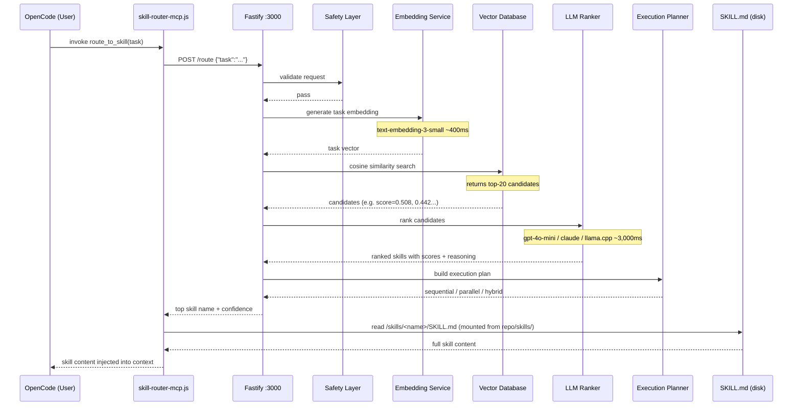

# Skills — An AI Skill Routing System

265 expert skills for AI coding agents, with a built-in routing engine that automatically selects and injects the right skill into your AI's context before it answers. No manual `/skill` commands — just ask, and the right expertise loads itself.

```
You → "review this Python code for security issues"
         ↓
   route_to_skill()  [auto-fires on every task]
         ↓
   embed → vector search → LLM re-rank → coding-security-review/SKILL.md
         ↓
   Full expert skill injected into context — AI answers as a security reviewer
```

---

## Quick Start

**With OpenAI (recommended):**

```bash
git clone https://github.com/paulpas/skills
cd skills
OPENAI_API_KEY=sk-... ./install-skill-router.sh --integrate-opencode
```

Restart OpenCode. Every task you type now automatically routes to the most relevant skill.

**No API key? Use a local model:**

```bash
./install-skill-router.sh \
  --provider llamacpp \
  --embedding-provider llamacpp \
  --llamacpp-url http://localhost:8080
```

> llama.cpp must serve both `/v1/chat/completions` and `/v1/embeddings`. No `OPENAI_API_KEY` required.

---

## How It Works

Every time OpenCode receives a task, the `route_to_skill` MCP tool fires automatically:



### Latency

| Stage | Time |
|---|---|
| Safety check | ~1 ms |
| Task embedding (OpenAI) | ~400 ms |
| Vector similarity search | ~1 ms |
| LLM re-ranking (gpt-4o-mini) | ~3,000 ms |
| Skill file read | ~1 ms |
| **Total end-to-end** | **~3.5 s** |

> Using a local llama.cpp model drops the LLM step to ~200–800 ms depending on hardware.

---

## Monitoring

| What | Command |
|---|---|
| Skill accesses (MCP side) | `tail -f ~/.config/opencode/skill-router-mcp.log \| grep 'SKILL ACCESS'` |
| Full routing pipeline (Docker) | `docker logs -f skill-router 2>&1 \| grep -E 'Route result\|Vector search'` |
| Routing history (JSON) | `curl -s http://localhost:3000/access-log \| python3 -m json.tool` |
| Service health | `curl -s http://localhost:3000/health` |

---

## The Skills Library

265 skills across 5 domains, organized in `skills/`. Each skill is a `SKILL.md` file with YAML frontmatter — the routing engine reads these directly.

```
skills-repo/
├── skills/                         ← all skill definitions live here
│   ├── agent-confidence-based-selector/
│   │   └── SKILL.md
│   ├── cncf-prometheus/
│   │   ├── SKILL.md
│   │   └── references/             ← optional sub-documents
│   ├── coding-code-review/
│   │   └── SKILL.md
│   ├── trading-risk-stop-loss/
│   │   └── SKILL.md
│   └── programming-algorithms/
│       └── SKILL.md
├── agent-skill-routing-system/     ← the HTTP routing service
├── README.md
├── SKILL_FORMAT_SPEC.md
├── reformat_skills.py
└── install-skill-router.sh
```

### Domain Prefixes

| Prefix | Description |
|---|---|
| `agent-*` | AI agent orchestration patterns (task decomposition, routing, planning) |
| `cncf-*` | CNCF cloud-native project reference (Kubernetes, Prometheus, Helm, etc.) |
| `coding-*` | Software engineering patterns (code review, TDD, FastAPI, Pydantic, etc.) |
| `trading-*` | Algorithmic trading implementation (risk management, execution, ML, backtesting) |
| `programming-*` | Algorithm and language reference material |

---

### Agent Orchestration

- [agent-confidence-based-selector](./skills/agent-confidence-based-selector/SKILL.md) — Selects the most appropriate skill based on confidence scores and relevance metrics
- [agent-dependency-graph-builder](./skills/agent-dependency-graph-builder/SKILL.md) — Builds and maintains dependency graphs for task execution
- [agent-dynamic-replanner](./skills/agent-dynamic-replanner/SKILL.md) — Dynamically adjusts execution plans based on real-time feedback and changing conditions
- [agent-goal-to-milestones](./skills/agent-goal-to-milestones/SKILL.md) — Translates high-level goals into actionable milestones
- [agent-multi-skill-executor](./skills/agent-multi-skill-executor/SKILL.md) — Orchestrates execution of multiple skills in sequence with dependency management
- [agent-parallel-skill-runner](./skills/agent-parallel-skill-runner/SKILL.md) — Executes multiple skills concurrently with synchronization and result collection
- [agent-task-decomposition-engine](./skills/agent-task-decomposition-engine/SKILL.md) — Decomposes complex tasks into manageable subtasks for specialized skills

---

### CNCF Cloud Native

#### Architecture & Best Practices

- [cncf-architecture-best-practices](./skills/cncf-architecture-best-practices/SKILL.md) — Production-grade Kubernetes: service mesh, CNI, GitOps, CI/CD, observability, security, networking, and scaling
- [cncf-networking-osi](./skills/cncf-networking-osi/SKILL.md) — OSI Model networking for cloud-native — all 7 layers with CNCF project mappings

#### Application Definition & Build

- [cncf-argo](./skills/cncf-argo/SKILL.md) — Kubernetes-native workflow, CI/CD, and governance
- [cncf-artifact-hub](./skills/cncf-artifact-hub/SKILL.md) — Repository for Kubernetes Helm, Falco, OPA, and more
- [cncf-backstage](./skills/cncf-backstage/SKILL.md) — Developer portal for microservices
- [cncf-buildpacks](./skills/cncf-buildpacks/SKILL.md) — Source code to container images without Dockerfiles
- [cncf-dapr](./skills/cncf-dapr/SKILL.md) — Distributed application runtime
- [cncf-helm](./skills/cncf-helm/SKILL.md) — The Kubernetes package manager
- [cncf-kubevela](./skills/cncf-kubevela/SKILL.md) — Kubernetes application platform
- [cncf-kubevirt](./skills/cncf-kubevirt/SKILL.md) — Virtualization on Kubernetes
- [cncf-operator-framework](./skills/cncf-operator-framework/SKILL.md) — Build and manage Kubernetes operators with standardized patterns

#### Container Runtime

- [cncf-containerd](./skills/cncf-containerd/SKILL.md) — Open and reliable container runtime
- [cncf-cri-o](./skills/cncf-cri-o/SKILL.md) — OCI-compliant container runtime for Kubernetes
- [cncf-krustlet](./skills/cncf-krustlet/SKILL.md) — Kubernetes runtime patterns and best practices
- [cncf-lima](./skills/cncf-lima/SKILL.md) — Container runtime patterns and best practices

#### Container Registry

- [cncf-dragonfly](./skills/cncf-dragonfly/SKILL.md) — P2P file distribution
- [cncf-harbor](./skills/cncf-harbor/SKILL.md) — Container registry
- [cncf-zot](./skills/cncf-zot/SKILL.md) — Cloud-native container registry patterns

#### Networking & Service Mesh

- [cncf-calico](./skills/cncf-calico/SKILL.md) — Cloud-native network security
- [cncf-cilium](./skills/cncf-cilium/SKILL.md) — eBPF-based cloud-native networking
- [cncf-cni](./skills/cncf-cni/SKILL.md) — Container Network Interface for Linux containers
- [cncf-container-network-interface-cni](./skills/cncf-container-network-interface-cni/SKILL.md) — CNI architecture patterns
- [cncf-contour](./skills/cncf-contour/SKILL.md) — Service proxy patterns
- [cncf-emissary-ingress](./skills/cncf-emissary-ingress/SKILL.md) — Kubernetes ingress controller
- [cncf-envoy](./skills/cncf-envoy/SKILL.md) — High-performance edge/middle/service proxy
- [cncf-grpc](./skills/cncf-grpc/SKILL.md) — Remote procedure call patterns
- [cncf-istio](./skills/cncf-istio/SKILL.md) — Connect, secure, control, and observe services
- [cncf-kong](./skills/cncf-kong/SKILL.md) — API gateway patterns
- [cncf-kong-ingress-controller](./skills/cncf-kong-ingress-controller/SKILL.md) — Kong Ingress Controller for Kubernetes
- [cncf-kuma](./skills/cncf-kuma/SKILL.md) — Service mesh patterns
- [cncf-linkerd](./skills/cncf-linkerd/SKILL.md) — Lightweight service mesh

#### Observability

- [cncf-cortex](./skills/cncf-cortex/SKILL.md) — Distributed, horizontally scalable Prometheus
- [cncf-fluentd](./skills/cncf-fluentd/SKILL.md) — Unified logging layer for cloud-native environments
- [cncf-jaeger](./skills/cncf-jaeger/SKILL.md) — Distributed tracing
- [cncf-open-telemetry](./skills/cncf-open-telemetry/SKILL.md) — OpenTelemetry architecture patterns
- [cncf-opentelemetry](./skills/cncf-opentelemetry/SKILL.md) — Vendor-neutral tracing, metrics, and logs framework
- [cncf-prometheus](./skills/cncf-prometheus/SKILL.md) — Monitoring system and time series database
- [cncf-thanos](./skills/cncf-thanos/SKILL.md) — High-availability Prometheus with long-term storage

#### Scheduling & Orchestration

- [cncf-crossplane](./skills/cncf-crossplane/SKILL.md) — Kubernetes-native multi-cloud infrastructure control plane
- [cncf-fluid](./skills/cncf-fluid/SKILL.md) — Kubernetes-native data acceleration for data-intensive apps
- [cncf-karmada](./skills/cncf-karmada/SKILL.md) — Multi-cluster orchestration
- [cncf-keda](./skills/cncf-keda/SKILL.md) — Event-driven autoscaling
- [cncf-knative](./skills/cncf-knative/SKILL.md) — Serverless on Kubernetes
- [cncf-kubeflow](./skills/cncf-kubeflow/SKILL.md) — ML on Kubernetes
- [cncf-kubernetes](./skills/cncf-kubernetes/SKILL.md) — Production-grade container scheduling and management
- [cncf-volcano](./skills/cncf-volcano/SKILL.md) — Batch scheduling infrastructure for Kubernetes
- [cncf-wasmcloud](./skills/cncf-wasmcloud/SKILL.md) — WebAssembly-based distributed applications platform

#### Security & Compliance

- [cncf-cert-manager](./skills/cncf-cert-manager/SKILL.md) — Certificate management for Kubernetes
- [cncf-falco](./skills/cncf-falco/SKILL.md) — Cloud-native runtime security
- [cncf-in-toto](./skills/cncf-in-toto/SKILL.md) — Supply chain security patterns
- [cncf-keycloak](./skills/cncf-keycloak/SKILL.md) — Identity and access management
- [cncf-kubescape](./skills/cncf-kubescape/SKILL.md) — Kubernetes security scanning
- [cncf-kyverno](./skills/cncf-kyverno/SKILL.md) — Kubernetes policy engine
- [cncf-notary-project](./skills/cncf-notary-project/SKILL.md) — Content trust and supply chain security
- [cncf-oathkeeper](./skills/cncf-oathkeeper/SKILL.md) — Identity and access proxy
- [cncf-open-policy-agent-opa](./skills/cncf-open-policy-agent-opa/SKILL.md) — Policy as code
- [cncf-openfga](./skills/cncf-openfga/SKILL.md) — Fine-grained authorization
- [cncf-openfeature](./skills/cncf-openfeature/SKILL.md) — Vendor-neutral feature flagging
- [cncf-ory-hydra](./skills/cncf-ory-hydra/SKILL.md) — OAuth 2.0 / OpenID Connect server
- [cncf-ory-kratos](./skills/cncf-ory-kratos/SKILL.md) — Cloud-native identity management
- [cncf-spiffe](./skills/cncf-spiffe/SKILL.md) — Secure production identity framework
- [cncf-spire](./skills/cncf-spire/SKILL.md) — SPIFFE implementation for real-world deployments
- [cncf-the-update-framework-tuf](./skills/cncf-the-update-framework-tuf/SKILL.md) — Secure software update framework

#### Storage

- [cncf-cubefs](./skills/cncf-cubefs/SKILL.md) — Distributed high-performance file system
- [cncf-longhorn](./skills/cncf-longhorn/SKILL.md) — Cloud-native storage patterns
- [cncf-rook](./skills/cncf-rook/SKILL.md) — Cloud-native storage orchestration for Kubernetes

#### Streaming & Messaging

- [cncf-cloudevents](./skills/cncf-cloudevents/SKILL.md) — Cloud-native event streaming patterns
- [cncf-nats](./skills/cncf-nats/SKILL.md) — Cloud-native messaging
- [cncf-strimzi](./skills/cncf-strimzi/SKILL.md) — Apache Kafka for cloud-native environments

#### Database & Key-Value

- [cncf-coredns](./skills/cncf-coredns/SKILL.md) — DNS server that chains plugins
- [cncf-etcd](./skills/cncf-etcd/SKILL.md) — Distributed key-value store
- [cncf-tikv](./skills/cncf-tikv/SKILL.md) — Distributed transactional key-value database
- [cncf-vitess](./skills/cncf-vitess/SKILL.md) — Horizontal scaling for MySQL

#### CI/CD & GitOps

- [cncf-flux](./skills/cncf-flux/SKILL.md) — GitOps for Kubernetes
- [cncf-openkruise](./skills/cncf-openkruise/SKILL.md) — Advanced Kubernetes workload management
- [cncf-tekton](./skills/cncf-tekton/SKILL.md) — Cloud-native pipeline resource

#### Automation & Edge

- [cncf-chaosmesh](./skills/cncf-chaosmesh/SKILL.md) — Chaos engineering platform for Kubernetes
- [cncf-cloud-custodian](./skills/cncf-cloud-custodian/SKILL.md) — Rules engine for cloud infrastructure management
- [cncf-flatcar-container-linux](./skills/cncf-flatcar-container-linux/SKILL.md) — Container-optimized Linux
- [cncf-kubeedge](./skills/cncf-kubeedge/SKILL.md) — Edge computing with Kubernetes
- [cncf-kserve](./skills/cncf-kserve/SKILL.md) — Model serving on Kubernetes
- [cncf-litmus](./skills/cncf-litmus/SKILL.md) — Cloud-native chaos engineering
- [cncf-metal3-io](./skills/cncf-metal3-io/SKILL.md) — Bare metal provisioning patterns
- [cncf-opencost](./skills/cncf-opencost/SKILL.md) — Kubernetes cost monitoring
- [cncf-openyurt](./skills/cncf-openyurt/SKILL.md) — Extending Kubernetes to edge scenarios

#### Process & Documentation

- [cncf-process-architecture](./skills/cncf-process-architecture/SKILL.md) — Create or update `ARCHITECTURE.md` for CNCF projects
- [cncf-process-incident-response](./skills/cncf-process-incident-response/SKILL.md) — Incident response plan: detection, triage, communication, post-incident review
- [cncf-process-releases](./skills/cncf-process-releases/SKILL.md) — Release process, versioning policy, and cadence documentation
- [cncf-process-security-policy](./skills/cncf-process-security-policy/SKILL.md) — Vulnerability reporting, disclosure timeline, and supported versions

---

### Coding Patterns

- [coding-code-review](./skills/coding-code-review/SKILL.md) — Bugs, security vulnerabilities, code smells, and architectural concerns with prioritized feedback
- [coding-conviction-scoring](./skills/coding-conviction-scoring/SKILL.md) — Trade confidence and risk assessment scoring
- [coding-data-normalization](./skills/coding-data-normalization/SKILL.md) — Typed dataclasses for ticker/trade/orderbook with exchange-specific parsing
- [coding-event-bus](./skills/coding-event-bus/SKILL.md) — Async pub/sub event bus with typed events and singleton initialization
- [coding-event-driven-architecture](./skills/coding-event-driven-architecture/SKILL.md) — Event-driven architecture for real-time systems: pub/sub, signal flow, strategy base
- [coding-fastapi-patterns](./skills/coding-fastapi-patterns/SKILL.md) — FastAPI structure: typed error hierarchy, exception handlers, CORS, request timing
- [coding-git-branching-strategies](./skills/coding-git-branching-strategies/SKILL.md) — Git Flow, GitHub Flow, Trunk-Based Development, and feature flag strategies
- [coding-juice-shop](./skills/coding-juice-shop/SKILL.md) — OWASP Juice Shop: web application security testing guide
- [coding-markdown-best-practices](./skills/coding-markdown-best-practices/SKILL.md) — Markdown syntax rules, common pitfalls, and documentation consistency
- [coding-pydantic-config](./skills/coding-pydantic-config/SKILL.md) — Pydantic config with frozen models, nested hierarchy, TOML/env parsing
- [coding-pydantic-models](./skills/coding-pydantic-models/SKILL.md) — Pydantic frozen data models: enums, annotated constraints, validators, computed properties
- [coding-security-review](./skills/coding-security-review/SKILL.md) — Security vulnerabilities: injection, XSS, insecure deserialization, misconfigurations
- [coding-strategy-base](./skills/coding-strategy-base/SKILL.md) — Abstract base strategy pattern with initialization guards and typed abstract methods
- [coding-test-driven-development](./skills/coding-test-driven-development/SKILL.md) — TDD and BDD with pytest, unit tests, mocking, and test pyramid principles
- [coding-websocket-manager](./skills/coding-websocket-manager/SKILL.md) — WebSocket state machine with exponential backoff and message routing

---

### Trading AI & ML

- [trading-ai-anomaly-detection](./skills/trading-ai-anomaly-detection/SKILL.md) — Detect anomalous market behavior, outliers, and potential manipulation
- [trading-ai-explainable-ai](./skills/trading-ai-explainable-ai/SKILL.md) — Explainable AI for understanding and trusting trading model decisions
- [trading-ai-feature-engineering](./skills/trading-ai-feature-engineering/SKILL.md) — Create actionable trading features from raw market data
- [trading-ai-hyperparameter-tuning](./skills/trading-ai-hyperparameter-tuning/SKILL.md) — Optimize model configurations for trading applications
- [trading-ai-live-model-monitoring](./skills/trading-ai-live-model-monitoring/SKILL.md) — Monitor production ML models for drift, decay, and performance degradation
- [trading-ai-llm-orchestration](./skills/trading-ai-llm-orchestration/SKILL.md) — LLM orchestration for trading analysis with structured output via instructor/pydantic
- [trading-ai-model-ensemble](./skills/trading-ai-model-ensemble/SKILL.md) — Combine multiple models for improved prediction accuracy
- [trading-ai-multi-asset-model](./skills/trading-ai-multi-asset-model/SKILL.md) — Model inter-asset relationships for portfolio and cross-asset strategies
- [trading-ai-news-embedding](./skills/trading-ai-news-embedding/SKILL.md) — Process news text using NLP embeddings for trading signals
- [trading-ai-order-flow-analysis](./skills/trading-ai-order-flow-analysis/SKILL.md) — Analyze order flow to detect market pressure and anticipate price moves
- [trading-ai-regime-classification](./skills/trading-ai-regime-classification/SKILL.md) — Detect current market regime for adaptive trading strategies
- [trading-ai-reinforcement-learning](./skills/trading-ai-reinforcement-learning/SKILL.md) — Reinforcement learning for automated trading agents and policy optimization
- [trading-ai-sentiment-analysis](./skills/trading-ai-sentiment-analysis/SKILL.md) — AI-powered sentiment from news, social media, and political figures
- [trading-ai-sentiment-features](./skills/trading-ai-sentiment-features/SKILL.md) — Extract market sentiment from news, social media, and analyst reports
- [trading-ai-synthetic-data](./skills/trading-ai-synthetic-data/SKILL.md) — Generate synthetic financial data for training and testing models
- [trading-ai-time-series-forecasting](./skills/trading-ai-time-series-forecasting/SKILL.md) — Time series forecasting for price prediction and market analysis
- [trading-ai-volatility-prediction](./skills/trading-ai-volatility-prediction/SKILL.md) — Forecast volatility for risk management and option pricing

---

### Trading Backtesting

- [trading-backtest-drawdown-analysis](./skills/trading-backtest-drawdown-analysis/SKILL.md) — Maximum drawdown, recovery time, and Value-at-Risk analysis
- [trading-backtest-lookahead-bias](./skills/trading-backtest-lookahead-bias/SKILL.md) — Prevent lookahead bias through strict causality enforcement and time-based validation
- [trading-backtest-position-exits](./skills/trading-backtest-position-exits/SKILL.md) — Exit strategies, trailing stops, and take-profit mechanisms
- [trading-backtest-position-sizing](./skills/trading-backtest-position-sizing/SKILL.md) — Fixed fractional, Kelly criterion, and volatility-adjusted sizing
- [trading-backtest-sharpe-ratio](./skills/trading-backtest-sharpe-ratio/SKILL.md) — Sharpe ratio and risk-adjusted performance metrics
- [trading-backtest-walk-forward](./skills/trading-backtest-walk-forward/SKILL.md) — Walk-forward optimization for robust strategy validation

---

### Trading Data Pipelines

- [trading-data-alternative-data](./skills/trading-data-alternative-data/SKILL.md) — Alternative data ingestion: news, social media, on-chain data sources
- [trading-data-backfill-strategy](./skills/trading-data-backfill-strategy/SKILL.md) — Strategic backfill for populating historical data
- [trading-data-candle-data](./skills/trading-data-candle-data/SKILL.md) — OHLCV processing, timeframe management, and validation
- [trading-data-enrichment](./skills/trading-data-enrichment/SKILL.md) — Add context to raw trading data
- [trading-data-feature-store](./skills/trading-data-feature-store/SKILL.md) — Feature storage and management for ML trading models
- [trading-data-lake](./skills/trading-data-lake/SKILL.md) — Data lake architecture for trading data storage
- [trading-data-order-book](./skills/trading-data-order-book/SKILL.md) — Order book handling, spread calculation, liquidity measurement
- [trading-data-stream-processing](./skills/trading-data-stream-processing/SKILL.md) — Streaming data processing for real-time signals and analytics
- [trading-data-time-series-database](./skills/trading-data-time-series-database/SKILL.md) — Time-series database queries and optimization for financial data
- [trading-data-validation](./skills/trading-data-validation/SKILL.md) — Data validation and quality assurance for trading pipelines

---

### Trading Exchange Integration

- [trading-exchange-ccxt-patterns](./skills/trading-exchange-ccxt-patterns/SKILL.md) — CCXT patterns: error handling, rate limiting, and state management
- [trading-exchange-failover-handling](./skills/trading-exchange-failover-handling/SKILL.md) — Automated failover and redundancy for exchange connectivity
- [trading-exchange-health](./skills/trading-exchange-health/SKILL.md) — Exchange health monitoring and connectivity status
- [trading-exchange-market-data-cache](./skills/trading-exchange-market-data-cache/SKILL.md) — High-performance caching for market data with low latency
- [trading-exchange-order-book-sync](./skills/trading-exchange-order-book-sync/SKILL.md) — Order book synchronization and state management
- [trading-exchange-order-execution-api](./skills/trading-exchange-order-execution-api/SKILL.md) — Order execution and management API
- [trading-exchange-rate-limiting](./skills/trading-exchange-rate-limiting/SKILL.md) — Rate limiting and circuit breaker patterns for exchange APIs
- [trading-exchange-trade-reporting](./skills/trading-exchange-trade-reporting/SKILL.md) — Real-time trade reporting and execution analytics
- [trading-exchange-websocket-handling](./skills/trading-exchange-websocket-handling/SKILL.md) — Real-time market data: connection management, data aggregation, error recovery
- [trading-exchange-websocket-streaming](./skills/trading-exchange-websocket-streaming/SKILL.md) — Real-time market data streaming and processing

---

### Trading Execution Algorithms

- [trading-execution-order-book-impact](./skills/trading-execution-order-book-impact/SKILL.md) — Order book impact measurement and market microstructure analysis
- [trading-execution-rate-limiting](./skills/trading-execution-rate-limiting/SKILL.md) — Rate limiting and exchange API management for robust execution
- [trading-execution-slippage-modeling](./skills/trading-execution-slippage-modeling/SKILL.md) — Slippage estimation, simulation, and fee modeling
- [trading-execution-twap](./skills/trading-execution-twap/SKILL.md) — Time-weighted average price for executing large orders with minimal impact
- [trading-execution-twap-vwap](./skills/trading-execution-twap-vwap/SKILL.md) — TWAP and VWAP: institutional-grade order execution
- [trading-execution-vwap](./skills/trading-execution-vwap/SKILL.md) — Volume-weighted average price execution

---

### Trading Paper Trading

- [trading-paper-commission-model](./skills/trading-paper-commission-model/SKILL.md) — Commission model and fee structure simulation
- [trading-paper-fill-simulation](./skills/trading-paper-fill-simulation/SKILL.md) — Fill simulation models for order execution probability
- [trading-paper-market-impact](./skills/trading-paper-market-impact/SKILL.md) — Market impact modeling and order book simulation
- [trading-paper-performance-attribution](./skills/trading-paper-performance-attribution/SKILL.md) — Performance attribution for trading strategy decomposition
- [trading-paper-realistic-simulation](./skills/trading-paper-realistic-simulation/SKILL.md) — Realistic paper trading with market impact and execution fees
- [trading-paper-slippage-model](./skills/trading-paper-slippage-model/SKILL.md) — Slippage modeling and execution simulation

---

### Trading Risk Management

- [trading-risk-correlation-risk](./skills/trading-risk-correlation-risk/SKILL.md) — Correlation breakdown and portfolio diversification risk
- [trading-risk-drawdown-control](./skills/trading-risk-drawdown-control/SKILL.md) — Maximum drawdown control and equity preservation
- [trading-risk-kill-switches](./skills/trading-risk-kill-switches/SKILL.md) — Multi-layered kill switches at account, strategy, market, and infrastructure levels
- [trading-risk-liquidity-risk](./skills/trading-risk-liquidity-risk/SKILL.md) — Liquidity assessment and trade execution risk
- [trading-risk-position-sizing](./skills/trading-risk-position-sizing/SKILL.md) — Kelly criterion, volatility adjustments, and edge-based sizing
- [trading-risk-stop-loss](./skills/trading-risk-stop-loss/SKILL.md) — Stop loss strategies for risk management
- [trading-risk-stress-testing](./skills/trading-risk-stress-testing/SKILL.md) — Stress test scenarios and portfolio resilience analysis
- [trading-risk-tail-risk](./skills/trading-risk-tail-risk/SKILL.md) — Tail risk management and extreme event protection
- [trading-risk-value-at-risk](./skills/trading-risk-value-at-risk/SKILL.md) — Value at Risk calculations for portfolio risk management

---

### Trading Technical Analysis

- [trading-technical-cycle-analysis](./skills/trading-technical-cycle-analysis/SKILL.md) — Market cycles and periodic patterns in price movement
- [trading-technical-false-signal-filtering](./skills/trading-technical-false-signal-filtering/SKILL.md) — False signal filtering for robust technical analysis
- [trading-technical-indicator-confluence](./skills/trading-technical-indicator-confluence/SKILL.md) — Indicator confluence validation for confirming trading signals
- [trading-technical-intermarket-analysis](./skills/trading-technical-intermarket-analysis/SKILL.md) — Cross-market relationships and asset class correlations
- [trading-technical-market-microstructure](./skills/trading-technical-market-microstructure/SKILL.md) — Order book dynamics and order flow analysis
- [trading-technical-momentum-indicators](./skills/trading-technical-momentum-indicators/SKILL.md) — RSI, MACD, stochastic oscillators, and momentum analysis
- [trading-technical-price-action-patterns](./skills/trading-technical-price-action-patterns/SKILL.md) — Candlestick and chart patterns for price movement prediction
- [trading-technical-regime-detection](./skills/trading-technical-regime-detection/SKILL.md) — Market regime detection for adaptive trading strategies
- [trading-technical-statistical-arbitrage](./skills/trading-technical-statistical-arbitrage/SKILL.md) — Pair trading and cointegration-based arbitrage
- [trading-technical-support-resistance](./skills/trading-technical-support-resistance/SKILL.md) — Technical levels where price tends to pause or reverse
- [trading-technical-trend-analysis](./skills/trading-technical-trend-analysis/SKILL.md) — Trend identification, classification, and continuation
- [trading-technical-volatility-analysis](./skills/trading-technical-volatility-analysis/SKILL.md) — Volatility measurement, forecasting, and risk assessment
- [trading-technical-volume-profile](./skills/trading-technical-volume-profile/SKILL.md) — Volume analysis for understanding market structure

---

### Trading Fundamentals

- [trading-fundamentals-market-regimes](./skills/trading-fundamentals-market-regimes/SKILL.md) — Market regime detection and adaptation across changing conditions
- [trading-fundamentals-market-structure](./skills/trading-fundamentals-market-structure/SKILL.md) — Market structure and trading participants analysis
- [trading-fundamentals-risk-management-basics](./skills/trading-fundamentals-risk-management-basics/SKILL.md) — Position sizing, stop-loss, and system-level risk controls
- [trading-fundamentals-trading-edge](./skills/trading-fundamentals-trading-edge/SKILL.md) — Finding and maintaining competitive advantage in trading systems
- [trading-fundamentals-trading-plan](./skills/trading-fundamentals-trading-plan/SKILL.md) — Trading plan structure and risk management framework
- [trading-fundamentals-trading-psychology](./skills/trading-fundamentals-trading-psychology/SKILL.md) — Emotional discipline, cognitive bias awareness, and operational integrity

---

### Programming

- [programming-algorithms](./skills/programming-algorithms/SKILL.md) — Algorithm selection guide: time/space trade-offs, input characteristics, and problem constraints

---

## Adding Skills

Create `skills/<domain>-<topic>/SKILL.md` following the format in [SKILL_FORMAT_SPEC.md](./SKILL_FORMAT_SPEC.md). Run `python reformat_skills.py` to apply standard frontmatter. The router picks up new skills automatically on the next reload.

```yaml
---
name: my-skill-name
description: One-line description of what this skill does
license: MIT
compatibility: opencode
metadata:
  version: "1.0.0"
  domain: coding
  role: implementation
  scope: implementation
  output-format: code
  triggers: keyword1, keyword2, keyword3
---
```

Good triggers are specific and task-oriented (`kubernetes, k8s, pod, deployment, kubectl`) rather than generic (`cloud, infrastructure, ops`).

---

## Full Documentation

→ [`agent-skill-routing-system/README.md`](./agent-skill-routing-system/README.md) — complete router docs: all environment variables, API reference, provider configuration, safety features, and local model setup.
