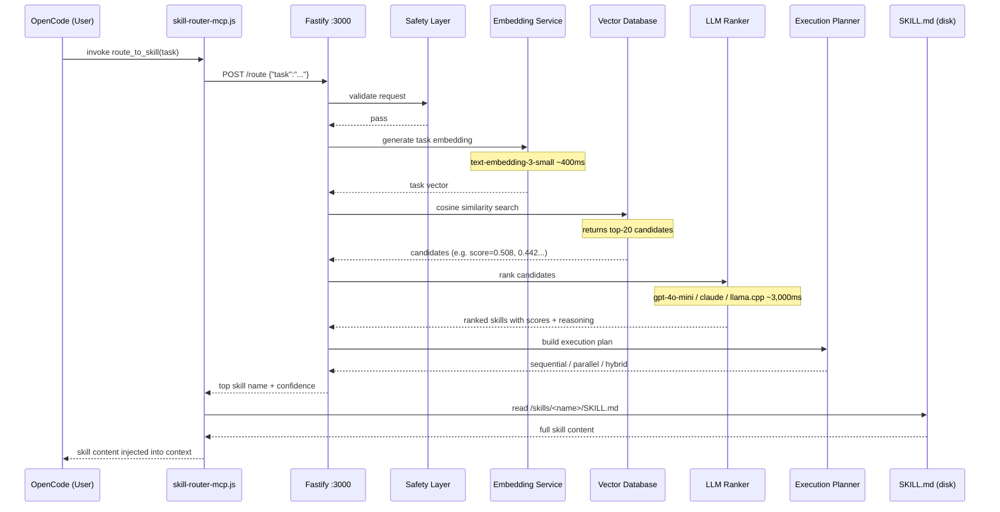
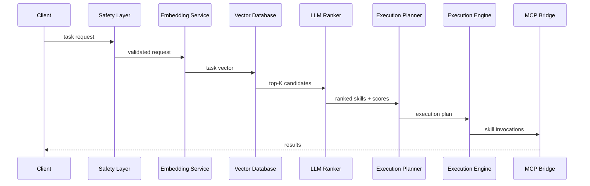

# Agentic Skill Routing System

Production-grade agentic skill orchestration for OpenCode. Routes tasks to the right skill using semantic embeddings + LLM ranking, then executes via MCP tools.

## Overview

- **Routes Tasks Semantically** — OpenAI embeddings + cosine similarity finds top-K candidate skills; `gpt-4o-mini` ranks and explains the final selection
- **Plans Execution** — generates sequential, parallel, or hybrid execution plans based on skill dependencies
- **Executes Safely** — schema validation, prompt-injection filtering, retry logic, timeout management
- **Observes Everything** — structured JSON logs with full task-ID correlation

## How It Works — Request Flow

Every time OpenCode receives a task, the skill router automatically selects the most relevant skill and injects its full content into the AI's context. Here is the complete flow with real timing data:



### Typical Latency Breakdown

| Stage                          | Time     |
|-------------------------------|----------|
| Safety check                  | ~1ms     |
| Task embedding (OpenAI)       | ~400ms   |
| Vector similarity search      | ~1ms     |
| LLM re-ranking (gpt-4o-mini)  | ~3,000ms |
| Skill file read               | ~1ms     |
| **Total end-to-end**          | **~3.5s** |

> With a local llama.cpp model for both embeddings and ranking, the LLM step drops to ~200-800ms depending on hardware.

### What the Logs Show

**Docker logs** (`docker logs -f skill-router`) — server-side pipeline:

```
[00:38:10] [Main]       → POST /route
[00:38:10] [Main]       Routing task  {"task":"review Python code..."}
[00:38:10] [Router]     Vector search candidates  {"candidateCount":4,"topCandidates":[{"name":"coding-security-review","similarity":0.508},...]}
[00:38:10] [LLMRanker]  Sending ranking request to LLM  {"provider":"openai","model":"gpt-4o-mini","candidates":["coding-security-review",...]}
[00:38:13] [LLMRanker]  LLM ranking result  {"durationMs":3069,"rankings":[{"skill":"coding-security-review","score":0.95,"reason":"Directly matches..."}]}
[00:38:13] [Router]     Selected skills  {"selectedSkills":[{"name":"coding-security-review","score":0.95,"role":"primary"}]}
[00:38:13] [Router]     Routing completed  {"confidence":0.935,"latencyMs":3463}
[00:38:13] [Main]       ← POST /route  {"status":200,"durationMs":3465}
```

**MCP wrapper logs** (`tail -f ~/.config/opencode/skill-router-mcp.log`) — client-side:

```
[INFO]  tool called  {"tool":"route_to_skill","task":"review Python code..."}
[DEBUG] → POST /route
[DEBUG] ← POST /route  {"status":200,"durationMs":2036}
[INFO]  skill resolved  {"skill":"coding-security-review","fileFound":true,"totalMatches":2}
```

## Architecture



## Remote Skill Loading

The router automatically clones `https://github.com/paulpas/skills` on startup and refreshes it hourly. Skills are cached to a persistent Docker named volume (`skill-router-cache`) so they survive container restarts.

**Priority**: Local mount (`/skills`) always wins over remote skills. If the same skill name exists in both, the local version is used.

### New endpoints

| Endpoint | Description |
|---|---|
| `GET /skills` | List all loaded skills with name, category, tags, source file |
| `POST /reload` | Trigger immediate GitHub pull + skill reload |

```bash
# Trigger manual reload
curl -X POST http://localhost:3000/reload

# List all loaded skills
curl http://localhost:3000/skills | jq '.total'
```

### Disable remote loading

```bash
./install-skill-router.sh --no-github
```

### GitHub token (optional)

Unauthenticated GitHub access is rate-limited to 60 requests/hour. For frequent syncs or private repos:

```bash
GITHUB_TOKEN=ghp_... ./install-skill-router.sh
```

## OpenCode Integration

The skill router exposes a native MCP tool (`route_to_skill`) that OpenCode calls automatically at the start of every task to load the most relevant skill.

### Prerequisites
- OpenCode installed and configured at `~/.config/opencode/opencode.json`
- Skill router running (see Quick Start above)

### Automated Setup

Run the installer with the `--integrate-opencode` flag:
```bash
./install-skill-router.sh --integrate-opencode
```

This will:
1. Create `~/.config/opencode/skill-router-api.md` — API reference injected into every OpenCode session
2. Create `~/.config/opencode/skill-router-mcp.js` — MCP stdio wrapper (Node.js, stdlib-only)
3. Register the MCP server in `~/.config/opencode/opencode.json`

### Manual Setup

If you prefer to configure manually:

**Step 1** — Copy the MCP wrapper script:
```bash
cp skill-router-mcp.js ~/.config/opencode/skill-router-mcp.js
chmod +x ~/.config/opencode/skill-router-mcp.js
```

**Step 2** — Add the MCP server to `~/.config/opencode/opencode.json`:

Open `~/.config/opencode/opencode.json` in your editor and add a `skill-router` entry to the `mcp` object. **Important**: OpenCode's MCP local server schema requires `command` as a single `string[]` array (binary + args merged) — separate `args` and `type: "local"` with `transport` field are not valid:

```json
{
  "mcp": {
    "skill-router": {
      "type": "local",
      "command": ["node", "/home/YOUR_USER/.config/opencode/skill-router-mcp.js"],
      "enabled": true
    }
  }
}
```

Replace `YOUR_USER` with your username (e.g. `paulpas`).

**Step 3** — Add the API reference to `instructions`:
```json
{
  "instructions": [
    "/home/YOUR_USER/.config/opencode/skill-router-api.md"
  ]
}
```

**Step 4** — Restart OpenCode. The `route_to_skill` tool will appear in the available MCP tools.

### Verifying the Integration

In an OpenCode chat session:
```
What MCP tools do you have? Then use route_to_skill to find the best skill for reviewing Python code for security issues.
```

Expected output:
- `route_to_skill` listed as an available tool ✅
- AI calls `route_to_skill("review Python code for security issues")` ✅  
- Full `SKILL.md` content returned and followed ✅

### Watching Logs

To monitor skill routing in real time (two terminals):

```bash
# Terminal 1 — Docker service logs
docker logs -f skill-router

# Terminal 2 — MCP wrapper logs
tail -f ~/.config/opencode/skill-router-mcp.log
```

### Troubleshooting

| Problem | Fix |
|---|---|
| `Invalid input mcp.skill-router` | Ensure `command` is a `string[]` array with binary + script merged, no separate `args` or `transport` field |
| `route_to_skill` not in tool list | Restart OpenCode after editing `opencode.json` |
| Tool returns "router not running" | Run `docker start skill-router` or `./install-skill-router.sh` |
| Skill content missing | Check `docker logs skill-router` — ensure `ready: true` and 200+ skills loaded |

## Quick Start (Docker)

The recommended way to run the router is via Docker with the skills repo mounted:

```bash
# From the root of the skills repo
OPENAI_API_KEY=sk-... ./install-skill-router.sh
```

The install script:
1. Builds the Docker image (`skill-router:latest`)
2. Mounts the skills repo at `/skills` inside the container
3. Starts the container with `--restart unless-stopped`
4. Creates a systemd user service for boot persistence
5. Polls `/health` to confirm startup

### OpenCode Config Integration (optional)

```bash
OPENAI_API_KEY=sk-... ./install-skill-router.sh --integrate-opencode
```

Adds `skill-router-api.md` to your `~/.config/opencode/opencode.json` instructions array so OpenCode knows how to call the router.

## Provider Configuration

### OpenAI (default)
```bash
OPENAI_API_KEY=sk-... ./install-skill-router.sh
```

### Anthropic
```bash
OPENAI_API_KEY=sk-... \
ANTHROPIC_API_KEY=sk-ant-... \
./install-skill-router.sh --provider anthropic --model claude-3-5-haiku-20241022
```
Embeddings still use OpenAI (Anthropic has no embedding API). `OPENAI_API_KEY` remains required.

### Local llama.cpp
```bash
# Assumes llama.cpp server running on host port 8080
./install-skill-router.sh \
  --provider llamacpp \
  --model local-model \
  --llamacpp-url http://host.docker.internal:8080 \
  --embedding-provider llamacpp
```
No `OPENAI_API_KEY` required. llama.cpp must serve both `/v1/chat/completions` and `/v1/embeddings`.

## Skill Format

Skills are loaded exclusively from `SKILL.md` files. The router scans the mounted skills directory recursively for every file named `SKILL.md` and parses its YAML frontmatter.

### Required Frontmatter Fields

```yaml
---
name: my-skill-name
description: One-line description of what this skill does
license: MIT
compatibility: opencode
metadata:
  version: "1.0.0"
  domain: agent          # agent | cncf | coding | trading | programming
  role: implementation   # orchestration | reference | implementation | review
  scope: implementation  # orchestration | infrastructure | implementation | review
  output-format: code    # analysis | manifests | code | report
  triggers: keyword1, keyword2, keyword3
---
```

### Field Mapping to Router

| SKILL.md field | Router field | Notes |
|---|---|---|
| `name` | `name` | Unique skill identifier |
| `description` | `description` | Used in embedding text |
| `metadata.domain` | `category` | Groups skills by domain |
| `metadata.triggers` | `tags[]` | Comma-separated → array, drives semantic search |
| `metadata.role` | tag | Added to tags array |
| `metadata.scope` | tag | Added to tags array |

### Writing Good Triggers

Triggers are the most important field for routing accuracy. Use concrete nouns and verbs that describe the tasks the skill handles:

```yaml
# Good — specific, task-oriented
triggers: kubernetes, k8s, pod, deployment, kubectl, cluster, container

# Poor — generic, low signal
triggers: cloud, infrastructure, ops
```

See [`SKILL_FORMAT_SPEC.md`](../SKILL_FORMAT_SPEC.md) for the complete authoring guide.

## Environment Variables

| Variable | Default | Description |
|---|---|---|
| `OPENAI_API_KEY` | *(required for openai/embeddings)* | OpenAI API key |
| `ANTHROPIC_API_KEY` | — | Anthropic API key (required when `LLM_PROVIDER=anthropic`) |
| `LLM_PROVIDER` | `openai` | LLM ranking provider: `openai` · `anthropic` · `llamacpp` |
| `LLM_MODEL` | provider default | Model name (e.g. `gpt-4o-mini`, `claude-3-5-haiku-20241022`, `local-model`) |
| `EMBEDDING_PROVIDER` | `openai` | Embedding provider: `openai` · `llamacpp` |
| `EMBEDDING_MODEL` | `text-embedding-3-small` | Embedding model name |
| `LLAMACPP_BASE_URL` | `http://host.docker.internal:8080` | llama.cpp server base URL |
| `SKILLS_DIRECTORY` | `/skills` | Path to skills repo root inside the container |
| `PORT` | `3000` | HTTP server port |
| `GITHUB_SKILLS_ENABLED` | `true` | Set to `false` to disable GitHub remote loading |
| `GITHUB_SKILLS_REPO` | `https://github.com/paulpas/skills` | Remote skills repository URL |
| `SKILL_CACHE_DIR` | `/cache/skills` | Local path inside container for cached repo |
| `SKILL_SYNC_INTERVAL` | `3600` | Seconds between GitHub syncs |
| `GITHUB_TOKEN` | — | Optional GitHub token for higher rate limits |

## API Reference

### `GET /health`

```bash
curl http://localhost:3000/health
```
```json
{"status":"healthy","timestamp":"2026-04-23T10:00:00.000Z","version":"1.0.0"}
```

### `GET /stats`

```bash
curl http://localhost:3000/stats
```
```json
{
  "skills": {"totalSkills": 195, "categories": 5, "tags": 312},
  "mcpTools": {"totalTools": 5, "enabledTools": ["shell","file","http","kubectl","log_fetch"]}
}
```

### `POST /route`

Route a task to the best matching skills.

```bash
curl -X POST http://localhost:3000/route \
  -H "Content-Type: application/json" \
  -d '{
    "task": "Deploy a Kubernetes manifest to production",
    "context": {"environment": "production"},
    "constraints": {"maxSkills": 3, "latencyBudgetMs": 5000}
  }'
```

**Response:**
```json
{
  "taskId": "req_abc123",
  "selectedSkills": [
    {"name": "cncf-kubernetes", "score": 0.95, "role": "primary"}
  ],
  "executionPlan": {"strategy": "sequential", "steps": [...]},
  "confidence": 0.92,
  "reasoningSummary": "cncf-kubernetes matches deployment task",
  "latencyMs": 1250
}
```

### `POST /execute`

Execute skills with the provided inputs.

```bash
curl -X POST http://localhost:3000/execute \
  -H "Content-Type: application/json" \
  -d '{
    "task": "Deploy manifest",
    "inputs": {"manifest": "..."},
    "skills": ["cncf-kubernetes"]
  }'
```

## Docker Management

```bash
# View logs
docker logs skill-router --tail 50 -f

# Restart after updating skills
docker restart skill-router

# Stop
docker stop skill-router

# Rebuild image after code changes
cd agent-skill-routing-system
docker build -t skill-router:latest .
docker restart skill-router
```

## Project Structure

```
agent-skill-routing-system/
├── src/
│   ├── core/
│   │   ├── SkillRegistry.ts      # Loads **/SKILL.md, parses frontmatter
│   │   ├── Router.ts             # Orchestrates routing pipeline
│   │   ├── ExecutionEngine.ts    # Runs skills with retry/timeout
│   │   ├── ExecutionPlanner.ts   # sequential/parallel/hybrid plans
│   │   ├── SafetyLayer.ts        # Injection filtering, schema validation
│   │   └── types.ts              # Core type definitions
│   ├── embedding/
│   │   ├── EmbeddingService.ts   # OpenAI text-embedding-3-small
│   │   └── VectorDatabase.ts     # Cosine similarity search
│   ├── llm/
│   │   └── LLMRanker.ts          # gpt-4o-mini candidate ranking
│   ├── mcp/
│   │   ├── MCPBridge.ts          # MCP tool manager
│   │   └── tools/                # shell, file, http, kubectl, log_fetch
│   ├── observability/
│   │   └── Logger.ts             # Structured JSON logging
│   └── index.ts                  # HTTP server entry point
├── config/
│   └── default.json              # Default config (overridden by env vars)
├── samples/
│   └── skill-definitions/
│       └── SKILL.md              # Example skill in correct format
├── Dockerfile                    # Multi-stage node:20-alpine build
├── .dockerignore
├── install-skill-router.sh       # ← Start here
├── package.json
├── tsconfig.json
└── README.md
```

## Safety Features

- **Prompt Injection Filtering** — blocks injection attempts, command injection, SQL injection patterns
- **Schema Validation** — skill inputs validated before execution
- **Skill Allowlist** — optional: restrict execution to approved skill names only

## Development

```bash
cd agent-skill-routing-system
npm install
npm run build     # compile TypeScript
npm start         # start server (reads SKILLS_DIRECTORY env)
npm run dev       # ts-node watch mode
```

## License

MIT
