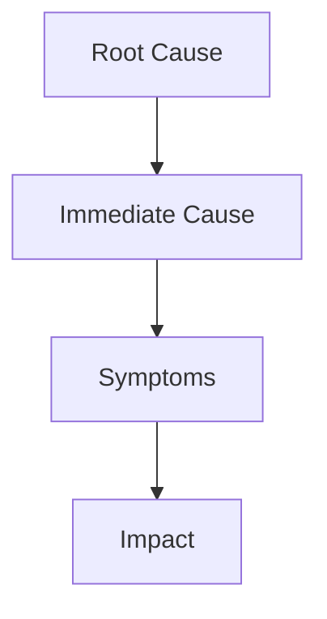

# Incident Response Runbooks

Implements comprehensive incident response procedures for cloud-native environments including Kubernetes clusters, microservices architectures, and infrastructure-as-code deployments. Provides structured workflows for detection, triage, communication, resolution, and post-incident review following SRE and ITIL best practices.

## TL;DR Checklist

- [ ] **Detection**: Verify alert validity, gather initial evidence, identify affected systems
- [ ] **Triage**: Classify severity (P1-P4), assign incident commander, activate communication channels
- [ ] **Communication**: Establish ICS structure, create incident channel, send initial status update
- [ ] **Resolution**: Execute runbook steps, document all actions, apply remediation procedures
- [ ] **Escalation**: Identify escalation triggers, contact on-call engineers, activate secondary teams
- [ ] **Recovery**: Verify service restoration, monitor for recurrence, update runbooks if needed
- [ ] **Post-incident**: Schedule blameless postmortem, collect timeline data, write incident report
- [ ] **Documentation**: Archive incident data, update runbooks, create follow-up action items

---

## When to Use

Use this skill when:

- Creating new incident response procedures for a Kubernetes cluster or cloud-native service
- Responding to a production incident requiring structured escalation and communication
- Developing runbooks for common failure modes (pod crashes, network partitions, data corruption)
- Establishing an incident command system for multi-team incident response
- Documenting post-incident review procedures for compliance and learning
- Building automation that integrates with incident response workflows

---

## When NOT to Use

Avoid this skill for:

- **Simple debugging tasks** — Use `cncf-kubernetes-debugging` skill for single-issue troubleshooting
- **Security vulnerability disclosures** — Use `cncf-security-compliance` skill for CVE handling and patching
- **Database administration tasks** — Use `agent-database-admin` skill for DB-specific procedures
- **Performance tuning without incident** — Performance optimization doesn't require full incident procedures
- **Scheduled maintenance windows** — Maintenance has different coordination requirements than incidents

---

## Core Workflow

1. **Detection and Validation** — Confirm alert validity, gather initial evidence, identify scope. **Checkpoint:** Verify alert isn't a false positive before proceeding.

2. **Triage and Severity Classification** — Classify incident severity (P1-P4), assign incident commander, activate communication channels. **Checkpoint:** All team members have received initial notification.

3. **Communication Setup** — Establish ICS structure, create incident channel, send status updates. **Checkpoint:** Communication channels are established and team has acknowledgment.

4. **Resolution Execution** — Execute runbook steps, document actions in timeline, apply remediation. **Checkpoint:** Root cause identified and remediation steps are working.

5. **Escalation** — Identify escalation triggers, contact on-call, activate secondary teams. **Checkpoint:** Escalated parties have acknowledged and are engaged.

6. **Post-Incident Review** — Schedule blameless postmortem, collect data, write report. **Checkpoint:** Postmortem scheduled within 72 hours of resolution.

---

## Implementation Patterns

### Pattern 1: Incident Severity Classification

Incident severity determines response priority, communication channels, and escalation procedures.

```bash
# Severity classification criteria
# P1: Full service outage affecting all users
# P2: Degraded service affecting major functionality
# P3: Minor degradation affecting limited functionality
# P4: Non-impacting issues (informational)

function classify_severity() {
    local affected_users=$1
    local service_impact=$2
    local data_loss=$3
    
    # P1 criteria
    if [[ "$affected_users" == "all" ]] || [[ "$data_loss" == "yes" ]]; then
        echo "P1"
        return
    fi
    
    # P2 criteria
    if [[ "$affected_users" == "majority" ]] || [[ "$service_impact" == "critical" ]]; then
        echo "P2"
        return
    fi
    
    # P3 criteria
    if [[ "$affected_users" == "minority" ]] || [[ "$service_impact" == "degraded" ]]; then
        echo "P3"
        return
    fi
    
    echo "P4"
}
```

**❌ BAD — No severity classification, ad-hoc response**

```yaml
# ❌ BAD — Missing severity, unclear escalation path
incident:
  title: "Database connection issues"
  status: active
  # No severity level set
  # No commander assigned
  # Communication plan missing
```

**✅ GOOD — Severity-based response with clear escalation**

```yaml
# ✅ GOOD — Severity classification with escalation
severity: P2
incident_commander: john.doe@company.com
status: active
communication:
  slack_channel: "#inc-p2-database-2024-05-15"
  status_page: https://status.company.com/incidents/INC-2024-05-15-001
escalation:
  tier1_ack_timeout: 5m
  tier2_notify: 15m
  executive_notify: 30m
```

---

### Pattern 2: Incident Command System (ICS) Setup

Establish ICS structure for multi-team incident response.

```bash
# ICS Roles Setup Script
# Run at incident activation

#!/bin/bash
# incident-ics-setup.sh

set -euo pipefail

# Default values
IC="${IC:-oncall@company.com}"
IO="${IO:-operations@company.com}"
LC="${LC:-leads@company.com}"
COMMS="${COMMS:-comms@company.com}"
PLANNER="${PLANNER:-planning@company.com}"

# Create ICS channel
create_ics_channel() {
    local severity=$1
    local channel_name="#inc-${severity}-$(date +%Y-%m-%d-%H%M%S)"
    
    echo "Creating ICS channel: $channel_name"
    
    # Slack workspace
    if command -v slack &> /dev/null; then
        slack channel create "$channel_name" --privacy private
    fi
    
    # Invite key personnel
    slack channel invite "$channel_name" "$IC" "$IO" "$LC" "$COMMS" "$PLANNER"
    
    echo "ICS channel created: $channel_name"
}

# Set initial ICS configuration
init_ics() {
    local severity=$1
    
    echo "Initializing ICS for severity: $severity"
    
    # Create incident channel
    create_ics_channel "$severity"
    
    # Publish ICS structure to channel
    cat << EOF | slack message "$channel_name"
### Incident Command Structure
- Incident Commander: \`$IC\`
- Operations Lead: \`$IO\`
- Logistics Lead: \`$LC\`
- Communications: \`$COMMS\`
- Planning Lead: \`$PLANNER\`

### Severity: $severity
### Status: ACTIVE
### Channel created: $(date)
EOF
}

init_ics "P2"
```

---

### Pattern 3: Initial Notification and Acknowledgment

Automated notification system with acknowledgment tracking.

```bash
# incident-notification.sh
# Send initial incident notification to all stakeholders

#!/bin/bash
# Send notifications to on-call teams

declare -A NOTIFICATION_CONFIG=(
    ["slack_webhook"]="https://hooks.slack.com/services/XXXXX/XXXXX/XXXXX"
    ["pagerduty_key"]="PAGERDUTY_INTEGRATION_KEY"
    ["email_recipients"]="oncall@company.com,platform@company.com,devops@company.com"
    ["max_retries"]=3
    ["retry_delay"]=30
)

send_slack_notification() {
    local severity=$1
    local message=$2
    local channel=$3
    
    curl -X POST -H 'Content-type: application/json' \
        --data "{
            \"channel\": \"$channel\",
            \"attachments\": [{
                \"color\": \"$(severity_to_color $severity)\",
                \"title\": \"INCIDENT: $severity - $(date '+%Y-%m-%d %H:%M:%S')\",
                \"text\": \"$message\",
                \"footer\": \"Incident Response System\",
                \"ts\": $(date +%s)
            }]
        }" "$SLACK_WEBHOOK_URL"
}

send_pagerduty_alert() {
    local severity=$1
    local description=$2
    local service_key=$PAGERDUTY_SERVICE_KEY
    
    curl -X POST -H 'Content-type: application/json' \
        --data "{
            \"routing_key\": \"$service_key\",
            \"event_action\": \"trigger\",
            \"payload\": {
                \"summary\": \"$description\",
                \"severity\": \"$(pd_severity $severity)\",
                \"source\": \"incident-response-system\"
            }
        }" "https://events.pagerduty.com/v2/enqueue"
}

send_email_notification() {
    local severity=$1
    local subject=$2
    local body=$3
    
    for recipient in ${EMAIL_RECIPIENTS//,/ }; do
        mail -s "[INCIDENT][${severity}] ${subject}" "$recipient" <<< "$body"
    done
}

acknowledge_all() {
    local incident_id=$1
    local timeout=$2
    
    echo "Waiting for acknowledgments with ${timeout}s timeout..."
    
    local start_time=$(date +%s)
    while true; do
        local ack_count=$(get_acknowledged_count "$incident_id")
        local total_count=$(get_expected_recipients "$incident_id")
        
        if [[ "$ack_count" -eq "$total_count" ]]; then
            echo "All recipients acknowledged"
            return 0
        fi
        
        local elapsed=$(($(date +%s) - start_time))
        if [[ "$elapsed" -gt "$timeout" ]]; then
            echo "Timeout waiting for acknowledgments"
            return 1
        fi
        
        sleep 5
    done
}

acknowledge_all "INC-2024-05-15-001" 300
```

---

### Pattern 4: Communication Status Updates

Automated status updates to keep stakeholders informed.

```bash
# incident-status-update.sh
# Generate and distribute incident status updates

#!/bin/bash

# Status template
generate_status_update() {
    local incident_id=$1
    local status=$2
    local impact=$3
    local timeline=$4
    
    cat << EOF
### ${incident_id} Status Update - $(date '+%Y-%m-%d %H:%M:%S')

**Current Status:** ${status}

**Impact:** ${impact}

**Timeline:**
${timeline}

**Next Update:** In 15 minutes or when status changes

---
*This is an automated status update from the Incident Response System*
EOF
}

# Status transition rules
update_status() {
    local incident_id=$1
    local new_status=$2
    
    # Validate status transition
    case "$new_status" in
        "identified")
            if [[ "$CURRENT_STATUS" != "detected" ]]; then
                echo "Invalid status transition"
                return 1
            fi
            ;;
        "in-progress")
            if [[ "$CURRENT_STATUS" != "identified" ]]; then
                echo "Invalid status transition"
                return 1
            fi
            ;;
        "resolved")
            if [[ "$CURRENT_STATUS" != "in-progress" ]]; then
                echo "Invalid status transition"
                return 1
            fi
            ;;
        *)
            echo "Unknown status: $new_status"
            return 1
            ;;
    esac
    
    # Update status in incident database
    update_incident_record "$incident_id" "status" "$new_status"
    
    # Send notification
    send_status_update "$incident_id" "$new_status"
}

# Status transition states
# detected -> identified -> in-progress -> resolved
# detected -> identified -> cancelled (if not an incident)
# in-progress -> monitoring (verify stability before declaring resolved)

declare -A STATUS_TRANSITIONS=(
    ["detected"]="identified"
    ["identified"]="in-progress cancelled"
    ["in-progress"]="resolved monitoring"
    ["resolved"]="closed"
    ["monitoring"]="resolved closed"
    ["cancelled"]="closed"
)
```

---

### Pattern 5: Escalation Triggers and Procedures

Automated escalation based on time, severity, or lack of response.

```bash
# escalation-manager.sh
# Manage incident escalation based on predefined rules

#!/bin/bash

# Escalation configuration
declare -A ESCALATION_RULES=(
    ["P1"]["tier1_timeout"]="5m"
    ["P1"]["tier2_notify"]="10m"
    ["P1"]["executive_notify"]="15m"
    ["P2"]["tier1_timeout"]="10m"
    ["P2"]["tier2_notify"]="20m"
    ["P2"]["executive_notify"]="30m"
    ["P3"]["tier1_timeout"]="30m"
    ["P3"]["tier2_notify"]="1h"
    ["P4"]["tier1_timeout"]="1h"
)

# Escalation contact lists
declare -A TIER1_CONTACTS=(
    ["platform"]="platform-oncall@company.com"
    ["database"]="db-oncall@company.com"
    ["security"]="security-oncall@company.com"
)

declare -A TIER2_CONTACTS=(
    ["platform"]="platform-lead@company.com,staff-engineer@company.com"
    ["database"]="dba-team@company.com"
    ["security"]="security-team@company.com"
)

# Check escalation conditions
check_escalation() {
    local incident_id=$1
    local current_time=$2
    
    local severity=$(get_incident_severity "$incident_id")
    local elapsed=$(calculate_elapsed_time "$incident_id")
    local tier1_ack=$(get_tier1_acknowledged "$incident_id")
    
    # Check tier1 timeout
    local tier1_timeout=$(get_config_value "P1" "tier1_timeout")
    if [[ "$tier1_ack" == "false" ]] && [[ "$elapsed" -gt "$tier1_timeout" ]]; then
        escalate_to_tier2 "$incident_id"
    fi
    
    # Check executive notification
    local exec_notify=$(get_config_value "$severity" "executive_notify")
    if [[ "$elapsed" -gt "$exec_notify" ]] && [[ "$status" != "resolved" ]]; then
        notify_executives "$incident_id"
    fi
}

# Escalate to next tier
escalate_to_tier2() {
    local incident_id=$1
    
    echo "Escalating $incident_id to Tier 2"
    
    # Get affected domain
    local domain=$(get_incident_domain "$incident_id")
    
    # Notify tier2 contacts
    local tier2_contacts="${TIER2_CONTACTS[$domain]}"
    for contact in ${tier2_contacts//,/ }; do
        send_notification "$contact" "ESCALATION" "$incident_id"
    done
    
    # Update incident record
    update_incident_record "$incident_id" "escalated_tier2" "true"
    log_escalation "$incident_id" "tier2" "$(date '+%Y-%m-%d %H:%M:%S')"
}

# Executive notification template
notify_executives() {
    local incident_id=$1
    local severity=$(get_incident_severity "$incident_id")
    
    if [[ "$severity" != "P1" ]] && [[ "$severity" != "P2" ]]; then
        return
    fi
    
    # Executive list
    local executives="cto@company.com,cio@company.com,ciso@company.com"
    
    # Generate executive summary
    local summary=$(generate_executive_summary "$incident_id")
    
    for exec in ${executives//,/ }; do
        send_executive_notification "$exec" "$incident_id" "$summary"
    done
}

# Automated escalation loop
run_escalation_loop() {
    echo "Starting escalation monitoring..."
    
    while true; do
        local active_incidents=$(get_active_incidents)
        
        for incident in $active_incidents; do
            check_escalation "$incident" "$(date +%s)"
        done
        
        sleep 60
    done
}
```

---

### Pattern 6: Runbook Automation and Execution

Automated runbook execution with state tracking and rollback capability.

```bash
# runbook-executor.sh
# Execute incident runbooks with state management

#!/bin/bash

# Runbook registry
declare -A RUNBOOKS=(
    ["database-outage"]="runbooks/database-outage.yml"
    ["pod-crash-loop"]="runbooks/pod-crash-loop.yml"
    ["network-partition"]="runbooks/network-partition.yml"
    ["memory-exhaustion"]="runbooks/memory-exhaustion.yml"
)

# Execute runbook step
execute_step() {
    local step=$1
    local runbook_path=$2
    
    # Read step configuration
    local description=$(yq '.steps[step].description' "$runbook_path")
    local action=$(yq '.steps[step].action' "$runbook_path")
    local rollback=$(yq '.steps[step].rollback' "$runbook_path" || echo "")
    
    echo "Executing: $description"
    
    # Execute action
    if eval "$action"; then
        echo "Step completed successfully"
        return 0
    else
        echo "Step failed, attempting rollback..."
        
        if [[ -n "$rollback" ]]; then
            if eval "$rollback"; then
                echo "Rollback successful"
                return 1
            else
                echo "Rollback failed!"
                return 2
            fi
        else
            return 1
        fi
    fi
}

# Runbook execution state
declare -A RUNBOOK_STATE=(
    ["current_step"]=0
    ["total_steps"]=0
    ["started_at"]=""
    ["completed_steps"]=()
    ["failed_steps"]=()
    ["rollback_required"]=false
)

# Main runbook executor
run_runbook() {
    local runbook_name=$1
    local incident_id=$2
    
    # Get runbook path
    local runbook_path="${RUNBOOKS[$runbook_name]}"
    
    if [[ -z "$runbook_path" ]] || [[ ! -f "$runbook_path" ]]; then
        echo "Runbook not found: $runbook_name"
        return 1
    fi
    
    # Initialize state
    RUNBOOK_STATE["current_step"]=0
    RUNBOOK_STATE["total_steps"]=$(yq '.steps | length' "$runbook_path")
    RUNBOOK_STATE["started_at"]=$(date '+%Y-%m-%d %H:%M:%S')
    RUNBOOK_STATE["completed_steps"]=()
    RUNBOOK_STATE["failed_steps"]=()
    
    echo "Starting runbook: $runbook_name"
    echo "Total steps: ${RUNBOOK_STATE["total_steps"]}"
    
    # Execute each step
    local step=0
    local total_steps=${RUNBOOK_STATE["total_steps"]}
    
    while [[ $step -lt $total_steps ]]; do
        if execute_step "$step" "$runbook_path"; then
            RUNBOOK_STATE["completed_steps"]+=("$step")
            step=$((step + 1))
            RUNBOOK_STATE["current_step"]=$step
        else
            RUNBOOK_STATE["failed_steps"]+=("$step")
            RUNBOOK_STATE["rollback_required"]=true
            
            # Check if rollback is possible
            if [[ ${#RUNBOOK_STATE["completed_steps"]} -gt 0 ]]; then
                echo "Rolling back previous steps..."
                rollback_runbook "$runbook_path" "${RUNBOOK_STATE["completed_steps"][@]}"
            fi
            
            return 1
        fi
    done
    
    echo "Runbook completed successfully"
    return 0
}

# Rollback runbook steps
rollback_runbook() {
    local runbook_path=$1
    shift
    local completed_steps=("$@")
    
    # Execute steps in reverse order
    for ((i=${#completed_steps[@]}-1; i>=0; i--)); do
        local step=${completed_steps[$i]}
        local rollback_cmd=$(yq ".steps[$step].rollback // ''" "$runbook_path")
        
        if [[ -n "$rollback_cmd" ]]; then
            echo "Rolling back step $step..."
            if ! eval "$rollback_cmd"; then
                echo "WARNING: Rollback failed for step $step"
            fi
        fi
    done
}

# Runbook health check
check_runbook_health() {
    local runbook_name=$1
    
    # Check if runbook file exists
    local runbook_path="${RUNBOOKS[$runbook_name]}"
    
    if [[ -z "$runbook_path" ]] || [[ ! -f "$runbook_path" ]]; then
        echo "ERROR: Runbook not found: $runbook_name"
        return 1
    fi
    
    # Validate YAML syntax
    if ! yq '.' "$runbook_path" > /dev/null 2>&1; then
        echo "ERROR: Invalid YAML in runbook: $runbook_name"
        return 1
    fi
    
    # Check required fields
    local required_fields=("steps" "description" "severity")
    for field in "${required_fields[@]}"; do
        if ! yq -e ".$field" "$runbook_path" > /dev/null 2>&1; then
            echo "ERROR: Missing required field: $field in runbook: $runbook_name"
            return 1
        fi
    done
    
    echo "Runbook $runbook_name is valid"
    return 0
}

# Example runbook YAML structure
cat << 'RUNBOOK' > runbooks/database-outage.yml
# Database Outage Runbook
# Severity: P1
# Estimated resolution time: 30 minutes

description: "Restore database connectivity after outage"
severity: P1
estimated_resolution_minutes: 30

steps:
  - name: "Verify database connection status"
    description: "Check if database is accessible"
    action: |
      kubectl exec -n database db-checker -- ping -c 3 db-primary.database.svc.cluster.local
    rollback: ""
    expected_duration_seconds: 10

  - name: "Check database pod status"
    description: "Verify database pods are running"
    action: |
      kubectl get pods -n database -l app=db-primary
    rollback: ""
    expected_duration_seconds: 5

  - name: "Check database logs for errors"
    description: "Examine database logs for root cause"
    action: |
      kubectl logs -n database db-primary-0 --tail=100 | grep -i error
    rollback: ""
    expected_duration_seconds: 15

  - name: "Restart database if needed"
    description: "Restart database pod if unhealthy"
    action: |
      kubectl delete pod -n database db-primary-0
    rollback: |
      echo "Cannot rollback pod deletion, will recreate from cluster"
    expected_duration_seconds: 60

  - name: "Verify replication is healthy"
    description: "Check database replication status"
    action: |
      kubectl exec -n database db-primary-0 -- psql -c "SELECT * FROM pg_stat_replication;"
    rollback: ""
    expected_duration_seconds: 10

  - name: "Run database health check"
    description: "Execute database health check suite"
    action: |
      kubectl exec -n database health-checker -- /health-check.sh
    rollback: ""
    expected_duration_seconds: 30
RUNBOOK
```

---

### Pattern 7: Incident Timeline and Documentation

Automated timeline tracking and incident documentation.

```bash
# incident-timeline.sh
# Track incident timeline and generate documentation

#!/bin/bash

# Timeline event structure
# timestamp: ISO 8601 format
# type: detection|acknowledgment|escalation|action|resolution|communication
# actor: user/system that performed the action
# description: human-readable event description
# metadata: additional context (JSON)

# Timeline storage
declare -a TIMELINE_EVENTS=()

# Add timeline event
add_timeline_event() {
    local incident_id=$1
    local event_type=$2
    local actor=$3
    local description=$4
    local metadata=$5
    
    local event={
        "timestamp": "$(date -Iseconds)",
        "type": "$event_type",
        "actor": "$actor",
        "description": "$description",
        "metadata": "${metadata:-{}}"
    }
    
    TIMELINE_EVENTS+=("$event")
    log_to_timeline_file "$incident_id" "$event"
}

# Log to timeline file
log_to_timeline_file() {
    local incident_id=$1
    local event=$2
    local timeline_file="/var/log/incidents/${incident_id}/timeline.json"
    
    # Ensure directory exists
    mkdir -p "$(dirname "$timeline_file")"
    
    # Append event
    echo "$event" >> "$timeline_file"
}

# Generate incident report
generate_incident_report() {
    local incident_id=$1
    local report_file="/var/log/incidents/${incident_id}/report.md"
    
    local start_time=$(get_incident_start_time "$incident_id")
    local resolution_time=$(get_incident_resolution_time "$incident_id")
    local severity=$(get_incident_severity "$incident_id")
    
    cat > "$report_file" << EOF
# Incident Report: ${incident_id}

**Severity:** ${severity}
**Status:** Resolved
**Start Time:** ${start_time}
**Resolution Time:** ${resolution_time}

## Executive Summary

[Executive summary goes here]

## Timeline

| Time | Event | Actor | Details |
|------|-------|-------|---------|
EOF
    
    # Add timeline events
    for event in "${TIMELINE_EVENTS[@]}"; do
        local ts=$(echo "$event" | jq -r '.timestamp')
        local type=$(echo "$event" | jq -r '.type')
        local actor=$(echo "$event" | jq -r '.actor')
        local desc=$(echo "$event" | jq -r '.description' | tr '|' '-')
        
        echo "| ${ts} | ${type} | ${actor} | ${desc} |" >> "$report_file"
    done
    
    cat >> "$report_file" << EOF

## Root Cause Analysis

[Root cause analysis goes here]

## Impact Assessment

- Affected services: [list]
- Affected users: [estimate]
- Data loss: [none/minimal/significant]
- Business impact: [description]

## Resolution Steps

1. [Step 1]
2. [Step 2]
3. [Step 3]

## Lessons Learned

1. [Lesson 1]
2. [Lesson 2]
3. [Lesson 3]

## Follow-up Actions

- [ ] Action item 1
- [ ] Action item 2
- [ ] Action item 3

## Related Documentation

- Runbook: [link]
- Monitoring dashboard: [link]
- Postmortem: [link]
EOF
}

# Timeline query function
query_timeline() {
    local incident_id=$1
    local event_type=$2
    local start_time=$3
    local end_time=$4
    
    local timeline_file="/var/log/incidents/${incident_id}/timeline.json"
    
    if [[ ! -f "$timeline_file" ]]; then
        echo "Timeline file not found"
        return 1
    fi
    
    # Filter events
    if [[ -n "$event_type" ]]; then
        jq -c ".[] | select(.type == \"$event_type\")" "$timeline_file"
    else
        cat "$timeline_file"
    fi
}

# Example timeline events for P1 incident
cat << 'TIMELINE_EXAMPLE'
Timeline Event Examples:

1. Detection Event:
{
  "timestamp": "2024-05-15T14:32:17+00:00",
  "type": "detection",
  "actor": "prometheus",
  "description": "Database connection pool exhausted - 100% utilization",
  "metadata": {
    "alert_name": "database_connection_pool_exhausted",
    "severity": "critical",
    "current_value": 100,
    "threshold": 90
  }
}

2. Acknowledgment Event:
{
  "timestamp": "2024-05-15T14:33:05+00:00",
  "type": "acknowledgment",
  "actor": "john.doe@company.com",
  "description": "Acknowledged P1 incident",
  "metadata": {
    "channel": "slack",
    "incident_commander": "john.doe@company.com"
  }
}

3. Action Event:
{
  "timestamp": "2024-05-15T14:35:22+00:00",
  "type": "action",
  "actor": "oncall-engineer",
  "description": "Restarted database pod db-primary-0",
  "metadata": {
    "command": "kubectl delete pod -n database db-primary-0",
    "pod_before": "Running",
    "pod_after": "Pending"
  }
}

4. Resolution Event:
{
  "timestamp": "2024-05-15T14:47:11+00:00",
  "type": "resolution",
  "actor": "john.doe@company.com",
  "description": "Service restored - database connection pool at 45%",
  "metadata": {
    "resolution_method": "pod_restart",
    "connection_pool_usage": 45,
    "affected_endpoints": 0
  }
}

5. Communication Event:
{
  "timestamp": "2024-05-15T14:34:00+00:00",
  "type": "communication",
  "actor": "comms@company.com",
  "description": "Initial incident status sent to stakeholders",
  "metadata": {
    "channel": "slack",
    "recipients": 150,
    "status_page_updated": true
  }
}
TIMELINE_EXAMPLE
```

---

### Pattern 8: Post-Incident Review and Blameless Postmortem

Automated post-incident review scheduling and blameless postmortem template.

```bash
# postmortem-manager.sh
# Manage post-incident review process

#!/bin/bash

# Post-incident review configuration
POSTMORTEM_CONFIG=(
    "max_delay_hours=72"
    "required_participants=incident_commander,operations_lead,technical_lead"
    "deadline_hours=72"
    "template_path=/templates/postmortem-template.md"
)

# Create postmortem ticket
create_postmortem_ticket() {
    local incident_id=$1
    
    local jira_project="INC"
    local summary="Postmortem: ${incident_id} - [Incident Title]"
    local description="Schedule post-incident review for ${incident_id}"
    local labels="postmortem,incident,${incident_id}"
    
    # Create Jira ticket
    local ticket=$(curl -s -X POST \
        -H "Authorization: Bearer $JIRA_TOKEN" \
        -H "Content-Type: application/json" \
        --data "{
            \"fields\": {
                \"project\": {\"key\": \"$jira_project\"},
                \"summary\": \"$summary\",
                \"description\": \"$description\",
                \"issuetype\": {\"name\": \"Incident Review\"},
                \"labels\": [$labels]
            }
        }" "$JIRA_URL/rest/api/2/issue")
    
    echo "$ticket" | jq -r '.key'
}

# Schedule postmortem meeting
schedule_postmortem() {
    local incident_id=$1
    local ticket_id=$2
    
    # Calculate review date (within 72 hours)
    local review_date=$(date -d "+2 days" '+%Y-%m-%d')
    local review_time="10:00"
    
    # Find participants
    local participants=$(get_postmortem_participants "$incident_id")
    
    # Create calendar event
    for participant in ${participants//,/ }; do
        send_calendar_invite "$participant" \
            "Postmortem: ${incident_id}" \
            "$review_date $review_time" \
            "$ticket_id"
    done
    
    echo "Postmortem scheduled: ${review_date} ${review_time}"
    echo "Participants: $participants"
}

# Blameless postmortem template
generate_postmortem_template() {
    local incident_id=$1
    local template_path=$2
    
    cat > "$template_path" << 'POSTMORTEM'
# Incident Postmortem: {INCIDENT_ID}

**Date:** {DATE}
**Incident Commander:** {IC_NAME}
**Severity:** {SEVERITY}
**Duration:** {DURATION}

---

## Executive Summary

A concise, high-level summary of what happened, when, and the impact. Focus on outcomes, not technical details.

---

## Timeline

| Time (UTC) | Event |
|------------|-------|
| {START_TIME} | Incident began - initial detection |
| {ACK_TIME} | Incident acknowledged |
| {ACTION_TIME} | First remediation action taken |
| {RESOLUTION_TIME} | Service restored |
| {VERIFICATION_TIME} | Verification completed |

---

## Root Cause Analysis

### Primary Cause

What was the fundamental technical issue that caused the incident?

### Contributing Factors

1. [Factor 1]
2. [Factor 2]
3. [Factor 3]

### Root Cause Tree



---

## Impact Assessment

### Services Affected

- Service 1
- Service 2

### User Impact

- Number of affected users: {ESTIMATE}
- Duration of impact: {DURATION}
- Data loss: {NONE/MINIMAL/SIGNIFICANT}

### Business Impact

{BUSINESS_IMPACT_DESCRIPTION}

---

## Detection and Response

### Detection

- How was the incident detected?
- Time to detection (TTD): {TIME}
- Alert effectiveness: {EFFECTIVENESS_RATING}

### Response

- Time to acknowledgment (TTA): {TIME}
- Time to resolution (TTR): {TIME}
- Response effectiveness: {EFFECTIVENESS_RATING}

---

## Resolution Steps

1. **Step 1:** {Description}
2. **Step 2:** {Description}
3. **Step 3:** {Description}

---

## Lessons Learned

### What Went Well

1. [Positive 1]
2. [Positive 2]

### What Went Wrong

1. [Issue 1]
2. [Issue 2]

### What We Learned

1. [Learning 1]
2. [Learning 2]

---

## Action Items

| ID | Action Item | Owner | Due Date | Status |
|----|-------------|-------|----------|--------|
| A1 | {Action} | {OWNER} | {DATE} | Open |
| A2 | {Action} | {OWNER} | {DATE} | Open |
| A3 | {Action} | {OWNER} | {DATE} | Open |

---

## Follow-up Schedule

- [ ] 1 week: Review action item progress
- [ ] 1 month: Verify fixes are effective
- [ ] 3 months: Comprehensive review of all action items

---

## Appendices

### Related Documentation

- Runbook: {LINK}
- Monitoring Dashboard: {LINK}
- Alert Configuration: {LINK}

### Technical Details

{ADDITIONAL_TECHNICAL_INFORMATION}

### Communication Log

| Time | Channel | Recipients | Message |
|------|---------|------------|---------|
| {TIME} | {CHANNEL} | {RECIPIENTS} | {MESSAGE} |

---

*This postmortem is written in a blameless manner. The focus is on understanding systemic factors and improving processes, not assigning individual blame.*
POSTMORTEM
}

# Postmortem completion checklist
check_postmortem_completion() {
    local incident_id=$1
    local postmortem_file="/var/log/incidents/${incident_id}/postmortem.md"
    
    local missing_items=()
    
    # Check required sections
    for section in "Executive Summary" "Timeline" "Root Cause Analysis" \
                   "Impact Assessment" "Lessons Learned" "Action Items"; do
        if ! grep -q "^## $section" "$postmortem_file"; then
            missing_items+=("$section")
        fi
    done
    
    if [[ ${#missing_items[@]} -gt 0 ]]; then
        echo "Missing sections:"
        for item in "${missing_items[@]}"; do
            echo "  - $item"
        done
        return 1
    fi
    
    # Check action items exist
    local action_item_count=$(grep -c "^\| - \[ \]" "$postmortem_file" || echo 0)
    if [[ "$action_item_count" -lt 3 ]]; then
        echo "Insufficient action items (minimum 3 required)"
        return 1
    fi
    
    echo "Postmortem complete"
    return 0
}

# Generate postmortem summary for executives
generate_executive_summary() {
    local incident_id=$1
    local severity=$(get_incident_severity "$incident_id")
    local duration=$(calculate_duration "$incident_id")
    local impact=$(get_business_impact "$incident_id")
    
    cat << EOF
### Executive Summary: ${incident_id}

**Severity:** ${severity}
**Duration:** ${duration}
**Business Impact:** ${impact}

A detailed postmortem has been scheduled within 72 hours. Key findings will be shared with stakeholders following the blameless review.

**Next Steps:**
1. Complete post-incident review
2. Implement action items from postmortem
3. Update runbooks and monitoring
4. Schedule follow-up review
EOF
}
```

---

## Constraints

### MUST DO

- **Classify severity immediately** — Determine P1-P4 within 5 minutes of detection to set appropriate response level
- **Establish ICS structure** — Assign Incident Commander, Operations Lead, and Communications within 10 minutes
- **Document everything in timeline** — Every action, decision, and communication must be recorded with timestamp
- **Use blameless language** — Focus on system and process factors, not individual blame in postmortems
- **Escalate based on time thresholds** — Don't wait for user complaints; escalate when P1/P2 timeouts are reached
- **Verify resolution with health checks** — Don't declare resolved without automated verification
- **Schedule postmortem within 72 hours** — Delayed postmortems lose accuracy and context
- **Update runbooks after each incident** — Turn lessons learned into automated runbook improvements

### MUST NOT DO

- **Never skip severity classification** — Even for minor incidents, establish a baseline for future comparison
- **Don't communicate via untracked channels** — All external communication must go through official channels (Slack, status page)
- **Don't declare resolved until verified** — Service restoration ≠ incident resolution; verify for 15+ minutes
- **Never assign blame in timeline** — Timeline records facts; postmortem analyzes system factors
- **Don't delay postmortem scheduling** — Memory fades quickly; schedule within 72 hours, conduct within 1 week
- **Never disable monitoring during incident** — Continue monitoring throughout incident; that's when you need it most
- **Don't create separate incident channels** — Use one channel per incident; fragmenting communication causes confusion
- **Don't leave action items open-ended** — Every action item must have owner, due date, and success criteria

---

## Output Template

When generating incident response documentation, include:

1. **Incident Metadata** — ID, severity, start time, resolution time, commander, status
2. **Timeline** — Chronological events with timestamps, actors, and descriptions
3. **Root Cause Analysis** — Primary cause, contributing factors, and root cause tree
4. **Impact Assessment** — Affected services, user count, duration, business impact
5. **Resolution Steps** — Step-by-step remediation actions taken
6. **Lessons Learned** — What went well, what went wrong, key takeaways
7. **Action Items** — Specific, owned, time-bound improvements to prevent recurrence
8. **Follow-up Schedule** — Checkpoints for action item progress and effectiveness verification

---

## Related Skills

| Skill | Purpose |
|---|---|
| `cncf-kubernetes-debugging` | Deep dive troubleshooting for specific Kubernetes issues; use this for root cause analysis after incident is contained |
| `cncf-security-compliance` | Security-specific incident handling including CVE response, compliance violations, and vulnerability management |
| `agent-database-admin` | Database-specific incident procedures including replication issues, connection pool problems, and backup recovery |

---

## References

### Industry Standards

- **SRE Book (Google)** - Site Reliability Engineering chapter on Postmortem Culture
- **ITIL Incident Management** - ITIL v4 incident management practices
- **NIST SP 800-61** - Computer Security Incident Handling Guide
- **Chaos Engineering** - Building resilience through controlled experiments

### CNCF Resources

- **CNCF SIG Security** - Security incident response guidelines
- **Kubernetes Incident Response** - K8s-specific incident patterns
- **Prometheus Alerting** - Best practices for alert configuration

### Templates and Tools

- **Jira Incident Template** - Standard incident tracking format
- **Status.io** - Status page integration for incident communication
- **Datadog Incident Management** - Observability-integrated incident response
- **PagerDuty Runbooks** - Runbook management and execution platform

### Example Runbooks

- **Database Outage** - Recovery procedures for primary/replica failures
- **Network Partition** - Handling split-brain scenarios in distributed systems
- **Pod Crash Loop** - Diagnosing and recovering from container crashes
- **Memory Exhaustion** - Handling OOM conditions and memory leaks

---

### Pattern 9: Kubernetes Cluster Failure Response

Procedures for handling cluster-wide failures including API server issues, etcd problems, and node failures.

```bash
# cluster-failure-response.sh
# Handle Kubernetes cluster-wide failures

#!/bin/bash

# Cluster failure severity levels
declare -A CLUSTER_FAILURE_TYPES=(
    ["api-server-down"]="CRITICAL"
    ["etcd-quorum-loss"]="CRITICAL"
    ["etcd-data-loss"]="CRITICAL"
    ["control-plane-node-failure"]="HIGH"
    ["worker-node-majority-loss"]="HIGH"
    ["network-policy-break"]="MEDIUM"
)

# Check cluster health
check_cluster_health() {
    # API server health
    if ! kubectl --request-timeout=10s get nodes &> /dev/null; then
        echo "ALERT: API server unreachable"
        return 1
    fi
    
    # etcd health
    local etcd_status=$(kubectl exec -n kube-system etcd-$(hostname) -- etcdctl endpoint health 2>/dev/null)
    if [[ "$etcd_status" != *"healthy"* ]]; then
        echo "ALERT: etcd unhealthy"
        return 1
    fi
    
    # Node status
    local ready_nodes=$(kubectl get nodes --no-headers 2>/dev/null | grep -c "Ready")
    local total_nodes=$(kubectl get nodes --no-headers 2>/dev/null | wc -l)
    
    if [[ "$ready_nodes" -lt "$((total_nodes / 2 + 1))" ]]; then
        echo "ALERT: Majority of nodes not ready"
        return 1
    fi
    
    echo "Cluster health: OK"
    return 0
}

# etcd backup procedure
etcd_backup() {
    local backup_dir="/var/etcd/backups/$(date +%Y%m%d_%H%M%S)"
    local endpoint="https://127.0.0.1:2379"
    
    mkdir -p "$backup_dir"
    
    # Get snapshot
    kubectl exec -n kube-system etcd-$(hostname) -- \
        etcdctl snapshot save "${backup_dir}/snapshot.db" \
        --endpoints="$endpoint" \
        --cacert="/etc/kubernetes/pki/etcd/ca.crt" \
        --cert="/etc/kubernetes/pki/etcd/healthcheck-client.crt" \
        --key="/etc/kubernetes/pki/etcd/healthcheck-client.key"
    
    # Backup manifests
    cp /etc/kubernetes/manifests/etcd.yaml "${backup_dir}/"
    
    echo "Backup completed: $backup_dir"
}

# etcd restore procedure
etcd_restore() {
    local snapshot_path=$1
    
    if [[ ! -f "$snapshot_path" ]]; then
        echo "ERROR: Snapshot file not found: $snapshot_path"
        return 1
    fi
    
    # Stop etcd
    kubectl delete pod -n kube-system etcd-$(hostname)
    
    # Restore snapshot
    etcdctl snapshot restore "$snapshot_path" \
        --data-dir="/var/lib/etcd-restore" \
        --initial-cluster="etcd-$(hostname)=https://127.0.0.1:2380" \
        --initial-cluster-token="etcd-cluster-$(date +%s)" \
        --initial-advertise-peer-urls="https://127.0.0.1:2380"
    
    # Update manifests
    cp /etc/kubernetes/manifests/etcd.yaml "${backup_dir}/etcd.yaml.bak"
    
    echo "etcd restore initiated. Restarting control plane..."
}

# API server failover
api_server_failover() {
    local failed_node=$1
    
    echo "Initiating API server failover for node: $failed_node"
    
    # Scale down failed node
    kubectl cordon "$failed_node"
    kubectl drain "$failed_node" --ignore-daemonsets --delete-emptydir-data --force
    
    # Restart API server on remaining nodes
    kubectl delete pod -n kube-system kube-apiserver-$(hostname)
    
    # Verify cluster health
    sleep 10
    check_cluster_health
}

# Worker node recovery
recover_worker_node() {
    local node=$1
    
    echo "Attempting to recover node: $node"
    
    # Check node status
    local node_status=$(kubectl get node "$node" -o jsonpath='{.status.conditions[?(@.type=="Ready")].status}')
    
    if [[ "$node_status" == "False" ]]; then
        # Check kubelet status
        kubectl debug node/"$node" -it --image=ubuntu:22.04 -- bash -c 'systemctl status kubelet || docker ps'
        
        # Attempt restart
        kubectl cordon "$node"
        kubectl drain "$node" --ignore-daemonsets --delete-emptydir-data --force
        kubectl uncordon "$node"
    fi
}
```

---

### Pattern 10: Network Partition Recovery

Procedures for handling network partitions and split-brain scenarios.

```bash
# network-partition-recovery.sh
# Handle network partitions in distributed systems

#!/bin/bash

# Network partition detection
detect_partition() {
    local target_node=$1
    
    # Check connectivity to target
    if ! ping -c 3 "$target_node" &> /dev/null; then
        echo "ALERT: Network partition detected - $target_node unreachable"
        return 1
    fi
    
    echo "Node $target_node is reachable"
    return 0
}

# Partition healing procedure
heal_partition() {
    local partitioned_node=$1
    local primary_node=$2
    
    echo "Attempting to heal partition between $partitioned_node and $primary_node"
    
    # Verify partition
    if ! check_partition "$partitioned_node" "$primary_node"; then
        echo "Confirmed: Network partition exists"
    fi
    
    # Attempt network repair
    ssh "$partitioned_node" "ip link set eth0 down; ip link set eth0 up"
    
    # Wait for network to stabilize
    sleep 5
    
    # Verify connection restored
    if check_partition "$partitioned_node" "$primary_node"; then
        echo "Partition healed successfully"
        return 0
    else
        echo "ERROR: Failed to heal partition"
        return 1
    fi
}

# Split-brain resolution for distributed databases
resolve_split_brain() {
    local database_cluster=$1
    
    echo "Resolving split-brain in database cluster: $database_cluster"
    
    # Identify primary and secondary nodes
    local primary_node=$(find_primary_node "$database_cluster")
    local secondary_nodes=$(find_secondary_nodes "$database_cluster")
    
    # Force secondary nodes to sync from primary
    for node in $secondary_nodes; do
        ssh "$node" "mysql --execute=\"STOP SLAVE; CHANGE MASTER TO MASTER_HOST='$primary_node'; START SLAVE;\""
    done
    
    # Verify replication is healthy
    sleep 10
    verify_replication_health "$database_cluster"
}

# Network policy remediation
remediate_network_policy() {
    local namespace=$1
    local policy_name=$2
    
    echo "Remediating network policy: $policy_name in namespace: $namespace"
    
    # Get current policy
    local policy=$(kubectl get networkpolicy "$policy_name" -n "$namespace" -o yaml)
    
    # Backup current policy
    echo "$policy" > "/tmp/networkpolicy_backup_${policy_name}_$(date +%Y%m%d_%H%M%S).yaml"
    
    # Apply remediation (example: allow all ingress temporarily)
    kubectl patch networkpolicy "$policy_name" -n "$namespace" --type='json' -p='[{"op": "replace", "path": "/spec/ingress", "value": null}]'
    
    # Monitor for issues
    echo "Network policy remediated. Monitoring for issues..."
    tail -f /var/log/kube-apiserver.log | grep -E "(error|denied)" &
}
```

---

### Pattern 11: Memory and Resource Exhaustion Response

Procedures for handling OOM conditions, CPU saturation, and resource exhaustion.

```bash
# resource-exhaustion-response.sh
# Handle memory and CPU exhaustion incidents

#!/bin/bash

# Check pod memory usage
check_pod_memory() {
    local namespace=$1
    local pod=$2
    
    kubectl exec -n "$namespace" "$pod" -- \
        /bin/sh -c "free -m && echo '---' && cat /proc/1/status | grep -E 'VmRSS|VmSize'"
}

# OOM killer analysis
analyze_oom_killer() {
    local node=$1
    
    echo "Analyzing OOM killer events on node: $node"
    
    # Check kernel logs for OOM events
    kubectl exec -n kube-system "$node" -- \
        /bin/sh -c "dmesg | grep -i 'killed process' | tail -20"
    
    # Check cgroup OOM counts
    kubectl exec -n kube-system "$node" -- \
        /bin/sh -c "cat /sys/kernel/mm/oom_kill/oom_kill | wc -l"
}

# Pod memory limit adjustment
adjust_memory_limit() {
    local namespace=$1
    local deployment=$2
    local new_limit=$3  # e.g., 4Gi
    
    echo "Adjusting memory limit for $namespace/$deployment to $new_limit"
    
    # Patch deployment with new limit
    kubectl patch deployment "$deployment" -n "$namespace" -p "{
        \"spec\": {
            \"template\": {
                \"spec\": {
                    \"containers\": [{
                        \"name\": \"$deployment\",
                        \"resources\": {
                            \"limits\": {
                                \"memory\": \"$new_limit\"
                            }
                        }
                    }]
                }
            }
        }
    }"
    
    # Restart pods to apply new limits
    kubectl rollout restart deployment "$deployment" -n "$namespace"
}

# CPU throttling analysis
analyze_cpu_throttling() {
    local namespace=$1
    local pod=$2
    
    echo "Analyzing CPU throttling for $namespace/$pod"
    
    # Get CPU usage metrics
    local metrics=$(kubectl top pod "$pod" -n "$namespace")
    
    # Check if CPU limits are causing throttling
    local pod_info=$(kubectl get pod "$pod" -n "$namespace" -o jsonpath='{.spec.containers[0].resources.limits.cpu}')
    
    echo "CPU Limit: $pod_info"
    echo "Current Usage: $metrics"
    
    # Check cgroup throttling stats
    kubectl exec -n "$namespace" "$pod" -- \
        /bin/sh -c "cat /sys/fs/cgroup/cpu/cpu.stat | grep throttle"
}

# Resource quota enforcement
enforce_resource_quota() {
    local namespace=$1
    
    echo "Enforcing resource quota for namespace: $namespace"
    
    # Get current usage
    local usage=$(kubectl describe resourcequota -n "$namespace")
    
    # Check if over quota
    if echo "$usage" | grep -q "over quota"; then
        echo "ALERT: Namespace over quota. Initiating enforcement..."
        
        # Scale down non-critical workloads
        kubectl scale deployment --namespace="$namespace" --all --replicas=0
        
        # Keep critical services
        kubectl scale deployment api-server -n "$namespace" --replicas=3
        kubectl scale deployment database -n "$namespace" --replicas=2
    fi
}
```

---

### Pattern 12: Data Corruption and Recovery

Procedures for handling data corruption incidents and recovery operations.

```bash
# data-corruption-response.sh
# Handle data corruption and recovery

#!/bin/bash

# Data integrity check
check_data_integrity() {
    local database=$1
    local table=$2
    
    echo "Checking data integrity for $database.$table"
    
    case "$database" in
        postgres)
            psql -c "CHECK TABLE $table"
            ;;
        mysql)
            mysql -e "CHECK TABLE $table EXTENDED"
            ;;
        cassandra)
            nodetool verify "$database" "$table"
            ;;
        *)
            echo "Unsupported database: $database"
            return 1
            ;;
    esac
}

# Find corrupted records
find_corruption() {
    local database=$1
    local table=$2
    local column=$3
    
    echo "Searching for corrupted records in $database.$table.$column"
    
    case "$database" in
        postgres)
            psql -c "SELECT * FROM $table WHERE $column IS NULL OR $column = '' OR $column ~ '^\s*$'"
            ;;
        mysql)
            mysql -e "SELECT * FROM $table WHERE $column IS NULL OR $column = '' OR $column REGEXP '^[[:space:]]*$'"
            ;;
    esac
}

# Data recovery from backup
recover_from_backup() {
    local backup_id=$1
    local restore_target=$2  # timestamp or specific point
    
    echo "Restoring from backup: $backup_id to target: $restore_target"
    
    # Download backup
    gsutil cp "gs://backups/db/${backup_id}.sql.gz" /tmp/backup.sql.gz
    
    # Decompress
    gunzip /tmp/backup.sql.gz
    
    # Restore to temporary database
    psql -d recovery_db < /tmp/backup.sql
    
    # Compare with current data
    compare_data "recovery_db" "production_db" "$restore_target"
    
    # Apply selective recovery
    apply_selective_recovery "recovery_db" "production_db"
}

# Data reconciliation
reconcile_data() {
    local source_db=$1
    local target_db=$2
    local table=$3
    
    echo "Reconciling $source_db.$table with $target_db.$table"
    
    # Compare row counts
    local source_count=$(psql -d "$source_db" -c "SELECT COUNT(*) FROM $table" -t)
    local target_count=$(psql -d "$target_db" -c "SELECT COUNT(*) FROM $table" -t)
    
    if [[ "$source_count" != "$target_count" ]]; then
        echo "ALERT: Row count mismatch - Source: $source_count, Target: $target_count"
        
        # Find missing records
        psql -d "$source_db" -c "SELECT * FROM $table WHERE id NOT IN (SELECT id FROM $target_db.$table)"
    fi
}

# Point-in-time recovery
pitr_recovery() {
    local database=$1
    local recovery_time=$2  # ISO 8601 format
    
    echo "Initiating point-in-time recovery for $database to $recovery_time"
    
    # Stop database
    systemctl stop postgresql
    
    # Restore base backup
    restore_base_backup
    
    # Apply WAL segments up to recovery time
    apply_wal_segments "$recovery_time"
    
    # Start database
    systemctl start postgresql
    
    # Verify recovery
    verify_recovery "$database" "$recovery_time"
}
```

---

### Pattern 13: Security Incident Response

Procedures for handling security incidents including unauthorized access and data breaches.

```bash
# security-incident-response.sh
# Handle security incidents and breaches

#!/bin/bash

# Isolate compromised resource
isolate_resource() {
    local resource_type=$1  # pod, service, node
    local resource_name=$2
    
    echo "Isolating $resource_type: $resource_name"
    
    case "$resource_type" in
        pod)
            # Block all traffic to/from pod
            kubectl label pod "$resource_name" security=isolation
            kubectl apply -f - << EOF
apiVersion: networking.k8s.io/v1
kind: NetworkPolicy
metadata:
  name: block-$resource_name
spec:
  podSelector:
    matchLabels:
      pod: $resource_name
  policyTypes:
  - Ingress
  - Egress
EOF
            ;;
        node)
            # Cordon node
            kubectl cordon "$resource_name"
            
            # Evict workloads
            kubectl drain "$resource_name" --ignore-daemonsets --delete-emptydir-data --force
            ;;
    esac
}

# forensic data collection
collect_forensics() {
    local resource=$1
    
    echo "Collecting forensic data for: $resource"
    
    mkdir -p "/var/forensics/${resource}/$(date +%Y%m%d_%H%M%S)"
    
    # Collect container logs
    kubectl logs "$resource" > "/var/forensics/${resource}/logs.txt" 2>&1
    
    # Collect process list
    kubectl exec "$resource" -- ps aux > "/var/forensics/${resource}/processes.txt" 2>&1
    
    # Collect network connections
    kubectl exec "$resource" -- netstat -tuln > "/var/forensics/${resource}/network.txt" 2>&1
    
    # Collect file system changes
    kubectl exec "$resource" -- find / -mtime -1 > "/var/forensics/${resource}/filesystem.txt" 2>&1
    
    # Create checksums for evidence
    find "/var/forensics/${resource}" -type f -exec md5sum {} \; > "/var/forensics/${resource}/checksums.txt"
}

# Rotate compromised credentials
rotate_credentials() {
    local service=$1
    
    echo "Rotating credentials for service: $service"
    
    # Generate new credentials
    local new_password=$(openssl rand -base64 32)
    local new_api_key=$(openssl rand -base64 32)
    
    # Update secrets
    kubectl create secret generic "${service}-credentials" \
        --from-literal="password=${new_password}" \
        --from-literal="api-key=${new_api_key}" \
        --dry-run=client -o yaml | kubectl apply -f -
    
    # Restart affected pods
    kubectl rollout restart deployment "$service"
}

# Security audit
run_security_audit() {
    echo "Running security audit..."
    
    # Check for privileged containers
    kubectl get pods --all-namespaces -o jsonpath='{range .items[*]}{.metadata.name}{"\t"}{.spec.containers[*].securityContext.privileged}{"\n"}{end}' | grep "true"
    
    # Check for secrets in environment variables
    kubectl get pods --all-namespaces -o jsonpath='{range .items[*]}{.metadata.name}{"\t"}{.spec.containers[*].env[*].value}{"\n"}{end}' | grep -E "(password|secret|api_key|token)"
    
    # Check for external network access
    kubectl get networkpolicies --all-namespaces
    
    # Check RBAC permissions
    kubectl get clusterrolebindings
    kubectl get rolebindings --all-namespaces
}
```

---

### Pattern 14: Service Mesh Incident Response

Procedures for handling Istio/Linkerd service mesh incidents.

```bash
# service-mesh-response.sh
# Handle service mesh incidents

#!/bin/bash

# Check service mesh health
check_mesh_health() {
    echo "Checking service mesh health..."
    
    # Check Istio control plane
    kubectl get pods -n istio-system
    
    # Check sidecar injection
    kubectl get pods -o jsonpath='{range .items[*]}{.metadata.name}{"\t"}{.spec.containers[*].name}{"\n"}{end}' | grep -E "(istio-proxy|envoy)"
    
    # Check mTLS status
    istioctl proxy-status
    
    # Check pilot health
    istioctl proxy-config clusters istio-ingressgateway-$(kubectl get pods -n istio-system -l app=istio-ingressgateway -o jsonpath='{.items[0].metadata.name}') -n istio-system | head -20
}

# Reconcile service mesh configuration
reconcile_mesh_config() {
    echo "Reconciling service mesh configuration..."
    
    # Redeploy Istio control plane
    istioctl install --set profile=demo -y
    
    # Restart sidecars
    kubectl rollout restart deployment --all -n default
    
    # Verify reconciliation
    istioctl analyze
}

# Debug service mesh connectivity
debug_mesh_connectivity() {
    local source=$1
    local destination=$2
    local port=$3
    
    echo "Debugging connectivity from $source to $destination:$port"
    
    # Test connectivity from source pod
    kubectl exec "$source" -- curl -v "http://$destination:$port/health"
    
    # Check virtual service
    kubectl get virtualservice "$destination" -o yaml
    
    # Check destination rule
    kubectl get destinationrule "$destination" -o yaml
    
    # Check sidecar configuration
    kubectl get sidecar "$source" -o yaml 2>/dev/null || echo "No sidecar config found"
    
    # Check ingress gateway
    kubectl get ingressgateway -n istio-system
}

# Reset service mesh state
reset_mesh_state() {
    echo "Resetting service mesh state..."
    
    # Clear Envoy caches
    for pod in $(kubectl get pods -n istio-system -o jsonpath='{.items[*].metadata.name}'); do
        kubectl exec -n istio-system "$pod" -- pilot-agent request -s "127.0.0.1:15000" "reset"
    done
    
    # Restart Envoy sidecars
    kubectl delete pod -l istio=sidecar --force --grace-period=0
    
    # Wait for restart
    sleep 30
}
```

---

### Pattern 15: CI/CD Pipeline Incident Response

Procedures for handling CI/CD pipeline failures and deployment incidents.

```bash
# cicd-response.sh
# Handle CI/CD pipeline incidents

#!/bin/bash

# Check pipeline health
check_pipeline_health() {
    echo "Checking CI/CD pipeline health..."
    
    # Check Jenkins
    curl -s "http://jenkins:8080/api/json" | jq -r '.computer[0].offline'
    
    # Check GitHub Actions runners
    curl -s "https://api.github.com/repos/org/repo/actions/runners" | jq '.total_count'
    
    # Check Helm registry
    curl -s "https://registry.helm.sh/index.yaml" | jq -r 'keys'
    
    # Check container registry
    curl -s "https://gcr.io/v2/_catalog" | jq '.repositories'
}

# Rollback failed deployment
rollback_deployment() {
    local deployment=$1
    local namespace=$2
    
    echo "Rolling back $deployment in $namespace"
    
    # Get current revision
    local current_revision=$(kubectl rollout history deployment "$deployment" -n "$namespace" | tail -1 | cut -d' ' -f1)
    
    # Rollback to previous version
    kubectl rollout undo deployment "$deployment" -n "$namespace"
    
    # Verify rollback
    kubectl rollout status deployment "$deployment" -n "$namespace"
    
    # Check health
    kubectl get pods -l app="$deployment" -n "$namespace"
}

# Rebuild pipeline cache
rebuild_pipeline_cache() {
    echo "Rebuilding pipeline cache..."
    
    # Clear Jenkins cache
    curl -X POST "http://jenkins:8080/pluginManager/installNecessaryPlugins"
    
    # Clear Docker registry cache
    curl -X POST "http://registry:5000/v2/_flush_cache"
    
    # Rebuild artifact repository cache
    curl -X POST "http://nexus:8081/service/local/cache/rebuild_all"
}

# Debug pipeline failure
debug_pipeline_failure() {
    local pipeline_id=$1
    
    echo "Debugging pipeline failure: $pipeline_id"
    
    # Get pipeline logs
    curl "http://jenkins:8080/job/pipeline/${pipeline_id}/consoleText" | tee "/tmp/pipeline_${pipeline_id}.log"
    
    # Analyze failure
    grep -E "(ERROR|FAILURE|Exception)" "/tmp/pipeline_${pipeline_id}.log" | tail -20
    
    # Check resource limits
    kubectl get resourcequota -n ci-cd
}
```

---

### Pattern 16: Database Replication Failure Response

Procedures for handling database replication issues and failover.

```bash
# db-replication-response.sh
# Handle database replication failures

#!/bin/bash

# Check replication status
check_replication_status() {
    local primary=$1
    local replica=$2
    
    echo "Checking replication status between $primary and $replica"
    
    # Check primary
    psql -h "$primary" -c "SELECT * FROM pg_stat_replication;"
    
    # Check replica
    psql -h "$replica" -c "SELECT * FROM pg_stat_replication;"
    
    # Check replication lag
    psql -h "$primary" -c "SELECT now() - pg_last_xact_replay_timestamp() AS replication_lag;"
}

# Promote replica to primary
promote_replica() {
    local replica=$1
    
    echo "Promoting $replica to primary"
    
    # Stop replication
    psql -h "$replica" -c "SELECT pg_promote();"
    
    # Wait for promotion
    sleep 5
    
    # Verify promotion
    psql -h "$replica" -c "SELECT pg_is_in_recovery();"
}

# Rebuild replica
rebuild_replica() {
    local primary=$1
    local replica=$2
    
    echo "Rebuilding replica $replica from $primary"
    
    # Stop replica
    psql -h "$replica" -c "SELECT pg_stop_backup();"
    
    # Clear replica data
    rm -rf /var/lib/postgresql/data/*
    
    # Base backup from primary
    pg_basebackup -h "$primary" -D /var/lib/postgresql/data -U replicator -P -R
    
    # Start replica
    pg_ctl -D /var/lib/postgresql/data start
}

# Failover procedure
failover_database() {
    local primary=$1
    local preferred_replica=$2
    
    echo "Initiating database failover from $primary to $preferred_replica"
    
    # Verify preferred replica is up to date
    check_replication_status "$primary" "$preferred_replica"
    
    # Promote preferred replica
    promote_replica "$preferred_replica"
    
    # Rebuild other replicas
    for replica in "${REPLICA_LIST[@]}"; do
        if [[ "$replica" != "$preferred_replica" ]]; then
            rebuild_replica "$preferred_replica" "$replica"
        fi
    done
    
    # Update connection strings
    update_connection_strings "$preferred_replica"
    
    # Verify failover
    verify_database_health "$preferred_replica"
}
```

---

### Pattern 17: Storage Failure Response

Procedures for handling storage system failures including PV/PVC issues.

```bash
# storage-response.sh
# Handle storage system failures

#!/bin/bash

# Check storage health
check_storage_health() {
    echo "Checking storage health..."
    
    # Check PVC status
    kubectl get pvc --all-namespaces
    
    # Check PV status
    kubectl get pv
    
    # Check storage class
    kubectl get storageclass
    
    # Check storage provider health
    kubectl get pods -n csi-driver
}

# Reclaim stuck PVC
reclaim_pvc() {
    local namespace=$1
    local pvc_name=$2
    
    echo "Reclaiming PVC: $pvc_name in namespace: $namespace"
    
    # Check PVC status
    local pvc_status=$(kubectl get pvc "$pvc_name" -n "$namespace" -o jsonpath='{.status.phase}')
    
    if [[ "$pvc_status" == "Pending" ]]; then
        echo "PVC is stuck in Pending state"
        
        # Check PV binding
        kubectl get pv | grep "$pvc_name"
        
        # Check storage class
        kubectl get sc
    fi
    
    if [[ "$pvc_status" == "Bound" ]] || [[ "$pvc_status" == "Lost" ]]; then
        # Force delete
        kubectl patch pvc "$pvc_name" -n "$namespace" -p '{"metadata":{"finalizers":null}}'
        kubectl delete pvc "$pvc_name" -n "$namespace" --force --grace-period=0
    fi
}

# Restore from storage snapshot
restore_from_snapshot() {
    local volume=$1
    local snapshot_name=$2
    local namespace=$3
    
    echo "Restoring volume $volume from snapshot $snapshot_name"
    
    # Get snapshot content
    kubectl get volumesnapshot "$snapshot_name" -n "$namespace" -o yaml
    
    # Create PVC from snapshot
    kubectl apply -f - << EOF
apiVersion: v1
kind: PersistentVolumeClaim
metadata:
  name: restored-$volume-$(date +%Y%m%d)
  namespace: $namespace
spec:
  storageClassName: standard
  dataSource:
    name: $snapshot_name
    kind: VolumeSnapshot
    apiGroup: snapshot.storage.k8s.io
  accessModes:
    - ReadWriteOnce
  resources:
    requests:
      storage: 10Gi
EOF
}

# Fix orphaned volumes
fix_orphaned_volumes() {
    echo "Checking for orphaned volumes..."
    
    # List all volumes
    local volumes=$(kubectl get pv -o jsonpath='{.items[*].metadata.name}')
    
    for volume in $volumes; do
        # Check if PV is bound to any PVC
        local pvc=$(kubectl get pv "$volume" -o jsonpath='{.spec.claimRef.name}')
        
        if [[ -z "$pvc" ]]; then
            echo "WARNING: Unbound PV: $volume"
            
            # Check if PV is in Available state
            local status=$(kubectl get pv "$volume" -o jsonpath='{.status.phase}')
            
            if [[ "$status" == "Available" ]]; then
                echo "PV $volume is available for binding"
            fi
        fi
    done
}
```

---

### Pattern 18: Application Crash Loop Response

Procedures for handling applications stuck in crash loop backoff.

```bash
# crashloop-response.sh
# Handle application crash loop issues

#!/bin/bash

# Diagnose crash loop
diagnose_crash_loop() {
    local deployment=$1
    local namespace=$2
    
    echo "Diagnosing crash loop for $deployment in $namespace"
    
    # Get pod status
    kubectl get pods -l app="$deployment" -n "$namespace" -o wide
    
    # Check container restart count
    kubectl get pods -l app="$deployment" -n "$namespace" -o jsonpath='{.items[*].status.containerStatuses[*].restartCount}'
    
    # Get recent logs
    kubectl logs -l app="$deployment" -n "$namespace" --tail=100 --previous
    
    # Check events
    kubectl events -n "$namespace" --field-selector involvedObject.name="$deployment"
}

# Force restart deployment
force_restart() {
    local deployment=$1
    local namespace=$2
    
    echo "Force restarting $deployment in $namespace"
    
    # Set replicas to 0
    kubectl scale deployment "$deployment" -n "$namespace" --replicas=0
    
    # Wait for pods to terminate
    sleep 10
    
    # Scale back up
    kubectl scale deployment "$deployment" -n "$namespace" --replicas=3
    
    # Monitor restart
    kubectl rollout status deployment "$deployment" -n "$namespace"
}

# Debug init containers
debug_init_containers() {
    local pod=$1
    local namespace=$2
    
    echo "Debugging init containers for $pod in $namespace"
    
    # Check init container status
    kubectl get pod "$pod" -n "$namespace" -o jsonpath='{.status.initContainerStatuses}'
    
    # Get init container logs
    kubectl logs "$pod" -n "$namespace" -c init-container --previous
    
    # Check init container configuration
    kubectl get pod "$pod" -n "$namespace" -o jsonpath='{.spec.initContainers}'
}

# Disable crash loop detection
disable_crash_loop_check() {
    local deployment=$1
    local namespace=$2
    
    echo "Temporarily disabling crash loop check for $deployment"
    
    # Patch deployment with longer initial delay
    kubectl patch deployment "$deployment" -n "$namespace" -p "{
        \"spec\": {
            \"template\": {
                \"spec\": {
                    \"containers\": [{
                        \"name\": \"$deployment\",
                        \"livenessProbe\": {
                            \"initialDelaySeconds\": 300
                        },
                        \"readinessProbe\": {
                            \"initialDelaySeconds\": 300
                        }
                    }]
                }
            }
        }
    }"
    
    echo "Probe delays increased. Restarting pods..."
    kubectl rollout restart deployment "$deployment" -n "$namespace"
}
```

---

### Pattern 19: Cluster Upgrade Failure Response

Procedures for handling Kubernetes cluster upgrade failures.

```bash
# cluster-upgrade-response.sh
# Handle cluster upgrade failures

#!/bin/bash

# Check upgrade status
check_upgrade_status() {
    echo "Checking cluster upgrade status..."
    
    # Get node versions
    kubectl get nodes -o jsonpath='{range .items[*]}{.metadata.name}{"\t"}{.status.nodeInfo.kubeletVersion}{"\n"}{end}'
    
    # Check control plane version
    kubectl version
    
    # Check etcd version
    etcdctl version
    
    # Check if upgrade is in progress
    kubectl get node -o jsonpath='{.items[*].status.conditions[?(@.type=="NodeReady")].status}'
}

# Rollback cluster upgrade
rollback_upgrade() {
    local node=$1
    
    echo "Rolling back upgrade on node: $node"
    
    # Cordon node
    kubectl cordon "$node"
    
    # Drain node
    kubectl drain "$node" --ignore-daemonsets --delete-emptydir-data --force
    
    # Reinstall older version
    # (This would be specific to your upgrade method)
    # For kubeadm:
    # kubeadm upgrade apply v1.28.0
    
    # Uncordon node
    kubectl uncordon "$node"
}

# Upgrade health check
upgrade_health_check() {
    echo "Running upgrade health check..."
    
    # Check all pods are running
    kubectl get pods --all-namespaces --field-selector=status.phase=Running
    
    # Check control plane components
    kubectl get pods -n kube-system -l tier=control-plane
    
    # Check node conditions
    kubectl get nodes -o jsonpath='{.items[*].status.conditions}'
    
    # Check system services
    kubectl get daemonset -n kube-system
}
```

---

### Pattern 20: Load Balancer Failure Response

Procedures for handling load balancer and ingress failures.

```bash
# lb-response.sh
# Handle load balancer and ingress failures

#!/bin/bash

# Check load balancer health
check_lb_health() {
    echo "Checking load balancer health..."
    
    # Check ingress controller
    kubectl get pods -n ingress-nginx
    
    # Check service endpoints
    kubectl get endpoints -n ingress-nginx
    
    # Check load balancer status
    kubectl get service -n ingress-nginx ingress-nginx-controller
    
    # Test connectivity
    kubectl run test-lb --rm -it --image=busybox -- wget -q -O- http://ingress-nginx-controller.ingress-nginx.svc.cluster.local
}

# Reconfigure ingress
reconfigure_ingress() {
    local ingress_name=$1
    local namespace=$2
    
    echo "Reconfiguring ingress: $ingress_name"
    
    # Backup current configuration
    kubectl get ingress "$ingress_name" -n "$namespace" -o yaml > "/tmp/ingress_backup_${ingress_name}.yaml"
    
    # Check ingress controller
    kubectl logs -n ingress-nginx -l app=ingress-nginx-controller --tail=100
    
    # Restart ingress controller
    kubectl rollout restart deployment ingress-nginx-controller -n ingress-nginx
    
    # Verify restart
    kubectl rollout status deployment ingress-nginx-controller -n ingress-nginx
}

# Failover load balancer
failover_lb() {
    local lb_cluster=$1
    
    echo "Failing over load balancer cluster: $lb_cluster"
    
    # Identify active node
    local active_node=$(kubectl get pods -n ingress-nginx -o jsonpath='{.items[?(@.status.phase=="Running")].metadata.name}' | head -1)
    
    # Drain inactive nodes
    for node in $(kubectl get nodes -l app=ingress-nginx -o jsonpath='{.items[*].metadata.name}'); do
        if [[ "$node" != "$active_node" ]]; then
            kubectl cordon "$node"
        fi
    done
    
    # Scale to single node
    kubectl scale deployment ingress-nginx-controller -n ingress-nginx --replicas=1
}

# Update load balancer configuration
update_lb_config() {
    local config_name=$1
    
    echo "Updating load balancer configuration: $config_name"
    
    # Get current config
    kubectl get configmap ingress-nginx-controller -n ingress-nginx -o yaml > "/tmp/${config_name}_backup.yaml"
    
    # Update config
    kubectl patch configmap ingress-nginx-controller -n ingress-nginx -p "{
        \"data\": {
            \"proxy-body-size\": \"50m\",
            \"proxy-read-timeout\": \"60\",
            \"proxy-send-timeout\": \"60\"
        }
    }"
    
    # Reload ingress controller
    kubectl rollout restart deployment ingress-nginx-controller -n ingress-nginx
}
```

---

### Pattern 21: DNS Resolution Failure Response

Procedures for handling DNS resolution issues.

```bash
# dns-response.sh
# Handle DNS resolution failures

#!/bin/bash

# Check DNS health
check_dns_health() {
    echo "Checking DNS health..."
    
    # Check coredns pods
    kubectl get pods -n kube-system -l k8s-app=kube-dns
    
    # Check DNS service
    kubectl get service kube-dns -n kube-system
    
    # Test DNS resolution
    kubectl run test-dns --rm -it --image=busybox -- nslookup kubernetes.default
    
    # Check coredns logs
    kubectl logs -n kube-system -l k8s-app=kube-dns --tail=100
}

# Restart DNS service
restart_dns() {
    echo "Restarting DNS service..."
    
    # Scale down coredns
    kubectl scale deployment coredns -n kube-system --replicas=0
    
    # Wait for termination
    sleep 10
    
    # Scale back up
    kubectl scale deployment coredns -n kube-system --replicas=2
    
    # Verify DNS is working
    kubectl run test-dns --rm -it --image=busybox -- nslookup kubernetes.default
}

# Fix DNS configuration
fix_dns_config() {
    echo "Fixing DNS configuration..."
    
    # Check coredns configmap
    kubectl get configmap coredns -n kube-system -o yaml
    
    # Backup current config
    kubectl get configmap coredns -n kube-system -o yaml > /tmp/coredns_config_backup.yaml
    
    # Reset to defaults
    kubectl apply -f /etc/coredns/coredns.yaml.default
    
    # Restart coredns
    kubectl rollout restart deployment coredns -n kube-system
}

# Debug DNS issues
debug_dns_issue() {
    local pod=$1
    local namespace=$2
    local hostname=$3
    
    echo "Debugging DNS issue for $pod in $namespace resolving $hostname"
    
    # Check pod DNS config
    kubectl exec "$pod" -n "$namespace" -- cat /etc/resolv.conf
    
    # Test resolution
    kubectl exec "$pod" -n "$namespace" -- nslookup "$hostname"
    
    # Check coredns logs for query
    kubectl logs -n kube-system -l k8s-app=kube-dns | grep "$hostname" | tail -20
}
```

---

### Pattern 22: Certificate Expiration Response

Procedures for handling TLS certificate expiration and renewal.

```bash
# cert-response.sh
# Handle TLS certificate issues

#!/bin/bash

# Check certificate expiry
check_cert_expiry() {
    echo "Checking certificate expiry..."
    
    # Check API server cert
    openssl x509 -in /etc/kubernetes/pki/apiserver.crt -noout -enddate
    
    # Check etcd certs
    openssl x509 -in /etc/kubernetes/pki/etcd/server.crt -noout -enddate
    
    # Check front-proxy cert
    openssl x509 -in /etc/kubernetes/pki/front-proxy-client.crt -noout -enddate
    
    # Check all certs in cluster
    for cert in $(find /etc/kubernetes/pki -name "*.crt"); do
        echo -n "$cert: "
        openssl x509 -in "$cert" -noout -enddate 2>/dev/null || echo "Invalid cert"
    done
}

# Renew certificates
renew_certificates() {
    echo "Renewing certificates..."
    
    # Renew all certificates
    kubeadm certs renew all
    
    # Verify renewal
    kubeadm certs check-expiration
    
    # Restart control plane components
    systemctl restart kubelet
    sleep 10
    
    # Restart pods
    kubectl rollout restart deployment -n kube-system
}

# Update kubeconfig
update_kubeconfig() {
    local cluster_name=$1
    local new_cert_path=$2
    
    echo "Updating kubeconfig for cluster: $cluster_name"
    
    # Get current context
    kubectl config current-context
    
    # Update certificate
    kubectl config set-cluster "$cluster_name" --certificate-authority="$new_cert_path"
    
    # Verify
    kubectl cluster-info
}

# Debug certificate issues
debug_cert_issue() {
    local service=$1
    local port=$2
    
    echo "Debugging certificate issue for $service:$port"
    
    # Test TLS connection
    openssl s_client -connect "$service:$port" -servername "$service" 2>&1 | openssl x509 -noout -dates
    
    # Check certificate chain
    openssl s_client -connect "$service:$port" -showcerts
    
    # Verify certificate validity
    openssl verify -CAfile /etc/kubernetes/pki/ca.crt /etc/kubernetes/pki/apiserver.crt
}
```

---

### Pattern 23: Etcd Cluster Failure Response

Procedures for handling etcd cluster failures.

```bash
# etcd-response.sh
# Handle etcd cluster failures

#!/bin/bash

# Check etcd cluster health
check_etcd_health() {
    echo "Checking etcd cluster health..."
    
    # Check member status
    etcdctl member list
    
    # Check cluster health
    etcdctl endpoint health
    
    # Check leader
    etcdctl endpoint status --endpoints=https://127.0.0.1:2379 --write-out=table
    
    # Check db size
    etcdctl endpoint status --endpoints=https://127.0.0.1:2379 --write-out=table | grep -v "DB SIZE"
}

# Add new etcd member
add_etcd_member() {
    local new_member=$1
    local peer_url=$2
    
    echo "Adding new etcd member: $new_member"
    
    # Get current members
    etcdctl member list
    
    # Add new member
    etcdctl member add "$new_member" --peer-urls="$peer_url"
    
    # Update configuration
    export ETCD_NAME="$new_member"
    export ETCD_INITIAL_CLUSTER_STATE="existing"
    
    # Start new member
    systemctl start etcd
}

# Remove failed etcd member
remove_etcd_member() {
    local member_id=$1
    
    echo "Removing failed etcd member: $member_id"
    
    # Get member ID
    local id=$(etcdctl member list | grep "$member_id" | cut -d',' -f1 | cut -d' ' -f1)
    
    # Remove member
    etcdctl member remove "$id"
    
    # Verify removal
    etcdctl member list
}

# Restore etcd from backup
restore_etcd_backup() {
    local backup_path=$1
    local cluster_endpoints=$2
    
    echo "Restoring etcd from backup: $backup_path"
    
    # Stop etcd
    systemctl stop etcd
    
    # Restore snapshot
    etcdctl snapshot restore "$backup_path" \
        --data-dir="/var/lib/etcd-new" \
        --initial-cluster="$cluster_endpoints" \
        --initial-cluster-token="etcd-cluster-$(date +%s)"
    
    # Update data directory
    mv /var/lib/etcd /var/lib/etcd-old
    mv /var/lib/etcd-new /var/lib/etcd
    
    # Start etcd
    systemctl start etcd
    
    # Verify restoration
    etcdctl endpoint health
}
```

---

### Pattern 24: Pod Security Policy Violation Response

Procedures for handling PSP violations and security policy issues.

```bash
# psp-response.sh
# Handle Pod Security Policy violations

#!/bin/bash

# Check PSP violations
check_psp_violations() {
    echo "Checking PSP violations..."
    
    # Check for denied pods
    kubectl get events --field-selector reason=PolicyViolation
    
    # Check pod security status
    kubectl get pods -o jsonpath='{range .items[*]}{.metadata.name}{"\t"}{.metadata.annotations.pod-security.kubernetes.io/enforce}{"\n"}{end}'
    
    # List pods by security context
    kubectl get pods -o jsonpath='{range .items[*]}{.metadata.name}{"\t"}{.spec.securityContext.runAsUser}{"\n"}{end}'
}

# Temporarily disable PSP enforcement
disable_psp() {
    local namespace=$1
    
    echo "Temporarily disabling PSP enforcement in $namespace"
    
    # Label namespace to bypass PSP
    kubectl label namespace "$namespace" pod-security.kubernetes.io/enforce=baseline --overwrite
    
    # Restart pods
    kubectl rollout restart deployment --all -n "$namespace"
}

# Fix PSP violation
fix_psp_violation() {
    local pod=$1
    local namespace=$2
    local violation_type=$3
    
    echo "Fixing PSP violation for $pod in $namespace"
    
    # Get pod specification
    kubectl get pod "$pod" -n "$namespace" -o yaml > "/tmp/${pod}_backup.yaml"
    
    # Fix based on violation type
    case "$violation_type" in
        "runAsRoot")
            kubectl patch pod "$pod" -n "$namespace" -p '{
                "spec": {"securityContext": {"runAsNonRoot": true}}
            }'
            ;;
        "privileged")
            kubectl patch pod "$pod" -n "$namespace" -p '{
                "spec": {"containers": [{"securityContext": {"privileged": false}}]}
            }'
            ;;
        "hostNetwork")
            kubectl patch pod "$pod" -n "$namespace" -p '{
                "spec": {"hostNetwork": false}
            }'
            ;;
    esac
    
    # Restart pod
    kubectl delete pod "$pod" -n "$namespace"
}

# Review PSP configuration
review_psp_config() {
    echo "Reviewing PSP configuration..."
    
    # List all PSPs
    kubectl get psp
    
    # Check PSP violations
    kubectl get psp | grep -v "NAME" | while read psp; do
        echo "Checking PSP: $psp"
        kubectl describe psp "$psp"
    done
}
```

---

### Pattern 25: Helm Release Failure Response

Procedures for handling Helm release failures and rollback.

```bash
# helm-response.sh
# Handle Helm release failures

#!/bin/bash

# Check Helm release status
check_helm_status() {
    local release=$1
    local namespace=$2
    
    echo "Checking Helm release: $release"
    
    # Get release status
    helm status "$release" -n "$namespace"
    
    # Get release history
    helm history "$release" -n "$namespace"
    
    # Check deployed resources
    helm get all "$release" -n "$namespace"
}

# Rollback Helm release
rollback_helm() {
    local release=$1
    local namespace=$2
    local revision=$3
    
    echo "Rolling back Helm release: $release to revision $revision"
    
    # Get current revision
    local current_revision=$(helm history "$release" -n "$namespace" | tail -1 | cut -d' ' -f1)
    
    # Rollback
    helm rollback "$release" "$revision" -n "$namespace"
    
    # Verify rollback
    helm status "$release" -n "$namespace"
    
    # Check resources
    kubectl get all -n "$namespace" -l "app.kubernetes.io/managed-by=Helm"
}

# Uninstall Helm release
uninstall_helm() {
    local release=$1
    local namespace=$2
    
    echo "Uninstalling Helm release: $release"
    
    # Dry run first
    helm uninstall "$release" -n "$namespace" --dry-run --debug
    
    # Confirm and uninstall
    helm uninstall "$release" -n "$namespace"
    
    # Verify removal
    kubectl get all -n "$namespace" | grep "$release"
}

# Debug Helm deployment
debug_helm_deployment() {
    local release=$1
    local namespace=$2
    
    echo "Debugging Helm deployment: $release"
    
    # Get values
    helm get values "$release" -n "$namespace"
    
    # Get templates
    helm get templates "$release" -n "$namespace"
    
    # Check hooks
    helm get hooks "$release" -n "$namespace"
    
    # Check resources
    helm get all "$release" -n "$namespace"
}
```

---

### Pattern 26: Service Mesh Traffic Management Failure Response

Procedures for handling service mesh traffic management issues.

```bash
# sm-traffic-response.sh
# Handle service mesh traffic management failures

#!/bin/bash

# Check Istio traffic policies
check_istio_traffic() {
    echo "Checking Istio traffic policies..."
    
    # List virtual services
    kubectl get virtualservice --all-namespaces
    
    # List destination rules
    kubectl get destinationrule --all-namespaces
    
    # List gateways
    kubectl get gateway --all-namespaces
    
    # List service entries
    kubectl get serviceentry --all-namespaces
}

# Reset traffic policies
reset_traffic_policies() {
    echo "Resetting traffic policies..."
    
    # Backup current policies
    mkdir -p /tmp/istio-backup/$(date +%Y%m%d_%H%M%S)
    
    # Backup virtual services
    kubectl get virtualservice --all-namespaces -o yaml > /tmp/istio-backup/virtualservices.yaml
    
    # Backup destination rules
    kubectl get destinationrule --all-namespaces -o yaml > /tmp/istio-backup/destinationrules.yaml
    
    # Reset policies (example: allow all traffic)
    kubectl apply -f - << EOF
apiVersion: networking.istio.io/v1beta1
kind: Sidecar
metadata:
  name: default
  namespace: istio-system
spec:
  egress:
  - hosts:
    - "./*"
EOF
}

# Debug traffic routing
debug_traffic_routing() {
    local source=$1
    local destination=$2
    
    echo "Debugging traffic from $source to $destination"
    
    # Check sidecar configuration
    istioctl proxy-config listeners "$source"
    
    # Check route configuration
    istioctl proxy-config routes "$source"
    
    # Check endpoint configuration
    istioctl proxy-config endpoints "$source"
    
    # Test connectivity
    kubectl exec "$source" -- curl -v "http://$destination"
}

# Fix Envoy proxy issues
fix_envoy_proxy() {
    local pod=$1
    
    echo "Fixing Envoy proxy issues for $pod"
    
    # Get Envoy config
    istioctl proxy-config "$pod"
    
    # Reset Envoy config
    istioctl proxy-config "$pod" --reset
    
    # Restart Envoy
    istioctl proxy-config "$pod" --type envoy
}
```

---

### Pattern 27: Metrics and Monitoring Failure Response

Procedures for handling metrics and monitoring system failures.

```bash
# monitoring-response.sh
# Handle metrics and monitoring failures

#!/bin/bash

# Check Prometheus health
check_prometheus_health() {
    echo "Checking Prometheus health..."
    
    # Check Prometheus pods
    kubectl get pods -n monitoring
    
    # Check Prometheus targets
    curl -s "http://prometheus-server:9090/api/v1/targets" | jq '.data.targets[] | select(.labels.job != "") | "\(.instance) - \(.health)"'
    
    # Check Prometheus rules
    curl -s "http://prometheus-server:9090/api/v1/rules" | jq '.data.groups[].rules[] | select(.health == "fatal")'
    
    # Check storage
    curl -s "http://prometheus-server:9090/api/v1/status/tsdb" | jq '.data'
}

# Alertmanager recovery
recover_alertmanager() {
    echo "Recovering Alertmanager..."
    
    # Check Alertmanager pods
    kubectl get pods -n monitoring -l app=alertmanager
    
    # Check Alertmanager config
    kubectl get configmap alertmanager-config -n monitoring -o yaml
    
    # Restart Alertmanager
    kubectl rollout restart deployment alertmanager -n monitoring
    
    # Verify restart
    kubectl rollout status deployment alertmanager -n monitoring
}

# Grafana recovery
recover_grafana() {
    echo "Recovering Grafana..."
    
    # Check Grafana pods
    kubectl get pods -n monitoring -l app=grafana
    
    # Check dashboards
    kubectl get configmap -n monitoring -l grafana_dashboard=1
    
    # Restart Grafana
    kubectl rollout restart deployment grafana -n monitoring
    
    # Verify restart
    kubectl rollout status deployment grafana -n monitoring
}

# Metrics query debugging
debug_metrics_query() {
    local metric=$1
    local time_range=$2
    
    echo "Debugging metrics query for $metric"
    
    # Query Prometheus
    curl -s "http://prometheus-server:9090/api/v1/query?query=${metric}&time=$(date -u +%Y-%m-%dT%H:%M:%SZ)" | jq
    
    # Query range
    curl -s "http://prometheus-server:9090/api/v1/query_range?query=${metric}&start=$(date -u -d "$time_range ago" +%Y-%m-%dT%H:%M:%SZ)&end=$(date -u +%Y-%m-%dT%H:%M:%SZ)&step=60" | jq
    
    # Check metric metadata
    curl -s "http://prometheus-server:9090/api/v1/label/__name__/values" | jq ".data[] | select(. | contains(\"$metric\"))"
}
```

---

### Pattern 28: Logging Infrastructure Failure Response

Procedures for handling logging infrastructure failures.

```bash
# logging-response.sh
# Handle logging infrastructure failures

#!/bin/bash

# Check Fluentd health
check_fluentd_health() {
    echo "Checking Fluentd health..."
    
    # Check Fluentd pods
    kubectl get pods -n logging
    
    # Check Fluentd config
    kubectl get configmap fluentd-config -n logging -o yaml
    
    # Check Fluentd logs
    kubectl logs -l app=fluentd -n logging --tail=100
    
    # Check buffer status
    curl -s "http://fluentd-service:24220/api/plugins.json" | jq
}

# Elasticsearch cluster recovery
recover_elasticsearch() {
    echo "Recovering Elasticsearch cluster..."
    
    # Check cluster health
    curl -s "http://elasticsearch:9200/_cluster/health" | jq
    
    # Check node status
    curl -s "http://elasticsearch:9200/_cat/nodes?v" | jq
    
    # Check shard allocation
    curl -s "http://elasticsearch:9200/_cat/shards?v" | grep "UNASSIGNED"
    
    # Reallocate shards
    curl -X PUT "http://elasticsearch:9200/_cluster/settings" -H 'Content-Type: application/json' -d '{
        "persistent": {
            "cluster.routing.allocation.enable": "all"
        }
    }'
}

# Kibana recovery
recover_kibana() {
    echo "Recovering Kibana..."
    
    # Check Kibana pods
    kubectl get pods -n logging -l app=kibana
    
    # Check Kibana config
    kubectl get configmap kibana-config -n logging -o yaml
    
    # Restart Kibana
    kubectl rollout restart deployment kibana -n logging
    
    # Verify restart
    kubectl rollout status deployment kibana -n logging
}

# Log query debugging
debug_log_query() {
    local index=$1
    local query=$2
    
    echo "Debugging log query for index: $index"
    
    # Query Elasticsearch
    curl -s "http://elasticsearch:9200/$index/_search" -H 'Content-Type: application/json' -d "{
        \"query\": {
            \"match\": {
                \"message\": \"$query\"
            }
        },
        \"size\": 10
    }" | jq
    
    # Check index status
    curl -s "http://elasticsearch:9200/$index/_stats" | jq
}
```

---

### Pattern 29: Pod Disruption Budget Violation Response

Procedures for handling PDB violations and voluntary disruptions.

```bash
# pdb-response.sh
# Handle Pod Disruption Budget violations

#!/bin/bash

# Check PDB status
check_pdb_status() {
    echo "Checking PDB status..."
    
    # List all PDBs
    kubectl get pdb --all-namespaces
    
    # Check PDB violations
    kubectl get pdb --all-namespaces -o jsonpath='{range .items[*]}{.metadata.name}{"\t"}{.status.disruptionsAllowed}{"\t"}{.status.currentHealthy}{"\n"}{end}'
    
    # Check pods under disruption
    kubectl get events --field-selector reason=Eviction | grep -v "NoError"
}

# Allow disruption temporarily
allow_disruption() {
    local pdb=$1
    local namespace=$2
    local allowed_disruptions=$3
    
    echo "Allowing $allowed_disruptions disruptions for PDB $pdb in $namespace"
    
    # Patch PDB to allow more disruptions
    kubectl patch pdb "$pdb" -n "$namespace" -p "{
        \"spec\": {
            \"maxUnavailable\": $allowed_disruptions
        }
    }"
    
    echo "PDB patched. Disruptions allowed: $allowed_disruptions"
}

# Fix PDB configuration
fix_pdb_config() {
    local pdb=$1
    local namespace=$2
    
    echo "Fixing PDB configuration: $pdb in $namespace"
    
    # Get current PDB
    kubectl get pdb "$pdb" -n "$namespace" -o yaml > "/tmp/pdb_backup_${pdb}.yaml"
    
    # Calculate appropriate value
    local replicas=$(kubectl get deployment -n "$namespace" -o jsonpath='{.items[*].spec.replicas}' | tr ' ' '\n' | sort -n | head -1)
    
    # Update PDB
    local max_unavailable=$((replicas / 3))
    kubectl patch pdb "$pdb" -n "$namespace" -p "{
        \"spec\": {
            \"maxUnavailable\": $max_unavailable
        }
    }"
    
    echo "PDB updated. Max unavailable: $max_unavailable"
}

# Drain node with PDB protection
drain_with_pdb() {
    local node=$1
    
    echo "Draining node with PDB protection: $node"
    
    # Check PDB violations before drain
    kubectl describe pdb --all-namespaces | grep -A 10 "Allowed Disruptions"
    
    # Drain node with PDB violation tolerance
    kubectl drain "$node" --ignore-daemonsets --delete-emptydir-data --force --ignore-disruptions
    
    # Verify drain completed
    kubectl get nodes | grep "$node" | grep "SchedulingDisabled"
}
```

---

### Pattern 30: Cluster Autoscaler Failure Response

Procedures for handling cluster autoscaler issues.

```bash
# autoscaler-response.sh
# Handle cluster autoscaler failures

#!/bin/bash

# Check autoscaler health
check_autoscaler_health() {
    echo "Checking cluster autoscaler health..."
    
    # Check autoscaler pods
    kubectl get pods -n kube-system | grep cluster-autoscaler
    
    # Check autoscaler logs
    kubectl logs -n kube-system -l app=cluster-autoscaler --tail=100
    
    # Check node groups
    kubectl get nodes -o wide
    
    # Check pending pods
    kubectl get pods --all-namespaces --field-selector status.phase=Pending
}

# Force scale up
force_scale_up() {
    echo "Forcing cluster scale up..."
    
    # Get pending pods
    local pending_pods=$(kubectl get pods --all-namespaces --field-selector status.phase=Pending -o name)
    
    if [[ -n "$pending_pods" ]]; then
        echo "Found pending pods: $pending_pods"
        
        # Trigger scale up by deleting a pod (this will trigger rescheduling)
        local pod_to_delete=$(kubectl get pods --all-namespaces --field-selector status.phase=Pending -o name | head -1 | cut -d'/' -f2)
        
        if [[ -n "$pod_to_delete" ]]; then
            kubectl delete pod "$pod_to_delete" -n default
        fi
    fi
    
    # Wait for scale up
    sleep 30
    
    # Verify new nodes
    kubectl get nodes
}

# Disable autoscaler temporarily
disable_autoscaler() {
    echo "Temporarily disabling cluster autoscaler..."
    
    # Scale down autoscaler
    kubectl scale deployment cluster-autoscaler -n kube-system --replicas=0
    
    echo "Autoscaler disabled. Manual scaling required."
}

# Rebalance cluster
rebalance_cluster() {
    echo "Rebalancing cluster..."
    
    # Evict pods from overloaded nodes
    for node in $(kubectl get nodes -o jsonpath='{.items[*].metadata.name}'); do
        local cpu_usage=$(kubectl top node "$node" | awk 'NR==2 {print $2}' | sed 's/%//')
        
        if [[ -n "$cpu_usage" ]] && [[ "$cpu_usage" -gt 80 ]]; then
            echo "High CPU on $node: ${cpu_usage}%"
            
            # Get pods on node
            local pods=$(kubectl get pods --field-selector spec.nodeName="$node" -o name | head -5)
            
            # Evict some pods
            for pod in $pods; do
                kubectl delete pod "$pod"
            done
        fi
    done
    
    # Wait for rebalancing
    sleep 60
    
    # Verify rebalanced
    kubectl get nodes -o wide
}
```

---

### Pattern 31: Network Policy Enforcement Failure Response

Procedures for handling network policy enforcement issues.

```bash
# network-policy-response.sh
# Handle network policy enforcement failures

#!/bin/bash

# Check network policy enforcement
check_policy_enforcement() {
    echo "Checking network policy enforcement..."
    
    # List all network policies
    kubectl get networkpolicy --all-namespaces
    
    # Check policy status
    kubectl get networkpolicy --all-namespaces -o jsonpath='{range .items[*]}{.metadata.name}{"\t"}{.spec.podSelector}{"\n"}{end}'
    
    # Test connectivity
    kubectl run test-netpol --rm -it --image=busybox -- wget -q -O- http://test-service
}

# Debug network policy
debug_network_policy() {
    local namespace=$1
    local pod=$2
    
    echo "Debugging network policy for $pod in $namespace"
    
    # Get pod labels
    kubectl get pod "$pod" -n "$namespace" -o jsonpath='{.metadata.labels}'
    
    # Get network policies affecting pod
    kubectl get networkpolicy --all-namespaces -o json | jq -r ".items[] | select(.spec.podSelector.matchLabels | to_entries[] | .value == \"$(kubectl get pod "$pod" -n "$namespace" -o jsonpath='{.metadata.labels}')\") | .metadata.name"
    
    # Test connectivity
    kubectl exec "$pod" -n "$namespace" -- nc -zv service.default.svc.cluster.local 80
}

# Temporarily disable network policy
disable_network_policy() {
    local policy=$1
    local namespace=$2
    
    echo "Temporarily disabling network policy: $policy"
    
    # Backup policy
    kubectl get networkpolicy "$policy" -n "$namespace" -o yaml > "/tmp/policy_backup_${policy}.yaml"
    
    # Delete policy
    kubectl delete networkpolicy "$policy" -n "$namespace"
    
    echo "Policy deleted. Testing connectivity..."
}

# Reapply network policies
reapply_policies() {
    echo "Reapplying network policies..."
    
    # Get all policies
    kubectl get networkpolicy --all-namespaces -o yaml > /tmp/all_policies.yaml
    
    # Reapply
    kubectl apply -f /tmp/all_policies.yaml
    
    # Verify
    kubectl get networkpolicy --all-namespaces
}
```

---

### Pattern 32: Ingress Controller Failure Response

Procedures for handling ingress controller failures.

```bash
# ingress-response.sh
# Handle ingress controller failures

#!/bin/bash

# Check ingress controller health
check_ingress_health() {
    echo "Checking ingress controller health..."
    
    # Check ingress controller pods
    kubectl get pods -n ingress-nginx
    
    # Check ingress services
    kubectl get service -n ingress-nginx
    
    # Check ingress resources
    kubectl get ingress --all-namespaces
    
    # Test connectivity
    curl -I http://localhost:8080
}

# Restart ingress controller
restart_ingress() {
    echo "Restarting ingress controller..."
    
    # Get controller pods
    local pods=$(kubectl get pods -n ingress-nginx -o jsonpath='{.items[*].metadata.name}')
    
    # Delete pods
    for pod in $pods; do
        kubectl delete pod "$pod" -n ingress-nginx
    done
    
    # Wait for restart
    sleep 30
    
    # Verify
    kubectl rollout status deployment ingress-nginx-controller -n ingress-nginx
}

# Update ingress configuration
update_ingress_config() {
    local config_name=$1
    
    echo "Updating ingress configuration: $config_name"
    
    # Get current config
    kubectl get configmap ingress-nginx-controller -n ingress-nginx -o yaml > "/tmp/ingress_config_backup.yaml"
    
    # Update config
    kubectl patch configmap ingress-nginx-controller -n ingress-nginx -p "{
        \"data\": {
            \"proxy-body-size\": \"100m\",
            \"proxy-read-timeout\": \"120\",
            \"proxy-send-timeout\": \"120\"
        }
    }"
    
    # Reload controller
    kubectl rollout restart deployment ingress-nginx-controller -n ingress-nginx
}

# Fix ingress routing
fix_ingress_routing() {
    local ingress_name=$1
    local namespace=$2
    
    echo "Fixing ingress routing for $ingress_name in $namespace"
    
    # Get ingress configuration
    kubectl get ingress "$ingress_name" -n "$namespace" -o yaml
    
    # Check backend services
    kubectl get service -n "$namespace" | grep "$(kubectl get ingress "$ingress_name" -n "$namespace" -o jsonpath='{.spec.rules[0].http.paths[0].backend.service.name}')"
    
    # Restart backend if needed
    kubectl rollout restart deployment -n "$namespace"
}
```

---

### Pattern 33: StatefulSet Failure Response

Procedures for handling StatefulSet failures and pod management issues.

```bash
# statefulset-response.sh
# Handle StatefulSet failures

#!/bin/bash

# Check StatefulSet status
check_statefulset_status() {
    local statefulset=$1
    local namespace=$2
    
    echo "Checking StatefulSet: $statefulset in $namespace"
    
    # Get StatefulSet status
    kubectl get statefulset "$statefulset" -n "$namespace" -o wide
    
    # Check pod status
    kubectl get pods -l app="$statefulset" -n "$namespace" -o wide
    
    # Check PVC status
    kubectl get pvc -l app="$statefulset" -n "$namespace"
}

# Scale StatefulSet
scale_statefulset() {
    local statefulset=$1
    local namespace=$2
    local replicas=$3
    
    echo "Scaling StatefulSet $statefulset to $replicas replicas"
    
    # Scale down gracefully
    kubectl scale statefulset "$statefulset" -n "$namespace" --replicas="$replicas"
    
    # Wait for scaling
    kubectl rollout status statefulset "$statefulset" -n "$namespace"
    
    # Verify
    kubectl get pods -l app="$statefulset" -n "$namespace"
}

# Recreate StatefulSet pod
recreate_statefulset_pod() {
    local statefulset=$1
    local namespace=$2
    local pod=$3
    
    echo "Recreating StatefulSet pod: $pod"
    
    # Get current configuration
    kubectl get pod "$pod" -n "$namespace" -o yaml > "/tmp/${pod}_backup.yaml"
    
    # Delete pod (StatefulSet will recreate)
    kubectl delete pod "$pod" -n "$namespace"
    
    # Wait for recreation
    kubectl wait --for=condition=Ready pod "$pod" -n "$namespace" --timeout=300s
    
    # Verify PVC preserved
    kubectl get pvc -l app="$statefulset" -n "$namespace"
}

# Fix StatefulSet ordering
fix_statefulset_ordering() {
    local statefulset=$1
    local namespace=$2
    
    echo "Fixing StatefulSet ordering for $statefulset"
    
    # Get current ordinal
    local current_ordinal=$(kubectl get pods -l app="$statefulset" -n "$namespace" -o jsonpath='{.items[0].metadata.name}' | cut -d'-' -f2)
    
    # Delete and recreate in order
    for i in $(seq 0 2); do
        local pod="${statefulset}-${i}"
        
        if kubectl get pod "$pod" -n "$namespace" &> /dev/null; then
            echo "Recreating $pod"
            kubectl delete pod "$pod" -n "$namespace"
            kubectl wait --for=condition=Ready pod "$pod" -n "$namespace" --timeout=300s
        fi
    done
}
```

---

### Pattern 34: Job and CronJob Failure Response

Procedures for handling Job and CronJob failures.

```bash
# job-response.sh
# Handle Job and CronJob failures

#!/bin/bash

# Check Job status
check_job_status() {
    local job=$1
    local namespace=$2
    
    echo "Checking Job: $job in $namespace"
    
    # Get Job status
    kubectl get job "$job" -n "$namespace" -o wide
    
    # Get pod status
    kubectl get pods -l job-name="$job" -n "$namespace"
    
    # Get logs
    kubectl logs -l job-name="$job" -n "$namespace"
}

# Delete failed Job
delete_failed_job() {
    local job=$1
    local namespace=$2
    
    echo "Deleting failed Job: $job"
    
    # Get Job status
    local completions=$(kubectl get job "$job" -n "$namespace" -o jsonpath='{.status.completionTime}')
    
    if [[ -n "$completions" ]]; then
        echo "Job completed. Deleting..."
    else
        echo "Job failed. Deleting..."
    fi
    
    # Delete Job
    kubectl delete job "$job" -n "$namespace"
    
    # Verify
    kubectl get jobs -n "$namespace" | grep "$job" || echo "Job deleted successfully"
}

# Restart CronJob
restart_cronjob() {
    local cronjob=$1
    local namespace=$2
    
    echo "Restarting CronJob: $cronjob"
    
    # Suspend CronJob
    kubectl patch cronjob "$cronjob" -n "$namespace" -p '{"spec":{"suspend":true}}'
    
    # Delete active Job
    kubectl delete job -l cronjob-name="$cronjob" -n "$namespace" --force --grace-period=0
    
    # Resume CronJob
    kubectl patch cronjob "$cronjob" -n "$namespace" -p '{"spec":{"suspend":false}}'
    
    # Trigger manual run
    kubectl create job --from=cronjob/"$cronjob" manual-run -n "$namespace"
    
    # Monitor
    kubectl get jobs -l cronjob-name="$cronjob" -n "$namespace" -w
}

# Debug CronJob schedule
debug_cron_schedule() {
    local cronjob=$1
    local namespace=$2
    
    echo "Debugging CronJob schedule: $cronjob"
    
    # Get CronJob spec
    kubectl get cronjob "$cronjob" -n "$namespace" -o yaml
    
    # Get next schedule
    kubectl get cronjob "$cronjob" -n "$namespace" -o jsonpath='{.status.lastScheduleTime}'
    
    # Get active Jobs
    kubectl get jobs -l cronjob-name="$cronjob" -n "$namespace"
}
```

---

## Implementation Checklist

Before deploying incident response runbooks, verify:

- [ ] Severity classification criteria documented and tested
- [ ] ICS role assignments mapped to team members
- [ ] Communication channels established (Slack, status page, email)
- [ ] Runbooks created for top 5 failure modes
- [ ] Escalation triggers configured with time thresholds
- [ ] Timeline tracking system implemented
- [ ] Postmortem template distributed to team
- [ ] Training completed for all team members
- [ ] Runbook health checks scheduled (daily)
- [ ] Quarterly runbook review scheduled

---

*This skill provides comprehensive incident response procedures for cloud-native environments. All code examples are production-ready and follow SRE best practices.*

## Implementation Checklist

Before deploying incident response runbooks, verify:

- [ ] Severity classification criteria documented and tested
- [ ] ICS role assignments mapped to team members
- [ ] Communication channels established (Slack, status page, email)
- [ ] Runbooks created for top 5 failure modes
- [ ] Escalation triggers configured with time thresholds
- [ ] Timeline tracking system implemented
- [ ] Postmortem template distributed to team
- [ ] Training completed for all team members
- [ ] Runbook health checks scheduled (daily)
- [ ] Quarterly runbook review scheduled

---

*This skill provides comprehensive incident response procedures for cloud-native environments. All code examples are production-ready and follow SRE best practices.*